# 第 1 章。设置 OpenCV

本章是为 Android 和 OpenCV 设置开发环境的快速指南。 我们还将研究 OpenCV 示例应用程序，文档和社区。

到本章末，我们的开发环境将包括以下组件：

*   **Java 开发工具包（JDK）7**：此包括用于 Java 编程的工具。 JDK 7 是我们需要的确切版本。 Android 开发尚不支持最新版本的 JDK 8。
*   **Cygwin 1.7 或更高版本（仅 Windows）**：这是一个兼容性层，可在 Windows 上提供类似 Unix 的编程工具。 我们需要它以便在 Android 上用 C ++开发。
*   **Android 软件开发工具包（Android SDK）r24.0.2 或更高版本**：这包括用于用 Java 编程 Android 应用程序的工具。
*   **Android Native Development Kit（Android NDK）r10d 或更高版本**：这包括用于以 C ++编程 Android 应用程序的工具。
*   **Eclipse 4.4.2（Luna）或更高版本**：这是一个**集成开发环境**（**IDE**）。 尽管 Google 已开始推荐 Android Studio 作为 Android 开发的 IDE，但仍然支持 Eclipse。 OpenCV 库和官方样本已预先配置为 Eclipse 项目，因此出于我们的目的，Eclipse 比 Android Studio 更加方便。
*   **Java 开发工具（JDT）**：这是一个用于 Java 编程的 Eclipse 插件（已包含在大多数 Eclipse 发行版中）。
*   **C / C ++开发工具（CDT）8.2.0 或更高版本**：这是用于 C / C ++编程的 Eclipse 插件。
*   **Android 开发工具（ADT）24.0.2 或更高版本**：这是用于 Android 编程的 Eclipse 插件。
*   **OpenCV4Android 3.0或更高版本**：这是OpenCV的Android版本，包括Java和 C++ 库。

    ### 注意

    在撰写本文时，OpenCV4Android 的最新版本是 3.0。 本书以 3.0 版为目标，但同时也包含有关 OpenCV 3.x 和 OpenCV 2.x 之间差异的全面说明。 [作者的网站](http://nummist.com/opencv)提供了两组代码捆绑：一套用于 OpenCV 3.x（已通过 3.0 测试），另一套用于 OpenCV 2.x（已通过 2.4 测试）。 9）。

有许多可能的方法来安装和配置这些组件。 我们将介绍几种常见的设置方案，但是如果您对其他选项感兴趣，请参见 OpenCV 的官方文档，网址为[，网址为 http://docs.opencv.org/doc/tutorials/introduction/android_binary_package/O4A_SDK.html [](http://docs.opencv.org/doc/tutorials/introduction/android_binary_package/O4A_SDK.html) 。

# 系统要求

用于 Android 和 OpenCV 的所有开发工具都是跨平台的。 几乎相同的设置过程支持以下操作系统：

*   Windows XP 或更高版本
*   Mac OS 10.6（Snow Leopard）或更高版本
*   Debian Wheezy 或更高版本，包括诸如 Ubuntu 12.04（Pangolin）或更高版本的衍生版本
*   许多其他类似 Unix 的系统（尽管本书没有特别介绍）

要运行 OpenCV 示例以及后来的我们自己的应用程序，我们应该有一个具有以下规格的 Android 设备：

*   Android 2.2（Froyo）或更高版本（必需）
*   摄像头（必填）：前后摄像头（推荐）
*   自动对焦（推荐）

**不建议使用 Android 虚拟设备**（**AVD**）。 OpenCV 的某些部分依赖于低级摄像机访问，并且可能因虚拟化摄像机而失败。

# 设置开发环境

我们将分别安装开发环境的各个组件，并将它们配置为可协同工作。 大致而言，此任务分为以下两个阶段：

1.  设置通用的 Android 开发环境。
2.  设置 OpenCV 以在此环境中使用。 我们可以使用预打包的，预配置的 OpenCV 版本，或者可以从源代码配置和构建 OpenCV。

让我们从查看通用 Android 开发环境的设置步骤开始。 我们不会在这里详细讨论，因为在给定的链接上有很好的说明，并且作为 Android 或 Java 开发人员，您之前可能已经经历过类似的步骤。

### 提示

如果您已经有一个 Android 开发环境或另一个 Java 开发环境，并且只想向其添加组件，则以下某些步骤可能不适用于您。

步骤如下：

1.  从[这个页面](http://www.oracle.com/technetwork/java/javase/downloads/jdk7-downloads-1880260.html)下载并安装 Oracle JDK 7。 或者，如[这个页面](https://launchpad.net/~webupd8team/+archive/ubuntu/java)所述，在 Debian 或 Ubuntu 上，从 WebUpd8 PPA 安装 Oracle JDK 7。 尽管大多数 Linux 发行版在其标准存储库中都包含 OpenJDK，但建议将 Oracle JDK 推荐用于 Android 开发。
2.  下载 Eclipse 并将其解压缩到任何目标位置，我们将其称为`<eclipse>`。 可从[这个页面](http://www.eclipse.org/downloads/)获得许多最新的 Eclipse 发行版。 其中，面向 Java 开发人员的 Eclipse IDE 是 Android 开发环境的基础的不错选择。
3.  现在，我们需要为 Eclipse 设置 Android SDK 和 ADT 插件。 转到[这个页面](http://developer.android.com/sdk/index.html#Other)并仅下载 **SDK 工具**。 将其安装或解压缩到任何目标位置，我们将其称为`<android_sdk>`。 打开 Eclipse 并根据[这个页面](http://developer.android.com/sdk/installing/installing-adt.html)上的官方说明安装 ADT 插件。 重新启动 Eclipse。 应该会出现一个窗口 **Welcome to Android Development**。 单击**，使用现有的 SDK**，浏览到`<android_sdk>`，然后单击**，然后单击**。 关闭 Eclipse。
4.  从 Eclipse 菜单系统，导航到 **Windows** | **Android SDK Manager**。 根据[这个页面](https://developer.android.com/sdk/installing/adding-packages.html)上的官方说明，选择并安装其他 SDK 软件包。 特别是，我们将需要以下软件包的最新版本：最新的 Android API，例如 Android 5.1.1（API 22），Android SDK 工具，Android SDK 平台工具，Android SDK 生成工具和 Android 支持库 。 安装软件包后，关闭 Eclipse。
5.  如果我们使用的是 Windows，请从[这个页面](http://cygwin.com/install.html)下载并安装 Cygwin。
6.  从[下载 Android NDK http://developer.android.com/tools/sdk/ndk/index.html](http://developer.android.com/tools/sdk/ndk/index.html) 。 将其解压缩到任何目标，我们将其称为`<android_ndk>`。
7.  编辑系统的`Path`（在Windows中）或`PATH`（在Mac，Linux或其他类似Unix的系统中）以包含`<android_sdk>/platform-tools`，`<android_sdk>/tools`和`<android_ndk>`。 另外，创建一个名为`NDKROOT`的环境变量，并将其值设置为`<android_ndk>`。 （如果不确定如何编辑`Path`，`PATH`或其他环境变量，请参阅本页和下一页框中的提示。）

    ### 提示

    **在 Windows 上编辑环境变量**

    可以在**控制面板**的**环境变量**窗口中编辑系统的`Path`变量和其他环境变量。

    在 Windows Vista / 7/8 上，打开**开始**菜单，然后启动**控制面板**。 现在，转到**系统和安全性** | **系统** | **高级系统设置**。 单击**环境变量**按钮。

    在 Windows XP 上，打开**开始**菜单，然后转到**控制面板** |。 **系统**。 单击**高级**选项卡。 单击**环境变量**按钮。

    现在，在**系统变量**下，选择一个现有的环境变量，例如`Path`，然后单击**编辑**按钮。 或者，通过单击 **New** 按钮来创建新的环境变量。 根据需要编辑变量的名称和值。 例如，如果要将`C:\android-sdk\platform-tools`和`C:\android-sdk\tools`添加到`Path`，则应将`;C:\android-sdk\platform-tools;C:\android-sdk\tools`附加到`Path`的现有值上。 注意使用分号作为分隔符。

    要应用更改，请单击所有 **OK** 按钮，直到回到**控制面板**的主窗口。 现在，注销并再次登录。

    ### 提示

    **在 Mac 上编辑环境变量**

    编辑`~/.profile`。

    要将`~/.profile`中现有的环境变量附加到，请添加诸如`export PATH=$PATH:~/android-sdk/platform-tools:~/android-sdk/tools`之类的行。 本示例将`~/android-sdk/platform-tools`和`~/android-sdk/tools`附加到`PATH`。 注意使用冒号作为分隔符。

    要在`~/.profile`中创建新的环境变量，请添加诸如`export NDKROOT=~/android-ndk`的行。

    保存您的更改，注销，然后再次登录。

    **在 Linux 上编辑环境变量**

    编辑`~/.profile`（如先前对 Mac 所述）或`~/.pam_environment`（如下文所述）。 请注意，`~/.profile`和`~/.pam_environment`对变量使用略有不同的格式。

    要附加到`~/.pam_environment`中的现有环境变量，请添加一行，例如`PATH DEFAULT=${PATH}:~/android-sdk/platform-tools:~/android-sdk/tools`。 本示例将`~/android-sdk/platform-tools`和`~/android-sdk/tools`附加到`PATH`。 注意使用冒号作为分隔符。

    要在`~/.pam_environment.`中创建新的环境变量，请添加诸如`NDKROOT DEFAULT=~/android-ndk`的行。

    保存您的更改，注销，然后再次登录。

现在我们有了一个 Android 开发环境，但是我们仍然需要 OpenCV。 我们可以选择下载 OpenCV 的预构建版本，也可以从源代码构建它。 以下两个小节将讨论这些选项。

## 获得预建的 OpenCV4Android

可以从[这个页面](http://sourceforge.net/projects/opencvlibrary/files/opencv-android/)下载 OpenCV4Android 的预构建版本。 查找名称中带有`opencv-android`的文件，例如`OpenCV-3.0.0-android-sdk.zip`（撰写本文时的最新版本）。 下载最新版本并将其解压缩到任何目标位置，我们将其称为`<opencv>`。

## 从源代码构建 OpenCV4Android

另外，在[中记录了用于从**干线**（最新的不稳定源代码）构建 OpenCV4Android 的流程 http://code.opencv.org/projects/opencv/wiki / Building_OpenCV4Android_from_trunk](http://code.opencv.org/projects/opencv/wiki/Building_OpenCV4Android_from_trunk) 。 有关该过程的摘要，请继续阅读本节。 否则，请跳至*使用 Eclipse* 构建 OpenCV 示例，本章稍后。

### 提示

由于主干包含最新的，不稳定的源代码，因此不能保证构建过程将成功。 如果要从中继进行构建，则可能需要自行进行故障排除。

要从源代码构建 OpenCV ，我们需要以下附加软件：

*   **Git**：这是**源代码管理**（**SCM**）工具，我们将使用该获得 OpenCV 的源代码。 在 Windows 或 Mac 上，从[这个页面](http://git-scm.com/)下载并安装 Git 。 在 Linux 上，使用软件包管理器进行安装。 例如，在 Debian 或 Ubuntu 上，打开 Terminal 并运行`$ sudo apt-get install git-core`。
*   **CMake**：这是一组生成工具。 在 Windows 或 Mac 上，从[这个页面](http://www.cmake.org/cmake/resources/software.html)下载并安装 CMake 。 在 Linux 上，使用软件包管理器进行安装。 例如，在 Debian 或 Ubuntu 上，打开 Terminal 并运行`$ sudo apt-get install cmake`。
*   **Apache Ant 1.8.0 或更高版本**：这是一套用于 Java 的构建工具。 在 Linux 上，只需使用软件包管理器安装 Ant。 例如，在 Debian 或 Ubuntu 上，打开 Terminal 并运行`$ sudo apt-get install ant`。 在 Windows 或 Mac 上，从[这个页面](http://ant.apache.org/bindownload.cgi)下载 Ant 并将其解压缩到任何目标，我们将其称为`<ant>`。 对您的环境变量进行以下更改：
    *   将`<ant>/bin`添加到`Path`（Windows）或`PATH`（Unix）。
    *   创建一个值为`<ant>`的变量`ANT_HOME`。
*   **Python 2.6 或更高版本（但不是 3.0 或更高版本）**：这是某些的 OpenCV 构建脚本使用的脚本语言。 在 Mac 和大多数 Linux 系统（包括 Debian 和 Ubuntu）上预先安装了合适的 Python 版本。 在 Windows 上，从[这个页面](http://www.python.org/getit/)下载并安装 Python 。 如果您在系统上安装了多个版本的 Python，请确保在`Path`（Windows）或`PATH`（Unix）中仅安装 Python 2.6 或更高版本（而不是 3.0 或更高版本）。 OpenCV 构建脚本无法在 Python 3.0 或更高版本上正常运行。

一旦具备这些先决条件，就可以将 OpenCV 源代码下载到任何位置，我们将其称为`<opencv_source>`。 然后，我们可以使用包含的脚本来构建它。 具体来说，我们应该采取以下步骤：

在 Windows 上，打开 Git Bash（Git 的命令提示符）。 在 Mac，Debian，Ubuntu 或其他类似 Unix 的系统上，打开 Terminal（或其他命令行外壳）。

运行以下命令：

```java
$ git clone git://code.opencv.org/opencv.git <opencv_source>
$ cd <opencv_source>/platforms
$ sh ./scripts/cmake_android_arm.sh
$ cd build_android_arm
$ make -j8

```

`–j8`标志指定`make`命令将使用 8 个线程，对于四核处理器而言，这通常是一个很好的数字。 对于双核处理器，更好的选择可能是`–j4`标志（4 个线程）。

如果一切顺利，我们应该在`<opencv_source>/platforms/build_android_arm`中获得 OpenCV4Android 的构建。 如果愿意，我们可以将其移至其他地方。 我们将其最终位置称为`<opencv>`。

您可能想知道`cmake_android_arm.sh`构建脚本在做什么。 实际上，它只是创建一个构建目录并运行 CMake 命令以使用 OpenCV 的特定配置填充该目录。 这是脚本文件的全部内容：

```java
#!/bin/sh
cd `dirname $0`/..

mkdir -p build_android_arm
cd build_android_arm

cmake -DCMAKE_BUILD_WITH_INSTALL_RPATH=ON - DCMAKE_TOOLCHAIN_FILE=../android/android.toolchain.cmake $@ ../..
```

熟悉 CMake 的高级用户可能要复制和修改此脚本以创建 OpenCV 的自定义配置。 有关 OpenCV 的 CMake 选项的定义，请参考`<opencv_source>/CMakeLists.txt`中的代码。

### 注意

前面的步骤使用`cmake_android_arm.sh`脚本为 ARM 生成 OpenCV4Android 构建，这是大多数 Android 手机和平板电脑的体系结构。 另外，您可以将`cmake_android_x86.sh`脚本用于 x86 或将`cmake_android_mips.sh`脚本用于 MIPS。 请注意，构建目录的名称也会根据体系结构而改变。

# 使用 Eclipse 构建 OpenCV 示例

构建和运行一些示例应用程序是测试 OpenCV 是否正确设置的一种好方法。 同时，我们可以练习使用 Eclipse。

让我们从启动 Eclipse 开始。 Eclipse 启动器应位于`<eclipse>/eclipse.exe`（Windows），`<eclipse>/Eclipse.app`（Mac）或`<eclipse>/eclipse`（Linux）。 运行。

我们应该看到一个名为 **Workspace Launcher** 的窗口，该窗口要求我们选择一个工作区。 **工作空间**是一组相关 Eclipse 项目的根目录。 输入您选择的任何位置。


### 提示

我们可以随时通过菜单返回**工作区启动器**：**文件** | **切换工作区** | **其他…**。

如果出现 **Welcome to Eclipse** 屏幕，请单击 **Workbench** 按钮：

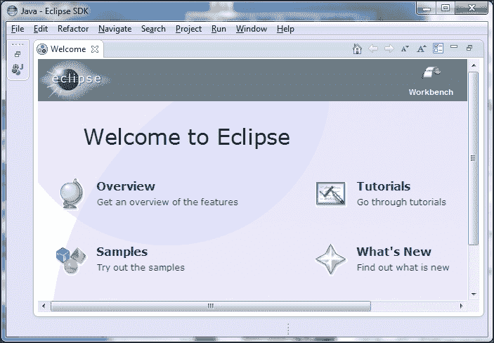

现在，我们应该看到一个包含几个面板的窗口，包括 **Package Explorer**。 如果不使用 TAPD，则需要将 OpenCV 示例项目导入到我们的新工作区中。 右键单击 **Package Explorer**，然后从上下文菜单中选择 **Import…**：


**导入**窗口应出现。 导航至**常规** | **现有项目进入工作区**，然后单击 **Next >**：

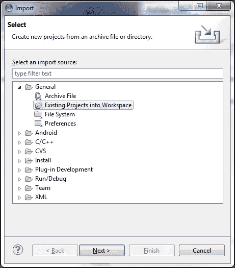

在**导入**窗口的第二页上，在的**选择根目录中输入`<opencv>`：**字段。 在**项目：**标签下，应显示检测到的项目的列表。 （如果没有，请单击 **Refresh**。）该列表应包括 OpenCV 库，示例和教程。 默认情况下应全部选中它们。

### 提示

**下载示例代码**

您可以从[这个页面](http://www.packtpub.com)上的帐户下载示例代码文件，以获取所有购买的 Packt Publishing 图书。 如果您在其他地方购买了此书，则可以访问[这个页面](http://www.packtpub.com/support)并注册以将文件直接通过电子邮件发送给您。

这意味着 Eclipse 已找到 OpenCV 库，示例和教程，并将其识别为 Eclipse 项目。 *不要*选择**将项目复制到工作区**，因为 OpenCV 示例和教程项目依赖于库项目的相对路径，并且该相对路径将不会保留 如果项目被复制到工作区中。 单击**完成**导入项目：

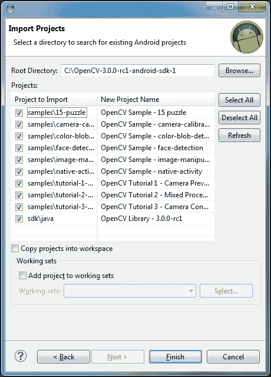

导入项目后，我们可能需要解决一些配置问题。 我们的开发环境可能与示例默认配置中的路径和 Android SDK 版本不同：

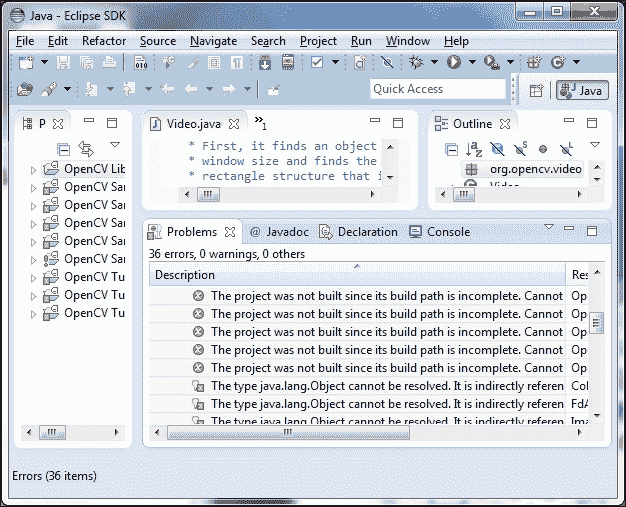

任何导致的错误将在**问题**选项卡中报告。 有关可能的解决方案，请参阅本章后面的*对 Eclipse 项目进行故障排除*。

### 提示

我们首先应该解决 **OpenCV 库**项目中的所有错误，因为示例和教程取决于该库。

一旦 OpenCV 项目不再显示任何错误，我们就可以准备在 Android 设备上对其进行测试。 回想一下，该设备必须装有 Android 2.2（Froyo）或更高版本以及一个摄像头。 要使 Eclipse 与设备通信，我们必须启用设备的 USB 调试选项。 在 Android 设备上，执行以下步骤：

1.  打开**设置**应用。
2.  在 Android 4.2 或更高版本上，转到**关于手机**或**关于平板电脑**部分，然后点击**内部版本号**七次。 此步骤启用**开发人员选项**部分。
3.  转到**开发人员选项**部分（在 Android 4.0 或更高版本上）或**应用程序** | **开发**部分（在 Android 3.2 或更低版本上）。 启用 **USB 调试**选项。

现在，我们需要安装一个名为 OpenCV Manager 3 的 Android 应用程序，该应用程序将在我们运行任何 OpenCV 应用程序时检查 OpenCV 库更新。 在撰写本文时，Play 商店尚未提供 OpenCV Manager 3。 但是，在我们的开发环境的`<opencv>/apk`文件夹中，我们可以找到各种体系结构的预构建应用程序捆绑包（`.apk`文件）。 选择名称与您的 Android 设备架构匹配的`.apk`文件。 在撰写本文时，ARMv7-A 是适用于 Android 设备的流行体系结构。 对于此体系结构，OpenCV 3.0 提供了`OpenCV_3.0.0_Manager_3.00_a.apk`文件。 打开命令提示符并输入如下命令，以通过 USB 将相应的`.apk`安装到您的 Android 设备上：

```java
$ adb install <opencv>/apk/OpenCV_3.0.0_Manager_3.00_armeabi-v7a.apk
```

如果安装成功，终端应打印`Success`。

### 提示

**支持 OpenCV 2.x 应用程序**

在撰写本文时， Play 商店包含仅支持 OpenCV 2.x 的较旧版本的 OpenCV Manager。 如果您要同时运行 OpenCV 2.x 和 OpenCV 3.x 应用程序，则可以从 Play 商店与 OpenCV Manager 3 一起安装此旧版本。它们不会冲突。

将 Android 设备插入计算机的 USB 端口。 在 Eclipse 中，在 **Package Explorer** 中选择一个 OpenCV 示例项目。 然后，从菜单系统导航至**。 **运行为…** | **Android 应用程序**：**

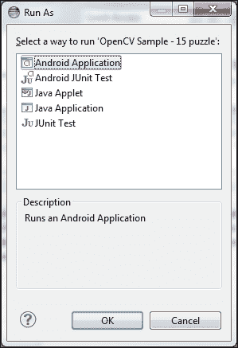

应显示 **Android 设备选择器**窗口。 您的 Android 设备应在**选择运行的 Android 设备**下列出。 如果未列出该设备，请参阅本章后面的*对 USB 连接进行故障排除*。

选择设备，然后单击 **OK**：

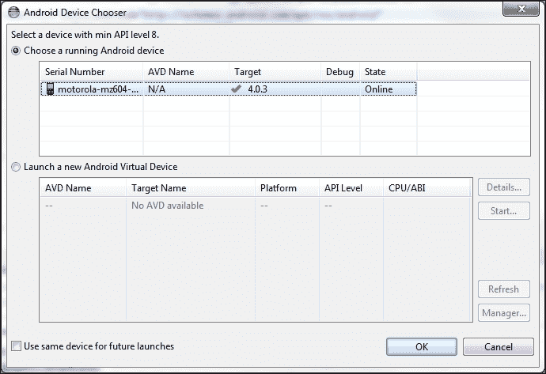

如果出现 **Auto Monitor Logcat** 窗口，则选择**是**单选按钮和**详细**下拉选项，然后单击 **OK**。 此选项确保在 Eclipse 中可见应用程序的所有日志输出：

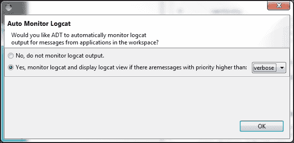

在 Android 设备上，您可能会收到一条消息：**OpenCV 库包未找到！ 尝试安装吗？** 确保设备已连接到 Internet，然后触摸设备上的**是**按钮。 Play 商店将打开以显示 OpenCV 软件包。 安装软件包，然后按硬件后退按钮以返回示例应用程序，该应用程序应已准备就绪。

对于 OpenCV 3.0，示例和教程具有以下功能：

*   **示例–15 个拼图**：此拆分了一个相机供稿，以制作一个滑块拼图。 用户可以滑动块以移动它们。
*   **样本色球检测**：此操作可检测相机 Feed 中的颜色区域。 用户可以触摸任何地方以查看颜色区域的轮廓。
*   **样本-面部检测**：这会在相机摘要中的面部周围绘制绿色矩形。
*   **样本图像处理**：这会将滤镜应用于相机源。 用户可以按 Android 菜单按钮从过滤器列表中进行选择。 例如，一个滤镜绘制一个颜色直方图（图像中存在的颜色的条形图），如以下屏幕截图的底部所示：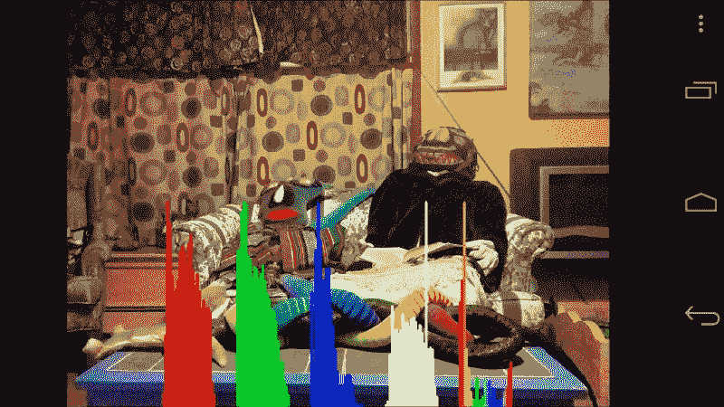
*   **示例-本机活动**：此使用本机（C ++）代码显示摄像机供稿。
*   **教程 1 –摄像机预览**：这将显示摄像机源。 用户可以按**…**菜单，选择，选择其他相机源实现（Java 或本机 C ++）。
*   **教程 2 –混合处理**：此使用本机（C ++）代码将滤镜应用于相机 Feed。 用户可以按**…**菜单从过滤器列表中进行选择。 过滤器之一在相机摘要中的兴趣点或要素周围绘制红色圆圈。 一般而言，兴趣点或特征位于图像的高对比度边缘上。 它们在图像识别和跟踪应用中可能很有用，我们将在本书的后面看到。
*   **教程 3 –摄像机控制**：这会将滤镜应用于具有可自定义分辨率的摄像机源。 用户可以按**…**菜单从过滤器列表和分辨率列表中进行选择。

在您的 Android 设备上尝试这些应用程序！ 当应用程序运行时，其日志输出应出现在 Eclipse 的 **LogCat** 选项卡中：

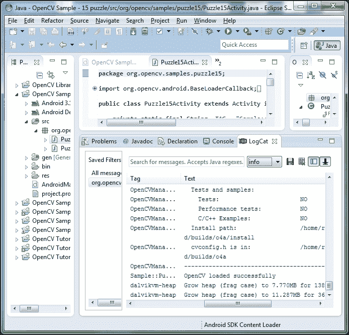

可以通过**包浏览器**到随意浏览项目的源代码，以了解它们的制作方式。 另外，一旦我们在本书的过程中构建了自己的应用程序，您可能希望稍后返回官方示例和教程。

# 对 Eclipse 项目进行故障排除

本部分与 Java 代码故障排除无关。 相反，它解决了 Eclipse 项目的配置和构建过程中的一些常见问题。 在使用 OpenCV 库，OpenCV 示例项目，其他导入的项目甚至您自己的新项目时，您可能会遇到这些问题。

有时，Eclipse 在项目或其依赖项之一已更改之后（或在导入依赖项之后）无法识别需要重建项目。 如有疑问，请尝试导航至**项目** |清理所有项目。 **清洁…** | **清理所有项目** | **在菜单系统中单击**。 这将迫使 Eclipse 重新构建所有内容，从而确保所有错误，警告和成功信息都是最新的。

如果一组清理的项目仍然存在神秘错误，则可能是配置问题。

可能未正确指定目标 Android 版本。 症状是从`java`和`android`程序包导入失败，并且出现诸如**之类的错误消息该项目由于其构建路径不完整**而未构建。 解决方案是右键单击 **Package Explorer** 中的项目，从上下文菜单中选择**属性**，选择 **Android** 部分，然后选中其中一个 Android 版本。 所有项目都应重复这些步骤。

在编译时，OpenCV 及其示例必须针对 Android 3.0（API 级别 11）或更高版本，尽管在运行时它们还支持 Android 2.2（API 级别 8）或更高版本：

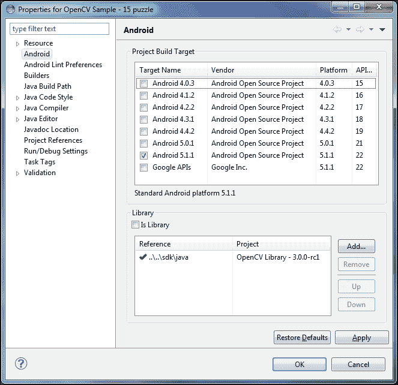

如果在 Mac 或 Linux 上导入，则 OpenCV C ++示例可能被错误配置为使用 Windows 构建可执行文件。 症状是在路径中找不到诸如**程序“ /ndk-build.cmd”之类的错误消息。 解决方案是右键单击 **Package Explorer** 中的项目，从上下文菜单中选择**属性**，选择 **C / C ++ Build** 部分，然后编辑**生成命令：**字段用于删除`.cmd`扩展名。 对于所有本机（C ++）项目，应重复这些步骤，包括 **OpenCV 示例–人脸检测**和 **OpenCV 教程 2-混合处理**：**

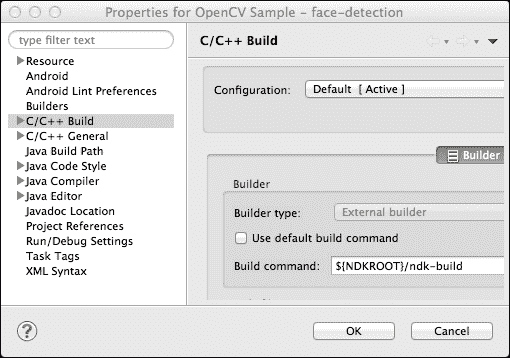

如果我们仍然收到，但未在 PATH 中找到错误消息，例如**程序“ /ndk-build.cmd”，则可以得出结论，Eclipse 无法识别`NDKROOT`环境变量。 作为依赖环境变量的替代方法，我们可以将`NDKROOT`作为 Eclipse 构建变量添加到 **Eclipse** | **首选项** | **C / C ++** | **构建** | **构建变量**。 （这些首选项在 Eclipse 项目之间共享。）作为变量的类型，选择 **String**，并输入其 NDK 路径（我们以前将其称为`<android_ndk>`）作为其值：**


# 对 USB 连接进行故障排除

如果您的 Android 设备未出现在 Eclipse 的 **Android 设备选择器**窗口中，或者如果`adb`命令在命令提示符下失败，则 USB 连接可能有问题。 具体来说，通过称为 **Android 调试桥**（**ADB**）的工具来控制与 Android 设备的 USB 通信，而该工具（或连接的其他某些组件）可能不会 如预期般运作。 在本节中尝试可能的解决方案。

### 注意

要验证 USB 连接是否正常工作，请在命令提示符下运行以下命令：

```java
$ adb devices

```

如果连接正常，终端应打印您所连接的 Android 设备的序列号和名称，例如`019d86b921300c7c device`

许多连接问题是间歇性的，可以通过将 USB 连接恢复到初始状态来解决。 请尝试以下步骤，并在每个步骤之后测试问题是否得到解决：

1.  从主机的 USB 端口上拔下 Android 设备。 然后，将其重新插入。
2.  禁用并重新启用设备的 **USB 调试**选项，如先前在*部分中所述，使用 Eclipse* 构建 OpenCV 示例。
3.  在 Mac 或 Linux 上，在终端（或另一个命令提示符）中运行以下命令：

    ```java
    sudo sh -c "adb kill-server && start-server"

    ```

较不常见的是，连接问题可能与驱动程序或权限有关。 如下所述，一次性设置过程应解决此类问题。

在 Windows 上，我们可能需要手动为 Android 设备安装 USB 驱动程序。 不同的供应商和设备具有不同的驱动程序。 Android 的官方文档在[这个页面](http://developer.android.com/tools/extras/oem-usb.html#Drivers)上提供了各个供应商的驱动程序下载站点的链接。

在 Linux 上，通过 USB 连接 Android 设备之前，我们可能需要在权限文件中指定设备的供应商。 每个供应商都有唯一的 ID 号，如[这个页面](http://developer.android.com/tools/device.html#VendorIds)上的官方 Android 文档中所列。 我们将此 ID 号称为`<vendor_id>`。 要创建权限文件，请打开命令提示符应用程序（例如 Terminal）并运行以下命令：

```java
$ cd /etc/udev/rules.d/
$ sudo touch 51-android.rules
$ sudo chmod a+r 51-android-rules

```

请注意，权限文件需要具有 root 所有权，因此我们在创建或修改它时使用`sudo`。 现在，在诸如 gedit 之类的编辑器中打开文件：

```java
$ sudo gedit 51-android-rules

```

对于每个供应商，在文件中追加一行。 这些行中的每一行都应具有以下格式：

```java
SUBSYSTEM=="usb", ATTR{idVendor}=="<vendor_id>", MODE="0666", GROUP="plugdev"

```

保存权限文件并退出编辑器。 重启。

在 Mac 上，不需要特殊的驱动程序或权限。

# 查找文档和帮助

OpenCV Java API 和 C ++ API 都与 Android 相关。 Java API 文档在线发布于[这个页面](http://docs.opencv.org/java/)，OpenCV4Android 资源索引在线发布于[这个页面](http://opencv.org/platforms/android.html)。 [C++ API 文档在线发布](http://docs.opencv.org/)。 以下文档（主要使用 C ++代码）也可作为可下载的 PDF 文件提供：

*   [API 参考](http://docs.opencv.org/opencv2refman.pdf)
*   [教程](http://docs.opencv.org/opencv_tutorials.pdf)
*   [用户指南（不完整）](http://docs.opencv.org/opencv_user.pdf)

如果文档似乎无法回答您的问题，请尝试与 OpenCV 社区联系。 在一些网站上，您会找到有用的人：

*   [OpenCV 官方论坛](http://www.answers.opencv.org/questions/)
*   [Jay Rambhia 的博客](http://jayrambhia.wordpress.com/)
*   [我的 OpenCV 书籍的支持网站](http://nummist.com/opencv/)

另外，您可以在[这个页面](http://code.opencv.org/projects/opencv/issues?query_id=4)上阅读或提交错误报告。 最后，如果您需要将问题提交给最高权限，则可以通过`<[android@opencv.org](mailto:android@opencv.org)>`向 OpenCV4Android 开发人员发送电子邮件。

# 摘要

到目前为止，我们应该拥有一个 Android 和 OpenCV 开发环境，该环境可以完成本书其余各章中描述的应用程序所需的一切。 根据我们采用的方法，我们可能还会有一组工具，可用于重新配置和重建 OpenCV，以满足未来的需求。

我们知道如何在 Eclipse 中构建 OpenCV Android 示例。 这些示例涵盖了本书项目的不同功能范围，但它们可作为其他学习辅助工具使用。 我们也知道在哪里可以找到文档和帮助。

现在我们已经掌握了必要的工具和参考资料，作为应用程序开发人员，我们的首要目标是控制相机！ 在下一章中，我们将使用 Android SDK 和 OpenCV 预览，捕获和共享照片。