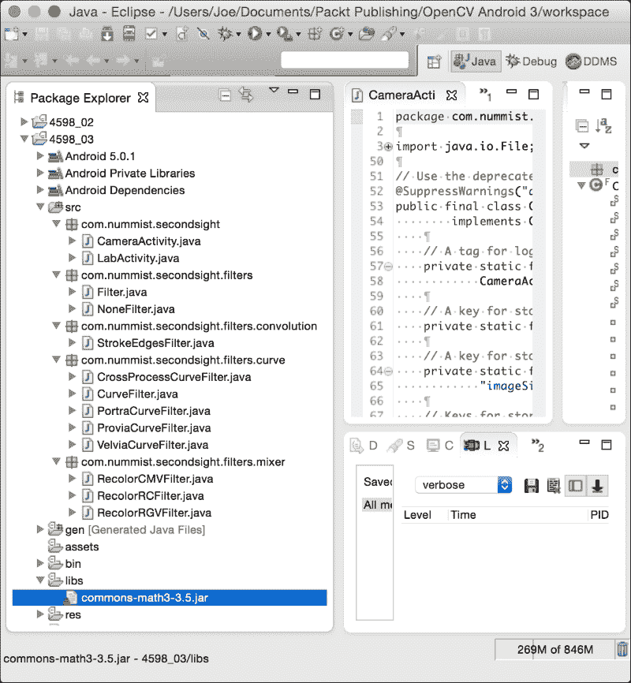
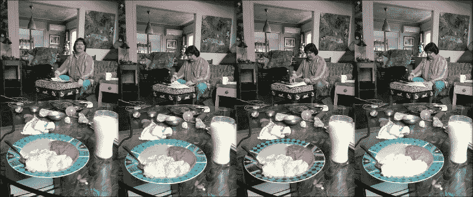
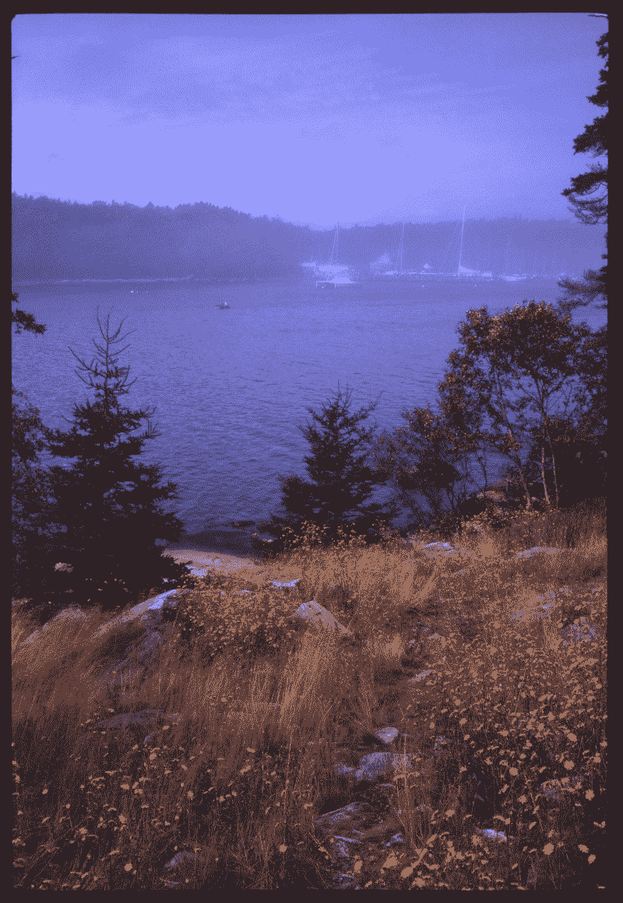
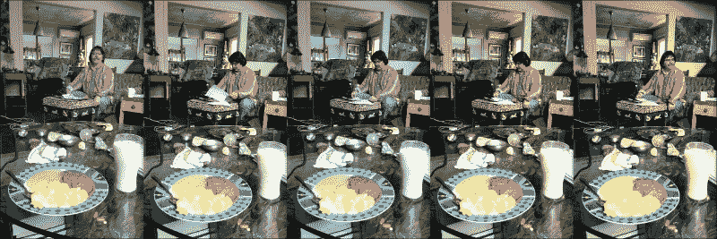
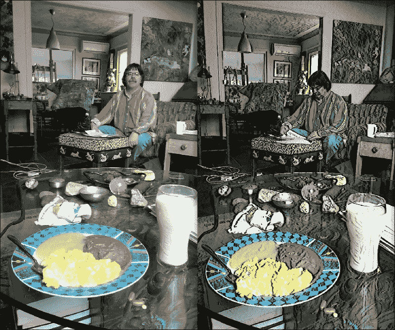

# 第 3 章。应用图像效果

对于本章，我们的目标是向 Second Sight 添加几个图像过滤器。 这些过滤器依靠各种 OpenCV 函数通过拆分，合并，算术运算或为复杂函数应用查找表来操纵矩阵。 某些过滤器还依赖于名为 **Apache Commons Math** 的数学库。

### 注意

可以从作者的网站下载本章的完整 Eclipse 项目。 该项目有两个版本：

OpenCV 3.x 的版本位于[这个页面](http://nummist.com/opencv/4598_03.zip)。

OpenCV 2.x 的版本位于[这个页面](http://nummist.com/opencv/5206_03.zip)。

# 将文件添加到项目

我们需要向 Eclipse 项目中添加几个文件，以便创建新的类型（接口和类），并需要链接到新库 Apache Commons Math。 以下是我们要创建的新类型：

*   `com.nummist.secondsight.filters.Filter`：这是代表可以将应用于图像的过滤器的界面。
*   `com.nummist.secondsight.filters.NoneFilter`：这是一个类，它表示不执行的过滤器。 它实现了`Filter`接口。
*   `com.nummist.secondsight.filters.convolution.StrokeEdgesFilter`：这是一个类别，其中表示在边缘区域顶部绘制粗黑线的过滤器。 它实现了`Filter`接口。
*   `com.nummist.secondsight.filters.curve.CurveFilter`：这是代表过滤器的类，该过滤器可以将单独的曲线变换应用于图像中的每个颜色通道。 （就像 Photoshop 或 GIMP 中的**曲线**一样。）它实现了`Filter`界面。
*   `com.nummist.secondsight.filters.curve.CrossProcessCurveFilter`：这是`CurveFilter`的子类。 它模拟了称为**交叉处理**的照相胶片处理技术。
*   `com.nummist.secondsight.filters.curve.PortraCurveFilter`：这是`CurveFilter`的子类。 它模仿了一个名为 Kodak Portra 的摄影胶片品牌。
*   `com.nummist.secondsight.filters.curve.ProviaCurveFilter`：这是`CurveFilter`的子类。 它模仿了一个名为 Fuji Provia 的摄影胶片品牌。
*   `com.nummist.secondsight.filters.curve.VelviaCurveFilter`：这是`CurveFilter`的子类。 它模仿了一个名为 Fuji Velvia 的摄影胶片品牌。
*   `com.nummist.secondsight.filters.mixer.RecolorCMVFilter`：这是一个类别，表示线性组合色彩通道的过滤器，从而使图像看起来像是由有限的青色，品红色和白色调色板混合而成。 （这类似于 Photoshop 或 GIMP 中**通道混合器**的特化。）它实现了`Filter`接口。
*   `com.nummist.secondsight.filters.mixer.RecolorRCFilter`：这是代表过滤器的类，该过滤器线性组合颜色通道，从而使图像看起来像是由有限的红色和青色调色板混合而成。 （这类似于 Photoshop 或 GIMP 中**通道混合器**的特化。）它实现了`Filter`接口。
*   `com.nummist.secondsight.filters.mixer.RecolorRGVFilter`: 此类代表表示线性组合颜色通道的过滤器，从而使图像看起来像是由有限的红色，绿色和白色调色板混合而成。 （这就像是 Photoshop 或 GIMP 中“通道混合器”的特化。）它实现了`Filter`接口。

    ### 注意

    Photoshop 和 **GNU 图像处理程序**（**GIMP**）是流行的图像编辑应用程序。 本书不需要它们，但是（可选）您可能想要尝试这种程序，以便可以在代码中实现图像处理效果之前对其进行实验。 Photoshop 是一种商业应用程序。 GIMP 是开源程序，可从[这个页面](http://www.gimp.org/downloads/)免费获得。

在**包浏览器**窗格的`src`目录下创建适当的软件包和 Java 文件。 （右键单击`src`目录，然后导航到**新建 | 包**，**新建 | 接口**或上下文菜单中的**新建 | 类**。）

现在，让我们获得 Apache Commons Math 库。 从[这个页面](http://commons.apache.org/proper/commons-math/download_math.cgi)下载最新版本。 解压缩下载的文件。 在解压缩的文件夹中，找到一个名称为`commons-math3-3.5.jar`的文件。 （版本号可能不同。）将此文件复制到 Eclipse 项目的`libs`文件夹中。

添加完所有必需的文件后，您的**包资源管理器**窗格应类似于以下屏幕快照中的一个：



## 定义过滤器接口

出于我们的目的，过滤器是可以应用于源图像和目标图像的任何转换。 （源和目标可能是同一张图像，也可能是不同的图像。）我们的应用程序需要互换使用过滤器，因此，对过滤器接口的定义进行形式化是一个好主意。 让我们编辑`Filter.java`，以使`Filter`接口定义如下：

```java
public interface Filter {
  public abstract void apply(final Mat src, final Mat dst);
}
```

就我们的应用而言，`apply`方法是我们的​​过滤器必须具有的唯一共同点。 其他所有内容都是实现细节。

`Filter`接口的最基本实现是`NoneFilter`类。 顾名思义，`NoneFilter`完全不进行过滤。 让我们实现它如下：

```java
public class NoneFilter implements Filter {
  @Override
  public void apply(final Mat src, final Mat dst) {
    // Do nothing.
  }
}
```

`NoneFilter`只是其他过滤器的便捷替代品。 当我们要关闭过滤但仍具有符合`Filter`接口的对象时，可以使用它。

# 混合颜色通道

正如我们在第 2 章和“处理相机帧”中看到的那样，OpenCV 将图像数据存储在类型为`Mat`的矩阵中，类似于多维数组。 行和列（分别由第一和第二索引指定）对应于图像中的 y 和 x 像素坐标。 元素是像素值。 像素值可以用一个数字（在灰度图像的情况下）或多个数字（在彩色图像的情况下）表示。 这些数字中的每一个都属于一个频道。 不透明的灰度图像只有一个通道值（亮度），缩写为 V。彩色图像可能具有多达四个通道，例如红色，绿色，蓝色和 alpha（透明度），它们构成了 **RGBA** 颜色模型。 彩色图像的其他有用模型包括 **RGB**（红色，绿色，蓝色），**HSV**（色相，饱和度，值），和 **YUV**（亮度，绿色与蓝色，绿色与红色）。 在本书中，我们重点介绍 RGB 和 RGBA 图像，但是 OpenCV 支持其他颜色模型和每种模型的各种数字格式。 如上一章所述，我们可以使用`Imgproc.cvtColor`静态方法在颜色格式之间进行转换。

如果我们将 RGB 图像矩阵的通道分开，则可以制作三个不同的灰度图像矩阵，每个矩阵都有一个通道。 然后，我们可以对这些单通道矩阵应用一些矩阵算法，并将结果合并以获得另一个 RGB 图像矩阵。 生成的 RGB 图像看起来好像是从其他调色板混合到原始图像。 该技术称为**通道混合**。 对于 RGB 图像，我们可以使用伪代码如下定义通道混合：

```java
dst.r = funcR(src.r, src.g, src.b)
dst.g = funcG(src.r, src.g, src.b)
dst.b = funcB(src.r, src.g, src.b)
```

这意味着目标图像中的每个通道都是源图像中任何或所有通道的函数。 我们不会将定义局限于任何特定类型的功能。 但是，让我们注意以下操作的视觉效果，在使用 RGB 图像时，这些效果非常有用：

*   平均值或加权平均值似乎会淡化输出通道。 例如，在伪代码中，如果`dst.b = 0.5 * src.r + 0.5 * src.b`，则本来是蓝色的图像区域会变成红色或紫色。
*   `min`操作似乎使输出通道去饱和。 例如，在伪代码中，如果`dst.b = min(src.r, src.g, src.b)`，则蓝色变为灰色。
*   `max`操作似乎使输出通道的互补色不饱和。 例如，在伪代码中，如果`dst.b = max(src.r, src.g, src.b)`，则黄色变为灰色。 （当我们处理 RGB 颜色模型时，黄色是蓝色的补码，换句话说，白色减去蓝色是黄色。）

考虑到这些影响，让我们看一下将用于生成它们的 OpenCV 功能。 OpenCV 的`Core`类提供所有相关功能作为静态方法。 `Core.split(Mat m, List<Mat> mv)`方法负责信道拆分。 它以源矩阵和目标矩阵列表作为参数。 将源中的每个通道复制到目标列表中的单通道矩阵中。 如有必要，将用新矩阵填充目标列表。

使用`Core.split`方法后，我们可以将矩阵运算应用于各个通道。 `Core.addWeighted(Mat src1, double alpha, Mat src2, double beta, double gamma, Mat dst)`方法可用于获取两个通道的加权平均值。 前四个参数是权重和源矩阵。 第五个参数是添加到结果中的常量。 最后一个参数是目标矩阵。 用伪代码`dst = alpha * src1 + beta * src2 + gamma`。

### 注意

通常，使用 OpenCV 中的方法，可以安全地传递目标矩阵，该目标矩阵也是源矩阵。 当然，在这种情况下，源矩阵中的值将被覆盖。 这称为**原地操作**。

`Core.min(Mat src1, Mat src2, Mat dst)`和`Core.max(Mat src1, Mat src2, Mat dst)`方法均采用一对源矩阵和一个目标矩阵。 这些方法执行每个元素的最小值或最大值。

最后，`Core.split`的倒数是`Core.merge(List<Mat> mv, Mat m)`。 我们可以使用它从分割的通道重新创建多通道图像。

为了研究信道混合的实际示例，我们打开`RecolorRCFilter.java`并编写该类的以下实现：

```java
public class RecolorRCFilter implements Filter {
  private final ArrayList<Mat> mChannels = new ArrayList<Mat>(4);
  @Override
  public void apply(final Mat src, final Mat dst) {
    Core.split(src, mChannels);
    final Mat g = mChannels.get(1);
    final Mat b = mChannels.get(2);
    // dst.g = 0.5 * src.g + 0.5 * src.b
    Core.addWeighted(g, 0.5, b, 0.5, 0.0, g);
    // dst.b = dst.g
    mChannels.set(2, g);
    Core.merge(mChannels, dst);
  }
}
```

该过滤器的作用是将绿色和蓝色变成青色，留下有限的红色和青色调色板。 它类似于某些旧电影和旧计算机游戏的调色板。

作为成员变量，`RecolorRCFilter`具有四个矩阵的列表。 每当调用`apply`方法时，此列表中就会填充源矩阵的四个通道。 （我们假设源矩阵和目标矩阵都有四个通道，以 RGBA 顺序排列。）我们获得绿色和蓝色通道（在列表中的索引`1`和`2`处），取它们的平均值，然后将结果分配回到相同的频道。 最后，我们将四个通道合并到目标矩阵中，该矩阵可能与源矩阵相同。

我们其他两个通道混合过滤器的代码相似，因此，为了节省时间，我们将省略大部分代码。 请注意，`RecolorRGVFilter`依赖于以下操作：

```java
    // dst.b = min(dst.r, dst.g, dst.b)
    Core.min(b, r, b);
    Core.min(b, g, b);
```

该过滤器的作用是使蓝色饱和，从而留下有限的红色，绿色和白色调色板。 它也类似于某些旧电影和旧计算机游戏的调色板。

同样，`RecolorCMVFilter`依赖于以下操作：

```java
    // dst.b = max(dst.r, dst.g, dst.b)
    Core.max(b, r, b);
    Core.max(b, g, b);
```

该过滤器的作用是使黄色去饱和，从而留下有限的青色，品红色和白色调色板。 尚无人使用此调色板制作电影（至今！），但对于 1980 年代的游戏玩家来说，这将是熟悉的景象。

以下屏幕截图带是我们的通道混合过滤器的比较。 从左到右，我们看到一个未过滤的图像，然后是用`RecolorRCFilter`，`RecolorRGFilter`和`RecolorCMVFilter`过滤的图像：



### 注意

这些通道混合过滤器之间的差异在黑白照片中并不明显。 有关彩色图像，请参阅电子书。

RGB 中的任意通道混合功能往往会产生粗体和风格化的效果，而不是微妙的效果。 这是我们这里的例子。 接下来，让我们看一下一系列过滤器，这些过滤器更易于参数化，以获得微妙，自然的结果。

# 通过曲线的细微的颜色偏移

在观看场景时，我们可能会从颜色在不同图像区域之间移动的方式中获得一些微妙的线索。 例如，在外面的晴天，由于从蓝天反射的环境光，阴影具有淡蓝色的色调，而高光部分则处于阳光直射下，因此具有淡黄色的色调。 当我们在照片中看到偏蓝的阴影和偏黄的高光时，我们可能会感到“温暖而阳光明媚”。 此效果可能是自然的，或者可能被过滤器放大了。

**曲线过滤器**对于此类操作非常有用。 曲线过滤器通过一组控制点进行参数设置。 例如，每个颜色通道可能有一组控制点。 每个控制点都是一对数字，代表给定通道的输入和输出值。 例如，对`(128, 180)`意味着给定颜色通道中的`128`的值变亮，成为`180`的值。 控制点之间的值沿曲线插值（因此，名称，曲线过滤器）。 在 GIMP 中，具有控制点`(0, 0)`，`(128, 180)`和`(255, 255)`的曲线是可视化的，如以下屏幕截图所示：


`x`轴显示输入值，范围从 0 到 255，而`y`轴显示相同范围内的输出值。 除了显示曲线外，该图还显示了`y = x`线（无变化）用于比较。

曲线插值有助于确保颜色过渡平滑而不突然。 因此，曲线过滤器使创建细微，自然的效果相对容易。 我们可以使用伪代码如下定义 RGB 曲线过滤器：

```java
dst.r = funcR(src.r) where funcR interpolates pointsR
dst.g = funcG(src.g) where funcG interpolates pointsG
dst.b = funcB(src.b) where funcB interpolates pointsB
```

现在，我们将使用 RGB 和 RGBA 曲线过滤器以及通道值范围从 0 到 255 的工作。如果我们希望这种曲线过滤器产生自然的结果，则应使用以下经验法则：

*   每组控制点都应包括`(0, 0)`和`(255, 255)`。 这样，黑色保持黑色，白色保持白色，并且图像似乎没有整体色调。
*   随着输入值的增加，输出值也应始终增加。 （它们的关系应该单调增加。）这样，阴影仍然是阴影，高光仍然是高光，并且图像似乎没有不一致的照明或对比度。

OpenCV 不提供曲线插值功能，但是 Apache Commons Math 库提供。 （有关设置 Apache Commons Math 的说明，请参阅本章前面的“向项目中添加文件”。）该库提供了名为`UnivariateInterpolator`和`UnivariateFunction`的接口，这些接口的实现包括`LinearInterpolator`， `SplineInterpolator`，`LinearFunction`和`PolynomialSplineFunction`。 （样条线是曲线的一种。）`UnivariateInterpolator`有一个实例方法`interpolate(double[] xval, double[] yval)`，该方法获取控制点的输入和输出值的数组并返回`UnivariateFunction`对象。 `UnivariateFunction`对象可以通过`value(double x)`方法提供内插值。

### 注意

可在[这个页面](http://commons.apache.org/proper/commons-math/apidocs/)上找到 Apache Commons Math 的 API 文档。

这些内插函数在计算上是昂贵的。 我们不想在每一帧中为每个像素的每个通道一次又一次地运行它们。 幸运的是，我们不必这样做。 每个通道只有 256 个可能的输入值，因此预先计算所有可能的输出值并将它们存储在**查找表**中是可行的。 出于 OpenCV 的目的，查找表是`Mat`对象，其索引表示输入值，而其元素表示输出值。 可以使用静态方法`Core.LUT(Mat src, Mat lut, Mat dst)`执行查找。 用伪代码`dst = lut[src]`。 `lut`中的元素数量应与`src`中值的范围相匹配，`lut`中的通道数应与`src`中的通道数相匹配。

现在，使用 Apache Commons Math 和 OpenCV，让为通道值范围从`0`到`255`的 RGBA 图像实现曲线过滤器。 打开`CurveFilter.java`并编写以下代码：

```java
public class CurveFilter implements Filter {
  // The lookup table.
  private final Mat mLUT = new MatOfInt();
  public CurveFilter(
    final double[] vValIn, final double[] vValOut,
    final double[] rValIn, final double[] rValOut,
    final double[] gValIn, final double[] gValOut,
    final double[] bValIn, final double[] bValOut) {
    // Create the interpolation functions.
    UnivariateFunction vFunc = newFunc(vValIn, vValOut);
    UnivariateFunction rFunc = newFunc(rValIn, rValOut);
    UnivariateFunction gFunc = newFunc(gValIn, gValOut);
    UnivariateFunction bFunc = newFunc(bValIn, bValOut);
    // Create and populate the lookup table.
    mLUT.create(256, 1, CvType.CV_8UC4);
    for (int i = 0; i < 256; i++) {
      final double v = vFunc.value(i);
      final double r = rFunc.value(v);
      final double g = gFunc.value(v);
      final double b = bFunc.value(v);
      mLUT.put(i, 0, r, g, b, i); // alpha is unchanged
    }
  }
  @Override
  public void apply(final Mat src, final Mat dst) {
    // Apply the lookup table.
    Core.LUT(src, mLUT, dst);
  }
  private UnivariateFunction newFunc(final double[] valIn,
    final double[] valOut) {
    UnivariateInterpolator interpolator;
    if (valIn.length > 2) {
      interpolator = new SplineInterpolator();
    } else {
      interpolator = new LinearInterpolator();
    }
    return interpolator.interpolate(valIn, valOut);
  }
}
```

`CurveFilter`将查找表存储在成员变量中。 构造函数方法根据作为参数的四组控制点填充查找表。 为了方便起见，除了每个 RGB 通道的一组控制点之外，构造函数还为图像的整体亮度采用了一组控制点。 辅助方法`newFunc`为每组控制点创建一个适当的插值函数（线性或样条曲线）。 然后，我们遍历可能的输入值并填充查找表。

`apply`方法是单线的。 它只是将预计算的查找表与给定的源矩阵和目标矩阵一起使用。

可以在子类中扩展`CurveFilter`，以定义具有一组特定控制点的过滤器。 例如，让我们打开`PortraCurveFilter.java`并编写以下代码：

```java
public class PortraCurveFilter extends CurveFilter {
  public PortraCurveFilter() {
    super(
      new double[] { 0, 23, 157, 255 }, // vValIn
      new double[] { 0, 20, 173, 255 }, // vValOut
      new double[] { 0, 69, 213, 255 }, // rValIn
      new double[] { 0, 69, 218, 255 }, // rValOut
      new double[] { 0, 52, 189, 255 }, // gValIn
      new double[] { 0, 47, 196, 255 }, // gValOut
      new double[] { 0, 41, 231, 255 }, // bValIn
      new double[] { 0, 46, 228, 255 }); // bValOut
  }
}
```

此过滤器可以增亮图像，使阴影更冷（更蓝），并使高光更暖（更黄）。 它会产生讨人喜欢的肤色，并趋于使事物看起来更加阳光和清洁。 它类似于通常用于人像拍摄的柯达摄影胶片品牌的色彩特征。

我们其他三个通道混合过滤器的代码相似。 `ProviaCurveFilter`类对其控制点使用以下参数：

```java
      new double[] { 0, 255 }, // vValIn
      new double[] { 0, 255 }, // vValOut
      new double[] { 0, 59, 202, 255 }, // rValIn
      new double[] { 0, 54, 210, 255 }, // rValOut
      new double[] { 0, 27, 196, 255 }, // gValIn
      new double[] { 0, 21, 207, 255 }, // gValOut
      new double[] { 0, 35, 205, 255 }, // bValIn
      new double[] { 0, 25, 227, 255 }); // bValOut
```

此过滤器的作用是增加阴影和高光之间的对比度，并在大多数色调中使图像稍微凉一点（带蓝色）。 天空，水和阴影比太阳更突出。 它类似于一个名为 Fuji Provia 的摄影胶片品牌，该胶片通常用于风景拍摄。 例如，下面的照片是在 Provia 胶片上拍摄的，该胶片在其他阳光明媚的场景中突显了蓝色，雾蒙蒙的背景：



`VelviaCurveFilter`类使用以下参数作为其控制点：

```java
      new double[] { 0, 128, 221, 255 }, // vValIn
      new double[] { 0, 118, 215, 255 }, // vValOut
      new double[] { 0, 25, 122, 165, 255 }, // rValIn
      new double[] { 0, 21, 153, 206, 255 }, // rValOut
      new double[] { 0, 25, 95, 181, 255 }, // gValIn
      new double[] { 0, 21, 102, 208, 255 }, // gValOut
      new double[] { 0, 35, 205, 255 }, // bValIn
      new double[] { 0, 25, 227, 255 }); // bValOut
```

该过滤器的作用是产生深阴影和鲜艳的色彩。 它类似于一个名为 Fuji Velvia 的摄影胶片品牌，通常用于描绘风景，白天有蔚蓝的天空，日落时有深红色的云。 下一张照片是在 Velvia 胶片上拍摄的，在这个阳光明媚的场景中，我们可以看到 Velvia 独特的深阴影和蔚蓝的天空（或黑白印刷版中的板岩灰色天空）：


最后，`CrossProcessCurveFilter`类将以下参数用作其控制点：

```java
      new double[] { 0, 255 }, // vValIn
      new double[] { 0, 255 }, // vValOut
      new double[] { 0, 56, 211, 255 }, // rValIn
      new double[] { 0, 22, 255, 255 }, // rValOut
      new double[] { 0, 56, 208, 255 }, // gValIn
      new double[] { 0, 39, 226, 255 }, // gValOut
      new double[] { 0, 255 }, // bValIn
      new double[] { 20, 235 }); // bValOut
```

效果是阴影中的颜色为深蓝色或绿蓝色，高光中的颜色为深黄色或绿黄色。 它类似于一种称为交叉处理的胶片处理技术，该技术有时用于生成时装模特，流行歌手等的，脚照片。

### 注意

有关如何模拟摄影胶片的各个品牌的良好讨论，请参阅 [Petteri Sulonen 的博客](http://www.prime-junta.net/pont/How_to/100_Curves_and_Films/_Curves_and_films.html)。 我们使用的控制点基于本文给出的示例。

以下屏幕截图展示了我们的曲线过滤器。 有些差异是细微的。 从左到右，我们看到一个未过滤的图像，然后是用`PortraCurveFilter`，`ProviaCurveFilter`，`VelviaCurveFilter`和`CrossProcessCurveFilter`过滤的图像：



### 注意

这些曲线过滤器之间的差异在黑白打印中并不明显。 有关彩色图像，请参阅电子书。

曲线过滤器是用于操纵颜色和对比度的便捷工具，但是它们受到限制，因为每个目标像素仅受单个输入像素的影响。 接下来，我们将研究更灵活的过滤器系列，这些过滤器可以使每个目标像素受到输入像素邻域的影响。

# 使用卷积过滤器混合像素

对于卷积过滤器，每个输出像素处的通道值是输入像素附近的相应通道值的加权平均值。 我们可以将权重放在称为**卷积矩阵**或**核**的矩阵中。 例如，考虑以下内核：

```java
{{ 0, -1,  0},
 {-1,  4, -1},
 { 0, -1,  0}}
```

中心元素是具有与目标像素相同索引的源像素的权重。 其他元素表示输入像素附近其他部分的权重。 在这里，我们正在考虑一个`3 x 3`的社区。 但是，OpenCV 支持具有任何平方和奇数尺寸的内核。 这个特定的内核是一种边缘查找过滤器，称为**拉普拉斯**过滤器。 对于纯色邻域（无对比度），它将产生黑色输出像素。 对于高对比度的邻域，可能会产生明亮的输出像素。

让我们考虑另一个内核，其中心元素大 1：

```java
{{ 0, -1,  0},
 {-1,  5, -1},
 { 0, -1,  0}}
```

这等效于获取拉普拉斯过滤器的结果，然后将其添加到原始图像中。 代替边缘查找，我们得到边缘锐化。 即，边缘区域变亮，而图像的其余部分保持不变。

### 提示

**当心大核**

内核越大，计算越昂贵。 大于`5 x 5`（每个输出像素 25 个输入像素）的内核对于当今在典型的 Android 设备上处理实时高清视频可能不切实际。

OpenCV 为使用某些流行内核的卷积过滤器提供了许多静态方法。 以下是一些示例：

*   `Imgproc.blur(Mat src, Mat dst, Size ksize)`：这通过对尺寸`ksize`的邻域进行简单的平均来模糊图像。 例如，如果`ksize`为`new Size(5, 5)`，则内核如下：

    ```java
    {{0.04, 0.04, 0.04, 0.04, 0.04},
     {0.04, 0.04, 0.04, 0.04, 0.04},
     {0.04, 0.04, 0.04, 0.04, 0.04},
     {0.04, 0.04, 0.04, 0.04, 0.04},
     {0.04, 0.04, 0.04, 0.04, 0.04}}
    ```

*   `Imgproc.Laplacian(Mat src, Mat dst, int ddepth, int ksize, double scale, double delta)`：这是拉普拉斯边缘查找过滤器，如先前所述。 结果与常数（`scale`参数）相乘，然后加到另一个常数（`delta`参数）上。
*   `Imgproc.Scharr(Mat src, Mat dst, int ddepth, int dx, int dy, double scale, double delta)`：这是一个 Scharr 寻边过滤器。 与拉普拉斯过滤器不同，Scharr 过滤器仅查找沿特定方向延伸的边缘，即垂直（如果`dx`为 1 且`dy`为 0）或水平（如果`dx`为 0 且`dy`为 1）的边缘。 对于垂直边缘检测，内核如下：

    ```java
    {{ -3,  0,   3},
     {-10,  0,  10},
     { -3,  0,   3}}
    ```

    同样，对于水平边缘检测，Scharr 内核如下：

    ```java
    {{ -3, -10, -3},
     {  0,   0,  0},
     {  3,  10,  3}}
    ```

而且，OpenCV 提供了一个静态方法`Imgproc.filter2D(Mat src, Mat dst, int ddepth, Mat kernel)`，它使我们能够指定自己的内核。 出于学习目的，我们将采用这种方法。 `ddepth`参数确定目标数据的数字类型。 该参数可以是以下任意一个：

*   `-1`：这表示与源相同的数字类型。
*   `CvType.CV_16S`：代表 16 位有符号整数。 源必须是 8 位带符号整数。
*   `CvType.CV_32F`：这表示 32 位浮点数。
*   `CvType.CV_64F`：这表示 64 位浮点数。 源也必须是 64 位浮点数。

    ### 注意

    有关上述所有过滤器功能的更多信息，请参见 OpenCV 的`Imgproc`模块的主要文档，位于[这个页面](http://docs.opencv.org/java/org/opencv/imgproc/Imgproc.html)。 本文档包括过滤器的数学描述。 另请参阅[`Imgproc`的官方教程](http://docs.opencv.org/doc/tutorials/imgproc/table_of_content_imgproc/table_of_content_imgproc.html)，其中提供了涵盖各种过滤器的示例。

    有关`CvType`成员的更多信息，请参见[这个页面](http://docs.opencv.org/java/org/opencv/core/CvType.html)上的相关 Javadoc。

让我们将卷积过滤器用作更复杂的过滤器的一部分，该过滤器在图像边缘区域的顶部绘制粗黑线。 为了达到这种效果，我们还依赖于 OpenCV 的另外两种静态方法：

*   `Core.bitwise_not(Mat src, Mat dst)`：此方法反转图像的亮度和颜色，以使白色变为黑色，红色变为青色，依此类推。 这对我们很有用，因为我们的卷积过滤器会在黑场上产生白色边缘，而我们希望在白场上产生相反的黑色边缘。
*   `Core.multiply(Mat s, Mat src2, Mat dst, double scale)`：此方法通过将一对图像的值相乘在一起来混合它们。 结果值由常量（`scale`参数）缩放。 例如，`scale`可用于将乘积标准化为`[0, 255]`范围。 出于我们的目的，`Core.multiply`可用于在原始图像上叠加黑色边缘。

以下是`StrokeEdgesFilter`中变黑边缘效果的实现：

```java
public class StrokeEdgesFilter implements Filter {
  private final Mat mKernel = new MatOfInt(
    0, 0,   1, 0, 0,
    0, 1,   2, 1, 0,
    1, 2, -16, 2, 1,
    0, 1,   2, 1, 0,
    0, 0,   1, 0, 0
  );
  private final Mat mEdges = new Mat();
  @Override
  public void apply(final Mat src, final Mat dst) {
    Imgproc.filter2D(src, mEdges, -1, mKernel);
    Core.bitwise_not(mEdges, mEdges);
    Core.multiply(src, mEdges, dst, 1.0/255.0);
  }
}
```

### 注意

有关`Mat`及其子类（例如`MatOfInt`）的更多信息，请参见[`Mat` Javadoc](http://docs.opencv.org/java/org/opencv/core/Mat.html)。

下面的对屏幕截图是未过滤图像（左）与用`StrokeEdgesFilter`过滤图像（右）之间的比较：



接下来，让我们添加一个用于启用和禁用所有过滤器的用户界面。

# 将过滤器添加到`CameraActivity`

我们将使用户可以随时激活多达个通道混合过滤器，一个曲线过滤器和一个卷积过滤器。 对于每个过滤器类别，我们将提供一个菜单按钮，使用户可以循环浏览可用的过滤器或不使用过滤器。

让我们开始编辑相关的资源文件，以定义菜单按钮及其文本。 我们应该在`res/values/strings.xml`中添加以下字符串：

```java
<string name="menu_next_curve_filter">Next Curve</string>
<string name="menu_next_mixer_filter">Next Mixer</string>
<string name="menu_next_convolution_filter">Next Kernel</string>
```

然后，我们应如下编辑`res/menu/activity_camera.xml`：

```java
<menu xmlns:android="http://schemas.android.com/apk/res/android">
  <item
    android:id="@+id/menu_next_curve_filter"
    app:showAsAction="ifRoom|withText"
    android:title="@string/menu_next_curve_filter" />
  <item
    android:id="@+id/menu_next_mixer_filter"
    app:showAsAction="ifRoom|withText"
    android:title="@string/menu_next_mixer_filter" />
  <item
    android:id="@+id/menu_next_convolution_filter"
    app:showAsAction="ifRoom|withText"
    android:title="@string/menu_next_convolution_filter" />
  <item
    android:id="@+id/menu_next_camera"
    app:showAsAction="ifRoom|withText"
    android:title="@string/menu_next_camera" />
  <item
    android:id="@+id/menu_take_photo"
    app:showAsAction="always|withText"
    android:title="@string/menu_take_photo" />
</menu>
```

为了存储有关可用过滤器和选定过滤器的信息，我们需要在`CameraActivity`中添加几个新变量。 可用的过滤器只是`Filter[]`阵列。 通过将整数与 Android `Bundle`对象进行串行化和反序列化（保存和恢复），可以按照与选定相机设备的索引相同的方式存储选定过滤器的索引。 以下是我们必须添加到`CameraActivity`的变量声明：

```java
// Keys for storing the indices of the active filters.
private static final String STATE_CURVE_FILTER_INDEX =
  "curveFilterIndex";
private static final String STATE_MIXER_FILTER_INDEX =
  "mixerFilterIndex";
private static final String STATE_CONVOLUTION_FILTER_INDEX =
  "convolutionFilterIndex";
// The filters.
private Filter[] mCurveFilters;
private Filter[] mMixerFilters;
private Filter[] mConvolutionFilters;
// The indices of the active filters.
private int mCurveFilterIndex;
private int mMixerFilterIndex;
private int mConvolutionFilterIndex;
```

由于我们的`Filter`实现依赖于 OpenCV 中的类，因此在加载 OpenCV 库之前，无法实例化它们。 因此，我们的`BaseLoaderCallback`对象负责初始化`Filter[]`数组。 我们应该对其进行如下编辑：

```java
private BaseLoaderCallback mLoaderCallback =
  new BaseLoaderCallback(this) {
  @Override
  public void onManagerConnected(final int status) {
    switch (status) {
    case LoaderCallbackInterface.SUCCESS:
      Log.d(TAG, "OpenCV loaded successfully");
      mCameraView.enableView();
      mBgr = new Mat();
      mCurveFilters = new Filter[] {
        new NoneFilter(),
        new PortraCurveFilter(),
        new ProviaCurveFilter(),
        new VelviaCurveFilter(),
        new CrossProcessCurveFilter()
      };
      mMixerFilters = new Filter[] {
        new NoneFilter(),
        new RecolorRCFilter(),
        new RecolorRGVFilter(),
        new RecolorCMVFilter()
      };
      mConvolutionFilters = new Filter[] {
        new NoneFilter(),
        new StrokeEdgesFilter()
      };
      break;
    default:
      super.onManagerConnected(status);
      break;
    }
  }
};
```

`onCreate`方法可以初始化所选的过滤器索引，或从`savedInstanceState`参数加载。 让我们如下编辑方法：

```java
protected void onCreate(final Bundle savedInstanceState) {
  super.onCreate(savedInstanceState);
  final Window window = getWindow();
  window.addFlags(
    WindowManager.LayoutParams.FLAG_KEEP_SCREEN_ON);
  if (savedInstanceState != null) {
    mCameraIndex = savedInstanceState.getInt(
      STATE_CAMERA_INDEX, 0);
    mImageSizeIndex = savedInstanceState.getInt(
      STATE_IMAGE_SIZE_INDEX, 0);
    mCurveFilterIndex = savedInstanceState.getInt(
      STATE_CURVE_FILTER_INDEX, 0);
    mMixerFilterIndex = savedInstanceState.getInt(
      STATE_MIXER_FILTER_INDEX, 0);
    mConvolutionFilterIndex = savedInstanceState.getInt(
      STATE_CONVOLUTION_FILTER_INDEX, 0);
  } else {
    mCameraIndex = 0;
    mImageSizeIndex = 0;
    mCurveFilterIndex = 0;
    mMixerFilterIndex = 0;
    mConvolutionFilterIndex = 0;
  }
  // ...
}
```

同样，`onSaveInstanceState`方法应将选定的过滤器索引保存到`savedInstanceState`参数中。 让我们如下编辑方法：

```java
public void onSaveInstanceState(Bundle savedInstanceState) {
  // Save the current camera index.
  savedInstanceState.putInt(STATE_CAMERA_INDEX, mCameraIndex);
  // Save the current image size index.
  savedInstanceState.putInt(STATE_IMAGE_SIZE_INDEX,
    mImageSizeIndex);
  // Save the current filter indices.
  savedInstanceState.putInt(STATE_CURVE_FILTER_INDEX,
    mCurveFilterIndex);
  savedInstanceState.putInt(STATE_MIXER_FILTER_INDEX,
    mMixerFilterIndex);
  savedInstanceState.putInt(STATE_CONVOLUTION_FILTER_INDEX,
    mConvolutionFilterIndex);
  super.onSaveInstanceState(savedInstanceState);
}
```

为了使每个新菜单都起作用，我们只需要添加一些样板代码即可更新相关的过滤器索引。 让我们如下编辑`onOptionsItemSelected`方法：

```java
public boolean onOptionsItemSelected(final MenuItem item) {
  if (mIsMenuLocked) {
    return true;
  }
  if (item.getGroupId() == MENU_GROUP_ID_SIZE) {
    mImageSizeIndex = item.getItemId();
    recreate();
    return true;
  }
  switch (item.getItemId()) {
  case R.id.menu_next_curve_filter:
    mCurveFilterIndex++;
    if (mCurveFilterIndex == mCurveFilters.length) {
      mCurveFilterIndex = 0;
    }
    return true;
  case R.id.menu_next_mixer_filter:
    mMixerFilterIndex++;
    if (mMixerFilterIndex == mMixerFilters.length) {
      mMixerFilterIndex = 0;
    }
    return true;
  case R.id.menu_next_convolution_filter:
    mConvolutionFilterIndex++;
    if (mConvolutionFilterIndex ==
      mConvolutionFilters.length) {
      mConvolutionFilterIndex = 0;
    }
    return true;
  // ...
  default:
    return super.onOptionsItemSelected(item);
  }
}
```

现在，在`onCameraFrame`回调方法中，我们应该将每个选定的过滤器应用于图像。 以下是新的实现：

```java
public Mat onCameraFrame(final CvCameraViewFrame inputFrame) {
  final Mat rgba = inputFrame.rgba();
  // Apply the active filters.
  mCurveFilters[mCurveFilterIndex].apply(rgba, rgba);
  mMixerFilters[mMixerFilterIndex].apply(rgba, rgba);
  mConvolutionFilters[mConvolutionFilterIndex].apply(
    rgba, rgba);
  if (mIsPhotoPending) {
    mIsPhotoPending = false;
    takePhoto(rgba);
  }
  if (mIsCameraFrontFacing) {
    // Mirror (horizontally flip) the preview.
    Core.flip(rgba, rgba, 1);
  }
  return rgba;
}
```

就这样！ 运行该应用程序，选择过滤器，拍摄一些照片并共享。 作为应用外观的示例，下面是启用`PortraCurveFilter`，`RecolorRCFilter`和`StrokeEdgesFilter`的屏幕截图：


### 注意

记住要查看`...`菜单下的更多选项，包括**下个核**和**大小**。

请注意，由于使用了`StrokeEdgesFilter`的，猫的的皱纹显得非常暗。 另外，如果您正在查看彩色图像（在电子书中），请注意，由于使用`RecolorRCFilter`，姜猫和黄色沙发都带有淡红色调，而背景中的叶子则带有青色调。

# 总结

Second Sight 现在具有一些功能，而不仅仅是读取和共享相机数据更有趣。 可以选择几个过滤器并将其组合在一起，以使我们的照片具有风格化或复古的外观。 这些过滤器也足够有效地应用于实时视频，因此我们在预览模式和保存的照片中使用它们。

尽管照片过滤器很有趣，但它们只是 OpenCV 的最基本用途。 在我们可以真正说出我们已经制作了一个计算机视觉应用程序之前，我们需要根据所看到的内容使该应用程序做出不同的响应。 该目标将是下一章的重点。