# OpenCV 和 Qt 简介

在最基本的形式和形状中，“计算机视觉”是一个术语，用于标识用于使数字设备具有视觉感觉的所有方法和算法。 这意味着什么？ 好吧，这就是听起来的确切含义。 理想情况下，计算机应该能够通过标准相机（或与此相关的任何其他类型的相机）的镜头看到世界，并且通过应用各种计算机视觉算法，它们应该能够检测甚至识别并计数人脸。 图像中的对象，检测视频馈送中的运动，然后执行更多操作，这些操作乍一看只能是人类的期望。 因此，要了解 Computer Vision 的真正含义，最好知道 Computer Vision 旨在开发方法以实现所提到的理想，使数字设备具有查看和理解周围环境的能力。 值得注意的是，大多数时间计算机视觉和图像处理可以互换使用（尽管对这个主题的历史研究可能证明应该相反）。 但是，尽管如此，在整本书中，我们仍将使用“计算机视觉”一词，因为它是当今计算机科学界中更为流行和广泛使用的术语，并且因为正如我们将在本章稍后看到的那样，“图像处理”是 我们还将在本章的后续页面中介绍 OpenCV 库，并且还将在其完整的一章中介绍它。

计算机视觉是计算机科学中当今最受欢迎的学科之一，它被用于各种应用程序，从检测癌变组织的医疗工具到可以帮助制作所有闪亮音乐视频和电影的视频编辑软件，以及军事级目标检测器 可帮助在地图上找到交通标志检测器的特定位置，以帮助无人驾驶汽车找到路。 好吧，很显然，我们无法完成为 Computer Vision 命名的所有可能性，但是我们可以确定，这是一个有趣的话题，并且将会存在很长时间。 还值得一提的是，计算机视觉领域的工作和职业市场正在迅速扩大，并且它正在日趋增长。

在 Computer Vision 开发人员和专家使用的最受欢迎的工具中，有两个最著名的开源社区框架，OpenCV 和 Qt 也在您的书名中。 每天，世界各地成千上万的开发人员，从成熟的公司到创新的初创公司，都使用这两个框架为各种行业（例如，我们提到的行业）构建应用程序，这正是您将学到的东西。 这本书。

在本章中，我们将介绍以下主题：

*   引入 Qt，这是一个开放源代码和跨平台的应用程序开发框架
*   引入 OpenCV，一个开源的跨平台计算机视觉框架
*   如何在 Windows，macOS 和 Linux 操作系统上安装 Qt
*   如何从 Windows，macOS 和 Linux 操作系统上的源代码构建 OpenCV
*   配置您的开发环境以结合使用 Qt 和 OpenCV 框架来构建应用程序
*   使用 Qt 和 OpenCV 构建您的第一个应用程序

# 需要什么？

这是在本章引言中所说的之后最明显的问题，但是对于它的答案也是我们学习计算机视觉的第一步。 本书适用于熟悉 C ++编程语言并希望开发功能强大且外观精美的计算机视觉应用程序的开发人员，而这些应用程序可以在不同的操作系统上很好地完成工作，而无需付出太多努力。 本书旨在带您踏上激动人心的旅程，遍历计算机视觉的不同主题，着重于动手练习并一次一步地发展所学内容。

具有足够 C ++经验的任何人都知道，使用原始 C ++代码并取决于特定于 OS 的 API 来编写视觉上丰富的应用程序并非易事。 因此，几乎每个 C ++开发人员（或至少是认真从事 C ++工作的认真的开发人员）都使用一个或另一个框架来简化此过程。 Qt 是最广为人知的 C ++框架。 实际上，它是首选，如果不是*或*首选。 另一方面，如果您的目标是开发一个处理图像或可视化数据集的应用程序，则 OpenCV 框架可能是第一个（也是最受欢迎的）地址。 因此，这就是为什么本书着重介绍 Qt 和 OpenCV 的结合的原因。 如果不使用 Qt 和 OpenCV 等强大的框架，就不可能为不同的台式机和移动平台开发性能最佳的计算机视觉应用程序。

总结所讲内容，请确保您至少具有 C ++编程语言的中级知识。 如果您不熟悉类，抽象类，继承，模板或指针之类的术语，请考虑首先阅读有关 C ++的书。 对于所有其他主题，尤其是涵盖的所有动手实践主题，本书保证为您包括的所有示例和教程提供清晰的解释（或参考特定的文档页面）。 当然，要获得对 Qt 和 OpenCV 中如何实现模块和类的非常详细和深入的了解，您需要熟悉更多的资源，研究，有时甚至是核心数学计算，或者对如何使用 Qt 和 OpenCV 进行低级理解。 计算机或操作系统在现实世界中的性能，这完全超出了本书的范围。 但是，对于本书中涵盖的所有算法和方法，您将简要了解它们的用途，使用方式，时间和位置以及足够的指导原则，以使您可以继续深入研究。

# Qt 简介

您已经听说过它，甚至可能在不知道的情况下使用它。 它是许多世界著名的商业和开源应用程序的基础，例如 VLC Player，Calibre 等。 Qt Framework 被大多数所谓的财富 500 强公司使用，我们甚至无法开始定义它在世界上许多应用程序开发团队和公司中的使用和流行程度。 因此，我们将从介绍开始，然后从那里开始。

首先，让我们简单介绍一下 Qt Framework，以使我们步入正轨。 清晰地了解整个事情，没有什么比让您更喜欢框架了。 因此，Qt Framework 是一个开放源代码应用程序开发框架，目前由 The Qt Company 构建和管理，它广泛用于创建外观丰富且跨平台的应用程序，这些应用程序可以在很少的不同操作系统或设备上运行 或根本没有努力。 为了进一步分解，开源是其中最明显的部分。 这意味着您可以访问 Qt 的所有源代码。 通过丰富的外观，我们意味着 Qt Framework 中存在足够的资源和功能来编写非常漂亮的应用程序。 对于最后一部分，跨平台，这基本上意味着，例如，如果使用针对 Microsoft Windows 操作系统的 Qt Framework 模块和类开发应用程序，则可以按原样针对 macOS 或 Linux 对其进行编译和构建。 ，而无需更改任何代码（几乎），只要您在应用程序中不使用任何非 Qt 或平台特定的库即可。

在撰写本书时，Qt 框架（或以下简称 Qt）的版本为 5.9.X，其中包含许多模块，几乎可用于开发应用程序的任何目的。 Qt 将这些模块分为以下四个主要类别：

*   Qt Essentials
*   Qt 附加组件
*   增值模块
*   技术预览模块

让我们看看它们是什么以及它们包括什么，因为在整本书中我们将与之打交道。

# Qt Essentials

这些是 Qt 承诺可在所有受支持平台上使用的模块。 它们基本上是 Qt 的基础，并且包含几乎所有 Qt 应用程序使用的大多数类。 Qt Essential 模块包括所有通用模块和类。 确实要注意*通用*一词，因为这正是这些模块的用途。 以下是用于快速研究现有模块并供以后参考的简要列表：

| **模块** | **说明** |
| [Qt 核心](http://doc.qt.io/qt-5/qtcore-index.html) | 这些是其他模块使用的核心非图形类。 |
| [Qt GUI](http://doc.qt.io/qt-5/qtgui-index.html) | 这些是图形用户界面（GUI）组件的基类。 这些包括 OpenGL。 |
| [Qt 多媒体](http://doc.qt.io/qt-5/qtmultimedia-index.html) | 这些是音频，视频，广播和照相机功能的类。 |
| [Qt 多媒体小部件](http://doc.qt.io/qt-5/qtmultimediawidgets-index.html) | 这些是基于小部件的类，用于实现多媒体功能。 |
| [Qt 网络](http://doc.qt.io/qt-5/qtnetwork-index.html) | 这些是使网络编程更轻松，更可移植的类。 |
| [Qt QML](http://doc.qt.io/qt-5/qtqml-index.html) | 这些是 QML 和 JavaScript 语言的类。 |
| [Qt Quick](http://doc.qt.io/qt-5/qtquick-index.html) | 这是一个声明性框架，用于使用自定义用户界面构建高度动态的应用程序。 |
| [Qt 快速控件](http://doc.qt.io/qt-5/qtquickcontrols-index.html) | 这些是可重用的基于 Qt Quick 的 UI 控件，用于创建经典的桌面样式用户界面。 |
| [Qt 快速对话框](http://doc.qt.io/qt-5/qtquickdialogs-index.html) | 这些类型可以在 Qt Quick 应用程序中创建系统对话框并与之交互。 |
| [Qt 快速布局](http://doc.qt.io/qt-5/qtquicklayouts-index.html) | 这些布局是用于在用户界面中安排基于 Qt Quick 2 的项目的项目。 |
| [Qt SQL](http://doc.qt.io/qt-5/qtsql-index.html) | 这些是使用 SQL 进行数据库集成的类。 |
| [Qt 测试](http://doc.qt.io/qt-5/qttest-index.html) | 这些是用于单元测试 Qt 应用程序和库的类。 |
| [Qt 小部件](http://doc.qt.io/qt-5/qtwidgets-index.html) | 这些是使用 C ++小部件扩展 Qt GUI 的类。 |

有关更多信息，请参考 [http://doc.qt.io/qt-5/qtmodules.html](http://doc.qt.io/qt-5/qtmodules.html) 。

请注意，不可能涵盖本书中的所有模块和所有类，并且可能不是一个好主意，并且在大多数情况下，我们将坚持我们需要的任何模块和类； 但是，到本书结尾时，您将很容易自己独自探索 Qt 中所有众多强大的模块和类。 在接下来的章节中，您将学习如何在您的项目中包括模块和类，因此，现在，让我们不要花太多时间来烦恼，而只专注于了解 Qt 的真正含义以及它在我们的脑海中所包含的内容。

# Qt 附加组件

这些模块可能在所有平台上都可用或不可用。 这意味着它们用于开发特定功能，而不是 Qt Essentials 的通用性质。 这些类型的模块的一些示例是 Qt 3D，Qt 打印支持，Qt WebEngine，Qt 蓝牙等等。 您可以始终参考 Qt 文档以获取这些模块的完整列表，实际上，它们太多了，因此无法在此处列出。 在大多数情况下，您只需看一下就可以简要了解模块的用途。

有关此的更多信息，您可以参考 [http://doc.qt.io/qt-5/qtmodules.html](http://doc.qt.io/qt-5/qtmodules.html) 。

# 增值模块

这些模块提供了附加功能，并获得了 Qt 的商业许可。 是的，您猜对了，这些模块仅在 Qt 的付费版本中可用，而在 Qt 的开源版本和免费版本中不提供，但它们的主要目的是帮助我们完成非常具体的任务 本书完全不需要。 您可以使用 Qt 文档页面获取列表。

有关此的更多信息，您可以参考 [http://doc.qt.io/qt-5/qtmodules.html](http://doc.qt.io/qt-5/qtmodules.html) 。

# 技术预览模块

顾名思义，这些模块通常是在不能保证在所有情况下都能正常工作的状态下提供的。 它们可能包含也可能不包含 bug 或其他问题，并且它们仍在开发中，并且作为测试和反馈目的的预览。 一旦开发了模块并使其变得足够成熟，它就可以在前面提到的其他类别中使用，并且已从技术预览类别中删除。 在撰写本书时，这些类型的模块的一个示例是 Qt Speech，该模块旨在增加对 Qt 应用程序中文本到语音的支持。 如果您希望成为一名成熟的 Qt 开发人员，那么始终关注这些模块总是一个好主意。

有关此的更多信息，您可以参考 [http://doc.qt.io/qt-5/qtmodules.html](http://doc.qt.io/qt-5/qtmodules.html) 。

# Qt 支持的平台

当我们谈论开发应用程序时，该平台可能具有许多不同的含义，包括 OS 类型，OS 版本，Compiler 类型，Compiler 版本和处理器的体系结构（32 位，64 位，Arm 等）。 Qt 支持许多（如果不是全部）知名平台，并且通常足够快以在新平台发布时赶上它们。 以下是在撰写本书时（Qt 5.9）Qt 支持的平台列表。 请注意，您可能不会使用这里提到的所有平台，但可以使您了解 Qt 到底有多强大和跨平台：

| **平台** | **编译器** | **注释** |
| **Windows** |  |  |
| Windows 10（64 位） | MSVC 2017，MSVC 2015，MSVC 2013，MinGW 5.3 |  |
| Windows 10（32 位） | MSVC 2017，MSVC 2015，MSVC 2013，MinGW 5.3 |  |
| Windows 8.1（64 位） | MSVC 2017，MSVC 2015，MSVC 2013，MinGW 5.3 |  |
| Windows 8.1（32 位） | MSVC 2017，MSVC 2015，MSVC 2013，MinGW 5.3 |  |
| Windows 7（64 位） | MSVC 2017，MSVC 2015，MSVC 2013，MinGW 5.3 |  |
| Windows 7（32 位） | MSVC 2017，MSVC 2015，MSVC 2013，MinGW 5.3 | MinGW 构建 gcc 5.3.0（32 位） |
| **Linux / X11** |  |  |
| openSUSE 42.1（64 位） | GCC 4.8.5 |  |
| 红帽企业版 Linux 6.6（64 位） | GCC 4.9.1 | devtoolset-3 |
| 红帽企业版 Linux 7.2（64 位） | GCC 5.3.1 | devtoolset-4 |
| Ubuntu 16.04（64 位） | Canonical 提供的 GCC |  |
| （Linux 32/64 位） | GCC 4.8，GCC 4.9，GCC 5.3 |  |
| **macOS** |  |  |
| macOS 10.10、10.11、10.12 | 苹果提供的 |  |
| **嵌入式平台：嵌入式 Linux，QNX，完整性** |  |  |
| 嵌入式 Linux | 海湾合作委员会 | ARM Cortex-A，具有基于 GCC 的工具链的英特尔板 |
| QNX 6.6.0、7.0（armv7le 和 x86） | QNX 提供的 GCC | 主机：RHEL 6.6（64 位），RHEL 7.2（64 位），Windows 10（64 位），Windows 7（32 位） |
| 完整性 11.4.x | 由 Green Hills 诚信提供 | 主机：64 位 Linux |
| **移动平台：Android，iOS，通用 Windows 平台（UWP）** |  |  |
| 通用 Windows 平台（UWP）（x86，x86_64，armv7） | MSVC 2017，MSVC 2015 | 主机：Windows 10 |
| iOS 8、9、10（armv7，arm64） | 苹果提供的 | macOS 10.10 主机 |
| Android（API 等级：16） | Google 提供的 GCC，MinGW 5.3 | 主机：RHEL 7.2（64 位），macOS 10.12，Windows 7（64 位） |

参考： [http://doc.qt.io/qt-5/supported-platforms.html](http://doc.qt.io/qt-5/supported-platforms.html)

正如您将在下一节中看到的那样，我们将在 Windows 上使用 Microsoft Visual C ++ 2015（或从此处开始，简称为 MSVC 2015）编译器，因为 Qt 和 OpenCV（您将在后面学习）都高度支持它。 我们还将在 Linux 上使用 GCC，在 macOS 操作系统上使用 Clang。 所有这些都是免费和开源的工具，或者由操作系统提供者提供。 尽管我们的主要开发系统将是 Windows，但只要 Windows 与其他版本之间存在差异，我们就会介绍 Linux 和 macOS 操作系统。 因此，整本书中的默认屏幕截图将是 Windows 的默认屏幕截图，并在它们之间存在任何严重差异的地方提供 Linux 和 macOS 屏幕截图，而不仅仅是路径，按钮颜色等等之间的细微差异。

# Qt 创作者

Qt Creator 是用于开发 Qt 应用程序的 **IDE** （**集成开发环境**）的名称。 在本书中，我们还将使用 IDE 来创建和构建项目。 值得注意的是，可以使用任何其他 IDE（例如 Visual Studio 或 Xcode）创建 Qt 应用程序，并且 Qt Creator 并不是构建 Qt 应用程序的要求，而是 Qt Framework 安装程序随附的轻量级功能强大的 IDE。 默认。 因此，它具有的最大优势是易于与 Qt 框架集成。

以下是 Qt Creator 的屏幕截图，显示了处于代码编辑模式的 IDE。 在下一章中将介绍有关如何使用 Qt Creator 的详细信息，尽管我们也将在本章稍后的部分中尝试一些测试，而无需过多介绍：

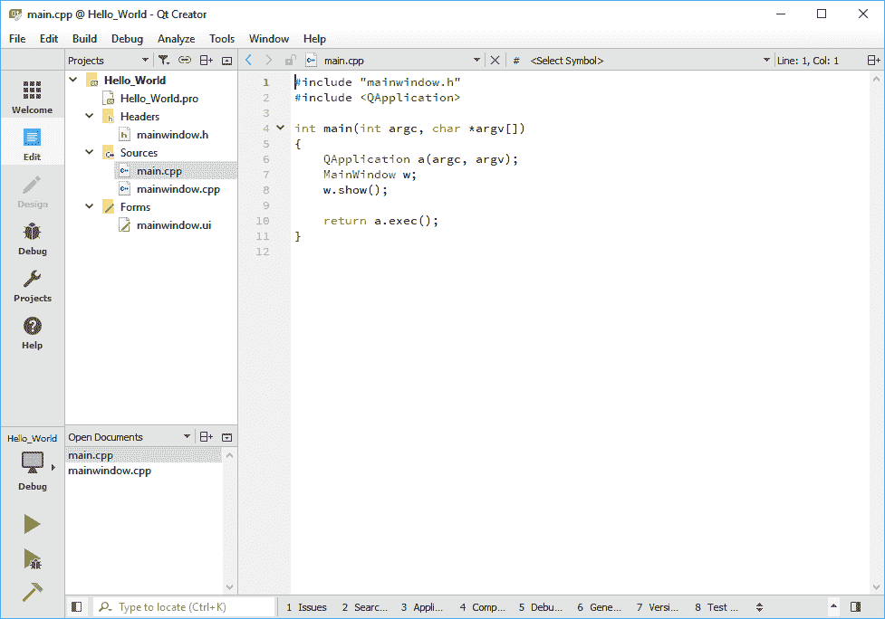

# OpenCV 简介

现在，是时候介绍 OpenCV，Open Source Computer Vision 库或框架（如果需要的话）了，因为 OpenCV 本身可以互换使用它们，并且在本书中也可能会发生。 但是，在大多数情况下，我们只会坚持使用 OpenCV。 好吧，让我们先听听它的真正含义，然后在需要的地方对其进行分解。

OpenCV 是一个开放源代码和跨平台的库，用于开发计算机视觉应用程序。 着眼于速度和性能，它在各种模块中包含数百种算法。 这些模块也分为两种类型：`Main`和`Extra`模块。 OpenCV 主要模块只是 OpenCV 社区内构建和维护的所有模块，它们是 OpenCV 提供的默认软件包的一部分。

这与 OpenCV 的 Extra 模块形成了鲜明的对比，后者的模块或多或少是第三方库和包装程序的包装器，这些第三方库和接口将它们集成到 OpenCV 构建中。 以下是一些不同模块类型的示例，并分别对其进行了简要说明。 值得注意的是，OpenCV 中模块的数量（有时甚至是顺序）可以随着时间而改变，因此，最好记住的一点是，只要有可能，只要访问 OpenCV 文档页面即可。 错位，或者如果某些东西不在以前。

# 主要模块

这是一些 OpenCV 主模块的示例。 请注意，它们只是 OpenCV 中的少数几个模块（可能是使用最广泛的模块），而涵盖所有这些模块不在本书的讨论范围内，但是对 OpenCV 包含的内容有所了解是很有意义的，就像 我们在本章前面的 Qt 中看到了什么。 他们来了：

*   核心功能或简称为`core`模块包含所有其他 OpenCV 模块使用的所有基本结构，常量和功能。 例如，在此模块中定义了臭名昭著的 OpenCV `Mat`类，在本书的其余部分中，我们几乎将在每个 OpenCV 示例中使用该类。 第 4 章， *Mat 和 QImage* 将涵盖此和密切相关的 OpenCV 模块以及 Qt 框架的相应部分。
*   图像处理或`imgproc`模块包含许多用于图像过滤，图像转换的算法，顾名思义，它用于一般图像处理。 我们将在第 6 章， *OpenCV* 中的图像处理中介绍此模块及其功能。
*   2D 要素框架模块或`features2d`包含用于要素提取和匹配的类和方法。 它们将在第 7 章，*功能* *和描述符*中进行详细介绍。
*   视频模块包含用于主题的算法，例如运动估计，背景减法和跟踪。 该模块以及 OpenCV 的其他类似模块，将在第 9 章， *Video Analysis* 中介绍。

# 额外的模块

如前所述， **Extra 模块**主要是第三方库的包装器，这意味着它们仅包含集成这些模块所需的接口或方法。 示例附加模块将是`text`模块。 此模块包含用于在图像或 **OCR** （**光学字符识别**）中使用文本检测的接口，并且您还将需要这些第三方模块来进行此项工作，因此不涉及这些第三方模块。 作为本书的一部分，但您始终可以查看 OpenCV 文档以获取 Extra 模块的更新列表及其使用方式。

有关此的更多信息，您可以参考 [http://docs.opencv.org/master/index.html](http://docs.opencv.org/master/index.html) 。

**OpenCV 支持的平台**：如前所述，在应用程序开发的情况下，平台不仅仅是操作系统。 因此，我们需要知道 OpenCV 支持哪些操作系统，处理器体系结构和编译器。 OpenCV 是高度跨平台的，几乎像 Qt 一样，您可以为所有主要操作系统（包括 Windows，Linux，macOS，Android 和 iOS）开发 OpenCV 应用程序。 稍后我们将看到，我们将在 Windows 上使用 MSVC 2015（32 位）编译器，在 Linux 上使用 GCC，在 macOS 上使用 Clang。 还需要注意的是，我们需要自己使用 OpenCV 的源代码来构建 OpenCV，因为目前，尚未为上述编译器提供预构建的二进制文件。 但是，正如您稍后将看到的，如果您具有正确的工具和说明，则可以轻松地为任何操作系统构建 OpenCV。

# 安装 Qt

在本节中，我们将执行必需的步骤，以在您的计算机上设置完整的 Qt SDK（软件开发工具包）。 我们将从在 Windows 操作系统上设置 Qt 开始，并在需要时记下 Linux（在我们的情况下为 Ubuntu，但对于所有 Linux 发行版几乎相同）和 macOS 操作系统。 所以，让我们开始吧。

# 准备安装 Qt

为了能够安装和使用 Qt，我们需要首先创建一个 Qt 帐户。 尽管这不是强制性的，但仍强烈建议您这样做，因为您可以访问与此单一，统一和免费帐户有关的所有 Qt。 对于要安装的 Qt 的任何最新版本，您将需要 Qt 帐户凭据，只有在创建 Qt 帐户后才能使用。 为此，首先，您需要使用自己喜欢的浏览器访问 Qt 网站。 链接在这里：

[https://login.qt.io/login](https://login.qt.io/login)

这是它的屏幕截图：

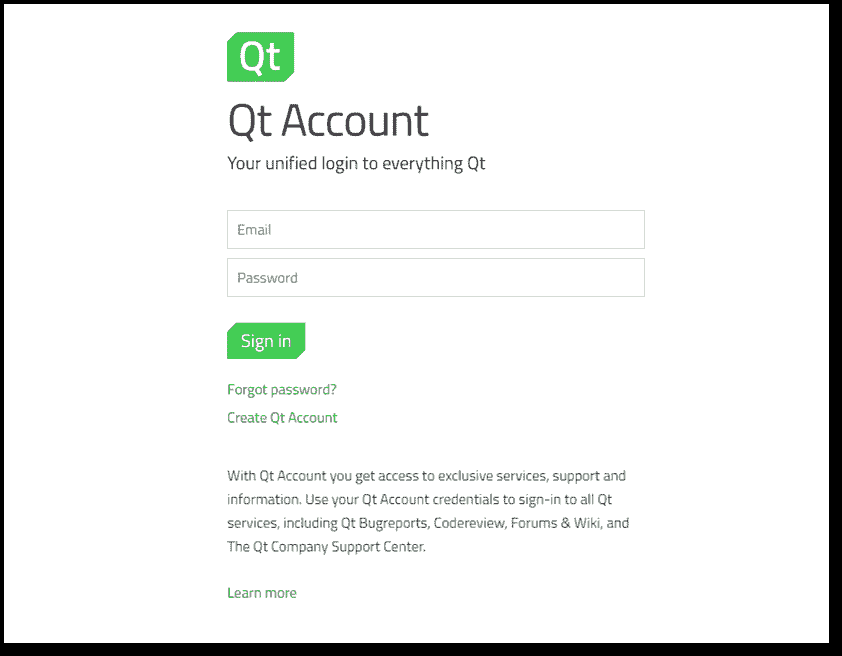

在这里，您必须使用“登录”按钮下方的“创建 Qt 帐户”页面来使用您的电子邮件地址。 该过程几乎与网上任何类似的帐户创建过程相同。 可能会要求您输入验证码图像以证明您不是机器人，或者单击电子邮件中的激活链接。 完成 Qt 要求的过程后，您将拥有自己的 Qt 帐户用户，即您的电子邮件和密码。 请记录下来，因为稍后将需要它。 从现在开始，我们将其称为您的 Qt 帐户凭据。

# 在哪里得到的？

至此，我们开始下载 Qt 开发所需的工具。 但是，从哪里开始呢？ Qt 通过 Qt 下载网页维护所有正式发布的版本。 这里是一个链接： [https://download.qt.io/official_releases/。](https://download.qt.io/official_releases/)

如果打开浏览器并导航到上一个网页，将会看到一个非常简单的网页（类似于文件浏览器程序），然后您需要从中自行选择合适的文件：

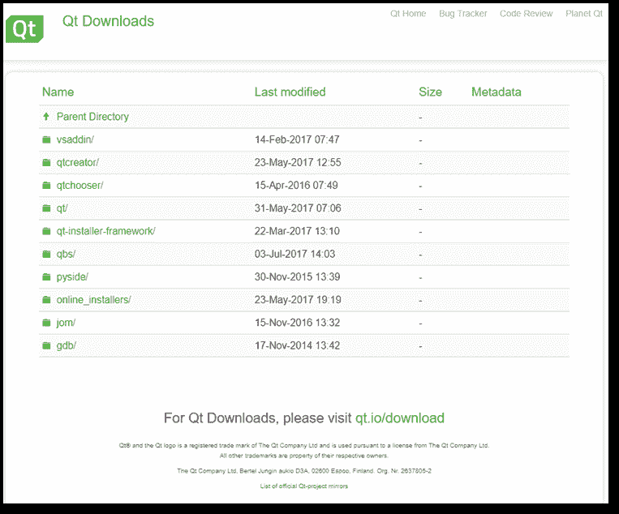

Qt 在此处发布了其所有官方工具，并且您将看到，Last Modify 列将一直在变化。 有些条目不是很常见，有些则更多。 目前，我们不会详细介绍每个文件夹包含的内容以及它们的用途，但是正如您将在本书后面看到的那样，我们所需的几乎所有工具都在一个安装文件中，并且 在`qt`文件夹下。 因此，通过单击每个条目，导航到以下文件夹：`qt/5.9/5.9.1/`

您会发现浏览器的网址中添加了相同的内容： [https://download.qt.io/official_releases/qt/5.9/5.9.1/](https://download.qt.io/official_releases/qt/5.9/5.9.1/)

您应该注意，访问此页面时可能会有一个较新的版本，或者该版本可能不再可用，因此您需要从前面提到的 Qt 下载页面开始，然后逐步进入最新的[ `Qt version`文件夹。 或者，您可以使用 Qt Downloads 主页中的存档链接（ [https://download.qt.io/archive/](https://download.qt.io/archive/) ）始终访问以前的 Qt 版本。

以下是您需要从前面的文件夹下载的文件：
**对于 Windows：** `qt-opensource-windows-x86-5.9.1.exe`
**对于 macOS：** `qt-opensource-mac-x64-5.9.1.dmg`
**对于 Linux：** `qt-opensource-linux-x64-5.9.1.run`

这些是预先构建的 Qt 库，并包含每个提到的操作系统的完整 Qt SDK。 这意味着您无需自己构建 Qt 库即可使用它们。 这些安装文件通常包括以下内容以及我们将使用的工具：

*   Qt Creator（版本 4.3.1）
*   每个操作系统支持的所有编译器和体系结构的预构建库：
    *   Windows 桌面，Windows Mobile（在 Windows 上）
    *   桌面（在 Linux 上）
    *   桌面和 iOS（在 macOS 上）
    *   Android（在所有平台上）

**Windows 用户**：Qt 安装软件包还包括其中包含的 MinGW 编译器，但是由于我们将使用另一个编译器，即 MSVC 2015，因此您实际上与它没有任何关系。 尽管安装它不会造成任何伤害。

# 如何安装？

您需要通过执行下载的安装文件来开始安装。 如果您使用的是 Windows 或 macOS 操作系统，则只需运行下载的文件。 但是，如果您使用的是 Linux，则可能需要先使下载的`.run`文件成为可执行文件，然后才能实际运行它。 可以在 Linux 上执行以下命令以使安装程序文件可执行：

```cpp
chmod +x qt-opensource-linux-x64-5.9.1.run
```

或者，您可以简单地右键单击`.run`文件，并使用属性对话框使其可执行：


请注意，即使没有下载任何内容，您仍然需要可以正常使用的 Internet 连接，这只是为了确认您的 Qt 帐户凭据。 运行安装程序将为您显示以下一系列需要完成的对话框。 只要对话框上的说明足够，请确保已阅读并提供所需的内容，然后按“下一步”，“同意”或类似按钮继续操作。 如以下屏幕快照所示，您需要提供 Qt 帐户凭据才能继续安装。 这些对话框在所有操作系统上都是相同的：

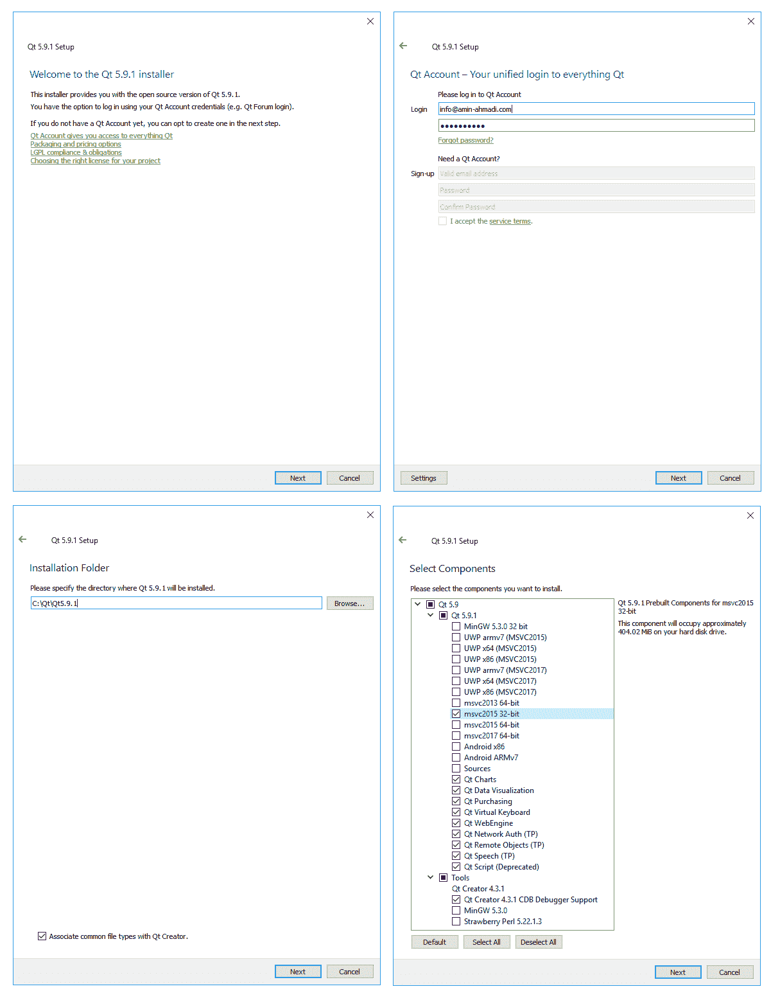

其余对话框未在此处显示，但是它们几乎是不言自明的，并且，如果您曾经在任何计算机上安装任何应用程序，那么您肯定会看到类似的对话框，并且通常不需要对其进行介绍。

# Windows 用户

安装 Windows 版 Qt 时，请确保在“选择组件”对话框上，选中“ msvc2015 32 位”选项旁边的复选框。 其余的是可选的，但是值得注意的是，安装所有平台（或在 Qt 中称为 Kits）通常需要太多空间，并且在某些情况下会影响 Qt Creator 的性能。 因此，只需确保选择您将真正使用的任何东西。 就本书而言，它只是您绝对需要的 msvc2015 32 位选项。

**Windows 用户要注意的重要事项**：您还需要安装至少启用了 C ++桌面开发功能的 Visual Studio 2015。 Microsoft 为 Visual Studio 提供了不同类型的许可证。 您可以下载社区版本用于教育目的，这对于本书的示例来说绝对足够，并且是免费提供的，但是使用 Enterprise，Professional 或其他类型的 Visual Studio 也可以，只要它们具有 MSVC 2015 32 位编译器。

# macOS 用户

如果您没有在 Mac 上安装 XCode，则在为 Mac OS 安装 Qt 时，将面临以下对话框（或一个非常类似的对话框，具体取决于您使用的 macOS 的版本）。

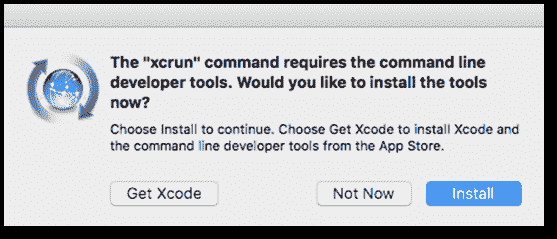

不幸的是，仅单击“安装”按钮是不够的，尽管看起来很明显，但是安装按钮比安装 Xcode 花费的时间少得多。 您仍然需要通过单击“获取 Xcode”按钮直接从 App Store 获取 Xcode 来确保在 Mac 上安装了 Xcode，或者在安装 Qt 时会遇到以下问题：

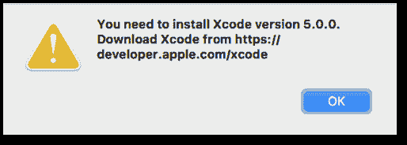

使用 App Store 安装最新版本的 Xcode（在撰写本书时，Xcode 8.3.3 已可用），然后继续进行 Qt 安装。

在“选择组件”对话框上，确保至少选择 macOS 版本。 您不需要其余的组件，但是安装它们不会造成伤害，除了它可能占用您计算机的大量空间之外。

# Linux 用户

在安装 Qt for Linux 时，在“选择组件”对话框上，确保选择（至少）桌面 GCC（32 位或 64 位，具体取决于您的操作系统）。 您会注意到，默认情况下将安装 Qt Creator，并且不需要检查任何选项。

安装完成后，您将在计算机上安装以下应用程序：

*   **Qt Creator：**这是我们在整本书中将用来构建应用程序的主要 IDE。
*   **Qt 助手：**此应用程序用于查看 Qt 帮助文件。 它提供了查看 Qt 文档的有用功能。 尽管如此，Qt Creator 还提供了上下文相关的帮助，并且还具有自己的内置且非常方便的帮助查看器。
*   **Qt 设计器：**这用于使用 Qt 小部件设计 GUI。 同样，Qt Creator 也内置了此设计器，但是如果您更喜欢使用其他 IDE 而不是 Qt Creator，则仍可以使用 Designer 来帮助 GUI 设计过程。
*   Qt 语言学家：如果您要构建多语言应用程序，这将是非常有用的帮助。 Qt Linguist 有助于简化翻译并将翻译后的文件集成到您的版本中。

对于 Windows 和 macOS 用户，这是 Qt 安装故事的结尾，但是 Linux 用户仍然需要多做一些事情，即安装应用程序开发，构建工具以及一些 Linux 所需的运行时库。 Qt 始终使用操作系统提供的编译器和构建工具。 默认情况下，Linux 发行版通常不包括那些工具，因为它们仅由开发人员使用，而未被普通用户使用。 因此，要安装它们（如果尚未安装），可以从终端运行以下命令：

```cpp
sudo apt-get install build-essential libgl1-mesa-dev
```

您可以始终参考 Qt 文档页面以获取所有 Linux 发行版所需的命令，但是，在本书中，我们假定发行版为 Ubuntu / Debian。 但是，请注意，通常，所有 Linux 发行版的命令在模式上都非常相似。

有关此的更多信息，您可以参考 [http://doc.qt.io/qt-5/linux.html](http://doc.qt.io/qt-5/linux.html) 。

# 测试 Qt 安装

您现在可以安全地运行 Qt Creator 并使用它创建出色的应用程序。 现在，让我们确保我们的 Qt 安装正确运行。 现在就不用理会细节了，因为我们将在本书的过程中介绍所有细节，尤其是如果您认为自己不了解幕后的真实情况，请不要担心。 只需运行 Qt Creator 并按下显示的大 New Project 按钮，如下所示：

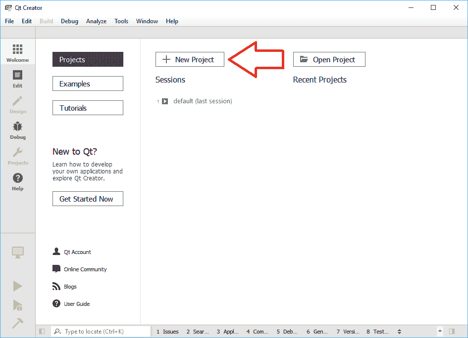

在接下来出现的窗口中，选择“应用程序”，“ Qt Widgets 应用程序”，然后单击“选择”，如以下屏幕截图所示：

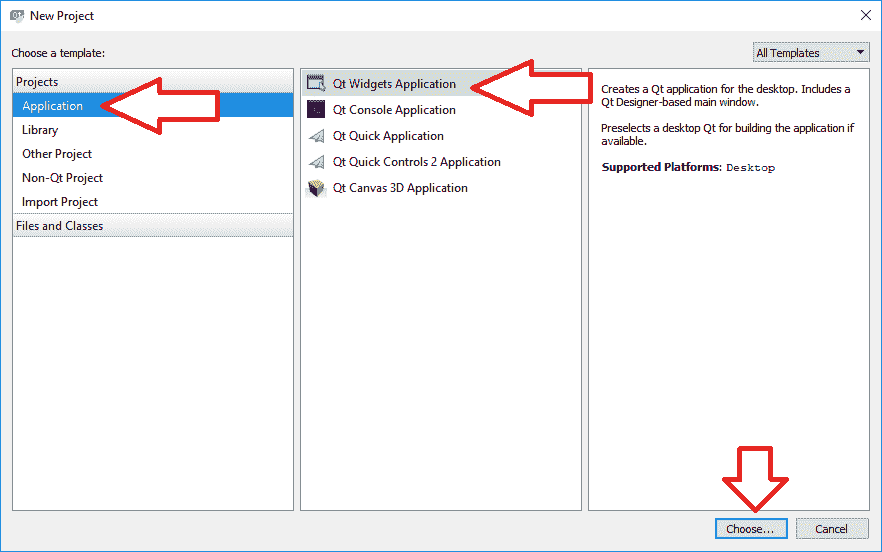

在下一个窗口中，您需要提供一个名称和文件夹（将在其中创建测试项目），然后单击“下一步”继续。 如果要为 Qt 项目使用专用文件夹，请确保选中“用作默认项目位置”复选框。 您只需执行一次，然后所有项目将在该文件夹中创建。 现在，我们只需要输入名称和路径，因为我们仅要测试 Qt 安装，然后单击“下一步”。 您将看到与以下屏幕快照类似的内容：


在下一个窗口中，您需要选择一个所谓的 Kit 来构建您的应用程序。 选择一个以 Desktop Qt 5.9.1 开头的名称，然后单击“下一步”。 根据在 Qt 安装过程中选择的组件，您在这里可能有多个选择，并且取决于系统上安装的操作系统和编译器，您可能有多个工具包，其名称以 Desktop 开头，因此 确保选择我们将在本书中使用的编译器，如下所示：

*   Windows 上的 msvc2015 32 位
*   在 macOS 上的 Clang
*   Linux 上的 GCC

根据前面提到的工具选择正确的工具包后，可以单击“下一步”继续进行操作：


您真的不需要麻烦接下来出现的两个窗口，只需单击“下一步”就足以测试我们的 Qt 安装。 第一个窗口使创建新类更加容易，第二个窗口使您可以选择版本控制工具并跟踪代码中的更改：

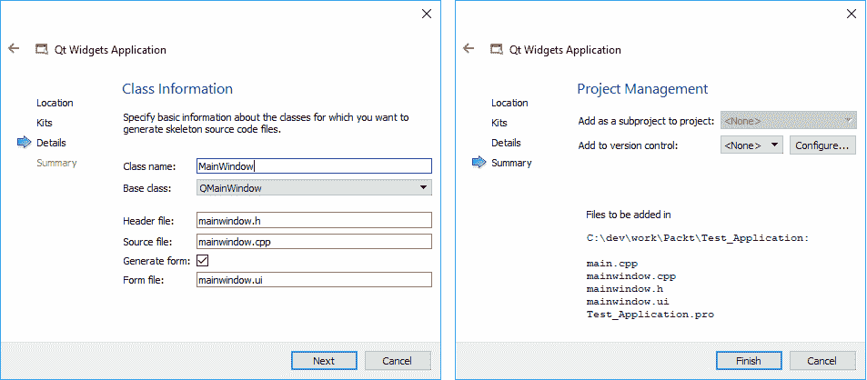

在最后一个窗口上单击“完成”按钮后，您将进入 Qt Creator 中的“编辑”模式。 我们将在下一章介绍 Qt Creator 的不同方面，因此，现在，只需单击“运行”按钮（或按 *Ctrl* +60; *R* ）即可开始编译您的 测试（并清空）应用程序，如下所示：

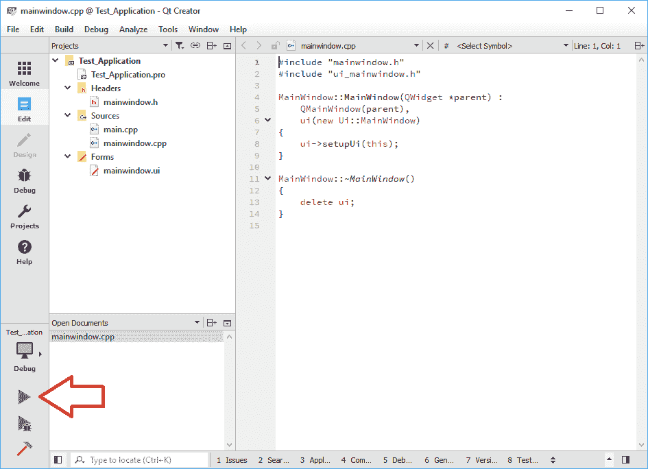

根据计算机的速度，完成构建过程将需要一些时间。 片刻之后，您应该看到测试（以及第一个）Qt 应用程序正在运行。 它只是一个空的应用程序，与下面的屏幕快照类似，其目的是确保我们的 Qt 安装能够按预期运行。 显然，在不同的操作系统上，空的 Qt 应用程序看上去可能与此略有不同，并且不同的视觉选项可能会影响整个颜色或窗口的显示方式。 不过，您新建的应用程序应该看起来与此处看到的窗口完全相同（或非常相似）：


如果您的应用程序没有出现，请确保再次阅读说明。 另外，请确保没有任何冲突的 Qt 安装或其他可能干扰 Qt 安装的设置。 有关 Qt Creator 或其他 Qt 工具意外行为的答案，请始终参考文档页面和 Qt 社区。 长期以来，Qt 一直是一个开源项目，它已经成长为庞大而忠实的用户群体，他们渴望在互联网上分享他们的知识并回答 Qt 同行用户面临的问题。 因此，密切关注 Qt 社区是个好主意，因为您已经拥有可用于访问 Qt 论坛的统一 Qt 帐户。 这是您为继续进行 Qt 安装过程而创建的用户名和密码。

# 安装 OpenCV

在本章的这一部分，您将学习如何使用其源代码构建 OpenCV。 如您将在后面看到的，并且与本节的标题相反，我们并不是真正地*以类似于 Qt 安装的方式来安装* OpenCV。 这是因为 OpenCV 通常不为所有编译器和平台提供预构建的二进制文件，而实际上它根本不为 macOS 和 Linux 提供预构建的二进制文件。 在 OpenCV 的最新 Win 包中，仅包含适用于 64 位 MSVC 2015 的预构建二进制文件，这些二进制文件与我们将使用的 32 位版本不兼容，因此，了解如何进行安装是一个非常好的主意 自己构建 OpenCV。 它还具有构建适合您需要的 OpenCV 框架库的优势。 您可能要排除一些选项以简化 OpenCV 安装，或者可能要为其他编译器（例如 MSVC 2013）进行构建。因此，有很多理由需要您自己从源代码构建 OpenCV。

# 准备 OpenCV 构建

Internet 上的大多数开放源代码框架和库，或者至少是希望保持 IDE 中立的库和库（这意味着可以使用任何 IDE 进行配置和构建的项目，以及不依赖于特定 IDE 的项目 才能工作），使用 CMake 或类似的 *make* 系统。 我猜这也会回答诸如*之类的问题，为什么我完全需要 CMake？* 和*为什么他们不能仅仅给出库并完成它？* 或类似的其他问题。 因此，我们需要 CMake 能够使用源配置和构建 OpenCV。 CMake 是一个开放源代码和跨平台应用程序，它允许配置和构建开放源代码项目（或应用程序，库等），并且您可以在上一节中提到的所有操作系统上下载和使用它。 在撰写本书时，可以从 CMake 网站下载页面（ [https://cmake.org/download/](https://cmake.org/download/) ）下载 CMake 3.9.1 版。

在继续前进之前，请确保下载并安装在计算机上。 CMake 安装没有什么特别的需要注意的，除了您必须确保安装 GUI 版本这一事实外，这是我们将在下一部分中使用的内容，并且它是提供的链接中的默认选项。 较早。

# 从哪里获得 OpenCV？

OpenCV 在其网站（ [http://opencv.org/releases.html](http://opencv.org/releases.html) ）的“发布”页面下维护其官方和稳定版本：

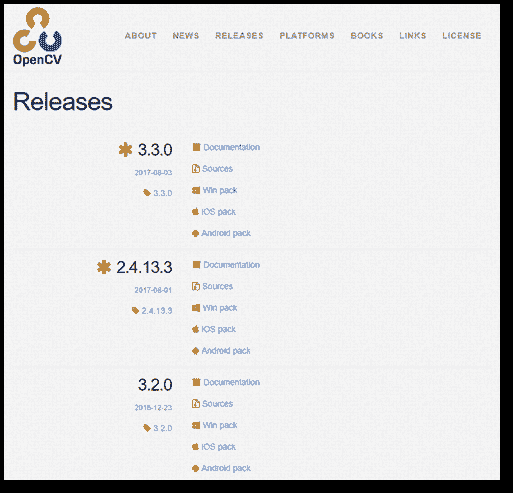

在这里，您始终可以找到适用于 Windows，Android 和 iOS 的最新版本的 OpenCV 源代码，文档和预构建的二进制文件。 随着新版本的发布，它们会添加到页面顶部。 在撰写本书时，版本 3.3.0 是 OpenCV 的最新版本，这就是我们将使用的版本。 因此，事不宜迟，您应该继续进行操作，并通过单击 3.3.0 版的“源”链接来下载源。 将`source zip`文件下载到您选择的文件夹中，将其提取出来，并记下提取的路径，因为稍后我们将使用它。

# 如何建造？

现在，我们拥有构建 OpenCV 所需的所有工具和文件，我们可以通过运行 CMake GUI 应用程序来启动该过程。 如果正确安装了 CMake，则应该能够从桌面，开始菜单或扩展坞运行它，具体取决于您的操作系统。

Linux 用户应在终端中运行以下命令，然后再继续进行 OpenCV 构建。 这些基本上是 OpenCV 本身的依赖关系，需要在配置和构建它之前就位：

```cpp
sudp apt-get install libgtk2.0-dev and pkg-config 
```

运行 CMake GUI 应用程序后，需要设置以下两个文件夹：

*   “源代码在哪里”文件夹应设置为您下载和提取 OpenCV 源代码的位置
*   可以将“生成二进制文件的位置”文件夹设置为任何文件夹，但是通常在源代码文件夹下创建一个名为`build`的子文件夹并将其选择为二进制文件文件夹

设置这两个文件夹后，您可以通过单击“配置”按钮继续前进，如以下屏幕截图所示：

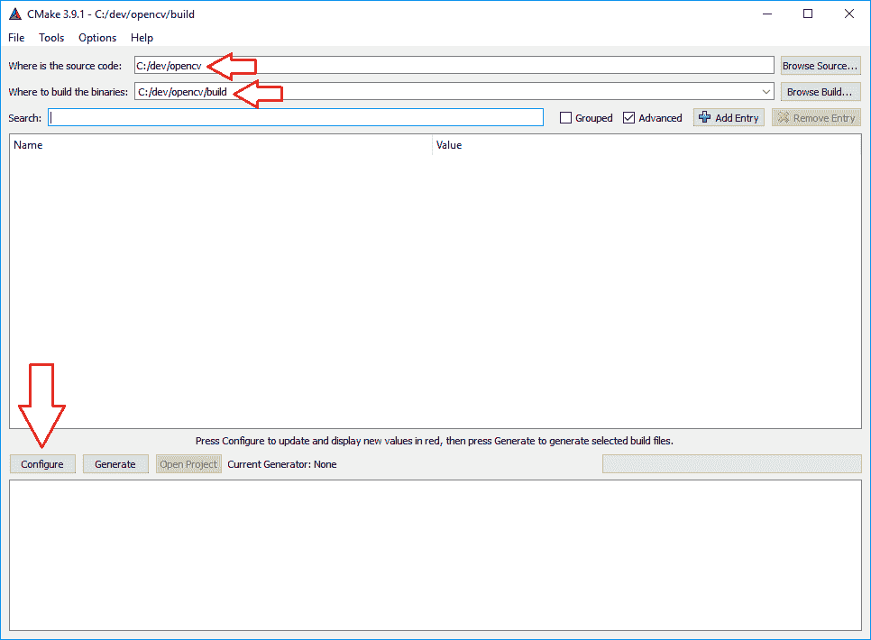

单击配置按钮将启动配置过程。 如果构建文件夹尚不存在，可能会要求您创建该文件夹，您需要通过单击“是”按钮来对其进行回答。 如果您仍然觉得自己只是在重复书中的内容，请不要担心。 当您继续阅读本书和说明时，所有这些都会陷入。 现在，让我们仅关注在计算机上构建和安装 OpenCV。 考虑到此安装过程并不像单击几个“下一步”按钮那样简单，并且一旦开始使用 OpenCV，一切都会变得有意义。 因此，在接下来出现的窗口中，选择正确的生成器，然后单击“完成”。 有关每个操作系统上正确的生成器类型，请参阅以下说明：

**Windows 用户**：您需要选择 Visual Studio 142015。请确保您未选择 ARM 或 Win64 版本或其他 Visual Studio 版本。
**macOS 和 Linux 用户**：您需要选择 Unix Makefile。

您将在 CMake 中看到一个简短的过程，完成后，您将能够设置各种参数来配置您的 OpenCV 构建。 有许多参数需要配置，因此我们将直接影响那些直接影响我们的参数。

确保选中 BUILD_opencv_world 选项旁边的复选框。 这将允许将所有 OpenCV 模块构建到单个库中。 因此，如果您使用的是 Windows，则只有一个包含所有 OpenCV 功能的 DLL 文件。 正如您将在后面看到的那样，当您要部署计算机视觉应用程序时，这样做的好处是仅使用一个 DLL 文件即可。 当然，这样做的明显缺点是您的应用程序安装程序的大小会稍大一些。 但是同样，易于部署将在以后证明更加有用。

更改构建参数后，您需要再次单击“配置”按钮。 等待重新配置完成，最后单击“生成”按钮。 这将使您的 OpenCV 内部版本可以编译。 在下一部分中，如果使用 Windows，macOS 或 Linux 操作系统，则需要执行一些不同的命令。 因此，它们是：

**Windows 用户**：转到您先前在 CMake 中设置的 OpenCV 构建文件夹（在我们的示例中为`c:\dev\opencv\build`）。 应该有一个 Visual Studio 2015 解决方案（即 MSVC 项目的类型），您可以轻松地执行和构建 OpenCV。 您也可以立即单击 CMake 上“生成”按钮旁边的“打开项目”按钮。 您也可以只运行 Visual Studio 2015 并打开您刚为 OpenCV 创建的解决方案文件。

打开 Visual Studio 之后，需要从 Visual Studio 主菜单中选择“批处理生成”。 就在 Build 下：


确保在 Build 列中为 ALL_BUILD 和 INSTALL 启用了复选框，如以下屏幕截图所示：


**对于 macOS 和 Linux 用户**：在切换到在 CMake 中选择的 Binaries 文件夹后，运行终端实例并执行以下命令。 要切换到特定文件夹，您需要使用 cd 命令。 进入 OpenCV 构建文件夹（应该是打开 CMake 时选择的家庭文件夹）之后，需要执行以下命令。 系统将要求您提供管理密码，只需提供密码，然后按*输入*即可继续构建 OpenCV：

```cpp
 sudo make
```

这将触发构建过程，并且可能需要花费一些时间，具体取决于您的计算机速度。 等到所有库的构建完成后，进度条将达到 100％。

漫长的等待之后，仅剩下一个命令可以为 macOS 和 Linux 用户执行。 如果您使用的是 Windows，则可以关闭 Visual Studio IDE 并继续进行下一步。

**macOS 和 Linux 用户**：构建完成后，在关闭终端实例之前，请在仍位于 OpenCV `build`文件夹中的情况下执行以下命令：

`**sudo make install**`

对于非 Windows 用户，这最后一个命令将确保您的计算机上已安装 OpenCV，并且可以完全使用。 如果您没有错过本节中的任何命令，则可以继续进行。 您已经准备好使用 OpenCV 框架来构建计算机视觉应用程序。

# 配置 OpenCV 安装

还记得我们提到过 OpenCV 是一个框架，您将学习如何在 Qt 中使用它吗？ 好吧，Qt 提供了一种非常易于使用的方法，可以在您的 Qt 项目中包括任何第三方库，例如 OpenCV。 为了能够在 Qt 中使用 OpenCV，您需要使用一种特殊的文件，称为 PRI 文件。 PRI 文件是用于添加第三方模块并将其包含在 Qt 项目中的文件。 请注意，您只需要执行一次此操作，在本书的其余部分中，您将在所有项目中使用此文件，因此，它是 Qt 配置中非常关键（但非常简单）的一部分。

首先在您选择的文件夹中创建一个文本文件。 我建议使用与 OpenCV 构建相同的文件夹，因为这可以帮助确保将所有与 OpenCV 相关的文件都放在一个文件夹中。 但是，从技术上来讲，该文件可以位于计算机上的任何位置。 将文件重命名为`opencv.pri`并使用任何文本编辑器将其打开，然后在 PRI 文件中写入以下内容：

**Windows 用户**：到目前为止，您的 OpenCV 库文件应该位于您先前在 CMake 上设置的 OpenCV 构建文件夹中。 `build`文件夹中应该有一个名为`install`的子文件夹，其中包含所有必需的 OpenCV 文件。 实际上，现在您可以删除所有其他内容，如果需要在计算机上保留一些空间，则只保留这些文件，但是将 OpenCV 源代码保留在计算机上始终是一个好主意，我们将在最后几章中特别需要它 将涵盖更高级的 OpenCV 主题。 因此，这是 PRI 文件中需要的内容（请注意路径分隔符，无论使用什么操作系统，都始终需要在 PRI 文件中使用`/`）：

```cpp
INCLUDEPATH += c:/dev/opencv/build/install/include 
Debug: { 
LIBS += -lc:/dev/opencv/build/install/x86/vc14/lib/opencv_world330d 
} 
Release: { 
LIBS += -lc:/dev/opencv/build/install/x86/vc14/lib/opencv_world330 
} 
```

无需说明，在前面的代码中，如果在 CMake 配置期间使用了其他文件夹，则需要替换路径。

**macOS 和 Linux 用户**：只需将以下内容放入`opencv.pri`文件中：

```cpp
 INCLUDEPATH += /usr/local/include 
 LIBS += -L/usr/local/lib \ 
    -lopencv_world 
```

Windows 用户还有一件事，那就是将 OpenCV `DLLs`文件夹添加到 PATH 环境变量中。 只需打开“系统属性”窗口，然后在 PATH 中添加一个新条目。 它们通常用`;`隔开，因此之后只需添加一个新的即可。 请注意，此路径仅与 Windows 操作系统相关，并且可以在其中找到 OpenCV 的`DLL`文件，从而简化了构建过程。 Linux 和 macOS 的用户不需要为此做任何事情。

# 测试 OpenCV 安装

最糟糕的时刻已经过去，我们现在准备深入研究计算机视觉世界，并开始使用 Qt 和 OpenCV 构建令人兴奋的应用程序。 尽管最后一步称为“测试 OpenCV”，但实际上它是您将要编写的第一个 Qt + OpenCV 应用程序，就像乍看起来一样简单。 在本节中，我们的目的不是打扰任何事情的工作方式以及幕后发生的事情，而只是确保我们正确地配置了所有内容，并避免在本书后面的内容中浪费与配置相关的问题。 如果您已按照说明进行了所有操作并以正确的顺序执行了所有指令，那么到现在为止，您不必担心任何事情，但是最好*验证*，这就是我们要做的 现在做。

因此，我们将使用一个非常简单的应用程序来验证我们的 OpenCV 安装，该应用程序将从硬盘读取图像文件并仅显示它。 同样，不要打扰任何与代码相关的细节，因为我们将在接下来的章节中介绍所有这些细节，而只是专注于手头的任务，即测试我们的 OpenCV 安装。 首先运行 Qt Creator，然后创建一个新的控制台应用程序。 在测试 Qt 安装之前，您已经完成了非常相似的任务。 您需要遵循完全相同的说明，除了必须使用 Qt Widget 之外，还必须确保选择 Qt Console Application。 像以前一样重复所有类似的步骤，直到最终进入 Qt Creator 编辑模式。 如果询问您有关构建系统的信息，请选择 qmake，默认情况下应选择 qmake，因此您只需要继续前进即可。 确保为您的项目命名，例如`QtCvTest`。 这次，不用单击“运行”按钮，而是双击项目的 PRO 文件，您可以在 Qt Creator 屏幕左侧的资源管理器中找到该文件，然后在项目的 PRO 文件末尾添加以下行 ：

```cpp
    include(c:/dev/opencv/opencv.pri) 
```

请注意，实际上，这是应始终避免的*硬编码*类型，正如我们将在后面的章节中看到的那样，我们将编写适用于所有操作系统的更复杂的 PRO 文件。 无需更改任何一行； 但是，由于我们只是在测试我们的 OpenCV 安装，因此现在可以进行一些硬编码来简化一些事情，而不会因更多配置细节而使您不知所措。

因此，回到我们正在做的事情，当您通过按 *Ctrl* + *S* 保存 PRO 文件时，您会注意到快速的过程并在项目浏览器和`opencv.pri`文件将出现在资源管理器中。 您可以随时从此处更改`opencv.pri`的内容，但是您可能永远不需要这样做。 忽略类似评论的行，并确保您的 PRO 文件与我在此处的文件相似：

```cpp
 QT += core 
 QT -= gui 
 CONFIG += c++11 
 TARGET = QtCvTest 
 CONFIG += console 
 CONFIG -= app_bundle 
 TEMPLATE = app 
 SOURCES += main.cpp 
 DEFINES += QT_DEPRECATED_WARNINGS 
 include(c:/dev/opencv/opencv.pri) 
```

项目的 PRO 文件中的这一行简单的代码基本上是本章所有工作的结果。 现在，我们只需在我们要使用 Qt 和 OpenCV 构建的每个 Computer Vision 项目中包含此简单代码段，就可以将 OpenCV 添加到我们的 Qt 项目中。

在接下来的章节中，我们将学习 Qt 中的 PRO 文件以及之前代码的所有内容。 但是，现在让我们继续前进，知道该文件负责我们项目的配置。 因此，最后一行几乎是不言自明的，仅表示我们要向我们的 Qt 项目添加 OpenCV 包含头文件和库。

现在，您实际上可以编写一些 OpenCV 代码。 打开您的`main.cpp`文件并更改其内容，使其与此类似：

```cpp
 #include <QCoreApplication> 
 #include "opencv2/opencv.hpp" 
 int main(int argc, char *argv[]) 
 { 
    QCoreApplication a(argc, argv); 
    using namespace cv; 
    Mat image = imread("c:/dev/test.jpg"); 
    imshow("Output", image); 
    return a.exec(); 
 } 
```

默认情况下，您的`main.cpp`文件应该已经具有前面代码中的大部分内容，但是您会注意到顶部的 include 行和负责从我的计算机读取和显示测试图像的三行。 您可以替换任何其他图像的路径（只需确保暂时保留 JPG 或 PNG 文件），确保该图像文件存在并且可访问非常重要，否则，即使安装了我们的测试也可能失败 仍然是正确的。 整个代码几乎是不言自明的，但是再一次，由于我们只是测试我们的 OpenCV 版本，因此您现在不应该理会这些代码，因此只需按“运行”按钮以显示您的图像文件即可。 您应该在计算机上看到类似于以下屏幕截图的内容：


# 概要

在本章中，向您介绍了计算机视觉的一般概念以及 Qt 和 OpenCV 框架，并了解了它们的整体模块化结构，还简要了解了它们在所有平台上跨平台的重要性。 两者都支持。 您还学习了如何在计算机上安装 Qt 以及如何使用其源代码构建 OpenCV。 到目前为止，除了本章中提到的标准构建之外，您应该有足够的信心甚至可以尝试一些其他配置来构建 OpenCV。 通过简单地查看它们包含的文件夹和文件，探索这些巨大框架的一些未知而又深入的部分总是一个好主意。 最后，您学习了如何配置开发计算机以使用 Qt 和 OpenCV 构建应用程序，甚至还构建了第一个应用程序。 在下一章中，您将首先构建控制台应用程序，然后继续构建 Qt 小部件应用程序，以了解有关 Qt Creator 的更多信息。 您还将了解 Qt 项目的结构以及如何在 Qt 和 OpenCV 框架之间创建跨平台集成。 下一章将是本书中实际计算机视觉开发和编程示例的开始，并将为整本书中的动手示例奠定基础。