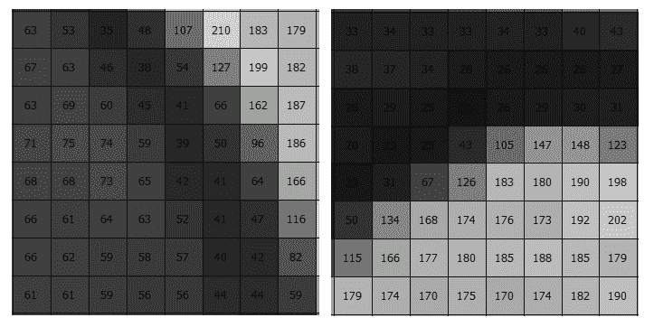
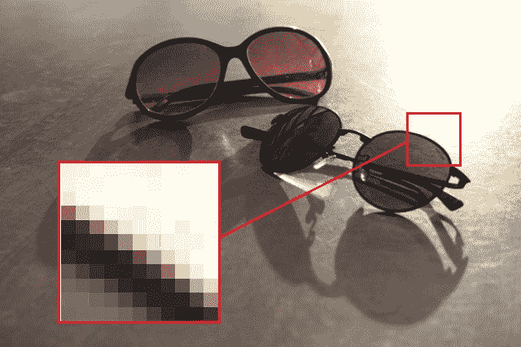
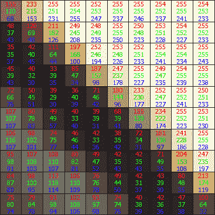
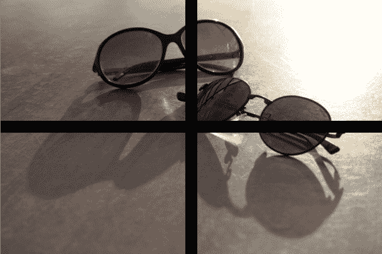
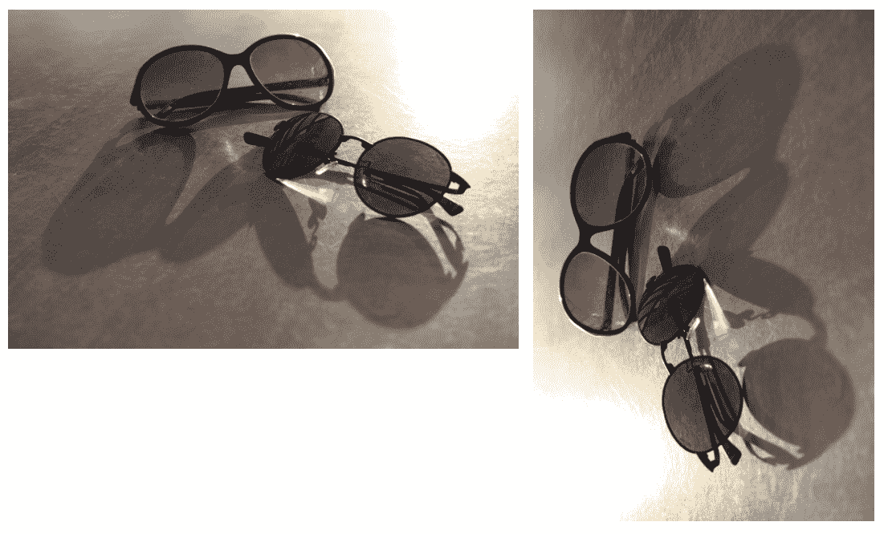
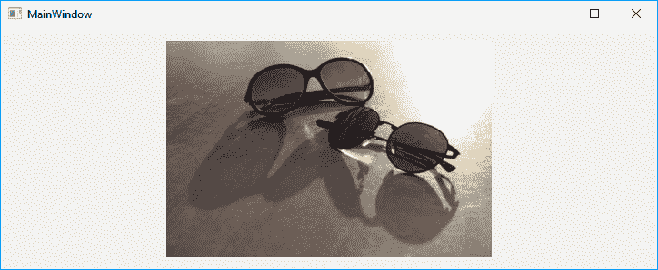
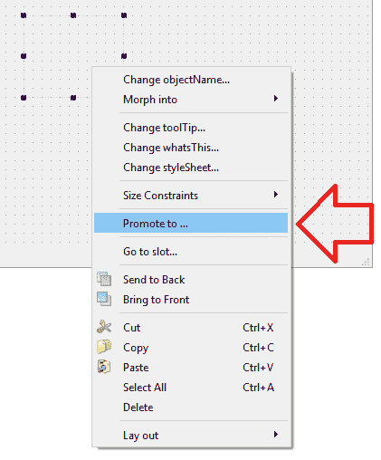

# `Mat`和`QImage`

在第 3 章，“创建全面的 Qt + OpenCV 项目”中，我们了解了创建全面且可持续的应用的基本规则，这些应用看起来很吸引人，支持多种语言，并且通过使用 Qt 中的插件系统易于扩展。 现在，我们将通过学习负责处理计算机视觉数据类型的类和结构，来进一步扩展有关计算机视觉应用基础的知识库。 了解 OpenCV 和 Qt 框架所需的基本结构和数据类型是了解在应用中执行时处理它们的基础计算机视觉功能如何执行的第一步。 OpenCV 是旨在提高速度和性能的计算机视觉框架。 另一方面，Qt 是一个不断发展的应用开发框架，具有大量的类和功能。 这就是为什么他们俩都需要一组定义明确的类和结构来处理要在计算机视觉应用中处理，显示甚至保存或打印的图像数据的原因。 始终使自己熟悉有关 Qt 和 OpenCV 中现有结构的有用详细信息，这始终是一个好习惯。

您已经使用过 OpenCV 的`Mat`类来简要地读取和处理图像。 正如您将在本章中了解到的，即使`Mat`是负责处理 OpenCV 中图像数据的主要类（至少在传统上是这样），`Mat`类也有一些变体， 实用的功能，其中某些功能甚至是特定功能所必需的，您将在接下来的章节中学习这些功能。 在 Qt 框架的情况下，即使`QImage`是 Qt 中用于处理图像数据的主要类，也没有太大不同，还有更多的类（有时具有惊人的相似名称）用于支持计算机。 视觉并处理图像数据，视频等。

在本章中，我们将从最关键的 OpenCV 类`Mat`开始，然后继续研究不同的变体（其中有些是`Mat`的子类），最后向您介绍新的`UMat`类， 这是该框架的 OpenCV 3 补充。 我们将学习使用新的`UMat`类（实际上是`Mat`兼容）而不是`Mat`类的优点。 然后，我们将进入 Qt 的`QImage`类，并学习如何通过将这两种数据类型相互转换在 OpenCV 和 Qt 之间传递图像数据。 我们还将学习`QPixmap`，`QPainter`以及许多其他 Qt 类，对于要从事计算机视觉领域的任何人，所有这些都是必不可少的类。

最后，我们将学习 OpenCV 和 Qt 框架从文件，摄像机，网络订阅源等读取，写入和显示图像和视频的多种方式。 正如您将在本章末了解到的那样，始终最好根据所需的计算机视觉任务来决定哪种课程最适合我们，因此在处理图像数据输入或输出时，我们应该对手头的各种选项有足够的了解 。

我们将在本章中介绍的主题包括：

*   `Mat`类，其子类和新的`UMat`类的简介
*   `QImage`简介和计算机视觉中使用的主要 Qt 类
*   如何读取，写入和显示图像和视频
*   如何在 Qt 和 OpenCV 框架之间传递图像数据
*   如何在 Qt 中创建自定义小部件并使用`QPainter`对其进行绘制

# 关于`Mat`类

在前面的章节中，您非常简要地体验了 OpenCV 框架的`Mat`类，但是现在我们将更深入地进行研究。 从矩阵中借用其名称的`Mat`类是`n`维数组，能够在单个或多个通道中存储和处理不同的数学数据类型。 为了进一步简化，让我们看一下计算机视觉中的图像。 计算机视觉中的图像是像素矩阵（因此为二维阵列），具有指定的宽度（矩阵中的列数）和高度（矩阵中的行数）。 此外，灰度图像中的像素可以用一个数字（因此是单个通道）表示，最小值（通常为 0）表示黑色，而最大值（通常为 255）是一个字节可能出现的最大值 ）代表白色，而介于两者之间的所有值则对应于不同的灰色强度。 请看以下示例图像，它们只是较大的灰度图像的放大部分。 每个像素都标记有我们刚才提到的强度值：



同样，标准 RGB 彩色图像中的像素具有三个不同的元素，而不是一个（因此具有三个通道），分别对应于红色，蓝色和绿色值。 看下面的图像例如：



如上图所示，在简单的图像查看器程序中，放大（缩放）的图像可以显示出负责图像的像素。 考虑每个`Mat`类中的单个元素，可以直接访问，修改和使用它们。 图像的这种矩阵状表示使某些功能最强大的计算机视觉算法可以轻松地处理图像，测量所需值甚至生成新图像。

这是上一个示例图片中放大的区域的另一种表示形式。 每个像素都标有基础的红色，绿色和蓝色值：



考虑图像数据和像素的大小写有助于理解`Mat`类，并且正如我们稍后将要看到的，`Mat`类和一般的 OpenCV 中的大多数功能都假定`Mat`是图像， 但是，必须注意`Mat`可以包含任何数据（不仅是图像），并且实际上在 OpenCV 中有`Mat`用于传递图像以外的数据数组的情况。 我们将在第 6 章，“OpenCV 中的图像处理”中学习一些相关示例。

由于一般而言，目前`Mat`类和 OpenCV 函数的数学细节并不符合我们的最大兴趣，因此，我们将以给定的介绍就足够了，并着重于`Mat`类及其在 OpenCV 中的基础方法。

# 构造器，属性和方法

构造`Mat`类的方法很多。 在撰写本书时，`Mat`类具有二十多种不同的构造器。 其中一些只是便捷的构造器，但是例如为了创建三个或更多维数组，还需要其他一些函数。 以下是一些使用最广泛的构造器以及如何使用它们的示例：

创建一个`10x10`矩阵，每个元素一个通道 8 位无符号整数（或字节）：

```cpp
    Mat matrix(10, 10, CV_8UC(1)); 
```

创建相同的矩阵，并使用`0`的值初始化其所有元素：

```cpp
    Mat matrix(10, 10, CV_8UC(1), Scalar(0); 
```

前面代码中所示的构造器中的第一个参数是行数，第二个参数是矩阵中的列数。 但是，第三个参数非常重要，它将类型，位数和通道数混合到一个宏中。 这是宏的模式和可以使用的值：

```cpp
    CV_<bits><type>C(<channels>) 
```

让我们看看宏的每个部分都用于：

`<bits>`可以替换为：

*  `8`：用于无符号和有符号整数
*  `16`：用于无符号和有符号整数
*  `32`：用于无符号和有符号整数以及浮点数
*  `64`：用于无符号和有符号浮点数

`<type>`可以替换为：

*  `U`：用于无符号整数
*  `S`：用于有符号整数
*  `F`：用于带符号的浮点数

从理论上讲，`<channels>`可以用任何值代替，但是对于一般的计算机视觉功能和算法，它不会高​​于 4。

如果使用的通道数不超过四个，则可以省略`<channels>`参数的左括号和右括号。 如果通道数仅为一个，则也可以完全省略`<channels>`和前面的`C`。 为了获得更好的可读性和一致性，最好使用在前面和后面的示例中使用的标准模式，并且在使用这种广泛使用的宏的方式中保持一致也是一种良好的编程习惯。

创建一个边长为 10 且具有两个`double`类型（64 位）通道元素的多维数据集（三维数组），并使用`1.0`的值初始化所有值。 显示如下：

```cpp
    int sizes[] = {10, 10, 10}; 
    Mat cube(3,  sizes, CV_64FC(2), Scalar::all(1.0)); 
```

您还可以稍后使用`Mat`类的`create`方法来更改其大小和类型。 这是一个例子：

```cpp
    Mat matrix; 
    // ... 
    matrix.create(10, 10, CV_8UC(1)); 
```

`Mat`类的先前内容无关紧要。 基本上，将全部删除（安全清理，并将分配的内存分配回操作系统），并创建一个新的`Mat`类。

您可以创建一个`Mat`类，该类是另一个`Mat`类的一部分。 这称为感兴趣的**区域**（**ROI**），当我们需要访问图像的一部分，就好像它是独立图像时，它特别有用。 例如，当我们只想过滤图像的一部分时。 这是创建 ROI `Mat`类的方法，该类包含一个`50x50`像素宽的正方形，从图像的``(X = 25, Y = 25)``位置开始：

```cpp
    Mat roi(image, Rect(25,25,50,50)); 
```

在`OpenCV`中指定`Mat`的大小时，通常以行和列（高度和宽度）为单位，这有时会使习惯于首先看到宽度的人感到困惑，因为其他框架在很多情况下就是这样。 原因仅仅是`OpenCV`中图像的矩阵方法。 如果您更喜欢后者，则可以在创建`Mat`类时在 OpenCV 中使用`Size`类。

在本节的示例中，除非另有明确说明，否则假设使用`imread`函数使用前面章节中的测试图像获取`Mat`类型的`image`变量。 这将有助于我们获取`Mat`类所需的信息，但是，本章稍后将在`imread`和类似功能中看到更多信息。

让我们看一下下图，以更好地理解 OpenCV `Mat`类中 ROI，大小和位置的概念。 如下图所示，图像的左上角被视为图像中坐标系的原点。 因此，原点的位置是`(0, 0)`。 类似地，图像的右上角具有位置值`(width - 1, 0)`，其中宽度可以用列数代替。 考虑到这一点，图像的右下角将具有`(width-1,height-1)`的位置值，依此类推。 现在，让我们考虑基于如下所示的区域创建一个`Mat`类。 我们可以使用前面看到的方法，但是我们需要使用`Rect`类提供 ROI 的左上角及其宽度和高度：


重要的是要注意，使用先前的方法创建 ROI `Mat`类时，对 ROI 像素的所有更改都会影响原始图像，因为创建 ROI 不会执行原始`Mat`类内容的深层复制 。 如果出于任何原因想要将`Mat`类复制到新的（且完全独立的）`Mat`中，则需要使用`clone`函数，如以下示例所示：

```cpp
    Mat imageCopy = image.clone(); 
```

假设`Mat`图像包含先前的图像（来自先前的章节），您可以使用以下示例代码选择图像中看到的 ROI，并使突出显示区域中的所有像素均为黑色：

```cpp
    4: Mat roi(image, Rect(500, 138, 65, 65)); 
    roi = Scalar(0);
```

您还可以选择`Mat`中的一个或多个行或列，其方式与我们对 ROI 进行的方式非常相似，除了需要使用`row`，`rowRange`，`column`或`colRange`在`Mat`类中起作用。 这是如何做：

```cpp
    Mat r = image.row(0); // first row 
    Mat c = image.row(0); // first column 
```

这是另一个使用`rowRange`和`colRange`函数的示例，这些函数可用于选择一系列行和列，而不是仅选择一行。 以下示例代码将在图像的中心产生一个`+`符号，其厚度为 20 个像素：

```cpp
    Mat centralRows = image.rowRange(image.rows/2 - 10, 
       image.rows/2 + 10); 
    Mat centralColumns = image.colRange(image.cols/2 - 10, 
       image.cols/2 + 10); 
    centralRows = Scalar(0); 
    centralColumns = Scalar(0); 
```

这是在我们的测试图像上执行的结果：



当使用前面提到的方法提取 ROI 并将其存储在新的`Mat`类中时，可以使用`locateROI`函数获取父图像的大小和 ROI 在父对象内部的图片的左上角位置。 这是一个例子：

```cpp
    Mat centralRows = image.rowRange(image.rows/2 - 10, 
      image.rows/2 + 10); 
    Size parentSize; 
    Point offset; 
    centralRows.locateROI(parentSize, offset); 
    int parentWidth = parentSize.width; 
    int parentHeight = parentSize.height; 
    int x = offset.x; 
    int y = offset.y; 
```

执行此代码后，`parentWidth`将包含图像的宽度，`parentHeight`将包含图像的高度，`x`和`y`将包含`centralRows`在父对象中的左上位置 `Mat`或换句话说就是图像。

`Mat`类还包含许多有用的属性和函数，可用于获取有关任何单个`Mat`类实例的信息。 信息丰富的意思是指提供有关每个像素，通道，颜色深度，宽度和高度的详细信息的成员，以及更多类似的成员。 这些成员包括：

*   `depth`：包含`Mat`类的深度。 深度值对应于`Mat`类的类型和位数。 因此，它可以是以下值之一：
    *   `CV_8U`：8 位无符号整数
    *   `CV_8S`：8 位有符号整数
    *   `CV_16U`：16 位无符号整数
    *   `CV_16S`：16 位有符号整数
    *   `CV_32S`：32 位有符号整数
    *   `CV_32F`：32 位浮点数
    *   `CV_64F`：64 位浮点数
*   `channels`：它仅包含`Mat`类的每个元素中的通道数。 对于标准图像，该值通常为三个通道。
*   `type`：这将包含`Mat`类的类型。 这与本章前面创建`Mat`类所使用的类型常量相同。
*   `cols`：这对应于`Mat`类中的列数或图像宽度。
*   `rows`：这对应于`Mat`类中的行数或图像高度。
*   `elemSize`：可用于获取`Mat`类中每个元素的大小（以字节为单位）。
*   `elemSize1`：无论通道数如何，均可用于获取`Mat`类中每个元素的大小（以字节为单位）。 例如，在三通道图像中，`elemSize1`将包含`elemSize`的值除以三。
*   `empty`：如果`Mat`类中没有元素，则返回`true`，否则返回`false`。
*   `isContinuous`：可用于检查`Mat`的元素是否以连续方式存储。 例如，只有一个单行的`Mat`类始终是连续的。

使用`create`函数创建的`Mat`类始终是连续的。 重要的是要注意，在这种情况下，`Mat`类的二维表示是使用`step`值来处理的。 这意味着在连续的元素数组中，每步数的元素对应于二维表示中的一行。

*   `isSubmatrix`：如果`Mat`类是另一个`Mat`类的子矩阵，则返回`true`。 在前面的示例中，在所有使用其他图像创建 ROI 的情况下，此属性将返回`true`，并且在父`Mat`类中为`false`。
*   `total`：这将返回`Mat`类中的元素总数。 例如，在图像中，此值等于宽度乘以图像的高度。
*   `step`：返回与`Mat`类中的一个步骤相对应的元素数。 例如，在标准图像（非连续存储的图像）中，`step`包含`Mat`类的宽度（或`cols`）。

除了提供信息的成员之外，`Mat`类还包含许多用于访问其单个元素（或像素）（并对其执行操作）的函数。 它们包括：

*   `at`：这是一个模板函数，可用于访问`Mat`类中的元素。 访问图像中的元素（像素）特别有用。 这是一个例子。 假设我们在名为`image`的`Mat`类中加载了标准的三通道彩色图像。 这意味着`image`的类型为`CV_8UC(3)`，然后我们可以简单地编写以下内容以访问位置`X,Y`的像素，并将其颜色值设置为`C`：

```cpp
        image.at<Vec3b>(X,Y) = C;
```

OpenCV 提供`Vec`（向量）类及其变体，以便于数据访问和处理。 您可以使用以下`typedef`创建和命名自己的`Vec`类型：

`typedef Vec<Type, C> NewType;` 
例如，在前面的代码中，您可能已经定义了自己的 3 字节向量（例如 `QCvVec3B`），并用它代替`Vec3b`，并使用以下代码：

`typedef Vec<quint8,3> QCvVec3B;`

不过，您可以使用`at`功能：

`typedef Vec<uchar, 2> Vec2b;`
`typedef Vec<uchar, 3> Vec3b;`
`typedef Vec<uchar, 4> Vec4b;`
`typedef Vec<short, 2> Vec2s;`
`typedef Vec<short, 3> Vec3s;`
`typedef Vec<short, 4> Vec4s;`
`typedef Vec<ushort, 2> Vec2w;`
`typedef Vec<ushort, 3> Vec3w;`
`typedef Vec<ushort, 4> Vec4w;`
`typedef Vec<int, 2> Vec2i;`
`typedef Vec<int, 3> Vec3i;`
`typedef Vec<int, 4> Vec4i;`
`typedef Vec<int, 6> Vec6i;`
`typedef Vec<int, 8> Vec8i;`
`typedef Vec<float, 2> Vec2f;`
`typedef Vec<float, 3> Vec3f;`
`typedef Vec<float, 4> Vec4f;`
`typedef Vec<float, 6> Vec6f;`
`typedef Vec<double, 2> Vec2d;`
`typedef Vec<double, 3> Vec3d;`
`typedef Vec<double, 4> Vec4d;`
`typedef Vec<double, 6> Vec6d;`

*   `begin`和`end`：它们可用于使用类似 C++  STL 的迭代器来检索和访问`Mat`类中的元素。
*   `forEach`：可用于在`Mat`类的所有元素上并行运行函数。 该函数需要提供一个函数对象，函数指针或 Lambda。

Lambda 仅在 C++  11 和更高版本上可用，如果您还没有这样做，它们就是切换到 C++  11 和更高版本的重要原因。

以下三个示例代码使用前面的代码中提到的访问方法实现了相同的目标，它们都通过将每个像素值除以`5`使图像更暗。 首先，使用`at`功能：

```cpp
    for(int i=0; i<image.rows; i++) 
    { 
      for(int j=0; j<image.cols; j++) 
      { 
        image.at<Vec3b>(i, j) /= 5; 
      } 
    } 
```

接下来，使用具有`begin`和`end`函数的类 STL 迭代器：

```cpp
    MatIterator_<Vec3b> it_begin = image.begin<Vec3b>(); 
    MatIterator_<Vec3b> it_end = image.end<Vec3b>(); 
    for( ; it_begin != it_end; it_begin++) 
    { 
      *it_begin /= 5; 
    } 
```

最后，使用[lambda]提供的`forEach`函数：

```cpp
    image.forEach<Vec3b>([](Vec3b &p, const int *) 
    { 
       p /= 5; 
    }); 
```

这是生成的较暗的图像，对于所有前面的三个代码来说都是相同的：


正如您已经注意到的，`Mat`是具有许多方法的类，并且很显然，因为它是使用 OpenCV 和图像时的基本构建块。 除了功能和属性，您之前已经看过，在继续进行下一部分之前，我们还需要了解一些其他功能。 他们来了：

*   `adjustROI`：此功能可用于轻松更改子矩阵（或准确地说是 ROI 矩阵）的大小。
*   `clone`：这是创建`Mat`类的深层副本的广泛使用的功能。 一个示例情况是，您可能希望过滤或处理图像，但仍保留原始图像的副本以供以后比较。
*   `convertTo`：可用于更改`Mat`类的数据类型。 此功能还可以选择缩放图像。
*   `copyTo`：此功能可用于将全部（或图像的一部分）复制到另一个`Mat`。
*   `ptr`：可用于获取指针并访问`Mat`中的图像数据。 根据重载的版本，您可以获得一个指向特定行或图像中任何其他位置的指针。
*   `release`：此函数在`Mat`析构函数中调用，并且基本上负责`Mat`类所需的内存清理任务。
*   `reserve`：可用于为许多指定的行保留存储空间。
*   `reserveBuffer`：类似于`reserve`，但是它为多个指定字节保留了存储空间。
*   `reshape`：当我们需要更改通道数以获取矩阵数据的不同表示形式时，这很有用。 一个示例情况是将具有单个通道且每个元素中的每个具有三个字节的`Mat`（例如`Vec3b`）转换为具有每个元素中的每个字节具有一个字节的三通道`Mat`。 显然，这样的转换（或精确地调整形状）将导致目标`Mat`中的行计数乘以三。 之后，可以使用所得矩阵的转置在行和列之间进行切换。 稍后，您将学习`t`或转置功能。
*   `resize`：可用于更改`Mat`类中的行数。
*   `setTo`：可用于将矩阵中的所有或某些元素设置为指定值。

最后但并非最不重要的一点是，`Mat`类提供了一些方便的方法来处理矩阵运算，例如：

*   `cross`：计算两个三元素矩阵的叉积。
*   `diag`：从矩阵中提取对角线。
*   `dot`：计算两个矩阵的点积。
*   `eye`：这是一个静态函数，可用于创建单位矩阵。
*   `inv`：创建逆矩阵。
*   `mul`：计算两个矩阵的逐元素乘法或除法。
*   `ones`：这是另一个静态函数，可用于创建一个矩阵，其所有元素都持有值`1`。
*   `t`：此函数可用于获取`Mat`类的转置矩阵。 有趣的是，该功能等同于镜子和图像旋转 90 度。 有关更多信息，请参见后续图像。
*   `zeroes`：可用于创建一个矩阵，其所有元素的值为零。 这等于给定宽度，高度和类型的全黑图像。

在以下屏幕截图中，左侧的图像是原始图像，而右侧的图像是生成的转置图像。 由于转置矩阵的转置与原始矩阵相同，因此我们也可以说左侧的图像是右侧的图像的转置结果。 这是在图像上执行`Mat`类的`t`功能的示例结果：



同样重要的是要注意，`Mat`类也可以进行所有标准算术运算。 例如，与其像前面的例子中讨论`Mat`类中的访问方法那样，不将所有像素一一分割，我们可以编写以下代码：

```cpp
    Mat darkerImage = image / 5; // or image * 0.2 
```

在这种情况下，矩阵中的每个元素（或图像，如果需要）将进行完全相同的操作。

# `Mat_<_Tp>`类

`Mat_<_Tp>`类是具有相同成员的`Mat`类（和模板类）的子类，但是当在`<indexentry content="Mat class:Mat_ class" dbid="256603" state="mod">`编译时已知矩阵（或图像中的元素）的类型时，它会非常有用。 与`Mat`类的`at`函数相比，它还提供了一种更好的访问方法（可以说更具可读性）。 这是一个简短的示例：

```cpp
    Mat_<Vec3b> imageCopy(image); // image is a Mat class 
    imageCopy(10, 10) = Vec3b(0,0,0); // imageCopy can use () 
```

如果您对类型小心，可以将`Mat_<_Tp>`类传递给接受`Mat`类的任何函数，而不会出现任何问题。

# `Matx<_Tp, m, n>`

`Matx`类仅用于在编译时具有已知类型，宽度和高度的`<indexentry content="Mat class:Matx class" dbid="256603" state="mod">`小矩阵的情况。 它具有类似于`Mat`的方法，并提供矩阵运算，再次类似于`Mat`。 通常，您可以使用刚刚学习的相同`Mat`类代替`Matx`，因为它提供了更多的灵活性和可使用的功能。

# `UMat`类

`UMat`类是新引入的`Mat`类，在 3.0 之前的 OpenCV 版本中不可用。 使用新的`UMat`类（或统一的`Mat`类）的优势主要取决于运行它的平台上是否存在`OpenCL`层。 我们不会详细介绍这些细节，但是应该足以注意到`OpenCL`（带有 L，不要与我们自己的 OpenCV 混淆）是一个允许 CPU，GPU 和系统上的其他计算资源一起工作（有时甚至是并行工作）的框架，来实现共同的计算目标。 因此，简单地说，如果它存在于平台上，则将`UMat`类传递给 OpenCV 函数将导致调用基础`OpenCL`指令（假设它们在特定功能中实现），从而获得计算机视觉应用的更高性能。 否则，将`UMat`简单地转换为`Mat`类，并调用标准的仅 CPU 实现。 与以前版本的 OpenCV 不同，所有的`OpenCL`实现都位于`ocl`命名空间中，并且与`ocl`命名空间完全分离，这允许统一的抽象（这是`U`的来源），并使其更易于使用更快的`OpenCL`实现。 标准实现。

因此，最好始终使用`UMat`类而不是`Mat`类，尤其是在具有底层`OpenCL`实现的 CPU 密集型函数中。 只要我们不使用较旧的 OpenCV 版本，就不会有问题。 只是请注意，在需要在`Mat`和`UMat`之间进行显式转换的情况下（正如您稍后将看到的，在某些情况下是必需的），每个类都提供了一个可用于转换它的函数。 到另一个：

```cpp
    Mat::getUMat 
    UMat::getMat 
```

对于这两个功能，都需要一个访问标志，该标志可以是：

*   `ACCESS_READ`
*   ``ACCESS_WRITE``
*   `ACCESS_RW`
*   `ACCESS_FAST`

在本书的整个过程中，我们将尽可能地交替使用`Mat`和`UMat`类。 `UMat`和`OpenCL`实现是一种日益增长的 OpenCV 现象，习惯使用它具有巨大的优势。

# `InputArray`，`OutputArry`，`InputOutputArray`

您会注意到，大多数 OpenCV 函数都接受这些类型的参数，而不是`Mat`及其类似的数据类型。 这些是用于提高可读性和数据类型支持的代理数据类型。 这只是意味着您可以将以下任何数据类型传递给 OpenCV 函数，除了`InputArray`，`OutputArray`或`InputOutputArray`数据类型：

*   `Mat`
*   `Mat_<T>`
*   `Matx<T, m, n>`
*   `std::vector<T>`
*   `std::vector<std::vector<T> >`
*   `std::vector<Mat>`
*   `std::vector<Mat_<T> >`
*   `UMat`
*   `std::vector<UMat>`
*   `double`

注意，OpenCV 像`Mat`或类似的类一样对待标准 C++ 向量（`std::vector`）。 或多或少显而易见的原因是它们的基础数据结构或多或少都是相同的。

永远不要显式创建`InputArray`，`OutputArry`或`InputOutputArray`。 只需传递前面提到的一种类型，一切都会好起来的。

# 使用 OpenCV 读取图像

既然我们已经了解了 OpenCV 中的`Mat`类，我们可以继续学习如何读取图像并为图像填充`Mat`类以进一步处理它。 正如您在前几章中简要看到的那样，`imread`功能可用于从磁盘读取图像。 这是一个例子：

```cpp
    Mat image = imread("c:/dev/test.jpg", IMREAD_GRAYSCALE | 
      IMREAD_IGNORE_ORIENTATION); 
```

`imread`仅将 C++  `std::string`类作为第一个参数，将`ImreadModes`标志作为第二个参数。 如果由于某种原因无法读取图像，则返回空的`Mat`类（`data == NULL`），否则，将返回`Mat`类，其中填充了具有第二个参数中指定的类型和颜色的图像像素。 根据平台中某些图像类型的可用性，`imread`可以读取以下图像类型：

*   Windows 位图：`\*.bmp`，`\*.dib`
*   JPEG 文件：`\*.jpeg`，`\*.jpg`，`\*.jpe`
*   JPEG 2000 文件：`\*.jp2`
*   便携式网络图形：`\*.png`
*   WebP：`\*.webp`
*   便携式图像格式：`\*.pbm`，`\*.pgm`，`\*.ppm`，`\*.pxm`，`\*.pnm`
*   SUN 栅格：`\*.sr`，`\*.ras`
*   TIFF 文件：`\*.tiff`，`\*.tif`
*   OpenEXR 图像文件：`\*.exr`
*   Radius HDR：`\*.hdr`，`\*.pic`
*   Gdal 支持的栅格和向量地理空间数据

您可以看到`ImreadModes`枚举表示可以传递给`imread`函数的可能标志。 在我们的示例中，我们使用了以下内容：

```cpp
    IMREAD_GRAYSCALE | IMREAD_IGNORE_ORIENTATION 
```

这意味着我们希望将图像加载为灰度图像，并且还希望忽略存储在图像文件的 EXIF 数据部分中的方向信息。

OpenCV 还支持读取多页图像文件。 因此，您需要使用`imreadmulti`功能。 这是一个简单的例子：

```cpp
    std::vector<Mat> multiplePages; 
    bool success = imreadmulti("c:/dev/multi-page.tif", multiplePages,
        IMREAD_COLOR); 
```

除了`imread`和`imreadmulti`，OpenCV 还支持使用`imdecode`功能从存储缓冲区读取图像。 如果图像未存储在磁盘上或需要从网络读取数据流中，则此功能特别有用。 用法与`imread`函数几乎相同，除了需要为其提供数据缓冲区而不是文件名。

# 使用 OpenCV 写入图像

OpenCV 中的`imwrite`功能可用于将图像写入磁盘上的文件。 它使用文件名的扩展名来确定图像的格式。 要在`imwrite`功能中自定义压缩率和类似设置，您需要使用`ImwriteFlags`，`ImwritePNGFlags`等。 这是一个简单的示例，展示了如何在设置了渐进模式且质量相对较低（较高的压缩率）的情况下将图像写入 JPG 文件：

```cpp
    std::vector<int> params; 
    params.push_back(IMWRITE_JPEG_QUALITY); 
    params.push_back(20); 
    params.push_back(IMWRITE_JPEG_PROGRESSIVE); 
    params.push_back(1); // 1 = true, 0 = false 
    imwrite("c:/dev/output.jpg", image, params); 
```

如果要使用默认设置，则可以完全省略`params`并只需输入：

```cpp
    imwrite("c:/dev/output.jpg", image, params); 
```

有关`imwrite`功能中支持的文件类型的相同列表，请参见上一节中的`imread`功能。

除了`imwrite`，OpenCV 还支持使用`imencode`功能将图像写入内存缓冲区。 与`imdecode`相似，在图像需要传递到数据流而不是保存到文件中的情况下，这尤其有用。 用法与`imwrite`函数几乎相同，除了需要为其提供数据缓冲区而不是文件名。 在这种情况下，由于未指定文件名，因此`imdecode`还需要扩展图像以决定输出格式。

# 在 OpenCV 中读写视频

OpenCV 提供了一个简单易用的类，称为`VideoCapture`，可从磁盘上保存的文件，捕获设备，摄像机或网络视频流（例如，RTSP 上的 RTSP 地址）读取视频（或图像序列）。 互联网）。 您可以简单地使用`open`功能来尝试从任何提到的源类型打开视频，然后使用`read`功能将传入的视频帧捕获为图像。 这是一个例子：

```cpp
    VideoCapture video; 
    video.open("c:/dev/test.avi"); 
    if(video.isOpened()) 
    { 
      Mat frame; 
      while(true) 
      {             
        if(video.read(frame)) 
        { 
            // Process the frame ... 
        } 
        else 
        { 
            break; 
        } 
      } 
    } 
    video.release(); 
```

如果要加载图像序列，只需要将文件名替换为文件路径模式。 例如，`image_%02d.png`将读取文件名如`image_00.png`，`image_01.png`和`image_02.png`等的图像。

对于来自网络 URL 的视频流，只需提供 URL 作为文件名即可。

关于我们的示例要注意的另一重要事项是，它不是一个完整且可以立即使用的示例。 您会发现，如果尝试一下，无论何时程序进入`while`循环，都将阻止 GUI 更新，并且您的应用甚至可能崩溃。 使用 Qt 时，对此的快速解决方案是通过在循环内添加以下代码来确保还处理了 GUI（和其他）线程：

```cpp
    qApp->processEvents(); 
```

稍后，我们将在第 8 章，“多线程”和第 9 章，“视频分析”中了解有关此问题的更正确的解决方法。

除了我们学到的知识外，`VideoCapture`类还提供两个重要功能，即`set`和`get`。 这些可用于配置该类的众多参数。 有关可配置参数的完整列表，请参考`VideoCaptureProperties`枚举。

这是一个永不过时的技巧。 您也可以使用 Qt Creator 代码完成功能，并只需编写`CAP_PROP_`，因为所有相关参数均以此开头。 基本上，该技巧也适用于查找任何函数，枚举等。 在不同的 IDE 中使用这些技巧通常不会在书中讨论，但在某些情况下可能意味着节省大量时间。 以前面提到的内容为例，例如，您可以在 Qt Creator 代码编辑器中编写`VideoCaptureProperties`，然后按住`Ctrl`按钮并单击。 这将带您到枚举的源，并且您可以查看所有可能的枚举，并且如果幸运的话，源代码中的文档正在等待着您。

这是一个简单的示例，可读取视频中的帧数：

```cpp
    double frameCount = video.get(CAP_PROP_FRAME_COUNT); 
```

这是另一个将视频中抓帧器的当前位置设置为帧号`100`的示例：

```cpp
    video.set(CAP_PROP_POS_FRAMES, 100); 
```

在使用上与`VideoCapture`类几乎相同，您可以使用`VideoWriter`类将视频和图像序列写入磁盘。 但是，在编写带有`VideoWriter`类的视频时，需要更多一些参数。 这是一个例子：

```cpp
    VideoWriter video; 
    video.open("c:/dev/output.avi", CAP_ANY, CV_FOURCC('M','P', 'G',
        '4'), 30.0, Size(640, 480), true); 
    if(video.isOpened()) 
    { 
      while(framesRemain()) 
      { 
        video.write(getFrame()); 
      } 
    } 
    video.release();
```

在此示例中，`framesRemain`和`getFrame`函数是虚构函数，用于检查是否还有要写入的剩余函数，并获取帧（`Mat`）。 如示例所示，在这种情况下需要提供一个捕获 API（由于它是可选的，因此我们在`VideoCapture`中将其省略）。 此外，在打开用于写入的视频文件时，必须具有`FourCC`代码， **FPS**（**每秒帧**）和帧大小。 可以使用`OpenCV`中定义的`CV_FOURCC`宏输入`FourCC`代码。

有关可能的`FourCC`代码的列表，请参见[这里](http://www.fourcc.org/codecs.php)。 请务必注意，某些`FourCC`代码及其相应的视频格式可能在平台上不可用。 在将应用部署到客户时，这一点很重要。 您需要确保您的应用可以读写需要支持的视频格式。

# OpenCV 中的 HighGUI 模块

OpenCV 中的 HighGUI 模块负责制作快速简单的 GUI。 在本书的第 3 章，“创建全面的 Qt + OpenCV 项目”中，我们已经使用了模块`imshow`中广泛使用的功能之一来快速显示图像。 但是，当我们要了解 Qt 和用于处理 GUI 创建的更复杂的框架时，我们将完全跳过此模块，而转至 Qt 主题。 但是，在此之前，值得引用 OpenCV 文档中 HighGUI 模块的当前介绍：

“虽然 OpenCV 设计用于全面应用，并且可以在功能丰富的 UI 框架（例如 Qt，WinForms 或 Cocoa）中使用，或者根本不使用任何 UI，但有时需要快速尝试功能并可视化结果。这就是 HighGUI 模块的设计目标。”

正如您将在本章稍后了解的那样，我们还将停止使用`imshow`功能，并坚持使用 Qt 功能以正确，一致地显示图像。

# Qt 中的图像和视频处理

Qt 使用几种不同的类来处理图像数据，视频，照相机和相关的计算机视觉主题。 在本节中，我们将学习它们，并学习如何在 OpenCV 和 Qt 类之间进行链接，以获得更灵活的计算机视觉应用开发体验。

# `QImage`类

Qt `QImage`可能是 Qt 中最重要的与计算机视觉相关的类，它是处理图像数据的主要 Qt 类，它提供对图像的像素级访问，以及许多其他处理图像数据的功能。 我们将介绍其构造器和功能的最重要子集，尤其是使用`OpenCV`时最重要的子集。

`QImage`包含许多不同的构造器，这些构造器允许从文件或原始图像数据或空白图像创建和处理其像素的`QImage`。 我们可以创建一个具有给定大小和格式的空`QImage`类，如以下示例所示：

```cpp
    QImage image(320, 240, QImage::Format_RGB888); 
```

这将创建一个`320x240`像素（宽度和高度）的标准 RGB 彩色图像。 您可以参考`QImage::Format`枚举（使用`QImage`类文档）以获取受支持格式的完整列表。 我们还可以传递`QSize`类而不是值，并编写以下代码：

```cpp
    QImage image(QSize(320, 240), QImage::Format_RGB888); 
```

下一个构造器也是从 OpenCV `Mat`类创建`QImage`的方法之一。 这里要注意的重要一点是，OpenCV `Mat`类中的数据格式应与`QImage`类中的数据格式兼容。 默认情况下，OpenCV 以 BGR 格式（不是 RGB）加载彩色图像，因此，如果我们尝试使用该格式构建`QImage`，则会在通道数据中输入错误。 因此，我们首先需要将其转换为 RGB。 这是一个例子：

```cpp
    Mat mat = imread("c:/dev/test.jpg"); 
    cvtColor(mat, mat, CV_BGR2RGB); 
    QImage image(mat.data, 
                 mat.cols, 
                 mat.rows, 
                 QImage::Format_RGB888); 
```

在此示例中，`cvtColor`函数是 OpenCV 函数，可用于更改`Mat`类的色彩空间。 如果我们省略该行，我们将得到一个`QImage`，它的蓝色和红色通道已互换。

可以使用我们将要看到的下一个`QImage`构造器来创建先前代码的正确版本（以及将`Mat`转换为`QImage`的推荐方法）。 它还需要一个`bytesPerLine`参数，这是我们在`Mat`类中了解的`step`参数。 这是一个例子：

```cpp
    Mat mat = imread("c:/dev/test.jpg"); 
    cvtColor(mat, mat, CV_BGR2RGB); 
    QImage image(mat.data, 
                 mat.cols, 
                 mat.rows, 
                 mat.step, 
                 QImage::Format_RGB888); 
```

使用此构造器和`bytesPerLine`参数的优点是我们还可以转换连续存储在内存中的图像数据。

下一个构造器也是从磁盘上保存的文件读取`QImage`的方法。 这是一个例子：

```cpp
    QImage image("c:/dev/test.jpg"); 
```

请注意，Qt 和 OpenCV 支持的文件类型彼此独立。 这仅表示一个提到的框架可能根本不支持文件类型，在这种情况下，读取特定文件类型时需要选择另一个框架。 默认情况下，Qt 支持读取以下图像文件类型：

| **格式** | **说明** | **支持** |
| --- | --- | --- |
| BMP | Windows 位图 | 读/写 |
| GIF | 图形交换格式（可选） | 读 |
| JPG | 联合摄影专家组 | 读/写 |
| JPEG | 联合摄影专家组 | 读/写 |
| PNG | 便携式网络图形 | 读/写 |
| PBM | 便携式位图 | 读 |
| PGM | 便携式灰度图 | 读 |
| PPM | 便携式像素图 | 读/写 |
| XBM | X11 位图 | 读/写 |
| XPM | X11 像素图 | 读/写 |

供参考的表源：位于[这个页面](http://doc.qt.io/qt-5/qimage.html)的`QImage`类文档。

除了所有构造器之外，`QImage`包括以下成员，这些成员在处理图像时非常方便：

*   `allGray`：可以用来检查图像中的所有像素是否都是灰色阴影。 这基本上检查所有像素在各自通道中是否具有相同的 RGB 值。
*   `bits`和`constBits`（仅是`bits`的`const`版本）：这些可用于访问`QImage`中的基础图像数据。 这可以用于将`QImage`转换​​为`Mat`以便在`OpenCV`中进行进一步处理。 与将`Mat`转换为`QImage`时所看到的相同，在这里我们也需要确保它们与格式兼容。 为确保这一点，我们可以添加`convertToFormat`功能，以确保我们的`QImage`是标准的三通道 RGB 图像。 这是一个例子：

```cpp
        QImage image("c:/dev/test.jpg"); 
        image = image.convertToFormat(QImage::Format_RGB888); 
        Mat mat = Mat(image.height(), 
                       image.width(), 
                       CV_8UC(3), 
                       image.bits(), 
                       image.bytesPerLine()); 
```

极其重要的是要注意，当像这样传递数据时，以及像将`Mat`转换为`QImage`时所看到的那样，在 Qt 和 OpenCV 中的类之间传递了相同的内存空间。 这意味着，如果您在前面的示例中修改了`Mat`类，则实际上是在修改图像类，因为您只是将其数据指针传递给了`Mat`类。 同时这非常有用（更容易操作图像）和危险（应用崩溃），并且像这样使用 Qt 和 OpenCV 时需要小心。 如果要确保`QImage`和`Mat`类具有完全独立的数据，则可以使用`Mat`类中的`clone`函数或`QImage`中的`copy`函数。

*   `byteCount`：这将返回图像数据占用的字节数。
*   `bytesPerLine`：类似于`Mat`类中的`step`参数。 它为图像中每条扫描线提供字节数。 这基本上与`width`相同，或者更好的是`byteCount/height`。
*   `convertToFormat`：可用于将图像转换为另一种格式。 在前面的`bits`函数示例中，我们已经看到了一个示例。
*   `copy`：可用于将图像的部分（或全部）复制到另一个`QImage`类。
*   `depth`：这将返回图像的深度（或每像素位数）。
*   `fill`：此功能可用于填充相同颜色的图像中的所有像素。

像这样的函数以及 Qt 框架中的许多其他类似函数，可以使用`QColor`，`Qt::GlobalColor`这三种颜色类型，最后是与像素中的位相对应的整数值。 即使它们非常易于使用，在继续之前，花一些时间以 Qt Creator `Help`模式阅读其文档页面也是明智的。

*   `format`：可用于获取`QImage`中图像数据的当前格式。 正如我们在前面的示例中看到的，`QImage::Format_RGB888`是在 Qt 和`OpenCV`之间传递图像数据时最兼容的格式。
*   `hasAlphaChannel`：如果图像具有 Alpha 通道，则返回`true`。 Alpha 通道用于确定像素的透明度。
*   `height`，`width`和`size`：这些可用于获取图像的高度，宽度和尺寸。
*   `isNull`：如果没有图像数据，则返回`true`，否则返回`false`。
*   `load`，`loadFromData`和`fromData`：它们可用于从磁盘或从缓冲区中存储的数据中检索图像（类似于`OpenCV`中的`imdecode`）。
*   `mirrored`：这实际上是一种图像处理功能，可用于垂直，水平或同时镜像（翻转）图像。
*   `pixel`：类似于`Mat`类中的`at`功能，`pixel`可用于检索像素数据。
*   `pixelColor`：类似于`pixel`，但此返回一个`QColor`。
*   `rect`：这将返回一个`QRect`类，其中包含图像的边界矩形。
*   `rgbSwapped`：这是一个非常方便的功能，尤其是在使用 OpenCV 并显示图像时。 它在不更改实际图像数据的情况下交换蓝色和红色通道。 正如我们将在本章稍后看到的那样，这是在 Qt 中正确显示`Mat`类并避免 OpenCV `cvtColor`函数调用所必需的。
*   `save`：这些可用于将图像内容保存到文件中。
*   `scaled`，`scaledToHeight`和`scaledToWidth`：提及的所有三个功能均可用于调整图像大小以适合给定大小。 （可选）调用此函数时，可以使用以下常量之一来解决任何长宽比问题。 我们将在接下来的章节中看到更多有关此的内容。
    *   `Qt::IgnoreAspectRatio`
    *   `Qt::KeepAspectRatio`
    *   `Qt::KeepAspectRatioByExpanding`
*   `setPixel`和`setPixelColor`：这些可用于设置图像中单个像素的内容。
*   `setText`：可用于以支持它的图像格式设置文本值。
*   `text`：可用于检索设置到图像的文本值。
*   `transformed`：顾名思义，此功能用于转换图像。 它采用`QMatrix`或`QTransform`类并返回转换后的图像。 这是一个简单的例子：

```cpp
        QImage image("c:/dev/test.jpg"); 
        QTransform trans; 
        trans.rotate(45); 
        image = image.transformed(trans); 
```

*   `trueMatrix`：可用于检索用于变换图像的变换矩阵。
*   `valid`：这将获取一个点`(X, Y)`，如果给定点是图像内的有效位置，则返回`true`，否则返回`false`。

# `QPixmap`类

`QPixmap`类在某些方面类似于`QImage`，但是当我们需要在屏幕上显示图像时，可以使用`QPixmap`类。 `QPixmap`可用于加载和保存图像（就像`QImage`一样），但它不提供处理图像数据的灵活性，我们也仅在执行所有的修改，处理和操作之后，在需要显示任何图像时再使用它。 大多数`QPixmap`方法与`QImage`方法同名，并且基本上以相同的方式使用。 对我们来说很重要且在`QImage`中不存在的两个功能如下：

*   `convertFromImage`：此功能可用于用来自``QImage`` 的图像数据填充`QPixmap`数据
*   `fromImage`：这是一个静态函数，基本上与`convertFromImage`相同

现在，我们将创建一个示例项目，以利用我们到目前为止所学的知识进行实践。 没有真正的动手项目，本章中学习的所有令人兴奋的技术都将浪费掉，因此让我们从我们的图像查看示例应用开始：

1.  首先在 Qt Creator 中创建一个新的 Qt Widgets 应用并将其命名为`ImageViewer`。
2.  然后选择`mainwindow.ui`，然后使用设计器删除菜单栏，状态栏和工具栏，然后在窗口上放置一个标签小部件（`QLabel`）。 单击窗口上的空白区域，然后按`Ctrl + G`将所有内容（只有标签的小部件）布置为网格。 这将确保始终调整所有大小以适合窗口。
3.  现在，将`label`的`alignment/Horizontal`属性更改为`AlignHCenter`。 然后将其`Horizontal`和`Vertical` `sizePolicy`属性都更改为`Ignored`。 接下来，将以下`include`语句添加到`mainwindow.h`文件中：

```cpp
        #include <QPixmap> 
        #include <QDragEnterEvent> 
        #include <QDropEvent> 
        #include <QMimeData> 
        #include <QFileInfo> 
        #include <QMessageBox> 
        #include <QResizeEvent> 
```

4.  现在，使用代码编辑器将以下受保护的函数添加到`mainwindow.h`中的`MainWindow`类定义中：

```cpp
        protected: 
        void dragEnterEvent(QDragEnterEvent *event); 
        void dropEvent(QDropEvent *event); 
        void resizeEvent(QResizeEvent *event); 
```

5.  另外，将私有的`QPixmap`添加到您的`mainwindow.h`中：

```cpp
        QPixmap pixmap; 
```

6.  现在，切换到`mainwindow.cpp`并将以下内容添加到`MainWindow`构造器中，以便在程序开始时立即对其进行调用：

```cpp
        setAcceptDrops(true);
```

7.  接下来，在`mainwindow.cpp`文件中添加以下功能：

```cpp
        void MainWindow::dragEnterEvent(QDragEnterEvent *event) 
        { 
          QStringList acceptedFileTypes; 
          acceptedFileTypes.append("jpg"); 
          acceptedFileTypes.append("png"); 
          acceptedFileTypes.append("bmp"); 

          if (event->mimeData()->hasUrls() && 
            event->mimeData()->urls().count() == 1) 
          { 

            QFileInfo file(event->mimeData()->urls().at(0).toLocalFile()); 
            if(acceptedFileTypes.contains(file.suffix().toLower())) 
            { 
              event->acceptProposedAction(); 
            } 
          } 
        } 
```

8.  应添加到`mainwindow.cpp`的另一个功能如下：

```cpp
        void MainWindow::dropEvent(QDropEvent *event) 
        { 
          QFileInfo file(event->mimeData()->urls().at(0).toLocalFile()); 
          if(pixmap.load(file.absoluteFilePath())) 
          { 
           ui->label->setPixmap(pixmap.scaled(ui->label->size(), 
               Qt::KeepAspectRatio, 
               Qt::SmoothTransformation)); 
          } 
          else 
          { 
            QMessageBox::critical(this, 
               tr("Error"), 
               tr("The image file cannot be read!")); 
          } 
        } 
```

9.  最后，将以下函数添加到`mainwindow.cpp`，我们准备执行我们的应用：

```cpp
        void MainWindow::resizeEvent(QResizeEvent *event) 
        { 
          Q_UNUSED(event); 
          if(!pixmap.isNull()) 
          { 
            ui->label->setPixmap(pixmap.scaled(ui->label->width()-5, 
                                              ui->label->height()-5, 
                                              Qt::KeepAspectRatio, 
                                              Qt::SmoothTransformation)); 
          } 
        } 
```

您猜对了，我们只是编写了一个显示在其中拖放图像的应用。 通过向`MainWindow`添加`dragEnterEvent`函数，我们可以检查所拖动的对象是否是文件，尤其是它是否是单个文件。 然后，我们检查了图像类型以确保它受支持。

在`dropEvent`功能中，我们只需将图像文件加载到`QPixmap`中，然后将其拖放到应用窗口中即可。 然后，将`QLabel`类的`pixmap`属性设置为`pixmap`。

最后，在`resizeEvent`功能中，我们确保无论窗口大小如何，我们的图像始终会缩放以适合具有正确纵横比的窗口。

忘记上面描述的一个简单步骤，您将面临 Qt 中的拖放编程技术的问题。 例如，没有下面的行，即在我们的`MainWindow`类的构造器中，则无论将什么函数添加到`MainWindow`类，都不会接受任何删除：

`setAcceptDrops(true);`

这是生成的应用的屏幕截图。 尝试将不同的图像拖放到应用窗口中，以查看会发生什么。 您甚至可以尝试拖放非图像文件以确保不接受它们：



这基本上是一本有关如何在 Qt 中显示图像以及如何在 Qt 应用中添加拖放功能的教程。 正如我们在前面的示例中看到的那样，可以将`QPixmap`与`QLabel`小部件一起轻松显示。 `QLabel`小部件名称有时可能会引起误解，但实际上，它不仅可以用于显示纯文本，而且可以用于显示富文本，象素图甚至电影（使用`QMovie`类）。 由于我们已经知道如何将`Mat`转换为`QImage`（反之亦然），以及如何将`QImage`转换为`QPixmap`，因此我们可以编写如下内容，以使用`OpenCV`，使用一些计算机视觉算法对其进行处理（我们将在第 6 章，“OpenCV 的图像处理”和之后章节中对此进行详细了解），然后将其转换为`QImage` 然后到`QPixmap`，最后在`QLabel`上显示结果，如以下示例代码所示：

```cpp
    cv::Mat mat = cv::imread("c:/dev/test.jpg"); 
    QImage image(mat.data, 
                 mat.cols, 
                 mat.rows, 
                 mat.step, 
                 QImage::Format_RGB888); 
    ui->label->setPixmap(QPixmap::fromImage(image.rgbSwapped())); 
```

# `QImageReader`和`QImageWriter`类

`QImageReader`和`QImageWriter`类可用于对图像读写过程进行更多控制。 它们支持与`QImage`和`QPixmap`相同的文件类型，但具有更大的灵活性，当图像读取或写入过程出现问题时会提供错误消息，并且在以下情况下，您还可以设置并获得更多图像属性： 您使用`QImageReader`和`QImageWriter`类。 正如您将在接下来的章节中看到的那样，我们将在全面的计算机视觉应用中使用这些相同的类，以更好地控制图像的读写。 现在，我们只需简短的介绍就可以继续进行下一部分。

# `QPainter`类

`QPainter`类可用于在作为`QPaintDevice`类子类的任何 Qt 类上进行绘制（基本上是绘画）。 这意味着什么？ 基本上，这意味着包括 Qt 小部件在内的所有东西，都具有视觉效果，可以在其上绘制某些东西。 因此，仅举几例，`QPainter`可用于绘制`QWidget`类（基本上意味着所有现有和定制的 Qt 小部件），`QImage`，`QPixmap`和许多其他 Qt 类。 您可以在 Qt Creator 帮助模式下查看`QPaintDevice`类文档页面，以获取继承`QPaintDevice`的 Qt 类的完整列表。 `QPainter`具有众多功能，其中许多名称以`draw`开头，而涵盖所有这些功能本身将需要整整一章，但是我们将看到一个基本示例，说明如何将其与`QWidget`和`QImage`一起使用。 基本上，相同的逻辑适用于可以与`QPainter`一起使用的所有类。

因此，正如您所说，您可以自己创建一个自定义 Qt 小部件，并使用`QPainter`创建（或绘制）其可视面。 实际上，这是用于创建新的 Qt 小部件的一种方法（也是一种流行的方法）。 让我们通过一个示例来帮助它沉入。我们将创建一个新的 Qt 小部件，该小部件仅显示一个闪烁的圆圈：

1.  首先创建一个名为`Painter_Test`的 Qt Widgets 应用。
2.  然后从主菜单中选择文件/新文件或项目。
3.  在“新建文件或项目”窗口中，选择“C++ 和 C++ 类”，然后按“选择”。
4.  在出现的窗口中，确保将“类名”设置为`QBlinkingWidget`，并将“基类”选择为`QWidget`。 确保选中“包括`QWidget`”复选框，并保留其余选项，如以下屏幕截图所示：


5.  现在按下一步，然后按完成。 这将创建一个带有标题和源文件的新类，并将其添加到您的项目中。
6.  现在，您需要覆盖`QBlinkingWidget`的`paintEvent`方法，并使用`QPainter`进行一些绘制。 因此，首先将以下`include`语句添加到`qblinkingwidget.h`文件中：

```cpp
        #include <QPaintEvent> 
        #include <QPainter> 
        #include <QTimer> 
```

7.  现在，将以下受保护的成员添加到`QBlinkingWidget`类中（例如，将其添加到现有的公共成员之后）：

```cpp
        protected: 
         void paintEvent(QPaintEvent *event);
```

8.  您还需要向此类添加一个专用插槽。 因此，在先前受保护的`paintEvent`函数之后添加以下内容：

```cpp
        private slots: 
          void onBlink(); 
```

9.  最后要添加到`qblinkingwidget.h`文件中，添加以下我们将在小部件中使用的私有成员：

```cpp
        private: 
         QTimer blinkTimer; 
         bool blink; 
```

10.  现在，切换到`qblinkingwidget.cpp`并在自动创建的构造器中添加以下代码：

```cpp
        blink  = false; 
        connect(&blinkTimer, 
          SIGNAL(timeout()), 
          this, 
          SLOT(onBlink())); 
       blinkTimer.start(500); 
```

11.  接下来，将以下两种方法添加到`qblinkingwidget.cpp`中：

```cpp
        void QBlinkingWidget::paintEvent(QPaintEvent *event) 
        { 
          Q_UNUSED(event); 
          QPainter painter(this); 
          if(blink) 
             painter.fillRect(this->rect(), 
                QBrush(Qt::red)); 
          else 
             painter.fillRect(this->rect(), 
                QBrush(Qt::white)); 
        } 

        void QBlinkingWidget::onBlink() 
        { 
          blink = !blink; 
          this->update(); 
        }
```

12.  现在，通过打开`mainwindow.ui`切换到设计模式，然后将小部件添加到`MainWindow`类。 `Widget`的确切含义是`Widget`，它是一个空的，当您将其添加到`MainWindow`时会注意到。 请参见以下屏幕截图：


13.  现在，右键单击添加的`QWidget`类的空窗口小部件，然后从弹出菜单中选择“升级到”：



14.  在将打开的新窗口中，称为`Promoted Widgets`窗口，将`Promoted`类名设置为`QBlinkingWidget`，然后按`Add`按钮：


15.  最后，按`Promote`。 您的应用和自定义小部件已准备就绪，可以运行。 应用启动后，您将看到它每 500 毫秒（半秒）闪烁一次。

实际上，这是在 Qt 中创建自定义窗口小部件的通用方法。 要创建一个新的自定义 Qt 小部件并在您的 Qt 小部件应用中使用它，您需要：

1.  创建一个继承`QWidget`的新类。
2.  覆盖其`paintEvent`功能。
3.  使用`QPainter`类在其上进行绘制。
4.  在窗口中添加`QWidget`（小部件）。
5.  将其升级到新创建的小部件。

实际上，将`QWidget`提升为定制的小部件也是从第三方开发人员（或也许是从互联网）获得小部件并希望在应用窗口中使用它时使用的方法。

在前面的示例中，我们根据闪烁变量状态使用`QPainter`的`fillRect`函数简单地每秒用红色和白色填充它。 同样，您可以使用`drawArc`，`drawEllipse`，`drawImage`和`QPainter`中的更多功能在小部件上绘制几乎所有内容。 这里要注意的重要一点是，当我们想在小部件上绘制时，我们将`this`传递给`QPainter`实例。 如果我们想使用`QImage`，我们只需要确保将`QImage`传递给它或使用`begin`函数来构造`QPainter`即可。 这是一个例子：

```cpp
        QImage image(320, 240, QImage::Format_RGB888); 
        QPainter painter; 
        painter.begin(&image); 
        painter.fillRect(image.rect(), Qt::white); 
        painter.drawLine(0, 0, this->width()-1, this->height()-1); 
        painter.end(); 
```

在这种情况下，所有绘图功能都必须包含在`begin`和`end`函数调用中。

# Qt 中的摄像头和视频处理

由于我们将使用 OpenCV 接口来处理图像，摄像机和视频，因此我们不会涵盖 Qt 框架提供的用于读取，查看和处理视频的所有可能性。 但是有时候，尤其是当两个框架之一提供更好或更简单的功能实现时，避免使用它确实变得很诱人。 例如，即使 OpenCV 提供了非常强大的相机处理方法，正如我们将在第 12 章，“Qt Quick 应用”中看到的那样，对于在 Android，iOS 和移动平台上处理相机而言，Qt 还有很多话要说。 因此，让我们简要介绍一下一些用于摄像头和视频处理的重要和现有 Qt 类，并保留它们，直到在第 12 章，“Qt Quick 应用”中使用它们为止。

在 Qt Creator 帮助索引中搜索 Qt Multimedia C++ 类，以获取 Qt Multimedia 模块下可用类的完整列表和更新列表，以及文档和示例。

他们来了：

*   `QCamera`：可以访问平台上可用的摄像机。
*   `QCameraInfo`：可用于获取有关平台上可用摄像机的信息。
*   `QMediaPlayer`：可以用来播放视频文件和其他类型的录制媒体。
*   `QMediaRecorder`：录制视频或其他媒体类型时，此类很有用。
*   `QVideoFrame`：此类可用于访问相机抓取的单个帧。
*   `QVideoProbe`：可用于监视来自摄像机或视频源的帧。 此类也可以用于在 Qt 中进一步处理帧。
*   `QVideoWidget`：可用于显示来自摄像机或视频源的传入帧。

请注意，提到的所有类都存在于 Qt 的多媒体模块中，因此要使用它们，您需要首先通过将以下行添加到 Qt 项目 PRO 文件中，以确保多媒体模块对您的项目公开：

```cpp
      QT += multimedia 
```

除了前面提到的类之外，Qt 多媒体模块还提供了许多其他类来处理视频数据。 您始终可以在 Qt Creator 帮助模式下通过在帮助索引中进行搜索来检出每个类的文档页面。 通常，新的 Qt 版本会引入新的类或对现有类的更新，因此，要成为一名真正的 Qt 开发人员，就要注意文档页面和更新，甚至可能在发现任何问题时报告错误或问题，因为 Qt 仍然是一个开源框架，它依赖于其开源用户社区的支持。

# 总结

本章是一个重要的里程碑，因为它介绍了将 OpenCV 和 Qt 框架链接在一起所需的概念。 在本章中，我们学习了有关`Mat`类及其变体的所有信息。 我们了解了 OpenCV 中新的透明 API，以及如何使用`UMat`类可以提高计算机视觉应用的性能。 我们还学习了读写图像和视频，还捕获了来自照相机和基于网络的视频源的视频帧。 后来，我们继续学习与计算机视觉和图像处理相关的 Qt 功能和类。 本章介绍了 Qt 中的`QImage`类，它与`OpenCV`中的`Mat`类等效。 我们还了解了`QPixmap`和`QPainter`类以及其他几个 Qt 类。 在这样做的同时，我们还学习了如何创建自定义 Qt 小部件并使用`QPainter`类绘制`QImage`类。 最后，我们以介绍视频和摄像机处理相关的 Qt 类作为本章的结尾。

在第 5 章，“图形视图框架”中，我们将通过引入一个非常强大的类`QGraphicsScene`和图形视图框架来完成 Qt 和`OpenCV`中的计算机视觉难题，它可用于以非常灵活的方式查看和操作图像数据。 第 5 章，“图形视图框架”将是进入计算机视觉和图像处理领域的最后一章，因为我们全面的计算机视觉应用将通过最重要的功能之一完成，那就是图像查看器和操纵器，我们将继续学习新的计算机视觉技巧，每次都向其添加新的插件，如我们在前几章中学到的那样。