# OpenCV 中的图像处理

它始终以未经处理的原始图像开始，这些图像是使用智能手机，网络摄像头，DSLR 相机，或者简而言之，是能够拍摄和记录图像数据的任何设备拍摄的。 但是，通常以清晰或模糊结束。 明亮，黑暗或平衡； 黑白或彩色； 以及同一图像数据的许多其他不同表示形式。 这可能是计算机视觉算法中的第一步（也是最重要的步骤之一），通常被称为**图像处理**（目前，让我们忘记一个事实，有时计算机视觉和图像处理可互换使用；这是历史专家的讨论。 当然，您可以在任何计算机视觉过程的中间或最后阶段进行图像处理，但是通常，用大多数现有设备记录的任何照片或视频首先都要经过某种图像处理算法。 这些算法中的某些仅用于转换图像格式，某些用于调整颜色，消除噪点，还有很多我们无法开始命名。 OpenCV 框架提供了大量功能来处理各种图像处理任务，例如图像过滤，几何变换，绘图，处理不同的色彩空间，图像直方图等，这将是本章的重点。

在本章中，您将学习许多不同的函数和类，尤其是从 OpenCV 框架的`imgproc`模块中。 我们将从图像过滤开始，在此过程中，您将学习如何创建允许正确使用现有算法的 GUI。 之后，我们将继续学习 OpenCV 提供的几何变换功能。 然后，我们将简要介绍一下什么是色彩空间，如何将它们彼此转换，等等。 之后，我们将继续学习 OpenCV 中的绘图函数。 正如我们在前几章中所看到的，Qt 框架还提供了相当灵活的绘图函数，它甚至还可以通过使用场景视图项目架构更轻松地处理屏幕上的不同图形项。 但是，在某些情况下，我们也会使用 OpenCV 绘图函数，这些功能通常非常快，并且可以为日常图形任务提供足够的功能。 本章将以 OpenCV 中功能最强大但最易于使用的匹配和检测方法之一结尾，即**模板匹配**方法。

本章将包含许多有趣的示例和动手学习材料，并且一定要确保您尝试所有这些示例，以便在工作中看到它们，并根据第一手经验而不是仅仅通过第一手经验来学习它们。 紧随本章，某些部分结尾处提供的屏幕快照和示例源代码之后。

在本章中，我们将介绍以下主题：

*   如何为`Computer_Vision`项目和每个学习过的 OpenCV 技能创建新的插件
*   如何过滤图像
*   如何执行图像转换
*   颜色空间，如何将它们彼此转换以及如何应用颜色映射
*   图像阈值
*   OpenCV 中可用的绘图函数
*   模板匹配以及如何将其用于对象检测和计数

# 图像过滤

在本入门部分，您将了解 OpenCV 中可用的不同线性和非线性图像滤波方法。 重要的是要注意，本节中讨论的所有函数都将`Mat`图像作为输入，并产生相同大小和相同通道数的`Mat`图像。 实际上，过滤器是独立应用于每个通道的。 通常，滤波方法从输入图像中获取一个像素及其相邻像素，并基于来自这些像素的函数响应来计算所得图像中相应像素的值。

这通常需要在计算滤波后的像素结果时对不存在的像素进行假设。 OpenCV 提供了许多方法来解决此问题，可以使用`cv::BorderTypes`枚举在几乎所有需要处理此现象的 OpenCV 函数中指定它们。 稍后我们将在本章的第一个示例中看到如何使用它，但是在此之前，让我们确保使用下图完全理解它：


如上图所示，计算（或在这种情况下为滤波函数）将**区域 A** 中的像素作为像素，并在处理后的所得图像（在这种情况下为过滤后的图像）中给我们**像素 A**。  在这种情况下没有问题，因为**输入图像**中**像素 A** 附近的所有像素都在图像内部，即**区域 A**。 但是，图像边缘附近的像素或 OpenCV 中称为“边界像素”的像素又如何呢？ 如您所见，并非**像素 B** 的所有相邻像素都落入输入图像，即**区域 B**。 这就是我们需要做的假设，即将图像外部像素的值视为零，与边界像素相同，依此类推。 这正是`cv::BorderTypes`枚举的含义，我们需要在示例中使用合适的值进行指定。

现在，在开始图像过滤函数之前，让我们用第一个示例演示`cv::BorderTypes`的用法。 我们将借此机会还学习如何为上一章中开始的`Computer_Vision`项目创建新插件（或克隆现有插件）。 因此，让我们开始：

1.  如果您已经完全按照本书中的示例进行了操作，那么如果您已经在第 5 章，“图形视图框架”。 为此，请从`Computer_Vision`项目文件夹中的`template_plugin`文件夹复制（或复制并粘贴到同一文件夹中，这仅取决于您使用的 OS）。 然后，将新文件夹重命名为`copymakeborder_plugin`。 我们将为`Computer_Vision`项目创建第一个真实的插件，并通过一个真实的示例了解`cv::BorderTypes`的工作方式。
2.  转到`copymakeborder_plugin`文件夹，然后在此处重命名所有文件以匹配插件文件夹名称。 只需将文件名中的所有`template`词替换为`copymakeborder`即可。
3.  您可以猜测，现在我们还需要更新`copymakeborder_plugin`的项目文件。 为此，您可以简单地在标准文本编辑器中打开`copymakeborder_plugin.pro`文件，或将其拖放到“Qt Creator 代码编辑器”区域（而不是“项目”窗格）中。 然后，将`TARGET`设置为`CopyMakeBorder_Plugin`，如此处所示。 显然，您需要更新已经存在的类似行：

```cpp
        TARGET = CopyMakeBorder_Plugin 
```

4.  与上一步类似，我们还需要相应地更新`DEFINES`：

```cpp
        DEFINES += COPYMAKEBORDER_PLUGIN_LIBRARY 
```

5.  最后，确保`pro`文件中的`HEADERS`和`SOURCES`条目也已更新，如此处所示，然后保存并关闭`pro`文件：

```cpp
        SOURCES += \ 
          copymakeborder_plugin.cpp 
        HEADERS += \ 
          copymakeborder_plugin.h \ 
          copymakeborder_plugin_global.h
```

6.  现在，使用 Qt Creator 打开`computer_vision.pro`文件。 这将打开整个`Computer_Vision`项目，即`Qt Multi-Project`。 Qt 允许在单个容器项目中处理多个项目，或者由 Qt 本身称为`subdirs`项目类型。 与常规 Qt Widgets 应用项目不同，`subdirs`项目通常（不一定）具有非常简单且简短的`*.pro`文件。 一行将`TEMPLATE`类型提到为`subdirs`，并列出了`SUBDIRS`条目，该条目列出了`subdirs`项目文件夹中的所有项目文件夹。 让我们在 Qt Creator 代码编辑器中打开`computer_vision.pro`文件，亲自了解一下：

```cpp
        TEMPLATE = subdirs 
        SUBDIRS += \ 
        mainapp \ 
        template_plugin 
```

7.  现在，只需将`copymakeborder_plugin`添加到条目列表。 您更新的`computer_vision.pro`文件应如下所示：

```cpp
         TEMPLATE = subdirs 
         SUBDIRS += \ 
         mainapp \ 
         template_plugin \ 
         copymakeborder_plugin 
```

请注意，在所有`qmake`（基本上是所有 Qt 项目文件）定义中，如果将条目划分为多行，则需要在除最后一行之外的所有行中都添加`\`，如前面的代码块所示。 我们可以通过删除`\`并在条目之间添加空格字符来编写相同的内容。 推荐的方法不是后者，但仍然正确。

8.  最后，对于这部分，我们需要更新`copymakeborder_plugin`源文件和头文件的内容，因为显然，类名，包含的头文件甚至某些编译器指令都需要更新。 处理这些编程开销确实令人沮丧，因此让我们利用这一机会来了解 Qt Creator 中最有用的技巧之一，即 Qt Creator 中的“在此目录中查找...”功能。 您可以使用它从字面上查找（并替换）Qt 项目文件夹或子文件夹中的任何内容。 当我们希望避免手动浏览文件并一一替换代码段时，您将学习并使用此技术。 要使用它，您只需要从“项目”窗格中选择合适的文件夹，右键单击它，然后选择“在此目录中查找...”选项。 让我们用`copymakeborder_plugin`项目来完成它，如屏幕截图所示：


9.  如下面的屏幕快照所示，这将打开 Qt Creator 窗口底部的“搜索结果”窗格。 在这里，您必须在“搜索：”字段中输入`TEMPLATE_PLUGIN`。 另外，请确保选中区分大小写选项。 其余所有选项均保持不变，然后单击“搜索&替换”按钮：

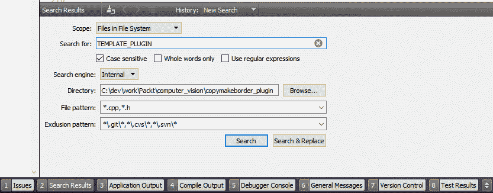

10.  这会将“搜索结果”窗格切换到“替换”模式。 用`COPYMAKEBORDER_PLUGIN`填充替换为：字段，然后单击替换按钮。 显示如下：


11.  在前面的步骤中，我们使用查找和替换 Qt Creator 的功能将所有`TEMPLATE_PLUGIN`条目替换为`COPYMAKEBORDER_PLUGIN`。 使用相同的技能，并用`copymakeborder_plugin`替换所有`template_plugin`条目，并用`CopyMakeBorder_Plugin`替换所有`Template_Plugin`条目。 这样，我们的新插件项目就可以进行编程了，并最终可以在`Computer_Vision`项目中使用。

本章第一个示例项目中的所有上述所有步骤仅用于准备插件项目，从现在开始，无论何时需要，我们将这些步骤与**克隆或（复制）模板插件**来创建`X`插件，而在此示例中，`X`就是`copymakeborder_plugin`。 这将帮助我们避免大量重复的说明，同时，将使我们能够更加专注于学习新的 OpenCV 和 Qt 技能。 通过前面的步骤，尽可能地冗长而冗长，我们将避免处理图像读取，显示图像，选择正确的语言，选择正确的主题和样式以及许多其他任务，因为它们全都位于 `Computer_Vision`项目的一个子项目，称为`mainapp`，仅是 **Qt Widgets 应用**，负责处理所有与插件无关的任务，这些插件不涉及执行特定计算机视觉任务的插件。 在以下步骤中，我们将简单地填写插件的现有功能并创建其所需的 GUI。 然后，我们可以将构建的插件库文件复制到`Computer_Vision`可执行文件旁边的`cvplugins`文件夹中，并且当我们在`Computer_Vision`项目中运行`mainapp`时，每个插件都将在来自主菜单的`Plugins`中显示为条目，包括新添加的菜单。 本书其余部分的所有示例都将遵循相同的模式，至少在很大程度上，这意味着，除非我们需要专门更改插件或主应用的一部分，否则有关克隆和创建新版本的所有说明均应遵循。 插件（之前的步骤）将被省略。

如前几章所述，更改`*.pro`文件（或多个文件）后手动运行`qmake`始终是一个好主意。 只需在 Qt Creator 的“项目”窗格中右键单击该项目，然后单击“运行`qmake`”。

12.  现在该为我们的插件编写代码并相应地创建其 GUI 了。 打开`plugin.ui`文件，并确保其用户界面包含以下小部件。 另外，请注意小部件的`objectName`值。 请注意，整个`PluginGui`文件的布局都设置为网格布局，如下所示：

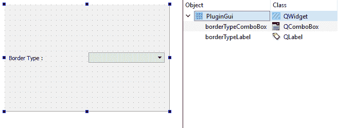

13.  将`borderTypeLabel`的`size Policy` / `Horizontal Policy`属性设置为`Fixed`。 这将确保标签根据其宽度占据固定的水平空间。
14.  通过右键单击`borderTypeComboBox`小部件的`currentIndexChanged(int)`信号添加方法，选择“转到插槽...”，选择提到的信号，然后单击“确定”按钮。 然后，在此函数的新创建函数（准确地说是插槽）中编写以下代码行：

```cpp
        emit updateNeeded(); 
```

该信号的目的是告诉`mainapp`，在组合框的所选项目发生更改之后，插件可能会产生不同的结果，并且`mainapp`可能希望基于此信号更新其 GUI。 您可以检查`mainapp`项目的源代码，您会注意到所有插件的信号都连接到`mainapp`中的相关插槽，该插槽仅调用插件的`processImage`函数。

15.  现在，在`copymakeborder_plugin.cpp`文件中，将以下代码添加到其`setupUi`函数中。 `setupUi`函数的内容应如下所示：

```cpp
        ui = new Ui::PluginGui; 
        ui->setupUi(parent); 
        QStringList items; 
        items.append("BORDER_CONSTANT"); 
        items.append("BORDER_REPLICATE"); 
        items.append("BORDER_REFLECT"); 
        items.append("BORDER_WRAP"); 
        items.append("BORDER_REFLECT_101"); 
        ui->borderTypeComboBox->addItems(items); 
        connect(ui->borderTypeComboBox, 
        SIGNAL(currentIndexChanged(int)), 
        this, 
        SLOT(on_borderTypeComboBox_currentIndexChanged(int))); 
```

我们已经熟悉了与 UI 相关的启动调用，这些调用与每个 Qt Widgets 应用中的调用几乎相同，正如我们在上一章中了解到的那样。 之后，我们用相关项填充组合框，这些项只是`cv::BorderTypes`枚举中的条目。 如果按此顺序插入，则每个项目索引值将与其对应的枚举值相同。 最后，我们将所有信号手动连接到插件中的相应插槽。 请注意，这与常规 Qt 窗口小部件应用稍有不同，在常规应用中，您无需连接名称兼容的信号和插槽，因为它们是通过调用代码文件中的`QMetaObject:: connectSlotsByName`自动连接的，代码文件由 UIC 自动生成（请参阅第 3 章，“创建综合 Qt + OpenCV 项目”）。

16.  最后，更新插件中的`processImage`函数，如下所示：

```cpp
        int top, bot, left, right; 
        top = bot = inputImage.rows/2; 
        left = right = inputImage.cols/2; 
        cv::copyMakeBorder(inputImage, 
            outputImage, 
            top, 
            bot, 
            left, 
            right, 
        ui->borderTypeComboBox->currentIndex()); 
```

在这里，我们将调用`copyMakeBorder`函数，该函数也称为内部函数，该函数需要处理有关图像外部不存在的像素的假设。 我们仅假设图像顶部和底部添加的边框是图像高度的一半，而图像左侧和右侧添加的边框是图像宽度的一半。 至于`borderType`参数，我们只需从插件 GUI 上的选定项中获取即可。

一切都完成了，我们可以测试我们的插件了。 通过在“项目”窗格中右键单击整个`Computer_Vision`多项目并从菜单中选择“重建”（以确保清除并重建了所有内容），确保构建了整个`Computer_Vision`多项目。 然后，转到插件`Build`文件夹，从那里复制库文件，然后将其粘贴到`mainapp`可执行文件旁边的`cvplugins`文件夹中（在主应用`Build`文件夹中），最后运行`mainapp` 来自 Qt Creator。

`mainapp`启动后，您将面临一条错误消息（如果未复制插件或格式错误），或者最终将出现在`Computer_Vision`应用主窗口中。 然后，如果尚未选择`mainapp`的插件菜单，则可以选择我们刚刚构建的插件。 您可以在`mainapp`主窗口的组框中看到我们为插件设计的 GUI。 然后，您可以使用主菜单打开或保存图形场景的内容。 尝试打开一个文件，然后在插件组合框中的不同选项之间切换。 您也可以通过选中查看原始图像复选框来查看原始图像。 这是屏幕截图：

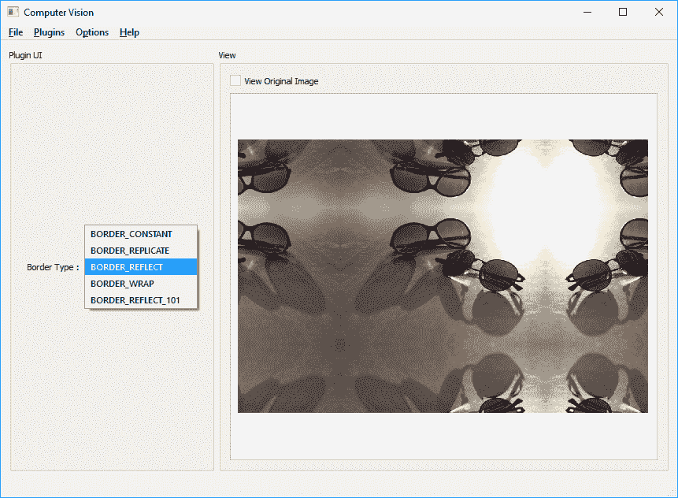

从组合框中选择任何其他“边框类型”，您将立即注意到结果图像的变化。 重要的是要注意`BORDER_REFLECT_101`也是默认的边框类型（如果您未在 OpenCV 过滤和类似函数中指定一个），则与`BORDER_REFLECT`十分相似，但不会重复边界之前的最后一个像素。 有关此的更多信息，请参见`cv::BorderTypes`的 OpenCV 文档页面。 如前所述，这是需要处理外部（不存在）像素的相似插值的每个 OpenCV 函数相同的结果：

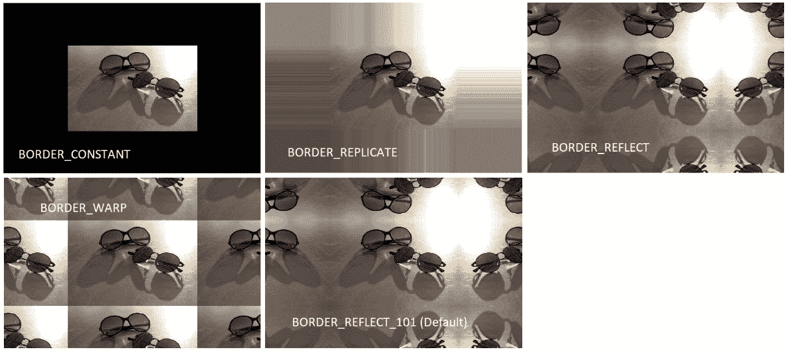

而已。 现在，我们准备开始使用 OpenCV 中可用的过滤函数。

# OpenCV 中的过滤函数

OpenCV 中的所有过滤函数均会拍摄图像，并产生尺寸和通道完全相同的图像。 如前所述，它们也都带有`borderType`参数，我们刚刚完成了实验和学习。 除此之外，每个过滤函数都有自己的必需参数来配置其行为。 这是可用的 OpenCV 过滤函数的列表及其说明和使用方法。 在列表的最后，您可以找到一个示例插件（称为`filter_plugin`）及其源代码的链接，其中包括以下列表中提到的大多数过滤器，并带有 GUI 控件以试验不同的参数和设置。 为每一个：

*   `bilateralFilter`：可用于获取图像的`Bilateral Filtered`副本。 根据`σ`值和直径，您可以获得的图像看上去可能与原始图像没有太大差异，或者获得的图像看起来像卡通图像（如果`σ`值足够高）。 这是`bilateralFilter`函数作为我们的应用的插件工作的示例代码：

```cpp
        bilateralFilter(inpMat,outMat,15,200,200); 
```

这是`bilateralFilter`函数的屏幕截图：


*   `blur`，`boxFilter`，`sqrBoxFilter`，`GaussianBlur`和`medianBlur`：这些均用于获取输入图像的平滑版本。 所有这些函数都使用核大小参数，该参数与直径参数基本相同，并且用于确定从中计算出滤波后像素的相邻像素的直径。 （尽管我们没有了解它们的详细信息，但是这些过滤器函数与我们在本书前面各章中使用的过滤器函数相同。）`GaussianBlur`函数需要提供高斯核标准差（`σ`）参数，在`X`和`Y`方向上。 （有关这些参数的数学来源的足够信息，请参阅 OpenCV 文档。）实际上，值得注意的是，高斯过滤器中的核大小必须为奇数和正数。 同样，如果核大小也足够高，较高的`σ`值只会对结果产生重大影响。 以下是提到的平滑过滤器的几个示例（左侧为`GaussianBlur`，右侧为`medianBlur`），以及示例函数调用：

```cpp
        Size kernelSize(5,5); 
        blur(inpMat,outMat,kernelSize); 
        int depth = -1; // output depth same as source 
        Size kernelSizeB(10,10); 
        Point anchorPoint(-1,-1); 
        bool normalized = true; 
        boxFilter(inutMat,outMat,depth, 
           kernelSizeB,anchorPoint, normalized); 
        double sigma = 10; 
        GaussianBlur(inpMat,outMat,kernelSize,sigma,sigma); 
        int apertureSize = 10; 
        medianBlur(inpMat,outMat,apertureSize); 
```

以下屏幕截图描绘了高斯和中值模糊的结果以及用于设置其参数的 GUI：

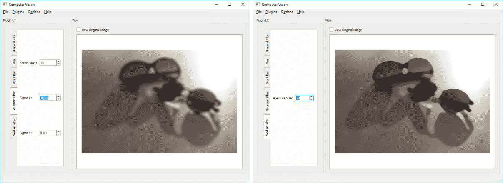

*   `filter2D`：此函数可用于将自定义过滤器应用于图像。 您需要为此函数提供的一个重要参数是核矩阵。 此函数非常强大，它可以产生许多不同的结果，包括与我们先前看到的模糊函数相同的结果，以及许多其他过滤器，具体取决于提供的核。 这里有几个示例核，以及如何使用它们以及生成的图像。 确保尝试使用不同的核（您可以在互联网上搜索大量有用的核矩阵），并亲自尝试使用此函数：

```cpp
        // Sharpening image 
        Matx33f f2dkernel(0, -1, 0, 
                         -1, 5, -1, 
                          0, -1, 0); 
        int depth = -1; // output depth same as source 
        filter2D(inpMat,outMat,depth,f2dkernel); 

        ***** 

        // Edge detection 
        Matx33f f2dkernel(0, +1.5, 0, 
                          +1.5, -6, +1.5, 
                          0, +1.5, 0); 
        int depth = -1; // output depth same as source 
          filter2D(inpMat,outMat,depth,f2dkernel); 
```

前面代码中第一个核的结果图像显示在左侧（这是图像的锐化版本），而第二个产生图像边缘检测的核在右侧可见：

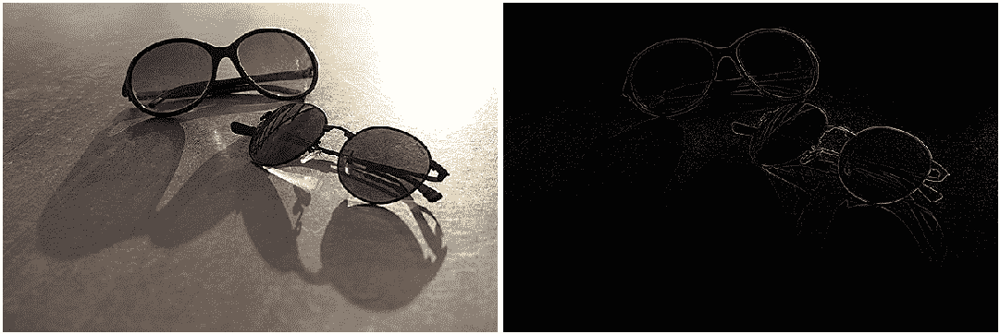

*   `Laplacian`，`Scharr`，`Sobel`和`spatialGradient`：这些函数处理图像导数。 图像导数在计算机视觉中非常重要，因为它们可用于检测图像中具有变化或更好的是显着变化的区域（因为这是导数的用例之一）。 无需过多地讨论其理论和数学细节，可以提及的是，在实践中，它们用于处理边缘或角点检测，并且在 OpenCV 框架中被关键点提取方法广泛使用。 在前面的示例和图像中，我们还使用了导数计算核。 以下是一些有关如何使用它们以及产生的图像的示例。 屏幕截图来自`Computer_Vision`项目和`filter_plugin`，此列表后不久有一个链接。 您始终可以使用 Qt 控件（例如旋转框，刻度盘和滑块）来获取 OpenCV 函数的不同参数值，以更好地控制该函数的行为：

```cpp
        int depth = -1; 
        int dx = 1; int dy = 1; 
        int kernelSize = 3; 
        double scale = 5; double delta = 220; 
        Sobel(inpMat, outMat, depth,dx,dy,kernelSize,scale,delta); 
```

以下是上述代码的输出屏幕截图：

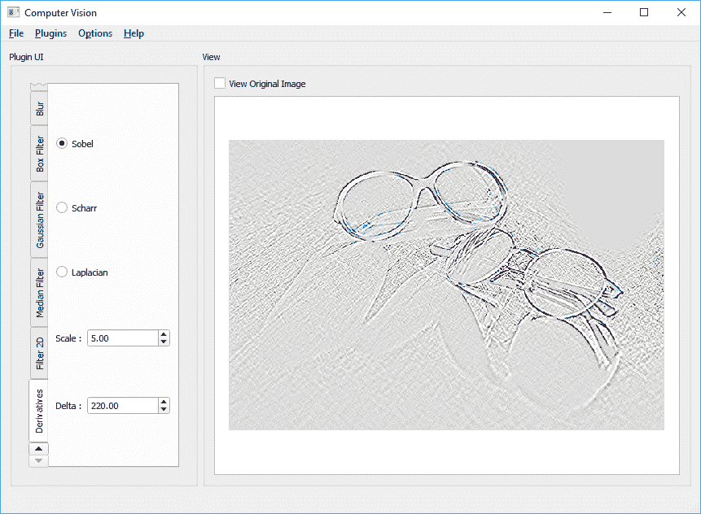

如果我们使用以下代码：

```cpp
        int depth = -1; 
        int dx = 1; int dy = 0; 
        double scale = 1.0; double delta = 100.0; 
        Scharr(inpMat,outMat,depth,dx,dy,scale,delta); 
```

我们最终会得到类似于以下内容：

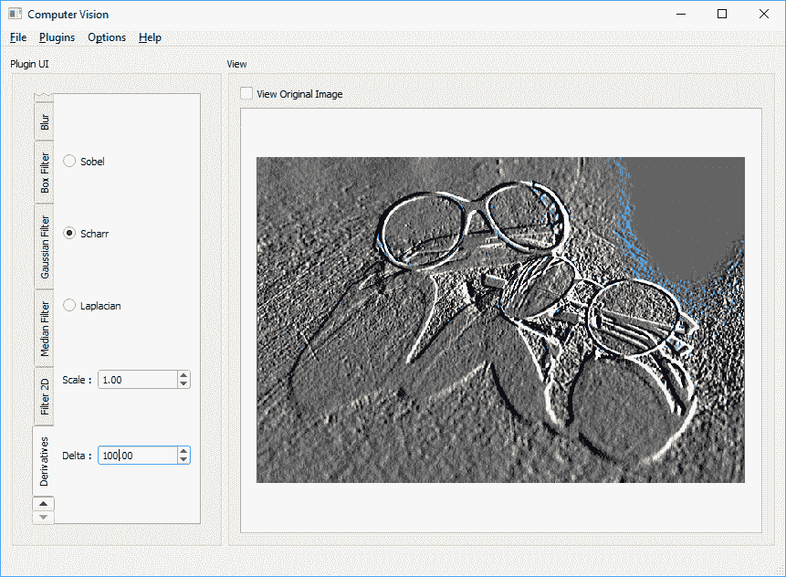

对于以下代码：

```cpp
        int depth = -1; int kernelSize = 3; 
        double scale = 1.0; double delta = 0.0; 
        Laplacian(inpMat,outMat,depth, kernelSize,scale,delta); 
```

将产生类似于以下内容：


*   `erode`和`dilate`：从它们的名称可以猜出这些函数，它们对于获得腐蚀和膨胀效果很有用。 这两个函数都采用一个结构元素矩阵，可以通过简单地调用`getStructuringElement`函数来构建它。 （可选）您可以选择多次运行该函数（或对其进行迭代），以获得越来越腐蚀或膨胀的图像。 以下是如何同时使用这两个函数及其生成的图像的示例：

```cpp
        erode(inputImage, 
        outputImage, 
        getStructuringElement(shapeComboBox->currentIndex(), 
        Size(5,5)), // Kernel size 
        Point(-1,-1), // Anchor point (-1,-1) for default 
        iterationsSpinBox->value()); 
```

以下是生成的图像：

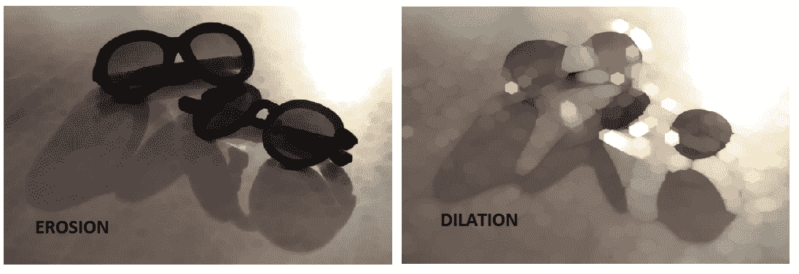

您可以将完全相同的参数传递给`dilate`函数。 在前面的代码中，假设使用组合框小部件获取结构元素的形状，该小部件可以是`MORPH_RECT`，`MORPH_CROSS`或`MORPH_ELLIPSE`。 同样，通过使用**旋转框**小部件设置迭代计数，该小部件可以是大于零的数字。

让我们继续下一个函数：

*   `morphologyEx`：此函数可用于执行各种形态学操作。 它需要一个操作类型参数以及我们在`dilate`和`erode`函数中使用的相同参数。 以下是可以传递给`morphologyEx`函数的参数及其含义：
    *   `MORPH_ERODE`：产生与`erode`函数相同的结果。
    *   `MORPH_DILATE`：产生与`dilate`函数相同的结果。
    *   `MORPH_OPEN`：可用于执行打开操作。 这与对侵蚀的图像进行放大相同，对于消除图像中的细微伪影很有用。
    *   `MORPH_CLOSE`：可用于执行关闭操作。 它与侵蚀膨胀的图像相同，可用于消除线条中的细小断开等。
    *   `MORPH_GRADIENT`：此函数提供图像的轮廓，并且与同一图像的侵蚀和膨胀版本的区别相同。
    *   `MORPH_TOPHAT`：可用于获取图像与其打开的变形之间的差异。
    *   `MORPH_BLACKHAT`：这可以用来获取图像关闭和图像本身之间的差异。

这是一个示例代码，并且如您所见，该函数调用与扩散和侵蚀非常相似。 再次，我们假设使用组合框小部件选择了形态类型和形状，并使用`SpinBox`选择了迭代计数：

```cpp
        morphologyEx(inputImage, 
            outputImage, 
            morphTypeComboBox->currentIndex(), 
            getStructuringElement(shapeComboBox->currentIndex(), 
            Size(5,5)), // kernel size 
            Point(-1,-1), // default anchor point 
        iterationsSpinBox->value()); 
```

以下是不同形态学操作的结果图像：


您可以使用以下链接获取`filter_plugin`源代码的副本，该代码与`Computer_Vision`项目兼容，并且包括您在本节中学到的大多数图像过滤函数。 您可以使用同一插件来测试并生成本节中看到的大多数图像。 尝试扩展插件以控制更多参数，或者尝试向插件添加更多功能。 这是`filter_plugin`源代码的链接：[您可以使用以下链接](https://github.com/PacktPublishing/Computer-Vision-with-OpenCV-3-and-Qt5/tree/master/ch06/filter_plugin)。

# 图像转换函数

在本节中，您将了解 OpenCV 中可用的图像转换函数。 通常，如果您查看 OpenCV 文档，则 OpenCV 中有两种图像转换类别，称为几何转换和其他（仅表示其他一切）转换。 在此解释其原因。

**几何变换**可以从其名称中猜出，主要处理图像的几何属性，例如图像的大小，方向，形状等。 注意，几何变换不会改变图像的内容，而只是根据几何变换类型通过在图像的像素周围移动来改变其形式和形状。 与我们在上一节开始时对图像进行过滤一样，几何变换函数还需要处理图像外部像素的外推，或者简单地说，在计算像素时对不存在的像素进行假设。 转换后的图像。 为此，当我们处理第一个示例`copymakeborder_plugin`时，可以使用本章前面学习的相同`cv::BorderTypes`枚举。

除此之外，除了所需的外推法之外，几何变换函数还需要处理像素的内插，因为变换后的图像中像素的计算位置将为`float`（或`double`）类型，而不是 `integer`，并且由于每个像素只能具有单一颜色，并且必须使用整数指定其位置，因此需要确定像素的值。 为了更好地理解这一点，让我们考虑一种最简单的几何变换，即调整图像大小，这是使用 OpenCV 中的`resize`函数完成的。 例如，您可以将图像调整为其大小的一半，完成后，计算出的图像中至少一半像素的新位置将包含非整数值。 位置`(2,2)`中的像素将位于调整大小后的图像中的位置`(1,1)`，但是位置`(3,2)`中的像素将需要位于位置`(1.5,1)`中，依此类推。 OpenCV 提供了许多插值方法，这些方法在`cv::InterpolationFlags`枚举中定义，其中包括：

*   `INTER_NEAREST`：这是用于最近邻插值
*   `INTER_LINEAR`：用于双线性插值
*   `INTER_CUBIC`：这用于双三次插值
*   `INTER_AREA`：这是用于像素区域关系重采样
*   `INTER_LANCZOS4`：这是用于`8x8`附近的 Lanczos 插值

几乎所有的几何变换函数都需要提供`cv::BorderType`和`cv::InterpolationFlags`参数，以处理所需的外推和内插参数。

# 几何转换

现在，我们将从一些最重要的几何转换开始，然后学习色彩空间以及它们如何与一些广泛使用的非几何（或其他）转换相互转换。 因此，它们是：

*   `resize`：此函数可用于调整图像尺寸。 这是一个用法示例：

```cpp
        // Resize to half the size of input image 
        resize(inMat, outMat, 
        Size(), // an empty Size 
        0.5, // width scale factor 
        0.5, // height scale factor 
        INTER_LANCZOS4); // set the interpolation mode to Lanczos 

        // Resize to 320x240, with default interpolation mode 
        resize(inMat, outMat, Size(320,240)); 
```

*   `warpAffine`：此函数可用于执行仿射变换。 您需要为此函数提供适当的变换矩阵，可以使用`getAffineTransform`函数获得该矩阵。 `getAffineTransform`函数必须提供两个三角形（源三角形和变换三角形），或者换句话说，提供两组三个点。 这是一个例子：

```cpp
        Point2f triangleA[3]; 
        Point2f triangleB[3]; 

        triangleA[0] = Point2f(0 , 0); 
        triangleA[1] = Point2f(1 , 0); 
        triangleA[2] = Point2f(0 , 1); 

        triangleB[0] = Point2f(0, 0.5); 
        triangleB[1] = Point2f(1, 0.5); 
        triangleB[2] = Point2f(0.5, 1); 

        Mat affineMat = getAffineTransform(triangleA, triangleB); 

        warpAffine(inputImage, 
        outputImage, 
        affineMat, 
        inputImage.size(), // output image size, same as input 
        INTER_CUBIC, // Interpolation method 
        BORDER_WRAP); // Extrapolation method 
```

这是结果图像：

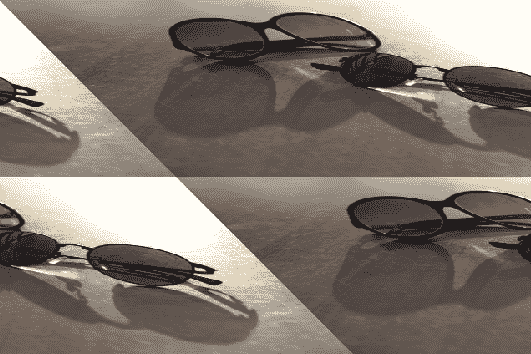

您也可以使用`warpAffine`函数来旋转源图像。 只需使用`getRotationMatrix2D`函数来获取我们在前面的代码中使用的变换矩阵，然后将其与`warpAffine`函数一起使用。 请注意，此方法可用于执行任意角度的旋转，而不仅仅是 90 度旋转及其乘数。 这是一个示例代码，它围绕图像的中心旋转源图像`-45.0`度。 您也可以选择缩放输出图像。 在此示例中，我们在旋转输出图像时将其缩放为源图像大小的一半：

```cpp
        Point2f center = Point(inputImage.cols/2, 
          inputImage.rows/2); 
       double angle = -45.0; 
       double scale = 0.5; 
       Mat rotMat = getRotationMatrix2D(center, angle, scale); 

       warpAffine(inputImage, 
                  outputImage, 
                  rotMat, 
                  inputImage.size(), 
                  INTER_LINEAR, 
                  BORDER_CONSTANT); 
```

以下是生成的输出屏幕截图：

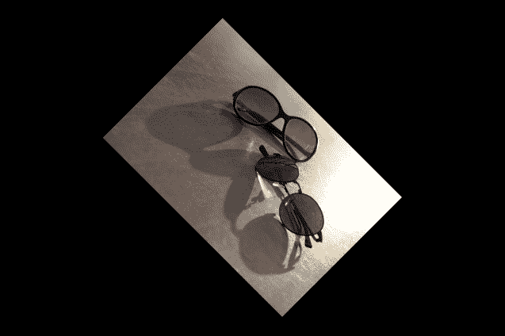

*   `warpPerspective`：此函数对于执行透视变换很有用。 与`warpAffine`函数相似，此函数还需要可以使用`findHomography`函数获得的变换矩阵。 `findHomography`函数可用于计算两组点之间的单应性变化。 这是一个示例代码，其中我们使用两组角点来计算单应性更改矩阵（或`warpPerspective`的变换矩阵），然后使用它执行透视更改。 在此示例中，我们还将外推颜色值（可选）设置为深灰色阴影：

```cpp
        std::vector<Point2f> cornersA(4); 
        std::vector<Point2f> cornersB(4); 

        cornersA[0] = Point2f(0, 0); 
        cornersA[1] = Point2f(inputImage.cols, 0); 
        cornersA[2] = Point2f(inputImage.cols, inputImage.rows); 
        cornersA[3] = Point2f(0, inputImage.rows); 

        cornersB[0] = Point2f(inputImage.cols*0.25, 0); 
        cornersB[1] = Point2f(inputImage.cols * 0.90, 0); 
        cornersB[2] = Point2f(inputImage.cols, inputImage.rows); 
        cornersB[3] = Point2f(0, inputImage.rows * 0.80); 

        Mat homo = findHomography(cornersA, cornersB); 
        warpPerspective(inputImage, 
                      outputImage, 
                      homo, 
                      inputImage.size(), 
                      INTER_LANCZOS4, 
                      BORDER_CONSTANT, 
                      Scalar(50,50,50)); 
```

以下是生成的输出屏幕截图：


*   `remap`：此函数是非常强大的几何变换函数，可用于执行从源到输出图像的像素重映射。 这意味着您可以将像素从源图像重定位到目标图像中的其他位置。 您可以模拟以前的转换和许多其他转换的相同行为，只要您创建正确的映射并将其传递给此函数即可。 这是几个示例，它们演示`remap`函数的功能以及使用起来的难易程度：

```cpp
        Mat mapX, mapY; 
        mapX.create(inputImage.size(), CV_32FC(1)); 
        mapY.create(inputImage.size(), CV_32FC(1)); 
        for(int i=0; i<inputImage.rows; i++) 
        for(int j=0; j<inputImage.cols; j++) 
        { 
           mapX.at<float>(i,j) = j * 5; 
           mapY.at<float>(i,j) = i * 5; 
        } 

        remap(inputImage, 
         outputImage, 
         mapX, 
         mapY, 
         INTER_LANCZOS4, 
         BORDER_REPLICATE); 
```

从前面的代码中可以看出，除了输入和输出图像以及内插和外推参数之外，我们还需要提供映射矩阵，一个用于`X`方向，另一个用于`Y`方向。 这是从前面的代码重新映射的结果。 它只是使图像缩小了五倍（请注意，图像尺寸在`remap`函数中保持不变，但内容基本上被压缩为原始尺寸的五倍）。 在下面的屏幕快照中显示了该内容：

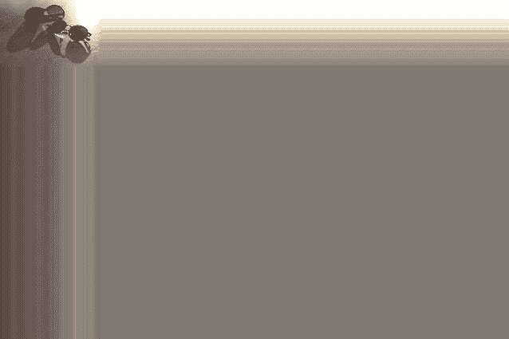

您可以尝试通过简单地替换两个`for`循环中的代码，并用不同的值填充`mapX`和`mapY`矩阵来尝试多种不同的图像重映射。 以下是一些重新映射的示例：

考虑第一个示例：

```cpp
    // For a vertical flip of the image 
    mapX.at<float>(i,j) = j; 
    mapY.at<float>(i,j) = inputImage.rows-i; 
```

考虑以下示例：

```cpp
    // For a horizontal flip of the image 
    mapX.at<float>(i,j) = inputImage.cols - j; 
    mapY.at<float>(i,j) = i;
```

通常最好将 OpenCV 图像坐标转换为标准坐标系（笛卡尔坐标系），并以标准坐标处理`X`和`Y`，然后再将其转换回 OpenCV 坐标系。 原因很简单，就是我们在学校或任何几何书籍或课程中学习的坐标系都使用笛卡尔坐标系。 另一个原因是它还提供负坐标，这在处理转换时具有更大的灵活性。 这是一个例子：

```cpp
    Mat mapX, mapY; 
    mapX.create(inputImage.size(), CV_32FC(1)); 
    mapY.create(inputImage.size(), CV_32FC(1)); 

    // Calculate the center point 
    Point2f center(inputImage.cols/2, 
                   inputImage.rows/2); 

    for(int i=0; i<inputImage.rows; i++) 
      for(int j=0; j<inputImage.cols; j++) 
      { 
        // get i,j in standard coordinates, thus x,y 
        double x = j - center.x; 
        double y = i - center.y; 

        // Perform a mapping for X and Y 
        x = x*x/500; 
        y = y; 

        // convert back to image coordinates 
        mapX.at<float>(i,j) = x + center.x; 
        mapY.at<float>(i,j) = y + center.y; 
      } 

      remap(inputImage, 
           outputImage, 
           mapX, 
           mapY, 
           INTER_LANCZOS4, 
           BORDER_CONSTANT); 
```

这是前面的代码示例中的映射操作的结果：


`remap`函数的另一个（也是非常重要的）用途是校正图像中的镜头失真。 您可以使用`initUndistortRectifyMap`和`initWideAngleProjMap`函数在`X`和`Y`方向上获取所需的映射以进行失真校正，然后将它们传递给`remap`函数。

您可以使用以下链接获取`transform_plugin`的源代码副本，该代码与`Computer_Vision`项目兼容，并包括您在本节中学到的转换函数。 您可以使用同一插件来测试并生成本节中看到的大多数图像。 尝试扩展插件以控制更多参数，或者尝试不同的映射操作并自己尝试不同的图像。 [这是`transform_plugin`源代码的链接](https://github.com/PacktPublishing/Computer-Vision-with-OpenCV-3-and-Qt5/tree/master/ch06/transform_plugin)。

# 杂项转换

**杂项转换**处理其他不能视为几何转换的其他任务，例如颜色空间（和格式）转换，应用颜色图，傅里叶转换等。 让我们看看它们。

# 颜色和色彩空间

简而言之，色彩空间是用于表示图像中像素颜色值的模型。 严格来讲，计算机视觉中的颜色由一个或多个数值组成，每个数值对应于一个通道，以 OpenCV `Mat`类而言。 因此，色彩空间是定义这些数值（或多个数值）如何转换为色彩的模型。 让我们以一个示例案例来更好地理解这一点。 最受欢迎的颜色空间之一（有时也称为图像格式，尤其是在 Qt 框架中）是 RGB 颜色空间，其中颜色是由红色，绿色和蓝色的组合制成的。 RGB 色彩空间已被电视，监视器，LCD 和类似的显示屏广泛使用。 另一个示例是 CMYK（或 **CMYB**（**青色，栗色，黄色，黑色**））颜色空间，可以猜到它是四通道颜色空间，并且它主要用于彩色打印机。 还有许多其他色彩空间，每个色彩空间都有各自的优势和用例，但是我们将使用给定的示例，因为我们将主要关注于将不常见的色彩空间转换为更常见的色彩空间，尤其是灰度和 BGR（请注意 B 和 R 在 BGR 中交换，否则类似于 RGB）颜色空间，这是大多数处理彩色图像的 OpenCV 函数中的默认颜色空间。

正如我们刚刚提到的，在计算机视觉科学中，因此在 OpenCV 框架中，通常需要将色彩空间相互转换，因为在某些色彩空间中，通常更容易区分图像的某些属性。 同样，正如我们在前几章中已经了解的那样，我们可以使用 Qt Widget 轻松显示 BGR 图像，但是对于其他颜色空间则无法如此。

OpenCV 框架允许使用`cvtColor`函数在不同的色彩空间之间进行转换。 此函数仅将输入和输出图像与转换代码（在`cv::ColorConversionCodes`枚举中的条目）一起使用。 以下是几个示例：

```cpp
    // Convert BGR to HSV color space 
    cvtColor(inputImage, outputImage, CV_BGR2HSV); 

    // Convert Grayscale to RGBA color space 
    cvtColor(inputImage, outputImage, CV_GRAY2RGBA); 
```

OpenCV 框架提供了一个称为`applyColorMap`的函数（类似于`remap`函数，但本质上有很大不同），该函数可用于将输入图像的颜色映射到输出图像中的其他颜色。 您只需要为它提供`cv::ColormapTypes`枚举的输入图像，输出图像和颜色映射类型。 这是一个简单的例子：

```cpp
    applyColorMap(inputImage, outputImage, COLORMAP_JET); 
```

以下是上述代码的输出屏幕截图：

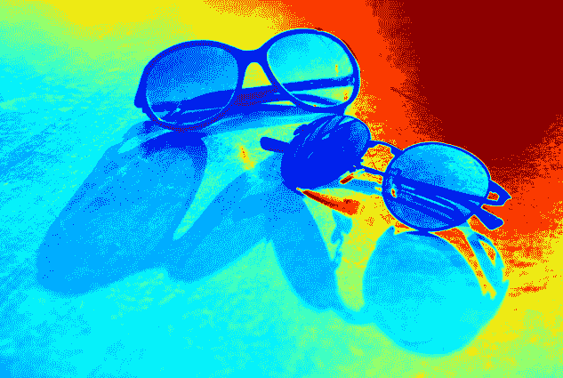

您可以使用以下链接获取`color_plugin`的源代码副本，该代码与`Computer_Vision`项目兼容，并包括在本节中学习的由适当的用户界面控制的颜色映射函数。 使用此处提供的源代码，尝试不同的颜色映射操作并自己尝试使用不同的图像。 [这是`color_plugin`源代码的链接](https://github.com/PacktPublishing/Computer-Vision-with-OpenCV-3-and-Qt5/tree/master/ch06/color_plugin)。

# 图像阈值

在计算机视觉科学中，阈值化是图像分割的一种方法，其本身就是在强度，颜色或任何其他图像属性方面区分相关像素组的过程。 OpenCV 框架通常提供许多功能来处理图像分割。 但是，在本节中，您将了解 OpenCV 框架（以及计算机视觉）中两种最基本的（尽管已广泛使用）图像分割方法：`threshold`和`adaptiveThreshold`。 因此，在不浪费更多单词的情况下，它们是：

*   `threshold`：此函数可用于向图像应用固定级别的阈值。 尽管可以对多通道图像使用此函数，但通常在单通道（或灰度）图像上使用它来创建二进制图像，该图像具有可接受的像素和超过阈值的像素。 让我们用一个示例场景来说明这一点，您可能会遇到很多情况。 假设我们需要检测图像的最暗部分，换句话说，检测图像中的黑色。 这是我们可以使用阈值函数来仅滤除图像中像素值几乎为黑色的像素的方法：

```cpp
        cvtColor(inputImage, grayScale, CV_BGR2GRAY); 
        threshold(grayScaleIn, 
                 grayScaleOut, 
                 45, 
                 255, 
                 THRESH_BINARY_INV); 
        cvtColor(grayScale, outputImage, CV_GRAY2BGR); 
```

在前面的代码中，首先，我们将输入图像转换为灰度颜色空间，然后应用阈值函数，然后将结果转换回 BGR 颜色空间。 这是生成的输出图像：

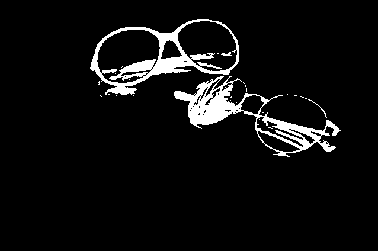

在前面的示例代码中，我们使用`THRESH_BINARY_INV`作为阈值类型参数； 但是，如果我们使用`THRESH_BINARY`，我们将得到结果的倒排版本。 `threshold`函数只是为我们提供了所有大于阈值参数的像素，在前面的示例中为`40`。

下一个是`adaptiveThreshold`：

*   `adaptiveThreshold`：可用于将自适应阈值应用于灰度图像。 根据传递给它的自适应方法（`cv::AdaptiveThresholdTypes`），此函数可用于分别自动计算每个像素的阈值。 但是，您仍然需要传递最大阈值，块大小（可以为 3、5、7 等），以及将从计算出的块平均值中减去的常数，可以是零。 这是一个例子：

```cpp
        cvtColor(inputImage, grayScale, CV_BGR2GRAY); 
        adaptiveThreshold(grayScale, 
                          grayScale, 
                          255, 
                          ADAPTIVE_THRESH_GAUSSIAN_C, 
                          THRESH_BINARY_INV, 
                          7, 
                          0); 
        cvtColor(grayScale, outputImage, CV_GRAY2BGR); 
```

与之前一样，以及我们在阈值函数中所做的操作，我们将首先将图像色彩空间从 BGR 转换为灰度，然后应用自适应阈值，最后将其转换回。 这是前面的示例代码的结果：


使用以下链接获取`segmentation_plugin`的源代码副本，该代码与`Computer_Vision`项目兼容，并包括在本节中学习的阈值函数，[并由适当的用户界面控制](https://github.com/PacktPublishing/Computer-Vision-with-OpenCV-3-and-Qt5/tree/master/ch06/segmentation_plugin)。

# 离散傅立叶变换

傅立叶变换可用于从时间函数中获取基本频率。 另一方面，**离散傅里叶变换**或 **DFT** 是一种计算采样时间函数（因此是离散的）的基础频率的方法。 那是一个纯粹的数学定义，从这个意义上来说是一个很短的定义，因此，就计算机视觉和图像处理而言，您首先需要尝试将图像（灰度图像）视为点上离散点的分布。 三维空间，其中每个离散元素的`X`和`Y`是图像中的像素位置，`Z`是像素的强度值。 如果您能够做到这一点，那么您还可以想象存在一个可以在空间中产生这些点的函数。 考虑到这种情况，傅立叶变换是将函数转换为其基础频率的方法。 如果您仍然感到迷路，请不要担心。 如果您不熟悉该概念，则绝对应该考虑在线阅读有关傅立叶变换的数学知识，或者甚至可以咨询您的数学教授。

在数学中，傅立叶分析是一种基于输入数据的傅立叶变换来获取信息的方法。 同样，为了使这种含义更具有计算机视觉意义，可以使用图像的 DFT 来导出最初在原始图像本身中不可见的信息。 视计算机视觉应用的目标领域而定，差异很大，但是我们将看到一个示例案例，以更好地理解 DFT 的使用方式。 因此，首先，您可以在 OpenCV 中使用`dft`函数来获取图像的 DFT。 请注意，由于图像（灰度）是 2D 矩阵，因此`dft`实际上将执行 2D 离散傅立叶变换，从而产生具有复数值的频率函数。 这是在 OpenCV 中对灰度（单通道）图像执行 DFT 的方法：

1.  我们需要首先获得最佳大小来计算图像的 DFT。 在大小为 2 的幂（2、4、8、16 等）的数组上执行 DFT 变换是一个更快，更有效的过程。 对大小为`2`乘积的数组执行的 DFT 转换也非常有效。 因此，使用我们刚刚提到的原理的`getOptimalDFTSize`用于获得大于我们图像尺寸的最小尺寸，这对于执行 DFT 是最佳的。 这是完成的过程：

```cpp
        int optH = getOptimalDFTSize( grayImg.rows ); 
        int optW = getOptimalDFTSize( grayImg.cols ); 
```

2.  接下来，我们需要创建具有此最佳尺寸的图像，并使用零填充添加的宽度和高度中的像素。 因此，我们可以使用本章前面了解的`copyMakeBorder`函数：

```cpp
        Mat padded; 
        copyMakeBorder(grayImg, 
                        padded, 
                        0, 
                        optH - grayImg.rows, 
                        0, 
                        optW - grayImg.cols, 
                        BORDER_CONSTANT, 
                        Scalar::all(0)); 
```

3.  现在，我们在`padded`中拥有了最佳尺寸的图像。 我们现在需要做的是形成一个适合于馈入`dft`函数的两通道`Mat`类。 这可以使用合并函数来完成。 请注意，由于`dft`需要浮点`Mat`类，因此我们还需要将最佳尺寸的图像转换为带有浮点元素的`Mat`类，如下所示：

```cpp
         Mat channels[] = {Mat_<float>(padded), 
                      Mat::zeros(padded.size(), 
                      CV_32F)}; 
        Mat complex; 
        merge(channels, 2, complex); 
```

4.  一切准备就绪即可执行离散傅立叶变换，因此我们将其简称为此处所示。 结果也存储在`complex`中，这将是一个复杂值`Mat`类：

```cpp
        dft(complex, complex); 
```

5.  现在，我们需要将复杂的结果分为真实和复杂的部分。 为此，我们可以再次使用`channels`数组，如下所示：

```cpp
        split(complex, channels); 
```

6.  现在，我们需要使用`magnitude`函数将复杂结果转换为其大小； 经过更多的转换之后，这将是适合于显示目的的结果。 由于`channels`现在包含复杂结果的两个通道，因此我们可以在`magnitude`函数中使用它，如下所示：

```cpp
        Mat mag; 
        magnitude(channels[0], channels[1], mag); 
```

7.  `magnitude`函数的结果（如果尝试查看元素）将非常大，以至于无法使用灰度图像的可能比例进行可视化。 因此，我们将使用以下代码行将其转换为更小的对数刻度：

```cpp
        mag += Scalar::all(1); 
        log(mag, mag); 
```

8.  由于我们使用最佳大小计算了 DFT，因此如果行或列的数量为奇数，我们现在需要裁剪结果。 使用以下代码片段可以轻松完成此操作。 请注意，使用`-2`的按位`and`操作用于删除正整数中的最后一位，并使其成为偶数，或者基本上是创建带有额外像素的`padded`图像时所做的操作的反面：

```cpp
        mag = mag(Rect( 
                       0, 
                       0, 
                       mag.cols & -2, 
                       mag.rows & -2));
```

9.  由于结果是一个频谱，显示了由 DFT 获得的频率函数所产生的波，因此我们应将结果的原点移至其中心，该中心当前位于左上角。 我们可以使用以下代码为结果的四分之四创建四个 ROI，然后将结果左上角的四分之一与右下角的四分之一交换，也将结果右上角的四分之一与左下角的四分之一交换：

```cpp
        int cx = mag.cols/2; 
        int cy = mag.rows/2; 

        Mat q0(mag, Rect(0, 0, cx, cy));   // Top-Left 
        Mat q1(mag, Rect(cx, 0, cx, cy));  // Top-Right 
        Mat q2(mag, Rect(0, cy, cx, cy));  // Bottom-Left 
        Mat q3(mag, Rect(cx, cy, cx, cy)); // Bottom-Right 

        Mat tmp; 
        q0.copyTo(tmp); 
        q3.copyTo(q0); 
        tmp.copyTo(q3); 

        q1.copyTo(tmp); 
        q2.copyTo(q1); 
        tmp.copyTo(q2); 
```

10.  除非我们使用`normalize`函数将结果缩放到正确的灰度范围（`0`至`255`），否则尝试将结果可视化仍然是不可能的，如下所示：

```cpp
        normalize(mag, mag, 0, 255, CV_MINMAX); 
```

11.  使用 OpenCV 中的`imshow`函数，我们已经可以查看结果了，但是为了能够在 Qt 小部件中查看结果，我们需要将其转换为正确的深度（8 位）和多个通道，因此我们需要以下内容作为最后一步：

```cpp
        Mat_<uchar> mag8bit(mag); 
        cvtColor(mag8bit, outputImage, CV_GRAY2BGR); 
```

现在，您可以尝试在我们的测试图像上运行它。 结果将如下所示：

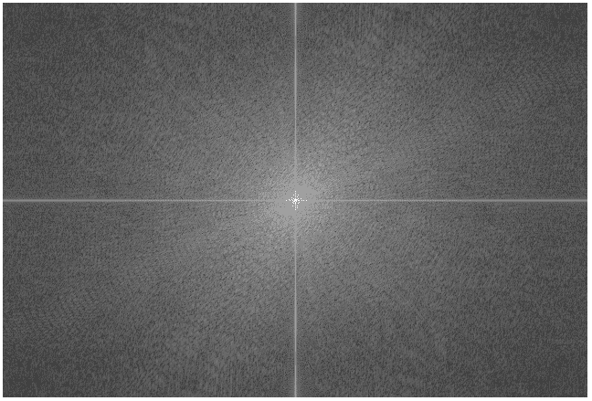

您在结果中看到的结果应解释为从上方直接观看的波，其中每个像素的亮度实际上是其高度的表示。 尝试在不同种类的每个图像上运行相同的过程，以查看结果如何变化。 除了通过外观检查 DFT 结果（取决于用例）之外，DFT 的一个非常特殊的用例（我们将留给您自己尝试）是在掩盖 DFT 结果的一部分后执行反向 DFT， 以获取原始图像。 此过程可以通过多种方式更改原始图像，具体取决于已过滤 DFT 结果的一部分。 这个主题在很大程度上取决于原始图像的内容，并且与 DFT 的数学特性有着深厚的联系，但是绝对值得研究和试验。 总之，您可以通过调用相同的`dft`函数并将附加的`DCT_INVERSE`参数传递给它来执行逆 DFT。 显然，这次，输入应该是图像的计算出的 DFT，输出将是图像本身。

参考：OpenCV 文档，离散傅里叶变换。

# OpenCV 中的绘图

通常，当主题是 OpenCV 和计算机视觉时，就不能忽略在图像上绘制文本和形状。 由于无数原因，您将需要在输出图像上绘制（输出）一些文本或形状。 例如，您可能想编写一个在其上打印图像日期的程序。 或者，您可能需要在执行面部检测后在图像中的面部周围绘制一个正方形。 即使 Qt 框架也提供了处理这些任务的强大功能，也可以使用 OpenCV 本身来绘制图像。 在本节中，您将学习到使用 OpenCV 绘图函数的方法，它们令人惊讶的非常容易使用，以及示例代码和输出结果。

可以理解，OpenCV 中的绘图函数接受输入和输出图像，以及一些大多数参数共有的参数。 以下是 OpenCV 中提到的图形函数的常用参数，以及它们的含义和可能的值：

*   `color`：此参数只是在图像上绘制的对象的颜色。 它可以使用标量创建，并且必须采用 BGR 格式（用于彩色图像），因为它是大多数 OpenCV 函数的默认颜色格式。
*   `thickness`：此参数默认设置为`1`，是在图像上绘制的对象轮廓的粗细。 此参数以像素为单位指定。
*   `lineType`：这可以是`cv::LineTypes`枚举中的条目之一，它决定在图像上绘制的对象轮廓的细节。 如下图所示，`LINE_AA`（抗锯齿）较平滑，但绘制速度也比`LINE_4`和`LINE_8`（默认为`lineType`）慢。 下图描述了`cv::LineTypes`之间的区别：

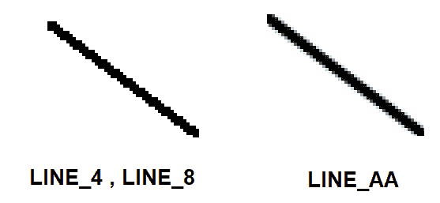

*   `shift`：仅在提供给绘图函数的点和位置包括小数位的情况下使用此参数。 在这种情况下，首先使用以下转换函数根据移位参数对每个点的值进行移位。 对于标准整数点值，移位值将为零，这也使以下转换对结果没有影响：

```cpp
        Point(X , Y) = Point( X * pow(2,-shift), Y * pow(2,-shift) ) 
```

现在，让我们从实际的绘图函数开始：

*   `line`：可以通过获取线条的起点和终点来在图像上画一条线条。 以下示例代码在图像上绘制了一个`X`标记（两条线连接该图像的角），其厚度为`3`像素，并带有红色：

```cpp
        cv::line(img, 
                 Point(0,0), 
                 Point(img.cols-1,img.rows-1), 
                 Scalar(0,0,255), 
                 3, 
                 LINE_AA); 

        cv::line(img, 
                Point(img.cols-1,0), 
                Point(0, img.rows-1), 
                Scalar(0,0,255), 
                3, 
                LINE_AA); 
```

*   `arrowedLine`：用于绘制箭头线。 箭头的方向由终点（或第二个点）决定，否则，此函数的用法与`line`相同。 这是一个示例代码，用于从顶部到图像中心绘制一条箭头线：

```cpp
        cv::arrowedLine(img, 
                        Point(img.cols/2, 0), 
                        Point(img.cols/2, img.rows/3), 
                        Scalar(255,255,255), 
                        5, 
                        LINE_AA);
```

*   `rectangle`：可用于在图像上绘制矩形。 您可以向其传递一个矩形（`Rect`类）或两个点（`Point`类），第一个点对应于矩形的左上角，第二个点对应于矩形的右下角。 以下是在图像中心绘制的矩形示例：

```cpp
        cv::rectangle(img, 
                      Point(img.cols/4, img.rows/4), 
                      Point(img.cols/4*3, img.rows/4*3), 
                      Scalar(255,0,0), 
                      10, 
                      LINE_AA); 
```

*   `putText`：此函数可用于在图像上绘制（或书写或放置）文本。 除了 OpenCV 绘图函数中的常规绘图参数外，您还需要为该函数提供需要在图像上绘制的文本以及字体和比例尺参数。 字体可以是`cv::HersheyFonts`枚举中的条目之一，而尺度是与字体有关的字体缩放。 以下代码块的示例可用于在图像中写入`Computer Vision`：

```cpp
        cv::putText(img, 
                    "Computer Vision", 
                    Point(0, img.rows/2), 
                    FONT_HERSHEY_PLAIN, 
                    2, 
                    Scalar(255,255,255), 
                    2, 
                    LINE_AA); 
```

以下屏幕截图是在测试图像上按顺序执行时在本节中看到的所有绘图示例的结果：


除了我们在本节中看到的绘图函数外，OpenCV 还提供了绘制圆，折线，椭圆等的函数。 所有这些都以与本章所述完全相似的方式使用。 尝试使用这些函数来熟悉 OpenCV 中的所有绘图函数。 您始终可以通过参考 OpenCV 的文档获取最新的绘图函数列表，可以从 [OpenCV 网站的首页](https://opencv.org/)轻松访问。

# 模板匹配

OpenCV 框架提供了许多不同的方法来进行对象检测，跟踪和计数。 模板匹配是 OpenCV 中对象检测的最基本方法之一，但是，如果正确使用它并与良好的阈值结合使用，它可以用于有效检测和计数图像中的对象。 通过在 OpenCV 中使用一个称为`matchTemplate`函数的函数来完成此操作。

`matchTemplate`函数将图像作为输入参数。 考虑将要搜索的图像作为我们感兴趣的对象（或者更好的是可能包含模板的场景）。它也将模板作为第二个参数。 该模板也是一幅图像，但是它是将在第一个图像参数中搜索的模板。 此函数所需的另一个参数（也是最重要的参数和决定模板匹配方法的一个参数）是`method`参数，它可以是`cv::TemplateMatchModes`枚举中的条目之一：

*   `TM_SQDIFF`
*   `TM_SQDIFF_NORMED`
*   `TM_CCORR`
*   `TM_CCORR_NORMED`
*   `TM_CCOEFF`
*   `TM_CCOEFF_NORMED`

如果您有兴趣，可以访问`matchTemplate`文档页面，以了解上述每种方法的数学计算，但是，实际上，您可以通过了解`matchTemplate`的一般工作原理，来了解每种方法的执行方式。

`matchTemplate`函数使用`method`参数中指定的方法，将大小为`WxH`的模板滑动到大小为`QxS`的图像上，并将模板与图像的所有重叠部分进行比较，然后存储 `result` `Mat`中的比较。 显然，图像大小（`QxS`）必须大于模板大小（`WxH`）。 重要的是要注意，所得的`Mat`大小实际上是`Q-WxS-H`，即图像高度和宽度减去模板高度和宽度。 这是由于以下事实：模板的滑动仅发生在源图像上，甚至不发生在其外部的单个像素上。

如果使用名称中带有`_NORMED`的方法之一进行模板匹配，则在模板匹配函数之后无需进行标准化，因为结果将在`0`和`1`之间； 否则，我们将需要使用`normalize`函数对结果进行归一化。 将结果归一化后，可以使用`minMaxLoc`函数在结果图像中定位全局最小值（图像中的最暗点）和全局最大值（图像中的最亮点）。 请记住，`result` `Mat`类包含模板和图像重叠部分之间的比较结果。 这意味着，根据所使用的模板匹配方法，`result` `Mat`类中的全局最小值或全局最大值位置实际上是最佳模板匹配。 因此，是我们检测结果的最佳候选者。 假设我们想将左侧屏幕上的图像与以下屏幕截图右侧屏幕上的图像匹配：

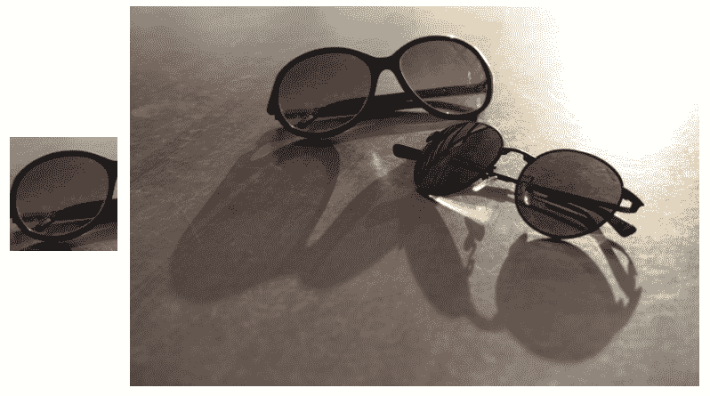

因此，我们可以使用`matchTemplate`函数。 这是一个示例案例：

```cpp
    matchTemplate(img, templ, result, TM_CCORR_NORMED); 
```

在前面的函数调用中，`img`装载有图像本身（右侧的图像），`templ`装载有模板图像（左侧），`TM_CCORR_NORMED`被用作模板匹配方法。 如果我们在前面的代码中可视化`result` `Mat`（为简单起见，使用`imshow`函数），我们将得到以下输出。 注意结果图像中的最亮点：

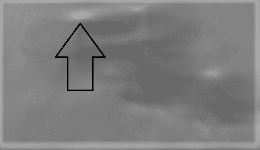

这是模板匹配的最佳位置。 我们可以使用`minMaxLoc`函数找到该位置，并通过使用您在本章先前了解的绘图函数在其周围绘制一个矩形（与模板大小相同）。 这是一个例子：

```cpp
    double minVal, maxVal; 
    Point minLoc, maxLoc; 
    minMaxLoc(result, &minVal, &maxVal, &minLoc, &maxLoc); 
    rectangle(img, 
              Rect(maxLoc.x, maxLoc.y, templ.cols, templ.rows), 
              Scalar(255,255,255), 
              2); 
```

通过可视化`img`，我们将获得以下屏幕截图：

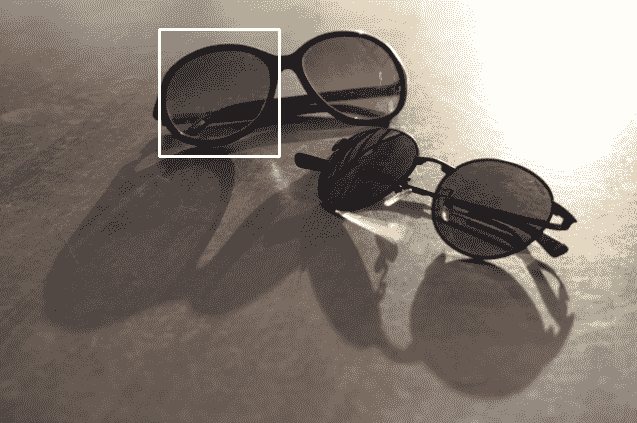

值得注意的是`matchTemplate`函数不是比例不变的。 这意味着它将无法匹配图像内各种尺寸的模板，而只能匹配给该函数的模板相同的尺寸。 `matchTemplate`函数的另一个用例是计算图像中的对象数量。 为此，您需要确保在循环内运行`matchTemplate`函数，并在每次成功匹配后从源图像中删除匹配的部分，以便在下一个`matchTemplate`调用中找不到该部分。 尝试自己编写代码，作为一个很好的示例案例，以了解有关模板匹配及其如何用于模板计数的更多信息。

模板计数是一种广泛使用的方法，用于对生产线或平坦表面中的对象（或产品）进行计数，或对显微图像中形状和大小相似的单元进行计数，以及无数其他类似的用例和应用。

# 总结

现在，我们熟悉 OpenCV 框架中一些使用最广泛的函数，枚举和类。 您在本章中学到的大多数技能几乎都以一种或另一种方式用于每种计算机视觉应用中。 从图像过滤（这是计算机视觉过程中最初始的步骤之一）开始，直到图像转换方法和色彩空间转换，每个计算机视觉应用都必须有权使用这些方法，才能执行特定任务，或以某种方式优化其性能。 在本章中，您学习了有关图像过滤和几何变换的所有知识。 您学习了如何使用`remap`之类的函数来执行无数的图像转换。 您还了解了色彩空间以及如何将它们相互转换。 后来，我们甚至使用颜色映射函数将图像中的颜色映射到另一组颜色。 然后，您学习了图像阈值处理以及如何提取具有特定像素值的图像部分。 正如您将在整个职业生涯或计算机视觉研究中看到的那样，由于无数种原因，阈值化是无时无刻都需要和使用的。 设定阈值后，您了解了 OpenCV 框架中的绘图函数。 如前所述，Qt 框架还提供了大量接口来处理绘图任务，但是仍然不可避免地，有时我们可能需要将 OpenCV 本身用于绘图任务。 最后，我们通过学习模板匹配及其用法来完成本章。

在第 7 章，“特征和描述符”中，我们将通过学习关键点和特征描述符以及它们如何用于对象来更深入地研究计算机视觉和 OpenCV 框架。 检测和匹配。 您还将了解许多关键概念，例如直方图。 您将了解什么是直方图以及通常如何提取和使用它们。 在第 7 章，“特征和描述符”中，我们还将作为刚刚完成的那一章的补充章，在该章中，我们将使用本章中学习到的大多数技能，以及与图像特征和关键点相关的新技能，以执行图像中更复杂的匹配，比较和检测任务。