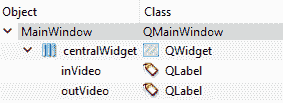
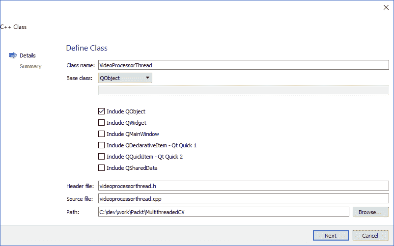
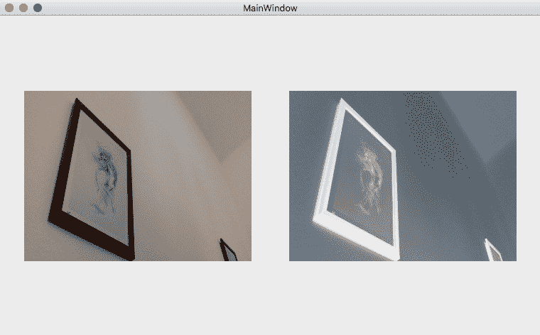

# 多线程

不久前，计算机程序的设计和构建是一个接一个地运行一系列指令。 实际上，这种方法非常易于理解和实现，即使在今天，我们也使用相同的方法来编写脚本和简单程序，这些脚本和简单程序以串行方式处理所需的任务。 但是，随着时间的推移，尤其是随着功能更强大的处理器的兴起，多任务成为主要问题。 期望计算机一次执行多个任务，因为它们足够快地执行多个程序所需的指令，并且仍然有一些空闲时间。 当然，随着时间的流逝，甚至会编写更复杂的程序（游戏，图形程序等），并且处理器必须公平地管理不同程序所使用的时间片，以使所有程序继续正确运行。 程序（或过程，在这种情况下使用更合适的词）被分成称为**线程**的较小片段。 直到现在，这种方法（或多线程）已经帮助创建了可以与相似或完全不相关的进程一起运行的快速响应进程，从而带来了流畅的多任务处理体验。

在具有单个处理器（和单个内核）的计算机上，每个线程都有一个时间片，并且处理器显然一次只能处理一个线程，但是多个线程之间的切换通常是如此之快，以至于从用户需求的角度来看，似乎是真正的并行性。 但是，如今，即使人们随身携带的大多数智能手机中的处理器也具有使用处理器中的多个内核处理多个线程的能力。

为确保我们对线程以及如何使用它们有清晰的了解，以及为什么不使用线程就无法编写功能强大的计算机视觉程序，我们来看看进程与线程之间的主要区别：

*   进程类似于单个程序，它们直接由操作系统执行
*   线程是进程的子集，换句话说，一个进程可以包含多个线程
*   一个进程（通常）独立于任何其他进程，而线程彼此共享内存和资源（请注意，进程可以通过操作系统提供的方法相互交互）

根据设计的方式，每个进程可能会也可能不会创建和执行不同的线程，以实现最佳性能和响应能力。 另一方面，每个线程将执行该进程所需的特定任务。 Qt 和 GUI 编程中的典型示例是进度信息。 运行复杂且耗时的过程时，通常需要显示有关进度的阶段和状态的信息，例如剩余的工作百分比，完成的剩余时间等等。 最好通过将实际任务和 GUI 更新任务分成单独的线程来完成。 在计算机视觉中非常常见的另一个示例是视频（或摄像机）处理。 您需要确保在需要时正确阅读，处理和显示了视频。 在学习 Qt 框架中的多线程功能时，这以及此类示例将成为本章的重点。

在本章中，我们将介绍以下主题：

*   Qt 中的多线程方法
*   如何在 Qt 中使用`QThread`和多线程类
*   如何创建响应式 GUI
*   如何处理多张图像
*   如何处理多个摄像机或视频

# Qt 中的多线程

Qt 框架提供了许多不同的技术来处理应用中的多线程。 `QThread`类用于处理各种多线程功能，正如我们将在本章中看到的那样，使用它也是 Qt 框架中处理线程的最强大，最灵活的方式。 除了`QThread`，Qt 框架还提供了许多其他名称空间，类和函数，可满足各种多线程需求。 在我们查看如何使用它们的示例之前，以下是它们的列表：

*   `QThread`：此类是 Qt 框架中所有线程的基础。 可以将其子类化以创建新线程，在这种情况下，您需要重写`run`方法，或者可以创建该方法的新实例，然后通过调用 Qt 对象（`QObject`子类）将其移至新线程中。 `moveToThread`功能。
*   `QThreadPool`：通过允许将现有线程重新用于新用途，可用于管理线程并帮助降低线程创建成本。 每个 Qt 应用都包含一个全局`QThreadPool`实例，可以使用`QThreadPool::globalInstance()`静态函数对其进行访问。 此类与`QRunnable`类实例结合使用，以控制，管理和回收 Qt 应用中的可运行对象。
*   `QRunnable`：这提供了另一种创建线程的方法，它是 Qt 中所有可运行对象的基础。 与`QThread`不同，`QRunnable`不是`QObject`子类，并且用作需要运行的一段代码的接口。 您需要继承并覆盖`run`函数，才能使用`QRunnable`。 如前所述，`QRunnable`实例由`QThreadPool`类管理。
*   `QMutex`，`QMutexLocker`，`QSemaphore`，`QWaitCondition`，`QReadLocker`，`QWriteLocker`和`QWriteLocke`：这些类用于处理线程间同步任务。 根据情况，可以使用这些类来避免出现以下问题：线程覆盖彼此的计算，试图读取或写入一次只能处理一个线程的设备的线程以及许多类似的问题。 创建多线程应用时，通常需要手动解决此类问题。
*   `QtConcurrent`：此命名空间可用于使用高级 API 创建多线程应用。 它使编写多线程应用变得更加容易，而无需处理互斥量，信号量和线程间同步问题。
*   `QFuture`，`QFutureWatcher`，`QFututeIterator`和`QFutureSynchronizer`：这些类都与`QtConcurrent`命名空间结合使用，以处理多线程和异步操作结果。

通常，在 Qt 中有两种不同的多线程方法。 第一种基于`QThread`的方法是低级方法，它提供了很多灵活性和对线程的控制，但是需要更多的编码和维护才能完美地工作。 但是，有很多方法可以使用`QThread`来制作多线程应用，而工作量却少得多，我们将在本章中学习它们。 第二种方法基于`QtConcurrent`命名空间（或 Qt 并发框架），这是在应用中创建和运行多个任务的高级方法。

# 使用`QThread`的低级多线程

在本节中，我们将学习如何使用`QThread`及其关联类创建多线程应用。 我们将通过创建一个示例项目来完成此过程，该项目将使用单独的线程处理并显示视频源的输入和输出帧。 这有助于使 GUI 线程（主线程）保持空闲和响应状态，而第二个线程处理更密集的进程。 正如前面提到的，我们将主要关注计算机视觉和 GUI 开发的通用用例。 但是，可以将相同（或非常相似）的方法应用于任何多线程问题。

我们将使用此示例项目来使用 Qt 中提供的两种不同方法（用于`QThread`类）来实现多线程。 首先，子类化并覆盖`run`方法，其次，使用所有 Qt 对象中可用的`moveToThread`函数，或者换句话说，使用`QObject`子类。

# 子类化`QThread`

让我们首先在 Qt Creator 中创建一个名为`MultithreadedCV`的示例 Qt Widgets 应用。 以我们在本书开始章节中学到的相同方式将 OpenCV 框架添加到该项目中：在`MultithreadedCV.pro`文件中包含以下代码（请参见第 2 章，“第一个 Qt 和 OpenCV 项目”或第 3 章，“创建一个综合的 Qt + OpenCV 项目”，以了解更多信息）：

```cpp
    win32: { 
      include("c:/dev/opencv/opencv.pri") 
    } 
    unix: !macx{ 
      CONFIG += link_pkgconfig 
      PKGCONFIG += opencv 
    } 
    unix: macx{ 
    INCLUDEPATH += /usr/local/include 
      LIBS += -L"/usr/local/lib" \ 
      -lopencv_world 
    } 
```

然后，将两个标签窗口小部件添加到`mainwindow.ui`文件，如下所示。 我们将使用以下标签在计算机上显示来自默认摄像头的原始视频和经过处理的视频：



确保将左侧标签的`objectName`属性设置为`inVideo`，将右侧标签的`objectName`属性设置为`outVideo`。 另外，将其`alignment`/`Horizontal`属性设置为`AlignHCenter`。 现在，通过右键单击项目 PRO 文件并从菜单中选择“新建”，创建一个名为`VideoProcessorThread`的新类。 然后，选择“C++ 类”，并确保新类向导中的组合框和复选框如下图所示：



创建类后，项目中将有两个名为`videoprocessorthread.h`和`videoprocessor.cpp`的新文件，其中将实现一个视频处理器，该处理器在与`mainwindow`文件和 GUI 线程不同的线程中工作。 首先，通过添加相关的包含行和类继承来确保此类继承了`QThread`，如下所示（只需在头文件中将`QObject`替换为`QThread`）。 另外，请确保您包含 OpenCV 标头：

```cpp
    #include <QThread> 
    #include "opencv2/opencv.hpp" 

    class VideoProcessorThread : public QThread 
```

您需要类似地更新`videoprocessor.cpp`文件，以便它调用正确的构造器：

```cpp
    VideoProcessorThread::VideoProcessorThread(QObject *parent) 
      : QThread(parent) 
```

现在，我们需要向`videoprocessor.h`文件中添加一些必需的声明。 将以下行添加到您的班级的`private`成员区域：

```cpp
    void run() override; 
```

然后，将以下内容添加到`signals`部分：

```cpp
    void inDisplay(QPixmap pixmap); 
    void outDisplay(QPixmap pixmap); 
```

最后，将以下代码块添加到`videoprocessorthread.cpp`文件：

```cpp
    void VideoProcessorThread::run() 
    { 
      using namespace cv; 
      VideoCapture camera(0); 
      Mat inFrame, outFrame; 
      while(camera.isOpened() && !isInterruptionRequested()) 
      { 
        camera >> inFrame; 
        if(inFrame.empty()) 
            continue; 

        bitwise_not(inFrame, outFrame); 

        emit inDisplay( 
             QPixmap::fromImage( 
                QImage( 
                  inFrame.data, 
                  inFrame.cols, 
                  inFrame.rows, 
                  inFrame.step, 
                  QImage::Format_RGB888) 
                      .rgbSwapped())); 

        emit outDisplay( 
             QPixmap::fromImage( 
                QImage( 
                 outFrame.data, 
                   outFrame.cols, 
                   outFrame.rows, 
                   outFrame.step, 
                   QImage::Format_RGB888) 
                     .rgbSwapped())); 
      } 
    }  
```

`run`功能被覆盖，并已执行以执行所需的视频处理任务。 如果您试图在`mainwindow.cpp`代码中循环执行相同的操作，则会注意到您的程序无响应，最终必须终止它。 但是，使用这种方法，现在相同的代码位于单独的线程中。 您只需要确保通过调用`start`函数而不是`run`启动此线程即可！ 注意`run`函数是在内部调用的，因此您只需要重新实现它即可，如本示例所示； 但是，要控制线程及其执行行为，您需要使用以下函数：

*   `start`：如果尚未启动线程，则可用于启动该线程。 该函数通过调用我们实现的`run`函数开始执行。 您可以将以下值之一传递给`start`函数，以控制线程的优先级：
    *   `QThread::IdlePriority`（在没有其他线程在运行时调度）
    *   `QThread::LowestPriority`
    *   `QThread::LowPriority`
    *   `QThread::NormalPriority`
    *   `QThread::HighPriority`
    *   `QThread::HighestPriority`
    *   `QThread::TimeCriticalPriority`（尽可能安排此时间）
    *   `QThread::InheritPriority`（这是默认值，它仅从父级继承优先级）

*   `terminate`：此函数仅在极端情况下使用（意味着永远不会，希望如此），将强制线程终止。
*   `setTerminationEnabled`：可用于启用或禁用`terminate`功能。
*   `wait`：此功能可用于阻塞线程（强制等待），直到线程完成或达到超时值（以毫秒为单位）为止。
*   `requestInterruption`和`isRequestInterrupted`：这些功能可用于设置和获取中断请求状态。 使用这些功能是确保线程在可能永远持续的进程中间安全停止的一种有用方法。
*   `isRunning`和`isFinished`：这些功能可用于请求线程的执行状态。

除了我们在此处提到的功能之外，`QThread`包含其他可用于处理多线程的功能，例如`quit`，`exit`和`idealThreadCount`等。 最好亲自检查一下并考虑其中每个用例。 `QThread`是一个功能强大的类，可以帮助您最大化应用的效率。

让我们继续我们的示例。 在`run`功能中，我们使用 OpenCV `VideoCapture`类读取视频帧（永久），并将简单的`bitwise_not`运算符应用于`Mat`帧（此时我们可以进行任何其他图像处理，因此 `bitwise_not`只是一个例子，是一个相当简单的解释我们的观点），然后通过`QImage`将其转换为`QPixmap`，然后使用两个信号发送原始帧和修改后的帧。 请注意，在永远持续的循环中，我们将始终检查摄像头是否仍处于打开状态，并还会检查对此线程是否有中断请求。

现在，让我们在`MainWindow`中使用我们的线程。 首先将其头文件包含在`mainwindow.h`文件中：

```cpp
    #include "videoprocessorthread.h" 
```

然后，将以下行添加到`mainwindow.h`文件中`MainWindow`的`private`成员部分：

```cpp
    VideoProcessorThread processor; 
```

现在，在`setupUi`行之后，将以下代码添加到`MainWindow`构造器中：

```cpp
    connect(&processor, 
            SIGNAL(inDisplay(QPixmap)), 
            ui->inVideo, 
            SLOT(setPixmap(QPixmap))); 

    connect(&processor, 
            SIGNAL(outDisplay(QPixmap)), 
            ui->outVideo, 
            SLOT(setPixmap(QPixmap))); 

    processor.start(); 
```

然后将以下行添加到`delete ui;`行之前的`MainWindow`析构函数中：

```cpp
    processor.requestInterruption(); 
    processor.wait(); 
```

我们只需将`VideoProcessorThread`类的两个信号连接到我们添加到`MainWindow` GUI 的两个标签，然后在程序启动后立即启动线程。 我们还要求线程在`MainWindow`关闭后立即删除，并且在删除 GUI 之前。 在继续执行删除指令之前，`wait`函数调用可确保等待线程清理并安全完成执行。 尝试运行此代码以自行检查。 程序启动后，您应该会看到类似于下图的内容：



程序启动后，计算机上默认摄像头中的视频应立即开始播放，关闭程序后，该视频将停止播放。 尝试通过向其中传递摄像机索引号或视频文件路径来扩展`VideoProcessorThread`类。 您可以根据需要实例化许多`VideoProcessorThread`类。 您只需要确保将信号连接到 GUI 上的正确小部件，就可以通过这种方式在运行时动态处理和显示多个视频或摄像机。

# 使用`moveToThread`函数

如前所述，您还可以使用任何`QObject`子类的`moveToThread`函数来确保它在单独的线程中运行。 为了确切地了解它是如何工作的，让我们通过创建完全相同的 GUI 来重复相同的示例，然后创建一个新的 C++ 类（与以前相同），但是这次将其命名为`VideoProcessor`。 但是，这一次，在创建类之后，您无需从`QThread`继承它，而将其保留为`QObject`（原样）。 只需将以下成员添加到`videoprocessor.h`文件中：

```cpp
    signals: 
      void inDisplay(QPixmap pixmap); 
      void outDisplay(QPixmap pixmap); 

   public slots: 
      void startVideo(); 
      void stopVideo(); 

  private: 
      bool stopped; 
```

`signals`与以前完全相同。 `stopped`是一个标志，我们将用来帮助我们停止视频，以使视频不会永远播放下去。 `startVideo`和`stopVideo`是我们用来启动和停止来自默认网络摄像头的视频处理的功能。 现在，我们可以切换到`videoprocessor.cpp`文件并添加以下代码块。 与以前非常相似，但明显的区别是我们不需要实现`run`函数，因为它不是`QThread`子类，并且我们按自己的喜好命名了函数：

```cpp
    void VideoProcessor::startVideo() 
    { 
      using namespace cv; 
      VideoCapture camera(0); 
      Mat inFrame, outFrame; 
      stopped = false; 
      while(camera.isOpened() && !stopped) 
      { 
        camera >> inFrame; 
        if(inFrame.empty()) 
            continue; 

        bitwise_not(inFrame, outFrame); 

        emit inDisplay( 
          QPixmap::fromImage( 
             QImage( 
                  inFrame.data, 
                  inFrame.cols, 
                  inFrame.rows, 
                  inFrame.step, 
                  QImage::Format_RGB888) 
                    .rgbSwapped())); 

        emit outDisplay( 
           QPixmap::fromImage( 
             QImage( 
                 outFrame.data, 
                 outFrame.cols, 
                 outFrame.rows, 
                 outFrame.step, 
                 QImage::Format_RGB888) 
                    .rgbSwapped())); 
      }   
    } 

    void VideoProcessor::stopVideo() 
    { 
      stopped = true; 
    } 
```

现在我们可以在`MainWindow`类中使用它。 确保为`VideoProcessor`类添加`include`文件，然后将以下内容添加到`MainWindow`的私有成员部分：

```cpp
    VideoProcessor *processor; 
```

现在，将以下代码段添加到`mainwindow.cpp`文件中的`MainWindow`构造器中：

```cpp
    processor = new VideoProcessor(); 

    processor->moveToThread(new QThread(this)); 

    connect(processor->thread(), 
          SIGNAL(started()), 
          processor, 
          SLOT(startVideo())); 

   connect(processor->thread(), 
          SIGNAL(finished()), 
          processor, 
          SLOT(deleteLater())); 

   connect(processor, 
        SIGNAL(inDisplay(QPixmap)), 
        ui->inVideo, 
        SLOT(setPixmap(QPixmap))); 

   connect(processor, 
        SIGNAL(outDisplay(QPixmap)), 
        ui->outVideo, 
        SLOT(setPixmap(QPixmap))); 

   processor->thread()->start(); 
```

在前面的代码片段中，首先，我们创建了`VideoProcessor`的实例。 请注意，我们没有在构造器中分配任何父对象，并且还确保将其定义为指针。 当我们打算使用`moveToThread`功能时，这非常重要。 具有父对象的对象无法移到新线程中。 此代码段中的第二个非常重要的课程是，我们不应该直接调用`VideoProcessor`的`startVideo`函数，而只能通过将适当的信号连接到它来调用它。 在这种情况下，我们使用了自己线程的启动信号。 但是，您可以使用具有相同签名的任何其他信号。 剩下的全部都是关于连接的。

在`MainWindow`析构函数中，添加以下行：

```cpp
    processor->stopVideo(); 
    processor->thread()->quit(); 
    processor->thread()->wait(); 
```

这是很不言自明的，但是，为了清楚起见，让我们在这里再做一个说明，那就是在这样的线程启动之后，必须通过调用`quit`函数来停止它，而且，不应包含任何运行循环或未决指令。 如果不满足这些条件之一，则在处理线程时将面临严重的问题。

# 线程同步工具

多线程编程通常需要维护线程之间的冲突和问题，这些冲突和问题是由于并行性以及底层操作系统负责照顾线程将在何时以及确切地运行多长时间的原因而简单产生的。 一个提供多线程功能的强大框架（例如 Qt 框架）还必须提供处理此类问题的方法，所幸的是，正如我们在本章中将学到的那样，它确实可以做到。

在本节中，我们将学习由多线程编程引起的可能问题以及 Qt 中可用于解决这些问题的现有类。 这些类通常称为**线程同步工具**。 线程同步是指以这样的方式处理和编程线程：它们使用简单易用的方式了解其他线程的状态，同时，它们可以继续完成自己的特定任务。

# 互斥体

如果您对本主题以及即将到来的有关线程同步工具的部分感到熟悉，那么您将很轻松地掌握所涵盖的主题，并且您将很快了解 Qt 中实现的相同工具的易用性； 否则，最好彻底，仔细地遵循这些部分。 因此，让我们从第一个线程同步工具开始。 通常，如果两个线程尝试同时访问同一对象（例如变量或类实例等），并且如果每个线程对对象的处理顺序很重要，那么有时生成的对象可能会与我们期望的有所不同。 让我们用一个例子来分解它，因为即使您完全遵循刚才提到的内容，它仍然可能会令人困惑。 假设一个线程一直在使用以下代码行（在`QThread`的重新实现的`run`函数中，或者从另一个线程在使用`moveToThread`的类中）始终读取名为`image`的`Mat`类实例。 功能，无所谓）：

```cpp
    forever 
    { 
      image = imread("image.jpg"); 
    } 
```

`forever`宏是一个 Qt 宏（与`for(;;)`相同），可用于创建无限循环。 使用此类 Qt 宏有助于提高代码的可读性。

第二个不同的线程一直在修改该图像。 让我们假设像这样一个非常简单的图像处理任务（将图像转换为灰度然后调整其大小）：

```cpp
    forever 
    { 
       cvtColor(image, image, CV_BGR2GRAY); 
       resize(image, image, Size(), 0.5, 0.5); 
    } 
```

如果这两个线程同时运行，则在某个时候，可以在第二个线程的`cvtColor`之后和`resize`之前调用第一个线程的`imread`函数。 如果发生这种情况，我们将无法获得比输入图像大一半的灰度图像（如示例代码中所预期）。 我们无法用此代码来阻止它，因为在运行时在线程之间进行切换时，这完全取决于操作系统。 在多线程编程中，这是一种竞争条件问题，可以通过确保每个线程在访问和修改对象之前等待其轮换来解决。 该问题的解决方案称为**访问序列化**，在多线程编程中，通常使用互斥对象解决。

互斥锁只是一种保护和防止对象实例同时被多个线程访问的方法。 Qt 提供了一个名为`QMutex`的类（非常方便）来处理访问序列化，我们可以在前面的示例中非常轻松地使用它，如此处所示。 我们只需要确保`Mat`类存在`QMutex`实例即可。 由于我们的`Mat`类称为`image`，因此将其称为互斥锁`imageMutex`，那么我们将需要将该互斥锁锁定在访问图像的每个线程中，并在完成操作后将其解锁。 因此，对于第一个线程，我们将有以下内容：

```cpp
    forever 
    { 
      imageMutex.lock(); 
      image = imread("image.jpg"); 
      imageMutex.unlock(); 
    } 
```

对于第二个线程，我们将具有以下代码块：

```cpp
    forever 
    { 
      imageMutex.lock(); 
      cvtColor(image, image, CV_BGR2GRAY); 
      resize(image, image, Size(), 0.5, 0.5); 
      imageMutex.unlock(); 
    } 
```

这样，每当两个线程中的每个线程开始处理图像时，首先，它将使用`lock`函数锁定互斥锁。 如果简单地说，在过程的中间，操作系统决定切换到另一个线程，该线程也将尝试锁定互斥锁，但是由于互斥锁已被锁定，因此调用`lock`函数的新线程将被阻塞，直到第一个线程（称为锁）调用`unlock`为止。 从获取锁的钥匙的角度考虑它。 只有调用互斥量的`lock`函数的线程才能通过调用`unlock`函数将其解锁。 这样可以确保，只要一个线程正在访问一个对象，所有其他线程都应该简单地等待它完成！

从我们的简单示例中可能并不明显，但是在实践中，如果需要敏感对象的功能数量增加，则使用互斥可能会成为负担。 因此，在使用 Qt 时，最好使用`QMutexLocker`类来保护互斥锁。 如果我们回到前面的示例，则可以这样重写相同的代码：

```cpp
    forever 
    { 
      QMutexLocker locker(&imageMutex); 
      image = imread("image.jpg"); 
    } 

    And for the second thread: 
    forever 
    { 
      QMutexLocker locker(&imageMutex); 
      cvtColor(image, image, CV_BGR2GRAY); 
      resize(image, image, Size(), 0.5, 0.5); 
    } 
```

通过将互斥量传递给它来构造`QMutexLocker`类时，该互斥量将被锁定，并且一旦`QMutexLocker`被销毁（对于超出范围的实例），该互斥量将被解锁。

# 读写锁

与互斥锁一样强大，它们缺乏某些功能，例如不同类型的锁。 因此，尽管它们对于访问序列化非常有用，但是它们不能有效地用于诸如读写序列化之类的情况，该情况基本上依赖于两种不同类型的锁：读写。 让我们再用一个例子来分解。 假设我们希望各种线程能够同时从一个对象（例如变量，类实例，文件等）读取，但是我们要确保只有一个线程可以修改（或写入） 该对象在任何给定时间。 对于这种情况，我们可以使用读写锁定机制，该机制基本上是增强的互斥体。 Qt 框架提供`QReadWriteLock`类，可以使用与`QMutex`类类似的方式，除了它提供用于读取的锁定函数（`lockForRead`）和用于写入的另一个锁定函数（`lockForWrite`）。 以下是每个`lock`功能的功能：

*   如果在线程中调用`lockForRead`函数，其他线程仍可以调用`lockForRead`并出于读取目的访问敏感对象。 （通过敏感对象，我们指的是我们正在为其使用锁的对象。）
*   另外，如果在线程中调用了`lockForRead`函数，则任何调用`lockForWrite`的线程都将被阻塞，直到该线程调用了解锁函数。
*   如果在线程中调用了`lockForWrite`函数，则所有其他线程（无论是用于读取还是写入）都将被阻塞，直到该线程调用解锁为止。
*   如果在一个线程中调用了`lockForWrite`函数，而先前的线程已经在其中设置了读锁定，则所有调用`lockForRead`的新线程将必须等待需要写锁定的线程。 因此，需要`lockForWrite`的线程将具有更高的优先级。

为了简化我们刚才提到的读写锁定机制的功能，可以说`QReadWriteLock`可用于确保多个读取器可以同时访问一个对象，而写入器将不得不等待读取器先完成。 另一方面，将只允许一个写者对该对象进行写操作。 并且，如果读者过多，为了保证作家不会永远等待，他们将获得更高的优先级。

现在，让我们看一下如何使用`QReadWriteLock`类的示例代码。 请注意，此处的`lock`变量具有`QReadWriteLock`类型，`read_image`函数是从对象读取的任意函数：

```cpp
    forever 
    { 
       lock.lockForRead(); 
       read_image(); 
       lock.unlock(); 
    } 
```

类似地，在需要写入对象的线程中，我们将具有以下内容（`write_image`是写入对象的任意函数）：

```cpp
    forever 
    { 
     lock.lockForWrite(); 
     write_image(); 
     lock.unlock(); 
    } 
```

与`QMutex`相似，在其中我们使用`QMutexLocker`来更轻松地处理`lock`和`unlock`函数，我们可以使用`QReadLocker`和`QWriteLocker`类相应地锁定和解锁`QReadWriteLock`。 因此，对于前面示例中的第一个线程，我们将具有以下代码行：

```cpp
    forever 
    { 
      QReadLocker locker(&lock); 
      Read_image(); 
    }  
```

对于第二个，我们将需要以下代码行：

```cpp
    forever 
    { 
      QWriteLocker locker(&lock); 
      write_image(); 
    } 
```

# 信号量

有时，在多线程编程中，我们需要确保多个线程可以相应地访问有限数量的相同资源。 例如，将用于运行程序的设备上的内存可能非常有限，因此我们希望需要大量内存的线程考虑到这一事实并根据可用的内存数量采取行动。 多线程编程中的此问题和类似问题通常通过使用信号量来解决。 信号量类似于增强的互斥锁，它不仅能够锁定和解锁，而且还能跟踪可用资源的数量。

Qt 框架提供了一个名为`QSemaphore`的类（足够方便）以在多线程编程中使用信号量。 由于信号量是根据可用资源的数量用于线程同步的，因此功能名称也比`lock`和`unlock`功能更适合于此目的。 以下是`QSemaphore`类中的可用功能：

*   `acquire`：可用于获取特定数量的所需资源。 如果没有足够的资源，则线程将被阻塞，必须等待直到有足够的资源。
*   `release`：可用于释放特定数量的已使用且不再需要的资源。
*   `available`：可用于获取可用资源的数量。 如果我们希望我们的线程执行其他任务而不是等待资源，则可以使用此函数。

除了一个适当的例子，没有什么可以比这个更加清楚的了。 假设我们有`100MB`的可用内存空间供所有线程使用，并且每个线程需要`X`兆字节数来执行其任务，具体取决于线程，因此`X`在所有线程中都不相同，可以说它是使用将在线程中处理的图像大小或与此相关的任何其他方法来计算的。 对于当前的当前问题，我们可以使用`QSemaphore`类来确保我们的线程仅访问可用的内存空间，而不会访问更多。 因此，我们将在程序中创建一个信号量，如下所示：

```cpp
    QSemaphore memSem(100); 
```

并且，在每个线程内部，在占用大量内存的过程之前和之后，我们将获取并释放所需的内存空间，如下所示：

```cpp
    memSem.acquire(X); 
    process_image(); // memory intensive process 
    memSem.release(X); 
```

请注意，在此示例中，如果某个线程中的`X`大于`100`，则它将无法继续通过`acquire`，直到`release`函数调用（释放的资源）等于或大于该值。 `acquire`函数调用（获取的资源）。 这意味着可以通过调用`release`函数（其值大于获取的资源）来增加（创建）可用资源的数量。

# 等待条件

多线程编程中的另一个常见问题可能会发生，因为某个线程必须等待操作系统正在执行的线程以外的其他条件。 在这种情况下，如果很自然地线程使用了互斥锁或读写锁，则它可能会阻塞所有其他线程，因为轮到该线程运行并且正在等待某些特定条件。 人们会希望需要等待条件的线程在释放互斥锁或读写锁后进入睡眠状态，以便其他线程继续运行，并在满足条件时被另一个线程唤醒。

在 Qt 框架中，有一个名为`QWaitCondition`的类，专用于处理我们刚刚提到的此类问题。 此类可能需要等待某些条件的任何线程使用。 让我们通过一个简单的例子来进行研究。 假设有多个线程与`Mat`类一起使用（准确地说是一个图像），并且一个线程负责读取此图像（仅当它存在时）。 现在，还要假设另一个进程，程序或用户负责创建此图像文件，因此它可能暂时无法使用。 由于图像由多个线程使用，因此我们可能需要使用互斥锁以确保线程一次访问一个图像。 但是，如果图像仍然不存在，则读取器线程可能仍需要等待。 因此，对于阅读器线程，我们将具有以下内容：

```cpp
    forever 
    { 
      mutex.lock(); 
      imageExistsCond.wait(&mutex); 
      read_image(); 
      mutex.unlock(); 
    } 
```

注意，在该示例中，`mutex`的类型为`QMutex`，`imageExistsCond`的类型为`QWaitCondition`。 前面的代码段只是意味着锁定互斥锁并开始工作（读取图像），但是如果您必须等到图像存在后再释放互斥锁，以便其他线程可以继续工作。 这需要另一个负责唤醒阅读器线程的线程。 因此，我们将得到以下内容：

```cpp
    forever 
    { 
      if(QFile::exists("image.jpg")) 
          imageExistsCond.wakeAll(); 
    } 
```

该线程只是一直在检查图像文件的存在，如果存在，它将尝试唤醒所有等待此等待条件的线程。 我们也可以使用`wakeOne`函数代替`wakeAll`函数，该函数只是试图唤醒一个正在等待等待条件的随机线程。 如果满足条件，我们只希望一个线程开始工作，这将很有用。

这样就结束了我们对线程同步工具（或原语）的讨论。 本节中介绍的类是 Qt 框架中最重要的类，它们与线程结合使用以处理线程同步。 确保检查 Qt 文档，以了解那些类中存在的其他功能，这些功能可用于进一步改善多线程应用的行为。 当编写这样的多线程应用时，或者换句话说，使用低级方法时，我们必须确保线程使用本节刚刚介绍的类以一种方式或另一种方式彼此了解。 另外，请务必注意，这些技术并不是解决线程同步的唯一可能方法，有时（随着程序的发展变得越来越复杂），您肯定需要混合使用这些技术，进行调整， 弯曲它们，甚至自己发明一些。

# 使用`QtConcurrent`的高级多线程

除了在上一节中学到的知识之外，Qt 框架还提供了用于创建多线程程序的高级 API，而无需使用线程同步工具（例如互斥锁，锁等）。 `QtConcurrent`名称空间或 Qt 框架中的 Qt 并发模块，提供了易于使用的功能，这些功能可用于创建多线程应用，换句话说，并发性，方法是使用最佳数量的数据处理数据列表。 适用于任何平台的线程。 在经历了`QtConcurrent`中的功能以及与其结合使用的类之后，这将变得非常清晰。 之后，我们还将处理实际示例，以了解 Qt `Concurrent`模块的功能以及如何利用它。

总体上，以下功能（及其稍有不同的变体）可用于使用高级`QtConcurrent` API 处理多线程：

*   `filter`：可以用来过滤列表。 该功能需要提供一个包含要过滤的数据的列表和一个过滤功能。 我们提供的过滤功能将应用于列表中的每个项目（使用最佳或自定义线程数），并且根据过滤器函数返回的值，该项目将被删除或保留在列表中。
*   `filtered`：它与`filter`的工作方式相同，除了它返回过滤的列表而不是原地更新输入列表。
*   `filteredReduced`：其工作方式类似于`filtered`功能，但它还将第二个功能应用于通过过滤器的每个项目。
*   `map`：可用于将特定功能应用于列表中的所有项目（使用最佳或自定义线程数）。 很明显，类似于`filter`函数，`map`函数也需要提供一个列表和一个函数。
*   `mapped`：与`map`的工作方式相同，除了它返回结果列表而不是原地更新输入列表。
*   `mappedReduced`：此功能的作用类似于`mapped`功能，但它还将第二个功能应用于除第一个映射功能之后的每个项目。
*   `run`：此函数可用于在单独的线程中轻松执行函数。

每当我们谈论 Qt Concurrent 模块中的返回值时，我们实际上的意思是异步计算的结果。 原因很简单，因为 Qt Concurrent 在单独的线程中启动所有计算，并且无论您使用`QtConcurrent`名称空间中的哪个函数，它们都会立即返回给调用者，并且结果只有在计算完成之后才可用。 这是通过使用所谓的 Future 变量来完成的，或者使用 Qt 框架中的`QFuture`及其附属类来实现。

`QFuture`类可用于检索由`QtConcurrent`命名空间中提到的功能之一启动的计算结果； 通过暂停，恢复和类似方法控制其工作； 并监视该计算的进度。 为了能够使用 Qt 信号和插槽对`QFuture`类进行更灵活的控制，我们可以使用一个名为`QFutureWatcher`的便捷类，该类包含可以通过使用小部件更轻松地监视计算的信号和插槽。 例如进度条（`QProgressBar`或`QProgressDialog`）。

让我们总结并阐明在实际示例应用中提到的所有内容。 在不描述`QtConcurrent`命名空间功能的情况下，不可能描述`QFuture`及其关联类的使用方式，这只能通过一个示例来实现：

1.  让我们开始使用 Qt Creator 创建一个 Qt Widgets 应用项目，并将其命名为`ConcurrentCV`。 我们将创建一个使用 Qt Concurrent 模块处理多个图像的程序。 为了更加专注于程序的多线程部分，该过程将非常简单。 我们将读取每个图像的日期和时间，并将其写在图像的左上角。

2.  创建项目后，通过在`ConcurrentCV.pro`文件中添加以下行，将 OpenCV 框架添加到项目中：

```cpp
        win32: { 
          include("c:/dev/opencv/opencv.pri") 
        } 

        unix: !macx{ 
         CONFIG += link_pkgconfig 
          PKGCONFIG += opencv 
        } 

        unix: macx{ 
         INCLUDEPATH += /usr/local/include 
         LIBS += -L"/usr/local/lib" \ 
         -lopencv_world 
        } 
```

3.  为了能够在 Qt 项目中使用 Qt 并发模块和`QtConcurrent`命名空间，必须通过添加以下行来确保在`.pro`文件中指定了它：

```cpp
         QT += concurrent 
```

4.  现在，我们需要为应用中需要的几个函数编写代码。 第一个是在用户选择的文件夹中获取图像列表（`*.jpg`和`*.png`文件已足够）。 为此，请将以下行添加到`mainwindow.h`私有成员中：

```cpp
        QFileInfoList getImagesInFolder(); 
```

5.  不用说，`QFileInfoList`必须在`mainwindow.h`文件的包含列表中。 实际上，`QFileInfoList`是包含`QFileInfo`元素的`QList`，可以使用`QDir`类的`entryInfoList`函数对其进行检索。 因此，将其实现添加到`mainwindow.cpp`，如此处所示。 请注意，仅出于简单起见，我们仅使用文件创建日期，而不处理图像`EXIF`数据以及使用相机拍摄照片的原始日期或时间：

```cpp
        QFileInfoList MainWindow::getImagesInFolder() 
        { 
           QDir dir(QFileDialog::getExistingDirectory(this, 
           tr("Open Images Folder"))); 
             return dir.entryInfoList(QStringList() 
             << "*.jpg" 
             << "*.png", 
             QDir::NoDotAndDotDot | QDir::Files, 
             QDir::Name); 
        }
```

6.  我们需要的下一个函数称为`addDateTime`。 我们可以在类之外定义和实现它，这是稍后在调用`QtConcurrent.map`函数时将使用的函数。 在`mainwindow.h`文件中定义如下：

```cpp
        void addDateTime(QFileInfo &info); 
```

7.  将其实现添加到`mainwindow.cpp`文件中，如下所示：

```cpp
       void addDateTime(QFileInfo &info) 
       { 
         using namespace cv; 
         Mat image = imread(info.absoluteFilePath().toStdString()); 
         if(!image.empty()) 
         { 
          QString dateTime = info.created().toString(); 
          putText(image, 
            dateTime.toStdString(), 
            Point(30,30) , // 25 pixels offset from the corner 
            FONT_HERSHEY_PLAIN, 
            1.0, 
            Scalar(0,0,255)); // red 
          imwrite(info.absoluteFilePath().toStdString(), 
                image); 
         } 
       } 
```

8.  现在打开`mainwindow.ui`文件，并在“设计”模式下创建类似于以下内容的 UI。 如下所示，`loopBtn`小部件是带有循环文本处理的`QPushButton`，而`concurrentBtn`小部件是同时带有文本处理的`QPushButton`。 为了能够比较使用多个线程或使用简单循环在单个线程中完成此任务的结果，我们将实现这两​​种情况，并测量每种情况下完成该任务所花费的时间。 另外，在继续执行下一步之前，请确保将`progressBar`小部件的`value`属性设置为零。


9.  剩下要做的唯一事情就是使用`QtConcurrent`（多线程）在一个循环中（单线程）执行该过程。 因此，为`loopBtn`的`pressed`插槽编写以下代码：

```cpp
        void MainWindow::on_loopBtn_pressed() 
        { 
          QFileInfoList list = getImagesInFolder(); 

          QElapsedTimer elapsedTimer; 
          elapsedTimer.start(); 

          ui->progressBar->setRange(0, list.count()-1); 
          for(int i=0; i<list.count(); i++) 
          { 
           addDateTime(list[i]); 
           ui->progressBar->setValue(i); 
           qApp->processEvents(); 
          } 

          qint64 e = elapsedTimer.elapsed(); 

          QMessageBox::information(this, 
          tr("Done!"), 
          QString(tr("Processed %1 images in %2 milliseconds")) 
            .arg(list.count()) 
            .arg(e)); 
        }
```

这很简单，而且绝对没有效率，我们稍后会学习。 此代码仅循环遍历文件列表，并将它们传递给`addDateTime`函数，该函数仅读取图像并添加日期时间戳并覆盖图像。

10.  最后，为`concurrentBtn`小部件的`pressed`插槽添加以下代码：

```cpp
        void MainWindow::on_concurrentBtn_pressed() 
        { 
          QFileInfoList list = getImagesInFolder(); 
          QElapsedTimer elapsedTimer; 
          elapsedTimer.start(); 
          QFuture<void> future = QtConcurrent::map(list, addDateTime); 
          QFutureWatcher<void> *watcher =  
            new QFutureWatcher<void>(this); 
          connect(watcher, 
              SIGNAL(progressRangeChanged(int,int)), 
              ui->progressBar, 
              SLOT(setRange(int,int))); 
          connect(watcher, 
              SIGNAL(progressValueChanged(int)), 
              ui->progressBar, 
              SLOT(setValue(int))); 
          connect(watcher, 
              &QFutureWatcher<void>::finished, 
              [=]() 
          { 
            qint64 e = elapsedTimer.elapsed(); 
            QMessageBox::information(this, 
               tr("Done!"), 
           QString(tr("Processed %1 images in %2 milliseconds")) 
            .arg(list.count()) 
            .arg(e)); 
          }); 
          connect(watcher, 
            SIGNAL(finished()), 
            watcher, 
            SLOT(deleteLater())); 
          watcher->setFuture(future); 
        }
```

在查看前面的代码并查看其工作方式之前，请尝试运行该应用并将两个按钮与测试图像文件夹一起使用。 尤其是在多核处理器上，性能差异如此之大，以至于不需要进行任何精确的测量。 在我使用的大约 50 张随机图像的测试机上（如今是中等级别的系统），并发（多线程）版本完成这项工作的速度至少快了三倍。 有多种方法可以使它更加高效，例如设置 Qt Concurrent 模块创建和使用的线程数，但是在此之前，让我们看看代码的作用。

起始行与之前相同，但是这次，我们而不是循环遍历文件列表，而是将列表传递给`QtConcurrent::map`函数。 然后，此函数自动启动多个线程（使用默认线程数和理想线程数，这也是可调的），并将`addDateTime`函数应用于列表中的每个条目。 项的处理顺序是完全不确定的，但是结果将是相同的。 然后将结果传递给`QFuture<void>`，该实例由`QFutureWatcher<void>`实例监视。 如前所述，`QFutureWatcher`类是监视来自`QtConcurrent`的计算的便捷方式，该计算已分配给`QFuture`类。 注意，在这种情况下，`QFutureWatcher`被定义为指针，并在处理完成时稍后删除。 原因是`QFutureWatcher`在整个过程继续进行期间必须保持活动状态，并且只有在计算完成后才能删除。 因此，首先完成`QFutureWatcher`的所有必需连接，然后相应地设置其将来变量。 重要的是要确保在建立所有连接后设置未来。 使用`QtConcurrent`进行多线程计算所需的全部内容也以正确的方式向 GUI 发送信号。

请注意，您还可以在全范围或全局范围内定义`QFuture`，然后使用其线程控制功能轻松控制`QtConcurrent`运行的计算。 `QFuture`包含以下（不言自明的）函数，可用于控制计算：

*   `pause`
*   `resume`
*   `cancel`

您还可以使用以下函数（同样，由于命名而非常不言自明）来检索计算状态：

*   `isStarted`
*   `isPaused`
*   `isRunning`
*   `isFinished`
*   `isCanceled`

至此，我们对前面的代码进行了回顾。 如您所见，只要您了解结构以及需要传递和连接的内容，使用`QtConcurrent`就非常容易，这就是应该的方式。

使用以下函数设置`QtConcurrent`函数的最大线程数：

`QThreadPool::globalInstance()->setMaxThreadCount(n)` 
在我们的示例案例中尝试一下，看看改变线程数如何影响处理时间。 如果您使用不同数量的线程，则会注意到更多的线程并不一定意味着更高的性能或更快的代码，这就是为什么总有理想的线程数取决于处理器和处理器的原因。 其他与系统相关的规格。

我们可以类似的方式使用`QtConcurrent`过滤器和其他功能。 例如，对于过滤器函数，我们需要定义一个为每个项目返回布尔值的函数。 假设我们希望前面的示例应用跳过早于某个日期（2015 年之前）的图像，并将其从文件列表中删除，然后我们可以像这样定义过滤器功能：

```cpp
    bool filterImage(QFileInfo &info) 
    { 
      if(info.created().date().year() < 2015) 
         true; 
      else 
        false; 
    } 
```

然后调用`QtConcurrent`来过滤我们的列表，如下所示：

```cpp
    QtConcurrent::filter(list, filterImage); 
```

在这种情况下，我们需要将过滤后的结果传递给`map`函数，但是有一个更好的方法，那就是调用`filteredReduced`函数，如下所示：

```cpp
    QtConcurrent::filteredReduced(list, filterImage, addDateTime); 
```

请注意，`filteredReduced`函数返回`QFuture<T>`结果，其中`T`与输入列表的类型相同。 与以前不同的是，我们仅收到适合监视计算进度的`QFuture<void>`，而`QFuture<T>`也包含结果列表。 请注意，由于我们并未真正修改列表中的单个元素（相反，我们正在更新文件），因此我们只能观察列表中元素数量的变化，但是如果我们尝试通过更新`Mat`类或`QImage`类的列表（或与此相关的任何其他变量），然后我们将观察到各个项也根据`reduce`函数中的代码进行了更改。

# 总结

不能说这就是谈论多线程和并行编程的全部内容，但是可以公平地说，我们涵盖了一些最重要的主题，可以帮助您编写多线程和高效的计算机视觉。 应用（或任何其他应用）。 您学习了如何对`QThread`进行子类化以创建执行特定任务的新线程类，或者如何使用`moveToThread`函数将负责复杂且耗时的计算的对象移动到另一个线程中。 您还了解了一些最重要的低级多线程原语，例如互斥体，信号量等。 到目前为止，您应该完全意识到由于在我们的应用中实现和使用多个线程而可能引起的问题，以及这些问题的解决方案。 如果您认为仍然需要练习以确保您熟悉所有提出的概念，那么您肯定对所有主题都给予了充分的关注。 多线程可能是一种困难且复杂的方法，但是如果您花大量时间练习不同的可能的多线程方案，那么最终还是值得的。 例如，您可以尝试将任务划分为之前编写的程序（或在网上，书中或其他地方看到的程序），然后将其转换为多线程应用。

在第 9 章，“视频分析”中，我们会将您在本章中学到的内容与之前的各章结合起来，并以此为基础，深入研究视频处理主题。 您将了解如何从摄像机或文件中跟踪视频中的运动对象，检测视频中的运动以及更多主题，所有这些都需要处理连续的帧并保留从先前帧中计算出的内容。 换句话说，计算不仅取决于图像，而且还取决于该图像（及时）。 因此，我们将使用线程，并使用您在本章中学习的任何方法来实现您将在下一章中学习的计算机视觉算法。