# 第 1 章。OpenCV 即时入门

欢迎使用《OpenCV 即时入门》。 本书是专门为向您提供设置 OpenCV 所需的所有信息而创建的。 您将学习 OpenCV 的基础知识，开始构建第一个程序，并发现一些使用 OpenCV 的技巧。

本书包含以下部分：

“OpenCV 是什么？”了解 OpenCV 到底是什么，可以做什么以及为什么这么好。

“安装”了解如何以最小的努力下载和安装 OpenCV，然后进行设置，以便尽快使用它。

“快速入门 – OpenCV 基础知识”本节将向您展示如何在 OpenCV 中执行一些基本任务以及如何编写第一个程序。

“您需要了解的的前 5 个功能”在这里，您将学习如何执行图像转换和像素操作。

“您应该认识的人和地方”每个开源项目都围绕一个社区。 本节为您提供了许多有用的指向 OpenCV 项目页面和论坛的链接。

# 那么，OpenCV 是什么？

OpenCV 是世界上最受欢迎的开源计算机视觉库，具有用于图像和视频分析的 500 多种优化算法。 在图像和视频共享的数字时代，对计算机视觉的需求空前高涨。 环顾四周，您会发现计算机视觉已在各处实现。 在汽车上，可帮助驾驶员在狭窄的地方停车； 如今，大多数制造商都通过面部识别软件为笔记本电脑提供了额外的安全保护； 甚至 Facebook 和 Google+都使用它来识别我们上载的大型相册中的个人，因此我们不必在每张照片中都对每个人进行多次标记。 列表是无止境的。 这是 OpenCV 出现的地方。 您可以为特定的计算机视觉应用程序使用 OpenCV 库提供的各种图像和视频算法。 通过为您提供经过测试的知名参考平台来启动，它节省了时间和精力，因此您最终不必从头开始编写所有内容。

OpenCV 随 BSD 许可证一起分发，这意味着您可以在不公开源代码的情况下进行商业应用程序。 但是，尽管在 OpenCV 中提供了完整的源代码，但仍有一些算法已获得专利。

OpenCV 具有 C++，C，Python 和 Java 接口，并且支持 Windows，Linux，Mac OS，iOS 和 Android。 OpenCV 旨在提高计算效率，并且非常注重实时应用程序。 该库以优化的 C/C++ 语言编写，可以利用多核处理的优势。

[项目网站的 URL 如下](http://opencv.org/)。

# 安装

本节将介绍 Windows 和 Linux 中 OpenCV 的安装过程。 定期发布较新版本的 OpenCV 库。 就本书而言，已参考 2.4.2 版本。 另外，我们将使用开源 Code::Blocks **集成开发环境**（**IDE**）编写所有代码。 可以在[这个页面](http://www.codeblocks.org/)上找到有关此信息的更多信息。

## Linux 的 OpenCV 安装过程

我们已使用 Ubuntu 12.04 LTS 进行此安装。 在安装 OpenCV 之前，您需要检查是否具有所有必需的元素，如下所示：

*   **磁盘空间**：300MB 可用空间（分钟）。 您将需要更多的自由空间来存储您的教材。
*   **内存**：256MB（分钟）； 1GB（推荐）。

### 方法 1

如果您对安装最新版本的 OpenCV 不感兴趣，可以通过在终端中运行以下命令（通过按`Ctrl + Alt + T`）：

```cpp
sudo apt-get install libopencv-dev

```

### 方法 2

如果您需要最新版本的 OpenCV，请使用此方法。 使用这种方法，OpenCV 将从源代码构建，并且您必须在此之前安装依赖项。

#### 步骤 1 –更新系统

确保您的系统已更新。 要更新系统，请在终端中运行以下命令：

```cpp
sudo apt-get update
sudo apt-get upgrade

```

#### 步骤 2 –安装依赖项

OpenCV 是一个库，它需要各种其他组件才能正常运行。 因此，我们首先需要安装的各种其他依赖项如下：

*   **要点**：这些是 OpenCV 所需的库和工具。 使用以下命令安装必需品：

    ```cpp
    sudo apt-get install build-essential checkinstall cmake pkg-config yasm

    ```

*   **图像 I/O**：这些是用于读取和写入各种图像类型的库。 如果不安装它们，则将使用 OpenCV 提供的版本。

    ```cpp
    sudo apt-get install libtiff4-dev libjpeg-dev libjasper-dev

    ```

*   **视频 I/O**：您需要一些或所有这些软件包才能将视频捕获/编码/解码功能添加到`highgui`模块。

    ```cpp
    sudo apt-get install libavcodec-dev libavformat-dev libswscale-dev libdc1394-22-dev libxine-dev libgstreamer0.10-dev libgstreamer-plugins-base0.10-dev libv4l-dev

    ```

*   **Python**：这些是构建 Python 包装程序所需的软件包。

    ```cpp
    sudo apt-get install python-dev python-numpy

    ```

*   **其他依赖项**：

    ```cpp
    sudo apt-get install checkinstall gir1.2-gst-plugins-base-0.10 gir1.2-gstreamer-0.10 libgstreamer-plugins-base0.10-dev libgstreamer0.10-dev libslang2-dev libxine-dev libxine1-bin libxml2-dev

    ```

*   **其他第三方库**：安装 Intel TBB 以在 OpenCV 中启用并行代码。

    ```cpp
    sudo apt-get install libtbb-dev

    ```

*   **GUI**：您可以选择安装 QT 而不是默认的 GTK，然后在配置中启用它。

    ```cpp
    sudo apt-get install libgtk2.0-dev libqt4-dev 

    ```

#### 步骤 3-配置 OpenCV 版本 2.4.2

1.  从以下 URL 下载 OpenCV：

    ```cpp
    http://downloads.sourceforge.net/project/opencvlibrary/opencv-unix/2.4.2/OpenCV-2.4.2.tar.bz2

    ```

    
2.  将下载的文件提取到您的主文件夹中，然后使用终端导航到提取的文件夹。
3.  制作一个子文件夹并将其命名为`build`。 使用终端导航到此文件夹，然后运行以下命令：

    ```cpp
    sudo apt-get install cmake-gui
    cmake-gui

    ```

    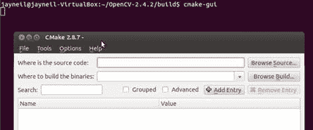
4.  提供源文件夹，在二进制文件夹选项中，提供`build`文件夹路径。
5.  点击**配置**。 

    
6.  现在，选中包含这些功能的复选框，然后再次单击**配置**以进行更新。
7.  确定后，单击**生成**。 

    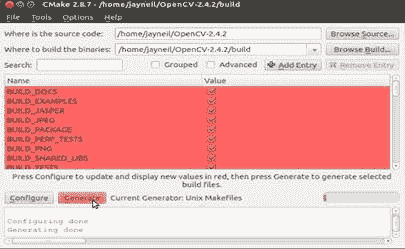

#### 步骤 4 –编译 OpenCV

运行以下命令：

```cpp
make

```

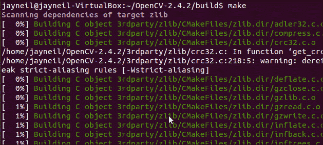

上述编译过程可能需要一些时间，具体取决于您的系统配置。 我们的 Intel i7 笔记本电脑花费了大约 10 分钟，而我们的 Intel i3 笔记本电脑花费了一个多小时。 以下屏幕截图显示了成功完成该过程后的输出。

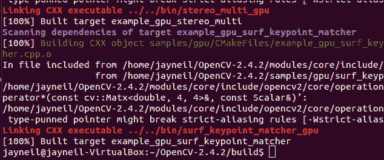

#### 步骤 5 –安装 OpenCV

运行以下命令：

```cpp
sudo make install

```

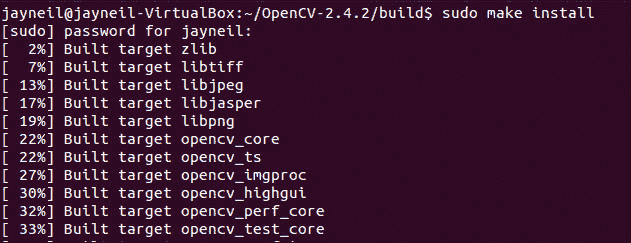

上述安装过程可能需要一些时间，具体取决于您的系统配置。 我们的 Intel i7 笔记本电脑大约花费 2 分钟，而我们的 Intel i3 笔记本电脑大约花费 15 至 20 分钟。 以下屏幕截图显示了成功完成该过程后的输出。

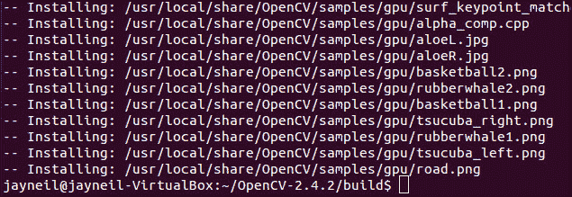

#### 步骤 6 –配置 Linux

1.  编辑`/etc/ld.so.conf.d/opencv.conf`并添加`/usr/local/lib`：

    ```cpp
    sudo gedit /etc/ld.so.conf.d/opencv.conf
    sudo ldconfig

    ```

2.  编辑`bash.rc`文件并添加以下内容：

    ```cpp
    PKG_CONFIG_PATH=$PKG_CONFIG_PATH:/usr/local/lib/pkgconfig
    export PKG_CONFIG_PATH

    ```

    

    ```cpp
    sudo gedit /etc/bash.bashrc

    ```

    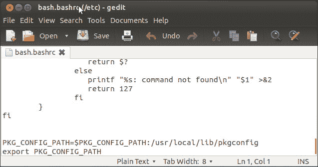

现在，注销系统或重新启动它。

#### 步骤 7 –使用 Code::Blocks 配置 OpenCV

1.  从 Ubuntu 软件中心安装 Code::Blocks IDE。
2.  起始 Code::Blocks IDE。
3.  通过单击**创建新项目**选项卡来创建新项目。
4.  从**项目**中选择**控制台应用程序**：

    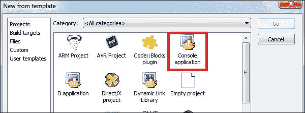
5.  选择语言为 **C++**，然后单击**下一步**。
6.  为您的项目命名，然后单击**下一步**。
7.  确保您使用的是 GNU GCC 编译器。 点击**完成**。 

    
8.  在**管理**视图的**项目**选项卡下找到您的项目。 要在您的项目中使用 OpenCV，需要以下预配置：
    1.  右键单击项目，转到**构建选项**。
    2.  跳至**编译器设置**中的**其他选项**选项卡。
    3.  在空白处添加`'pkg-config --cflags opencv`'。 
    
        
    4.  跳至**链接器设置**选项卡。
    5.  在**其他链接器选项**下的空白处添加`'pkg-config --libs opencv'`。 
    
        

### 注意

要使用 GCC 从命令行编译代码，请使用以下命令：

```cpp
g++ 'pkg-config --cflags --libs opencv' -o main main.cpp

```

## Linux 的 OpenCV 卸载过程

1.  转到`build`文件夹（在 OpenCV 文件夹内）。
2.  现在，在终端中运行以下命令：

    ```cpp
    sudo make uninstall

    ```

3.  删除整个 OpenCV 文件夹。
4.  在终端中运行以下命令，删除名称中包含`opencv`的每个文件：

    ```cpp
    sudo find / -name "*opencv*" -exec rm -i {} \;

    ```

5.  编辑`/etc/ld.so.conf.d`下的`opencv.conf`文件，然后从其中删除`/usr/local/lib`：

    ```cpp
    sudo gedit /etc/ld.so.conf.d/opencv.conf
    sudo ldconfig

    ```

6.  编辑`bash.rc`文件并从其中删除以下几行：

    ```cpp
    PKG_CONFIG_PATH=$PKG_CONFIG_PATH:/usr/local/lib/pkgconfig
    export PKG_CONFIG_PATH
    sudo gedit /etc/bash.bashrc

    ```

7.  为确保成功，请检查以下路径：
    *   `/usr/local/bin`
    *   `/usr/local/lib`

## Windows 的 OpenCV 安装过程

要在 Windows 中安装 OpenCV，请遵循下一部分中提到的步骤。

### 步骤 1 –安装依赖项

1.  从[这个页面](http://sourceforge.net/projects/mingw/files/)下载 MinGW 并将其安装在`c`驱动器中。
2.  从[这个页面](http://www.redfernplace.com/software-projects/patheditor/)下载并安装路径编辑器。

### 步骤 2 –安装 OpenCV

[从以下链接下载最新版本的 OpenCV 并运行可执行文件](http://sourceforge.net/projects/opencvlibrary/files/opencv-win/2.4.2/)。

### 注意

确保在`c`驱动器中安装 OpenCV。

### 步骤 3 –使用 Code::Blocks 配置 OpenCV

1.  [从以下链接下载并安装 Code::Blocks](http://www.codeblocks.org/downloads/26)。

2.  运行路径编辑器，然后单击“添加目录”，然后一个接一个地包含以下所有位置，然后单击“保存到注册表”。
    *   `C:\MinGW\bin`
    *   `C:\MinGW`
    *   `C:\opencv\build\x86\mingw\lib`
    *   `C:\opencv\build\x86\mingw\bin`
    *   `C:\opencv\build\common\tbb\ia32\mingw`
    
    

    ### 注意

    为 MinGW 和 OpenCV 添加`bin`文件夹的路径。

3.  起始 Code::Blocks IDE。
4.  通过单击**创建新项目**选项卡来创建新项目。
5.  从**项目**中选择**控制台应用程序**，如“步骤 7 –使用前面讨论的 Code::Blocks 配置 OpenCV”中的第一个屏幕截图所示。
6.  选择语言为 **C++**，然后单击**下一步**。
7.  给您的项目取一个合适的名称，然后单击**下一步**。
8.  确保您正在使用 GNU GCC 编译器，然后单击**完成**。
9.  在**管理**视图的**项目**选项卡下找到您的项目。 
0.  要在您的项目中使用 OpenCV，需要以下预配置：
    1.  转到**设置 | 编译器**选项。
    2.  打开**搜索目录**选项卡，然后选择**编译器**选项。
    3.  通过单击**添加**按钮添加以下路径：
        *   `C:\opencv\build\include\opencv`
        *   `C:\opencv\build\include`
    
    

    ### 注意

    从已安装的 OpenCV 文件夹中设置`include`文件夹的路径。

1.  跳到“搜索目录”下的“链接器”选项卡，并通过单击“添加”按钮添加以下路径：

    `C:\opencv\build\x86\mingw\lib`

    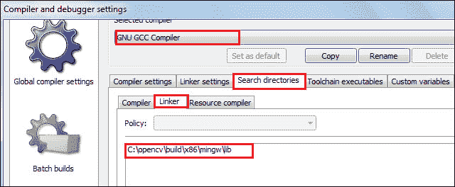

    ### 注意

    从已安装的 OpenCV 文件夹中设置库文件的路径。

2.  转到**链接器设置**选项卡，然后单击左下角的**添加**按钮。 浏览到`c:\opencv\build\x86\mingw\lib`并包括所有可用的库。 
3.  单击 **OK** 按钮以保存您的设置。

## 就是这样

至此，您应该在计算机上可以正常安装 OpenCV。 随意玩耍，发现更多有关它的信息。

# 快速入门– OpenCV 基础

在本节中，我们将介绍图像处理的基础知识，并通过执行一些琐碎的任务来帮助您在 OpenCV 中编写第一个程序。 整本书中的所有示例均使用 C++ 编程语言编写。

OpenCV 库具有模块化结构，下图描述了其中可用的不同模块：


所有模块的简要说明如下：

| 模块 | 特征 |
| --- | --- |
| Core | 一个紧凑的模块，定义基本数据结构，包括密集的多维数组`Mat`和所有其他模块使用的基本功能。 |
| Imgproc | 图像处理模块，包括线性和非线性图像滤波，几何图像转换（大小调整，仿射和透视变形，基于通用表的重新映射），色彩空间转换，直方图等。 |
| Video | 视频分析模块，包括运动估计，背景减法和对象跟踪算法。 |
| Calib3d | 基本的多视图几何算法，单镜头和立体相机校准，对象姿态估计，立体对应算法以及 3D 重构元素。 |
| Feature2d | 显着特征检测器，描述符和描述符匹配器。 |
| Objdetect | 检测对象和预定义类的实例； 例如，脸，眼睛，杯子，人，汽车等。 |
| Highgui | 一个易于使用的界面，用于视频捕获，图像和视频编解码器，以及简单的 UI 功能。 |
| Gpu | 来自不同 OpenCV 模块的 GPU 加速算法。 |

## 任务 1 –图片基础

例如，当尝试通过照相机以数字格式重现我们周围的物理世界时，计算机仅以包含数字 1 和 0 的代码形式看到图像。数字图像不过是像素集合 （图片元素），然后将其存储在 OpenCV 中的矩阵中以进行进一步处理。 在矩阵中，每个元素都包含有关图像中特定像素的信息。 像素值决定该像素应具有的亮度或颜色。 基于此，我们可以将图像分类为：

*   灰度
*   色彩/ RGB

### 灰度

此处的像素值范围是 0 到 255，因此我们可以看到各种灰色阴影，如下图所示。 在这里，0 代表黑色，255 代表白色：

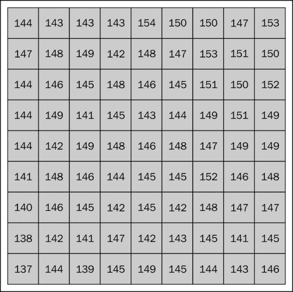

灰度的一种特殊情况是二进制图像或黑白图像。 此处的每个像素都是黑色或白色，如下图所示：


### 彩色/ RGB

红色，蓝色和绿色是主要颜色，将它们以各种不同的比例混合后，我们可以获得新的颜色。 彩色图像中的像素具有三个独立的通道，每个通道分别用于红色，蓝色和绿色。 每个通道的取值范围是 0 到 255，如下图所示：

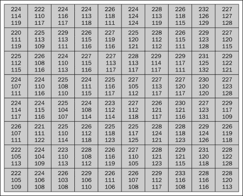

## 任务 2 –阅读和显示图像

现在，我们将使用 OpenCV 库编写一个非常简单且基本的程序来读取和显示图像。 这将帮助您了解基础知识。

### 代码

读取和显示图像的简单程序如下：

```cpp
// opencv header files
#include "opencv2/highgui/highgui.hpp"
#include "opencv2/core/core.hpp"
// namespaces declaration
using namespace cv;
using namespace std;
// create a variable to store the image
Mat image;
int main( int argc, char** argv )
{
// open the image and store it in the 'image' variable
// Replace the path with where you have downloaded the image
image=imread("<path to image">/lena.jpg");
// create a window to display the image
namedWindow( "Display window", CV_WINDOW_AUTOSIZE );
// display the image in the window created
imshow( "Display window", image );
// wait for a keystroke
waitKey(0);
return 0;
}
```

### 代码说明

现在让我们了解代码的工作原理。 短注释也已包含在代码本身中，以提高可读性。

```cpp
#include "opencv2/highgui/highgui.hpp"
#include "opencv2/core/core.hpp"
```

前两个头文件将成为我们使用 OpenCV 库编写的几乎每个程序的一部分。 如前所述，`highgui`标头用于窗口的创建，管理等，而核心标头用于访问 OpenCV 中的`Mat`数据结构。

```cpp
using namespace cv;
using namespace std;
```

前两行声明了此代码所需的名称空间，因此我们不必每次都使用`::`（作用域分辨率）运算符来访问函数。

```cpp
Mat image;
```

使用上面的命令，我们刚刚创建了数据类型`Mat`的可变图像，该图像在 OpenCV 中经常用于存储图像。

```cpp
image=imread("<path to image">/lena.jpg");
```

在上一个命令中，我们打开图像`lena.jpg`并将其存储在`image`变量中。 将上述命令中的`<path to image>`替换为该图片在 PC 上的位置。

```cpp
namedWindow( "Display window", CV_WINDOW_AUTOSIZE );
```

现在，我们需要一个窗口来显示图像。 所以，我们使用上面的函数来做同样的事情。 此函数有两个参数，第一个是窗口的名称。 在我们的情况下，我们想将窗口命名为`Display Window`。 第二个参数是可选的，但它会根据图像的大小调整窗口大小，以使图像不被裁剪。

```cpp
imshow( "Display window", image );
```

最后，我们准备在使用前面的函数创建的窗口中显示图像。 此功能有两个参数，第一个是必须在其中显示图像的窗口名称。 在我们的情况下，显然是**显示窗口**。 第二个参数是`image`变量，其中包含我们要显示的图像。 在我们的例子中，它是图像变量。

```cpp
waitKey(0);
```

最后但并非最不重要的一点是，建议您在使用 OpenCV 库编写的大多数代码中使用前面的函数。 如果我们不编写此代码，则图像将显示一秒钟，并且程序将立即终止。 它发生的太快了，您将无法看到图像。 该功能的主要作用是等待用户的击键，因此延迟了程序的终止。 延迟时间以毫秒为单位。

### 输出

图像可以显示如下：


## 任务 3 –调整大小并保存图像

现在，我们将使用 OpenCV 库编写一个非常简单且基本的程序，以调整大小并保存图像。

### 代码

以下代码可帮助您调整给定图像的大小：

```cpp
// opencv header files
#include "opencv2/highgui/highgui.hpp"
#include "opencv2/imgproc/imgproc.hpp"
#include "opencv2/core/core.hpp"
// namespaces declaration
using namespace std;
using namespace cv;
int main(int argc, char** argv)
{
    // create variables to store the images
    Mat org, resized,saved;
    // open the image and store it in the 'org' variable
    // Replace the path with where you have downloaded the image
    org=imread("<path to image>/lena.png");
    //Create a window to display the image    
    namedWindow("Original Image",CV_WINDOW_AUTOSIZE);
    //display the image
    imshow("Original Image",org);
    //resize the image    
    resize(org,resized,Size(),0.5,0.5,INTER_LINEAR);
    namedWindow("Resized Image",CV_WINDOW_AUTOSIZE);
    imshow("Resized Image",resized);
    //save the image
    //Replace <path> with your desired location    
    imwrite("<path>/saved.png",resized;
    namedWindow("Image saved",CV_WINDOW_AUTOSIZE);
    saved=imread("<path to image>/saved.png");
    imshow("Image saved",saved);
    //wait for a keystroke
    waitKey(0);
    return 0;
}
```

### 代码说明

由于上述程序中的大多数代码与“图像转换”部分中的代码相似，因此在这种情况下仅说明新功能/概念。

```cpp
#include "opencv2/imgproc/imgproc.hpp"
```

`Imgproc`是另一个有用的标头，使我们可以访问各种转换，颜色转换，过滤器，直方图等。

```cpp
Mat org, resized;
```

现在，我们创建了两个变量`org`和`resized`，分别存储原始图像和调整大小的图像。

```cpp
resize(org,resized,Size(),0.5,0.5,INTER_LINEAR);
```

我们使用了前面的功能来调整图像的大小。 前面的函数有六个参数，其中第一个是包含要修改的源图像的变量。 第二个是存储调整大小后的图像的变量。 第三个参数是输出图像大小。 在这种情况下，我们没有指定它，而是使用了`Size()`函数，该函数将根据第四和第五个参数的值自动进行计算。 第四和第五参数分别是沿水平和垂直轴的比例因子。 第六个参数用于选择插值方法的类型。 我们使用了双线性插值，这是默认方法。

```cpp
imwrite("<path>/saved.png",final);
```

最后，使用前面的功能，您可以将图像保存到我们 PC 上的特定位置。 该函数有两个参数，第一个是要存储图像的位置，第二个是要存储图像的变量。 当您要对图像执行多项操作并将图像保存在 PC 上以备将来参考时，此功能非常有用。 用所需的位置替换前面功能中的`<path>`。

### 输出

调整大小可以通过以下输出进行演示：


# 您需要了解的前 5 个功能

让我们快速回顾一下到目前为止我们已经学习和完成的事情。 我们对 OpenCV 进行了简要概述，并执行了一些琐碎的任务，例如读取，显示和保存图像。 现在，我们将逐步提高它的等级，并学习一些有用和更高级的功能，例如像素处理和图像转换。

从这里开始，代码的其余部分将不会在书中发布，但是可以从 Packt Publishing 网站上下载整个代码。

## 像素操纵

如果仔细观察，您会注意到，到目前为止，我们已执行的所有代码都对整个图像执行操作，而不是对单独的组成元素执行操作，这些操作称为**像素**。 在许多应用中，可能需要使用单个像素进行操作。 例如，您去印度旅行，并在各个异国风情的地方拍摄了很多照片。 从旅行中回来后，您用数码相机拍摄了三千多张照片。 突然，您想要沙漠拍的那幅美丽的照片。 现在，您可以浏览所有三千张图像并希望找到图片，或者可以使用 OpenCV 来帮助您。 由于您知道沙漠中沙的颜色，因此可以编写 OpenCV 程序，通过将图片中的每个像素值与沙漠沙的颜色进行比较来搜索背景相似的图片。 这将把搜索范围缩小到仅几张图片！

因此，我们现在将看到如何在 OpenCV 中执行像素操作。

### 任务

给定灰度或彩色图像，请执行像素操作。

### 算法

对于灰度和彩色图像，该算法非常相似。 让我们首先了解有关灰度图像的算法。

#### 灰度

我们的程序会将图像中每个像素的值与预定阈值进行比较，然后基于预设逻辑将图像中选定像素的现有值更改为另一个所需值。 因此，例如，让我们假设阈值为 100，并且我们设计了预设逻辑，以使每个大于阈值的像素值在图像中都变为白色。 现在，我们的程序会将图像中的每个像素值与阈值进行比较，并且满足预设逻辑标准的任何像素都将变为白色，而其余像素将保持不变。

#### 颜色

逻辑类似于彩色图像一样扩展，但是有一些修改。 与灰度图像不同，彩色图像中的像素具有三个分量，分别是红色，绿色和蓝色。 正是这三个单独成分的值的组合决定了该像素处图像中所得的颜色。 这三个分量的每个分量的值都在 0 到 255 之间，其中 0 代表黑色，255 代表白色。 因此，我们必须考虑所有三个组成部分的值。 在这种情况下，我们的程序将首先获得三个分量的值，计算平均值（我们称其为**平均像素值**），然后使用该值与预定阈值进行比较。 然后，基于预设逻辑，它将图像中选定像素的三个分量的现有值更改为另一个所需值。 因此，例如，让我们假设阈值为 100，并且我们设计了预设逻辑，以使每个大于阈值的平均像素在图像中都变为白色。 现在，我们的程序将首先获取像素的 **RGB**（红绿蓝的缩写）分量的值，然后计算平均值。 因此，此新计算的平均值将代表像素值并减轻我们的负担，因为我们不必处理三个单独的值。 现在，我们的程序会将图像中每个像素的平均像素值与阈值进行比较，并且满足预设逻辑标准的任何像素都将变为白色，而其余像素则保持不变。

### 代码

要执行像素操作，我们将使用以下代码：

```cpp
void thresholding(Mat &aImage, uchar aThreshValue)
{
 int numberRows = aImage.rows; // Number of Rows in Image(Height)
 int numberCols = aImage.cols; // Number of Cols in Image(Width)
  for(int j = 0; j < numberRows; j++)
  for(int i = 0; i < numberCols; i++)
   {
      if (aImage.channels() == 1)
      {
	// grayscale image
      // Get the value of each pixel
      uchar tValue = aImage.at<uchar>(j,i);
      if(tValue > aThreshValue)  
      { // If the pixel value is greater than the threshold value then make it WHITE
      aImage.at<uchar>(j,i)= 255;
      }
       }
       else if (aImage.channels() == 3)
       {// color image
        // Sum of RGB components of the pixel
       int tSum = aImage.at<Vec3b>(j,i)[0] + aImage.at<Vec3b>(j,i)[1] + aImage.at<Vec3b>(j,i)[2];
         uchar averageValue = static_cast<uchar>(tSum/3);
          if(averageValue > aThreshValue)
          { // If the average value of RGB components of the pixel is greater than the threshold value then make the components WHITE
             aImage.at<Vec3b>(j,i)[0]= 255; // Blue component of the pixel
             aImage.at<Vec3b>(j,i)[1]= 255; // Green component of the pixel
             aImage.at<Vec3b>(j,i)[2]= 255; // Red component of the pixel
           }
            }
        }
}
```

### 代码说明

现在，让我们了解该程序的工作原理。

```cpp
void thresholding(Mat &aImage, uchar aThreshValue)
```

这是我们将执行像素操作的功能。 它接受两个参数：`aImage`和`aThreshValue`。 `aImage`参数是包含要在其上执行像素操作的图像的矩阵，而`aThreshValue`是包含阈值的变量。 请注意，OpenCV 中的`uchar`是 8 位无符号整数。

```cpp
int numberRows = aImage.rows; // Number of Rows in Image(Height)
int numberCols = aImage.cols; // Number of Cols in Image(Width)
```

在这里，`numberRows`和`numberCols`将分别存储图像的高度（行）和宽度（列）。

```cpp
if (aImage.channels() == 1)
```

现在，我们将检查给定的图像是否为灰度图像。 如前所述，灰度图像只有一个通道，只有一个分量代表图像中每个像素的值。

```cpp
uchar tValue = aImage.at<uchar>(j,i);
```

`tValue`是 8 位无符号整数，它将存储图像中点`(j, i)`处的像素值。

```cpp
if(tValue > aThreshValue)
  aImage.at<uchar>(j,i)= 255;
```

在这里，我们将检查特定像素的值是否大于阈值。 如果特定的像素值满足上述预设逻辑，则其值大于阈值，因此我们会将其更改为白色（255）。

```cpp
else if (aImage.channels() == 3)
```

在这里，我们检查给定的图像是否是彩色图像。 如前所述，彩色图像具有三个通道（三个分量），分别是红色，绿色和蓝色。

```cpp
int tSum = aImage.at<Vec3b>(j,i)[0] + aImage.at<Vec3b>(j,i)[1] + aImage.at<Vec3b>(j,i)[2];
```

`tSum`将存储图像中点`(j, i)`处像素的 RGB 分量的算术和。 此外，`Vec3b`是用于存储数值向量的模板类。 在这里，数字`[0]`，`[1]`和`[2]`分别用于访问蓝色，绿色和红色分量。

```cpp
uchar averageValue = static_cast<uchar>(tSum/3);
```

现在我们计算像素的平均值。

```cpp
if(averageValue > aThreshValue)
          { // If the average value of RGB components of the pixel is greater than the 		    threshold value then make it white
             aImage.at<Vec3b>(j,i)[0]= 255; // Blue component of the pixel
             aImage.at<Vec3b>(j,i)[1]= 255; // Green component of the pixel
             aImage.at<Vec3b>(j,i)[2]= 255; // Red component of the pixel
           }
```

在这里，我们将检查每个像素的平均值是否大于阈值。 如果特定像素值满足预设逻辑，则其值大于阈值，因此我们会将该像素的所有分量的值更改为白色（255）。 我们还想指出，OpenCV 也有自己的内置阈值函数，但为简单起见，在这种情况下我们创建了自己的阈值函数。

### 输出

以下输出显示像素操作：


## 图片转换

图像转换是另一个非常强大的工具，这对于学习非常重要。 在各种情况下，与彩色图像相比，处理灰度图像要容易得多。 例如，假设我们要编写一个程序来检测给定图像中是否存在特定对象（例如正方形或矩形）。 在这里，我们关注的是对象的形状，而不是其颜色。 因此，将图像从颜色转换为灰度将为我们减少大量计算，因为我们只需要处理一个通道。

### 任务

给定彩色图像，将其转换为灰度图像。

### 代码

使用以下代码将彩色图像转换为灰度图像：

```cpp
// opencv header files
#include "opencv2/highgui/highgui.hpp"
#include "opencv2/core/core.hpp"
#include "opencv2/imgproc/imgproc.hpp"
// namespaces declaration
using namespace cv;
using namespace std;
// create a variable to store the image
Mat image;
Mat gray;

int main( int argc, char** argv )
{
// open the image and store it in the 'image' variable
// Replace the path with where you have downloaded the image
image=imread("<Path to Image>/RGB.png");
// create single channel image to store output grayscale image
gray.create(image.rows, image.cols, CV_8UC1);
// convert RGB image to GrayScale
cvtColor(image, gray, CV_BGR2GRAY);
// create a window to display the image
namedWindow( "Color Image", CV_WINDOW_AUTOSIZE );
namedWindow("GrayScale Image", CV_WINDOW_AUTOSIZE);
// display the image in the window created
imshow( "Color Image", image );
imshow( "GrayScale Image", gray);
// wait for a keystroke
waitKey(0);
return 0;
}
```

### 代码说明

该代码与我们之前看过的代码非常相似。 因此，下面仅讨论需要进一步说明的部分。

```cpp
gray.create(image.rows, image.cols, CV_8UC1);
```

前面的函数用于创建具有单个通道的矩阵，以存储生成的灰度图像。

```cpp
cvtColor(image, gray, CV_BGR2GRAY);
```

此 OpenCV 函数执行各种图像转换。 在这种情况下，它将给定的彩色图像转换为灰度。 该函数接受三个参数。 第一个是包含源图像（我们要转换的图像）的矩阵，而第二个是我们要在其中存储转换后的图像的矩阵。 第三个参数指定我们要执行的转换类型，在本例中为`CV_BGR2GRAY`。 我们还可以使用上述功能将图像从给定的色彩空间模型（如 RGB）转换为其他模型（如 HSV 和 CIELAB）。

### 输出

以下输出显示了原始彩色图像和我们创建的灰度图像之间的比较：


如果您不对技术进行一些很棒的，基于现实生活的应用项目，那么学习技术有什么好处？ 因此，现在我们将做三个令人敬畏的项目，希望它们能突出 OpenCV 的重要性和各种可能的用法。

## 图像隐写术

这是一项非常有趣的技术，由于当今世界的错误原因而被使用。 它用于毒品走私，贩运，恐怖主义等。 让我们首先了解这种技术。 例如，假设您有一张藏宝图，可以通往大阿育王国王的隐藏宝藏！ 由于信息的敏感和秘密性质，您无法将信息传递给某人，而没有错误的人来帮助他们。 您可以通过电子邮件发送藏宝图的图像，但是总是有黑客可以入侵您的帐户并获取它。 面对面与该人面对面也是冒险的。 这是图像隐写术可以帮助您的地方。 如果您可以发送藏在房子或猫的图片中的藏宝图的图片怎么办？ 这正是图像隐写术！ 现代研究已经导致了许多先进的图像隐写术形式，这些形式已被高度加密并且不易检测。

因此，现在让我们了解如何编写 OpenCV 代码以执行上述操作。

为了更好地理解，此过程分为两个部分。

### 第 1 部分–编码

这是程序的第一部分。

#### 任务

使用图像隐写术将给定图像隐藏在另一个图像中。

#### 算法

考虑一个数字，例如 126。可以说这个数字中最重要的数字是 1，它排在第 100 位。 与其他数字 2 和 6 相比，它具有最大的权重。即使丢弃了其他数字，它仍然传达的信息是它是一个大于或等于 100 的数字。如果丢弃了数字 1 却不能说相同的信息。 其余的保留下来。 可以将相同的推理扩展到计算机数据。 如果您使用 8 位整数，则左侧的第一位称为**最高有效位**（**MSB**），而右侧的最后一位称为[[ **最低有效位**（**LSB**）。 优先级/权重从左到右（从 MSB 到 LSB）降低。 因此，如果我们将 8 位图像存储在 OpenCV 中，则图像中的每个像素都由 8 位整数表示，有关像素的最有价值的信息位于该像素的 MSB 中。 现在，让我们调用要隐藏的图像（隐藏图像）和将存储隐藏图像的图像（正面图像）。 因此，隐藏的图像将被隐藏在正面图像内部！ 我们可以将隐藏图像的像素的 MSB 存储在正面图像的 LSB 中。 该规定不会破坏任何一张图像的信息内容。 图像隐写术可能导致大量信息丢失。 因此，在我们的情况下，我们将隐藏图像中每个像素的前四位（从 MSB 开始）存储在前图像中每个像素的后四位（以 LSB 结尾）。

#### 代码

我们使用以下代码将给定图像隐藏在另一个图像中：

```cpp
void steganographMyImage(Mat& aFrontImage, Mat& aHiddenImage, Mat& aStegedImage)
{
    // check for size and type of both the given images
    if(aFrontImage.type() != aHiddenImage.type() || aFrontImage.size() !=    aHiddenImage.size())
    {
        printf("Given Image types are different \n");
        return;
    }
    int numberRows = aFrontImage.rows; // Number of Rows in Image(Height)
    int numberCols = aFrontImage.cols; // Number of Cols in Image(Width)
    // create output Image
    aStegedImage.create(numberRows, numberCols, aFrontImage.type());

    Mat tFront_image, tHidden_image;

 Mat front_mask(numberRows, numberCols, aFrontImage.type(), Scalar(0xF0, 0xF0, 0xF0));
 Mat hidden_mask(numberRows, numberCols, aFrontImage.type(), Scalar(0xF0, 0xF0,  0xF0));

    bitwise_and(aFrontImage, front_mask, tFront_image);
    bitwise_and(aHiddenImage, hidden_mask, tHidden_image);

    for(int j = 0; j < numberRows; j++)
        for(int i = 0; i < numberCols; i++){
           tHidden_image.at<Vec3b>(j,i)[0] = tHidden_image.at<Vec3b>(j,i)[0] >> 4;
           tHidden_image.at<Vec3b>(j,i)[1] = tHidden_image.at<Vec3b>(j,i)[1] >> 4;
           tHidden_image.at<Vec3b>(j,i)[2] = tHidden_image.at<Vec3b>(j,i)[2] >> 4;
        }

    bitwise_or(tFront_image, tHidden_image, aStegedImage);

}
```

### 代码说明

将执行图像隐写术的功能如下：

```cpp
void steganographMyImage(Mat& aFrontImage, Mat& aHiddenImage, Mat& aStegedImage)
```

此函数采用三个参数。 第一个是包含要隐藏所需图像的图像的矩阵。 第二个参数是包含我们要隐藏的图像的矩阵，第三个和最后一个参数是将存储所得隐写图像的矩阵。

```cpp
 if(aFrontImage.type() != aHiddenImage.type() || aFrontImage.size() !=          
    aHiddenImage.size())
```

为了使正面图像和隐藏图像的尺寸相同，以便于理解和简化，编写了此代码。 在这里，我们将检查两个图像是否具有相同的类型（位大小，即 8 位，16 位，等等）和大小。 如果它们的大小或类型都不相等，我们将终止函数的执行。

```cpp
aStegedImage.create(numberRows, numberCols, aFrontImage.type());
```

借助上述功能，我们确保将要存储隐写图像的`aStegedImage`矩阵的属性（列，行和类型）与包含载体图像的`aFrontImage`矩阵的属性（列，行和类型）相同，在其中我们将隐藏我们想要的图像。

```cpp
Mat front_mask(numberRows, numberCols, aFrontImage.type(), Scalar(0xF0, 0xF0, 0xF0));
Mat hidden_mask(numberRows, numberCols, aFrontImage.type(), Scalar(0xF0, 0xF0,  0xF0));
```

上面的函数创建具有指定行数，列数和类型数的矩阵，甚至使用提供的值初始化每个元素。 在我们的例子中，我们首先创建了一个矩阵`front_mask`，其中的行，列和类型与`aFrontImage`矩阵相同。 然后，我们用二进制值 0xF0 或 11110000 初始化所有矩阵元素。 为什么要三遍？ 因为这是彩色图像，所以它具有三个通道或三个分量。 然后，我们对矩阵`hidden_mask`执行类似的操作。

```cpp
 bitwise_and(aFrontImage, front_mask, tFront_image);
 bitwise_and(aHiddenImage, hidden_mask, tHidden_image);
```

上述函数执行两个矩阵的按位与运算，并将结果存储在第三个矩阵中。 在我们的情况下，我们首先执行了`aFrontImage`和`front_mask`矩阵的按位与运算，并将其存储在`tFront_image`矩阵中。 那么，我们通过此操作实现了什么？ 好吧，现在生成的`tFront_image`矩阵仅包含`aFrontImage`中每个像素的前四个重要位。 其余的四位被零填充。 第二行执行与第一行类似的操作。

```cpp
 tHidden_image.at<Vec3b>(j,i)[0] = tHidden_image.at<Vec3b>(j,i)[0] >> 4;
 tHidden_image.at<Vec3b>(j,i)[1] = tHidden_image.at<Vec3b>(j,i)[1] >> 4;
 tHidden_image.at<Vec3b>(j,i)[2] = tHidden_image.at<Vec3b>(j,i)[2] >> 4;
```

前面的函数将`tHidden_​​image`矩阵的像素分量右移 4 位，因此前四位被零填充。

```cpp
 bitwise_or(tFront_image, tHidden_image, aStegedImage);
```

最后，我们对`tFront_image`和`tHidden_image`矩阵进行按位加法以获得`aStegedImage`，这是我们的隐写图像。

#### 输出

显示图像隐写术的输出如下：

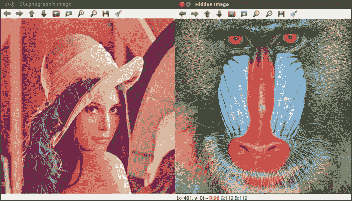

### 第 2 部分-解码

这是程序的第二部分。

#### 任务

从隐写图像获取原始图像。

#### 算法

这里的算法与我们先前在执行图像隐写术时使用的算法非常相似。 在这里，我们已经有了隐密笔图像，我们需要从中获得隐藏图像和载体图像（隐藏有隐藏图像的图像）。 因此，我们需要对先前使用的算法进行逆向工程。 在给定的密写图像中，我们知道像素的前四位代表载体图像的前四位。 其余四位表示隐藏图像的前四位。 因此，我们必须将这些位分开并将它们存储在相应的图像中。

#### 代码

使用以下代码从隐秘术图像中检索原始图像：

```cpp
void getOriginalImages(Mat& aStegedImage, Mat& aFrontImage, Mat& aHiddenImage)
{
    int numberRows = aStegedImage.rows; // Number of Rows in Image(Height)
    int numberCols = aStegedImage.cols; // Number of Cols in Image(Width)

    aFrontImage.create(numberRows, numberCols, aStegedImage.type());
    aHiddenImage.create(numberRows, numberCols, aStegedImage.type());

    Mat tFront_image, tHidden_image;

    Mat front_mask(numberRows, numberCols, aStegedImage.type(), Scalar(0xF0, 0xF0, 0xF0));
    Mat hidden_mask(numberRows, numberCols, aStegedImage.type(), Scalar(0x0F, 0x0F, 0x0F));

    bitwise_and(aStegedImage, front_mask, aFrontImage);
    bitwise_and(aStegedImage, hidden_mask, aHiddenImage);

    for(int j = 0; j < numberRows; j++)
        for(int i = 0; i < numberCols; i++){
            aHiddenImage.at<Vec3b>(j,i)[0] = aHiddenImage.at<Vec3b>(j,i)[0] << 4;
            aHiddenImage.at<Vec3b>(j,i)[1] = aHiddenImage.at<Vec3b>(j,i)[1] << 4;
            aHiddenImage.at<Vec3b>(j,i)[2] = aHiddenImage.at<Vec3b>(j,i)[2] << 4;
        }

}
```

### 代码说明

由于该代码与执行实际隐写术的代码非常相似，因此这里仅讨论了不同的部分和需要解释的部分。

```cpp
void getOriginalImages(Mat& aStegedImage, Mat& aFrontImage, Mat& aHiddenImage)
```

这是我们的功能，它将帮助我们从隐写图像中获取载体图像和隐藏图像，并且需要三个参数。 第一个参数是包含隐写图像的矩阵。 第二个是包含图像的矩阵，其中我们隐藏了所需的图像。 第三个参数是包含所需或隐藏图像的矩阵。

```cpp
Mat front_mask(numberRows, numberCols, aStegedImage.type(), Scalar(0xF0, 0xF0, 0xF0));
```

与前面的情况不同，这里我们用二进制值`0x0F`或`11110000`初始化`front_mask`矩阵的每个元素。 为什么？ 因为我们想要隐秘图像的前四位，因为它们对应于载体图像的前四位。

```cpp
aHiddenImage.at<Vec3b>(j,i)[0] = aHiddenImage.at<Vec3b>(j,i)[0] << 4;
aHiddenImage.at<Vec3b>(j,i)[1] = aHiddenImage.at<Vec3b>(j,i)[1] << 4;
aHiddenImage.at<Vec3b>(j,i)[2] = aHiddenImage.at<Vec3b>(j,i)[2] << 4;
```

前面的功能将`aHidden_image`的像素分量左移了 4 位，因为前四位被零填充并且实际信息存储在后四位中。

#### 输出

下面的屏幕快照显示了从隐秘仪图像中检索到的原始图像：


## 边缘检测

边缘检测是计算机视觉中大量使用的另一种非常重要的技术。 我们已经看到了在现实生活中非常有趣的应用。 饼干制造公司必须每天制造数千个饼干，并保持标准和质量。 它不能让工人检查每个饼干以确保每个饼干都是矩形的。 当然会有瑕疵品。 因此，该公司使用边缘检测和机器人技术来过滤并从主要批次中清除有缺陷的零件。

### 任务

对于给定的图像，检测其中的边缘/边界。

### 代码

以下代码将检测给定图像中的边缘或边界：

```cpp
int main( int argc, char** argv )
{

    // create a variable to store the image
    Mat image, gray, edge, cedge;
    // Threshold value for canny edge detection
    int edgeThresh = 10;

    // open the image and store it in the 'image' variable
    // Replace the path with where you have downloaded the image
    image=imread("<Path to Image>/RGB.png");

    // create single channel image to store output gray image
    gray.create(image.rows, image.cols, CV_8UC1);
    // convert RGB image to GrayScale
    cvtColor(image, gray, CV_BGR2GRAY);
    // create image to store final edge detected image.
    cedge.create(gray.size(), gray.type());

    // Run the edge detector on grayscale
    Canny(gray, edge, edgeThresh, edgeThresh*3, 3);
    cedge = Scalar::all(0);

    image.copyTo(cedge, edge);

    namedWindow("Output Image", CV_WINDOW_AUTOSIZE);
    // display the image in the window created
    imshow("Output Image", cedge);
    waitKey(0);
    return 0;
}
```

### 代码说明

这里的代码与我们之前看过的代码非常相似。 因此，仅讨论了需要进一步说明的部分，如下所示：

```cpp
 Canny(gray edge, edgeThresh, edgeThresh*3, 3);
```

我们已经在 OpenCV 中使用 Canny 函数来实现 Canny 算法以进行边缘检测。 此函数通常接受五个参数，但最后一个是可选的。 第一个参数是包含源图像的矩阵，第二个参数是我们要在其中存储结果输出的矩阵。 第三和第四参数分别是阈值 1 和阈值 2。 `threshold1`和`threshold2`之间的最小值用于边缘链接。 最大值用于查找强边的初始段。 通常建议将`threshold2`的值设为`threshold1`的三倍。 第四个参数是 Sobel 运算符的孔径大小，也称为内核大小。

```cpp
cedge = Scalar::all(0);
```

这是为了确保`cedge`矩阵的所有元素都初始化为`0`值，而不是其他任何随机值。

```cpp
image.copyTo(cedge, edge);
```

前面的函数将一个矩阵复制到另一个矩阵。 因此，我们基本上已经将边缘矩阵中包含的图像复制到`cedge`矩阵中。

### 输出

以下输出显示了给定图像中的边缘和边界：

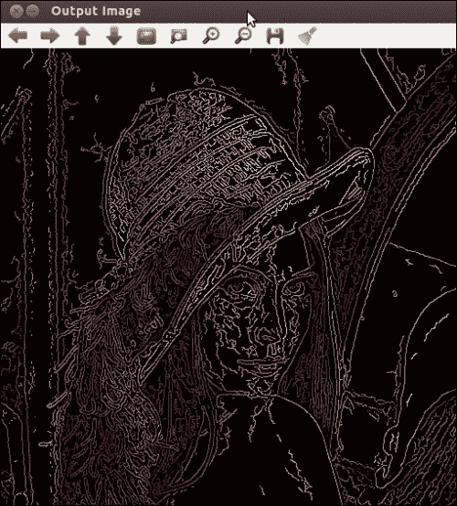

## 通过摄像头进行实时视频处理

如今，视频处理是警察使用的一种非常重要的技术，可在犯罪后查找或找到犯罪嫌疑人。 下次访问附近的一家小商店时，看到里面安装了闭路电视摄影机就不会感到惊讶。 这是为了帮助小店主抓住扒手。 接下来，为了简要了解视频处理，我们将做一个非常琐碎的任务。

### 任务

将实时彩色视频源从网络摄像头转换为灰度并在窗口中显示。

### 算法

视频不过是帧/图像的序列/集合。 因此，要对其进行处理，我们可以将其拆分为多个组成框架，并在这些框架上执行所需的操作。

### 代码

以下代码将彩色图像转换为灰度图像：

```cpp
int main( int argc, char** argv )
{
    Mat Image;
    Mat gray;
    char key = 0;

   // open the default camera
    VideoCapture capture(0);

  // check for failure   
 if (!capture.isOpened()) {
        printf("Failed to open a video device or video file!\n");
        return 1;
    }
    // Set Capture device properties.
    capture.set(CV_CAP_PROP_FRAME_WIDTH, 640);
    capture.set(CV_CAP_PROP_FRAME_HEIGHT, 480);

    namedWindow("Camera Video", CV_WINDOW_AUTOSIZE);
    namedWindow("Processed Video", CV_WINDOW_AUTOSIZE);

    while( key != 'q')
    {
       // get a new frame from camera
        capture >> Image;

        cvtColor(Image, gray, CV_BGR2GRAY);

        imshow("Camera Video",Image);
        imshow("Processed Video", gray);

        key = waitKey(25);
    }
    return 0;
}
```

### 代码说明

由于代码与我们之前研究的代码非常相似，因此这里只讨论了不同的部分并需要解释。

```cpp
VideoCapture capture(0);
```

上面的代码行在计算机上打开默认相机。 VideoCapture 是 OpenCV 中的一个类，提供 C++ 视频捕获 API。

```cpp
if (!capture.isOpened())
```

这将检查是否有故障-计算机上无法打开相机接口的情况。

```cpp
capture.set(CV_CAP_PROP_FRAME_WIDTH, 640);
capture.set(CV_CAP_PROP_FRAME_HEIGHT, 480);
```

上面的代码行设置了捕获设备属性。 要了解`videoCapture`类的其他属性，请参考该类的参考文档。

```cpp
capture >> Image;
```

这将获取相机的新帧并将其存储在`Image`矩阵中。

### 输出

以下输出显示了彩色和灰度图像之间的比较：

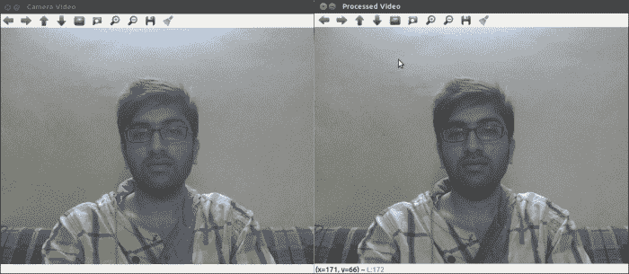

# 您应该认识的人和地方

如果您需要有关 OpenCV 的帮助，以下是一些人和地方，这些地方和地方将无价之宝。

## 官方网站

*   [**OpenCV 主页**](http://www.opencv.org)
*   [**OpenCV 文档**](http://docs.opencv.org/)
*   [**OpenCV 用户指南**](http://docs.opencv.org/doc/user_guide/user_guide.html)

## 教程/备忘单/答案

*   [**OpenCV 官方教程**](http://docs.opencv.org/doc/tutorials/tutorials.html)
*   [**OpenCV 速查表**](http://docs.opencv.org/trunk/opencv_cheatsheet.pdf)
*   [**OpenCV 问答**](http://answers.opencv.org/questions/)

## 社区

*   [**OpenCV Yahoo 小组**](http://tech.groups.yahoo.com/group/OpenCV/)
*   [**OpenCV Google Plus 小组**](https://plus.google.com/communities/106558044109618648316)

## Twitter

*   [**OpenCV 官方 Twitter 页面**](https://twitter.com/opencvlibrary)
*   有关更多开源信息，[请关注 Packt](http://twitter.com/#!/packtopensource)