# 第 3 章。校正和增强图像

本章介绍了图像增强和校正的方法。 有时，有必要减少图像中的噪点或强调或抑制图像中的某些细节。 这些过程通常是通过修改像素值，对它们或它们的本地邻居执行一些操作来执行的。 根据定义，图像增强操作用于改善重要的图像细节。 增强操作包括降噪，平滑和边缘增强。 另一方面，图像校正尝试恢复损坏的图像。 在 OpenCV 中， **imgproc** 模块包含图像处理功能。

在本章中，我们将介绍：

*   图像过滤。 这包括图像平滑，图像锐化以及使用图像金字塔。
*   应用形态学操作，例如扩张，腐蚀，打开或关闭。
*   几何变换（仿射和透视变换）。
*   修复，用于重建图像的受损部分。
*   去噪，这对于减少图像捕获设备产生的图像噪声是必需的。

# 图像过滤

图像过滤是修改或增强图像的过程。 强调某些特征或去除图像中的其他特征是图像过滤的示例。 过滤是一种邻居操作。 邻域是所选像素周围的一组像素。 图像滤波通过对附近像素的像素值执行某些操作来确定位于位置（x，y）的特定像素的输出值。

OpenCV 为常见的图像处理操作（例如平滑或锐化）提供几种过滤功能。

## 平滑

平滑，也称为“模糊”的，是一种图像处理操作，除其他用途外，通常用于减少噪声。 通过对图像应用线性滤波器来执行平滑操作。 然后，将位置（xi，yj）处的输出的像素值计算为位置（xi，yj）处的输入像素值及其附近的加权和。 线性运算中像素的权重通常存储在称为**内核**的矩阵中。 因此，滤波器可以表示为系数的滑动窗口。


像素邻域的表示

假设 *K* 为内核， *I* 和 *O* 分别为输入图像和输出图像。 然后，在（i，j）处的每个输出像素值计算如下：


中值，高斯和双边是最常用的 OpenCV 平滑滤波器。 中值滤波非常适合消除*椒盐*或*斑点*噪声，而高斯滤波则是边缘检测的更好的预处理步骤。 另一方面，双边滤波是一种在尊重强边缘的同时平滑图像的好技术。

为此，OpenCV 中包含的功能是：

*   `void boxFilter(InputArray src, OutputArray dst, int ddepth, Size ksize, Point anchor = Point(-1,-1), bool normalize = true, int borderType = BORDER_DEFAULT)`：这是一个盒子滤波器，其内核系数相等。 使用`normalize=true`时，每个输出像素值都是其内核邻居的平均值，所有系数均等于 1 / n，其中 n =元素数。 使用`normalize=false`时，所有系数都等于 1。`src`参数是输入图像，而滤波后的图像存储在`dst`中。 `ddepth`参数指示输出图像深度为-1，以使用与输入图像相同的深度。 内核大小在`ksize`中指示。 `anchor`点指示所谓的锚点像素的位置。 默认值（-1，-1）表示锚点位于内核的中心。 最后，在`borderType`参数中指示边界类型的处理。
*   `void GaussianBlur(InputArray src, OutputArray dst, Size ksize, double sigmaX, double sigmaY = 0, int borderType=BORDER_DEFAULT)`: This is done by convolving each point in the `src` input array with a Gaussian kernel to produce the `dst` output. The `sigmaX` and `sigmaY` parameters indicate the Gaussian kernel standard deviation in X and Y directions. If `sigmaY` is zero, it is set to be equal to `sigmaX`, and if both are equal to zero, they are computed using the width and height given in `ksize`.

    ### 注意

    卷积定义为两个函数乘积的积分，其中两个函数之一先前已被反转和移位。

*   `void medianBlur(InputArray src, OutputArray dst, int ksize)`：这遍历图像的每个元素，并将每个像素替换为其相邻像素的中间值。
*   `void bilateralFilter(InputArray src, OutputArray dst, int d, double sigmaColor, double sigmaSpace, int borderType=BORDER_DEFAULT)`：这类似于高斯滤波器，其中考虑了相邻像素，每个像素都分配有权重，但每个权重上都有两个分量，这与高斯滤波器使用的分量相同，而另一个像素考虑了 相邻像素和评估像素之间的强度。 此功能需要像素邻域的直径作为参数`d`和`sigmaColor` `sigmaSpace`值。 `sigmaSpace`参数的较大值表示像素邻域内的其他颜色将混合在一起，从而生成较大的半均等颜色区域，而`sigmaSpace`参数的较大值表示较远像素将彼此影响。 只要它们的颜色足够接近。
*   `void blur(InputArray src, OutputArray dst, Size ksize, Point anchor=Point(-1,-1), int borderType=BORDER_DEFAULT)`: This blurs an image using the normalized box filter. It is equivalent to using `boxFilter` with `normalize = true`. The kernel used in this function is:

    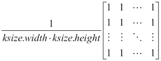

### 注意

`getGaussianKernel`和`getGaborKernel`函数可以在 OpenCV 中使用以生成自定义内核，然后可以将其传递给`filter2D`。

在所有情况下，都必须外推图像边界外不存在的像素的值。 OpenCV 允许在大多数过滤器功能中指定外推方法。 这些方法是：

*   `BORDER_REPLICATE`：此操作重复上一个已知的像素值：aaaaaa | abcdefgh | hhhhhhh
*   `BORDER_REFLECT`：这反映了图像边框：fedcba | abcdefgh | hgfedcb
*   `BORDER_REFLECT_101`：这将反映图像边框，而不复制边框的最后一个像素：gfedcb | abcdefgh | gfedcba
*   `BORDER_WRAP`：这将追加相对边框的值：cdefgh | abcdefgh | abcdefg
*   `BORDER_CONSTANT`：这将在新边界上建立一个常数：kkkkkk | abcdefgh | kkkkkk

### 示例代码

**平滑**示例之后的向您展示了如何通过`GaussianBlur`和`medianBlur`函数加载图像并对其应用高斯和中值模糊：

```cpp
#include "opencv2/opencv.hpp"

using namespace cv;

int main( int argc, char** argv )
{
    // Read the source file
    Mat src;
    src = imread(argv[1]);

    // Apply the filters
    Mat dst, dst2;
    GaussianBlur( src, dst, Size( 9, 9 ), 0, 0);
    medianBlur( src, dst2, 9);

    // Show the results
    namedWindow( " ORIGINAL ", WINDOW_AUTOSIZE );
    imshow( " ORIGINAL ", src );
    namedWindow( " GAUSSIAN BLUR ", WINDOW_AUTOSIZE );
    imshow( " GAUSSIAN BLUR ", dst );
    namedWindow( " MEDIAN BLUR ", WINDOW_AUTOSIZE );
    imshow( " MEDIAN BLUR ", dst2 );

    waitKey();
    return 0; 
}
```

下图显示了代码的输出：


来自高斯和中值模糊变换的原始和模糊图像

## 锐化

锐化滤镜用于突出显示图像中的边框和其他精细细节。 它们基于一阶和二阶导数。 图像的一阶导数计算图像强度梯度的近似值，而二阶导数定义为该梯度的散度。 由于数字图像处理处理离散量（像素值），因此将一阶和二阶导数的离散版本用于锐化。

一阶导数产生较厚的图像边缘，并广泛用于边缘提取。 但是，由于二阶导数对精细细节的响应更好，因此可用于图像增强。 用于获得导数的两种流行的运算符是 Sobel 和 Laplacian。

Sobel 运算符通过以下方式计算图像 I 的一阶图像导数：


可以通过组合两个方向上的梯度近似值来获得 Sobel 梯度幅度，如下所示：


另一方面，可以将图像的离散拉普拉斯算子与以下内核进行卷积：


为此，OpenCV 中包含的功能是：

*   `void Sobel(InputArray src, OutputArray dst, int ddepth, int dx, int dy, int ksize = 3, double scale = 1, double delta = 0, int borderType = BORDER_DEFAULT)`：这将根据`src`中的图像使用 Sobel 运算符计算一阶，二阶，三阶或混合图像导数。 `ddepth`参数指示输出图像深度，即-1 至使用与输入图像相同的深度。 籽粒大小在`ksize`中指示，所需的导数阶数在`dx`和`dy`中指示。 可以使用`scale`建立计算得出的微分值的比例因子。 最后，在`borderType`参数中指示边界类型处理，并且可以在将结果存储在`dst`中之前将`delta`值添加到结果中。
*   `void Scharr(InputArray src, OutputArray dst, int ddepth, int dx, int dy, double scale = 1, double delta = 0, int borderType = BORDER_DEFAULT )`：这为大小为 3 x 3 的内核计算了一个更准确的导数。`Scharr(src, dst, ddepth, dx, dy, scale, delta, borderType)`等效于`Sobel(src, dst, ddepth, dx, dy, CV_SCHARR, scale, delta, borderType)`。
*   `void Laplacian(InputArray src, OutputArray dst, int ddepth, int ksize = 1, double scale = 1, double delta = 0, int borderType = BORDER_DEFAULT)`：这将计算图像的拉普拉斯算子。 除了`ksize`以外，所有参数均与`Sobel`和`Scharr`功能中的参数相同。 当`ksize` >为 1 时，它通过将使用`Sobel`计算的第二 x 和 y 导数相加来计算`src`中图像的拉普拉斯算子。 当`ksize` = 1 时，通过用 3 x 3 内核对图像进行滤波来计算拉普拉斯算子，该内核包含-4 为中心，0 为角，其余为 1。

### 注意

`getDerivKernels`可以在 OpenCV 中使用以生成自定义的派生内核，然后可以将其传递给`sepFilter2D`。

### 示例代码

**锐化**示例之后的展示了如何通过`Sobel`和`Laplacian`函数从图像计算 Sobel 和 Laplacian 导数。 示例代码为：

```cpp
#include "opencv2/opencv.hpp"

using namespace cv;

int main( int argc, char** argv )
{
    // Read the source file
    Mat src;
    src = imread(argv[1]);

    // Apply Sobel and Laplacian
    Mat dst, dst2;
    Sobel(src, dst, -1, 1, 1 );
    Laplacian(src, dst2, -1 );

    // Show the results
    namedWindow( " ORIGINAL ", WINDOW_AUTOSIZE );
    imshow( " ORIGINAL ", src );
    namedWindow( " SOBEL ", WINDOW_AUTOSIZE );
    imshow( " SOBEL ", dst );
    namedWindow( " LAPLACIAN ", WINDOW_AUTOSIZE );
    imshow( " LAPLACIAN ", dst2 );

    waitKey(); 
    return 0;
}
```

下图显示了代码的输出：

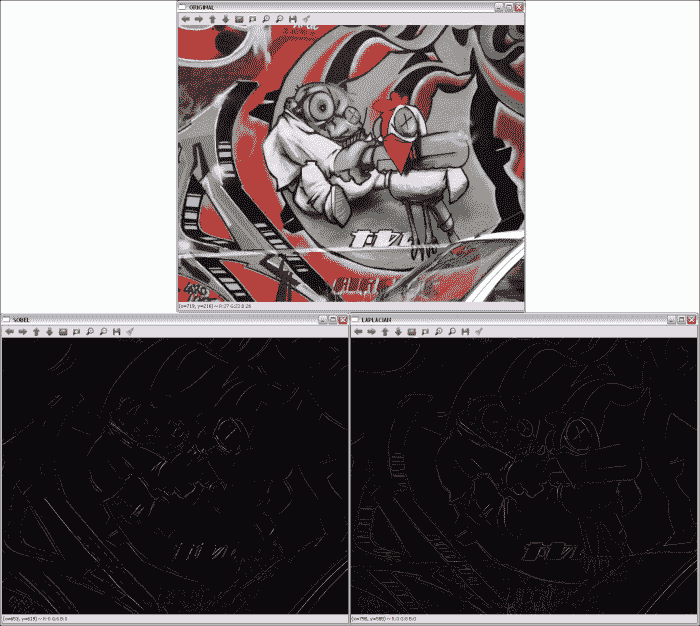

通过 Sobel 和 Laplacian 派生获得的轮廓

## 使用图像金字塔

在某些场合下，无法使用固定的图像尺寸进行操作，并且我们将需要具有不同分辨率的原始图像。 例如，在对象检测问题中，检查整个图像以尝试查找对象会花费太多时间。 在这种情况下，以较小的分辨率开始搜索对象会更有效。 这种图像集称为**金字塔**或 **mipmap** ，因为如果图像从底部到顶部按从大到小的顺序排列，则与金字塔结构类型相似 。

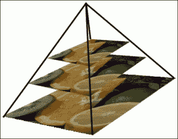

高斯金字塔

有两种图像金字塔：高斯金字塔和拉普拉斯金字塔。

### 高斯金字塔

高斯金字塔是通过交替除去较低级别的行和列，然后通过使用来自底层级别的邻域应用高斯滤波器来获得较高级别像素的值来创建的。 在每个金字塔步骤之后，图像将其宽度和高度减小一半，并且其面积是上一级图像面积的四分之一。 在 OpenCV 中，可以使用`pyrDown`，`pyrUp`和`buildPyramid`函数来计算高斯金字塔：

*   `void pyrDown(InputArray src, OutputArray dst, const Size& dstsize = Size(), int borderType = BORDER_DEFAULT)`：此子采样会模糊`src`图像，并将结果保存在`dst`中。 如果未使用`dstsize`参数设置输出图像的大小，则将其计算为`Size((src.cols+1)/2, (src.rows+1)/2)`。
*   `void pyrUp(InputArray src, OutputArray dst, const Size& dstsize = Size(), int borderType = BORDER_DEFAULT)`：计算`pyrDown`的相反过程。
*   `void buildPyramid(InputArray src, OutputArrayOfArrays dst, int maxlevel, int borderType = BORDER_DEFAULT)`：这将为`src`中存储的图像构建高斯金字塔，获取`maxlevel`新图像，然后将它们存储在`dst[0]`中原始图像之后的`dst`数组中。 因此，`dst`结果存储了`maxlevel` +1 图像。

金字塔也用于分割。 OpenCV 提供了一个基于均值漂移分割算法第一步来计算均值漂移金字塔的功能：

*   `void pyrMeanShiftFiltering(InputArray src, OutputArray dst, double sp, double sr, int maxLevel = 1, TermCriteria termcrit = TermCriteria (TermCriteria::MAX_ITER + TermCriteria::EPS, 5, 1))`: This implements the filtering stage of the mean-shift segmentation, obtaining an image, `dst`, with color gradients and fine-grain texture flattened. The `sp` and `sr` parameters indicate the spatial window and the color window radii.

    ### 注意

    可以在[这个页面](http://docs.opencv.org/trunk/doc/py_tutorials/py_video/py_meanshift/py_meanshift.html?highlight=meanshift)中找到有关均值漂移分割的更多信息。

### 拉普拉斯金字塔

拉普拉斯金字塔在 OpenCV 中没有特定的功能实现，但它们是由高斯金字塔形成的。 拉普拉斯金字塔可视为边界图像，其中大部分元素为零。 拉普拉斯金字塔中的第 i <sup>个</sup>级别是高斯金字塔中第 i <sup>个</sup>级别与第 i 个<sup>第</sup> +1 级的扩展版本之间的差。 高斯金字塔。

### 示例代码

**金字塔**示例之后的向您展示了如何通过`pyrDown`函数从高斯金字塔中获取两个级别，以及如何通过`pyrUp`从相反的操作中获取两个级别。 请注意，使用`pyrUp`后无法获得原始图像：

```cpp
#include "opencv2/opencv.hpp"

using namespace cv;

int main( int argc, char** argv )
{
    // Read the source file
    Mat src;
    src = imread(argv[1]);

    // Apply two times pyrDown
    Mat dst, dst2;
    pyrDown(src, dst);
    pyrDown(dst, dst2);

    // Show the results
    namedWindow( " ORIGINAL ", WINDOW_AUTOSIZE );
    imshow( " ORIGINAL ", src );
    namedWindow( " 1st PYRDOWN ", WINDOW_AUTOSIZE );
    imshow( " 1st PYRDOWN ", dst );
    namedWindow( " 2st PYRDOWN ", WINDOW_AUTOSIZE );
    imshow( " 2st PYRDOWN ", dst2 ); 

    // Apply two times pyrUp
    pyrUp(dst2, dst);
    pyrUp(dst, src);

    // Show the results
    namedWindow( " NEW ORIGINAL ", WINDOW_AUTOSIZE );
    imshow( " NEW ORIGINAL ", dst2 );
    namedWindow( " 1st PYRUP ", WINDOW_AUTOSIZE );
    imshow( " 1st PYRUP ", dst );
    namedWindow( " 2st PYRUP ", WINDOW_AUTOSIZE );
    imshow( " 2st PYRUP ", src );

    waitKey(); 
    return 0;
}
```

下图显示了代码的输出：

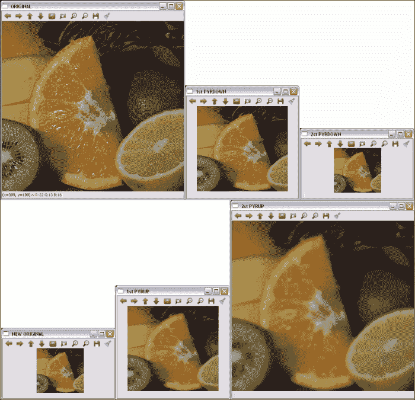

高斯金字塔的原始层和两个层

# 形态运算

形态学操作根据形状处理图像。 他们将定义的“结构元素”应用于图像，从而获得新图像，其中通过比较位置上的输入像素值来计算位置（x <sub>i</sub> ，y <sub>j</sub> ）上的像素 （x <sub>i</sub> ，y <sub>j</sub> ）及其附近地区。 根据所选的结构元素，形态操作对一种特定形状或其他形状更敏感。

两种基本的形态学运算是膨胀和侵蚀。 膨胀将像素从背景添加到图像中对象的边界，而侵蚀则将像素去除。 这是在其中考虑结构元素以选择要添加或删除的像素的地方。 在扩张中，输出像素的值是附近所有像素的最大值。 使用腐蚀，输出像素的值是附近所有像素的最小值。


膨胀和腐蚀的例子

其他图像处理操作可以通过组合扩张和腐蚀来定义，例如打开和关闭操作以及形态梯度。 打开操作的定义是腐蚀，然后是膨胀，而关闭是相反的操作-膨胀，然后是腐蚀。 因此，打开时会从图像中移除小物体，同时保留较大的物体，而闭合用于移除小孔，而同时保留较大物体，其方式类似于打开。 形态梯度定义为图像的膨胀与腐蚀之间的差异。 此外，还使用打开和关闭定义了另外两个操作：高帽操作和黑帽操作。 在大礼帽的情况下，它们被定义为源图像与其打开之间的差异；在黑帽的情况下，它们被定义为图像的关闭与源图像之间的差异。 所有操作都使用相同的结构元素。

在 OpenCV 中，可以通过以下函数应用膨胀，腐蚀，打开和关闭：

*   `void dilate(InputArray src, OutputArray dst, InputArray kernel, Point anchor = Point(-1,-1), int iterations = 1, int borderType = BORDER_CONSTANT, const Scalar& borderValue = morphologyDefaultBorderValue())`：这会使用特定的结构化元素扩大`src`中存储的图像，并将结果保存在`dst`中。 `kernel`参数是所使用的结构元素。 `anchor`点指示锚点像素的位置。 （-1，-1）值表示锚点位于中心。 使用`iterations`可以多次应用该操作。 边界类型的处理在`borderType`参数中指示，与前面部分中的其他过滤器相同。 最后，如果使用`BORDER_CONSTANT`边界类型，则在`borderValue`中指示常量。
*   `void erode(InputArray src, OutputArray dst, InputArray kernel, Point anchor = Point(-1,-1), int iterations = 1, int borderType = BORDER_CONSTANT, const Scalar& borderValue = morphologyDefaultBorderValue())`：这会使用特定的结构元素腐蚀图像。 其参数与`dilate`中的参数相同。
*   `void morphologyEx(InputArray src, OutputArray dst, int op, InputArray kernel, Point anchor = Point(-1,-1), int iterations = 1, int borderType = BORDER_CONSTANT, const Scalar& borderValue = morphologyDefaultBorderValue())`：这执行使用`op`参数定义的高级形态学操作。 可能的`op`值为`MORPH_OPEN`，`MORPH_CLOSE`，`MORPH_GRADIENT`，`MORPH_TOPHAT`和`MORPH_BLACKHAT`。
*   `Mat getStructuringElement(int shape, Size ksize, Point anchor = Point(-1,-1))`：这将返回指定大小和形状的结构元素，以进行形态学操作。 支持的类型为`MORPH_RECT`，`MORPH_ELLIPSE`和`MORPH_CROSS`。

## 示例代码

以下**形态学**示例向您展示了如何在棋盘格中分割红色棋子，如何应用二进制阈值（`inRange`函数），然后通过膨胀和腐蚀操作（通过`dilate` ）完善结果 和`erode`功能）。 使用的结构是 15 x 15 像素的圆圈。 示例代码为：

```cpp
#include "opencv2/opencv.hpp"

using namespace cv;
using namespace std;

int main( int argc, char** argv )
{
    // Read the source file
    Mat src;
    src = imread(argv[1]);

    // Apply the filters
    Mat dst, dst2, dst3;
 inRange(src, Scalar(0, 0, 100), Scalar(40, 30, 255), dst);

 Mat element = getStructuringElement(MORPH_ELLIPSE,Size(15,15));
 dilate(dst, dst2, element);
 erode(dst2, dst3, element);

    // Show the results
    namedWindow( " ORIGINAL ", WINDOW_AUTOSIZE );
    imshow( " ORIGINAL ", src );
    namedWindow( " SEGMENTED ", WINDOW_AUTOSIZE );
    imshow( " SEGMENTED ", dst );
    namedWindow( " DILATION ", WINDOW_AUTOSIZE );
    imshow( " DILATION ", dst2 );
    namedWindow( " EROSION ", WINDOW_AUTOSIZE );
    imshow( " EROSION ", dst3 );

    waitKey();
    return 0;
}
```

下图显示了代码的输出：

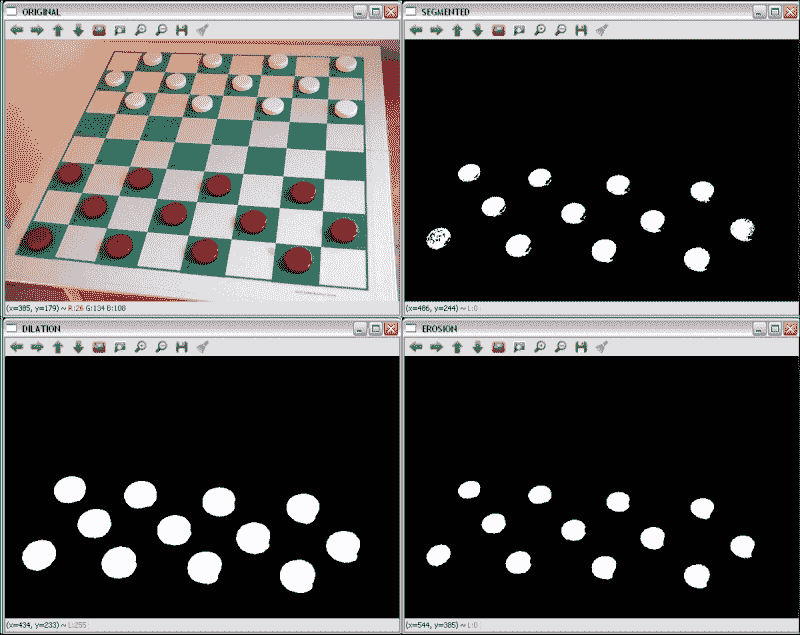

原始的红色分割，膨胀和腐蚀

# LUT

**查找表**（**LUT**）在自定义过滤器中非常常见，在自定义过滤器中，中两个具有相同值的像素在输入中也包含相同的值。 LUT 变换根据表给出的值为输入图像中的每个像素分配一个新的像素值。 在该表中，索引表示输入强度值，并且由索引给出的单元格的内容表示相应的输出值。 由于实际上是针对每个可能的强度值计算变换的，因此这减少了在图像上应用变换所需的时间（图像通常具有比强度值的数量更多的像素）。

`LUT(InputArray src, InputArray lut, OutputArray dst, int interpolation = 0)` OpenCV 函数对 8 位有符号或`src`无符号图像应用查找表转换。 因此，`lut`参数中给出的表包含 256 个元素。 `lut`中的通道数为 1 或`src.channels`。 如果`src`具有多个通道，但`lut`具有单个通道，则将同一`lut`通道应用于所有图像通道。

## 示例代码

下面的 **LUT** 示例向您展示了如何使用查找表将图像的像素强度除以 2。 在将 LUT 与以下代码结合使用之前，需要对其进行初始化：

```cpp
    uchar * M = (uchar*)malloc(256*sizeof(uchar));
    for(int i=0; i<256; i++){
        M[i] = i*0.5; //The result is rounded to an integer value
    }
    Mat lut(1, 256, CV_8UC1, M);
```

将创建一个`Mat`对象，其中每个单元格都包含新值。 示例代码为：

```cpp
#include "opencv2/opencv.hpp"

using namespace cv;

int main( int argc, char** argv )
{
    // Read the source file
    Mat src;
    src = imread(argv[1]);

    // Create the LUT
    uchar * M = (uchar*)malloc(256*sizeof(uchar));
    for(int i=0; i<256; i++){
        M[i] = i*0.5;
    }
    Mat lut(1, 256, CV_8UC1, M);

    // Apply the LUT
    Mat dst;
    LUT(src,lut,dst);

    // Show the results
    namedWindow( " ORIGINAL ", WINDOW_AUTOSIZE );
    imshow( " ORIGINAL ", src );
    namedWindow( " LUT ", WINDOW_AUTOSIZE );
    imshow( " LUT ", dst );

    waitKey(); 
    return 0;
}
```

下图显示了代码的输出：

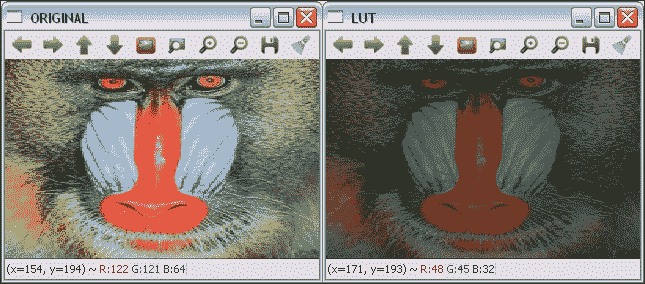

原始和 LUT 转换的图像

# 几何变换

几何变换不会更改图像内容，而是会通过使它们的网格变形来使图像变形。 在这种情况下，输出图像像素值的计算方法是：首先通过应用相应的映射函数获得相应输入像素的坐标，然后将原始像素值从获得的位置复制到新位置：


这种类型的操作有两个问题：

*   **外推**：f <sub>x</sub> （x，y）和 f <sub>y</sub> （x，y）可获得表示图像外部像素的值 ]边界。 几何变换中使用的外推方法与图像过滤中使用的外推方法相同，外加另一种称为`BORDER_TRANSPARENT`的方法。
*   **插值**：f <sub>x</sub> （x，y）和 f <sub>y</sub> （x，y）通常是浮点数。 在 OpenCV 中，可以在最近邻和多项式插值方法之间进行选择。 最近邻插值包括将浮点坐标舍入到最接近的整数。 支持的插值方法是：
    *   `INTER_NEAREST`：这是前面解释的最近邻插值。
    *   `INTER_LINEAR`：这是一种双线性插值方法。 默认情况下使用。
    *   `INTER_AREA`：使用像素面积关系重新采样。
    *   `INTER_CUBIC`：这是在 4 x 4 像素邻域上的双三次插值方法。
    *   `INTER_LANCZOS4`：这是在 8 x 8 像素邻域上的 Lanczos 插值方法。

OpenCV 支持的几何变换包括仿射（缩放，平移，旋转等）和透视变换。

## 仿射变换

仿射变换是几何变换，在应用后保留了直线上初始线的所有点。 此外，还保留了从这些点中的每一个到线的末端的距离比。 另一方面，仿射变换不一定会保留角度和长度。

缩放，平移，旋转，倾斜和反射等几何变换都是仿射变换。

### 缩放

缩放图像可通过缩小或缩放来调整其大小。 为此，OpenCV 中的功能为`void resize(InputArray src, OutputArray dst, Size dsize, double fx = 0, double fy = 0, int interpolation = INTER_LINEAR)`。 除了输入图像和输出图像`src`和`dst`外，它还具有一些参数来指定图像要缩放到的尺寸。 如果通过将`dsize`设置为不同于 0 的值来指定新图像尺寸，则缩放因子参数`fx`和`fy`均为 0，并且从`dsize`和`fx`计算`fx`和`fy`。 输入图像的原始大小。 如果`fx`和`fy`不同于 0，并且`dsize`等于 0，则根据其他参数计算`dsize`。 缩放操作可以通过其转换矩阵表示：


此处，s <sub>x</sub> 和 s <sub>y</sub> 是 x 和 y 轴上的比例因子。

#### 示例代码

以下**缩放**示例显示了如何通过`resize`功能缩放图像。 示例代码为：

```cpp
#include "opencv2/opencv.hpp"

using namespace cv;

int main( int argc, char** argv )
{
    // Read the source file
    Mat src;
    src = imread(argv[1]);

    // Apply the scale
    Mat dst;
    resize(src, dst, Size(0,0), 0.5, 0.5);

    // Show the results
    namedWindow( " ORIGINAL ", WINDOW_AUTOSIZE );
    imshow( " ORIGINAL ", src );
    namedWindow( " SCALED ", WINDOW_AUTOSIZE );
    imshow( " SCALED ", dst );

    waitKey(); 
    return 0;
}
```

下图显示了代码的输出：

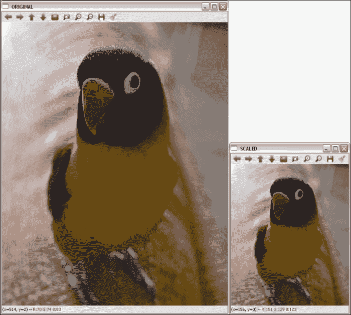

原始和缩放图像； fx 和 fy 均为 0.5

### 翻译

平移只是沿着特定的方向和距离移动图像。 因此，翻译可以通过向量（t <sub>x</sub> ，t <sub>y</sub> ）或其转换矩阵表示：


在 OpenCV 中，可以使用`void warpAffine( InputArray src, OutputArray dst, InputArray M, Size dsize, int flags = INTER_LINEAR, int borderMode = BORDER_CONSTANT, const Scalar& borderValue = Scalar())`功能应用翻译。 `M`参数是将`src`转换为`dst`的转换矩阵。 使用`flags`参数指定插值方法，该参数也支持`WARP_INVERSE_MAP`值，这意味着`M`是逆变换。 `borderMode`参数是外推方法，当`borderMode`为`BORDER_CONSTANT`时，`borderValue`为。

#### 示例代码

**翻译**示例向您展示如何使用`warpAffine`功能翻译图像。 示例代码为：

```cpp
#include "opencv2/opencv.hpp"

using namespace cv;

int main( int argc, char** argv )
{
    // Read the source file
    Mat src;
    src = imread(argv[1]);

    // Apply translation
    Mat dst;
    Mat M = (Mat_<double>(2,3) << 1, 0, 200, 0, 1, 150);
    warpAffine(src,dst,M,src.size());

    // Show the results
    namedWindow( " ORIGINAL ", WINDOW_AUTOSIZE );
    imshow( " ORIGINAL ", src );
    namedWindow( " TRANSLATED ", WINDOW_AUTOSIZE );
    imshow( " TRANSLATED ", dst );

    waitKey(); 
    return 0;
}
```

下图显示了代码的输出：

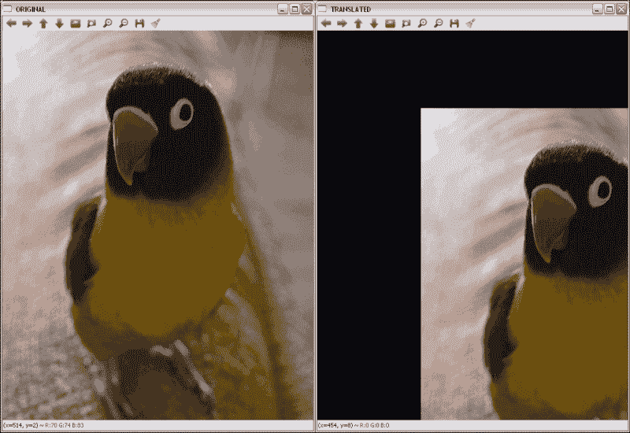

原始图像和置换图像。 水平位移为 200，垂直位移为 150。

### 图像旋转

图像旋转涉及特定角度θ。 OpenCV 使用定义如下的转换矩阵在特定位置支持缩放旋转：


此处， *x* 和 *y* 是旋转点的坐标， *sf* 是比例因子。

旋转通过`warpAffine`函数像平移一样应用，但使用`Mat getRotationMatrix2D(Point2f center, double angle, double scale)`函数创建旋转变换矩阵。 `M`参数是将`src`转换为`dst`的转换矩阵。 如参数名称所示，`center`是旋转的中心点，`angle`是旋转角度（沿逆时针方向），`scale`是比例因子。

#### 示例代码

以下**旋转**示例显示了如何使用`warpAffine`功能旋转图像。 首先通过`getRotationMatrix2D( Point2f( src.cols/2, src.rows/2 ), 45, 1 )`获得 45 度中心旋转矩阵。 示例代码为：

```cpp
#include "opencv2/opencv.hpp"

using namespace cv;

int main( int argc, char** argv )
{
    // Read the source file
    Mat src;
    src = imread(argv[1]);

    // Apply the rotation
    Mat dst;
    Mat M = getRotationMatrix2D(Point2f(src.cols/2,src.rows/2),45,1);
    warpAffine(src,dst,M,src.size());

    // Show the results
    namedWindow( " ORIGINAL ", WINDOW_AUTOSIZE );
    imshow( " ORIGINAL ", src );
    namedWindow( " ROTATED ", WINDOW_AUTOSIZE );
    imshow( " ROTATED ", dst );

    waitKey(); 
    return 0;
}
```

下图显示了代码的输出：

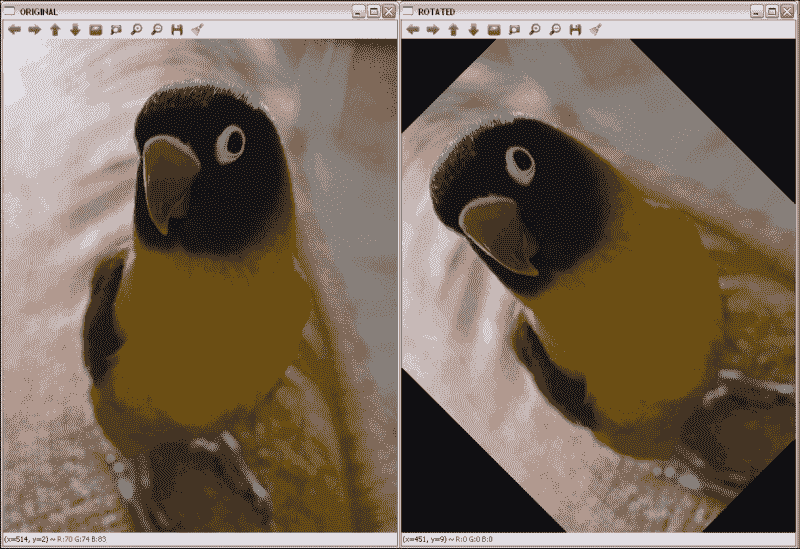

应用原始图像和中心旋转 45 度后的图像

### 倾斜

倾斜变换将每个点在固定方向上移动的距离与与平行于方向的线的其有符号距离成比例。 因此，它通常会扭曲几何图形的形状，例如，将正方形变成非正方形的平行四边形，将圆形变成椭圆。 但是，倾斜会保留几何图形的面积，共线点的对齐方式和相对距离。 倾斜映射是直立和倾斜（或斜体）字母样式之间的主要区别。

偏斜也可以通过其角度θ来定义。


原稿及其与中心图像旋转 45 度

使用偏斜角度，水平和垂直偏斜的转换矩阵为：


由于与先前转换的相似性，用于应用倾斜的函数为`warpAffine`。

### 提示

在大多数情况下，有必要为输出图像添加一些大小和/或应用平移（更改剪切变换矩阵上的最后一列），以便完整且集中地显示输出图像。

#### 示例代码

**偏斜**示例之后的向您展示了如何使用`warpAffine`功能使图像中的θ=π/ 3 水平偏斜。 示例代码为：

```cpp
#include "opencv2/opencv.hpp"
#include <math.h>

using namespace cv;

int main( int argc, char** argv )
{
    // Read the source file
    Mat src;
    src = imread(argv[1]);

    // Apply skew
    Mat dst;
    double m = 1/tan(M_PI/3);
    Mat M = (Mat_<double>(2,3) << 1, m, 0, 0, 1, 0);
    warpAffine(src,dst,M,Size(src.cols+0.5*src.cols,src.rows));

    // Show the results
    namedWindow( " ORIGINAL ", WINDOW_AUTOSIZE );
    imshow( " ORIGINAL ", src );
    namedWindow( " SKEWED ", WINDOW_AUTOSIZE );
    imshow( " SKEWED ", dst );

    waitKey(); 
    return 0;
}
```

下图显示了代码的输出：

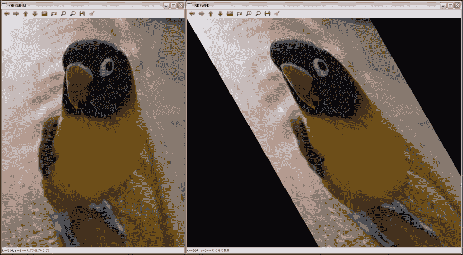

原始图像和水平倾斜时的图像

### 反射

由于默认情况下会在 *x* 和 *y* 轴上进行反射，因此必须应用平移（变换矩阵的最后一列）。 然后，反射矩阵为：


在此，t <sub>x</sub> 是图像列数，t <sub>y</sub> 是图像行数。

与以前的转换一样，用于施加反射的函数为`warpAffine`。

### 注意

其他仿射变换可以使用`warpAffine`函数及其对应的变换矩阵来应用。

#### 示例代码

以下**反射**示例显示了使用`warpAffine`功能对图像进行水平，垂直和组合反射的示例。 示例代码为：

```cpp
#include "opencv2/opencv.hpp"

using namespace cv;

int main( int argc, char** argv )
{
    // Read the source file
    Mat src;
    src = imread(argv[1]);

    // Apply the reflections
    Mat dsth, dstv, dst;
    Mat Mh  = (Mat_<double>(2,3) << -1, 0, src.cols, 0, 1, 0
    Mat Mv  = (Mat_<double>(2,3) << 1, 0, 0, 0, -1, src.rows);
    Mat M  = (Mat_<double>(2,3) << -1, 0, src.cols, 0, -1, src.rows);
    warpAffine(src,dsth,Mh,src.size());
    warpAffine(src,dstv,Mv,src.size());
    warpAffine(src,dst,M,src.size());

    // Show the results
    namedWindow( " ORIGINAL ", WINDOW_AUTOSIZE );
    imshow( " ORIGINAL ", src );
    namedWindow( " H-REFLECTION ", WINDOW_AUTOSIZE );
    imshow( " H-REFLECTION ", dsth );
    namedWindow( " V-REFLECTION ", WINDOW_AUTOSIZE );
    imshow( " V-REFLECTION ", dstv );
    namedWindow( " REFLECTION ", WINDOW_AUTOSIZE );
    imshow( " REFLECTION ", dst );

    waitKey(); 
    return 0;
}
```

下图显示了代码的输出：

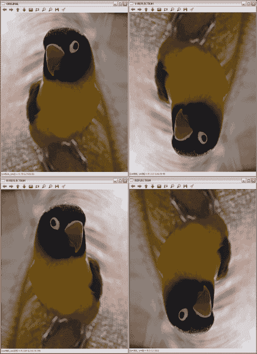

X，Y 和两个轴上的原始图像和旋转图像

## 透视变换

对于透视变换，虽然需要对二维图像执行，但仍需要 3 x 3 变换矩阵。 直线在输出图像中保持直线，但是在这种情况下，比例会改变。 与仿射变换相比，查找变换矩阵要复杂得多。 使用透视图时，将使用输入图像矩阵的四个点的坐标及其在输出图像矩阵上的相应坐标来执行此操作。

通过这些点和`getPerspectiveTransform` OpenCV 函数，可以找到透视变换矩阵。 在获得矩阵之后，应用`warpPerspective`获得透视变换的输出。 这两个功能在这里详细说明：

*   `Mat getPerspectiveTransform(InputArray src, InputArray dst)`和`Mat getPerspectiveTransform(const Point2f src[], const Point2f dst[])`：这将返回根据`src`和`dst`计算的透视变换矩阵。
*   `void warpPerspective(InputArray src, OutputArray dst, InputArray M, Size dsize, int flags=INTER_LINEAR, int borderMode=BORDER_CONSTANT, const Scalar& borderValue=Scalar())`：这会将`M`仿射变换应用于`src`图像，从而获得新的`dst`图像。 其余参数与讨论的其他几何变换相同。

### 示例代码

以下**透视图**示例向您展示了如何使用`warpPerspective`功能更改图像的透视图的示例。 在这种情况下，需要指示从第一张图像开始的四个点的坐标，并从输出指示另外四个点的坐标，以通过`getPerspectiveTransform`计算透视变换矩阵。 选择的点是：

```cpp
    Point2f src_verts[4];
    src_verts[2] = Point(195, 140);
    src_verts[3] = Point(410, 120);
    src_verts[1] = Point(220, 750);
    src_verts[0] = Point(400, 750);
    Point2f dst_verts[4];
    dst_verts[2] = Point(160, 100);
    dst_verts[3] = Point(530, 120);
    dst_verts[1] = Point(220, 750);
    dst_verts[0] = Point(400, 750);
```

示例代码为：

```cpp
#include "opencv2/opencv.hpp"

using namespace cv;

int main( int argc, char** argv )
{
    // Read the source file
    Mat src;
    src = imread(argv[1]);

    Mat dst;
    Point2f src_verts[4];
    src_verts[2] = Point(195, 140);
    src_verts[3] = Point(410, 120);
    src_verts[1] = Point(220, 750);
    src_verts[0] = Point(400, 750);
    Point2f dst_verts[4];
    dst_verts[2] = Point(160, 100);
    dst_verts[3] = Point(530, 120);
    dst_verts[1] = Point(220, 750);
    dst_verts[0] = Point(400, 750);

    // Obtain and Apply the perspective transformation
    Mat M = getPerspectiveTransform(src_verts,dst_verts);
    warpPerspective(src,dst,M,src.size());

    // Show the results
    namedWindow( " ORIGINAL ", WINDOW_AUTOSIZE );
    imshow( " ORIGINAL ", src );
    namedWindow( " PERSPECTIVE ", WINDOW_AUTOSIZE );
    imshow( " PERSPECTIVE ", dst );

    waitKey(); 
    return 0;
}
```

下图显示了代码的输出：

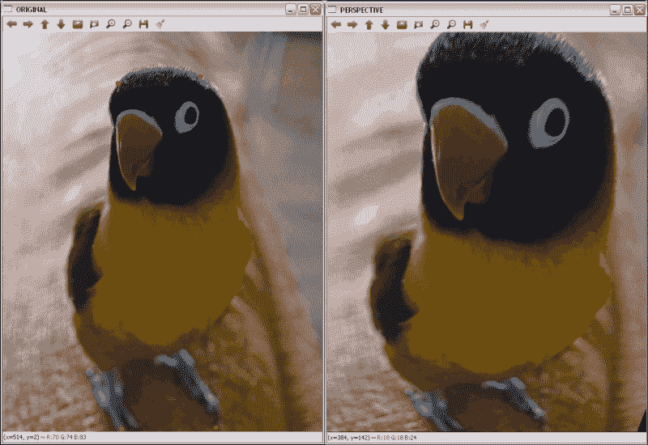

透视结果带有原始图像中标记的点

# 修复

修复是重建图像和视频的受损部分的过程。 此过程也称为，称为图像或视频插值。 基本思想是模拟古董修复者完成的过程。 如今，随着数码相机的广泛使用，修补已成为一种自动过程，不仅可以通过删除划痕来进行图像恢复，还可以用于其他任务，例如去除物体或文本。

OpenCV 从版本 2.4 开始支持修复算法。 用于此目的的功能是：

*   `void inpaint(InputArray src, InputArray inpaintMask, OutputArray dst, double inpaintRadius, int flags)`：这将恢复源（`src`）图像中`inpaintMask`参数用非零值指示的区域。 `inpaintRadius`参数指示`flags`指定的算法要使用的邻域。 OpenCV 中可以使用两种方法：
    *   `INPAINT_NS`：这是基于 Navier-Stokes 的方法
    *   `INPAINT_TELEA`：这是 Alexandru Telea 提出的方法

最后，恢复的图像存储在`dst`中。

### 注意

有关 OpenCV 中使用的修复算法的更多详细信息，请参见[这个页面](http://www.ifp.illinois.edu/~yuhuang/inpainting.html)。

### 提示

对于视频修复，请将视频视为图像序列，然后将算法应用于所有图像。

## 示例代码

**修复**示例之后的显示了如何使用`inpaint`功能修复在图像蒙版中指定的图像区域。

示例代码为：

```cpp
#include "opencv2/opencv.hpp"

using namespace cv;

int main( int argc, char** argv )
{
    // Read the source file
    Mat src;
    src = imread(argv[1]);

    // Read the mask file
    Mat mask;
    mask = imread(argv[2]);
    cvtColor(mask, mask, COLOR_RGB2GRAY);

    // Apply the inpainting algorithms
    Mat dst, dst2;
    inpaint(src, mask, dst, 10, INPAINT_TELEA);
    inpaint(src, mask, dst2, 10, INPAINT_NS);

    // Show the results
    namedWindow( " ORIGINAL ", WINDOW_AUTOSIZE );
    imshow( " ORIGINAL ", src );
    namedWindow( " MASK ", WINDOW_AUTOSIZE );
    imshow( " MASK ", mask );
    namedWindow(" INPAINT_TELEA ", WINDOW_AUTOSIZE );
    imshow( " INPAINT_TELEA ", dst );
    namedWindow(" INPAINT_NS ", WINDOW_AUTOSIZE );
    imshow( " INPAINT_NS ", dst2 );

    waitKey(); 
    return 0;
}
```

下图显示了代码的输出：


应用修补的结果

### 注意

第一行包含原始图像和使用的蒙版。 第二行在左侧包含 Telea 提出的修复结果，在右侧包含基于 Navier-Stokes 的方法的结果。

要获得修复蒙版并非易事。 **inpainting2** 示例代码向您展示了一个示例，该示例说明如何使用通过`threshold(mask, mask, 235, 255, THRESH_BINARY)`的二进制阈值从源图像中获取蒙版：

```cpp
#include "opencv2/opencv.hpp"

using namespace cv;

int main( int argc, char** argv )
{
    // Read the source file
    Mat src;
    src = imread(argv[1]);

    // Create the mask
    Mat mask;
    cvtColor(src, mask, COLOR_RGB2GRAY);
    threshold(mask, mask, 235, 255, THRESH_BINARY);

    // Apply the inpainting algorithms
    Mat dst, dst2;
    inpaint(src, mask, dst, 10, INPAINT_TELEA);
    inpaint(src, mask, dst2, 10, INPAINT_NS);

    // Show the results
    namedWindow( " ORIGINAL ", WINDOW_AUTOSIZE );
    imshow( " ORIGINAL ", src );
    namedWindow( " MASK ", WINDOW_AUTOSIZE );
    imshow( " MASK ", mask );
    namedWindow(" INPAINT_TELEA ", WINDOW_AUTOSIZE );
    imshow( " INPAINT_TELEA ", dst );
    namedWindow(" INPAINT_NS ", WINDOW_AUTOSIZE );
    imshow( " INPAINT_NS ", dst2 );

    waitKey(); 
    return 0;
}
```

下图显示了代码的输出：

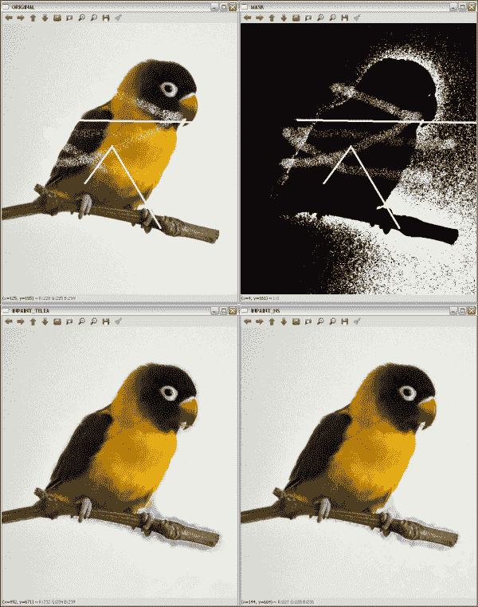

在不知道遮罩的情况下应用修复算法的结果

### 注意

第一行包含原始图像和提取的蒙版。 第二行在左侧包含 Telea 提出的修复结果，在右侧包含基于 Navier-Stokes 的方法的结果。

此示例的结果表明，并非总是可能获得完美的蒙版。 有时会包括图像的其他一些部分，例如背景或噪点。 但是，修复结果仍然可以接受，因为生成的图像接近于在其他情况下获得的图像。

# 降噪

降噪或降噪是从模拟或数字设备获得的信号中去除噪声的过程。 本节将重点放在减少数字图像和视频的噪声上。

尽管平滑和中值滤波是对图像进行降噪的不错选择，但 OpenCV 提供了其他算法来执行此任务。 这些是非本地均值和 **TVL1**（**总变异 L** <sup>**1**</sup> ）算法。 非局部均值算法的基本思想是用来自多个图像子窗口的平均颜色替换像素的颜色，这些子窗口与包含像素邻域的子窗口相似。 另一方面，使用原始对偶优化算法实现的 TVL1 变分降噪模型将图像降噪过程视为一个变分问题。

### 注意

有关非局部均值和 TVL1 去噪算法的更多信息，请访问[这个页面](http://www.ipol.im/pub/art/2011/bcm_nlm)和[这个页面](http://znah.net/rof-and-tv-l1-denoising-with-primal-dual-algorithm.html)。

OpenCV 提供了四种使用非局部均值方法对彩色和灰度图像进行降噪的功能。 对于 TVL1 型号，提供了一种功能。 这些功能为：

*   `void fastNlMeansDenoising(InputArray src, OutputArray dst, float h = 3, int templateWindowSize = 7, int searchWindowSize = 21)`：这会将`src`中加载的单个灰度图像降噪。 `templateWindowSize`和`searchWindowSize` 参数是用于计算权重的模板补丁的像素大小，以及用于计算给定像素的加权平均值的窗口大小。 这些应该是奇数，建议值分别为 7 和 21 像素。 `h`参数调节算法的效果。 较大的`h`值可消除更多的噪点缺陷，但具有消除更多图像细节的缺点。 输出存储在`dst`中。
*   `void fastNlMeansDenoisingColored(InputArray src, OutputArray dst, float h = 3, float hForColorComponents = 3, int templateWindowSize = 7, int searchWindowSize = 21)`：这是对彩色图像先前功能的修改。 它将`src`图像转换为 CIELAB 色彩空间，然后使用`fastNlMeansDenoising`功能分别对 L 和 AB 分量进行降噪。
*   `void fastNlMeansDenoisingMulti(InputArrayOfArrays srcImgs, OutputArray dst, int imgToDenoiseIndex, int temporalWindowSize, float h = 3, int templateWindowSize = 7, int searchWindowSize = 21)`：这使用图像序列获得去噪的图像。 在这种情况下，还需要两个参数：`imgToDenoiseIndex`和`temporalWindowSize`。 `imgToDenoiseIndex`的值是`srcImgs`中要去噪的目标图像索引。 最后，`temporalWindowSize`用于确定要用于降噪的周围图像的数量。 这应该很奇怪。
*   `void fastNlMeansDenoisingColoredMulti(InputArrayOfArrays srcImgs, OutputArray dst, int imgToDenoiseIndex, int temporalWindowSize, float h = 3, float hForColorComponents = 3, int templateWindowSize = 7, int searchWindowSize = 21)`：基于`fastNlMeansDenoisingColored`和`fastNlMeansDenoisingMulti`功能。 这些参数将在其余功能中说明。
*   `void denoise_TVL1(const std::vector<Mat>& observations, Mat& result, double lambda, int niters)`：这从`observations`中存储的一个或多个噪声图像获得`result`中的去噪图像。 `lambda`和`niters`参数控制算法的强度和迭代次数。

## 示例代码

**去噪**示例后的向您展示了如何使用其中一种降噪功能对彩色图像（`fastNlMeansDenoisingColored)`）进行降噪。由于该示例使用的是无噪声图像，因此需要添加一些内容。 为此，使用以下代码行：

```cpp
Mat noisy = src.clone();
Mat noise(src.size(), src.type());
randn(noise, 0, 50);
noisy += noise;
```

创建的`Mat`元素具有与原始图像相同的大小和类型，以在其上存储由`randn`功能产生的产生的噪声。 最后，将噪声添加到克隆图像中以获得噪声图像。

示例代码为：

```cpp
#include "opencv2/opencv.hpp"

using namespace cv;

int main( int argc, char** argv )
{
    // Read the source file
    Mat src;
    src = imread(argv[1]);

    // Add some noise
    Mat noisy = src.clone();
    Mat noise(src.size(), src.type());
    randn(noise, 0, 50);
    noisy += noise;

    // Apply the denoising algorithm
    Mat dst;
    fastNlMeansDenoisingColored(noisy, dst,30,30,7,21);

    // Show the results
    namedWindow( " ORIGINAL ", WINDOW_AUTOSIZE );
    imshow( " ORIGINAL ", src );
    namedWindow( " ORIGINAL WITH NOISE ", WINDOW_AUTOSIZE );
    imshow( " ORIGINAL WITH NOISE ", noisy );
    namedWindow(" DENOISED ", WINDOW_AUTOSIZE );
    imshow( " DENOISED ", dst );

    waitKey(); 
    return 0;
}
```

下图显示了执行前一代码后产生的噪点和去噪图像：

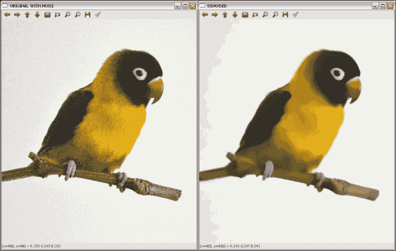

应用去噪的结果

# 摘要

在本章中，我们介绍了用于图像增强和校正的方法，包括降噪，边缘增强，形态运算，几何变换以及受损图像的恢复。 在每种情况下都提供了不同的选项，以向读者提供可以在 OpenCV 中使用的所有选项。

下一章将介绍色彩空间以及如何转换色彩空间。 另外，将说明基于色彩空间的分割和色彩转移方法。