# 第 6 章。计算摄影

计算摄影是指使您能够扩展数字摄影的典型功能的技术。 这可能包括硬件附加组件或修改，但主要指基于软件的技术。 这些技术可能会产生“传统”数码相机无法获得的输出图像。 本章介绍了 OpenCV 中用于计算摄影的一些鲜为人知的技术：高动态范围成像，无缝克隆，脱色和非照片级渲染。 这三个位于库的`photo`模块中。 注意，在前面的章节中已经考虑了该模块内部的其他技术（修复和去噪）。

# 高动态范围图像

我们处理的典型图像每像素有 8 **位（**bpp**）。 彩色图像还使用 8 位表示每个通道的值，即红色，绿色和蓝色。 这意味着仅使用 256 个不同的强度值。 在数字成像的整个历史中，这个 8 bpp 的限制一直盛行。 但是，很明显，自然界中的光并不只有 256 个不同的水平。 因此，我们应该考虑这种离散化是理想的还是足够的。 例如，已知人眼可以捕获更高的动态范围（最暗和最亮之间的亮度级别数），估计在 1 亿到 1 亿个亮度级别之间。 在只有 256 个光照级别的情况下，有些情况下明亮的光线看起来过度曝光或饱和，而黑暗的场景只是被捕获为黑色。**

有些相机可以捕获超过 8 bpp 的图像。 但是，创建高动态范围图像的最常见方法是使用 8 bpp 相机并拍摄具有不同曝光值的图像。 当我们这样做时，动态范围有限的问题显而易见。 例如，考虑下图：

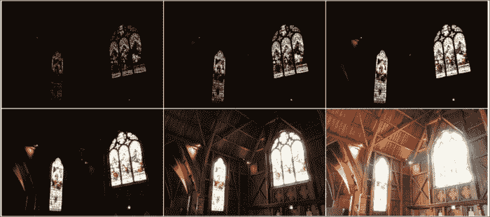

用六个不同的曝光值拍摄的场景

### 注意

左上方的图像大部分为黑色，但窗口详细信息可见。 相反，右下角的图像显示了房间的细节，但窗口的细节几乎看不见。

我们可以使用现代智能手机相机以不同的曝光水平拍摄照片。 例如，对于 iPhone 和 iPad，从 iOS 8 开始，使用本机相机应用程序更改曝光非常容易。 触摸屏幕，将出现一个黄色框，侧面带有一个小太阳。 向上或向下滑动可以更改曝光（请参见以下屏幕截图）。

### 注意

曝光级别的范围非常大，因此我们可能不得不重复多次滑动手势。

如果您使用的是 iOS 的早期版本，则可以下载相机应用程序，例如 *Camera +* ，这些应用程序可让您专注于特定点并更改曝光。

对于 Android，可以在 Google Play 上使用大量相机应用来调整曝光度。 一个例子是 *Camera FV-5* ，它具有免费和付费版本。

### 提示

如果使用手持设备捕获图像，请确保该设备是静态的。 实际上，您可能会使用三脚架。 否则，具有不同曝光度的图像将无法对齐。 同样，移动的被摄体将不可避免地产生鬼影。 在大多数情况下，低，中和高曝光量的三张图像就足够了。


使用 iPhone 5S 中的本机摄像头应用程序进行曝光控制

智能手机和桌子很方便，可以拍摄许多曝光不同的图像。 要创建 HDR 图像，我们需要知道每个捕获图像的曝光（或快门）时间（原因请参见以下部分）。 并非所有应用程序都允许您手动控制（甚至查看）此功能（iOS 8 本机应用程序则不允许）。 在撰写本文时，至少有两个免费的应用程序允许 iOS 版使用：*手动*和 *ManualShot！* 在 Android 中，免费的 *Camera FV-5* 可让您控制和查看曝光时间。 请注意，F / Stop 和 ISO 是控制曝光的其他两个参数。

捕获的图像可以传输到开发计算机，并用于创建 HDR 图像。

### 注意

从 iOS 7 开始，本机相机应用程序具有 HDR 模式，可自动快速捕获三幅图像，每幅图像具有不同的曝光度。 这些图像也会自动组合为单个（有时更好）的图像。

## 创建 HDR 图像

我们如何将多张（例如三张）曝光图像合成为 HDR 图像？ 如果我们仅考虑一个通道和一个给定的像素，则必须在较大的输出范围（例如 16 bpp）中将这三个像素值（每个曝光级别一个）映射到单个值。 这种映射并不容易。 首先，我们必须考虑像素强度是传感器辐照度（入射在相机传感器上的光量）的（粗略）度量。 数码相机以非线性方式测量辐照度。 相机具有非线性响应功能，可以将辐照度转换为像素强度值，范围为 0 到 255]。 为了将这些值映射到更大的离散值集，我们必须估计摄像机的响应函数（即，响应范围在 0 到 255 之间）。

我们如何估计相机响应功能？ 我们从像素本身做到这一点！ 响应函数是每个颜色通道的 S 形曲线，可以根据像素进行估算（如果有 3 个像素曝光，则每个颜色通道的曲线上有 3 个点）。 由于这非常耗时，因此通常选择一组随机像素。

只剩下一件事了。 我们之前曾讨论过估计辐照度和像素强度之间的关系。 我们如何知道辐照度？ 传感器的辐照度与曝光时间（或等效地，快门速度）成正比。 这就是我们需要曝光时间的原因！

最后，将 HDR 图像计算为从每次曝光的像素中恢复的辐照度值的加权和。 请注意，此图像无法在范围有限的常规屏幕上显示。

### 注意

关于高动态范围成像的一本好书是 Reinhard 等人的*高动态范围成像：获取，显示和基于图像的照明*， *Morgan Kaufmann Pub* 。 该书随附 DVD，其中包含不同 HDR 格式的图像。

### 范例

OpenCV（仅从 3.0 版开始）提供了从一组以不同曝光拍摄的图像中创建 HDR 图像的功能。 甚至还有一个名为 *hdr_imaging* 的教程示例，该示例从图像文件中读取图像文件和曝光时间列表，并创建 HDR 图像。

### 注意

为了运行 hdr_imaging 教程，您将需要使用列表下载所需的图像文件和文本文件。 您可以从[这个页面](https://github.com/Itseez/opencv_extra/tree/master/testdata/cv/hdr)下载它们。

`CalibrateDebevec`和`MergeDebevec`类实现 Debevec 的方法来估计相机响应函数并将曝光分别合并为 HDR 图像。 **createHDR** 示例之后的向您展示了如何使用这两个类：

```cpp
#include <opencv2/photo.hpp>
#include <opencv2/highgui.hpp>
#include <iostream>

using namespace cv;
using namespace std;

int main(int, char** argv)
{
    vector<Mat> images;
    vector<float> times;

    // Load images and exposures...
    Mat img1 = imread("1div66.jpg");
    if (img1.empty())
    {
        cout << "Error! Input image cannot be read...\n";
        return -1;
    }
    Mat img2 = imread("1div32.jpg");
    Mat img3 = imread("1div12.jpg");
    images.push_back(img1);
    images.push_back(img2);
    images.push_back(img3);
    times.push_back((float)1/66);
    times.push_back((float)1/32);
    times.push_back((float)1/12);

    // Estimate camera response...
    Mat response;
 Ptr<CalibrateDebevec> calibrate = createCalibrateDebevec();
 calibrate->process(images, response, times);

    // Show the estimated camera response function...
    cout << response;

    // Create and write the HDR image...
    Mat hdr;
 Ptr<MergeDebevec> merge_debevec = createMergeDebevec();
 merge_debevec->process(images, hdr, times, response);
    imwrite("hdr.hdr", hdr);

    cout << "\nDone. Press any key to exit...\n";
    waitKey(); // Wait for key press
    return 0;
}
```

该示例使用三个杯子的图像（这些图像以及本书随附的代码均可用）。 图像是使用 *ManualShot 拍摄的！ 前面提到的*应用，使用的曝光时间为 1 / 66、1 / 32 和 1/12 秒； 请参考下图：

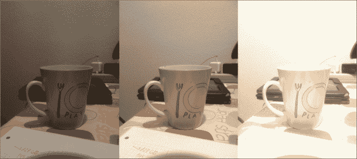

示例中用作输入的三个图像

请注意，`createCalibrateDebevec`方法在 STL 向量中期望图像和曝光时间（STL 是一种有用的常用函数和标准 C++中可用的数据结构的库）。 相机响应函数以 256 个实值向量的形式给出。 这表示像素值和辐照度之间的映射。 实际上，它是一个 256 x 3 的矩阵（三个颜色通道中的每个颜色通道一列）。 下图显示了示例给出的响应：

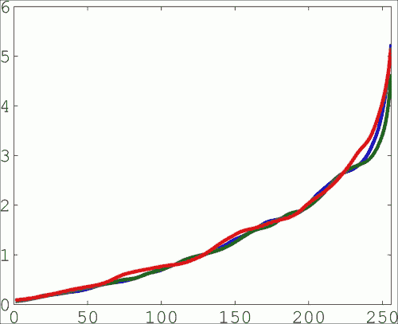

估计的 RGB 相机响应功能

### 提示

代码的`cout`部分以 MATLAB 和 Octave（两种用于数值计算的软件包）使用的格式显示矩阵。 复制输出中的矩阵并将其粘贴到 MATLAB / Octave 中以进行显示很简单。

生成的 HDR 图像以无损 RGBE 格式存储。 此图像格式使用每个颜色通道一个字节，再加上一个字节作为共享指数。 格式使用与浮点数表示法相同的原理：共享指数允许您表示更大范围的值。 RGBE 图像使用`.hdr`扩展名。 请注意，由于它是无损图像格式，因此`.hdr`文件相对较大。 在此示例中，RGB 输入图像分别为 1224 x 1632（每个 100 至 200 KB），而输出`.hdr`文件占用 5.9 MB。

该示例使用 Debevec 和 Malik 的方法，但是 OpenCV 还基于 Robertson 的方法提供了另一个校准功能。 校准和合并功能均可用，即`createCalibrateRobertson`和`MergeRobertson`。

### 注意

有关其他功能及其背后原理的更多信息，请参见[这个页面](http://docs.opencv.org/trunk/modules/photo/doc/hdr_imaging.html)。

最后，请注意示例不会显示结果图像。 HDR 图像无法在常规屏幕中显示，因此我们需要执行另一步，称为色调映射。

## 色调映射

当要显示高动态范围图像时，信息可能会丢失。 这是由于，因为计算机屏幕的对比度也很有限，而且打印材料通常也限制为 256 色。 当我们具有高动态范围的图像时，有必要将强度映射到一组有限的值。 这称为色调映射。

为了提供逼真的输出，仅将 HDR 图像值缩放到显示设备的缩小范围是不够的。 缩放通常会产生缺乏细节（对比度）的图像，从而消除了原始场景内容。 最终，色调映射算法旨在提供视觉上看起来类似于原始场景的输出（即类似于人类在查看场景时所看到的输出）。 已经提出了各种音调映射算法，并且仍然是广泛研究的问题。 以下代码行可以将色调映射应用于上一个示例中获得的 HDR 图像：

```cpp
Mat ldr;
Ptr<TonemapDurand> tonemap = createTonemapDurand(2.2f);
tonemap->process(hdr, ldr); // ldr is a floating point image with 
ldr=ldr*255;      //  values in interval [0..1]
imshow("LDR", ldr);
```

该方法由 Durand 和 Dorsey 于 2002 年提出。构造函数实际上接受许多影响输出的参数。 下图显示了输出。 请注意，此图像不一定比三个原始图像中的任何一个都要好：

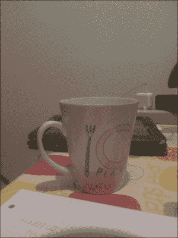

音调输出

OpenCV 中提供了其他三种音调映射算法：`createTonemapDrago`，`createTonemapReinhard`和`createTonemapMantiuk`。

可以使用 MATLAB 显示 HDR 图像（RGBE 格式，即扩展名为`.hdr`的文件）。 它只需要三行代码：

```cpp
hdr=hdrread('hdr.hdr');
rgb=tonemap(hdr); 
imshow(rgb);
```

### 注意

pfstools 是命令行工具的开源套件，用于读取，写入和渲染 HDR 图像。 该套件可以读取`.hdr`和其他格式，其中包括许多相机校准和色调映射算法。 Luminance HDR 是基于 pfstools 的免费 GUI 软件。

## 对齐

用多张曝光图像拍摄的场景必须是静态的。 摄像机也必须是静态的。 即使满足两个条件，也建议执行对齐过程。

OpenCV 提供了 G. Ward 在 2003 年提出的图像对齐算法。主要功能`createAlignMTB`采用定义最大位移的输入参数（实际上，每个尺寸的最大位移以 2 为底的对数）。 在上一示例中估算摄像机响应功能之前，应插入以下几行：

```cpp
    vector<Mat> images_(images);
    Ptr<AlignMTB> align=createAlignMTB(4);// 4=max 16 pixel shift
    align->process(images_, images);
```

## 曝光融合

我们也可以使用相机响应校准（即曝光时间）或中间 HDR 图像，将具有多次曝光的图像组合在一起。 这称为曝光融合。 该方法由 Mertens 等人在 2007 年提出。以下几行执行曝光融合（`images`是输入图像的 STL 矢量；请参见前面的示例）：

```cpp
    Mat fusion;
    Ptr<MergeMertens> merge_mertens = createMergeMertens();
    merge_mertens->process(images, fusion); // fusion is a 
 fusion=fusion*255; // float. point image w. values in [0..1]
 imwrite("fusion.png", fusion);
```

下图显示了结果：

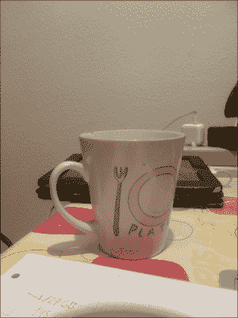

曝光融合

# 无缝克隆

在蒙太奇中，我们通常要在源图像中剪切一个对象/人并将其插入目标图像。 当然，这可以通过简单地粘贴对象以简单的方式完成。 但是，这不会产生现实的效果。 参见下图，例如，我们想要将图像上半部分的船插入图像下半部分的海中：

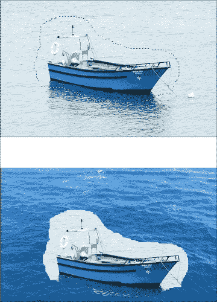

克隆

从 OpenCV 3 开始，已有无缝克隆功能可用，其结果更为真实。 此函数称为`seamlessClone`，它使用 Perez 和 Gangnet 在 2003 年提出的方法。以下 **SeamlessCloning** 示例向您展示了如何使用它：

```cpp
#include <opencv2/photo.hpp>
#include <opencv2/highgui.hpp>
#include <iostream>

using namespace cv;
using namespace std;

int main(int, char** argv)
{
    // Load and show images...
    Mat source = imread("source1.png", IMREAD_COLOR);
    Mat destination = imread("destination1.png", IMREAD_COLOR);
    Mat mask = imread("mask.png", IMREAD_COLOR);
    imshow("source", source);
    imshow("mask", mask);
    imshow("destination", destination);

    Mat result;
    Point p;    // p will be near top right corner
    p.x = (float)2*destination.size().width/3;
    p.y = (float)destination.size().height/4;
    seamlessClone(source, destination, mask, p, result, NORMAL_CLONE);
    imshow("result", result);

    cout << "\nDone. Press any key to exit...\n";
    waitKey(); // Wait for key press
    return 0;
}
```

这个例子很简单。 `seamlessClone`功能获取源图像，目标图像和蒙版图像以及目标图像中将插入裁剪对象的点（可以从[这个页面](https://github.com/Itseez/opencv_extra/tree/master/testdata/cv/cloning/Normal_Cloning)）。 请参见下图的结果：


无缝克隆

`seamlessClone`的最后一个参数表示要使用的确切方法（可以使用三种方法产生不同的最终效果）。 另一方面，库提供以下相关功能：

<colgroup><col style="text-align: left"> <col style="text-align: left"></colgroup> 
| 

功能

 | 

影响

 |
| --- | --- |
| `colorChange` | 将源图像的三个颜色通道中的每个乘以一个因子，仅在蒙版给定的区域中应用乘法 |
| `illuminationChange` | 仅在遮罩指定的区域内更改源图像的照度 |
| `textureFlattening` | 仅在蒙版指定的区域中洗掉源图像中的纹理 |

与`seamlessClone`相反，这三个功能仅接受源图像和蒙版图像。

# 脱色

脱色是将彩色图像转换为灰度的过程。 有了这个定义，读者可能会问，我们是否已经有了灰度转换？ 是的，灰度转换是 OpenCV 和任何图像处理库中的基本例程。 标准转换基于 R，G 和 B 通道的线性组合。 问题在于这种转换可能会产生原始图像中的对比度丢失的图像。 原因是两种不同的颜色（在原始图像中被视为对比度）可能最终被映射到相同的灰度值。 考虑将 A 和 B 这两种颜色转换为灰度。 假设 B 是 R 和 G 通道中 A 的变体：

*A =（R，G，B）= > G =（R + G + B）/ 3*

*B =（R-x，G + x，B）= > G =（R-x + G + x + B）/ 3 =（R + G + B）/ 3*

即使它们被认为是截然不同的，两种颜色 A 和 B 也被映射为相同的灰度值！ 以下**脱色**示例的图像显示如下：

```cpp
#include <opencv2/photo.hpp>
#include <opencv2/highgui.hpp>
#include <iostream>

using namespace cv;
using namespace std;

int main(int, char** argv)
{
    // Load and show images...
    Mat source = imread("color_image_3.png", IMREAD_COLOR);
    imshow("source", source);

    // first compute and show standard grayscale conversion...
    Mat grayscale = Mat(source.size(),CV_8UC1);
    cvtColor(source, grayscale, COLOR_BGR2GRAY);
    imshow("grayscale",grayscale);

    // now compute and show decolorization...
    Mat decolorized = Mat(source.size(),CV_8UC1);
    Mat dummy = Mat(source.size(),CV_8UC3);
    decolor(source,decolorized,dummy);
    imshow("decolorized",decolorized);

    cout << "\nDone. Press any key to exit...\n";
    waitKey(); // Wait for key press
    return 0;
}
```

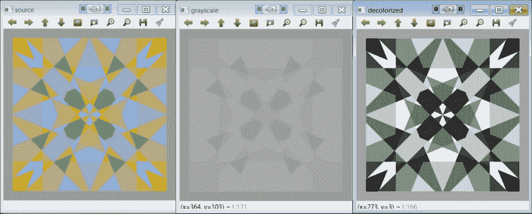

脱色示例输出

这个例子很简单。 读取图像并显示标准灰度转换的结果后，它使用`decolor`功能执行脱色。 所使用的图像（`color_image_3.png`文件）包含在 opencv_extra 存储库中，位于[这个页面](https://github.com/Itseez/opencv_extra/tree/master/testdata/cv/decolor)。

### 注意

该示例中使用的图像实际上是一个极端的情况。 选择其颜色是为了使标准灰度输出相当均匀。

# 非真实感渲染

作为`photo`模块的的一部分，提供了四个功能，这些功能可以转换输入图像，从而产生不真实但仍具有艺术感的输出。 这些函数非常易于使用，OpenCV（`npr_demo`）中包含一个很好的示例。 为了说明的目的，在这里我们为您提供一个表格，让您掌握每个功能的效果。 看一下下面的`fruits.jpg`输入图像，包含在 OpenCV 中：

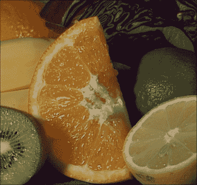

输入参考图像

效果是：

<colgroup><col style="text-align: left"> <col style="text-align: left"></colgroup> 
| 

功能

 | 

影响

 |
| --- | --- |
| `edgePreservingFilter` | 平滑是一种方便且经常使用的过滤器。 此功能在保留对象边缘细节的同时执行平滑处理。 |
| 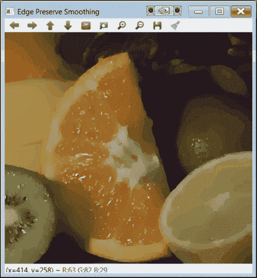 |
| `detailEnhance` | 增强图像中的细节 |
| 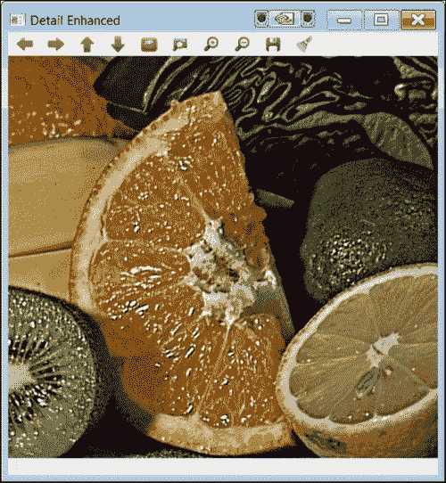 |
| `pencilSketch` | 输入图像的铅笔状线条图版本 |
| 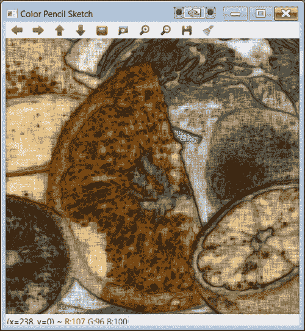 |
| `stylization` | 水彩效果 |
| 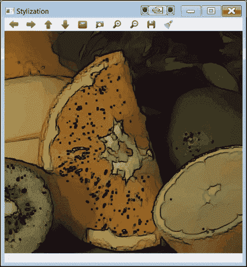 |

# 摘要

在本章中，您学习了什么是计算摄影以及 OpenCV 3 中可用的相关功能。我们解释了`photo`模块中最重要的功能，但请注意，在此模块中还考虑了该模块的其他功能（修复和降噪） 前几章。 计算摄影是一个快速发展的领域，与计算机图形学有着紧密的联系。 因此，预计 OpenCV 的此模块将在将来的版本中增加。

下一章将讨论我们尚未考虑的重要方面：时间。 解释的许多功能都需要花费大量时间来计算结果。 下一章将向您展示如何使用现代硬件进行处理。