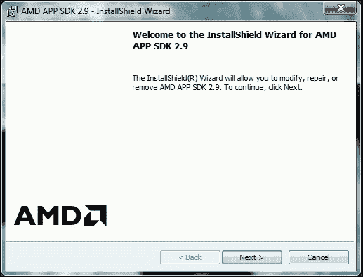
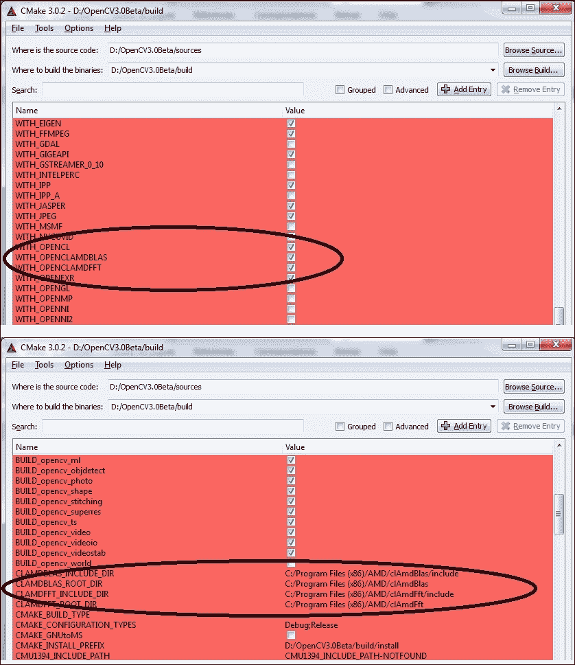
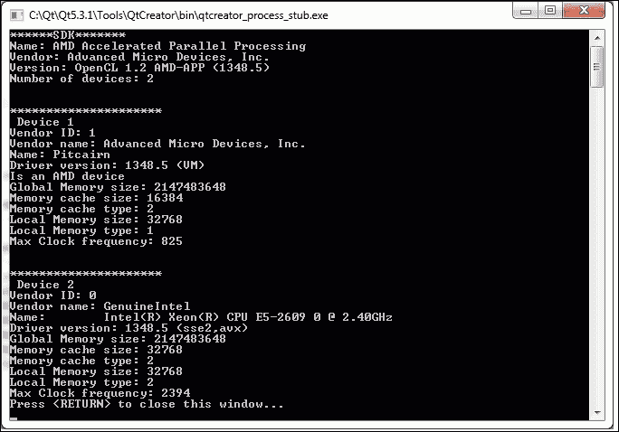
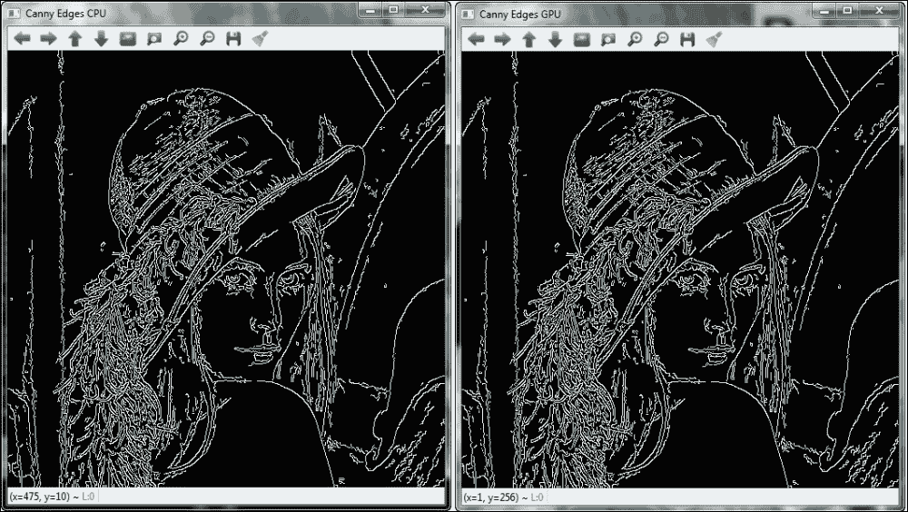

# 第 7 章。加速图像处理

本章使用通用图形处理单元（**GPGPU**）或简称为 **GPU** 进行并行处理来加速图像处理任务。 GPU 本质上是专用于图形处理或浮点运算的协处理器，旨在提高视频游戏和交互式 3D 图形等应用程序的性能。 在 GPU 中执行图形处理时，CPU 可以专用于其他计算（例如游戏中的人工智能部分）。 每个 GPU 都配备了数百个简单的处理内核，这些内核可对（通常）浮点数的数百个“简单”数学运算进行大规模并行执行。

CPU 似乎已达到其速度和热功率极限。 用多个 CPU 构建计算机已成为一个复杂的问题。 这就是 GPU 发挥作用的地方。 GPU 处理是一种新的计算范例，它使用 GPU 来提高计算性能。 GPU 最初实现了某些称为图形基元的并行操作，这些并行操作已针对图形处理进行了优化。 抗锯齿是 3D 图形处理最常见的原语之一，它使图形的边缘具有更逼真的外观。 其他图元是矩形，三角形，圆形和弧形的图形。 GPU 当前包含数百个通用处理功能，它们的功能远远超过渲染图形。 特别是，它们在可以并行执行的任务中非常有价值，许多计算机视觉算法就是这种情况。

OpenCV 库包括对 OpenCL 和 CUDA GPU 架构的支持。 CUDA 实现了许多算法。 但是，它仅适用于 NVIDIA 图形卡。 CUDA 是由 NVIDIA 创建并由其产生的 GPU 实施的并行计算平台和编程模型。 本章重点介绍 OpenCL 体系结构，因为它受到更多设备的支持，甚至包括在某些 NVIDIA 图形卡中。

**开放计算语言**（**OpenCL**）是框架，可编写可在连接到主机处理器（CPU）的 CPU 或 GPU 上执行的程序。 它定义了一种类似于 C 的语言来编写称为内核的函数，这些函数在计算设备上执行。 使用 OpenCL，内核可以在与 CPU 或 GPU 并行的所有或许多单个处理元素（PE）上运行。

此外，OpenCL 定义了**应用程序编程接口**（**API**），该接口允许在主机（CPU）上运行的程序在计算机设备上启动内核并进行管理 它们的设备存储器，（至少在概念上）与主机存储器分开。 OpenCL 程序旨在在运行时进行编译，以便使用 OpenCL 的应用程序可在各种主机设备的实现之间移植。 OpenCL 还是非盈利技术联盟 [Khronos Group](https://www.khronos.org/) 维护的开放标准。

OpenCV 包含一组类和函数，这些类和函数使用 OpenCL 来实现和加速 OpenCV 功能。 OpenCV 当前提供一个透明的 API，该 API 可以将其原始 API 与 OpenCL 加速的编程统一起来。 因此，您只需要编写一次代码。 有一个新的统一数据结构（`UMat`），在需要且可能时处理向 GPU 的数据传输。

OpenCV 中对 OpenCL 的支持是为了易于使用而设计的，不需要任何 OpenCL 知识。 在最低程度上，它可以看作是一组加速，在使用现代 CPU 和 GPU 设备时可以利用强大的计算能力。

要正确运行 OpenCL 程序，OpenCL 运行时应由设备供应商提供，通常以设备驱动程序的形式提供。 另外，要将 OpenCV 与 OpenCL 一起使用，需要兼容的 SDK。 当前，有五个可用的 OpenCL SDK：

*   **AMD APP SDK**：此 SDK 在 CPU 和 GPU（例如 X86 + SSE2（或更高）CPU 和 AMD Fusion，AMD Radeon，AMD Mobility 和 ATI FirePro GPU）上支持 OpenCL。
*   **Intel SDK**：此 SDK 在 Intel Core 处理器和 Intel HD GPU（例如 Intel + SSE4.1，SSE4.2 或 AVX，Intel Core i7，i5 和 i3（ 第 1 代，第 2 代和第 3 代），Intel HD Graphics，Intel Core 2 Solo（Duo Quad 和 Extreme）和 Intel Xeon CPU。
*   **IBM OpenCL 开发套件**：此 SDK 在 AMD 服务器（例如 IBM Power，IBM PERCS 和 IBM BladeCenter）上支持 OpenCL。
*   **IBM OpenCL 通用运行时**：此 SDK 在 CPU 和 GPU（例如 X86 + SSE2（或更高版本） CPU 和 AMD Fusion and Raedon，NVIDIA Ion，NVIDIA GeForce 和 NVIDIA）上支持 OpenCV Quadro GPU。
*   **Nvidia OpenCL 驱动程序和工具**：此 SDK 在某些 Nvidia 图形设备（例如 NVIDIA Tesla，NVIDIA GeForce，NVIDIA Ion 和 NVIDIA Quadro GPU）上支持 OpenCL。

# 具有 OpenCL 安装的 OpenCV

第 1 章，“处理图像和视频文件”中已经介绍了安装步骤，还需要一些其他步骤来包含 OpenCL。 下节介绍了新需要的软件。

在 Windows 上使用 OpenCL 编译和安装 OpenCV 有一些新要求：

*   **支持 OpenCL 的 GPU 或 CPU**：这是最重要的要求。 请注意，OpenCL 支持许多计算设备，但不是全部。 您可以检查图形卡或处理器是否与 OpenCL 兼容。 本章将用于 AMD FirePro W5000 GPU 的 AMD APP SDK 用于执行示例。

    ### 注意

    在[这个页面](http://developer.amd.com/tools-and-sdks/opencl-zone/amd-accelerated-parallel-processing-app-sdk/system-requirements-driver-compatibility/)上有此 SDK 的支持的计算机设备列表。您还可以在此处查询所需的最低 SDK 版本。

*   **编译器**：具有 OpenCL 的 OpenCV 与 Microsoft 和 MinGW 编译器兼容。 可以安装免费的 Visual Studio Express 版本。 但是，如果选择 Microsoft 编译 OpenCV，则建议至少使用 Visual Studio 2012。 但是，本章使用 MinGW 编译器。
*  **AMD APP SDK**：此 SDK 是一组高级软件技术，使我们能够使用兼容的计算设备来执行和加速除图形之外的许多应用程序。 [该 SDK 可在以下位置获得](http://developer.amd.com/tools-and-sdks/opencl-zone/amd-accelerated-parallel-processing-app-sdk/)。本章使用 SDK 的 2.9 版（适用于 64 位 Windows）。 您可以在以下屏幕截图中看到安装进度。

    ### 注意

    如果此步骤失败，则可能需要更新图形卡的控制器。 可在[这个页面](http://www.amd.com/en-us/innovations/software-technologies)上获得 AMD 控制器。

    

    安装 AMD APP SDK

*   **OpenCL BLAS**：**基本线性代数子例程**（**BLAS**）是一组开源数学库，用于在 AMD 设备上进行并行处理。 可以从[这个页面](http://developer.amd.com/tools-and-sdks/opencl-zone/amd-accelerated-parallel-processing-math-libraries/)下载。 本章使用 Windows 32/64 位的 1.1 BLAS 版本，并且可以在以下屏幕截图（左侧）中看到安装进度。
*   **OpenCL FFT**：**快速傅立叶变换**（**FFT**）是许多图像处理算法需要的非常有用的功能。 因此，此功能可在 AMD 设备上实现并行处理。 可以从与前面相同的 URL 下载。 本章使用 Windows 32/64 位的 1.1 FFT 版本，并且可以在以下屏幕截图（右侧）中看到安装进度：

    

    为 OpenCL 安装 BLAS 和 FFT

*   **用于 C++ 编译器的 Qt 库**：在本章中，使用 Qt 库的 MinGW 二进制文件通过 OpenCL 编译 OpenCV。 另一种选择是安装最新版本的 Qt 并使用 Visual C++ 编译器。 您可以选择 Qt 版本和使用的编译器。 通过位于`C:\Qt\Qt5.3.1`的`MaintenanceTool.exe`应用程序，程序包管理器可用于下载其他 Qt 版本。 本章使用 Qt（5.3.1）和 MinGW（4.8.2）32 位来使用 OpenCL 编译 OpenCV。

当满足之前的要求时，您可以使用 CMake 生成新的构建配置。 该过程与第一章中介绍的典型安装在某些方面有所不同。 差异在此列表中说明：

*   为项目选择生成器时，可以选择与计算机中已安装环境相对应的编译器版本。 本章使用 MinGW 使用 OpenCL 编译 OpenCV，然后选择`MinGW Makefiles`选项，并指定本机编译器。 以下屏幕截图显示了此选择：

    

    CMake 选择发电机项目

*   以下屏幕截图中显示的选项是构建带有 OpenCL 项目的 OpenCV 所必需的。 必须启用`WITH_OPENCL`，`WITH_OPENCLAMDBLAS`和`WITH_OPENCLAMDFFT`选项。 必须在`CLAMDBLAS_INCLUDE_DIR`，`CLAMDBLAS_ROOT_DIR`，`CLAMDFFT_INCLUDE_DIR`和`CLAMDFFT_ROOT_DIR`上引入 BLAS 和 FFT 路径。 此外，如第 1 章“处理图像和视频文件”中所示，您将需要启用`WITH_QT`并禁用`WITH_IPP`选项。 也建议启用`BUILD_EXAMPLES`。 以下屏幕截图显示了在构建配置中选择的主要选项：

    

    CMake 选择主要选项

最后，要使用 OpenCL 项目构建 OpenCV，必须编译先前生成的 CMake 项目。 该项目是为 MinGW 生成的，因此，需要 MinGW 编译器来构建此项目。 首先，使用 **Windows 控制台**选择`[opencv_build]/`文件夹，然后执行以下操作：

```cpp
./mingw32-make.exe -j 4 install
```

`-j 4`参数是我们要用于编译并行化的系统核心 CPU 的数量。

现在可以使用带有 OpenCL 项目的 OpenCV。 新二进制文件的路径必须添加到系统路径，在这种情况下为`[opencv_build]/install/x64/mingw/bin`。

### 注意

不要忘记从路径环境变量中删除旧的 OpenCV 二进制文件。

## 使用 OpenCL 安装 OpenCV 的快速方法

可以通过以下步骤总结安装过程：

1.  下载并安装 AMD APP SDK，该软件可从[这个页面](http://developer.amd.com/tools-and-sdks/opencl-zone/amd-accelerated-parallel-processing-app-sdk)获得。
2.  下载并安装 BLAS 和 FFT AMD，它们可从[这个页面](http://developer.amd.com/tools-and-sdks/opencl-zone/amd-accelerated-parallel-processing-math-libraries)。
3.  使用 CMake 配置 OpenCV 构建。 启用 `WITH_OPENCL` ， `WITH_OPENCLAMDBLAS，WITH_QT` 和 `Build_EXAMPLESWITH_OPENCLAMDFFT` 选项。 禁用 `WITH_IPP` 选项。 最后，介绍 `CLAMDBLAS_INCLUDE_DIR` ， `CLAMDBLAS_ROOT_DIR` ， `CLAMDFFT_INCLUDE_DIR` 和 `CLAMDFFT_ROOT_DIR` 上的 BLAS 和 FFT 路径。
4.  用`mingw32-make.exe`编译 OpenCV 项目。
5.  最后，修改路径环境变量以更新 OpenCV `bin`目录（例如`[opencv_build]/install/x64/mingw/bin`）。

## 检查 GPU 使用情况

在 Windows 平台上使用 GPU 时，没有应用程序可以测量其使用情况。 使用 GPU 的原因有两个：

*   可以知道您是否正确使用了 GPU
*   您可以监控 GPU 使用率

为此，市场上有一些应用。 本章使用 **AMD 系统监视器**检查 GPU 的使用情况。 此应用程序监视 CPU，内存 RAM 和 GPU 的使用情况。 请参考以下屏幕截图：


AMD 系统监视器可监视 CPU，GPU 和内存 RAM 的使用情况

### 注意

可以从[这个页面](http://support.amd.com/es-xl/kb-articles/Pages/AMDSystemMonitor.aspx)下载 Microsoft System Monitor （32 或 64 位）。

# 加速您自己的功能

在本节中，有使用 OpenCV 和 OpenCL 的三个示例。 第一个示例使您可以检查已安装的 SDK 是否可用，并获取有关支持 OpenCL 的计算设备的有用信息。 第二个示例分别显示使用 CPU 和 GPU 编程的同一程序的两个版本。 最后一个示例是检测和标记人脸的完整程序。 另外，执行计算比较。

## 检查您的 OpenCL

以下是一个简单的程序，用于检查您的 SDK 和可用的计算设备。 该示例是，称为`checkOpenCL`。它允许您使用 OpenCV 的 OCL 模块显示计算机设备：

```cpp
#include <opencv2/opencv.hpp>
#include <opencv2/core/ocl.hpp>

using namespace std;
using namespace cv;
using namespace cv::ocl;

int main()
{
vector<ocl::PlatformInfo> info;
 getPlatfomsInfo(info);
PlatformInfo sdk = info.at(0);

    if (sdk.deviceNumber()<1)
        return -1;

    cout << "******SDK*******" << endl;
    cout << "Name: " <<sdk.name()<< endl;
cout << "Vendor: " <<sdk.vendor()<< endl;
cout << "Version: " <<sdk.version()<< endl;
    cout << "Number of devices: " <<sdk.deviceNumber()<< endl;

    for (int i=0; i<sdk.deviceNumber(); i++){
Device device;
 sdk.getDevice(device, i);
          cout << "\n\n*********************\n Device " << i+1 << endl;

        cout << "Vendor ID: " <<device.vendorID()<< endl;
        cout << "Vendor name: " <<device.vendorName()<< endl;
        cout << "Name: " <<device.name()<< endl;
        cout << "Driver version: " <<device.driverVersion()<< endl;
        if (device.isAMD()) cout << "Is an AMD device" << endl;
        if (device.isIntel()) cout << "Is a Intel device" << endl;
        cout << "Global Memory size: " <<device.globalMemSize()<< endl;
        cout << "Memory cache size: " <<device.globalMemCacheSize()<< endl;
        cout << "Memory cache type: " <<device.globalMemCacheType()<< endl;
        cout << "Local Memory size: " <<device.localMemSize()<< endl;
        cout << "Local Memory type: " <<device.localMemType()<< endl;
        cout << "Max Clock frequency: " <<device.maxClockFrequency()<< endl;
    }

    return 0;
}
```

### 代码说明

本示例显示安装的 SDK 和与 OpenCL 兼容的可用计算设备。 首先，包含`core/ocl.hpp`标头，并声明`cv::ocl`命名空间。

使用`getPlatfomsInfo(info)`方法获取有关计算机中可用 SDK 的信息。 该信息存储在`vector<ocl::PlatformInfo> info`向量中，并通过`PlatformInfo sdk = info.at(0)`选择。 然后，将显示有关您的 SDK 的主要信息，例如名称，供应商，SDK 版本以及与 OpenCL 兼容的计算设备的数量。

最后，对于每个兼容设备，其信息都是通过`sdk.getDevice(device, i)`方法获得的。 现在可以显示有关每个计算设备的不同信息，例如供应商 ID，供应商名称，驱动程序版本，全局内存大小，内存缓存大小等。

下面的屏幕截图显示了该示例对所用计算机的结果：



有关使用的 SDK 和兼容的计算设备的信息

## 您的第一个基于 GPU 的程序

在下面的代码中，显示了同一程序的两个版本：一个仅使用 CPU（本机）执行计算，另一个使用 GPU（带有 OpenCL）。 这两个示例分别称为`calculateEdgesCPU`和`calculateEdgesGPU`，使您可以观察 CPU 和 GPU 版本之间的差异。

首先显示**计算边缘 CPU** 示例：

```cpp
#include <opencv2/opencv.hpp>

using namespace std;
using namespace cv;

int main(int argc, char * argv[])
{
    if (argc < 2)
    {
        cout << "./calculateEdgesCPU <image>" << endl;
        return -1;
    }

Mat cpuFrame = imread(argv[1]);
    Mat cpuBW, cpuBlur, cpuEdges;

    namedWindow("Canny Edges CPU",1);

cvtColor(cpuFrame, cpuBW, COLOR_BGR2GRAY);
 GaussianBlur(cpuBW, cpuBlur, Size(1,1), 1.5, 1.5);
 Canny(cpuBlur, cpuEdges, 50, 100, 3);

imshow("Canny Edges CPU", cpuEdges);
    waitKey();

    return 0;
}
```

现在，显示**计算边缘 GPU** 示例：

```cpp
#include "opencv2/opencv.hpp"
#include "opencv2/core/ocl.hpp"

using namespace std;
using namespace cv;
using namespace cv::ocl;

int main(int argc, char * argv[])
{
    if (argc < 2)
    {
        cout << "./calculateEdgesGPU <image>" << endl;
        return -1;
    }

setUseOpenCL(true);

Mat cpuFrame = imread(argv[1]);
UMat gpuFrame, gpuBW, gpuBlur, gpuEdges;

cpuFrame.copyTo(gpuFrame);

    namedWindow("Canny Edges GPU",1);

    cvtColor(gpuFrame, gpuBW, COLOR_BGR2GRAY);
    GaussianBlur(gpuBW, gpuBlur, Size(1,1), 1.5, 1.5);
    Canny(gpuBlur, gpuEdges, 50, 100, 3);

imshow("Canny Edges GPU", gpuEdges);
    waitKey();

    return 0;
}
```

### 代码说明

这两个示例获得相同的结果，如以下屏幕截图所示。 他们从标准命令行输入参数读取图像。 然后，将图像转换为灰度，并应用高斯模糊和 Canny 滤镜功能。

在第二个示例中，使用 GPU 需要一些区别。 首先，必须使用`setUseOpenCL(true)`方法激活 OpenCL。 其次，**统一矩阵**（`UMat`）用于在 GPU（`UMat gpuFrame, gpuBW, gpuBlur, gpuEdges`）中分配内存。 第三，使用`cpuFrame.copyTo(gpuFrame)`方法将输入图像从 RAM 复制到 GPU 内存。 现在，使用这些功能时，如果它们具有 OpenCL 实现，则这些功能将在 GPU 上执行。 如果其中一些功能没有 OpenCL 实现，则正常功能将在 CPU 上执行。 在此示例中，使用 GPU 编程（第二示例）的时间要好 10 倍：



前两个示例的结果

## 实时

GPU 处理的主要优点之一是以更快的方式执行计算。 速度的提高使您可以在实时应用中执行繁重的计算算法，例如立体视觉，行人检测，光流或人脸检测。 以下`detectFaces`示例向您展示了一种用于检测摄像机面部的应用程序。 此示例还允许您在 **CPU** 或 **GPU 处理**之间进行选择，以比较计算时间。

在 OpenCV 示例（`[opencv_source_code]/samples/cpp/facedetect.cpp`）中，可以找到相关的面部检测器示例。 对于以下`detectFaces`示例，`detectFace.pro`项目需要以下库：`-lopencv_core300`，`-opencv_imgproc300`，`-lopencv_highgui300`，`-lopencv_videoio300`和`lopencv_objdetct300`。

`detectFaces`示例使用 OpenCV 的`ocl`模块：

```cpp
#include <opencv2/core/core.hpp>
#include <opencv2/core/ocl.hpp>
#include <opencv2/objdetect.hpp>
#include <opencv2/videoio.hpp>
#include <opencv2/highgui.hpp>
#include <opencv2/imgproc.hpp>

#include <iostream>
#include <stdio.h>

using namespace std;
using namespace cv;
using namespace cv::ocl;

int main(int argc, char * argv[])
{
    // 1- Set the initial parameters
    // Vector to store the faces
    vector<Rect> faces;
    CascadeClassifier face_cascade;
String face_cascade_name = argv[2];
    int face_size = 30;
    double scale_factor = 1.1;
    int min_neighbours = 2;

VideoCapture cap(0);
UMat frame, frameGray;
    bool finish = false;

    // 2- Load the file xml to use the classifier
    if (!face_cascade.load(face_cascade_name))
    {
        cout << "Cannot load the face xml!" << endl;
        return -1;
    }

    namedWindow("Video Capture");

    // 3- Select between the CPU or GPU processing
    if (argc < 2)
    {
          cout << "./detectFaces [CPU/GPU | C/G]" << endl;
          cout << "Trying to use GPU..." << endl;
setUseOpenCL(true);
    }
    else
    {
        cout << "./detectFaces trying to use " << argv[1] << endl;
        if(argv[1][0] == 'C')
            // Trying to use the CPU processing
            setUseOpenCL(false);
        else
            // Trying to use the GPU processing
            setUseOpenCL(true);
    }

    Rect r;
 double start_time, finish_time, start_total_time,       finish_total_time;
    int counter = 0;

    // 4- Detect the faces for each image capture
    start_total_time = getTickCount();
    while (!finish)
    {
        start_time = getTickCount();
cap >> frame;
        if (frame.empty())
        {
            cout << "No capture frame --> finish" << endl;
            break;
        }

cvtColor(frame, frameGray, COLOR_BGR2GRAY);
equalizeHist(frameGray,frameGray);

        // Detect the faces
face_cascade.detectMultiScale(frameGray, faces, scale_factor, min_neighbours, 0|CASCADE_SCALE_IMAGE, Size(face_size,face_size));

        // For each detected face
        for (int f = 0; f <faces.size(); f++)
        {
            r = faces[f];
            // Draw a rectangle over the face
rectangle(frame, Point(r.x, r.y), Point(r.x + r.width, r.y + r.height), Scalar(0,255,0), 3);
        }

        // Show the results
imshow("Video Capture",frame);

        // Calculate the time processing
        finish_time = getTickCount();
cout << "Time per frame: " << (finish_time - start_time)/getTickFrequency() << " secs" << endl;

        counter++;

        // Press Esc key to finish
        if(waitKey(1) == 27) finish = true;
    }

    finish_total_time = getTickCount();
cout << "Average time per frame: " << ((finish_total_time - start_total_time)/getTickFrequency())/counter << " secs" << endl;

    return 0;
}
```

### 代码说明

第一步，设置初始参数，例如使用分类器检测面部的 xml 文件（`String face_cascade_name argv[2]`），每个检测到的面部的最小尺寸（`face_size=30`），比例因子（`scale_factor = 1.1` ），以及在真正例和假正面检测之间进行权衡的最小邻居数（`min_neighbours = 2`）。 您还可以看到 CPU 和 GPU 源代码之间更重要的区别。 您只需要使用**统一矩阵**（`UMat frame, frameGray`）。

### 注意

`[opencv_source_code]/data/haarcascades/`文件夹中还有其他可用的 xml 文件，用于检测不同的身体部位，例如眼睛，下半身，微笑等。

第二步，使用前面的 xml 文件创建检测器以检测面部。 该检测器基于**基于 Haar 特征的分类器**，这是 Paul Viola 和 Michael Jones 提出的一种有效的对象检测方法。 该分类器具有高精度的面部检测。 此步骤使用`face_cascade.load( face_cascade_name)`方法加载 xml 文件。

### 注意

您可以在[这个页面](http://en.wikipedia.org/wiki/Viola%E2%80%93Jones_object_detection_framework)上找到有关 Paul Viola 和 Michael Jones 方法的更多详细信息。

第三步，您可以在 CPU 或 GPU 处理（分别为`setUseOpenCL(false)`或`setUseOpenCL(true)`）之间进行选择。 本示例使用标准命令行输入参数（`argv[1]`）进行选择。 用户可以从 Windows 控制台执行以下操作，以分别在 CPU 或 GPU 处理以及分类器路径之间进行选择：

```cpp
<bin_dir>/detectFaces CPU pathClassifier
<bin_dir>/detectFaces GPU pathClassifier
```

如果用户未引入输入参数，则使用 GPU 处理。

第四步为从摄像机捕获的每个图像检测面部。 在此之前，每个捕获的图像都将转换为灰度（`cvtColor(frame, frameGray, COLOR_BGR2GRAY)`）并对其直方图进行均衡（`equalizeHist(frameGray, frameGray)`）。 然后，使用创建的面部检测器，使用`face_cascade.detectMultiScale(frameGray, faces, scale_factor, min_neighbours, 0|CASCADE_SCALE_IMAGE, Size(face_size,face_size))`多尺度检测方法在当前帧中搜索不同的面部。 最后，在每个检测到的面部上绘制一个绿色矩形，然后将其显示。 以下屏幕截图显示了此示例运行的屏幕截图：


前面的例子检测人脸

### 表演

在前面的示例中，计算了计算时间以比较 CPU 和 GPU 处理。 获得每帧的平均处理时间。

选择 GPU 编程的一大优势是性能。 因此，前面的示例计算时间测量值，以比较相对于 CPU 版本获得的加速比。 时间使用`getTickCount()`方法存储在程序的开头。 之后，在程序结束时，再次使用相同的函数来估计时间。 存储计数器以也知道迭代次数。 最后，计算每帧的平均处理时间。 前面的示例使用 GPU 时每帧的平均处理时间为 0.057 秒（或 17.5 FPS），而使用 CPU 的相同示例时，每帧的平均处理时间为每帧 0.335 秒（或 2.9 FPS）。 总之，速度增量为`6x`。 此增量非常重要，尤其是当您只需要更改几行代码时。 但是，有可能实现更高的速度增加速率，这与问题甚至内核的设计有关。

# 摘要

在本章中，您学习了如何在计算机上安装带有 OpenCL 的 OpenCV 以及如何使用与 OpenCL 兼容的最新 OpenCV 版本的计算机设备开发应用程序。

第一部分说明 OpenCL 是什么以及可用的 SDK。 请记住，取决于您的计算设备，您将需要特定的 SDK 才能与 OpenCL 一起正常使用。 在第二部分中，说明了使用 OpenCL 安装 OpenCV 的安装过程，并使用了 AMD APP SDK。 在上一节中，有三个使用 GPU 编程的示例（第二个示例也具有 CPU 版本以便进行比较）。 此外，在最后一节中，在 CPU 和 GPU 处理之间进行了计算比较，显示 GPU 比 CPU 版本快六倍。