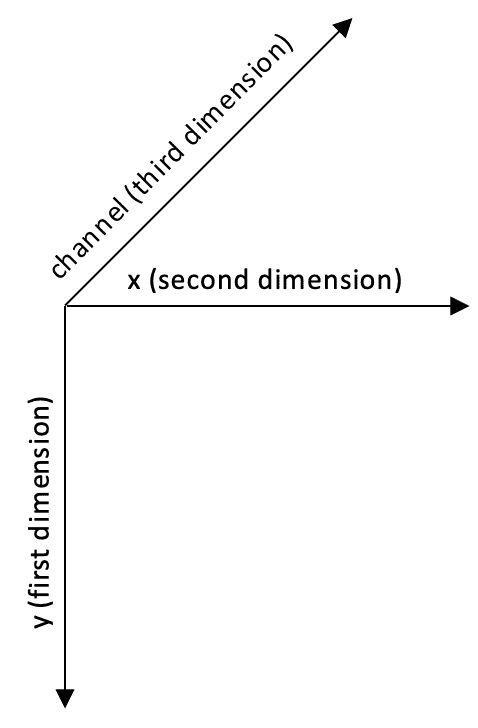
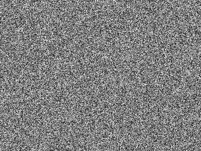
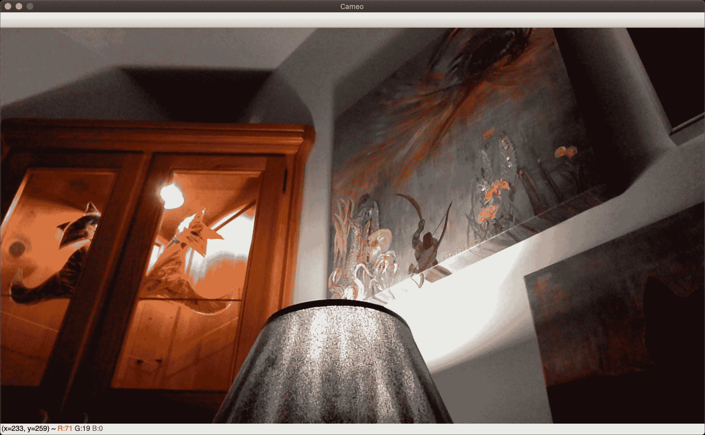

# 处理文件，相机和 GUI

安装 OpenCV 和运行示例很有趣，但是在此阶段，我们想以自己的方式尝试一下。 本章介绍 OpenCV 的 I/O 功能。 我们还将讨论项目的概念以及该项目的面向对象设计的开始，我们将在随后的章节中充实它们。

通过研究 I/O 功能和设计模式，我们将以制作三明治的相同方式构建项目：从外部开始。在填充或算法之前先进行面包切片和涂抹，或将端点和胶粘。 我们之所以选择这种方法，是因为计算机视觉大多是外向的-它考虑了计算机外部的真实世界-并且我们希望通过通用接口将所有后续算法工作应用于真实世界。

具体而言，在本章中，我们的代码示例和讨论将涵盖以下任务：

*   从图像文件，视频文件，相机设备或内存中的原始字节数据中读取图像
*   将图像写入图像文件或视频文件
*   在 NumPy 数组中处理图像数据
*   在 Windows 中显示图像
*   处理键盘和鼠标输入
*   用面向对象的设计实现应用程序

# 技术要求

本章使用 Python，OpenCV 和 NumPy。 请参考第 1 章，“设置 OpenCV*”以获得安装说明。

[可在本书的 GitHub 存储库中，在`Chapter02`文件夹中找到本章的完整代码](https://github.com/PacktPublishing/Learning-OpenCV-4-Computer-Vision-with-Python-Third-Edition)。

# 基本的 I/O 脚本

大多数 CV 应用程序都需要获取图像作为输入。 大多数还产生图像作为输出。 交互式 CV 应用程序可能需要摄影机作为输入源，而窗口则作为输出目标。 但是，其他可能的来源和目的地包括图像文件，视频文件和原始字节。 例如，原始字节可能通过网络连接传输，或者如果我们将过程图形合并到应用程序中，原始字节可能是由算法生成的。 让我们看看每种可能性。

# 读/写图像文件

OpenCV 提供`imread`功能以从文件加载图像，以及`imwrite`功能以将图像写入文件。 这些功能支持静态图像（非视频）的各种文件格式。 支持的格式各不相同-可以在自定义的 OpenCV 版本中添加或删除格式，但是通常 BMP，PNG，JPEG 和 TIFF 属于受支持的格式。

让我们探讨一下 OpenCV 和 NumPy 中图像表示的剖析。 图像是多维数组。 它具有像素的行和列，并且每个像素都有一个值。 对于不同种类的图像数据，可以以不同方式格式化像素值。 例如，我们可以通过简单地创建 2D NumPy 数组从头开始创建`3x3`正方形黑色图像：

```py
img = numpy.zeros((3, 3), dtype=numpy.uint8)
```

如果我们将此图像打印到控制台，则会得到以下结果：

```py
array([[0, 0, 0],
       [0, 0, 0],
       [0, 0, 0]], dtype=uint8)
```

此处，每个像素由单个 8 位整数表示，这意味着每个像素的值都在 0-255 范围内，其中 0 是黑色，255 是白色，中间值是灰色阴影。 这是灰度图像。

现在，使用`cv2.cvtColor`函数将此图像转换为**蓝绿红**（**BGR**）格式：

```py
img = cv2.cvtColor(img, cv2.COLOR_GRAY2BGR)
```

让我们观察一下图像如何变化：

```py
array([[[0, 0, 0],
        [0, 0, 0],
        [0, 0, 0]],

       [[0, 0, 0],
        [0, 0, 0],
        [0, 0, 0]],

       [[0, 0, 0],
        [0, 0, 0],
        [0, 0, 0]]], dtype=uint8)
```

如您所见，每个像素现在都由一个三元素数组表示，每个整数分别代表三个颜色通道之一：B，G 和 R。 其他常见的颜色模型（例如 HSV）将以相同的方式表示，尽管其值范围不同。 例如，HSV 颜色模型的色相值的范围为 0-180。

有关颜色模型的更多信息，请参阅第 3 章，“使用 OpenCV 处理图像”，尤其是“在不同颜色模型之间进行转换”部分。

您可以通过检查`shape`属性来检查图像的结构，该属性将返回行，列和通道数（如果有多个）。

考虑以下示例：

```py
img = numpy.zeros((5, 3), dtype=numpy.uint8)
print(img.shape)
```

前面的代码将显示`(5, 3)`； 换句话说，我们有一个`5`行和`3`列的灰度图像。 如果然后将图像转换为 BGR，则形状将为`(5, 3, 3)`，表示每个像素存在三个通道。

可以从一种文件格式加载图像并保存为另一种文件格式。 例如，让我们将图像从 PNG 转换为 JPEG：

```py
import cv2

image = cv2.imread('MyPic.png')
cv2.imwrite('MyPic.jpg', image)
```

即使我们使用的是 OpenCV 4.x 而不是 OpenCV 2.x，OpenCV 的 Python 模块也称为`cv2`。 从历史上看，OpenCV 具有两个 Python 模块：`cv2`和`cv`。 后者封装了用 C 实现的旧版 OpenCV。如今，OpenCV 仅具有`cv2` Python 模块，该模块封装了用 C++ 实现的最新版 OpenCV。

默认情况下，即使文件使用灰度格式，`imread`也会以 BGR 颜色格式返回图像。 BGR 表示与**红绿蓝**（**RGB**）相同的颜色模型，但字节顺序相反。

可选地，我们可以指定`imread`的模式。 支持的选项包括：

*   `cv2.IMREAD_COLOR`：这是默认选项，为每个通道提供 3 通道 BGR 图像，每个图像具有 8 位值（0-255）。
*   `cv2.IMREAD_GRAYSCALE`：这提供了一个 8 位灰度图像。
*   `cv2.IMREAD_ANYCOLOR`：根据文件中的元数据，它提供每通道 8 位的 BGR 图像或 8 位的灰度图像。
*   `cv2.IMREAD_UNCHANGED`：读取所有图像数据，包括 alpha 或透明通道（如果有）作为第四通道。
*   `cv2.IMREAD_ANYDEPTH`：这将以原始位深度加载灰度图像。 例如，如果文件表示此格式的图像，它将提供每通道 16 位的灰度图像。
*   `cv2.IMREAD_ANYDEPTH | cv2.IMREAD_COLOR`：此组合以原始位深度加载 BGR 颜色的图像。
*   `cv2.IMREAD_REDUCED_GRAYSCALE_2`：这会以原始分辨率的一半加载灰度图像。 例如，如果文件包含`640 x 480`的图像，则它将作为`640 x 480`的图像加载。
*   `cv2.IMREAD_REDUCED_COLOR_2`：这将以每通道 8 位 BGR 的颜色加载图像，其分辨率为原始分辨率的一半。
*   `cv2.IMREAD_REDUCED_GRAYSCALE_4`：这会以原始分辨率的四分之一加载灰度图像。
*   `cv2.IMREAD_REDUCED_COLOR_4`：这将以每通道 8 位的颜色加载原始分辨率的四分之一的图像。
*   `cv2.IMREAD_REDUCED_GRAYSCALE_8`：这会以原始分辨率的八分之一以灰度加载图像。
*   `cv2.IMREAD_REDUCED_COLOR_8`：这将以每通道 8 位的颜色加载图像，其分辨率为原始分辨率的八分之一。

例如，让我们将 PNG 文件加载为灰度图像（在处理过程中丢失任何颜色信息），然后将其另存为灰度 PNG 图像：

```py
import cv2

grayImage = cv2.imread('MyPic.png', cv2.IMREAD_GRAYSCALE)
cv2.imwrite('MyPicGray.png', grayImage) 
```

图像的路径（除非是绝对路径）相对于工作目录（运行 Python 脚本的路径），因此，在前面的示例中，`MyPic.png`将必须位于工作目录中，否则图像将不被发现。 如果您希望避免使用关于工作目录的假设，则可以使用绝对路径，例如 Windows 上的`C:\Users\Joe\Pictures\MyPic.png`，Mac 上的`/Users/Joe/Pictures/MyPic.png`或 Linux 上的`/home/joe/pictures/MyPic.png`。

`imwrite()`功能要求图像为 BGR 或灰度格式，每通道具有一定数量的位，输出格式可以支持该位。 例如，BMP 文件格式每个通道需要 8 位，而 PNG 允许每个通道 8 位或 16 位。

# 在图像和原始字节之间转换

从概念上讲，字节是一个介于 0 到 255 之间的整数。在当今的整个实时图形应用中，一个像素通常由每个通道一个字节表示，尽管其他表示形式也是可能的。

OpenCV 图像是`numpy.array`类型的 2D 或 3D 阵列。 8 位灰度图像是包含字节值的 2D 数组。 24 位 BGR 图像是一个 3D 数组，其中也包含字节值。 我们可以通过使用诸如`image[0, 0]`或`image[0, 0, 0]`的表达式来访问这些值。 第一个索引是像素的`y`坐标或行，`0`是顶部。 第二个索引是像素的`x`坐标或列，`0`是最左侧。 第三个索引（如果适用）表示颜色通道。 数组的三个维度可以在以下笛卡尔坐标系中显示：



例如，在左上角具有白色像素的 8 位灰度图像中，`image[0, 0]`为`255`。 对于左上角带有蓝色像素的 24 位（每通道 8 位）BGR 图像，`image[0, 0]`为`[255, 0, 0]`。

假设图像每个通道有 8 位，我们可以将其转换为一维的标准 Python `bytearray`对象：

```py
byteArray = bytearray(image)
```

相反，只要`bytearray`包含适当顺序的字节，我们就可以进行铸造然后对其进行整形以获得`numpy.array`类型的图像：

```py
grayImage = numpy.array(grayByteArray).reshape(height, width)
bgrImage = numpy.array(bgrByteArray).reshape(height, width, 3)
```

作为更完整的示例，让我们将包含随机字节的`bytearray`转换为灰度图像和 BGR 图像：

```py
import cv2
import numpy
import os

# Make an array of 120,000 random bytes.
randomByteArray = bytearray(os.urandom(120000))
flatNumpyArray = numpy.array(randomByteArray)

# Convert the array to make a 400x300 grayscale image.
grayImage = flatNumpyArray.reshape(300, 400)
cv2.imwrite('RandomGray.png', grayImage)

# Convert the array to make a 400x100 color image.
bgrImage = flatNumpyArray.reshape(100, 400, 3)
cv2.imwrite('RandomColor.png', bgrImage)
```

在这里，我们使用 Python 的标准`os.urandom`函数生成随机原始字节，然后将其转换为 NumPy 数组。 请注意，也可以使用诸如`numpy.random.randint(0, 256, 120000).reshape(300, 400)`之类的语句直接（更有效地）生成随机 NumPy 数组。 我们使用`os.urandom`的唯一原因是帮助演示从原始字节的转换。

运行此脚本后，我们应该在脚本目录中有一对随机生成的图像`RandomGray.png`和`RandomColor.png`。

这是`RandomGray.png`的示例（尽管您几乎可以肯定会有所不同，因为它是随机的）：



同样，这是`RandomColor.png`的示例：


现在，我们对如何由数据形成图像有了更好的了解，我们可以开始对其执行基本操作。

# 使用`numpy.array`访问图像数据

我们已经知道，在 OpenCV 中加载图像的最简单（也是最常见）方法是使用`imread`函数。 我们也知道这将返回一个图像，它实际上是一个数组（2D 或 3D 的数组，具体取决于传递给`imread`的参数）。

`numpy.array`类针对数组操作进行了极大地优化，它允许某些类型的批量操作，这些操作在普通的 Python 列表中不可用。 这些`numpy.array`类型特定的操作对于 OpenCV 中的图像处理非常有用。 但是，让我们从一个基本示例开始逐步探索图像操作。 假设您要操作 BGR 图像中坐标`(0, 0)`处的像素并将其变成白色像素：

```py
import cv2

img = cv2.imread('MyPic.png')
img[0, 0] = [255, 255, 255]
```

然后，如果将修改后的图像保存到文件中并进行查看，则会在图像的左上角看到一个白点。 自然，这种修改不是很有用，但是它开始显示出可能性。 现在，让我们利用`numpy.array`的功能在数组上执行转换，比使用普通的 Python 列表要快得多。

假设您要更改特定像素的蓝色值，例如坐标`(150, 120)`处的像素。 `numpy.array`类型提供了一种方便的方法`item`，它采用三个参数：`x`（或左侧）位置，`y`（或顶部）位置以及索引 （`x`，`y`）位置处的数组内（请记住，在 BGR 图像中，特定位置的数据是包含 B，G 和 R 值按此顺序排列），并在索引位置返回该值。 另一种方法`itemset`将特定像素的特定通道的值设置为指定值。 `itemset`接受两个参数：一个三元素元组（`x`，`y`和索引）和新值。

在下面的示例中，我们将蓝色通道`(150, 120)`的值从其当前值更改为任意`255`：

```py
import cv2

img = cv2.imread('MyPic.png')
img.itemset((150, 120, 0), 255)  # Sets the value of a pixel's blue channel
print(img.item(150, 120, 0))  # Prints the value of a pixel's blue channel
```

为了修改数组中的单个元素，`itemset`方法比我们在本节第一个示例中看到的索引语法要快一些。

同样，修改数组的元素本身并不能做什么，但是确实打开了无限的可能性。 但是，出于性能原因，这仅适用于感兴趣的小区域。 当您需要处理整个图像或较大的兴趣区域时，建议您使用 OpenCV 的函数或 NumPy 的**数组切片**。 后者允许您指定索引范围。 让我们考虑一个使用数组切片来操纵色彩通道的示例。 将图像的所有 G（绿色）值设置为`0`就像下面的代码一样简单：

```py
import cv2

img = cv2.imread('MyPic.png')
img[:, :, 1] = 0
```

这段代码执行了相当重要的操作，很容易理解。 相关的行是最后一行，它基本上指示程序从所有行和列中获取所有像素，并将绿色值（三元素 BGR 数组的索引之一）设置为`0`。 如果显示此图像，您会注意到完全没有绿色。

我们可以通过使用 NumPy 的数组切片访问原始像素来做几件有趣的事情。 其中之一是定义**兴趣区域**（**ROI**）。 定义区域后，我们可以执行许多操作。 例如，我们可以将此区域绑定到变量，定义第二个区域，并将第一个区域的值分配给第二个区域（因此，将图像的一部分复制到图像中的另一个位置）：

```py
import cv2

img = cv2.imread('MyPic.png')
my_roi = img[0:100, 0:100]
img[300:400, 300:400] = my_roi
```

重要的是要确保两个区域的大小相对应。 如果不是，NumPy 将（正确地）抱怨这两个形状不匹配。

最后，我们可以访问`numpy.array`的属性，如以下代码所示：

```py
import cv2

img = cv2.imread('MyPic.png')
print(img.shape)
print(img.size)
print(img.dtype)
```

这三个属性定义如下：

*   `shape`：这是一个描述数组形状的元组。 对于图像，它包含（按顺序）高度，宽度和（如果图像是彩色的）通道数。 `shape`元组的长度是确定图像是灰度还是彩色的有用方法。 对于灰度图像，我们有`len(shape) == 2`，对于彩色图像，我们有`len(shape) == 3`。
*   `size`：这是数组中元素的数量。 在灰度图像的情况下，这与像素数相同。 在 BGR 图像的情况下，它是像素数的三倍，因为每个像素都由三个元素（B，G 和 R）表示。
*   `dtype`：这是数组元素的数据类型。 对于每通道 8 位图像，数据类型为`numpy.uint8`。

总而言之，强烈建议您在使用 OpenCV 时首先熟悉 NumPy，尤其是`numpy.array`。 此类是使用 Python 中的 OpenCV 完成任何图像处理的基础。

# 读/写视频文件

OpenCV 提供`VideoCapture`和`VideoWriter`类，它们支持各种视频文件格式。 支持的格式因操作系统和 OpenCV 的内部配置而异，但是通常可以安全地假定支持 AVI 格式。 通过其`read`方法，可以轮询`VideoCapture`对象以获取新帧，直到它到达其视频文件的末尾。 每帧都是 BGR 格式的图像。

相反，图像可以传递到`VideoWriter`类的`write`方法，该方法将图像附加到`VideoWriter`中的文件。 让我们看一个示例，该示例从一个 AVI 文件读取帧并将其通过 YUV 编码写入另一个文件：

```py
import cv2

videoCapture = cv2.VideoCapture('MyInputVid.avi')
fps = videoCapture.get(cv2.CAP_PROP_FPS)
size = (int(videoCapture.get(cv2.CAP_PROP_FRAME_WIDTH)),
        int(videoCapture.get(cv2.CAP_PROP_FRAME_HEIGHT)))
videoWriter = cv2.VideoWriter(
    'MyOutputVid.avi', cv2.VideoWriter_fourcc('I','4','2','0'),
    fps, size)

success, frame = videoCapture.read()
while success:  # Loop until there are no more frames.
    videoWriter.write(frame)
    success, frame = videoCapture.read()
```

`VideoWriter`类的构造函数的参数值得特别注意。 必须指定视频的文件名。 具有该名称的任何先前存在的文件都将被覆盖。 还必须指定视频编解码器。 可用的编解码器可能因系统而异。 支持的选项可能包括以下内容：

*   `0`：此选项是未压缩的原始视频文件。 文件扩展名应为`.avi`。
*   `cv2.VideoWriter_fourcc('I','4','2','0')`：此选项是未压缩的 YUV 编码，4:2:0 色度被二次采样。 这种编码具有广泛的兼容性，但会产生大文件。 文件扩展名应为`.avi`。
*   `cv2.VideoWriter_fourcc('P','I','M','1')`：此选项是 MPEG-1。 文件扩展名应为`.avi`。
*   `cv2.VideoWriter_fourcc('X','V','I','D')`：此选项是相对较旧的 MPEG-4 编码。 如果要限制生成的视频的大小，这是一个不错的选择。 文件扩展名应为`.avi`。
*   `cv2.VideoWriter_fourcc('M','P','4','V')`：此选项是另一种相对较旧的 MPEG-4 编码。 如果要限制生成的视频的大小，这是一个不错的选择。 文件扩展名应为`.mp4`。
*   `cv2.VideoWriter_fourcc('X','2','6','4')`：此选项是相对较新的 MPEG-4 编码。 如果您想限制最终视频的大小，这可能是最好的选择。 文件扩展名应为`.mp4`。
*   `cv2.VideoWriter_fourcc('T','H','E','O')`：此选项为 **Ogg Vorbis**。 文件扩展名应为`.ogv`。
*   `cv2.VideoWriter_fourcc('F','L','V','1')`：此选项是 Flash 视频。 文件扩展名应为`.flv`。

还必须指定帧速率和帧大小。 由于我们正在从另一个视频复制，因此可以从`VideoCapture`类的`get`方法读取这些属性。

# 捕捉相机帧

相机帧流也由`VideoCapture`对象表示。 但是，对于摄像机，我们通过传递摄像机的设备索引而不是视频的文件名来构造`VideoCapture`对象。 让我们考虑以下示例，该示例从摄像机捕获 10 秒的视频并将其写入 AVI 文件。 代码类似于上一节的示例（从视频文件而不是从摄像机捕获的），但更改以**粗体**标记：

```py
import cv2

cameraCapture = cv2.VideoCapture(0)
fps = 30  # An assumption
size = (int(cameraCapture.get(cv2.CAP_PROP_FRAME_WIDTH)),
        int(cameraCapture.get(cv2.CAP_PROP_FRAME_HEIGHT)))
videoWriter = cv2.VideoWriter(
    'MyOutputVid.avi', cv2.VideoWriter_fourcc('I','4','2','0'),
    fps, size)

success, frame = cameraCapture.read()
numFramesRemaining = 10 * fps - 1 # 10 seconds of frames
while success and numFramesRemaining > 0:
    videoWriter.write(frame)
    success, frame = cameraCapture.read()
    numFramesRemaining -= 1
```

对于某些系统上的某些相机，`cameraCapture.get(cv2.CAP_PROP_FRAME_WIDTH)`和`cameraCapture.get(cv2.CAP_PROP_FRAME_HEIGHT)`可能返回不正确的结果。 为了更确定实际的图像尺寸，您可以先捕获一个帧，然后使用`h, w = frame.shape[:2]`之类的代码获取其高度和宽度。 有时，您甚至可能会遇到一台照相机，在开始产生尺寸稳定的好帧之前，它会产生一些尺寸不稳定的坏帧。 如果您担心这种怪癖，您可能希望在捕获会话开始时阅读并忽略一些帧。

不幸的是，在大多数情况下，`VideoCapture`的`get`方法无法返回相机帧频的准确值； 它通常返回`0`。 [的官方文档 http://docs.opencv.org/modules/highgui/doc/reading_and_writing_images_and_video.html](https://docs.opencv.org/master/d8/dfe/classcv_1_1VideoCapture.html#aa6480e6972ef4c00d74814ec841a2939) 警告以下内容：

“查询`VideoCapture`实例使用的后端不支持的属性时，返回值 0。

**注意**
读/写属性涉及许多层。
`VideoCapture -> API Backend -> Operating System -> Device Driver -> Device Hardware`
返回的值可能与设备实际使用的不同，或者可以使用设备相关的规则（例如，步骤或百分比）对其进行编码。 有效行为取决于 SIC 设备驱动程序和 API 后端。”

要为相机创建合适的`VideoWriter`类，我们必须对帧速率进行假设（就像在前面的代码中所做的那样），或者使用计时器对其进行测量。 后一种方法更好，我们将在本章后面介绍。

摄像机的数量及其顺序当然取决于系统。 不幸的是，OpenCV 没有提供任何查询摄像机数量或其属性的方法。 如果使用无效索引来构造`VideoCapture`类，则`VideoCapture`类将不会产生任何帧。 其`read`方法将返回`(False, None)`。 为避免尝试从未正确打开的`VideoCapture`对象检索帧，您可能需要首先调用`VideoCapture.isOpened`方法，该方法返回布尔值。

当我们需要同步一组摄像机或诸如立体摄像机之类的**多头摄像机**时，`read`方法不合适。 然后，我们使用`grab`和`retrieve`方法代替。 对于一组两个摄像机，我们可以使用类似于以下代码：

```py
success0 = cameraCapture0.grab()
success1 = cameraCapture1.grab()
if success0 and success1:
    frame0 = cameraCapture0.retrieve()
    frame1 = cameraCapture1.retrieve() 
```

# 在窗口中显示图像

OpenCV 中最基本的操作之一是在窗口中显示图像。 这可以通过`imshow`功能来完成。 如果您来自任何其他 GUI 框架背景，您可能会认为只需调用`imshow`以显示图像即可。 但是，在 OpenCV 中，仅当调用另一个函数`waitKey`时才绘制（或重新绘制）窗口。 后一个函数抽取窗口的事件队列（允许处理各种事件，例如图形），并返回用户可能在指定的超时时间内键入的任何键的键代码。 这种基本的设计在某种程度上简化了开发使用视频或网络摄像头输入的演示的任务。 至少开发人员可以手动控制新帧的捕获和显示。

这是一个非常简单的示例脚本，用于从文件读取图像并显示它：

```py
import cv2
import numpy as np

img = cv2.imread('my-image.png')
cv2.imshow('my image', img)
cv2.waitKey()
cv2.destroyAllWindows() 
```

`imshow`函数具有两个参数：我们要在其中显示图像的窗口的名称和图像本身。 我们将在下一节“在窗口中显示摄像机帧”中讨论`waitKey`的更多细节。

恰当命名的`destroyAllWindows`函数可处理由 OpenCV 创建的所有窗口。

# 在窗口中显示摄像机帧

OpenCV 允许使用`namedWindow`，`imshow`和`destroyWindow`函数创建，重绘和销毁命名窗口。 此外，任何窗口都可以通过`waitKey`功能捕获键盘输入，并通过`setMouseCallback`功能捕获鼠标输入。 让我们看一个示例，其中显示从实时摄像机捕获的帧：

```py
import cv2

clicked = False
def onMouse(event, x, y, flags, param):
    global clicked
    if event == cv2.EVENT_LBUTTONUP:
        clicked = True

cameraCapture = cv2.VideoCapture(0)
cv2.namedWindow('MyWindow')
cv2.setMouseCallback('MyWindow', onMouse)

print('Showing camera feed. Click window or press any key to stop.')
success, frame = cameraCapture.read()
while success and cv2.waitKey(1) == -1 and not clicked:
    cv2.imshow('MyWindow', frame)
    success, frame = cameraCapture.read()

cv2.destroyWindow('MyWindow')
cameraCapture.release() 
```

`waitKey`的参数是等待键盘输入的毫秒数。 默认情况下，它是`0`，这是一个特殊的值，表示无穷大。 返回值是`-1`（意味着没有按下任何键）或 ASCII 键码，例如`Esc`的`27`。 有关 ASCII 键码的列表，请访问[这个页面](http://www.asciitable.com/)。 另外，请注意，Python 提供了一个标准函数`ord`，该函数可以将字符转换为其 ASCII 键代码。 例如，`ord('a')`返回`97`。

再次注意，OpenCV 的窗口功能和`waitKey`是相互依赖的。 仅在调用`waitKey`时更新 OpenCV 窗口。 相反，`waitKey`仅在 OpenCV 窗口具有焦点时捕获输入。

如我们的代码示例所示，传递给`setMouseCallback`的鼠标回调应采用五个参数。 回调的`param`参数设置为`setMouseCallback`的可选第三个参数。 默认情况下为`0`。 回调的事件参数是以下操作之一：

*   `cv2.EVENT_MOUSEMOVE`：此事件涉及鼠标移动。
*   `cv2.EVENT_LBUTTONDOWN`：此事件是指按下左按钮时会使其按下。
*   `cv2.EVENT_RBUTTONDOWN`：此事件是指按下该按钮时向下的右键。
*   `cv2.EVENT_MBUTTONDOWN`：此事件是指按下中键时按下的中键。
*   `cv2.EVENT_LBUTTONUP`：此事件是指释放时返回的左按钮。
*   `cv2.EVENT_RBUTTONUP`：此事件指的是释放按钮时再次弹出的右键。
*   `cv2.EVENT_MBUTTONUP`：此事件是指释放按钮时中间按钮再次出现。
*   `cv2.EVENT_LBUTTONDBLCLK`：此事件表示双击左按钮。
*   `cv2.EVENT_RBUTTONDBLCLK`：此事件表示双击右键。
*   `cv2.EVENT_MBUTTONDBLCLK`：此事件是指双击中间按钮。

鼠标回调的`flags`参数可能是以下事件的按位组合：

*   `cv2.EVENT_FLAG_LBUTTON`：此事件是指按下左按钮。
*   `cv2.EVENT_FLAG_RBUTTON`：此事件表示按下了右键。
*   `cv2.EVENT_FLAG_MBUTTON`：此事件是指按下中间按钮。
*   `cv2.EVENT_FLAG_CTRLKEY`：此事件是指按下`Ctrl`键。
*   `cv2.EVENT_FLAG_SHIFTKEY`：此事件是指按下`Shift`键。
*   `cv2.EVENT_FLAG_ALTKEY`：此事件是指按下`Alt`键。

不幸的是，OpenCV 不提供任何手动处理窗口事件的方法。 例如，当单击窗口的关闭按钮时，我们无法停止我们的应用程序。 由于 OpenCV 有限的事件处理和 GUI 功能，许多开发人员更喜欢将其与其他应用程序框架集成。 在本章后面的“`Cameo` – 面向对象设计”部分中，我们将设计一个抽象层，以帮助将 OpenCV 与任何应用程序框架集成。

#`Cameo`项目（面部跟踪和图像处理）

OpenCV 通常是通过涵盖许多算法的菜谱方法来研究的，但是与高级应用程序开发无关。 在某种程度上，这种方法是可以理解的，因为 OpenCV 的潜在应用是如此多样。 OpenCV 被广泛用​​于各种应用程序中，例如照片/视频编辑器，动作控制游戏，机器人的 AI 或我们记录参与者眼睛运动的心理学实验。 在这些不同的用例中，我们可以真正研究一组有用的抽象吗？

该书的作者相信我们可以做到，而且越早开始创建抽象就越好。 我们将围绕一个应用程序构建许多 OpenCV 示例，但是，在每个步骤中，我们都会将该应用程序的组件设计为可扩展和可重用。

我们将开发一个交互式应用程序，该应用程序可实时对摄像机输入进行面部跟踪和图像处理。 这类应用程序涵盖了 OpenCV 的广泛功能，并给我们提出了创建高效有效实施的挑战。

具体来说，我们的应用程序将实时合并人脸。 给定两个摄像机输入流（或可选地，预录制的视频输入），应用程序会将一个流中的人脸叠加在另一个流中的人脸之上。 将应用滤镜和变形以使此混合场景具有统一的外观。 用户应具有参与现场表演的经验，然后进入另一种环境和角色。 这种类型的用户体验在迪士尼乐园等游乐园中很受欢迎。

在这样的应用中，用户会立即注意到诸如低帧频或不准确跟踪的缺陷。 为了获得最佳结果，我们将尝试使用常规成像和深度成像的几种方法。

我们将调用我们的应用程序`Cameo`。 （珠宝中的）客串是人物的小肖像，或者（电影中的）名人的角色很短暂。

# `Cameo` – 面向对象的设计

Python 应用程序可以以纯粹的程序样式编写。 这通常是通过小型应用程序完成的，例如前面讨论过的基本 I/O 脚本。 但是，从现在开始，我们将经常使用面向对象的样式，因为它促进了模块化和可扩展性。

从我们对 OpenCV 的 I/O 功能的概述中，我们知道所有图像都是相似的，无论它们的来源还是目的地。 无论我们如何获取图像流或将其作为输出发送到哪里，我们都可以将相同的特定于应用程序的逻辑应用于该流中的每个帧。 在使用多个 I/O 流的`Cameo`之类的应用程序中，I/O 代码和应用程​​序代码的分离变得特别方便。

我们将创建名为`CaptureManager`和`WindowManager`的类作为 I/O 流的高级接口。 我们的应用程序代码可以使用`CaptureManager`读取新帧，并可以选择将每个帧分派到一个或多个输出，包括静止图像文件，视频文件和窗口（通过`WindowManager`类）。 `WindowManager`类允许我们的应用程序代码以面向对象的方式处理窗口和事件。

`CaptureManager`和`WindowManager`都是可扩展的。 我们可以实现不依赖 OpenCV 进行 I/O 的实现。

# 使用`manager.CaptureManager`提取视频流

如我们所见，OpenCV 可以捕获，显示和记录来自视频文件或摄像机的图像流，但是在每种情况下都有一些特殊的注意事项。 我们的`CaptureManager`类抽象了一些差异，并提供了更高级别的接口来将图像从捕获流分派到一个或多个输出（静止图像文件，视频文件或窗口）。

`CaptureManager`对象用`VideoCapture`对象初始化，并具有`enterFrame`和`exitFrame`方法，通常应在应用程序主循环的每次迭代中调用该方法。 在对`enterFrame`和`exitFrame`的调用之间，应用程序可以（任意次数）设置`channel`属性并获取`frame`属性。 `channel`属性最初是`0`，仅多头相机使用其他值。 `frame`属性是当调用`enterFrame`时与当前通道状态相对应的图像。

`CaptureManager`类还具有可以随时调用的`writeImage`，`startWritingVideo`和`stopWritingVideo`方法。 实际文件写入被推迟到`exitFrame`为止。 另外，在`exitFrame`方法期间，`frame`可能会显示在窗口中，具体取决于应用程序代码是否提供`WindowManager`类作为`CaptureManager`的构造函数的参数，或者通过设置`previewWindowManager`属性 。

如果应用程序代码操纵`frame`，则操纵将反映在记录的文件和窗口中。 `CaptureManager`类具有构造函数参数和称为`shouldMirrorPreview`的属性，如果我们希望`frame`在窗口中而不是在记录的文件中进行镜像（水平翻转），则应为`True`。 通常，面对摄像机时，用户喜欢对实时摄像机源进行镜像。

回想一下`VideoWriter`对象需要帧速率，但是 OpenCV 并没有提供任何可靠的方法来获取摄像机的准确帧速率。 `CaptureManager`类通过使用帧计数器和 Python 的标准`time.time`函数在必要时估计帧速率来解决此限制。 这种方法不是万无一失的。 根据帧频波动和`time.time`的系统相关实现，在某些情况下，估算的准确性可能仍然很差。 但是，如果我们部署到未知的硬件，则比仅假设用户的摄像机具有特定的帧速率要好。

让我们创建一个名为`managers.py`的文件，其中将包含`CaptureManager`的实现。 事实证明，此实现非常长，因此我们将分几部分进行介绍：

1.  首先，让我们添加导入和构造函数，如下所示：

```py
import cv2
import numpy
import time

class CaptureManager(object):

    def __init__(self, capture, previewWindowManager = None,
                 shouldMirrorPreview = False):

        self.previewWindowManager = previewWindowManager
        self.shouldMirrorPreview = shouldMirrorPreview

        self._capture = capture
        self._channel = 0
        self._enteredFrame = False
        self._frame = None
        self._imageFilename = None
        self._videoFilename = None
        self._videoEncoding = None
        self._videoWriter = None

        self._startTime = None
        self._framesElapsed = 0
        self._fpsEstimate = None

```

2.  接下来，让我们为`CaptureManager`的属性添加以下获取器和设置器方法：

```py
    @property
    def channel(self):
        return self._channel

    @channel.setter
    def channel(self, value):
        if self._channel != value:
            self._channel = value
            self._frame = None

    @property
    def frame(self):
        if self._enteredFrame and self._frame is None:
            _, self._frame = self._capture.retrieve(
                self._frame, self.channel)
        return self._frame

    @property
    def isWritingImage(self):
        return self._imageFilename is not None

    @property
    def isWritingVideo(self):
        return self._videoFilename is not None
```

请注意，大多数`member`变量都是非公开的，如变量名中的下划线前缀所表示，例如`self._enteredFrame`。 这些非公共变量与当前帧的状态以及任何文件写入操作有关。 如前所述，应用程序代码只需要配置一些东西，这些东西就可以作为构造函数参数和可设置的公共属性来实现：相机通道，窗口管理器和镜像相机预览的选项。

本书假定您对 Python 有一定程度的了解。 但是，如果您对这些`@`注释（例如`@property`）感到困惑，请参阅有关`decorators`的 Python 文档，该语言是该语言的内置功能，允许通过另一个函数包装一个函数 ，通常用于在应用程序的多个位置应用用户定义的行为。 具体来说，您可以在[这个页面](https://docs.python.org/3/reference/compound_stmts.html#grammar-token-decorator)找到相关文档。

Python 没有强制执行非公共成员变量的概念，但是在开发人员希望将变量视为非公共变量的情况下，您经常会看到单下划线前缀（`_`）或双下划线前缀（`__`） 。 单下划线前缀只是一个约定，表示应将变量视为受保护的变量（只能在类及其子类中访问）。 实际上，双下划线前缀使 Python 解释器重命名该变量，从而`MyClass.__myVariable`变为`MyClass._MyClass__myVariable`。 这被称为**名称修改**（相当合适）。 按照惯例，此类变量应视为私有变量（只能在该类中访问，而其子类**不能访问**）。 具有相同含义的相同前缀可以应用于方法和变量。

3.  继续执行，让我们将`enterFrame`方法添加到`managers.py`中：

```py
    def enterFrame(self):
        """Capture the next frame, if any."""

        # But first, check that any previous frame was exited.
        assert not self._enteredFrame, \
            'previous enterFrame() had no matching exitFrame()'

        if self._capture is not None:
            self._enteredFrame = self._capture.grab() 
```

请注意，`enterFrame`的实现仅抓取（同步）帧，而从通道的实际检索被推迟到`frame`变量的后续读取。

4.  接下来，让我们将`exitFrame`方法添加到`managers.py`中：

```py
    def exitFrame(self):
        """Draw to the window. Write to files. Release the 
        frame."""

        # Check whether any grabbed frame is retrievable.
        # The getter may retrieve and cache the frame.
        if self.frame is None:
            self._enteredFrame = False
            return

        # Update the FPS estimate and related variables.
        if self._framesElapsed == 0:
            self._startTime = time.time()
        else:
            timeElapsed = time.time() - self._startTime
            self._fpsEstimate = self._framesElapsed / timeElapsed
        self._framesElapsed += 1

        # Draw to the window, if any.
        if self.previewWindowManager is not None:
            if self.shouldMirrorPreview:
                mirroredFrame = numpy.fliplr(self._frame)
                self.previewWindowManager.show(mirroredFrame)
            else:
                self.previewWindowManager.show(self._frame)

        # Write to the image file, if any.
        if self.isWritingImage:
            cv2.imwrite(self._imageFilename, self._frame)
            self._imageFilename = None

        # Write to the video file, if any.
        self._writeVideoFrame()

        # Release the frame.
        self._frame = None
        self._enteredFrame = False
```

`exitFrame`的实现从当前通道获取图像，估计帧速率，通过窗口管理器（如果有）显示图像，并满足将图像写入文件的所有未决请求。

5.  其他几种方法也与文件写入有关。 让我们将名为`writeImage`，`startWritingVideo`和`stopWritingVideo`的公共方法的以下实现添加到`managers.py`中：

```py
    def writeImage(self, filename):
        """Write the next exited frame to an image file."""
        self._imageFilename = filename

    def startWritingVideo(
            self, filename,
            encoding = cv2.VideoWriter_fourcc('M','J','P','G')):
        """Start writing exited frames to a video file."""
        self._videoFilename = filename
        self._videoEncoding = encoding

    def stopWritingVideo(self):
        """Stop writing exited frames to a video file."""
        self._videoFilename = None
        self._videoEncoding = None
        self._videoWriter = None
```

前述方法仅更新用于文件写入操作的参数，而实际的写入操作被推迟到`exitFrame`的下一次调用。

6.  在本节的前面，我们看到`exitFrame`调用了一个名为`_writeVideoFrame`的辅助方法。 让我们将`_writeVideoFrame`的以下实现添加到`managers.py`中：

```py
    def _writeVideoFrame(self):

        if not self.isWritingVideo:
            return

        if self._videoWriter is None:
            fps = self._capture.get(cv2.CAP_PROP_FPS)
            if fps <= 0.0:
                # The capture's FPS is unknown so use an estimate.
                if self._framesElapsed < 20:
                    # Wait until more frames elapse so that the
                    # estimate is more stable.
                    return
                else:
                    fps = self._fpsEstimate
            size = (int(self._capture.get(
                        cv2.CAP_PROP_FRAME_WIDTH)),
                    int(self._capture.get(
                        cv2.CAP_PROP_FRAME_HEIGHT)))
            self._videoWriter = cv2.VideoWriter(
                self._videoFilename, self._videoEncoding,
                fps, size)

        self._videoWriter.write(self._frame)
```

前面的方法以我们较早版本的脚本应该熟悉的方式创建或附加到视频文件（请参阅本章前面的“读取/写入视频文件”部分）。 但是，在帧速率未知的情况下，我们会在捕获会话开始时跳过一些帧，以便有时间建立对帧速率的估计。

至此我们完成了`CaptureManager`的实现。 尽管它依赖`VideoCapture`，但我们可以进行其他不使用 OpenCV 进行输入的实现。 例如，我们可以创建一个用套接字连接实例化的子类，该子类的字节流可以解析为图像流。 同样，我们可以创建一个子类，该子类使用第三方相机库，其硬件支持与 OpenCV 提供的硬件支持不同。 但是，对于`Cameo`，我们当前的实施方式就足够了。

# 使用`manager.WindowManager`抽象一个窗口和键盘

如我们所见，OpenCV 提供的功能可导致创建窗口，销毁窗口，显示图像以及处理事件。 这些函数不是窗口类的方法，而是需要窗口的名称作为参数传递。 由于此接口不是面向对象的，因此可以说与 OpenCV 的通用样式不一致。 而且，它不太可能与我们最终想要代替 OpenCV 使用的其他窗口或事件处理接口兼容。

为了面向对象和适应性强，我们将此功能抽象为具有`createWindow`，`destroyWindow`，`show`和`processEvents`方法的`WindowManager`类。 作为属性，`WindowManager`具有一个称为`keypressCallback`的功能对象，如果有任何按键，则会从`processEvents`调用该函数对象（如果不是`None`）。 `keypressCallback`对象必须是带有单个参数的函数，尤其是 ASCII 密钥代码。

让我们在`managers.py`中添加`WindowManager`的实现。 该实现从以下类声明和`__init__`方法开始：

```py
class WindowManager(object):

    def __init__(self, windowName, keypressCallback = None):
        self.keypressCallback = keypressCallback

        self._windowName = windowName
        self._isWindowCreated = False
```

该实现继续使用以下方法来管理窗口及其事件的生命周期：

```py
    @property
    def isWindowCreated(self):
        return self._isWindowCreated

    def createWindow(self):
        cv2.namedWindow(self._windowName)
        self._isWindowCreated = True

    def show(self, frame):
        cv2.imshow(self._windowName, frame)

    def destroyWindow(self):
        cv2.destroyWindow(self._windowName)
        self._isWindowCreated = False

    def processEvents(self):
        keycode = cv2.waitKey(1)
        if self.keypressCallback is not None and keycode != -1:
            self.keypressCallback(keycode)
```

我们当前的实现仅支持键盘事件，这对于`Cameo`足够了。 但是，我们也可以修改`WindowManager`以支持鼠标事件。 例如，可以将类接口扩展为包括`mouseCallback`属性（和可选的构造函数参数），但否则可以保持不变。 使用 OpenCV 以外的事件框架，我们可以通过添加回调属性以相同的方式支持其他事件类型。

# 使用`cameo.Cameo`应用所有内容

我们的应用程序由`Cameo`类表示，有两种方法：`run`和`onKeypress`。 初始化时，`Cameo`对象将使用`onKeypress`作为回调创建`WindowManager`对象，并使用摄像机（具体来说是`cv2.VideoCapture`对象）和相同的`WindowManager`对象创建`CaptureManager`对象。 调用`run`时，应用程序执行一个主循环，在其中处理帧和事件。

作为事件处理的结果，可以调用`onKeypress`。 空格键将截取屏幕快照，`TAB`导致屏幕录像（视频录制）开始/停止，`Esc`导致应用程序退出。

在与`managers.py`相同的目录中，创建一个名为`cameo.py`的文件，在该文件中将实现`Cameo`类：

1.  该实现从以下`import`语句和`__init__`方法开始：

```py
import cv2
from managers import WindowManager, CaptureManager

class Cameo(object):

    def __init__(self):
        self._windowManager = WindowManager('Cameo',
                                            self.onKeypress)
        self._captureManager = CaptureManager(
            cv2.VideoCapture(0), self._windowManager, True)
```

2.  接下来，让我们添加`run()`方法的以下实现：

```py
    def run(self):
        """Run the main loop."""
        self._windowManager.createWindow()
        while self._windowManager.isWindowCreated:
            self._captureManager.enterFrame()
            frame = self._captureManager.frame

            if frame is not None:
                # TODO: Filter the frame (Chapter 3).
                pass

            self._captureManager.exitFrame()
            self._windowManager.processEvents()
```

3.  要完成`Cameo`类的实现，请使用`onKeypress()`方法：

```py
    def onKeypress(self, keycode):
        """Handle a keypress.

        space -> Take a screenshot.
        tab -> Start/stop recording a screencast.
        escape -> Quit.

        """
        if keycode == 32: # space
            self._captureManager.writeImage('screenshot.png')
        elif keycode == 9: # tab
            if not self._captureManager.isWritingVideo:
                self._captureManager.startWritingVideo(
                    'screencast.avi')
            else:
                self._captureManager.stopWritingVideo()
        elif keycode == 27: # escape
            self._windowManager.destroyWindow()
```

4.  最后，让我们添加一个`__main__`块，该块实例化并运行`Cameo`，如下所示：

```py
if __name__=="__main__":
    Cameo().run()
```

运行该应用程序时，请注意，实时摄像机的提要是镜像的，而屏幕截图和截屏不是。 这是预期的行为，因为我们在初始化`CaptureManager`类时将`shouldMirrorPreview`传递给`True`。

这是`Cameo`的屏幕截图，显示了一个窗口（标题为`Cameo`）和相机的当前帧：



到目前为止，除了镜像它们以进行预览之外，我们不会以其他任何方式操作它们。 我们将在第 3 章“使用 OpenCV 处理图像”中开始添加更多有趣的效果。

# 总结

到现在为止，我们应该有一个显示相机供稿，监听键盘输入并（按命令）记录屏幕截图或截屏视频的应用程序。 我们准备通过在每个帧的开始和结尾之间插入一些图像过滤代码（第 3 章，“用 OpenCV 处理图像”）来扩展应用程序。 （可选）我们还准备集成 OpenCV 支持的其他相机驱动程序或应用程序框架。

我们还拥有将图像作为 NumPy 数组进行操作的知识。 这构成了我们下一个主题过滤图像的理想基础。