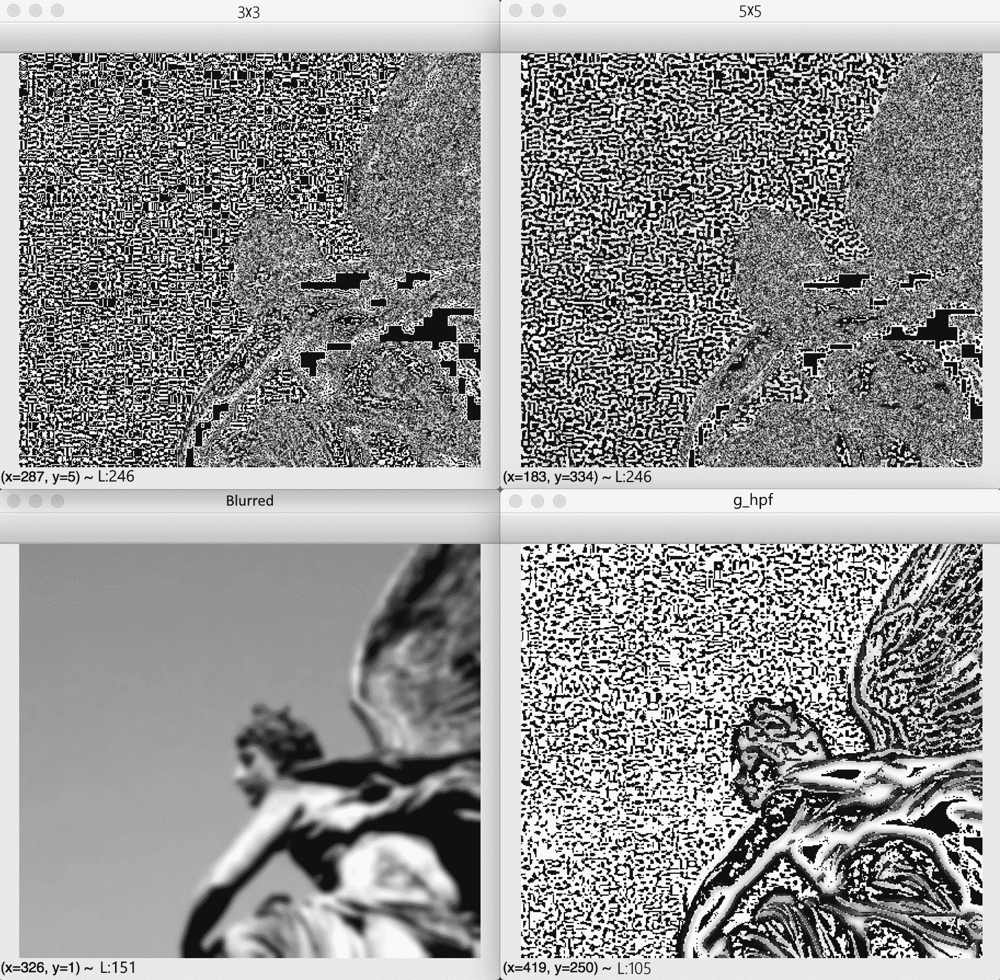
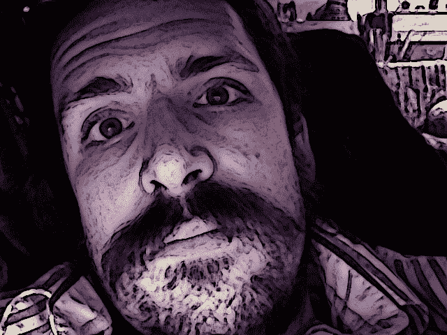
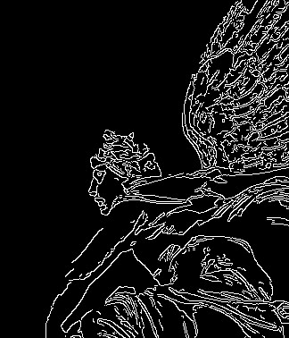
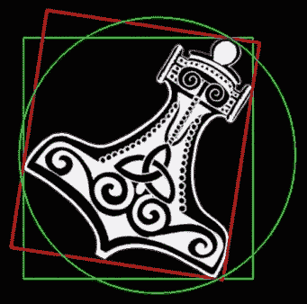
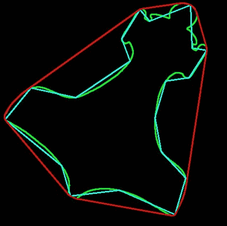

# 使用 OpenCV 处理图像

或早或晚，使用图像时，您会发现需要更改它们：通过应用艺术滤镜，外推某些部分，融合两个图像，或者您能想到的其他任何方式。 本章介绍了一些可用于更改图像的技术。 到最后，您应该能够执行诸如锐化图像，标记对象轮廓以及使用线段检测器检测人行横道等任务。 具体来说，我们的讨论和代码示例将涵盖以下主题：

*   在不同颜色模型之间转换图像
*   了解频率和傅立叶变换在图像处理中的重要性
*   应用**高通滤波器**（**HPF**），**低通滤波器**（**LPF**），边缘检测滤波器和自定义卷积滤波器
*   检测和分析轮廓，线，圆和其他几何形状
*   编写封装过滤器实现的类和函数

# 技术要求

本章使用 Python，OpenCV，NumPy 和 SciPy。 有关安装说明，请参阅第 1 章，“设置 OpenCV”。

可在本书的 [GitHub 存储库的`chapter03`文件夹](https://github.com/PacktPublishing/Learning-OpenCV-4-Computer-Vision-with-Python-Third-Edition)中找到本章的完整代码。 示例图像也位于本书的 GitHub 存储库的`images`文件夹中。

# 在不同颜色模型之间转换图像

OpenCV 实际上实现了数百种与颜色模型转换有关的公式。 某些颜色模型通常由输入设备（例如相机）使用，而其他颜色模型通常用于输出设备（例如电视，计算机显示器和打印机）。 在输入和输出之间，当我们将计算机视觉技术应用于图像时，通常将使用三种颜色模型：灰度，**蓝绿色红色**（**BGR**）和**色相饱和度值**（**HSV**）。 让我们简单地看一下这些：

*   **灰度**是通过将颜色信息转换为灰度或亮度来减少其颜色的模型。 此模型对于仅亮度信息就足够的问题（例如面部检测）中的图像中间处理非常有用。 通常，灰度图像中的每个像素都由单个 8 位值表示，范围从黑色的 0 到白色的 255。
*   **BGR** 是蓝绿色-红色模型，其中每个像素都有代表像素颜色的蓝色，绿色和红色分量或**通道**的三元组值。 Web 开发人员以及使用计算机图形学的任何人都将熟悉类似的颜色定义，但反向通道顺序为**红-绿-蓝**（**RGB**）。 通常，BGR 图像中的每个像素都由一个 8 位值的三元组表示，例如`[0, 0, 0]`表示黑色，`[255, 0, 0]`表示蓝色，`[0, 255, 0]`表示绿色，`[0, 0, 255]`表示红色，`[255, 255, 255]`表示 白色。
*   **HSV** 模型使用不同的三元组通道。 色相是颜色的色调，饱和度是颜色的强度，值代表颜色的亮度。

默认情况下，OpenCV 使用 BGR 颜色模型（每通道 8 位）表示它从文件加载或从相机捕获的任何图像。

现在我们已经定义了将要使用的颜色模型，让我们考虑默认模型可能与我们对颜色的直观理解有何不同。

# 光不是油漆

对于刚接触 BGR 颜色空间的人来说，似乎事情不正确地加起来了：例如，`(0, 255, 255)`三胞胎（无蓝色，全绿色和全红色）产生黄色。 如果您具有艺术背景，那么您甚至不需要拾起油漆和刷子就可以知道绿色和红色油漆混合在一起变成了泥泞的棕色。 但是，用于计算的颜色模型称为**加法**模型，它们处理灯光。 灯光的行为与油漆不同（后者遵循**减色**颜色模型），并且由于软件在计算机上运行，​​该计算机的介质是发光的监视器，因此参考颜色模型是加法的。

# 探索傅立叶变换

在 OpenCV 中，您应用于图像和视频的许多处理都涉及傅立叶变换的概念。 约瑟夫·傅里叶（Joseph Fourier）是 18 世纪的法国数学家，发现并普及了许多数学概念。 他研究了热物理学，以及可以用波形函数表示的所有事物的数学。 特别是，他观察到所有波形都是不同频率的简单正弦波之和。

换句话说，您在周围观察到的波形是其他波形的总和。 该概念在处理图像时非常有用，因为它使我们能够识别图像中信号（例如图像像素值）变化很大的区域以及变化不那么剧烈的区域。 然后，我们可以将这些区域任意标记为噪声区域或感兴趣区域，背景或前景等。 这些是构成原始图像的频率，我们有能力将它们分开以理解图像并推断出有趣的数据。

OpenCV 实现了许多算法，使我们能够处理图像并理解其中包含的数据，并且在 NumPy 中也重新实现了这些算法，以使我们的生活更加轻松。 NumPy 具有**快速傅立叶变换**（**FFT**）程序包，其中包含`fft2`方法。 这种方法允许我们计算图像的**离散傅里叶变换**（**DFT**）。

让我们使用傅立叶变换研究图像的**幅度谱**的概念。 图像的幅度谱是另一幅图像，它根据原始图像的变化提供了表示。 将其视为拍摄图像并将所有最亮的像素拖到中心。 然后，您逐渐走到所有最暗像素已被压入的边界。 马上，您将能够看到图像中包含多少个明暗像素及其分布百分比。

傅立叶变换是用于常见图像处理操作（例如边缘检测或线条和形状检测）的许多算法的基础。

在详细研究这些之前，让我们看一下与傅立叶变换结合在一起的两个概念，它们是上述处理操作的基础：HPF 和 LPF。

# HPF 和 LPF

HPF 是一种滤镜，可检查图像区域并根据周围像素强度的差异来提高某些像素的强度。

以以下内核为例：

```py
[[ 0,    -0.25,  0   ],
[-0.25,  1,    -0.25],
[ 0,    -0.25,  0   ]]
```

**内核**是一组权重，这些权重应用于源图像中的区域以在目标图像中生成单个像素。 例如，如果我们调用带有参数以指定内核大小或`7`的`ksize`的参数的 OpenCV 函数，则这意味着在生成每个目标像素时会考虑使用 49（7 x 7）个源像素。 我们可以将内核视为一块磨砂玻璃，它在源图像上移动，并使源光的扩散混合穿过。

前面的内核为我们提供了中心像素及其所有直接水平相邻像素之间强度的平均差。 如果一个像素从周围的像素中脱颖而出，则结果值将很高。 这种类型的内核代表一种所谓的高增益滤波器，它是 HPF 的一种，在边缘检测中特别有效。

请注意，边缘检测内核中的值通常加起来为`0`。 我们将在本章的*自定义内核-令人费解的*部分中对此进行介绍。

让我们来看一个将 HPF 应用于图像的示例：

```py
import cv2
import numpy as np
from scipy import ndimage

kernel_3x3 = np.array([[-1, -1, -1],
                       [-1, 8, -1],
                       [-1, -1, -1]])

kernel_5x5 = np.array([[-1, -1, -1, -1, -1],
                       [-1, 1, 2, 1, -1],
                       [-1, 2, 4, 2, -1],
                       [-1, 1, 2, 1, -1],
                       [-1, -1, -1, -1, -1]])

img = cv2.imread("img/statue_small.jpg", 0)

k3 = ndimage.convolve(img, kernel_3x3)
k5 = ndimage.convolve(img, kernel_5x5)

blurred = cv2.GaussianBlur(img, (17,17), 0)
g_hpf = img - blurred

cv2.imshow("3x3", k3)
cv2.imshow("5x5", k5)
cv2.imshow("blurred", blurred)
cv2.imshow("g_hpf", g_hpf)
cv2.waitKey()
cv2.destroyAllWindows()
```

初始导入后，我们定义`3x3`内核和`5x5`内核，然后以灰度加载图像。 之后，我们想将图像与每个内核进行卷积。 有多种库函数可用于此目的。 NumPy 提供`convolve`功能； 但是，它仅接受一维数组。 尽管可以使用 NumPy 实现多维数组的卷积，但这会有些复杂。 SciPy 的`ndimage`模块提供了另一个`convolve`功能，该功能支持多维数组。 最后，OpenCV 提供`filter2D`函数（用于与 2D 阵列进行卷积）和`sepFilter2D`函数（用于可分解为两个一维内核的 2D 内核的特殊情况）。 前面的代码示例说明了`ndimage.convolve`功能。 我们将在*自定义内核的其他示例中使用`cv2.filter2D`函数-弄混本章的*部分。

我们的脚本通过将两个 HPF 与我们定义的两个卷积内核一起应用来进行。 最后，我们还通过应用 LPF 并计算原始图像之间的差异，来实现获得 HPF 的另一种方法。 让我们看看每个过滤器的外观。 作为输入，我们从以下照片开始：


现在，这是输出的屏幕截图：



您会注意到，如右下图所示，差分 HPF 产生最佳的边缘查找结果。 由于这种差分方法涉及低通滤波器，因此让我们详细介绍一下这种类型的滤波器。 如果 HPF 增强了像素的强度，考虑到与邻居之间的差异，如果与周围像素的差异小于某个阈值，则 LPF 将使像素平滑。 这用于去噪和模糊处理。 例如，最流行的模糊/平滑滤波器之一是高斯模糊，它是一种衰减高频信号强度的低通滤波器。 高斯模糊的结果显示在左下方的照片中。

现在，我们已经在一个基本示例中尝试了这些过滤器，让我们考虑如何将它们集成到更大，更具交互性的应用程序中。

# 创建模块

让我们重新回顾在第 2 章，“处理文件，照相机和 GUI”中启动的 Cameo 项目。 我们可以修改 Cameo，以便将滤镜实时应用于捕获的图像。 与我们的`CaptureManager`和`WindowManager`类一样，我们的过滤器应可在 Cameo 之外重用。 因此，我们应该将过滤器分成各自的 Python 模块或文件。

让我们在与`cameo.py`相同的目录中创建一个名为`filters.py`的文件。 我们需要`filters.py`中的以下`import`语句：

```py
import cv2
import numpy
import utils
```

我们还要在同一目录中创建一个名为`utils.py`的文件。 它应包含以下`import`语句：

```py
import cv2
import numpy
import scipy.interpolate
```

我们将为`filters.py`添加过滤器函数和类，而`utils.py`中将使用更多通用的数学函数。

# 边缘检测

边缘在人类和计算机视觉中都扮演着重要角色。 我们作为人类，仅通过查看背光轮廓或粗略草图就可以轻松识别许多对象类型及其姿势。 确实，当艺术强调边缘和姿势时，它通常似乎传达了原型的思想，例如罗丹的*思想家*或乔·舒斯特的*超人*。 软件也可以推断出边缘，姿势和原型。 我们将在后面的章节中讨论这类推理。

OpenCV 提供了许多边缘过滤器，包括`Laplacian`，`Sobel`和`Scharr`。 这些滤镜应该将非边缘区域变成黑色，并将边缘区域变成白色或饱和色。 但是，它们易于将噪声误识别为边缘。 可以通过在尝试查找边缘之前对图像进行模糊处理来缓解此缺陷。 OpenCV 还提供了许多模糊滤镜，包括`blur`（一个简单的平均值），`medianBlur`和`GaussianBlur`。 边缘查找和模糊过滤器的参数有所不同，但始终包含[​​HTG6]，这是一个奇数，代表过滤器内核的宽度和高度（以像素为单位）。

为了模糊，让我们使用`medianBlur`，它可以有效消除数字视频噪声，尤其是在彩色图像中。 对于边缘查找，让我们使用`Laplacian`，它会产生粗体的边缘线，尤其是在灰度图像中。 应用`medianBlur`之后，但应用`Laplacian`之前，我们应该将图像从 BGR 转换为灰度。

获得`Laplacian`的结果后，我们可以将其取反以得到白色背景上的黑色边缘。 然后，我们可以对其进行规格化（使其值的范围为 0 到 1），然后将其与源图像相乘以使边缘变暗。 让我们在`filters.py`中实现这种方法：

```py
def strokeEdges(src, dst, blurKsize = 7, edgeKsize = 5):
    if blurKsize >= 3:
        blurredSrc = cv2.medianBlur(src, blurKsize)
        graySrc = cv2.cvtColor(blurredSrc, cv2.COLOR_BGR2GRAY)
    else:
        graySrc = cv2.cvtColor(src, cv2.COLOR_BGR2GRAY)
    cv2.Laplacian(graySrc, cv2.CV_8U, graySrc, ksize = edgeKsize)
    normalizedInverseAlpha = (1.0 / 255) * (255 - graySrc)
    channels = cv2.split(src)
    for channel in channels:
        channel[:] = channel * normalizedInverseAlpha
    cv2.merge(channels, dst)
```

请注意，我们允许将内核大小指定为`strokeEdges`的参数。

`blurKsize`自变量用作`medianBlur`的`ksize`，而`edgeKsize`用作`Laplacian`的`ksize`。 对于典型的网络摄像头，`7`的`blurKsize`值和`5`的`edgeKsize`值可能会产生最令人愉悦的效果。 不幸的是，`medianBlur`与`ksize`之类的大型`ksize`参数比较昂贵。

如果在运行`strokeEdges`时遇到性能问题，请尝试减小`blurKsize`的值。 要关闭模糊效果，请将其设置为小于`3`的值。

在*修改*应用程序部分中将其集成到 Cameo 中之后，我们将在本章稍后看到此过滤器的效果。

# 自定义内核-令人费解

正如我们已经看到的，许多 OpenCV 的预定义过滤器都使用内核。 请记住，内核是一组权重，这些权重确定如何从输入像素的邻域计算每个输出像素。 内核的另一个术语是**卷积矩阵**。 它混合或卷积区域中的像素。 类似地，基于内核的过滤器可以称为卷积过滤器。

OpenCV 提供了非常通用的`filter2D()`函数，该函数可应用我们指定的任何内核或卷积矩阵。 要了解如何使用此功能，让我们了解卷积矩阵的格式。 它是一个二维数组，具有奇数行和列。 中心元素对应于感兴趣的像素，而其他元素对应于此像素的邻居。 每个元素都包含一个整数或浮点值，该值是应用于输入像素值的权重。 考虑以下示例：

```py
kernel = numpy.array([[-1, -1, -1],
                      [-1,  9, -1],
                      [-1, -1, -1]])
```

在此，关注像素的权重为`9`，其相邻像素的权重为`-1`。 对于感兴趣的像素，输出颜色将是其输入颜色的九倍，减去所有八个相邻像素的输入颜色。 如果感兴趣的像素已经与其相邻像素有所不同，则这种差异会加剧。 效果是，随着邻居之间的对比度增加，图像看起来*更清晰*。

继续我们的示例，我们可以将此卷积矩阵分别应用于源图像和目标图像，如下所示：

```py
cv2.filter2D(src, -1, kernel, dst)
```

第二个参数指定目标图像的每通道深度（例如，每通道 8 位的`cv2.CV_8U`）。 负值（例如此处使用的负值）表示目标图像的深度与源图像的深度相同。

对于彩色图像，请注意`filter2D()`将内核均等地应用于每个通道。 要在不同的通道上使用不同的内核，我们还必须使用`split()`和`merge()`函数。

基于这个简单的示例，让我们向`filters.py`添加两个类。 一类`VConvolutionFilter`通常代表卷积滤波器。 子类`SharpenFilter`将专门代表我们的锐化滤镜。 让我们编辑`filters.py`，以便我们可以实现这两个新类，如下所示：

```py
class VConvolutionFilter(object):
    """A filter that applies a convolution to V (or all of BGR)."""

    def __init__(self, kernel):
        self._kernel = kernel

    def apply(self, src, dst):
        """Apply the filter with a BGR or gray source/destination."""
        cv2.filter2D(src, -1, self._kernel, dst)

class SharpenFilter(VConvolutionFilter):
    """A sharpen filter with a 1-pixel radius."""

    def __init__(self):
        kernel = numpy.array([[-1, -1, -1],
                              [-1,  9, -1],
                              [-1, -1, -1]])
        VConvolutionFilter.__init__(self, kernel)
```

注意，权重总和为`1`。 每当我们要保持图像的整体亮度不变时，都应该是这种情况。 如果我们稍微修改锐化内核，使其权重总和为`0`，我们将拥有一个边缘检测内核，该边缘会将边缘变成白色，将非边缘变成黑色。 例如，让我们在`filters.py`中添加以下边缘检测过滤器：

```py
class FindEdgesFilter(VConvolutionFilter):
    """An edge-finding filter with a 1-pixel radius."""

    def __init__(self):
        kernel = numpy.array([[-1, -1, -1],
                              [-1,  8, -1],
                              [-1, -1, -1]])
        VConvolutionFilter.__init__(self, kernel)
```

接下来，让我们做一个模糊滤镜。 通常，对于模糊效果，权重之和应为`1`，并且在整个邻域中应为正。 例如，我们可以对邻域进行简单的平均计算，如下所示：

```py
class BlurFilter(VConvolutionFilter):
    """A blur filter with a 2-pixel radius."""

    def __init__(self):
        kernel = numpy.array([[0.04, 0.04, 0.04, 0.04, 0.04],
                              [0.04, 0.04, 0.04, 0.04, 0.04],
                              [0.04, 0.04, 0.04, 0.04, 0.04],
                              [0.04, 0.04, 0.04, 0.04, 0.04],
                              [0.04, 0.04, 0.04, 0.04, 0.04]])
        VConvolutionFilter.__init__(self, kernel) 
```

我们的锐化，边缘检测和模糊滤镜使用高度对称的内核。 但是有时，对称性较低的内核会产生有趣的效果。 让我们考虑一个在一侧模糊（权重为正）而在另一侧锐化（权重为负）的内核。 它将产生凸纹或*浮雕*效果。 这是我们可以添加到`filters.py`的实现：

```py
class EmbossFilter(VConvolutionFilter):
    """An emboss filter with a 1-pixel radius."""

    def __init__(self):
        kernel = numpy.array([[-2, -1, 0],
                              [-1,  1, 1],
                              [ 0,  1, 2]])
        VConvolutionFilter.__init__(self, kernel)
```

这套自定义卷积滤波器非常基础。 实际上，它比 OpenCV 的现成的过滤器集更基本。 但是，通过一些试验，您应该能够编写自己的内核，从而产生独特的外观。

# 修改应用程序

现在，我们已经为几个过滤器提供了高级功能和类，将它们中的任何一个应用到 Cameo 中捕获的帧上都是微不足道的。 让我们编辑`cameo.py`，并在以下摘录中添加以粗体显示的行。 首先，我们需要将`filters`模块添加到我们的导入列表中，如下所示：

```py
import cv2
import filters
from managers import WindowManager, CaptureManager
```

现在，我们需要初始化将要使用的所有过滤器对象。 在以下修改的`__init__`方法中可以看到一个示例：

```py
class Cameo(object):

    def __init__(self):
        self._windowManager = WindowManager('Cameo',
                                             self.onKeypress)
        self._captureManager = CaptureManager(
            cv2.VideoCapture(0), self._windowManager, True)
 self._curveFilter = filters.BGRPortraCurveFilter()
```

最后，我们需要修改`run`方法以应用我们选择的过滤器。 请参考以下示例：

```py
    def run(self):
        """Run the main loop."""
        self._windowManager.createWindow()
        while self._windowManager.isWindowCreated:
            self._captureManager.enterFrame()
            frame = self._captureManager.frame

            if frame is not None:

 filters.strokeEdges(frame, frame)
 self._curveFilter.apply(frame, frame)

            self._captureManager.exitFrame()
            self._windowManager.processEvents()

    # ... The rest is the same as in Chapter 2
```

在这里，我们应用了两种效果：抚摸边缘并模拟品牌为 Kodak Portra 的摄影胶片的颜色。 随时修改代码以应用您喜欢的任何过滤器。

有关如何实现 Portra 胶片仿真效果的详细信息，请参见附录 A ，*使用曲线滤镜的弯曲色彩空间。*

这是来自 Cameo 的屏幕截图，带有边缘描边和 Portra 般的颜色：



现在我们已经采样了一些可以通过简单滤镜实现的视觉效果，让我们考虑如何将其他简单功能用于分析目的-特别是边缘和形状的检测。

# 用 Canny 进行边缘检测

OpenCV 提供了一个方便的函数，称为 Canny（在算法的发明者 John F. Canny 之后），该函数之所以受欢迎，不仅是因为它的有效性，而且因为它是单行的，因此在 OpenCV 程序中实现起来很简单。 ：

```py
import cv2
import numpy as np

img = cv2.imread("img/statue_small.jpg", 0)
cv2.imwrite("canny.jpg", cv2.Canny(img, 200, 300))  # Canny in one line!
cv2.imshow("canny", cv2.imread("canny.jpg"))
cv2.waitKey()
cv2.destroyAllWindows()
```

结果是对边缘的清晰识别：



Canny 边缘检测算法很复杂，但也很有趣。 这是一个五步过程：

1.  用高斯滤波器对图像进行消噪。
2.  计算梯度。
3.  在边缘应用**非最大抑制**（**NMS**）。 基本上，这意味着算法从一组重叠的边缘中选择最佳边缘。 我们将在第 7 章，“构建自定义对象检测器”中详细讨论 NMS 的概念。
4.  对所有检测到的边缘应用双重阈值以消除任何误报。
5.  分析所有边缘及其相互之间的连接，以保留真实边缘并丢弃较弱的边缘。

找到 Canny 边缘后，我们可以对边缘进行进一步分析，以确定它们是否与常用形状（例如直线或圆形）匹配。 霍夫变换是一种以这种方式使用 Canny 边缘的算法。 我们将在本章稍后的*检测线，圆或其他形状*部分中对其进行实验。

现在，我们将研究其他分析形状的方法，而不是基于边缘检测，而是基于发现相似像素的斑点的概念。

# 轮廓检测

计算机视觉中的一项重要任务是轮廓检测。 我们希望检测图像或视频帧中包含的主题的轮廓或轮廓，这不仅是其目的，而且是迈向其他操作的一步。 这些操作就是计算边界多边形，近似形状以及通常计算感兴趣的**区域**（**ROI**）。 ROI 大大简化了与图像数据的交互，因为 NumPy 中的矩形区域很容易用数组切片定义。 在探讨对象检测（包括面部检测）和对象跟踪的概念时，我们将大量使用轮廓检测​​和 ROI。

让我们通过一个示例熟悉一下 API：

```py
import cv2
import numpy as np

img = np.zeros((200, 200), dtype=np.uint8)
img[50:150, 50:150] = 255

ret, thresh = cv2.threshold(img, 127, 255, 0)
contours, hierarchy = cv2.findContours(thresh, cv2.RETR_TREE,
                                       cv2.CHAIN_APPROX_SIMPLE)
color = cv2.cvtColor(img, cv2.COLOR_GRAY2BGR)
img = cv2.drawContours(color, contours, -1, (0,255,0), 2)
cv2.imshow("contours", color)
cv2.waitKey()
cv2.destroyAllWindows()

```

首先，我们创建一个尺寸为 200 x 200 像素的空白黑色图像。 然后，我们利用数组在切片上分配值的功能在其中心放置一个白色正方形。

然后，我们对图像进行阈值处理并调用`findContours`函数。 此功能具有三个参数：输入图像，层次结构类型和轮廓近似方法。 第二个参数指定函数返回的层次结构树的类型。 支持的值之一是`cv2.RETR_TREE`，它告诉函数检索外部和内部轮廓的整个层次结构。 如果我们要在较大对象（或较大区域）内搜索较小对象（或较小区域），则这些关系可能很重要。 如果只想获取最外部的轮廓，请使用`cv2.RETR_EXTERNAL`。 在对象出现在纯背景上并且我们不关心在对象内查找对象的情况下，这可能是一个不错的选择。

返回代码示例，请注意`findContours`函数返回两个元素：轮廓及其层次。 我们使用轮廓在图像的彩色版本上绘制绿色轮廓。 最后，我们显示图像。

结果是一个白色的正方形，其轮廓以绿色绘制-一个斯巴达场景，但有效地展示了这个概念！ 让我们继续更有意义的例子。

# 边界框，最小面积矩形和最小封闭圆

找到一个正方形的轮廓是一个简单的任务。 不规则，倾斜和旋转的形状充分发挥了 OpenCV `cv2.findContours`功能的全部潜力。 让我们看一下下图：


在实际的应用程序中，我们将最感兴趣的是确定对象的边界框，其最小包围矩形及其包围圆。 `cv2.findContours`函数与其他一些 OpenCV 实用程序一起使此操作非常容易实现。 首先，以下代码从文件读取图像，将其转换为灰度图像，将阈值应用于灰度图像，然后在阈值图像中找到轮廓：

```py
import cv2
import numpy as np

img = cv2.pyrDown(cv2.imread("hammer.jpg", cv2.IMREAD_UNCHANGED))

ret, thresh = cv2.threshold(cv2.cvtColor(img, cv2.COLOR_BGR2GRAY), 127, 255, cv2.THRESH_BINARY)
contours, hier = cv2.findContours(thresh, cv2.RETR_EXTERNAL, cv2.CHAIN_APPROX_SIMPLE)
```

现在，对于每个轮廓，我们可以找到并绘制边界框，最小封闭矩形和最小封闭圆，如以下代码所示：

```py
for c in contours:
    # find bounding box coordinates
    x,y,w,h = cv2.boundingRect(c)
    cv2.rectangle(img, (x,y), (x+w, y+h), (0, 255, 0), 2)

    # find minimum area
    rect = cv2.minAreaRect(c)
    # calculate coordinates of the minimum area rectangle
    box = cv2.boxPoints(rect)
    # normalize coordinates to integers
    box = np.int0(box)
    # draw contours
    cv2.drawContours(img, [box], 0, (0,0, 255), 3)

    # calculate center and radius of minimum enclosing circle
    (x, y), radius = cv2.minEnclosingCircle(c)
    # cast to integers
    center = (int(x), int(y))
    radius = int(radius)
    # draw the circle
    img = cv2.circle(img, center, radius, (0, 255, 0), 2)
```

最后，我们可以使用以下代码绘制轮廓并在窗口中显示图像，直到用户按下一个键：

```py
cv2.drawContours(img, contours, -1, (255, 0, 0), 1)
cv2.imshow("contours", img)

cv2.waitKey()
cv2.destroyAllWindows()
```

请注意，轮廓检测是在阈值图像上执行的，因此在此阶段已经丢失了颜色信息，但是我们在原始彩色图像上进行绘制，然后以彩色显示结果。

让我们返回并更仔细地查看在前面的`for`循环中执行的步骤，在该循环中我们处理每个检测到的轮廓。 首先，我们计算一个简单的边界框：

```py
    x,y,w,h = cv2.boundingRect(c)
```

这是将轮廓信息非常简单地转换为矩形的（x，y）坐标，高度和宽度。 绘制此矩形是一项简单的任务，可以使用以下代码完成：

```py
    cv2.rectangle(img, (x,y), (x+w, y+h), (0, 255, 0), 2)
```

接下来，我们计算包围主题的最小面积矩形：

```py
    rect = cv2.minAreaRect(c)
    box = cv2.boxPoints(rect)
    box = np.int0(box)
```

这里使用的机制特别有趣：OpenCV 没有直接根据轮廓信息计算最小矩形顶点的坐标的功能。 相反，我们计算最小矩形面积，然后计算该矩形的顶点。 请注意，计算出的顶点是浮点数，但是像素是通过整数访问的（出于 OpenCV 的绘图功能，您不能访问像素的*部分*），因此我们需要执行此转换。 接下来，我们绘制方框，这为我们提供了引入`cv2.drawContours`函数的绝佳机会：

```py
    cv2.drawContours(img, [box], 0, (0,0, 255), 3)
```

像所有 OpenCV 的绘图功能一样，此功能可以修改原始图像。 请注意，它在第二个参数中采用了轮廓数组，因此您可以在一个操作中绘制多个轮廓。 因此，如果您有一组表示轮廓多边形的点，则需要将这些点包装在数组中，就像在上一个示例中使用包装盒一样。 该函数的第三个参数指定我们要绘制的`contours`数组的索引：`-1`的值将绘制所有轮廓。 否则，将绘制`contours`数组中指定索引处的轮廓（第二个参数）。

大多数绘图函数将绘图的颜色（作为 BGR 元组）及其厚度（以像素为单位）作为最后两个参数。

我们要检查的最后一个边界轮廓是最小封闭圆：

```py
    (x, y), radius = cv2.minEnclosingCircle(c)
    center = (int(x), int(y))
    radius = int(radius)
    img = cv2.circle(img, center, radius, (0, 255, 0), 2)
```

`cv2.minEnclosingCircle`函数的唯一特点是它返回一个包含两个元素的元组，其中第一个元素是元组本身，代表圆心的坐标，第二个元素是该圆的半径。 将所有这些值转换为整数后，绘制圆是一项微不足道的操作。

当我们将前面的代码应用于原始图像时，最终结果如下所示：



就圆形和矩形紧紧围绕对象而言，这是一个很好的结果。 但是，显然该对象不是圆形或矩形，因此我们可以实现与其他各种形状的紧密配合。 让我们接下来做。

# 凸轮廓线和 Douglas-Peucker 算法

在处理轮廓时，我们可能会遇到各种形状的对象，包括凸形。 凸形是指在此形状内没有两点的连接线超出形状本身的范围之外的点。

OpenCV 提供的用于计算形状的近似边界多边形的第一个功能是`cv2.approxPolyDP`。 此函数采用三个参数：

*   一个轮廓。
*   代表原始轮廓和近似多边形之间最大差异的 epsilon 值（值越低，近似值越接近原始轮廓）。
*   布尔值标志。 如果为`True`，则表示多边形已关闭。

ε值对于获得有用的轮廓至关重要，因此让我们了解它代表什么。 Epsilon 是近似多边形的周长与原始轮廓的周长之间的最大差。 该差异越小，则近似的多边形将与原始轮廓更相似。

您可能会问自己，当轮廓已经可以精确表示时，为什么需要近似多边形。 答案是多边形是一组直线，如果我们可以定义多边形，以便它们界定区域以进行进一步的处理和处理，则许多计算机视觉任务将变得更加简单。

现在我们知道什么是ε，我们需要获取轮廓周长信息作为参考值。 这可以通过 OpenCV 的`cv2.arcLength`功能获得：

```py
    epsilon = 0.01 * cv2.arcLength(cnt, True)
    approx = cv2.approxPolyDP(cnt, epsilon, True)
```

实际上，我们指示 OpenCV 计算一个近似的多边形，其周长只能以ε比率与原始轮廓不同-具体来说是原始弧长的 1％。

OpenCV 还提供`cv2.convexHull`函数，用于获取凸形的已处理轮廓信息。 这是一个简单的单行表达式：

```py
    hull = cv2.convexHull(cnt)
```

让我们将原始轮廓，近似多边形轮廓和凸包组合成一个图像，以观察它们之间的差异。 为简化起见，我们将在黑色背景上绘制轮廓，以使原始主题不可见，但其轮廓为：



如您所见，凸包围绕着整个主体，近似多边形是最里面的多边形，在两者之间是原始轮廓，主要由圆弧组成。

通过将前面的所有步骤组合到一个脚本中，该脚本加载文件，查找轮廓，将轮廓近似为多边形，查找凸包并显示可视化效果，我们具有以下代码：

```py
import cv2
import numpy as np

img = cv2.pyrDown(cv2.imread("hammer.jpg", cv2.IMREAD_UNCHANGED))

ret, thresh = cv2.threshold(cv2.cvtColor(img, cv2.COLOR_BGR2GRAY),
                            127, 255, cv2.THRESH_BINARY)

contours, hier = cv2.findContours(thresh, cv2.RETR_EXTERNAL,
                                  cv2.CHAIN_APPROX_SIMPLE)

black = np.zeros_like(img)
for cnt in contours:
    epsilon = 0.01 * cv2.arcLength(cnt,True)
    approx = cv2.approxPolyDP(cnt,epsilon,True)
    hull = cv2.convexHull(cnt)
    cv2.drawContours(black, [cnt], -1, (0, 255, 0), 2)
    cv2.drawContours(black, [approx], -1, (255, 255, 0), 2)
    cv2.drawContours(black, [hull], -1, (0, 0, 255), 2)

cv2.imshow("hull", black)
cv2.waitKey()
cv2.destroyAllWindows()
```

这样的代码可以在简单的图像上很好地工作，在这些图像中，我们只有一个或几个对象，并且只有几种颜色容易被阈值分开。 不幸的是，颜色阈值和轮廓检测在包含多个对象或多色对象的复杂图像上效果较差。 对于这些更具挑战性的情况，我们将不得不考虑更复杂的算法。

# 检测线，圆和其他形状

检测边缘和寻找轮廓不仅本身就是常见且重要的任务； 它们还构成其他复杂操作的基础。 线条和形状检测与边缘和轮廓检测齐头并进，因此让我们研究一下 OpenCV 如何实现这些功能。

线条和形状检测背后的理论基于一种称为 Hough 变换的技术，该技术由 Richard Duda 和 Peter Hart 发明，他们扩展了（概括）了 Paul Hough 在 1960 年代初所做的工作。 让我们看一下 Hough 转换的 OpenCV API。

# 检测线

首先，让我们检测一些行。 我们可以使用`HoughLines`功能或`HoughLinesP`功能进行此操作。 前者使用标准的 Hough 变换，而后者使用概率性 Hough 变换（因此名称为`P`）。 之所以称为概率版本，是因为它仅分析图像点的子集，并估计这些点全部属于同一条线的概率。 此实现是标准霍夫变换的优化版本； 它的计算量较小，执行速度更快。 实现`HoughLinesP`使其返回每个检测到的线段的两个端点，而实现`HoughLines`使其返回每条线的表示为单个点和一个角度，而没有关于端点的信息。

让我们看一个非常简单的示例：

```py
import cv2
import numpy as np

img = cv2.imread('lines.jpg')
gray = cv2.cvtColor(img, cv2.COLOR_BGR2GRAY)
edges = cv2.Canny(gray, 50, 120)
minLineLength = 20
maxLineGap = 5
lines = cv2.HoughLinesP(edges, 1, np.pi/180.0, 20,
                        minLineLength, maxLineGap)
for x1, y1, x2, y2 in lines[0]:
    cv2.line(img, (x1, y1), (x2, y2), (0,255,0),2)

cv2.imshow("edges", edges)
cv2.imshow("lines", img)
cv2.waitKey()
cv2.destroyAllWindows()
```

除了`HoughLines`函数调用之外，此简单脚本的关键部分是设置最小行长（较短的行将被丢弃）和最大行间距，即两个行之间的最大行间距 段开始被视为单独的行。

另外，请注意`HoughLines`功能拍摄单通道二进制图像，该图像通过 Canny 边缘检测滤波器进行处理。 Canny 不是严格的要求，但是经过去噪并仅代表边缘的图像是霍夫变换的理想来源，因此您会发现这是一种常见的做法。

`HoughLinesP`的参数如下：

*   图片。
*   搜索线时要使用的分辨率或步长。 `rho`是像素的位置步长，而`theta`是弧度的旋转步长。 例如，如果我们指定`rho=1`和`theta=np.pi/180.0`，我们将搜索相距仅 1 个像素和 1 度的线。
*   `threshold`，代表阈值，在该阈值以下将丢弃一条线。 Hough 变换适用于 bin 和表决系统，每个 bin 代表一行，因此如果候选行至少具有`threshold`个表决数，则将其保留; 否则，将其丢弃。
*   我们先前提到的`minLineLength`和`maxLineGap`。

# 检测圈子

OpenCV 还具有用于检测圆的功能，称为`HoughCircles`。 它的工作方式与`HoughLines`非常相似，但是在`minLineLength`和`maxLineGap`是用于丢弃或保留线的参数的情况下，`HoughCircles`在圆心之间的距离最小，而在 圆半径的最大值。 这是强制性的示例：

```py
import cv2
import numpy as np

planets = cv2.imread('planet_glow.jpg')
gray_img = cv2.cvtColor(planets, cv2.COLOR_BGR2GRAY)
gray_img = cv2.medianBlur(gray_img, 5)

circles = cv2.HoughCircles(gray_img,cv2.HOUGH_GRADIENT,1,120,
                           param1=100,param2=30,minRadius=0,maxRadius=0)

circles = np.uint16(np.around(circles))

for i in circles[0,:]:
    # draw the outer circle
    cv2.circle(planets,(i[0],i[1]),i[2],(0,255,0),2)
    # draw the center of the circle
    cv2.circle(planets,(i[0],i[1]),2,(0,0,255),3)
cv2.imwrite("planets_circles.jpg", planets)
cv2.imshow("HoughCirlces", planets)
cv2.waitKey()
cv2.destroyAllWindows()
```

这是结果的直观表示：


# 检测其他形状

OpenCV 的 Hough 变换实现仅限于检测直线和圆。 然而，当我们谈论`approxPolyDP`时，我们已经隐式地探索了形状检测。 此功能允许近似多边形，因此，如果您的图像包含多边形，则可以通过组合使用`cv2.findContours`和`cv2.approxPolyDP`来准确检测到它们。

# 概要

在这一点上，您应该已经对颜色模型，傅里叶变换以及 OpenCV 提供的用于处理图像的几种滤镜有了很好的了解。

通常，您还应该精通检测边缘，直线，圆和形状。 此外，您应该能够找到轮廓并利用轮廓提供的有关图像中包含的主题的信息。 这些概念是下一章主题的补充-即根据深度对图像进行分割并估计图像中对象的距离。