# 六、检索图像并将图像描述符用于搜索

与人眼和大脑相似，OpenCV 可以检测图像的主要特征并将其提取到所谓的图像描述符中。 然后可以将这些功能用作数据库，从而启用基于图像的搜索。 此外，我们可以使用关键点将图像拼接在一起并组成更大的图像。 （请考虑将许多图片组合在一起以形成 360° 全景图。）

本章将向您展示如何使用 OpenCV 检测图像的特征，并利用它们来匹配和搜索图像。 在本章中，我们将拍摄样本图像并检测其主要特征，然后尝试查找与样本图像匹配的另一幅图像的区域。 我们还将发现样本图像与另一幅图像的匹配区域之间的单应性或空间关系。

更具体地说，我们将介绍以下任务：

*   使用以下任何一种算法检测关键点并提取关键点周围的局部描述符：Harris 角，SIFT，SURF 或 ORB
*   使用暴力算法或 FLANN 算法匹配关键点
*   使用 KNN 和比率测试过滤掉不良匹配
*   查找两组匹配的关键点之间的单应性
*   搜索一组图像以确定哪个包含与参考图像最匹配的图像

我们将通过构建概念验证法证应用来结束本章。 给定纹身的参考图像，我们将搜索一组人的图像，以找到具有匹配纹身的人。

# 技术要求

本章使用 Python，OpenCV 和 NumPy。 关于 OpenCV，我们使用可选的`opencv_contrib`模块，其中包括用于关键点检测和匹配的其他算法。 要启用 SIFT 和 SURF 算法（已获得专利，*并非为商业用途免费提供*），我们必须在 CMake 中为`opencv_contrib`模块配置`OPENCV_ENABLE_NONFREE`标志。 有关安装说明，请参阅第 1 章，“设置 OpenCV”。 另外，如果尚未安装 Matplotlib，请通过运行`$ pip install matplotlib`（或`$ pip3 install matplotlib`（取决于您的环境））进行安装。

本章的完整代码[可以在本书的 GitHub 存储库的`chapter06`文件夹中找到](https://github.com/PacktPublishing/Learning-OpenCV-4-Computer-Vision-with-Python-Third-Edition)。 样本图像可在`images`文件夹中找到。

# 了解特征检测和匹配的类型

许多算法可用于检测和描述特征，我们将在本节中探讨其中的几种。 OpenCV 中最常用的特征检测和描述符提取算法如下：

*   **Harris**：此算法对于检测角点很有用。
*   **SIFT**：此算法对于检测斑点很有用。
*   **SURF**：此算法可用于检测斑点。
*   **FAST**：此算法对于检测角点很有用。
*   **BRIEF**：此算法可用于检测斑点。
*   **ORB**：该算法代表**定向 FAST 和旋转 BRIEF**。 对于检测角点和斑点的组合很有用。

可以使用以下方法执行匹配功能：

*   暴力匹配
*   基于 FLANN 的匹配

然后可以使用单应性进行空间验证。

我们刚刚介绍了许多新的术语和算法。 现在，我们将介绍它们的基本定义。

# 定义特征

到底有什么特征？ 为什么图像的特定区域可以分类为特征，而其他区域则不能分类为特征？ 从广义上讲，特征是图像中唯一或易于识别的兴趣区域。 **角落**和纹理细节密度高的区域是好的功能，而重复很多的图案和低密度区域（例如蓝天）则不是。 边缘是很好的功能，因为它们倾向于划分图像的两个区域。 **斑点**（图像的区域与其周围区域也大不相同）也是一个有趣的功能。

大多数特征检测算法都围绕角，边和斑点的识别，其中一些算法还关注**脊**的概念，您可以将其概念化为细长对象的对称轴。 （例如，考虑识别图像中的道路。）

有些算法更擅长识别和提取某种类型的特征，因此了解您的输入图像很重要，这样您就可以利用 OpenCV 传送带中最好的工具。

# 使用哈里斯检测角点

让我们开始使用哈里斯角点检测算法查找角点。 我们将通过示例来实现。 如果您在本书之外继续学习 OpenCV，您会发现棋盘格是计算机视觉分析的常见主题，部分原因是棋盘格模式适合于多种类型的特征检测，部分原因是国际象棋是一种流行的消遣方式，特别是在俄罗斯，许多 OpenCV 开发人员居住的地方。

这是我们的棋盘和棋子的示例图像：


OpenCV 具有称为`cv2.cornerHarris`的便捷功能，该功能可检测图像中的角。 在下面的基本示例中，我们可以看到此功能在起作用：

```py
import cv2

img = cv2.imread('img/chess_board.png')
gray = cv2.cvtColor(img, cv2.COLOR_BGR2GRAY)
dst = cv2.cornerHarris(gray, 2, 23, 0.04)
img[dst > 0.01 * dst.max()] = [0, 0, 255]
cv2.imshow('corners', img)
cv2.waitKey()
```

让我们分析一下代码。 在常规导入之后，我们加载棋盘图像并将其转换为灰度。 然后，我们调用`cornerHarris`函数：

```py
dst = cv2.cornerHarris(gray, 2, 23, 0.04)
```

这里最重要的参数是第三个参数，它定义了 Sobel 算子的孔径或核大小。 Sobel 运算符通过测量邻域中像素值之间的水平和垂直差异来检测边缘，并使用内核进行此操作。 `cv2.cornerHarris`函数使用 Sobel 运算符，其光圈由该参数定义。 用简单的英语来说，这些参数定义了敏感角检测的程度。 它必须在 3 到 31 之间，并且是一个奇数值。 在`3`值低（高度敏感）的情况下，棋盘黑色正方形中的所有对角线在接触正方形的边界时都会注册为角。 对于`23`较高（较不敏感）的值，将仅将每个正方形的角检测为角。

`cv2.cornerHarris`返回浮点格式的图像。 该图像中的每个值代表源图像中相应像素的分数。 中等或高分表示该像素可能是一个角。 相反，我们可以将得分最低的像素视为非角。 考虑以下行：

```py
img[dst > 0.01 * dst.max()] = [0, 0, 255]
```

在这里，我们选择分数至少为最高分数的 1% 的像素，并在原始图像中将这些像素着色为红色。 结果如下：

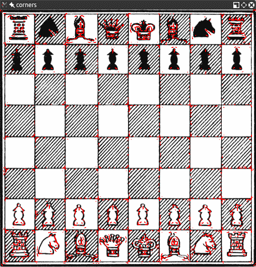

大！ 几乎所有检测到的角都标记为红色。 标记的点几乎包括棋盘正方形的所有角。

如果在`cv2.cornerHarris`中调整第二个参数，我们将看到较小的区域（对于较小的参数值）或较大的区域（对于较大的参数值）将被检测为角点。 此参数称为块大小。

# 检测 DoG 特征并提取 SIFT 描述符

先前使用`cv2.cornerHarris`的技术非常适合检测角点，并且由于角点就是角点而具有明显的优势。 即使旋转图像，也会检测到它们。 但是，如果我们将图像缩放为较小或较大的尺寸，则图像的某些部分可能会丢失甚至获得角点质量。

例如，在 F1 意大利大奖赛赛道图像中查看以下角点检测：

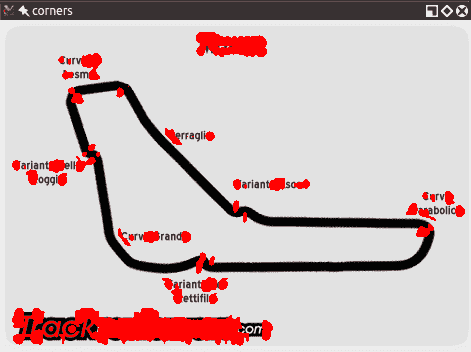

以下是使用同一图像的较小版本的角点检测结果：

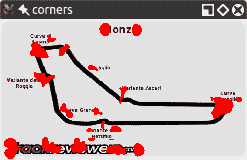

您会注意到角落更加凝结了。 但是，即使我们获得了一些优势，我们也失去了一些优势！ 特别是，让我们研究一下**瓦里安特·阿斯卡里**弯锥，它看起来像是从西北向东南一直延伸的那部分赛道尽头的弯弯曲曲。 在较大的图像版本中，双折弯的入口和顶点均被检测为角。 在较小的图像中，无法像这样检测到顶点。 如果我们进一步缩小图像，从某种程度上说，我们也将失去通往那个弯道的入口。

功能的丧失引发了一个问题。 我们需要一种无论图像大小如何都可以工作的算法。 输入**比例不变特征变换**（**SIFT**）。 尽管这个名称听起来有些神秘，但现在我们知道我们要解决的问题，这实际上是有道理的。 我们需要一个函数（一个变换）来检测特征（一个特征变换），并且不会根据图像的缩放比例输出不同的结果（缩放不变的特征变换）。 请注意，SIFT 不会检测关键点（这是通过**高斯差异**（**DoG** 来完成的）；而是通过特征向量描述了围绕它们的区域。

对 DoG 的快速介绍是有序的。 之前，在第 3 章“使用 OpenCV 处理图像”中，我们讨论了低通过滤器和模糊操作，特别是`cv2.GaussianBlur()`函数。 DoG 是对同一图像应用不同的高斯过滤器的结果。 以前，我们将这种类型的技术应用于边缘检测，这里的想法是相同的。 DoG 操作的最终结果包含兴趣区域（关键点），然后将通过 SIFT 描述这些区域。

让我们看看下图中的 DoG 和 SIFT 的行为，图中充满了角落和特征：

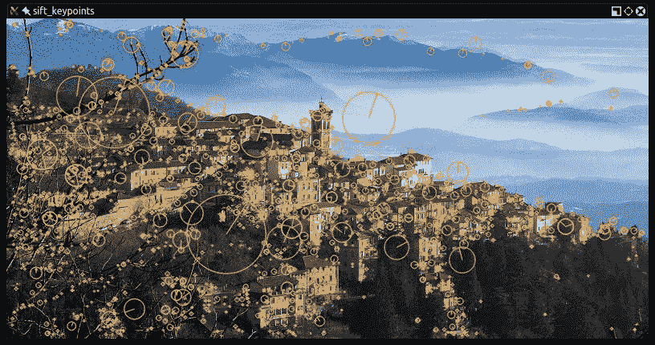

在这里，瓦雷泽（Varese）的美丽全景（位于意大利伦巴第）作为计算机视觉的主题而声名 new 起。 这是生成此已处理图像的代码：

```py
import cv2

img = cv2.imread('img/varese.jpg')
gray = cv2.cvtColor(img, cv2.COLOR_BGR2GRAY)

sift = cv2.xfeatures2d.SIFT_create()
keypoints, descriptors = sift.detectAndCompute(gray, None)

cv2.drawKeypoints(img, keypoints, img, (51, 163, 236),
                  cv2.DRAW_MATCHES_FLAGS_DRAW_RICH_KEYPOINTS)

cv2.imshow('sift_keypoints', img)
cv2.waitKey()
```

在常规导入后，我们加载要处理的图像。 然后，我们将图像转换为灰度。 到目前为止，您可能已经收集到 OpenCV 中的许多方法都希望将灰度图像作为输入。 下一步是创建 SIFT 检测对象并计算灰度图像的特征和描述符：

```py
sift = cv2.xfeatures2d.SIFT_create()
keypoints, descriptors = sift.detectAndCompute(gray, None)
```

在幕后，这些简单的代码行执行了一个复杂的过程。 我们创建一个`cv2.SIFT`对象，该对象使用 DoG 来检测关键点，然后为每个关键点的周围区域计算特征向量。 就像`detectAndCompute`方法的名称清楚地表明的那样，执行了两个主要操作：特征检测和描述符的计算。 该操作的返回值是一个元组，其中包含一个关键点列表和另一个关键点描述符的列表。

最后，我们通过使用`cv2.drawKeypoints`函数在其上绘制关键点，然后使用常规的`cv2.imshow`函数来显示该图像来处理该图像。 作为其参数之一，`cv2.drawKeypoints`函数接受一个标志，该标志指定我们想要的可视化类型。 在这里，我们指定`cv2.DRAW_MATCHES_FLAGS_DRAW_RICH_KEYPOINT`以绘制每个关键点的比例和方向的可视化。

# 关键点剖析

每个关键点都是`cv2.KeyPoint`类的实例，该类具有以下属性：

*   `pt`（点）属性包含图像中关键点的`x`和`y`坐标。
*   `size`属性指示特征的直径。
*   `angle`属性指示特征的方向，如先前处理的图像中的径向线所示。
*   `response`属性指示关键点的强度。 SIFT 将某些功能归类为比其他功能更强，并且`response`是您要检查以评估功能强度的属性。
*   `octave`属性指示图像金字塔中找到特征的层。 让我们简要回顾一下图像金字塔的概念，我们在“概念化 Haar 级联”部分的第 5 章，“检测和识别人脸”中进行了讨论。 SIFT 算法以与人脸检测算法相似的方式运行，因为它迭代地处理相同的图像，但是在每次迭代时都会更改输入。 特别地，图像的比例尺是在算法的每次迭代（`octave`）时都会变化的参数。 因此，`octave`属性与检测到关键点的图像比例有关。
*   最后，`class_id`属性可用于将自定义标识符分配给一个关键点或一组关键点。

# 检测快速 Hessian 特征并提取 SURF 描述符

计算机视觉是计算机科学中一个相对较年轻的分支，因此许多著名的算法和技术只是最近才发明的。 实际上，SIFT 才 21 岁，由 David Lowe 于 1999 年出版。

SURF 是一种特征检测算法，由 Herbert Bay 于 2006 年发布。 SURF 比 SIFT 快几倍，并且部分受其启发。

请注意，SIFT 和 SURF 都是专利算法，因此，仅在使用`OPENCV_ENABLE_NONFREE` CMake 标志的`opencv_contrib`构建中可用。

理解 SURF 是如何在后台运行的，与本书没有特别的关系，因为我们可以在应用中使用它并充分利用它。 重要的是要理解的是`cv2.SURF`是一个 OpenCV 类，它使用 Fast Hessian 算法执行关键点检测并使用 SURF 执行描述符提取，就像`cv2.SIFT`类使用 DoG 执行关键点检测并使用 SIFT 执行描述符提取。

同样，好消息是 OpenCV 为其所有受支持的特征检测和描述符提取算法提供了标准化的 API。 因此，仅需很小的更改，我们就可以使我们先前的代码示例适应于使用 SURF 而不是 SIFT。 这是修改后的代码，其中的更改以粗体显示：

```py
import cv2

img = cv2.imread('img/varese.jpg')
gray = cv2.cvtColor(img, cv2.COLOR_BGR2GRAY)

surf = cv2.xfeatures2d.SURF_create(8000)
keypoints, descriptor = surf.detectAndCompute(gray, None)

cv2.drawKeypoints(img, keypoints, img, (51, 163, 236),
                  cv2.DRAW_MATCHES_FLAGS_DRAW_RICH_KEYPOINTS)

cv2.imshow('surf_keypoints', img)
cv2.waitKey()
```

`cv2.xfeatures2d.SURF_create`的参数是 Fast Hessian 算法的阈值。 通过增加阈值，我们可以减少将保留的功能数量。 阈值为`8000`，我们得到以下结果：

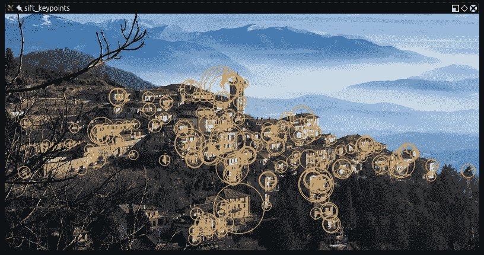

尝试调整阈值以查看其如何影响结果。 作为练习，您可能希望使用控制阈值的滑块构建 GUI 应用。 这样，用户可以调整阈值并查看特征数量以反比例的方式增加和减少。 我们在第 4 章，“深度估计和分段”中使用滑块构建了 GUI 应用，在“使用普通摄像机的深度估计”中，因此您可能需要回到并参考该部分作为指导。

接下来，我们将检查 FAST 角点检测器，BRIEF 关键点描述符和 ORB（将 FAST 和 BRIEF 一起使用）。

# 将 ORB 与 FAST 特征和 BRIEF 描述符一起使用

如果 SIFT 年龄较小，而 SURF 年龄较小，则 ORB 处于婴儿期。 ORB 于 2011 年首次发布，是 SIFT 和 SURF 的快速替代方案。

该算法已发表在论文《ORB：SIFT 或 SURF 的有效替代品》中，可通过 PDF 格式在[这个页面](http://www.willowgarage.com/sites/default/files/orb_final.pdf)中找到。

ORB 混合了 FAST 关键点检测器和 BRIEF 关键点描述符中使用的技术，因此值得快速了解 FAST 和 BRIEF。 然后，我们将讨论暴力匹配-一种用于特征匹配的算法-并查看特征匹配的示例。

# FAST

**来自加速段测试的特征**（**FAST**）算法通过分析 16 个像素的圆形邻域来工作。 它将邻近区域中的每个像素标记为比特定阈值更亮或更暗，该特定阈值是相对于圆心定义的。 如果邻域包含多个标记为亮或暗的连续像素，则认为该邻域是一个角。

FAST 还使用高速测试，有时仅检查 2 或 4 个像素（而不是 16 个像素）就可以确定邻域不是角点。要了解该测试的工作原理，请看下面的图表 OpenCV 文档：


在这里，我们可以看到两个不同放大倍数的 16 像素邻域。 位置 1、5、9 和 13 处的像素对应于圆形邻域边缘处的四个基点。 如果邻域是一个角，我们希望在这四个像素中，三个*或*恰好一个比阈值亮。 （另一种说法是，正好一个*或*正好三个都比阈值暗。）如果正好两个都比阈值亮，那么我们有一个边缘，而不是一个角。 如果其中恰好有四个或恰好零个比阈值亮，那么我们有一个相对统一的邻域，既不是角点也不是边缘。

FAST 是一种聪明的算法，但并非没有缺点，为了弥补这些缺点，分析图像的开发人员可以实现机器学习方法，以便将一组图像（与给定应用相关）馈送到算法中，以便优化类似阈值的参数。 无论开发人员直接指定参数还是为机器学习方法提供训练集，FAST 都是一种对开发人员的输入敏感的算法，可能比 SIFT 更为敏感。

# BRIEF

另一方面，**二进制鲁棒独立基本特征**（**BRIEF**）不是特征检测算法，而是描述符。 让我们更深入地了解描述符是什么的概念，然后看一下 BRIEF。

当我们先前使用 SIFT 和 SURF 分析图像时，整个过程的核心是对`detectAndCompute`函数的调用。 该函数执行两个不同的步骤-检测和计算-并且它们返回两个不同的结果，并以元组为单位。

检测的结果是一组关键点。 计算的结果是这些关键点的一组描述符。 这意味着 OpenCV 的`cv2.SIFT`和`cv2.SURF`类实现用于检测和描述的算法。 但是请记住，原始的 SIFT 和 SURF 不是特征检测算法。 OpenCV 的`cv2.SIFT`实现了 DoG 特征检测和 SIFT 描述，而 OpenCV 的`cv2.SURF`实现了快速黑森特征检测和 SURF 描述。

关键点描述符是图像的表示形式，可以用作特征匹配的网关，因为您可以比较两个图像的关键点描述符并找到共同点。

BRIEF 是当前可用的最快的描述符之一。 BRIEF 背后的理论非常复杂，但可以说 BRIEF 采用了一系列优化，使其成为特征匹配的很好选择。

# 暴力匹配

暴力匹配器是描述符匹配器，它比较两组关键点描述符并生成结果，该结果是匹配项列表。 之所以称为暴力是因为该算法几乎没有优化。 对于第一组中的每个关键点描述符，匹配器将与第二组中的每个关键点描述符进行比较。 每次比较都会产生一个距离值，并且可以根据最小距离选择最佳匹配。

更一般而言，在计算中，术语**暴力**与优先使用所有可能组合（例如，所有可能的字符组合以破解已知长度的密码）的方法相关联。 相反，优先考虑速度的算法可能会跳过某些可能性，并尝试采用一条捷径来解决似乎最合理的解决方案。

OpenCV 提供了`cv2.BFMatcher`类，该类支持多种用于暴力特征匹配的方法。

# 在两个图像中匹配徽标

现在我们对 FAST 和 BRIEF 有了一个大致的了解，我们可以理解为什么 ORB 背后的团队（由 Ethan Rublee，Vincent Rabaud，Kurt Konolige 和 Gary R. Bradski 组成）选择这两种算法作为 ORB 的基础。

在他们的论文中，作者旨在实现以下结果：

*   在 FAST 中添加了快速准确的定位组件
*   定向 BRIEF 特征的有效计算
*   定向 BRIEF 特征的方差和相关性分析
*   一种在旋转不变性下解相关简短特征的学习方法，从而在最近邻应用中获得更好的性能

要点很明确：ORB 旨在优化和加速操作，包括非常重要的步骤，即以旋转感知的方式使用 BRIEF，以便即使在训练图像与旋转图像有很大不同的情况下，也可以改善匹配度。 查询图片。

不过，在这个阶段，也许您已经掌握了足够的理论，并且想深入了解某些特征匹配，所以让我们看一些代码。 以下脚本尝试将徽标中的功能与包含徽标的照片中的功能进行匹配：

```py
import cv2
from matplotlib import pyplot as plt

# Load the images.
img0 = cv2.imread('img/nasa_logo.png',
                  cv2.IMREAD_GRAYSCALE)
img1 = cv2.imread('img/kennedy_space_center.jpg',
                  cv2.IMREAD_GRAYSCALE)

# Perform ORB feature detection and description.
orb = cv2.ORB_create()
kp0, des0 = orb.detectAndCompute(img0, None)
kp1, des1 = orb.detectAndCompute(img1, None)

# Perform brute-force matching.
bf = cv2.BFMatcher(cv2.NORM_HAMMING, crossCheck=True)
matches = bf.match(des0, des1)

# Sort the matches by distance.
matches = sorted(matches, key=lambda x:x.distance)

# Draw the best 25 matches.
img_matches = cv2.drawMatches(
    img0, kp0, img1, kp1, matches[:25], img1,
    flags=cv2.DRAW_MATCHES_FLAGS_NOT_DRAW_SINGLE_POINTS)

# Show the matches.
plt.imshow(img_matches)
plt.show()
```

让我们逐步检查该代码。 常规导入后，我们以灰度格式加载两个图像（查询图像和场景）。 这是查询图像，它是 NASA 徽标：


这是肯尼迪航天中心的现场照片：


现在，我们继续创建 ORB 特征检测器和描述符：

```py
# Perform ORB feature detection and description.
orb = cv2.ORB_create()
kp0, des0 = orb.detectAndCompute(img0, None)
kp1, des1 = orb.detectAndCompute(img1, None)
```

以与 SIFT 和 SURF 相似的方式，我们检测并计算两个图像的关键点和描述符。

从这里开始，概念非常简单：遍历描述符并确定它们是否匹配，然后计算该匹配的质量（距离）并对匹配进行排序，以便我们可以显示顶部的`n`确实可以匹配两个图像上的特征，因此具有一定的可信度。 `cv2.BFMatcher`为我们做到这一点：

```py
# Perform brute-force matching.
bf = cv2.BFMatcher(cv2.NORM_HAMMING, crossCheck=True)
matches = bf.match(des0, des1)

# Sort the matches by distance.
matches = sorted(matches, key=lambda x:x.distance)
```

在这个阶段，我们已经拥有了所需的所有信息，但是作为计算机视觉爱好者，我们非常重视视觉表示数据，因此让我们在`matplotlib`图表中绘制这些匹配项：

```py
# Draw the best 25 matches.
img_matches = cv2.drawMatches(
    img0, kp0, img1, kp1, matches[:25], img1,
    flags=cv2.DRAW_MATCHES_FLAGS_NOT_DRAW_SINGLE_POINTS)

# Show the matches.
plt.imshow(img_matches)
plt.show()
```

Python 的切片语法非常强大。 如果`matches`列表包含少于 25 个条目，则`matches[:25]`切片命令将毫无问题地运行，并为我们提供一个包含与原始元素一样多的元素的列表。

结果如下：

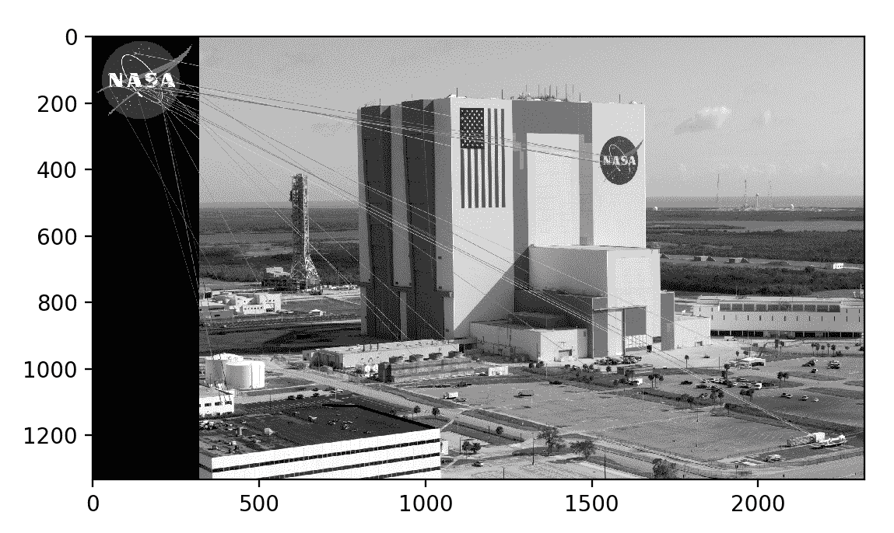

您可能会认为这是令人失望的结果。 确实，我们可以看到大多数匹配项都是错误的匹配项。 不幸的是，这是很典型的。 为了改善结果，我们需要应用其他技术来滤除不良匹配。 接下来，我们将注意力转移到此任务上。

# 使用 K 最近邻和比率测试过滤匹配

想象一下，一大批著名的哲学家要您对有关生命，宇宙和一切至关重要的问题进行辩论。 您在每个哲学家轮流讲话时会仔细听。 最后，当所有哲学家用尽了所有论点之后，您便会回顾自己的笔记并意识到以下两点：

*   每个哲学家都不同意
*   没有一个哲​​学家比其他哲学家更具说服力

从您的第一个观察中，您可以推断出*最多一个哲学家是正确的*； 但是，所有哲学家都有可能犯错。 然后，从第二个观察中，您开始担心自己有可能选择错误的哲学家，即使其中一位哲学家是正确的。 不管您怎么看，这些人都让您陷入僵局。 您称其为平局，说辩论中最重要的问题仍未解决。

我们可以将判断哲学家辩论的假想问题与排除不良关键点匹配的实际问题进行比较。

首先，我们假设查询图像中的每个关键点在场景中最多只有一个正确的匹配项。 暗示地，如果我们的查询图像是 NASA 徽标，则我们假设另一幅图像-场景-最多包含一个 NASA 徽标。 假设查询关键点最多只有一个正确或良好的匹配项，所以当我们考虑所有*可能的*匹配项时，我们主要观察到错误的匹配项。 因此，暴力匹配器会为每个可能的匹配计算一个距离得分，可以使我们对不良匹配的距离得分有很多观察。 我们期望良好的比赛比许多不良的比赛具有更好的（较低）距离得分，因此不良比赛的得分可以帮助我们选择良好比赛的门槛。 这样的阈值不一定能在不同的查询关键点或不同的场景之间很好地概括，但至少在个案的基础上可以帮助我们。

现在，让我们考虑一种改进的暴力匹配算法的实现，该算法以我们描述的方式自适应地选择距离阈值。 在上一节的代码示例中，我们使用`cv2.BFMatcher`类的`match`方法来获取包含每个查询关键点的单个最佳（最小距离）匹配的列表。 这样，我们就丢弃了所有可能更差的比赛的距离得分的信息，这是我们采用自适应方法所需的信息。 幸运的是，`cv2.BFMatcher`还提供了`knnMatch`方法，该方法接受参数`k`，该参数指定我们要为每个查询关键点保留的最佳（最小距离）匹配的最大数目。 （在某些情况下，我们得到的匹配数可能少于最大值）。**KNN** 代表 **K 最近邻**。

我们将使用`knnMatch`方法为每个查询关键点请求两个最佳匹配的列表。 基于我们的假设，即每个查询关键点最多具有一个正确的匹配项，因此我们确信第二好的匹配项是错误的。 我们将次优匹配的距离得分乘以小于 1 的值以获得阈值。

然后，仅当其远处分数小于阈值时，我们才将最佳匹配视为良好匹配。 这种方法称为**比率测试**，最早由 SIFT 算法的作者 David Lowe 提出。 他在论文《比例不变关键点中的独特图像特征》中描述了比率测试，可从[这个页面](https://www.cs.ubc.ca/~lowe/papers/ijcv04.pdf)。 具体来说，在“对象识别”的应用部分中，他指出：

“匹配正确的可能性可以通过计算从最近邻到第二次邻居的距离之比来确定。”

我们可以像上一节代码示例中一样的方式加载图像，检测关键点并计算 ORB 描述符。 然后，我们可以使用以下两行代码执行暴力 KNN 匹配：

```py
# Perform brute-force KNN matching.
bf = cv2.BFMatcher(cv2.NORM_HAMMING, crossCheck=False)
pairs_of_matches = bf.knnMatch(des0, des1, k=2)
```

`knnMatch`返回列表列表； 每个内部列表至少包含一个匹配项，并且不超过`k`个匹配项，从最佳（最短距离）到最差排序。 以下代码行根据最佳匹配的距离得分对外部列表进行排序：

```py
# Sort the pairs of matches by distance.
pairs_of_matches = sorted(pairs_of_matches, key=lambda x:x[0].distance)
```

让我们画出前 25 个最佳比赛，以及`knnMatch`可能与之配对的次佳比赛。 我们无法使用`cv2.drawMatches`函数，因为它仅接受一维匹配项列表； 相反，我们必须使用`cv2.drawMatchesKnn`。 以下代码用于选择，绘制和显示匹配项：

```py
# Draw the 25 best pairs of matches.
img_pairs_of_matches = cv2.drawMatchesKnn(
    img0, kp0, img1, kp1, pairs_of_matches[:25], img1,
    flags=cv2.DRAW_MATCHES_FLAGS_NOT_DRAW_SINGLE_POINTS)

# Show the pairs of matches.
plt.imshow(img_pairs_of_matches)
plt.show()
```

到目前为止，我们还没有过滤掉任何不正确的比赛-实际上，我们故意包括了第二好的比赛，我们认为这是糟糕的-因此结果看起来很混乱。 这里是：

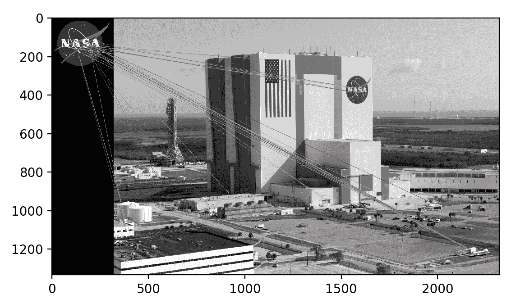

现在，让我们应用比率测试。 我们将阈值设置为第二好的比赛的距离得分的 0.8 倍。 如果`knnMatch`无法提供次佳的比赛，我们仍然会拒绝最佳比赛，因为我们无法应用测试。 以下代码适用于这些条件，并为我们提供了通过测试的最佳匹配项列表：

```py
# Apply the ratio test.
matches = [x[0] for x in pairs_of_matches
           if len(x) > 1 and x[0].distance < 0.8 * x[1].distance]
```

应用了比率测试之后，现在我们仅处理最佳匹配（而不是最佳匹配和次佳匹配对），因此我们可以使用`cv2.drawMatches`而不是`cv2.drawMatchesKnn`来绘制它们。 同样，我们将从列表中选择前 25 个匹配项。 以下代码用于选择，绘制和显示匹配项：

```py
# Draw the best 25 matches.
img_matches = cv2.drawMatches(
    img0, kp0, img1, kp1, matches[:25], img1,
    flags=cv2.DRAW_MATCHES_FLAGS_NOT_DRAW_SINGLE_POINTS)

# Show the matches.
plt.imshow(img_matches)
plt.show()
```

在这里，我们可以看到通过比率测试的匹配项：

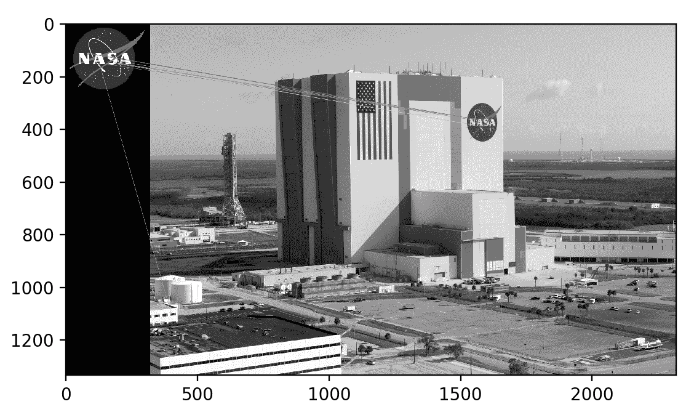

将输出图像与上一节中的图像进行比较，我们可以看到 KNN 和比率测试使我们能够过滤掉许多不良匹配项。 其余比赛并不完美，但几乎所有比赛都指向正确的区域-肯尼迪航天中心侧面的 NASA 徽标。

我们已经有了良好的开端。 接下来，我们将使用名为 **FLANN** 的更快的匹配器替换暴力匹配器。 之后，我们将学习如何用单应性来描述一组匹配项-即二维变换矩阵，该矩阵表示匹配对象的位置，旋转，比例和其他几何特征。

# 使用 FLANN 的匹配

**FLANN** 代表**用于近似最近邻的快速库**。 根据许可的 2 条款 BSD 许可，这是一个开源库。 FLANN 的官方互联网主页是[这个页面](http://www.cs.ubc.ca/research/flann/)。 以下是该网站的报价：

“FLANN 是一个用于在高维空间中执行快速近似最近邻搜索的库。它包含我们发现最适合最近邻搜索的算法集合，以及一个根据数据集自动选择最佳算法和最佳参数的系统
FLANN 用 C++ 编写，并且包含以下语言的绑定：C，MATLAB 和 Python。”

换句话说，FLANN 有一个很大的工具箱，它知道如何为工作选择正确的工具，并且会说几种语言。 这些功能使资料库快速便捷。 实际上，FLANN 的作者声称，对于许多数据集而言，它比其他最近邻搜索软件快 10 倍。

作为独立的库，可以在 [GitHub](https://github.com/mariusmuja/flann/) 上找到 FLANN。 但是，我们将 FLANN 用作 OpenCV 的一部分，因为 OpenCV 为此提供了一个方便的包装器。

为了开始我们的 FLANN 匹配的实际示例，让我们导入 NumPy，OpenCV 和 Matplotlib，并从文件中加载两个图像。 以下是相关代码：

```py
import numpy as np
import cv2
from matplotlib import pyplot as plt

img0 = cv2.imread('img/gauguin_entre_les_lys.jpg',
                  cv2.IMREAD_GRAYSCALE)
img1 = cv2.imread('img/gauguin_paintings.png',
                  cv2.IMREAD_GRAYSCALE)
```

这是我们的脚本正在加载的第一张图像-查询图像：

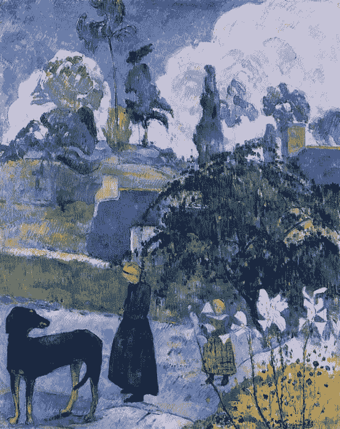

此艺术品是保罗·高更（Paul Gauguin）在 1889 年绘制的《Entre les lys》（在百合花中）。我们将在包含高更的多幅作品的较大图像中搜索匹配的关键点， 本书的一位作者绘制的一些杂乱无章的形状。 这是更大的图像：


在较大的图像中，《Entre les lys》出现在第三列第三行中。 查询图像和较大图像的对应区域不相同； 他们以略微不同的颜色和不同的比例描绘了《Entre les lys》。 但是，对于我们的匹配器来说，这应该是一个简单的例子。

让我们检测必要的关键点并使用`cv2.SIFT`类提取功能：

```py
# Perform SIFT feature detection and description.
sift = cv2.xfeatures2d.SIFT_create()
kp0, des0 = sift.detectAndCompute(img0, None)
kp1, des1 = sift.detectAndCompute(img1, None)
```

到目前为止，该代码应该看起来很熟悉，因为我们已经在本章的几个部分中专门介绍了 SIFT 和其他描述符。 在前面的示例中，我们将描述符提供给`cv2.BFMatcher`以进行暴力匹配。 这次，我们将改为使用`cv2.FlannBasedMatcher`。 以下代码使用自定义参数执行基于 FLANN 的匹配：

```py
# Define FLANN-based matching parameters.
FLANN_INDEX_KDTREE = 1
index_params = dict(algorithm=FLANN_INDEX_KDTREE, trees=5)
search_params = dict(checks=50)

# Perform FLANN-based matching.
flann = cv2.FlannBasedMatcher(index_params, search_params)
matches = flann.knnMatch(des0, des1, k=2)
```

在这里，我们可以看到 FLANN 匹配器采用两个参数：`indexParams`对象和`searchParams`对象。 这些参数在 Python 中以字典的形式（在 C++ 中以结构的形式）传递，确定了索引的行为以及搜索对象，FLANN 在内部使用这些对象来计算匹配项。 我们选择的参数在精度和处理速度之间取得合理的平衡。 具体来说，我们使用**核密度树**（**kd-tree**）索引算法，其中有五棵树，FLANN 可以并行处理。 （FLANN 文档建议在一棵不提供并行性的树和 16 棵树之间（如果系统可以利用它，则可以提供高度的并行性）。）

我们正在对每棵树执行 50 次检查或遍历。 数量更多的支票可以提供更高的准确率，但计算成本更高。

在执行基于 FLANN 的匹配后，我们使用系数为 0.7 的 Lowe 比率测试。 为了演示不同的编码风格，我们将使用比率测试的结果与上一节代码示例中的结果稍有不同。 以前，我们组装了一个仅包含良好匹配项的新列表。 这次，我们将组装一个名为`mask_matches`的列表，其中每个元素都是长度为`k`的子列表（与传递给`knnMatch`的`k`相同）。 如果匹配良好，则将子列表的相应元素设置为`1`； 否则，我们将其设置为`0`。

例如，如果我们有`mask_matches = [[0, 0], [1, 0]]`，则意味着我们有两个匹配的关键点； 对于第一个关键点，最佳匹配和次佳匹配都不好，而对于第二个关键点，最佳匹配很好，但次佳匹配不好。 记住，我们假设所有次佳的比赛都是不好的。 我们使用以下代码进行比率测试并构建遮罩：

```py
# Prepare an empty mask to draw good matches.
mask_matches = [[0, 0] for i in range(len(matches))]

# Populate the mask based on David G. Lowe's ratio test.
for i, (m, n) in enumerate(matches):
    if m.distance < 0.7 * n.distance:
        mask_matches[i]=[1, 0]
```

现在，是时候绘制并显示良好的匹配。 我们可以将`mask_matches`列表作为可选参数传递给`cv2.drawMatchesKnn`，如以下代码段中的粗体所示：

```py
# Draw the matches that passed the ratio test.
img_matches = cv2.drawMatchesKnn(
    img0, kp0, img1, kp1, matches, None,
    matchColor=(0, 255, 0), singlePointColor=(255, 0, 0),
    matchesMask=mask_matches, flags=0)

# Show the matches.
plt.imshow(img_matches)
plt.show()
```

`cv2.drawMatchesKnn`仅在遮罩中绘制我们标记为良好的匹配项（值为`1`）。 让我们揭晓结果。 我们的脚本对基于 FLANN 的匹配产生以下可视化效果：

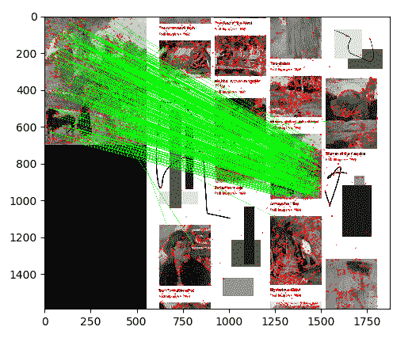

这是令人鼓舞的情况：看来几乎所有比赛都在正确的位置。 接下来，让我们尝试将这种类型的结果简化为更简洁的几何表示法-单应性法-它可以描述整个匹配对象的姿态，而不是一堆断开的匹配点的姿态。

# 通过基于 FLANN 的匹配执行单应性

首先，什么是单应性？ 让我们从互联网上阅读一个定义：

“两个图形之间的关系，使得一个图形的任意一点对应一个图形，而另一图形又对应一个图形，反之亦然。因此，在圆上滚动的切线将圆的两个固定切线切成同形的两组点。”

如果您-像本书的作者一样-不是前面定义的明智者，您可能会发现以下解释更清楚：单应性是一种条件，即当一个图是另一个图的透视变形时，两个图会互相发现 。

首先，让我们看一下我们要实现的目标，以便我们可以完全理解单应性。 然后，我们将遍历代码。

假设我们要搜索以下纹身：


尽管存在旋转差异，但作为人类，我们可以轻松地在下图中找到纹身：


作为计算机视觉中的一项练习，我们想编写一个脚本，以产生以下关键点匹配和单应性的可视化效果：

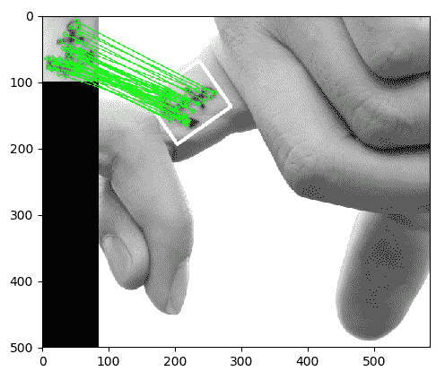

如前面的屏幕快照所示，我们在第一幅图像中拍摄了对象，在第二幅图像中正确地识别了该对象，在关键点之间绘制了匹配线，甚至绘制了一个白色边框，显示了第二幅图像中对象相对于第一张图片的视角的变形。

您可能已经正确地猜到了脚本的实现是通过导入库，读取灰度格式的图像，检测特征以及计算 SIFT 描述符开始的。 我们在前面的示例中做了所有这些操作，因此在此将其省略。 让我们看一下接下来的操作：

1.  我们通过组装通过 Lowe 比率测试的匹配项列表来进行操作，如以下代码所示：

```py
# Find all the good matches as per Lowe's ratio test.
good_matches = []
for m, n in matches:
    if m.distance < 0.7 * n.distance:
        good_matches.append(m)
```

2.  从技术上讲，我们可以通过最少四个匹配来计算单应性。 但是，如果这四个匹配项中的任何一个有缺陷，都会降低结果的准确率。 更实用的最小值是`10`。 给定额外的匹配项，单应性查找算法可以丢弃一些离群值，以产生与匹配项的实质子集非常契合的结果。 因此，我们继续检查我们是否至少有`10`个良好匹配项：

```py
MIN_NUM_GOOD_MATCHES = 10

if len(good_matches) >= MIN_NUM_GOOD_MATCHES:
```

3.  如果满足此条件，我们将查找匹配的关键点的 2D 坐标，并将这些坐标放置在两个浮点坐标对列表中。 一个列表包含查询图像中的关键点坐标，而另一个列表包含场景中匹配的关键点坐标：

```py
    src_pts = np.float32(
        [kp0[m.queryIdx].pt for m in good_matches]).reshape(-1, 1, 2)
    dst_pts = np.float32(
        [kp1[m.trainIdx].pt for m in good_matches]).reshape(-1, 1, 2)
```

4.  现在，我们找到单应性：

```py
    M, mask = cv2.findHomography(src_pts, dst_pts, cv2.RANSAC, 5.0)
    mask_matches = mask.ravel().tolist()
```

请注意，我们创建了一个`mask_matches`列表，该列表将在比赛的最终绘图中使用，以便仅在单应图中的点才会绘制出匹配线。

5.  在这一阶段，我们必须执行透视变换，该变换将查询图像的矩形角投影到场景中，以便绘制边框：

```py
    h, w = img0.shape
    src_corners = np.float32(
        [[0, 0], [0, h-1], [w-1, h-1], [w-1, 0]]).reshape(-1, 1, 2)
    dst_corners = cv2.perspectiveTransform(src_corners, M)
    dst_corners = dst_corners.astype(np.int32)

    # Draw the bounds of the matched region based on the homography.
    num_corners = len(dst_corners)
    for i in range(num_corners):
        x0, y0 = dst_corners[i][0]
        if i == num_corners - 1:
            next_i = 0
        else:
            next_i = i + 1
        x1, y1 = dst_corners[next_i][0]
        cv2.line(img1, (x0, y0), (x1, y1), 255, 3, cv2.LINE_AA)
```

然后，按照前面的示例，我们继续绘制关键点并显示可视化效果。

# 示例应用–纹身取证

让我们以一个真实的（或者也许是幻想的）例子作为本章的结尾。 假设您正在哥谭法医部门工作，并且需要识别纹身。 您拥有罪犯纹身的原始图片（也许是在闭路电视录像中捕获的），但您不知道该人的身份。 但是，您拥有一个纹身数据库，该数据库以纹身所属的人的名字为索引。

让我们将此任务分为两个部分：

*   通过将图像描述符保存到文件来构建数据库
*   加载数据库并扫描查询图像的描述符和数据库中的描述符之间的匹配项

我们将在接下来的两个小节中介绍这些任务。

# 将图像描述符保存到文件

我们要做的第一件事是将图像描述符保存到外部文件中。 这样，我们不必每次想要扫描两个图像以进行匹配时都重新创建描述符。

就我们的示例而言，让我们扫描文件夹中的图像并创建相应的描述符文件，以便我们可以随时使用它们以供将来搜索。 为了创建描述符，我们将使用本章已经使用过多次的过程：即加载图像，创建特征检测器，检测特征并计算描述符。 要将描述符保存到文件中，我们将使用方便的 NumPy 数组方法`save`，该方法以优化的方式将数组数据转储到文件中。

Python 标准库中的`pickle`模块提供了更多通用的序列化功能，该功能支持任何 Python 对象，而不仅仅是 NumPy 数组。 但是，NumPy 的数组序列化是数字数据的不错选择。

让我们将脚本分解为功能。 主要功能将命名为`create_descriptors`（复数，描述符），它将遍历给定文件夹中的文件。 对于每个文件，`create_descriptors`将调用一个名为`create_descriptor`的帮助器函数（单数，描述符），该函数将为给定的图像文件计算并保存我们的描述符。 让我们开始吧：

1.  首先，这是`create_descriptors`的实现：

```py
import os

import numpy as np
import cv2

def create_descriptors(folder):
    feature_detector = cv2.xfeatures2d.SIFT_create()
    files = []
    for (dirpath, dirnames, filenames) in os.walk(folder):
        files.extend(filenames)
    for f in files:
        create_descriptor(folder, f, feature_detector)
```

请注意，`create_descriptors`创建了特征检测器，因为我们只需要执行一次，而不是每次加载文件时都执行一次。 辅助函数`create_descriptor`接收特征检测器作为参数。

2.  现在，让我们看一下后一个函数的实现：

```py
def create_descriptor(folder, image_path, feature_detector):
    if not image_path.endswith('png'):
        print('skipping %s' % image_path)
        return
    print('reading %s' % image_path)
    img = cv2.imread(os.path.join(folder, image_path),
                     cv2.IMREAD_GRAYSCALE)
    keypoints, descriptors = feature_detector.detectAndCompute(
        img, None)
    descriptor_file = image_path.replace('png', 'npy')
    np.save(os.path.join(folder, descriptor_file), descriptors)
```

请注意，我们将描述符文件与图像保存在同一文件夹中。 此外，我们假设图像文件具有`png`扩展名。 为了使脚本更加鲁棒，可以对其进行修改，使其支持其他图像文件扩展名，例如`jpg`。 如果文件具有意外扩展名，我们将其跳过，因为它可能是描述符文件（来自脚本的先前运行）或其他一些非映像文件。

3.  我们已经完成了功能。 为了完成脚本，我们将使用文件夹名称作为参数来调用`create_descriptors`：

```py
folder = 'tattoos'
create_descriptors(folder)
```

当我们运行此脚本时，它将以 NumPy 的数组文件格式生成必要的描述符文件，文件扩展名为`npy`。 这些文件构成我们的纹身描述符数据库，按名称索引。 （每个文件名都是一个人的名字。）接下来，我们将编写一个单独的脚本，以便可以对该数据库运行查询。

# 扫描描述符

现在，我们已将描述符保存到文件中，我们只需要对每组描述符进行匹配，以确定哪一组与我们的查询图像最匹配。

这是我们将执行的过程：

1.  加载查询图像（`query.png`）。
2.  扫描包含描述符文件的文件夹。 打印描述符文件的名称。
3.  为查询图像创建 SIFT 描述符。
4.  对于每个描述符文件，加载 SIFT 描述符并查找基于 FLANN 的匹配项。 根据比率测试过滤匹配项。 打印此人的姓名和匹配数。 如果匹配数超过任意阈值，请打印此人是可疑人员。 （请记住，我们正在调查犯罪。）
5.  打印主要嫌疑人的名字（匹配次数最多的人）。

让我们考虑一下实现：

1.  首先，以下代码块加载查询图像：

```py
import os

import numpy as np
import cv2

# Read the query image.
folder = 'tattoos'
query = cv2.imread(os.path.join(folder, 'query.png'),
                   cv2.IMREAD_GRAYSCALE)

```

2.  我们继续组装并打印描述符文件列表：

```py
# create files, images, descriptors globals
files = []
images = []
descriptors = []
for (dirpath, dirnames, filenames) in os.walk(folder):
    files.extend(filenames)
    for f in files:
        if f.endswith('npy') and f != 'query.npy':
            descriptors.append(f)
print(descriptors)
```

3.  我们设置了典型的`cv2.SIFT`和`cv2.FlannBasedMatcher`对象，并生成了查询图像的描述符：

```py
# Create the SIFT detector.
sift = cv2.xfeatures2d.SIFT_create()

# Perform SIFT feature detection and description on the
# query image.
query_kp, query_ds = sift.detectAndCompute(query, None)

# Define FLANN-based matching parameters.
FLANN_INDEX_KDTREE = 1
index_params = dict(algorithm=FLANN_INDEX_KDTREE, trees=5)
search_params = dict(checks=50)

# Create the FLANN matcher.
flann = cv2.FlannBasedMatcher(index_params, search_params)
```

4.  现在，我们搜索嫌疑犯，我们将其定义为查询纹身至少具有 10 个良好匹配项的人。 我们的搜索需要遍历描述符文件，加载描述符，执行基于 FLANN 的匹配以及根据比率测试过滤匹配。 我们为每个人（每个描述符文件）打印结果：

```py
# Define the minimum number of good matches for a suspect.
MIN_NUM_GOOD_MATCHES = 10

greatest_num_good_matches = 0
prime_suspect = None

print('>> Initiating picture scan...')
for d in descriptors:
    print('--------- analyzing %s for matches ------------' % d)
    matches = flann.knnMatch(
        query_ds, np.load(os.path.join(folder, d)), k=2)
    good_matches = []
    for m, n in matches:
        if m.distance < 0.7 * n.distance:
            good_matches.append(m)
    num_good_matches = len(good_matches)
    name = d.replace('.npy', '').upper()
    if num_good_matches >= MIN_NUM_GOOD_MATCHES:
        print('%s is a suspect! (%d matches)' % \
            (name, num_good_matches))
        if num_good_matches > greatest_num_good_matches:
            greatest_num_good_matches = num_good_matches
            prime_suspect = name
    else:
        print('%s is NOT a suspect. (%d matches)' % \
            (name, num_good_matches))
```

请注意`np.load`方法的使用，该方法会将指定的`NPY`文件加载到 NumPy 数组中。

5.  最后，我们打印主要嫌疑人的姓名（如果找到嫌疑人，则为）：

```py
if prime_suspect is not None:
    print('Prime suspect is %s.' % prime_suspect)
else:
    print('There is no suspect.')
```

运行前面的脚本将产生以下输出：

```py
>> Initiating picture scan...
--------- analyzing anchor-woman.npy for matches ------------
ANCHOR-WOMAN is NOT a suspect. (2 matches)
--------- analyzing anchor-man.npy for matches ------------
ANCHOR-MAN is a suspect! (44 matches)
--------- analyzing lady-featherly.npy for matches ------------
LADY-FEATHERLY is NOT a suspect. (2 matches)
--------- analyzing steel-arm.npy for matches ------------
STEEL-ARM is NOT a suspect. (0 matches)
--------- analyzing circus-woman.npy for matches ------------
CIRCUS-WOMAN is NOT a suspect. (1 matches)
Prime suspect is ANCHOR-MAN.
```

如果需要，我们可以像上一节中那样以图形方式表示比赛和单应性。

# 总结

在本章中，我们学习了有关检测关键点，计算关键点描述符，匹配这些描述符，滤除不匹配项以及查找两组匹配的关键点之间的单应性的方法。 我们探索了 OpenCV 中可以用于完成这些任务的多种算法，并将这些算法应用于各种图像和用例。

如果我们将关键点的新知识与有关相机和透视图的其他知识相结合，则可以跟踪 3D 空间中的对象。 这将是第 9 章，“相机模型和增强现实”的主题。 如果您特别想达到第三个维度，则可以跳到该章。

相反，如果您认为下一步的逻辑步骤是完善对对象检测，识别和跟踪的二维解决方案的了解，则可以按顺序继续进行第 7 章，“构建自定义对象检测器”，然后是第 8 章，“跟踪对象”。 最好了解 2D 和 3D 的组合技术，以便为给定的应用选择一种提供正确的输出种类和正确的计算速度的方法。