# 建立自定义对象检测器

本章将深入研究对象检测的概念，这是计算机视觉中最常见的挑战之一。 在本书中走到这一步，您也许想知道什么时候可以在街头实践计算机视觉。 您是否梦想建立一个检测汽车和人员的系统？ 好吧，实际上，您离目标不算太远。

在前面的章节中，我们已经研究了对象检测和识别的一些特定情况。 在第 5 章和“检测和识别人脸”中，我们专注于直立的正面人脸；在第 6 章，“检索图像并使用图像描述符进行搜索”中，我们研究了具有角点或斑点状特征的物体。 现在，在本章中，我们将探索具有良好泛化或外推能力的算法，从某种意义上说，它们可以应对给定对象类别中存在的现实世界的多样性。 例如，不同的汽车具有不同的设计，并且人们可能会根据所穿的衣服而呈现出不同的形状。

具体来说，我们将追求以下目标：

*   了解另一种特征描述符：**定向梯度描述符直方图**（**HOG**）。
*   了解**非最大抑制**，也称为**非最大抑制**（**NMS**），这有助于我们从重叠的检测窗口集中选择最佳。
*   对**支持向量机**（**SVM**）有较高的了解。 这些通用分类器基于有监督的机器学习，类似于线性回归。
*   使用基于 HOG 描述符的预训练分类器检测人员。
*   训练**词袋**（**BoW**）分类器以检测汽车。 对于此示例，我们将使用图像金字塔，滑动窗口和 NMS 的自定义实现，以便我们可以更好地了解这些技术的内部工作原理。

本章中的大多数技术都不是互斥的。 相反，它们作为检测器的组件一起工作。 在本章结束时，您将知道如何训练和使用在大街上有实际应用的分类器！

# 技术要求

本章使用 Python，OpenCV 和 NumPy。 请参考第 1 章，“设置 OpenCV”，以获得安装说明。

[可在本书的 GitHub 存储库中找到本章的完整代码](https://github.com/PacktPublishing/Learning-OpenCV-4-Computer-Vision-with-Python-Third-Edition)， 在`chapter07`文件夹中。 样本图像可以在`images`文件夹的存储库中找到。

# 了解 HOG 描述符

HOG 是一种特征描述符，因此它与**尺度不变特征变换**（**SIFT**），**加速鲁棒特征**（**SURF**）和**定向 FAST 和旋转 BRIEF**（**ORB**），我们在第 6 章“检索图像和使用图像描述符进行搜索”中介绍了此方法。 像其他特征描述符一样，HOG 能够传递对于特征匹配以及对象检测和识别至关重要的信息类型。 最常见的是，HOG 用于对象检测。 Navneet Dalal 和 Bill Triggs 在他们的论文[《面向人类检测的梯度梯度直方图》](https://lear.inrialpes.fr/people/triggs/pubs/Dalal-cvpr05.pdf)（INRIA，2005）上普及了该算法，尤其是将其用作人体检测器。 

HOG 的内部机制确实很聪明； 将图像分为多个单元，并为每个单元计算一组渐变。 每个梯度描述了给定方向上像素强度的变化。 这些梯度一起形成了单元格的直方图表示。 当我们在第 5 章，“检测和识别人脸”中使用**局部二进制模式直方图**（**LBPH**）研究人脸识别时，遇到了类似的方法。

在深入探讨 HOG 的工作原理的技术细节之前，让我们先看一下 HOG 如何看待世界。

# 可视化 HOG

Carl Vondrick，Aditya Khosla，Hamed Pirsiavash，Tomasz Malisiewicz 和 Antonio Torralba 开发了一种称为 HOGgles（HOG 护目镜）的 HOG 可视化技术。 有关 HOGgles 的摘要以及代码和出版物的链接，[请参见 Carl Vondrick 的 MIT 网页](http://www.cs.columbia.edu/~vondrick/ihog/index.html)。 作为他们的测试图像之一，Vondrick 等。 使用以下卡车图片：

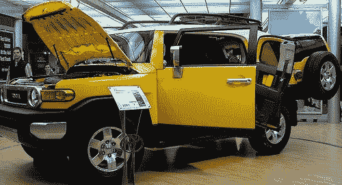

Vondrick 等。 基于 Dalal 和 Triggs 早期论文的方法，产生了 HOG 描述符的以下可视化：

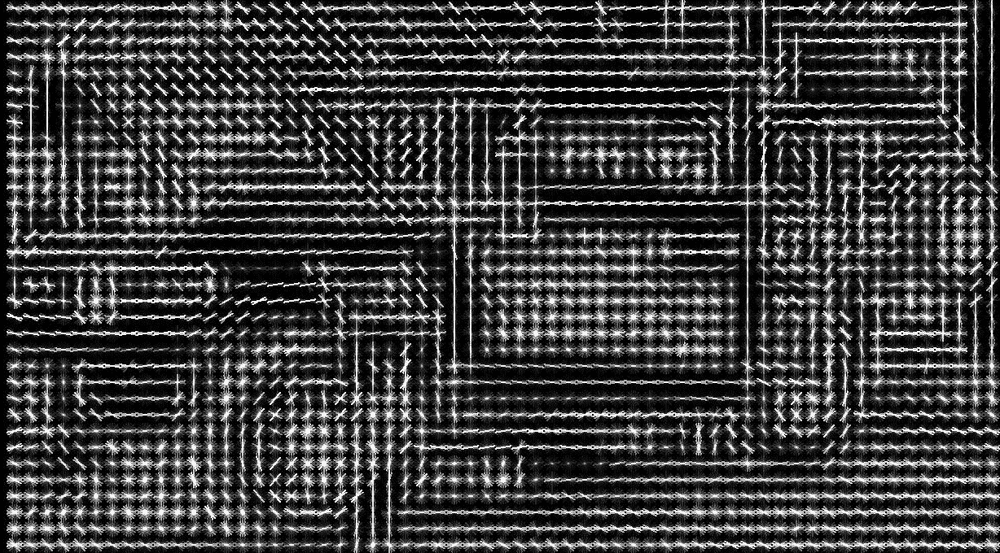

然后，应用 HOGgles，Vondrick 等。 反转特征描述算法，以按照 HOG 的角度重建卡车的图像，如下所示：

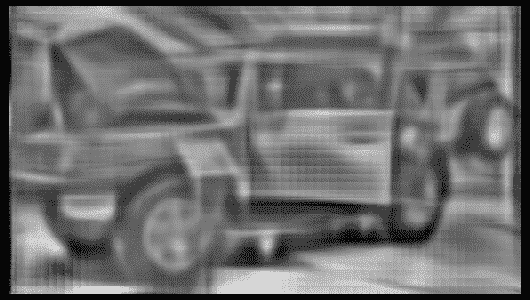

在这两种可视化中，您都可以看到 HOG 已将图像分为多个单元格，并且可以轻松识别出车轮和车辆的主要结构。 在第一个可视化中，每个单元格计算出的梯度显示为一组纵横交错的线，有时看起来像是细长的星星； 恒星的长轴代表更强的渐变。 在第二个可视化中，将渐变显示为沿单元格中各个轴的亮度平滑过渡。

现在，让我们进一步考虑 HOG 的工作方式，以及它对物体检测解决方案的贡献。

# 使用 HOG 描述图像区域

对于每个 HOG 单元，直方图包含的 bin 数量等于渐变的数量，换句话说，就是 HOG 考虑的轴方向的数量。 在计算了所有单元的直方图之后，HOG 处理直方图组以生成更高级别的描述符。 具体而言，将单元分为更大的区域，称为块。 这些块可以由任意数量的单元组成，但是 Dalal 和 Triggs 发现 2x2 单元块在进行人员检测时产生了最佳结果。 创建一个块范围的向量，以便可以对其进行归一化，以补偿照明和阴影的局部变化。 （单个单元的区域太小而无法检测到这种变化。）这种归一化提高了基于 HOG 的检测器相对于光照条件变化的鲁棒性。

像其他探测器一样，基于 HOG 的探测器也需要应对物体位置和比例的变化。 通过在图像上移动固定大小的滑动窗口，可以满足在各种位置进行搜索的需求。 通过将图像缩放到各种大小，从而形成所谓的图像金字塔，可以解决在各种尺度下进行搜索的需求。 我们先前在第 5 章和“检测和识别人脸”中，特别是在“概念化 Haar 级联”部分中研究了这些技术。 但是，让我们详细说明一个困难：如何处理重叠窗口中的多个检测。

假设我们正在使用滑动窗口对图像执行人物检测。 我们以很小的步幅滑动窗口，一次仅滑动几个像素，因此我们希望它可以多次框住任何给定的人。 假设重叠的检测确实是一个人，我们不想报告多个位置，而只是报告一个我们认为正确的位置。 换句话说，即使在给定位置的检测具有*良好的*置信度得分，如果重叠检测具有*更好的*的置信度得分，我们可能会拒绝它； 因此，从一组重叠的检测中，我们将选择*最佳*置信度得分的检测。

这就是 NMS 发挥作用的地方。 给定一组重叠区域，我们可以抑制（或拒绝）分类器未针对其产生最大得分的所有区域。

# 了解 NMS

NMS 的概念听起来很简单。 从一组重叠的解决方案中，只需选择最佳方案即可！ 但是，实现比您最初想象的要复杂。 还记得图像金字塔吗？ 重叠检测可以不同的比例发生。 我们必须收集所有的正面检测结果，并在检查重叠之前将其范围重新转换为通用比例。 NMS 的典型实现采用以下方法：

1.  构造图像金字塔。
2.  使用滑动窗口方法扫描金字塔的每个级别，以进行物体检测。 对于每个产生正面检测的窗口（超过某个任意置信度阈值），请将窗口转换回原始图像的比例。 将窗口及其置信度得分添加到正面检测列表中。
3.  按降序的置信度得分对正面检测列表进行排序，以便最佳检测在列表中排在第一位。
4.  对于每个窗口，在正面检测列表中，`W`，删除所有与`W`明显重叠的所有后续窗口。 我们只剩下满足 NMS 标准的正面检测列表。

除 NMS 之外，过滤正面检测结果的另一种方法是消除任何子窗口。 当我们说**子窗口**（或子区域）时，是指完全包含在另一个窗口（或区域）内的窗口（或图像中的区域）。 要检查子窗口，我们只需要比较各种窗口矩形的角坐标。 我们将在第一个实际示例中采用这种简单方法，即“使用HOG 描述符的人脸检测”部分。 可以选择将 NMS 和子窗口抑制合并在一起。

其中几个步骤是迭代的，因此我们面临着一个有趣的优化问题。 Tomasz Malisiewicz 在[这个页面](http://www.computervisionblog.com/2011/08/blazing-fast-nmsm-from-exemplar-svm.html)提供了 MATLAB 中的快速示例实现。 Adrian Rosebrock 在[这个页面](https://www.pyimagesearch.com/2015/02/16/faster-non-maximum-suppression-python/)提供了此示例实现的一部分到 Python。 我们将在本章稍后的“在场景中检测汽车”部分的基础上，基于后一个示例。

现在，我们如何确定窗口的置信度得分？ 我们需要一个分类系统来确定是否存在某个特征，以及该分类的置信度得分。 这就是 SVM 发挥作用的地方。

# 了解 SVM

在不讨论 SVM 如何工作的细节的情况下，让我们尝试了解它在机器学习和计算机视觉的背景下可以帮助我们完成哪些工作。 给定带标签的训练数据，SVM 会通过找到最佳超平面来学习对相同类型的数据进行分类，用最简单的英语来说，该超平面是用最大可能的余量划分不同标签数据的平面。 为了帮助我们理解，让我们考虑下图，该图由 Zach Weinberg 在“知识共享署名-相同方式共享 3.0 无端口许可”下提供：

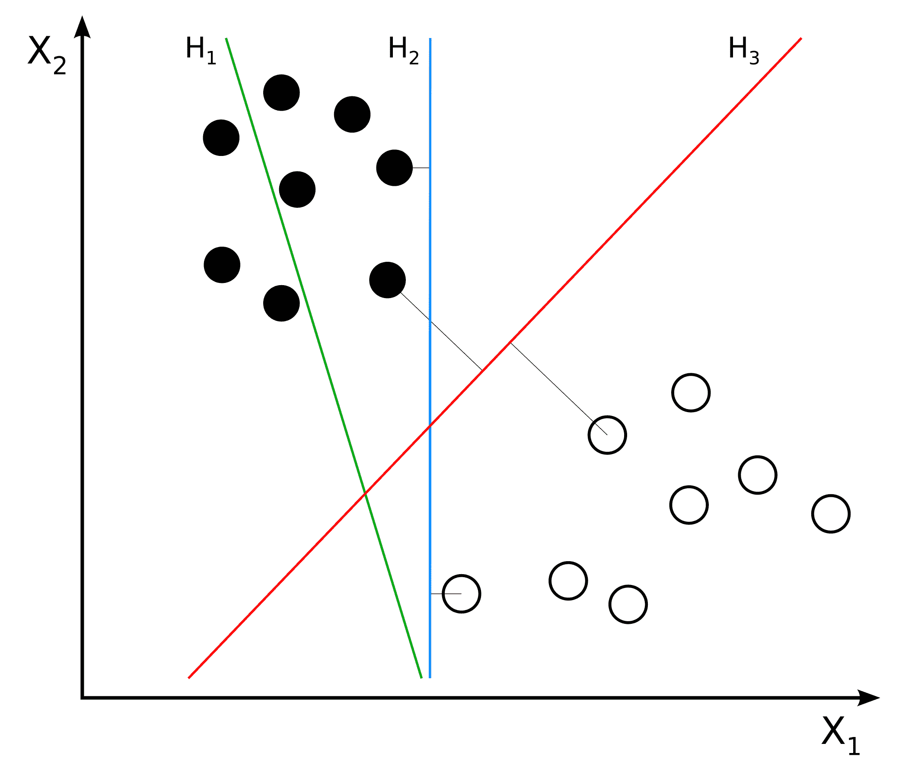

超平面`H1`（显示为绿线）不划分两类（黑点与白点）。 超平面`H2`（显示为蓝线）和`H3`（显示为红线）都划分了类别。 但是，只有超平面`H3`将类别划分为最大余量。

假设我们正在训练 SVM 作为人员检测器。 我们有两类，*人*和*非人*。 作为训练样本，我们提供了包含或不包含人的各种窗口的 HOG 描述符的向量。 这些窗口可能来自各种图像。 SVM 通过找到最佳的超平面来学习，该平面将多维 HOG 描述符空间最大程度地分为人（在超平面的一侧）和非人（在另一侧）。 此后，当我们为训练后的 SVM 提供任何图像中任何其他窗口的 HOG 描述符向量时，SVM 可以判断该窗口是否包含人。 SVM 甚至可以给我们一个与向量到最佳超平面的距离有关的置信度值。

SVM 模型自 1960 年代初就出现了。 但是，此后它就得到了改进，现代 SVM 实现的基础可以在 Corinna Cortes 和 Vladimir Vapnik 的论文《支持向量网络》（《机器学习》，1995 年）中找到 。 可从[这个页面](http://link.springer.com/article/10.1007/BF00994018)获得。

现在，我们对可以组合以构成对象检测器的关键组件有了概念上的理解，我们可以开始看一些示例。 我们将从 OpenCV 的现成对象检测器之一开始，然后我们将继续设计和训练我们自己的自定义对象检测器。

# 使用 HOG 描述符检测人

OpenCV 带有称为`cv2.HOGDescriptor`的类，该类能够执行人员检测。 该界面与我们在第 5 章和“检测和识别人脸”中使用的`cv2.CascadeClassifier`类相似。 但是，与`cv2.CascadeClassifier`不同，`cv2.HOGDescriptor`有时会返回嵌套的检测矩形。 换句话说，`cv2.HOGDescriptor`可能告诉我们它检测到一个人的边界矩形完全位于另一个人的边界矩形内部。 这种情况确实是可能的。 例如，一个孩子可能站在成人的前面，而孩子的边界矩形可能完全在成人的边界矩形内。 但是，在典型情况下，嵌套检测可能是错误，因此`cv2.HOGDescriptor`通常与代码一起使用，以过滤掉任何嵌套检测。

让我们通过执行测试来确定一个矩形是否嵌套在另一个矩形中来开始示例脚本。 为此，我们将连接一个函数`is_inside(i, o)`，其中`i`是可能的内部矩形，`o`是可能的外部矩形。 如果`i`在`o`内部，则函数将返回`True`； 否则，将返回`False`。 这是脚本的开始：

```py
import cv2

def is_inside(i, o):
    ix, iy, iw, ih = i
    ox, oy, ow, oh = o
    return ix > ox and ix + iw < ox + ow and \
        iy > oy and iy + ih < oy + oh
```

现在，我们创建`cv2.HOGDescriptor`的实例，并指定它使用 OpenCV 内置的默认人员检测器，方法是运行以下代码：

```py
hog = cv2.HOGDescriptor()
hog.setSVMDetector(cv2.HOGDescriptor_getDefaultPeopleDetector())
```

请注意，我们使用`setSVMDetector`方法指定了人员检测器。 希望根据本章前面的内容，这是有道理的。 SVM 是分类器，因此 SVM 的选择决定了我们的`cv2.HOGDescriptor`将检测到的对象类型。

现在，我们继续加载图像（在这种情况下，是一张在干草地上工作的妇女的老照片），并尝试通过运行以下代码来检测图像中的人：

```py
img = cv2.imread('img/haying.jpg')

found_rects, found_weights = hog.detectMultiScale(
    img, winStride=(4, 4), scale=1.02, finalThreshold=1.9)
```

请注意，`cv2.HOGDescriptor`具有`detectMultiScale`方法，该方法返回两个列表：

1.  检测到的对象（在这种情况下，检测到的人）的包围矩形的列表。
2.  检测到的物体的权重或置信度得分列表。 值越高，表示检测结果正确的可信度越高。

`detectMultiScale`接受几个可选参数，包括：

*   `winStride`：此元组定义了滑动窗口在连续检测尝试之间移动的`x`和`y`距离。 HOG 在重叠的窗口中效果很好，因此相对于窗口大小，步幅可能较小。 较小的值将以较高的计算成本产生更多的检测结果。 默认的步幅没有重叠。 它与窗口大小相同，对于默认人物检测器为`(64, 128)`。
*   `scale`：此比例因子应用于图像金字塔的连续级别之间。 较小的值将以较高的计算成本产生更多的检测结果。 该值必须大于`1.0`。 默认值为`1.5`。
*   `finalThreshold`：此值确定我们的检测标准有多严格。 较小的值不太严格，导致更多的检测。 默认值为`2.0`。

现在，我们可以过滤检测结果以删除嵌套的矩形。 为了确定矩形是否为嵌套矩形，我们可能需要将其与其他所有矩形进行比较。 请注意在以下嵌套循环中使用我们的`is_inside`函数：

```py
found_rects_filtered = []
found_weights_filtered = []
for ri, r in enumerate(found_rects):
    for qi, q in enumerate(found_rects):
        if ri != qi and is_inside(r, q):
            break
    else:
        found_rects_filtered.append(r)
        found_weights_filtered.append(found_weights[ri])
```

最后，让我们绘制其余的矩形和权重以突出显示检测到的人，然后如下所示并显示此可视化效果：

```py
for ri, r in enumerate(found_rects_filtered):
    x, y, w, h = r
    cv2.rectangle(img, (x, y), (x + w, y + h), (0, 255, 255), 2)
    text = '%.2f' % found_weights_filtered[ri]
    cv2.putText(img, text, (x, y - 20),
                cv2.FONT_HERSHEY_SIMPLEX, 1, (0, 255, 255), 2)

cv2.imshow('Women in Hayfield Detected', img)
cv2.imwrite('./women_in_hayfield_detected.jpg', img)
cv2.waitKey(0)
```

如果您自己运行脚本，则图像中的人周围会看到矩形。 结果如下：

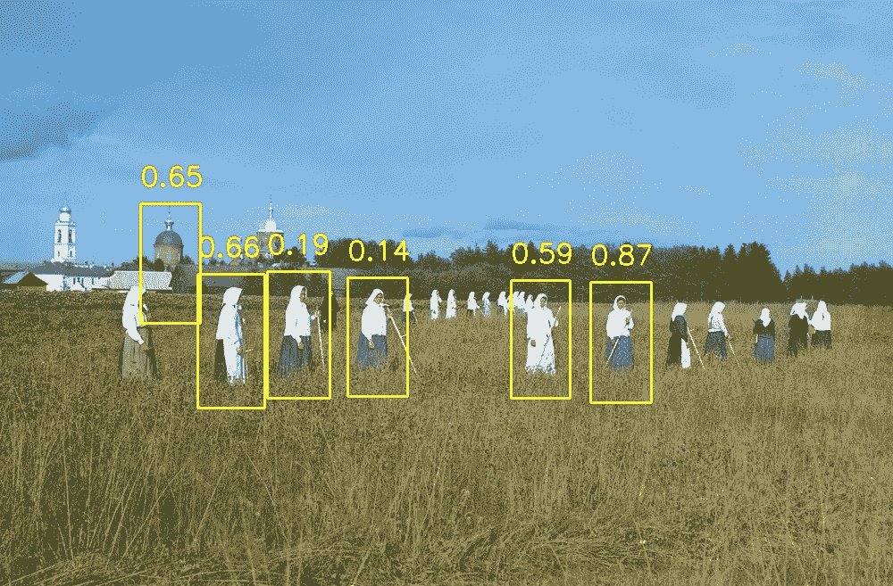

这张照片是彩色摄影的先驱 Sergey Prokudin-Gorsky（1863-1944）作品的另一个例子。 在这里，场景是 1909 年俄罗斯西北部 Leushinskii 修道院的一块田地。

在距离相机最近的六位女性中，有五位被成功检测到。 同时，背景中的一个塔被错误地检测为人。 在许多实际应用中，可以通过分析视频中的一系列帧来改善人员检测结果。 例如，假设我们正在观看 Leushinskii 修道院干草地的监视视频，而不是一张照片。 我们应该能够添加代码来确定该塔不能为人，因为它不会移动。 同样，我们应该能够在其他框架中检测到其他人，并跟踪每个人在框架之间的移动。 我们将在第 8 章，“跟踪对象”中研究人员跟踪问题。

同时，让我们继续研究另一种检测器，我们可以训练该检测器来检测给定类别的对象。

# 创建和训练对象检测器

使用训练有素的检测器使构建快速原型变得容易，我们都非常感谢 OpenCV 开发人员提供了诸如面部检测和人物检测之类的有用功能。 但是，无论您是业余爱好者还是计算机视觉专业人员，都不太可能只与人和面孔打交道。

此外，如果您像本书的作者一样，您会想知道“人检测器”是如何首先创建的，以及是否可以改进它。 此外，您可能还想知道是否可以将相同的概念应用于检测从汽车到地精的各种物体。

的确，在行业中，您可能不得不处理检测非常具体的对象的问题，例如车牌，书皮或任何对您的雇主或客户最重要的东西。

因此，问题是，我们如何提出自己的分类器？

有许多流行的方法。 在本章的其余部分中，我们将看到一个答案在于 SVM 和 BoW 技术。

我们已经讨论过 SVM 和 HOG。 现在让我们仔细看看 BoW。

# 了解 BoW

BoW 是最初不用于计算机视觉的概念； 相反，我们在计算机视觉的背景下使用了该概念的演进版本。 让我们首先讨论一下它的基本版本，正如您可能已经猜到的那样，它最初属于语言分析和信息检索领域。

在计算机视觉的背景下，有时 BoW 被称为**视觉词袋**（**BoVW**）。 但是，我们将仅使用术语 BoW，因为这是 OpenCV 使用的术语。

BoW 是一种技术，通过它我们可以为一系列文档中的每个单词分配权重或计数； 然后，我们用这些计数的向量表示这些文档。 让我们来看一个示例，如下所示：

*   文档 1：我喜欢 OpenCV，也喜欢 Python。
*   文档 2：我喜欢 C++ 和 Python。
*   文档 3：我不喜欢朝鲜蓟。

这三个文档使我们能够使用以下值构建字典-也称为**码本**或词汇表-如下所示：

```py
{
    I: 4,
    like: 4,
    OpenCV: 1,
    and: 2,
    Python: 2,
    C++: 1,
    don't: 1,
    artichokes: 1
}
```

我们有八个条目。 现在让我们使用八项向量表示原始文档。 每个向量都包含代表给定文档的字典中所有单词计数的值。 前三个句子的向量表示如下：

```py
[2, 2, 1, 1, 1, 0, 0, 0]
[1, 1, 0, 1, 1, 1, 0, 0]
[1, 1, 0, 0, 0, 0, 1, 1]
```

这些向量可以概念化为文档的直方图表示形式，也可以概念化为可用于训练分类器的描述符向量。 例如，基于这样的表示，文档可以分类为*垃圾邮件*或*非垃圾邮件*。 实际上，垃圾邮件过滤是 BoW 的许多实际应用之一。

既然我们已经掌握了 BoW 的基本概念，那么让我们看一下它如何应用于计算机视觉世界。

# 将 BoW 应用于计算机视觉

现在，我们已经熟悉了功能和描述符的概念。 我们使用了诸如 SIFT 和 SURF 之类的算法从图像特征中提取描述符，以便我们可以在另一幅图像中匹配这些特征。

最近，我们还熟悉了另一种基于密码本或字典的描述符。 我们知道一个 SVM，该模型可以接受标记的描述符向量作为训练数据，可以找到描述符空间按给定类别的最佳划分，并可以预测新数据的类别。

有了这些知识，我们可以采用以下方法来构建分类器：

1.  取得图像的样本数据集。
2.  对于数据集中的每个图像，提取描述符（使用 SIFT，SURF，ORB 或类似算法）。
3.  将每个描述符向量添加到 BoW 训练器中。
4.  将描述符聚类为`k`聚类，其中心（质心）是我们的视觉单词。 最后一点听起来可能有些晦涩，但是我们将在下一部分中进一步探讨。

在此过程的最后，我们准备了一个视觉单词词典可供使用。 可以想象，庞大的数据集将使我们的词典中的视觉单词更加丰富。 到现在为止，单词越多越好！

训练完分类器后，我们应该继续对其进行测试。 好消息是测试过程在概念上与前面概述的培训过程非常相似。 给定一个测试图像，我们可以通过计算描述符到质心的距离的直方图来提取描述符并**量化它们**（或降低其维数）。 基于此，我们可以尝试识别视觉单词，并将其定位在图像中。

这就是本章的要点，在这里，您已经对更深入的实践示例产生了浓厚的兴趣，并且非常喜欢编码。 但是，在继续之前，让我们快速但必要地探讨`k`-均值聚类的理论，以便您可以完全理解视觉单词的创建方式。 从而，您将更好地了解使用 BoW 和 SVM 进行对象检测的过程。

# k 均值聚类

`k`-均值聚类是一种量化方法，通过此方法，我们分析了大量向量，以找到少量聚类。 给定一个数据集，`k`代表该数据集将被划分为的簇数。 术语*均值*是指平均值或平均值的数学概念； 当以视觉方式表示时，簇的均值是其质心或簇中点的几何中心。

**聚类**是指将数据集中的点分组为聚类的过程。

OpenCV 提供了一个名为`cv2.BOWKMeansTrainer`的类，我们将使用它来帮助训练我们的分类器。 如您所料，OpenCV 文档提供了此类的以下摘要：

“基于 kmeans 的课程，使用词袋方法来训练视觉词汇。”

在进行了长期的理论介绍之后，我们可以看一个示例，然后开始训练我们的自定义分类器。

# 检测汽车

要训​​练任何种类的分类器，我们必须首先创建或获取训练数据集。 我们将训练汽车探测器，因此我们的数据集必须包含代表汽车的正样本，以及代表检测器在寻找汽车时可能遇到的其他（非汽车）事物的负样本。 例如，如果检测器旨在搜索街道上的汽车，则路边，人行横道，行人或自行车的图片可能比土星环的图片更具代表性。 除了表示预期的主题外，理想情况下，训练样本还应表示我们的特定相机和算法看到主题的方式。

最终，在本章中，我们打算使用固定大小的滑动窗口，因此，重要的是，我们的训练样本必须符合固定大小，并且要对正样本进行严格裁剪以构架没有太多背景的汽车。

在一定程度上，我们希望随着我们不断添加良好的训练图像，分类器的准确性将会提高。 另一方面，较大的数据集会使训练变慢，并且可能过度训练分类器，从而无法推断超出训练集的分类器。 在本节的后面，我们将以一种允许我们轻松修改训练图像的数量的方式编写代码，以便通过实验找到合适的尺寸。

如果我们自己完成所有的工作，那么组装汽车图像数据集将是一项耗时的工作（尽管这完全是可行的）。 为了避免重新发明轮子或整个汽车，我们可以利用现成的数据集，例如：

*   [用于车辆检测的 UIUC 图像数据库](https://cogcomp.seas.upenn.edu/Data/Car/)
*   [斯坦福汽车数据集](http://ai.stanford.edu/~jkrause/cars/car_dataset.html)

让我们在示例中使用 UIUC 数据集。 获取此数据集并在脚本中使用它涉及几个步骤，因此让我们一一遍解它们，如下所示：

1.  从[这个页面](http://l2r.cs.uiuc.edu/~cogcomp/Data/Car/CarData.tar.gz)下载 UIUC 数据集。 将其解压缩到某个文件夹，我们将其称为`<project_path>`。 现在，解压缩的数据应该位于`<project_path>/CarData`处。 具体来说，我们将使用`<project_path>/CarData/TrainImages`和`<project_path>/CarData/TestImages`中的某些图像。
2.  同样在`<project_path>`中，我们创建一个名为`detect_car_bow_svm.py`的 Python 脚本。 要开始执行脚本，请编写以下代码以检查`CarData`子文件夹是否存在：

```py
import cv2
import numpy as np
import os

if not os.path.isdir('CarData'):
    print(
        'CarData folder not found. Please download and unzip '
        'http://l2r.cs.uiuc.edu/~cogcomp/Data/Car/CarData.tar.gz '
        'into the same folder as this script.')
    exit(1)
```

如果您可以运行此脚本并且不打印任何内容，则表示所有内容均位于正确的位置。

3.  接下来，让我们在脚本中定义以下常量：

```py
BOW_NUM_TRAINING_SAMPLES_PER_CLASS = 10
SVM_NUM_TRAINING_SAMPLES_PER_CLASS = 100
```

请注意，我们的分类器将使用两个训练阶段：一个阶段用于 BoW 词汇表，它将使用多个图像作为样本，而另一个阶段则用于 SVM，它将使用多个 BoW 描述符向量作为样本。 我们随意地为每个阶段定义了不同数量的训练样本。 在每个阶段，我们还可以为两个类别（*汽车*和*非汽车*）定义不同数量的训练样本，但是，我们将使用相同的数量。

4.  我们将使用`cv2.SIFT`提取描述符，并使用`cv2.FlannBasedMatcher`匹配这些描述符。 让我们用以下代码初始化这些算法：

```py
sift = cv2.xfeatures2d.SIFT_create()

FLANN_INDEX_KDTREE = 1
index_params = dict(algorithm=FLANN_INDEX_KDTREE, trees=5)
search_params = {}
flann = cv2.FlannBasedMatcher(index_params, search_params)
```

请注意，我们已经按照与第 6 章“图像检索和使用图像描述符的搜索”相同的方式，初始化了 SIFT 和**用于近似最近邻的 FAST 库**（**FLANN**）。但是，这一次，描述符匹配不是我们的最终目标。 相反，它将成为 BoW 功能的一部分。

5.  OpenCV 提供了一个名为`cv2.BOWKMeansTrainer`的类来训练 BoW 词汇表，以及一个名为`cv2.BOWImgDescriptorExtractor`的类来将某种较低级的描述符（在我们的示例中为 SIFT 描述符）转换为 BoW 描述符。 让我们用以下代码初始化这些对象：

```py
bow_kmeans_trainer = cv2.BOWKMeansTrainer(40)
bow_extractor = cv2.BOWImgDescriptorExtractor(sift, flann)
```

初始化`cv2.BOWKMeansTrainer`时，必须指定簇数-在我们的示例中为 40。在初始化`cv2.BOWImgDescriptorExtractor`时，必须指定描述符提取器和描述符匹配器-在我们的示例中为`cv2.SIFT`和`cv2.FlannBasedMatcher`对象 我们之前创建的

6.  为了训练 BoW 词汇，我们将提供各种*汽车*和*非汽车*图像的 SIFT 描述符样本。 我们将从`CarData/TrainImages`子文件夹中加载图像，该图像包含名称为`pos-x.pgm`的正（*汽车*）图像和名称为诸如`pos-x.pgm`的负（*非汽车*）图像。 `neg-x.pgm`，其中`x`是从`1`开始的数字。 让我们编写以下实用函数，以返回到第`i`个正负训练图像的路径，其中`i`是一个以`0`开头的数字：

```py
def get_pos_and_neg_paths(i):
    pos_path = 'CarData/Trainimg/pos-%d.pgm' % (i+1)
    neg_path = 'CarData/Trainimg/neg-%d.pgm' % (i+1)
    return pos_path, neg_path
```

在本节的稍后部分，当我们需要获取大量训练样本时，我们将使用`i`的变化值循环调用前面的函数。

7.  对于训练样本的每条路径，我们将需要加载图像，提取 SIFT 描述符，并将描述符添加到 BoW 词汇表训练器中。 让我们编写另一个实用程序函数来精确地做到这一点，如下所示：

```py
def add_sample(path):
    img = cv2.imread(path, cv2.IMREAD_GRAYSCALE)
    keypoints, descriptors = sift.detectAndCompute(img, None)
    if descriptors is not None:
        bow_kmeans_trainer.add(descriptors)
```

如果在图像中未找到特征，则`keypoints`和`descriptors`变量将为`None`。

8.  在此阶段，我们拥有开始训练 BoW 词汇表所需的一切。 让我们为每个班级读取一些图像（*汽车*作为肯定类，*非汽车*作为否定类），并将它们添加到训练集中，如下所示：

```py
for i in range(BOW_NUM_TRAINING_SAMPLES_PER_CLASS):
    pos_path, neg_path = get_pos_and_neg_paths(i)
    add_sample(pos_path)
    add_sample(neg_path)
```

9.  现在我们已经组装了训练集，我们将调用词汇训练器的`cluster`方法，该方法执行`k`-均值分类并返回词汇表。 我们将把这个词汇分配给 BoW 描述符提取器，如下所示：

```py
voc = bow_kmeans_trainer.cluster()
bow_extractor.setVocabulary(voc)
```

请记住，之前我们用 SIFT 描述符提取器和 FLANN 匹配器初始化了 BoW 描述符提取器。 现在，我们还为 BoW 描述符提取器提供了一个词汇，并使用 SIFT 描述符样本进行了训练。 在这个阶段，我们的 BoW 描述符提取器具有从**高斯**（DoG）特征中提取 BoW 描述符所需的一切。

请记住，`cv2.SIFT`检测 DoG 特征并提取 SIFT 描述符，正如我们在第 6 章，“检索图像并使用图像描述符”讨论的那样，特别是在“检测 DoG 特征和提取 SIFT 描述符”部分。

10.  接下来，我们将声明另一个效用函数，该函数获取图像并返回 BoW 描述符提取器计算出的描述符向量。 这涉及提取图像的 DoG 特征，并根据 DoG 特征计算 BoW 描述符向量，如下所示：

```py
def extract_bow_descriptors(img):
    features = sift.detect(img)
    return bow_extractor.compute(img, features)
```

11.  我们准备组装另一种训练集，其中包含 BoW 描述符的样本。 让我们创建两个数组来容纳训练数据和标签，并用 BoW 描述符提取器生成的描述符填充它们。 我们将每个描述符向量标记为 1（正样本）和-1（负样本），如以下代码块所示：

```py
training_data = []
training_labels = []
for i in range(SVM_NUM_TRAINING_SAMPLES_PER_CLASS):
    pos_path, neg_path = get_pos_and_neg_paths(i)
    pos_img = cv2.imread(pos_path, cv2.IMREAD_GRAYSCALE)
    pos_descriptors = extract_bow_descriptors(pos_img)
    if pos_descriptors is not None:
        training_data.extend(pos_descriptors)
        training_labels.append(1)
    neg_img = cv2.imread(neg_path, cv2.IMREAD_GRAYSCALE)
    neg_descriptors = extract_bow_descriptors(neg_img)
    if neg_descriptors is not None:
        training_data.extend(neg_descriptors)
        training_labels.append(-1)
```

如果您希望训练一个分类器来区分多个肯定类，则可以简单地添加带有其他标签的其他描述符。 例如，我们可以训练一个分类器，该分类器将标签 1 用于*汽车*，将 2 用于*人*，将 -1 用于*背景*。 不需要具有否定类或背景类，但如果没有，则分类器将假定一切都属于肯定类之一。

12.  OpenCV 提供了一个名为`cv2.ml_SVM`的类，表示一个 SVM。 让我们创建一个 SVM，并使用我们先前组装的数据和标签对其进行训练，如下所示：

```py
svm = cv2.ml.SVM_create()
svm.train(np.array(training_data), cv2.ml.ROW_SAMPLE,
          np.array(training_labels))
```

请注意，在将训练数据和标签从列表转换为 NumPy 数组之前，必须将它们传递给`cv2.ml_SVM`的`train`方法。

13.  最后，我们准备通过对一些不属于训练集的图像进行分类来测试 SVM。 我们将遍历测试图像的路径列表。 对于每个路径，我们将加载图像，提取 BoW 描述符，并获得 SVM 的**预测**或分类结果，它们将是 1.0（*汽车*）或-1.0（ *而非汽车*），具体取决于我们之前使用的培训标签。 我们将在图像上绘制文本以显示分类结果，并在窗口中显示图像。 显示所有图像后，我们将等待用户按下任意键，然后脚本将结束。 所有这些都是通过以下代码块实现的：

```py
for test_img_path in ['CarData/Testimg/test-0.pgm',
                      'CarData/Testimg/test-1.pgm',
                      'img/car.jpg',
                      'img/haying.jpg',
                      'img/statue.jpg',
                      'img/woodcutters.jpg']:
    img = cv2.imread(test_img_path)
    gray_img = cv2.cvtColor(img, cv2.COLOR_BGR2GRAY)
    descriptors = extract_bow_descriptors(gray_img)
    prediction = svm.predict(descriptors)
    if prediction[1][0][0] == 1.0:
        text = 'car'
        color = (0, 255, 0)
    else:
        text = 'not car'
        color = (0, 0, 255)
    cv2.putText(img, text, (10, 30), cv2.FONT_HERSHEY_SIMPLEX, 1,
                color, 2, cv2.LINE_AA)
    cv2.imshow(test_img_path, img)
cv2.waitKey(0)
```

保存并运行脚本。 您应该看到六个具有各种分类结果的窗口。 这是真实正面结果之一的屏幕截图：

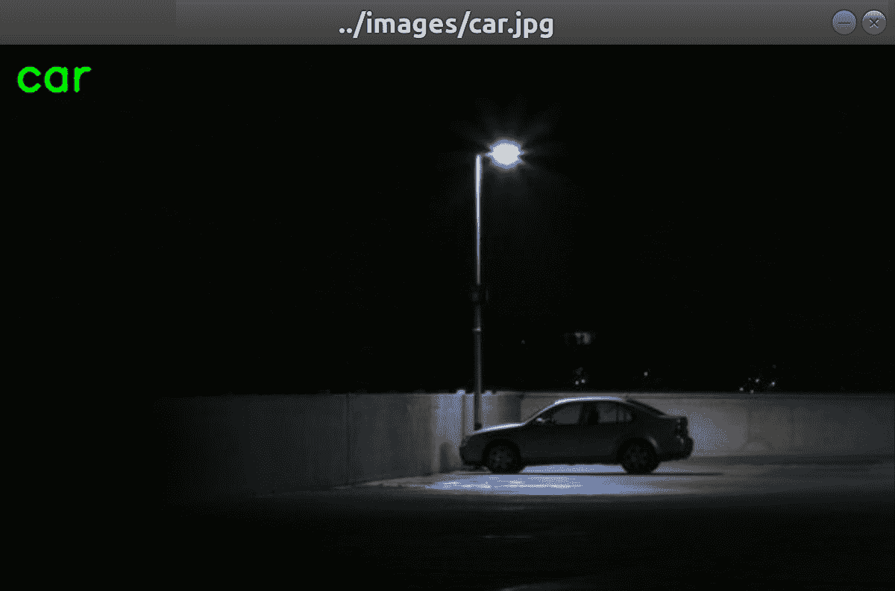

下一个屏幕截图显示了真正的负面结果之一：

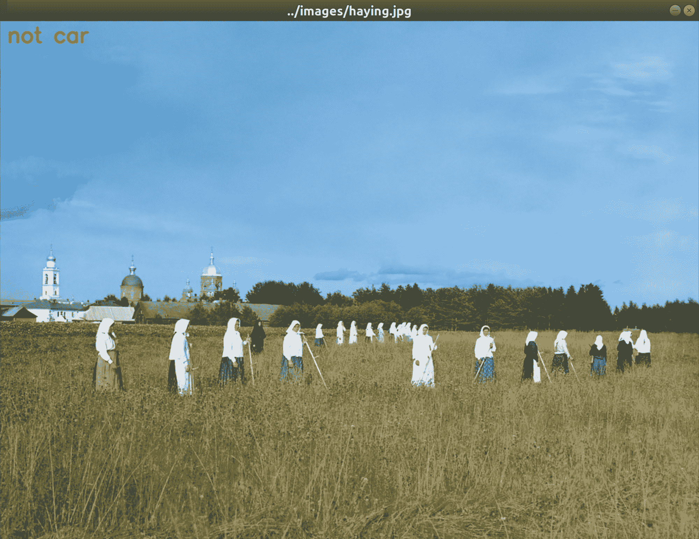

在我们的简单测试中的六张图像中，只有以下一张被错误分类：

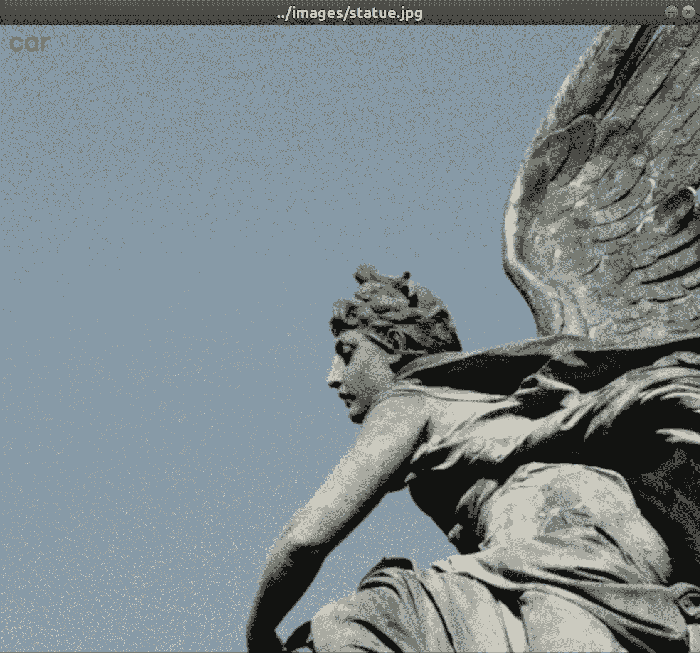

尝试调整训练样本的数量，并尝试在更多图像上测试分类器，以查看可获得的结果。

让我们总结一下到目前为止所做的事情。 我们使用了 SIFT，BoW 和 SVM 的混合来训练分类器，以区分两个类别：*汽车*和*非汽车*。 我们已将此分类器应用于整个图像。 下一步的逻辑步骤是应用滑动窗口技术，以便我们可以将分类结果缩小到图像的特定区域。

# 将 SVM 与滑动窗口结合

通过将我们的 SVM 分类器与滑动窗口技术和图像金字塔相结合，我们可以实现以下改进：

*   检测图像中相同种类的多个对象。
*   确定图像中每个检测到的对象的位置和大小。

我们将采用以下方法：

1.  拍摄图像的一个区域，对其进行分类，然后将该窗口向右移动一个预定义的步长。 当我们到达图像的最右端时，将`x`坐标重置为 0，向下移动一步，然后重复整个过程。
2.  在每个步骤中，请使用经过 BoW 训练的 SVM 执行分类。
3.  根据 SVM，跟踪所有检测为正例的窗口。
4.  在对整个图像中的每个窗口进行分类之后，将图像按比例缩小，然后重复使用滑动窗口的整个过程。 因此，我们正在使用图像金字塔。 继续重新缩放和分类，直到达到最小大小。

到此过程结束时，我们已经收集了有关图像内容的重要信息。 但是，存在一个问题：我们很可能已经发现了许多重叠的块，每个块都有很高的置信度。 也就是说，图像可以包含被多次检测的一个物体。 如果我们报告了这些检测结果，那么我们的报告将具有很大的误导性，因此我们将使用 NMS 筛选结果。

有关更新，您可能希望参考本章前面的“了解 NMS”部分。

接下来，让我们看一下如何修改和扩展前面的脚本，以实现我们刚刚描述的方法。

# 在场景中检测汽车

现在，我们已经准备好通过创建汽车检测脚本来应用到目前为止学到的所有概念，该脚本可以扫描图像并在汽车周围绘制矩形。 通过复制先前的脚本`detect_car_bow_svm.py`，创建一个新的 Python 脚本`detect_car_bow_svm_sliding_window.py`。 （我们之前在“检测汽车”部分中介绍了`detect_car_bow_svm.py`的实现。）新脚本的大部分实现将保持不变，因为我们仍然希望以几乎相同的方式训练 BoW 描述符提取器和 SVM 像我们以前一样 但是，培训完成后，我们将以新的方式处理测试图像。 除了将每个图像整体分类之外，我们将每个图像分解为金字塔层和窗口，我们将每个窗口分类，然后将 NMS 应用于产生正面检测结果的窗口列表。

对于 NMS，我们将依靠 Malisiewicz 和 Rosebrock 的实现，如本章前面的“了解 NMS”部分中所述。 您可以在本书的 GitHub 存储库中找到其实现的略微修改的副本，尤其是在`chapter7/non_max_suppression.py`的 Python 脚本中。 该脚本提供具有以下签名的功能：

```py
def non_max_suppression_fast(boxes, overlapThresh):
```

作为其第一个参数，该函数采用一个 NumPy 数组，其中包含矩形坐标和分数。 如果我们有`N`个矩形，则此数组的形状为`N`x5。 对于索引为`i`的给定矩形，数组中的值具有以下含义：

*   `boxes[i][0]`是最左侧的`x`坐标。
*   `boxes[i][1]`是最高的`y`坐标。
*   `boxes[i][2]`是最右边的`x`坐标。
*   `boxes[i][3]`是最底端的`y`坐标。
*   `boxes[i][4]`是分数，其中分数越高表示矩形是正确的检测结果的可信度越高。

作为第二个参数，该函数采用一个阈值，该阈值表示矩形之间重叠的最大比例。 如果两个矩形的重叠比例大于此比例，则得分较低的矩形将被滤除。 最终，该函数将返回剩余矩形的数组。

现在，让我们将注意力转向对`detect_car_bow_svm_sliding_window.py`脚本的修改，如下所示：

1.  首先，我们要为 NMS 函数添加一个新的 import 语句，如以下代码中的**粗体**所示：

```py
import cv2
import numpy as np
import os

from non_max_suppression import non_max_suppression_fast as nms
```

2.  让我们在脚本开头附近定义一些其他参数，如**粗体**所示：

```py
BOW_NUM_TRAINING_SAMPLES_PER_CLASS = 10
SVM_NUM_TRAINING_SAMPLES_PER_CLASS = 100

SVM_SCORE_THRESHOLD = 1.8
NMS_OVERLAP_THRESHOLD = 0.15
```

我们将使用`SVM_SCORE_THRESHOLD`作为阈值来区分正窗口和负窗口。 我们将在本节稍后部分看到如何获得分数。 我们将使用`NMS_OVERLAP_THRESHOLD`作为 NMS 步骤中重叠的最大可接受比例。 在这里，我们任意选择了 15%，因此我们将剔除重叠超过此比例的窗口。 在试验 SVM 时，您可以根据自己的喜好调整这些参数，直到找到在应用程序中产生最佳结果的值。

3.  我们将`k`-均值簇的数量从`40`减少到`12`（根据实验任意选择的数量），如下所示：

```py
bow_kmeans_trainer = cv2.BOWKMeansTrainer(12)
```

4.  我们还将调整 SVM 的参数，如下所示：

```py
svm = cv2.ml.SVM_create()
svm.setType(cv2.ml.SVM_C_SVC)
svm.setC(50)
svm.train(np.array(training_data), cv2.ml.ROW_SAMPLE,
          np.array(training_labels))
```

通过对 SVM 的先前更改，我们指定了分类器的严格性或严重性级别。 随着`C`参数的值增加，误报的风险减少，但误报的风险增加。 在我们的应用中，假正例将是当其确实是*非汽车*时被检测为汽车的窗口，而假负例将是当它的实际*汽车*时被检测为非汽车的窗口。

在训练 SVM 的代码之后，我们想添加两个辅助函数。 基于滑动窗口技术，其中一个将生成图像金字塔的级别，而另一个将生成关注区域。 除了添加这些辅助功能外，我们还需要以不同的方式处理测试图像，以利用滑动窗口和 NMS。 以下步骤介绍了更改：

1.  首先，让我们看一下处理图像金字塔的辅助函数。 以下代码块显示了此功能：

```py
def pyramid(img, scale_factor=1.25, min_size=(200, 80),
            max_size=(600, 600)):
    h, w = img.shape
    min_w, min_h = min_size
    max_w, max_h = max_size
    while w >= min_w and h >= min_h:
        if w <= max_w and h <= max_h:
            yield img
        w /= scale_factor
        h /= scale_factor
        img = cv2.resize(img, (int(w), int(h)),
                         interpolation=cv2.INTER_AREA)
```

前面的函数获取图像并生成一系列调整大小的版本。 该系列受最大和最小图像尺寸的限制。

您会注意到，调整大小的图像不是通过`return`关键字返回的，而是通过`yield`关键字返回的。 这是因为此功能是所谓的生成器。 它产生一系列图像，我们可以轻松地在循环中使用它们。 如果您不熟悉生成器，请查看[这个页面](https://wiki.python.org/moin/Generators)上的官方 Python Wiki。

2.  接下来是基于滑动窗口技术生成兴趣区域的功能。 以下代码块显示了此功能：

```py
def sliding_window(img, step=20, window_size=(100, 40)):
    img_h, img_w = img.shape
    window_w, window_h = window_size
    for y in range(0, img_w, step):
        for x in range(0, img_h, step):
            roi = img[y:y+window_h, x:x+window_w]
            roi_h, roi_w = roi.shape
            if roi_w == window_w and roi_h == window_h:
                yield (x, y, roi)
```

同样，这是一个发电机。 尽管有点嵌套，但是该机制非常简单：给定图像，返回左上角坐标和代表下一个窗口的子图像。 连续的窗口从左到右以任意大小的步长移动，直到我们到达一行的末尾；从顶部到底部，直到我们到达图像的末尾。

3.  现在，让我们考虑对测试图像的处理。 与先前版本的脚本一样，我们循环浏览一系列路径以测试图像，以便加载和处理每个图像。 循环的开始保持不变。 对于上下文，这里是：

```py
for test_img_path in ['CarData/Testimg/test-0.pgm',
                      'CarData/Testimg/test-1.pgm',
                      'img/car.jpg',
                      'img/haying.jpg',
                      'img/statue.jpg',
                      'img/woodcutters.jpg']:
    img = cv2.imread(test_img_path)
    gray_img = cv2.cvtColor(img, cv2.COLOR_BGR2GRAY)
```

4.  对于每个测试图像，我们迭代金字塔级别，对于每个金字塔级别，我们迭代滑动窗口位置。 对于每个窗口或**兴趣区域**（**ROI**），我们提取 BoW 描述符并使用 SVM 对它们进行分类。 如果分类产生的正例结果通过了一定的置信度阈值，则将矩形的角坐标和置信度得分添加到正面检测列表中。 从上一个代码块继续，我们继续使用以下代码处理给定的测试图像：

```py
    pos_rects = []
    for resized in pyramid(gray_img):
        for x, y, roi in sliding_window(resized):
            descriptors = extract_bow_descriptors(roi)
            if descriptors is None:
                continue
            prediction = svm.predict(descriptors)
            if prediction[1][0][0] == 1.0:
                raw_prediction = svm.predict(
                    descriptors, 
                    flags=cv2.ml.STAT_MODEL_RAW_OUTPUT)
                score = -raw_prediction[1][0][0]
                if score > SVM_SCORE_THRESHOLD:
                    h, w = roi.shape
                    scale = gray_img.shape[0] / \
                        float(resized.shape[0])
                    pos_rects.append([int(x * scale),
                                      int(y * scale),
                                      int((x+w) * scale),
                                      int((y+h) * scale),
                                      score])
```

让我们注意一下前面代码中的两个复杂性，如下所示：

到目前为止，我们已经在各种规模和位置进行了汽车检测； 结果，我们有了一个检测到的汽车矩形的列表，包括坐标和分数。 我们期望在此矩形列表内有很多重叠。

5.  现在，让我们调用 NMS 函数，以便在重叠的情况下挑选得分最高的矩形，如下所示：

```py
 pos_rects = nms(np.array(pos_rects), NMS_OVERLAP_THRESHOLD)
```

请注意，我们已经将矩形坐标和分数列表转换为 NumPy 数组，这是该函数期望的格式。

在此阶段，我们有一系列检测到的汽车矩形及其得分，并且我们确保了这些是我们可以选择的最佳非重叠检测（在模型的参数范围内）。

6.  现在，通过在代码中添加以下内部循环来绘制矩形及其分数：

```py
 for x0, y0, x1, y1, score in pos_rects:
 cv2.rectangle(img, (int(x0), int(y0)), (int(x1), int(y1)),
 (0, 255, 255), 2)
 text = '%.2f' % score
 cv2.putText(img, text, (int(x0), int(y0) - 20),
 cv2.FONT_HERSHEY_SIMPLEX, 1, (0, 255, 255), 2)
```

与该脚本的先前版本一样，外部循环的主体通过显示当前的测试图像（包括我们在其上绘制的注释）来结束。 循环遍历所有测试图像后，我们等待用户按下任意键； 然后，程序结束，如下所示：

```py
    cv2.imshow(test_img_path, img)
cv2.waitKey(0)
```

让我们运行修改后的脚本，看看它能如何回答永恒的问题：*杜德，我的车在哪里？*

以下屏幕截图显示了成功的检测：

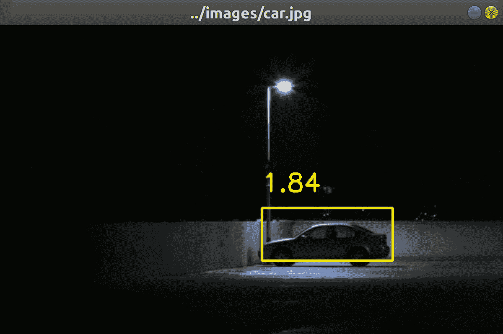

我们的另一个测试图像中有两辆车。 碰巧的是，成功检测到一辆汽车，而另一辆则未成功，如以下屏幕截图所示：

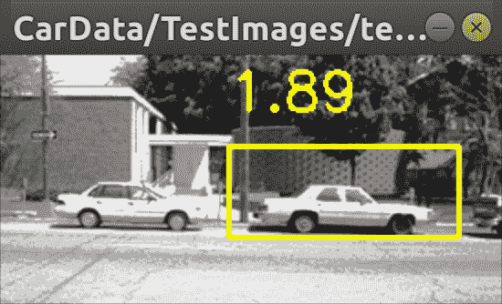

有时，其中具有许多特征的背景区域被错误地检测为汽车。 这是一个例子：

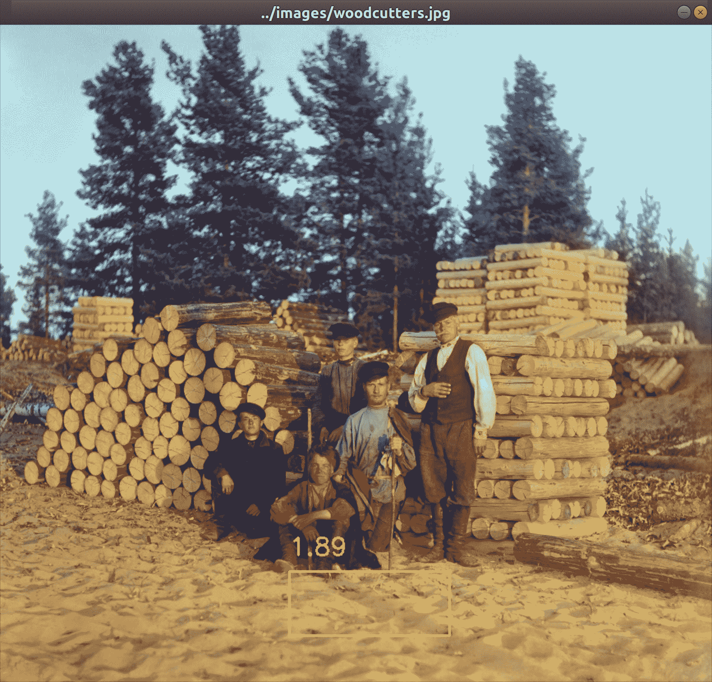

请记住，在此示例脚本中，我们的训练集很小。 具有更大背景的更大培训集可以改善结果。 另外，请记住，图像金字塔和滑动窗口会产生大量的 ROI。 考虑这一点时，我们应该意识到检测器的误报率实际上很低。 如果我们要对视频的帧执行检测，则可以通过过滤掉仅出现在单个帧或几个帧中而不是一系列任意的最小长度的检测，来进一步降低误报率。

随意尝试上述脚本的参数和训练集。 当您准备就绪时，让我们用一些结束语来结束本章。

# 保存和加载经过培训的 SVM

关于 SVM 的最后一条建议是：您不需要每次使用探测器时都对它进行培训–实际上，由于培训速度很慢，因此您应该避免这样做。 您可以使用以下代码将经过训练的 SVM 模型保存到 XML 文件：

```py
svm = cv2.ml.SVM_create()
svm.train(np.array(training_data), cv2.ml.ROW_SAMPLE,
          np.array(training_labels))
svm.save('my_svm.xml')
```

随后，您可以使用以下代码重新加载经过训练的 SVM：

```py
svm = cv2.ml.SVM_create()
svm.load('my_svm.xml')
```

通常，您可能有一个脚本用于训练和保存 SVM 模型，而其他脚本则可以加载和使用它来解决各种检测问题。

# 概要

在本章中，我们涵盖了广泛的概念和技术，包括 HOG，BoW，SVM，图像金字塔，滑动窗口和 NMS。 我们了解到这些技术在对象检测以及其他领域中都有应用。 我们编写了一个脚本，该脚本结合了 BoW，SVM，图像金字塔，滑动窗口和 NMS 等大多数技术，并且通过训练和测试自定义检测器，在机器学习中获得了实践经验。 最后，我们证明了我们可以检测到汽车！

我们的新知识构成下一章的基础，在下一章中，我们将对视频中的帧序列利用对象检测和分类技术。 我们将学习如何跟踪对象并保留有关它们的信息-这是许多实际应用程序中的重要目标。