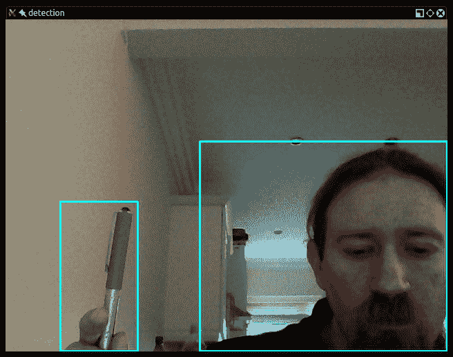
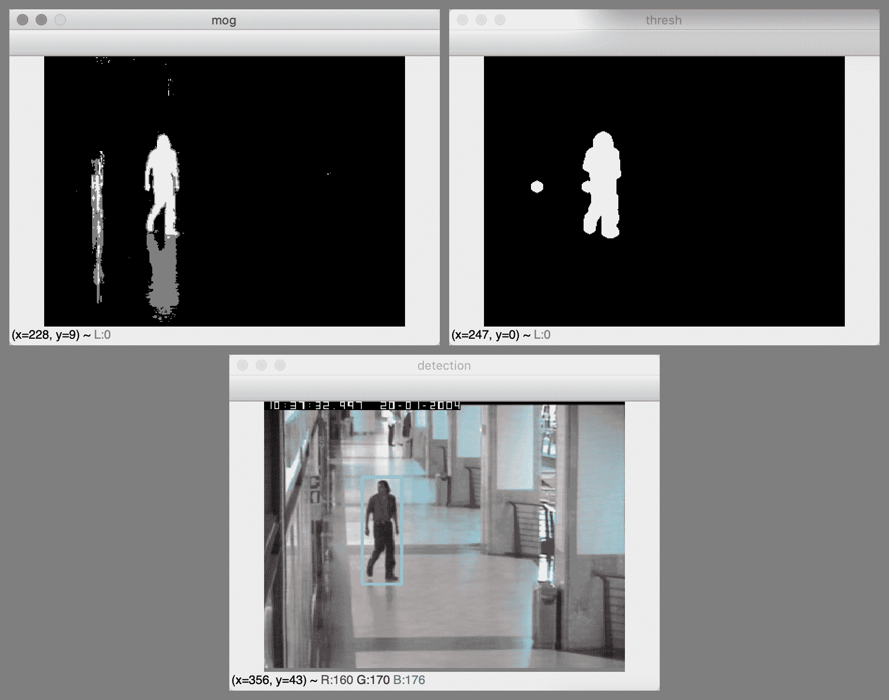
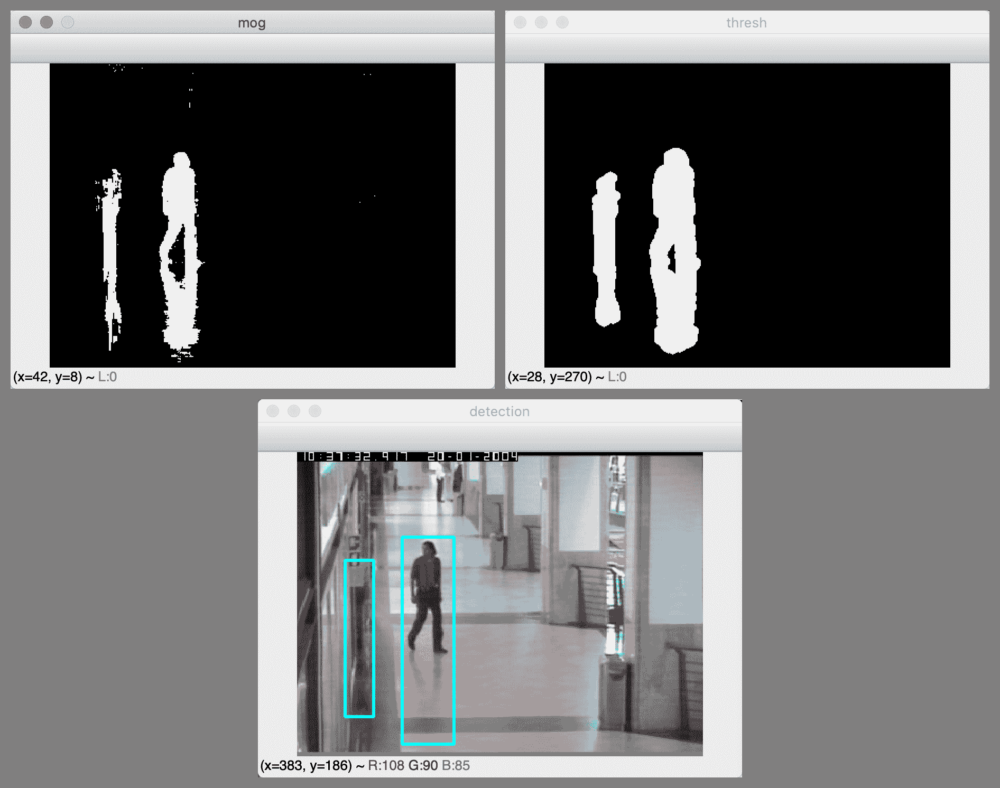
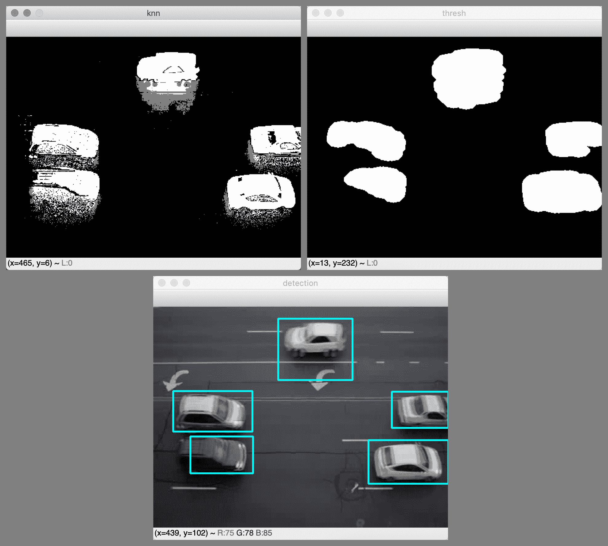
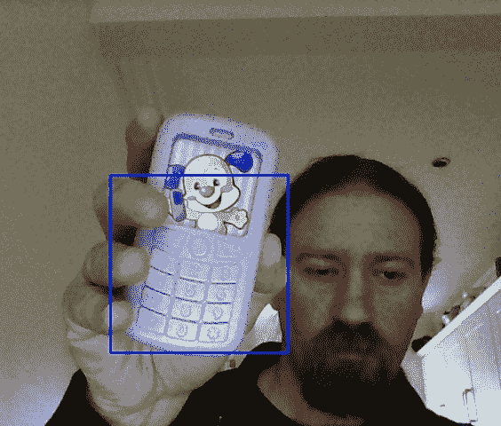
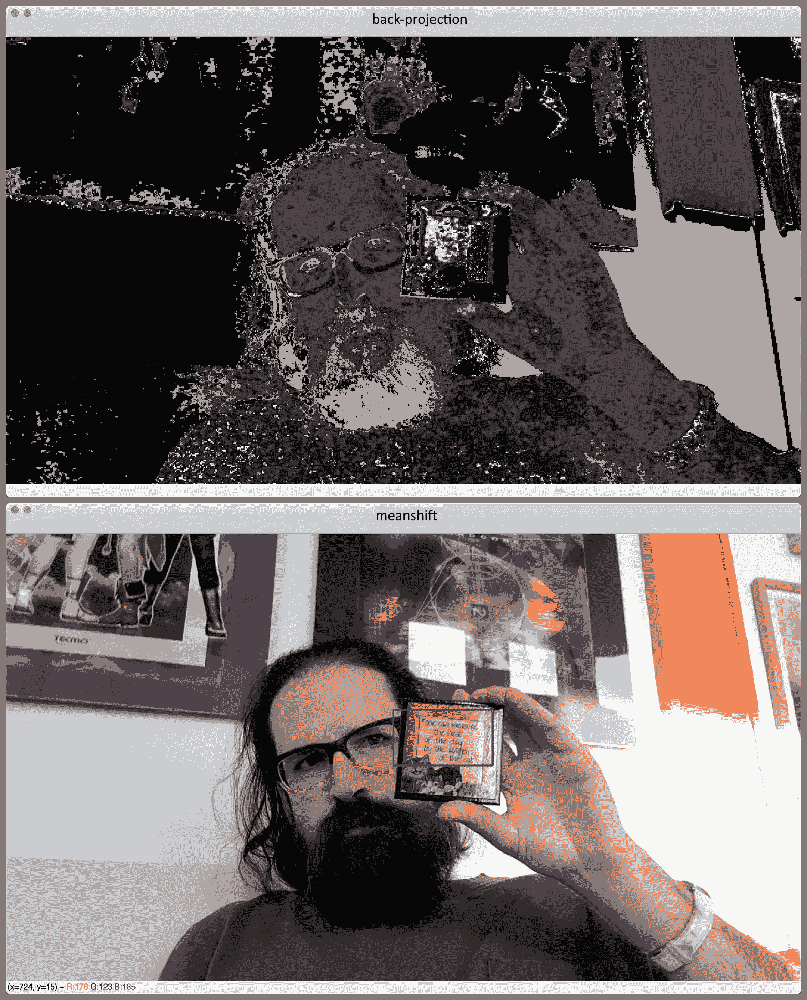
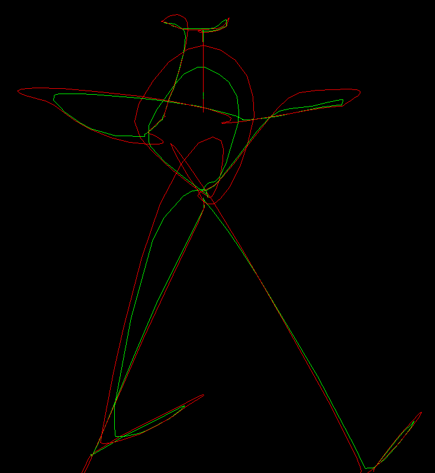

# 追踪对象

在本章中，我们将从对象跟踪的广泛主题中探索一系列技术，这是在电影或来自摄像机的视频馈送中定位运动对象的过程。 实时对象跟踪是许多计算机视觉应用程序中的关键任务，例如监视，感知用户界面，增强现实，基于对象的视频压缩和驾驶员辅助。

跟踪对象可以通过多种方式来完成，而最佳技术则很大程度上取决于手头的任务。 在研究此主题时，我们将采取以下路线：

*   根据当前帧和代表背景的帧之间的差异检测运动对象。 首先，我们将尝试这种方法的简单实现。 然后，我们将使用 OpenCV 的更高级算法的实现，即**高斯混合**（**MOG**）和 **k 最近邻**（[ **KNN**））背景减法器。 我们还将考虑如何修改脚本以使用 OpenCV 支持的任何其他背景减法器，例如 **Godbehere-Matsukawa-Goldberg**（**GMG**）背景减法器。
*   根据对象的颜色直方图跟踪移动的对象。 这种方法涉及直方图反投影，这是计算各个图像区域和直方图之间相似度的过程。 换句话说，直方图用作我们期望对象外观的模板。 我们将使用称为 MeanShift 和 CamShift 的跟踪算法，这些算法对直方图反投影的结果进行运算。
*   使用卡尔曼滤波器查找对象运动的趋势，并预测对象下一步的移动方向。
*   回顾 OpenCV 支持**面向对象编程**（**OOP**）范式的方式，并考虑这与**功能编程**（**FP** ]有何不同 ）范例。
*   实现结合了 KNN 背景减法，MeanShift 和 Kalman 滤波的行人跟踪器。

如果您已按顺序阅读本书，那么到本章结束时，您将了解许多以 2D 形式描述，检测，分类和跟踪对象的方法。 届时，您应该准备在第 9 章，“摄像机模型和增强现实”中进行 3D 跟踪。

# 技术要求

本章使用 Python，OpenCV 和 NumPy。 有关安装说明，请参阅第 1 章，“设置 OpenCV”。

[可在本书的 GitHub 存储库中找到本章的完整代码和示例视频](https://github.com/PacktPublishing/Learning-OpenCV-4-Computer-Vision-with-Python-Third-Edition)，位于`chapter08`文件夹中。

# 通过背景减法检测运动物体

要跟踪视频中的任何内容，首先，我们必须确定视频帧中与移动对象相对应的区域。 许多运动检测技术都基于**背景减法**的简单概念。 例如，假设我们有一台固定的摄像机来观看也基本上静止的场景。 除此之外，假设相机的曝光和场景中的照明条件是稳定的，以使帧的亮度变化不大。 在这些条件下，我们可以轻松捕获代表背景的参考图像，换句话说，就是场景的静止部分。 然后，无论何时摄像机捕获新帧，我们都可以从参考图像中减去该帧，并取该差的绝对值，以便获得该帧中每个像素位置的运动测量值。 如果帧的任何区域与参考图像有很大不同，我们可以得出结论，给定区域是运动对象。

背景减法技术通常具有以下局限性：

*   摄像机的任何运动，曝光变化或照明条件的变化都可能导致整个场景中的像素值立即发生变化。 因此，整个背景模型（或参考图像）已过时。
*   如果某个对象进入场景，然后在该场景中停留很长一段时间，那么一部分背景模型可能会过时。 例如，假设我们的场景是走廊。 有人进入走廊，将海报放在墙上，然后将海报留在那里。 实际上，海报实际上只是固定背景的另一部分。 但是，它不是我们参考图像的一部分，因此我们的背景模型已经过时了。

这些问题表明需要基于一系列新框架动态更新背景模型。 先进的背景扣除技术试图以多种方式解决这一需求。

另一个普遍的限制是阴影和固体对象可能以类似方式影响背景减法器。 例如，由于我们无法将物体与其阴影区分开来，因此我们可能无法获得运动物体的大小和形状的准确图片。 但是，先进的背景扣除技术确实尝试使用各种方法来区分阴影区域和实体对象。

背景减法器通常还有另一个局限性：它们无法对其检测到的运动类型提供细粒度的控制。 例如，如果场景显示地铁车在其轨道上行驶时不断晃动，则此重复动作将影响背景减法器。 出于实际目的，我们可以将地铁的振动视为半静止背景下的正常变化。 我们甚至可能知道这些振动的频率。 但是，背景减法器不会嵌入有关运动频率的任何信息，因此它没有提供方便或精确的方法来滤除此类可预测的运动。 为了弥补这些缺点，我们可以应用预处理步骤，例如模糊参考图像，也可以模糊每个新帧。 以这种方式，尽管以不太直观，有效或精确的方式抑制了某些频率。

分析运动频率超出了本书的范围。 但是，有关在计算机视觉环境中对此主题的介绍，请参阅 Joseph Howse 的书*用于 Secret Agent 的 OpenCV 4* （Packt Publishing，2019），特别是*第 7 章*和*。 用运动放大相机*观看心跳。

现在，我们已经对背景减法进行了概述，并了解了背景减法面临的一些障碍，让我们研究一下背景减法的实施效果如何。 我们将从一个简单但不健壮的实现开始，我们可以编写几行代码，然后发展到 OpenCV 为我们提供的更复杂的替代方案。

# 实现基本的背景减法器

为了实现基本的背景减法器，让我们采用以下方法：

1.  开始从相机捕获帧。
2.  丢弃九帧，以便相机有时间适当调整其自动曝光以适合场景中的照明条件。
3.  拍摄第 10 帧，将其转换为灰度，对其进行模糊处理，然后将此模糊图像用作背景的参考图像。
4.  对于每个后续帧，请对该帧进行模糊处理，然后将其转换为灰度，然后计算该模糊帧与背景参考图像之间的绝对差。 对差异图像执行阈值化，平滑和轮廓检测。 绘制并显示主要轮廓的边界框。

高斯模糊的使用应该使我们的背景减法器不易受到小振动以及数字噪声的影响。 形态学操作也提供了这些好处。

要模糊图像，我们将使用高斯模糊算法，该算法最初在第 3 章，*中使用 OpenCV* 处理图像，特别是在 *HPF 和 LPF* 部分中讨论过。 。 为了使阈值图像平滑，我们将使用形态学侵蚀和膨胀，我们最初在第 4 章，*深度估计和分割*中讨论过，特别是在使用分水岭算法进行*图像分割中* 部分。 轮廓检测和边界框也是我们在第 3 章和*使用 OpenCV* 处理图像，特别是在*轮廓检测*部分中介绍的主题。

将前面的列表扩展为更小的步骤，我们可以考虑在八个顺序的代码块中执行脚本：

1.  让我们开始导入 OpenCV 并为`blur`，`erode`和`dilate`操作定义内核的大小：

```py
import cv2

BLUR_RADIUS = 21
erode_kernel = cv2.getStructuringElement(cv2.MORPH_ELLIPSE, (5, 5))
dilate_kernel = cv2.getStructuringElement(
    cv2.MORPH_ELLIPSE, (9, 9))
```

2.  现在，让我们尝试从相机捕获 10 帧：

```py
cap = cv2.VideoCapture(0)

# Capture several frames to allow the camera's autoexposure to adjust.
for i in range(10):
    success, frame = cap.read()
if not success:
    exit(1)
```

3.  如果我们无法捕获 10 帧，则退出。 否则，我们将第 10 帧转换为灰度并对其进行模糊处理：

```py
gray_background = cv2.cvtColor(frame, cv2.COLOR_BGR2GRAY)
gray_background = cv2.GaussianBlur(gray_background,
                                   (BLUR_RADIUS, BLUR_RADIUS), 0)
```

4.  在这一阶段，我们有背景的参考图像。 现在，让我们继续捕获更多帧，以检测运动。 我们对每一帧的处理都是从灰度转换和高斯模糊运算开始的：

```py
success, frame = cap.read()
while success:

    gray_frame = cv2.cvtColor(frame, cv2.COLOR_BGR2GRAY)
    gray_frame = cv2.GaussianBlur(gray_frame,
                                  (BLUR_RADIUS, BLUR_RADIUS), 0)
```

5.  现在，我们可以将当前帧的模糊灰度版本与背景图像的模糊灰度版本进行比较。 具体来说，我们将使用 OpenCV 的`cv2.absdiff`函数查找这两个图像之间差异的绝对值（或大小）。 然后，我们将应用阈值以获得纯黑白图像，并应用形态学运算来平滑阈值图像。 以下是相关代码：

```py
diff = cv2.absdiff(gray_background, gray_frame)
_, thresh = cv2.threshold(diff, 40, 255, cv2.THRESH_BINARY)
cv2.erode(thresh, erode_kernel, thresh, iterations=2)
cv2.dilate(thresh, dilate_kernel, thresh, iterations=2)
```

6.  在这一点上，如果我们的技术运行良好，则在有运动物体的任何地方，我们的阈值图像都应包含白色斑点。 现在，我们要查找白色斑点的轮廓并在其周围绘制边界框。 作为过滤掉可能不是真实物体的细微变化的另一种方法，我们将基于轮廓的面积应用阈值。 如果轮廓线太小，我们可以得出结论，它不是真正的运动物体。 （当然，*的定义太小*可能会因相机的分辨率和应用而异；在某些情况下，您可能根本不希望进行此测试。）以下代码用于检测轮廓和 绘制边界框：

```py
_, contours, hier = cv2.findContours(thresh, cv2.RETR_EXTERNAL,
                                     cv2.CHAIN_APPROX_SIMPLE)

for c in contours:
    if cv2.contourArea(c) > 4000:
        x, y, w, h = cv2.boundingRect(c)
        cv2.rectangle(frame, (x, y), (x+w, y+h), (255, 255, 0), 2)
```

7.  现在，让我们用边界矩形显示差异图像，阈值图像和检测结果：

```py
cv2.imshow('diff', diff)
cv2.imshow('thresh', thresh)
cv2.imshow('detection', frame)
```

8.  我们将继续读取帧，直到用户按下`Esc`键退出为止：

```py
k = cv2.waitKey(1)
if k == 27: # Escape
    break

success, frame = cap.read()
```

在那里，您便拥有了一个基本的运动检测器，它可以在移动物体周围绘制矩形。 最终结果是这样的：



为了使用此脚本获得良好的效果，请确保在初始化背景图像之后，您（和其他移动物体）才进入摄像机的视野。

对于这种简单的技术，此结果很有希望。 但是，我们的脚本不努力动态地更新背景图像，因此如果相机移动或照明发生变化，它将很快过时。 因此，我们应该继续使用更加灵活和智能的背景减法器。 幸运的是，OpenCV 提供了几个现成的背景减法器供我们使用。 我们将从实现 MOG 算法的算法开始。

# 使用 MOG 背景减法器

OpenCV 提供了一个名为`cv2.BackgroundSubtractor`的类，该类具有实现各种背景扣除算法的各种子类。

您可能还记得，我们之前在第 4 章，“深度估计和分段”中，特别是在*前景检测中，使用了 OpenCV 的 GrabCut 算法来执行前景/背景分割。 GrabCut 算法*部分。 像`cv2.grabCut`一样，`cv2.BackgroundSubtractor`的各种子类实现也可以产生一个掩码，该掩码将不同的值分配给图像的不同段。 具体来说，背景减法器可以将前景段标记为白色（即 255 的 8 位灰度值），将背景段标记为黑色（0），将阴影段标记为灰色（127）。 此外，与 GrabCut 不同的是，背景减法器会随着时间的推移更新前景/背景模型，通常是通过将机器学习应用于一系列帧来实现的。 许多背景减法器是根据统计聚类技术命名的，它们是基于它们的机器学习方法的。 因此，我们将首先查看基于 MOG 聚类技术的背景减法器。

OpenCV 具有 MOG 背景减法器的两种实现。 也许不足为奇，它们被命名为`cv2.BackgroundSubtractorMOG`和`cv2.BackgroundSubtractorMOG2`。 后者是更新的实现，它增加了对阴影检测的支持，因此我们将使用它。

首先，让我们以上一节中的基本背景减除脚本为基础。 我们将对其进行以下修改：

1.  用 MOG 背景减法器替换我们的基本背景减法模型。
2.  作为输入，请使用视频文件而不是摄像机。
3.  取消使用高斯模糊。
4.  调整阈值，形态和轮廓分析步骤中使用的参数。

这些修改会影响几行代码，这些代码分散在整个脚本中。 在脚本顶部附近，让我们初始化 MOG 背景减法器并修改形态内核的大小，如以下代码块中的粗体所示：

```py
import cv2

bg_subtractor = cv2.createBackgroundSubtractorMOG2(detectShadows=True)

erode_kernel = cv2.getStructuringElement(cv2.MORPH_ELLIPSE, (3, 3))
dilate_kernel = cv2.getStructuringElement(cv2.MORPH_ELLIPSE, (7, 7))
```

请注意，OpenCV 提供了`cv2.createBackgroundSubtractorMOG2`函数来创建`cv2.BackgroundSubtractorMOG2`的实例。 该函数接受参数`detectShadows`，我们将其设置为`True`，这样阴影区域将被标记为此类，而不标记为前景的一部分。

其余更改（包括使用 MOG 背景减法器获取前景/阴影/背景遮罩）在以下代码块中以粗体标记：

```py
cap = cv2.VideoCapture('hallway.mpg')
success, frame = cap.read()
while success:

    fg_mask = bg_subtractor.apply(frame)

    _, thresh = cv2.threshold(fg_mask, 244, 255, cv2.THRESH_BINARY)
    cv2.erode(thresh, erode_kernel, thresh, iterations=2)
    cv2.dilate(thresh, dilate_kernel, thresh, iterations=2)

    contours, hier = cv2.findContours(thresh, cv2.RETR_EXTERNAL,
                                      cv2.CHAIN_APPROX_SIMPLE)

    for c in contours:
        if cv2.contourArea(c) > 1000:
            x, y, w, h = cv2.boundingRect(c)
            cv2.rectangle(frame, (x, y), (x+w, y+h), (255, 255, 0), 2)

    cv2.imshow('mog', fg_mask)
    cv2.imshow('thresh', thresh)
    cv2.imshow('detection', frame)

    k = cv2.waitKey(30)
    if k == 27:  # Escape
        break

    success, frame = cap.read()
```

当我们将帧传递给背景减法器的`apply`方法时，减法器更新其背景的内部模型，然后返回掩码。 如前所述，对于前景段，遮罩为白色（255），对于阴影段为灰色（127），对于背景段为黑色（0）。 出于我们的目的，我们将阴影视为背景，因此我们向遮罩应用了接近白色的阈值（244）。

以下屏幕截图显示了来自 MOG 检测器的遮罩（左上图），该遮罩的阈值和变形版本（右上图）以及检测结果（下图）：



为了进行比较，如果通过设置`detectShadows=False`禁用阴影检测，我们将获得诸如以下屏幕截图的结果：



由于抛光的地板和墙壁，该场景不仅包含阴影，还包含反射。 启用阴影检测后，我们可以使用阈值去除遮罩中的阴影和反射，从而使我们在大厅中的人周围有一个准确的检测矩形。 但是，当禁用阴影检测时，我们可以进行两种检测，这两种检测都可以说是不准确的。 一种检测覆盖了该人，他的阴影以及他在地板上的反射。 第二次检测覆盖了该人在墙上的反射。 这些*可以说是*，是不准确的检测结果，因为人的阴影和反射并不是真正的移动物体，即使它们是移动物体的视觉伪像。

到目前为止，我们已经看到，背景减法脚本可以非常简洁，并且进行一些小改动就可以大大改变算法和结果，无论是好是坏。 以同样的方式继续进行下去，让我们看看我们如何轻松修改代码以使用 OpenCV 的另一种高级背景减法器来查找另一种运动对象。

# 使用 KNN 背景减法器

通过仅在 MOG 背景扣除脚本中修改五行代码，我们可以使用不同的背景扣除算法，不同的形态参数以及不同的视频作为输入。 借助 OpenCV 提供的高级界面，即使是这些简单的更改，也使我们能够成功处理各种后台扣除任务。

只需将`cv2.createBackgroundSubtractorMOG2`替换为`cv2.createBackgroundSubtractorKNN`，我们就可以使用基于 KNN 聚类而非 MOG 聚类的背景减法器：

```py
bg_subtractor = cv2.createBackgroundSubtractorKNN(detectShadows=True)
```

请注意，尽管算法有所变化，但仍支持`detectShadows`参数。 此外，`apply`方法仍然受支持，因此我们在脚本的后面不需要更改与使用背景减法器有关的任何内容。

请记住，`cv2.createBackgroundSubtractorMOG2`返回`cv2.BackgroundSubtractorMOG2`类的新实例。 同样，`cv2.createBackgroundSubtractorKNN`返回`cv2.BackgroundSubtractorKNN`类的新实例。 这两个类都是`cv2.BackgroundSubtractor`的子类，它定义了`apply`之类的常用方法。

进行以下更改后，我们可以使用形态内核，这些内核稍微更适合水平拉长的物体（在本例中为汽车），并且可以使用交通视频作为输入：

```py
erode_kernel = cv2.getStructuringElement(cv2.MORPH_ELLIPSE, (7, 5))
dilate_kernel = cv2.getStructuringElement(cv2.MORPH_ELLIPSE, (17, 11))

cap = cv2.VideoCapture('traffic.flv')
```

为了反映算法的变化，让我们将遮罩窗口的标题从`'mog'`更改为`'knn'`：

```py
    cv2.imshow('knn', fg_mask)
```

以下屏幕截图显示了运动检测的结果：



KNN 背景减法器及其在对象和阴影之间进行区分的功能在这里效果很好。 所有汽车都被单独检测到； 即使有些汽车彼此靠近，也没有将它们合并为一个检测。 对于五分之三的汽车，检测矩形是准确的。 对于视频帧左下角的深色汽车，背景减法器无法完全区分汽车的后部和沥青。 对于框架顶部中央部分的白色汽车，背景减法器无法将汽车及其阴影与道路上的白色标记完全区分开。 尽管如此，总的来说，这是一个有用的检测结果，可以使我们计算每个车道上行驶的汽车数量。

如我们所见，脚本上的一些简单变体可以产生非常不同的背景减法结果。 让我们考虑如何进一步探索这一观察。

# 使用 GMG 和其他背景消减器

您可以自由尝试对我们的背景扣除脚本进行自己的修改。 如果已经通过可选的`opencv_contrib`模块获得了 OpenCV，如第 1 章，“设置 OpenCV”中所述，则`cv2.bgsegm`模块中还可以使用几个背景减法器 。 可以使用以下功能创建它们：

*   `cv2.bgsegm.createBackgroundSubtractorCNT`
*   `cv2.bgsegm.createBackgroundSubtractorGMG`
*   `cv2.bgsegm.createBackgroundSubtractorGSOC`
*   `cv2.bgsegm.createBackgroundSubtractorLSBP`
*   `cv2.bgsegm.createBackgroundSubtractorMOG`
*   `cv2.bgsegm.createSyntheticSequenceGenerator`

这些功能不支持`detectShadows`参数，它们创建不支持阴影检测的背景减法器。 但是，所有背景减法器都支持`apply`方法。

作为如何修改背景扣除样本以使用前面列表中的`cv2.bgsegm`减法器之一的示例，让我们使用 GMG 背景减法器。 在以下代码块中，相关的修改以粗体突出显示：

```py
import cv2

bg_subtractor = cv2.bgsegm.createBackgroundSubtractorGMG()

erode_kernel = cv2.getStructuringElement(cv2.MORPH_ELLIPSE, (13, 9))
dilate_kernel = cv2.getStructuringElement(cv2.MORPH_ELLIPSE, (17, 11))

cap = cv2.VideoCapture('traffic.flv')
success, frame = cap.read()
while success:

    fg_mask = bg_subtractor.apply(frame)

    _, thresh = cv2.threshold(fg_mask, 244, 255, cv2.THRESH_BINARY)
    cv2.erode(thresh, erode_kernel, thresh, iterations=2)
    cv2.dilate(thresh, dilate_kernel, thresh, iterations=2)

    contours, hier = cv2.findContours(thresh, cv2.RETR_EXTERNAL,
                                      cv2.CHAIN_APPROX_SIMPLE)

    for c in contours:
        if cv2.contourArea(c) > 1000:
            x, y, w, h = cv2.boundingRect(c)
            cv2.rectangle(frame, (x, y), (x+w, y+h), (255, 255, 0), 2)

    cv2.imshow('gmg', fg_mask)
    cv2.imshow('thresh', thresh)
    cv2.imshow('detection', frame)

    k = cv2.waitKey(30)
    if k == 27: # Escape
        break

    success, frame = cap.read()
```

请注意，这些修改类似于我们在上一节中看到的修改，*使用 KNN 背景减法器*。 我们只需要使用一个不同的函数来创建 GMG 减法器，就可以将形态内核的大小调整为更适合该算法的值，然后将其中一个窗口标题更改为`'gmg'`。

GMG 算法以其作者 Andrew B. Godbehere，Akihiro Matsukawa 和 Ken Goldberg 的名字命名。 他们在论文*在可变照明条件下对观众进行视觉跟踪以进行响应式音频艺术装置*（ACC，2012）中进行了描述，该论文可从[这个页面](https://ieeexplore.ieee.org/document/6315174)。 GMG 背景减法器在开始生成带有白色（对象）区域的遮罩之前，需要花费一些帧来初始化自身。

与 KNN 背景减法器相比，GMG 背景减法器在我们的交通示例视频中产生的效果更差。 部分原因是 OpenCV 的 GMG 实现无法区分阴影和固体物体，因此检测矩形在汽车的阴影或反射方向上拉长。 这是输出示例：


在完成背景减法器的实验后，让我们继续研究其他跟踪技术，这些技术依赖于我们要跟踪的对象的模板而不是背景的模板。

# 使用 MeanShift 和 CamShift 跟踪彩色物体

我们已经看到，背景减法可以成为检测运动物体的有效技术。 但是，我们知道它有一些固有的局限性。 值得注意的是，它假定可以基于过去的帧来预测当前背景。 这个假设是脆弱的。 例如，如果照相机移动，则整个背景模型可能突然过时。 因此，在鲁棒的跟踪系统中，重要的是建立某种前景对象模型，而不仅仅是背景模型。

我们已经在第 5 章，“检测和识别人脸”，第 6 章，*中检索图像和使用图像描述符进行搜索*和第 7 章，“构建自定义对象检测器”。 对于物体*检测*，我们偏爱可以处理一类物体内大量变化的算法，因此我们的汽车检测器不太会检测其形状或颜色。 对于跟踪的对象*，我们的需求有所不同。 如果要跟踪汽车，则我们希望场景中的每辆汽车都具有不同的模型，以免红色汽车和蓝色汽车混淆。 我们想分别跟踪每辆车的运动。*

一旦检测到移动物体（通过背景减法或其他方式），我们便要以与其他移动物体不同的方式描述该物体。 这样，即使物体与另一个运动物体交叉，我们也可以继续识别和跟踪物体。 **颜色直方图**可以用作足够独特的描述。 本质上，对象的颜色直方图是对对象中像素颜色的概率分布的估计。 例如，直方图可以指示对象中的每个像素都是蓝色的可能性为 10％。 直方图基于在参考图像的对象区域中观察到的实际颜色。 例如，参考图像可以是我们首先在其中检测到运动对象的视频帧。

与其他描述对象的方式相比，颜色直方图具有一些在运动跟踪方面特别吸引人的属性。 直方图用作直接将像素值映射到概率的查找表，因此它使我们能够以较低的计算成本将每个像素用作特征。 这样，我们可以实时地以非常精细的空间分辨率执行跟踪。 为了找到我们正在跟踪的对象的最可能位置，我们只需要根据直方图找到像素值映射到最大概率的兴趣区域。

自然地，这种方法被具有醒目的名称：MeanShift 的算法所利用。 对于视频中的每个帧，MeanShift 算法通过基于当前跟踪矩形中的概率值计算质心，将矩形的中心移至该质心，基于新矩形中的值重新计算质心，再次移动矩形来进行迭代跟踪 ， 等等。 此过程一直持续到**收敛**达到（意味着质心停止移动或几乎停止移动）或直到达到最大迭代次数为止。 本质上，MeanShift 是一种聚类算法，其应用程序扩展到了计算机视觉之外。 该算法首先由 K.Fukunaga 和 L.Hostetler 在题为*密度函数梯度的估计及其在模式识别*（IEEE，1975）中的应用中进行了描述。 IEEE 订户可以通过[这个页面](https://ieeexplore.ieee.org/document/1055330)获得该论文。

在研究示例脚本之前，让我们考虑一下要通过 MeanShift 实现的跟踪结果的类型，并让我们进一步了解 OpenCV 与颜色直方图有关的功能。

# 规划我们的 MeanShift 样本

对于 MeanShift 的首次演示，我们不关心移动物体的初始检测方法。 我们将采用幼稚的方法，该方法只是选择第一个视频帧的中心部分作为我们感兴趣的初始区域。 （用户必须确保感兴趣的对象最初位于视频的中心。）我们将计算该感兴趣的初始区域的直方图。 然后，在随后的帧中，我们将使用此直方图和 MeanShift 算法来跟踪对象。

在视觉上，MeanShift 演示将类似于我们先前编写的许多对象检测示例。 对于每一帧，我们将在跟踪矩形周围绘制一个蓝色轮廓，如下所示：



在此，玩具电话具有淡紫色，在场景中的任何其他对象中都不存在。 因此，电话具有独特的直方图，因此易于跟踪。 接下来，让我们考虑如何计算直方图，然后将其用作概率查找表。

# 计算和反投影颜色直方图

为了计算颜色直方图，OpenCV 提供了一个称为`cv2.calcHist`的函数。 要将直方图用作查找表，OpenCV 提供了另一个名为`cv2.calcBackProject`的功能。 后者的操作称为**直方图反投影**，它将基于给定的直方图将给定的图像转换为概率图。 让我们首先可视化这两个函数的输出，然后检查它们的参数。

直方图可以使用任何颜色模型，例如**蓝绿红**（**BGR**），**色相饱和度值**（**HSV**）或灰度。 （有关颜色模型的介绍，请参阅第 3 章，“用 OpenCV 处理图像”，特别是*在不同颜色模型之间转换图像*部分。） ，我们将仅使用 HSV 颜色模型的色相（H）通道的直方图。 下图是色调直方图的可视化：


该直方图可视化是来自名为 [DPEx](http://www.rysys.co.jp/en/) 的图像查看应用程序输出的示例。

在此图的`x`轴上，有色相，在`y`轴上，有色相的估计概率，换句话说，就是图像中像素的比例 具有给定的色调。 如果您正在阅读本书的电子书版本，则将看到该图根据色相进行了颜色编码。 从左到右，绘图通过色轮的色调进行：红色，黄色，绿色，青色，蓝色，洋红色，最后回到红色。 这个特殊的直方图似乎代表了一个带有很多黄色的物体。

OpenCV 表示 H 值，范围从 0 到 179。某些其他系统使用的范围是 0 到 359（如圆的度数）或 0 到 255。

由于纯黑色和纯白色像素没有有意义的色相，因此在解释色相直方图时需要格外小心。 但是，它们的色相通常表示为 0（红色）。

当我们使用`cv2.calcHist`生成色调直方图时，它将返回一个在概念上与前面的图相似的一维数组。 或者，根据我们提供的参数，我们可以使用`cv2.calcHist`生成另一个通道或两个通道的直方图。 在后一种情况下，`cv2.calcHist`将返回 2D 数组。

有了直方图后，我们可以将直方图反向投影到任何图像上。 `cv2.calcBackProject`产生 8 位灰度图像格式的反投影，其像素值的范围可能为 0（表示低概率）到 255（表示高概率），具体取决于我们如何缩放这些值。 例如，考虑以下两张照片，分别显示背投和 MeanShift 跟踪结果的可视化：



在这里，我们正在跟踪一个主要颜色为黄色，红色和棕色的小物体。 在实际上是对象一部分的区域中，背投影最亮。 在其他类似颜色的区域中，背投投影也有些明亮，例如约瑟夫·霍斯（Joseph Howse）的棕色胡须，他的眼镜的黄框以及背景中海报之一的红色边框。

现在我们已经可视化了`cv2.calcHist`和`cv2.calcBackProject`的输出，让我们检查这些函数接受的参数。

# 了解 cv2.calcHist 的参数

`cv2.calcHist`功能具有以下签名：

```py
calcHist(images, channels, mask, histSize, ranges[, hist[,
         accumulate]]) -> hist
```

下表包含参数的说明（改编自 OpenCV 官方文档）：

| **参数** | **说明** |
| `images` | 此参数是一个或多个源图像的列表。 它们都应具有相同的位深度（8 位，16 位或 32 位）和相同的大小。 |
| `channels` | 此参数是用于计算直方图的通道索引的列表。 例如，`channels=[0]`表示仅使用第一个通道（即索引为`0`的通道）来计算直方图。 |
| `mask` | 此参数是掩码。 如果为`None`，则不执行任何屏蔽操作； 图像的每个区域都用于直方图计算中。 如果不是`None`，则它必须是与`images`中每个图像大小相同的 8 位数组。 遮罩的非零元素标记应在直方图计算中使用的图像区域。 |
| `histSize` | 此参数是每个通道要使用的直方图箱数的列表。 `histSize`列表的长度必须与`channels`列表的长度相同。 例如，如果`channels=[0]`和`histSize=[180]`，则直方图对于第一个通道具有 180 个 bin（并且未使用任何其他通道）。 |
| `ranges` | 此参数是一个列表，该列表指定每个通道要使用的值的范围（包括下限和排除上限）。 `ranges`列表的长度必须是`channels`列表的长度的两倍。 例如，如果`channels=[0]`，`histSize=[180]`和`ranges=[0, 180]`，则直方图的第一个通道具有 180 个 bin，这些 bin 基于 0 到 179 范围内的值； 换句话说，每个仓位只有一个输入值。 |
| `hist` | 此可选参数是输出直方图。 如果它是`None`（默认值），则将返回一个新数组作为输出直方图。 |
| `accumulate` | 此可选参数是`accumulate`标志。 默认情况下为`False`。 如果是`True`，则不会清除`hist`的原始内容； 而是将新的直方图添加到`hist`的原始内容中。 使用此功能，您可以从多个图像列表中计算单个直方图，或者随时间更新直方图。 |

在我们的样本中，我们将像这样计算兴趣区域的色相直方图：

```py
roi_hist = cv2.calcHist([hsv_roi], [0], mask, [180], [0, 180])
```

接下来，让我们考虑`cv2.calcBackProject`的参数。

# 了解 cv2.calcBackProject 的参数

`cv2.calcBackProject`功能具有以下签名：

```py
calcBackProject(images, channels, hist, ranges,
                scale[, dst]) -> dst
```

下表包含参数的说明（改编自 OpenCV 官方文档）：

| **参数** | **说明** |
| `images` | 此参数是一个或多个源图像的列表。 它们都应具有相同的位深度（8 位，16 位或 32 位）和相同的大小。 |
| `channels` | 此参数必须与`calcHist`中使用的`channels`参数相同。 |
| `hist` | 此参数是直方图。 |
| `ranges` | 此参数必须与`calcHist`中使用的`ranges`参数相同。 |
| `scale` | 此参数是比例因子。 反投影乘以该比例因子。 |
| `dst` | 此可选参数是输出反投影。 如果它是`None`（默认值），将返回一个新数组作为反投影。 |

在我们的示例中，我们将使用类似于以下行的代码将色相直方图反向投影到 HSV 图像上：

```py
back_proj = cv2.calcBackProject([hsv], [0], roi_hist, [0, 180], 1)
```

在详细研究了`cv2.calcHist`和`cv2.calcBackProject`函数之后，现在让我们在使用 MeanShift 进行跟踪的脚本中将它们付诸实践。

# 实现 MeanShift 示例

让我们依次研究一下 MeanShift 示例的实现：

1.  像我们的基本背景减除示例一样，MeanShift 示例从捕获（并丢弃）相机的几帧开始，以便自动曝光可以调整：

```py
import cv2

cap = cv2.VideoCapture(0)

# Capture several frames to allow the camera's autoexposure to 
# adjust.
for i in range(10):
    success, frame = cap.read()
if not success:
    exit(1)
```

2.  到第 10 帧，我们假设曝光良好； 因此，我们可以提取兴趣区域的准确直方图。 以下代码定义了**兴趣区域**（**ROI**）的边界：

```py
# Define an initial tracking window in the center of the frame.
frame_h, frame_w = frame.shape[:2]
w = frame_w//8
h = frame_h//8
x = frame_w//2 - w//2
y = frame_h//2 - h//2
track_window = (x, y, w, h)
```

3.  然后，以下代码选择 ROI 的像素并将其转换为 HSV 颜色空间：

```py
roi = frame[y:y+h, x:x+w]
hsv_roi = cv2.cvtColor(roi, cv2.COLOR_BGR2HSV)
```

4.  接下来，我们计算 ROI 的色相直方图：

```py
mask = None
roi_hist = cv2.calcHist([hsv_roi], [0], mask, [180], [0, 180])
```

5.  在计算直方图之后，我们将值归一化为 0 到 255 之间的范围：

```py
cv2.normalize(roi_hist, roi_hist, 0, 255, cv2.NORM_MINMAX)
```

6.  请记住，MeanShift 在达到收敛之前执行了许多迭代。 但是，这种融合并不能保证。 因此，OpenCV 允许我们指定所谓的终止标准。 让我们定义终止条件如下：

```py
# Define the termination criteria:
# 10 iterations or convergence within 1-pixel radius.
term_crit = \
    (cv2.TERM_CRITERIA_COUNT | cv2.TERM_CRITERIA_FPS, 10, 1)
```

基于这些标准，MeanShift 将在 10 次迭代后（**计数**标准）或当位移不再大于 1 个像素（**epsilon** 标准）时停止计算质心偏移。 标志（`cv2.TERM_CRITERIA_COUNT | cv2.TERM_CRITERIA_EPS`）的组合表示我们正在使用这两个条件。

7.  现在我们已经计算出直方图并定义了 MeanShift 的终止条件，让我们开始通常的循环，在该循环中我们从相机捕获并处理帧。 对于每一帧，我们要做的第一件事就是将其转换为 HSV 颜色空间：

```py
success, frame = cap.read()
while success:

    hsv = cv2.cvtColor(frame, cv2.COLOR_BGR2HSV)
```

8.  现在我们有了 HSV 图像，我们可以执行期待已久的直方图反投影操作：

```py
back_proj = cv2.calcBackProject(
    [hsv], [0], roi_hist, [0, 180], 1)
```

9.  反投影，跟踪窗口和终止条件可以传递给`cv2.meanShift`，这是 OpenCV 对 MeanShift 算法的实现。 这是函数调用：

```py
# Perform tracking with MeanShift.
num_iters, track_window = cv2.meanShift(
    back_proj, track_window, term_crit)
```

请注意，MeanShift 返回其运行的迭代次数，以及找到的新跟踪窗口。 （可选）我们可以将迭代次数与终止条件进行比较，以确定结果是否收敛。 （如果实际的迭代次数小于最大值，则结果必须收敛。）

10.  最后，我们绘制并显示更新的跟踪矩形：

```py
# Draw the tracking window.
x, y, w, h = track_window
cv2.rectangle(
    frame, (x, y), (x+w, y+h), (255, 0, 0), 2)

cv2.imshow('back-projection', back_proj)
cv2.imshow('meanshift', frame)
```

那就是整个例子。 如果运行该程序，它将在*计算和反投影颜色直方图*部分中产生与我们之前看到的屏幕截图类似的输出。

到目前为止，您应该对颜色直方图，反投影和 MeanShift 的工作原理有所了解。 但是，前面的程序（通常是 MeanShift）有一个局限性：窗口的大小不会随被跟踪帧中对象的大小而改变。

OpenCV 项目的创始人之一加里·布拉德斯基（Gary Bradski）于 1988 年发表了一篇论文，以提高 MeanShift 的准确性。 他描述了一种称为**连续自适应 MeanShift**（**CAMShift** 或 **CamShift**）的新算法，该算法与 MeanShift 非常相似，但在 MeanShift 时也可以调整跟踪窗口的大小 达到收敛。 接下来，让我们看一下 CamShift 的示例。

# 使用 CamShift

尽管 CamShift 是比 MeanShift 更复杂的算法，但 OpenCV 为这两种算法提供了非常相似的接口。 主要区别在于对`cv2.CamShift`的调用将返回一个具有特定旋转的矩形，该旋转随被跟踪对象的旋转而变化。 只需对前面的 MeanShift 示例进行一些修改，我们就可以使用 CamShift 并绘制一个旋转的跟踪矩形。 在以下摘录中，所有必需的更改均以粗体突出显示：

```py
import cv2
import numpy as np

# ... Initialize the tracking window and histogram as previously ...

success, frame = cap.read()
while success:

    # Perform back-projection of the HSV histogram onto the frame.
    hsv = cv2.cvtColor(frame, cv2.COLOR_BGR2HSV)
    back_proj = cv2.calcBackProject([hsv], [0], roi_hist, [0, 180], 1)

 # Perform tracking with CamShift.
 rotated_rect, track_window = cv2.CamShift(
 back_proj, track_window, term_crit)

 # Draw the tracking window.
 box_points = cv2.boxPoints(rotated_rect)
 box_points = np.int0(box_points)
 cv2.polylines(frame, [box_points], True, (255, 0, 0), 2)

    cv2.imshow('back-projection', back_proj)
    cv2.imshow('camshift', frame)

    k = cv2.waitKey(1)
    if k == 27: # Escape
        break

    success, frame = cap.read()
```

`cv2.CamShift`的参数未更改； 它们与我们先前示例中的`cv2.meanShift`的参数具有相同的含义和相同的值。

我们使用`cv2.boxPoints`函数查找旋转的跟踪矩形的顶点。 然后，我们使用`cv2.polylines`函数绘制连接这些顶点的线。 以下屏幕截图显示了结果：


到目前为止，您应该熟悉两种跟踪技术。 第一个家庭使用背景减法。 第二种使用直方图反向投影，并结合了 MeanShift 或 CamShift。 现在，让我们认识一下卡尔曼滤波器，它代表了第三族; 它找到趋势，或者换句话说，根据过去的运动预测未来的运动。

# 使用卡尔曼滤波器查找运动趋势

卡尔曼滤波器是 Rudolf Kalman 在 1950 年代后期主要（但并非唯一）开发的算法。 它已经在许多领域中找到了实际应用，特别是从核潜艇到飞机的各种车辆的导航系统。

卡尔曼滤波器对嘈杂的输入数据流进行递归操作，以产生基础系统状态的统计最优估计。 在计算机视觉的背景下，卡尔曼滤波器可以使跟踪对象位置的估计变得平滑。

让我们考虑一个简单的例子。 想一想桌上的一个红色小球，想象一下您有一台照相机对准了现场。 您将球标识为要跟踪的对象，然后用手指轻拂它。 球将根据运动定律开始在桌子上滚动。

如果球在特定方向上以每秒 1 米的速度滚动，则很容易估计一秒钟后球将在哪里：它将在 1 米外。 卡尔曼滤波器应用诸如此类的定律，以基于在先前帧中收集的跟踪结果来预测对象在当前视频帧中的位置。 卡尔曼滤波器本身并没有收集这些跟踪结果，而是基于从另一种算法（例如 MeanShift）得出的跟踪结果来更新其对象运动模型。 自然，卡尔曼滤波器无法预测作用在球上的新力（例如与躺在桌上的铅笔的碰撞），但是它可以根据新的跟踪结果在事后更新其运动模型。 通过使用卡尔曼滤波器，我们可以获得比仅跟踪结果更稳定，更符合运动规律的估计。

# 了解预测和更新阶段

从前面的描述中，我们得出卡尔曼滤波器的算法具有两个阶段：

*   **预测**：在第一阶段，卡尔曼滤波器使用直到当前时间点为止计算出的协方差来估计对象的新位置。
*   **更新**：在第二阶段，卡尔曼滤波器记录对象的位置并为下一个计算周期调整协方差。

用 OpenCV 的术语来说，更新阶段是**更正**。 因此，OpenCV 通过以下方法提供`cv2.KalmanFilter`类：

```py
predict([, control]) -> retval
correct(measurement) -> retval
```

为了平滑跟踪对象，我们将调用`predict`方法估计对象的位置，然后使用`correct`方法指示 Kalman 滤波器根据另一种算法的新跟踪结果调整其计算 例如 MeanShift。 但是，在将卡尔曼滤波器与计算机视觉算法结合使用之前，让我们检查一下它如何与来自简单运动传感器的位置数据一起执行。

# 跟踪鼠标光标

运动传感器在用户界面中已经很长时间了。 计算机的鼠标会感觉到自己相对于桌子等表面的运动。 鼠标是真实的物理对象，因此应用运动定律来预测鼠标坐标的变化是合理的。 我们将作为卡尔曼滤波器的演示来进行此操作。

我们的演示将实现以下操作序列：

1.  首先初始化一个黑色图像和一个卡尔曼滤波器。 在窗口中显示黑色图像。
2.  每次窗口应用程序处理输入事件时，请使用 Kalman 过滤器来预测鼠标的位置。 然后，根据实际的鼠标坐标校正 Kalman 滤波器的模型。 在黑色图像的顶部，从旧的预测位置到新的预测位置绘制一条红线，然后从旧的实际位置到新的实际位置绘制一条绿线。 在窗口中显示图形。
3.  当用户按下`Esc`键时，退出并将图形保存到文件中。

要开始执行脚本，以下代码将初始化一个 800 x 800 黑色图像：

```py
import cv2
import numpy as np

# Create a black image.
img = np.zeros((800, 800, 3), np.uint8)
```

现在，让我们初始化卡尔曼滤波器：

```py
# Initialize the Kalman filter.
kalman = cv2.KalmanFilter(4, 2)
kalman.measurementMatrix = np.array(
    [[1, 0, 0, 0],
     [0, 1, 0, 0]], np.float32)
kalman.transitionMatrix = np.array(
    [[1, 0, 1, 0],
     [0, 1, 0, 1],
     [0, 0, 1, 0],
     [0, 0, 0, 1]], np.float32)
kalman.processNoiseCov = np.array(
    [[1, 0, 0, 0],
     [0, 1, 0, 0],
     [0, 0, 1, 0],
     [0, 0, 0, 1]], np.float32) * 0.03
```

基于前面的初始化，我们的卡尔曼滤波器将跟踪 2D 对象的位置和速度。 我们将在第 9 章，*相机模型和增强现实*中更深入地研究卡尔曼滤波器的初始化过程，在其中我们将跟踪 3D 对象的位置，速度，加速度，旋转 ，角速度和角加速度。 现在，让我们仅注意`cv2.KalmanFilter(4, 2)`中的两个参数。 第一个参数是由卡尔曼滤波器跟踪（或预测）的变量数，在这种情况下为`4`：`x`位置，`y`位置，`x`速度，以及`y`速度。 第二个参数是作为测量提供给卡尔曼滤波器的变量的数量，在这种情况下，`2`：`x`位置和`y`位置。 我们还初始化了几个矩阵，这些矩阵描述了所有这些变量之间的关系。

初始化图像和卡尔曼滤波器后，我们还必须声明变量以保存实际（测量）和预测的鼠标坐标。 最初，我们没有坐标，因此我们将`None`分配给以下变量：

```py
last_measurement = None
last_prediction = None
```

然后，我们声明一个处理鼠标移动的回调函数。 此功能将更新 Kalman 过滤器的状态，并绘制未过滤鼠标移动和 Kalman 过滤鼠标移动的可视化。 第一次收到鼠标坐标时，我们将初始化卡尔曼滤波器的状态，以便其初始预测与实际的初始鼠标坐标相同。 （如果不这样做，则卡尔曼滤波器将假定鼠标的初始位置为`(0, 0)`。）随后，每当我们收到新的鼠标坐标时，我们都会用当前测量值校正卡尔曼滤波器，计算卡尔曼预测值，然后， 最后，画两条线：从最后一次测量到当前测量的绿线，以及从最后一次预测到当前预测的红线。 这是回调函数的实现：

```py
def on_mouse_moved(event, x, y, flags, param):
    global img, kalman, last_measurement, last_prediction

    measurement = np.array([[x], [y]], np.float32)
    if last_measurement is None:
        # This is the first measurement.
        # Update the Kalman filter's state to match the measurement.
        kalman.statePre = np.array(
            [[x], [y], [0], [0]], np.float32)
        kalman.statePost = np.array(
            [[x], [y], [0], [0]], np.float32)
        prediction = measurement
    else:
        kalman.correct(measurement)
        prediction = kalman.predict()  # Gets a reference, not a copy

        # Trace the path of the measurement in green.
        cv2.line(img, (last_measurement[0], last_measurement[1]),
                 (measurement[0], measurement[1]), (0, 255, 0))

        # Trace the path of the prediction in red.
        cv2.line(img, (last_prediction[0], last_prediction[1]),
                 (prediction[0], prediction[1]), (0, 0, 255))

    last_prediction = prediction.copy()
    last_measurement = measurement
```

下一步是初始化窗口并将回调函数传递给`cv2.setMouseCallback`函数：

```py
cv2.namedWindow('kalman_tracker')
cv2.setMouseCallback('kalman_tracker', on_mouse_moved)
```

由于大多数程序的逻辑都在鼠标回调中，因此主循环的实现很简单。 我们只是不断地显示更新的图像，直到用户按下`Esc`键：

```py
while True:
    cv2.imshow('kalman_tracker', img)
    k = cv2.waitKey(1)
    if k == 27:  # Escape
        cv2.imwrite('kalman.png', img)
        break
```

运行该程序并四处移动鼠标。 如果您突然高速转弯，您会发现预测线（红色）的曲线比测量线（绿色）的曲线宽。 这是因为预测是跟踪到那时鼠标移动的动量。 这是一个示例结果：



前面的图也许会给我们启发下一个示例应用程序的灵感，我们在其中跟踪行人。

# 跟踪行人

到目前为止，我们已经熟悉了运动检测，对象检测和对象跟踪的概念。 您可能急于在现实生活中充分利用这些新知识。 让我们通过监视摄像机中的视频跟踪行人来做到这一点。

您可以在`samples/data/vtest.avi`的 OpenCV 存储库中找到监视视频。 该视频的副本位于`chapter08/pedestrians.avi`这本书的 GitHub 存储库中。

让我们制定一个计划，然后实施该应用程序！

# 规划应用程序流程

该应用程序将遵循以下逻辑：

1.  从视频文件捕获帧。
2.  使用前 20 帧填充背景减法器的历史记录。
3.  基于背景减法，使用第 21 帧识别移动的前景对象。 我们将把它们当作行人。 为每个行人分配一个 ID 和一个初始跟踪窗口，然后计算直方图。
4.  对于每个后续帧，使用卡尔曼滤波器和 MeanShift 跟踪每个行人。

如果这是一个实际应用程序，则可能会存储每个行人穿过场景的路线的记录，以便用户稍后进行分析。 但是，这种类型的记录保存超出了本示例的范围。

此外，在实际应用中，您将确保识别出新的行人进入现场。 但是，现在，我们将集中精力仅跟踪视频开始附近场景中的那些对象。

您可以在本书的 GitHub 存储库中的`chapter08/track_pedestrians.py`找到该应用程序的代码。 在检查实现之前，让我们简要地讨论一下编程范例以及它们与我们对 OpenCV 的使用之间的关系。

# 比较面向对象和功能范例

尽管大多数程序员对 OOP 都不熟悉（或不停地工作），但多年以来，另一种称为 FP 的范例一直在偏爱纯数学基础的程序员中获得支持。

塞缪尔·豪斯（Samuel Howse）的作品展示了具有纯数学基础的编程语言规范。 您可以在[这个页面](https://nummist.com/poohbist/NummSquared2006a0Explained.pdf)以及他的论文[《NummSquared：正式方法》](https://nummist.com/poohbist/NummSquaredFormalMethods.pdf)。

FP 将程序视为对数学函数的评估，允许函数返回函数，并允许函数作为函数中的参数。 FP 的优势不仅在于它可以做什么，还在于它可以避免或旨在避免的事情：例如，副作用和状态变化。 如果 FP 主题引起了人们的兴趣，请确保您看一下 Haskell，Clojure 或**元语言**（**ML**）之类的语言。

那么，编程方面的副作用是什么？ 如果函数产生任何在其本地范围之外可以访问的更改（返回值除外），则该函数具有副作用。 Python 和许多其他语言一样，容易受到副作用的影响，因为它使您可以访问成员变量和全局变量-有时，这种访问可能是偶然的！

在非纯粹功能的语言中，即使我们反复向其传递相同的参数，其输出也会发生变化。 例如，如果函数将对象作为参数，并且计算依赖于该对象的内部状态，则该函数将根据对象状态的变化返回不同的结果。 这在使用诸如 Python 和 C++ 之类的 OOP 中很常见。

那么，为什么要离题呢？ 好吧，这是一个很好的时机，考虑我们自己的样本和 OpenCV 中使用的范例，以及它们与纯数学方法的区别。 在本书中，我们经常使用全局变量或带有成员变量的面向对象的类。 下一个程序是 OOP 的另一个示例。 OpenCV 也包含许多具有副作用的功能和许多面向对象的类。

例如，任何 OpenCV 绘图函数，例如`cv2.rectangle`或`cv2.circle`，都会修改我们作为参数传递给它的图像。 这种方法违反了 FP 的基本原则之一：避免副作用和状态变化。

作为简短的练习，让我们将`cv2.rectangle`包装在另一个 Python 函数中以 FP 样式执行绘图，而没有任何副作用。 以下实现依赖于复制输入图像，而不是修改原始图像：

```py
def draw_rect(img, top_left, bottom_right, color,
              thickness, fill=cv2.LINE_AA):
    new_img = img.copy()
    cv2.rectangle(new_img, top_left, bottom_right, color,
                  thickness, fill)
    return new_img
```

这种方法-尽管由于`copy`操作而在计算上更加昂贵-但允许以下代码运行而没有副作用：

```py
frame = camera.read()
frame_with_rect = draw_rect(
    frame, (0, 0), (10, 10), (0, 255, 0), 1)
```

在这里，`frame`和`frame_with_rect`是对包含不同值的两个不同 NumPy 数组的引用。 如果我们使用`cv2.rectangle`而不是受 FP 启发的`draw_rect`包装器，则`frame`和`frame_with_rect`将被引用到一个相同的 NumPy 数组（在原始图像顶部包含一个矩形图） ）。

总结一下这一题外话，请注意，各种编程语言和范例都可以成功地应用于计算机视觉问题。 了解多种语言和范例非常有用，这样您就可以为给定的工作选择正确的工具。

现在，让我们回到程序，探索监视应用程序的实现，跟踪视频中的移动对象。

# 实施行人班

卡尔曼滤波器的性质为创建`Pedestrian`类提供了主要原理。 卡尔曼滤波器可以基于历史观察来预测对象的位置，并且可以基于实际数据来校正预测，但是它只能对一个对象执行此操作。 因此，每个跟踪对象需要一个卡尔曼滤波器。

每个`Pedestrian`对象都将充当 Kalman 滤镜，彩色直方图（在对象的首次检测时计算并用作后续帧的参考）的支架，以及一个跟踪窗口，MeanShift 将使用该跟踪窗口 算法。 此外，每个行人都有一个 ID，我们将显示该 ID，以便我们可以轻松地区分所有被跟踪的行人。 让我们依次完成该类的实现：

1.  作为参数，`Pedestrian`类的构造函数采用 ID，HSV 格式的初始帧和初始跟踪窗口作为参数。 这是该类及其构造函数的声明：

```py
import cv2
import numpy as np

class Pedestrian():
    """A tracked pedestrian with a state including an ID, tracking
    window, histogram, and Kalman filter.
    """

    def __init__(self, id, hsv_frame, track_window):
```

2.  为了开始构造函数的实现，我们为 ID，跟踪窗口和 MeanShift 算法的终止条件定义变量：

```py
    self.id = id

    self.track_window = track_window
    self.term_crit = \
        (cv2.TERM_CRITERIA_COUNT | cv2.TERM_CRITERIA_EPS, 10, 1)
```

3.  我们通过在初始 HSV 图像中创建兴趣区域的标准化色相直方图来进行操作：

```py
    # Initialize the histogram.
    x, y, w, h = track_window
    roi = hsv_frame[y:y+h, x:x+w]
    roi_hist = cv2.calcHist([roi], [0], None, [16], [0, 180])
    self.roi_hist = cv2.normalize(roi_hist, roi_hist, 0, 255,
                                  cv2.NORM_MINMAX)
```

4.  然后，我们初始化卡尔曼滤波器：

```py
    # Initialize the Kalman filter.
    self.kalman = cv2.KalmanFilter(4, 2)
    self.kalman.measurementMatrix = np.array(
        [[1, 0, 0, 0],
         [0, 1, 0, 0]], np.float32)
    self.kalman.transitionMatrix = np.array(
        [[1, 0, 1, 0],
         [0, 1, 0, 1],
         [0, 0, 1, 0],
         [0, 0, 0, 1]], np.float32)
    self.kalman.processNoiseCov = np.array(
        [[1, 0, 0, 0],
         [0, 1, 0, 0],
         [0, 0, 1, 0],
         [0, 0, 0, 1]], np.float32) * 0.03
    cx = x+w/2
    cy = y+h/2
    self.kalman.statePre = np.array(
        [[cx], [cy], [0], [0]], np.float32)
    self.kalman.statePost = np.array(
        [[cx], [cy], [0], [0]], np.float32)
```

就像在我们的鼠标跟踪示例中一样，我们正在配置卡尔曼滤波器来预测 2D 点的运动。 作为初始点，我们使用初始跟踪窗口的中心。 这样就完成了构造函数的实现。

5.  `Pedestrian`类还具有`update`方法，我们将每帧调用一次。 作为参数，`update`方法采用 BGR 框架（在绘制跟踪结果的可视化时使用）和同一框架的 HSV 版本（用于直方图反投影）。 `update`方法的实现从熟悉的直方图反投影和 MeanShift 代码开始，如以下几行所示：

```py
def update(self, frame, hsv_frame):

    back_proj = cv2.calcBackProject(
        [hsv_frame], [0], self.roi_hist, [0, 180], 1)

    ret, self.track_window = cv2.meanShift(
        back_proj, self.track_window, self.term_crit)
    x, y, w, h = self.track_window
    center = np.array([x+w/2, y+h/2], np.float32)
```

6.  请注意，我们要提取跟踪窗口的中心坐标，因为我们要对其进行卡尔曼滤波。 我们将继续执行此操作，然后更新跟踪窗口，使其以校正后的坐标为中心：

```py
    prediction = self.kalman.predict()
    estimate = self.kalman.correct(center)
    center_offset = estimate[:,0][:2] - center
    self.track_window = (x + int(center_offset[0]),
                         y + int(center_offset[1]), w, h)
    x, y, w, h = self.track_window
```

7.  为了总结`update`方法，我们将 Kalman 滤波器的预测绘制为蓝色圆圈，将校正后的跟踪窗口绘制为青色矩形，并将行人的 ID 绘制为矩形上方的蓝色文本：

```py
    # Draw the predicted center position as a circle.
    cv2.circle(frame, (int(prediction[0]), int(prediction[1])),
               4, (255, 0, 0), -1)

    # Draw the corrected tracking window as a rectangle.
    cv2.rectangle(frame, (x,y), (x+w, y+h), (255, 255, 0), 2)

    # Draw the ID above the rectangle.
    cv2.putText(frame, 'ID: %d' % self.id, (x, y-5),
                cv2.FONT_HERSHEY_SIMPLEX, 0.6, (255, 0, 0),
                1, cv2.LINE_AA)
```

这就是我们需要与单个行人关联的所有功能和数据。 接下来，我们需要实现一个程序，该程序提供创建和更新`Pedestrian`对象所需的视频帧。

# 实现主要功能

现在我们有了`Pedestrian`类来维护有关每个行人跟踪的数据，让我们实现程序的`main`函数。 我们将依次查看实现的各个部分：

1.  我们首先加载视频文件，初始化背景减法器，然后设置背景减法器的历史记录长度（即影响背景模型的帧数）：

```py
def main():

    cap = cv2.VideoCapture('pedestrians.avi')

    # Create the KNN background subtractor.
    bg_subtractor = cv2.createBackgroundSubtractorKNN()
    history_length = 20
    bg_subtractor.setHistory(history_length)
```

2.  然后，我们定义形态内核：

```py
erode_kernel = cv2.getStructuringElement(
    cv2.MORPH_ELLIPSE, (3, 3))
dilate_kernel = cv2.getStructuringElement(
    cv2.MORPH_ELLIPSE, (8, 3))
```

3.  我们定义了一个名为`pedestrians`的列表，该列表最初是空的。 稍后，我们将`Pedestrian`对象添加到此列表中。 我们还设置了一个帧计数器，用于确定是否经过了足够的帧以填充背景减法器的历史记录。 以下是变量的相关定义：

```py
pedestrians = []
num_history_frames_populated = 0
```

4.  现在，我们开始循环。 在每次迭代的开始，我们尝试读取视频帧。 如果失败（例如，在视频文件的末尾），则退出循环：

```py
while True:
    grabbed, frame = cap.read()
    if (grabbed is False):
        break
```

5.  继续循环的主体，我们根据新捕获的帧更新背景减法器。 如果背景减法器的历史记录尚未满，我们将继续循环的下一个迭代。 以下是相关代码：

```py
# Apply the KNN background subtractor.
fg_mask = bg_subtractor.apply(frame)

# Let the background subtractor build up a history.
if num_history_frames_populated < history_length:
    num_history_frames_populated += 1
    continue
```

6.  一旦背景减法器的历史记录已满，我们将对每个新捕获的帧进行更多处理。 具体来说，我们采用与本章前面的背景减法器相同的方法：对前景遮罩执行阈值化，腐蚀和扩张； 然后我们检测轮廓，这些轮廓可能是移动的对象：

```py
# Create the thresholded image.
_, thresh = cv2.threshold(fg_mask, 127, 255,
                          cv2.THRESH_BINARY)
cv2.erode(thresh, erode_kernel, thresh, iterations=2)
cv2.dilate(thresh, dilate_kernel, thresh, iterations=2)

# Detect contours in the thresholded image.
contours, hier = cv2.findContours(
    thresh, cv2.RETR_EXTERNAL, cv2.CHAIN_APPROX_SIMPLE)
```

7.  我们还将帧转换为 HSV 格式，因为我们打算将这种格式的直方图用于 MeanShift。 下面的代码行执行转换：

```py
hsv_frame = cv2.cvtColor(frame, cv2.COLOR_BGR2HSV)
```

8.  一旦有了轮廓和框架的 HSV 版本，我们就可以检测和跟踪移动的对象了。 我们为每个轮廓找到并绘制一个边界矩形，该矩形足够大以适合行人。 而且，如果尚未填充`pedestrians`列表，我们现在可以通过基于每个边界矩形（以及 HSV 图像的相应区域）添加一个新的`Pedestrian`对象来进行填充。 这是按照我们刚刚描述的方式处理轮廓的子循环：

```py
# Draw rectangles around large contours.
# Also, if no pedestrians are being tracked yet, create some.
should_initialize_pedestrians = len(pedestrians) == 0
id = 0
for c in contours:
    if cv2.contourArea(c) > 500:
        (x, y, w, h) = cv2.boundingRect(c)
        cv2.rectangle(frame, (x, y), (x+w, y+h),
                      (0, 255, 0), 1)
        if should_initialize_pedestrians:
            pedestrians.append(
                Pedestrian(id, frame, hsv_frame,
                           (x, y, w, h)))
    id += 1
```

9.  现在，我们有了我们要跟踪的行人的列表。 我们将每个`Pedestrian`对象的`update`方法都调用，将原始 BGR 帧（用于绘图）和 HSV 帧（用于借助 MeanShift 进行跟踪）传递给该方法。 请记住，每个`Pedestrian`对象都负责绘制自己的信息（文本，跟踪矩形和卡尔曼滤波器的预测）。 这是更新`pedestrians`列表的子循环：

```py
        # Update the tracking of each pedestrian.
        for pedestrian in pedestrians:
            pedestrian.update(frame, hsv_frame)
```

10.  最后，我们在一个窗口中显示跟踪结果，并允许用户随时按`Esc`键退出程序：

```py
        cv2.imshow('Pedestrians Tracked', frame)

        k = cv2.waitKey(110)
        if k == 27:  # Escape
            break

if __name__ == "__main__":
    main()
```

在那里，您可以找到：MeanShift 与 Kalman 过滤器协同工作，以跟踪移动的对象。 一切顺利，您应该可以通过以下方式看到跟踪结果：


在此裁剪的屏幕截图中，带有细边框的绿色矩形是检测到的轮廓，带有粗边框的青色矩形是经过 Kalman 校正的 MeanShift 跟踪矩形，而蓝点是由 Kalman 滤波器预测的中心位置。

像往常一样，随时尝试使用脚本。 您可能需要调整参数，尝试使用 MOG 背景减法器代替 KNN，或尝试使用 CamShift 代替 MeanShift。 这些更改应该只影响几行代码。 完成后，接下来，我们将考虑可能对脚本的结构产生更大影响的其他可能的修改。

# 考虑下一步

可以根据特定应用程序的需求以各种方式扩展和改进前面的程序。 请考虑以下示例：

*   如果卡尔曼滤波器预测行人的位置在框架之外，则可以从`pedestrians`列表中删除`Pedestrian`对象（从而销毁`Pedestrian`对象）。
*   您可以检查每个检测到的移动对象是否对应于`pedestrians`列表中的现有`Pedestrian`实例，如果不存在，则向列表中添加一个新对象，以便在后续帧中对其进行跟踪。
*   您可以训练**支持向量机**（**SVM**）并将其用于分类每个运动对象。 使用这些方法，您可以确定运动对象是否是您要跟踪的对象。 例如，一条狗可能会进入场景，但是您的应用程序可能只需要跟踪人类。 有关培训 SVM 的更多信息，请参阅第 7 章，“构建自定义对象检测器”。

无论您有什么需要，本章都希望为您提供构建满足您要求的 2D 跟踪应用程序所需的知识。

# 概要

本章介绍了视频分析，尤其是选择了一些有用的跟踪对象技术。

我们首先通过计算帧差异的基本运动检测技术来学习背景减法。 然后，我们继续使用 OpenCV 的`cv2.BackgroundSubtractor`类中实现的更复杂和有效的背景减法算法-MOG 和 KNN。

然后，我们继续探索 MeanShift 和 CamShift 跟踪算法。 在此过程中，我们讨论了颜色直方图和反投影。 我们还熟悉卡尔曼滤波器及其在平滑跟踪算法结果中的作用。 最后，我们将所有知识汇总到一个示例监视应用程序中，该应用程序能够跟踪视频中的行人（或其他移动物体）。

到目前为止，我们在 OpenCV，计算机视觉和机器学习方面的基础正在巩固。 在本书的其余两章中，我们可以期待几个高级主题。 我们将在第 9 章，*相机模型和增强现实*中扩展对 3D 空间的跟踪知识。 然后，我们将讨论**人工神经网络**（**ANNs**），并在第 10 章和*中介绍具有 OpenCV 的神经网络*，从而更深入地研究人工智能。 ]。