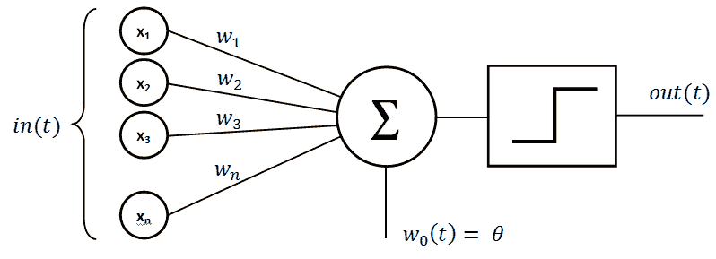
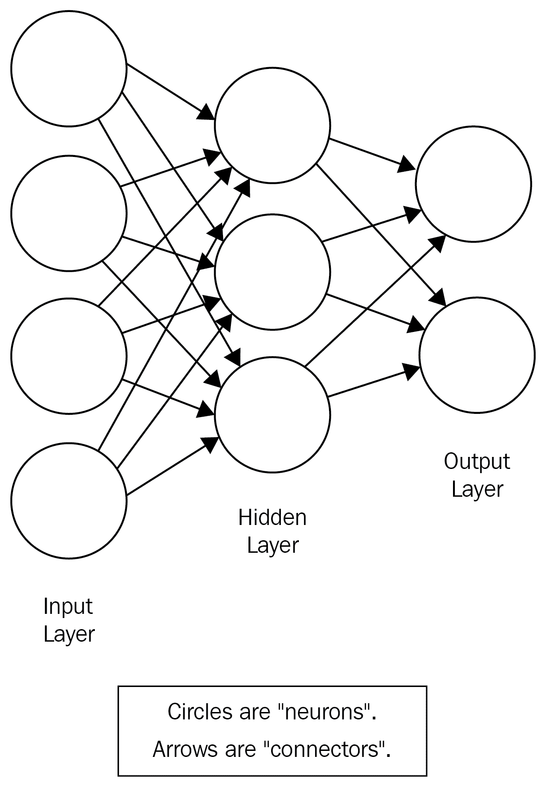
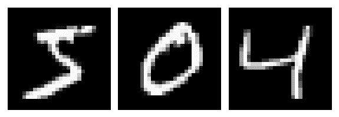
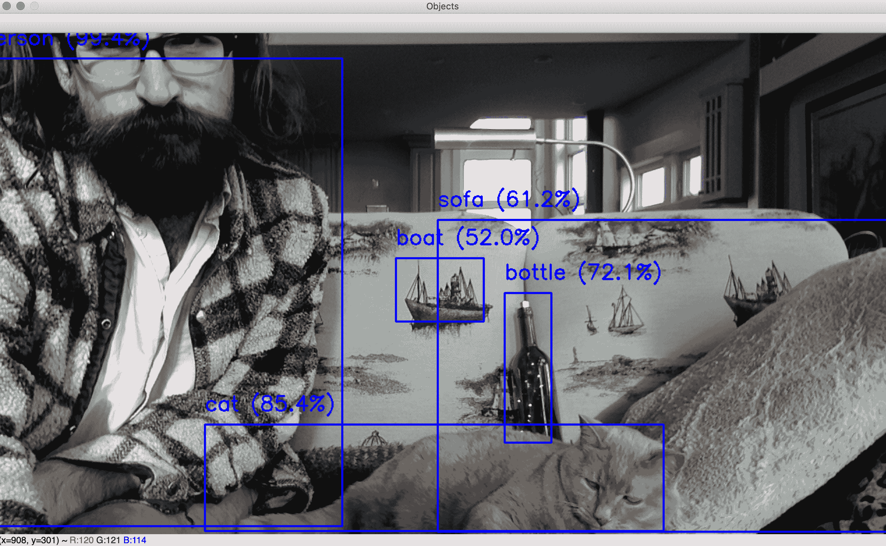
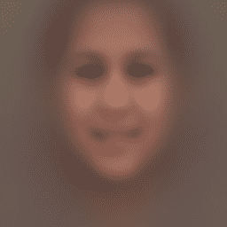

# 十、使用 OpenCV 的神经网络简介

本章介绍了一系列称为**人工神经网络**（**ANNs**）或有时仅称为**神经网络**的机器学习模型。 这些模型的主要特征是它们试图以多层的方式学习变量之间的关系。 在将这些结果合并为一个函数以预测有意义的内容（例如对象的类别）之前，他们学习了多种功能来预测中间结果。 OpenCV 的最新版本包含越来越多的与 ANN 相关的功能-尤其是具有多层的 ANN，称为**深度神经网络**（**DNN**）。 在本章中，我们将对较浅的 ANN 和 DNN 进行试验。

在其他各章中，我们已经对机器学习有所了解，尤其是在第 7 章，“构建自定义对象检测器”中，我们使用 SURF 描述符开发了汽车/非汽车分类器， BoW 和一个 SVM。 以此为基础进行比较，您可能会想知道，人工神经网络有什么特别之处？ 我们为什么将本书的最后一章专门介绍给他们？

人工神经网络旨在在以下情况下提供卓越的准确性：

*   输入变量很多，它们之间可能具有复杂的非线性关系。
*   有许多输出变量，这些变量可能与输入变量具有复杂的非线性关系。 （通常，分类问题中的输出变量是类的置信度得分，因此，如果有很多类，那么会有很多输出变量。）
*   有许多隐藏的（未指定）变量可能与输入和输出变量具有复杂的非线性关系。 DNN 甚至旨在建模*多个*隐变量层，这些隐层主要彼此相关，而不是主要与输入或输出变量相关。

这些情况存在于许多（也许是大多数）现实世界中的问题中。 因此，人工神经网络和 DNN 的预期优势是诱人的。 另一方面，众所周知，人工神经网络（尤其是 DNN）是不透明的模型，因为它们通过预测是否存在可能与其他所有事物有关的任意数量的无名，隐藏变量而起作用。

在本章中，我们将涵盖以下主题：

*   将人工神经网络理解为统计模型和有监督的机器学习工具。
*   了解 ANN 拓扑，或者将 ANN 组织到相互连接的神经元层中。 特别地，我们将考虑使 ANN 能够用作一种分类器的拓扑，称为**多层感知器**（**MLP**）。
*   在 OpenCV 中训练和使用人工神经网络作为分类器。
*   生成检测和识别手写数字（0 到 9）的应用。 为此，我们将基于被广泛使用的称为 MNIST 的数据集训练 ANN，该数据集包含手写数字的样本。
*   在 OpenCV 中加载和使用经过预训练的 DNN。 我们将介绍 DNN 的对象分类，人脸检测和性别分类的示例。

到本章结束时，您将很容易在 OpenCV 中训练和使用 ANN，可以使用来自各种来源的经过预先训练的 DNN，并可以开始探索其他可用来训练自己的 DNN 的库。

# 技术要求

本章使用 Python，OpenCV 和 NumPy。 有关安装说明，请参阅第 1 章，“设置 OpenCV”的[。](01.html)

[本章的完整代码和示例视频可以在本书的 GitHub 存储库中找到](https://github.com/PacktPublishing/Learning-OpenCV-4-Computer-Vision-with-Python-Third-Edition)，位于`chapter10`文件夹中。

# 了解人工神经网络

让我们根据其基本角色和组成部分来定义 ANN。 尽管有关人工神经网络的许多文献都强调它们是通过神经元在大脑中的连接方式*受到生物学启发*，但我们并不需要是生物学家或神经科学家来了解人工神经网络的基本概念。

首先，人工神经网络是**统计模型**。 什么是统计模型？ 统计模型是一对元素，即空间`S`（一组观察值）和概率`P`，其中`P`是近似于`S`的分布（换句话说，一个函数，它生成一组与`S`非常相似的观察结果。

这是思考`P`的两种不同方法：

*   `P`是复杂场景的简化。
*   `P`是首先生成`S`或至少与`S`非常相似的一组观察结果的函数。

因此，人工神经网络是一个模型，它采用一个复杂的现实，对其进行简化，并推导一个函数以（近似）以数学形式表示我们期望从该现实中获得的统计观察结果。

与其他类型的机器学习模型一样，人工神经网络可以通过以下方式之一从观察中学习：

*   **监督学习**：在这种方法下，我们希望模型的训练过程产生一个函数，该函数将一组已知的输入变量映射到一组已知的输出变量。 我们知道，*先验*是预测问题的性质，我们将找到解决该问题的函数的过程委托给了 ANN。 要训​​练模型，我们必须提供输入样本以及正确的相应输出。 对于分类问题，输出变量可以是一个或多个类别的置信度得分。
*   **无监督学习**：在这种方法下，先验不知道输出变量的集合。 模型的训练过程必须产生一组输出变量，以及将输入变量映射到这些输出变量的函数。 对于分类问题，无监督学习可能导致发现先前未知的类别，例如医学数据中的先前未知的疾病。 无监督学习可以使用包括（但不限于）聚类的技术，我们在第 7 章，“构建自定义对象检测器”的 BoW 模型的上下文中对此进行了探讨。
*   **强化学习**：这种方法可以颠倒典型的预测问题。 在训练模型之前，我们已经有一个系统，当我们为一组已知的输入变量输入值时，该系统会为一组已知的输出变量产生值。 我们知道，*先验*是一种基于输出的优劣（合意性）或缺乏而对输出序列进行评分的方法。 但是，我们可能不知道将输入映射到输出的实际函数，或者，即使我们知道它，也是如此复杂，以至于无法为最佳输入求解。 因此，我们希望模型的训练过程能够产生一个函数，该函数根据最后的输出来预测序列中的下一个最优输入。 在训练过程中，模型从分数中学习，该分数最终是由其动作（所选输入）产生的。 从本质上讲，该模型必须学会在特定的奖惩系统中成为优秀的决策者。

在本章的其余部分中，我们将讨论仅限于监督学习，因为这是在计算机视觉环境下进行机器学习的最常用方法。

理解 ANN 的下一步是了解 ANN 如何在简单的统计模型和其他类型的机器学习方面进行改进。

如果生成数据集的函数可能需要大量（未知）输入怎么办？

人工神经网络采用的策略是将工作委托给多个**神经元**，**节点**或**单元**，每个单位都可以近似于创建神经元的功能。 输入。 在数学中，逼近是定义一个更简单的函数的过程，至少对于某些输入范围，其输出类似于更复杂的函数的输出。

近似函数的输出与原始函数的输出之间的差异称为**误差**。 神经网络的定义特征是神经元必须能够逼近非线性函数。

让我们仔细看看神经元。

# 了解神经元和感知器

通常，为了解决分类问题，将 ANN 设计为**多层感知器**（**MLP**），其中每个神经元都充当一种称为**感知器**的二进制分类器。 感知器的概念可以追溯到 1950 年代。 简而言之，感知器是一种需要大量输入并产生单个值的函数。 每个输入具有关联的权重，该权重表示其在**激活函数**中的重要性。 激活函数应具有非线性响应； 例如，S 形函数（有时称为 S 曲线）是常见的选择。 将阈值函数**判别式**应用于激活函数的输出，以将其转换为 0 或 1 的二进制分类。这是此序列的可视化图，左边是输入，激活函数在中间，右边是阈值函数：



输入权重代表什么，如何确定？

在一个神经元的输出可以作为许多其他神经元的输入的范围内，神经元是相互关联的。 每个输入权重定义了两个神经元之间连接的强度。 这些权重是自适应的，这意味着它们会根据学习算法随时间变化。

由于神经元的互连性，网络具有层次。 现在，让我们检查一下通常如何组织这些层。

# 了解神经网络的各层

这是神经网络的直观表示：



如上图所示，神经网络中至少有三个不同的层：**输入层**，**隐藏层**和**输出层**。 可以有多个隐藏层。 但是，一个隐藏层足以解决许多现实生活中的问题。 具有多个隐藏层的神经网络有时称为**深度神经网络**（**DNN**）。

如果我们将 ANN 用作分类器，则每个输出节点的输出值是一个类的置信度得分。 对于给定的样本（即给定的一组输入值），我们想知道哪个输出节点产生最高的输出值。 该得分最高的输出节点对应于预测的类别。

我们如何确定网络的拓扑结构，以及我们需要为每个层创建多少个神经元？ 让我们逐层进行此确定。

# 选择输入层的大小

根据定义，输入层中的节点数是网络的输入数。 例如，假设您要创建一个人工神经网络，以帮助您根据动物的物理属性确定动物的种类。 原则上，我们可以选择任何可测量的属性。 如果我们选择根据重量，长度和牙齿数量对动物进行分类，那就是三个属性的集合，因此我们的网络需要包含三个输入节点。

这三个输入节点是否是物种分类的充分基础？ 好吧，对于现实生活中的问题，当然不是-但是在玩具问题中，这取决于我们试图实现的输出，这是我们接下来要考虑的问题。

# 选择输出层的大小

对于分类器，根据定义，输出层中的节点数就是网络可以区分的分类数。 继续前面的动物分类网络示例，如果我们知道要处理以下动物，则可以使用四个节点的输出层：狗，秃鹰，海豚和龙（！）。 如果我们尝试对不在这些类别之一中的动物的数据进行分类，则网络将预测最有可能与这种无代表性动物相似的类别。

现在，我们遇到了一个困难的问题-隐藏层的大小。

# 选择隐藏层的大小

选择隐藏层的大小没有公认的经验法则。 必须根据实验进行选择。 对于要在其上应用 ANN 的每个实际问题，都需要对 ANN 进行训练，测试和重新训练，直到找到许多可以接受的准确性的隐藏节点。

当然，即使通过实验选择参数值，您也可能希望专家为您的测试建议一个起始值或一系列值。 不幸的是，在这些方面也没有专家共识。 一些专家根据以下广泛建议提供经验法则（这些建议应加盐）：

*   如果输入层很大，则隐藏神经元的数量应在输入层的大小和输出层的大小之间，并且通常应更接近输出层的大小。
*   另一方面，如果输入和输出层都较小，则隐藏层应为最大层。
*   如果输入层较小，但输出层较大，则隐藏层应更接近输入层的大小。

其他专家建议，还应考虑培训样本的数量； 大量的训练样本意味着更多的隐藏节点可能有用。

要记住的一个关键因素是**过拟合**。 与训练数据实际提供的信息相比，当隐藏层中包含如此大量的伪信息时，就会发生过拟合，因此分类不太有意义。 隐藏层越大，为了正确学习而需要的训练数据就越多。 当然，随着训练数据集的大小增加，训练时间也会增加。

对于本章中的一些 ANN 示例项目，我们将使用 60 的隐藏层大小作为起点。 给定一个庞大的训练集，对于各种分类问题，60 个隐藏节点可以产生不错的准确性。

现在，我们对什么是人工神经网络有了一个大致的了解，让我们看看 OpenCV 如何实现它们，以及如何充分利用它们。 我们将从一个最小的代码示例开始。 然后，我们将充实我们在前两节中讨论的以动物为主题的分类器。 最后，我们将努力开发更现实的应用，在该应用中，我们将基于图像数据对手写数字进行分类。

# 在 OpenCV 中训练基本的 ANN

OpenCV 提供了`cv2.ml_ANN_MLP`类，该类将 ANN 实现为**多层感知器**（**MLP**）。 这正是我们之前在“了解神经元和感知器”部分中描述的模型。

要创建`cv2.ml_ANN_MLP`的实例并为该 ANN 的训练和使用格式化数据，我们依赖于 OpenCV 的机器学习模块`cv2.ml`中的功能。 您可能还记得过，这与我们在第 7 章，“构建自定义对象检测器”中用于 SVM 相关功能的模块相同。 此外，`cv2.ml_ANN_MLP`和`cv2.ml_SVM`共享一个称为`cv2.ml_StatModel`的公共基类。 因此，您会发现 OpenCV 为 ANN 和 SVM 提供了类似的 API。

让我们来看一个虚拟的例子，作为对 ANN 的简要介绍。 该示例将使用完全无意义的数据，但它将向我们展示用于在 OpenCV 中训练和使用 ANN 的基本 API：

1.  首先，我们照常导入 OpenCV 和 NumPy：

```py
import cv2
import numpy as np
```

2.  现在，我们创建一个未经训练的人工神经网络：

```py
ann = cv2.ml.ANN_MLP_create()
```

3.  创建 ANN 后，我们需要配置其层数和节点数：

```py
ann.setLayerSizes(np.array([9, 15, 9], np.uint8))
```

层大小由传递给`setLayerSizes`方法的 NumPy 数组定义。 第一个元素是输入层的大小，最后一个元素是输出层的大小，所有中间元素定义隐藏层的大小。 例如，`[9, 15, 9]`指定 9 个输入节点，9 个输出节点以及具有 15 个节点的单个隐藏层。 如果将其更改为`[9, 15, 13, 9]`，它将指定两个分别具有 15 和 13 个节点的隐藏层。

4.  我们还可以配置激活功能，训练方法和训练终止标准，如下所示：

```py
ann.setActivationFunction(cv2.ml.ANN_MLP_SIGMOID_SYM, 0.6, 1.0)
ann.setTrainMethod(cv2.ml.ANN_MLP_BACKPROP, 0.1, 0.1)
ann.setTermCriteria(
    (cv2.TERM_CRITERIA_MAX_ITER | cv2.TERM_CRITERIA_EPS, 100, 1.0))
```

在这里，我们使用对称的 S 型激活函数（`cv2.ml.ANN_MLP_SIGMOID_SYM`）和反向传播训练方法（`cv2.ml.ANN_MLP_BACKPROP`）。 反向传播是一种算法，用于计算输出层的预测误差，从先前的层向后追溯误差的来源，并更新权重以减少误差。

5.  让我们训练 ANN。 我们需要指定训练输入（或 OpenCV 术语中的`samples`），相应的正确输出（或`responses`），以及数据的格式（或`layout`）是每个样本一行还是每个样本一行。 这是一个如何使用单个样本训练模型的示例：

```py
training_samples = np.array(
    [[1.2, 1.3, 1.9, 2.2, 2.3, 2.9, 3.0, 3.2, 3.3]], np.float32)
layout = cv2.ml.ROW_SAMPLE
training_responses = np.array(
    [[0.0, 0.0, 0.0, 0.0, 0.0, 1.0, 0.0, 0.0, 0.0]], np.float32)
data = cv2.ml.TrainData_create(
    training_samples, layout, training_responses)
ann.train(data)
```

实际上，我们希望使用包含一个以上样本的更大数据集来训练任何 ANN。 我们可以通过扩展`training_samples`和`training_responses`使其包含多个行来表示多个样本及其相应的响应，从而做到这一点。 或者，我们可以多次调用 ANN 的`train`方法，每次都使用新数据。 后一种方法需要`train`方法使用一些其他参数，下一节“在多个周期中训练 ANN 分类器”将对此进行演示。

请注意，在这种情况下，我们正在训练 ANN 作为分类器。 每个响应都是一个班级的置信度得分，在这种情况下，有 9 个班级。 我们将通过基于 0 的索引将它们称为 0 到 8 类。在这种情况下，我们的训练样本的响应为`[0.0, 0.0, 0.0, 0.0, 0.0, 1.0, 0.0, 0.0, 0.0]`，这意味着它是 5 类的实例（置信度 1.0），并且它绝对不是任何其他类的实例（因为其他所有类的置信度为 0.0）。

6.  为了完成对 ANN API 的最小介绍，让我们制作另一个示例，对其进行分类并打印结果：

```py
test_samples = np.array(
    [[1.4, 1.5, 1.2, 2.0, 2.5, 2.8, 3.0, 3.1, 3.8]], np.float32)
prediction = ann.predict(test_samples)
print(prediction)
```

这将打印以下结果：

```py
(5.0, array([[-0.08763029, -0.01616517, 0.13196233, 0.0402631 , 0.05711843,
         1.1642447 , 0.18130444, 0.1857026 , -0.07486832]],
      dtype=float32))
```

这意味着所提供的输入被归类为第 5 类。再次，这只是一个虚拟示例，该分类是毫无意义的。 但是，网络行为正常。 在前面的代码中，我们仅提供了一个训练记录，该训练记录是第 5 类的样本，因此网络将新输入归为第 5 类。（据我们有限的训练数据集显示，除 5 以外的其他类可能永远不会发生。）

您可能已经猜到了，预测的输出是一个元组，第一个值是类，第二个值是包含每个类的概率的数组。 预测的类别将具有最高的值。

让我们继续一个更可信的例子-动物分类。

# 在多个周期中训练 ANN 分类器

让我们创建一个 ANN，尝试根据三种度量对动物进行分类：体重，长度和牙齿数量。 当然，这是一个模拟场景。 实际上，没有人会只用这三个统计数据来描述动物。 但是，我们的目的是在将 ANN 应用于图像数据之前，加深对 ANN 的理解。

与上一节中的最小示例相比，我们的动物分类模型将通过以下方式更加复杂：

*   我们将增加隐藏层中神经元的数量。
*   我们将使用更大的训练数据集。 为方便起见，我们将随机生成此数据集。
*   我们将在多个时期训练 ANN，这意味着我们将使用相同的数据集每次对其进行多次训练和重新训练。

隐藏层中神经元的数量是重要的参数，需要进行测试才能优化任何 ANN 的准确性。 您会发现，较大的隐藏层可以在一定程度上提高准确性，然后过拟合，除非您开始使用庞大的训练数据集进行补偿。 同样，在一定程度上，更多的时期可能会提高准确性，但过多的时期会导致过拟合。

让我们逐步执行一下实现：

1.  首先，我们照例导入 OpenCV 和 NumPy。 然后，从 Python 标准库中，导入`randint`函数以生成伪随机整数，并导入`uniform`函数以生成伪随机浮点数：

```py
import cv2
import numpy as np
from random import randint, uniform
```

2.  接下来，我们创建并配置 ANN。 这次，我们使用三个神经元输入层，一个 50 神经元隐藏层和一个四个神经元输出层，如以下代码中以粗体突出显示：

```py
animals_net = cv2.ml.ANN_MLP_create()
animals_net.setLayerSizes(np.array([3, 50, 4]))
animals_net.setActivationFunction(cv2.ml.ANN_MLP_SIGMOID_SYM, 0.6, 1.0)
animals_net.setTrainMethod(cv2.ml.ANN_MLP_BACKPROP, 0.1, 0.1)
animals_net.setTermCriteria(
    (cv2.TERM_CRITERIA_MAX_ITER | cv2.TERM_CRITERIA_EPS, 100, 1.0))
```

3.  现在，我们需要一些数据。 我们对准确地代表动物并不感兴趣。 我们只需要一堆记录作为训练数据即可。 因此，我们定义四个函数以生成不同类别的随机样本，另外定义四个函数以生成正确的分类结果以进行培训：

```py
"""Input arrays
weight, length, teeth
"""

"""Output arrays
dog, condor, dolphin, dragon
"""

def dog_sample():
    return [uniform(10.0, 20.0), uniform(1.0, 1.5),
        randint(38, 42)]

def dog_class():
    return [1, 0, 0, 0]

def condor_sample():
    return [uniform(3.0, 10.0), randint(3.0, 5.0), 0]

def condor_class():
    return [0, 1, 0, 0]

def dolphin_sample():
    return [uniform(30.0, 190.0), uniform(5.0, 15.0), 
        randint(80, 100)]

def dolphin_class():
    return [0, 0, 1, 0]

def dragon_sample():
    return [uniform(1200.0, 1800.0), uniform(30.0, 40.0), 
        randint(160, 180)]

def dragon_class():
    return [0, 0, 0, 1]
```

4.  我们还定义了以下辅助函数，以便将样本和分类转换为一对 NumPy 数组：

```py
def record(sample, classification):
    return (np.array([sample], np.float32),
            np.array([classification], np.float32))
```

5.  让我们继续创建假动物数据。 我们将为每个课程创建 20,000 个样本：

```py
RECORDS = 20000
records = []
for x in range(0, RECORDS):
    records.append(record(dog_sample(), dog_class()))
    records.append(record(condor_sample(), condor_class()))
    records.append(record(dolphin_sample(), dolphin_class()))
    records.append(record(dragon_sample(), dragon_class()))
```

6.  现在，让我们训练 ANN。 正如我们在本节开头所讨论的，我们将使用多个训练时期。 每个时期都是循环的迭代，如以下代码所示：

```py
EPOCHS = 10
for e in range(0, EPOCHS):
    print("epoch: %d" % e)
    for t, c in records:
        data = cv2.ml.TrainData_create(t, cv2.ml.ROW_SAMPLE, c)
        if animals_net.isTrained():
            animals_net.train(data, cv2.ml.ANN_MLP_UPDATE_WEIGHTS | cv2.ml.ANN_MLP_NO_INPUT_SCALE | cv2.ml.ANN_MLP_NO_OUTPUT_SCALE)
        else:
            animals_net.train(data, cv2.ml.ANN_MLP_NO_INPUT_SCALE | cv2.ml.ANN_MLP_NO_OUTPUT_SCALE)
```

对于具有庞大且多样化的训练数据集的实际问题，ANN 可能会受益于数百个训练时期。 为了获得最佳结果，您可能希望继续训练和测试 ANN，直到达到收敛为止，这意味着进一步的时代将不再对结果的准确性产生明显的改善。

请注意，我们必须将`cv2.ml.ANN_MLP_UPDATE_WEIGHTS`标志传递给 ANN 的`train`函数，以更新以前训练的模型，而不是从头开始训练新的模型。 这是每当您逐步训练模型时都必须记住的关键点，就像我们在这里所做的那样。

7.  训练完我们的人工神经网络后，我们应该进行测试。 对于每个类别，让我们生成 100 个新的随机样本，使用 ANN 对其进行分类，并跟踪正确分类的数量：

```py
TESTS = 100

dog_results = 0
for x in range(0, TESTS):
    clas = int(animals_net.predict(
        np.array([dog_sample()], np.float32))[0])
    print("class: %d" % clas)
    if clas == 0:
        dog_results += 1

condor_results = 0
for x in range(0, TESTS):
    clas = int(animals_net.predict(
        np.array([condor_sample()], np.float32))[0])
    print("class: %d" % clas)
    if clas == 1:
        condor_results += 1

dolphin_results = 0
for x in range(0, TESTS):
    clas = int(animals_net.predict(
        np.array([dolphin_sample()], np.float32))[0])
    print("class: %d" % clas)
    if clas == 2:
        dolphin_results += 1

dragon_results = 0
for x in range(0, TESTS):
    clas = int(animals_net.predict(
        np.array([dragon_sample()], np.float32))[0])
    print("class: %d" % clas)
    if clas == 3:
        dragon_results += 1
```

8.  最后，让我们打印准确性统计信息：

```py
print("dog accuracy: %.2f%%" % (100.0 * dog_results / TESTS))
print("condor accuracy: %.2f%%" % (100.0 * condor_results / TESTS))
print("dolphin accuracy: %.2f%%" % \
    (100.0 * dolphin_results / TESTS))
print("dragon accuracy: %.2f%%" % (100.0 * dragon_results / TESTS))
```

当我们运行脚本时，前面的代码块应产生以下输出：

```py
dog accuracy: 100.00%
condor accuracy: 100.00%
dolphin accuracy: 100.00%
dragon accuracy: 100.00%
```

由于我们正在处理随机数据，因此每次您运行脚本时，结果可能会有所不同。 通常，由于我们已经建立了一个简单的分类问题，即输入数据的范围不重叠，因此准确性应该很高甚至是完美的。 （狗的随机权重值的范围与龙的范围不重叠，依此类推。）

您可能需要花一些时间来尝试以下修改（一次进行一次），以便了解 ANN 的准确性如何受到影响：

*   通过修改`RECORDS`变量的值来更改训练样本的数量。
*   通过修改`EPOCHS`变量的值来更改训练时期的数量。
*   通过在`dog_sample`，`condor_sample`，`dolphin_sample`和`dragon_sample`函数中编辑`uniform`和`randint`函数调用的参数，使输入数据的范围部分重叠。

准备就绪后，我们将继续一个包含真实图像数据的示例。 这样，我们将训练 ANN 来识别手写数字。

# 用人工神经网络识别手写数字

手写数字是 10 个阿拉伯数字（0 到 9）中的任何一个，用笔或铅笔手动书写，而不是用机器打印。 手写数字的外观可能会有很大差异。 不同的人有不同的笔迹，并且-一个熟练的书法家可能会例外-一个人每次书写都不会产生相同的数字。 这种可变性意味着手写数字的视觉识别对于机器学习来说是一个不小的问题。 确实，机器学习的学生和研究人员经常通过尝试训练手写数字的准确识别器来测试他们的技能和新算法。 我们将通过以下方式应对这一挑战：

1.  从 MNIST 数据库的 Python 友好版本加载数据。 这是一个广泛使用的数据库，其中包含手写数字的图像。
2.  使用 MNIST 数据，在多个时期训练 ANN。
3.  加载一张纸上有许多手写数字的图像。
4.  基于轮廓分析，检测纸张上的各个数字。
5.  使用我们的人工神经网络对检测到的数字进行分类。
6.  查看结果，以确定我们的探测器和基于 ANN 的分类器的准确性。

在深入研究实现之前，让我们回顾一下有关 MNIST 数据库的信息。

# 了解 MNIST 手写数字数据库

可在[这个页面](http://yann.lecun.com/exdb/mnist/)上公开获得 **MNIST** 数据库（或**美国国家标准混合技术研究院**数据库）。该数据库包括一个包含 60,000 个手写数字图像的训练集。 其中一半是由美国人口普查局的雇员撰写的，而另一半是由美国的高中生撰写的。

该数据库还包括从同一作者那里收集的 10,000 张图像的测试集。 所有训练和测试图像均为灰度格式，尺寸为`28 x 28`像素。 在黑色背景上，数字为白色（或灰色阴影）。 例如，以下是 MNIST 训练样本中的三个：



作为使用 MNIST 的替代方法，您当然可以自己构建一个类似的数据库。 这将涉及收集大量手写数字的图像，将图像转换为灰度图像，对其进行裁剪以使每个图像在标准化位置均包含一个数字，然后缩放图像以使它们都具有相同的大小。 您还需要标记图像，以便程序可以读取正确的分类，以训练和测试分类器。

许多作者提供了有关如何将 MNIST 数据库与各种机器学习库和算法结合使用的示例-不仅是 OpenCV，还不仅仅是 ANN。 免费在线书籍《神经网络和深度学习》的作者 Michael Nielsen [在这里为 MNIST 和 ANN 专门撰写了一章](http://neuralnetworksanddeeplearning.com/chap1.html)。 他展示了如何仅使用 NumPy 几乎从头开始实现 ANN，如果您想加深对 OpenCV 公开的高级功能的了解，那么这是一本非常好的读物。 他的代码可在 [GitHub](https://github.com/mnielsen/neural-networks-and-deep-learning) 上免费获得。

Nielsen 提供了 MNIST 版本，为`PKL.GZ`（gzip 压缩的 Pickle）文件，可以轻松地将其加载到 Python 中。 出于本书 OpenCV 示例的目的，我们（作者）采用了 Nielsen 的 MNIST 的`PKL.GZ`版本，为我们的目的对其进行了重组，并将其放置在本书的`chapter10/digits_data/mnist.pkl.gz`的 GitHub 存储库中。

既然我们已经了解了 MNIST 数据库，那么让我们考虑一下适合该训练集的 ANN 参数。

# 为 MNIST 数据库选择训练参数

每个 MNIST 样本都是一个包含 784 像素（即`28 x 28`像素）的图像。 因此，我们的人工神经网络的输入层将具有 784 个节点。 输出层将有 10 个节点，因为有 10 类数字（0 到 9）。

我们可以自由选择其他参数的值，例如隐藏层中的节点数，要使用的训练样本数以及训练时期数。 与往常一样，实验可以帮助我们找到可提供可接受的训练时间和准确性的值，而不会使模型过度适合训练数据。 根据本书作者所做的一些实验，我们将使用 60 个隐藏节点，50,000 个训练样本和 10 个纪元。 这些参数足以进行初步测试，将培训时间缩短至几分钟（取决于计算机的处理能力）。

# 实现训练 ANN 的模块

您也可能希望在未来的项目中基于 MNIST 训练 ANN。 为了使我们的代码更具可重用性，我们可以编写一个专门用于此培训过程的 Python 模块。 然后（在下一节“实现主模块”中），我们将把这个训练模块导入到主模块中，在这里我们将进行数字检测和分类的演示。

让我们在名为`digits_ann.py`的文件中实现培训模块：

1.  首先，我们将从 Python 标准库中导入`gzip`和`pickle`模块。 和往常一样，我们还将导入 OpenCV 和 NumPy：

```py
import gzip
import pickle

import cv2
import numpy as np
```

我们将使用`gzip`和`pickle`模块解压缩并从`mnist.pkl.gz`文件中加载 MNIST 数据。 我们之前在“了解 MNIST 手写数字数据库”部分中简要提到了此文件。 它包含嵌套元组中的 MNIST 数据，格式如下：

```py
((training_images, training_ids),
 (test_images, test_ids))
```

反过来，这些元组的元素具有以下格式：

2.  让我们编写以下帮助函数来解压缩并加载`mnist.pkl.gz`的内容：

```py
def load_data():
    mnist = gzip.open('./digits_data/mnist.pkl.gz', 'rb')
    training_data, test_data = pickle.load(mnist)
    mnist.close()
    return (training_data, test_data)
```

注意，在前面的代码中，`training_data`是一个元组，等效于`(training_images, training_ids)`，`test_data`也是一个元组，等效于`(test_images, test_ids)`。

3.  我们必须重新格式化原始数据，以匹配 OpenCV 期望的格式。 具体来说，当我们提供用于训练 ANN 的样本输出时，它必须是具有 10 个元素（用于 10 类数字）的向量，而不是单个数字 ID。 为方便起见，我们还将应用 Python 内置的`zip`函数以一种可以对匹配的输入和输出向量对（如元组）进行迭代的方式来重组数据。 让我们编写以下辅助函数来重新格式化数据：

```py
def wrap_data():
    tr_d, te_d = load_data()
    training_inputs = tr_d[0]
    training_results = [vectorized_result(y) for y in tr_d[1]]
    training_data = zip(training_inputs, training_results)
    test_data = zip(te_d[0], te_d[1])
    return (training_data, test_data)
```

4.  请注意，前面的代码调用`load_data`和另一个帮助函数`vectorized_result`。 后者将 ID 转换为分类向量，如下所示：

```py
def vectorized_result(j):
    e = np.zeros((10,), np.float32)
    e[j] = 1.0
    return e
```

例如，将 ID `1`转换为包含值`[0.0, 1.0, 0.0, 0.0, 0.0, 0.0, 0.0, 0.0, 0.0\. 0.0]`的 NumPy 数组。 您可能已经猜到，这个由 10 个元素组成的数组对应于 ANN 的输出层，我们在训练 ANN 时可以将其用作正确输出的样本。

先前的功能`load_data`，`wrap_data`和`vectorized_result`已从 Nielsen 的代码中进行了修改，以加载他的`mnist.pkl.gz`版本。 有关 Nielsen 的工作的更多信息，请参阅本章的“了解 MNIST 手写数字数据库”部分。

5.  到目前为止，我们已经编写了用于加载和重新格式化 MNIST 数据的函数。 现在，让我们编写一个函数来创建未经训练的 ANN：

```py
def create_ann(hidden_nodes=60):
    ann = cv2.ml.ANN_MLP_create()
    ann.setLayerSizes(np.array([784, hidden_nodes, 10]))
    ann.setActivationFunction(cv2.ml.ANN_MLP_SIGMOID_SYM, 0.6, 1.0)
    ann.setTrainMethod(cv2.ml.ANN_MLP_BACKPROP, 0.1, 0.1)
    ann.setTermCriteria(
        (cv2.TERM_CRITERIA_MAX_ITER | cv2.TERM_CRITERIA_EPS,
         100, 1.0))
    return ann
```

请注意，我们已经根据 MNIST 数据的性质对输入和输出层的大小进行了硬编码。 但是，我们允许此函数的调用者指定隐藏层中的节点数。

有关参数的进一步讨论，请参考本章“选择 MNIST 数据库的训练参数”。

6.  现在，我们需要一个训练功能，允许调用者指定 MNIST 训练样本的数量和时期的数量。 我们以前的 ANN 样本应该熟悉很多训练功能，因此让我们看一下整个实现，然后再讨论一些细节：

```py
def train(ann, samples=50000, epochs=10):

    tr, test = wrap_data()

    # Convert iterator to list so that we can iterate multiple 
    # times in multiple epochs.
    tr = list(tr)

    for epoch in range(epochs):
        print("Completed %d/%d epochs" % (epoch, epochs))
        counter = 0
        for img in tr:
            if (counter > samples):
                break
            if (counter % 1000 == 0):
                print("Epoch %d: Trained on %d/%d samples" % \
                      (epoch, counter, samples))
            counter += 1
            sample, response = img
            data = cv2.ml.TrainData_create(
                np.array([sample], dtype=np.float32),
                cv2.ml.ROW_SAMPLE,
                np.array([response], dtype=np.float32))
            if ann.isTrained():
                ann.train(data, cv2.ml.ANN_MLP_UPDATE_WEIGHTS | cv2.ml.ANN_MLP_NO_INPUT_SCALE | cv2.ml.ANN_MLP_NO_OUTPUT_SCALE)
            else:
                ann.train(data, cv2.ml.ANN_MLP_NO_INPUT_SCALE | cv2.ml.ANN_MLP_NO_OUTPUT_SCALE)
    print("Completed all epochs!")

    return ann, test
```

请注意，我们加载数据，然后通过迭代指定数量的训练时期（每个时期中都有指定数量的样本）来递增地训练 ANN。 对于我们处理的每 1,000 个培训样本，我们会打印一条有关培训进度的消息。 最后，我们同时返回经过训练的 ANN 和 MNIST 测试数据。 我们可能刚刚返回了 ANN，但是如果我们想检查 ANN 的准确性，则手头准备测试数据会很有用。

7.  当然，经过训练的 ANN 的目的是进行预测，因此我们将提供以下`predict`函数，以便包装 ANN 自己的`predict`方法：

```py
def predict(ann, sample):
    if sample.shape != (784,):
        if sample.shape != (28, 28):
            sample = cv2.resize(sample, (28, 28),
                                interpolation=cv2.INTER_LINEAR)
        sample = sample.reshape(784,)
    return ann.predict(np.array([sample], dtype=np.float32))
```

该功能获取训练有素的人工神经网络和样本图像； 它通过确保样本图像为`28 x 28`并通过调整大小（如果不是）来执行最少的数据清理。 然后，它将图像数据展平为向量，然后再将其提供给 ANN 进行分类。

这就是我们支持演示应用所需的所有与 ANN 相关的功能。 但是，让我们还实现一个`test`函数，该函数通过对一组给定的测试数据（例如 MNIST 测试数据）进行分类来测量经过训练的 ANN 的准确性。 以下是相关代码：

```py
def test(ann, test_data):
    num_tests = 0
    num_correct = 0
    for img in test_data:
        num_tests += 1
        sample, correct_digit_class = img
        digit_class = predict(ann, sample)[0]
        if digit_class == correct_digit_class:
            num_correct += 1
    print('Accuracy: %.2f%%' % (100.0 * num_correct / num_tests))
```

现在，让我们走一小段弯路，编写一个利用所有前面的代码和 MNIST 数据集的最小测试。 之后，我们将继续实现演示应用的主要模块。

# 实现最小的测试模块

让我们创建另一个脚本`test_digits_ann.py`，以测试`digits_ann`模块中的功能。 测试脚本非常简单； 这里是：

```py
from digits_ann import create_ann, train, test

ann, test_data = train(create_ann())
test(ann, test_data)
```

请注意，我们尚未指定隐藏节点的数量，因此`create_ann`将使用其默认参数值：60 个隐藏节点。 同样，`train`将使用其默认参数值：50,000 个样本和 10 个历元。

当我们运行此脚本时，它应打印类似于以下内容的培训和测试信息：

```py
Completed 0/10 epochs
Epoch 0: Trained on 0/50000 samples
Epoch 0: Trained on 1000/50000 samples
... [more reports on progress of training] ...
Completed all epochs!
Accuracy: 95.39%
```

在这里，我们可以看到，对 MNIST 数据集中的 10,000 个测试样本进行分类时，ANN 的准确率达到了 95.39%。 这是一个令人鼓舞的结果，但让我们看一下 ANN 的概括程度。 是否可以对来自与 MNIST 无关的完全不同来源的数据进行准确分类？ 我们的主要应用会从我们自己的一张纸的图像中检测数字，这将给分类器带来这种挑战。

# 实现主要模块

我们的演示程序的主要脚本吸收了本章中有关 ANN 和 MNIST 的所有知识，并将其与我们在前几章中研究的一些对象检测技术相结合。 因此，从很多方面来说，这对我们来说都是一个顶点项目。

让我们在名为`detect_and_classify_digits.py`的新文件中实现主脚本：

1.  首先，我们将导入 OpenCV，NumPy 和我们的`digits_ann`模块：

```py
import cv2
import numpy as np

import digits_ann
```

2.  现在，让我们编写一些辅助函数来分析和调整数字和其他轮廓的边界矩形。 如前几章所述，重叠检测是一个常见问题。 以下称为`inside`的函数将帮助我们确定一个边界矩形是否完全包含在另一个边界矩形内：

```py
def inside(r1, r2):
    x1, y1, w1, h1 = r1
    x2, y2, w2, h2 = r2
    return (x1 > x2) and (y1 > y2) and (x1+w1 < x2+w2) and \
            (y1+h1 < y2+h2)
```

借助`inside`功能，我们将能够轻松地为每个数字选择最外面的矩形。 这很重要，因为我们不希望检测器遗漏任何手指的四肢。 这样的检测错误可能使分类器的工作变得不可能。 例如，如果我们仅检测到数字的下半部分 8，则分类器可能会合理地将该区域视为 0。

为了进一步确保边界矩形满足分类器的需求，我们将使用另一个名为`wrap_digit`的辅助函数，将紧密拟合的边界矩形转换为带有围绕数字填充的正方形。 请记住，MNIST 数据包含`28 x 28`像素的数字正方形图像，因此在尝试使用 MNIST 训练的 ANN 对其进行分类之前，我们必须将任何兴趣区域重新缩放至此大小。 通过使用填充的边界正方形而不是紧密拟合的边界矩形，我们确保骨感数字（例如 1）和粗体数字（例如 0）不会不同地拉伸。

3.  让我们看一下`wrap_digit`的实现。 首先，我们修改矩形的较小尺寸（宽度或高度），使其等于较大尺寸，然后修改矩形的`x`或`y`位置，以使中心保持不变：

```py
def wrap_digit(rect, img_w, img_h):

    x, y, w, h = rect

    x_center = x + w//2
    y_center = y + h//2
    if (h > w):
        w = h
        x = x_center - (w//2)
    else:
        h = w
        y = y_center - (h//2)
```

4.  接下来，我们在所有侧面添加 5 像素填充：

```py
    padding = 5
    x -= padding
    y -= padding
    w += 2 * padding
    h += 2 * padding
```

在这一点上，我们修改后的矩形可能会延伸到图像外部。

5.  为了避免超出范围的问题，我们对矩形进行裁剪，使其完全位于图像内。 在这些边缘情况下，这可能会给我们留下非正方形的矩形，但这是可以接受的折衷方案。 我们宁愿使用感兴趣的非正方形区域，而不是仅仅因为它位于图像的边缘而完全抛弃检测到的数字。 这是用于边界检查和裁剪矩形的代码：

```py
    if x < 0:
        x = 0
    elif x > img_w:
        x = img_w

    if y < 0:
        y = 0
    elif y > img_h:
        y = img_h

    if x+w > img_w:
        w = img_w - x

    if y+h > img_h:
        h = img_h - y
```

6.  最后，我们返回修改后的矩形的坐标：

```py
    return x, y, w, h
```

到此结束`wrap_digit`辅助函数的实现。

7.  现在，让我们进入程序的主要部分。 在这里，我们首先创建一个 ANN 并在 MNIST 数据上对其进行训练：

```py
ann, test_data = digits_ann.train(
    digits_ann.create_ann(60), 50000, 10)
```

请注意，我们正在使用`digits_ann`模块中的`create_ann`和`train`函数。 如前所述（“在 MNIST 数据库中选择参数”），我们正在使用 60 个隐藏节点，50,000 个训练样本和 10 个历元。 尽管这些是函数的默认参数值，但无论如何我们还是在这里指定它们，以便以后我们想尝试其他值时更易于查看和修改。*

8.  现在，让我们在一张白纸上加载一个包含许多手写数字的测试图像：

```py
img_path = "./digit_img/digits_0.jpg"
img = cv2.imread(img_path, cv2.IMREAD_COLOR)
```

我们使用的是乔·米尼诺（Joe Minichino）手写的以下图像（但是，当然，您可以根据需要替换其他图像）：


9.  让我们将图像转换为灰度并使其模糊，以消除噪点并使墨水的暗度更加均匀：

```py
gray = cv2.cvtColor(img, cv2.COLOR_BGR2GRAY)
cv2.GaussianBlur(gray, (7, 7), 0, gray)
```

10.  现在我们有了一个平滑的灰度图像，我们可以应用一个阈值和一些形态学操作，以确保数字与背景脱颖而出，并且轮廓相对没有不规则性，这可能会超出预测。 以下是相关代码：

```py
ret, thresh = cv2.threshold(gray, 127, 255, cv2.THRESH_BINARY_INV)
erode_kernel = np.ones((2, 2), np.uint8)
thresh = cv2.erode(thresh, erode_kernel, thresh, iterations=2)
```

注意阈值标志`cv2.THRESH_BINARY_INV`，它是反二进制阈值。 由于 MNIST 数据库中的样本是黑底白字（而不是黑底白字），因此我们将图像转换为带有白色数字的黑色背景。 我们将阈值图像用于检测和分类。

11.  进行形态学操作后，我们需要分别检测图片中的每个数字。 为此，首先，我们需要找到轮廓：

```py
contours, hier = cv2.findContours(thresh, cv2.RETR_TREE,
                                  cv2.CHAIN_APPROX_SIMPLE)
```

12.  然后，我们遍历轮廓并找到其边界矩形。 我们丢弃任何我们认为太大或太小而无法数字化的矩形。 我们还将丢弃完全包含在其他矩形中的所有矩形。 其余的矩形将追加到一个良好的矩形列表中（我们相信），这些矩形包含单个数字。 让我们看下面的代码片段：

```py
rectangles = []

img_h, img_w = img.shape[:2]
img_area = img_w * img_h
for c in contours:

    a = cv2.contourArea(c)
    if a >= 0.98 * img_area or a <= 0.0001 * img_area:
        continue

    r = cv2.boundingRect(c)
    is_inside = False
    for q in rectangles:
        if inside(r, q):
            is_inside = True
            break
    if not is_inside:
        rectangles.append(r)
```

13.  现在我们有了一个好的矩形列表，可以遍历它们，使用`wrap_digit`函数对它们进行清理，并对其中的图像数据进行分类：

```py
for r in rectangles:
    x, y, w, h = wrap_digit(r, img_w, img_h)
    roi = thresh[y:y+h, x:x+w]
    digit_class = int(digits_ann.predict(ann, roi)[0])
```

14.  此外，在对每个数字进行分类之后，我们绘制了经过清理的边界矩形和分类结果：

```py
    cv2.rectangle(img, (x,y), (x+w, y+h), (0, 255, 0), 2)
    cv2.putText(img, "%d" % digit_class, (x, y-5),
                cv2.FONT_HERSHEY_SIMPLEX, 1, (255, 0, 0), 2)
```

15.  处理完所有兴趣区域后，我们将保存阈值图像和带有完整注释的图像，并显示它们，直到用户按下任何键以结束程序为止：

```py
cv2.imwrite("detected_and_classified_digits_thresh.png", thresh)
cv2.imwrite("detected_and_classified_digits.png", img)
cv2.imshow("thresh", thresh)
cv2.imshow("detected and classified digits", img)
cv2.waitKey()
```

脚本到此结束。 运行它时，我们应该看到阈值图像以及检测和分类结果的可视化。 （最初两个窗口可能重叠，因此您可能需要移动一个窗口才能看到另一个窗口。）这是阈值图像：


这是结果的可视化：


该图像包含 110 个采样位：从 0 到 9 的一位数字中的 10 位，再加上从 10 到 59 的两位数字中的 100 位。在这 110 个采样中，可以正确检测到 108 个采样的边界，这意味着，探测器的准确度为 98.18%。 然后，在这 108 个正确检测的样本中，对 80 个样本的分类结果是正确的，这意味着 ANN 分类器的准确性为 74.07%。 这比随机分类器要好得多，后者只能在 10% 的时间内正确分类一个数字。

因此，ANN 显然能够学习一般地对手写数字进行分类，而不仅仅是 MNIST 训练和测试数据集中的数字。 让我们考虑一些改善学习的方法。

# 试图改善人工神经网络的训练

我们可以对培训 ANN 的问题进行一些潜在的改进。 我们已经提到了其中一些潜在的改进，但让我们在这里进行回顾：

*   您可以尝试训练数据集的大小，隐藏节点的数量和时期的数量，直到找到最高的准确性。
*   您可以修改`digits_ann.create_ann`函数，使其支持多个隐藏层。
*   您也可以尝试其他激活功能。 我们使用了`cv2.ml.ANN_MLP_SIGMOID_SYM`，但这不是唯一的选择。 其他包括`cv2.ml.ANN_MLP_IDENTITY`，`cv2.ml.ANN_MLP_GAUSSIAN`，`cv2.ml.ANN_MLP_RELU`和`cv2.ml.ANN_MLP_LEAKYRELU`。
*   同样，您可以尝试不同的训练方法。 我们使用了`cv2.ml.ANN_MLP_BACKPROP`。 其他选项包括`cv2.ml.ANN_MLP_RPROP`和`cv2.ml.ANN_MLP_ANNEAL`。

有关 OpenCV 中与 ANN 相关的参数的更多信息，请访问[这个页面](https://docs.opencv.org/master/d0/dce/classcv_1_1ml_1_1ANN__MLP.html)上的官方文档。

除了试验参数外，请仔细考虑您的应用需求。 例如，您的分类器将在哪里和由谁使用？ 并非每个人都以相同的方式绘制数字。 确实，不同国家的人们倾向于以略有不同的方式得出数字。

MNIST 数据库是在美国编译的，数字 7 与手写字符 7 一样是手写的。但是，在欧洲，数字 7 通常是用数字的对角线部分中间的一条小水平线手写的。 引入此笔划是为了帮助区分手写数字 7 和手写数字 1。

有关区域手写变化的更详细概述，请查看 Wikipedia 上有关该主题的文章，这是一个很好的介绍，可在[这个页面](https://en.wikipedia.org/wiki/Regional_handwriting_variation)上找到。

这种变化意味着在 MNIST 数据库上训练的 ANN 在应用于欧洲手写数字的分类时可能不太准确。 为了避免这样的结果，您可以选择创建自己的训练数据集。 在几乎所有情况下，最好利用属于当前应用域的训练数据。

最后，请记住，一旦对分类器的准确性感到满意，就可以随时将其保存并稍后重新加载，这样它就可以在应用中使用，而不必每次都训练 ANN。

该界面类似于在“保存和加载受过训练的 SVM”部分中看到的界面，该部分接近第 7 章，“构建自定义对象检测器”。 具体来说，您可以使用以下代码将经过训练的 ANN 保存到 XML 文件：

```py
ann = cv2.ml.ANN_MLP_create()
data = cv2.ml.TrainData_create(
    training_samples, layout, training_responses)
ann.train(data)
ann.save('my_ann.xml')
```

随后，您可以使用如下代码重新加载经过训练的 ANN：

```py
ann = cv2.ml.ANN_MLP_create()
ann.load('my_ann.xml')
```

既然我们已经学习了如何为手写数字分类创建可重用的 ANN，让我们考虑一下这种分类器的用例。

# 寻找其他潜在的应用

前面的演示仅是手写识别应用的基础。 您可以轻松地将方法扩展到视频并实时检测手写数字，也可以训练 ANN 识别整个字母，以实现完整的**光学字符识别**（**OCR**）系统。

汽车牌照的检测和识别将是到目前为止我们所学课程的另一个有用的扩展。 车牌上的字符具有一致的外观（至少在给定的国家/地区内），这应该是问题的 OCR 部分的简化因素。

您也可以尝试将 ANN 应用于以前使用过 SVM 的问题，反之亦然。 这样，您可以看到它们的准确性如何与不同类型的数据进行比较。 回想一下，在第 7 章，“构建自定义对象检测器”中，我们使用 SIFT 描述符作为 SVM 的输入。 同样，人工神经网络能够处理高级描述符，而不仅仅是普通的旧像素数据。

如我们所见，`cv2.ml_ANN_MLP`类用途广泛，但实际上，它仅涵盖了 ANN 设计方法的一小部分。 接下来，我们将了解 OpenCV 对更复杂的**深度神经网络**（**DNN**）的支持，这些网络可以通过其他各种框架进行训练。

# 在 OpenCV 中使用其他框架的 DNN

OpenCV 可以加载和使用在以下任何框架中经过培训的 DNN：

*   [Caffe](http://caffe.berkeleyvision.org/)
*   [TensorFlow](https://www.tensorflow.org/)
*   [Torch](http://torch.ch/)
*   [Darknet](https://pjreddie.com/darknet/)
*   [ONNX](https://onnx.ai/)
*   [DLDT](https://github.com/opencv/dldt/)

**深度学习部署工具包**（**DLDT**）是[英特尔 OpenVINO 工具包](https://software.intel.com/openvino-toolkit/)的一部分。 DLDT 提供了用于优化其他框架中的 DNN 并将其转换为通用格式的工具。 兼容 DLDT 的模型的集合可在称为[开放模型动物园](https://github.com/opencv/open_model_zoo/)的存储库中免费获得。 DLDT，开放模型动物园和 OpenCV 在其开发团队中拥有一些相同的人。 这三个项目均由英特尔赞助。

这些框架使用各种文件格式来存储经过训练的 DNN。 其中一些框架使用了一对文件格式的组合：一个用于描述模型参数的文本文件，以及一个用于存储模型本身的二进制文件。 以下代码段显示了与从每个框架加载模型相关的文件类型和 OpenCV 函数：

```py
caffe_model = cv2.dnn.readNetFromCaffe(
    'my_model_description.protext', 'my_model.caffemodel')

tensor_flow_model = cv2.dnn.readNetFromTensorflow(
    'my_model.pb', 'my_model_description.pbtxt')

# Some Torch models use the .t7 extension and others use
# the .net extension.
torch_model_0 = cv2.dnn.readNetFromTorch('my_model.t7')
torch_model_1 = cv2.dnn.readNetFromTorch('my_model.net')

darknet_model = cv2.dnn.readNetFromDarket(
    'my_model_description.cfg', 'my_model.weights')

onnx_model = cv2.dnn.readNetFromONNX('my_model.onnx')

dldt_model = cv2.dnn.readNetFromModelOptimizer(
    'my_model_description.xml', 'my_model.bin')
```

加载模型后，我们需要预处理将用于模型的数据。 必要的预处理特定于给定 DNN 的设计和训练方式，因此，每当我们使用第三方 DNN 时，我们都必须了解该 DNN 的设计和训练方式。 OpenCV 提供了`cv2.dnn.blobFromImage`函数，该函数可以执行一些常见的预处理步骤，具体取决于我们传递给它的参数。 在将数据传递给此功能之前，我们可以手动执行其他预处理步骤。

神经网络的输入向量有时称为**张量**或 **Blob**，因此称为函数名称`cv2.dnn.blobFromImage`。

让我们继续来看一个实际的示例，在该示例中，我们将看到第三方 DNN 的运行。

# 使用第三方 DNN 检测和分类对象

对于此演示，我们将实时捕获来自网络摄像头的帧，并使用 DNN 来检测和分类任何给定帧中可能存在的 20 种对象。 是的，单个 DNN 可以在程序员可能使用的典型笔记本电脑上实时完成所有这些操作！

在深入研究代码之前，让我们介绍一下我们将使用的 DNN。 它是称为 MobileNet-SSD 的模型的 Caffe 版本，它使用 Google 的 **MobileNet** 框架与另一个称为**单发检测器**（**SSD**）MultiBox。 后一个框架在[这个页面](https://github.com/weiliu89/caffe/tree/ssd/)上有一个 GitHub 存储库。 Caffe 版本的 MobileNet-SSD 的培训技术[由 GitHub 上的一个项目提供](https://github.com/chuanqi305/MobileNet-SSD/)。 可以在本书的存储库中的`chapter10/objects_data`文件夹中找到以下 MobileNet-SSD 文件的副本：

*   `MobileNetSSD_deploy.caffemodel`：这是模型。
*   `MobileNetSSD_deploy.prototxt`：这是描述模型参数的文本文件。

随着我们的示例代码的进行，该模型的功能和正确用法将很快变得清晰起来：

1.  与往常一样，我们首先导入 OpenCV 和 NumPy：

```py
import cv2
import numpy as np
```

2.  我们以上一节中介绍的相同方式继续使用 OpenCV 加载 Caffe 模型：

```py
model = cv2.dnn.readNetFromCaffe(
    'objects_data/MobileNetSSD_deploy.prototxt',
    'objects_data/MobileNetSSD_deploy.caffemodel')
```

3.  我们需要定义一些特定于该模型的预处理参数。 它期望输入图像为 300 像素高。 此外，它期望图像中的像素值在 -1.0 到 1.0 的范围内。 这意味着相对于从 0 到 255 的通常标度，有必要减去 127.5，然后除以 127.5。 我们将参数定义如下：

```py
blob_height = 300
color_scale = 1.0/127.5
average_color = (127.5, 127.5, 127.5)
```

4.  我们还定义了一个置信度阈值，表示为了将检测作为真实对象而需要的最低置信度得分：

```py
confidence_threshold = 0.5
```

5.  该模型支持 20 类对象，其 ID 为 1 到 20（而不是 0 到 19）。 这些类的标签可以定义如下：

```py
labels = ['airplane', 'bicycle', 'bird', 'boat', 'bottle', 'bus',
    'car', 'cat', 'chair', 'cow', 'dining table', 'dog',
    'horse', 'motorbike', 'person', 'potted plant', 'sheep',
    'sofa', 'train', 'TV or monitor']
```

稍后，当我们使用类 ID 在列表中查找标签时，必须记住从 ID 中减去 1，以获得 0 到 19（而不是 1 到 20）范围内的索引。

有了模型和参数，我们准备开始捕获帧。

6.  对于每一帧，我们首先计算纵横比。 请记住，此 DNN 期望输入基于 300 像素高的图像； 但是，宽度可以变化以匹配原始的宽高比。 以下代码段显示了如何捕获帧并计算适当的输入大小：

```py
cap = cv2.VideoCapture(0)

success, frame = cap.read()
while success:

    h, w = frame.shape[:2]
    aspect_ratio = w/h

    # Detect objects in the frame.

    blob_width = int(blob_height * aspect_ratio)
    blob_size = (blob_width, blob_height)
```

7.  此时，我们可以简单地使用`cv2.dnn.blobFromImage`函数及其几个可选参数来执行必要的预处理，包括调整帧的大小并将其像素数据转换为 -1.0 到 1.0 的比例：

```py
    blob = cv2.dnn.blobFromImage(
        frame, scalefactor=color_scale, size=blob_size,
        mean=average_color)
```

8.  我们将生成的 Blob 馈送到 DNN 并获取模型的输出：

```py
    model.setInput(blob)
    results = model.forward()
```

结果是一个数组，其格式特定于我们使用的模型。

9.  对于此对象检测 DNN（以及使用 SSD 框架训练的其他 DNN），结果包括检测到的对象的子数组，每个对象都有自己的置信度得分，矩形坐标和类 ID。 以下代码显示了如何访问它们，以及如何使用 ID 在我们先前定义的列表中查找标签：

```py
    # Iterate over the detected objects.
    for object in results[0, 0]:
        confidence = object[2]
        if confidence > confidence_threshold:

            # Get the object's coordinates.
            x0, y0, x1, y1 = (object[3:7] * [w, h, w, h]).astype(int)

            # Get the classification result.
            id = int(object[1])
            label = labels[id - 1]
```

10.  遍历检测到的对象时，我们绘制检测矩形，分类标签和置信度得分：

```py
            # Draw a blue rectangle around the object.
            cv2.rectangle(frame, (x0, y0), (x1, y1),
                          (255, 0, 0), 2)

            # Draw the classification result and confidence.
            text = '%s (%.1f%%)' % (label, confidence * 100.0)
            cv2.putText(frame, text, (x0, y0 - 20),
                cv2.FONT_HERSHEY_SIMPLEX, 1, (255, 0, 0), 2)
```

11.  我们对框架所做的最后一件事就是展示它。 然后，如果用户按下`Esc`键，则退出； 否则，我们将捕获另一帧并继续循环的下一个迭代：

```py
    cv2.imshow('Objects', frame)

    k = cv2.waitKey(1)
    if k == 27: # Escape
        break

    success, frame = cap.read()
```

如果插入网络摄像头并运行脚本，则应该看到检测结果和分类结果的可视化图像，并实时更新。 这是一个截图，显示约瑟夫·豪斯和萨尼贝尔·德尔菲姆·安德洛梅达（一只强大，善良和公义的猫）在加拿大一个渔村的客厅中：



DNN 已正确检测并分类了人类*人*（置信度为 99.4%），*猫*（85.4%），装饰性*瓶子*（72.1%），并进行了分类， *沙发*的一部分（61.2%），以及*船*的纺织品图片（52.0%）。 显然，该 DNN 能够很好地对航海环境中的客厅进行分类！

这只是 DNN 可以做的事情的第一手–实时！ 接下来，让我们看看通过在一个应用中组合三个 DNN 可以实现什么。

# 使用第三方 DNN 检测和分类人脸

在此演示中，我们将使用一个 DNN 来检测面部，并使用另外两个 DNN 来分类每个检测到的面部的年龄和性别。 具体来说，我们将使用预先训练的 Caffe 模型，这些模型存储在本书 GitHub 存储库的`chapter10/faces_data`文件夹中的以下文件中。

以下是此文件夹中文件的清单以及这些文件的来源：

*   `detection/res10_300x300_ssd_iter_140000.caffemodel`：这是用于人脸检测的 DNN。 OpenCV 团队已在[这个页面](https://github.com/opencv/opencv_3rdparty/blob/dnn_samples_face_detector_20170830/res10_300x300_ssd_iter_140000.caffemodel)提供了此文件。 这个 Caffe 模型是使用 [SSD 框架](https://github.com/weiliu89/caffe/tree/ssd/)训练的。 因此，它的拓扑类似于上一节示例中使用的 MobileNet-SSD 模型。
*   `detection/deploy.prototxt`：这是文本文件，描述了用于人脸检测的先前 DNN 的参数。 OpenCV 团队在[这个页面](https://github.com/opencv/opencv/blob/master/samples/dnn/face_detector/deploy.prototxt)提供此文件。

`chapter10/faces_data/age_gender_classification`文件夹包含以下文件，这些文件均由 Gil Levi 和 Tal Hassner 在其 [GitHub 存储库](https://github.com/GilLevi/AgeGenderDeepLearning/)中[及其项目页面上提供](https://talhassner.github.io/home/publication/2015_CVPR)，他们在年龄和性别分类方面的工作：

*   `age_net.caffemodel`：这是用于年龄分类的 DNN。
*   `age_net_deploy.protext`：这是文本文件，描述了用于年龄分类的先前 DNN 的参数。
*   `gender_net.caffemodel`：这是用于性别分类的 DNN。
*   `gender_net_deploy.protext`：这是文本文件，描述了用于年龄分类的先前 DNN 的参数。
*   `average_face.npy`和`average_face.png`：这些文件表示分类器训练数据集中的平均面孔。 来自 Levi 和 Hassner 的原始文件称为`mean.binaryproto`，但我们已将其转换为 NumPy 可读格式和标准图像格式，这对于我们的使用更加方便。

让我们看看如何在代码中使用所有这些文件：

1.  为了开始示例程序，我们加载人脸检测 DNN，定义其参数，并定义置信度阈值。 我们以与上一节样本中的对象检测 DNN 大致相同的方式执行此操作：

```py
import cv2
import numpy as np

face_model = cv2.dnn.readNetFromCaffe(
    'faces_data/detection/deploy.prototxt',
    'faces_data/detection/res10_300x300_ssd_iter_140000.caffemodel')
face_blob_height = 300
face_average_color = (104, 177, 123)
face_confidence_threshold = 0.995
```

我们不需要为此 DNN 定义标签，因为它不执行任何分类。 它只是预测面矩形的坐标。

2.  现在，让我们加载年龄分类器并定义其分类标签：

```py
age_model = cv2.dnn.readNetFromCaffe(
    'faces_data/age_gender_classification/age_net_deploy.prototxt',
    'faces_data/age_gender_classification/age_net.caffemodel')
age_labels = ['0-2', '4-6', '8-12', '15-20',
              '25-32', '38-43', '48-53', '60+']
```

请注意，在此模型中，年龄标签之间存在间隙。 例如，`'0-2'`后跟`'4-6'`。 因此，如果一个人实际上是 3 岁，则分类器没有适合这种情况的标签； 最多可以选择`'0-2'`或`'4-6'`之一。 大概是，模型的作者有意选择了不连续的范围，以确保类别相对于输入而言是**可分离的**。 让我们考虑替代方案。 根据面部图像中的数据，是否可以将 4 岁以下的人群与每天 4 岁以下的人群分开？ 当然不是。 他们看起来一样。 因此，根据连续的年龄范围来制定分类问题是错误的。 可以训练 DNN 将年龄预测为连续变量（例如，浮点数的年数），但这与分类器完全不同，分类器预测各个类别的置信度得分。

3.  现在，让我们加载性别分类器并定义其标签：

```py
gender_model = cv2.dnn.readNetFromCaffe(
    'faces_data/age_gender_classification/gender_net_deploy.prototxt',
    'faces_data/age_gender_classification/gender_net.caffemodel')
gender_labels = ['male', 'female']
```

4.  年龄和性别分类器使用相同的 Blob 大小和相同的平均值。 他们使用的不是平均颜色，而是平均颜色的人脸图像，我们将从`NPY`文件中加载该图像（作为浮点格式的 NumPy 数组）。 稍后，我们将在执行分类之前从实际的面部图像中减去该平均面部图像。 以下是斑点大小和平均图像的定义：

```py
age_gender_blob_size = (256, 256)
age_gender_average_image = np.load(
    'faces_data/age_gender_classification/average_face.npy')
```

如果要查看普通脸的外观，请打开`chapter10/faces_data/age_gender_classification/average_face.png`的文件，该文件包含标准图像格式的相同数据。 这里是：



当然，这只是特定训练数据集的平均面孔。 它不一定代表世界人口或任何特定国家或社区的真实平均面孔。 即使这样，在这里，我们仍可以看到一张由许多面孔组成的模糊面孔，并且没有明显的年龄或性别线索。 请注意，该图像是方形的，以鼻子的尖端为中心，并且从前额的顶部垂直延伸到颈部的底部。 为了获得准确的分类结果，我们应注意将此分类器应用于以相同方式裁剪的面部图像。

5.  设置好模型及其参数后，让我们继续从相机捕获和处理帧。 对于每一帧，我们首先创建一个与帧相同的宽高比的 blob，然后将此 blob 馈送到人脸检测 DNN：

```py
cap = cv2.VideoCapture(0)

success, frame = cap.read()
while success:

    h, w = frame.shape[:2]
    aspect_ratio = w/h

    # Detect faces in the frame.

    face_blob_width = int(face_blob_height * aspect_ratio)
    face_blob_size = (face_blob_width, face_blob_height)

    face_blob = cv2.dnn.blobFromImage(
        frame, size=face_blob_size, mean=face_average_color)

    face_model.setInput(face_blob)
    face_results = face_model.forward()
```

6.  就像我们在上一部分示例中使用的对象检测器一样，人脸检测器提供置信度得分和矩形坐标作为结果的一部分。 对于每个检测到的面部，我们需要检查置信度得分是否可以接受地高，如果是，则将获得面部矩形的坐标：

```py
    # Iterate over the detected faces.
    for face in face_results[0, 0]:
        face_confidence = face[2]
        if face_confidence > face_confidence_threshold:

            # Get the face coordinates.
            x0, y0, x1, y1 = (face[3:7] * [w, h, w, h]).astype(int)
```

7.  此人脸检测 DNN 生成的矩形长于宽度。 但是，DNN 的年龄和性别分类要求使用方形面孔。 让我们加宽检测到的脸部矩形以使其成为正方形：

```py
            # Classify the age and gender of the face based on a
            # square region of interest that includes the neck.

            y1_roi = y0 + int(1.2*(y1-y0))
            x_margin = ((y1_roi-y0) - (x1-x0)) // 2
            x0_roi = x0 - x_margin
            x1_roi = x1 + x_margin
            if x0_roi < 0 or x1_roi > w or y0 < 0 or y1_roi > h:
                # The region of interest is partly outside the
                # frame. Skip this face.
                continue
```

请注意，如果正方形的一部分落在图像的边界之外，我们将跳过此检测结果并继续进行下一个检测。

8.  此时，我们可以选择正方形**兴趣区域**（**ROI**），其中包含将用于年龄和性别分类的图像数据。 我们将 ROI 缩放到分类器的斑点大小，将其转换为浮点格式，然后减去平均脸部。 根据生成的缩放后的标准化脸部，创建斑点：

```py
            age_gender_roi = frame[y0:y1_roi, x0_roi:x1_roi]
            scaled_age_gender_roi = cv2.resize(
                age_gender_roi, age_gender_blob_size,
                interpolation=cv2.INTER_LINEAR).astype(np.float32)
            scaled_age_gender_roi[:] -= age_gender_average_image
            age_gender_blob = cv2.dnn.blobFromImage(
                scaled_age_gender_roi, size=age_gender_blob_size)
```

9.  我们将斑点输入年龄分类器，选择具有最高置信度得分的班级 ID，然后记下该 ID 的标签和置信度得分：

```py
            age_model.setInput(age_gender_blob)
            age_results = age_model.forward()
            age_id = np.argmax(age_results)
            age_label = age_labels[age_id]
            age_confidence = age_results[0, age_id]
```

10.  同样，我们将性别分类：

```py
            gender_model.setInput(age_gender_blob)
            gender_results = gender_model.forward()
            gender_id = np.argmax(gender_results)
            gender_label = gender_labels[gender_id]
            gender_confidence = gender_results[0, gender_id]
```

11.  我们绘制检测到的脸部矩形，扩展的方形 ROI 和分类结果的可视化图像：

```py
            # Draw a blue rectangle around the face.
            cv2.rectangle(frame, (x0, y0), (x1, y1),
                          (255, 0, 0), 2)

            # Draw a yellow square around the region of interest
            # for age and gender classification.
            cv2.rectangle(frame, (x0_roi, y0), (x1_roi, y1_roi),
                          (0, 255, 255), 2)

            # Draw the age and gender classification results.
            text = '%s years (%.1f%%), %s (%.1f%%)' % (
                age_label, age_confidence * 100.0,
                gender_label, gender_confidence * 100.0)
            cv2.putText(frame, text, (x0_roi, y0 - 20),
                cv2.FONT_HERSHEY_SIMPLEX, 1, (0, 255, 255), 2)
```

12.  最后，我们显示带注释的帧，并继续捕获更多帧，直到用户按下`Esc`键：

```py
cv2.imshow('Faces, age, and gender', frame)

k = cv2.waitKey(1)
if k == 27: # Escape
    break

success, frame = cap.read()
```

该程序如何报告约瑟夫·豪斯？ 让我们来看看：


没有虚荣心，约瑟夫·豪斯（Joseph Howse）将就此结果写几段文字。

首先，让我们考虑面部的检测和 ROI 的选择。 已正确检测到脸部。 ROI 已正确扩展到包括脖子的方形区域，或者在这种情况下为完整的胡须，这对于分类年龄和性别可能是重要的区域。

其次，让我们考虑分类。 事实是，约瑟夫·豪斯（Joseph Howse）是男性，在这张照片拍摄时大约 35.8 岁。 看到约瑟夫·豪斯的脸的其他人也能够完全自信地断定他是男性。 但是，他们对他的年龄的估计差异很大。 性别分类 DNN 满怀信心（100.0%）说约瑟夫·豪斯是男性。 年龄分类 DNN 充满信心（96.6%）表示他年龄在 25-32 岁之间。 取这个范围的中点 28.5 也许很诱人，并说该预测的误差为-7.3 年，从客观上来说，这是一个大大的低估了，它是真实年龄的-20.4%。 但是，这种评估是预测含义的延伸。

请记住，此 DNN 是年龄分类器，而不是连续年龄值的预测指标，并且 DNN 的年龄类别被标记为不连续的范围； `'25-32'`之后的下一个是`'38-43'`。 因此，该模型与约瑟夫·豪斯（Joseph Howse）的真实年龄之间存在差距，但至少它设法从边界上选择了两个类别之一。

该演示结束了我们对 ANN 和 DNN 的介绍。 让我们回顾一下我们学到的东西和做过的事情。

# 总结

本章概述了人工神经网络的广阔而迷人的世界。 我们了解了人工神经网络的结构，以及如何根据应用需求设计网络拓扑。 然后，我们专注于 OpenCV 对 MLP ANN 的实现，以及 OpenCV 对在其他框架中进行过训练的各种 DNN 的支持。

我们将神经网络应用于现实世界中的问题：特别是手写数字识别； 目标检测和分类； 以及实时的人脸识别，年龄分类和性别分类的组合。 我们看到，即使在这些入门演示中，神经网络在多功能性，准确性和速度方面也显示出很大的希望。 希望这可以鼓励您尝试各种作者的经过预先训练的模型，并学习在各种框架中训练自己的高级模型。

带着这种思想和良好的祝愿，我们现在将分开。

本书的作者希望您通过 OpenCV 4 的 Python 绑定一起经历了我们的旅程。尽管涵盖了 OpenCV 4 的所有功能及其所有绑定将涉及一系列书籍，但我们探索了许多有趣而又充满未来感的概念，并且我们鼓励您与我们以及 OpenCV 社区取得联系，让我们了解您在计算机视觉领域的下一个突破性项目！