# 建模差动机器人

在本章中，我们将研究如何为差动驱动机器人建模以及如何在 ROS 中创建该机器人的 URDF 模型。 我们将在本章中设计的机器人的主要用例是在旅馆和饭店中提供食物和饮料。 该机器人名为 *Chefbot。* 本章将介绍该机器人的完整建模。

我们将研究此机器人中使用的各种机械组件的 CAD 设计以及如何组装它们。 我们将研究该机器人的 2D 和 3D CAD 设计，并讨论如何创建该机器人的 URDF 模型。

在酒店中部署的实际机器人模型可能很大，但是在这里，我们打算构建一个微型版本来测试我们的软件。 如果您有兴趣从头开始构建机器人，那么本章适合您。 如果您对构建机器人不感兴趣，可以选择一些机器人平台（如 Turtlebot）在市场上购买，以与本书一起使用。

要构建机器人硬件，首先我们需要获得机器人的要求。 获得要求后，我们可以对其进行设计并在 2D CAD 工具中绘制模型以制造机器人零件。 机器人的 3D 建模将使我们对机器人的外观有更多的了解。 3D 建模后，我们可以将设计转换为可与 ROS 一起使用的 URDF 模型。

本章将涵盖以下主题：

*   根据给定规格设计机器人参数
*   使用 LibreCAD 设计 2D 机器人主体零件
*   使用 Blender 和 Python 设计 3D 机器人模型
*   为 Chefbot 创建 URDF 模型
*   在 Rviz 中可视化 Chefbot 模型

# 技术要求

要测试本章中的应用程序和代码，您需要安装了 ROS Kinetic 的 Ubuntu 16.04 LTS PC /笔记本电脑

# 服务机器人的要求

在设计任何机器人系统之前，第一个步骤是确定系统需求。 以下是此机器人要满足的一组机器人设计要求。 这包括硬件和软件要求：

*   机器人应配备食物
*   机器人应携带的最大有效载荷为 2 千克
*   机械手应以 0.25 m / s 至 0.35 m / s 的速度移动
*   机器人的离地间隙应大于 3 厘米
*   机器人必须连续工作 2 个小时
*   机器人应能够移动并向任何桌子供应食物，避免障碍物
*   机械手的高度可以在 80 厘米至 100 厘米之间。
*   该机器人的成本应低（不到 500 美元）

现在我们有了设计要求，例如有效载荷，速度，离地高度，机器人的高度，机器人的成本以及要在机器人中实现的功能，我们可以设计机器人主体并选择与上述要求匹配的组件。 让我们讨论可用于满足这些要求的机器人机制。

# 机器人驱动机构

差动驱动系统是移动机器人导航的一种经济高效的解决方案。 它是移动机器人最简单的驱动机制之一，主要用于室内导航。 **差动驱动机器人**包括两个轮子，两个轮子安装在由两个单独的电动机控制的公共轴上。 有两个支撑轮，称为脚轮。 这样可以确保机器人的稳定性和重量分配。 下图显示了典型的差动驱动系统：

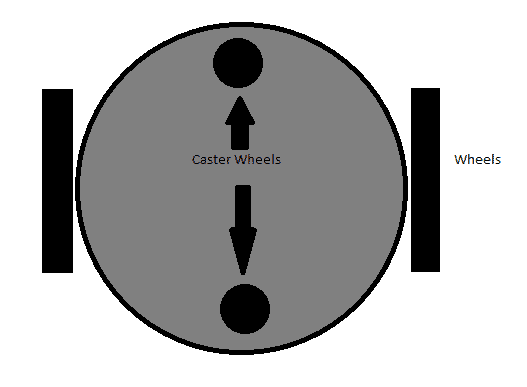

差动驱动系统

下一步是选择此机器人驱动系统的机械组件，主要是电动机，车轮和机器人底盘。 根据要求，我们将首先讨论如何选择电动机。

# 电机和车轮的选择

在查看规格后选择电动机。 电机选择的一些重要参数是转矩和 RPM。 我们可以根据给定的要求计算这些值。

# 电机转速的计算

该机器人所需的速度范围是 0.25 至 0.35m / s。 在设计中，我们可以将此机器人的最大速度设为 0.35 m / s。 将轮子的直径设为 9 cm，因为根据要求，离地间隙应大于 3 cm，我们将机器人本体固定在与电机轴相同的高度上。 在这种情况下，我们将获得更大的离地间隙。

使用以下方程式，我们可以计算电动机的 RPM：

*RPM =（（60 *速度/(3.14 *车轮直径）*

*RPM =（60 * 0.35）/（3.14 * 0.09）= 21 / 0.2826 = 74 RPM*

您也可以查看 [http://www.robotshop.com/blog/en/vehicle-speed-rpm-and-wheel-diameter-finder-9786](http://www.robotshop.com/blog/en/vehicle-speed-rpm-and-wheel-diameter-finder-9786) 进行计算。

车轮直径为 9 cm 且速度为 0.35 m / s 时，计算得出的 RPM 为 74 RPM。 我们可以将 80 RPM 作为标准值。

# 电机转矩的计算

让我们计算一下移动机器人所需的扭矩：

1.  车轮数=四个车轮，其中包括两个脚轮。
2.  电机数量= 2。
3.  假设摩擦系数为 0.6，车轮半径为 4.5 cm。
4.  取机器人的总重量=机器人的重量+有效载荷=（W = mg）=（〜100 N +〜20 N）W =〜150 N，而总质量= 12 Kg。
5.  作用在四个车轮上的重量可以写成 *2 * N1 + 2 * N2 = W* ； 也就是说， *N1* 是作用在每个脚轮上的重量， *N2* 是作用在电动车轮上的重量。
6.  假设机器人是静止的。 机器人开始移动时需要最大扭矩。 它还应克服摩擦。
7.  我们可以将摩擦力写为机器人扭矩= 0，直到机器人运动为止。 如果在此条件下获得机器人扭矩，则将获得最大扭矩，如下所示：

# 设计总结

设计之后，我们计算以下值并四舍五入到市场上可用的标准电动机规格：

*   电机 RPM = 80（四舍五入到标准值）
*   电机扭矩= 18 kg-cm
*   轮径= 9 厘米

# 机器人底盘设计

在计算了机器人的电动机和车轮参数之后，我们可以设计机器人底盘或机器人主体。 根据要求，机器人底盘应具有容纳食物的设施，应能够承受 5 公斤的负载，机器人的离地间隙应大于 3 厘米，并且成本应低。 除此之外，机器人还应提供放置电子元件的设备，例如**个人计算机**（**PC**），传感器和电池。

满足这些要求的最简单的设计之一就是多层架构，例如 Turtlebot 2（http://www.turtlebot.com/）。 它在机箱中有三层。 名为 **Kobuki**（http://kobuki.yujinrobot.com/about2/）的机器人平台是该平台的主要驱动机制。 Roomba 平台内置了电动机和传感器，因此无需担心设计机器人驱动系统。 下图显示了 **TurtleBot 2** 机械手机箱设计：

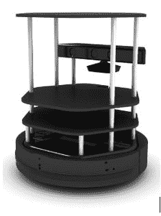

TurtleBot 2 机器人（http://robots.ros.org/turtlebot/）

我们将设计一个与 TurtleBot 2 类似的机器人，并带有我们自己的移动平台和组件。 我们的设计还具有三层架构。 在开始设计之前，让我们确定我们需要的所有工具。

在开始设计机器人机箱之前，我们需要**计算机辅助设计**（**CAD**）工具。 可用于 CAD 的流行工具有：

*   SolidWorks（ [http://www.solidworks.com/default.html](http://www.solidworks.com/default.html) ）
*   AutoCAD（ [http://www.autodesk.com/products/autocad/overview](http://www.autodesk.com/products/autocad/overview) ）
*   Maya（ [http://www.autodesk.com/products/maya/overview](http://www.autodesk.com/products/maya/overview) ）
*   Inventor（ [http://www.autodesk.com/products/inventor/overview](http://www.autodesk.com/products/inventor/overview) ）
*   SketchUp（ [http://www.sketchup.com/](http://www.sketchup.com/) ）
*   Blender（ [http://www.blender.org/download/](http://www.blender.org/download/) ）
*   LibreCAD（ [http://librecad.org/cms/home.html](http://librecad.org/cms/home.html) ）

可以使用任何您喜欢的软件来设计机箱设计。 在这里，我们将演示 **LibreCAD** 中的 2D 模型和 **Blender** 中的 3D 模型。 这些应用程序的亮点之一是它们是免费的，并且可用于所有 OS 平台。 我们将使用称为 **MeshLab** 的 3D 网格查看工具来查看和检查 3D 模型设计，并使用 Ubuntu 作为主要操作系统。 另外，我们可以在 Ubuntu 16.04 中看到这些应用程序的安装过程，以开始设计过程。 我们还将提供教程链接，以在其他平台上安装应用程序。

# 安装 LibreCAD，Blender 和 MeshLab

**LibreCAD** 是一个免费的开源 2D CAD 应用程序，适用于 Windows，OS X 和 Linux。 **Blender** 是一款免费的开源 3D 计算机图形软件，用于创建 3D 模型，动画和视频游戏。 它带有 GPL 许可证，允许用户共享，修改和分发应用程序。 **MeshLab** 是一个开放源代码，便携式且可扩展的系统，用于处理和编辑非结构化 3D 三角网格。

以下是在 Windows，Linux 和 OS X 上安装 LibreCAD 的链接：

*   访问 [http://librecad.org/cms/home.html](http://librecad.org/cms/home.htmlhttp:/librecad.org/cms/home.html) 下载 LibreCAD
*   访问 [http://librecad.org/cms/home/from-source/linux.html](http://librecad.org/cms/home/from-source/linux.html) [从源代码](http://librecad.org/cms/home/from-source/linux.html)构建 LibreCAD
*   访问 [http://librecad.org/cms/home/installation/linux.html](http://librecad.org/cms/home/installation/linux.html) 在 Debian / Ubuntu 中安装 LibreCAD
*   访问 [http://librecad.org/cms/home/installation/rpm-packages.html](http://librecad.org/cms/home/installation/rpm-packages.html) 在 Fedora 中安装 LibreCAD
*   访问 [http://librecad.org/cms/home/installation/osx.html](http://librecad.org/cms/home/installation/osx.html) 在 OS X 中安装 LibreCAD
*   访问 [http://librecad.org/cms/home/installation/windows.html](http://librecad.org/cms/home/installation/windows.html) 在 Windows 中安装 LibreCAD

您可以在以下链接中找到 LibreCAD 上的文档：
[http://wiki.librecad.org/index.php/Main_Page](http://wiki.librecad.org/index.php/Main_Page) 。

# 安装 LibreCAD

提供了所有操作系统的安装过程。 如果您是 Ubuntu 用户，则也可以直接从 Ubuntu 软件中心进行安装。

如果使用的是 Ubuntu，以下是安装 LibreCAD 的命令：

```py
    $ sudo add-apt-repository ppa:librecad-dev/librecad-stable
    $ sudo apt-get update
    $ sudo apt-get install librecad

```

# 安装搅拌机

访问以下下载页面以为您的 OS 平台安装 Blender： [http://www.blender.org/download/](http://www.blender.org/download/) 。您可以在此处找到 Blender 的最新版本。 另外，您可以在 [http://wiki.blender.org/](http://wiki.blender.org/) 上找到有关 Blender 的最新文档。

如果您使用的是 Ubuntu / Linux，则只需通过 Ubuntu 软件中心安装 Blender 或使用以下命令：

```py
    $ sudo apt-get install blender  
```

# 安装 MeshLab

**MeshLab** 适用于所有 OS 平台。 以下链接将为您提供预编译二进制文件的下载链接和 MeshLab 的源代码： [http://meshlab.sourceforge.net/](http://meshlab.sourceforge.net/)

如果您是 Ubuntu 用户，则可以使用以下命令从 apt 软件包管理器中安装 **MeshLab**：

```py
    $sudo apt-get install meshlab  
```

# 使用 LibreCAD 创建机器人的 2D CAD 图

我们将看一下 LibreCAD 的基本界面。 以下屏幕截图显示了 LibreCAD 的界面：


LibreCAD 工具

CAD 工具栏具有绘制模型所需的组件。 下图显示了 CAD 工具栏的详细概述：


[http://wiki.librecad.org/](http://wiki.librecad.org/)

以下链接提供了 LibreCAD 工具的详细说明： [http://wiki.librecad.org/index.php/LibreCAD_users_Manual](http://wiki.librecad.org/index.php/LibreCAD_users_Manual) 

以下是每种工具的简短说明：

*   **命令框**：仅用于使用命令绘制图形。 我们可以绘制图表而无需触摸任何工具栏。 有关命令框用法的详细说明，请参见：
*   **图层列表**：这将具有当前图形中使用的图层。 计算机辅助绘图中的一个基本概念是使用图层来组织图形。 有关图层的详细说明，请参见： [http://wiki.librecad.org/index.php/Layers](http://wiki.librecad.org/index.php/Layers) 。
*   **块**：这是一组实体，可以在不同的位置，不同的比例和旋转角度以不同的属性多次插入同一图形中。 可以在以下链接中找到有关块的详细说明： [http://wiki.librecad.org/index.php/Blocks](http://wiki.librecad.org/index.php/Blocks) 。
*   **绝对零**：这是图形（0,0）的原点。

现在，通过设置图形单位开始草绘。 将绘图单位设置为厘米。 打开 LibreCAD，然后导航到编辑| 应用程序首选项。 将“单位”设置为“厘米”，如以下屏幕截图所示：

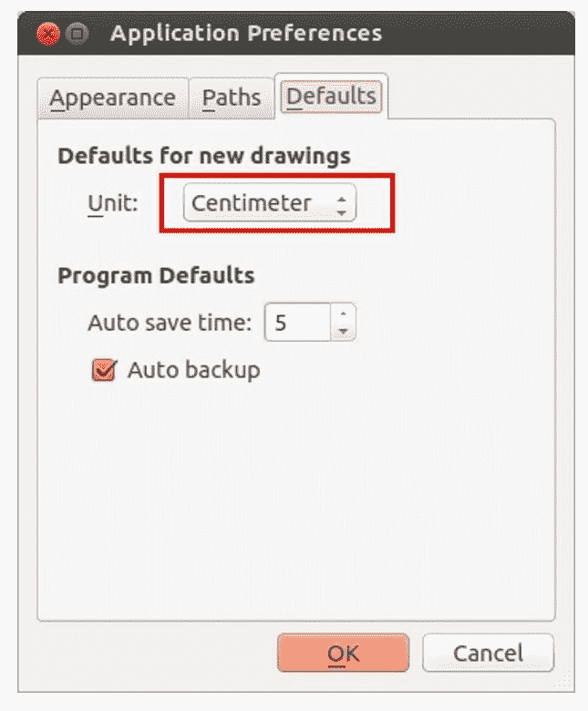

让我们从机器人的底板设计开始。 底板具有连接电动机，放置电池和控制板的装置。

# 底板设计

下图显示了机器人的底板。 该板为差速驱动器提供了两个电动机，底板的前后都有每个脚轮。 在图中将电动机称为 **M1** 和 **M2**，脚轮表示为 **C1** 和 **C2**。 它还具有四个极，以连接到下一个板。 极点表示为 **P1-1**， **P1-2**， **P1-3** 和 **P1-4**。 螺丝标记为 **S**，在此我们将使用相同的螺丝。 中心处有一个孔，可将电线从电动机引到板的顶部。 在左侧和右侧切割该板，以便将车轮安装到电动机上。 从中心到脚轮的距离称为 **12.5** cm，从中心到电机的距离称为 **5.5** cm。 极点的中心距中心的长度为 **9** cm，高度为 **9** cm。 所有板的孔都遵循相同的尺寸：


底板设计

尺寸未在图中标出； 相反，它们在下表中列出：

| **零件** | **尺寸（厘米）（长 x 高）（半径）** |
| **M1** 和 **M2** | 5 x 4 |
| **C1** 和 **C2** | 半径= 1.5 |
| **S**（螺丝）（在图中未显示） | 0.15 |
| **P1-1**， **P1-2**， **P1-3**， **P1-4** | 外径 0.7，高度 3.5cm |
| 左右轮部分 | 2.5 x 10 |
| 底盘 | 半径= 15 |

稍后我们将更详细地讨论电机尺寸和夹具尺寸。

# 底板杆设计

基板有四个极点以延伸到下一层。 磁极的长度为 **3.5** cm，半径为 **0.7** cm。 通过将空心管连接到杆上，我们可以延伸到下一个板。 在中空管的顶部，我们将插入硬质塑料以形成螺孔。 该孔对于延伸到顶层很有用。 下图显示了底板极和每个极上的空心管。 中空管的半径为 **0.75** cm，长度为 **15** cm：


空心管设计 15 厘米

# 车轮，电机和电机夹具设计

我们必须确定轮子的直径并计算电动机的要求。 在这里，我们给出了设计成功时可以使用的典型电动机和车轮：

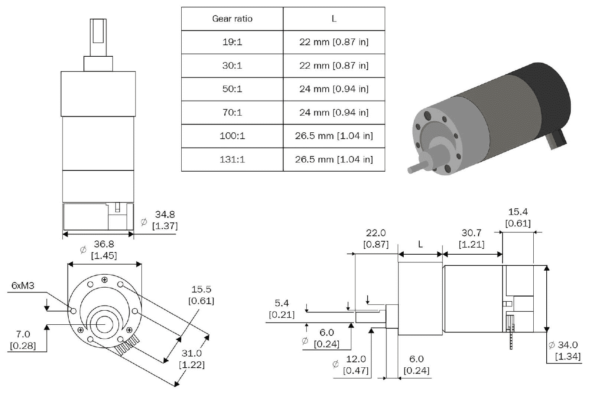

机器人的电机设计

电动机的设计可以根据电动机的选择而变化。 如有必要，可以将该电动机作为设计，并可以在仿真后进行更改。 电动机图中的 **L** 值可以根据电动机的速度和转矩而变化。 这是电动机的齿轮组件。

下图显示了我们可以使用的 **90** cm 直径的典型砂轮。 放置手柄后，直径 **86.5** mm 的砂轮将变为 **90** mm：

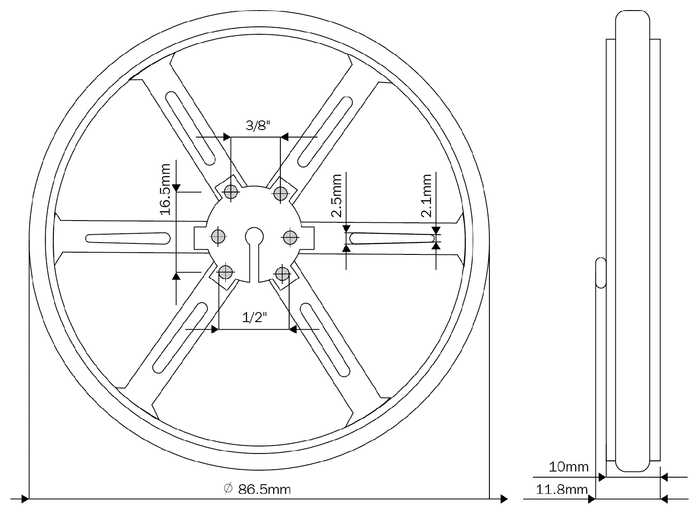

机器人的车轮设计

电机需要安装在基板上。 要安装，我们需要一个可以拧到板上的夹具，还将电动机连接到夹具。 下图显示了可用于此目的的典型夹具。 这是一个 L 型夹钳，我们可以使用它在一侧安装电动机，然后将另一侧安装到板上：

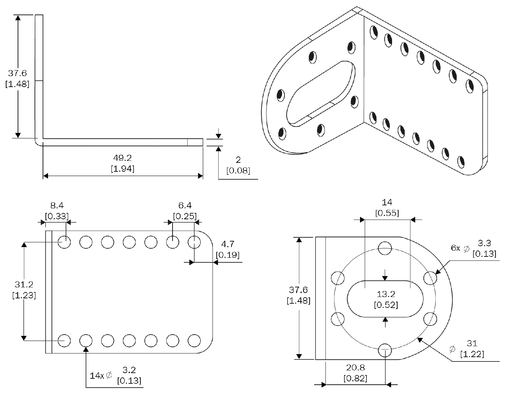

机器人的典型夹具设计

# 脚轮设计

脚轮不需要特殊设计。 我们可以使用任何可以与地面接触的脚轮。 以下链接收集了可用于该设计的脚轮的集合： [http://www.pololu.com/category/45/pololu-ball-casters](http://www.pololu.com/category/45/pololu-ball-casters) 。

# 中板设计

该板的尺寸与基板相同，螺钉尺寸也相似：


机器人中间板设计

中间板可从基板固定在中空管上方。 该布置使用另一个从中板伸出的中空管连接。 中间板的管子的底部将有一个螺钉，以固定底板和中间板的管子，并在空心端连接顶板。 下图显示了从中间板伸出的管子的俯视图和侧视图：


中空管设计 20 厘米

该管将中间板连接到底板，同时提供顶板的连接。

# 顶板设计

顶板与其他板相似； 它有四个 3 厘米的小杆，类似于底板。 磁极可以从中间板放置在空心管上。 四个极连接到板本身：

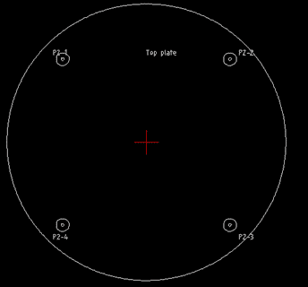

顶板设计

完成顶板设计后，机器人底盘设计几乎完成。 我们来看一下使用 Blender 的该机器人的 3D 模型构建。 3D 模型是出于仿真目的而构建的，而我们构建的 2D 设计主要是出于制造目的。

# 使用 Blender 处理机器人的 3D 模型

在本节中，我们将设计机器人的 3D 模型。 3D 模型主要用于仿真目的。 建模将使用 Blender 完成。 该版本必须大于 2.6，因为我们仅测试了这些版本的教程。

以下屏幕截图显示了 Blender 工作区和可用于 3D 模型的工具：

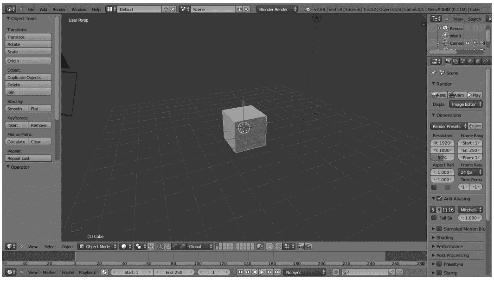

Blender 3D CAD 工具

我们在这里使用 Blender 的主要原因是我们可以使用 Python 脚本对机器人进行建模。 Blender 具有内置的 Python 解释器和 Python 脚本编辑器，用于编码。 我们将不在这里讨论 Blender 的用户界面。 您可以在其网站上找到 Blender 的良好教程。 请参考以下链接以了解 Blender 的用户界面： [http://www.blender.org/support/tutorials/](http://www.blender.org/support/tutorials/) 。 [](http://www.blender.org/support/tutorials/) 

让我们开始使用 Python 在 Blender 中进行编码。

# Blender 中的 Python 脚本

**Blender** 主要用 C，C ++和 Python 编写。 用户可以编写自己的 Python 脚本并访问 Blender 的所有功能。 如果您是 Blender Python API 的专家，则可以使用 Python 脚本而不是手动建模来对整个机器人进行建模。

Blender 使用 Python3.x。 搅拌机。 Python API 通常是稳定的，但仍在某些方面进行了添加和改进。 有关 Blender Python API 的文档，请参考 [http://www.blender.org/documentation/blender_python_api_2_69_7/](http://www.blender.org/documentation/blender_python_api_2_69_7/) 。

让我们快速概述一下我们将在机器人模型脚本中使用的 Blender Python API。

# Blender Python API 简介

Blender 中的 Python API 可以执行 Blender 的大部分功能。 API 可以完成的主要工作如下：

*   编辑 Blender 内部的任何数据，例如场景，网格，粒子等
*   修改用户首选项，键映射和主题
*   创建新的 Blender 工具
*   使用 Python 的 OpenGL 命令绘制 3D 视图

Blender 为 Python 解释器提供了 **bpy** 模块。 该模块可以导入脚本中，并可以访问 Blender 数据，类和函数。 处理 Blender 数据的脚本将需要导入此模块。 我们将在 bpy 中使用的主要 Python 模块是：

*   **上下文访问**：这可从（`bpy.context`）脚本访问 Blender 用户界面功能
*   **数据访问**：这提供对 Blender 内部数据（`bpy.data`）的访问
*   **运算符**：这提供对调用运算符的 Python 访问，其中包括用 C，Python 或宏（`bpy.ops`）编写的运算符

要在 Blender 中切换到脚本，我们需要更改 Blender 的屏幕布局。 以下屏幕截图显示了可帮助您切换到脚本布局的选项：

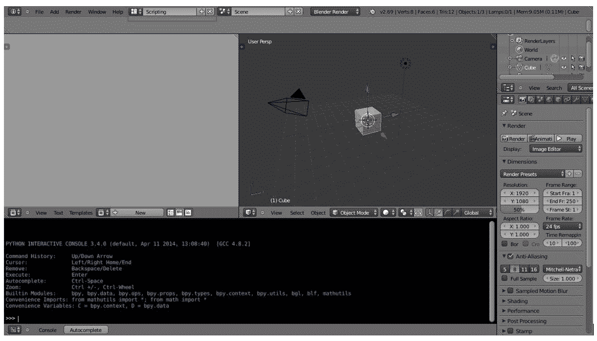

Blender 脚本选项

选择脚本选项卡后，我们可以在 Blender 中看到一个文本编辑器和 Python 控制台窗口。 在文本编辑器中，我们可以使用 Blender API 进行编码，也可以通过 Python 控制台尝试使用 Python 命令。 单击“新建”按钮创建一个新的 Python 脚本并将其命名为`robot.py`。 现在，我们可以仅使用 Python 脚本来设计机器人的 3D 模型。 接下来的部分提供了用于设计机器人模型的完整脚本。 我们可以在运行代码之前对其进行讨论。 希望您已经从其站点阅读了 Blender 的 Python API。 下一节中的代码分为六个 Python 函数，以绘制三个机器人板，绘制电动机和车轮，绘制四个支撑管，并导出到 **STereoLithography**（**STL**）3D 文件中 模拟格式。

# 机器人模型的 Python 脚本

以下是我们将设计的机器人模型的 Python 脚本：

1.  在 Blender 中启动 Python 脚本之前，我们必须导入`bpy`模块。 `bpy`模块包含 Blender 的所有功能，并且只能从 Blender 应用程序内部进行访问：

```py
import bpy 
```

2.  以下功能将绘制机器人的底板。 此功能将绘制一个半径为 5 cm 的圆柱体，并从相反的侧面切开一部分，以便可以使用 Blender 中的`Boolean`修改器连接电动机：

```py
#This function will draw base plate 
def Draw_Base_Plate(): 
```

3.  以下两个命令将在基板的任一侧上创建两个半径为 0.05 米的立方体。 这些多维数据集的目的是创建一个修改器，以从基板中减去这些多维数据集。 因此，实际上，我们将获得带有两个切口的基板。 切开两侧后，我们将删除多维数据集：

```py
bpy.ops.mesh.primitive_cube_add(radius=0.05, 
       location=(0.175,0,0.09))bpy.ops.mesh.primitive_cube_add(radius=0.05, 
       location=(-0.175,0,0.09)) 

    #################################################### 
    #################################################### 

    #Adding base plate 
bpy.ops.mesh.primitive_cylinder_add(radius=0.15, 
       depth=0.005, location=(0,0,0.09)) 

    #Adding boolean difference modifier from first cube 

bpy.ops.object.modifier_add(type='BOOLEAN') 
bpy.context.object.modifiers["Boolean"].operation = 
       'DIFFERENCE'bpy.context.object.modifiers["Boolean"].object = 
 bpy.data.objects["Cube"] 
bpy.ops.object.modifier_apply(modifier="Boolean") 

    ###################################################### 
    ###################################################### 

    #Adding boolean difference modifier from second cube 

bpy.ops.object.modifier_add(type='BOOLEAN') 
bpy.context.object.modifiers["Boolean"].operation = 
       'DIFFERENCE'bpy.context.object.modifiers["Boolean"].object = 
 bpy.data.objects["Cube.001"] 
bpy.ops.object.modifier_apply(modifier="Boolean") 

    #######################################################
     ####################################################### 

    #Deselect cylinder and delete cubes 
bpy.ops.object.select_pattern(pattern="Cube") 
bpy.ops.object.select_pattern(pattern="Cube.001") 
bpy.data.objects['Cylinder'].select = False 
bpy.ops.object.delete(use_global=False) 

```

4.  以下功能将拉动安装在底板上的电动机和车轮：

```py
#This function will draw motors and wheels 
def Draw_Motors_Wheels():  
```

5.  以下命令将绘制一个半径为 0.045 且圆柱体深度为 0.01 米的圆柱体。 创建轮子之后，它将旋转并平移到基板的切割部分：

```py
    #Create first Wheel 

bpy.ops.mesh.primitive_cylinder_add(radius=0.045, 
       depth=0.01, location=(0,0,0.07)) 
    #Rotate 
bpy.context.object.rotation_euler[1] = 1.5708 
    #Transalation 
bpy.context.object.location[0] = 0.135 

    #Create second wheel 
bpy.ops.mesh.primitive_cylinder_add(radius=0.045, 
       depth=0.01, location=(0,0,0.07)) 
    #Rotate 
bpy.context.object.rotation_euler[1] = 1.5708 
    #Transalation 
bpy.context.object.location[0] = -0.135
```

6.  以下代码将在基板上添加两个虚拟电机。 在 2D 设计中提到了电动机的尺寸。 电机基本上是一个圆柱体，它将被旋转并放置在底板中：

```py
    #Adding motors 

bpy.ops.mesh.primitive_cylinder_add(radius=0.018,
 depth=0.06, location=(0.075,0,0.075)) 
bpy.context.object.rotation_euler[1] = 1.5708 

bpy.ops.mesh.primitive_cylinder_add(radius=0.018,
 depth=0.06, location=(-0.075,0,0.075)) 
bpy.context.object.rotation_euler[1] = 1.5708 

```

7.  以下代码将向电动机添加轴，类似于电动机型号。 轴也是一个圆柱体，它将旋转并插入电动机模型中：

```py
    #Adding motor shaft 
bpy.ops.mesh.primitive_cylinder_add(radius=0.006,
 depth=0.04, location=(0.12,0,0.075)) 
bpy.context.object.rotation_euler[1] = 1.5708 

bpy.ops.mesh.primitive_cylinder_add(radius=0.006,
 depth=0.04, location=(-0.12,0,0.075)) 
bpy.context.object.rotation_euler[1] = 1.5708 

    #######################################################
 #######################################################
```

8.  以下代码将在底板上添加两个脚轮。 目前，我们正在添加一个圆柱体作为轮子。 在模拟中，我们可以将其指定为车轮：

```py
    #Adding Caster Wheel 

bpy.ops.mesh.primitive_cylinder_add(radius=0.015, 
       depth=0.05, location=(0,0.125,0.065))bpy.ops.mesh.primitive_cylinder_add(radius=0.015, 
       depth=0.05, location=(0,-0.125,0.065))
```

9.  以下代码将添加一个虚拟 Kinect 传感器：

```py
    #Adding Kinect 

bpy.ops.mesh.primitive_cube_add(radius=0.04, 
       location=(0,0,0.26))
```

10.  此功能将绘制机器人的中间板：

```py
#Draw middle plate 
def Draw_Middle_Plate(): 
bpy.ops.mesh.primitive_cylinder_add(radius=0.15, 
       depth=0.005, location=(0,0,0.22)) 

#Adding top plate 
def Draw_Top_Plate(): 
bpy.ops.mesh.primitive_cylinder_add(radius=0.15, 
       depth=0.005, location=(0,0,0.37))
```

11.  此功能将为所有三个板绘制所有四个支撑空心管：

```py
#Adding support tubes 
def Draw_Support_Tubes(): 
############################################################################################# 

    #Cylinders 
bpy.ops.mesh.primitive_cylinder_add(radius=0.007, 
       depth=0.30, location=(0.09,0.09,0.23))bpy.ops.mesh.primitive_cylinder_add(radius=0.007, 
       depth=0.30, location=(-0.09,0.09,0.23))bpy.ops.mesh.primitive_cylinder_add(radius=0.007, 
       depth=0.30, location=(-0.09,-0.09,0.23))bpy.ops.mesh.primitive_cylinder_add(radius=0.007, 
       depth=0.30, location=(0.09,-0.09,0.23))
```

12.  此功能会将设计的机械手导出到 STL。 在执行脚本之前，我们必须更改 STL 文件路径：

```py
#Exporting into STL     
def Save_to_STL(): 
bpy.ops.object.select_all(action='SELECT') 
#    bpy.ops.mesh.select_all(action='TOGGLE') 
bpy.ops.export_mesh.stl(check_existing=True, 
 filepath="/home/lentin/Desktop/exported.stl", 
 filter_glob="*.stl", ascii=False, 
 use_mesh_modifiers=True, axis_forward='Y', 
 axis_up='Z', global_scale=1.0) 

#Main code 

if __name__ == "__main__": 
Draw_Base_Plate() 
Draw_Motors_Wheels() 
Draw_Middle_Plate() 
Draw_Top_Plate() 
Draw_Support_Tubes() 
Save_to_STL() 
```

13.  在文本编辑器中输入代码后，请按“运行脚本”按钮执行脚本，如以下屏幕截图所示。 输出的 3D 模型将显示在 Blender 的 3D 视图上。 另外，如果我们检查桌面，我们可以看到`exported.stl`文件用于仿真目的：

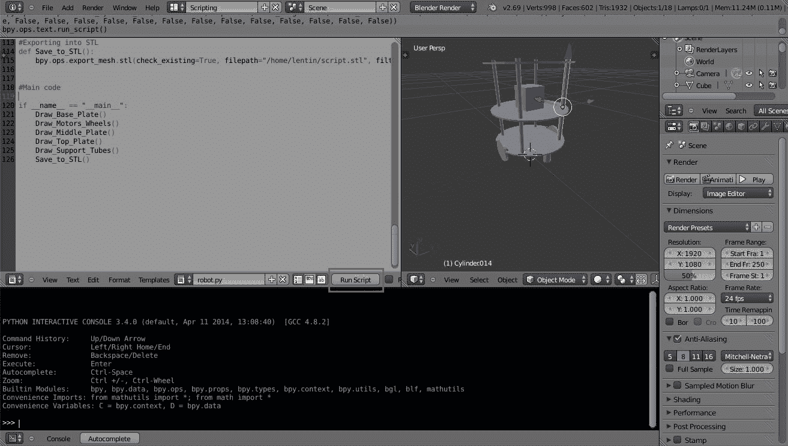

在 Blender 中运行 Python 脚本

14.  可以使用 MeshLab 打开`exported.stl`文件，以下是 MeshLab 的屏幕截图：

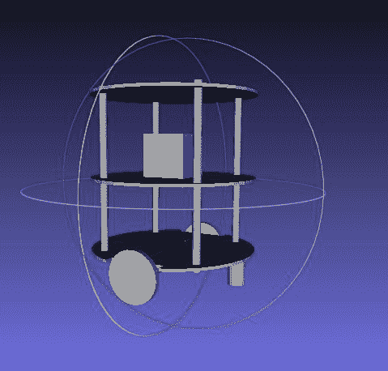

MeshLab 中的 Chefbot 3D 模型

# 创建机器人的 URDF 模型

ROS 中的**机械手模型**包含用于对机械手各个方面进行建模的软件包，这些软件包在 XML 机械手描述格式中指定。 该堆栈的核心程序包是 URDF，它可以解析 URDF 文件并构造机器人的对象模型。

**统一机器人描述格式**（**URDF**）是用于描述机器人模型的 XML 规范。 我们可以使用 URDF 表示机器人的以下功能：

*   机器人的运动学和动态描述
*   机器人的视觉表示
*   机器人的碰撞模型

对机器人的描述由一组**链接**（零件），元素和一组**关节**元素组成，这些元素将这些链接连接在一起。 以下代码显示了典型的机器人描述：

```py

<robot name="chefbot"> 
<link> ... </link> 
<link> ... </link> 
<link> ... </link> 

<joint>  ....  </joint> 
<joint>  ....  </joint> 
<joint>  ....  </joint> 
</robot> 
```

如果您参考以下链接以获取有关 URDF 的更多信息，那就太好了：
[http://wiki.ros.org/urdf](http://wiki.ros.org/urdf) [http：//wiki.ros .org / urdf / Tutorials](http://wiki.ros.org/urdf/Tutorials)

**Xacro**（XML 宏）是一种 XML 宏语言。 使用 xacro，我们可以创建更短，更易读的 XML 文件。 我们可以将 xacro 与 URDF 一起使用以简化 URDF 文件。 如果将 xacro 添加到 URDF，则必须调用附加的解析器程序以将 xacro 转换为 URDF。

以下链接将为您提供有关 xacro 的更多详细信息：
[http://wiki.ros.org/xacro](http://wiki.ros.org/xacro)

**robot_state_publisher** 允许您将机器人的状态发布到 **tf**（ [http://wiki.ros.org/tf](http://wiki.ros.org/tf) ）。 该节点读取名为 **robot_description** 的 URDF 参数，并从名为 **joint_states** 的主题读取机器人的关节角度作为输入，并使用的运动树模型发布机器人链接的 3D 姿势 机器人。 该软件包可用作库和 ROS 节点。 该软件包已经过良好的测试，并且代码稳定。

*   **世界文件**：这些文件代表凉亭的环境，必须与机器人模型一起加载。 *empty.world* 和 *Playground.world* 是凉亭世界文件的一些示例。 *empty.world* 仅包含一个空白空间。 在 *Playground.world* 中，环境中将存在一些静态对象。 我们可以使用 Gazebo 创建自己的`*.world`文件。 在下一章中，我们将进一步介绍凉亭世界文件。
*   **CMakeList.txt 和 package.xml**：这些文件是在创建包时创建的。 `CmakeList.txt`文件有助于在程序包中构建 ROS C ++节点或库，而`package.xml`文件保存此程序包的所有依赖项列表。

# 创建一个 Chefbot 描述 ROS 包

`chefbot_description`软件包包含我们机器人的 URDF 模型。 在自己创建此软件包之前，您可以浏览`chapter3_codes`中下载的 Chefbot 软件包。 这将帮助您加快流程。

让我们检查一下如何创建`chefbot_description`包。 以下过程将指导您创建此程序包：

1.  首先，我们需要切换到`src`文件夹中的`chefbot`文件夹：

```py
    $ cd ~/catkin_ws/src/  
```

2.  以下命令将创建机器人描述程序包以及相关性，例如`urdf`和`xacro`。 这将在`catkin_ws/src`文件夹中创建`chefbot_description`包：

```py
    $ catkin_create_pkgchefbot_descriptioncatkinxacro  
```

3.  将所有文件夹从下载的`chefbot_description`包复制到新的包文件夹。 `meshes`文件夹包含机器人的 3D 零件，`urdf`文件夹包含具有机器人运动学和动力学模型的 URDF 文件。 机械手模型分为多个 xacro 文件，从而使调试更容易且可读性更好。

让我们看一下该包中每个文件的功能。 您可以检查`chefbot_description`中的每个文件。 下图显示了此软件包中的文件：

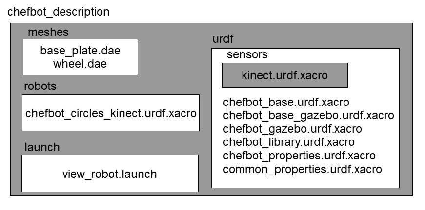

*Chefbot description package*

软件包中每个文件的功能如下：

*   `urdf/chefbot.xacro`：这是具有机器人运动学和动态参数的主要 xacro 文件。
*   `urdf/common_properties.xacro`：此 xacro 文件包含一些属性及其在机器人模型中使用的值。 例如，机械手链接的不同颜色定义和一些常数。
*   `gazebo/chefbot.gazebo.xacro`：此文件包含机器人的仿真参数。 它主要具有 Gazebo 参数和用于执行模拟的插件。 仅当我们使用此模型开始仿真时，这些参数才有效。
*   `launch/upload_model.launch`：此启动文件具有一个节点，该节点基本上可以解析机械手 xacro 文件，并将解析后的数据上载到名为`robot_description`的 ROS 参数。 然后`robot_description`参数在 Rviz 中用于可视化，在凉亭中用于仿真。 如果我们的 xacro 模型错误，则此启动文件将引发错误。
*   `launch/view_model.launch`：此启动文件将上载机器人 URDF 模型并在 Rviz 中查看该模型。
*   `launch/view_navigation.launch`：将在 Rviz 中显示 URDF 模型和导航相关的显示类型。
*   `launch/view_robot_gazebo.launch`：这将在 Gazebo 中启动 URDF 模型并启动所有 Gazebo 插件。
*   `meshes/`：此文件夹包含机器人模型所需的网格。
*   您可以使用 *catkin_make* 命令来构建工作区。

构建软件包后，我们可以使用以下命令在 Rviz 中启动 Chefbot 模型：

```py
    $ roslaunch chefbot_descriptionview_robot.launch  
```

以下屏幕快照显示了 Rviz 中的机器人模型：

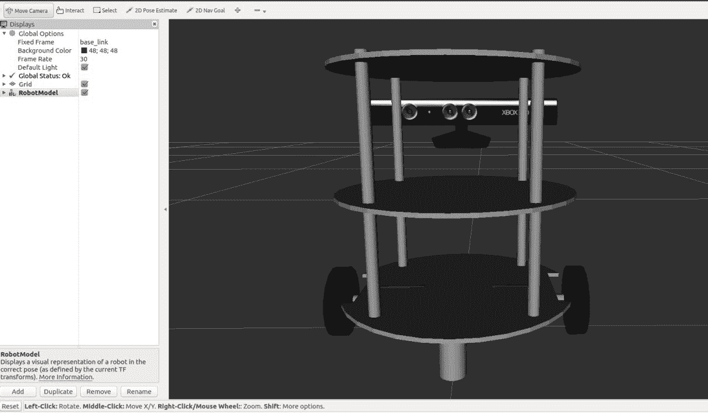

Rviz 中的 Chefbot URDF 模型

这是在 Rviz 中可视化机器人的`view_robot.launch`文件：

```py
<launch> 

<!-- This launch file will parse the URDF model and create robot_description parameter  - -> 

<include file="$(find chefbot_description)/launch/upload_model.launch" /> 

<!-Publish TF from joint states -- > 

<node name="robot_state_publisher" pkg="robot_state_publisher" type="robot_state_publisher" /> 

<!-Start slider GUI for controlling the robot joints -- > 
<node name="joint_state_publisher" pkg="joint_state_publisher" type="joint_state_publisher" args="_use_gui:=True" /> 

<!-Start Rviz with a specific configuration -- > 

<node name="rviz" pkg="rviz" type="rviz" args="-d $(find chefbot_description)/rviz/robot.rviz" /> 

</launch> 
```

这是`upload_model. launch`的定义。 `xacro`命令将解析`chefbot.xacro`文件并存储到`robot_description`中：

```py
<launch> 

<!-- Robot description --> 
<param name="robot_description" command="$(find xacro)/xacro --inorder '$(find chefbot_description)/urdf/chefbot.xacro'" /> 

</launch> 
```

我们可以看一下`udf/chefbot.xacro`，它是主要的 URDF 模型文件。 我们可以看到如何在 xacro 文件中定义链接和关节。

以下代码段显示了机器人 xacro 模型的标题。 它具有 XML 版本，机械手名称，并且还包含其他一些 xacro 文件，例如`common_properties.xacro`和`chefbot.gazebo.xacro.`。之后，我们可以看到标头中定义的一些相机属性：

```py
<?xml version="1.0"?> 

<robot name="chefbot" xmlns:xacro="http://ros.org/wiki/xacro"> 

<xacro:include filename="$(find chefbot_description)/urdf/common_properties.xacro" /> 

<xacro:include filename="$(find chefbot_description)/gazebo/chefbot.gazebo.xacro" /> 

<xacro:property name="astra_cam_py" value="-0.0125"/> 
<xacro:property name="astra_depth_rel_rgb_py" value="0.0250" /> 
<xacro:property name="astra_cam_rel_rgb_py"   value="-0.0125" /> 
<xacro:property name="astra_dae_display_scale"   value="0.8" /> 
```

以下代码片段显示了模型中链接和关节的定义：

```py
<link name="base_footprint"/> 

<joint name="base_joint" type="fixed"> 
<origin xyz="0 0 0.0102" rpy="0 0 0" /> 
<parent link="base_footprint"/> 
<child link="base_link" /> 
</joint> 
<link name="base_link"> 
<visual> 
<geometry> 
<!-- new mesh --> 
<mesh filename="package://chefbot_description/meshes/base_plate.dae" /> 
<material name="white"/> 
</geometry> 

   <origin xyz="0.001 0 -0.034" rpy="0 0 ${M_PI/2}"/> 
</visual> 
<collision> 
<geometry> 
<cylinder length="0.10938" radius="0.178"/> 
</geometry> 
<origin xyz="0.0 0 0.05949" rpy="0 0 0"/> 
</collision> 
<inertial> 
<!-- COM experimentally determined --> 
<origin xyz="0.01 0 0"/> 
<mass value="2.4"/><!-- 2.4/2.6 kg for small/big battery pack --> 

<inertia ixx="0.019995" ixy="0.0" ixz="0.0" 
iyy="0.019995" iyz="0.0"  
izz="0.03675" /> 
</inertial> 
</link> 
```

在此代码中，我们可以看到两个名为`base_footprint`和`base_link`的链接的定义。 `base_footprint`链接是虚拟链接，表示它具有任何属性； 它仅用于显示机器人的起源。 `base_link`是机器人的起源，具有视觉和碰撞特性。 我们还可以看到该链接被可视化为网格文件。 我们还可以在定义中看到链接的惯性参数。 关节是两个环节的结合。 我们可以通过提及两个链接和关节的类型来在 URDF 中定义关节。 URDF 中有不同类型的关节，例如固定，旋转，连续和棱柱形。 在此代码段中，我们将创建一个固定的关节，因为这些框架之间没有运动。

本章主要涉及 Chefbot URDF 的基础知识。 在下一章中，我们将学习有关 Chefbot 仿真的更多信息，并对参数进行解释。

# 概括

在本章中，我们讨论了 Chefbot 机器人的建模。 建模涉及机器人硬件的 2D 和 3D 设计，最终成为可在 ROS 中使用的 URDF 模型。 本章从机器人要满足的各种要求开始，我们已经看到了如何计算各种设计参数。 计算完设计参数后，我们开始设计机器人硬件的 2D 草图。 使用免费的 CAD 工具 LibreCAD 完成了设计。 之后，我们使用 Python 脚本在 Blender 中研究了 3D 模型。 我们已经从 Blender 创建了网格模型，并创建了机器人的 URDF 模型。 创建 URDF 模型后，我们研究了如何在 Rviz 中可视化机器人。

在下一章中，我们将讨论如何模拟该机器人以及执行映射和定位。

# 问题

1.  什么是机器人建模及其用途？
2.  2D 机器人模型的目标是什么？
3.  3D 机器人模型的目标是什么？
4.  与手动建模相比，Python 脚本有什么优势？
5.  什么是 URDF 文件，其用途是什么？

# 进一步阅读

要了解有关 URDF，Xacro 和 Gazebo 的更多信息，请参阅以下书籍：*掌握用于机器人程序设计的 ROS-第二版*（ [https://www.packtpub.com/hardware-and-creative/mastering- ros-robotics 编程第二版](https://www.packtpub.com/hardware-and-creative/mastering-ros-robotics-programming-second-edition)）