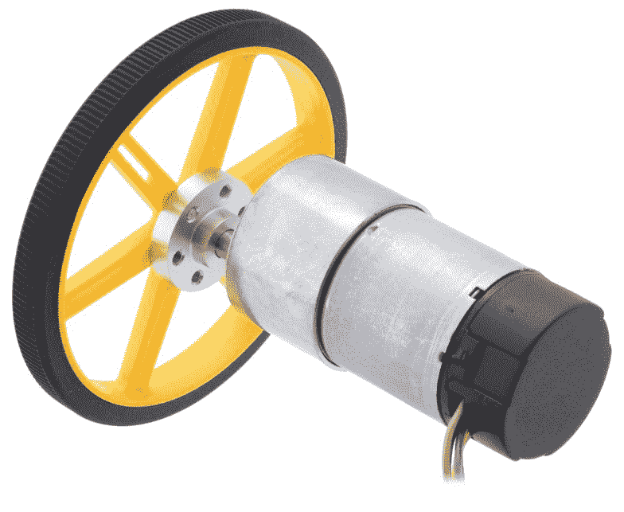
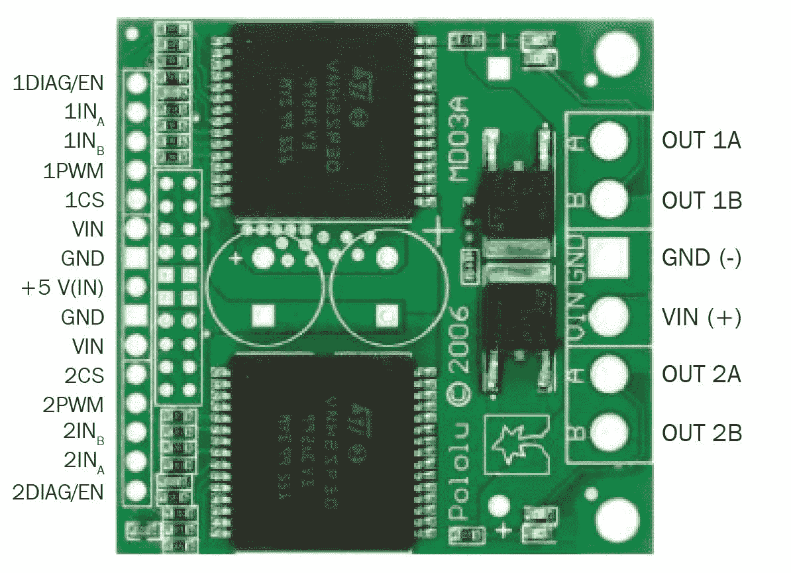
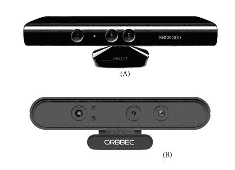
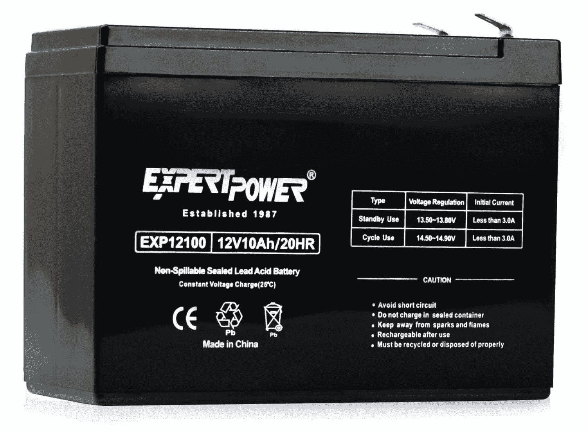
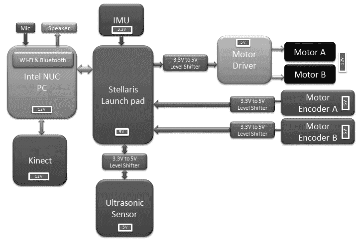

# 设计 ChefBot 硬件和电路

在本章中，我们将讨论 ChefBot 硬件的设计和工作原理，并介绍其硬件组件的选择。 在上一章中，我们使用 Gazebo 和 ROS 设计和仿真了旅馆环境中的基本机器人框架，并测试了一些变量，例如机器人的体重，电机扭矩，车轮直径等。 我们还在酒店环境中测试了 ChefBot 的自主导航功能。

为了使用硬件实现此目的，我们需要选择所有硬件组件，并弄清楚如何连接所有这些组件。 我们知道该机器人的主要功能是导航：该机器人将能够从起始位置导航到终点，而不会与周围环境发生任何碰撞。 我们将讨论实现此目标所需的不同传感器和硬件组件。 我们将查看这些组件的框图表示及其说明，并讨论机器人的主要功能和物理操作。 最后，我们需要选择构建机器人所需的组件。 我们还将熟悉可以在其中购买这些组件的在线商店。

如果您有 TurtleBot，则可以跳过本章，因为本章仅适用于需要创建机器人硬件的用户。 让我们看看在硬件设计中必须满足的规格。 机器人硬件主要包括机器人机箱，传感器，执行器，控制器板和 PC。

本章将涵盖以下主题：

*   Chefbot 机器人的框图和说明
*   机械手组件的选择和说明
*   Chefbot 硬件的运作方式

# 技术要求

本章介绍了构建机器人所需的组件。 您必须购买这些组件或类似组件才能构建 ChefBot。

# ChefBot 的硬件规格

在本节中，我们将讨论在第 3 章*建模差动机器人*中提到的一些重要规范。 最终的机器人原型将满足以下规格：

*   **简单且经济高效的机器人机箱设计**：与现有机器人相比，机器人机箱设计应该简单且具有成本效益。
*   **自主导航功能**：机器人应该自主导航，并且应该包含执行此操作所需的传感器。
*   **电池寿命长**：机器人应具有较长的电池寿命才能连续工作。 它可以工作的时间长度应大于一小时。
*   **避开障碍物**：机器人应该能够避免周围环境中的静态和动态物体。

机械手的硬件设计应符合这些规格。 让我们看一下互连此机器人中组件的可能方法之一。 在下一节中，我们将查看机器人的框图，并使用它来检查其工作原理。

# 机器人的框图

机器人的运动由两个**直流**（**DC**）齿轮电机通过编码器控制。 两个马达通过马达驱动器驱动。 电机驱动器与嵌入式控制器板接口，该控制器板将向电机驱动器发送命令以控制电机的运动。 电动机的编码器与控制器板连接，以便计算电动机轴的转数。 该数据用于计算机器人的里程数据。 有超声波传感器与控制板连接，以便感应障碍物并测量与障碍物的距离。 有一个 IMU 传感器可以改善里程计的计算。 嵌入式控制器板与 PC 相连，后者在机器人中执行所有高端处理。 视觉和声音传感器与 PC 连接，并连接了 Wi-Fi 以进行远程操作。 下图说明了机器人的每个组件：

机器人硬件框图

# 电机和编码器

我们将要设计的机器人是带有两个轮子的差速驱动机器人，因此我们需要两个电动机来实现其运动。 每个电动机都由[正交编码器](http://www.creative-robotics.com/quadrature-intro)组成，这样我们就可以获得电动机的旋转反馈数据。

正交编码器将以平方脉冲的形式发送有关电动机旋转的数据； 我们可以解码脉冲以获得编码器的滴答声数量，该数量可用于反馈。 如果我们知道轮子的直径和电机的刻度数，就可以计算出移动机器人的位移和角度。 这种计算对我们导航机器人的尝试非常有用。

# 为机器人选择电动机，编码器和轮子

通过仿真，我们了解了机器人的参数。 在试验仿真参数时，我们提到驱动机器人所需的电机转矩为 18 N，但计算出的转矩略大于此。 我们正在选择非常接近实际扭矩的标准扭矩电动机，以便于选择电动机。 我们可能考虑的标准电动机之一是 Pololu。 根据我们的设计规范，我们可以选择一种高转矩直流齿轮电动机，该电动机的编码器工作在 12 V DC 且转速为 80 RPM。

下图显示了为此机器人选择的电动机。 电机带有集成的正交编码器，其分辨率为电机轴每转 64 个计数，这对应于变速箱输出轴每转 8400 个计数：

带编码器和车轮的直流齿轮电动机（请参阅 https://www.pololu.com/product/2827）

该马达具有六个不同颜色的插针。 下表中给出了该电机销的说明：

| **颜色** | **功能** |
| 红色的 | 电机功率（连接到一个电机端子） |
| 黑色的 | 电机功率（连接到另一个电机端子） |
| 绿色的 | 编码器 GND |
| 蓝色 | 编码器 Vcc（3.5 V-20 V） |
| 黄色的 | 编码器 A 输出 |
| 白色的 | 编码器 B 输出 |

根据我们的设计规格，我们将选择 90 毫米的车轮直径。 Pololu 提供了 90 毫米的砂轮，可从[这个页面](http://www.pololu.com/product/1439)获得。 上图显示了装有此轮的电动机。

将电动机和车轮连接在一起所需的其他连接器如下：

*   可通过[这个页面](http://www.pololu.com/product/1083)获得将车轮安装到电机轴所需的安装轮毂。
*   可在[这个页面](http://www.pololu.com/product/1084)上获得用于将电机安装到机器人机箱上的 L 型支架。

# 引擎驱动

**电动机驱动器**或**电动机控制器**是可以控制电动机速度的电路。 通过控制电动机，我们的意思是我们可以控制电动机两端的电压，也可以控制电动机的方向和速度。 如果更改电机端子的极性，则电机可以顺时针或逆时针旋转。

**H 桥**电路通常用于电动机控制器。 **H 桥**是一种可以在负载的任一方向施加电压的电子电路。 它具有高电流处理性能，并且可以改变电流的方向。

下图显示了使用开关的基本 H 桥电路：

H 桥电路

根据四个开关的状态，电动机的方向如下：

| **S1** | **S2** | **S3** | **S4** | **结果** |
| 1 | 0 | 0 | 1 | 电机向右移动 |
| 0 | 1 | 1 | 0 | 电机向左移动 |
| 0 | 0 | 0 | 0 | 电机自由运行 |
| 0 | 1 | 0 | 1 | 电机制动器 |
| 1 | 0 | 1 | 0 | 电机制动器 |
| 1 | 1 | 0 | 0 | 电机直射 |
| 0 | 0 | 1 | 1 | 电机直射 |
| 1 | 1 | 1 | 1 | 电机直射 |

在前面的电机驱动器电路图中，我们已经了解了 H 桥电路的基础知识。 现在，我们将为我们的应用选择一种电机驱动器，并讨论其工作原理。

# 选择电动机驱动器/控制器

Pololu 中有一些与所选电动机兼容的电动机驱动器。 下图显示了我们将在机器人中使用的电机驱动器之一：

双 VNH2SP30 电动机驱动器支架 MD03A

该电动机驱动器可从[这个页面](http://www.pololu.com/product/708)获得。

该驱动器可以驱动两个最大额定电流为 30 A 的电动机，并包含两个用于驱动每个电动机的集成 IC。 该驱动器的引脚说明在后面的章节中给出。

# 输入脚

以下引脚是电动机驱动器的输入引脚，通过它们我们可以主要控制电动机的速度和方向：

| **引脚名称** | **功能** |
| 1DIAG / EN，2DIAG / EN | 它们监视电动机驱动器 1 和 2 的故障状态。在正常操作中，它们将保持断开状态。 |
| 1INa，1INb，2INa，2INb | 这些引脚将通过以下方式控制电动机 1 和 2 的方向：

*   如果 INA = INB = 0，则电动机将断开
*   如果 INA = 1，INB = 0，则电动机将顺时针旋转
*   如果 INA = 0，INB = 1，则电动机将逆时针旋转
*   *如果 INA = INB = 1，则电动机将断开

 |
| 1PWM，2PWM | 这将通过以非常高的速度打开和关闭它们来控制电动机 1 和 2 的速度。 |
| 1CS，2CS | 这是每个电机的电流检测引脚。 |

# 输出脚

电机驱动器的输出引脚将驱动两个电机。 以下是输出引脚：

| **引脚名称** | **功能** |
| OUT 1A，OUT 1B | 这些引脚可以连接到电动机 1 的电源端子。 |
| OUT 2A，OUT 2B | 这些引脚可以连接到电动机 2 的电源端子。 |

# 电源引脚

以下是电源引脚：

| **引脚名称** | **功能** |
| VIN（+），GND（-） | 这些是两个电机的电源引脚。 电压范围为 5.5 V 至 16 V. |
| +5 VIN，GND（-） | 这是电机驱动器的电源。 电压应为 5V。 |

# 嵌入式控制器板

**控制器板**通常是 I/O 板，可以将数字脉冲形式的控制信号发送到 H 桥/电动机驱动器板，并可以接收来自传感器（例如超声波和 IR 传感器）的输入。 我们还可以将电机编码器与控制板接口，以便从电机发送数据。

该机器人中控制板的主要用途如下：

*   连接电机驱动器和编码器
*   连接超声波传感器
*   与 PC 收发传感器值

在接下来的章节中，我们将处理 I/O 板并与不同组件进行接口。 一些比较流行的 I/O 板是德州仪器（TI）的 Arduino（arduino.cc）和 [Tiva-C LaunchPad](http://www.ti.com/tool/EK-TM4C123GXL)。 由于以下因素，我们选择基于 Arduino 的 Tiva-C LaunchPad：

*   Tiva-C LaunchPad 的微控制器基于 32 位 ARM Cortex-M4，具有 256 KB 闪存，32 KB SRAM 和 80 MHz 数据传输频率。 大多数 Arduino 开发板都在这些规格下运行。
*   出色的处理性能与快速的中断处理相结合。
*   12 个计时器。
*   16 个 PWM 输出。
*   2 个正交编码器输入。
*   8 **通用异步收发器**（**UART**）。
*   5 V 耐压**通用输入/输出**（**GPIO**）。
*   与 Arduino 开发板相比，成本低，尺寸小。
*   易于编程的接口 IDE，称为 Energia（http://energia.nu/）。 用 Energia 编写的代码与 Arduino 板兼容。

下图显示了德州仪器（TI）的 Tiva-C LaunchPad：

Tiva-C LaunchPad 123（http://www.ti.com/tool/EK-TM4C123GXL）

德州仪器（TI）的 LaunchPad 系列的引脚排列在[这个页面](http://energia.nu/pin-maps/guide_stellarislaunchpad/)中给出。 该引脚分配图与所有 LaunchPad 系列版本兼容。 在 Energia IDE 中进行编程时也可以使用它。

# 超声波传感器

**超声波传感器**，也称为 ping 传感器，主要用于测量与物体的距离。 ping 传感器的主要应用是避免障碍物。 超声波传感器发出高频声波，并评估从物体接收到的回声。 传感器将计算回波的发送和接收之间的延迟，并确定其与物体的距离。

在我们的机器人中，无碰撞导航是设计规范的重要组成部分，否则会损坏机器人。 您将在下一部分中看到显示超声波传感器的图像。 该传感器可以安装在机器人的侧面，以检测机器人侧面和背面的碰撞。 当用于机器人技术时，Kinect 还主要用于障碍物检测和避免碰撞。 Kinect 只能在 0.8 m 的范围内是准确的，因此可以使用超声波传感器检测距 0.8 m 范围极限的剩余距离。 在这种情况下，超声波传感器实际上是我们机器人的附加组件，目的是提高其避免碰撞和检测的能力。

# 选择超声波传感器

**HC-SR04** 是最流行和便宜的超声波传感器之一。 由于以下因素，我们正在为机器人选择此传感器：

*   检测范围为 2 cm 至 4 m
*   工作电压为 5 V
*   工作电流非常低，通常为 15 mA

我们可以使用此传感器来准确检测障碍物。 它也可以在 5 V 电压下工作。这是 HC-SR04 及其引脚排列的图像：

超声波传感器（https://www.makerfabs.com/index.php?route=product/product&product_id=72）

引脚及其功能如下：

| **引脚** | **功能** |
| Vcc，GND | 这些是超声波传感器的电源引脚。 通常，我们需要施加 5 V 电压才能使其正常运行。 |
| 触发 | 这是传感器的输入引脚。 我们需要向此引脚施加特定持续时间的脉冲以发送超声波。 |
| 回声 | 这是传感器的输出引脚。 它将根据接收触发脉冲的延迟在此引脚上产生一个持续时间的脉冲。 |

# 惯性测量单元

我们将在此机器人中使用**惯性测量单位**（**IMU**）来获得对里程表值和机器人姿势的良好估计。 仅从编码器计算出的里程表值可能不足以进行有效导航，因为它们可能包含错误。 为了补偿机器人运动（尤其是旋转）过程中的错误，我们将在该机器人中使用 IMU。 由于以下原因，我们选择 IPU 的 MPU 6050：

*   在 MPU 6050 中，加速度计和陀螺仪集成在单个芯片中
*   它提供了高精度和高灵敏度
*   我们能够与磁力计对接以获得更好的 IMU 性能
*   MPU 6050 的分线板非常便宜
*   MPU 6050 可直接与 LaunchPad 交互
*   MPU 6050 和 LaunchPad 均兼容 3.3 V
*   还提供了软件库，可简化 MPU 6050 和 LaunchPad 之间的接口

下图显示了 MPU 6050 的分线板：

MPU 6050 设备

引脚及其功能如下：

| **引脚** | **功能** |
| VDD，GND | 电源电压 2.3 V-3.4 V |
| INT | 当数据到达设备缓冲器时，该引脚将产生一个中断 |
| SCL，SDA | **串行数据线**（**SDA**）和**串行时钟线**（SCL）用于 I2C 通信 |
| ASCL，ASDA | 与磁力计通讯的辅助 I2C |

我们可以从[亚马逊](http://a.co/9EBIquO)购买分线板。

# Kinect / Orbbec Astra

**Kinect** 是 3D 视觉传感器，主要用于 3D 视觉应用程序和基于运动的游戏。 我们将 Kinect 用于 3D 视觉。 使用 Kinect，机器人将获得周围环境的 3D 图像。 3D 图像被转换为​​更细的点，这些点被收集以形成点云。 点云数据将具有构成周围环境的所有 3D 参数。

Kinect 在机器人上的主要用途是模拟激光扫描仪的功能。 激光扫描仪数据对于 SLAM 算法构建环境图至关重要。 激光扫描仪是一种非常昂贵的设备，因此，我们无需购买昂贵的激光扫描仪，而是可以将 Kinect 转换为虚拟激光扫描仪。 Kinect 已正式停止生产，但仍可从某些供应商处获得。 Kinect 的替代品之一是 [Orbbec Astra](https://orbbec3d.com/product-astra/)。 它将支持为 Kinect 编写的相同软件。 点云到激光数据的转换是使用此软件完成的，因此，如果您使用的是 Astra，我们只需要更改设备驱动程序即可； 软件的重置是相同的。 生成环境图后，机器人可以导航周围的环境。 下图显示了 Kinect 传感器（A）和 Orbbec Astra（B）：

Kinect 和 Orbbec Astra

Kinect 主要具有红外摄像机和投影仪，以及 RGB 摄像机。 红外摄像机和投影仪会生成周围区域的 3D 点云。 它还具有麦克风阵列和电动倾斜装置，可上下移动 Kinect。 Astra 与 Kinect 非常相似。

我们可以从[这个页面](http://www.amazon.co.uk/Xbox-360-Kinect-Sensor-Adventures/dp/B0036DDW2G)购买 Kinect。

我们可以从[这个页面](https://orbbec3d.com/product-astra/)购买 Astra。

# 中央处理器

机器人主要由其 PC 上运行的导航算法控制。 我们可以选择笔记本电脑，微型 PC 或上网本来用于机器人的处理功能。 最近，英特尔推出了一款微型计算机，称为英特尔**下一计算单元**（**NUC**）。 它具有超小的外形尺寸（尺寸），重量轻，并且具有 Intel Celeron，Core i3 或 Core i5 的出色计算处理器。 它最多可支持 16 GB 的 RAM，并集成了 Wi-Fi /蓝牙。 我们之所以选择英特尔 NUC，是因为其性能，超小外形和轻巧的特性。 我们不打算使用 [Raspberry Pi](http://www.raspberrypi.org/) 或 [Beagle Bone](http://beagleboard.org/) 这样的流行主板。 ，因为我们需要强大的计算能力，而这些电路板无法提供这种能力。

我们正在使用的 NUC 是 **Intel DN2820FYKH**。 这是这台计算机的规格：

*   英特尔赛扬双核处理器（2.39 GHz）
*   4 GB 内存
*   500 GB 硬盘
*   英特尔集成显卡
*   耳机/麦克风插孔
*   12 V 电源

下图显示了英特尔 NUC 小型计算机：

英特尔 NUC DN2820FYKH

我们可以通过[这个页面](http://a.co/2F2flYl)从亚马逊购买 NUC。

这种 NUC 模型是旧模型； 如果不可用，则可以使用下面显示的链接检查低成本的 NUC：

*   [英特尔 NUC BOXNUC6CAYH](https://www.intel.com/content/www/us/en/products/boards-kits/nuc/kits/nuc6cayh.html)
*   [**英特尔 NUC 套件 NUC7CJYH**](https://www.intel.com/content/www/us/en/products/boards-kits/nuc/kits/nuc7cjyh.html)
*   [**英特尔 NUC 套件 NUC5CPYH**](https://www.intel.com/content/www/us/en/products/boards-kits/nuc/kits/nuc5cpyh.html)
*   [**英特尔 NUC 套件 NUC7PJYH**](https://www.intel.com/content/www/us/en/products/boards-kits/nuc/kits/nuc7pjyh.html)

# 扬声器/麦克风

机器人的主要功能是自主导航。 我们将添加一个附加功能，机器人可以通过语音与用户互动。 机器人可以通过语音输入获得命令，并可以使用**文本到语音**（**TTS**）引擎与用户对话，该引擎可以将文本转换为语音格式。 麦克风和扬声器对于此应用至关重要。 对于此硬件，没有特别推荐的建议。 如果扬声器和麦克风与 USB 兼容，那就太好了。 其他选择之一是蓝牙耳机。

# 电源/电池

电源是最重要的硬件组件之一。 我们在规格书中看到机器人必须工作超过一个小时。 如果电池的电源电压与组件所需的电压兼容，那将是很好的。 另外，如果电池的尺寸和重量小于我们的预期，则不会影响机器人的有效负载。

另一个问题是整个电路所需的最大电流不会超过其可提供的电池最大电流。 电路各部分的最大电压和电流分布如下：

| **组件** | **最大电流（以安培为单位）** |
| 英特尔 NUC PC | 12 V，5 A |
| Kinect | 12 V，1 A |
| 马达 | 12 V，0.7 A |
| 电机驱动器，超声波传感器，IMU，扬声器 | 5 V，<0.5 安 |

为了满足这些规格，我们为机器人选择了 12 V，10 AH 锂聚合物或密封铅酸（SLA）电池。 这是我们可以用于此目的的典型低成本 SLA 电池：

密封铅酸电池

我们可以从[这个页面](http://a.co/iOaMuZe)购买此电池。 您可以根据方便程度选择电池，但它应满足机器人的电源要求。

# ChefBot 的硬件如何工作？

我们可以使用以下框图来说明 ChefBot 的硬件如何工作。 这是我们第一个框图的改进版本，因为它提到了每个组件的电压及其互连：

Chefbot 硬件的详细框图

本章的主要目的是为 ChefBot 设计硬件，其中包括找到合适的硬件组件以及学习各部分之间的互连。 该机器人的主要功能是执行自主导航。 机器人的硬件设计针对自主导航进行了优化。

机器人驱动基于差速驱动系统，该系统由两个电机和两个轮子组成。 有用于支撑主车轮的脚轮。 这两个电机可以通过调整机器人的方向和旋转速度来使其在 2D 平面上面向任意方向移动。

为了控制车轮的速度和方向，我们必须连接一个可以执行这些功能的电机控制器。 我们选择的电动机驱动器应该能够同时控制两个电动机，并且还应该能够改变它们的方向和速度。

电机驱动器引脚与名为 Tiva-C LaunchPad 的微控制器板连接，该板可以发送命令以更改电机的方向和速度。 借助电平转换器，将电机驱动器与 LaunchPad 连接。 **电平转换器**是一种可以将电压电平从 3.3 V 转换到 5 V，反之亦然的电路。 我们使用电平转换器是因为电动机驱动器的工作电压为 5 V，而 LaunchPad 板的工作电压为 3.3V。

每个电机都有一个称为编码器的旋转反馈传感器，可用于估计机器人的位置。 编码器通过电平转换器与 LaunchPad 连接。

与 LaunchPad 接口的其他传感器包括超声波传感器和 IMU。 超声波传感器可以检测到附近但 Kinect 传感器无法检测到的对象。 IMU 与编码器一起使用，可以很好地估计机器人的姿势。

所有传感器值都在 LaunchPad 上接收，并通过 USB 发送到 PC。 LaunchPad 板运行的固件代码可以接收所有传感器值并将其发送到 PC。

PC 与 Kinect，LaunchPad 板，扬声器和麦克风连接。 PC 上运行有 ROS，它将接收 Kinect 数据并将其转换为等效的激光扫描仪数据。 该数据可用于使用 SLAM 构建环境地图。 扬声器和麦克风用于用户和机器人之间的通信。 在 ROS 节点中生成的速度命令将发送到 LaunchPad。 LaunchPad 将处理速度命令，并将适当的 PWM 值发送到电动机驱动器电路。

在设计并讨论了机器人硬件的工作原理之后，我们将在下一章中讨论每个组件的详细接口以及为此接口所必需的固件编码。

# 概括

在本章中，我们研究了要设计的机器人的功能。 该机器人的主要特征是其自主导航。 机器人可以通过分析传感器读数来导航周围的环境。 我们查看了机器人的框图，并讨论了每个模块的作用，并选择了满足我们要求的适当组件。 我们还建议了一些经济的组件来构建此机器人。 在下一章中，我们将仔细研究执行器及其在该机器人中将用于它们的接口。

# 问题

1.  机器人硬件设计到底是什么？
2.  什么是 H 桥电路，其功能是什么？
3.  机器人导航算法的基本要素是什么？
4.  选择机器人组件时必须牢记的标准是什么？
5.  Kinect 在此机器人方面的主要应用是什么？

# 进一步阅读

[您可以通过以下链接了解有关 Tiva-C LaunchPad 板的更多信息](http://processors.wiki.ti.com/index.php/Getting_Started_with_the_TIVA%E2%84%A2_C_Series_TM4C123G_LaunchPad)。