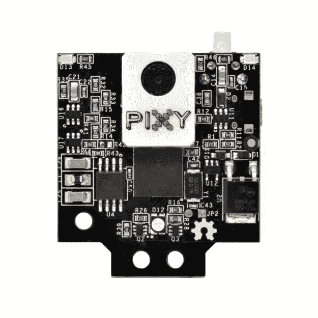
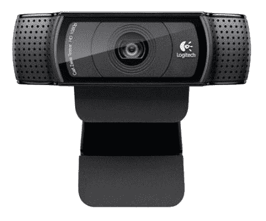
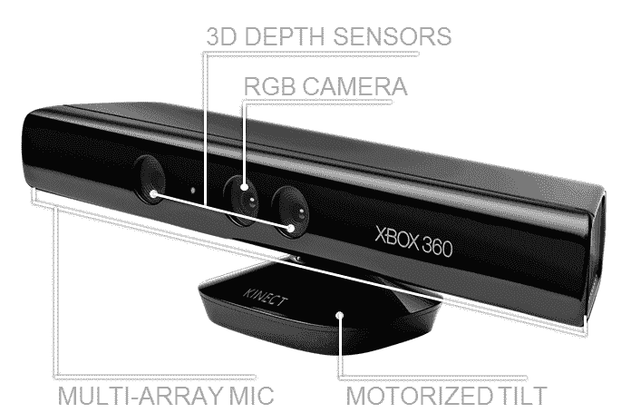
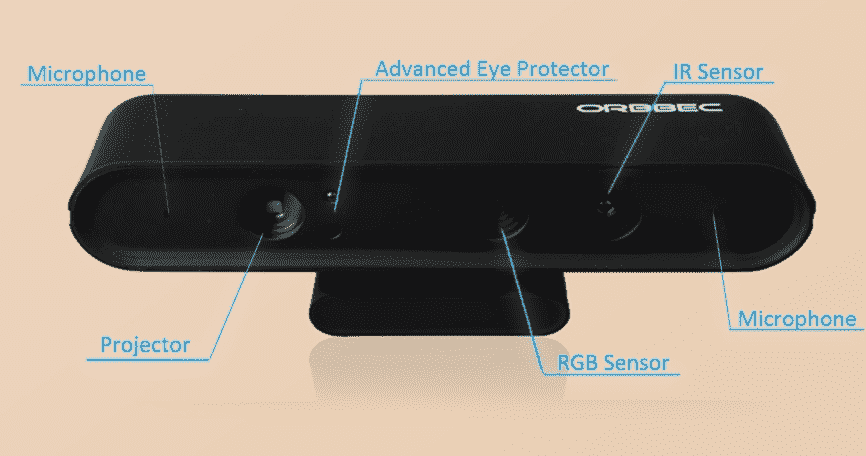
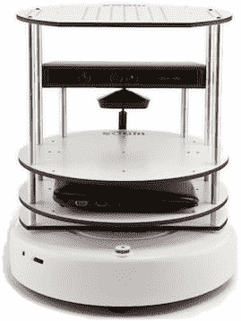
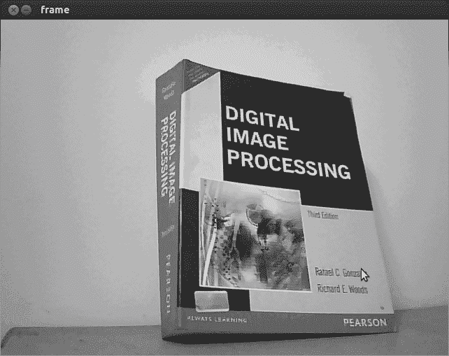
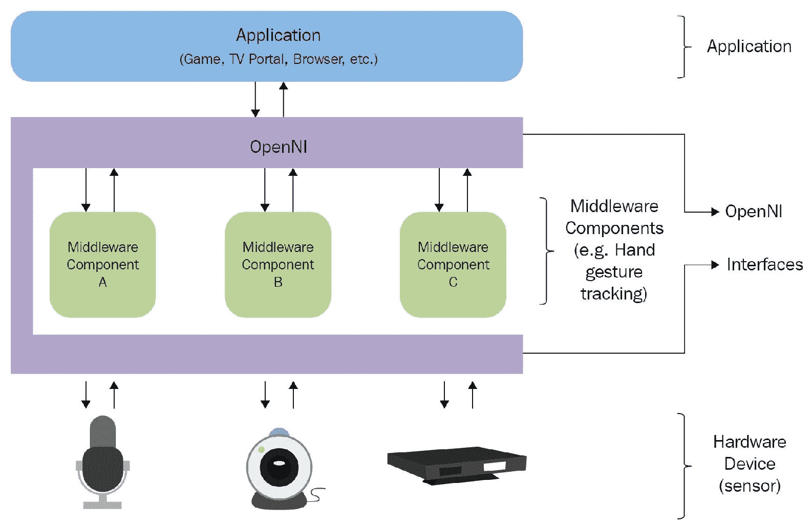
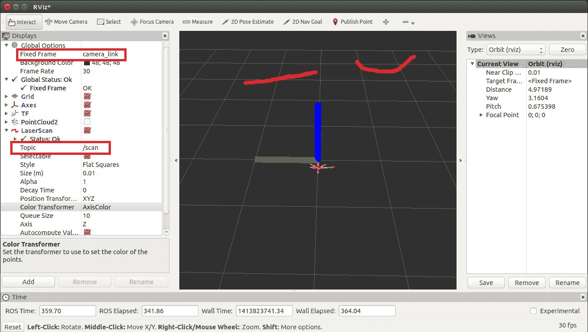

# 视觉传感器与 ROS 接口

在上一章中，我们研究了执行器以及如何使用 Tiva-C LaunchPad 板连接机器人的传感器。 在本章中，我们将主要介绍视觉传感器及其与机器人一起使用的接口。

我们正在设计的机器人将具有 3D 视觉传感器，并且我们可以将其与视觉库（例如**开源计算机视觉**（**OpenCV**），**开源自然交互**（OpenNI）和**点云库**（**PCL**）。 3D 视觉传感器在我们的机器人中的主要应用是自主导航。

我们还将研究如何将视觉传感器与 ROS 接口连接，以及如何使用视觉库（例如 OpenCV）处理它所感测的图像。 在本章的最后一部分，我们将研究在机器人中使用的映射和定位算法，称为 **SLAM**（**同时定位和映射**），以及如何使用 3D 视觉传感器，ROS 和图像处理库。

在本章中，我们将介绍以下主题：

*   机器人视觉传感器和图像库列表
*   OpenCV，OpenNI 和 PCL 简介
*   ROS-OpenCV 接口
*   使用 PCL-ROS 接口进行点云处理
*   点云数据到激光扫描数据的转换
*   SLAM 简介

# 技术要求

您将需要安装 ROS Kinetic 的 Ubuntu 16.04 系统以及网络摄像头和深度摄像头，才能尝试本章中的示例。

在第一部分中，我们将介绍市场上可用于不同机器人的 2D 和 3D 视觉传感器。

# 机器人视觉传感器和图像库列表

2D 视觉传感器或普通相机可提供周围环境的 2D 图像帧，而 3D 视觉传感器可提供 2D 图像帧和称为每个图像点深度的附加参数。 我们可以找到 3D 传感器相对于传感器轴的每个点的`x`，`y`和`z`距离。

市场上有很多视觉传感器。 本章中提到了一些可以在我们的机器人中使用的 2D 和 3D 视觉传感器。

# Pixy2/CMUcam5

下图显示了称为 [Pixy2/CMUcam5](https://pixycam.com/pixy-cmucam5/) 的最新 2D 视觉传感器，该传感器能够快速，准确地检测颜色对象，并且可以 与 Arduino 开发板接口。 Pixy 可用于快速物体检测，并且用户可以教它需要跟踪哪个物体。 Pixy 模块具有一个 CMOS 传感器和基于 Arm Cortex M4/M0 内核的 [NXP LPC4330](http://www.nxp.com/)，用于图像处理。 下图显示了 Pixy/CMUcam5：



[Pixy/CMUcam5](http://a.co/1t91hn6)

最常用的 2D 视觉传感器是网络摄像头。 它们包含一个 CMOS 传感器和 USB 接口，但没有像 Pixy 一样具有内置的视觉处理功能。

# 罗技 C920 网络摄像头

下图显示了 Logitech 流行的网络摄像头，该摄像头可以捕获高达 5 百万像素分辨率的图片和高清视频：



[罗技 HD C920 网络摄像头](http://a.co/02DUUYd)

# Kinect 360

现在，我们将看一下市场上一些可用的 3D 视觉传感器。 一些较流行的传感器是 Kinect，Intel RealSense D400 系列和 Orbbec Astra。



Kinect 传感器

Kinect 是最初为 Microsoft Xbox 360 游戏控制台开发的 3D 视觉传感器。 它主要包含一个 RGB 相机，一个红外投影仪，一个 IR 深度相机，一个麦克风阵列和一个用于更改其倾斜度的电机。 RGB 摄像头和深度摄像头在 30 Hz 时以`640 x 480`的分辨率捕获图像。 RGB 相机捕获 2D 彩色图像，而深度相机则捕获单色深度图像。 Kinect 的深度感应范围为 0.8 m 至 4 m。

Kinect 的一些应用是 3D 运动捕获，骨骼跟踪，面部识别和语音识别。

Kinect 可以使用 USB 2.0 接口与 PC 相连，并可以使用 Kinect SDK，OpenNI 和 OpenCV 进行编程。 Kinect SDK 仅适用于 Windows 平台，并且 SDK 由 Microsoft 开发和提供。 另外两个库是开源的，可用于所有平台。 我们在这里使用的 Kinect 是 Kinect 的第一个版本； 最新版本的 Kinect 仅在 Windows 上运行时才支持 Kinect SDK（有关更多详细信息，请参见[这个页面](https://www.microsoft.com/en-us/download/details.aspx?id=40278)） 。

Kinect 系列传感器的生产已经停产，但是您仍然可以在 Amazon 和 eBay 上找到该传感器。

# 英特尔实感 D400 系列


[英特尔实感 D400 系列](https://realsense.intel.com/)

英特尔实感 D400 深度传感器是带有红外投影仪的立体声相机，用于增强深度数据（有关更多详细信息，请参阅[这个页面](https://software.intel.com/en-us/realsense/d400)）， 如图 4 所示。D400 系列中最受欢迎的传感器型号是 D415 和 D435。 在图 4 中，左侧的传感器为 D415，右侧的传感器为 D435。 每个组件均由一对立体摄像机，一个 RGB 摄像机和一个 IR 投影仪组成。 立体摄像机对借助红外投影仪计算环境深度。

这种深度相机的主要特点是它可以在室内和室外环境下工作。 它可以以 90 fps 的速度提供`1280 x 720`分辨率的深度图像流，而 RGB 相机可以提供高达`1280 x 720`的分辨率。它具有 USB-C 接口，可以在传感器和计算机之间进行快速数据传输。 。 它外形小巧，轻巧，非常适合机器人视觉应用。

Kinect 和 Intel RealSense 的应用程序相同，除了语音识别。 它们将在 Windows，Linux 和 Mac 上运行。 我们可以使用 ROS，OpenNI 和 OpenCV 开发应用程序。 下图显示了 D400 系列摄像机的框图：


英特尔实感 D400 系列的框图

[您可以在以下链接找到英特尔实感系列的数据表](https://software.intel.com/sites/default/files/Intel_RealSense_Depth_Cam_D400_Series_Datasheet.pdf)。

[可以在以下链接中找到英特尔实感的深度传感器](https://arxiv.org/abs/1705.05548)。

[您可以在以下链接中找到英特尔实感 SDK](https://github.com/IntelRealSense/librealsense)。

# Orbbec Astra 深度传感器

新型 Orbbec Astra 传感器是市场上 Kinect 的替代产品之一。 与 Kinect 相比，它具有相似的规格，并使用相似的技术来获取深度信息。 与 Kinect 相似，它具有 IR 投影仪，RGB 相机和 IR 传感器。 它还配有麦克风，可帮助语音识别应用程序。 下图显示了 Orbbec Astra 深度传感器的所有部分：



[Orbbec Astra 深度传感器](https://orbbec3d.com/product-astra/)

Astra 传感器有两种型号：Astra 和 AstraS。这两种型号之间的主要区别是深度范围。 Astra 的深度范围为 0.6-8 m，而 Astra S 的范围为 0.4-2 m。 Astra S 最适合 3D 扫描，而 Astra 可用于机器人应用。 阿斯特拉的大小和重量远小于 Kinect。 这两个模型都可以提供深度数据和 30 fps 的`640 x 480`分辨率的 RGB 图像。 您可以使用更高的分辨率，例如`1280 x 960`，但可能会降低帧速率。 它们还具有跟踪骨骼的能力，例如 Kinect。

该传感器符合 OpenNI 框架，因此使用 OpenNI 构建的应用程序也可以使用该传感器。 我们将在机器人中使用此传感器。

该 SDK 与 Windows，Linux 和 Mac OS X 兼容。有关更多信息，[您可以访问传感器的开发网站](https://orbbec3d.com/develop/)。

您还可以参考的传感器之一是 [ZED 摄像机](https://www.stereolabs.com/zed/)。 这是一种立体视觉摄像头系统，能够以良好的帧频提供高分辨率。 价格约为 450 美元，高于上述传感器。 可用于需要传感器具有良好准确性的高端机器人应用。

我们将在接下来的部分中看到该传感器的 ROS 接口。

# OpenCV，OpenNI 和 PCL 简介

让我们看一下我们将在机器人中使用的软件框架和库。 首先，让我们看一下 OpenCV。 这是我们将在此机器人中使用的库之一，用于对象检测和其他图像处理功能。

# 什么是 OpenCV？

**OpenCV** 是开放源代码，BSD 许可的计算机视觉库，其中包括数百种计算机视觉算法的实现。 该库主要用于实时计算机视觉，是由 Intel Russia 的研究开发的，现在得到 [Itseez](https://github.com/Itseez) 的积极支持。 2016 年，英特尔收购了 Itseez。

OpenCV 主要用 C 和 C++ 编写，其主要接口是 C++。 它还具有 Python，Java 和 MATLAB / Octave 的良好接口，还具有其他语言（如 C＃和 Ruby）的包装。

在最新版本的 OpenCV 中，[支持 CUDA 和 OpenCL 以启用 GPU 加速](http://www.nvidia.com/object/cuda_home_new.html)。

OpenCV 将在大多数操作系统平台（例如 Windows，Linux，Mac OS X，Android，FreeBSD，OpenBSD，iOS 和 BlackBerry）上运行。

在 Ubuntu 中，当我们安装`ros-kinetic-desktop-full`或`ros-melodic-desktop-full`软件包时，已经安装了 OpenCV，Python 包装程序和 ROS 包装程序。 以下命令分别安装 OpenCV-ROS 软件包。

在动力学中：

```py
    $ sudo apt-get install ros-kinetic-vision-opencv  
```

在旋律中：

```py
    $ sudo apt-get install ros-melodic-vision-opencv
```

如果要验证系统上已安装 OpenCV-Python 模块，请使用 Linux 终端，然后输入`python`命令。 然后，您应该看到 Python 解释器。 尝试在 Python 终端中执行以下命令以验证 OpenCV 安装：

```py
    >>> import cv2
    >>> cv2.__version__
```

如果此命令成功，则将在您的系统上安装此版本的 OpenCV。 版本可能是 3.3.x 或 3.2.x。

如果要在 Windows 中尝试 OpenCV，[可以尝试以下链接](https://docs.opencv.org/3.3.1/d5/de5/tutorial_py_setup_in_windows.html)。

[以下链接将指导您完成 Mac OS X 上 OpenCV 的安装过程](https://www.learnopencv.com/install-opencv3-on-macos/)。

OpenCV 的主要应用程序在以下领域：

*   物体检测
*   手势识别
*   人机交互
*   移动机器人
*   运动追踪
*   面部识别系统

# 从 Ubuntu 中的源代码安装 OpenCV

OpenCV 安装可以自定义。 如果要自定义 OpenCV 安装，则可以尝试从源代码安装它。 您可以在[这个页面](https://docs.opencv.org/trunk/d7/d9f/tutorial_linux_install.html)中找到如何进行此安装的方法。

要使用本章中的示例，最好将 OpenCV 与 ROS 一起使用。

# 使用 Python-OpenCV 界面读取和显示图像

第一个示例将以灰度加载图像并将其显示在屏幕上。

在下面的代码部分中，我们将导入`numpy`模块来处理图像数组。 `cv2`模块是 Python 的 OpenCV 包装器，我们可以使用它来访问 OpenCV Python API。 NumPy 是 Python 编程语言的扩展，增加了对大型多维数组和矩阵的支持，以及对这些数组进行操作的大型高级数学函数库（请参见[这个页面](https://pypi.python.org/pypi/numpy)了解更多信息）：

```py
#!/usr/bin/env python 
import numpy as np 
import cv2 
```

以下功能将读取`robot.jpg`图像并以灰度加载该图像。 `cv2.imread()`函数的第一个参数是图像的名称，下一个参数是指定加载图像颜色类型的标志。 如果该标志大于 0，则该图像返回一个三通道 RGB 彩色图像；否则，返回 0。 如果标志为 0，则加载的图像将为灰度图像； 如果该标志小于 0，它将返回与加载的图像相同的图像：

```py
img = cv2.imread('robot.jpg',0) 
```

以下代码部分将使用`imshow()`功能显示读取的图像。 `cv2.waitKey(0)`功能是键盘绑定功能。 其参数是时间（以毫秒为单位）。 如果为 0，它将无限期地等待击键：

```py
cv2.imshow('image', img) 
cv2.waitKey(0) 
```

`cv2.destroyAllWindows()`函数只是破坏了我们创建的所有窗口：

```py
cv2.destroyAllWindows() 
```

将前面的代码另存为`image_read.py`，然后复制 JPG 文件并将其命名为`robot.jpg`。 使用以下命令执行代码：

```py
    $python image_read.py
```

输出将以灰度加载图像，因为我们在`imread()`函数中使用了`0`作为值：



读取图像代码的输出

以下示例将尝试使用开放式网络摄像头。 当用户按下任意按钮时，程序将退出。

# 从网络摄像头捕获

以下代码将使用设备名称为`/dev/video0`或`/dev/video1`的网络摄像头捕获图像。

我们需要导入`numpy`和`cv2`模块，以从相机捕获图像：

```py
#!/usr/bin/env python 
import numpy as np 
import cv2
```

以下函数将创建一个`VideoCapture`对象。 `VideoCapture`类用于从视频文件或摄像机捕获视频。 `VideoCapture`类的初始化参数是摄像机的索引或视频文件的名称。 设备索引只是用于指定摄像机的数字。 第一个摄像机索引为 0，设备名称为`/dev/video0`-这就是为什么我们将`0`放在以下代码中的原因：

```py
cap = cv2.VideoCapture(0) 
```

下面的代码节循环执行，以从`VideoCapture`对象读取图像帧，并显示每个帧。 当按下任意键时，它将退出：

```py
while(True): 
    # Capture frame-by-frame 
    ret, frame = cap.read() 
    # Display the resulting frame 
    cv2.imshow('frame', frame) 
    k = cv2.waitKey(30) 
    if k > 0: 
        break 
```

以下是程序输出的屏幕截图：



视频捕获的输出

[您可以在以下位置浏览更多 OpenCV-Python 教程](http://opencv-python-tutroals.readthedocs.org/en/latest/py_tutorials/py_tutorials.html)。

在下一节中，我们将研究 OpenNI 库及其应用程序。

# 什么是 OpenNI？

OpenNI 是一种多语言，跨平台的框架，它定义 API 以便使用**自然交互**（**NI**）编写应用程序（请参阅[这个页面](https://structure.io/openni)）。 自然互动是指人们通过手势，表情和动作进行自然交流的方式，并通过环顾四周并操纵物理对象和材料来发现世界。

OpenNI API 由一组用于编写 NI 应用程序的接口组成。 下图显示了 OpenNI 库的三层视图：



OpenNI 框架软件架构

顶层表示实现基于自然交互的应用程序的应用程序层。 中间层是 OpenNI 层，它将提供与传感器和分析传感器数据的中间件组件交互的通信接口。 中间件可用于全身分析，手点分析，手势检测等。 中间层组件的一个示例是 [NITE](http://www.openni.ru/files/nite/index.html)，它可以检测手势和骨骼。

底层包含捕获场景的视觉和音频元素的硬件设备。 它可以包括 3D 传感器，RGB 相机，IR 相机和麦克风。

OpenNI 的最新版本是 OpenNI 2，它支持华硕 Xtion Pro 和 Primesense Carmine 等传感器。 OpenNI 的第一个版本主要支持 Kinect 360 传感器。

OpenNI 是跨平台的，并且已成功在 Linux，Mac OS X 和 Windows 上进行了编译和部署。

在下一节中，我们将看到如何在 Ubuntu 中安装 OpenNI。

# 在 Ubuntu 中安装 OpenNI

我们可以将 OpenNI 库与 ROS 软件包一起安装。 ROS 已经与 OpenNI 进行了接口，但是 ROS 桌面完全安装可能无法安装 OpenNI 软件包。 如果是这样，我们需要从程序包管理器中安装它。

以下命令将在 Kinetic 和 Melodic 中安装 ROS-OpenNI 库（主要由 Kinect Xbox 360 传感器支持）：

```py
$ sudo apt-get install ros-<version>-openni-launch
```

以下命令将安装 ROS-OpenNI 2 库（Asus Xtion Pro 和 Primesense Carmine 主要支持）：

```py
    $ sudo apt-get install ros-<version>-openni2-launch   
```

可在[这个页面](http://structure.io/openni)获得适用于 Windows，Linux 和 MacOS X 的 OpenNI 的源代码和最新版本。

在下一节中，我们将研究如何安装 PCL。

# 什么是 PCL？

**点云**是空间中代表 3D 对象或环境的一组数据点。 通常，从诸如 Kinect 和 LIDAR 的深度传感器生成点云。 PCL（点云库）是用于 2D/3D 图像和点云处理的大规模开放项目。 PCL 框架包含执行过滤，特征估计，表面重构，配准，模型拟合和分割的众多算法。 使用这些方法，我们可以处理点云，提取关键描述符以根据对象的几何外观识别世界中的对象，从点云创建表面并对其进行可视化。

PCL 是根据 BSD 许可证发行的。 它是开源的，可免费用于商业用途，也可免费用于研究用途。 PCL 是跨平台的，已成功编译并部署在 Linux，macOS X，Windows 和 Android / iOS 上。

您可以从[这个页面](http://pointclouds.org/downloads/)下载 PCL。

PCL 已经集成到 ROS 中。 ROS 完整桌面安装中包含 PCL 库及其 ROS 接口。 PCL 是 ROS 的 3D 处理主干。 有关 ROS-PCL 软件包的详细信息，请参见 http://wiki.ros.org/pcl。

# 使用 ROS，OpenCV 和 OpenNI 使用 Python 编程 Kinect

让我们看看如何在 ROS 中与 Kinect 传感器进行交互和使用。 ROS 与 OpenNI 驱动程序捆绑在一起，该驱动程序可以获取 Kinect 的 RGB 和深度图像。 ROS 中的 OpenNI 和 OpenNI 2 软件包可用于与 Microsoft Kinect，Primesense Carmine，Asus Xtion Pro 和 Pro Live 接口。

当我们安装 ROS 的`openni_launch`软件包时，它还将安装其从属软件包，例如`openni_camera`。 `openni_camera`程序包是 Kinect 驱动程序，用于发布原始数据和传感器信息，而`openni_launch`程序包包含 ROS 启动文件。 这些启动文件一次启动多个节点，并发布数据，例如原始深度，RGB 和 IR 图像以及点云。

# 如何启动 OpenNI 驱动

您可以使用 USB 接口将 Kinect 传感器连接到计算机，并使用终端中的`dmesg`命令确保 PC 上已检测到 Kinect 传感器。 设置 Kinect 之后，我们可以启动 ROS 的 OpenNI 驱动程序以从设备获取数据。

以下命令将打开 OpenNI 设备并加载所有 nodelet（有关更多信息，请参见[这个页面](http://wiki.ros.org/nodelet)），以将原始深度/ RGB / IR 流转换为深度图像，视差图像 和点云。 ROS `nodelet`软件包旨在提供一种在同一过程中运行多个算法的方法，并且算法之间的复制拷贝为零：

```py
    $ roslaunch openni_launch openni.launch  
```

启动驱动程序后，可以使用以下命令列出驱动程序发布的各种主题：

```py
    $ rostopic list  
```

您可以使用名为`image_view`的 ROS 工具查看 RGB 图像：

```py
    $ rosrun image_view image_view image:=/camera/rgb/image_color  
```

在下一部分中，我们将学习如何将这些图像与 OpenCV 进行图像处理。

# 带有 OpenCV 的 ROS 接口

OpenCV 还集成到 ROS 中，主要用于图像处理。 `vision_opencv` ROS 堆栈包括完整的 OpenCV 库和与 ROS 的接口。

`vision_opencv` meta 程序包由各个程序包组成：

*   `cv_bridge`：包含`CvBridge`类。 此类将 ROS 图像消息转换为 OpenCV 图像数据类型，反之亦然。
*   `image_geometry`：包含处理图像和像素几何的方法的集合。

下图显示了 OpenCV 如何与 ROS 接口：


OpenCV-ROS 接口

OpenCV 的图像数据类型为`IplImage`和`Mat`。 如果要在 ROS 中使用 OpenCV，则必须将`IplImage`或`Mat`转换为 ROS 图像消息。 ROS 软件包`vision_opencv`具有`CvBridge`类； 此类可以将`IplImage`转换为 ROS 图像，反之亦然。 一旦从任何一种视觉传感器获得 ROS 图像主题，就可以使用 ROS CvBridge 来将其从 ROS 主题转换为`Mat`或`IplImage`格式。

下一节将向您展示如何创建 ROS 软件包。 此程序包包含一个节点，用于订阅 RGB 和深度图像，处理 RGB 图像以检测边缘并在将所有图像转换为与 OpenCV 等效的图像类型后显示所有图像。

# 创建具有 OpenCV 支持的 ROS 软件包

我们可以创建一个名为`sample_opencv_pkg`的程序包，该程序包具有以下依赖性：`sensor_msgs`，`cv_bridge`，`rospy`和`std_msgs`。 `sensor_msgs`依赖项定义了常用传感器（包括照相机和扫描激光测距仪）的 ROS 消息。 `cv_bridge`依赖项是 ROS 的 OpenCV 接口。

以下命令将创建具有上述依赖性的 ROS 软件包：

```py
    $ catkin-create-pkg sample_opencv_pkg sensor_msgs cv_bridge 
 rospy std_msgs  
```

创建包后，在包内创建一个`scripts`文件夹； 我们将其用作保存代码的位置，下一部分将提到该代码。

# 使用 Python，ROS 和 cv_bridge 显示 Kinect 图像

以下代码段给出了 Python 代码的第一部分。 它主要涉及导入`rospy`，`sys`，`cv2`，`sensor_msgs`，`cv_bridge,`和`numpy`模块。 `sensor_msgs`依赖项导入图像和相机信息类型的 ROS 数据类型。 `cv_bridge`模块导入了`CvBridge`类，用于将 ROS 图像数据类型转换为 OpenCV 数据类型，反之亦然：

```py
import rospy
import sys
import cv2
from sensor_msgs.msg import Image, CameraInfo
from cv_bridge import CvBridge, CvBridgeError
from std_msgs.msg import String
import numpy as np
```

以下代码部分是 Python 中的类定义，我们将使用它们来演示`CvBridge`函数。 该类称为`cvBridgeDemo`：

```py
class cvBridgeDemo(): 
    def __init__(self): 
        self.node_name = "cv_bridge_demo" 
        #Initialize the ros node 
        rospy.init_node(self.node_name) 

        # What we do during shutdown 
        rospy.on_shutdown(self.cleanup) 

        # Create the cv_bridge object 
        self.bridge = CvBridge() 

        # Subscribe to the camera image and depth topics and set 
        # the appropriate callbacks 
        self.image_sub = 
 rospy.Subscriber("/camera/rgb/image_raw", Image, 
 self.image_callback)        self.depth_sub = 
 rospy.Subscriber("/camera/depth/image_raw", Image, 
 self.depth_callback) 

 #Callback executed when the timer timeout 
      rospy.Timer(rospy.Duration(0.03), self.show_img_cb) 

      rospy.loginfo("Waiting for image topics...")
```

这是可视化实际 RGB 图像，已处理 RGB 图像和深度图像的回调：

```py
    def show_img_cb(self,event): 
         try:  

             cv2.namedWindow("RGB_Image", cv2.WINDOW_NORMAL) 
             cv2.moveWindow("RGB_Image", 25, 75) 

             cv2.namedWindow("Processed_Image", cv2.WINDOW_NORMAL) 
             cv2.moveWindow("Processed_Image", 500, 75) 

             # And one for the depth image 
             cv2.moveWindow("Depth_Image", 950, 75) 
             cv2.namedWindow("Depth_Image", cv2.WINDOW_NORMAL) 

             cv2.imshow("RGB_Image",self.frame) 
             cv2.imshow("Processed_Image",self.display_image) 
             cv2.imshow("Depth_Image",self.depth_display_image) 
             cv2.waitKey(3) 
         except: 
             pass 
```

以下代码提供了 Kinect 彩色图像的回调函数。 当在`/camera/rgb/image_raw`主题上收到彩色图像时，它将调用此功能。 此功能将处理用于边缘检测的彩色框，并显示检测到的边缘和原始彩色图像：

```py
    def image_callback(self, ros_image): 
        # Use cv_bridge() to convert the ROS image to OpenCV format 
        try: 
            self.frame = self.bridge.imgmsg_to_cv2(ros_image, "bgr8") 
        except CvBridgeError, e: 
            print e 
       pass 

        # Convert the image to a Numpy array since most cv2 functions 
        # require Numpy arrays. 
        frame = np.array(self.frame, dtype=np.uint8) 

        # Process the frame using the process_image() function 
        self.display_image = self.process_image(frame) 

```

以下代码提供了 Kinect 中深度图像的回调函数。 在`/camera/depth/raw_image`主题上收到深度图像时，它将调用此函数。 此功能将显示原始深度图像：

```py
       def depth_callback(self, ros_image): 
        # Use cv_bridge() to convert the ROS image to OpenCV format 
        try: 
            # The depth image is a single-channel float32 image 
            depth_image = self.bridge.imgmsg_to_cv2(ros_image, "32FC1") 
        except CvBridgeError, e: 
            print e 
       pass 
        # Convert the depth image to a Numpy array since most cv2 functions 
        # require Numpy arrays. 
        depth_array = np.array(depth_image, dtype=np.float32) 

        # Normalize the depth image to fall between 0 (black) and 1 (white) 
        cv2.normalize(depth_array, depth_array, 0, 1, cv2.NORM_MINMAX) 

        # Process the depth image 
        self.depth_display_image = self.process_depth_image(depth_array) 
```

以下函数称为`process_image(),`，它将彩色图像转换为灰度，然后使图像模糊，并使用 Canny 边缘滤镜找到边缘：

```py
    def process_image(self, frame): 
        # Convert to grayscale 
        grey = cv2.cvtColor(frame, cv.CV_BGR2GRAY) 

        # Blur the image 
        grey = cv2.blur(grey, (7, 7)) 

        # Compute edges using the Canny edge filter 
        edges = cv2.Canny(grey, 15.0, 30.0) 

        return edges 
```

以下功能称为`process_depth_image()`。 它只是返回深度框架：

```py
    def process_depth_image(self, frame): 
        # Just return the raw image for this demo 
        return frame 
```

当节点关闭时，以下函数将关闭图像窗口：

```py
    def cleanup(self): 
        print "Shutting down vision node." 
        cv2.destroyAllWindows()
```

以下代码是`main()`功能。 它将初始化`cvBridgeDemo()`类并调用`rospy.spin()`函数：

```py
def main(args): 
    try: 
        cvBridgeDemo() 
        rospy.spin() 
    except KeyboardInterrupt: 
        print "Shutting down vision node." 
        cv.DestroyAllWindows() 

if __name__ == '__main__': 
    main(sys.argv) 
```

将前面的代码另存为`cv_bridge_demo.py`，并使用以下命令更改节点的权限。 仅当我们授予`rosrun`命令可执行权限时，这些节点才可见：

```py
    $ chmod +X cv_bridge_demo.py  
```

以下是启动驱动程序和节点的命令。 使用以下命令启动 Kinect 驱动程序：

```py
    $ roslaunch openni_launch openni.launch  
```

使用以下命令运行节点：

```py
    $ rosrun sample_opencv_pkg cv_bridge_demo.py  
```

以下是输出的屏幕截图：


RGB，深度和边缘图像

# 将 Orbbec Astra 与 ROS 连接

Kinect 的替代品之一是 Orbbec Astra。 有用于 Astra 的 ROS 驱动程序，我们可以看到如何设置该驱动程序并从该传感器获取图像，深度和点云。

# 安装 Astra–ROS 驱动程序

在[这个页面](https://github.com/orbbec/ros_astra_camera)和[这个页面](http://wiki.ros.org/Sensors/OrbbecAstra)中提到了在 Ubuntu 中设置 Astra-ROS 驱动程序的完整说明。 安装驱动程序后，可以使用以下命令启动它：

```py
    $ roslaunch astra_launch astra.launch  
```

您也可以从 ROS 软件包系统信息库安装 Astra 驱动程序。 这是安装这些软件包的命令：

```py
    $ sudo apt-get install ros-kinetic-astra-camera
    $ sudo apt-get install ros-kinetic-astra-launch  
```

安装这些软件包后，您必须设置设备的权限才能使用该设备，如[这个页面](http://wiki.ros.org/astra_camera)所述。 您可以使用终端中的`rostopic` list 命令检查从该驱动程序生成的 ROS 主题。 另外，我们可以使用上一节中提到的相同的 Python 代码进行图像处理。

# 使用 Kinect，ROS，OpenNI 和 PCL 处理点云

3D 点云是将 3D 环境和 3D 对象表示为沿 x，y 和 z 轴的收集点的一种方式。 我们可以从各种来源获得点云：要么可以通过编写程序来创建点云，要么可以通过深度传感器或激光扫描仪生成它。

PCL 本机支持 OpenNI 3D 接口。 因此，它可以从设备（例如 Prime Sensor 的 3D 相机，Microsoft Kinect 或 Asus Xtion Pro）中获取和处理数据。

PCL 将包含在 ROS 完整桌面安装中。 让我们看看如何在 RViz（ROS 中的数据可视化工具）中生成和可视化点云。

# 打开设备并生成点云

使用以下命令，打开一个新终端并启动 ROS-OpenNI 驱动程序以及点云生成器节点：

```py
    $ roslaunch openni_launch openni.launch  
```

此命令将激活 Kinect 驱动程序并将原始数据处理为方便的输出，例如点云。

如果使用的是 Orbbec Astra，则可以使用以下命令：

```py
    $ roslaunch astra_launch astra.launch  
```

我们将使用 RViz 3D 可视化工具来查看我们的点云。

以下命令将启动 RViz 工具：

```py
    $ rosrun rviz rviz  
```

将固定帧的 RViz 选项（在“全局选项”下“显示”面板的顶部）设置为 camera_link。

在 RViz 面板的左侧面板中，单击“添加”按钮，然后选择 PointCloud2 显示选项。 将其主题设置为/ camera / depth / points（这是 Kinect 的主题；其他传感器将有所不同）

将 PointCloud2 的颜色转换器更改为 AxisColor。

以下屏幕截图显示了 RViz 点云数据的屏幕截图。 您可以看到最近的对象用红色标记，最远的对象用紫色和蓝色标记。 Kinect 前面的对象表示为圆柱体和立方体：


在 Rviz 中可视化点云数据

# 点云数据到激光扫描数据的转换

我们在该机器人中使用 Astra 来复制昂贵的激光测距仪的功能。 使用 ROS 的`depthimage_to_laserscan`程序包处理深度图像并将其转换为激光扫描仪的等效数据（有关更多信息，请参见[这个页面](http://wiki.ros.org/depthimage_to_laserscan)）。

您可以从源代码安装此软件包，也可以使用 Ubuntu 软件包管理器。 这是从 Ubuntu 软件包管理器安装此软件包的命令

```py
    $ sudo apt-get install ros-<version>-depthimage-to-laserscan
```

该程序包的主要功能是对深度图像的一部分进行切片并将其转换为等效的激光扫描数据类型。 ROS `sensor_msgs/LaserScan`消息类型用于发布激光扫描数据。 此`depthimage_to_laserscan`软件包将执行此转换并伪造激光扫描仪数据。 可以使用 RViz 查看激光扫描仪的输出。 为了运行转换，我们必须启动将执行此操作的转换器节点。 为了开始转换，我们必须在启动文件中指定它。 以下是启动文件中启动`depthimage_to_laserscan`转换所需的代码：

```py
  <!-- Fake laser --> 
  <node pkg="nodelet" type="nodelet" 
 name="laserscan_nodelet_manager" args="manager"/>  <node pkg="nodelet" type="nodelet" 
 name="depthimage_to_laserscan"        args="load depthimage_to_laserscan/DepthImageToLaserScanNodelet 
 laserscan_nodelet_manager"> 
    <param name="scan_height" value="10"/> 
    <param name="output_frame_id" value="/camera_depth_frame"/> 
    <param name="range_min" value="0.45"/> 
    <remap from="image" to="/camera/depth/image_raw"/> 
    <remap from="scan" to="/scan"/> 
  </node> 
```

深度图像的主题可以在每个传感器中更改。 您必须根据您的深度图像主题更改主题名称。

除了启动 Nodelet 之外，我们还需要设置 Nodelet 的某些参数以实现更好的转换。 有关每个参数的详细说明，请参见[这个页面](http://wiki.ros.org/depthimage_to_laserscan)。

在以下屏幕截图中给出了前一视图的激光扫描。 要查看激光扫描，请添加 LaserScan 选项。 这类似于我们添加 PointCloud2 选项并将 LaserSan 的 Topic 值更改为/ scan 的方式：



在 Rviz 中可视化激光扫描数据

# 使用 ROS 和 Kinect 使用 SLAM

在我们的机器人中部署视觉传感器的主要目的是检测物体并在环境中导航机器人。 SLAM 是一种算法，用于移动机器人中，以通过跟踪机器人的当前位置来构建未知环境的地图或在已知环境中更新地图。

地图用于计划机器人的轨迹并在此路径中导航。 使用地图，机器人将了解环境。 移动机器人导航的两个主要挑战是映射和本地化。

映射涉及在机器人周围生成障碍物轮廓。 通过映射，机器人将了解世界的外观。 定位是估算机器人相对于我们构建的地图的位置的过程。

SLAM 从不同的传感器获取数据并使用它来构建地图。 2D/3D 视觉传感器可用于将数据输入 SLAM。 2D 视觉传感器（例如网络摄像头）和 3D 传感器（例如 Kinect）主要用作 SLAM 算法的输入。

名为 [OpenSlam](http://openslam.org/gmapping.html) 的 SLAM 库与 ROS 集成为一个名为 Gmapping 的软件包。 `gmapping`包提供了一个节点来执行基于激光器的 SLAM 处理，称为`slam_gmapping`。 这可以根据激光和移动机器人收集的位置数据创建 2D 地图。

`gmapping`软件包可从[这个页面](http://wiki.ros.org/gmapping)获得。

要使用`slam_gmapping`节点，我们必须输入机器人的里程数据和水平安装在机器人上的激光测距仪的激光扫描输出。

`slam_gmapping`节点订阅`sensor_msgs/LaserScan`消息和`nav_msgs/Odometry`消息以构建映射（`nav_msgs/OccupancyGrid`）。 可以通过 ROS 主题或服务检索生成的地图。

我们已使用以下启动文件在 Chefbot 中使用 SLAM。 该启动文件将启动`slam_gmapping`节点，并包含开始映射机器人环境所需的参数：

```py
    $ roslaunch chefbot_gazebo gmapping_demo.launch  
```

# 概括

在本章中，我们介绍了可在 Chefbot 中使用的各种视觉传感器。 我们在机器人中使用了 Kinect 和 Astra，并了解了 OpenCV，OpenNI，PCL 及其应用。 我们还讨论了视觉传感器在机器人导航中的作用，流行的 SLAM 技术及其在 ROS 中的应用。 在下一章中，我们将看到机器人的完整接口，并学习如何使用 Chefbot 进行自主导航。

# 问题

1.  什么是 3D 传感器，它们与普通相机有何不同？
2.  ROS 的主要特点是什么？
3.  OpenCV，OpenNI 和 PCL 有哪些应用程序？
4.  什么是 SLAM？
5.  什么是 RGB-D SLAM，它如何工作？

# 进一步阅读

您可以通过以下链接阅读有关 ROS 中的机器人视觉软件包的更多信息：

*   <http://wiki.ros.org/vision_opencv>
*   <http://wiki.ros.org/pcl>