# 构建 ChefBot 硬件和软件集成

在第 3 章“使用 ROS 和 URDF 建模差分机器人”中，我们研究了 ChefBot 机箱的设计。 在本章中，我们将学习如何使用这些零件组装该机器人。 我们还将研究该机器人与 Tiva-C LaunchPad 的传感器和其他电子组件的最终接口。 连接后，我们将学习如何将机器人与 PC 连接，以及如何在实际机器人中使用 SLAM 和 AMCL 进行自主导航。

本章将涵盖以下主题：

*   构建 ChefBot 硬件
*   配置 ChefBot PC 和软件包
*   将 ChefBot 传感器与 Tiva-C Launchpad 连接
*   ChefBot 的嵌入式代码
*   了解 ChefBot ROS 软件包
*   在 ChefBot 上实现 SLAM
*   ChefBot 中的自主导航

# 技术要求

要测试本章中的应用程序和代码，您将需要安装 ROS Kinetic 的 Ubuntu 16.04 LTS PC 或笔记本电脑。

您还需要装配好的机器人底盘部件来装配机器人。

您应该拥有可以集成在机器人中的所有传感器和其他硬件组件。

我们已经讨论了将各个机器人组件和传感器与 Launchpad 连接的方法。 在本章中，我们将尝试连接 ChefBot 的必要机械手组件和传感器，并对其进行编程，使其能够从所有传感器接收值并从 PC 控制信息。 Launchpad 将通过串行端口将所有传感器值发送到 PC，并从 PC 接收控制信息（例如，重置命令，速度数据等）。

从 Tiva C Launchpad 接收到串行端口数据后，ROS Python 节点将接收串行值并将其转换为 ROS 主题。 PC 中还存在其他 ROS 节点，这些节点订阅了这些传感器主题并计算了机器人的里程表。 来自车轮编码器的数据和 IMU 值相结合，以计算机器人的里程表。 机器人通过订阅超声传感器主题和激光扫描来检测障碍物，并使用 PID 节点控制车轮电机的速度。 该节点将线速度命令转换为差速轮速度命令。 运行这些节点之后，我们可以运行 SLAM 来绘制区域地图，运行 SLAM 之后，我们可以运行 AMCL 节点以进行本地化和自主导航。

在本章的第一部分“构建 ChefBot 硬件”中，我们将学习如何使用机器人的身体部位和电子组件组装 ChefBot 硬件。

# 构建 ChefBot 硬件

需要配置的机器人的第一部分是基板。 基板包括两个电机及其连接的车轮，脚轮和基板支架。 下图显示了底板的俯视图和仰视图：

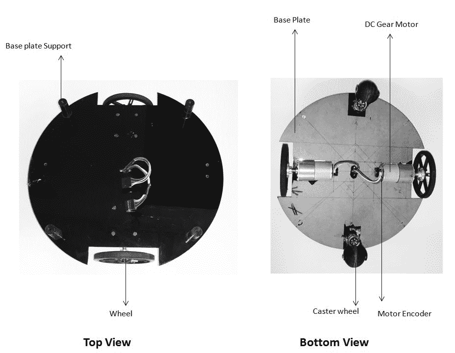

带有电机，车轮和脚轮的底板

基板的半径为 15 厘米，通过从基板上切下两个部分，将电动机及其连接的车轮安装在板的相对侧。 两个橡胶脚轮安装在基板的相对两侧，以实现良好的平衡和对机器人的支撑。 我们可以为此机器人选择球形脚轮或橡胶脚轮。 两个电动机的导线通过基板中心的孔被引到基板的顶部。 为了扩展机器人的各层，我们将放置基板支架以连接以下各层。 现在，让我们看一下带有中间板和连接管的下一层。 有空心管连接底板和中间板。 空心管可以连接到基板支架。

下图显示了中间板和连接管：

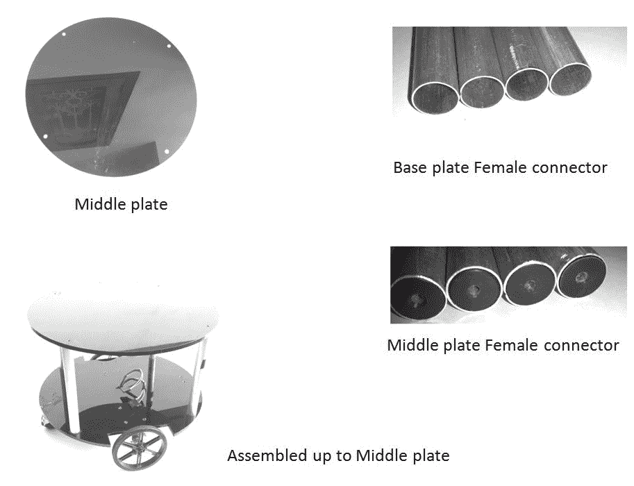

带连接管的中板

连接管将连接底板和中间板。 有四个空心管，用于将底板连接到中间板。 这些管子的一端是空心的，可以安装基板支撑，另一端是带有孔的硬塑料配件。 中间板没有支撑，但连接管有四个孔：

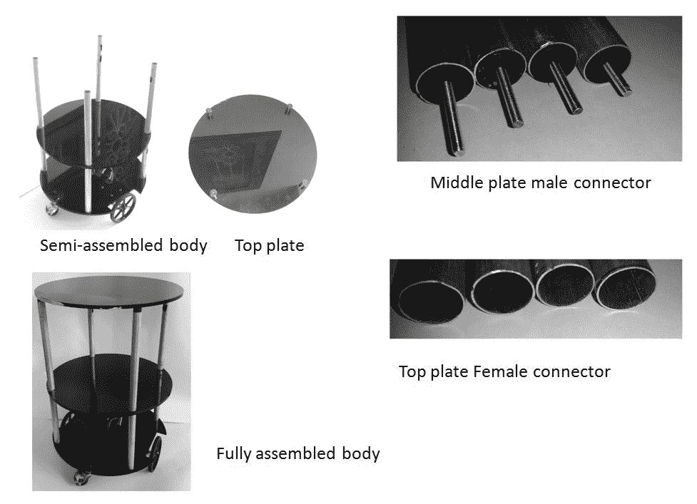

完全组装好的机器人机身

中间板公连接器有助于连接中间板和底板管的顶部。 我们可以使用顶板背面的四个支架将顶板安装在中间板管的顶部。 我们可以将顶板的母连接器插入顶板支架。 现在我们有了机器人的完整组装体。

机械手的底层可用于放置**印刷电路板**（**PCB**）和电池。 在中间层，我们可以放置 Kinect/Orbecc 和 Intel NUC。 如果需要，我们可以放置扬声器和麦克风。 我们可以用顶板运送食物。 下图显示了机器人的 PCB 原型； 它由 Tiva-C LaunchPad，电机驱动器，电平转换器和连接两个电机，超声传感器和 IMU 的设备组成：

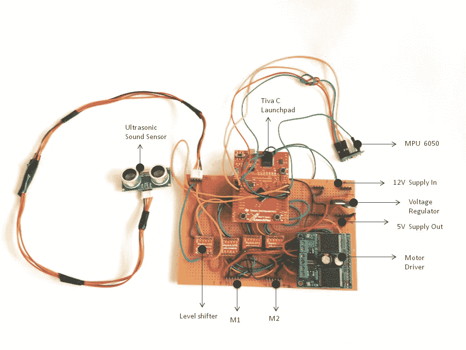

ChefBot PCB 原型

该板由放置在基板上的 12V 电池供电。 这两个电机可以直接连接到 M1 和 M2 公连接器。 NUC PC 和 Kinect 放在中间板上。 LaunchPad 板和 Kinect 应该通过 USB 连接到 NUC PC。 PC 和 Kinect 本身使用相同的 12V 电池供电。 我们可以使用铅酸或锂聚合物电池。 在这里，我们将铅酸电池用于测试目的。 稍后，我们将迁移到锂聚合物电池以获得更好的性能和更好的备用。 下图显示了完整的 ChefBot 组装图：

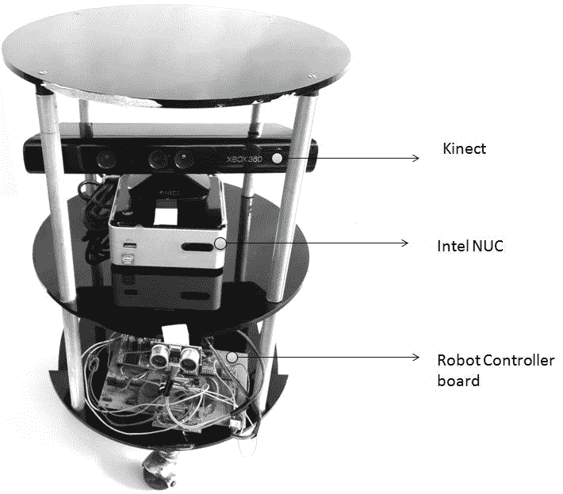

完全组装好的机器人机身

组装好机器人的所有零件之后，我们将开始使用机器人软件。 ChefBot 的嵌入式代码和 ROS 软件包在`chapter_8`下的代码中可用。 让我们获取该代码并开始使用该软件。

# 配置 ChefBot PC 并设置 ChefBot ROS 软件包

在 ChefBot 中，我们使用 Intel 的 NUC PC 来处理机器人传感器数据和数据处理。 在购买 NUC PC 之后，我们必须安装 Ubuntu 16.04 LTS。 安装 Ubuntu 之后，请安装我们在前面各章中提到的完整 ROS 及其软件包。 我们可以单独配置此 PC，完成所有设置的配置后，可以将其放入机器人中。 以下是在 NUC PC 上安装 ChefBot 软件包的过程。

使用以下命令从 GitHub 克隆 ChefBot 的软件包：

```py
    $ git clone https://github.com/qboticslabs/learning_robotics_2nd_ed  
```

我们可以在笔记本电脑中克隆此代码，然后将`ChefBot`文件夹复制到英特尔的 NUC PC。 `ChefBot`文件夹由 ChefBot 硬件的 ROS 软件包组成。 在 NUC PC 中，创建一个 ROS catkin 工作区，复制`ChefBot`文件夹，然后将其移动到 catkin 工作区的`src`目录中。

只需使用以下命令即可构建并安装 ChefBot 的源代码。 这应该在我们创建的`catkin`工作空间内执行：

```py
    $ catkin_make  
```

如果所有依赖项都已正确安装在 NUC 中，则 ChefBot 软件包将在此系统中生成并安装。 在 NUC PC 上设置 ChefBot 软件包后，我们可以切换到 ChefBot 的嵌入式代码。 现在，我们可以连接 LaunchPad 中的所有传感器。 将代码上传到 LaunchPad 中之后，我们可以再次查看 ROS 软件包以及如何运行它们。 从 GitHub 克隆的代码包含 Tiva-C LaunchPad 代码，将在下一节中对其进行说明。

# 将 ChefBot 传感器连接到 Tiva-C LaunchPad

我们已经研究了将在 ChefBot 中使用的各个传感器的接口。 在本节中，我们将学习如何将传感器集成到 LaunchPad 板上。 GitHub 上的克隆文件中提供了用于编程 Tiva-C LaunchPad 的 Energia 代码。 显示 Tiva-C LaunchPad 与传感器的连接的连接图如下。 通过此图，我们了解传感器如何与 LaunchPad 互连：

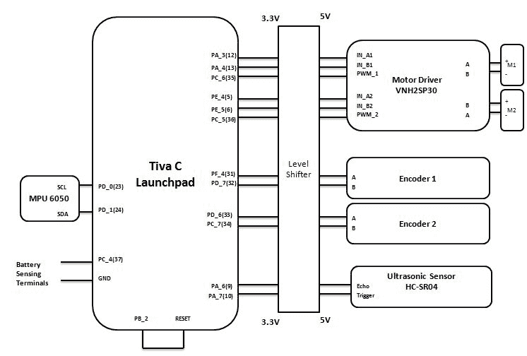

ChefBot 的传感器接口图

M1 和 M2 是我们在此机器人中使用的两个差动驱动电机。 我们将在这里使用的电动机是带有 Pololu 编码器的直流齿轮电动机。 电机端子连接到 Pololu 的双 **VNH2SP30** 电机驱动器。 其中一台电机极性相反，因为在差速转向中，一台电机的旋转方向与另一台相反。 如果我们向两个电机发送相同的控制信号，则每个电机将以相反的方向旋转。 为避免这种情况，我们将交换一台电机的电缆。 电机驱动器通过 3.3V-5V 双向电平转换器连接到 Tiva-C LaunchPad。 我们将在此处使用的电平转换器之一可在[这个页面](https://www.sparkfun.com/products/12009)上找到。

每个编码器的两个通道使用电平转换器连接到 LaunchPad。 目前，我们正在使用一个超声波距离传感器进行障碍物检测。 将来，如果需要，我们可以增加传感器的数量。 为了获得良好的里程估计，我们将 IMU 传感器 MPU 6050 通过 I2C 接口放置。 这些引脚直接连接到 LaunchPad，因为 MPU6050 兼容 3.3V。 为了从 ROS 节点重置 LaunchPad，我们分配了一个引脚作为输出并将其连接到 LaunchPad 的重置引脚。 当特定字符发送到 LaunchPad 时，它将输出引脚设置为高电平并重置设备。 在某些情况下，计算错误可能会累积并影响机器人的导航。 我们正在重置 LaunchPad 以清除此错误。 为了监视电池电量，我们分配了另一个引脚来读取电池值。 Energia 代码中当前未实现此功能。

您从 GitHub 下载的代码包含嵌入式代码和编译此代码所需的从属库。 我们可以在这里看到代码的主要部分，并且由于我们已经研究了所有部分，因此无需解释所有部分。

# ChefBot 的嵌入式代码

本节将讨论 LaunchPad 代码的主要部分。 以下是代码中使用的头文件：

```py
//Library to communicate with I2C devices 
#include "Wire.h" 
//I2C communication library for MPU6050 
#include "I2Cdev.h" 
//MPU6050 interfacing library 
#include "MPU6050_6Axis_MotionApps20.h" 
//Processing incoming serial data 
#include <Messenger.h> 
//Contain definition of maximum limits of various data type 
#include <limits.h>
```

该代码中使用的主要库用于与 MPU 6050 进行通信并处理输入到 LaunchPad 的串行数据。 MPU 6050 可以使用内置的**数字运动处理器**（**DMP**）提供四元数或欧拉值的方向。 访问 DMP 的功能写在`MPU6050_6Axis_MotionApps20.h`中。 该库具有诸如`I2Cdev.h`和`Wire.h`之类的依赖项； 这就是为什么我们还要包含此标头的原因。 这两个库用于 I2C 通信。 `Messenger.h`库可让您处理来自任何来源的文本数据流，并将帮助您从中提取数据。 `limits.h`标头包含各种数据类型的最大限制的定义。

包含头文件后，我们需要创建一个对象来处理 MPU6050，并使用`Messenger`类处理传入的串行数据：

```py
//Creating MPU6050 Object 
MPU6050 accelgyro(0x68); 
//Messenger object 
Messenger Messenger_Handler = Messenger(); 
```

声明了`Messenger`对象后，主要部分处理了电机驱动器，编码器，超声传感器，MPU 6050，复位和电池引脚的分配引脚。 分配引脚后，我们可以查看代码的`setup()`功能。 `setup()`函数的定义在以下代码中给出：

```py
//Setup serial, encoders, ultrasonic, MPU6050 and Reset functions 
void setup() 
{ 
  //Init Serial port with 115200 baud rate 
  Serial.begin(115200); 
  //Setup Encoders 
  SetupEncoders(); 
  //Setup Motors 
  SetupMotors(); 
  //Setup Ultrasonic 
  SetupUltrasonic(); 
  //Setup MPU 6050 
  Setup_MPU6050(); 
  //Setup Reset pins 
  SetupReset(); 
  //Set up Messenger object handler 
  Messenger_Handler.attach(OnMssageCompleted); 
}
```

前面的功能包含一个自定义例程，用于配置和分配所有传感器的引脚。 此功能将以 115,200 的波特率初始化串行通信，并设置编码器，电机驱动器，超声传感器和 MPU6050 的引脚。 `SetupReset()`功能将分配一个引脚以复位设备，如前面的连接图所示。 在前面的章节中，我们已经看到了每个传感器的设置例程，因此无需解释每个功能的定义。 `Messenger`类处理程序附加到名为`OnMssageCompleted()`的函数，该函数将在将数据输入`Messenger_Handler`时调用。

以下是代码的主要`loop()`功能。 该功能的主要目的是读取和处理串行数据，以及发送可用的传感器值：

```py
void loop() 
{ 
    //Read from Serial port 
    Read_From_Serial(); 
    //Send time information through serial port 
    Update_Time(); 
    //Send encoders values through serial port 
    Update_Encoders(); 
    //Send ultrasonic values through serial port 
    Update_Ultra_Sonic(); 
    //Update motor speed values with corresponding speed received from PC and send speed values through serial port 
    Update_Motors(); 
    //Send MPU 6050 values through serial port 
    Update_MPU6050(); 
    //Send battery values through serial port 
    Update_Battery(); 
} 
```

`Read_From_Serial()`功能将从 PC 读取串行数据，并将数据馈送到`Messenger_Handler`处理程序以进行处理。 `Update_Time()`功能将在嵌入式板上的每次操作后更新时间。 我们可以将此时间值在 PC 中进行处理，也可以改用 PC 的时间。

我们可以在 Energia 的 IDE 中编译代码，并在 LaunchPad 中刻录代码。 上传代码后，我们可以查看用于处理 LaunchPad 传感器值的 ROS 节点。

# 为 ChefBot 编写 ROS Python 驱动程序

将嵌入式代码上传到 LaunchPad 之后，下一步是处理 LaunchPad 上的串行数据，并将其转换为 ROS 主题以进行进一步处理。 `launchpad_node.py` ROS Python 驱动程序节点将 Tiva-C LaunchPad 与 ROS 接口。 `launchpad_node.py`文件位于`ChefBot_bringup`程序包中的`script`文件夹中。 以下是`launchpad_node.py`重要代码部分的说明：

```py
#ROS Python client 
import rospy 
import sys 
import time 
import math 

#This python module helps to receive values from serial port which execute in a thread 
from SerialDataGateway import SerialDataGateway 
#Importing required ROS data types for the code 
from std_msgs.msg import Int16,Int32, Int64, Float32, 
 String, Header, UInt64 
#Importing ROS data type for IMU 
from sensor_msgs.msg import Imu 
```

`launchpad_node.py`文件导入前面的模块。 我们可以看到的主要模块是`SerialDataGateway`。 这是一个自定义模块，编写该模块可通过线程从 LaunchPad 板接收串行数据。 我们还需要一些 ROS 数据类型来处理传感器数据。 以下代码段给出了节点的主要功能：

```py
if __name__ =='__main__': 
  rospy.init_node('launchpad_ros',anonymous=True) 
  launchpad = Launchpad_Class() 
  try: 

    launchpad.Start() 
    rospy.spin() 
  except rospy.ROSInterruptException: 
    rospy.logwarn("Error in main function") 

  launchpad.Reset_Launchpad() 
  launchpad.Stop()
```

该节点的主要类别为`Launchpad_Class()`。 此类包含启动，停止串行数据并将其转换为 ROS 主题的所有方法。 在 main 函数中，我们将创建`Launchpad_Class()`的对象。 创建对象后，我们将调用`Start()`方法，该方法将启动 Tiva-C LaunchPad 与 PC 之间的串行通信。 如果我们通过键入`Ctrl + C`来中断驱动程序节点，它将重置 LaunchPad 并停止 PC 与 LaunchPad 之间的串行通信。

以下代码段来自`Launchpad_Class()`的构造函数。 在以下代码段中，我们将从 ROS 参数中检索 LaunchPad 板的端口和波特率，并使用这些参数初始化`SerialDateGateway`对象。 当任何传入的串行数据到达串行端口时，`SerialDataGateway`对象将在此类内调用`_HandleReceivedLine()`函数。 此函数将处理串行数据的每一行，并将其提取，转换并插入每种 ROS 主题数据类型的相应标头中：

```py
#Get serial port and baud rate of Tiva C Launchpad 
port = rospy.get_param("~port", "/dev/ttyACM0") 
baudRate = int(rospy.get_param("~baudRate", 115200)) 

################################################################# 
rospy.loginfo("Starting with serial port: 
 " + port + ", baud rate: " + str(baudRate))#Initializing SerialDataGateway object with serial port, baud
  rate and callback function to handle incoming serial dataself._SerialDataGateway = SerialDataGateway(port, 
 baudRate, self._HandleReceivedLine) 
rospy.loginfo("Started serial communication") 

###################################################################Subscribers and Publishers 

#Publisher for left and right wheel encoder values 
self._Left_Encoder = rospy.Publisher('lwheel',Int64,queue_size 
 = 10)self._Right_Encoder = rospy.Publisher('rwheel',Int64,queue_size 
 = 10)
```

```py
#Publisher for Battery level(for upgrade purpose) 
self._Battery_Level = 
 rospy.Publisher('battery_level',Float32,queue_size = 10) 
#Publisher for Ultrasonic distance sensor 
self._Ultrasonic_Value = 
 rospy.Publisher('ultrasonic_distance',Float32,queue_size = 10) 

#Publisher for IMU rotation quaternion values 
self._qx_ = rospy.Publisher('qx',Float32,queue_size = 10) 
self._qy_ = rospy.Publisher('qy',Float32,queue_size = 10) 
self._qz_ = rospy.Publisher('qz',Float32,queue_size = 10) 
self._qw_ = rospy.Publisher('qw',Float32,queue_size = 10) 

#Publisher for entire serial data 
self._SerialPublisher = rospy.Publisher('serial', 
 String,queue_size=10)
```

我们将为传感器（例如编码器，IMU 和超声传感器）以及整个串行数据（用于调试）创建 ROS 发布器对象。 我们还将把速度命令订阅到机器人的左手轮和右手轮。 当速度命令到达主题时，它将调用相应的回调以将速度命令发送到机器人的 LaunchPad：

```py
self._left_motor_speed = rospy.Subscriber('left_wheel_speed',Float32,self._Update_Left_Speed) 
self._right_motor_speed = rospy.Subscriber('right_wheel_speed',Float32,self._Update_Right_Speed) 
```

设置完 ChefBot 驱动程序节点后，我们需要将机器人与 ROS 导航堆栈连接，以执行自主导航。 进行自主导航的基本要求是，机器人驱动程序节点从 ROS 导航堆栈接收速度命令。 可以使用遥控操作机器人。 除这些功能外，机器人还必须能够计算其位置或里程数据，并生成要发送到导航堆栈的 TF 数据。 必须有一个 PID 控制器来控制机器人的电动机速度。 以下 ROS 软件包可帮助我们执行这些功能。 `differential_drive`程序包包含执行前面的操作的节点。 我们将在程序包中重用这些节点以实现这些功能。 您可以在[这个页面](http://wiki.ros.org/differential_drive)的 ROS 中找到`differential_drive`软件包。

下图显示了这些节点如何相互通信：

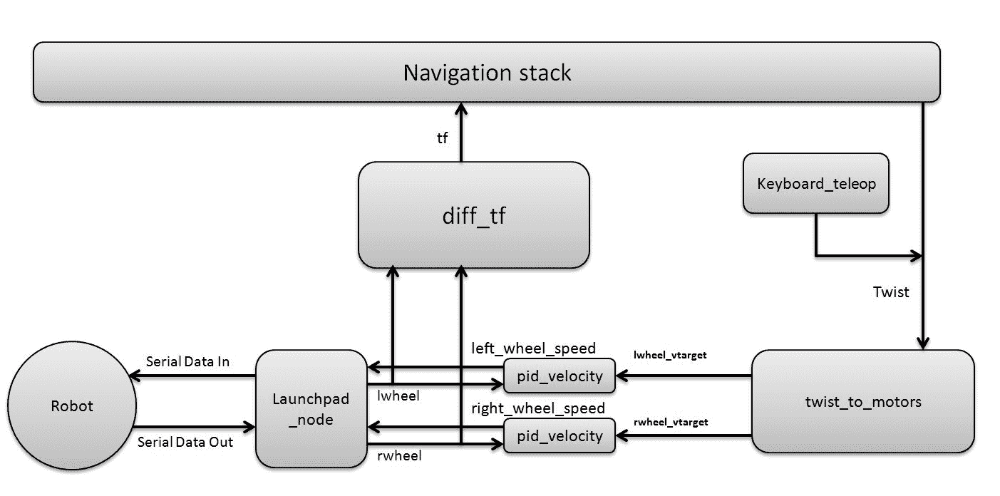

显示 ROS 节点的机械手框图

`ChefBot_bringup`程序包中每个节点的用途如下：

`twist_to_motors.py`：此节点会将 ROS `Twist`命令或线速度和角速度转换为单个电动机速度目标。 目标速度以`~rate`（以赫兹为单位）的速率发布，并且在`Twist`消息停止后发布`timeout_ticks`时间的速度。 以下是此节点将发布和订阅的主题和参数：

**发布主题**：

`lwheel_vtarget(std_msgs/Float32)`：这是左轮的目标速度（以 m/s 为单位）。

`rwheel_vtarget`（`std_msgs`/`Float32`）：这是右轮的目标速度（以 m/s 为单位）。

**订阅主题**：

`Twist`（`geometry_msgs`/`Twist`）：这是机器人的目标`Twist`命令。 该机器人使用 x 方向的线速度和 Twist 消息的角速度`θ`。

**重要的 ROS 参数**：

`~base_width`（`float, default: 0.1`）：这是机器人两个轮子之间的距离，以米为单位。

`~rate`（`int, default: 50`）：这是发布速度目标的速率（赫兹）。

`~timeout_ticks`（`int, default:2`）：这是停止 Twist 消息后发布的速度目标消息的编号。

`pid_velocity.py`：这是一个简单的 PID 控制器，可通过获取车轮编码器的反馈来控制每个电动机的速度。 在差动驱动系统中，每个车轮需要一个 PID 控制器。 它将从每个车轮读取编码器数据并控制每个车轮的速度。

**发布主题**：

`motor_cmd`（`Float32`）：这是 PID 控制器输出到电动机的最终输出。 我们可以使用`out_min`和`out_max` ROS 参数更改 PID 输出的范围。

`wheel_vel`（`Float32`）：这是机械手轮的当前速度，单位为 m/s。

**订阅主题**：

`wheel`（`Int16`）：本主题是旋转编码器的输出。 机器人的每个编码器都有各自的主题。

`wheel_vtarget`（`Float32`）：这是目标速度，单位为 m/s。

**重要参数**：

`~Kp`（`float` `,default: 10`）：该参数是 PID 控制器的比例增益。

`~Ki`（`float, default: 10`）：该参数是 PID 控制器的积分增益。

`~Kd`（`float, default: 0.001`）：该参数是 PID 控制器的微分增益。

`~out_min`（`float, default: 255`）：这是电机速度值的最小限制。 此参数将速度值限制为称为`wheel_vel`主题的电动机。

`~out_max`（`float, default: 255`）：这是`wheel_vel`主题的最大限制（以赫兹为单位）。

`~rate`（`float, default: 20`）：这是发布`wheel_vel`主题的比率。

`ticks_meter`（`float, default: 20`）：这是每米的车轮编码器刻度数。 这是一个全局参数，因为它也在其他节点中使用。

`vel_threshold`（`float, default: 0.001`）：如果机器人速度降至该参数以下，我们将车轮视为静止。 如果车轮的速度小于`vel_threshold`，我们将其视为零。

`encoder_min`（`int, default: 32768`）：这是编码器读数的最小值。

`encoder_max`（`int, default: 32768`）：这是编码器读数的最大值。

`wheel_low_wrap`（`int, default: 0.3 * (encoder_max - encoder_min) + encoder_min`）：这些值决定里程表是处于负方向还是正方向。

`wheel_high_wrap`（`int, default: 0.7 * (encoder_max - encoder_min) + encoder_min`）：这些值决定里程表是处于负方向还是正方向。

`diff_tf.py`：此节点计算里程表的转换并在里程表框架和机器人的基础框架之间广播。

**发布主题**：

`odom`（`nav_msgs`/`odometry`）：发布里程表（机器人的当前姿势和扭曲）。

`tf`：这提供了里程表框架和机器人基础链接之间的转换。

**订阅主题**：

`lwheel`（`std_msgs`/`Int16`），`rwheel`（`std_msgs`/`Int16`）：这些是机器人左右编码器的输出值。

*   `ChefBot_keyboard_teleop.py`：此节点使用键盘上的控件发送`Twist`命令。

**发布主题**：

`cmd_vel_mux`/`input`/`teleop`（`geometry_msgs`/`Twist`）：这将使用键盘命令发布 Twist 消息。

现在，我们已经研究了`ChefBot_bringup`包中的节点，我们将研究启动文件的功能。

# 了解 ChefBot ROS 启动文件

现在，我们将研究`ChefBot_bringup`软件包的每个启动文件的功能：

*   `robot_standalone.launch`：此启动文件的主要功能是启动`launchpad_node`，`pid_velocity`，`diff_tf,`和`twist_to_motor`之类的节点，以从机器人获取传感器值并将命令速度发送给机器人。
*   `keyboard_teleop.launch`：此启动文件将使用键盘开始遥控操作。 它启动`ChefBot_keyboard_teleop.py`节点以执行键盘遥控操作。
*   `3dsensor.launch`：此文件将启动 Kinect OpenNI 驱动程序，并开始发布 RGB 和深度流。 它还将启动深度激光扫描仪节点，该节点会将点云数据转换为激光扫描数据。
*   `gmapping_demo.launch`：此启动文件将启动 SLAM 映射节点以映射机器人周围的区域。
*   `amcl_demo.launch`：使用 AMCL，机器人可以定位并预测其在地图上的位置。 在地图上定位机器人之后，我们可以命令机器人移至地图上的某个位置。 然后，机器人可以自主地从其当前位置移动到目标位置。
*   `view_robot.launch`：此启动文件显示 RViz 中的机械手 URDF 模型。
*   `view_navigation.launch`：此启动文件显示机器人导航所需的所有传感器。

# 使用 ChefBot Python 节点和启动文件

我们已经在英特尔的 NUC PC 中设置了 ChefBot ROS 软件包，并将嵌入式代码上传到 LaunchPad 板上。 下一步是将 NUC PC 放在机器人上，配置从笔记本电脑到机器人的远程连接，测试每个节点，并使用 ChefBot 的启动文件执行自主导航。

与 ChefBot 一起使用之前，我们应该拥有的主要设备是好的无线路由器。 机器人和远程笔记本电脑必须通过同一网络连接。 如果机械手 PC 和远程膝上型计算机位于同一网络上，则用户可以使用 IP 地址通过 SSH 通过 SSH 从远程便携式计算机连接到机械手 PC。 在将机器人 PC 放入机器人之前，我们应该将机器人 PC 连接到无线网络，这样一旦将其连接到无线网络，它就会记住连接细节。 机器人通电后，PC 应自动连接到无线网络。 一旦机器人 PC 连接到无线网络，我们就可以将其放入实际的机器人中。 下图显示了机器人和远程 PC 的连接图：


机器人与远程 PC 的无线连接图

上图假定 ChefBot 的 IP 为`192.168.1.106`，远程 PC 的 IP 为`192.168.1.101`。

我们可以使用 SSH 远程访问 ChefBot 终端。 我们可以使用以下命令登录 ChefBot，其中`robot`是 ChefBot PC 的用户名：

```py
    $ ssh robot@192.168.1.106  
```

登录 ChefBot PC 时，它将要求输入机器人 PC 密码。 输入机器人 PC 的密码后，我们可以访问机器人 PC 终端。 登录到机器人 PC 后，我们可以开始测试 ChefBot 的 ROS 节点，并测试是否从 ChefBot 内部的 LaunchPad 板上接收到串行值。 请注意，如果使用的是新终端，则应通过 SSH 重新登录 ChefBot PC。

如果`ChefBot_bringup`软件包已正确安装在 PC 上，并且已连接 LaunchPad 板，则在运行 ROS 驱动程序节点之前，我们可以运行`miniterm.py`工具来检查串行值是否通过 USB 正确到达 PC 。 我们可以使用`dmesg`命令找到串行设备名称。 我们可以使用以下命令运行`miniterm.py`：

```py
    $ miniterm.py /dev/ttyACM0 115200  
```

如果显示拒绝权限消息，请在`udev`文件夹中编写规则，以设置 USB 设备的许可，这在第 6 章“将执行器和传感器与机器人控制器接口”，或者我们可以使用以下命令临时更改权限。 在这里，我们假设`ttyACM0`是 LaunchPad 的设备名称。 如果您的 PC 中的设备名称不同，则必须使用该名称代替`ttyACM0`：

```py
    $ sudo chmod 777 /dev/ttyACM0  
```

如果一切正常，我们将获得以下屏幕快照中所示的值：

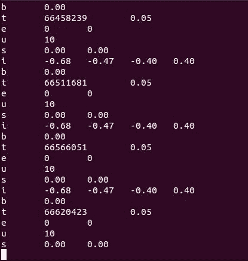

`miniterm.py`的输出

字母`b`用于指示机器人的电池读数； 目前，它尚未实现。 该值现在设置为零。 这些值来自 Tiva C Launchpad。 有多种使用微控制器板感测电压的方法。 [下面给出了一种方法](http://www.instructables.com/id/Arduino-Battery-Voltage-Indicator/)。 字母`t`表示机器人开始运行嵌入式代码后经过的总时间（以微秒为单位）。 第二个值是在 LaunchPad 中完成一项完整操作所花费的时间（以秒为单位）。 如果我们正在执行机器人参数的实时计算，则可以使用此值。 目前，我们尚未使用此值，但将来可能会使用它。 字母`e`分别指示左和右编码器的值。 这两个值都为零，因为机器人没有移动。 字母`u`表示超声波距离传感器的值。 我们获得的距离值以厘米为单位。 字母`s`表示机器人的当前轮速。 该值用于检查目的。 实际上，速度是 PC 本身的控制输出。

要将串行数据转换为 ROS 主题，我们必须运行名为`launchpad_node.py`的驱动器节点。 以下代码显示了如何执行此节点。

首先，我们必须在启动任何节点之前运行`roscore`：

```py
    $ roscore  
```

使用以下命令运行`launchpad_node.py`：

```py
    $ rosrun ChefBot_bringup launchpad_node.py  
```

如果一切正常，我们将在运行的终端的节点中获得以下输出：


`launchpad_node.py`的输出

运行`launchpad_node.py`之后，我们将看到生成以下主题，如以下屏幕截图所示：

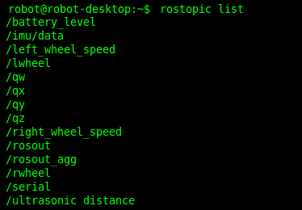

`launchpad_node.py`生成的主题

我们可以通过订阅`/serial`主题来查看驱动程序节点接收的串行数据。 我们可以将其用于调试目的。 如果串行主题显示的数据与`miniterm.py`中的数据相同，则可以确认节点运行正常。 以下屏幕截图是`/serial`主题的输出：


LaunchPad 节点发布的`/serial`主题的输出

设置`ChefBot_bringup`程序包后，我们就可以开始使用 ChefBot 的自主导航了。 当前，我们仅访问 ChefBot PC 的终端。 为了可视化机器人的模型，传感器数据，地图等，我们必须在用户的 PC 中使用 RViz。 我们必须在机器人和用户 PC 中进行一些配置才能执行此操作。 应该注意的是，用户的 PC 应具有与 ChefBot PC 相同的软件设置。

我们要做的第一件事是将 ChefBot PC 设置为 ROS 主设备。 我们可以通过设置`ROS_MASTER_URI`值将 ChefBot PC 设置为 ROS 主设备。 `ROS_MASTER_URI`设置是必需设置； 它向节点通知 ROS 主站的**统一资源标识符**（**URI**）。 当您为 ChefBot PC 和远程 PC 设置相同的`ROS_MASTER_URI`时，我们可以在远程 PC 中访问 ChefBot PC 的主题。 因此，如果我们在本地运行 RViz，则它将可视化 ChefBot PC 中生成的主题。

假定 ChefBot PC IP 为`192.168.1.106`，远程 PC IP 为`192.168.1.10`。 您可以为 Chefbot PC 和远程 PC 设置一个静态 IP，以便在所有测试中该 IP 始终是相同的，否则，如果它是自动的，则在每个测试中您可能会获得不同的 IP。 要在每个系统中设置`ROS_MASTER_URI`，应在`home`文件夹中的`.bashrc`文件中包含以下命令。 下图显示了在每个系统中包含`.bashrc`文件所需的设置：

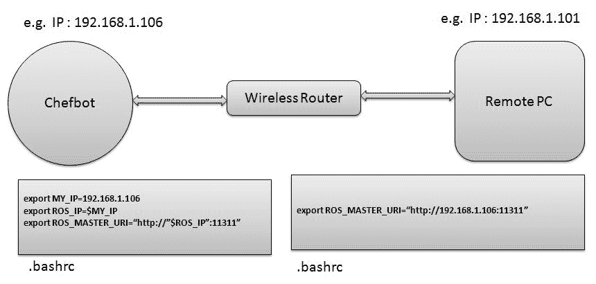

ChefBot 的网络配置

在每台 PC 的`.bashrc`底部添加这些行，然后根据您的网络更改 IP 地址。

建立完这些设置后，我们只需在 ChefBot PC 终端上启动`roscore`，然后在远程 PC 上执行`rostopic list`命令。

如果您看到任何主题，则设置完成。 我们首先可以使用键盘遥控操作机器人，以检查机器人的功能并确认是否获得传感器值。

我们可以使用以下命令启动机器人驱动程序和其他节点。 请注意，这应该在使用 SSH 登录后在 ChefBot 终端中执行：

```py
    $ roslaunch ChefBot_bringup robot_standalone.launch  
```

启动机械手驱动程序和节点后，使用以下命令启动键盘遥控操作。 这也必须在 ChefBot PC 的新终端上完成：

```py
    $ roslaunch ChefBot_bringup keyboard_teleop.launch  
```

要激活 Kinect，请执行以下命令。 此命令也在 ChefBot 终端上执行：

```py
    $roslaunch ChefBot_bringup 3dsensor_kinect.launch  
```

如果您使用的是 Orbecc Astra，请使用以下启动文件启动传感器：

```py
    $ roslaunch ChefBot_bringup 3d_sensor_astra.launch  
```

要查看传感器数据，我们可以执行以下命令。 这将在 RViz 中查看机械手模型，应在远程 PC 上执行。 如果在远程 PC 上设置`ChefBot_bringup`软件包，则可以访问以下命令，并通过 ChefBot PC 可视化机器人模型和传感器数据：

```py
    $ roslaunch ChefBot_bringup view_robot.launch
```

以下屏幕截图是 RViz 的输出。 我们可以在屏幕截图中看到 LaserScan 和 PointCloud 映射的数据：

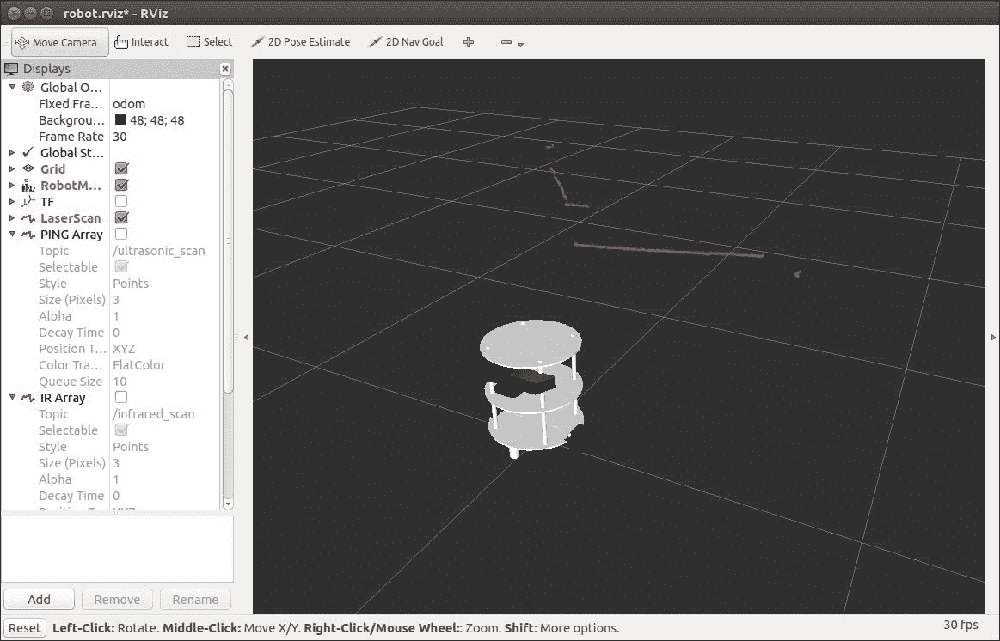

RViz 中的 ChefBot LaserScan 数据

上面的屏幕截图显示了 RViz 中的 LaserScan。 我们需要在 RViz 的左侧部分打上 LaserScan 主题，以显示激光扫描数据。 激光扫描数据标记在视口上。 如果要查看 Kinect/Astra 中的点云数据，请单击 RViz 左侧的“添加”按钮，然后从弹出窗口中选择 PointCloud2。 选择主题，从列表中单击`/camera/depth_registered`，您将看到类似于以下屏幕快照中所示的图像：


带有 PointCloud 数据的 ChefBot

使用传感器后，我们可以执行 SLAM 绘制房间的地图。 以下过程可帮助我们在此机器人上启动 SLAM。

# 与 SLAM 一起在 ROS 上绘制房间地图

要执行映射，我们必须执行以下命令。

以下命令在 ChefBot 终端中启动机器人驱动程序：

```py
    $ roslaunch ChefBot_bringup robot_standalone.launch  
```

以下命令将启动映射过程。 请注意，它应该在 ChefBot 终端上执行：

```py
    $ roslaunch ChefBot_bringup gmapping_demo.launch  
```

仅当收到的里程表值正确时，才能进行映射。 如果从机器人接收到里程计值，我们将收到有关前一条命令的以下消息。 如果收到此消息，我们可以确认 Gmapping 可以正常工作：


带有 PointCloud 数据的 ChefBot

要开始键盘遥控操作，请使用以下命令：

```py
    $ roslaunch ChefBot_bringup keyboard_teleop.launch  
```

要查看正在创建的地图，我们需要使用以下命令在远程系统上启动 RViz：

```py
    $ roslaunch ChefBot_bringup view_navigation.launch  
```

在 RViz 中查看机器人后，可以使用键盘移动机器人并查看正在创建的地图。 绘制完整个区域的地图后，我们可以在 ChefBot PC 终端上使用以下命令保存地图：

```py
    $rosrun map_server map_saver -f ~/test_map
```

在前面的代码中，`test_map`是要存储在`home`文件夹中的地图的名称。 以下屏幕快照显示了由机器人创建的房间的地图：

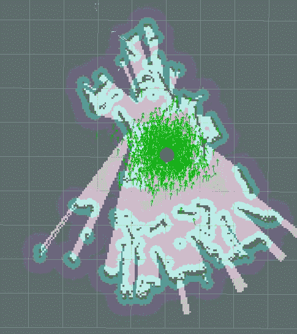

映射房间

存储地图后，我们可以使用 ROS 处理定位和自主导航功能。

# 使用 ROS 定位和导航

构建地图后，关闭所有应用程序，然后使用以下命令重新运行机器人驱动程序：

```py
    $ roslaunch ChefBot_bringup robot_standalone.launch
```

使用以下命令在存储的地图上启动本地化和导航：

```py
    $ roslaunch ChefBot_bringup amcl_demo.launch map_file:=~/test_map.yaml  
```

在远程 PC 上使用以下命令开始查看机器人：

```py
    $ roslaunch ChefBot_bringup view_navigation.launch  
```

在 RViz 中，我们可能需要使用 2D 姿势估计按钮指定机器人的初始姿势。 我们可以使用此按钮在地图上更改机器人姿势。 如果机器人能够访问地图，那么我们可以使用 2D Nav Goal 按钮来命令机器人移至所需位置。 开始定位时，可以使用 AMCL 算法看到机器人周围的粒子云：


使用 AMCL 本地化机器人

以下是机器人从当前位置自动导航到目标位置时的屏幕快照。 球门位置标记为黑点：

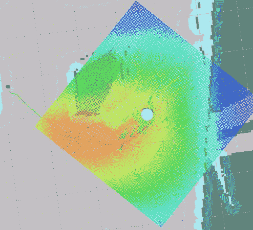

使用地图进行自主导航

从机器人到黑点的黑线是机器人到达目标位置的计划路径。 如果机器人无法找到地图，则可能需要微调`ChefBot_bringup` `param`文件夹中的参数文件。 有关更多微调的详细信息，可以在[这个页面](http://wiki.ros.org/amcl)上查看 ROS 上的 AMCL 软件包。

# 总结

本章内容涉及组装 ChefBot 的硬件以及将嵌入式代码和 ROS 代码集成到机器人中以执行自主导航。 我们看到了使用第 6 章，“将执行器和传感器连接到机器人控制器”的设计制造的机器人硬件零件。 我们组装了机器人的各个部分，并连接了我们为机器人设计的原型 PCB。 它由 LaunchPad 板，电机驱动器，左移位器，超声波传感器和 IMU 组成。 LaunchPad 板上闪烁着新的嵌入式代码，该代码可以与机器人中的所有传感器进行接口，并可以从 PC 发送或接收数据。

看完嵌入式代码之后，我们将 ROS Python 驱动程序节点配置为与 LaunchPad 板上的串行数据接口。 与 LaunchPad 板接口后，我们使用 ROS 存储库中`differential_drive`包中的节点计算了里程计数据和差分驱动器控制。 我们将机器人与 ROS 导航堆栈连接。 这使我们能够使用 SLAM 和 AMCL 进行自主导航。 我们还查看了 SLAM 和 AMCL，创建了地图，并命令机器人自主导航。

# 问题

1.  机械手 ROS 驱动程序节点的用途是什么？
2.  PID 控制器在导航中的作用是什么？
3.  如何将编码器数据转换为里程表数据？
4.  SLAM 在机器人导航中的作用是什么？
5.  AMCL 在机器人导航中的作用是什么？

# 进一步阅读

您可以从以下链接中了解有关 ROS 中的机器人视觉软件包的更多信息：

*   <http://wiki.ros.org/gmapping>
*   <http://wiki.ros.org/amcl>