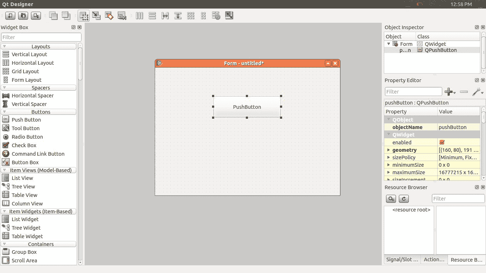
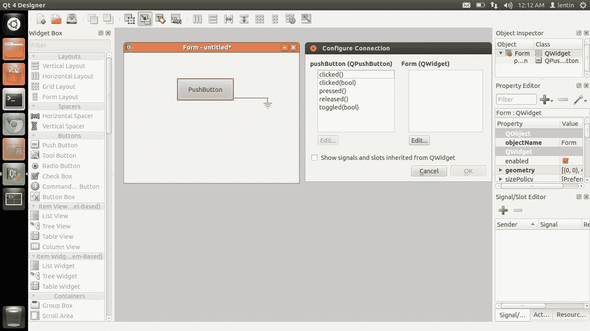
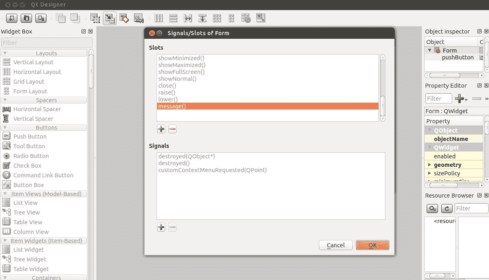
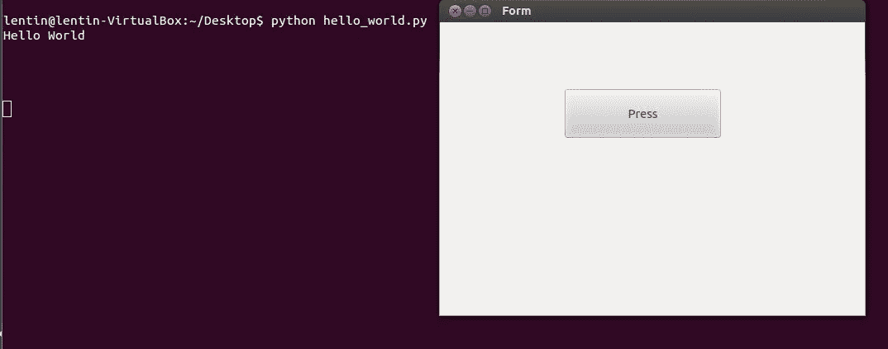
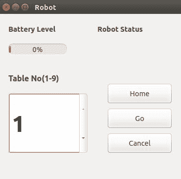

# 使用 Qt 和 Python 为机器人设计 GUI

在上一章中，我们讨论了用于执行自主导航的机器人硬件组件和软件包的集成。 集成之后，下一步是构建 GUI 来控制机器人。 我们正在构建一个 GUI，该 GUI 可以充当底层 ROS 命令的触发器。 用户可以使用 GUI 按钮来代替在终端上运行所有命令。 我们要设计的 GUI 是针对具有九张桌子的典型酒店房间。 用户可以在旅馆房间的地图上设置桌子位置，并命令机器人去特定的桌子上运送食物。 交付食物后，用户可以命令机器人转到其原始位置。

本章将涵盖以下主题：

*   在 Ubuntu 上安装 Qt
*   PyQt 和 PySide 简介
*   Qt Designer 简介
*   Qt 信号和插槽
*   将 Qt UI 文件转换为 Python 文件
*   使用 ChefBot GUI 应用程序
*   RQT 及其功能简介

# 技术要求

要在本章中测试应用程序和代码，您需要安装了 ROS Kinetic 的 Ubuntu 16.04 LTS PC /笔记本电脑。

您需要了解已安装的 Qt，PyQt 和 RQT。

当前可用的两个最受欢迎的 GUI 框架是 [Qt](http://qt.digia.com) 和 [GTK+](http://www.gtk.org/)。 和 GTK+ 是开放源代码，跨平台的用户界面工具包和开发平台。 这两个软件框架已在 GNOME 和 KDE 等 Linux 桌面环境中广泛使用。

在本章中，我们将使用 Qt 框架的 Python 绑定来实现 GUI，因为与其他方法相比，Qt 的 Python 绑定更容易开发。 我们将研究如何从头开始开发 GUI 并使用 Python 对其进行编程。 在讨论了基本的 Python 和 Qt 编程之后，我们将讨论 Qt 和 Python 的 ROS 接口，它们已经在 ROS 中可用。 我们将首先了解什么是 Qt UI 框架以及如何在我们的 PC 上安装它。

# 在 Ubuntu 16.04 LTS 上安装 Qt

Qt 是跨平台的应用程序框架，被广泛用于开发具有 GUI 界面和命令行工具的应用程序软件。 Qt 几乎可用于所有操作系统，例如 Windows，macOS X，Android 等。 用于开发 Qt 应用程序的主要编程语言是 C++，但是存在诸如 Python，Ruby，Java 等语言的绑定。 让我们看一下如何在 Ubuntu 16.04 上安装 Qt SDK。 我们将从 Ubuntu 中的**高级打包工具**（**APT**）安装 Qt。 APT 已随 Ubuntu 安装一起提供。 因此，对于安装 Qt/Qt SDK，我们可以简单地使用以下命令，该命令将从 Ubuntu 软件包存储库中安装 Qt SDK 及其必需的依赖项。 我们可以使用以下命令安装 Qt 版本 4：

```py
    $ sudo apt-get install qt-sdk  
```

此命令将安装整个 Qt SDK 及其项目所需的库。 Ubuntu 存储库中可用的软件包可能不是最新版本。 要获取最新版本的 Qt，[我们可以从以下链接下载适用于各种 OS 平台的 Qt 的在线或离线安装程序](http://qt-project.org/downloads)。

在系统上安装 Qt 之后，我们将看到如何使用 Qt 开发 GUI 并与 Python 交互。

# 使用 Qt 的 Python 绑定

让我们看看如何连接 Python 和 Qt。 通常，Python 中有两个模块可用于连接到 Qt 用户界面。 两种最受欢迎​​的框架是：

*   PyQt
*   派赛德

# PyQt

**PyQt** 是 Qt 跨平台最流行的 Python 绑定之一。 PyQt 由 Riverbank Computing Limited 开发和维护。 它为 Qt 版本 4 和 Qt 版本 5 提供绑定，并随附 GPL（版本 2 或 3）以及商业许可证。 PyQt 可用于 Qt 版本 4 和 5，分别称为 PyQt4 和 PyQt5。 这两个模块与 Python 版本 2 和 3 兼容。PyQt 包含 620 多个类，涵盖了用户界面，XML，网络通信，Web 等。

PyQt 在 Windows，Linux 和 macOS X 中可用。这是安装 Qt SDK 和 Python 以便安装 PyQt 的先决条件。 [Windows 和 macOS X 的二进制文件位于以下链接中](http://www.riverbankcomputing.com/software/pyqt/download)。

我们将看到如何使用 Python 2.7 在 Ubuntu 16.04 上安装 PyQt4。

# 在 Ubuntu 16.04 LTS 中安装 PyQt

如果要在 Ubuntu/Linux 上安装 PyQt，请使用以下命令。 此命令将安装 PyQt 库，其依赖项以及一些 Qt 工具：

```py
    $ sudo apt-get install python-qt4 pyqt4-dev-tools
```

# 派赛德

**PySide** 是一个开源软件项目，为 Qt 框架提供 Python 绑定。 PySide 项目由诺基亚发起，为多个平台提供了完整的 Qt 绑定。 PySide 中用于包装 Qt 库的技术与 PyQt 不同，但是两者的 API 相似。 Qt 5 当前不支持 PySide。PySide 可用于 Windows，Linux 和 macOSX。[以下链接将指导您在 Windows 和 macOS X 上设置 PySide](http://qt-project.org/wiki/Category:LanguageBindings::PySide::Downloads)。

PySide 的前提条件与 PyQt 相同。 让我们看看如何在 Ubuntu 16.04 LTS 上安装 PySide。

# 在 Ubuntu 16.04 LTS 上安装 PySide

PySide 软件包在 Ubuntu 软件包存储库中可用。 以下命令将在 Ubuntu 上安装 PySide 模块和 Qt 工具：

```py
    $ sudo apt-get install python-pyside pyside-tools  
```

让我们使用这两个模块，看看两者之间的区别。

# 使用 PyQt 和 PySide

安装 PyQt 和 PySide 软件包后，我们将研究如何使用 PyQt 和 PySide 编写 Hello World GUI。 PyQt 和 PySide 之间的主要区别仅在于某些命令。 大多数步骤是相同的​​。 让我们看看如何制作 Qt GUI 并将其转换为 Python 代码。

# Qt Designer 简介

Qt Designer 是用于将控件设计和插入到 Qt GUI 中的工具。 Qt GUI 基本上是一个 XML 文件，其中包含其组件和控件的信息。 使用 GUI 的第一步涉及其设计。 Qt Designer 工具提供各种选项来制作出色的 GUI。

通过在终端上输入`designer-qt4`命令来启动 Qt Designer。 以下屏幕截图显示了运行此命令后将看到的内容：


Qt 4 Designer

上面的屏幕快照显示了 Qt Designer 界面。 从“新建表单”窗口中选择“窗口小部件”选项，然后单击“创建”按钮。 这将创建一个空的小部件； 我们可以将各种 GUI 控件从 Qt 4 Designer 的左侧拖动到空窗口小部件。 Qt 小部件是 Qt GUI 的基本构建块。 下面的屏幕快照显示了一个从 Qt Designer 的左侧窗口拖动了 PushButton 的表单：



Qt Designer 小部件表单

我们将要构建的`Hello World`应用程序将具有一个 PushButton。 当我们单击按钮时，`Hello World`消息将被打印在终端上。 在构建`Hello World`应用程序之前，我们需要了解什么是 Qt 信号和插槽，因为我们必须使用这些功能来构建`Hello World`应用程序。

# Qt 信号和插槽

在 Qt 中，使用信号和插槽功能处理 GUI 事件。 当事件发生时，会从 GUI 发出信号。 Qt 小部件具有许多预定义的信号，用户可以为 GUI 事件添加自定义信号。 时隙是响应特定信号而调用的功能。 在此示例中，我们使用 PushButton 的`clicked()`信号并为此信号创建一个自定义插槽。

我们可以在此自定义函数中编写自己的代码。 让我们看看如何创建按钮，将信号连接到插槽以及将整个 GUI 转换为 Python。 以下是创建 Hello World GUI 应用程序所涉及的步骤：

1.  从 Qt Designer 拖动并创建一个 PushButton 到空窗体。
2.  为按钮单击事件分配一个插槽，该插槽发出一个称为`clicked()`的信号。
3.  将设计的 UI 文件保存在`.ui`扩展名中。
4.  将 UI 文件转换为 Python。
5.  编写自定义插槽的定义。
6.  在定义的插槽/功能内打印`Hello World`消息。

我们已经将一个按钮从 Qt Designer 拖到一个空的 Form 中。 按 F4 键在按钮上插入一个插槽。 当我们按下 F4 键时，PushButton 变成红色，我们可以从按钮上拖动一条线并将地面符号放置在主窗口中。 在下面的屏幕快照中显示了该内容：



在 Qt 4 Designer 中分配插槽和信号

从左侧选择`clicked()`信号，然后单击 Edit ...按钮以创建一个新的自定义插槽。 当我们单击 Edit ...按钮时，将弹出另一个窗口以创建自定义函数。 您可以通过单击+符号来创建自定义功能。 我们创建了一个名为`message()`的自定义插槽，如以下屏幕截图所示：



在 Qt 4 Designer 中分配插槽和信号

单击确定按钮，将 UI 文件另存为`hello_world.ui`，然后退出 Qt Designer。 保存 UI 文件后，让我们看看如何将 Qt UI 文件转换为 Python 文件。

从以下链接中了解有关 Qt 信号和插槽的更多信息

https://doc.qt.io/qt-5/signalsandslots.html

# 将 UI 文件转换为 Python 代码

设计 UI 文件之后，我们可以将 UI 文件转换为其等效的 Python 代码。 使用`pyuic`编译器完成转换。 我们在安装 PyQt/PySide 时已经安装了此工具。 以下是将 Qt UI 文件转换为 Python 文件的命令。

我们必须对 PyQt 和 PySide 使用不同的命令。 以下命令将 UI 转换为其等效的 PyQt 文件：

```py
    $ pyuic4 -x hello_world.ui -o hello_world.py  
```

`pyuic4`是一个 UI 编译器，用于将 UI 文件转换为其等效的 Python 代码。 我们需要在`-x`参数后提及 UI 文件名，并在`-o`参数后提及输出文件名。

PySide 命令没有太多更改。 PySide 使用`pyside-uic`代替`pyuic4`将 UI 文件转换为 Python 文件。 其余参数相同：

```py
    $ pyside-uic -x hello_world.ui -o hello_world.py  
```

前面的命令将为 UI 文件生成等效的 Python 代码。 这将创建一个具有 GUI 组件的 Python 类。 生成的脚本将没有自定义函数`message()`的定义。 我们应该添加此自定义函数来生成代码。 以下过程将指导您添加自定义功能； 因此，当您单击按钮时，将执行自定义功能`message()`。

# 在 PyQt 代码中添加广告位定义

这里给出了从 PyQt 生成的 Python 代码。 `pyuic4`和`pyside-uic`生成的代码是相同的，只是导入模块名称不同。 其他所有部分都相同。 使用 PyQt 生成的代码的说明也适用于 PySide 代码。 从前面的转换生成的代码如下。 代码结构和参数可以根据您设计的 UI 文件进行更改：

```py
from PyQt4 import QtCore, QtGui 

try: 
    _fromUtf8 = QtCore.QString.fromUtf8 
except AttributeError: 
    _fromUtf8 = lambda s: s 

class Ui_Form(object): 

    def setupUi(self, Form): 
        Form.setObjectName(_fromUtf8("Form")) 
        Form.resize(514, 355) 

        self.pushButton = QtGui.QPushButton(Form) 
        self.pushButton.setGeometry(QtCore.QRect(150, 80, 191, 61)) 
        self.pushButton.setObjectName(_fromUtf8("pushButton")) 

        self.retranslateUi(Form) 
        QtCore.QObject.connect(self.pushButton, QtCore.SIGNAL(_fromUtf8("clicked()")), Form.message) 
        QtCore.QMetaObject.connectSlotsByName(Form) 

    def retranslateUi(self, Form): 
        Form.setWindowTitle(QtGui.QApplication.translate("Form", "Form", None, QtGui.QApplication.UnicodeUTF8)) 
       self.pushButton.setText( QtGui.QApplication.translate("Form", "Press", None, QtGui.QApplication.UnicodeUTF8)) 

#This following code should be added manually 
if __name__ == "__main__": 
   import sys 
    app = QtGui.QApplication(sys.argv) 
    Form = QtGui.QWidget() 
    ui = Ui_Form() 
    ui.setupUi(Form) 
    Form.show() 
    sys.exit(app.exec_()) 
```

前面的代码是我们在 Qt Designer 应用程序中设计的 Qt UI 文件的等效 Python 脚本。 这是此代码工作的分步过程：

1.  该代码将从`if __name__ == "__main__":`开始执行。 PyQt 代码中的第一件事是创建一个`QApplication`对象。 `QApplication`类管理 GUI 应用程序的控制流和主要设置。 `QApplication`类包含主事件循环，其中将处理和调度 Windows 系统和其他来源的所有事件。 它还处理应用程序的初始化和完成。 `QApplication`类位于`QtGui`模块内部。 此代码创建名为`app`的`QApplication`对象。 我们必须手动添加主要代码。
2.  `Form = QtGui.QWidget()`行将创建一个`QWidget`类的名为`Form`的对象，该对象存在于`QtGui`模块内部。 `QWidget`类是 Qt 所有用户界面对象的基类。 它可以从主 Windows 系统接收鼠标和键盘事件。

3.  `ui = Ui_Form()`行创建一个在代码中定义的`Ui_Form()`类的名为`ui`的对象。 `Ui_Form()`对象可以接受我们在上一行中创建的`QWidget`类，并且可以在此`QWidget`对象中添加按钮，文本，按钮控件和其他 UI 组件。 `Ui_Form()`类包含两个功能：`setupUi()`和`retranslateUi()`。 我们可以将`QWidget`对象传递给`setupUi()`函数。 此功能将在此小部件对象上添加 UI 组件，例如按钮，为信号分配插槽等。 如果需要，`retranslateUi()`函数会将 UI 的语言翻译成其他语言。 例如，如果需要将英语翻译为西班牙语，则可以在此功能中提及相应的西班牙语单词。
4.  `Form.show()`行显示带有按钮和文本的最终窗口。

接下来是创建 slot 函数，该函数将打印`Hello World`消息。 插槽定义在`Ui_Form()`类内部创建。 以下步骤将名为`message()`的插槽插入`Ui_Form()`类。

`message()`函数定义如下：

```py
    def message(self): 
    print "Hello World" 
```

这应该作为函数插入到`Ui_Form()`类中。 另外，在`Ui_Form()`类内的`setupUi()`函数中更改以下行：

```py
QtCore.QObject.connect(self.pushButton, QtCore.SIGNAL(_fromUtf8("clicked()")), Form.message) 
```

`Form.message`参数应替换为`self.message`参数。 前一行将 PushBbutton 信号`clicked(),`连接到我们已经在`Ui_Form()`类中插入的`self.message()`插槽。

# Hello World GUI 应用程序的操作

将`Form.message`参数替换为`self.message`参数后，我们可以执行代码，输出将如下所示：



运行 Pyqt4 应用程序

当我们单击“按下”按钮时，它将打印 Hello world 消息。 这就是通过 Python 和 Qt 设置自定义 GUI 的全部内容。

在下一节中，我们将看到我们为机器人设计的实际 GUI。

# 使用 ChefBot 的控件 GUI

在 PyQt 中完成`Hello World`应用程序之后，我们现在将讨论用于控制 ChefBot 的 GUI。 构建 GUI 的主要用途是创建一种更轻松的方式来控制机器人。 例如，如果将机器人部署在旅馆中以提供食物，则控制该机器人的人员不必了解启动和停止该机器人的复杂命令； 因此，为 ChefBot 构建 GUI 可以降低复杂性并使用户更轻松。 我们计划使用 PyQt，ROS 和 Python 界面构建 GUI。 [可以在 GitHub 上的以下链接上获得 ChefBot ROS 软件包](https://github.com/qboticslabs/learning_robotics_2nd_ed)。

如果尚未克隆代码，则可以使用以下命令进行克隆：

```py
    $ git clone https://github.com/qboticslabs/learning_robotics_2nd_ed.git
```

GUI 代码`robot_gui.py`放置在`chefbot_bringup`包内的`scripts`文件夹中。

以下屏幕截图显示了我们为 ChefBot 设计的 GUI：



运行 Pyqt4 应用程序

GUI 具有以下功能：

*   它可以监视机器人电池状态和机器人状态。 机器人状态指示机器人的工作状态。 例如，如果机器人遇到错误，它将在此 GUI 上指示错误。
*   它可以命令机器人移到桌子上运送食物。 GUI 上有一个旋转框小部件，用于输入表的位置。 当前，我们正在为具有 9 个表的房间计划此 GUI，但是我们可以根据需要将其扩展为任意数量。 输入表格编号后，我们可以通过单击“执行”按钮命令机器人进入该表格。 机器人将进入该位置。 如果要使机器人返回初始位置，可以单击“主页”按钮。 如果要取消当前的机器人运动，请单击“取消”以停止机器人。 此 GUI 应用程序的工作如下：

当我们必须在酒店中部署 ChefBot 时，我们要做的第一步是创建房间地图。 正确绘制整个房间的地图后，我们必须将地图保存在机器人 PC 上。 机械手仅执行一次映射。 绘制地图后，我们可以运行定位和导航例程，并命令机器人进入地图上的某个位置。 ChefBot ROS 软件包随附类似酒店环境的地图和仿真模型。 现在，我们可以运行此仿真和本地化以测试 GUI，在下一章中，我们将讨论如何使用 GUI 控制硬件。 如果您在本地系统上安装 ChefBot ROS 软件包，我们可以模拟酒店环境并测试 GUI。

使用以下命令以类似旅馆的安排启动 ChefBot 模拟：

```py
    $roslaunch chefbot_gazebo chefbot_hotel_world.launch  
```

启动 ChefBot 模拟之后，我们可以使用已构建的地图运行定位和导航例程。 该地图放置在`chefbot_bringup`包中。 我们可以在该软件包中看到一个`map`文件夹。 在这里，我们将使用此地图执行此测试。 我们可以使用以下命令加载本地化和导航例程：

```py
    $ roslaunch chefbot_gazebo amcl_demo.launch 
 map_file:=/home/<user_name>/catkin_ws/src/chefbot/chefbot_bringup/map/hotel1.yaml  
```

映射文件的路径可以在不同的系统中更改，因此请使用系统中的路径而不是此路径。

如果提到的路径正确，它将开始运行 ROS 导航堆栈。 如果要在地图上查看机器人的位置或手动设置机器人的初始位置，可以使用以下命令使用 RViz：

```py
    $ roslaunch chefbot_bringup view_navigation.launch  
```

在 RViz 中，我们可以使用 2D 导航目标按钮命令机器人转到任何地图坐标。

我们也可以使用编程命令机器人去任何地图坐标。 ROS 导航堆栈使用 ROS `actionlib`库工作。 ROS `actionlib`库用于执行可抢占的任务； 它类似于 ROS 服务。 相对于 ROS 服务的优势在于，如果我们当时不希望取消请求，可以将其取消。

在 GUI 中，我们可以命令机器人使用 Python `actionlib`库转到地图坐标。 我们可以使用以下技术来获得桌子在地图上的位置。

启动模拟器和 AMCL 节点后，启动键盘遥操作并将机器人移到每个桌子附近。 使用以下命令获取机器人的平移和旋转：

```py
    $ rosrun tf tf_echo /map /base_link  
```

当我们单击“ Go”按钮时，该位置将被馈送到导航堆栈，并且机器人将规划其路径并达到其目标。 我们甚至可以随时取消任务。 因此，ChefBot GUI 充当`actionlib`客户端，该客户端将地图坐标发送到`actionlib`服务器； 即导航堆栈。

现在，我们可以使用以下命令运行机器人 GUI 来控制机器人：

```py
    $ rosrun chefbot_bringup robot_gui.py  
```

我们可以选择一个表号，然后单击“执行”按钮以将机器人移至每个表。

假设您克隆了文件并获得了`robot_gui.py`文件，我们将讨论为`actionlib`客户端添加到`Ui_Form()`类中的主要插槽，并获取电池和机械手状态的值。

我们需要为此 GUI 应用程序导入以下 Python 模块：

```py
import rospy 
import actionlib 
from move_base_msgs.msg import * 
import time 
from PyQt4 import QtCore, QtGui 
```

我们需要的其他模块是 ROS Python 客户端`rospy`和`actionlib`模块，用于将值发送到导航堆栈。 `move_base_msgs`模块包含需要发送到导航堆栈的目标的消息定义。

Python 字典中提到了每个桌子附近的机器人位置。 以下代码显示了每个桌子附近机器人位置的硬编码值：

```py
table_position = dict() 
table_position[0] = (-0.465, 0.37, 0.010, 0, 0, 0.998, 0.069) 
table_position[1] = (0.599, 1.03, 0.010, 0, 0, 1.00, -0.020) 
table_position[2] = (4.415, 0.645, 0.010, 0, 0, -0.034, 0.999) 
table_position[3] = (7.409, 0.812, 0.010, 0, 0, -0.119, 0.993) 
table_position[4] = (1.757, 4.377, 0.010, 0, 0, -0.040, 0.999) 
table_position[5] = (1.757, 4.377, 0.010, 0, 0, -0.040, 0.999) 
table_position[6] = (1.757, 4.377, 0.010, 0, 0, -0.040, 0.999) 
table_position[7] = (1.757, 4.377, 0.010, 0, 0, -0.040, 0.999) 
table_position[8] = (1.757, 4.377, 0.010, 0, 0, -0.040, 0.999) 
table_position[9] = (1.757, 4.377, 0.010, 0, 0, -0.040, 0.999) 
```

通过访问此字典，我们可以访问机器人在每个桌子附近的位置。

当前，我们仅出于演示目的插入了四个值。 您可以通过查找其他表的位置来添加更多值。

我们正在分配一些变量来处理`Ui_Form()`类中的表号，机械手的位置以及`actionlib`客户端：

```py
#Handle table number from spin box 
self.table_no = 0 
#Stores current table robot position 
self.current_table_position = 0 
#Creating Actionlib client 
self.client = actionlib.SimpleActionClient('move_base',MoveBaseAction) 
#Creating goal message definition 
self.goal = MoveBaseGoal() 
#Start this function for updating battery and robot status 
self.update_values() 
```

以下代码显示了此代码中按钮和旋转框小部件的信号和插槽分配：

```py
#Handle spinbox signal and assign to slot set_table_number() 
QtCore.QObject.connect(self.spinBox, QtCore.SIGNAL(_fromUtf8("valueChanged(int)")), self.set_table_number) 

#Handle Home button signal and assign to slot Home() 
QtCore.QObject.connect(self.pushButton_3, QtCore.SIGNAL(_fromUtf8("clicked()")), self.Home) 

#Handle Go button signal and assign to slot Go() 
QtCore.QObject.connect(self.pushButton, QtCore.SIGNAL(_fromUtf8("clicked()")), self.Go) 

#Handle Cancel button signal and assign to slot Cancel() 
QtCore.QObject.connect(self.pushButton_2, QtCore.SIGNAL(_fromUtf8("clicked()")), self.Cancel)
```

以下插槽处理 UI 中的旋转框值并分配一个表号。 同样，它将表号转换为相应的机器人位置：

```py
def set_table_number(self): 
  self.table_no = self.spinBox.value() 
  self.current_table_position = table_position[self.table_no] 
```

这是“转到”按钮的“转到”插槽的定义。 此函数会将所选表格的机械手位置插入目标消息标头中，并将其发送到导航堆栈中：

```py
def Go(self): 

  #Assigning x,y,z pose and orientation to target_pose message 
  self.goal.target_pose.pose.position.x=float(self.current_table  _position[0]) 

  self.goal.target_pose.pose.position.y=float(self.current_table  _position[1]) 
  self.goal.target_pose.pose.position.z=float(self.current_table  _position[2]) 

  self.goal.target_pose.pose.orientation.x =     float(self.current_table_position[3]) 
  self.goal.target_pose.pose.orientation.y=   float(self.current_table_position[4]) 
  self.goal.target_pose.pose.orientation.z=   float(self.current_table_position[5]) 

  #Frame id 
  self.goal.target_pose.header.frame_id= 'map' 

  #Time stamp 
  self.goal.target_pose.header.stamp = rospy.Time.now() 

  #Sending goal to navigation stack 
  self.client.send_goal(self.goal) 
```

以下代码是`Cancel()`插槽定义。 这将取消当时计划执行的所有机械手路径：

```py
def Cancel(self): 
  self.client.cancel_all_goals()
```

以下代码是`Home()`的定义。 这会将表格位置设置为零，并调用`Go()`函数。 位置为零的表格是机器人的原始位置：

```py
def Home(self): 
  self.current_table_position = table_position[0] 
  self.Go() 
```

以下定义适用于`update_values()`和`add()`功能。 `update_values()`方法将开始在线程中更新电池电量和机器人状态。 `add()`函数将检索电池状态和机器人状态的 ROS 参数，并将它们分别设置为进度条和标签：

```py
def update_values(self): 
    self.thread = WorkThread() 
    QtCore.QObject.connect( self.thread,    QtCore.SIGNAL("update(QString)"), self.add ) 
    self.thread.start() 
def add(self,text): 
  battery_value = rospy.get_param("battery_value") 
  robot_status = rospy.get_param("robot_status") 
   self.progressBar.setProperty("value", battery_value) 
     self.label_4.setText(_fromUtf8(robot_status)) 
```

此处提供了先前功能中使用的`WorkThread()`类。 `WorkThread()`类继承自 Qt 提供的用于线程化的`QThread`。 线程仅以特定的延迟发出信号`update(Qstring)`。 在先前的功能`update_values()`中，`update(QString)`信号连接到`self.add()`插槽； 因此，从线程发出信号`update(QString)`时，它将调用`add()`插槽并更新电池和状态值：

```py
class WorkThread(QtCore.QThread): 
  def __init__(self): 
    QtCore.QThread.__init__(self) 
   def __del__(self): 
    self.wait() 
   def run(self): 
    while True: 
      time.sleep(0.3) # artificial time delay 
      self.emit( QtCore.SIGNAL('update(QString)'), " " ) 
      return 
```

我们已经讨论了如何为 ChefBot 制作 GUI，但是该 GUI 仅适用于控制 ChefBot 的用户。 如果有人要调试和检查机器人数据，则可能需要其他工具。 ROS 提供了一个出色的调试工具，可以可视化来自机器人的数据。

RQT 工具是一种流行的 ROS 工具。 它基于用于 ROS 的 GUI 开发的基于 Qt 的框架。 让我们讨论一下 RQT 工具，安装过程以及如何检查机器人中的传感器数据。

# 在 Ubuntu 16.04 LTS 中安装和使用 RQT

**RQT** 是 ROS 中的软件框架，它以插件的形式实现各种 GUI 工具。 我们可以将插件添加为 RQT 中的可停靠窗口。

可以使用以下命令在 Ubuntu 16.04 中安装 RQT。 在安装 RQT 之前，请确保已完整安装 ROS Indigo。

```py
    $ sudo apt-get install ros-<ros_version>-rqt  
```

安装 RQT 软件包后，我们可以访问 RQT 的 GUI 实现，称为`rqt_gui`，在其中我们可以将`rqt plugins`停靠在单个窗口中。

让我们开始使用`rqt_gui`。

在运行`rqt_gui`之前，请运行`roscore`命令：

```py
    $ roscore  
```

运行以下命令以启动`rqt_gui`：

```py
    $ rosrun rqt_gui rqt_gui  
```

如果命令运行正常，我们将获得以下窗口：


运行 RQT

我们可以在运行时加载和卸载插件。 要分析 ROS 消息日志，我们可以从 Plugins | Loads 加载 Console 插件。 记录| 安慰。 在以下示例中，我们加载控制台插件并在`rospy_tutorials`内运行一个 talker 节点，该节点将向一个名为`/chatter`的主题发送`Hello World`消息。

运行以下命令以启动节点`talker.py`：

```py
    $rosrun rospy_tutorials talker.py  
```

在以下屏幕截图中，`rqt_gui`装有两个名为 Console 和 Topic Monitor 的插件。 主题监视器插件可以从插件|插件中加载。 话题| 主题监视器。 控制台插件监视每个节点上打印的消息及其严重性。 这对于调试目的非常有用。 在以下屏幕截图中，`rqt_gui`的左侧部分装有控制台插件，而右侧则装有主题监视器。 主题监视器将列出可用的主题，并将监视其值。

在以下屏幕截图中，控制台插件监视`talker.py`节点的消息及其严重性级别，主题监视器监视`/chatter`主题内的值：


使用不同的插件运行 RQT

我们还可以在`rqt_gui`上可视化数据，例如图像和曲线图。 对于机器人的导航和检查，有一些插件可用于在`rqt_gui`上嵌入 RViz。 导航查看器插件来自`/map`主题的视图。 可视化插件可在“插件 | 插件”中找到。 可视化。

我们也可以使用 RQT 创建 GUI。 [创建可加载到`rqt_gui`的 RQT 插件的说明可在以下位置找到](http://wiki.ros.org/rqt/Tutorials/Create%20your%20new%20rqt%20plugin)。

# 概括

在本章中，我们讨论了为 ChefBot 创建 GUI 的方法，该方法可供不了解机器人内部工作原理的普通用户使用。 我们使用称为 PyQt 的 Qt 的 Python 绑定来创建此 GUI。 在研究主要的 GUI 设计之前，我们研究了`Hello World`应用程序，以更轻松地理解 PyQt。 UI 设计使用 Qt Designer 工具完成，并且使用 Python UI 编译器将 UI 文件转换为等效的 Python 脚本。 在 Qt Designer 中设计了主 GUI 之后，我们将 UI 文件转换为 Python 脚本，并在生成的脚本中插入了必要的插槽。 ChefBot GUI 可以启动机器人，选择一个表号，并命令机器人进入该位置。 每个表的位置都来自生成的地图，在此我们在此 Python 脚本中对位置进行了硬编码以进行测试。 选择表格后，我们在地图上设置了目标位置，然后单击“执行”按钮，机器人将移至预期位置。 用户可以随时取消操作，并命令机器人回到原位。 GUI 也可以接收机器人的实时状态及其电池状态。 在讨论了机器人 GUI 之后，我们看了 ROS 中的调试 GUI 工具 RQT。 我们看到了一些用于调试机器人数据的插件。 在下一章中，我们将看到机器人的完整测试和校准。

# 问题

1.  Linux 平台上有哪些流行的 UI 工具包？
2.  PyQt 和 PySide Qt 绑定之间有什么区别？
3.  如何将 Qt UI 文件转换为 Python 脚本？
4.  什么是 Qt 信号和插槽？
5.  什么是 RQT，它的主要应用是什么？

# 进一步阅读

在以下链接中了解有关 ROS 中的机器人视觉软件包的更多信息：

*   <http://wiki.ros.org/rqt/UserGuide>
*   <http://wiki.ros.org/rqt/Tutorials>