# 第 2 章。iPhone 或 iPad 上基于标记的增强现实

**增强现实**（**AR**）是真实环境的实时视图，其元素由计算机生成的图形增强。 结果，该技术通过增强当前对现实的感知而起作用。 增强通常是实时的，并且在语义环境中具有环境元素。 借助先进的增强现实技术（例如，添加计算机视觉和对象识别），有关用户周围真实世界的信息将变为交互性并可进行数字化处理。 有关环境及其对象的人工信息可以覆盖在现实世界中。

在本章中，我们将为 iPhone / iPad 设备创建一个 AR 应用程序。 从头开始，我们将创建一个使用标记的应用程序，以在从相机获取的图像上绘制一些人造物体。 您将学习如何在 XCode IDE 中设置项目并将其配置为在应用程序中使用 OpenCV。 此外，将说明诸如从内置摄像机捕获视频，使用 OpenGL ES 进行 3D 场景渲染以及构建通用 AR 应用程序体系结构等方面。

在开始之前，让我给您简要介绍所需的知识和软件：

*   您将需要一台装有 XCode IDE 的 Apple 计算机。 只有使用 Apple 的 XCode IDE 才能为 iPhone / iPad 开发应用程序。 这是为此平台构建应用程序的唯一方法。
*   您将需要 iPhone，iPad 或 iPod Touch 设备的型号。 要在设备上运行应用程序，您必须每年以 99 美元的价格购买 Apple Developer Certificate。 没有此证书，无法在设备上运行开发的应用程序。
*   您还将需要 XCode IDE 的基本知识。 我们将假定读者具有使用此 IDE 的经验。
*   也需要 Objective-C 和 C ++编程语言的基本知识。 但是，将详细说明应用程序源代码的所有复杂部分。

从本章中，您将了解有关标记的更多信息。 说明了完整的检测例程。 阅读完本章后，您将能够编写自己的标记检测算法，根据相机姿势估算 3D 世界中的标记姿势，并使用它们之间的这种转换来可视化任意 3D 对象。

您将在本书的媒体中找到本章的示例项目。 这是创建您的第一个移动增强现实应用程序的良好起点。

在本章中，我们将介绍以下主题：

*   创建一个使用 OpenCV 的 iOS 项目
*   应用架构
*   标记检测
*   标记识别
*   标记码识别
*   在 3D 中放置标记
*   渲染 3D 虚拟对象

# 创建使用 OpenCV 的 iOS 项目

在本节中，我们将为 iPhone / iPad 设备创建一个演示应用程序，该应用程序将使用 **OpenCV**（**开源计算机视觉**）库来检测相机框架中的标记并在其上渲染 3D 对象。 它。 此示例将向 展示如何从设备相机访问原始视频数据流，如何使用 OpenCV 库执行图像处理，如何在图像中找到标记以及渲染 AR 叠加层。

我们将首先通过选择 iOS **Single View Application** 模板来创建一个新的 XCode 项目，如以下屏幕快照所示：

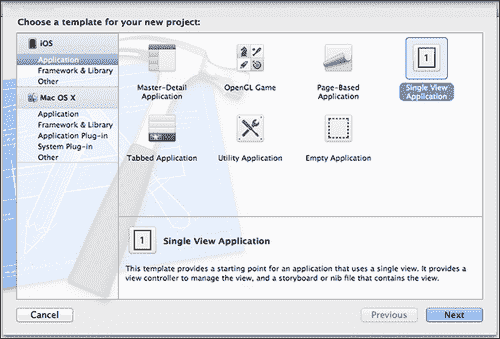

现在，我们必须将 OpenCV 添加到我们的项目中。 这一步是必需的，因为在此应用程序中，我们将使用该库中的许多功能来检测标记并估计位置。

OpenCV 是用于实时计算机视觉的编程功能库。 它最初由 Intel 开发，现在得到 Willow Garage 和 Itseez 的支持。 该库是用 C 和 C ++语言编写的。 它还具有官方的 Python 绑定和对 Java 和.NET 语言的非官方绑定。

## 添加 OpenCV 框架

幸运的是 该库是跨平台的，因此可以在 iOS 设备上使用。 从 2.4.2 版本开始，iOS 平台上正式支持 OpenCV 库，您可以从[库网站](http://opencv.org/)下载发行包。 用于 iOS 的 **OpenCV** 链接指向压缩的 OpenCV 框架。 如果您不熟悉 iOS 开发，请不要担心。 框架就像一堆文件。 通常，每个框架包都包含一个头文件列表和一个静态链接库列表。 应用程序框架提供了一种将预编译的库分发给开发人员的简便方法。

当然，您 可以从头开始构建自己的库。 OpenCV 文档详细解释了此过程。 为简单起见，我们遵循推荐的方法并使用本章的框架。

下载文件后，我们将其内容提取到项目文件夹中，如以下屏幕截图所示：


要通知 XCode IDE 在构建阶段使用任何框架，请单击**项目选项**，然后找到**构建阶段**选项卡。 在这里，我们可以添加或删除构建过程中涉及的框架列表。 单击加号以添加新框架，如以下屏幕截图所示：

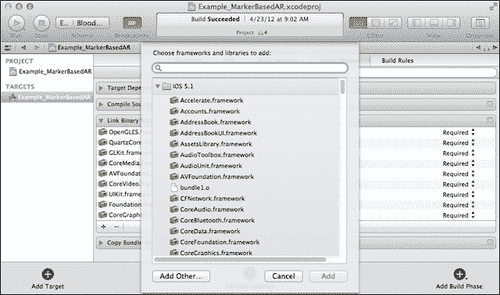

从这里，我们可以从标准框架列表中选择 。 但是要添加自定义框架，我们应该单击**添加其他**按钮。 将显示打开文件对话框。 将其指向项目文件夹中的 **opencv2.framework** ，如以下屏幕截图所示：

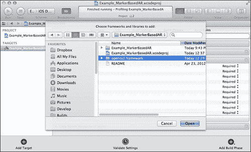

## 包含 OpenCV 标头

现在我们已经将 OpenCV 框架添加到了项目中，一切都差不多了。 最后一件事-让 OpenCV 标头添加到项目的预编译标头中。 预编译头文件是加快编译时间的重要功能。 通过向它们添加 OpenCV 标头，您的所有源代码也会自动包含 OpenCV 标头。 在项目源代码树中找到一个`.pch`文件，并按以下方式对其进行修改。

以下代码显示了如何在项目源代码树中修改`.pch`文件：

```cpp
//
// Prefix header for all source files of the 'Example_MarkerBasedAR'
//

#import <Availability.h>

#ifndef __IPHONE_5_0
#warning "This project uses features only available in iOS SDK 5.0 and later."
#endif

#ifdef __cplusplus
#include <opencv2/opencv.hpp>
#endif

#ifdef __OBJC__
  #import <UIKit/UIKit.h>
  #import <Foundation/Foundation.h>
#endif
```

现在，您可以从项目中的任何位置调用任何 OpenCV 函数。

就这样。 我们的 项目模板已配置完毕，我们准备进一步进行操作。 免费建议：复制该项目； 这将在您创建下一个时节省您的时间！

# 应用架构

每个 iOS 应用程序至少包含`UIViewController`接口接口的一个实例，该实例处理所有视图事件并管理该应用程序的业务逻辑。 此类提供了所有 iOS 应用程序的基本视图管理模型。 视图控制器管理一组视图，这些视图构成了应用程序用户界面的一部分。 作为应用程序控制器层的一部分，视图控制器将其工作与模型对象和其他控制器对象（包括其他视图控制器）进行协调，因此您的应用程序将呈现一个统一的用户界面。

我们将要编写的应用程序只有一个视图。 这就是为什么我们选择**单视图应用程序**模板来创建一个模板的原因。 该视图将用于呈现渲染的图片。 我们的`ViewController`类将包含每个 AR 应用程序应具有的三个主要组件（请参见下图）：

*   视讯来源
*   处理管道
*   Visualization engine

    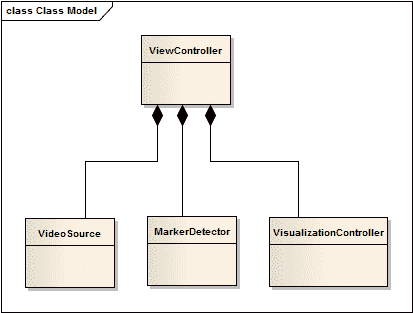

视频源负责将内置摄像机拍摄的新帧提供给用户代码。 这意味着视频源应该能够选择摄像头设备（前置或后置摄像头），调整其参数（例如捕获的视频的分辨率，白平衡和快门速度）以及抓取帧而不会冻结视频源。 主界面。

图像处理例程将封装在[H​​TG7] `MarkerDetector`类中。 此类为用户代码提供了非常薄的接口。 通常，它是`processFrame` 和`getResult`之类的一组功能。 实际上，这就是`ViewController`应该知道的全部。 没有强烈的必要性，我们决不能将低层数据结构和算法暴露给视图层。 在我们看来，`VisualizationController` 包含与增强现实的可视化有关的所有逻辑。 `VisualizationController`还是隐藏渲染引擎特定实现的外观。 低代码一致性使我们可以自由更改这些组件，而无需重写其余代码。

这种方法使您可以自由地在其他平台和编译器上使用独立模块。 例如，您可以轻松使用`MarkerDetector`类在 Mac，Windows 和 Linux 系统上开发桌面应用程序，而无需更改代码。 同样，您可以决定在 Windows 平台上移植`VisualizationController`并使用 Direct3D 进行渲染。 在这种情况下，您应该只编写新的`VisualizationController`实现； 其他代码部分将保持不变。

主要处理例程从接收到来自视频源的新帧开始。 这将触发视频源，以通过回调将有关此事件的信息通知用户代码。 `ViewController`处理此回调并执行以下操作：

1.  将新框架发送到可视化控制器。
2.  使用我们的管道执行新框架的处理。
3.  将检测到的标记发送到可视化阶段。
4.  渲染场景。

让我们详细研究这个例程。 AR 场景的渲染包括具有最后接收到的帧的内容的背景图像的绘制； 稍后将绘制人造 3D 对象。 当我们发送新的帧进行可视化时，我们正在将图像数据复制到渲染引擎的内部缓冲区。 这还不是实际的渲染。 我们只是使用新的位图更新文本。

第二步是新帧和标记检测的处理。 我们将图像作为输入，并因此收到检测到的标记的列表。 在上面。 这些标记被传递到可视化控制器，该控制器知道如何处理它们。 让我们看一下显示此例程的以下序列图：

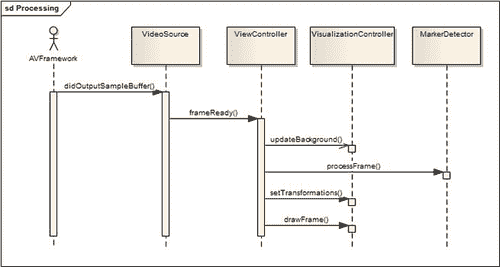

我们通过编写视频捕获组件来开始开发。 此类将负责所有帧捕获，并负责通过用户回调发送捕获的帧的通知。 稍后，我们将编写标记检测算法。 此检测例程是应用程序的核心。 在程序的这一部分中，我们将使用许多 OpenCV 函数来处理图像，检测图像上的轮廓，找到标记矩形并估计其位置。 之后，我们将集中于使用增强现实技术对结果进行可视化。 将所有这些内容整合在一起之后，我们将完成我们的第一个 AR 应用程序。 让我们继续前进！

## 访问相机

没有两个主要内容，就无法创建 增强现实应用程序：视频捕获和 AR 可视化。 视频捕获阶段包括从设备相机接收帧，执行必要的颜色转换并将其发送到处理管道。 由于单帧处理时间对于 AR 应用至关重要，因此捕获过程应尽可能高效。 达到最佳性能的最佳方法是直接访问从相机接收的帧。 从 iOS 版本 4 开始，这成为可能。AVFoundation 框架中的现有 API 提供了直接从内存中的图像缓冲区读取所需的必要功能。

您可以找到很多使用`AVCaptureVideoPreviewLayer`类和`UIGetScreenImage`函数从摄像机捕获视频的示例。 此技术用于 iOS 版本 3 和更早版本。 现在它已经过时，并且具有两个主要缺点：

*   缺少对帧数据的直接访问。 要获得位图，您必须创建`UIImage`的中间实例，将图像复制到该实例，然后将其取回。 对于 AR 应用来说，这个价格太高了，因为每个毫秒都很重要。 每秒丢失几帧（FPS）会大大降低总体用户体验。
*   要绘制 AR，您必须添加一个透明的叠加视图以显示 AR。 参考 Apple 准则，应避免使用不透明的图层，因为它们对移动处理器来说很难混合。

类别`AVCaptureDevice` 和`AVCaptureVideoDataOutput` 允许您配置，捕获和指定 32 bpp BGRA 格式的未处理视频帧。 您还可以设置输出帧的所需分辨率。 但是，它确实会影响整体性能 ，因为帧越大，就需要更多的处理时间和内存。

高性能视频捕获是一个很好的选择。 AVFoundation API 提供了一种更快，更优雅的方法来直接从相机抓取帧。 但首先，让我们看一下下图，其中显示了 iOS 的捕获过程：

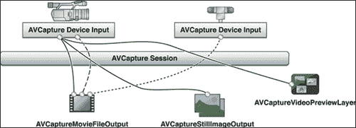

`AVCaptureSession` 是我们应该创建的根捕获对象。 捕获会话需要两个组件-输入和输出。 输入设备可以是物理设备（摄像机）或视频文件（未在图中显示）。 在我们的情况下，它是内置摄像头（正面或背面）。 可以通过以下接口之一显示输出设备：

*   `AVCaptureMovieFileOutput`
*   `AVCaptureStillImageOutput`
*   `AVCaptureVideoPreviewLayer`
*   `AVCaptureVideoDataOutput`

`AVCaptureMovieFileOutput`接口用于将视频录制到文件，`AVCaptureStillImageOutput`接口用于制作静态图像，`AVCaptureVideoPreviewLayer`接口用于在其上播放视频预览 屏幕。 我们对`AVCaptureVideoDataOutput`界面感兴趣，因为它可以直接访问视频数据。

### 注意

iOS 平台基于 Objective-C 编程语言构建。 因此，要使用 AVFoundation 框架，我们的类也必须用 Objective-C 编写。 在本节中，所有代码清单均使用 Objective-C ++语言。

为了封装 的视频捕获过程，我们创建了`VideoSource`接口，如以下代码所示：

```cpp
@protocol VideoSourceDelegate<NSObject>

-(void)frameReady:(BGRAVideoFrame) frame;

@end

@interface VideoSource : NSObject<AVCaptureVideoDataOutputSampleBufferDelegate>
{

}

@property (nonatomic, retain) AVCaptureSession *captureSession;
@property (nonatomic, retain) AVCaptureDeviceInput *deviceInput;
@property (nonatomic, retain) id<VideoSourceDelegate> delegate;

- (bool) startWithDevicePosition:(AVCaptureDevicePosition)devicePosition;
- (CameraCalibration) getCalibration;
- (CGSize) getFrameSize;

@end
```

在此回调中，我们锁定图像缓冲区以防止被任何新帧修改，获取指向图像数据和帧尺寸的指针。 然后，我们构造临时的 BGRAVideoFrame 对象，该对象通过特殊的委托传递给外部。 该代表具有以下原型：

```cpp
@protocol VideoSourceDelegate<NSObject>
-(void)frameReady:(BGRAVideoFrame) frame;

@end
```

在`VideoSourceDelegate`中，`VideoSource`接口通知用户代码新帧可用。

下面列出了视频捕获的 初始化的分步指南：

1.  创建`AVCaptureSession`的实例并设置捕获会话质量预设。
2.  选择并创建`AVCaptureDevice`。 您可以选择前置或后置摄像头，也可以使用默认摄像头。
3.  使用创建的捕获设备初始化`AVCaptureDeviceInput`并将其添加到捕获会话。
4.  创建`AVCaptureVideoDataOutput`的实例，并使用视频帧，回调委托的格式对其进行初始化，然后分派队列。
5.  将捕获输出添加到捕获会话对象。
6.  启动捕获会话。

让我们更详细地解释其中一些步骤。 创建捕获会话后，我们可以指定所需的质量预设，以确保获得最佳性能。 我们不需要处理高清质量的视频，因此 640 x 480 或更低的帧分辨率是一个不错的选择：

```cpp
- (id)init
{
  if ((self = [super init]))
  {
    AVCaptureSession * capSession = [[AVCaptureSession alloc] init];

    if ([capSession canSetSessionPreset:AVCaptureSessionPreset640x480])
    {
      [capSession setSessionPreset:AVCaptureSessionPreset640x480];
      NSLog(@"Set capture session preset AVCaptureSessionPreset640x480");
    }
    else if ([capSession canSetSessionPreset:AVCaptureSessionPresetLow])
    {
      [capSession setSessionPreset:AVCaptureSessionPresetLow];
      NSLog(@"Set capture session preset AVCaptureSessionPresetLow");
    }

    self.captureSession = capSession;
  }
  return self;
}
```

### 注意

始终使用适当的 API 检查硬件功能； 不能保证每个摄像机都可以设置特定的会话预设。

在 创建捕获会话之后，我们应该添加捕获输入-`AVCaptureDeviceInput`的实例将代表物理相机设备。 `cameraWithPosition`功能是一个辅助功能，可将相机设备返回到请求的位置（前，后或默认）：

```cpp
- (bool) startWithDevicePosition:(AVCaptureDevicePosition)devicePosition
{
  AVCaptureDevice *videoDevice = [self cameraWithPosition:devicePosition];

  if (!videoDevice)
    return FALSE;

  {
    NSError *error;

    AVCaptureDeviceInput *videoIn = [AVCaptureDeviceInput 
    deviceInputWithDevice:videoDevice error:&error];
    self.deviceInput = videoIn;

    if (!error)
    {
      if ([[self captureSession] canAddInput:videoIn])
      {
        [[self captureSession] addInput:videoIn];
      }
      else
      {
        NSLog(@"Couldn't add video input");
        return FALSE;
      }
    }
    else
    {
      NSLog(@"Couldn't create video input");
      return FALSE;
    }
  }

  [self addRawViewOutput];
  [captureSession startRunning];
  return TRUE;
}
```

请 注意错误处理代码。 在重要的事情上要注意返回值，因为使用硬件设置是一个好习惯。 否则，您的代码可能会在意外情况下崩溃，而不会通知用户发生了什么。

我们创建了一个捕获会话，并添加了视频帧的来源。 现在是时候添加一个接收器—一个将接收实际帧数据的对象。 `AVCaptureVideoDataOutput`类用于处理视频流中的未压缩帧。 摄像机可以提供 BGRA，CMYK 或简单的灰度颜色模型的帧。 出于我们的目的，BGRA 颜色模型最适合所有人，因为我们将使用此框架进行可视化和图像处理。 以下代码显示`addRawViewOutput`函数：

```cpp
- (void) addRawViewOutput
{
  /*We setupt the output*/
  AVCaptureVideoDataOutput *captureOutput = [[AVCaptureVideoDataOutput alloc] init];

  /*While a frame is processes in -captureOutput:didOutputSampleBuffer:fromConnection: delegate methods no other frames are added in the queue.
    If you don't want this behaviour set the property to NO */
  captureOutput.alwaysDiscardsLateVideoFrames = YES; 

  /*We create a serial queue to handle the processing of our frames*/
  dispatch_queue_t queue;
  queue = dispatch_queue_create("com.Example_MarkerBasedAR.cameraQueue", 
  NULL);
  [captureOutput setSampleBufferDelegate:self queue:queue];
  dispatch_release(queue);

  // Set the video output to store frame in BGRA (It is supposed to be faster)
  NSString* key = (NSString*)kCVPixelBufferPixelFormatTypeKey;
  NSNumber* value = [NSNumber 
  numberWithUnsignedInt:kCVPixelFormatType_32BGRA];

  NSDictionary* videoSettings = [NSDictionary dictionaryWithObject:value 
  forKey:key];
  [captureOutput setVideoSettings:videoSettings];

  // Register an output
  [self.captureSession addOutput:captureOutput];
}
```

现在，终于配置了 捕获会话。 启动后，它将捕获相机中的帧并将其发送给用户代码。 当新帧可用时，`AVCaptureSession`对象将执行`captureOutput: didOutputSampleBuffer:fromConnection`回调。 在此功能中，我们将执行次要的数据转换操作，以更可用的格式获取图像数据并将其传递给用户代码：

```cpp
- (void)captureOutput:(AVCaptureOutput *)captureOutput 
didOutputSampleBuffer:(CMSampleBufferRef)sampleBuffer 
       fromConnection:(AVCaptureConnection *)connection 
{ 
  // Get a image buffer holding video frame
  CVImageBufferRef imageBuffer = CMSampleBufferGetImageBuffer(sampleBuffer);

  // Lock the image buffer
  CVPixelBufferLockBaseAddress(imageBuffer,0); 

  // Get information about the image
  uint8_t *baseAddress = (uint8_t *)CVPixelBufferGetBaseAddress(imageBuffer); 
  size_t width = CVPixelBufferGetWidth(imageBuffer); 
  size_t height = CVPixelBufferGetHeight(imageBuffer);  
  size_t stride = CVPixelBufferGetBytesPerRow(imageBuffer);

  BGRAVideoFrame frame = {width, height, stride, baseAddress};
  [delegate frameReady:frame];

  /*We unlock the  image buffer*/
  CVPixelBufferUnlockBaseAddress(imageBuffer,0);
}
```

我们获得了一个用于存储帧数据的图像缓冲区的 引用。 然后我们将其锁定，以防止被新框架修改。 现在，我们可以独占访问帧数据。 借助 CoreVideo API，我们可以获得图像尺寸，步幅（每行像素数）以及指向图像数据开头的指针。

### 注意

我提请您注意回调代码中的`CVPixelBufferLockBaseAddress` / `CVPixelBufferUnlockBaseAddress`函数调用。 在我们锁定像素缓冲区之前，它可以保证其数据的一致性和正确性。 只有获得锁定后，才能读取像素。 完成后，别忘了解锁它，以使操作系统可以用新数据填充它。

# 标记检测

标记通常被设计为一个矩形图像，其中包含黑色和白色区域。 由于已知的限制，标记物检测过程很简单。 首先，我们需要在输入图像上找到闭合轮廓并将其内部的图像扭曲成矩形，然后根据我们的标记模型进行检查。

在此示例中，将使用 5 x 5 标记。 看起来是这样的：

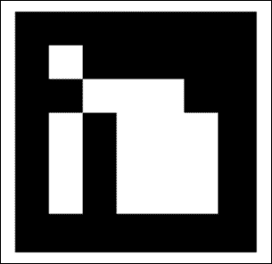

在本书的示例项目中，标记检测例程封装在[H​​TG2] `MarkerDetector`类中：

```cpp
/**
 * A top-level class that encapsulate marker detector algorithm
 */
class MarkerDetector
{
public:

  /**
   * Initialize a new instance of marker detector object
   * @calibration[in] - Camera calibration necessary for pose estimation.
   */
  MarkerDetector(CameraCalibration calibration);

  void processFrame(const BGRAVideoFrame& frame);

  const std::vector<Transformation>& getTransformations() const;

  protected:
  bool findMarkers(const BGRAVideoFrame& frame, std::vector<Marker>& 
  detectedMarkers);

  void prepareImage(const cv::Mat& bgraMat,
                    cv::Mat& grayscale);

  void performThreshold(const cv::Mat& grayscale,
                        cv::Mat& thresholdImg);

  void findContours(const cv::Mat& thresholdImg, 
                    std::vector<std::vector<cv::Point> >& contours,
                    int minContourPointsAllowed);

  void findMarkerCandidates(const std::vector<std::vector<cv::Point> >& 
  contours, std::vector<Marker>& detectedMarkers);

  void detectMarkers(const cv::Mat& grayscale,
                     std::vector<Marker>& detectedMarkers);

  void estimatePosition(std::vector<Marker>& detectedMarkers);

private:
};
```

为了帮助您更好地了解标记检测例程，将显示视频中一帧的逐步处理。 以从 iPad 相机拍摄的源图像为例：

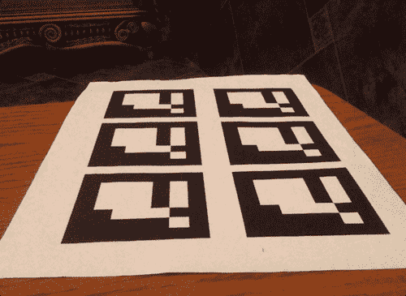

## 标记识别

这是 标记检测例程的工作流程：

1.  将输入图像转换为灰度。
2.  执行二进制阈值操作。
3.  检测轮廓。
4.  搜索可能的标记。
5.  检测和解码标记。
6.  估计标记 3D 姿势。

### 灰度转换

必须转换为 灰度，因为标记通常只包含黑白块，并且在灰度图像上使用它们更容易操作。 幸运的是，OpenCV 颜色转换非常简单。

请看一下下面的 C ++代码清单：

```cpp
void MarkerDetector::prepareImage(const cv::Mat& bgraMat, cv::Mat& grayscale)
{
  // Convert to grayscale
  cv::cvtColor(bgraMat, grayscale, CV_BGRA2GRAY);
}
```

此函数会将输入的 BGRA 图像转换为灰度（如果需要，它将分配图像缓冲区）并将结果放入第二个参数中。 所有其他步骤将对灰度图像执行。

### 图像二值化

二值化操作 将图像的每个像素转换为黑色（零强度）或白色（全强度）。 查找轮廓需要此步骤。 有几种阈值方法； 每个方面都有强项和弱项。 最简单，最快的方法是绝对阈值。 在这种方法中，结果值取决于当前像素强度和某个阈值。 如果像素强度大于阈值，则结果将为白色（255）；否则，结果为白色（255）。 否则将为黑色（0）。

这种方法有一个很大的缺点-它取决于照明条件和柔和的强度变化。 更优选的方法是自适应阈值。 该方法的主要区别是使用了被检查像素周围给定半径的所有像素。 使用平均强度可获得良好的结果，并确保更可靠的拐角检测。

以下代码段显示了`MarkerDetector`功能：

```cpp
void MarkerDetector::performThreshold(const cv::Mat& grayscale, cv::Mat& thresholdImg)
{
  cv::adaptiveThreshold(grayscale,   // Input image
                        thresholdImg,// Result binary image
                        255,         //
                        cv::ADAPTIVE_THRESH_GAUSSIAN_C, //
                        cv::THRESH_BINARY_INV, //
                        7, //
                        7  //
                        );
}
```

将自适应阈值应用于输入图像后，所得图像看起来类似于以下图像：

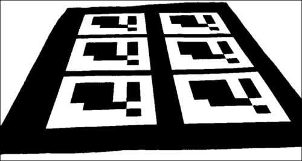

每个标记 通常看起来像一个带有黑色和白色区域的正方形图形。 因此，定位标记的最佳方法是找到闭合轮廓，并使用 4 个顶点的多边形对其进行近似。

### 轮廓检测

`cv::findCountours`功能将检测 输入二进制图像上的轮廓：

```cpp
void MarkerDetector::findContours(const cv::Mat& thresholdImg,
                                  std::vector<std::vector<cv::Point> >& contours,
int minContourPointsAllowed)
{
    std::vector< std::vector<cv::Point> > allContours;
    cv::findContours(thresholdImg, allContours, CV_RETR_LIST, CV_CHAIN_APPROX_NONE);

    contours.clear();
    for (size_t i=0; i<allContours.size(); i++)
    {
        int contourSize = allContours[i].size();
        if (contourSize > minContourPointsAllowed)
        {
            contours.push_back(allContours[i]);
        }
    }
}
```

此函数的返回值 是一个多边形列表，其中每个多边形代表一个轮廓。 该功能将跳过其周边像素值设置为小于`minContourPointsAllowed`变量的值的轮廓。 这是因为我们对小轮廓不感兴趣。 （它们可能不包含任何标记，或者由于标记尺寸太小而无法检测到轮廓。）

下图显示了检测到的轮廓的可视化：

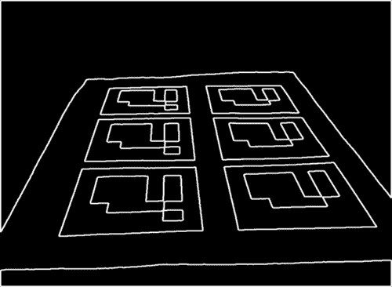

### 候选人搜索

找到 轮廓后，执行多边形逼近阶段。 这样做是为了减少描述轮廓形状的点的数量。 过滤掉没有标记的区域是一项很好的质量检查，因为它们总是可以用包含四个顶点的多边形来表示。 如果近似多边形的顶点多于或少于 4 个，则绝对不是我们想要的。 以下代码实现了这个想法：

```cpp
void MarkerDetector::findCandidates
(
    const ContoursVector& contours,
    std::vector<Marker>& detectedMarkers
)
{
    std::vector<cv::Point>  approxCurve;
    std::vector<Marker>     possibleMarkers;

    // For each contour, analyze if it is a parallelepiped likely to be the 
    marker
    for (size_t i=0; i<contours.size(); i++)
    {
        // Approximate to a polygon
        double eps = contours[i].size() * 0.05;
        cv::approxPolyDP(contours[i], approxCurve, eps, true);

        // We interested only in polygons that contains only four points
        if (approxCurve.size() != 4)
            continue;

        // And they have to be convex
        if (!cv::isContourConvex(approxCurve))
            continue;

        // Ensure that the distance between consecutive points is large enough
        float minDist = std::numeric_limits<float>::max();

        for (int i = 0; i < 4; i++)
        {
            cv::Point side = approxCurve[i] - approxCurve[(i+1)%4];
            float squaredSideLength = side.dot(side);
            minDist = std::min(minDist, squaredSideLength);
        }

        // Check that distance is not very small
        if (minDist < m_minContourLengthAllowed)
            continue;

        // All tests are passed. Save marker candidate:
        Marker m;

        for (int i = 0; i<4; i++)
            m.points.push_back( cv::Point2f(approxCurve[i].x,approxCurve[i].y) );

        // Sort the points in anti-clockwise order
        // Trace a line between the first and second point.
        // If the third point is at the right side, then the points are anti-
        clockwise
        cv::Point v1 = m.points[1] - m.points[0];
        cv::Point v2 = m.points[2] - m.points[0];

        double o = (v1.x * v2.y) - (v1.y * v2.x);

        if (o < 0.0)         //if the third point is in the left side, then 
        sort in anti-clockwise order
            std::swap(m.points[1], m.points[3]);

        possibleMarkers.push_back(m);
    }

    // Remove these elements which corners are too close to each other.
    // First detect candidates for removal:
    std::vector< std::pair<int,int> > tooNearCandidates;
    for (size_t i=0;i<possibleMarkers.size();i++)
    { 
        const Marker& m1 = possibleMarkers[i];

        //calculate the average distance of each corner to the nearest corner 
        of the other marker candidate
        for (size_t j=i+1;j<possibleMarkers.size();j++)
        {
            const Marker& m2 = possibleMarkers[j];

            float distSquared = 0;

            for (int c = 0; c < 4; c++)
            {
                cv::Point v = m1.points[c] - m2.points[c];
                distSquared += v.dot(v);
            }

            distSquared /= 4;

            if (distSquared < 100)
            {
                tooNearCandidates.push_back(std::pair<int,int>(i,j));
            }
        }                
    }

    // Mark for removal the element of the pair with smaller perimeter
    std::vector<bool> removalMask (possibleMarkers.size(), false);

    for (size_t i=0; i<tooNearCandidates.size(); i++)
    {
        float p1 = perimeter(possibleMarkers[tooNearCandidates[i].first 
        ].points);
        float p2 = 
        perimeter(possibleMarkers[tooNearCandidates[i].second].points);

        size_t removalIndex;
        if (p1 > p2)
            removalIndex = tooNearCandidates[i].second;
        else
            removalIndex = tooNearCandidates[i].first;

        removalMask[removalIndex] = true;
    }

    // Return candidates
    detectedMarkers.clear();
    for (size_t i=0;i<possibleMarkers.size();i++)
    {
        if (!removalMask[i])
            detectedMarkers.push_back(possibleMarkers[i]);
    }
}
```

现在我们已经 获得了可能是标记的平行六面体列表。 要验证它们是否是标记，我们需要执行三个步骤：

1.  首先，我们应该删除透视投影，以便获得矩形区域的正视图。
2.  然后，我们使用 Otsu 算法对图像进行阈值处理。 该算法采用双峰分布，并找到使类别外方差最大化的阈值，同时保持较低的类别内方差。
3.  最后，我们执行标记代码的识别。 如果是标记，则具有内部代码。 标记分为 7 x 7 的网格，内部 5 x 5 的单元格包含 ID 信息。 其余部分对应于外部黑色边框。 在这里，我们首先检查外部黑色边框是否存在。 然后，我们读取内部的 5 x 5 单元并检查它们是否提供有效的代码。 （可能需要旋转代码以获得有效的代码。）

为了获得矩形标记图像，我们必须使用透视变换使输入图像不变形。 可以借助`cv::getPerspectiveTransform`函数来计算该矩阵。 它从四对对应点中找到透视变换。 第一个参数是图像空间中的标记坐标，第二个点对应于方形标记图像的坐标。 估计的转换会将标记转换为正方形，然后让我们对其进行分析：

```cpp
cv::Mat canonicalMarker;
Marker& marker = detectedMarkers[i];

// Find the perspective transfomation that brings current marker to rectangular form
cv::Mat M = cv::getPerspectiveTransform(marker.points, m_markerCorners2d);

// Transform image to get a canonical marker image
cv::warpPerspective(grayscale, canonicalMarker,  M, markerSize);
```

图像扭曲使用透视变换将图像变换为矩形形式：


现在我们可以测试 图像，以验证它是否是有效的标记图像。 然后，我们尝试使用标记代码提取位掩码。 因为我们期望标记仅包含黑白颜色，所以我们可以执行 Otsu 阈值处理以去除灰色像素并仅保留黑白像素：

```cpp
//threshold image
cv::threshold(markerImage, markerImage, 125, 255, cv::THRESH_BINARY | cv::THRESH_OTSU);
```


## 标记代码识别

每个标记都有一个内部代码，该代码由 5 个字（每个 5 位）给出。 使用的编码是对汉明码的略微修改。 总体上，每个字在使用的 5 位中只有 2 位信息。 其他 3 个用于错误检测。 因此，我们最多可以有 1024 个不同的 ID。

与汉明码的主要区别在于第一位（位 3 和 5 的奇偶校验）被反转。 因此，ID 0（在汉明码中为 00000）在我们的代码中变为 10000。 这样做的目的是为了防止整个黑色矩形成为有效的标记 ID，目的是减少环境物体误报的可能性。


计算每个单元的黑白像素数量，我们得到带有标记代码的 5 x 5 位掩码。 要计算某个图像上的非零像素数，请使用`cv::countNonZero`函数。 此函数对给定的 1D 或 2D 数组中的非零数组元素进行计数。 `cv::Mat`类型可以返回子图像视图，即`cv::Mat`的新实例，其中包含原始图像的一部分。 例如，如果您有一个`cv::Mat`大小为 400 x 400，则下面的代码段将从（10，10）开始为 50 x 50 图像块创建一个子矩阵：

```cpp
cv::Mat src(400,400,CV_8UC1);
cv::Rect r(10,10,50,50);
cv::Mat subView = src(r);
```

### 读取标记代码

使用这种 技术，我们可以轻松地在标记板上找到黑白单元格：

```cpp
 cv::Mat bitMatrix = cv::Mat::zeros(5,5,CV_8UC1);

  //get information(for each inner square, determine if it is  black or white)
  for (int y=0;y<5;y++)
  {
    for (int x=0;x<5;x++)
    {
      int cellX = (x+1)*cellSize;
      int cellY = (y+1)*cellSize;
      cv::Mat cell = grey(cv::Rect(cellX,cellY,cellSize,cellSize));

      int nZ = cv::countNonZero(cell);
      if (nZ> (cellSize*cellSize) /2)
        bitMatrix.at<uchar>(y,x) = 1;
    }
  }
```

看下图的 。 根据相机的角度，同一标记可以有四种可能的表示形式：


由于标记图片有四个可能的方向，因此我们必须找到正确的标记位置。 记住，我们为信息的每两位引入了三个奇偶校验位。 在他们的帮助下，我们可以找到每种可能的标记方向的汉明距离。 正确的标记位置的汉明距离误差为零，而其他旋转不会。

这是一个代码片段，该代码片段将位矩阵旋转四次并找到正确的标记方向：

```cpp
  //check all possible rotations
  cv::Mat rotations[4];
  int distances[4];

  rotations[0] = bitMatrix;  
  distances[0] = hammDistMarker(rotations[0]);

  std::pair<int,int> minDist(distances[0],0);

  for (int i=1; i<4; i++)
  {
    //get the hamming distance to the nearest possible word
    rotations[i] = rotate(rotations[i-1]);
    distances[i] = hammDistMarker(rotations[i]);

    if (distances[i] < minDist.first)
    {
      minDist.first  = distances[i];
      minDist.second = i;
    }
  }
```

该代码以使汉明距离量度的误差最小的方式找到位矩阵的方向。 对于正确的标记 ID，此错误应为零； 如果不是，则表示 我们遇到了错误的标记模式（图像损坏或标记检测错误）。

### 标记位置优化

找到 正确的标记方向后，我们分别旋转标记的角以符合其顺序：

```cpp
//sort the points so that they are always in the same order
// no matter the camera orientation
std::rotate(marker.points.begin(), marker.points.begin() + 4 - nRotations,
marker.points.end());
```

在检测到标记并对其 ID 进行解码之后，我们将优化其角点。 当我们估计 3D 标记位置时，此操作将帮助我们进行下一步。 为了找到亚像素精度的拐角位置，使用`cv::cornerSubPix`功能：

```cpp
std::vector<cv::Point2f> preciseCorners(4 * goodMarkers.size());

for (size_t i=0; i<goodMarkers.size(); i++)
{
  Marker& marker = goodMarkers[i];

  for (int c=0;c<4;c++)
  {
    preciseCorners[i*4+c] = marker.points[c];
  }
}

cv::cornerSubPix(grayscale, preciseCorners, cvSize(5,5), cvSize(-1,-1), cvTermCriteria(CV_TERMCRIT_ITER,30,0.1));

//copy back
for (size_t i=0;i<goodMarkers.size();i++)
{
  Marker&marker = goodMarkers[i];

  for (int c=0;c<4;c++)
  {
    marker.points[c] = preciseCorners[i*4+c];
  }
}
```

第一步是 为此功能准备输入数据。 我们将顶点列表复制到输入数组。 然后，我们将`cv::cornerSubPix`传递给实际图像，点列表以及影响位置改进质量和性能的参数集。 完成后，我们将精炼的位置复制回标记角，如下图所示。

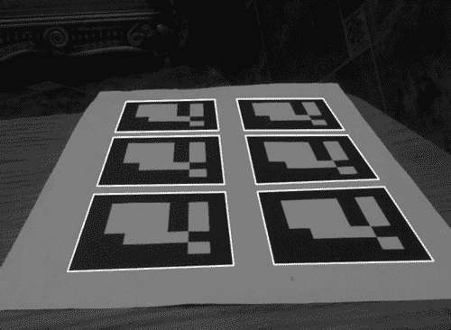

由于其复杂性，我们在标记检测的早期阶段不使用`cornerSubPix`。 对于大量的点（就计算时间而言）调用此函数非常昂贵。 因此，我们仅对有效标记执行此操作。

# 将标记放置在 3D 中

增强现实尝试 将真实世界的对象与虚拟内容融合在一起。 要将 3D 模型放置在场景中，我们需要了解用于获取视频帧的摄像机的姿势。 我们将在笛卡尔坐标系中使用欧几里得变换来表示这样的姿势。

标记在 3D 中的位置及其在 2D 中的对应投影受以下公式限制：

P = A * [R | T] * M;

哪里：

*   *M* 表示 3D 空间中的点
*   *[R | T]* 表示表示欧几里德变换的[3 | 4]矩阵
*   *A* 表示摄像机矩阵或固有参数矩阵
*   *P* 表示 *M* 在屏幕空间中的投影

在执行标记检测步骤之后，我们现在知道 2D 中四个标记角的位置（屏幕空间中的投影）。 在下一节中，您将学习如何获取 *A* 矩阵和 *M* 矢量参数，以及如何计算[R | T]变换。

## 相机校准

每个摄像机镜头都有独特的参数，例如焦距，主点和镜头畸变模型。 查找相机固有参数的过程称为相机校准。 相机校准过程 对于增强现实应用非常重要，因为它描述了输出图像上的透视变换和镜头失真。 为了在增强现实中获得最佳用户体验，应该使用相同的透视投影来完成增强对象的可视化。

要校准相机，我们需要特殊的图案图像（棋盘或白色背景上的黑色圆圈）。 从不同的角度来看，正在校准的相机会对此模式拍摄 10-15 张照片。 然后，校准算法会找到最佳的相机固有参数和失真矢量：


为了在我们的程序中表示摄像机 的校准，我们使用`CameraCalibration`类：

```cpp
/**
 * A camera calibration class that stores intrinsic matrix and distorsion coefficients.
 */
class CameraCalibration
{
  public:
  CameraCalibration();
  CameraCalibration(float fx, float fy, float cx, float cy);
  CameraCalibration(float fx, float fy, float cx, float cy, float 
  distorsionCoeff[4]);

  void getMatrix34(float cparam[3][4]) const;

  const Matrix33& getIntrinsic() const;
  const Vector4&  getDistorsion() const;

  private:
  Matrix33 m_intrinsic;
  Vector4  m_distorsion;
};
```

校准程序的详细说明不在本章范围之内。 请参考 *OpenCV camera_calibration 示例*或 *OpenCV：估计[中图像](http://www.packtpub.com/article/opencv-estimating-projective-relations-images)*中的 *投影关系 http://www.packtpub.com/article/opencv- 估计投影关系图像，以获取其他信息和源代码。*

对于此示例 ，我们提供了所有现代 iOS 设备（iPad 2，iPad 3 和 iPhone 4）的内部参数。

## 标记姿势估计

利用标记角的精确 位置，我们可以估计相机和 3D 空间中标记之间的转换。 将该操作称为根据 2D-3D 对应关系的姿势估计。 姿势估计过程会在相机和对象之间找到一个欧几里得变换（仅包含旋转和平移分量）。

让我们看一下下图：

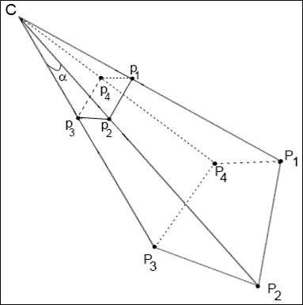

**C** 用于 表示相机中心。 **P1-P4** 点是世界坐标系中的 3D 点， **p1-p4** 点是它们在相机像面上的投影。 我们的目标是使用本征矩阵和图像平面上的已知点投影（[ **p1-p4**）和相机 **C** 找到已知标记位置之间的相对转换。 **P1-P4**）。 但是，我们在哪里可以获得 3D 空间中标记位置的坐标？ 我们想象他们。 由于我们的标记始终具有正方形形状，并且所有顶点都位于一个平面上，因此我们可以如下定义它们的角：

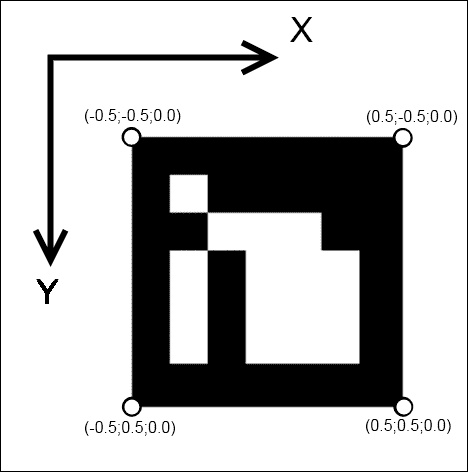

我们将标记 放在 XY 平面（Z 分量为零）中，标记中心对应于（0.0，0.0，0.0）点。 这是一个很好的提示，因为在这种情况下，我们的坐标系的起点将位于标记的中心（Z 轴垂直于标记平面）。

要使用已知的 2D-3D 对应关系查找摄像机位置，可以使用`cv::solvePnP`功能：

```cpp
void solvePnP(const Mat& objectPoints, const Mat& imagePoints, const Mat& 
cameraMatrix, const Mat& distCoeffs, Mat& rvec, Mat& tvec, bool 
useExtrinsicGuess=false);
```

`objectPoints`数组是对象坐标空间中对象点的输入数组。 可以在此处传递`std::vector<cv::Point3f>`。 也可以将 OpenCV 矩阵 3 x *N* 或 *N* x 3（其中 *N* 是点数）作为输入参数传递。 在这里，我们传递 3D 空间（四个点的向量）中标记坐标的列表。

`imagePoints`数组是相应图像点（或投影）的数组。 此自变量也可以是 2 x *N* 或 *N* x 2 的`std::vector<cv::Point2f>`或`cv::Mat`，其中 *N* 是点数。 在这里，我们传递找到的标记角的列表。

*   `cameraMatrix`：这是 3 x 3 摄像机固有矩阵。
*   `distCoeffs`：这是失真系数（k1，k2，p1，p2，[k3]）的输入 4 x 1、1 x 4、5 x 1 或 1 x 5 矢量。 如果为`NULL`，则所有失真系数均设置为 0。
*   `rvec`：这是输出旋转矢量（与`tvec`一起）将点从模型坐标系带到摄像机坐标系。
*   `tvec`：这是输出转换向量。
*   `useExtrinsicGuess`：如果为 true，则该函数将分别使用提供的`rvec`和`tvec`向量作为旋转向量和平移向量的初始近似值，并将对其进行进一步优化。

该函数以最小化重投影误差（即观察到的投影`imagePoints`与投影的`objectPoints`之间的距离平方的总和）的方式计算相机变换。

估计的变换由旋转（`rvec`）和平移分量（`tvec`）定义。 这也称为欧几里得变换或刚性变换。

刚性 转换的正式定义是，当作用于任何向量 *v* 时，产生以下形式的转换向量 *T（v）*的转换：

T（v）= R *v* + *t*

其中 RT = R-1（即 R 是正交变换）， *t* 是给出原点翻译的向量。 此外，适当的刚性转换还具有

它（R）= 1

这意味着 R 不产生反射，因此代表旋转（保留方向的正交变换）。

为了从旋转矢量获得 3 x 3 旋转矩阵，使用函数`cv::Rodrigues`。 此函数转换由旋转矢量表示的旋转，并返回其等效旋转矩阵。

### 注意

因为`cv::solvePnP`根据 3D 空间中的标记姿势找到了相机位置，所以我们必须反转找到的变换。 生成的变换将描述相机坐标系中的标记变换，这对于渲染过程而言更为友好。

这是`estimatePosition`功能的清单 ，可找到检测到的标记的位置：

```cpp
void MarkerDetector::estimatePosition(std::vector<Marker>& detectedMarkers)
{
  for (size_t i=0; i<detectedMarkers.size(); i++)
  { 
    Marker& m = detectedMarkers[i];

    cv::Mat Rvec;
    cv::Mat_<float> Tvec;
    cv::Mat raux,taux;
    cv::solvePnP(m_markerCorners3d, m.points, camMatrix, distCoeff,raux,taux);
    raux.convertTo(Rvec,CV_32F);
    taux.convertTo(Tvec ,CV_32F);

    cv::Mat_<float> rotMat(3,3); 
    cv::Rodrigues(Rvec, rotMat);

    // Copy to transformation matrix
    m.transformation = Transformation();

    for (int col=0; col<3; col++)
    {
      for (int row=0; row<3; row++)
      {
        m.transformation.r().mat[row][col] = rotMat(row,col); // Copy rotation 
        component
      }
      m.transformation.t().data[col] = Tvec(col); // Copy translation 
      component
    }

    // Since solvePnP finds camera location, w.r.t to marker pose, to get 
    marker pose w.r.t to the camera we invert it.
    m.transformation = m.transformation.getInverted();
  }
```

# 渲染 3D 虚拟对象

因此，到目前为止，您已经知道如何在图像上找到标记，以计算它们相对于相机在空间中的确切位置。 现在该画点东西了。 如前所述，要渲染场景，我们将使用 OpenGL 函数。 3D 可视化是增强现实的核心部分。 OpenGL 提供了用于创建高质量渲染的所有基本功能。

### 注意

有大量的商业和开源 3D 引擎（Unity ，虚幻引擎， Ogre 等）。 但是所有这些引擎都使用 OpenGL 或 DirectX 将命令传递给视频卡。 DirectX 是专有 API，仅 Windows 平台支持。 因此，OpenGL 是构建跨平台渲染系统的第一个也是最后一个候选对象。

了解渲染系统的原理将为您提供必要的经验和知识，以供将来使用这些引擎或编写自己的引擎。

## 创建 OpenGL 渲染层

为了在应用程序中使用 OpenGL 函数，您应该获得一个 iOS 图形上下文表面，它将向用户呈现渲染的场景。 该上下文通常绑定到用户看到的**视图**。 以下屏幕快照显示了 XCode 的 **Interface Builder** 中应用程序接口的层次结构：


为了封装 OpenGL 上下文初始化逻辑，我们引入`EAGLView`类：

```cpp
@class EAGLContext;

// This class wraps the CAEAGLLayer from CoreAnimation into a convenient UIView subclass.
// The view content is basically an EAGL surface you render your OpenGL scene into.
// Note that setting the view non-opaque will only work if the EAGL surface has an alpha channel.
@interface EAGLView : UIView
{
@private
    // The OpenGL ES names for the framebuffer and renderbuffer used to render 
    to this view.
    GLuint defaultFramebuffer, colorRenderbuffer;
}

@property (nonatomic, retain) EAGLContext *context;
// The pixel dimensions of the CAEAGLLayer.
@property (readonly) GLint framebufferWidth;
@property (readonly) GLint framebufferHeight;

- (void)setFramebuffer;
- (BOOL)presentFramebuffer;
- (void)initContext;
@end
```

此类是 连接到接口定义文件中的 View 的，因此，在加载`NIB`文件时，运行时将实例化`EAGLView`的新实例。 创建后，它将接收来自 iOS 的事件并初始化 OpenGL 渲染上下文。

以下是显示`initWithCoder`功能的代码清单：

```cpp
//The EAGL view is stored in the nib file. When it's unarchived it's sent -initWithCoder:.
- (id)initWithCoder:(NSCoder*)coder
{
  self = [super initWithCoder:coder];
  if (self) {
    CAEAGLLayer *eaglLayer = (CAEAGLLayer *)self.layer;

    eaglLayer.opaque = TRUE;
    eaglLayer.drawableProperties = [NSDictionary dictionaryWithObjectsAndKeys:
                                   [NSNumber numberWithBool:FALSE], 
                                   kEAGLDrawablePropertyRetainedBacking,
                                   kEAGLColorFormatRGBA8, 
                                   kEAGLDrawablePropertyColorFormat,
                                   nil];

    [self initContext];
  }

  return self;
}

- (void)createFramebuffer
{
  if (context && !defaultFramebuffer) {
    [EAGLContext setCurrentContext:context];

    // Create default framebuffer object.
    glGenFramebuffers(1, &defaultFramebuffer);
    glBindFramebuffer(GL_FRAMEBUFFER, defaultFramebuffer);

    // Create color render buffer and allocate backing store.
    glGenRenderbuffers(1, &colorRenderbuffer);
    glBindRenderbuffer(GL_RENDERBUFFER, colorRenderbuffer);
    [context renderbufferStorage:GL_RENDERBUFFER fromDrawable:(CAEAGLLayer *)self.layer];
    glGetRenderbufferParameteriv(GL_RENDERBUFFER, GL_RENDERBUFFER_WIDTH, &framebufferWidth);
    glGetRenderbufferParameteriv(GL_RENDERBUFFER, GL_RENDERBUFFER_HEIGHT, &framebufferHeight);

    glFramebufferRenderbuffer(GL_FRAMEBUFFER, GL_COLOR_ATTACHMENT0, 
    GL_RENDERBUFFER, colorRenderbuffer);

    if (glCheckFramebufferStatus(GL_FRAMEBUFFER) != GL_FRAMEBUFFER_COMPLETE)
    NSLog(@"Failed to make complete framebuffer object %x", 
    glCheckFramebufferStatus(GL_FRAMEBUFFER));

    //glClearColor(0, 0, 0, 0);
    NSLog(@"Framebuffer created");
  }
}
```

## 渲染 AR 场景

正如所见，`EAGLView`类不包含用于 3D 对象和视频可视化的方法。 这是有目的的。 `EAGLView`的任务是提供渲染上下文。 职责分离使我们以后可以更改可视化的逻辑。

为了可视化增强现实，我们将创建一个单独的类，称为`VisualizationController`：

```cpp
@interface SimpleVisualizationController : NSObject<VisualizationController>
{
  EAGLView * m_glview;
  GLuint m_backgroundTextureId;
  std::vector<Transformation> m_transformations;
  CameraCalibration m_calibration;
  CGSize m_frameSize;
}

-(id) initWithGLView:(EAGLView*)view calibration:(CameraCalibration) calibration frameSize:(CGSize) size;

-(void) drawFrame;
-(void) updateBackground:(BGRAVideoFrame) frame;
-(void) setTransformationList:(const std::vector<Transformation>&) transformations;
```

`drawFrame`函数将 AR 渲染到给定的`EAGLView`目标视图上。 它执行以下步骤：

1.  清除场景。
2.  设置正投影以绘制背景。
3.  在视口上绘制从相机接收的最新图像。
4.  根据相机的固有参数设置透视投影。
5.  对于每个检测到的标记，它将坐标系移动到 3D 中的标记位置。 （它将 4 x 4 转换矩阵放入 OpenGl 模型视图矩阵。）
6.  渲染任意 3D 对象。
7.  显示帧缓冲区。

准备绘制框架时，将调用`drawFrame`功能。 当新的相机框架已上载到视频存储器并且标记检测阶段已完成时，就会发生这种情况。

以下代码显示`drawFrame`函数：

```cpp
- (void)drawFrame
{
  // Set the active framebuffer
  [m_glview setFramebuffer];  

  // Draw a video on the background
  [self drawBackground];

  // Draw 3D objects on the position of the detected markers
  [self drawAR];

  // Present framebuffer
  bool ok = [m_glview presentFramebuffer];

  int glErCode = glGetError();
  if (!ok || glErCode != GL_NO_ERROR)
  {
    std::cerr << "GL error detected. Error code:" << glErCode << std::endl;
  }
}
```

绘制背景非常容易。 我们设置正交投影并使用当前帧中的图像绘制全屏纹理。 这是使用 GLES 1 API 进行此操作的代码清单：

```cpp
- (void) drawBackground
{
  GLfloat w = m_glview.bounds.size.width;
  GLfloat h = m_glview.bounds.size.height;
  const GLfloat squareVertices[] =
  {
    0, 0,
    w, 0,
    0, h,
    w, h
  };

  static const GLfloat textureVertices[] =
  {
    1, 0,
    1, 1,
    0, 0,
    0, 1
  };

  static const GLfloat proj[] =
  {
    0, -2.f/w, 0, 0,
    -2.f/h, 0, 0, 0,
    0, 0, 1, 0,
    1, 1, 0, 1
  };

  glMatrixMode(GL_PROJECTION);
  glLoadMatrixf(proj);

  glMatrixMode(GL_MODELVIEW);
  glLoadIdentity();

  glDisable(GL_COLOR_MATERIAL);

  glEnable(GL_TEXTURE_2D);
  glBindTexture(GL_TEXTURE_2D, m_backgroundTextureId);

  // Update attribute values.
  glVertexPointer(2, GL_FLOAT, 0, squareVertices);
  glEnableClientState(GL_VERTEX_ARRAY);
  glTexCoordPointer(2, GL_FLOAT, 0, textureVertices);
  glEnableClientState(GL_TEXTURE_COORD_ARRAY);

  glColor4f(1,1,1,1);
  glDrawArrays(GL_TRIANGLE_STRIP, 0, 4);

  glDisableClientState(GL_VERTEX_ARRAY);
  glDisableClientState(GL_TEXTURE_COORD_ARRAY);
  glDisable(GL_TEXTURE_2D);
}
```

场景中人造对象的渲染有些棘手。 首先，我们必须针对相机固有（校准）矩阵调整 OpenGL 投影矩阵。 没有这一步，我们将有错误的透视图。 错误的视角会使人造物体看起来不自然，就好像它们在“空中飞舞”，而不是真实世界的一部分。 正确的视角对于任何增强现实应用程序都是必不可少的。

这是一个代码片段，可根据相机的内在函数创建一个 OpenGL 投影矩阵：

```cpp
- (void)buildProjectionMatrix:(Matrix33)cameraMatrix: (int)screen_width: (int)screen_height: (Matrix44&) projectionMatrix
{    
  float near = 0.01;  // Near clipping distance
  float far = 100;  // Far clipping distance

  // Camera parameters
  float f_x = cameraMatrix.data[0]; // Focal length in x axis
  float f_y = cameraMatrix.data[4]; // Focal length in y axis (usually the 
  same?)
  float c_x = cameraMatrix.data[2]; // Camera primary point x
  float c_y = cameraMatrix.data[5]; // Camera primary point y

  projectionMatrix.data[0] =  - 2.0 * f_x / screen_width;
  projectionMatrix.data[1] = 0.0;
  projectionMatrix.data[2] = 0.0;
  projectionMatrix.data[3] = 0.0;

  projectionMatrix.data[4] = 0.0;
  projectionMatrix.data[5] = 2.0 * f_y / screen_height;
  projectionMatrix.data[6] = 0.0;
  projectionMatrix.data[7] = 0.0;

  projectionMatrix.data[8] = 2.0 * c_x / screen_width - 1.0;
  projectionMatrix.data[9] = 2.0 * c_y / screen_height - 1.0;   
  projectionMatrix.data[10] = -( far+near ) / ( far - near );
  projectionMatrix.data[11] = -1.0;

  projectionMatrix.data[12] = 0.0;
  projectionMatrix.data[13] = 0.0;
  projectionMatrix.data[14] = -2.0 * far * near / ( far - near );
  projectionMatrix.data[15] = 0.0;
}
```

在将这个矩阵加载到 OpenGL 管道后，该绘制一些对象了。 每个变换可以表示为 4 x 4 矩阵，并加载到 OpenGL 模型视图矩阵中。 这会将坐标系移动到世界坐标系中的标记位置。

例如，让我们在每个标记的顶部绘制一个坐标轴，以显示其在空间中的方向，并在整个标记上绘制一个带有渐变填充的矩形。 这种可视化将为我们提供可视反馈，表明我们的代码正在按预期工作。

以下是显示`drawAR`功能的代码段：

```cpp
- (void) drawAR
{
  Matrix44 projectionMatrix;
  [self buildProjectionMatrix:m_calibration.getIntrinsic():m_frameSize.width
  :m_frameSize.height :projectionMatrix];

  glMatrixMode(GL_PROJECTION);
  glLoadMatrixf(projectionMatrix.data);

  glMatrixMode(GL_MODELVIEW);
  glLoadIdentity();

  glEnableClientState(GL_VERTEX_ARRAY);
  glEnableClientState(GL_NORMAL_ARRAY);

  glPushMatrix();
  glLineWidth(3.0f);

  float lineX[] = {0,0,0,1,0,0};
  float lineY[] = {0,0,0,0,1,0};
  float lineZ[] = {0,0,0,0,0,1};

  const GLfloat squareVertices[] = {
    -0.5f, -0.5f,
    0.5f,  -0.5f,
    -0.5f,  0.5f,
    0.5f,   0.5f,
  };
  const GLubyte squareColors[] = {
    255, 255,   0, 255,
    0,   255, 255, 255,
    0,     0,   0,   0,
    255,   0, 255, 255,
  };

  for (size_t transformationIndex=0; 
  transformationIndex<m_transformations.size(); transformationIndex++)
  {
    const Transformation& transformation = 
    m_transformations[transformationIndex];

    Matrix44 glMatrix = transformation.getInverted().getMat44();

    glLoadMatrixf(reinterpret_cast<const GLfloat*>(&glMatrix.data[0]));

    // draw data
    glVertexPointer(2, GL_FLOAT, 0, squareVertices);
    glEnableClientState(GL_VERTEX_ARRAY);
    glColorPointer(4, GL_UNSIGNED_BYTE, 0, squareColors);
    glEnableClientState(GL_COLOR_ARRAY);

    glDrawArrays(GL_TRIANGLE_STRIP, 0, 4);
    glDisableClientState(GL_COLOR_ARRAY);

    float scale = 0.5;
    glScalef(scale, scale, scale);

    glColor4f(1.0f, 0.0f, 0.0f, 1.0f);
    glVertexPointer(3, GL_FLOAT, 0, lineX);
    glDrawArrays(GL_LINES, 0, 2);

    glColor4f(0.0f, 1.0f, 0.0f, 1.0f);
    glVertexPointer(3, GL_FLOAT, 0, lineY);
    glDrawArrays(GL_LINES, 0, 2);

    glColor4f(0.0f, 0.0f, 1.0f, 1.0f);
    glVertexPointer(3, GL_FLOAT, 0, lineZ);
    glDrawArrays(GL_LINES, 0, 2);
  }
  glPopMatrix();
  glDisableClientState(GL_VERTEX_ARRAY);
}
```

如果运行应用程序，则会得到下图：

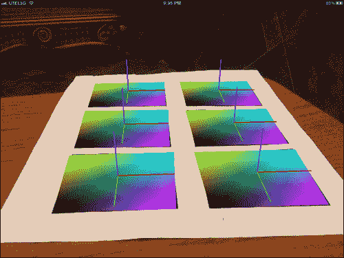

尽管的事实是我们没有使用特殊的 3D 渲染引擎进行场景可视化，但我们拥有所有必要的数据来自行完成此操作。 让我们总结一下我们获得的数据：

*   来自相机设备的 BGRA 格式的帧
*   正确的投影矩阵可以为我们提供适合 AR 场景渲染的透视投影
*   找到的标记姿势列表

您可以轻松地将此数据放入任何 3D 引擎，并创建自己的基于标记的成品 AR 应用程序

如您所见，具有渐变填充和枢轴的四边形正好放置在标记上。 这是增强现实的关键功能-真实图片和人造物体的无缝融合。

# 摘要

在本章中，我们学习了如何为 iPhone / iPad 设备创建移动增强现实应用程序。 您了解了如何在 XCode 项目中使用 OpenCV 库来创建令人惊叹的最新应用程序。 使用 OpenCV 可使您的应用程序在移动设备上执行实时性能的复杂图像处理计算。

从本章中，您还学习了如何执行初始图像处理（以灰色阴影和二值化进行平移），如何在图像中找到闭合的轮廓并使用多边形对其进行近似，如何在图像中找到标记并对其进行解码，如何 计算标记在空间中的位置，以及增强现实中 3D 对象的可视化。

# 参考

*   [《ArUco：基于 OpenCV 的增强现实应用程序的最小库》](http://www.uco.es/investiga/grupos/ava/node/26)
*   [《OpenCV 摄像机校准和 3D 重建》](http://opencv.itseez.com/modules/calib3d/doc/camera_calibration_and_3d_reconstruction.html)
*   [《OpenCV：估计图像中的投影关系》](http://www.packtpub.com/article/opencv-estimatingprojective-relations-images)
*   《计算机视觉中的多视图几何（第二版）》，RI Hartley 和 A. Zisserman，剑桥大学出版社，ISBN 0-521-54051-8