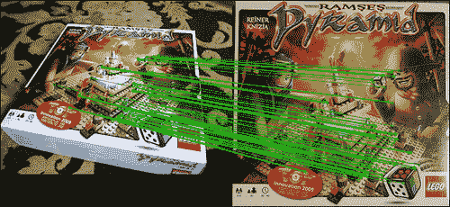
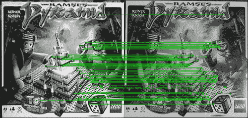
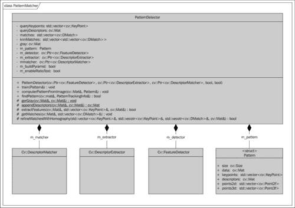
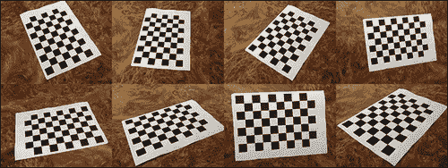
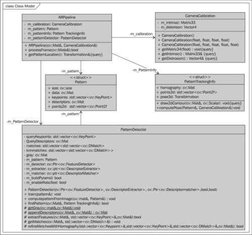
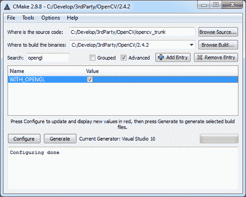
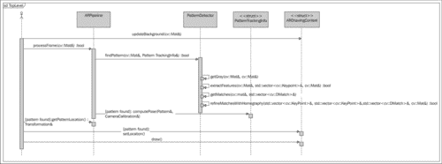
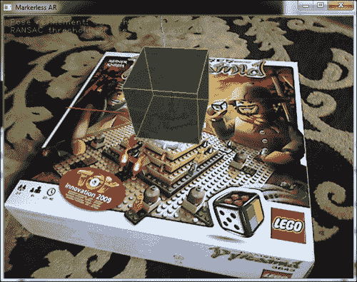

# 第 3 章。无标记增强现实

在本章中，读者将学习如何使用 OpenCV（用于桌面）创建标准的实时项目，以及如何使用实际环境作为输入而不是打印的方形标记来执行无标记增强现实的新方法。 本章将介绍一些无标记 AR 的理论，并展示如何在有用的项目中应用它。

以下是本章将涉及的主题列表：

*   基于标记与无标记的 AR
*   使用特征描述符在视频上查找任意图像
*   模式姿势估计
*   应用基础架构
*   在 OpenCV 中启用对 OpenGL 可视化的支持
*   渲染增强现实
*   示例

在开始之前，让我给您简要列出本章所需的知识以及所需的软件：

*   CMake 的基本知识。 CMake 是一个跨平台的开源构建系统，旨在构建，测试和打包软件。 像 OpenCV 库一样，本章的演示项目也使用 CMake 构建系统。 可以从[这个页面](http://www.cmake.org/)下载 CMake。
*   还必须具备 C++ 编程语言的基本知识。 但是，将详细说明应用程序源代码的所有复杂部分。

# 基于标记的 AR 与无标记的 AR

在上一章中，您学习了如何使用称为标记的特殊图像来增强真实场景。 标记的强方面如下：

*   便宜的检测算法
*   抵抗照明变化

标记还具有几个弱点。 它们如下：

*   如果部分重叠则不起作用
*   标记图片必须为黑白
*   在大多数情况下为正方形（因为易于检测）
*   标记的非审美视觉外观
*   与现实世界没有任何共同点

因此，标记是开始使用增强现实的好点。 但是如果您想要更多，该是时候从基于标记的 AR 过渡到无标记的 AR 了。 无标记 AR 是一种基于识别现实世界中存在的对象的技术。 无标记 AR 的目标示例包括：杂志封面，公司徽标，玩具等。 通常，任何具有足够有关场景其余部分的描述性和区分性信息的对象都可以成为无标记 AR 的目标。

无标记 AR 方法的强项是：

*   可用于检测现实世界中的物体
*   即使目标对象部分重叠也可以
*   可以具有任意形式和纹理（实心或平滑渐变纹理除外）

无需标记的 AR 系统可以使用真实的图像和对象将相机放置在 3D 空间中，并在真实图片的顶部呈现醒目的效果。 无标记 AR 的核心是图像识别和物体检测算法。 与形状和内部结构是固定且已知的标记不同，不能以这种方式定义真实对象。 同样，对象可能具有复杂的形状，需要修改的姿态估计算法才能找到其正确的 3D 变换。

### 注意

为了让您了解无标记 AR，我们将平面图像作为目标。 具有复杂形状的物体将不在此处详细考虑。 我们将在本章稍后讨论 AR 复杂形状的使用。

无标记的 AR 执行大量的 CPU 计算，因此移动设备通常无法确保平滑的 FPS。 在本章中，我们将针对台式机平台，例如 PC 或 Mac。 为此，我们需要一个跨平台的构建系统。 在本章中，我们使用 CMake 构建系统。

# 使用特征描述符在视频上查找任意图像

图像识别是一种计算机视觉技术，可在输入图像中搜索特定的位图图案。 即使图像被缩放，旋转或具有与原始图像不同的亮度，我们的图像识别算法也应该能够检测到该图案。

我们如何将图案图像与其他图像进行比较？ 由于图案可能会受到透视变换的影响，因此很明显我们无法直接比较图案的像素和测试图像。 在这种情况下，特征点和特征描述符会有所帮助。 没有关于功能是什么的通用或确切定义。 确切的定义通常取决于问题或应用程序的类型。 通常，特征被定义为图像的“有趣”部分，并且特征被用作许多计算机视觉算法的起点。 在本章中，我们将使用**特征点**术语，这是由中心点，半径和方向定义的图像的一部分。 每种特征检测算法都尝试检测相同的特征点，而与应用的透视变换无关。

## 特征提取

特征检测是从输入图像中找到兴趣区域的方法。 有很多特征检测算法，它们搜索边缘，角点或斑点。 在我们的案例中，我们对角点检测感兴趣。 角点检测基于图像边缘的分析。 基于角点的边缘检测算法可搜索图像梯度的快速变化。 通常，它是通过在 X 和 Y 方向上寻找图像梯度的一阶导数的极值来完成的。

特征点方向通常被计算为特定区域中主要图像梯度的方向。 旋转或缩放图像时，特征检测算法会重新计算主梯度的方向。 这意味着无论图像旋转如何，特征点的方向都不会改变。 这样的特征称为**旋转不变量**。

另外，我还必须提到有关尺寸特征点的几点。 一些特征检测算法使用固定大小的特征，而另一些则分别计算每个关键点的最佳大小。 知道特征尺寸后，我们就可以在缩放图像上找到相同的特征点。 这使特征比例不变。

OpenCV 有几种特征检测算法。 它们都是从基类`cv::FeatureDetector`派生的。 可以通过两种方式创建特征检测算法：

*   通过对具体特征检测器类构造函数的显式调用：

    ```cpp
    cv::Ptr<cv::FeatureDetector> detector = cv::Ptr<cv::FeatureDetector>(new cv::SurfFeatureDetector());
    ```

*   或通过算法名称创建特征检测器：

    ```cpp
    cv::Ptr<cv::FeatureDetector> detector = cv::FeatureDetector::create("SURF");
    ```

两种方法都有其优点，因此请选择最喜欢的一种。 显式类的创建使您可以将其他参数传递给特征检测器构造函数，而按算法名称创建则可以更轻松地在运行时切换算法。

要检测特征点，应调用`detect`方法：

```cpp
std::vector<cv::KeyPoint> keypoints;
detector->detect(image, keypoints);
```

检测到的特征点放置在`keypoints`容器中。 每个关键点都包含其中心，半径，角度和分数，并且与特征点的“质量”或“强度”具有一定的关联性。 每个特征检测算法都有自己的分数计算算法，因此比较由特定检测算法检测到的关键点的分数是有效的。

### 注意

基于角点的特征检测器使用灰度图像查找特征点。 描述符提取算法也可用于灰度图像。 当然，它们两个都可以隐式地进行颜色转换。 但是在这种情况下，颜色转换将进行两次。 我们可以通过将输入图像进行显式的颜色转换为灰度并将其用于特征检测和描述符提取来提高性能。

如果检测器计算关键点方向和大小，则可以在模式检测中获得最佳结果。 这使关键点对于旋转和缩放不变。 最著名和最强大的关键点检测算法是众所周知的，它们用于 SIFT 和 SURF 特征检测/描述提取。 不幸的是，它们已申请专利。 因此它们并非免费用于商业用途。 但是，它们的实现存在于 OpenCV 中，因此您可以自由地对其进行评估。 但是有很好的免费替代品。 您可以改用 ORB 或 FREAK 算法。 ORB 检测是经过修改的 FAST 特征检测器。 原始的 FAST 检测器速度惊人，但无法计算关键点的方向或大小。 幸运的是，ORB 算法确实可以估计关键点的方向，但是特征尺寸仍然是固定的。 从以下几段中，您将学到处理这些问题的便宜方法。 但是首先，让我解释一下为什么特征点在图像识别中如此重要。

如果处理的图像通常具有每像素 24 位的色深，并且分辨率为`640 x 480`，则数据为 912 KB。 我们如何在现实世界中找到图案图像？ 像素到像素的匹配时间太长，我们也必须处理旋转和缩放。 这绝对不是一个选择。 使用特征点可以解决此问题。 通过检测关键点，我们可以确保返回的特征描述了包含大量信息的图像部分（这是因为基于角的检测器会返回边缘，角和其他清晰的图形）。 因此，要查找两个框架之间的对应关系，我们只需要匹配关键点即可。

从关键点定义的补丁中，我们提取一个称为描述符的向量。 这是特征点的一种表示形式。 从特征点提取描述符的方法有很多。 他们都有自己的优点和缺点。 例如，SIFT 和 SURF 描述符提取算法占用大量 CPU，但是提供具有良好区分性的强大描述符。 在我们的示例项目中，我们使用 ORB 描述符提取算法，因为我们也选择它作为特征检测器。

### 注意

同时使用来自同一算法的特征检测器和描述符提取器始终是一个好主意，因为它们可以完美地相互配合。

特征描述符表示为固定大小（16 个或更多元素）的向量。 假设我们的图像分辨率为`640 x 480`像素，并且具有 1,500 个特征点。 然后，将需要`1500 * 16 * sizeof(float) = 96 KB`（用于 SURF）。 它比原始图像数据小十倍。 而且，使用描述符比使用光栅位图要容易得多。 对于两个特征描述符，我们可以引入相似度评分-一种定义两个向量之间相似度的度量。 通常是其 L2 范数或汉明距离（基于所使用的特征描述符的种类）。

特征描述符提取算法是从`cv::DescriptorExtractor`基类派生的。 同样，作为特征检测算法，可以通过指定其名称或使用显式的构造函数调用来创建它们。

## 模式对象的定义

为了描述模式对象，我们引入一个名为`Pattern`的类，该类包含火车图像，特征列表和提取的描述符以及初始模式位置的 2D 和 3D 对应关系：

```cpp
/**
 * Store the image data and computed descriptors of target pattern
 */
struct Pattern
{
  cv::Size                  size;
  cv::Mat                   data;
  std::vector<cv::KeyPoint> keypoints;
  cv::Mat                   descriptors;

  std::vector<cv::Point2f>  points2d;
  std::vector<cv::Point3f>  points3d;
};
```

## 特征点的匹配

查找帧与帧之间的对应关系的过程可以公式化为：从一组描述符中为另一组的每个元素搜索最近邻。 这称为“匹配”过程。 OpenCV 中有两种主要的描述符匹配算法：

*   暴力比赛（`cv::BFMatcher`）
*   基于 Flann 的匹配器（`cv::FlannBasedMatcher`）

暴力匹配器通过尝试每一个（穷举搜索）在第一组中寻找每个描述符，在第二组中寻找最接近的描述符。 `cv::FlannBasedMatcher` 使用快速近似最近邻搜索算法来查找对应关系（为此，它使用快速第三方库作为近似最近邻库）。

描述符匹配的结果是两组描述符之间的对应关系的列表。 第一组描述符通常称为训练集，因为它与我们的图案图像相对应。 第二个集合称为查询集，因为它属于我们将在其中寻找模式的图像。 找到的正确匹配越多（存在更多与图像对应的图案），图案出现在图像上的机会就越大。

为了提高匹配速度，您可以通过调用`match`函数来训练匹配器。 训练阶段可用于优化`cv::FlannBasedMatcher`的性能。 为此，`train`类将为火车描述符构建索引树。 这将提高大型数据集的匹配速度（例如，如果要从数百张图像中找到匹配项）。 对于`cv::BFMatcher`，`train`类什么都不做，因为没有要预处理的东西； 它只是将火车描述符存储在内部字段中。

### `PatternDetector.cpp`

以下代码块使用模式图像训练描述符匹配器：

```cpp
void PatternDetector::train(const Pattern& pattern)
{
    // Store the pattern object
    m_pattern = pattern;

    // API of cv::DescriptorMatcher is somewhat tricky
    // First we clear old train data:
    m_matcher->clear();

    // That we add vector of descriptors 
    // (each descriptors matrix describe one image). 
    // This allows us to perform search across multiple images:
    std::vector<cv::Mat> descriptors(1);
    descriptors[0] = pattern.descriptors.clone(); 
    m_matcher->add(descriptors);

    // After adding train data perform actual train:
    m_matcher->train();
} 
```

为了匹配查询描述符，我们可以使用`cv::DescriptorMatcher`的以下方法之一：

*   要查找最佳匹配的简单列表：

    ```cpp
    void match(const Mat& queryDescriptors, vector<DMatch>& matches,
               const vector<Mat>& masks=vector<Mat>() );
    ```

*   要为每个描述符找到最接近的`K`个匹配项：

    ```cpp
    void knnMatch(const Mat& queryDescriptors, vector<vector<DMatch> >& matches, int k, const vector<Mat>& masks=vector<Mat>(),bool compactResult=false );
    ```

*   查找距离不超过指定距离的匹配：

    ```cpp
    void radiusMatch(const Mat& queryDescriptors, vector<vector<DMatch> >& matches, maxDistance, const vector<Mat>& masks=vector<Mat>(), bool compactResult=false ); 
    ```

## 异常值移除

在匹配阶段可能发生不匹配。 这是正常的。 匹配中有两种错误：

*   **假正面匹配项**：当特征点对应关系错误时
*   **假负面匹配项**：当两个图像上的特征点均可见时，不存在匹配项

假负面匹配显然不好。 但是我们无法处理它们，因为匹配算法拒绝了它们。 因此，我们的目标是尽量减少假正面匹配的次数。 要拒绝错误的对应关系，我们可以使用交叉匹配技术。 想法是使火车描述符与查询集匹配，反之亦然。 仅返回这两个匹配项的普通匹配项。 当有足够的匹配项时，此类技术通常会以最少的异常值产生最佳结果。

### 交叉匹配过滤器

交叉匹配在`cv::BFMatcher`类中可用。 要启用交叉检查测试，请在将第二个参数设置为`true`的情况下创建`cv::BFMatcher`：

```cpp
cv::Ptr<cv::DescriptorMatcher> matcher(new cv::BFMatcher(cv::NORM_HAMMING, true));
```

在以下屏幕截图中可以看到使用交叉检查进行匹配的结果：


### 比率测试

第二种众所周知的离群值去除技术是比率测试。 我们首先以`K = 2`进行 KNN 匹配。 每个匹配都返回两个最接近的描述符。 仅当第一次和第二次比赛之间的距离比足够大（比率阈值通常接近 2）时，才返回比赛。

#### `PatternDetector.cpp`

以下代码使用比率测试执行鲁棒的描述符匹配 ：

```cpp
void PatternDetector::getMatches(const cv::Mat& queryDescriptors, std::vector<cv::DMatch>& matches)
{
    matches.clear();

    if (enableRatioTest)
    {
        // To avoid NaNs when best match has 
        // zero distance we will use inverse ratio. 
        const float minRatio = 1.f / 1.5f;

        // KNN match will return 2 nearest 
        // matches for each query descriptor
        m_matcher->knnMatch(queryDescriptors, m_knnMatches, 2);

        for (size_t i=0; i<m_knnMatches.size(); i++)
        {
            const cv::DMatch& bestMatch   = m_knnMatches[i][0];
            const cv::DMatch& betterMatch = m_knnMatches[i][1];

            float distanceRatio = bestMatch.distance / betterMatch.distance;

            // Pass only matches where distance ratio between 
            // nearest matches is greater than 1.5 
            // (distinct criteria)
            if (distanceRatio < minRatio)
            {
                matches.push_back(bestMatch);
            }
        }
    }
    else
    {
        // Perform regular match
        m_matcher->match(queryDescriptors, matches);
    }
} 
```

比率测试可以删除几乎所有异常值。 但是在某些情况下，假正面匹配项可以通过此测试。 在下一部分中，我们将向您展示如何删除其余的异常值，并仅保留正确的匹配项。

### 单应性估计

为了进一步改善匹配，我们可以使用随机样本共识（RANSAC）方法执行离群值过滤。 在处理图像（平面对象）时，我们希望它是刚性的，因此可以找到图案图像上的特征点与查询图像上的特征点之间的单应性变换。 同形转换将点从模式带到查询图像坐标系。 为了找到这种转换，我们使用`cv::findHomography`函数。 它使用 RANSAC 通过探测输入点的子集找到最佳的单应性矩阵。 副作用是，此函数根据计算的单应性矩阵的重投影误差，将每个对应关系标记为离群或离群。

#### `PatternDetector.cpp`

以下代码使用单应矩阵估计，并使用 RANSAC 算法过滤掉几何上不正确的匹配项：

```cpp
bool PatternDetector::refineMatchesWithHomography
    (
        const std::vector<cv::KeyPoint>& queryKeypoints,
        const std::vector<cv::KeyPoint>& trainKeypoints, 
        float reprojectionThreshold,
        std::vector<cv::DMatch>& matches,
        cv::Mat& homography
    )
{
    const int minNumberMatchesAllowed = 8;

    if (matches.size() < minNumberMatchesAllowed)
        return false;

    // Prepare data for cv::findHomography
    std::vector<cv::Point2f> srcPoints(matches.size());
    std::vector<cv::Point2f> dstPoints(matches.size());

    for (size_t i = 0; i < matches.size(); i++)
    {
        srcPoints[i] = trainKeypoints[matches[i].trainIdx].pt;
        dstPoints[i] = queryKeypoints[matches[i].queryIdx].pt;
    }

    // Find homography matrix and get inliers mask
    std::vector<unsigned char> inliersMask(srcPoints.size());
    homography = cv::findHomography(srcPoints, 
                                    dstPoints, 
                                    CV_FM_RANSAC, 
                                    reprojectionThreshold, 
                                    inliersMask);

    std::vector<cv::DMatch> inliers;
    for (size_t i=0; i<inliersMask.size(); i++)
    {
        if (inliersMask[i])
            inliers.push_back(matches[i]);
    }

    matches.swap(inliers);
    return matches.size() > minNumberMatchesAllowed;
} 
```

这是使用此技术精炼的比赛的可视化效果：



单应性搜索步骤很重要，因为获得的变换是在查询图像中找到图案位置的关键。

### 单应性优化

当我们寻找单应性变换时，我们已经具有所有必要的数据以在 3D 中找到它们的位置。 但是，我们可以通过找到更准确的图案角来进一步改善其位置。 为此，我们使用估计的单应性使输入图像变形以获取已找到的图案。 结果应该非常接近源火车图像。 单应性优化可以帮助找到更准确的单应性变换。



然后，我们获得另一个单应性和另一组线性特征。 所得的精确单应性将是第一（H1）和第二（H2）单应性的矩阵乘积。

#### `PatternDetector.cpp`

以下代码块包含模式检测例程的最终版本：

```cpp
bool PatternDetector::findPattern(const cv::Mat& image, PatternTrackingInfo& info)
{
    // Convert input image to gray
    getGray(image, m_grayImg);

    // Extract feature points from input gray image
    extractFeatures(m_grayImg, m_queryKeypoints, m_queryDescriptors);

    // Get matches with current pattern
    getMatches(m_queryDescriptors, m_matches);

    // Find homography transformation and detect good matches
    bool homographyFound = refineMatchesWithHomography(
        m_queryKeypoints, 
        m_pattern.keypoints, 
        homographyReprojectionThreshold, 
        m_matches, 
        m_roughHomography);

    if (homographyFound)
    {
        // If homography refinement enabled 
        // improve found transformation
        if (enableHomographyRefinement)
        {
            // Warp image using found homography
            cv::warpPerspective(m_grayImg, m_warpedImg, m_roughHomography, m_pattern.size, cv::WARP_INVERSE_MAP | cv::INTER_CUBIC);

            // Get refined matches:
            std::vector<cv::KeyPoint> warpedKeypoints;
            std::vector<cv::DMatch> refinedMatches;

            // Detect features on warped image
            extractFeatures(m_warpedImg, warpedKeypoints, m_queryDescriptors);

            // Match with pattern
            getMatches(m_queryDescriptors, refinedMatches);

            // Estimate new refinement homography
            homographyFound = refineMatchesWithHomography(
                warpedKeypoints, 
                m_pattern.keypoints, 
                homographyReprojectionThreshold, 
                refinedMatches, 
                m_refinedHomography);

            // Get a result homography as result of matrix product 
            // of refined and rough homographies:
            info.homography = m_roughHomography * m_refinedHomography;

            // Transform contour with precise homography
            cv::perspectiveTransform(m_pattern.points2d, info.points2d, info.homography);
        }
        else
        {
            info.homography = m_roughHomography;

            // Transform contour with rough homography
            cv::perspectiveTransform(m_pattern.points2d, info.points2d, m_roughHomography);
        }
    }

    return homographyFound;
}
```

如果在所有离群值去除阶段之后，匹配项的数量仍然相当大（图案图像中至少 25% 的特征与输入的特征相对应），则可以确定位置正确的图案图像。 如果是这样，我们将进入下一个阶段-相对于相机估算花样姿势的 3D 位置。

## 全部放在一起

为了容纳特征检测器，描述符提取器和匹配器算法的实例，我们创建了一个类`PatternMatcher`，该类将封装所有这些数据。 它在特征检测和描述符提取算法，特征匹配逻辑以及控制检测过程的设置上拥有所有权。



该类提供了方法来计算所有必要数据，以根据给定图像构建图案结构：

```cpp
void PatternDetector::computePatternFromImage(const cv::Mat& image, Pattern& pattern);
```

该方法在输入图像上找到特征点，并使用指定的检测器和提取器算法提取描述符，然后用此数据填充图案结构以备后用。

当计算出`Pattern`时，我们可以通过调用`train`方法来训练一个检测器：

```cpp
void PatternDetector::train(const Pattern& pattern)
```

此函数将参数设置为我们将要找到的当前目标模式。 同样，它训练带有模式的描述符集的描述符匹配器。 调用此方法后，我们准备查找火车图像。 模式检测是在最后的公共功能`findPattern`中完成的。 该方法封装了如前所述的整个例程，包括特征检测，描述符提取以及与异常值过滤的匹配。

让我们再次简要介绍一下我们执行的步骤：

1.  将输入图像转换为灰度。
2.  使用我们的特征检测算法在查询图像上检测到特征。
3.  从输入图像中提取检测到的特征点的描述符。
4.  与模式描述符匹配的描述符。
5.  使用了交叉检查或比率测试来去除异常值。
6.  使用内部匹配找到单应变换。
7.  通过使用上一步中的单应性扭曲查询图像来完善单应性。
8.  由于粗略和精细单应性的相乘，找到了精确的单应性。
9.  将图案角转换为图像坐标系，以获取输入图像上的图案位置。

# 模式姿势估计

姿势估计的方式类似于上一章中标记姿势的估计方式。 像往常一样，我们需要 2D-3D 对应关系来估计摄像机的外部参数。 我们分配四个 3D 点以与位于 XY 平面（Z 轴向上）中的单位矩形的角协调，而 2D 点对应于图像位图的角。

## `PatternDetector.cpp`

`buildPatternFromImage`类从输入图像创建`Pattern`对象，如下所示：

```cpp
void PatternDetector::buildPatternFromImage(const cv::Mat& image, Pattern& pattern) const
{
    int numImages = 4;
    float step = sqrtf(2.0f);

    // Store original image in pattern structure
    pattern.size = cv::Size(image.cols, image.rows);
    pattern.frame = image.clone();
    getGray(image, pattern.grayImg);

    // Build 2d and 3d contours (3d contour lie in XY plane since // it's planar)
    pattern.points2d.resize(4);
    pattern.points3d.resize(4);

    // Image dimensions
    const float w = image.cols;
    const float h = image.rows;

    // Normalized dimensions:
    const float maxSize = std::max(w,h);
    const float unitW = w / maxSize;
    const float unitH = h / maxSize;

    pattern.points2d[0] = cv::Point2f(0,0);
    pattern.points2d[1] = cv::Point2f(w,0);
    pattern.points2d[2] = cv::Point2f(w,h);
    pattern.points2d[3] = cv::Point2f(0,h);

    pattern.points3d[0] = cv::Point3f(-unitW, -unitH, 0);
    pattern.points3d[1] = cv::Point3f( unitW, -unitH, 0);
    pattern.points3d[2] = cv::Point3f( unitW,  unitH, 0);
    pattern.points3d[3] = cv::Point3f(-unitW,  unitH, 0);

    extractFeatures(pattern.grayImg, pattern.keypoints, pattern.descriptors);
} 
```

角的配置非常有用，因为此图案坐标系将直接放置在 XY 平面中图案位置的中心，而 Z 轴朝相机的方向看。

## 获取相机固有矩阵

摄像机固有参数可以使用 OpenCV 分发程序包中名为`camera_cailbration.exe`的示例程序来计算。 该程序将使用一系列图案图像找到内部镜头参数，例如焦距，主点和畸变系数。 假设从不同的角度来看，我们有一组八个校准图案图像，如下所示：



然后，用于执行校准的命令行语法如下：

```cpp
imagelist_creator imagelist.yaml *.png
calibration -w 9 -h 6 -o camera_intrinsic.yaml imagelist.yaml

```

第一条命令将创建 YAML 格式的图像列表，校准工具希望该图像列表作为当前目录中所有 PNG 文件的输入。 您可以使用确切的文件名，例如`img1.png`，`img2.png`和`img3.png`。 然后将生成的文件`imagelist.yaml`传递到校准应用程序。 而且，校准工具可以从常规网络摄像头拍摄图像。

我们指定校准图案的尺寸以及将要写入校准数据的输入和输出文件。

校准完成后，您将在 YAML 文件中获得以下结果：

```cpp
%YAML:1.0
calibration_time: "06/12/12 11:17:56"
image_width: 640
image_height: 480
board_width: 9
board_height: 6
square_size: 1.
flags: 0
camera_matrix: !!opencv-matrix
 rows: 3
 cols: 3
 dt: d
 data: [ 5.2658037684199849e+002, 0., 3.1841744018680112e+002, 0.,
 5.2465577209994706e+002, 2.0296659047014398e+002, 0., 0., 1\. ]
distortion_coefficients: !!opencv-matrix
 rows: 5
 cols: 1
 dt: d
 data: [ 7.3253671786835686e-002, -8.6143199924308911e-002,
 -2.0800255026966759e-002, -6.8004894417795971e-004,
 -1.7750733073535208e-001 ]
avg_reprojection_error: 3.6539552933501085e-001

```

我们主要对`camera_matrix`感兴趣，它是`3 x 3`相机校准矩阵。 它具有以下表示法：


我们主要对的四个组成部分感兴趣：`fx`，`fy`，`cx`和`cy`。 有了这些数据，我们可以使用以下代码创建相机校准对象的实例：

```cpp
CameraCalibration calibration(526.58037684199849e, 524.65577209994706e, 318.41744018680112, 202.96659047014398)
```

没有正确的相机校准，就不可能创建看起来自然的增强现实。 估计的透视变换将与相机的变换不同。 这将导致增强对象看起来太近或太远。 以下是一个示例屏幕截图，其中相机校准是有意更改的：


如您所见，盒子的透视外观与整体场景有所不同。

为了估计图案位置，我们使用 OpenCV 函数`cv::solvePnP`解决了 PnP 问题。 您可能熟悉此功能，因为我们也在基于标记的 AR 中使用了它。 我们需要当前图像上图案角的坐标，以及我们先前定义的参考 3D 坐标。

### 注意

`cv::solvePnP`功能可以使用四个以上的点。 另外，如果要创建具有复杂形状图案的 AR，它也是关键功能。 想法保持不变-您只需要定义图案的 3D 结构和 2D 查找点对应关系即可。 当然，单应性估计在这里不适用。

我们从训练好的模式对象中获取参考 3D 点，并从`PatternTrackingInfo`结构中获取其对应的 2D 投影； 摄像机校准存储在`PatternDetector`专用字段中。

### `Pattern.cpp`

3D 空间中的图案位置由`computePose`函数估算如下：

```cpp
void PatternTrackingInfo::computePose(const Pattern& pattern, const CameraCalibration& calibration)
{
  cv::Mat camMatrix, distCoeff;
  cv::Mat(3,3, CV_32F, const_cast<float*>(&calibration.getIntrinsic().data[0])).copyTo(camMatrix);
  cv::Mat(4,1, CV_32F, const_cast<float*>(&calibration.getDistorsion().data[0])).copyTo(distCoeff);

  cv::Mat Rvec;
  cv::Mat_<float> Tvec;
  cv::Mat raux,taux;
  cv::solvePnP(pattern.points3d, points2d, camMatrix, distCoeff,raux,taux);
  raux.convertTo(Rvec,CV_32F);
  taux.convertTo(Tvec ,CV_32F);

  cv::Mat_<float> rotMat(3,3); 
  cv::Rodrigues(Rvec, rotMat);

  // Copy to transformation matrix
  pose3d = Transformation();

  for (int col=0; col<3; col++)
  {
    for (int row=0; row<3; row++)
    {        
     pose3d.r().mat[row][col] = rotMat(row,col); 
     // Copy rotation component
    }
    pose3d.t().data[col] = Tvec(col); 
    // Copy translation component
  }

  // Since solvePnP finds camera location, w.r.t to marker pose, 
  // to get marker pose w.r.t to the camera we invert it.
  pose3d = pose3d.getInverted();
}
```

# 应用程序基础结构

到目前为止，我们已经学习了如何检测图案并估计相对于相机的 3D 位置。 现在该展示如何将这些算法应用于实际应用程序了。 因此，本部分的目标是展示如何使用 OpenCV 从网络摄像机捕获视频并创建 3D 渲染的可视化上下文。

因为我们的目标是展示如何使用无标记 AR 的关键功能，所以我们将创建一个简单的命令行应用程序，它将能够检测视频序列或静止图像中的任意图案图像。

为了容纳所有图像处理逻辑和中间数据，我们引入了`ARPipeline`类。 它是一个根对象，其中包含增强现实所需的所有子组件，并在输入帧上执行所有处理例程。 以下是`ARPipeline`及其子组件的 UML 图：



它包括：

*   相机校准对象
*   模式检测器对象的实例
*   训练过的图案对象
*   模式跟踪的中间数据

## `ARPipeline.hpp`

以下代码包含`ARPipeline`类的声明：

```cpp
class ARPipeline
{
public:
  ARPipeline(const cv::Mat& patternImage, const CameraCalibration& calibration);

  bool processFrame(const cv::Mat& inputFrame);

  const Transformation& getPatternLocation() const;

private:
  CameraCalibration   m_calibration;
  Pattern             m_pattern;
  PatternTrackingInfo m_patternInfo;
  PatternDetector     m_patternDetector;
};
```

在`ARPipeline`构造函数中，将初始化一个图案对象，并将校准数据保存到`private`字段中。 `processFrame`功能实现模式检测和人的姿势估计例程。 返回值表示模式检测成功。 您可以通过调用`getPatternLocation`函数获得计算出的花样姿势。

## `ARPipeline.cpp`

以下代码包含类的实现：

```cpp
ARPipeline::ARPipeline(const cv::Mat& patternImage, const CameraCalibration& calibration)
  : m_calibration(calibration)
{
  m_patternDetector.buildPatternFromImage (patternImage, m_pattern);
  m_patternDetector.train(m_pattern);
}

bool ARPipeline::processFrame(const cv::Mat& inputFrame)
{
  bool patternFound = m_patternDetector.findPattern(inputFrame, m_patternInfo);

  if (patternFound)
  {
    m_patternInfo.computePose(m_pattern, m_calibration);
  }

  return patternFound;
}

const Transformation& ARPipeline::getPatternLocation() const
{
  return m_patternInfo.pose3d;
}
```

## 在 OpenCV 中启用对 3D 可视化的支持

与上一章一样，我们将使用 OpenGL 渲染 3D 工作。 但是，与必须遵循 iOS 应用程序体系结构要求的 iOS 环境不同，我们现在有了更大的自由度。 在 Windows 和 Mac 上，您可以从许多 3D 引擎中进行选择。 在本章中，我们将学习如何使用 OpenCV 创建跨平台的 3D 可视化。 从 2.4.2 版开始，OpenCV 在可视化窗口中具有 OpenGL 的支持。 这意味着您现在可以轻松地在 OpenCV 中渲染任何 3D 内容。

要在 OpenCV 中设置 OpenGL 窗口，您需要做的第一件事就是使用 OpenGL 支持构建 OpenCV。 否则，当您尝试使用 OpenCV 的 OpenGL 相关功能时，将引发异常。 要启用 OpenGL 支持，您应该使用`ENABLE_OPENGL=YES`标志构建 OpenCV 库。

### 注意

从当前版本（OpenCV 2.4.2）开始，默认情况下关闭 OpenGL 支持。 我们无法保证，但是将来的版本中可能默认启用 OpenGL。 如果是这样，则无需手动构建 OpenCV。

要在 OpenCV 中设置 OpenGL 窗口，请执行以下操作：

*   从 [GitHub](https://github.com/Itseez/opencv) 克隆 OpenCV 存储库。 您将需要命令行 Git 工具或计算机上安装的 GitHub 应用来执行此步骤。
*   配置 OpenCV 并为您的 IDE 生成一个工作区。 您将需要 CMake 应用程序来完成此步骤。 可以从[这个页面](http://www.cmake.org/cmake/resources/software.html)免费下载 CMake。

要配置 OpenCV，可以按以下方式使用命令行 CMake 命令（从要放置生成的项目的目录中运行）：

```cpp
cmake -D ENABLE_OPENGL=YES <path to the OpenCV source directory>

```

或者，如果您更喜欢 GUI 风格，请使用 CMake-GUI 进行更加用户友好的项目配置：



为选定的 IDE 生成 OpenCV 工作区之后，打开项目并执行安装目标以构建库并安装它。 完成此过程后，您可以使用刚刚构建的新 OpenCV 库配置示例项目。

## 使用 OpenCV 创建 OpenGL 窗口

现在，我们已经具有支持 OpenGL 的 OpenCV 二进制文件，是时候创建第一个 OpenGL 窗口了。 OpenGL 窗口的初始化从创建带有 OpenGL 标志的命名窗口开始：

```cpp
cv::namedWindow(ARWindowName, cv::WINDOW_OPENGL);
```

`ARWindowName`是窗口名称的字符串常量。 我们将在此处使用`Markerless AR`。 该调用将创建一个具有指定名称的窗口。 `cv::WINDOW_OPENGL`标志表示我们将在此窗口中使用 OpenGL。 然后我们设置所需的窗口大小：

```cpp
cv::resizeWindow(ARWindowName, 640, 480);
```

然后，我们为此窗口设置绘图上下文：

```cpp
cv::setOpenGlContext(ARWindowName);
```

现在我们的窗口可以使用了。 要在上面绘制内容，我们应该使用以下方法注册一个回调函数：

```cpp
cv::setOpenGlDrawCallback(ARWindowName, drawAR, NULL);
```

此回调将在重新绘制窗口上调用。 第一个参数设置窗口名称，第二个参数设置回调函数，第三个可选参数将传递给回调函数。

`drawAR`函数应具有以下签名：

```cpp
void drawAR(void* param)
{
  // Draw something using OpenGL here
}
```

要通知系统您要重绘窗口，请使用`cv::updateWindow`函数：

```cpp
cv::updateWindow(ARWindowName);
```

## 使用 OpenCV 的视频捕获

OpenCV 允许轻松地从几乎每个网络摄像机和视频文件中检索帧。 要从网络摄像头或视频文件捕获视频，我们可以使用`cv::VideoCapture`类，如第 1 章，“卡通化器和适用于 Android 的换肤工具”。

## 渲染增强现实

我们引入和`ARDrawingContext`结构来保存可视化可能需要的所有必要数据：

*   从相机拍摄的最新图像
*   相机校准矩阵
*   3D 中的图案姿势（如果存在）
*   与 OpenGL 相关的内部数据（纹理 ID 等）

### `ARDrawingContext.hpp`

以下代码包含`ARDrawingContext`类的声明：

```cpp
class ARDrawingContext
{
public:
  ARDrawingContext(const CameraCalibration& c);

  bool                patternPresent;
  Transformation      patternPose;

  //! Request the redraw of the OpenGl window
  void draw();

  //! Set the new frame for the background
  void updateBackground(const cv::Mat& frame);

private:
  //! Draws the background with video
  void drawCameraFrame ();

  //! Draws the AR
  void drawAugmentedScene();

  //! Builds the right projection matrix 
  //! from the camera calibration for AR
  void buildProjectionMatrix(const Matrix33& calibration, int w, int h, Matrix44& result);

  //! Draws the coordinate axis 
  void drawCoordinateAxis();

  //! Draw the cube model
  void drawCubeModel();

private:
  bool               m_textureInitialized;
  unsigned int       m_backgroundTextureId;
  CameraCalibration  m_calibration;
  cv::Mat            m_backgroundImage;
};
```

### `ARDrawingContext.cpp`

OpenGL 窗口的初始化在`ARDrawingContext`类的构造函数中完成，如下所示：

```cpp
ARDrawingContext::ARDrawingContext(std::string windowName, cv::Size frameSize, const CameraCalibration& c)
  : m_isTextureInitialized(false)
  , m_calibration(c)
  , m_windowName(windowName)
{
  // Create window with OpenGL support
  cv::namedWindow(windowName, cv::WINDOW_OPENGL);

  // Resize it exactly to video size
  cv::resizeWindow(windowName, frameSize.width, frameSize.height);

  // Initialize OpenGL draw callback:
  cv::setOpenGlContext(windowName);
  cv::setOpenGlDrawCallback(windowName, ARDrawingContextDrawCallback, this);
}
```

现在我们有了一个单独的类来存储可视化状态，因此我们修改了`cv::setOpenGlDrawCallback` 调用，并将`ARDrawingContext`的实例作为参数传递。

修改后的回调函数如下：

```cpp
void ARDrawingContextDrawCallback(void* param)
{
  ARDrawingContext * ctx = static_cast<ARDrawingContext*>(param);
  if (ctx)
  {
    ctx->draw();
  }
} 
```

`ARDrawingContext`负责渲染增强现实。 帧渲染首先通过绘制具有正交投影的背景开始。 然后，使用正确的透视投影和模型转换来渲染 3D 模型。 以下代码包含`draw`函数的最终版本：

```cpp
void ARDrawingContext::draw()
{
  // Clear entire screen
  glClear(GL_DEPTH_BUFFER_BIT | GL_COLOR_BUFFER_BIT); 
  // Render background
  drawCameraFrame();                                   
  // Draw AR
  drawAugmentedScene();                               
}
```

清除屏幕和深度缓冲区后，我们检查用于显示视频的纹理是否已初始化。 如果是这样，我们继续绘制背景，否则我们通过调用`glGenTextures`创建一个新的 2D 纹理。

为了绘制背景，我们设置了正交投影并绘制了覆盖所有屏幕视口的实心矩形。 该矩形与纹理单元绑定。 该纹理填充有`m_backgroundImage`对象的内容。 它的内容会预先上传到 OpenGL 内存中。 该功能与上一章的功能相同，因此在此我们将省略其代码。

从相机绘制图片后，我们切换到绘制 AR。 必须设置与我们的相机校准相匹配的正确透视投影。

以下代码显示了如何通过相机校准构建正确的 OpenGL 投影矩阵并渲染场景：

```cpp
void ARDrawingContext::drawAugmentedScene()
{
  // Init augmentation projection
  Matrix44 projectionMatrix;
  int w = m_backgroundImage.cols;
  int h = m_backgroundImage.rows;
  buildProjectionMatrix(m_calibration, w, h, projectionMatrix);

  glMatrixMode(GL_PROJECTION);
  glLoadMatrixf(projectionMatrix.data);

  glMatrixMode(GL_MODELVIEW);
  glLoadIdentity();

  if (isPatternPresent)
  {
    // Set the pattern transformation
    Matrix44 glMatrix = patternPose.getMat44();
    glLoadMatrixf(reinterpret_cast<const GLfloat*>(&glMatrix.data[0]));

    // Render model
    drawCoordinateAxis();
    drawCubeModel();
  }
}
```

`buildProjectionMatrix`函数取自上一章，因此相同。 应用透视投影后，我们将`GL_MODELVIEW`矩阵设置为模式转换。 为了证明我们的姿势估计正确工作，我们在图案位置绘制了一个单位坐标系。

几乎所有都已完成。 我们创建了一种模式检测算法，然后估计在 3D 空间中发现的模式的姿势，该空间是呈现 AR 的可视化系统。 让我们看一下下面的 UML 序列图，该图演示了我们应用程序中的帧处理例程：



## 示例

我们的演示项目支持通过网络摄像机处理静态图像，录制的视频和实时取景。 我们创建了两个函数来帮助我们。

### `main.cpp`

功能`processVideo`处理视频的处理，功能`processSingleImage` 用于处理单个图像，如下所示：

```cpp
void processVideo(const cv::Mat& patternImage, CameraCalibration& calibration, cv::VideoCapture& capture);

void processSingleImage(const cv::Mat& patternImage, CameraCalibration& calibration, const cv::Mat& image);
```

从函数名称中可以明显看出，第一个函数处理了视频源，第二个函数处理了单个图像（此函数可用于调试目的）。 两者都有图像处理，模式检测，场景渲染和用户交互的非常通用的例程。

`processFrame`函数包含以下步骤：

```cpp
/**
 * Performs full detection routine on camera frame 
.* and draws the scene using drawing context. 
 * In addition, this function draw overlay with debug information 
.* on top of the AR window. Returns true 
.* if processing loop should be stopped; otherwise - false.
 */
bool processFrame(const cv::Mat& cameraFrame, ARPipeline& pipeline, ARDrawingContext& drawingCtx)
{
    // Clone image used for background (we will 
    // draw overlay on it)
    cv::Mat img = cameraFrame.clone();

    // Draw information:
    if (pipeline.m_patternDetector.enableHomographyRefinement)
        cv::putText(img, "Pose refinement: On   ('h' to switch off)", cv::Point(10,15), CV_FONT_HERSHEY_PLAIN, 1, CV_RGB(0,200,0));
    else
        cv::putText(img, "Pose refinement: Off  ('h' to switch 
          on)",  cv::Point(10,15), CV_FONT_HERSHEY_PLAIN, 1, CV_RGB(0,200,0));

    cv::putText(img, "RANSAC threshold: " + ToString(pipeline.m_patternDetector.homographyReprojectionThreshold) + "( Use'-'/'+' to adjust)", cv::Point(10, 30), CV_FONT_HERSHEY_PLAIN, 1, CV_RGB(0,200,0));
    // Set a new camera frame:
    drawingCtx.updateBackground(img);

    // Find a pattern and update its detection status:
    drawingCtx.isPatternPresent = pipeline.processFrame(cameraFrame);

    // Update a pattern pose:
    drawingCtx.patternPose = pipeline.getPatternLocation();

    // Request redraw of the window:
    drawingCtx.updateWindow();

    // Read the keyboard input:
    int keyCode = cv::waitKey(5); 

    bool shouldQuit = false;
    if (keyCode == '+' || keyCode == '=')
    {
        pipeline.m_patternDetector.homographyReprojectionThreshold += 0.2f;
        pipeline.m_patternDetector.homographyReprojectionThreshold = std::min(10.0f, pipeline.m_patternDetector.homographyReprojectionThreshold);
    }
    else if (keyCode == '-')
    {
        pipeline.m_patternDetector.homographyReprojectionThreshold -= 0.2f;
        pipeline.m_patternDetector.homographyReprojectionThreshold = std::max(0.0f, pipeline.m_patternDetector.homographyReprojectionThreshold);
    }
    else if (keyCode == 'h')
    {
        pipeline.m_patternDetector.enableHomographyRefinement = !pipeline.m_patternDetector.enableHomographyRefinement;
    }
    else if (keyCode == 27 || keyCode == 'q')
    {
        shouldQuit = true;
    }

    return shouldQuit;
}
```

`ARPipeline`和`ARDrawingContext`的初始化是在`processSingleImage`或`processVideo`函数中完成的，如下所示：

```cpp
void processSingleImage(const cv::Mat& patternImage, CameraCalibration& calibration, const cv::Mat& image)
{
    cv::Size frameSize(image.cols, image.rows);
    ARPipeline pipeline(patternImage, calibration);
    ARDrawingContext drawingCtx("Markerless AR", frameSize, calibration);

    bool shouldQuit = false;
    do
    {
        shouldQuit = processFrame(image, pipeline, drawingCtx);
    } while (!shouldQuit);
}
```

我们从图案图像和校准参数创建`ARPipeline`。 然后，我们再次使用校准来初始化`ARDrawingContext`。 这些步骤之后，将创建 OpenGL 窗口。 然后，我们将查询图像上传到工程图上下文中，并调用`ARPipeline.processFrame`查找模式。 如果找到了姿势模式，我们将其位置复制到绘图上下文中以进行进一步的帧渲染。 如果未检测到图案，我们将仅渲染相机框架而没有任何 AR。

您可以通过以下方式之一运行演示应用程序：

*   要在单个图像调用上运行：

    ```cpp
    markerless_ar_demo pattern.png test_image.png
    ```

*   要进行录制的视频通话，请执行以下操作：

    ```cpp
    markerless_ar_demo pattern.png test_video.avi

    ```

*   要使用网络摄像头的实时馈送运行，请致电：

    ```cpp
    markerless_ar_demo pattern.png

    ```

以下屏幕快照显示了放大单个图像的结果：



# 总结

在本章中，您了解了特征描述符以及如何使用它们来定义比例尺和旋转不变模式描述。 此描述可用于在其他图像中查找相似的条目。 还解释了大多数流行特征描述符的优缺点。 在本章的后半部分，我们学习了如何将 OpenGL 和 OpenCV 一起用于渲染增强现实。

# 参考

*   [《比例不变关键点的独特图像功能》](http://www.cs.ubc.ca/~lowe/papers/ijcv04.pdf)
*   [《SURF：加速鲁棒特征》](http://www.vision.ee.ethz.ch/~surf/eccv06.pdf)
*   `Model-Based Object Pose in 25 Lines of Code, Dementhon and L.S Davis, International Journal of Computer Vision, edition 15, pp. 123-141, 1995`
*   `Linear N-Point Camera Pose Determination, L.Quan, IEEE Trans. on Pattern Analysis and Machine Intelligence, vol. 21, edition. 7, July 1999`
*   `Random Sample Consensus: A Paradigm for Model Fitting with Applications to Image Analysis and Automated Cartography, M. Fischer and R. Bolles, Graphics and Image Processing, vol. 24, edition. 6, pp. 381-395, June 1981`
*   [《计算机视觉中的多视图几何》](http://www.umiacs.umd.edu/~ramani/cmsc828d/lecture9.pdf)，R. Hartley 和 A.Zisserman，剑桥大学出版社
*   [《摄像机姿势重新讨论–新的线性算法》](http://hal.inria.fr/docs/00/54/83/06/PDF/Ameller-eccv00.pdf)，M.Ameller，B.Triggs，L.Quan
*   `Closed-form solution of absolute orientation using unit quaternions, Berthold K. P. Horn, Journal of the Optical Society A, vol. 4, 629–642`