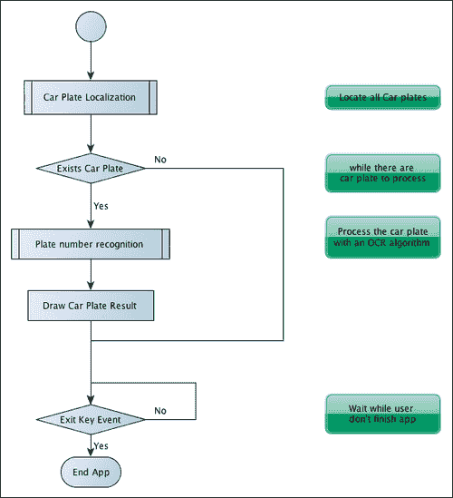
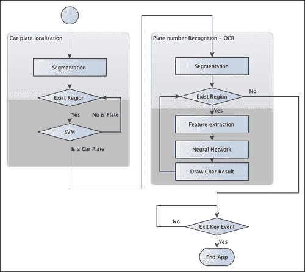
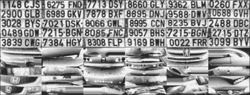
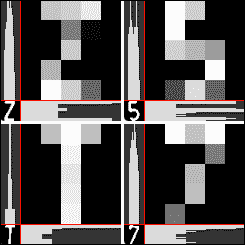
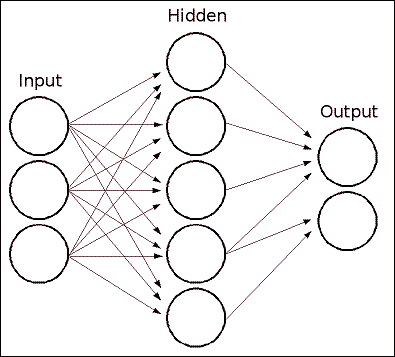
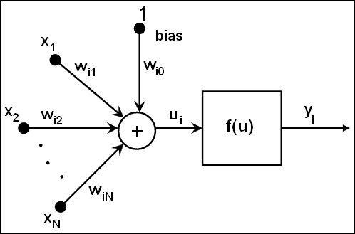
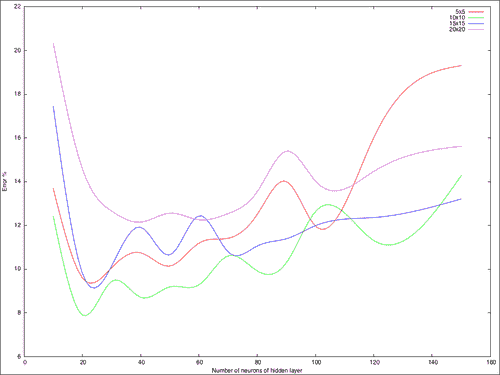

# 五、使用 SVM 和神经网络识别车牌

本章向我们介绍了创建**自动车牌识别**（**ANPR**）应用所需的步骤。 根据不同的情况有不同的方法和技术，例如，IR 摄像机，固定的汽车位置，光线条件等。 我们可以着手构建一个 ANPR 应用，以检测在距离汽车 2-3 米之间，光线不清晰，地面不平行且汽车牌照的透视变形很小的照片中检测汽车牌照的情况。

本章的主要目的是向我们介绍图像分割和特征提取，模式识别基础以及两种重要的模式识别算法**支持向量机**和**人工神经网络**。 在本章中，我们将介绍：

*   ANPR
*   车牌
*   车牌识别

# ANPR 简介

**自动车牌识别**（**ANPR**），也称为**自动车牌识别**（**ALPR**），**自动车辆识别**（**AVI**）或**车牌识别**（**CPR**），是一种使用**光学字符识别**（**OCR**）和其他方法的监视方法，例如分割和检测来读取车辆牌照。

使用**红外**（IR）摄像机可以获得 ANPR 系统中的最佳结果，因为检测和 OCR 分割的分割步骤简单，干净，并最大程度地减少了错误。 这是由于光的规律，最基本的是入射角等于反射角； 当我们看到光滑的表面（例如平面镜）时，我们可以看到这种基本反射。 粗糙表面（例如纸张）的反射会导致一种反射类型，即漫反射或散射反射。 大多数车牌都有一个特殊的特性，称为后向反射-车牌的表面是用一种材料制成的，该材料覆盖了成千上万个微小的半球，导致光被反射回光源，如下图所示：


如果我们使用带滤光片的摄像机和结构化的红外光投影仪，我们可以仅检索红外光，然后就可以分割出非常高质量的图像，随后进行检测并识别与独立于任何光线环境的车牌号码，如下图所示：


在本章中，我们不使用 IR 照片； 我们使用普通照片。 这样做是为了避免获得最佳结果，并获得更高水平的检测错误和更高的错误识别率，这与使用红外热像仪所期望的结果相反； 但是，两者的步骤是相同的​​。

每个国家都有不同的车牌尺寸和规格； 了解这些规格对于获得最佳结果并减少错误很有用。 本章中使用的算法旨在说明 ANPR 的基本知识以及西班牙车牌的规格，但我们可以将其扩展到任何国家或规格。

在本章中，我们将使用西班牙的车牌。 在西班牙，有三种不同尺寸和形状的车牌； 我们将仅使用最常见的（大型）车牌`520 x 110`毫米。 两组字符之间相隔 41 毫米，然后 14 毫米宽将每个字符分开。 第一组字符有四个数字，第二组字符有三个字母，没有元音 A，E，I，O，U，也没有字母 N 或 Q。 所有字符的尺寸均为`520 x 110`毫米。

此数据对于字符分割非常重要，因为我们可以同时检查字符和空格以验证是否得到了字符，而没有其他图像分割。 下图是一个这样的车牌的图：


# ANPR 算法

在解释 ANPR 代码之前，我们需要定义 ANPR 算法中的主要步骤和任务。 ANPR 分为两个主要步骤：印版检测和印版识别。 印版检测的目的是检测印版在整个相机帧中的位置。 当在图像中检测到印版时，将印版段传递到第二步（印版识别），该步骤使用 OCR 算法确定印版上的字母数字字符。

在下图中，我们可以看到两个主要算法步骤，即印版检测和印版识别。 完成这些步骤后，程序会在摄像机帧上绘制已检测到的印版字符。 这些算法可能会返回不良结果，甚至没有结果：



在上图中显示的每个步骤中，我们将定义模式识别算法中常用的三个附加步骤：

1.  **分割**：此步骤检测并移除图像中每个感兴趣的面片/区域。
2.  **特征提取**：此步骤从每个补丁中提取一组特征。
3.  **分类**：此步骤从印版识别步骤中提取每个字符，或在印版检测步骤中将每个图像块分类为“印版”或“无印版”。

下图显示了整个算法应用中的模式识别步骤：



除了主要的应用（其目的是检测和识别汽车的车牌号）之外，我们还将简要说明另外两个通常不解释的任务：

*   如何训练模式识别系统
*   如何评估这样的系统

但是，这些任务比主应用本身更重要，因为如果我们没有正确地训练模式识别系统，我们的系统可能会失败并且无法正常工作； 不同的模式需要不同类型的训练和评估。 我们需要在不同的环境，条件和具有不同功能的情况下评估我们的系统，以获得最佳结果。 这两个任务有时会一起使用，因为不同的功能会产生不同的结果，我们可以在评估部分中看到这些结果。

# 车牌检测

在此步骤中，我们必须检测当前相机帧中的所有印版。 为此，我们将其分为两个主要步骤：分割和分割分类。 由于我们将图像块用作向量特征，因此未解释特征步骤。

在第一步（分段）中，我们应用不同的过滤器，形态运算，轮廓算法和验证来检索图像中可能具有印版的那些部分。

在第二步（分类）中，我们将**支持向量机**（**SVM**）分类器应用于每个图像补丁，即我们的功能。 在创建我们的主要应用之前，我们使用两种不同的类别进行训练：平板和非平板。 我们处理的平行正面彩色图像的宽度为 800 像素，距离汽车 2–4 米。 这些要求对于确保正确的分割很重要。 如果创建多尺度图像算法，则可以执行检测。

在下一个图像中，我们显示了车牌所涉及的所有过程：

*   Sobel 过滤器
*   门限操作
*   紧密的形态学操作
*   一个填充区域的遮罩
*   可能检测到的印有红色标记的板（特征图像）
*   SVM 分类器后检测到的板

    

## 分割

分割是将图像分成多个段的过程。 此过程是为了简化图像以进行分析并使特征提取更加容易。

车牌分割的一个重要特征是，假设图像是正面拍摄的，并且车牌中的垂直边缘数量很多，并且车牌没有旋转并且没有透视失真。 可以在第一个分割步骤中利用此功能，以消除没有任何垂直边缘的区域。

在找到垂直边缘之前，我们需要将彩色图像转换为灰度图像（因为彩色无法帮助我们完成此任务），并消除由相机产生的可能的噪声或其他环境噪声。 我们将应用`5 x 5`的高斯模糊并去除噪声。 如果不采用噪声消除方法，则可能会产生许多垂直边缘，从而导致检测失败。

```cpp
//convert image to gray
Mat img_gray;
cvtColor(input, img_gray, CV_BGR2GRAY);
blur(img_gray, img_gray, Size(5,5));
```

为了找到垂直边缘，我们将使用 Sobel 过滤器并找到第一水平导数。 导数是一个数学函数，它使我们能够找到图像的垂直边缘。 OpenCV 中 Sobel 函数的定义是：

```cpp
void Sobel(InputArray src, OutputArray dst, int ddepth, int xorder, int yorder, int ksize=3, double scale=1, double delta=0, int borderType=BORDER_DEFAULT )
```

在这里，`ddepth`是目标图像深度，`xorder`是`x`的导数阶，`yorder`是`y`的导数阶，`ksize`是 1、3、5 或在图 7 中，`scale`是计算的导数值的可选因子，`delta`是添加到结果中的可选值，`borderType`是像素插值方法。

对于我们的情况，我们可以使用`xorder=1`，`yorder=0`和`ksize=3`：

```cpp
//Find vertical lines. Car plates have high density of vertical lines
Mat img_sobel;
Sobel(img_gray, img_sobel, CV_8U, 1, 0, 3, 1, 0);
```

在 Sobel 过滤器之后，我们应用阈值过滤器来获得具有通过大津方法获得的阈值的二进制图像。大津的算法需要 8 位输入图像，而大津的方法会自动确定最佳阈值：

```cpp
//threshold image
Mat img_threshold;
threshold(img_sobel, img_threshold, 0, 255, CV_THRESH_OTSU+CV_THRESH_BINARY);
```

要在`threshold`函数中定义大津的方法，如果我们将类型参数与`CV_THRESH_OTSU`值组合，则将忽略阈值参数。

### 提示

当定义了`CV_THRESH_OTSU`的值时，阈值函数返回通过大津算法获得的最佳阈值。

通过应用接近的形态学操作，我们可以删除每条垂直边线之间的空白，并连接所有具有大量边的区域。 在此步骤中，我们可能会包含板块。

首先，我们定义要在形态学操作中使用的结构元素。 我们将使用`getStructuringElement`函数定义尺寸为`17 x 3`的结构矩形元素。 其他图像尺寸可能有所不同：

```cpp
Mat element = getStructuringElement(MORPH_RECT, Size(17, 3));
```

并使用`morphologyEx`函数在紧密的形态学操作中使用此结构元素：

```cpp
morphologyEx(img_threshold, img_threshold, CV_MOP_CLOSE, element);
```

应用这些功能后，图像中的区域可能包含印版； 但是，大多数地区不会包含车牌。 这些区域可以通过连接组件分析或使用`findContours`函数进行拆分。 最后一个函数使用不同的方法和结果检索二进制图像的轮廓。 我们只需要获取具有任何层次关系和任何多边形逼近结果的外部轮廓：

```cpp
//Find contours of possibles plates
vector< vector< Point> > contours;
findContours(img_threshold,
            contours,           // a vector of contours
            CV_RETR_EXTERNAL,   // retrieve the external contours
            CV_CHAIN_APPROX_NONE); // all pixels of each contour
```

对于检测到的每个轮廓，提取最小面积的边界矩形。 OpenCV 为此任务打开了`minAreaRect`函数。 此函数返回称为`RotatedRect`的旋转矩形类。 然后在每个轮廓上使用向量迭代器，我们可以得到旋转的矩形并在对每个区域进行分类之前进行一些初步验证：

```cpp
//Start to iterate to each contour found
vector<vector<Point> >::iterator itc= contours.begin();
vector<RotatedRect> rects;

//Remove patch that has  no inside limits of aspect ratio and area.	
while (itc!=contours.end()) {
//Create bounding rect of object
  RotatedRect mr= minAreaRect(Mat(*itc));
  if( !verifySizes(mr)){
    itc= contours.erase(itc);
  }else{
  ++itc;
  rects.push_back(mr);
  }
}
```

我们基于检测到的区域的面积和纵横比进行基本验证。 我们仅认为，如果长宽比约为`520/110 = 4.727272`（板宽除以板高）且误差范围为 40%，且面积至少为 15 个像素，最大为 125，则该区域可以是一个平板高度的像素。 这些值的计算取决于图像尺寸和相机位置：

```cpp
bool DetectRegions::verifySizes(RotatedRect candidate ){

  float error=0.4;
//Spain car plate size: 52x11 aspect 4,7272
  const float aspect=4.7272;
//Set a min and max area. All other patches are discarded
  int min= 15*aspect*15; // minimum area
  int max= 125*aspect*125; // maximum area
//Get only patches that match to a respect ratio.
  float rmin= aspect-aspect*error;
  float rmax= aspect+aspect*error;

  int area= candidate.size.height * candidate.size.width;
  float r= (float)candidate.size.width / (float)candidate.size.height;
  if(r<1)
  r= 1/r;

  if(( area < min || area > max ) || ( r < rmin || r > rmax )){
    return false;
  }else{
  return true;
  }
}
```

我们可以使用车牌的白色背景属性进行更多改进。 所有印版具有相同的背景色，我们可以使用泛洪填充算法来检索旋转的矩形以进行精确裁剪。

修剪车牌的第一步是在最后一个旋转的矩形中心附近获取几粒种子。 然后在宽度和高度之间获得最小的平板尺寸，并使用它在贴片中心附近生成随机种子。

我们要选择白色区域，并且需要多个种子才能触摸至少一个白色像素。 然后，对于每个种子，我们使用`floodFill`函数绘制新的遮罩图像以存储新的最接近的裁剪区域：

```cpp
for(int i=0; i< rects.size(); i++){
//For better rect cropping for each possible box
//Make floodfill algorithm because the plate has white background
//And then we can retrieve more clearly the contour box
circle(result, rects[i].center, 3, Scalar(0,255,0), -1);
//get the min size between width and height
float minSize=(rects[i].size.width < rects[i].size.height)?rects[i].size.width:rects[i].size.height;
minSize=minSize-minSize*0.5;
//initialize rand and get 5 points around center for floodfill algorithm
srand ( time(NULL) );
//Initialize floodfill parameters and variables
Mat mask;
mask.create(input.rows + 2, input.cols + 2, CV_8UC1);
mask= Scalar::all(0);
int loDiff = 30;
int upDiff = 30;
int connectivity = 4;
int newMaskVal = 255;
int NumSeeds = 10;
Rect ccomp;
int flags = connectivity + (newMaskVal << 8 ) + CV_FLOODFILL_FIXED_RANGE + CV_FLOODFILL_MASK_ONLY;
for(int j=0; j<NumSeeds; j++){
  Point seed;
  seed.x=rects[i].center.x+rand()%(int)minSize-(minSize/2);
  seed.y=rects[i].center.y+rand()%(int)minSize-(minSize/2);
  circle(result, seed, 1, Scalar(0,255,255), -1);
  int area = floodFill(input, mask, seed, Scalar(255,0,0), &ccomp,   Scalar(loDiff, loDiff, loDiff), Scalar(upDiff, upDiff, upDiff), flags);
  }
```

`floodFill`函数从种子点开始将具有颜色的连接分量填充到遮罩图像中，并设置要填充的像素与相邻像素或种子像素之间的最大上下亮度/色差：

```cpp
int floodFill(InputOutputArray image, InputOutputArray mask, Point seed, Scalar newVal, Rect* rect=0, Scalar loDiff=Scalar(), Scalar upDiff=Scalar(), int flags=4 )
```

`newVal`参数是我们要在填充时放入图像中的新颜色。 参数`loDiff`和`upDiff` 是要填充的像素与相邻像素或种子像素之间的最大下部和最大上部亮度/色差。

`flag`参数是以下各项的组合：

*   低位：这些位包含函数中使用的连接性值 4（默认值）或 8。 连通性确定要考虑像素的哪个邻居。
*   高位：这些可以是 0 或以下值的组合：`CV_FLOODFILL_FIXED_RANGE`和`CV_FLOODFILL_MASK_ONLY`。

`CV_FLOODFILL_FIXED_RANGE`设置当前像素和种子像素之间的差异。 `CV_FLOODFILL_MASK_ONLY`仅会填充图像遮罩，而不会更改图像本身。

一旦有了裁剪遮罩，就可以从图像遮罩点获得最小面积的矩形，然后再次检查有效尺寸。 对于每个遮罩，一个白色像素获取位置并使用`minAreaRect`函数检索最近的裁剪区域：

```cpp
//Check new floodfill mask match for a correct patch.
//Get all points detected for minimal rotated Rect
vector<Point> pointsInterest;
Mat_<uchar>::iterator itMask= mask.begin<uchar>();
Mat_<uchar>::iterator end= mask.end<uchar>();
for( ; itMask!=end; ++itMask)
  if(*itMask==255)
  pointsInterest.push_back(itMask.pos());
  RotatedRect minRect = minAreaRect(pointsInterest);
  if(verifySizes(minRect)){
…
```

现在，分割过程已经完成，并且我们具有有效的区域，我们可以裁剪每个检测到的区域，删除任何可能的旋转，裁剪图像区域，调整图像大小，并均衡裁剪图像区域的光。

首先，我们需要使用`getRotationMatrix2D`生成变换矩阵，以去除检测区域中可能的旋转。 我们需要注意高度，因为`RotatedRect`类可以返回并旋转 90 度，所以我们必须检查矩形的宽高比，如果小于 1，则将其旋转 90 度：

```cpp
//Get rotation matrix
float r= (float)minRect.size.width / (float)minRect.size.height;
float angle=minRect.angle;
if(r<1)
  angle=90+angle;
  Mat rotmat= getRotationMatrix2D(minRect.center, angle,1);
```

使用变换矩阵，我们现在可以使用`warpAffine`函数通过仿射变换（几何中的仿射变换是将平行线转换为平行线的变换）旋转输入图像，在其中设置输入图像和目标图像 ，转换矩阵，输出大小（与本例中的输入相同）以及要使用的插值方法。 如果需要，我们可以定义`border`方法和`border`值：

```cpp
//Create and rotate image
Mat img_rotated;
warpAffine(input, img_rotated, rotmat, input.size(), CV_INTER_CUBIC);
```

旋转图像后，我们使用`getRectSubPix`裁剪图像，裁剪并复制以点为中心的给定宽度和高度的图像部分。 如果图像已旋转，则需要使用 C++ `swap`函数更改宽度和高度大小。

```cpp
//Crop image
Size rect_size=minRect.size;
if(r < 1)
swap(rect_size.width, rect_size.height);
Mat img_crop;
getRectSubPix(img_rotated, rect_size, minRect.center, img_crop);
```

裁剪的图像尺寸不一样，因此不适用于训练和分类。 而且，每个图像包含不同的光照条件，从而增加了它们的相对差异。 为了解决这个问题，我们将所有图像调整为相同的宽度和高度，并应用光直方图均衡化：

```cpp
Mat resultResized;
resultResized.create(33,144, CV_8UC3);
resize(img_crop, resultResized, resultResized.size(), 0, 0, INTER_CUBIC);
//Equalize cropped image
Mat grayResult;
cvtColor(resultResized, grayResult, CV_BGR2GRAY);
blur(grayResult, grayResult, Size(3,3));
equalizeHist(grayResult, grayResult);

```

对于每个检测到的区域，我们将裁剪后的图像及其位置存储在向量中：

```cpp
output.push_back(Plate(grayResult,minRect.boundingRect()));
```

## 分类

在预处理并分割图像的所有可能部分之后，我们现在需要确定每个分割段是否是（或不是）车牌。 为此，我们将使用**支持向量机**（**SVM**）算法。

支持向量机是一种模式识别算法，包含在最初为二分类创建的一系列监督学习算法中。 监督学习是一种机器学习算法，它通过使用标记的数据来学习。 我们需要使用标记的大量数据来训练算法； 每个数据集都需要有一个类。

SVM 创建一个或多个用于区分数据每一类的超平面。

经典示例是定义两个类的 2D 点集。 SVM 搜索可区分每个类别的最佳行：


分类之前的首要任务是训练我们的分类器。 这项工作是在开始主应用之前完成的，它被称为离线训练。 这不是一件容易的事，因为它需要足够的数据量来训练系统，但是更大的数据集并不总是意味着最好的结果。 在我们的情况下，由于没有公共车牌数据库，我们没有足够的数据。 因此，我们需要拍摄数百张汽车照片，然后预处理并分割所有照片。

我们用 75 张车牌图像和 35 张不带`144 x 33`像素车牌的图像训练了我们的系统。 我们可以在下图中看到此数据的样本。 这不是一个很大的数据集，但足以满足我们的要求。 在实际应用中，我们需要训练更多数据：



为了轻松了解机器学习的工作原理，我们继续使用分类器算法的图像像素功能（请记住，有更好的方法和功能来训练 SVM，例如主成分分析，傅立叶变换， 纹理分析等）。

我们需要使用`DetectRegions`类创建图像来训练我们的系统，并将`savingRegions`变量设置为`true`，以保存图像。 我们可以使用`segmentAllFiles.sh` bash 脚本对文件夹下的所有图像文件重复该过程。 可以从本书的源代码中获取。

为了简化操作，我们将所有经过处理和准备的图像训练数据存储到 XML 文件中，以直接与 SVM 功能一起使用。 `trainSVM.cpp`应用使用文件夹和图像文件数量创建此文件。

### 提示

带有机器学习 OpenCV 算法的训练数据存储在`N`x`M`矩阵中，并具有`N`个样本和`M`特征。 每个数据集在训练矩阵中保存为一行。

这些类别存储在`N x 1`大小的另一个矩阵中，其中每个类别均由浮点数标识。

OpenCV 使用`FileStorage`类可以轻松地管理 XML 或 JSON 格式的数据文件，该类使我们可以存储和读取 OpenCV 变量和结构或自定义变量。 使用此功能，我们可以读取训练数据矩阵和训练类并将其保存在`SVM_TrainingData`和`SVM_Classes`中：

```cpp
FileStorage fs;
fs.open("SVM.xml", FileStorage::READ);
Mat SVM_TrainingData;
Mat SVM_Classes;
fs["TrainingData"] >> SVM_TrainingData;
fs["classes"] >> SVM_Classes;
```

现在我们需要设置 SVM 参数，这些参数定义了在 SVM 算法中使用的基本参数。 我们将使用`CvSVMParams`结构进行定义。 它是对训练数据的映射，以提高其与线性可分离数据集的相似度。 该映射包括增加数据的维数，并使用内核函数有效地完成了映射。 我们在这里选择`CvSVM::LINEAR`类型，这意味着没有映射完成：

```cpp
//Set SVM params
CvSVMParams SVM_params;
SVM_params.kernel_type = CvSVM::LINEAR;
```

然后，我们创建并训练分类器。 OpenCV 为支持向量机算法定义了`CvSVM`类，我们使用训练数据，类和参数数据对其进行初始化：

```cpp
CvSVM svmClassifier(SVM_TrainingData, SVM_Classes, Mat(), Mat(), SVM_params);
```

我们的分类器已准备好使用 SVM 类的`predict`函数来预测可能的裁剪图像； 此函数返回类标识符`i`。 在我们的案例中，我们将板级标记为`1`，而没有板级标记为`0`。 然后，对于每个可能是板块的检测区域，我们使用 SVM 将其分类为板块或无板块，并仅保存正确的响应。 以下代码是主应用的一部分，称为在线处理：

```cpp
vector<Plate> plates;
for(int i=0; i< possible_regions.size(); i++)
{
  Mat img=possible_regions[i].plateImg;
  Mat p= img.reshape(1, 1);//convert img to 1 row m features
  p.convertTo(p, CV_32FC1);
 int response = (int)svmClassifier.predict( p );
  if(response==1)
    plates.push_back(possible_regions[i]);
}
```

# 车牌识别

车牌识别的第二步旨在通过光学字符识别来检索牌照的字符。 对于每个检测到的印版，我们继续对每个字符的印版进行分割，并使用**人工神经网络**（**ANN**）机器学习算法来识别字符。 同样在本节中，我们将学习如何评估分类算法。

## OCR 分割

首先，我们获得一个板块图像斑块，作为具有均等直方图的分割 OCR 函数的输入，然后我们需要应用阈值过滤器并将此阈值图像用作**查找轮廓**算法的输入； 我们可以在下图中看到这个过程：


此分割过程的编码为：

```cpp
Mat img_threshold;
threshold(input, img_threshold, 60, 255, CV_THRESH_BINARY_INV);
if(DEBUG)
  imshow("Threshold plate", img_threshold);
Mat img_contours;
img_threshold.copyTo(img_contours);
//Find contours of possibles characters
vector< vector< Point> > contours;
findContours(img_contours,
            contours,            // a vector of contours
            CV_RETR_EXTERNAL,    // retrieve the external contours
            CV_CHAIN_APPROX_NONE); // all pixels of each contour
```

我们使用`CV_THRESH_BINARY_INV`参数通过将白色输入值变为黑色并将黑色输入值变为白色来反转阈值输出。 这是获取每个字符的轮廓所必需的，因为轮廓算法会寻找白色像素。

对于每个检测到的轮廓，我们可以进行尺寸验证，并删除尺寸较小或外观不正确的所有区域。 在我们的案例中，字符的宽高比为 45/77，对于旋转或扭曲的字符，我们可以接受 35% 的宽高比错误。 如果面积大于 80%，则认为该区域是黑色块，而不是字符。 为了计算面积，我们可以使用`countNonZero`函数来计算值大于 0 的像素数：

```cpp
bool OCR::verifySizes(Mat r)
{
  //Char sizes 45x77
  float aspect=45.0f/77.0f;
  float charAspect= (float)r.cols/(float)r.rows;
  float error=0.35;
  float minHeight=15;
  float maxHeight=28;
  //We have a different aspect ratio for number 1, and it can be  
  //~0.2
  float minAspect=0.2;
  float maxAspect=aspect+aspect*error;
  //area of pixels
  float area=countNonZero(r);
  //bb area
  float bbArea=r.cols*r.rows;
  //% of pixel in area
  float percPixels=area/bbArea;
  if(percPixels < 0.8 && charAspect > minAspect && charAspect <
  maxAspect && r.rows >= minHeight && r.rows < maxHeight)
  return true;
  else
  return false;
}
```

如果验证了分段的字符，我们必须对其进行预处理以为所有字符设置相同的大小和位置，并将其保存在带有辅助`CharSegment`类的向量中。 此类保存分段的字符图像和需要排序字符的位置，因为“查找轮廓”算法不会按要求的顺序返回轮廓。

## 特征提取

分割每个字符的下一步是提取用于训练和分类人工神经网络算法的特征。

与 SVM 中使用的印版检测特征提取步骤不同，我们不使用所有图像像素；而是使用所有图像像素。 我们将应用在光学字符识别中使用的更多常见功能，包括水平和垂直累积直方图和低分辨率图像样本。 我们可以在下一张图像中更形象地看到此功能，其中每个图像的分辨率均为`5 x 5`，并且直方图会累加：



对于每个字符，我们使用`countNonZero`函数对具有非零值的行或列中的像素数进行计数，并将其存储在名为`mhist`的新数据矩阵中。 我们通过使用`minMaxLoc`函数在数据矩阵中查找最大值来对其进行归一化，然后通过`convertTo`函数将`mhist`的所有元素除以最大值。 我们创建`ProjectedHistogram`函数来创建累积直方图，这些直方图具有输入的二进制图像和所需的直方图类型（水平或垂直）：

```cpp
Mat OCR::ProjectedHistogram(Mat img, int t)
{
  int sz=(t)?img.rows:img.cols;
  Mat mhist=Mat::zeros(1,sz,CV_32F);

  for(int j=0; j<sz; j++){
    Mat data=(t)?img.row(j):img.col(j);
    mhist.at<float>(j)=countNonZero(data);
  }

//Normalize histogram
double min, max;
minMaxLoc(mhist, &min, &max);

if(max>0)
  mhist.convertTo(mhist,-1 , 1.0f/max, 0);

  return mhist;
}
```

其他功能使用低分辨率样本图像。 而不是使用整个字符图像，我们创建一个低分辨率字符，例如`5 x 5`。我们用`5 x 5`、`10 x 10`、`15 x 15`和`20 x 20`个字符训练系统，然后评估哪个字符返回最佳结果，以便我们可以在系统中使用它。 一旦拥有所有功能，就可以按行创建`M`列的矩阵，其中这些列是特征：

```cpp
Mat OCR::features(Mat in, int sizeData)
{
//Histogram features
 Mat vhist=ProjectedHistogram(in,VERTICAL);
 Mat hhist=ProjectedHistogram(in,HORIZONTAL);
//Low data feature
 Mat lowData;
 resize(in, lowData, Size(sizeData, sizeData) );
  int numCols=vhist.cols + hhist.cols + lowData.cols * 
  lowData.cols;
  Mat out=Mat::zeros(1,numCols,CV_32F);
  //Assign values to feature
  int j=0;
  for(int i=0; i<vhist.cols; i++)
  {
    out.at<float>(j)=vhist.at<float>(i); 
    j++;
  }
  for(int i=0; i<hhist.cols; i++)
  {
  out.at<float>(j)=hhist.at<float>(i);
  j++;
  }
  for(int x=0; x<lowData.cols; x++)
  {
    for(int y=0; y<lowData.rows; y++)
    {
      out.at<float>(j)=(float)lowData.at<unsigned char>(x,y);
      j++;
    }
  }
  return out;
}
```

## OCR 分类

在分类步骤中，我们使用人工神经网络机器学习算法。 更具体地说，**多层感知器**（**MLP**）是最常用的 ANN 算法。

MLP 由具有输入层，输出层和一个或多个隐藏层的神经元网络组成。 每一层都有一个或多个与上一层和下一层相连的神经元。

以下示例表示一个 3 层感知器（它是将实值向量输入映射到单个二进制值输出的二分类器），具有 3 个输入，2 个输出以及包含 5 个神经元的隐藏层：



MLP 中的所有神经元都是相似的，每个神经元都有多个输入（前一个链接的神经元）和几个具有相同值的输出链接（下一个链接的神经元）。 每个神经元将输出值计算为加权输入加上偏差项的总和，并通过选定的激活函数进行转换：



有三种广泛使用的激活函数：身份，Sigmoid 和高斯函数； 最常见和默认的激活功能是 Sigmoid 功能。 它的 alpha 和 beta 值设置为 1：


经 ANN 训练的网络具有具有特征的输入向量。 它将值传递到隐藏层，并使用权重和激活函数计算结果。 它将输出传递到更下游，直到获得具有神经元类数量的输出层。

通过训练 ANN 算法来计算和学习每层，突触和神经元的权重。 为了训练我们的分类器，我们像在 SVM 训练中一样创建了两个数据矩阵，但是训练标签有些不同。 我们使用标签编号标识符代替`N x 1`矩阵，其中`N`代表训练数据行，而 1 为列。 我们必须创建一个`N x M`矩阵，其中`N`是训练/样本数据，`M`是类别（10 个数字和 20 个字母），如果我们将数据行`i`归类为`j`，将位置`(i, j)`设为 1。


我们创建`OCR::train`函数，以创建所有需要的矩阵，并使用训练数据矩阵，类矩阵以及隐藏层中的隐藏神经元数量来训练我们的系统。 就像我们进行 SVM 训练一样，从 XML 文件加载训练数据。

我们必须定义每层神经元的数量以初始化 ANN 类。 对于我们的示例，我们仅使用一个隐藏层，然后定义一个 1 行 3 列的矩阵。 第一列位置是特征的数量，第二列位置是隐藏层中隐藏的神经元的数量，第三列位置是类别的数量。

OpenCV 为 ANN 定义了一个`CvANN_MLP`类。 使用`create`函数，我们可以通过定义层和神经元的数量，激活函数以及`alpha`和`beta`参数来启动类：

```cpp
void OCR::train(Mat TrainData, Mat classes, int nlayers)
{
  Mat layerSizes(1,3,CV_32SC1);
  layerSizes.at<int>(0)= TrainData.cols;
  layerSizes.at<int>(1)= nlayers;
  layerSizes.at<int>(2)= numCharacters;
  ann.create(layerSizes, CvANN_MLP::SIGMOID_SYM, 1, 1); //ann is  
  global class variable

  //Prepare trainClasses
  //Create a mat with n trained data by m classes
  Mat trainClasses;
  trainClasses.create( TrainData.rows, numCharacters, CV_32FC1 );
  for( int i = 0; i <  trainClasses.rows; i++ )
  {
    for( int k = 0; k < trainClasses.cols; k++ )
    {
    //If class of data i is same than a k class
    if( k == classes.at<int>(i) )
    trainClasses.at<float>(i,k) = 1;
    else
    trainClasses.at<float>(i,k) = 0;
    }
  }
  Mat weights( 1, TrainData.rows, CV_32FC1, Scalar::all(1) );

  //Learn classifier
  ann.train( TrainData, trainClasses, weights );
  trained=true;
}
```

训练后，我们可以使用`OCR::classify`函数对任何分割的板特征进行分类：

```cpp
int OCR::classify(Mat f)
{
  int result=-1;
  Mat output(1, numCharacters, CV_32FC1);
 ann.predict(f, output);
  Point maxLoc;
  double maxVal;
 minMaxLoc(output, 0, &maxVal, 0, &maxLoc);
  //We need to know where in output is the max val, the x (cols) is 
  //the class.

  return maxLoc.x;
}
```

`CvANN_MLP`类使用`predict`函数对类中的特征向量进行分类。 与 SVM `classify`函数不同，ANN 的`predict`函数返回一行，其大小等于类的数量，并且有可能属于每个类的输入特征。

为了获得最佳结果，我们可以使用`minMaxLoc`函数来获取最大和最小响应以及矩阵中的位置。 我们字符的类别由较高值的 x 位置指定：


为了完成检测到的每个板子，我们使用`Plate`类的`str()`函数排序其字符并返回一个字符串，然后可以将其绘制在原始图像上：

```cpp
string licensePlate=plate.str();
rectangle(input_image, plate.position, Scalar(0,0,200));
putText(input_image, licensePlate, Point(plate.position.x, plate.position.y), CV_FONT_HERSHEY_SIMPLEX, 1, Scalar(0,0,200),2);
```

## 评估

我们的项目已经完成，但是当我们训练像 OCR 这样的机器学习算法时，我们需要知道要使用的最佳功能和参数，以及如何纠正系统中的分类，识别和检测错误。

我们需要用不同的情况和参数评估系统，评估产生的误差，并获得使这些误差最小化的最佳参数。

在本章中，我们使用以下变量评估了 OCR 任务：低分辨率图像特征的大小以及隐藏层中隐藏神经元的数量。

我们创建了`evalOCR.cpp`应用，在其中使用了`trainOCR.cpp`应用生成的 XML 训练数据文件。 `OCR.xml`文件包含针对`5 x 5`、`10 x 10`、`15 x 15`和`20 x 20`下采样图像特征的训练数据矩阵。

```cpp
Mat classes;
Mat trainingData;
//Read file storage.
FileStorage fs;
fs.open("OCR.xml", FileStorage::READ);
fs[data] >> trainingData;
fs["classes"] >> classes;
```

评估应用获取每个降采样的矩阵特征，并获取 100 个随机行进行训练，以及其他行以测试 ANN 算法并检查错误。

在训练系统之前，我们测试每个随机样本并检查响应是否正确。 如果响应不正确，我们将增加错误计数器变量，然后除以要评估的样本数。 这表示使用随机数据进行训练时，错误率介于 0 和 1 之间：

```cpp
float test(Mat samples, Mat classes)
{
  float errors=0;
  for(int i=0; i<samples.rows; i++)
  {
    int result= ocr.classify(samples.row(i));
    if(result!= classes.at<int>(i))
    errors++;
  }
  return errors/samples.rows;
}
```

应用返回每个样本大小的输出命令行错误率。 为了获得良好的评估，我们需要使用不同的随机训练行来训练应用； 这会产生不同的测试误差值，然后我们可以将所有误差相加并取平均值。 为此，我们创建以下`bash` Unix 脚本以使其自动化：

```cpp
#!/bin/bash
echo "#ITS \t 5 \t 10 \t 15 \t 20" > data.txt
folder=$(pwd)

for numNeurons in 10 20 30 40 50 60 70 80 90 100 120 150 200 500
do
  s5=0;
  s10=0;
  s15=0;
  s20=0;
  for j  in {1..100}
  do
    echo $numNeurons $j
    a=$($folder/build/evalOCR $numNeurons TrainingDataF5)
    s5=$(echo "scale=4; $s5+$a" | bc -q 2>/dev/null)

    a=$($folder/build/evalOCR $numNeurons TrainingDataF10)
    s10=$(echo "scale=4; $s10+$a" | bc -q 2>/dev/null)

    a=$($folder/build/evalOCR $numNeurons TrainingDataF15)
    s15=$(echo "scale=4; $s15+$a" | bc -q 2>/dev/null)

    a=$($folder/build/evalOCR $numNeurons TrainingDataF20)
    s20=$(echo "scale=4; $s20+$a" | bc -q 2>/dev/null)
  done

  echo "$i \t $s5 \t $s10 \t $s15 \t $s20"
  echo "$i \t $s5 \t $s10 \t $s15 \t $s20" >> data.txt
done
```

该脚本保存了`data.txt`文件，其中包含每种尺寸和神经元隐藏层号的所有结果。 该文件可用于使用 Gnuplot 进行绘图。 我们可以在下图中看到结果：



我们可以看到的最低误差在 8% 以下，并且在隐藏层中使用了 20 个神经元，并且从缩小的`10 x 10`图像补丁中提取了字符的特征。

# 总结

在本章中，我们学习了自动车牌识别程序的工作方式，以及它的两个重要步骤：车牌定位和车牌识别。

在第一步中，我们学习了如何分割图像以寻找可以放置印版的补丁，以及如何使用简单的试探法和支持向量机算法对没有印版的印版进行二分类。

在第二步中，我们学习了如何使用“查找轮廓”算法进行分割，从每个字符中提取特征向量，以及如何使用人工神经网络对字符类中的每个特征进行分类。

我们还学习了如何通过使用随机样本进行训练来评估机器算法，以及如何使用不同的参数和功能对其进行评估。