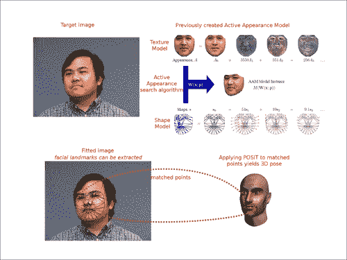
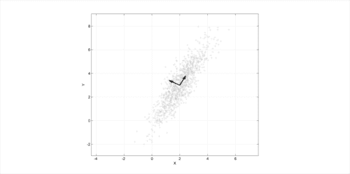
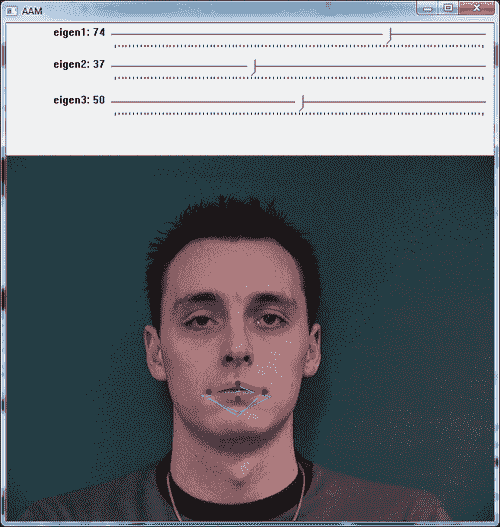
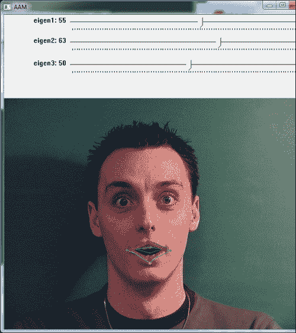
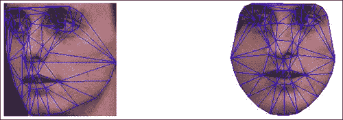
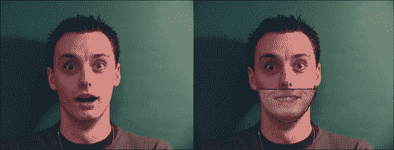
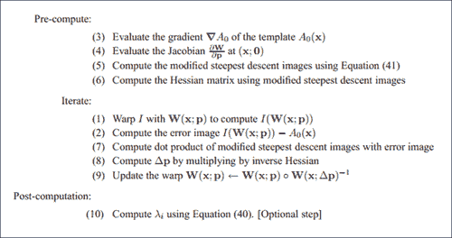
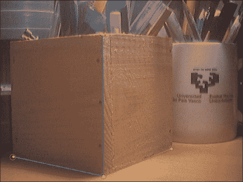
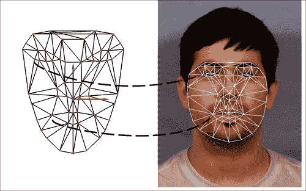

# 第 7 章。使用 AAM 和 POSIT 进行 3D 头部姿势估计

一个好的计算机视觉算法如果没有强大的强大功能以及广泛的概括性和扎实的数学基础，就不可能完成。 所有这些功能都伴随着 Tim Cootes 主要用 Active Appearance Models 开发的工作。 本章将教您如何使用 OpenCV 创建自己的 **活动外观模型**，以及如何使用它来搜索模型在给定框架中的最近位置。 此外，您还将学习如何使用 POSIT 算法以及如何在“摆姿势”的图像中拟合 3D 模型。 使用所有这些工具，您将能够实时跟踪视频中的 3D 模型。 这不是很好吗？ 尽管示例着重于头部姿势，但实际上任何可变形模型都可以使用相同的方法。

阅读各节时，您会遇到以下主题：

*   主动外观模型概述
*   活动形状模型概述
*   模型实例化-与 Active Appearance 模型一起玩
*   AAM 搜索和拟合
*   断定

以下列表解释了本章将要遇到的术语：

*   **活动外观模型**（ **AAM** ）：包含其形状和纹理的统计信息的对象模型。 这是一种捕获对象形状和纹理变化的有效方法。
*   **活动形状模型**（ **ASM** ）：对象形状的统计模型。 这对于学习形状变化非常有用。
*   **主成分分析**（ **PCA** ）：正交线性变换，将数据转换为新的坐标系，从而使任何数据投影的最大方差都位于第一个坐标上 （称为第一个主成分），第二个坐标上的第二大方差，依此类推。 此过程通常用于降维。 在减小原始问题的范围时，可以使用一种更快拟合的算法。
*   **Delaunay 三角剖分（DT）** ：对于平面中的一组 P 点，是三角剖分，因此 P 中的任何点都不在三角剖分中任何三角形的外接圆之内。 它倾向于避免骨感三角形。 纹理映射需要三角剖分。
*   **仿射变换**：可以以矩阵乘法和矢量加法形式表示的任何变换。 这可以用于纹理映射。
*   **正交拼写和缩放比例的姿势**（ **POSIT** ）：一种执行 3D 姿势估计的计算机视觉算法。

# 主动外观模型概述

简而言之，Active Appearance Models 是结合了纹理和形状的模型参数化，再加上有效的搜索算法，该算法可以准确指出模型在图片框中的位置和位置。 为此，我们将从 *Active Shape Models* 部分开始，将看到它们与界标位置更紧密相关。 以下各节将更好地描述主成分分析和一些动手经验。 然后，我们将能够从 OpenCV 的 Delaunay 函数中获得一些帮助，并学习一些三角剖分。 从那时起，我们将逐步发展到在三角形纹理扭曲部分中应用分段仿射扭曲，在该部分中我们可以从对象的纹理中获取信息。

当我们有足够的背景知识来建立一个好的模型时，我们可以使用模型实例化部分中的技术。 然后，我们将能够通过 AAM 搜索和拟合来解决逆问题。 这些本身对于 2D 甚至 3D 图像匹配而言已经是非常有用的算法。 但是，当一个人能够使它工作时，为什么不将其桥接到 **POSIT** （正交学和迭代法缩放中的**姿势），这是另一种用于 3D 模型拟合的坚如磐石的算法？ 进入 POSIT 部分将为我们提供足够的背景知识，以便在 OpenCV 中使用它，然后在下一部分中，我们将学习如何将头部模型与其耦合。 这样，我们可以使用 3D 模型来拟合已经匹配的 2D 框架。 而且，如果敏锐的读者想知道这将带给我们什么，这仅仅是将 AAM 和 Posit 逐帧组合起来，以通过检测变形模型获得实时 3D 跟踪的问题！ 这些详细信息将在“从网络摄像头或视频文件进行跟踪”部分中介绍。**

据说一张图片值一千字； 假设我们得到 *N* 张图片。 这样，我们之前提到的内容可以在以下屏幕截图中轻松找到：



**本章算法的概述**：给定一个图像（前面的屏幕快照中的左上方图像），我们可以使用主动外观搜索算法来找到人头的 2D 姿势。 屏幕快照的右上图显示了在搜索算法中使用的先前训练的 Active Appearance 模型。 找到姿势后，可以应用 POSIT 将结果扩展到 3D 姿势。 如果将该程序应用于视频序列，则将通过检测获得 3D 跟踪。

# 活动形状模型

如前所述，AAM 需要一个形状模型，而此角色由 Active Shape Models（ASM）扮演。 在接下来的部分中，我们将创建一个 ASM，它是形状变化的统计模型。 形状模型是通过形状变化的组合生成的。 如 Timothy Cootes 的文章*有效形状模型–它们的训练和应用*中所述，需要一组带有标签的图像的训练。 为了构建脸部形状模型，需要在脸部关键位置标记几个点的图像来概述主要特征。 以下屏幕截图显示了这样的示例：


脸部有 76 个地标，取自 MUCT 数据集。 这些地标通常是用手工标记的，它们概述了一些面部特征，例如嘴轮廓，鼻子，眼睛，眉毛和面部形状，因为它们更易于跟踪。

### 注意

**Procrustes Analysis** ：一种统计形状分析的形式，用于分析一组形状的分布。 通过优化平移，旋转和均匀缩放对象来执行 Procrustes 叠加。

如果我们具有前面提到的图像集，则可以生成形状变化的统计模型。 由于对象上的标记点描述了该对象的形状，因此，如果需要，我们首先使用 Procrustes Analysis 将所有点集对齐到坐标系中，并通过 *x* 向量表示每种形状。 然后，我们对数据应用主成分分析（PCA）。 然后，我们可以使用以下公式近似任何示例：

x = x + ps bs

在前面的公式中， *x* 是平均形状， *Ps* 是一组正交变化模式， *bs* 是一组形状参数。 好吧，为了更好地理解它，我们将在本节的其余部分中创建一个简单的应用程序，该应用程序将向我们展示如何处理 PCA 和形状模型。

为什么要完全使用 PCA？ 因为 PCA 在减少模型参数数量方面将真正为我们提供帮助。 在本章的后面，我们还将看到在给定图像中进行搜索时有多大帮助。 应当为以下引用提供一个网页 URL（ [http://en.wikipedia.org/wiki/Principal_component_analysis](http://en.wikipedia.org/wiki/Principal_component_analysis) ）：

> PCA 可以为用户提供较低维度的图片，即从其（在某种意义上）信息最丰富的角度查看时该对象的“阴影”。 这是通过仅使用前几个主要成分来完成的，从而降低了转换数据的维数。

当我们看到如下屏幕截图时，这一点变得很清楚：



图片来源： [http://en.wikipedia.org/wiki/File:GaussianScatterPCA.png](http://en.wikipedia.org/wiki/File:GaussianScatterPCA.png)

前面的屏幕截图显示了以（2,3）为中心的多元高斯分布的 PCA。 所示的向量是协方差矩阵的特征向量，它们经过偏移，因此其尾部位于均值处。

这样，如果我们想用一个参数来表示模型，那么从特征向量指向屏幕截图右上角的方向是一个好主意。 此外，通过稍微改变参数，我们可以推断数据并获得与所需值相似的值。

## 感受 PCA

为了了解 PCA 如何帮助我们改善脸部模型，我们将从活动形状模型开始并测试一些参数。

由于面部检测和跟踪已经研究了一段时间，因此可以在线使用多个面部数据库进行研究。 我们将使用 IMM 数据库中的几个样本。

首先，让我们了解一下 PCA 类在 OpenCV 中的工作方式。 我们可以从文档中得出结论，PCA 类用于计算向量集的特殊基础，该向量集由从向量输入集计算出的协方差矩阵的特征向量组成。 此类还可以使用`project`和`backproject`方法在新的坐标空间之间来回转换矢量。 通过仅采用其前几个分量，就可以非常精确地近似此新坐标系。 这意味着我们可以用高得多的空间表示原始向量，而该向量要短得多，该向量由子空间中投影向量的坐标组成。

由于我们希望根据几个标量值进行参数化，因此我们将在类中使用的主要方法是`backproject`方法。 它采用投影矢量的主成分坐标并重建原始矢量。 如果保留所有分量，我们可以检索原始向量，但如果仅使用几个分量，则差异将很小。 这是使用 PCA 的原因之一。 由于我们希望原始向量周围有一些可变性，因此我们的参数化标量将能够外推原始数据。

此外，PCA 类可以将向量与基础定义的新坐标空间进行相互转换。 从数学上讲，这意味着我们可以将向量投影到一个子空间，该子空间由与协方差矩阵的主要特征值相对应的几个特征向量组成，正如从文档中可以看到的那样。

我们的方法是用地标标注人脸图像，从而为我们的**点分布模型**（ **PDM** ）设置训练集。 如果我们在二维中具有 *k* 对齐的界标，则我们的形状描述将变为：

X = {x1，y1，x2，y2，…，xk，yk}

重要的是要注意，我们需要在所有图像样本之间进行一致的标记。 因此，例如，如果嘴巴的左部分在第一个图像中是界标编号 *3* ，则在所有其他图像中都将是编号 *3* 。

这些地标序列现在将形成形状轮廓，并且可以将给定的训练形状定义为矢量。 我们通常假定此散射在该空间中是高斯分布，并且我们使用 PCA 计算所有训练形状上的归一化特征向量和协方差矩阵的特征值。 使用顶部中心特征向量，我们创建尺寸为 *2k * m* 的矩阵，我们将其称为 *P* 。 这样，每个特征向量都描述了沿集合的主要变化模式。

现在，我们可以通过以下公式定义新形状：

X'= X'+铅

在这里， *X'*是所有训练图像上的平均形状-我们只是对每个界标进行平均- *b* 是每个主成分的缩放值向量。 这导致我们创建一个修改 *b* 值的新形状。 通常将 *b* 设置为在三个标准偏差内变化，以便生成的形状可以落入训练集中。

以下屏幕截图显示了三张不同图片的带点注释的嘴部界标：


从前面的屏幕快照中可以看出，形状由其界标序列描述。 可以使用 GIMP 或 ImageJ 之类的程序，也可以在 OpenCV 中构建一个简单的应用程序，以便对训练图像进行注释。 我们将假定用户已完成此过程，并将所有训练图像的点以 *x* 和 *y* 界标位置的顺序保存在文本文件中，这将在我们的 PCA 分析中使用 。 然后，我们将两个参数添加到该文件的第一行，即训练图像的数量和读取的列的数量。 因此，对于 *k* 2D 点，该数字将为 *2 * k* 。

在以下数据中，我们有此文件的实例，该文件是通过从 IMM 数据库中注释三张图像获得的，其中 *k* 等于 5：

```cpp
3 10
265 311 303 321 337 310 302 298 265 311
255 315 305 337 346 316 305 309 255 315
262 316 303 342 332 315 298 299 262 316
```

现在我们已经为图像添加了注释，让我们将这些数据转换为形状模型。 首先，将该数据加载到矩阵中。 这将通过功能`loadPCA`实现。 以下代码段显示了`loadPCA`函数的用法：

```cpp
PCA loadPCA(char* fileName, int& rows, int& cols,Mat& pcaset){
  FILE* in = fopen(fileName,"r");
  int a;
  fscanf(in,"%d%d",&rows,&cols);

  pcaset = Mat::eye(rows,cols,CV_64F);
  int i,j;

  for(i=0;i<rows;i++){
    for(j=0;j<cols;j++){
      fscanf(in,"%d",&a);
      pcaset.at<double>(i,j) = a;
    }
  }

  PCA pca(pcaset, // pass the data
    Mat(), // we do not have a pre-computed mean vector,
    // so let the PCA engine compute it
    CV_PCA_DATA_AS_ROW, // indicate that the vectors
    // are stored as matrix rows
    // (use CV_PCA_DATA_AS_COL if the vectors are
    // the matrix columns)
    pcaset.cols// specify, how many principal components to retain
    );
  return pca;
}
```

请注意，我们的矩阵是在`pcaset = Mat::eye(rows,cols,CV_64F)`行中创建的，并且为 *2 * k* 值分配了足够的空间。 在两个用于的*循环将数据加载到矩阵中之后，如果我们希望只创建一次，则用数据（一个空矩阵）调用 PCA 构造函数，该矩阵可以是我们预先计算的均值向量。 我们还指出，向量将存储为矩阵行，并且我们希望将给定的行数与组件数保持相同，尽管我们可以只使用少数几个。*

现在我们已经用训练集填充了 PCA 对象，它具有根据给定参数对形状进行背投影所需的一切。 为此，我们调用`PCA.backproject`，将参数作为行向量传递，并将反投影的向量接收到第二个参数中。





前两个截屏根据从滑块选择的所选参数显示了两种不同的形状配置。 黄色和绿色形状显示训练数据，而红色形状反映从所选参数生成的形状。

样本程序可用于试验活动形状模型，因为它允许用户为模型尝试不同的参数。 可以注意到，通过滑块仅改变前两个标量值（对应于第一和第二变化模式），我们可以获得的形状非常接近于受过训练的形状。 这种可变性在 AAM 中搜索模型时会有所帮助，因为它提供了插值形状。 在以下各节中，我们将讨论三角剖分，纹理化，AAM 和 AAM 搜索。

## 三角剖分

由于我们正在寻找的形状可能会变形，例如张开嘴，因此我们需要将纹理映射回平均形状，然后将 PCA 应用于此归一化纹理。 为此，我们将使用三角剖分。 这个概念非常简单：我们将创建包含注释点的三角形，然后从一个三角形映射到另一个三角形。 OpenCV 带有一个方便的函数`cvCreateSubdivDelaunay2D`，该函数创建一个空的 Delaunay 三角剖分。 您可以认为这是一个很好的三角剖分方法，可以避免出现三角形。

### 注意

在数学和计算几何学中，平面中点集 *P* 的 **Delaunay 三角剖分**是三角剖分 DT（P），因此 *P [* 位于 DT（P）中任何三角形的外接圆之内。 Delaunay 三角剖分将三角剖分中所有三角形的最小角度最大化。 他们倾向于避免瘦三角形。 三角剖分以 Boris Delaunay 的名字命名，因为他从 1934 年开始就此主题开展工作。

初始化 Delaunay 细分后，将使用`cvSubdivDelaunay2DInsert`将点填充到该细分中。 以下代码行将阐明直接使用三角剖分会是什么样子：

```cpp
CvMemStorage* storage;
CvSubdiv2D* subdiv;
CvRect rect = { 0, 0, 640, 480 };

storage = cvCreateMemStorage(0);
subdiv = cvCreateSubdivDelaunay2D(rect,storage);

std::vector<CvPoint> points;

//initialize points somehow
...

//iterate through points inserting them in the subdivision
for(int i=0;i<points.size();i++){    
  float x = points.at(i).x;
  float y = points.at(i).y;
  CvPoint2D32f floatingPoint = cvPoint2D32f(x, y);
  cvSubdivDelaunay2DInsert( subdiv, floatingPoint );
}
```

请注意，我们的点将位于一个矩形框架内，该矩形框架将作为参数传递给`cvCreateSubdivDelaunay2D`。 为了创建细分，我们还需要创建和初始化内存存储结构。 这可以在前面的代码的前五行中看到。 然后，为了创建三角剖分，我们需要使用`cvSubdivDelaunay2DInsert`函数插入点。 这在前面的代码的循环的*内部发生。 请注意，这些点应该已经初始化，因为它们通常是我们将用作输入的点。 以下屏幕截图显示了三角剖分的样子：*


此屏幕快照是前面代码的一组点的输出，这些点使用 Delaunay 算法产生三角剖分。

尽管细分创建是 OpenCV 的一个非常方便的功能，但是遍历所有三角形可能并不容易。 以下代码显示了如何遍历细分的边缘：

```cpp
void iterate(CvSubdiv2D* subdiv, CvNextEdgeType triangleDirection){

  CvSeqReader reader;
  CvPoint buf[3];

  int i, j, total = subdiv->edges->total;
  int elem_size = subdiv->edges->elem_size;
  cvStartReadSeq((CvSeq*)(subdiv->edges), &reader, 0);

  for(i = 0; i < total; i++){
    CvQuadEdge2D* edge = (CvQuadEdge2D*)(reader.ptr);

    if(CV_IS_SET_ELEM(edge)){

      CvSubdiv2DEdge t = (CvSubdiv2DEdge)edge;

      for(j=0;j<3;j++){

        CvSubdiv2DPoint* pt = cvSubdiv2DEdgeOrg(t);
        if(!pt) break;
        buf[j] = cvPoint(cvRound(pt->pt.x), cvRound(pt->pt.y));
        t = cvSubdiv2DGetEdge(t, triangleDirection);
      }
    }
    CV_NEXT_SEQ_ELEM(elem_size, reader);
  }
}
```

给定一个细分，我们初始化其边缘读取器并调用`cvStartReadSeq`函数。 在 OpenCV 的文档中，我们具有以下引用的定义：

> 该函数初始化读取器状态。 之后，在向前读取的情况下，可以通过对宏 CV_READ_SEQ_ELEM（read_elem，reader）的后续调用来读取从第一个到最后一个的所有序列元素；对于以下情况，则可以使用 CV_REV_READ_SEQ_ELEM（read_elem，reader）来读取： 反向阅读。 两个宏都将 sequence 元素放入 read_elem 并将读取指针移至下一个元素。

获取以下元素的另一种方法是使用宏`CV_NEXT_SEQ_ELEM( elem_size, reader )`，如果序列元素较大，则首选此宏。 在这种情况下，我们使用`CvQuadEdge2D* edge = (CvQuadEdge2D*)(reader.ptr)`访问边缘，这仅仅是从读取器指针到`CvQuadEdge2D`指针的转换。 宏`CV_IS_SET_ELEM`仅检查指定的边是否被占用。 给定一条边，为了获得源点，我们需要调用`cvSubdiv2DEdgeOrg`函数。 为了绕三角形运行，我们反复调用`cvSubdiv2DGetEdge`并传递三角形方向，例如可以是`CV_NEXT_AROUND_LEFT`或`CV_NEXT_AROUND_RIGHT`。

## 三角形纹理变形

既然我们已经能够遍历细分的三角形，我们就可以将一个三角形从原始带注释的图像扭曲到生成的变形图像中。 这对于将纹理从原始形状映射到变形的形状很有用。 以下代码将指导该过程：

```cpp
void warpTextureFromTriangle(Point2f srcTri[3], Mat originalImage, Point2f dstTri[3], Mat warp_final){

  Mat warp_mat(2, 3, CV_32FC1);
  Mat warp_dst, warp_mask;
  CvPoint trianglePoints[3];
  trianglePoints[0] = dstTri[0];
  trianglePoints[1] = dstTri[1];
  trianglePoints[2] = dstTri[2];
  warp_dst  = Mat::zeros(originalImage.rows, originalImage.cols, originalImage.type());
  warp_mask = Mat::zeros(originalImage.rows, originalImage.cols, originalImage.type());

  /// Get the Affine Transform
  warp_mat = getAffineTransform(srcTri, dstTri);

  /// Apply the Affine Transform to the src image
  warpAffine(originalImage, warp_dst, warp_mat, warp_dst.size());
  cvFillConvexPoly(new IplImage(warp_mask), trianglePoints, 3, CV_RGB(255,255,255), CV_AA, 0);  
  warp_dst.copyTo(warp_final, warp_mask);

}
```

前面的代码假定我们在`srcTri`数组中包装了三角形顶点，并在`dstTri`数组中包装了目标顶点。 2 x 3 `warp_mat`矩阵用于获得从源三角形到目标三角形的仿射变换。 可以从 OpenCV 的 *cvGetAffineTransform* 文档中引用更多信息：

函数`cvGetAffineTransform`计算仿射变换的矩阵，使得：


在前面的公式中，目标*（i）*等于（xi'，yi'），源*（i）*等于（xi，yi），并且 *i* 等于 0、1、2。

提取仿射矩阵后，我们可以将仿射变换应用于源图像。 这是通过 `warpAffine`功能完成的。 由于我们不想在整个图像中都这样做（我们希望将注意力集中在三角形上），因此可以将遮罩用于此任务。 这样，最后一行仅使用我们通过`cvFillConvexPoly`调用创建的蒙版复制了原始图像中的三角形。

以下屏幕截图显示了将此过程应用于带注释的图像中的每个三角形的结果。 请注意，三角形被映射回到面向观察者的对齐框架。 此过程用于创建 AAM 的统计纹理。



前面的屏幕截图显示了将左侧图像中所有映射的三角形扭曲为平均参考帧的结果。

# 模型实例化–使用 Active Appearance 模型

AAM 的一个有趣的方面是它们能够轻松地插值我们训练图像的模型的能力。 通过调整几个形状或模型参数，我们可以适应它们惊人的表示能力。 当我们改变形状参数时，经纱的目的地会根据训练后的形状数据而变化。 另一方面，修改外观参数时，将修改基本形状上的纹理。 我们的翘曲变换将把从基本形状到修改后的目标形状的每个三角形都包含在内，因此我们可以在张口的顶部合成一张张口，如以下屏幕截图所示：



前面的屏幕截图显示了通过在另一个图像上进行主动外观模型实例化而获得的闭合的嘴巴。 它显示了如何将微笑的嘴巴和钦佩的脸相结合，从而推断出训练过的图像。

前面的屏幕快照是通过仅更改形状的三个参数和纹理的三个参数而获得的，这是 AAM 的目标。 已经开发了一个示例应用程序，可以在 [http://www.packtpub.com/](http://www.packtpub.com/)上找到，供读者试用 AAM。 实例化新模型只是滑动方程参数的问题，如在*获得 PCA* 的感觉一节中所定义。 您应该注意，AAM 搜索和拟合依靠这种灵活性来找到与训练模型不同位置的给定捕获模型的最佳匹配。 我们将在下一部分中看到这一点。

# AAM 搜索和拟合

通过我们全新的形状和纹理组合模型，我们找到了一种很好的方式来描述面部不仅可以改变形状，而且可以改变外观。 现在，我们要查找哪一组 *p* 形状和*λ*外观参数将使我们的模型尽可能接近给定的输入图像 *I（x）*。 我们自然可以在 *I（x）*的坐标系中计算实例化模型与给定输入图像之间的误差，或者将这些点映射回基础外观并计算出那里的差异。 我们将使用后一种方法。 这样，我们要最小化以下功能：


在前面的等式中， *S0* 表示像素集 *x* 等于 AAM 基本网格*中的*（x，y）T* 。* *0* *（x）*是我们的基本网格纹理， *A* *i* *（x）*是 PCA 的外观图像， *W（x; p）*是将像素从输入图像返回到基本网格框架的扭曲。

通过多年的研究，已经提出了几种方法来使这种最小化。 第一个想法是使用加法，其中 *∆p* *i* 和 *∆λ* *i* 被计算为误差的线性函数 图像，然后将形状参数 p 和外观λ更新为 *p* *i* ← *p* *i* + *∆p* *i* 和*λ* *i* ←*λ* *i* + *Δλ* *i* ，在第*个第*个迭代中。 尽管有时会发生收敛，但是增量并不总是取决于当前参数，这可能会导致差异。 基于梯度下降算法进行研究的另一种方法非常慢，因此寻求寻找收敛的另一种方法。 代替更新参数，可以更新整个变形。 这样，伊恩·马修斯（Ian Mathews）和西蒙·贝克（Simon Baker）在著名的论文*重访了主动外观模型*中提出了一种合成方法。 可以在本文中找到更多详细信息，但是它对拟合的重要贡献是将最密集的计算带到了预计算步骤，如以下屏幕截图所示：



请注意，更新是根据合成步骤进行的，如步骤**（9）**所示（请参见上一个屏幕截图）。 本文的公式**（40）**和**（41）**可在以下屏幕截图中看到：


尽管刚刚提到的算法从最后一个位置开始的收敛效果非常好，但是当旋转，平移或缩放比例有很大差异时，情况可能并非如此。 通过全局 2D 相似度变换的参数化，我们可以为融合带来更多信息。 这是论文中的公式 *42* ，如下所示：


在前面的等式中，四个参数 *q* =（ *a* ， *b* ， *t* *x* ， *t* *y* T 具有以下解释。 第一对（ *a* ， *b* ）与标度 *k* 和旋转角度有关： *a* 等于 k cosθ- 1 *b* = k sinθ。 第二对（ *t* *x* ， *t* *y* ）是 *x* 和 *y* 的翻译，如“ Active Appearance Models Revisited”文件中所建议。

通过更多的数学转换，最终可以使用前面的算法通过全局 2D 转换找到最佳图像。

由于翘曲合成算法具有多个性能优势，因此我们将使用 AAM Revisited 论文中描述的逆合成投影算法。 请记住，在这种方法中，可以预先计算出或预测拟合期间外观变化的影响，从而改善 AAM 拟合性能。

以下屏幕截图显示了使用逆成分投影 AAM 拟合算法对 MUCT 数据集中的不同图像进行收敛的情况。


上面的屏幕截图显示了使用逆成分投影 AAM 拟合算法成功收敛（在 AAM 训练集之外的面上）。

# POSIT

找到地标点的 2D 位置后，我们可以使用 POSIT 导出模型的 3D 姿态。 将 3D 对象的姿态 *P* 定义为 3 x 3 旋转矩阵 *R* 和 3D 翻译向量 *T* ，因此 *P* 等于 *[R | T]* 。

### 注意

本节的大部分内容基于 Javier Barandiaran 的 *OpenCV POSIT* 教程。

顾名思义，POSIT 使用正交和缩放 （ **POS** ）算法中的**姿势，因此它是带迭代的 POS 的首字母缩写。 其工作的假设是，我们可以在图像中检测并匹配对象的四个或更多非共面特征点，并且知道它们在对象上的相对几何形状。**

该算法的主要思想是，我们假设所有模型点都在同一平面上，因此可以找到一个很好的对象姿态近似值，因为如果与从相机到摄影机的距离相比，它们的深度彼此之间并没有太大差异 一张脸。 获得初始姿势后，通过求解线性系统找到对象的旋转矩阵和平移矢量。 然后，迭代地使用近似姿势来更好地计算特征点的缩放正投影，然后将 POS 应用于这些投影，而不是原始投影。 有关更多信息，您可以参考 DeMenton 的论文， *25 行代码*中基于模型的对象姿势。

## 涉足 POSIT

为了使 POSIT 正常工作，您至少需要四个非共面 3D 模型点及其在 2D 图像中的各自匹配项。 此外，由于 POSIT 是迭代算法，因此终止条件通常是迭代次数或距离参数。 然后，我们调用函数`cvPOSIT`，它产生旋转矩阵和平移矢量。

例如，我们将遵循 Javier Barandiaran 的教程，该教程使用 POSIT 获取立方体的姿势。 用四个点创建模型。 它使用以下代码初始化：

```cpp
float cubeSize = 10.0;
std::vector<CvPoint3D32f> modelPoints;
modelPoints.push_back(cvPoint3D32f(0.0f, 0.0f, 0.0f));
modelPoints.push_back(cvPoint3D32f(0.0f, 0.0f, cubeSize));
modelPoints.push_back(cvPoint3D32f(cubeSize, 0.0f, 0.0f));
modelPoints.push_back(cvPoint3D32f(0.0f, cubeSize, 0.0f));
CvPOSITObject *positObject = cvCreatePOSITObject( &modelPoints[0], static_cast<int>(modelPoints.size()) );
```

请注意，模型本身是使用`cvCreatePOSITObject`方法创建的，该方法返回`CvPOSITObject`方法，该方法将在`cvPOSIT`函数中使用。 请注意，将参照第一个模型点来计算姿势，因此最好将其放在原点。

然后，我们需要将 2D 图像点放置在另一个向量中。 请记住，必须按照插入模型点的相同顺序将它们放入数组中。 这样，第 i 个 2D 图像点与第 i 个 3D 模型点匹配。 这里要注意的是 2D 图像点的原点位于图像的中心，这可能需要您对其进行平移。 您可以插入以下 2D 图像点（当然，它们会根据用户的匹配而有所不同）：

```cpp
  std::vector<CvPoint2D32f> srcImagePoints;
  srcImagePoints.push_back( cvPoint2D32f( -48, -224 ) );
  srcImagePoints.push_back( cvPoint2D32f( -287, -174 ) );
  srcImagePoints.push_back( cvPoint2D32f( 132, -153 ) );
  srcImagePoints.push_back( cvPoint2D32f( -52, 149 ) );
```

现在，您只需要为矩阵分配内存并创建终止条件，然后调用`cvPOSIT`即可，如以下代码片段所示：

```cpp
  //Estimate the pose
  CvMatr32f rotation_matrix = new float[9];
  CvVect32f translation_vector = new float[3];  
  CvTermCriteria criteria = cvTermCriteria(CV_TERMCRIT_EPS | CV_TERMCRIT_ITER, 100, 1.0e-4f);
  cvPOSIT( positObject, &srcImagePoints[0], FOCAL_LENGTH, criteria, rotation_matrix, translation_vector );
```

迭代之后，`cvPOSIT`将结果存储在`rotation_matrix`和`translation_vector`中。 以下屏幕截图显示了插入的带有白色圆圈的`srcImagePoints`，以及显示旋转和平移结果的坐标轴：



参考前面的屏幕截图，让我们看一下运行 POSIT 算法的输入点和结果：

*   白色圆圈显示输入点，而坐标轴显示结果模型姿势。
*   确保使用通过校准过程获得的相机焦距。 您可能需要检查第 2 章和*基于标记的增强现实在 iPhone 或 iPad 上的*相机校准*部分中可用的校准程序之一。 当前 POSIT 的实现仅允许正方形像素，因此在 x 和 y 轴上没有焦距的空间。*
*   Expect the rotation matrix in the following format:

    [红色[0]红色[1]红色[2]]

    [腐烂[3]腐烂[4]腐烂[5]]

    [腐烂[6]腐烂[7]腐烂[8]]

*   The translation vector will be in the following format:

    [trans [0]]

    [trans [1]]

    [trans [2]]

## POSIT 和头部模型

为了将 POSIT 用作头部姿势的工具，您将需要使用 3D 头部模型。 科英布拉大学系统与机器人研究所提供了一种，可以在[这个页面](http://aifi.isr.uc.pt/Downloads/OpenGL/glAnthropometric3DModel.cpp)中找到。 请注意，可以从以下位置获得模型：

```cpp
float Model3D[58][3]= {{-7.308957,0.913869,0.000000}, ...
```

该模型可以在以下屏幕截图中看到：


上面的屏幕截图显示了可用于 POSIT 的 58 点 3D 头部模型。

为了使 POSIT 正常工作，必须相应地匹配与 3D 头部模型相对应的点。 请注意，要使 POSIT 工作，至少需要四个非共面 3D 点及其对应的 2D 投影，因此必须将它们作为参数传递，几乎与*进入 POSIT* 部分中所述。 注意，该算法在匹配点数方面是线性的。 以下屏幕截图显示了应如何进行匹配：



上面的屏幕截图显示了 3D 头部模型和 AAM 网格的正确匹配点。

## 从网络摄像头或视频文件进行跟踪

现在，所有工具都已经组装好，可以进行 6 个自由度的头部跟踪，我们可以将其应用于摄像机流或视频文件。 OpenCV 提供了`VideoCapture`类，可以按以下方式使用（请参阅第 1 章， *Cartoonifier 和 Skin Changer for Android* 中的*访问网络摄像头*部分。 ， 更多细节）：

```cpp
#include "cv.h"
#include "highgui.h"

using namespace cv;

int main(int, char**)
{
   VideoCapture cap(0);// opens the default camera, could use a
                        // video file path instead          

  if(!cap.isOpened()) // check if we succeeded
        return -1;

  AAM aam = loadPreviouslyTrainedAAM();
  HeadModel headModel = load3DHeadModel();
  Mapping mapping = mapAAMLandmarksToHeadModel();

  Pose2D pose = detectFacePosition();

    while(1)
    {
    Mat frame;
    cap >> frame; // get a new frame from camera

    Pose2D new2DPose = performAAMSearch(pose, aam);
    Pose3D new3DPose = applyPOSIT(new2DPose, headModel, mapping);

    if(waitKey(30) >= 0) break;
    }

    // the camera will be deinitialized automatically in VideoCapture // destructor
    return 0;
}
```

该算法的工作原理如下。 通过`VideoCapture cap(0)`初始化视频捕获，以便使用默认的网络摄像头。 现在我们已经进行了视频捕获，我们还需要加载经过训练的活动外观模型，该模型将在伪代码`loadPreviouslyTrainedAAM`映射中发生。 我们还将加载用于 POSIT 的 3D 头部模型，并将地标点映射到我们的映射变量中的 3D 头部点。

加载完所需的所有内容后，我们需要从已知的姿态（即已知的 3D 位置，已知的旋转度和已知的 AAM 参数集）初始化算法。 这可以通过 OpenCV 高度记录的 Haar 特征分类器人脸检测器自动完成（更多信息，请参见第 6 章，*，非刚性人脸跟踪*的*人脸检测*部分）， 或在 OpenCV 的级联分类器文档中），或者我们可以从先前注释的帧中手动初始化姿势。 也可以使用蛮力方法，即为每个矩形运行 AAM 拟合，因为这种方法仅在第一帧期间会非常慢。 请注意，通过初始化，我们的意思是通过其参数找到 AAM 的 2D 界标。

加载完所有内容后，我们可以循环访问由*和*循环界定的主循环。 在此循环中，我们首先查询下一个抓取的帧，然后运行一个活动外观模型拟合，以便可以在下一帧上找到界标。 由于当前位置在此步骤中非常重要，因此我们将其作为参数传递给伪代码函数`performAAMSearch(pose,aam)`。 如果找到当前姿势（通过错误图像收敛发出信号），我们将获得下一个界标位置，以便将其提供给 POSIT。 这发生在下面的行`applyPOSIT(new2DPose, headModel, mapping)`中，新的 2D 姿态作为参数传递，我们先前加载的`headModel`和映射也是如此。 之后，我们可以在获得的姿势中渲染任何 3D 模型，例如坐标轴或增强现实模型。 当我们具有地标时，可以通过模型参数化来获得更有趣的效果，例如张开嘴或更改眉毛位置。

由于此过程依赖于先前的姿势进行下一次估计，因此我们可能会积累误差并偏离头部位置。 一种解决方法是，每次发生该过程时都要重新初始化，检查给定的错误图像阈值。 另一个要注意的因素是在跟踪时使用滤波器，因为可能会发生抖动。 对于每个平移和旋转坐标的简单均值过滤器可以给出合理的结果。

# 摘要

在本章中，我们讨论了如何将主动外观模型与 POSIT 算法结合起来以获得 3D 头部姿势。 给出了有关如何创建，训练和操作 AAM 的概述，读者可以将此背景用于任何其他领域，例如医学，成像或工业。 除了处理 AAM 外，我们还熟悉 Delaunay 细分，并学习了如何使用这种有趣的结构作为三角网格。 我们还展示了如何使用 OpenCV 函数在三角形中执行纹理映射。 在 AAM 拟合中提出了另一个有趣的话题。 尽管仅描述了逆成分投影算法，但仅通过使用其输出，我们就可以轻松获得多年研究的结果。

经过足够多的 AAM 理论和实践，我们深入研究了 POSIT，以便将 2D 测量与 3D 测量耦合起来，说明如何使用模型点之间的匹配来拟合 3D 模型。 在本章的结尾，我们展示了如何通过检测来使用在线面部跟踪器中的所有工具，从而产生 6 个自由度的头部姿势（旋转 3 度）和 3 个平移姿势。 可以从[这个页面](http://www.packtpub.com/)下载本章的完整代码。

# 参考

*   *有效外观模型*， *T.F. 老兄*， *GJ Edwards* ，*和* *CJ Taylor* ， *ECCV* ， *2：484–498* ， *1998* （ [http://www.cs.cmu.edu/~efros/courses/AP06/Papers/cootes-eccv-98.pdf](http://www.cs.cmu.edu/~efros/courses/AP06/Papers/cootes-eccv-98.pdf) ）
*   *主动形状模型-训练和应用*， *老兄*， *CJ Taylor* ， *DH Cooper* ，*和* *J. Graham* ，*计算机视觉和图像理解*，*（61）：38-59* ， *1995* （ [http://www.wiau.man.ac.uk/~bim/Papers/cviu95.pdf](http://www.wiau.man.ac.uk/~bim/Papers/cviu95.pdf) ）
*   *MUCT 具有里程碑意义的人脸数据库*， *S. Milborrow* ， *J. Morkel* 和 *F. Nicolls* ，*模式识别协会 南非*， *2010* （ [http://www.milbo.org/muct/](http://www.milbo.org/muct/) ）
*   *IMM 人脸数据库-240 张人脸图像的注释数据集*， *Michael M. Nordstrom* ， *Mads Larsen* ， *Janusz Sierakowski* ，*和* *Mikkel B. Stegmann* ，*信息学和数学建模*，*丹麦技术大学*， *2004* ，（ [http://www2.imm.dtu.dk/~aam/datasets/datasets.html](http://www2.imm.dtu.dk/~aam/datasets/datasets.html) ）
*   *网上视频*， *B. Delaunay* ， *Izvestia Akademii Nauk SSSR* ， *Otdelenie Matematicheskikh i Estestvennykh Nauk* ， *7 –* ， *1934*
*   *面部表情识别和单眼头部姿势估计主论文的主动出现模型*， *P. Martins* ， *2008*
*   *主动外观模型再访*，*国际计算机视觉杂志*，*卷。 60* ， *2 号*，*第 135-164 页*， *I. Mathews* *和* *S. Baker* ， *11 月*， *2004* （ [http://www.ri.cmu.edu/pub_files/pub4/matthews_iain_2004_2/matthews_iain_2004_2.pdf](http://www.ri.cmu.edu/pub_files/pub4/matthews_iain_2004_2/matthews_iain_2004_2.pdf) ）
*   *POSIT 教程*， *Javier Barandiaran* （ [http://opencv.willowgarage.com/wiki/Posit](http://opencv.willowgarage.com/wiki/Posit) ）
*   *25 行代码中基于模型的对象姿势，国际计算机视觉杂志*， *15* ，*第 123-141 页*， *Dementhon* *和* *LS Davis* ， *1995* （ [http://www.cfar.umd.edu/~daniel/daniel_papersfordownload/Pose25Lines.pdf](http://www.cfar.umd.edu/~daniel/daniel_papersfordownload/Pose25Lines.pdf) ）