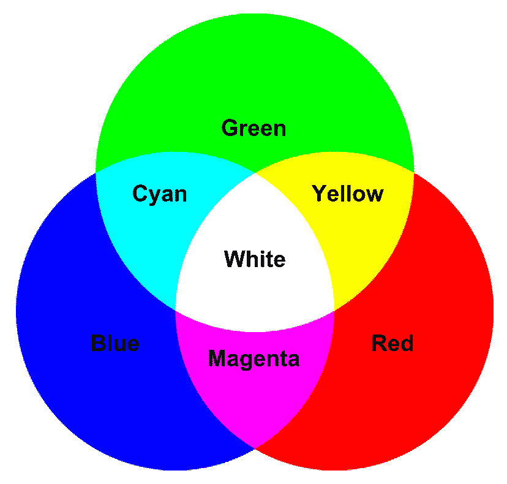
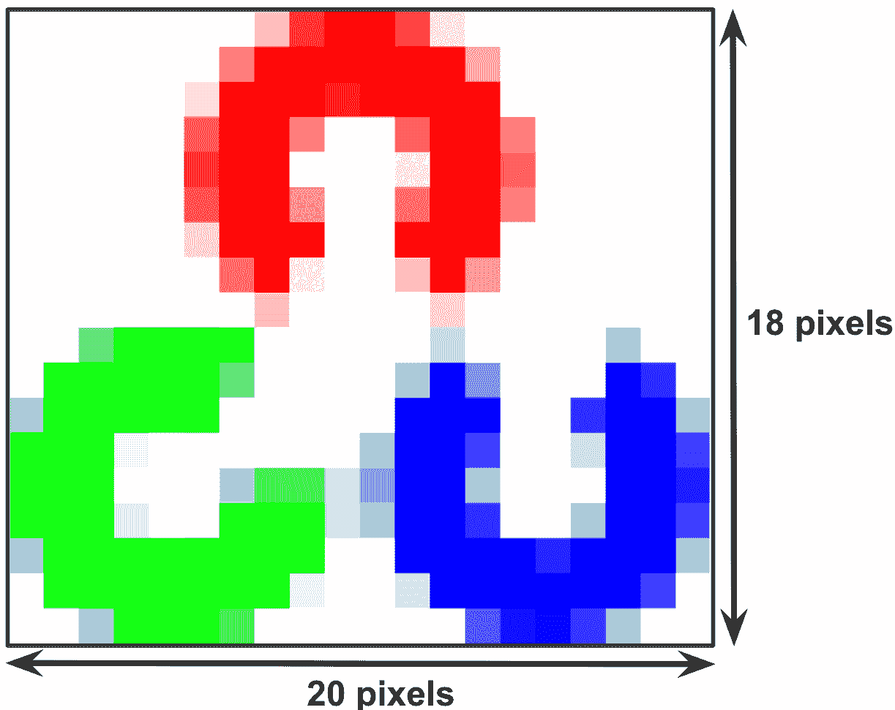
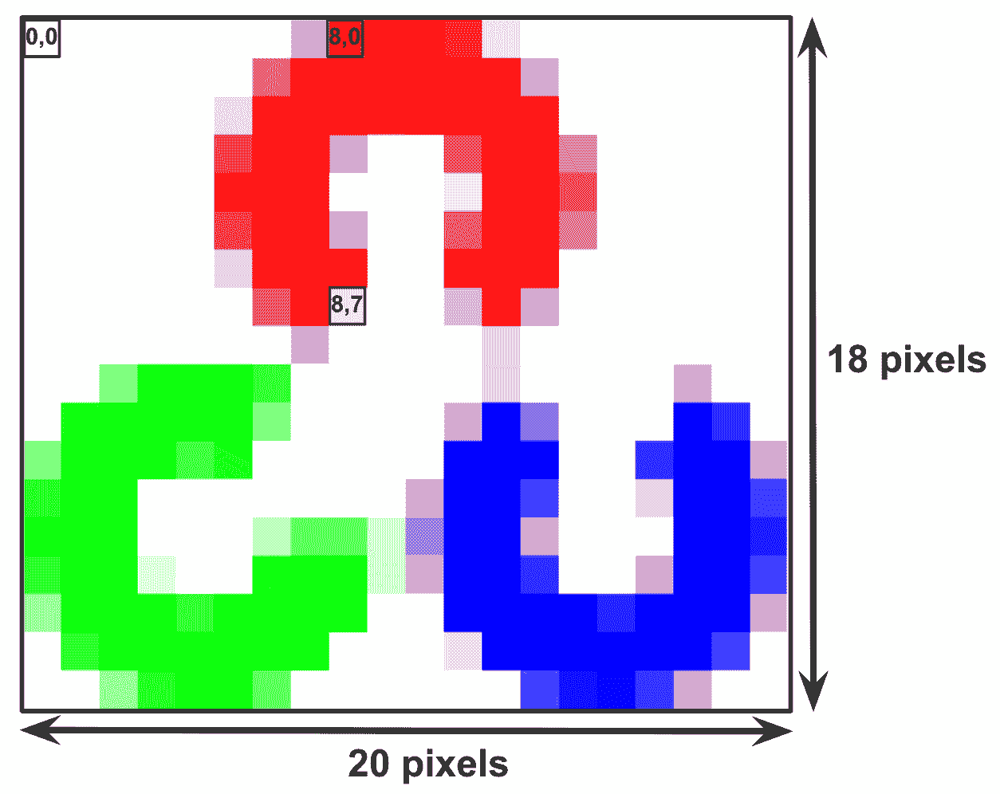
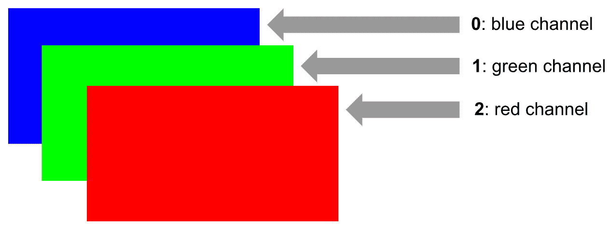
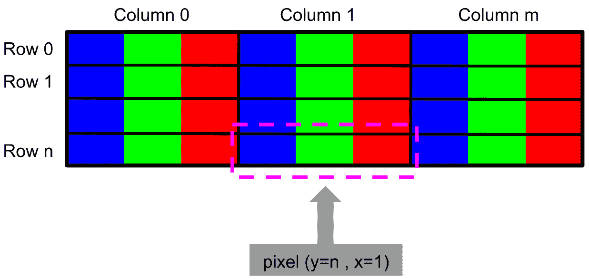
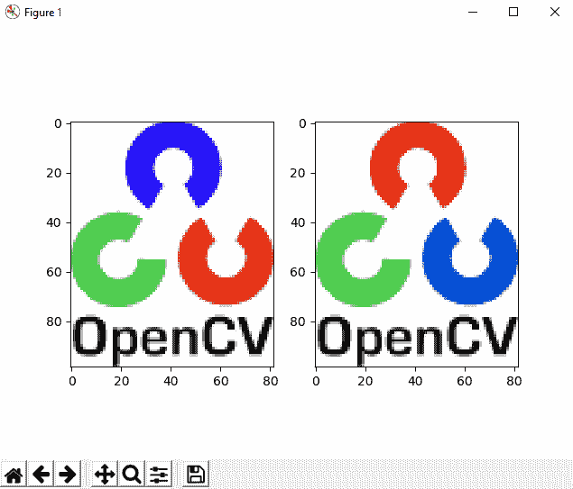
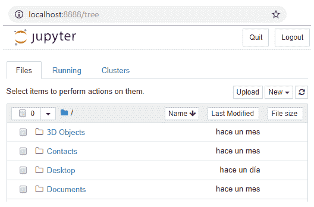
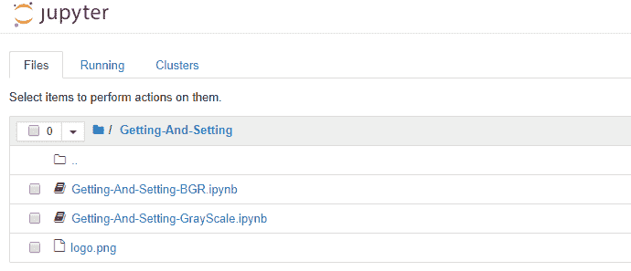

# OpenCV 中的图像基础

图像是计算机视觉项目中的关键组成部分，因为在许多情况下，它们提供了要使用的输入。 因此，了解主要的图像概念是开始编写计算机视觉项目所需的基本知识。 此外，还将介绍一些 OpenCV 库的特性，例如坐标系或 BGR 顺序（而不是 RGB）。

在本章中，您将学习如何开始编写第一个脚本，这将向您介绍 OpenCV 库。 在本章的最后，您将有足够的知识来开始使用 OpenCV 和 Python 编写您的第一个计算机视觉项目。

在本章中，我们将介绍以下主题：

*   图像基础的理论介绍
*   像素，颜色，通道，图像和色彩空间的概念
*   OpenCV 中的坐标系
*   在 OpenCV 中访问和操作不同颜色空间中的像素（获取和设置）
*   OpenCV 中的 BGR 顺序（而不是 RGB）

# 技术要求

本章的技术要求如下：

*   Python 和 OpenCV
*   特定于 Python 的 IDE
*   NumPy 和 Matplotlib 软件包
*   Jupyter 笔记本
*   Git 客户端

有关如何安装这些要求的更多详细信息，请参见第 1 章，“设置 OpenCV”。 可以在[这个页面](https://github.com/PacktPublishing/Mastering-OpenCV-4-with-Python)上访问用于通过 Python 精通 OpenCV 的 GitHub 存储库，其中包含从第一章到最后一章都需要完成本书的所有支持项目文件。 

# 图像基础的理论介绍

本部分的主要目的是为图像基础知识提供理论上的介绍-这些将在下一部分中详细说明。 首先，将快速介绍一下在计算机视觉项目中开发图像处理集时遇到的一些困难的重要性，然后再介绍一些与图像有关的简单公式。

# 图像处理中的主要问题

引入的第一个概念与图像有关，可以将其视为 3D 世界的**二维**（**2D**）视图。 数字图像是 2D 图像的数字表示形式，通常是二进制的有限数字值集，称为**像素**（像素的概念将在“像素，颜色，通道，图像和色彩空间概念”部分中详细说明）。 因此，计算机视觉的目标是将 2D 数据转换为以下内容：

*   新的表示形式（例如，新的图像）
*   决定（例如，执行具体任务）
*   新结果（例如，图像的正确分类）
*   一些有用的信息提取（例如，对象检测）

在处理图像处理技术时，计算机视觉可能会解决常见的问题（或难题）：

*   含糊不清的图像，因为它们会受到透视的影响，这可能会导致图像的视觉外观发生变化。 例如，从不同角度观看的同一对象可能会产生不同的图像。
*   通常受许多因素影响的图像，例如照明，天气，反射和运动。
*   图像中的物体也可能被其他物体遮挡，从而难以检测或分类被遮挡的物体。 根据遮挡的级别，所需的任务（例如，将图像分类为一些预定义的类别）可能确实具有挑战性。

为了将所有这些困难放在一起，假设您想开发一个面部检测系统。 该系统应足够坚固以应对照明或天气条件的变化。 另外，该系统应该处理头部的运动，甚至可以处理用户可以离相机更远或更近的事实。 它应该能够在每个轴（偏航，横摇和俯仰）上旋转一定程度来检测用户的头部。 例如，当头部靠近额头时，许多面部检测算法都具有良好的性能。 但是，如果面部不是正面的话，他们将无法检测到（例如，个人资料中的面部）。 此外，即使用户戴着眼镜或太阳镜，也可能希望检测到脸部，这会在眼睛区域产生遮挡。 在开发计算机视觉项目时，必须考虑所有这些因素。 一个很好的近似值是通过合并一些困难来使用许多测试图像来验证您的算法。 您还可以根据要轻松检测算法弱点的主要困难对测试图像进​​行分类。

# 图像处理步骤

图像处理包括以下三个步骤：

1.  获取要使用的图像。 此过程通常涉及一些功能，以便您可以从不同的来源（摄像机，视频流，磁盘，在线资源）读取图像。
2.  通过应用图像处理技术来处理图像以实现所需的功能（例如，检测图像中的猫）。
3.  显示处理步骤的结果（例如，在图像中绘制边框，然后将其保存到磁盘）。

此外，第二步可以分为三个处理级别：

*   低级流程
*   中级流程
*   高级流程

**低级过程**通常将图像作为输入，然后输出另一个图像。 可以在此步骤中应用的示例过程包括：

*   噪音消除
*   影像锐化
*   照度归一化
*   透视校正

结合面部检测示例，输出图像可以是照度归一化图像以处理由太阳反射引起的变化。

**中级过程**提取预处理后的图像，以输出该图像的某种表示形式。 将其视为数字的集合（例如，包含 100 个数字的向量），该集合汇总了要用于进一步处理的图像的主要信息。 关于面部检测示例，输出可以是由点`(x, y)`，包含检测到的面部的宽度和高度定义的矩形。

**高级过程**提取此数字向量（通常称为**属性**）并输出最终结果。 例如，输入可以是检测到的面部，输出可以是以下内容：

*   人脸识别
*   情绪识别
*   睡意和注意力分散
*   面部远程心率测量

# 图片制作

图像可以描述为 2D 函数`f(x, y)`，其中`(x, y)`是空间坐标和`f`的值 在任何时候，`(x, y)`与图像的亮度或灰度级成正比。 另外，当`(x, y)`和`f`的亮度值都是有限离散量时，该图像被称为**数字图像**。 因此，`f(x, y)`采用以下值：

*   `x ∈ [0, h-1]`，其中 h 是图像的高度
*   `y ∈ [0, w-1]`，其中 w 是图像的宽度
*   `f(x, y) ∈ [0, L-1]`，其中`L = 256`（对于 8 位图像）

彩色图像可以用相同的方式表示，但是我们需要定义三个函数分别表示红色，绿色和蓝色值。 这三个功能的每一个都遵循与为灰度图像定义的`f(x, y)`功能相同的公式。 我们将针对三种配方（对于彩色图像）将这三个函数的子索引 R，G 和 B 表示为`fR(x, y)`，`fG(x, y)`和``fB(x, y)``。

黑白图像遵循相同的近似方式，只需要一个函数即可表示图像。 但是，一个关键点是`f(x, y)`只能取两个值。 通常，这些值为`0`（黑色）和`255`（白色）。

这三种类型的图像通常用于计算机视觉，因此请记住它们的格式。

以下屏幕截图显示了三种类型的图像（彩色图像，灰度图像和黑白图像）：


请记住，由于`f(x, y)`值是有限的离散量，因此可以将数字图像视为真实场景的近似值。 此外，灰度图像和黑白图像每点只有一个样本（仅需要一个功能），而彩色图像每点只有三个样本（需要三项功能，对应于图像的红色，绿色和蓝色分量） 。

# 像素，颜色，通道，图像和色彩空间的概念

有几种不同的颜色模型，但最常见的一种是**红色，绿色，蓝色**（**RGB**）模型，这些模型将用于解释有关数字图像的一些关键概念。

在第 5 章，“图像处理技术”中，将详细说明主要颜色模型（也称为**颜色空间**）。

RGB 模型是一种加色模型，其中将原色`(R, G, B)`*混合在一起以再现各种颜色。 如前所述，在 RGB 模型中，原色是红色，绿色和蓝色。

每个原色`(R, G, B)`，通常称为通道，通常表示为`[0, 255]`范围内的整数。 因此，每个通道总共产生 256 个离散值，这些离散值对应于用于表示颜色通道值的总位数（`2^8 = 256`）。 此外，由于存在三个不同的通道，因此称为 **24 位色深**：



在上图中，您可以看到 RGB 颜色空间的加色属性：

*   将红色添加到绿色将获得黄色
*   将红色添加到蓝色会产生洋红色
*   将绿色添加到蓝色会生成青色
*   将所有三种原色相加会产生白色

如前所述，结合 RGB 颜色模型，特定颜色由红色，绿色和蓝色值表示，将像素值表示为 RGB 三元组`(R, G, B)`。 如下图所示，是一个图形软件中典型的 RGB 颜色选择器。 可以想象，每个滑块的范围从`0`到`255`：


您还可以看到，将纯红色添加到纯蓝色会产生完美的洋红色。 您可以在[这个页面](https://www.rapidtables.com/web/color/RGB_Color.html)上使用 RGB 颜色图表。

分辨率为`800×1200`的图像是具有 800 列和 1200 行的网格，包含`800×1200 = 960,000`像素。 应该注意的是，知道图像中有多少像素并不表示其物理尺寸（一个像素不等于一毫米）。 取而代之的是，一个像素的大小（因此图像的大小）将取决于已设置的每英寸**像素**（**PPI**） 该图像。 一般的经验法则是 PPI 在`[200 - 400]`范围内。

计算 PPI 的基本公式如下：

```cpp
PPI = 图像的宽度（像素）/ 宽度（英寸）
PPI = 图像的高度（像素）/ 高度（英寸）
```

因此，例如，如果要打印`4×6`英寸图像，并且图像为`800×1200` ，则 PPI 为 200。

现在，我们将研究文件扩展名。

# 文件扩展名

尽管我们将在 OpenCV 中处理的图像可以看作是 RGB 三元组的矩形阵列（在 RGB 图像的情况下），但不一定必须以该格式创建，存储或传输它们。 从这个意义上讲，某些文件格式（例如 GIF，PNG，位图或 JPEG）使用不同形式的压缩（无损或有损）来更有效地表示图像。

这样，出于完整性考虑，此处简要介绍了这些图像文件，特别着重于 OpenCV 支持的文件格式。 OpenCV 支持以下文件格式（带有关联的文件扩展名）：

*   **Windows 位图**：`*.bmp`和`*.dib`
*   **JPEG 文件**：`*.jpeg`，`*.jpg`和`*.jpe`
*   **JPEG 2000 文件**：`*.jp2`
*   **便携式网络图形**：`*.png`
*   **便携式图像格式**：`*.pbm`，`*.pgm`和`*.ppm`
*   **TI​​FF 文件**：`*.tiff`和`*.tif`

**位图图像文件**（**BMP**）或**设备独立位图**（**DIB**）文件格式是用于存储的光栅图像文件格式。 位图数字图像。 BMP 文件格式可以处理各种颜色深度的 2D 数字图像，还可以处理数据压缩，alpha 通道或颜色配置文件。

**联合图像专家组**（**JPEG**）是一种光栅图像文件格式，用于存储已压缩以在小文件中存储大量信息的图像。

**JPEG 2000** 是图像压缩标准和编码系统，它使用基于小波的压缩技术来提供高级别的可伸缩性和可访问性。 以此方式，JPEG 2000 压缩的图像比常规 JPEG 少。

**便携式网络图形（PNG）**是一种压缩的光栅图形文件格式，于 1994 年引入，作为**图形交换格式**（**GIF**）的改进替代。

**便携式像素图格式**（**PPM**），**便携式位图格式**（**PBM**）和**便携式灰度图格式**（**PGM**）指定交换图形文件的规则。 几个应用程序将这些文件格式统称为**可移植任意地图格式**（**PNM**）。 这些文件是保存图像数据的便捷方法。 此外，它们易于阅读。 从这个意义上讲，PPM，PBM 和 PGM 格式都设计得尽可能简单。

**标记图像文件格式**（**TI​​FF**）是一种可调整的文件格式，用于处理单个文件中的图像和数据。

将无损和有损类型的压缩算法应用于图像，从而导致图像小于未压缩的图像。 一方面，在无损压缩算法中，生成的图像与原始图像等效，这意味着在反转压缩过程之后，生成的图像与原始图像等效（等于）。 另一方面，在有损压缩算法中，生成的图像与原始图像不相等，这意味着图像中的某些细节会丢失。 从这个意义上讲，在许多有损压缩算法中，可以调整压缩级别。

# OpenCV 中的坐标系

为了向您展示 OpenCV 中的坐标系以及如何访问单个像素，我们将向您展示 OpenCV 徽标的低分辨率图像：


该徽标的尺寸为`20 x 18`像素，即，该图像具有 360 像素。 因此，我们可以在每个轴上添加像素数，如下图所示：



现在，我们来看一下`(x, y)`形式的像素索引。 请注意，像素是零索引的，这意味着左上角位于`(0, 0)`，而不是`(1, 1)`。 看一下下图，该图索引了三个单独的像素。 如您所见，图像的左上角是原点的坐标。 此外，坐标随着其下降而变大：



可以使用与在 Python 中引用数组的单个元素相同的方式从图像中提取单个像素的信息。 在下一节中，我们将看到如何做到这一点。

# 在 OpenCV 中访问和操作像素

在本节中，您将学习如何使用 OpenCV 访问和读取像素值以及如何对其进行修改。 此外，您将学习如何访问图像属性。 如果要一次处理多个像素，则需要创建图像的**兴趣区域**（**ROI**）。 在本节中，您将学习如何执行此操作。 最后，您将学习如何拆分和合并图像。

请记住，在 Python 中，图像表示为 NumPy 数组。 因此，这些示例中包含的大多数操作都与 NumPy 有关，因此需要对 NumPy 包有很好的了解，才能理解这些示例中包含的代码并使用 OpenCV 编写优化的代码。

# 使用 BGR 图像访问和操纵 OpenCV 中的像素

现在，我们将了解如何在 OpenCV 中处理 BGR 图像。 OpenCV 加载彩色图像，因此蓝色通道是第一个，绿色通道是第二个，红色通道是第三个。 请参阅“使用灰度图像访问和操作 OpenCV 中的像素”，以全面了解此概念。

首先，使用`cv2.imread()`功能读取要使用的图像。 该映像应位于工作目录中，或者应提供该映像的完整路径。 在这种情况下，我们将读取`logo.png`图像并将其存储在`img`变量中：

```py
# The function cv2.imread() is used to read an image from the the working directory
# Alternatively, you should provide a full path of the image: 
# Load OpenCV logo image (in this case from the working directoy):
img = cv2.imread('logo.png')
```

将图像加载到`img`后，我们将可以访问图像的某些属性。 我们将从加载的图像中提取的第一个属性是`shape`，它将告诉我们行，列和通道的数量（如果图像是彩色的）。 我们会将这些信息存储在`dimensions`变量中，以备将来使用：

```py
# To get the dimensions of the image use img.shape
# img.shape returns a tuple of number of rows, columns and channels (if a colour image)
# If image is grayscale, img.shape returns a tuple of number of rows and columns.
# So,it can be used to check if loaded image is grayscale or color image.
# Get the shape of the image:
dimensions = img.shape
```

另一个属性是图像的大小（`img.size`等于`高度×宽度×通道`的乘积）：

```py
# Total number of elements is obtained by img.size:
total_number_of_elements= img.size
```

属性图像数据类型是通过`img.dtype`获得的。 在这种情况下，图像数据类型为`uint8`（无符号字符），因为值在`[0 - 255]`范围内：

```py
# Image datatype is obtained by img.dtype.
# img.dtype is very important because a large number of errors is caused by invalid datatype.
# Get the image datatype:
image_dtype = img.dtype
```

要显示图像，我们将使用`cv2.imshow()`功能在窗口中显示图像。 窗口自动适合图像尺寸。 此函数的第一个参数是窗口名称，第二个参数是要显示的图像。 在这种情况下，由于加载的图像已存储在`img`变量中，因此我们将使用此变量作为第二个参数：

```py
# The function cv2.imshow() is used to display an image in a window
# The first argument of this function is the window name
# The second argument of this function is the image to be shown.
# Each created window should have different window names.
# Show original image:
cv2.imshow("original image", img)
```

显示图像后，`cv2.waitKey()`功能（一种键盘绑定功能）将为任何键盘事件等待指定的毫秒数。 参数是时间（以毫秒为单位）。 如果此时按任何键，程序将继续。 如果毫秒数是`0`（`cv2.waitKey(0)`），它将无限期地等待击键。 因此，此功能将使我们能够看到显示的窗口中等待按键输入：

```py
# The function cv2.waitKey(), which is a keyboard binding function, waits for any keyboard event.
# This function waits the value indicated by the argument (in milliseconds). 
# If any keyboard event is produced in this period of time, the program continues its execution
# If the value of the argument is 0, the program waits indefinitely until a keyboard event is produced:
cv2.waitKey(0)
```

要访问（读取）像素值，我们需要将所需像素的行和列提供给`img`变量，该变量包含加载的图像。 例如，要获取像素值[`x=40`，`y=6`），我们将使用以下代码：

```py
# A pixel value can be accessed by row and column coordinates.
# In case of BGR image, it returns an array of (Blue, Green, Red) values.
# Get the value of the pixel (x=40, y=6):
(b, g, r) = img[6, 40]
```

我们已将三个像素值加载到三个变量`(b,g,r)`中。 您可以在此处看到 OpenCV 对彩色图像使用 BGR 格式。 此外，我们一次只能访问一个频道。 在这种情况下，我们将使用行，列和所需通道的索引进行索引。 例如，要仅获取像素的蓝色值（`x=40`和`y=6`），我们将使用以下代码：

```py
# We can only  access one channel at a time.
# In this case, we will use row, column and the index of the desired channel for indexing.
# Get only blue value of the pixel (x=40, y=6):
b = img[6, 40, 0]
```

像素值也可以以相同的方式修改。 请记住，它是`(b, g, r)`格式。 例如，要将像素（`x=40`，`y=6`）设置为红色，请执行以下操作：

```py
# The pixel values can be also modified in the same way - (b, g, r) format:
img[6, 40] = (0, 0, 255)
```

有时，您将不得不处理某个区域而不是一个像素。 在这种情况下，应提供值的范围而不是各个值。 例如，要到达图像的左上角，请输入以下内容：

```py
# In this case, we get the top left corner of the image:
top_left_corner = img[0:50, 0:50]
```

`top_left_corner`变量是另一张图像（小于`img`），但是我们可以用相同的方式来播放它。

# 使用灰度图像访问和操作 OpenCV 中的像素

灰度图像只有一个通道。 因此，在处理这些图像时会引入一些差异。 我们将在这里重点介绍这些差异。

同样，我们将使用`cv2.imread()`功能读取图像。 在这种情况下，需要第二个参数，因为我们要以灰度加载图像。 第二个参数是一个标志，指定应读取图像的方式。 加载灰度图像所需的值为`cv2.IMREAD_GRAYSCALE`：

```py
# The function cv2.imshow() is used to display an image in a window
# The first argument of this function is the window name
# The second argument of this function is the image to be shown.
# In this case, the second argument is needed because we want to load the image in grayscale.
# Second argument is a flag specifying the way the image should be read.
# Value needed for loading an image in grayscale: 'cv2.IMREAD_GRAYSCALE'.
# load OpenCV logo image:
gray_img = cv2.imread('logo.png', cv2.IMREAD_GRAYSCALE)
```

在这种情况下，我们将图像存储在`gray_img`变量中。 如果获得图像的尺寸（使用`gray_img.shape`），则将仅获得两个值，即行和列。 在灰度图像中，不提供频道信息：

```py
# To get the dimensions of the image use img.shape
# If color image, img.shape returns returns a tuple of number of rows, columns and channels
# If grayscale, returns a tuple of number of rows and columns.
# So, it can be used to check if the loaded image is grayscale or color image.
# Get the shape of the image (in this case only two components!):
dimensions = gray_img.shape
```

`img.shape`将以元组的形式返回图像的尺寸，例如`(99, 82)`。

像素值可以通过行和列坐标进行访问。 在灰度图像中，仅获得一个值（通常称为像素的**强度**）。 例如，如果要获取像素强度[`x=40`，`y=6`），则可以使用以下代码：

```py
# You can access a pixel value by row and column coordinates.
# For BGR image, it returns an array of (Blue, Green, Red) values.
# Get the value of the pixel (x=40, y=6):
i = gray_img[6, 40]
```

图像的像素值也可以用相同的方式修改。 例如，如果我们要将像素（`x=40`，`y=6`）的值更改为黑色（强度等于`0`），则可以使用以下代码：

```py
# You can modify the pixel values of the image in the same way.
# Set the pixel to black:
gray_img[6, 40] = 0
```

# OpenCV 中的 BGR 订单

我们已经提到过 OpenCV 使用 BGR 颜色格式而不是 RGB 颜色格式。 可以在下图中看到，您可以在其中看到三个通道的顺序：



下图可以看到 BGR 图像的像素结构。 特别是，为了说明目的，我们详细介绍了如何访问**像素**（`y = n, x = 1`）：



OpenCV 的最初开发人员选择了 BGR 色彩格式（而不是 RGB 格式），因为当时 BGR 色彩格式在软件提供商和相机制造商中非常受欢迎。 例如，在 Windows 中，使用 COLORREF 指定颜色值时，他们使用 BGR 格式[`0x00bbggrr`](https://docs.microsoft.com/es-es/windows/desktop/gdi/colorref)。 总而言之，选择 BGR 是出于历史原因。

此外，其他 Python 程序包使用 RGB 颜色格式。 因此，我们需要知道如何将图像从一种格式转换为另一种格式。 例如，Matplotlib 使用 RGB 颜色格式。 [Matplotlib](https://matplotlib.org/) 是最受欢迎的 2D Python 绘图库，可为您提供多种绘图方法。 您可以与绘制的图像进行交互（例如，放大并保存图像）。 Matplotlib 可以在 Python 脚本或 Jupyter Notebook 中使用。 [您可以查看 Matplotlib 文档以获取更多详细信息](https://matplotlib.org/contents.html)。

因此，对于您的项目而言，一个不错的选择是使用 Matplotlib 包而不是 OpenCV 提供的功能来显示图像。 现在，我们将看到如何处理两个库中的不同颜色格式。

首先，我们使用`cv2.imread()`函数加载图像：

```py
# Load image using cv2.imread:
img_OpenCV = cv2.imread('logo.png')
```

图像存储在`img_OpenCV`变量中，因为`cv2.imread()`函数以 BGR 顺序加载图像。 然后，我们使用`cv2.split()`功能将加载的图像分为三个通道`(b, g, r)`。 该函数的参数是我们要分割的图像：

```py
# Split the loaded image into its three channels (b, g, r):
b, g, r = cv2.split(img_OpenCV)
```

下一步是再次合并通道（以基于通道提供的信息构建新图像），但顺序不同。 我们更改`b`和`r`通道的顺序以遵循 RGB 格式，即 Matplotlib 需要的格式：

```py
# Merge again the three channels but in the RGB format:
img_matplotlib = cv2.merge([r, g, b])
```

此时，我们有两个图像（`img_OpenCV`和`img_matplotlib`），将使用 OpenCV 和 Matplotlib 对其进行绘制，以便可以看到结果。 首先，我们将使用 Matplotlib 显示这两个图像。

为了在同一窗口中显示带有 Matplotlib 的两个图像，我们将使用`subplot`，它将在同一窗口中放置多个图像。 您可以在`subplot`中使用三个参数，例如`subplot(m,n,p)`。 在这种情况下，`subplot`处理`xn`网格中的图，其中`m`建立行数，`n`建立列数，`p`确定要在网格中放置绘图的位置。 为了显示 Matplotlib 的图像，我们将使用`imshow`。

在这种情况下，由于我们水平显示两个图像`m = 1`和`n = 2`。 我们将在第一个子图`img_OpenCV`中使用`p = 1`，在第二个子图`img_matplotlib`中使用`p = 2`：

```py
# Show both images (img_OpenCV and img_matplotlib) using matplotlib
# This will show the image in wrong color:
plt.subplot(121)
plt.imshow(img_OpenCV)
# This will show the image in true color:
plt.subplot(122)
plt.imshow(img_matplotlib)
plt.show()
```

因此，您将获得的输出应与下图所示的输出非常相似：



如您所见，第一个子图以错误的颜色（BGR 顺序）显示图像，而第二个子图以真实的颜色（RGB 顺序）显示图像。 以相同的方式，我们将使用`cv2.imshow()`显示两个图像：

```py
# Show both images (img_OpenCV and img_matplotlib) using cv2.imshow()
# This will show the image in true color:
cv2.imshow('bgr image', img_OpenCV)
# This will show the image in wrong color:
cv2.imshow('rgb image', img_matplotlib)
cv2.waitKey(0)
cv2.destroyAllWindows()
```

以下屏幕截图显示了执行前面的代码将获得的结果：


正如预期的那样，屏幕截图以真实的颜色显示图像，而第二个图以错误的颜色显示图像。

此外，如果要在同一窗口中显示两个图像，则可以构建一个*完整*的图像，其中包含两个图像，并将它们水平连接。 为此，我们将使用 NumPy 的`concatenate()`方法。 此方法的参数是要连接的两个图像和轴。 在这种情况下，`axis = 1`（水平堆叠）：

```py
# To stack horizontally (img_OpenCV to the left of img_matplotlib):
img_concats = np.concatenate((img_OpenCV, img_matplotlib), axis=1)
# Now, we show the concatenated image:
cv2.imshow('bgr image and rgb image', img_concats)
cv2.waitKey(0)
cv2.destroyAllWindows()
```

查看以下屏幕截图以查看串联的图像：


要考虑的一个因素是`cv2.split()`是一项耗时的操作。 根据您的需求，考虑使用 NumPy 索引。 例如，如果要获取图像的一个通道，而不是使用`cv2.split()`来获取所需的通道，则可以使用 NumPy 索引。 请参阅以下示例，以使用 NumPy 索引获取频道：

```py
# Using numpy capabilities to get the channels and to build the RGB image
# Get the three channels (instead of using cv2.split):
B = img_OpenCV[:, :, 0]
G = img_OpenCV[:, :, 1]
R = img_OpenCV[:, :, 2]
```

另一个考虑因素是，您可以使用 NumPy 在单个指令中将图像从 BGR 转换为 RGB：

```py
# Transform the image BGR to RGB using Numpy capabilities:
img_matplotlib = img_OpenCV[:, :, ::-1]
```

为了总结本章的所有内容，我们创建了两个 Jupiter Notebook。 在这些笔记本中，您可以使用到目前为止介绍的所有概念：

*   `Getting-And-Setting-BGR.ipynb`
*   `Getting-And-Setting-GrayScale.ipynb`

利用福利笔记本（以及本章中包括的所有信息）的优势，无需其他信息即可使用它们。 因此，继续尝试一下。 请记住（请参阅第 1 章，“设置 OpenCV”），要运行笔记本，您需要在终端机（Mac / Linux）或命令提示符（Windows）上运行以下命令：

```py
$ jupyter notebook
```

此命令将打印与笔记本服务器有关的信息，包括 Web 应用程序的 URL（默认情况下，此 URL 为`http://localhost:8888`）。 此外，此命令还将打开指向该 URL 的 Web 浏览器：



此时，您可以通过单击“上载”按钮来上载`Getting-And-Setting-BGR.ipynb`和`Getting-And-Setting-GrayScale.ipynb`文件（请参见上一个屏幕截图）。 这些文件使用`logo.png`图像。 因此，您应该以相同的方式上传此图像。 加载这三个文件之后，您应该看到已加载以下文件：



此时，您可以通过单击打开这些笔记本。 您应该看到笔记本的内容，如以下屏幕快照所示：


最后，您可以开始执行加载的笔记本文档。 您可以通过按`Shift + Enter`来逐步执行笔记本（一次一个单元）。 另外，您可以通过单击“单元格” |“步骤”一步来执行整个笔记本。 运行全部菜单。 此外，您还可以通过单击 Kernel | Kernel |重新启动内核（计算引擎）。 重新启动菜单。

有关编辑笔记本的更多信息，请查看[这里](https://github.com/jupyter/notebook/blob/master/docs/source/examples/Notebook/Notebook%20Basics.ipynb)，它也是笔记本！

# 总结

在本章中，我们研究了与图像有关的关键概念。 图像构成了构建计算机视觉项目所必需的丰富信息。 OpenCV 使用 BGR 颜色格式而不是 RGB，但是某些 Python 软件包（例如 Matplotlib）使用后者。 因此，我们介绍了如何将图像从一种颜色格式转换为另一种颜色格式。

此外，我们总结了使用图像的主要功能和选项：

*   访问图像属性
*   一些 OpenCV 功能，例如`cv2.imread()`，`cv2.split()`，`cv2.merge()`，`cv2.imshow()`，`cv2.waitKey()`和`cv2.destroyAllWindows()`
*   如何在 BGR 和灰度图像中获取和设置图像像素

最后，我们包括了两个笔记本，可让您使用所有这些概念。 请记住，一旦加载了笔记本，就可以通过按`Shift + Enter`来逐步运行它，或者单击“单元格” |“一步”来运行笔记本。 运行全部菜单。

在下一章中，您将学习如何处理文件和图像，这是构建计算机视觉应用程序所必需的。

# 问题

1.  主要的图像处理步骤是什么？
2.  三种处理级别是什么？
3.  灰度图像和黑白图像有什么区别？
4.  什么是像素？
5.  什么是图像分辨率？
6.  您使用哪些 OpenCV 功能执行以下操作？
    *   加载（读取）图像
    *   显示图片
    *   等待按键
    *   拆分渠道
    *   合并频道
7.  您使用什么命令来运行 Jupyter Notebook？
8.  以下三胞胎会得到什么颜色？
    *   `B = 0`，`G = 255`，`R = 255`
    *   `B = 255`，`G = 255`，`R = 0`
    *   `B = 255`，`G = 0`，`R = 255`
    *   `B = 255`，`G = 255`，`R = 255`
9.  假设您已在`img`中加载了图像。 如何检查`img`是彩色还是灰度？

# 进一步阅读

以下参考文献将帮助您更深入地了解本章中介绍的概念：

*   有关 Git 的更多信息，请看这本书：

[《精通 Git》，作者 JakubNarębski](https://www.packtpub.com/application-development/mastering-git)

*   有关 Jupyter Notebook 的更多信息：

[《Jupyter 笔记本：第一部分》，作者 Dan Toomey](https://www.packtpub.com/big-data-and-business-intelligence/jupyter-notebook-for-all-part-1-video)