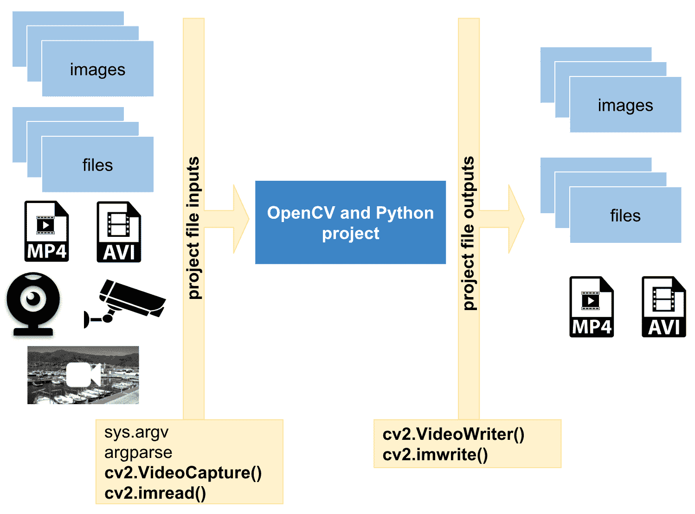

# 处理文件和图像

在任何类型的项目中，处理文件和图像都是关键。 从这个意义上讲，许多项目都应将文件作为数据输入形式来使用。 此外，项目可以在完成任何类型的处理后生成一些数据，这些数据可以以文件或图像的形式输出。 在计算机视觉中，由于这些类型的项目的固有特征（例如，要处理的图像和由机器学习算法生成的模型），这种信息流（输入-处理-输出）具有特殊的意义。

在本章中，我们将看到如何处理文件和图像。 您将学习如何处理构建计算机视觉应用所必需的文件和图像。

更具体地说，我们将涵盖以下主题：

*   有关处理文件和图像的理论介绍
*   读/写图像
*   读取相机帧和视频文件
*   写入视频文件
*   玩转视频捕获属性

# 技术要求

本章的技术要求如下：

*   Python 和 OpenCV
*   特定于 Python 的 IDE
*   NumPy 和 Matplotlib Python 包
*   Git 客户端

可以在[这个页面](https://github.com/PacktPublishing/Mastering-OpenCV-4-with-Python)上访问使用 Python 精通 OpenCV 的 GitHub 存储库。

# 处理文件和图像的简介

在深入处理文件和图像之前，我们将为您提供本章将要介绍的内容的概述。 下图概述了此概述：



在上图中，您可以看到计算机视觉项目（例如 **OpenCV 和 Python 项目**）应处理一些输入文件（例如**文件**和**图片**）。 另外，经过一些处理后，项目可以输出一些文件（例如**图像**和**文件**）。 因此，在本章中，我们将了解如何满足这些要求以及如何正确实现此流程（输入-处理-输出）。

执行程序的首要步骤是正确处理命令行参数，命令行参数是提供给包含某种*参数化*信息的程序或脚本的参数。 例如，如果编写脚本以将两个数字相加，则通常的方法是具有两个参数，这是执行加法所必需的两个数字。 在计算机视觉项目中，**图像**和不同类型的文件通常作为命令行参数传递给脚本。

命令行参数是参数化程序执行的常用且简单的方法。

# sys.argv

为了处理命令行参数，Python 使用`sys.argv`。 从这种意义上讲，执行程序时，Python 从命令行获取所有值并将其设置在`sys.argv`列表中。 列表的第一个元素是脚本的完整路径（或脚本名称-取决于操作系统），该路径始终为`sys.argv[0]`。 列表的第二个元素是脚本的第一个参数，即`sys.argv[1]`，依此类推。 可以在下图中看到，其中`sysargv_python.py`脚本使用两个参数执行：


要查看`sys.argv`的工作方式，我们将使用`sysargv_python.py`脚本：

```py
# Import the required packages
import sys

# We will print some information in connection with sys.argv to see how it works:
print("The name of the script being processed is: '{}'".format(sys.argv[0]))
print("The number of arguments of the script is: '{}'".format(len(sys.argv)))
print("The arguments of the script are: '{}'".format(str(sys.argv)))
```

如果执行此脚本时不带任何参数，则将看到以下信息：

```py
The name of the script being processed is: 'sysargv_python.py'
The number of arguments of the script is: '1'
The arguments of the script are: '['sysargv_python.py']'
```

另外，如果我们使用一个参数（例如`sysargv_python.py OpenCV`）执行此脚本，我们将获得以下信息：

```py
The name of the script being processed is: 'sysargv_python.py'
The number of arguments of the script is: '2'
The arguments of the script are: '['sysargv_python.py', 'OpenCV']'
```

如您所见，列表的第一个元素`sysargv_python.py`（`sys.argv[0]`）是脚本名称。 列表（`sys.argv[1]`）中的第二个元素`OpenCV`是脚本的第一个参数。

`argv[0]`是脚本名，如果它不是完整路径名，则取决于操作系统。 请参阅[这里](https://docs.python.org/3/library/sys.html)了解更多信息。

# `argparse` – 命令行选项和参数解析

应该考虑到，我们不应该直接处理`sys.argv`，主要是当我们的程序采用复杂的参数或多个文件名时。 另外，我们应该使用 Python 的`argparse`库，该库以系统的方式处理命令行参数，从而使其可以编写用户友好的命令行程序。 换句话说，Python 在标准库中有一个名为[`argparse`](https://docs.python.org/3/library/argparse.html)的模块，用于解析命令行参数。 首先，程序确定所需的参数。 然后，`argparse`将研究如何将这些参数解析为`sys.argv`。 同样，`argparse`会生成帮助和使用消息，并在提供无效参数时发出错误。

此处介绍此模块的最小示例为`argparse_minimal.py`，如下所示：

```py
# Import the required packages
import argparse

# We first create the ArgumentParser object 
# The created object 'parser' will have the necessary information
# to parse the command-line arguments into data types.
parser = argparse.ArgumentParser()

# The information about program arguments is stored in 'parser' and used when parse_args() is called.
# ArgumentParser parses arguments through the parse_args() method:
parser.parse_args()
```

不带参数运行此脚本将不会显示任何内容给`stdout`。 但是，如果包含`--help`（或`-h`）选项，我们将获得脚本的用法消息：

```py
usage: argparse_minimal.py [-h] 
optional arguments:
-h, --help show this help message and exit
```

指定其他任何参数都会导致错误，例如：

```py
argparse_minimal.py 6
usage: argparse_minimal.py [-h]
argparse_minimal.py: error: unrecognized arguments: 6
```

因此，我们必须使用`-h`参数调用此脚本。 这样，将显示使用消息信息。 由于未定义任何参数，因此不允许其他可能性。 这样，引入`argparse`的第二个示例是添加一个参数，可以在`argparse_positional_arguments.py`的示例中看到：

```py
# Import the required packages
import argparse

# We first create the ArgumentParser object 
# The created object 'parser' will have the necessary information
# to parse the command-line arguments into data types.
parser = argparse.ArgumentParser()

# We add a positional argument using add_argument() including a help
parser.add_argument("first_argument", help="this is the string text in connection with first_argument")

# The information about program arguments is stored in 'parser'
# Then, it is used when the parser calls parse_args().
# ArgumentParser parses arguments through the parse_args() method:
args = parser.parse_args()

# We get and print the first argument of this script:
print(args.first_argument)
```

我们添加了`add_argument()`方法。 此方法用于指定程序将接受的命令行选项。 在这种情况下，需要`first_argument`参数。 另外，`argparse`模块存储所有参数，使其名称与每个添加的参数的名称（在本例中为`first_argument`）匹配。 因此，为了获得我们的参数，我们执行`args.first_argument`。

如果此脚本以`argparse_positional_arguments.py 5`的身份执行，则输出将为`5`。 但是，如果脚本不带参数`argparse_positional_arguments.py`来执行，则输出如下：

```py
usage: argparse_positional_arguments.py [-h] first_argument
argparse_positional_arguments.py: error: the following arguments are required: first_argument
```

最后，如果我们使用`-h`选项执行脚本，输出将如下所示：

```py
usage: argparse_positional_arguments.py [-h] first_argument
positional arguments:
 first_argument this is the string text in connection with first_argument
optional arguments:
 -h, --help show this help message and exit
```

默认情况下，`argparse`将我们提供的选项视为字符串。 因此，如果参数不是字符串，则应建立`type`选项。 我们将看到`argparse_sum_two_numbers.py`脚本添加了两个参数，因此，这两个参数属于`int`类型：

```py
# Import the required packages
import argparse

# We first create the ArgumentParser object 
# The created object 'parser' will have the necessary information
# to parse the command-line arguments into data types.
parser = argparse.ArgumentParser()

# We add 'first_number' argument using add_argument() including a help. The type of this argument is int
parser.add_argument("first_number", help="first number to be added", type=int)

# We add 'second_number' argument using add_argument() including a help The type of this argument is int
parser.add_argument("second_number", help="second number to be added", type=int)

# The information about program arguments is stored in 'parser'
# Then, it is used when the parser calls parse_args().
# ArgumentParser parses arguments through the parse_args() method:
args = parser.parse_args()
print("args: '{}'".format(args))

print("the sum is: '{}'".format(args.first_number + args.second_number))

# Additionally, the arguments can be stored in a dictionary calling vars() function:
args_dict = vars(parser.parse_args())

# We print this dictionary:
print("args_dict dictionary: '{}'".format(args_dict))

# For example, to get the first argument using this dictionary:
print("first argument from the dictionary: '{}'".format(args_dict["first_number"]))
```

如果在不带参数的情况下执行脚本，则输出将如下所示：

```py
argparse_sum_two_numbers.py
usage: argparse_sum_two_numbers.py [-h] first_number second_number
argparse_sum_two_numbers.py: error: the following arguments are required: first_number, second_number
```

另外，如果我们使用`-h`选项执行脚本，则输出将如下所示：

```py
argparse_sum_two_numbers.py --help
usage: argparse_sum_two_numbers.py [-h] first_number second_number

positional arguments:
 first_number first number to be added
 second_number second number to be added

optional arguments:
 -h, --help show this help message and exit
```

应该考虑到，在前面的示例中，我们通过调用`vars()`函数引入了将参数存储在字典中的可能性：

```py
# Additionally, the arguments can be stored in a dictionary calling vars() function:
args_dict = vars(parser.parse_args())

# We print this dictionary:
print("args_dict dictionary: '{}'".format(args_dict))

# For example, to get the first argument using this dictionary:
print("first argument from the dictionary: '{}'".format(args_dict["first_number"]))
```

例如，如果此脚本以`argparse_sum_two_numbers.py 5 10`执行，则输出将如下所示：

```py
args: 'Namespace(first_number=5, second_number=10)'
the sum is: '15'
args_dict dictionary: '{'first_number': 5, 'second_number': 10}'
first argument from the dictionary: '5'
```

这是对`sys.argv`和`argparse`的快速介绍。 可以在[这个页面](https://docs.python.org/3/howto/argparse.html)上看到`argparse`的高级介绍。 此外，其文档非常详细，细致，[并涵盖了许多示例](https://docs.python.org/3/library/argparse.html)。 此时，您现在可以在 OpenCV 和 Python 程序中学习如何使用`argparse`读取和写入图像，这将在“读取和写入图像”部分中显示。

# 读写图像

在计算机视觉项目中，图像通常在脚本中用作命令行参数。 在以下各节中，我们将看到如何读取和写入图像。

# 在 OpenCV 中读取图像

以下示例`argparse_load_image.py`展示了如何加载图像：

```py
# Import the required packages
import argparse
import cv2

# We first create the ArgumentParser object 
# The created object 'parser' will have the necessary information
# to parse the command-line arguments into data types.
parser = argparse.ArgumentParser()

# We add 'path_image' argument using add_argument() including a help. The type of this argument is string (by default)
parser.add_argument("path_image", help="path to input image to be displayed")

# The information about program arguments is stored in 'parser'
# Then, it is used when the parser calls parse_args().
# ArgumentParser parses arguments through the parse_args() method:
args = parser.parse_args()

# We can now load the input image from disk:
image = cv2.imread(args.path_image)

# Parse the argument and store it in a dictionary:
args = vars(parser.parse_args())

# Now, we can also load the input image from disk using args:
image2 = cv2.imread(args["path_image"])

# Show the loaded image:
cv2.imshow("loaded image", image)
cv2.imshow("loaded image2", image2)

# Wait until a key is pressed:
cv2.waitKey(0)

# Destroy all windows:
cv2.destroyAllWindows()
```

在此示例中，必需的参数为`path_image`，其中包含我们要加载的图像的路径。 图像的路径是一个字符串。 因此，位置参数中不应包含任何类型，因为默认情况下它是字符串。 `args.path_image`和`args["path_image"]`都将包含图像的路径（从参数获取值的两种不同方式），因此我们将它们用作`cv2.imread()`函数的参数。

# 在 OpenCV 中读取和写入图像

一种常见的方法是加载图像，执行某种处理，然后最终输出处理后的图像（请参阅第 2 章， *OpenCV* 中的图像基础知识，这三部分的详细说明） 脚步）。 从这个意义上讲，可以将处理后的图像保存到磁盘。 在以下示例中，介绍了这三个步骤（加载，处理和保存）。 在这种情况下，处理步骤非常简单（将图像转换为灰度）。 在以下示例`argparse_load_processing_save_image.py`中可以看到：

```py
# Import the required packages
import argparse
import cv2

# We first create the ArgumentParser object 
# The created object 'parser' will have the necessary information
# to parse the command-line arguments into data types.
parser = argparse.ArgumentParser()

# Add 'path_image_input' argument using add_argument() including a help. The type is string (by default):
parser.add_argument("path_image_input", help="path to input image to be displayed")

# Add 'path_image_output' argument using add_argument() including a help. The type is string (by default):
parser.add_argument("path_image_output", help="path of the processed image to be saved")

# Parse the argument and store it in a dictionary:
args = vars(parser.parse_args())

# We can load the input image from disk:
image_input = cv2.imread(args["path_image_input"])

# Show the loaded image:
cv2.imshow("loaded image", image_input)

# Process the input image (convert it to grayscale):
gray_image = cv2.cvtColor(image_input, cv2.COLOR_BGR2GRAY)

# Show the processed image:
cv2.imshow("gray image", gray_image)

# Save the processed image to disk:
cv2.imwrite(args["path_image_output"], gray_image)

# Wait until a key is pressed:
cv2.waitKey(0)

# Destroy all windows:
cv2.destroyAllWindows()
```

在前面的示例中，有两个必需的参数。 第一个是`path_image_input`，它包含我们要加载的图像的路径。 图像的路径是一个字符串。 因此，位置参数中不应包含任何类型，因为默认情况下它是字符串。 第二个是`path_image_output`，它包含我们要保存的结果图像的路径。 在此示例中，处理步骤包括将加载的图像转换为灰度：

```py
# Process the input image (convert it to grayscale)
gray_image = cv2.cvtColor(image_input, cv2.COLOR_BGR2GRAY)
```

应当注意，第二个参数`cv2.COLOR_BGR2GRAY`假定加载的图像是 BGR 彩色图像。 如果您已加载 RGB 彩色图像，并且想要将其转换为灰度，则应使用`cv2.COLOR_RGB2GRAY`。

这是一个非常简单的处理步骤，但为简单起见将其包括在内。 在以后的章节中，将显示更详细的处理算法。

# 读取相机帧和视频文件

在某些项目中，您必须捕获相机帧（例如，使用笔记本电脑的网络摄像头捕获的帧）。 在 OpenCV 中，我们具有`cv2.VideoCapture`，该类用于从不同来源（例如图像序列，视频文件和相机）捕获视频。 在本节中，我们将看到一些示例，向我们介绍此类用于捕获相机帧的类。

# 读取相机帧

第一个示例`read_camera.py`向您展示如何从连接到计算机的相机读取帧。 必需的参数为`index_camera`，它指示要读取的摄像机的索引。 如果已将网络摄像头连接到计算机，则其索引为`0`。 另外，如果您有第二台摄像机，则可以通过`1`进行选择。 如您所见，此参数的类型为`int`。

使用`cv2.VideoCapture`的第一步是创建一个要使用的对象。 在这种情况下，对象是`capture`，我们这样调用构造器：

```py
 # We create a VideoCapture object to read from the camera (pass 0):
capture = cv2.VideoCapture(args.index_camera)
```

如果`index_camera`是`0`（您的第一个连接的摄像机），则它等效于`cv2.VideoCapture(0)`。 为了检查连接是否正确建立，我们使用`capture.isOpened()`方法，如果无法建立连接，则返回`False`。 同样，如果捕获已正确初始化，则此方法返回`True`。

要从摄像机逐帧捕获素材，我们调用`capture.read()`方法，该方法从摄像机返回帧。 该框架与 OpenCV 中的图像具有相同的结构，因此我们可以以相同的方式使用它。 例如，要将帧转换为灰度，请执行以下操作：

```py
gray_frame = cv2.cvtColor(frame, cv2.COLOR_BGR2GRAY)
```

此外，`capture.read()`返回布尔值。 该布尔值指示是否已从捕获对象正确读取帧。

# 访问捕获对象的某些属性

最后，您可以使用`capture.get(property_identifier)`访问捕获对象的某些属性。 在这种情况下，我们获得一些属性，例如帧**宽度**，帧**高度**和**每秒帧**（**fps**）。 如果我们调用不支持的属性，则返回值为`0`：

```py
# Import the required packages
import cv2
import argparse

# We first create the ArgumentParser object 
# The created object 'parser' will have the necessary information
# to parse the command-line arguments into data types.
parser = argparse.ArgumentParser()

# We add 'index_camera' argument using add_argument() including a help.
parser.add_argument("index_camera", help="index of the camera to read from", type=int)
args = parser.parse_args()

# We create a VideoCapture object to read from the camera (pass 0):
capture = cv2.VideoCapture(args.index_camera)

# Get some properties of VideoCapture (frame width, frame height and frames per second (fps)):
frame_width = capture.get(cv2.CAP_PROP_FRAME_WIDTH)
frame_height = capture.get(cv2.CAP_PROP_FRAME_HEIGHT)
fps = capture.get(cv2.CAP_PROP_FPS)

# Print these values:
print("CV_CAP_PROP_FRAME_WIDTH: '{}'".format(frame_width))
print("CV_CAP_PROP_FRAME_HEIGHT : '{}'".format(frame_height))
print("CAP_PROP_FPS : '{}'".format(fps))

# Check if camera opened successfully
if capture.isOpened()is False:
    print("Error opening the camera")

# Read until video is completed
while capture.isOpened():
    # Capture frame-by-frame from the camera
    ret, frame = capture.read()

    if ret is True:
        # Display the captured frame:
        cv2.imshow('Input frame from the camera', frame)

        # Convert the frame captured from the camera to grayscale: 
        gray_frame = cv2.cvtColor(frame, cv2.COLOR_BGR2GRAY)

        # Display the grayscale frame:
        cv2.imshow('Grayscale input camera', gray_frame)

        # Press q on keyboard to exit the program
        if cv2.waitKey(20) & 0xFF == ord('q'):
            break
    # Break the loop
    else:
        break

# Release everything:
capture.release()
cv2.destroyAllWindows()
```

# 保存相机帧

可以很容易地修改前面的示例，以添加有用的功能。 假设您想在发生一些有趣的事情时将一些帧保存到磁盘。 在下面的示例`read_camera_capture.py`中，我们将添加此功能。 当按下键盘上的`C`键时，我们将当前帧保存到磁盘。 我们同时保存了 BGR 和灰度帧。 执行此功能的代码如下所示：

```py
 # Press c on keyboard to save current frame
 if cv2.waitKey(20) & 0xFF == ord('c'):
     frame_name = "camera_frame_{}.png".format(frame_index)
     gray_frame_name = "grayscale_camera_frame_{}.png".format(frame_index)
     cv2.imwrite(frame_name, frame)
     cv2.imwrite(gray_frame_name, gray_frame)
     frame_index += 1
```

`ord('c')`使用八位返回代表`c`字符的值。 此外，`cv2.waitKey()`值是按位的，并且将`&`运算符与`0xFF`一起使用只能得到其最后八位。 因此，我们可以在这两个 8 位值之间进行比较。 当按下`C`键时，我们为两个帧建立名称。 然后，我们将两个图像保存到磁盘。 最后，增加`frame_index`，以便为保存下一帧做好准备。 请查看`read_camera_capture.py`以查看此脚本的完整代码。

# 读取视频文件

`cv2.VideoCapture`也允许我们阅读视频文件。 因此，要读取视频文件，在创建`cv2.VideoCapture`对象时应提供视频文件的路径：

```py
# We first create the ArgumentParser object 
# The created object 'parser' will have the necessary information
# to parse the command-line arguments into data types.
parser = argparse.ArgumentParser()

# We add 'video_path' argument using add_argument() including a help.
parser.add_argument("video_path", help="path to the video file")
args = parser.parse_args()

# Create a VideoCapture object. In this case, the argument is the video file name:
capture = cv2.VideoCapture(args.video_path)
```

请查看`read_video_file.py`，以查看如何使用`cv2.VideoCapture`读取和显示视频文件的完整示例。

# 从 IP 摄像机读取

为了完成`cv2.VideoCapture`，我们将看看如何从 IP 摄像机读取数据。 从 OpenCV 中的 IP 摄像机读取与从文件读取非常相似。 从这个意义上讲，仅应更改`cv2.VideoCapture`构造器的参数。 这样做的好处是，您无需在本地网络中使用 IP 摄像机即可尝试此功能。 您可以尝试连接许多公共 IP 摄像机。 例如，我们要连接到公共 IP 摄像机，该摄像机位于*俱乐部 Näutic 德拉塞尔瓦港–布拉瓦海岸–克雷乌斯角（西班牙赫罗纳）*。 该端口的网页位于[这个页面](https://www.cnps.cat/)上。 [您可以导航到网络摄像头部分](https://www.cnps.cat/webcams)以找到一些要连接的网络摄像头。

因此，您唯一需要修改的就是`cv2.VideCapture`的参数。 在这种情况下，它是`http://217.126.89.102:8010/axis-cgi/mjpg/video.cgi`。 如果执行此示例（`read_ip_camera.py`），应该会看到类似于以下屏幕截图的内容，其中显示了从 IP 摄像机获得的 BGR 和灰度图像：


# 写入视频文件

在本节中，我们将看到如何使用`cv2.VideoWriter`写入视频文件。 但是，应首先介绍一些概念（例如 fps，编解码器和视频文件格式）。

# 计算每秒帧

在“读取摄像机帧和视频文件”部分中，我们看到了如何从`cv2.VideoCapture`对象获得一些属性。 fps 是计算机视觉项目中的重要指标。 该度量指示每秒处理多少帧。 可以肯定地说，较高的 fps 更好。 但是，算法每秒应处理的帧数取决于您要解决的特定问题。 例如，如果您的算法应跟踪并检测沿着街道行走的人，则 15 fps 可能就足够了。 但是，如果您的目标是检测和跟踪高速公路上快速行驶的汽车，则可能需要 20-25 fps。

因此，了解如何在计算机视觉项目中计算 fps 指标很重要。 在下面的示例`read_camera_fps.py`中，我们将修改`read_camera.py`以输出 fps 数。 关键点显示在以下代码中：

```py
# Read until the video is completed, or 'q' is pressed
while capture.isOpened():
    # Capture frame-by-frame from the camera
    ret, frame = capture.read()

    if ret is True:
        # Calculate time before processing the frame:
        processing_start = time.time()

        # All the processing should be included here
        # ...
        # ...
        # End of processing

        # Calculate time after processing the frame
        processing_end = time.time()

        # Calculate the difference
        processing_time_frame = processing_end - processing_start

        # FPS = 1 / time_per_frame
        # Show the number of frames per second
        print("fps: {}".format(1.0 / processing_time_frame))

    # Break the loop
    else:
        break

```

首先，我们花点时间进行处理：

```py
processing_start = time.time()
```

然后，我们在所有处理完成之后花时间：

```py
processing_end = time.time()
```

然后，我们计算出差异：

```py
processing_time_frame = processing_end - processing_start
```

最后，我们计算并打印 fps 数：

```py
print("fps: {}".format(1.0 / processing_time_frame))
```

# 写入视频文件的注意事项

视频代码是一种用于压缩和解压缩数字视频的软件。 因此，编解码器可以用于将未压缩的视频转换为压缩的视频，也可以用于将压缩的视频转换为未压缩的视频。 压缩视频格式通常遵循称为**视频压缩规范**或**视频编码格式**的标准规范。 从这个意义上讲，OpenCV 提供了 FOURCC，这是一个 4 字节的代码，用于指定视频编解码器。 FOURCC 代表*四个字符的代码*。 可以在[这个页面](http://www.fourcc.org/codecs.php)上找到所有可用代码的列表。 应该考虑到受支持的编解码器是平台相关的。 这意味着，如果要使用特定的编解码器，则该编解码器应该已经安装在系统上。 典型的编解码器是 DIVX，XVID，X264 和 MJPG。

此外，视频文件格式是一种用于存储数字视频数据的文件格式。 典型的视频文件格式为 AVI（`*.avi`），MP4（`*.mp4`），QuickTime（`*.mov`）和 Windows Media Video（`*.wmv`）。

最后，应考虑到视频文件格式（例如`*.avi`）和 FOURCC（例如 DIVX）之间的正确组合并不是简单明了的。 您可能需要尝试并使用这些值。 因此，在 OpenCV 中创建视频文件时，您必须考虑所有这些因素。

下图试图对其进行总结：


此图总结了在 OpenCV 中使用`cv2.VideoWriter()`创建视频文件时应考虑的主要注意事项。 在此图中，已创建`video_demo.avi`视频。 在这种情况下，FOURCC 值为`XVID`，视频文件格式为`AVI`（`*.avi`）。 最后，应确定 fps 和视频每一帧的尺寸。

此外，下面的示例`write_video_file.py`编写了一个视频文件，使用这些概念也可能会有所帮助。 此示例的一些关键点在此处进行了注解。 在此示例中，必需的参数是视频文件名（例如`video_demo.avi`）：

```py
# We first create the ArgumentParser object 
# The created object 'parser' will have the necessary information
# to parse the command-line arguments into data types.
parser = argparse.ArgumentParser()

# We add 'output_video_path' argument using add_argument() including a help.
parser.add_argument("output_video_path", help="path to the video file to write")
args = parser.parse_args()
```

我们将从连接到计算机的第一台相机拍摄帧。 因此，我们相应地创建对象：

```py
# Create a VideoCapture object and pass 0 as argument to read from the camera
capture = cv2.VideoCapture(0)
```

接下来，我们将从捕获对象中获取一些属性（帧宽度，帧高度和 fps）。 我们将使用它们来创建我们的视频文件：

```py
# Get some properties of VideoCapture (frame width, frame height and frames per second (fps)):
frame_width = capture.get(cv2.CAP_PROP_FRAME_WIDTH)
frame_height = capture.get(cv2.CAP_PROP_FRAME_HEIGHT)
fps = capture.get(cv2.CAP_PROP_FPS)
```

现在，我们使用 FOURCC（四字节代码）指定视频编解码器。 请记住，它是依赖于平台的。 在这种情况下，我们将编解码器定义为`XVID`：

```py
# FourCC is a 4-byte code used to specify the video codec and it is platform dependent!
# In this case, define the codec XVID
fourcc = cv2.VideoWriter_fourcc('X', 'V', 'I', 'D')
```

以下行也适用：

```py
# FourCC is a 4-byte code used to specify the video codec and it is platform dependent!
# In this case, define the codec XVID
fourcc = cv2.VideoWriter_fourcc(*'XVID')
```

然后，我们创建`cv2.VideoWriter`对象`out_gray`。 我们使用与输入相机相同的属性。 最后一个参数是`False`，以便我们可以以灰度级编写视频。 如果我们要创建彩色视频，则最后一个参数应为`True`：

```py
# Create VideoWriter object. We use the same properties as the input camera.
# Last argument is False to write the video in grayscale. True otherwise (write the video in color)
out_gray = cv2.VideoWriter(args.output_video_path, fourcc, int(fps), (int(frame_width), int(frame_height)), False)
```

我们使用`capture.read()`从捕获对象逐帧输出。 每帧都将转换为灰度并写入视频文件。 我们可以显示框架，但这不是编写视频所必需的。 如果按`q`，程序结束：

```py
# Read until video is completed or 'q' is pressed
while capture.isOpened():
    # Read the frame from the camera
    ret, frame = capture.read()
    if ret is True:

        # Convert the frame to grayscale
        gray_frame = cv2.cvtColor(frame, cv2.COLOR_BGR2GRAY)

        # Write the grayscale frame to the video
        out_gray.write(gray_frame)

        # We show the frame (this is not necessary to write the video)
        # But we show it until 'q' is pressed
        cv2.imshow('gray', gray_frame)
        if cv2.waitKey(1) & 0xFF == ord('q'):
            break
    else:
        break
```

最后，我们释放所有内容（`cv2.VideoCapture`和`cv2.VideWriter`对象，并销毁创建的窗口）：

```py
# Release everything:
capture.release()
out_gray.release()
cv2.destroyAllWindows()
```

该示例的完整代码可以在`write_video_file.py`文件中看到。

# 玩转视频捕获属性

在前面的一些示例中，我们看到了如何从`cv2.VideoCapture`对象获取某些属性。 在本节中，我们将看到如何获取所有属性并了解它们如何工作。 最后，我们将使用这些属性来加载视频文件并向后输出（首先显示视频的最后一帧，依此类推）。

# 从视频捕获对象获取所有属性

首先，我们创建`read_video_file_all_properties.py`脚本以显示所有属性。 其中一些属性仅在我们使用相机（不适用于视频文件）时才起作用。 在这些情况下，将返回`0`值。 此外，我们创建了`decode_fourcc()`函数，该函数将`capture.get(cv2.CAP_PROP_FOURCC)`返回的值转换为包含编解码器的`int`表示形式的字符串值。 从这个意义上讲，此值应转换为四字节的`char`表示形式，以正确输出编解码器。 因此，`decode_fourcc()`函数可以解决此问题。

该函数的代码如下：

```py
def decode_fourcc(fourcc):
    """Decodes the fourcc value to get the four chars identifying it

    """
    fourcc_int = int(fourcc)

    # We print the int value of fourcc
    print("int value of fourcc: '{}'".format(fourcc_int))

    # We can also perform this in one line:
    # return "".join([chr((fourcc_int >> 8 * i) & 0xFF) for i in range(4)])

    fourcc_decode = ""
    for i in range(4):
        int_value = fourcc_int >> 8 * i & 0xFF
        print("int_value: '{}'".format(int_value))
        fourcc_decode += chr(int_value)
    return fourcc_decode
```

为了说明其工作原理，下图总结了主要步骤：


如您所见，第一步是获取`capture.get(cv2.CAP_PROP_FOURCC)`返回的值的`int`表示形式，该值是一个字符串。 然后，我们迭代四次以获取每八位，并将这八位转换为`int`。 最后，使用`chr()`函数将这些`int`值转换为`char`。 应该注意的是，我们只能在一行代码中执行此功能，如下所示：

```py
return "".join([chr((fourcc_int >> 8 * i) & 0xFF) for i in range(4)])
```

`CAP_PROP_POS_FRAMES`属性为您提供视频文件的当前帧，`CAP_PROP_POS_MSEC`属性为您提供当前帧的时间戳。 我们还可以使用`CAP_PROP_FPS`属性获取 fps 的数量。 `CAP_PROP_FRAME_COUNT`属性为您提供视频文件的总帧数。

要获取并打印所有属性，请使用以下代码：

```py
# Get and print these values:
print("CV_CAP_PROP_FRAME_WIDTH: '{}'".format(capture.get(cv2.CAP_PROP_FRAME_WIDTH)))
print("CV_CAP_PROP_FRAME_HEIGHT : '{}'".format(capture.get(cv2.CAP_PROP_FRAME_HEIGHT)))
print("CAP_PROP_FPS : '{}'".format(capture.get(cv2.CAP_PROP_FPS)))
print("CAP_PROP_POS_MSEC : '{}'".format(capture.get(cv2.CAP_PROP_POS_MSEC)))
print("CAP_PROP_POS_FRAMES : '{}'".format(capture.get(cv2.CAP_PROP_POS_FRAMES)))
print("CAP_PROP_FOURCC  : '{}'".format(decode_fourcc(capture.get(cv2.CAP_PROP_FOURCC))))
print("CAP_PROP_FRAME_COUNT  : '{}'".format(capture.get(cv2.CAP_PROP_FRAME_COUNT)))
print("CAP_PROP_MODE : '{}'".format(capture.get(cv2.CAP_PROP_MODE)))
print("CAP_PROP_BRIGHTNESS : '{}'".format(capture.get(cv2.CAP_PROP_BRIGHTNESS)))
print("CAP_PROP_CONTRAST : '{}'".format(capture.get(cv2.CAP_PROP_CONTRAST)))
print("CAP_PROP_SATURATION : '{}'".format(capture.get(cv2.CAP_PROP_SATURATION)))
print("CAP_PROP_HUE : '{}'".format(capture.get(cv2.CAP_PROP_HUE)))
print("CAP_PROP_GAIN  : '{}'".format(capture.get(cv2.CAP_PROP_GAIN)))
print("CAP_PROP_EXPOSURE : '{}'".format(capture.get(cv2.CAP_PROP_EXPOSURE)))
print("CAP_PROP_CONVERT_RGB : '{}'".format(capture.get(cv2.CAP_PROP_CONVERT_RGB)))
print("CAP_PROP_RECTIFICATION : '{}'".format(capture.get(cv2.CAP_PROP_RECTIFICATION)))
print("CAP_PROP_ISO_SPEED : '{}'".format(capture.get(cv2.CAP_PROP_ISO_SPEED)))
print("CAP_PROP_BUFFERSIZE : '{}'".format(capture.get(cv2.CAP_PROP_BUFFERSIZE)))
```

您可以在`read_video_file_all_properties.py`文件中查看此脚本的完整代码。

# 使用属性来反向播放视频

为了了解如何使用上述属性，我们将了解`read_video_file_backwards.py`脚本，该脚本使用其中的某些属性加载视频并向后输出，首先显示视频的最后一帧，依此类推。 我们将使用以下属性：

*   `cv2.CAP_PROP_FRAME_COUNT`：此属性提供帧的总数
*   `cv2.CAP_PROP_POS_FRAMES`：此属性提供当前帧

第一步是获取最后一帧的索引：

```py
# We get the index of the last frame of the video file
frame_index = capture.get(cv2.CAP_PROP_FRAME_COUNT) - 1
```

因此，我们将当前帧设置为读取到以下位置：

```py
 # We set the current frame position
 capture.set(cv2.CAP_PROP_POS_FRAMES, frame_index)
```

这样，我们可以照常阅读此框架：

```py
 # Capture frame-by-frame from the video file
 ret, frame = capture.read()
```

最后，我们递减索引以从视频文件中读取下一帧：

```py
 # Decrement the index to read next frame
 frame_index = frame_index - 1
```

完整代码在`read_video_file_backwards.py`脚本中提供。 可以轻松修改此脚本，以保存生成的视频向后播放（不仅显示该视频）。 在“问题”部分中提出了此脚本。

# 总结

在本章中，我们看到使用图像和文件是计算机视觉项目的关键要素。 这种项目中的常见方法是先加载一些图像，执行一些处理，然后输出处理后的图像。 在本章中，我们回顾了该流程。 另外，关于视频流，`cv2.VideoCapture`和`cv2.VideoWriter`均被覆盖。 我们还研究了用于视频写作的`cv2.VideoWriter`类。 编写视频文件时，审查了两个关键方面-视频编解码器（例如 DIVX）和视频文件格式（例如 AVI）。 要使用视频编解码器，OpenCV 提供了四字节代码 FOURCC。 典型的编解码器是 DIVX，XVID，X264 和 MJPG，而典型的视频文件格式是 AVI（`*.avi`），MP4（`*.mp4`），QuickTime（`*.mov`）和 Windows Media Video（`*.wmv`）。

我们还回顾了 fps 的概念以及如何在程序中进行计算。 此外，我们研究了如何获取`cv2.VideoCapture`对象的所有属性，以及如何使用它们加载视频并向后输出，从而首先显示了视频的最后一帧。 最后，我们看到了如何应对命令行参数。 Python 使用`sys.argv`处理命令行参数。 当我们的程序采用复杂的参数或多个文件名时，我们应该使用 Python 的`argparse`库。

在下一章中，我们将学习如何使用 OpenCV 库绘制基本的和更高级的形状。 OpenCV 提供绘制线，圆，矩形，椭圆，文本和折线的功能。 与计算机视觉项目有关，这是在图像中绘制基本形状以执行以下操作的常用方法：

*   显示算法的一些中间结果（例如，检测到的对象的边界框）
*   显示算法的最终结果（例如，检测到的对象的类别，例如汽车，猫或狗）
*   显示一些调试信息（例如，执行时间）

因此，下一章将对您的计算机视觉算法有很大帮助。

# 问题

1.  什么是`sys.argv[1]`？
2.  编写一段代码以添加`int`类型的`first_number`参数，并包括要使用`parser.add_argument()`添加的帮助优先编号。
3.  编写一段代码，将想象中的`img`保存到名称为`image.png`的磁盘上。
4.  使用`cv2.VideoCapture()`创建`capture`对象，以从连接到计算机的第一台摄像机读取。
5.  使用`cv2.VideoCapture()`创建对象捕获，以从连接到计算机的第一台摄像机读取并打印`CAP_PROP_FRAME_WIDTH`属性。
6.  读取图像并将其保存到名称相同但以`_copy.png`结尾的磁盘（例如`logo_copy.png`）。
7.  创建一个脚本（`read_video_file_backwards_save_video.py`），以加载视频文件并创建另一个向后播放的脚本（首先包含视频的最后一帧，依此类推）。

# 进一步阅读

以下参考资料将帮助您深入研究`argparse`，这是您的计算机视觉项目的关键点：

*   [《使用`argparse`解析命令行》](https://www.packtpub.com/mapt/book/application_development/9781783280971/16/ch16lvl1sec147/parsing-the-command-line-with-argparse)
*   [《使用`argparse`获取命令行输入》](https://www.packtpub.com/mapt/book/application_development/9781786469250/5/ch05lvl1sec60/using-argparse-to-get-command-line-input)