# 在 OpenCV 中构造基本形状

OpenCV 提供的一种基本功能是绘制基本形状。 OpenCV 提供绘制线，圆，矩形，椭圆等的功能。 在构建计算机视觉项目时，通常需要通过绘制一些形状来修改图像。 例如，如果开发人脸检测算法，则应绘制一个矩形以突出显示在计算图像中检测到的人脸。 此外，如果您开发了面部识别算法，则应绘制一个矩形突出显示检测到的面部，并编写一些文本来显示检测到的面部的身份。 最后，写一些*调试*信息是一种常见的方法。 例如，您可以显示检测到的脸部数量（以便查看脸部检测算法的性能）或处理时间。 在本章中，您将了解如何使用 OpenCV 库绘制基本的和更高级的形状。

将涵盖以下主题：

*   OpenCV 中绘图的理论介绍
*   基本形状 - 直线，矩形和圆形
*   基本形状（2）- 直线和箭头线，椭圆和折线
*   绘制文字
*   带有鼠标事件的动态绘图
*   高级绘图

# 技术要求

技术要求如下：

*   Python 和 OpenCV
*   特定于 Python 的 IDE
*   NumPy 和 Matplotlib 包
*   Git 客户端

有关如何安装它们的更多详细信息，请参见第 1 章，“设置 OpenCV”。 可以在此处访问 GitHub 存储库，[该存储库包含从第一章到最后一章都需要完成本书的所有支持项目文件](https://github.com/PacktPublishing/Mastering-OpenCV-4-with-Python)。

# OpenCV 中绘图的理论介绍

OpenCV 提供了许多绘制基本形状的功能。 常见的基本形状包括直线，矩形和圆形。 但是，使用 OpenCV，我们可以绘制更多基本形状。 如引言中简要提到的，这是在图像上绘制基本形状以执行以下操作的常用方法：

*   显示算法的一些中间结果
*   显示算法的最终结果
*   显示一些调试信息

在下一个屏幕截图中，您可以看到一张经过修改的图像，其中包含与导言中提到的两种算法（面部检测和面部识别）有关的一些有用信息。 这样，您可以处理目录中的所有图像，然后，您可以查看算法检测到错误人脸（假正例）甚至丢失人脸（假负例）的位置：

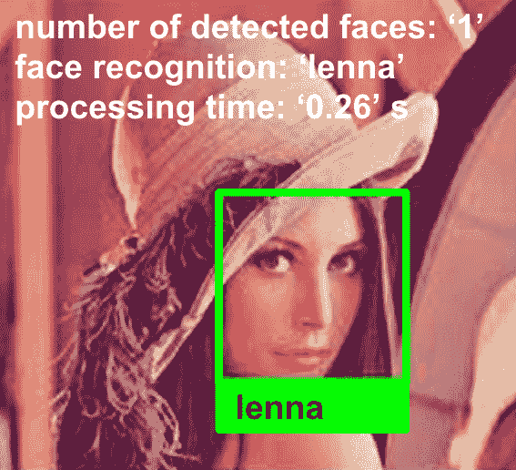

**假正例**是一个错误，其中结果指示存在条件，而实际上不满足条件（例如，椅子被分类为人脸）。 **假负例**是一个错误，其中结果指示不存在条件，而实际上应满足条件（例如，未检测到脸部）。

在本章中，我们将看到如何用不同的颜色绘制一些基本形状和文本。 为了对此进行介绍并回顾先前各章中的一些概念，我们将向您展示我们将在本章的大多数示例中使用的两个基本功能。 第一个功能是构建`colors`字典，该字典定义了要使用的主要颜色。 在下一个屏幕截图中，您可以看到它是如何工作的：

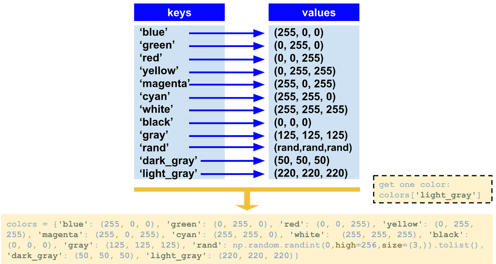

应该指出的是，这本词典仅用于培训和实践目的。 为了其他目的，您可以使用其他选项。 一种常见的方法是创建一个`constant.py`文件来定义颜色。 每种颜色由一个常量定义：

```py
"""
Common colors triplets (BGR space) to use in OpenCV
"""

BLUE = (255, 0, 0)
GREEN = (0, 255, 0)
RED = (0, 0, 255)
YELLOW = (0, 255, 255)
MAGENTA = (255, 0, 255)
CYAN = (255, 255, 0)
DARK_GRAY = (50, 50, 50)
...
```

以下代码将使您能够使用这些常量：

```py
import constant

# Getting red color:
print("red: '{}'".format(constant.RED))
```

常量通常以大写字母（例如`BLUE`）指定，单词之间带有下划线（例如`DARK_GRAY`）。

另外，当我们要使用 Matplotlib 绘制图形时，我们创建了带有两个参数的`show_with_matplotlib()`函数。 第一个是我们要显示的图像，第二个是要绘制的图形的标题。 因此，此功能的第一步是将`BGR`图像转换为`RGB`，因为您必须使用 Matplotlib 显示彩色图像。 此功能的第二个也是最后一个步骤是使用 Matplotlib 功能显示图像。 为了将这些片段放在一起，已对`testing_colors.py`脚本进行了编码。 在此脚本中，我们绘制了几行，每行以字典的颜色显示。

创建字典的代码如下所示：

```py
# Dictionary containing some colors
colors = {'blue': (255, 0, 0), 'green': (0, 255, 0), 'red': (0, 0, 255), 'yellow': (0, 255, 255), 'magenta': (255, 0, 255), 'cyan': (255, 255, 0), 'white': (255, 255, 255), 'black': (0, 0, 0), 'gray': (125, 125, 125), 'rand': np.random.randint(0, high=256, size=(3,)).tolist(), 'dark_gray': (50, 50, 50), 'light_gray': (220, 220, 220)}
```

您会看到此词典中包含一些预定义的颜色-`blue`，`green`，`red`，`yellow`，`magenta`，`cyan`，`white`，`black`，`gray`， 随机数`gray`，`dark_gray`和`light_gray`。 如果要使用特定的颜色（例如`magenta`），则应执行以下操作：

```py
colors['magenta']
```

或者，您可以使用`(255, 0, 255)`获得`magenta`颜色。 但是，使用此字典比写数字三元组更容易，因为您不需要记住 RGB 颜色空间的相加属性（将`blue`-`(255,0,0)`和`red`相加-`(0,0,255)`会得出`magenta` — `(255, 0, 255)`）。 请记住，您可以使用`constant.py`执行此功能。

如果您不知道这些数字是什么或代表什么，则应阅读第 2 章，“OpenCV 中的图像基础知识”，在此介绍了这些概念。

为了了解如何使用这两个功能，我们在本章的大多数示例中都使用了这些功能（`colors`函数和`show_with_matplotlib()`函数），我们创建了`testing_colors.py` 脚本。 如果执行它，您将看到下一个屏幕截图：

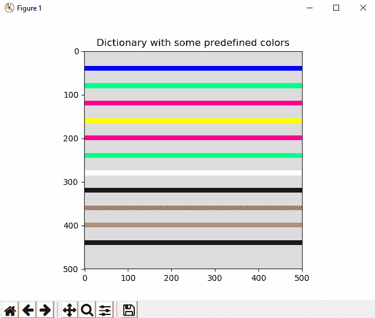

在此示例中，我们创建了大小为`500x500`的图像，具有`3`通道（我们需要彩色图像）和`uint8`类型（8 位无符号整数）。 我们用黑色背景创建了它：

```py
# We create the canvas to draw: 400 x 400 pixels, 3 channels, uint8 (8-bit unsigned integers)
# We set background to black using np.zeros()
image = np.zeros((500, 500, 3), dtype="uint8")
```

在这种情况下，我们想将背景设置为浅灰色，而不是黑色。 如果要更改背景，可以执行以下操作：

```py
# If you want another background color, you can do the following:
image[:] = colors['light_gray']
```

接下来，我们添加了绘制一些线的功能，每条线都使用字典的颜色。 应当注意，在下一节中，我们将看到如何创建一些基本形状，因此，如果您不了解创建线条的代码，请不要担心：

```py
# We draw all the colors to test the dictionary
# We draw some lines, each one in a color. To get the color, use 'colors[key]'
separation = 40
for key in colors:
cv2.line(image, (0, separation), (500, separation), colors[key], 10)
separation += 40
```

最后，我们使用创建的`show_with_matplotlib()`函数绘制图像：

```py
# Show image:
show_with_matplotlib(image, 'Dictionary with some predefined colors')
```

`show_with_matplotlib()`的两个参数是要绘制的图像和要显示的标题。 因此，现在我们准备开始使用 OpenCV 和 Python 创建一些基本形状。

# 绘制形状

在本节中，我们将看到如何使用 OpenCV 功能绘制形状。 首先，我们将研究如何绘制基本形状，然后将重点放在更高级的形状上。

# 基本形状 – 直线，矩形和圆形

在下一个示例中，我们将看到如何在 OpenCV 中绘制基本形状。 这些基本形状包括线条，矩形和圆形，它们是最常见且最简单的绘制形状。 第一步是创建将在其中绘制形状的图像。 为此，将创建带有`3`通道的`400x400`图像（以正确显示 BGR 图像）和`uint8`类型（8 位无符号整数）：

```py
# We create the canvas to draw: 400 x 400 pixels, 3 channels, uint8 (8-bit unsigned integers)
# We set the background to black using np.zeros()
image = np.zeros((400, 400, 3), dtype="uint8")
```

我们使用`colors` 字典将背景设置为浅灰色：

```py
# If you want another background color, you can do the following:
image[:] = colors['light_gray']
```

下一个屏幕截图显示了此画布（或图像）：


现在，我们准备绘制基本形状。 应该注意的是，OpenCV 提供的大多数绘图函数都有共同的参数。 为了简单起见，在此简要介绍这些参数：

*   `img`：是要绘制形状的图像。
*   `color`：它是用来绘制形状的颜色（BGR 三元组）。
*   `thickness`：如果该值为正，则是形状轮廓的厚度。 否则，将绘制填充形状。
*   `lineType`：这是形状边界的类型。 OpenCV 提供三种类型的线：
    *   `cv2.LINE_4`：这表示四线连接
    *   `cv2.LINE_8`：这表示八连接线
    *   `cv2.LINE_AA`：这表示抗锯齿线
*   `shift`：这表示与定义形状的某些点的坐标有关的小数位数。

结合上述参数，`lineType`的`cv2.LINE_AA`选项可产生质量更好的绘图（例如，在绘制文本时），但绘制速度较慢。 因此，应考虑这一因素。 八连接线和四连接线（均为非抗锯齿线）均使用 Bresenham 算法绘制。 对于抗锯齿线类型，使用高斯滤波算法。 另外，`shift`参数是必需的，因为许多绘图函数无法处理亚像素精度。 为了简单起见，我们将使用整数坐标。 因此，该值将设置为`0`（`shift = 0`）。 但是，为了让您有一个完整的了解，还将提供一个有关如何使用`shift`参数的示例。

请记住，对于本节中包含的所有示例，已经创建了一个画布来绘制所有形状。 此画布是`400 x 400`像素图像，背景为浅灰色。 请参阅前面的屏幕快照，其中显示了此画布。

# 绘制直线

我们将要看到的第一个功能是`cv2.line()`。 签名如下：

```py
img = line(img, pt1, pt2, color, thickness=1, lineType=8, shift=0)
```

此功能在`img`图像上画一条连接`pt1`和`pt2`的线：

```py
cv2.line(image, (0, 0), (400, 400), colors['green'], 3)
cv2.line(image, (0, 400), (400, 0), colors['blue'], 10)
cv2.line(image, (200, 0), (200, 400), colors['red'], 3)
cv2.line(image, (0, 200), (400, 200), colors['yellow'], 10)
```

对这些行进行编码后，我们调用`show_with_matplotlib(image, 'cv2.line()')`函数。 结果显示在下一个屏幕截图中：


# 绘制矩形

`cv2.rectangle()`函数的签名如下：

```py
img = rectangle(img, pt1, pt2, color, thickness=1, lineType=8, shift=0)
```

给定两个相对的角`pt1`和`pt2`，此函数绘制一个矩形：

```py
cv2.rectangle(image, (10, 50), (60, 300), colors['green'], 3)
cv2.rectangle(image, (80, 50), (130, 300), colors['blue'], -1)
cv2.rectangle(image, (150, 50), (350, 100), colors['red'], -1)
cv2.rectangle(image, (150, 150), (350, 300), colors['cyan'], 10)
```

绘制这些矩形后，我们调用`show_with_matplotlib(image, 'cv2.rectangle()')`函数。 结果显示在下一个屏幕截图中：


请记住，`thickness`参数的负值（例如`-1`）表示将绘制填充的形状。

# 绘制圆形

`cv2.circle()`函数的签名如下：

```py
img = circle(img, center, radius, color, thickness=1, lineType=8, shift=0)
```

此功能绘制一个以`center`位置为中心的`radius`半径的圆。 以下代码定义了一些圈子：

```py
cv2.circle(image, (50, 50), 20, colors['green'], 3)
cv2.circle(image, (100, 100), 30, colors['blue'], -1)
cv2.circle(image, (200, 200), 40, colors['magenta'], 10)
cv2.circle(image, (300, 300), 40, colors['cyan'], -1)
```

绘制这些圆之后，我们调用`show_with_matplotlib(image, 'cv2.circle()')`函数。 结果显示在下一个屏幕截图中：

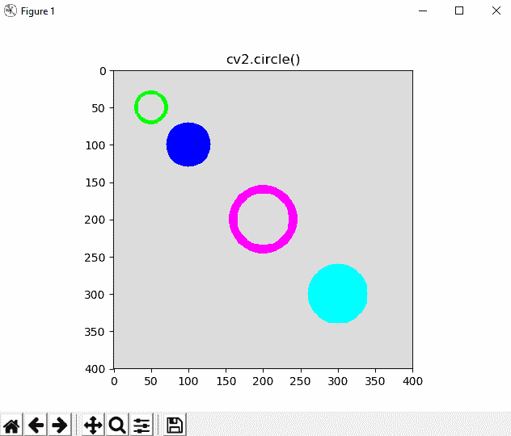

本节示例的完整代码可以在`basic_drawing.py`中看到。

# 了解高级形状

在本节中，我们将看到如何绘制剪切线，箭头线，椭圆和折线。 这些形状的绘制不像我们在上一节中看到的那样简单，但是它们很容易理解。 第一步是创建将在其中绘制形状的图像。 为此，使用`3`通道（以正确显示 BGR 图像）和`uint8`类型的`300 x 300`图像（8 位无符号整数）将被创建：

```py
# We create the canvas to draw: 300 x 300 pixels, 3 channels, uint8 (8-bit unsigned integers)
# We set the background to black using np.zeros()
image = np.zeros((300, 300, 3), dtype="uint8")
```

我们使用`colors`字典将背景设置为浅灰色：

```py
# If you want another background color, you can do the following:
image[:] = colors['light_gray']
```

此时，我们可以开始绘制新形状了。

# 绘制剪切线

`cv2.clipLine()`函数的签名如下：

```py
retval, pt1, pt2 = clipLine(imgRect, pt1, pt2)
```

`cv2.clipLine()`函数返回矩形内的段（由`pt1`和`pt2`输出点定义）（函数根据定义的矩形剪切片段）。 从这个意义上讲，如果两个原始`pt1`和`pt2`点都在矩形外部，则`retval`为`False`。 否则（两个`pt1`或`pt2`点中的一些在矩形内）此函数返回`True`。 在下一段代码中可以更清楚地看到这一点：

```py
cv2.line(image, (0, 0), (300, 300), colors['green'], 3)
cv2.rectangle(image, (0, 0), (100, 100), colors['blue'], 3)
ret, p1, p2 = cv2.clipLine((0, 0, 100, 100), (0, 0), (300, 300))
if ret:
    cv2.line(image, p1, p2, colors['yellow'], 3)
```

在下一个屏幕截图中，执行以下代码后，您可以看到结果图：


如您所见，由`p1`和`p2`点定义的线段显示为黄色，根据矩形剪切原始线段。 在这种情况下，`ret`为`True`，因为至少有一个点在矩形内，这就是绘制由`pt1`和`pt2`定义的黄色部分的原因。

# 绘制箭头

该函数的签名如下：

```py
cv.arrowedLine(img, pt1, pt2, color, thickness=1, lineType=8, shift=0, tipLength=0.1)
```

此功能允许您创建一个箭头，该箭头从`pt1`定义的第一个点指向`pt2`定义的第二个点。 箭头尖端的长度可以由`tipLength`参数控制，该参数相对于段长度（`pt1`和`pt2`之间的距离）定义：

```py
cv2.arrowedLine(image, (50, 50), (200, 50), colors['red'], 3, 8, 0, 0.1)
cv2.arrowedLine(image, (50, 120), (200, 120), colors['green'], 3, cv2.LINE_AA, 0, 0.3)
cv2.arrowedLine(image, (50, 200), (200, 200), colors['blue'], 3, 8, 0, 0.3)
```

如您所见，定义了三个箭头。 请参见下一个屏幕截图，其中绘制了这些箭头。 另外，请查看`cv2.LINE_AA`（您也可以写`16`）和`8`（您也可以写`cv2.LINE_8`）之间的区别：


在此示例中，我们结合了两个枚举（例如，`cv2.LINE_AA`）（或引起您的注意），或将`lineType`参数直接写入值（例如，`8`）。 这绝对不是一个好主意，因为它可能会使您感到困惑。 应该在您的所有代码中建立并维护一个标准。

# 绘制椭圆

该函数的签名如下：

```py
cv2.ellipse(img, center, axes, angle, startAngle, endAngle, color, thickness=1, lineType=8, shift=0)
```

此功能使您可以创建不同类型的椭圆。 `angle`参数（以度为单位）允许您旋转椭圆。 `axes`参数控制对应于轴尺寸一半的椭圆尺寸。 如果需要完整的椭圆，请`startAngle = 0`和`endAngle = 360`。 否则，应将这些参数调整为所需的椭圆弧（以度为单位）。 您还可以看到，通过为轴传递相同的值，您可以绘制一个圆：

```py
cv2.ellipse(image, (80, 80), (60, 40), 0, 0, 360, colors['red'], -1)
cv2.ellipse(image, (80, 200), (80, 40), 0, 0, 360, colors['green'], 3)
cv2.ellipse(image, (80, 200), (10, 40), 0, 0, 360, colors['blue'], 3)
cv2.ellipse(image, (200, 200), (10, 40), 0, 0, 180, colors['yellow'], 3)
cv2.ellipse(image, (200, 100), (10, 40), 0, 0, 270, colors['cyan'], 3)
cv2.ellipse(image, (250, 250), (30, 30), 0, 0, 360, colors['magenta'], 3)
cv2.ellipse(image, (250, 100), (20, 40), 45, 0, 360, colors['gray'], 3)
```

这些省略号可以在下一个屏幕截图中看到：

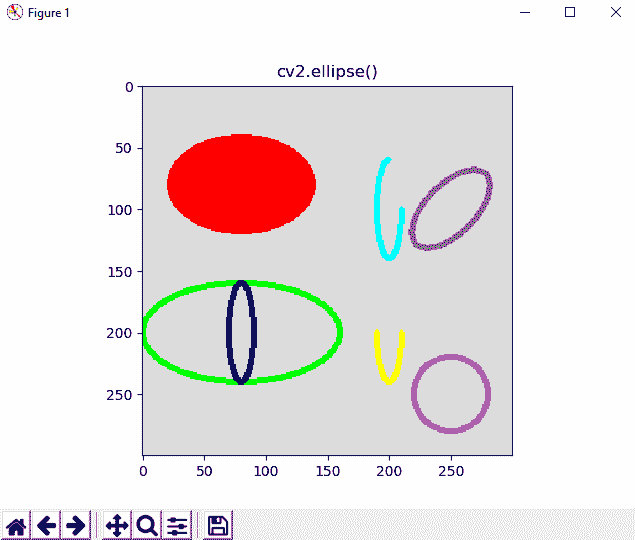

# 绘制多边形

该函数的签名如下：

```py
cv2.polylines(img, pts, isClosed, color, thickness=1, lineType=8, shift=0)
```

使用此功能可以创建多边形曲线。 此处的关键参数是`pts`，应在其中提供定义多边形曲线的数组。 该参数的形状应为`(number_vertex, 1, 2)`。 因此，一种常见的方法是通过使用`np.array`创建（`np.int32`类型的坐标）来定义它，然后对其进行重塑以匹配上述形状。 例如，要创建一个三角形，代码将如下所示：

```py
# These points define a triangle
pts = np.array([[250, 5], [220, 80], [280, 80]], np.int32)
# Reshape to shape (number_vertex, 1, 2)
pts = pts.reshape((-1, 1, 2))
# Print the shapes: this line is not necessary, only for visualization
print("shape of pts '{}'".format(pts.shape))
# this gives: shape of pts '(3, 1, 2)'
```

另一个重要参数是`isClosed`。 如果此参数为`True`，则多边形将被绘制为封闭状态。 否则，将不会绘制第一个顶点与最后一个顶点之间的线段，从而形成一个开放的多边形。 为了完整说明，为了绘制一个闭合的三角形，下面给出代码：

```py
# These points define a triangle
pts = np.array([[250, 5], [220, 80], [280, 80]], np.int32)
# Reshape to shape (number_vertex, 1, 2)
pts = pts.reshape((-1, 1, 2))
# Print the shapes: this line is not necessary, only for visualization
print("shape of pts '{}'".format(pts.shape))
# Draw this poligon with True option
cv2.polylines(image, [pts], True, colors['green'], 3)
```

同样，我们对五边形和矩形进行了编码，可以在下一个屏幕截图中看到它们：

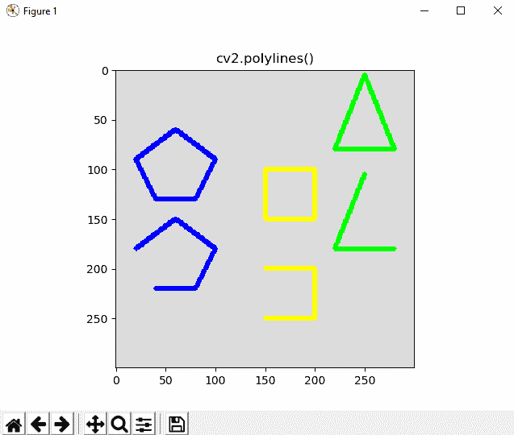

要查看本节的完整代码，您可以查看`basic_drawing_2.py`脚本。

# 绘图函数中的`shift`参数

某些以前的功能（带有`shift`参数的功能）可以与像素坐标结合使用，达到亚像素精度。 为了解决这个问题，您应该将坐标作为定点数字传递，并以整数编码。

定点数表示为整数（在小数点左边）和小数部分（在小数点右边）都保留了特定（固定）位数（位）。

因此，`shift`参数允许您指定小数位数（在小数点右边）。 最后，实点坐标计算如下：


例如，这段代码绘制了两个半径为`300`的圆。 其中之一使用`shift = 2`值提供子像素精度。 在这种情况下，应将原点和半径乘以`4`（`2^(shift = 2)`）的倍数：

```py
shift = 2
factor = 2 ** shift
print("factor: '{}'".format(factor))
cv2.circle(image, (int(round(299.99 * factor)), int(round(299.99 * factor))), 300 * factor, colors['red'], 1, shift=shift)
cv2.circle(image, (299, 299), 300, colors['green'], 1)
```

如果`shift = 3`，则因子的值为`8`（`2^(shift = 3)`），依此类推。 乘以`2`的幂与将对应于整数二进制表示的位左移一相同。 这样您可以绘制浮动坐标。 总结一下，我们还可以为`cv2.circle()`创建一个包装函数，该函数可以使用`shift`参数属性来处理浮点坐标`draw_float_circle()`。 接下来显示此示例的关键代码。 完整代码在`shift_parameter.py`脚本中定义：

```py
def draw_float_circle(img, center, radius, color, thickness=1, lineType=8, shift=4):
    """Wrapper function to draw float-coordinate circles

    """
    factor = 2 ** shift
    center = (int(round(center[0] * factor)), int(round(center[1] * factor)))
    radius = int(round(radius * factor))
    cv2.circle(img, center, radius, color, thickness, lineType, shift)

draw_float_circle(image, (299, 299), 300, colors['red'], 1, 8, 0)
draw_float_circle(image, (299.9, 299.9), 300, colors['green'], 1, 8, 1)
draw_float_circle(image, (299.99, 299.99), 300, colors['blue'], 1, 8, 2)
draw_float_circle(image, (299.999, 299.999), 300, colors['yellow'], 1, 8, 3)
```

# 绘图函数中的`lineType`参数

另一个常用参数是`lineType`，它可以采用三个不同的值。 我们之前曾评论过这三种类型之间的区别。 为了更清楚地看到它，请看下一个屏幕截图，其中我们绘制了三条具有相同粗细和倾斜度的线：`yellow = cv2.LINE_4`，`red = cv2.LINE_AA`和`green = cv2.LINE_8`。 要查看此示例的完整代码，可以检查`basic_line_types.py`脚本：

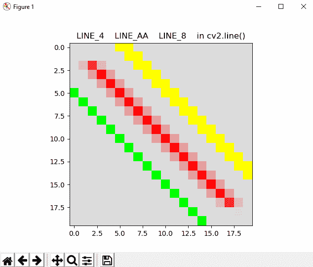

在上一个屏幕截图中，您可以清楚地看到使用三种不同的线型绘制一条线的区别。

# 绘制文字

OpenCV 还可以用于在图像中呈现文本。 在本节中，我们将看到如何使用`cv2.putText()`函数绘制文本。 此外，我们将看到您可以使用的所有可用字体。 最后，我们将看到一些与文本绘制有关的 OpenCV 函数。

# 绘制文字

`cv2.putText()`函数具有以下签名：

```py
img = cv.putText( img, text, org, fontFace, fontScale, color, thickness=1, lineType= 8, bottomLeftOrigin=False)
```

此函数使用由`fontFace`和`fontScale`因素提供的字体类型，从`org`坐标（如果是`bottomLeftOrigin = False`则为左上角，否则为左下角）开始绘制所提供的文本字符串。 结合此示例，您可以看到最后提供的参数`lineType`带有 OpenCV 中可用的三个不同值（`cv2.LINE_4`，`cv2.LINE_8`和`cv2.LINE_AA`）。 这样，在绘制这些类型时，您可以更好地看到差异。 请记住，`cv2.LINE_AA`的质量更好（抗锯齿线型），但是绘制速度比其他两种类型慢。 接下来给出绘制一些文本的关键代码。 该示例的完整代码可以在`text_drawing.py`脚本中看到：

```py
# We draw some text on the image:
cv2.putText(image, 'Mastering OpenCV4 with Python', (10, 30), cv2.FONT_HERSHEY_SIMPLEX, 0.9, colors['red'], 2, cv2.LINE_4)
cv2.putText(image, 'Mastering OpenCV4 with Python', (10, 70), cv2.FONT_HERSHEY_SIMPLEX, 0.9, colors['red'], 2, cv2.LINE_8)
cv2.putText(image, 'Mastering OpenCV4 with Python', (10, 110), cv2.FONT_HERSHEY_SIMPLEX, 0.9, colors['red'], 2, cv2.LINE_AA)

# Show image:
show_with_matplotlib(image, 'cv2.putText()')
```

在下一个屏幕截图中，您可以看到结果：

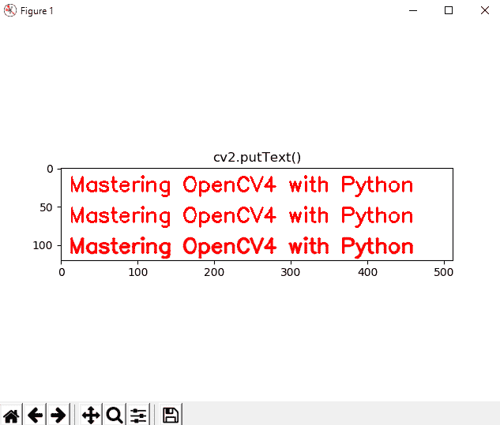

在此示例中，背景色设置为白色。 要执行此功能，您可以执行以下操作：

```py
image.fill(255)
```

# 使用所有 OpenCV 文本字体

OpenCV 中所有可用的字体如下：

*   `FONT_HERSHEY_SIMPLEX = 0`
*   `FONT_HERSHEY_PLAIN = 1`
*   `FONT_HERSHEY_DUPLEX = 2`
*   `FONT_HERSHEY_COMPLEX = 3`
*   `FONT_HERSHEY_TRIPLEX = 4`
*   `FONT_HERSHEY_COMPLEX_SMALL = 5`
*   `FONT_HERSHEY_SCRIPT_SIMPLEX = 6`
*   `FONT_HERSHEY_SCRIPT_COMPLEX = 7`

与此相关，我们对`text_drawing_fonts.py`脚本进行了编码，该脚本绘制了所有可用字体。 由于所有这些字体都在`(0-7)`范围内，因此我们可以迭代并调用`cv2.putText()`函数，从而更改`color`，`fontFace`和`org`参数。 我们还绘制了这些字体的小写和大写版本。 执行此功能的关键代码如下：

```py
position = (10, 30)
for i in range(0, 8):
    cv2.putText(image, fonts[i], position, i, 1.1, colors[index_colors[i]], 2, cv2.LINE_4)
    position = (position[0], position[1] + 40)
    cv2.putText(image, fonts[i].lower(), position, i, 1.1, colors[index_colors[i]], 2, cv2.LINE_4)
    position = (position[0], position[1] + 40)
```

生成的屏幕截图如下所示：

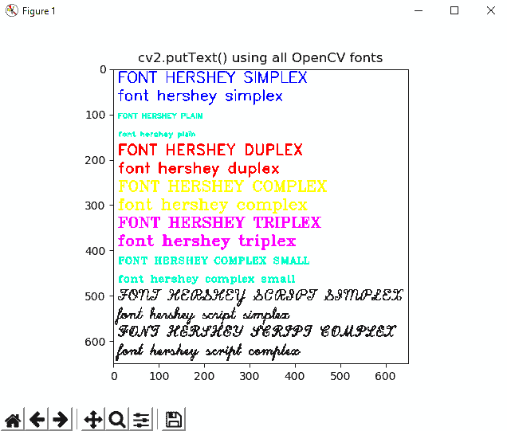

在上一个屏幕截图中，您可以看到 OpenCV 中所有可用的字体（小写和大写版本）。 因此，您可以将此屏幕截图用作参考，以轻松检查要在项目中使用的字体。

# 与文字相关的更多函数

OpenCV 提供了更多与文本绘制有关的功能。 应当注意，这些功能不是用于绘制文本，而是可以用于对上述`cv2.putText()`函数进行*补充*，它们的评论如下。 我们要看到的第一个功能是`cv2.getFontScaleFromHeight()`。 该函数的签名如下：

```py
retval = cv2.getFontScaleFromHeight(fontFace, pixelHeight, thickness=1)
```

此函数返回字体比例（`fontScale`），这是在`cv2.putText()`函数中使用的参数，以达到所提供的高度（以像素为单位），并且同时考虑了字体类型（`fontFace`）和`thickness`。

第二个功能是`cv2.getTextSize()`：

```py
retval, baseLine = cv2.getTextSize(text, fontFace, fontScale, thickness)
```

此函数可用于基于以下参数获取文字大小（宽度和高度）：`text`，字体类型`fontFace`，`scale`和`thickness`。 此函数返回`size`和`baseLine`，它们对应于基线相对于文本底部的`y`坐标。 下一段代码向您展示了查看此功能的关键方面。 完整代码可在`text_drawing_bounding_box.py`脚本中找到：

```py
# assign parameters to use in the drawing functions
font = cv2.FONT_HERSHEY_SIMPLEX
font_scale = 2.5
thickness = 5
text = 'abcdefghijklmnopqrstuvwxyz'
circle_radius = 10

# We get the size of the text
ret, baseline = cv2.getTextSize(text, font, font_scale, thickness)

# We get the text width and text height from ret
text_width, text_height = ret

# We center the text in the image
text_x = int(round((image.shape[1] - text_width) / 2))
text_y = int(round((image.shape[0] + text_height) / 2))

# Draw this point for reference:
cv2.circle(image, (text_x, text_y), circle_radius, colors['green'], -1)

# Draw the rectangle (bounding box of the text)
cv2.rectangle(image, (text_x, text_y + baseline), (text_x + text_width - thickness, text_y - text_height),
              colors['blue'], thickness)

# Draw the circles defining the rectangle
cv2.circle(image, (text_x, text_y + baseline), circle_radius, colors['red'], -1)
cv2.circle(image, (text_x + text_width - thickness, text_y - text_height), circle_radius, colors['cyan'], -1)

# Draw the baseline line
cv2.line(image, (text_x, text_y + int(round(thickness/2))), (text_x + text_width - thickness, text_y +
                                                             int(round(thickness/2))), colors['yellow'], thickness)
# Write the text centered in the image
cv2.putText(image, text, (text_x, text_y), font, font_scale, colors['magenta'], thickness)
```

下一个屏幕截图给出了此示例的输出：


注意如何绘制三个小点（`red`，`cyan`和`green`），以及如何显示黄色基线。

# 使用鼠标事件的动态绘图

在本节中，您将学习如何使用鼠标事件执行动态绘图。 我们将以复杂度递增的顺序来查看一些示例。

# 绘制动态形状

下一个示例向您介绍如何使用 OpenCV 处理鼠标事件。 `cv2.setMouseCallback()`函数执行此功能。 此方法的签名如下：

```py
cv2.setMouseCallback(windowName, onMouse, param=None)
```

此函数为名为`windowName`的窗口建立鼠标处理程序。 `onMouse`函数是回调函数，当执行鼠标事件时（例如，双击，按下鼠标左键，按下鼠标左键等），将调用该函数。 可选的`param`参数用于将其他信息传递给`callback`函数。

因此，第一步是创建`callback`函数：

```py
# This is the mouse callback function:
def draw_circle(event, x, y, flags, param):
    if event == cv2.EVENT_LBUTTONDBLCLK:
        print("event: EVENT_LBUTTONDBLCLK")
        cv2.circle(image, (x, y), 10, colors['magenta'], -1)

    if event == cv2.EVENT_MOUSEMOVE:
        print("event: EVENT_MOUSEMOVE")

    if event == cv2.EVENT_LBUTTONUP:
        print("event: EVENT_LBUTTONUP")

    if event == cv2.EVENT_LBUTTONDOWN:
        print("event: EVENT_LBUTTONDOWN")
```

`draw_circle()`函数接收特定事件以及每个鼠标事件的坐标`(x, y)`。 在这种情况下，当执行左键双击（`cv2.EVENT_LBUTTONDBLCLK`）时，我们在事件的相应`(x, y)`坐标中绘制一个圆。

此外，我们还打印了一些消息以查看其他产生的事件，但是我们不使用它们执行任何其他操作。

下一步是创建一个命名窗口。 在这种情况下，我们将其命名为`Image mouse`。 此命名窗口是鼠标回调函数将与之关联的位置：

```py
# We create a named window where the mouse callback will be established
cv2.namedWindow('Image mouse')
```

最后，我们将鼠标回调函数设置（或激活）为之前创建的函数：

```py
# We set the mouse callback function to 'draw_circle'
cv2.setMouseCallback('Image mouse', draw_circle)
```

总之，当执行左双击时，将以执行的双击的`(x, y)`位置为中心绘制一个填充的洋红色圆圈。 该示例的完整代码可以在`mouse_drawing.py`脚本中看到。

# 绘制文字和形状

在此示例中，我们将鼠标事件和图形文本结合在一起。 从这种意义上讲，将渲染一些文本以显示如何使用鼠标事件来执行特定操作。 为了更好地理解此示例，在下一个屏幕截图中，您可以看到渲染的文本：

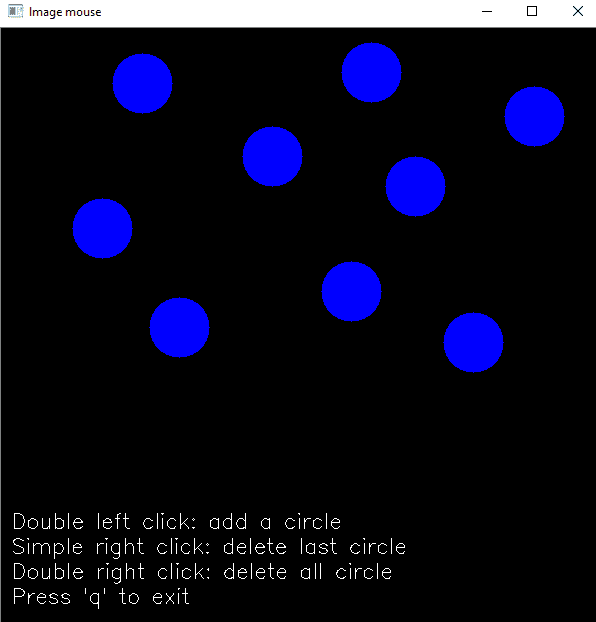

您可以执行以下操作：

*   使用鼠标左键双击添加一个圆
*   只需单击鼠标左键即可删除最后添加的圆圈
*   双击右键删除所有圆圈

为了执行此功能，我们创建了一个名为`circles`的列表，其中维护着用户选择的当前圈子。 此外，我们还使用渲染的文本创建了一个*备份*图像。 产生鼠标事件时，我们从`circles`列表中添加或删除圆圈。 然后，在绘制时，我们仅绘制列表中的当前圆。 因此，例如，当用户执行简单的右键单击时，最后一个添加的圆圈将从列表中删除。 完整代码在`mouse_drawing_circles_and_text.py`脚本中提供。

# Matplotlib 事件处理

您可以在前面的示例中看到我们没有使用 Matplotlib 来显示图像。 这是因为 Matplotlib 也可以处理事件处理和选择。 因此，您可以使用 Matplotlib 功能捕获鼠标事件。 [我们可以使用 Matplotlib 连接更多事件](https://matplotlib.org/users/event_handling.html)。 例如，关于鼠标，我们可以连接以下事件-`button_press_event`，`button_release_event`，`motion_notify_event`和`scroll_event`。

我们将展示一个简单的示例，以便在与`button_press_event`事件相关的单击鼠标时渲染一个圆形：

```py
# 'button_press_event' is a MouseEvent where a mouse botton is click (pressed)
# When this event happens the function 'click_mouse_event' is called:
figure.canvas.mpl_connect('button_press_event', click_mouse_event)
```

我们还必须为`button_press_event`事件定义事件监听器：

```py
# We define the event listener for the 'button_press_event':
def click_mouse_event(event):
    # (event.xdata, event.ydata) contains the float coordinates of the mouse click event:
    cv2.circle(image, (int(round(event.xdata)), int(round(event.ydata))), 30, colors['blue'], cv2.FILLED)
    # Call 'update_image()' method to update the Figure:
    update_img_with_matplotlib()
```

因此，执行鼠标单击时，将显示`blue`圆圈。 应当指出，我们已经对`update_img_with_matplotlib()`函数进行了编码。 在前面的示例中，我们使用了`show_with_matplotlib()`。 `show_with_matplotlib()`函数用于使用 Matplotlib 显示图像，而`update_img_with_matplotlib()`用于更新现有图形。 该示例的完整代码可以在`matplotlib_mouse_events.py`脚本中看到。

# 高级绘图

在本节中，我们将看到如何结合上述某些功能以在 OpenCV 中绘制基本形状（例如，线，圆，矩形和文本等）以呈现更高级的绘图。 为了将所有这些部分放在一起，我们构建了一个模拟时钟来向您显示当前时间（小时，分钟和秒）。 为此，编写了两个脚本：

*   `analog_clock_values.py`
*   `analog_clock_opencv.py`

`analog_clock_opencv.py`脚本使用`cv.line()`，`cv.circle()`，`cv.rectangle()`和`cv2.putText()`绘制模拟时钟。 在此脚本中，我们首先绘制静态图形。 从这个意义上讲，您可以看到有两个数组包含*固定的*坐标：

```py
hours_orig = np.array(
    [(620, 320), (580, 470), (470, 580), (320, 620), (170, 580), (60, 470), (20, 320), (60, 170), (169, 61), (319, 20),
     (469, 60), (579, 169)])

hours_dest = np.array(
    [(600, 320), (563, 460), (460, 562), (320, 600), (180, 563), (78, 460), (40, 320), (77, 180), (179, 78), (319, 40),
     (459, 77), (562, 179)])
```

这些数组是绘制小时标记所必需的，因为它们定义了时钟每一小时的线条的起点和终点。 因此，这些标记绘制如下：

```py
for i in range(0, 12):
    cv2.line(image, array_to_tuple(hours_orig[i]), array_to_tuple(hours_dest[i]), colors['black'], 3)
```

此外，绘制了一个大圆圈，对应于模拟时钟的形状：

```py
cv2.circle(image, (320, 320), 310, colors['dark_gray'], 8)
```

最后，我们绘制包含`Mastering OpenCV 4 with Python` 文本的矩形，该文本将在时钟内渲染：

```py
cv2.rectangle(image, (150, 175), (490, 270), colors['dark_gray'], -1)
cv2.putText(image, "Mastering OpenCV 4", (150, 200), 1, 2, colors['light_gray'], 1, cv2.LINE_AA)
cv2.putText(image, "with Python", (210, 250), 1, 2, colors['light_gray'], 1, cv2.LINE_AA)
```

在图像中绘制出此静态信息后，我们将其复制到`image_original`图像中：

```py
image_original = image.copy()
```

要绘制动态信息，执行几个步骤：

1.  获取当前时间的小时，分​​钟和秒：

```py
# Get current date:
date_time_now = datetime.datetime.now()
# Get current time from the date:
time_now = date_time_now.time()
# Get current hour-minute-second from the time:
hour = math.fmod(time_now.hour, 12)
minute = time_now.minute
second = time_now.second
```

2.  将这些值（小时，分钟和秒）转换为角度：

```py
# Get the hour, minute and second angles:
second_angle = math.fmod(second * 6 + 270, 360)
minute_angle = math.fmod(minute * 6 + 270, 360)
hour_angle = math.fmod((hour*30) + (minute/2) + 270, 360)
```

3.  绘制与时针，分针和秒针相对应的线：

```py
# Draw the lines corresponding to the hour, minute and second needles:
second_x = round(320 + 310 * math.cos(second_angle * 3.14 / 180))
second_y = round(320 + 310 * math.sin(second_angle * 3.14 / 180))
cv2.line(image, (320, 320), (second_x, second_y), colors['blue'], 2)

minute_x = round(320 + 260 * math.cos(minute_angle * 3.14 / 180))
minute_y = round(320 + 260 * math.sin(minute_angle * 3.14 / 180))
cv2.line(image, (320, 320), (minute_x, minute_y), colors['blue'], 8)

hour_x = round(320 + 220 * math.cos(hour_angle * 3.14 / 180))
hour_y = round(320 + 220 * math.sin(hour_angle * 3.14 / 180))
cv2.line(image, (320, 320), (hour_x, hour_y), colors['blue'], 10)
```

4.  最后，绘制一个小圆圈，对应于三个针的连接点：

```py
cv2.circle(image, (320, 320), 10, colors['dark_gray'], -1)
```

在下一个屏幕截图中，您可以看到模拟时钟的外观：


`script analog_clock_values.py`脚本计算`hours_orig`和`hours_dest`数组的固定坐标。 要计算小时标记的`(x, y)`坐标，我们使用圆的参数方程式，如下面的屏幕截图所示：


我们已按照上一个屏幕快照中的公式计算了每`30`度并从`0`度开始的 12 个点`P(x, y)`的坐标（`0`，`30` ，`60`，`90`，`120`，`150`，`180`，`210`，`240`，`270`，`300`和`330`）具有两个不同的半径。 这样，我们可以为定义小时标记的线定义坐标。 计算这些坐标的代码如下：

```py
radius = 300
center = (320, 320)

for x in (0, 30, 60, 90, 120, 150, 180, 210, 240, 270, 300, 330):
    x_coordinate = center[0] + radius * math.cos(x * 3.14/180)
    y_coordinate = center[1] + radius * math.sin(x * 3.14/180)
    print("x: {} y: {}".format(round(x_coordinate), round(y_coordinate)))

for x in (0, 30, 60, 90, 120, 150, 180, 210, 240, 270, 300, 330):
    x_coordinate = center[0] + (radius - 20) * math.cos(x * 3.14/180)
    y_coordinate = center[1] + (radius - 20) * math.sin(x * 3.14/180)
    print("x: {} y: {}".format(round(x_coordinate), round(y_coordinate)))
```

该脚本的完整代码可以在`analog_clock_values.py`中看到。 应该注意的是，我们可能已经在其他脚本中包含了用于计算这些坐标的代码，但这对您来说是一个很好的练习。

# 总结

在本章中，我们回顾了 OpenCV 提供的与图形形状和文本有关的功能。 关于形状，我们已经看到了如何绘制非常基本的形状（直线，矩形和圆形），以及更高级的形状（直线，箭头，椭圆和多边形）。 在文本方面，我们已经看到了如何绘制文本以及如何在 OpenCV 库中呈现所有可用字体。 此外，我们还介绍了如何捕获鼠标事件并使用它们执行特定的操作（例如，绘制与执行的鼠标事件的`(x, y)`坐标关联的点）。 最后，我们绘制了一个模拟时钟，试图总结本章的所有先前概念。

在下一章中，我们将看到有关图像处理技术的主要概念。 我们还将解决如何执行基本的图像转换（例如，平移，旋转，调整大小，翻转和裁剪）。 另一个关键方面是如何对图像执行基本算术，例如按位运算（AND，OR，XOR 和 NOT）。 最后，我们将介绍主要的颜色空间和颜色图。

# 问题

1.  您应该正确配置哪个参数以绘制填充形状（例如，圆形或矩形）？
2.  您应该正确配置哪个参数以绘制抗锯齿线型？
3.  创建一条从`(0, 0)`开始到`(512, 512)`结束的对角线。
4.  使用所需的参数呈现文本`Hello OpenCV`。
5.  使用 12 个点绘制一个多边形（圆形）。
6.  双击时使用鼠标事件和 Matplotlib 事件绘制一个矩形。
7.  尝试使用`lenna.png`图像作为背景绘制这个非常简单的模因生成器：

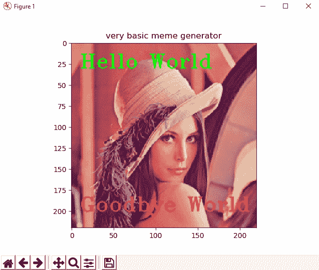

# 进一步阅读

以下参考资料将帮助您更深入地了解 Matplotlib：

*   [《掌握 matplotlib》，作者 Duncan M. McGreggor](https://www.packtpub.com/big-data-and-business-intelligence/mastering-matplotlib)
*   [《适用于 Python 开发人员的 Matplotlib》，作者 Benjamin Keller](https://www.packtpub.com/big-data-and-business-intelligence/matplotlib-python-developers-video)