# 分割技术

**图像分割**是许多计算机视觉应用中的关键过程。 它通常用于将图像划分为不同的区域，理想情况下，这些区域对应于从背景提取的现实世界对象。 因此，图像分割是图像识别和内容分析的重要步骤。 图像阈值化是一种简单但有效的图像分割方法，其中，根据像素的强度值对像素进行分割，因此，可以将其用于将图像分割为前景和背景。

在本章中，您将学习阈值技术在计算机视觉项目中的重要性。 我们将审查 OpenCV（以及 Scikit-image 图像处理库）提供的主要阈值技术，这些技术将在计算机视觉应用中用作图像分割的关键部分。

本章的主要部分如下：

*   阈值技术简介
*   简单阈值技术
*   自适应阈值技术
*   大津阈值算法
*   三角阈值算法
*   彩色图像的阈值
*   使用 scikit-image 的阈值算法

# 技术要求

技术要求如下：

*   Python 和 OpenCV。
*   特定于 Python 的 IDE。
*   NumPy 和 Matplotlib 包。
*   scikit-image 图像处理库（对于本章的最后部分是可选的。请参阅 scikit-image 阈值算法以了解如何为基于 Conda 的发行版安装它）。 请参阅以下说明，以便使用`pip`进行安装。
*   还需要 SciPy 库（对于本章的最后部分是可选的）。 请参阅以下说明，以便使用`pip`进行安装。
*   一个 Git 客户端。

有关如何安装这些要求的更多详细信息，请参见第 1 章，“设置 OpenCV”。 可通过 [github](https://github.com/PacktPublishing/Mastering-OpenCV-4-with-Python) 访问《精通 Python OpenCV4》的 GitHub 存储库，其中包含从本书第一章到最后一章的所有必要的支持项目文件。。

# 安装 scikit-image

要安装 [scikit-image](https://pypi.org/project/scikit-image/)，请使用以下命令：

```py
$ pip install scikit-image
```

或者，您也可以为基于 Conda 的发行版安装 scikit-image，如使用该库的特定部分所述。

要检查安装是否正确执行，只需打开 Python shell 并尝试按以下方式导入`scikit-image`库：

```py
python
import skimage
```

# 安装 SciPy

要安装 [SciPy](https://pypi.org/project/scipy/)，请使用以下命令：

```py
$ pip install scipy
```

要检查安装是否正确执行，只需打开 Python shell 并尝试按以下方式导入`scipy`库：

```py
python
import scipy
```

请记住，推荐的方法是在虚拟环境中安装包。 请参阅第 1 章，“设置 OpenCV”，以了解如何创建和管理虚拟环境。

# 阈值技术简介

**阈值**是一种简单而有效的方法，可将图像划分为前景和背景。 图像分割的目的是将图像的表示形式修改为更易于处理的另一种表示形式。 例如，图像分割通常用于根据对象的某些属性（例如颜色，边缘或直方图）从背景中提取对象。 如果像素强度小于某个预定义常数（阈值），则最简单的阈值化方法将源图像中的每个像素替换为黑色像素；如果像素强度大于阈值，则将像素替换为白色像素。

OpenCV 提供`cv2.threshold()`函数以对图像进行阈值处理。 我们将在本章接下来的小节中详细介绍该函数。

在`thresholding_introduction.py`脚本中，我们将`cv2.threshold()`函数与一些预定义的阈值一起应用-`0`，`50`，`100`，`150`，`200`和`250`，以便查看对于不同的阈值图像如何变化。

例如，要使用`thresh = 50`的阈值对图像进行阈值处理，代码如下：

```py
ret1, thresh1 = cv2.threshold(gray_image, 50, 255, cv2.THRESH_BINARY)
```

在此，`thresh1`是阈值图像，是黑白图像。 强度小于`50`的像素将为黑色，强度大于`50`的像素将为白色。

在下面的代码中可以看到另一个示例，其中`thresh5`对应于阈值图像：

```py
ret5, thresh5 = cv2.threshold(gray_image, 200, 255, cv2.THRESH_BINARY)
```

在这种情况下，强度小于`200`的像素将为黑色，强度大于`200`的像素将为白色。

在以下屏幕截图中可以看到上述脚本的输出：

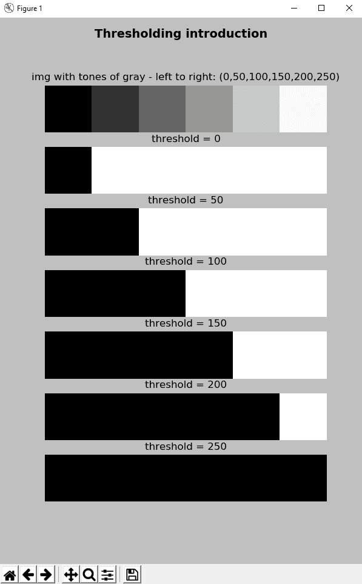

在此屏幕截图中，您可以看到源图像，它是一个示例图像，其中一些大小相同的区域填充了不同的灰色调。 更具体地，这些灰色色调是`0`，`50`，`100`，`150`，`200`和`250`。 `build_sample_image()`函数按以下方式构建此样本图像：

```py
def build_sample_image():
   """Builds a sample image with 50x50 regions of different tones of gray"""

    # Define the different tones.
    # The end of interval is not included
    tones = np.arange(start=50, stop=300, step=50)
    # print(tones)

    # Initialize result with the first 50x50 region with 0-intensity level
    result = np.zeros((50, 50, 3), dtype="uint8")

    # Build the image concatenating horizontally the regions:
    for tone in tones:
        img = np.ones((50, 50, 3), dtype="uint8") * tone
        result = np.concatenate((result, img), axis=1)

    return result
```

简要描述了用于构建此示例图像的 NumPy 操作（`np.ones()`，`np.zeros()`，`np.arange()`，`np.concatenate()`和`np.fliplr()`）：

*   `np.ones()`：这将返回给定形状和类型的数组，并填充为 1； 在这种情况下，形状为`(50, 50, 3)`和`dtype="uint8"`。
*   `np.zeros()`：这将返回给定形状和类型的数组，并用零填充； 在这种情况下，形状为`(50, 50, 3)`和`dtype="uint8"`。
*   `np.arange()`：考虑到提供的步骤，它会在给定的间隔内返回均匀间隔的值。 不包括间隔的末尾（在这种情况下为`300`）。
*   `np.concatenate()`：这将沿着现有轴（在本例中为`axis=1`）连接一系列数组，以水平连接图像。

构建样本图像后，下一步是使用不同的阈值对其进行阈值处理。 在这种情况下，阈值是`0`，`50`，`100`，`150`，`200`和`250`。

您将看到阈值与样本图像中不同的灰度色调相同。 用不同的阈值对样本图像进行阈值处理的代码如下：

```py
ret1, thresh1 = cv2.threshold(gray_image, 0, 255, cv2.THRESH_BINARY)
ret2, thresh2 = cv2.threshold(gray_image, 50, 255, cv2.THRESH_BINARY)
ret3, thresh3 = cv2.threshold(gray_image, 100, 255, cv2.THRESH_BINARY)
ret4, thresh4 = cv2.threshold(gray_image, 150, 255, cv2.THRESH_BINARY)
ret5, thresh5 = cv2.threshold(gray_image, 200, 255, cv2.THRESH_BINARY)
ret6, thresh6 = cv2.threshold(gray_image, 250, 255, cv2.THRESH_BINARY)
```

您可以根据阈值和样本图像的不同灰度色调，看到阈值化后的黑白图像如何变化。

在对图像进行阈值处理后，共同的输出是黑白图像。 在前面的章节中，屏幕截图的背景也是白色的。 在本章中，为了进行适当的可视化，我们已使用`fig.patch.set_facecolor('silver')`将屏幕快照的背景更改为`silver`颜色。

# 简单阈值

为了执行简单的阈值处理，OpenCV 提供了`cv2.threshold()`函数，该函数在上一节中进行了简要介绍。 此方法的签名如下：

```py
cv2.threshold(src, thresh, maxval, type, dst=None) -> retval, dst
```

`cv2.threshold()`函数将固定级别的阈值应用于`src`输入数组（多通道，8 位或 32 位浮点）。 固定级别由`thresh`参数调整，该参数设置阈值。 `type`参数设置阈值类型，这将在下一个小节中进一步说明。

不同的类型如下：

*   `cv2.THRESH_BINARY`
*   `cv2.THRESH_BINARY_INV`
*   `cv2.THRESH_TRUNC`
*   `cv2.THRESH_TOZERO`
*   `cv2.THRESH_TOZERO_INV`
*   `cv2.THRESH_OTSU`
*   `cv2.THRESH_TRIANGLE`

此外，`maxval`参数设置最大值，仅与`cv2.THRESH_BINARY`和`cv2.THRESH_BINARY_INV`阈值类型一起使用。 最后，仅在`cv2.THRESH_OTSU`和`cv2.THRESH_TRIANGLE`阈值类型中，输入图像应为单通道。

在本节中，我们将检查所有可能的配置以了解所有这些参数。

# 阈值类型

阈值操作的类型根据其公式描述。 考虑到`src`是源（原始）图像，而`dst`对应于阈值化后的目标（结果）图像。 从这个意义上讲，`src(x, y)`对应于源图像像素`(x, y)`的强度，而`dst(x, y)`将对应于目标图像的像素`(x, y)`的强度。

这是`cv2.THRESH_BINARY`的公式：


因此，如果像素`src(x, y)`的强度高于`thresh`，则将新像素强度设置为`maxval`参数。 否则，将像素设置为`0`。

这是`cv2.THRESH_BINARY_INV`的公式：


因此，如果像素`src(x, y)`的强度高于`thresh`，则新像素强度设置为`0`。 否则，将其设置为`maxval`。

这是`cv2.THRESH_TRUNC`的公式：


因此，如果像素`src(x, y)`的强度高于`thresh`，则新像素强度设置为`threshold`。 否则，将其设置为`src(x, y)`。

这是`cv2.THRESH_TOZERO`的公式：


因此，如果像素`src(x, y)`的强度高于`thresh`，则新像素值将设置为`src(x, y)`。 否则，将其设置为`0`。

这是`cv2.THRESH_TOZERO_INV`的公式：


因此，如果像素`src(x, y)`的强度大于`thresh`，则新像素值将设置为`0`。 否则，将其设置为`src(x, y)`。

另外，可以将特殊的`cv2.THRESH_OTSU`和`cv2.THRESH_TRIANGLE`值与先前引入的值之一`cv2.THRESH_BINARY`，`cv2.THRESH_BINARY_INV`，`cv2.THRESH_TRUNC`，`cv2.THRESH_TOZERO`和`cv2.THRESH_TOZERO_INV`组合在一起。 在这些情况下（`cv2.THRESH_OTSU`和`cv2.THRESH_TRIANGLE`），阈值运算（仅对 8 位图像实现）将计算最佳阈值，而不是指定的`thresh`值。 应当注意，阈值操作返回计算出的最佳阈值。

`thresholding_simple_types.py`脚本可帮助您了解上述类型。 我们使用上一节中介绍的相同样本图像，并对所有先前类型使用固定阈值（`thresh = 100`）执行阈值操作。

执行此操作的关键代码如下：

```py
ret1, thresh1 = cv2.threshold(gray_image, 100, 255, cv2.THRESH_BINARY)
ret2, thresh2 = cv2.threshold(gray_image, 100, 220, cv2.THRESH_BINARY)
ret3, thresh3 = cv2.threshold(gray_image, 100, 255, cv2.THRESH_BINARY_INV)
ret4, thresh4 = cv2.threshold(gray_image, 100, 220, cv2.THRESH_BINARY_INV)
ret5, thresh5 = cv2.threshold(gray_image, 100, 255, cv2.THRESH_TRUNC)
ret6, thresh6 = cv2.threshold(gray_image, 100, 255, cv2.THRESH_TOZERO)
ret7, thresh7 = cv2.threshold(gray_image, 100, 255, cv2.THRESH_TOZERO_INV)
```

如前所述，`maxval`参数将最大值设置为仅与`cv2.THRESH_BINARY`和`cv2.THRESH_BINARY_INV`阈值类型一起使用。 在此示例中，我们为`cv2.THRESH_BINARY`和`cv2.THRESH_BINARY_INV`类型将`maxval`的值设置为`255`和`220`，以查看阈值图像在两种情况下如何变化。 下一个屏幕截图中可以看到此脚本的输出：

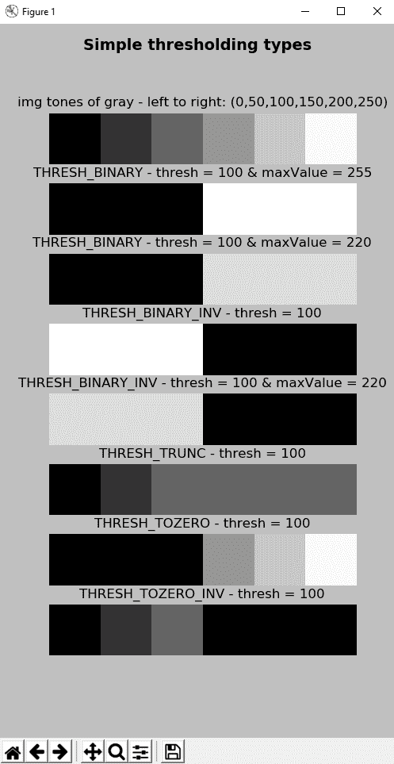

在上一个屏幕截图中，您既可以看到原始灰度图像，也可以看到所执行的七个阈值操作的结果。 此外，您可以看到`maxval`参数的效果，该参数仅与`cv2.THRESH_BINARY`和`cv2.THRESH_BINARY_INV`阈值类型一起使用。 更具体地说，例如，参见第一和第二阈值运算结果之间的差异（结果图像中的白色与灰色之间的差异），以及第三和第四阈值运算结果之间的差异（结果图像中的白色与灰色之间的差异）。

# 应用于真实图像的简单阈值

在前面的示例中，我们将简单的阈值操作应用于定制图像，以查看不同参数的工作方式。 在本节中，我们将`cv2.threshold()`应用于实际图像。 `thresholding_example.py`脚本执行此操作。 我们对`cv2.threshold()`函数应用了不同的阈值，如下所示– `60,70,80,90,100,110,120,130`：

```py
ret1, thresh1 = cv2.threshold(gray_image, 60, 255, cv2.THRESH_BINARY)
ret2, thresh2 = cv2.threshold(gray_image, 70, 255, cv2.THRESH_BINARY)
ret3, thresh3 = cv2.threshold(gray_image, 80, 255, cv2.THRESH_BINARY)
ret4, thresh4 = cv2.threshold(gray_image, 90, 255, cv2.THRESH_BINARY)
ret5, thresh5 = cv2.threshold(gray_image, 100, 255, cv2.THRESH_BINARY)
ret6, thresh6 = cv2.threshold(gray_image, 110, 255, cv2.THRESH_BINARY)
ret7, thresh7 = cv2.threshold(gray_image, 120, 255, cv2.THRESH_BINARY)
ret8, thresh8 = cv2.threshold(gray_image, 130, 255, cv2.THRESH_BINARY)
```

最后，我们显示阈值图像，如下所示：

```py
show_img_with_matplotlib(cv2.cvtColor(thresh1, cv2.COLOR_GRAY2BGR), "threshold = 60", 2)
show_img_with_matplotlib(cv2.cvtColor(thresh2, cv2.COLOR_GRAY2BGR), "threshold = 70", 3)
show_img_with_matplotlib(cv2.cvtColor(thresh3, cv2.COLOR_GRAY2BGR), "threshold = 80", 4)
show_img_with_matplotlib(cv2.cvtColor(thresh4, cv2.COLOR_GRAY2BGR), "threshold = 90", 5)
show_img_with_matplotlib(cv2.cvtColor(thresh5, cv2.COLOR_GRAY2BGR), "threshold = 100", 6)
show_img_with_matplotlib(cv2.cvtColor(thresh6, cv2.COLOR_GRAY2BGR), "threshold = 110", 7)
show_img_with_matplotlib(cv2.cvtColor(thresh7, cv2.COLOR_GRAY2BGR), "threshold = 120", 8)
show_img_with_matplotlib(cv2.cvtColor(thresh8, cv2.COLOR_GRAY2BGR), "threshold = 130", 9)
```

在以下屏幕截图中可以看到此脚本的输出：

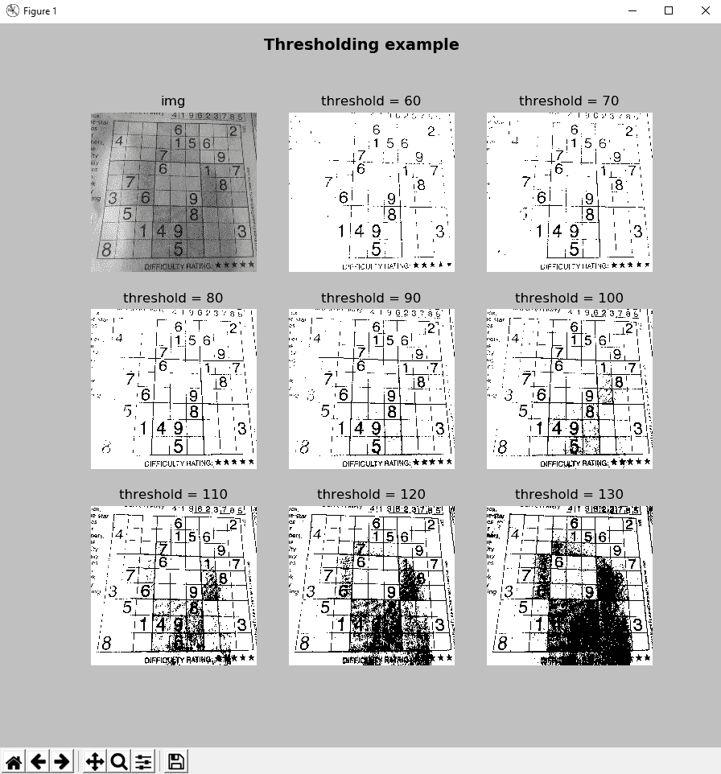

如您所见，在使用`cv2.threshold()`阈值图像时，阈值起着至关重要的作用。 假设您的图像处理算法尝试识别网格内的数字。 如果阈值较低（例如`threshold = 60`），则阈值图像中会缺少一些数字。 另一方面，如果阈值高（例如`threshold = 120`），则黑色像素会遮挡一些数字。 因此，为整个图像建立全局阈值是非常困难的。 此外，如果图像受不同的照明条件影响，则几乎不可能完成此任务。 这就是为什么其他阈值算法可以应用于图像阈值的原因。 在下一节中，将介绍自适应阈值算法。

最后，您可以在代码段中看到我们已经创建了几个具有固定阈值的阈值图像（一张一张）。 可以通过创建一个包含阈值的数组（使用`np.arange()`）并在创建的数组上进行迭代以针对该数组的每个值调用`cv.threshold()`来进行优化。 请参阅“问题”部分，因为建议将此优化作为练习。

# 自适应阈值

在上一节中，我们已使用全局阈值应用了`cv2.threshold()`。 如我们所见，由于图像不同区域的照明条件不同，因此获得的结果不是很好。 在这些情况下，您可以尝试自适应阈值化。 在 OpenCV 中，自适应阈值通过`cv2.adapativeThreshold()`函数执行。 此方法的签名如下：

```py
adaptiveThreshold(src, maxValue, adaptiveMethod, thresholdType, blockSize, C[, dst]) -> dst
```

此函数将自适应阈值应用于`src`数组（8 位单通道图像）。 `maxValue`参数设置`dst`图像中满足条件的像素的值。 `adaptiveMethod`参数设置自适应阈值算法以使用：

*   `cv2.ADAPTIVE_THRESH_MEAN_C`：`T(x, y)`阈值计算为`(x, y)`的`blockSize x blockSize`邻域平均值减去`C`参数
*   `cv2.ADAPTIVE_THRESH_GAUSSIAN_C`：将`T(x, y)`阈值计算为`(x, y)`的`blockSize x blockSize`邻域的加权总和减去`C`参数

`blockSize`参数设置用于计算像素阈值的邻域的大小，并且可以采用`3, 5, 7,...`等值。

`C`参数只是从均值或加权均值中减去的常数（取决于`adaptiveMethod`参数设置的自适应方法）。 通常，此值为正，但可以为零或负。 最后，`thresholdType` 参数设置`cv2.THRESH_BINARY`或`cv2.THRESH_BINARY_INV`阈值类型。

根据以下公式，其中`T(x, y)`是为每个像素计算的阈值，`thresholding_adaptive.py`脚本使用`cv2.ADAPTIVE_THRESH_MEAN_C`和`cv2.ADAPTIVE_THRESH_GAUSSIAN_C`方法将自适应阈值应用于测试图像：

*   这是`cv2.THRESH_BINARY`的公式：


*   这是`cv2.THRESH_BINARY_INV`的公式：


在以下屏幕截图中可以看到此脚本的输出：

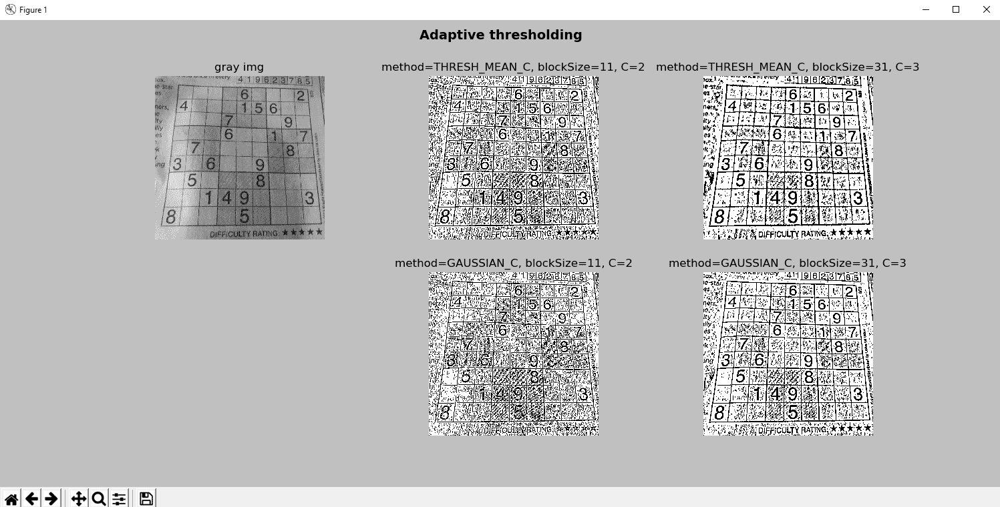

在上一个屏幕截图中，您可以在应用具有不同参数的`cv2.adaptiveThreshold()`之后看到输出。 如前所述，如果您的任务是识别数字，则自适应阈值处理可以为您提供更好的阈值图像。 但是，您也可以看到，图像中出现了很多噪点。 为了对其进行处理，可以应用一些平滑操作（请参阅第 5 章，“图像处理技术”）。

在这种情况下，我们可以应用双边过滤器，因为它在去除噪声的同时保持尖锐边缘非常有用。 为了应用双边过滤器，OpenCV 提供了`cv2.bilateralFilter()`函数。 因此，我们可以在对图像进行阈值处理之前应用该函数，如下所示：

```py
gray_image = cv2.bilateralFilter(gray_image, 15, 25, 25)
```

此示例的代码可以在`thresholding_adaptive_filter_noise.py`脚本中看到。 在以下屏幕截图中可以看到输出：

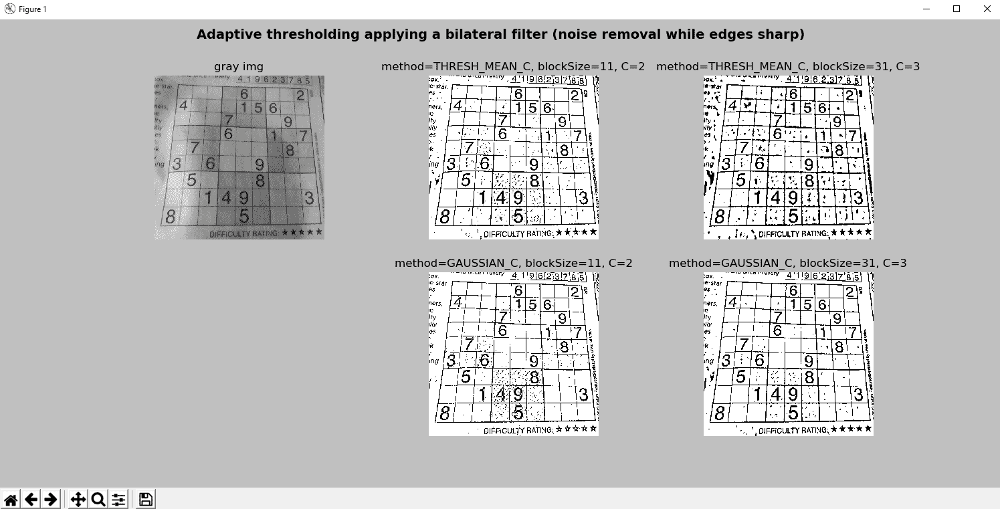

您会看到，应用平滑过滤器是处理噪声的好方法。 在这种情况下，应用双边过滤器是因为我们要保持边缘清晰。

# 大津阈值算法

正如我们在前面的部分中看到的那样，简单的阈值算法应用了任意全局阈值。 在这种情况下，我们需要做的是尝试使用不同的阈值，并查看阈值图像，以查看结果是否满足我们的需求。 但是，这种方法可能非常繁琐。

一种解决方案是使用 OpenCV 通过`cv2.adapativeThreshold()`函数提供的自适应阈值。 在 OpenCV 中应用自适应阈值设置时，无需设置阈值，这是一件好事。

但是，应正确建立两个参数：`blockSize`参数和`C`参数。 另一种方法是使用大津的二值化算法，这在处理双峰图像时是一种很好的方法。 双峰图像可以通过其包含两个峰的直方图来表征。大津的算法通过最大化两类像素之间的方差来自动计算将两个峰分开的最佳阈值。 等效地，最佳阈值使组内差异最小化。大津的二值化算法是一种统计方法，因为它依赖于从直方图得出的统计信息（例如，均值，方差或熵）。 为了计算 OpenCV 中大津的二值化，我们使用`cv2.threshold()`函数，如下所示：

```py
ret, th = cv2.threshold(gray_image, 0, 255, cv2.THRESH_BINARY + cv2.THRESH_OTSU)
```

在这种情况下，由于大津的二值化算法会计算最佳阈值，因此无需设置阈值，这就是`thresh = 0`的原因。 `cv2.THRESH_OTSU`标志指示将应用大津算法。 另外，在这种情况下，此标志与`cv2.THRESH_BINARY`组合。 实际上，它可以与`cv2.THRESH_BINARY`，`cv2.THRESH_BINARY_INV`，`cv2.THRESH_TRUNC`，`cv2.THRESH_TOZERO`和`cv2.THRESH_TOZERO_INV`组合。 此函数返回阈值图像`th`和阈值`ret`。

在`thresholding_otsu.py`脚本中，我们已将此算法应用于样本图像。 在以下屏幕截图中可以看到输出。 我们修改了`show_hist_with_matplotlib_gray()`函数，添加了一个额外的参数，该参数对应于大津算法计算出的最佳阈值。 为了绘制此阈值，我们绘制一条线，以`t`阈值建立`x`坐标，如下所示：

```py
plt.axvline(x=t, color='m', linestyle='--')
```

在以下屏幕截图中可以看到`thresholding_otsu.py`脚本的输出：

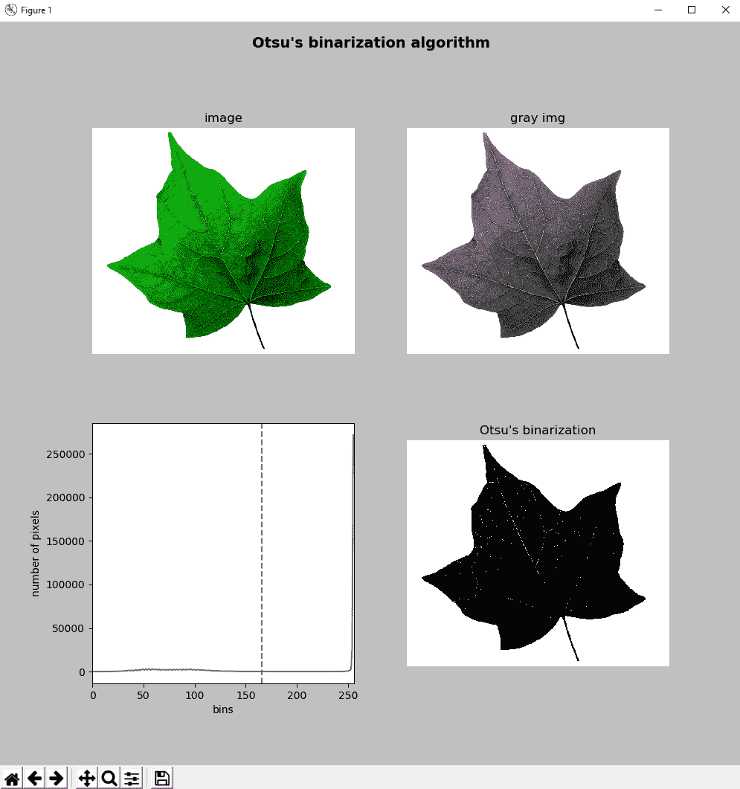

在上一个屏幕截图中，我们可以看到图像没有噪点，带有白色背景和非常清晰的绿叶。 但是，噪声会影响阈值算法，因此我们应该对其进行适当处理。 例如，在上一节中，我们执行双边滤波，以滤除一些噪声并保留边缘。 在下一个示例中，我们将向叶图像添加一些噪声，以查看阈值算法如何受到影响。 可以在`thresholding_otsu_filter_noise.py`脚本中看到。 在此脚本中，我们在应用高斯过滤器之前和之后应用大津的二值化算法，以查看阈值图像如何急剧变化。

在以下屏幕截图中可以看到：

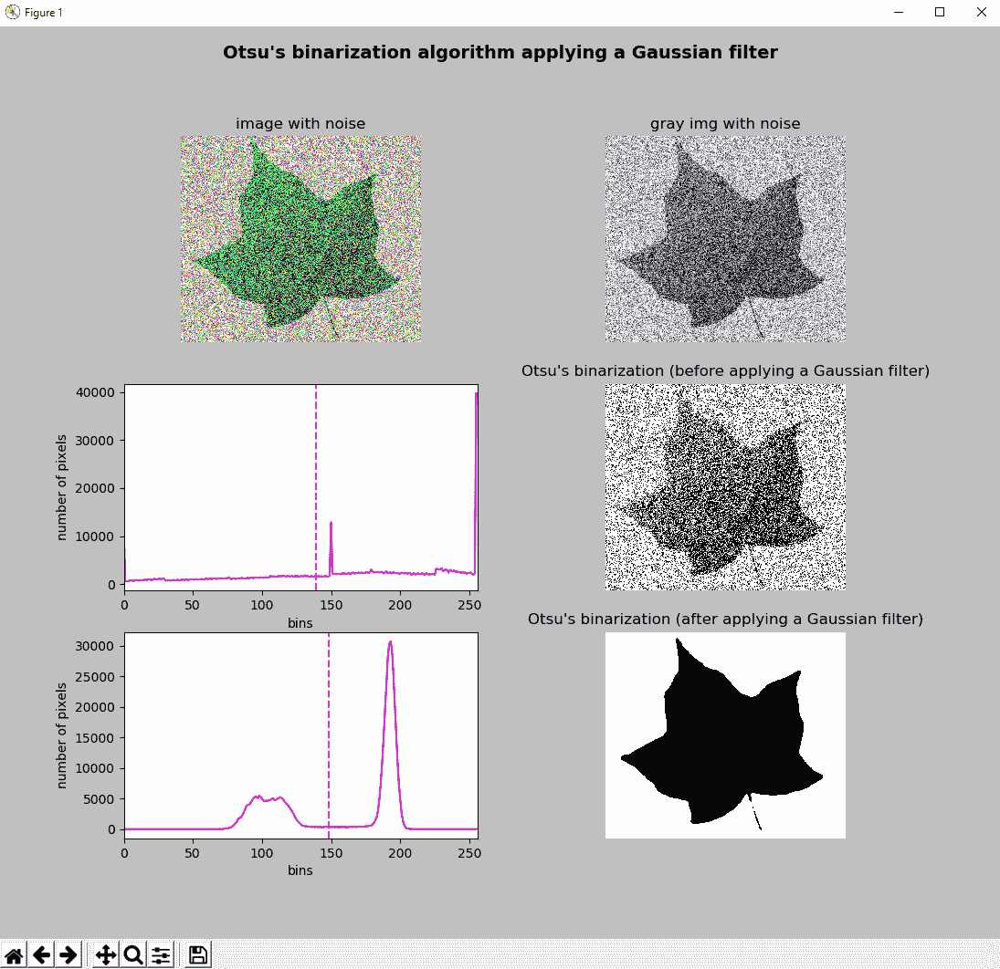

如我们所见，如果不应用平滑过滤器（在这种情况下为高斯过滤器），则阈值图像也会充满噪声。 但是，应用高斯过滤器是正确过滤噪声的好方法。 此外，滤波后的图像是双峰的。 这个事实可以在对应于滤波图像的直方图中看到。 在这种情况下，大津的二值化算法可以正确分割叶子。

# 三角二值化算法

另一种自动阈值算法是**三角算法**，该算法被认为是基于形状的方法，因为它可以分析直方图的结构（或*形状*）（例如，尝试查找谷值，峰值和其他*形状*直方图特征）。 该算法分三步工作。 第一步，在灰度轴上的直方图最大值`b_max`与灰度轴上的最小值`b_min`之间计算一条线 。 在第二步中，对于`b[b_min - b_max]`的所有值，计算直线（在第一步中计算出）到直方图的距离。 最后，在第三步中，将直方图和直线之间的距离最大的级别选择为阈值。

在 OpenCV 中使用三角二值化算法的方式与大津的算法非常相似。 实际上，仅应适当更改一个标志。 在大津市二值化的情况下，设置了`cv2.THRESH_OTSU`标志。 对于三角二值化算法，标记为`cv2.THRESH_TRIANGLE`，如下所示：

```py
ret1, th1 = cv2.threshold(gray_image, 0, 255, cv2.THRESH_BINARY + cv2.THRESH_TRIANGLE)
```

在下一个屏幕截图中，您可以看到将三角二值化算法应用于噪声图像（与上一节中大津的二值化示例中使用的图像相同）的输出。 该示例的完整代码可以在`thresholding_triangle_filter_noise.py`脚本中看到：

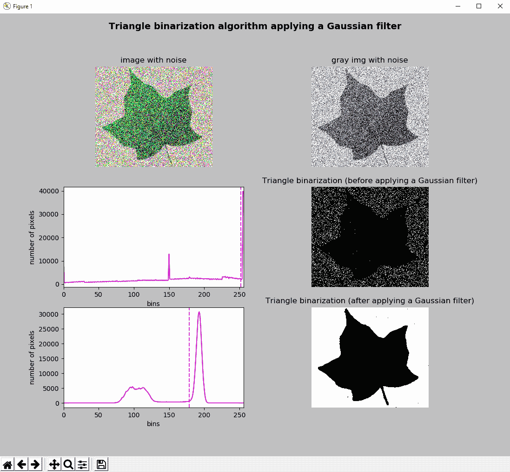

您会看到，应用高斯过滤器是过滤噪声的好方法。 这样，三角二值化算法可以正确地分割叶子。

# 彩色图像的阈值

`cv2.threshold()`函数也可以应用于多通道图像。 可以在`thresholding_bgr.py`脚本中看到。 在这种情况下，`cv2.threshold()`函数在 BGR 图像的每个通道中应用阈值操作。 这产生与在每个通道中应用此函数并合并阈值通道相同的结果：

```py
ret1, thresh1 = cv2.threshold(image, 150, 255, cv2.THRESH_BINARY)
```

因此，上一行代码产生与执行以下操作相同的结果：

```py
(b, g, r) = cv2.split(image)
ret2, thresh2 = cv2.threshold(b, 150, 255, cv2.THRESH_BINARY)
ret3, thresh3 = cv2.threshold(g, 150, 255, cv2.THRESH_BINARY)
ret4, thresh4 = cv2.threshold(r, 150, 255, cv2.THRESH_BINARY)
bgr_thresh = cv2.merge((thresh2, thresh3, thresh4))
```

结果可以在以下屏幕截图中看到：

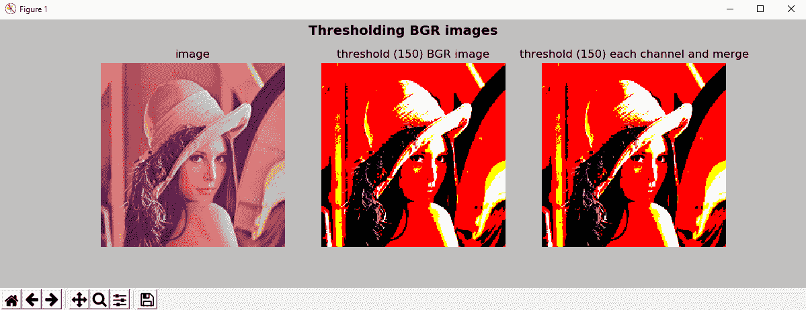

尽管您可以在多通道图像（例如 BGR 图像）上执行`cv2.threshold()`，但是此操作可能会产生奇怪的结果。 例如，在结果图像中，由于每个通道只能采用两个值（在这种情况下为`0`和`255`），因此最终图像仅具有`2^3`个可能的颜色 。 在下一个屏幕截图中，我们还将这个颜色阈值应用于另一个测试图像：

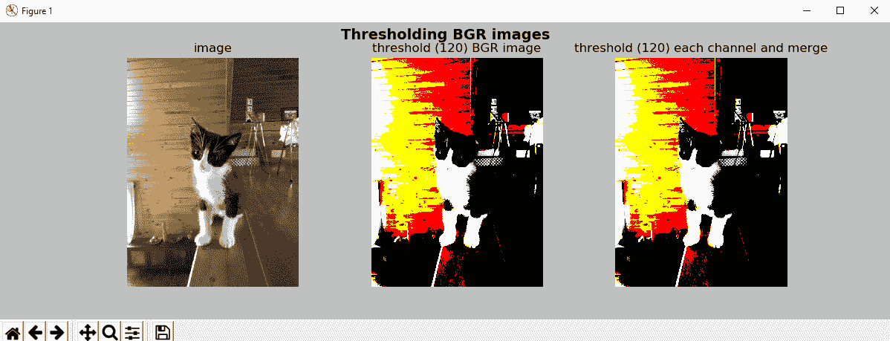

如前面的屏幕快照所示，输出图像仅具有`2^3`个可能的颜色。 因此，在 BGR 图像中执行阈值操作时，应考虑到这一点。

# 使用 scikit-image 的阈值算法

正如我们在第 1 章，“设置 OpenCV”中提到的那样，还有其他包可用于科学计算，数据科学，机器学习，深度学习和计算机视觉。 与计算机视觉有关，[scikit-image 是图像处理算法的集合](https://scikit-image.org/)。 scikit-image 操纵的图像是 NumPy 数组。

在本节中，我们将结合阈值技术使用 Scikit-image 功能。 因此，如果要复制此处获得的结果，则第一步是安装它。 请参阅[这里](https://scikit-image.org/download.html)，以便在您的操作系统上正确安装 scikit-image。 在这里，我们将使用 Conda 来安装它，Conda 是一个开源包管理系统（也是环境管理系统）。 请参阅第 1 章，“设置 OpenCV”，以了解如何安装 Anaconda/Miniconda 发行版和 Conda。 要为基于 Conda 的发行版（Anaconda，Miniconda）安装 scikit-image，请执行以下代码：

```py
conda install -c conda-forge scikit-image
```

# 使用 scikit-image 介绍阈值

为了测试 Scikit-image，我们将使用大津的二值化算法对测试图像进​​行阈值处理。 为了尝试此方法，第一步是导入所需的包。 在这种情况下，与 scikit-image 关联如下：

```py
from skimage.filters import threshold_otsu
from skimage import img_as_ubyte
```

将大津的二值化算法与 scikit-image 结合使用的关键代码如下：

```py
thresh = threshold_otsu(gray_image)
binary = gray_image > thresh
binary = img_as_ubyte(binary)
```

`threshold_otsu(gray_image)`函数基于大津的二值化算法返回阈值。 然后，使用该值构造二进制图像（`dtype= bool`），应将其转换为 8 位无符号整数格式（`dtype= uint8`）以进行适当的可视化。 `img_as_ubyte()`函数用于此目的。 该示例的完整代码可以在`thresholding_scikit_image_otsu.py`脚本中看到。

在以下屏幕截图中可以看到输出：


现在，我们将尝试使用 scikit-image 进行一些阈值处理。

# 尝试使用 scikit-image 更多的阈值技术

我们将对比较大津，三角形，Niblack 和 Sauvola 的阈值处理技术的测试图像进​​行阈值处理。大津和三角形是全局阈值技术，而 Niblack 和 Sauvola 是局部阈值技术。 当背景不均匀时，局部阈值技术被认为是更好的方法。 有关 Niblack 和 Sauvola 阈值算法的更多信息，请分别参见《数字图像处理简介》（1986）和《自适应文档图像二值化》（2000）。 该示例的完整代码可以在`thresholding_scikit_image_techniques.py`脚本中看到。 为了尝试这些方法，第一步是导入所需的包。 在这种情况下，与 scikit-image 关联如下：

```py
from skimage.filters import (threshold_otsu, threshold_triangle, threshold_niblack, threshold_sauvola)
from skimage import img_as_ubyte
```

为了对 scikit-image 执行阈值化操作，我们调用每种阈值化方法（`threshold_otsu()`，`threshold_niblack()`，`threshold_sauvola()`和`threshold_triangle()`）：

```py
# Trying Otsu's scikit-image algorithm:
thresh_otsu = threshold_otsu(gray_image)
binary_otsu = gray_image > thresh_otsu
binary_otsu = img_as_ubyte(binary_otsu)

# Trying Niblack's scikit-image algorithm:
thresh_niblack = threshold_niblack(gray_image, window_size=25, k=0.8)
binary_niblack = gray_image > thresh_niblack
binary_niblack = img_as_ubyte(binary_niblack)

# Trying Sauvola's scikit-image algorithm:
thresh_sauvola = threshold_sauvola(gray_image, window_size=25)
binary_sauvola = gray_image > thresh_sauvola
binary_sauvola = img_as_ubyte(binary_sauvola)

# Trying triangle scikit-image algorithm:
thresh_triangle = threshold_triangle(gray_image)
binary_triangle = gray_image > thresh_triangle
binary_triangle = img_as_ubyte(binary_triangle)
```

输出可以在下一个屏幕截图中看到：

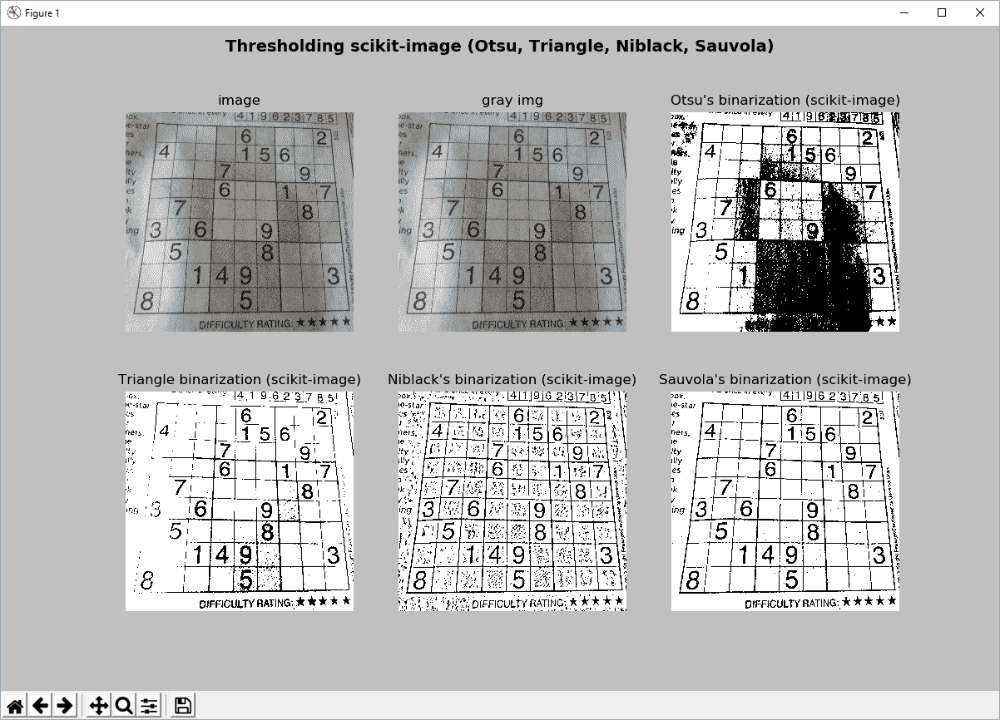

如您所见，当背景不均匀时，局部阈值方法可以提供更好的结果。 实际上，这些方法可以应用于文本识别。 最后，scikit-image 附带了更多可以尝试的阈值处理技术。 如有必要，请查阅 API 文档，以查看位于[这个页面](http://scikit-image.org/docs/dev/api/api.html)的所有可用方法。

# 总结

在本章中，我们回顾了可用于对图像进行阈值处理的主要阈值处理技术。 门限技术可用于许多计算机视觉任务（例如，文本识别和图像分割等）。 简单和自适应阈值处理技术都已被审查。 此外，我们已经了解了如何应用大津的二值化算法和三角形算法来自动选择全局阈值以对图像进行阈值处理。 最后，我们看到了如何使用 scikit-image 使用不同的阈值技术。 从这个意义上说，两种全局阈值技术（大津和三角算法）和两种局部阈值技术（Niblack 和 Sauvola 算法）已应用于测试图像。

在第 8 章，“轮廓检测，滤波和图形”中，我们将看到如何处理轮廓，轮廓对于形状分析以及对象检测和识别非常有用。

# 问题

1.  使用具有阈值`100`的`cv2.threshold()`和`cv2.THRESH_BINARY`阈值类型应用阈值操作。
2.  使用`cv2.adapativeThreshold()`，`cv2.ADAPTIVE_THRESH_MEAN_C`，`C=2`和`blockSize=9`应用自适应阈值运算。
3.  使用`cv2.THRESH_BINARY`阈值类型应用大津的阈值。
4.  使用`cv2.THRESH_BINARY`阈值类型应用三角形阈值。
5.  使用 scikit-image 应用大津的阈值。
6.  使用 scikit-image 应用三角形阈值。
7.  使用 scikit-image 应用 Niblack 的阈值。
8.  使用 scikit-image 和`25`的窗口大小应用 Sauvola 的阈值。
9.  修改`thresholding_example.py`脚本以使用`np.arange()`，目的是定义要应用于`cv2.threshold()`函数的阈值。 然后，使用定义的阈值调用`cv2.threshold()`函数，并将所有阈值图像存储在数组中。 最后，显示每个调用`show_img_with_matplotlib()`的数组中的所有图像。 将脚本重命名为`thresholding_example_arange.py`。

# 进一步阅读

以下参考资料将帮助您深入研究阈值处理和其他图像处理技术：

*   [《用于计算机视觉的 Python 3.x》，作者 Saurabh Kapur](https://www.packtpub.com/application-development/python-3x-computer-vision-video-0)