# 使用 OpenCV 的机器学习

机器学习是人工智能的一种应用，它为计算机（以及具有一定计算能力的其他系统）提供了自动根据经验进行预测或决策的能力，而无需进行明确编程即可执行任务。 机器学习的概念已经存在了很长时间，但是在过去的几年中，它的发展势头强劲，这主要归因于以下三个关键因素：

*   数据量大大增加。
*   有明显改进的算法。
*   实质上有更强大的计算机硬件。 虚拟个人助理（例如，智能扬声器或移动应用），通勤时的预测（交通预测或导航服务），视频系统（监控摄像头系统或车牌识别系统）以及电子商务应用（推荐系统或自动价格识别系统） 比较应用程序）只是我们日常生活中机器学习应用程序的一些示例。

在本章中，我们将看到 OpenCV 提供的一些最常见的机器学习算法和技术，它们可以解决计算机视觉项目中的实际问题，例如分类和回归问题。

我们将涵盖以下主题：

*   机器学习入门
*   K 均值聚类
*   K 最近邻
*   支持向量机

# 技术要求

技术要求如下：

*   Python 和 OpenCV
*   特定于 Python 的 IDE
*   NumPy 和 Matplotlib 包
*   Git 客户端

有关如何安装这些要求的更多详细信息，请参见第 1 章，“设置 OpenCV”。 可通过 [Github](https://github.com/PacktPublishing/Mastering-OpenCV-4-with-Python) 访问《精通 Python OpenCV 4》的 GitHub 存储库，其中包含从本书第一章到最后的所有必要的支持项目文件。

# 机器学习入门

在第 1 章，“设置 OpenCV”中，我们介绍了计算机视觉，人工智能，机器学习，神经网络和深度学习的概念，这些概念可以按层次结构进行构建， 如下所示：

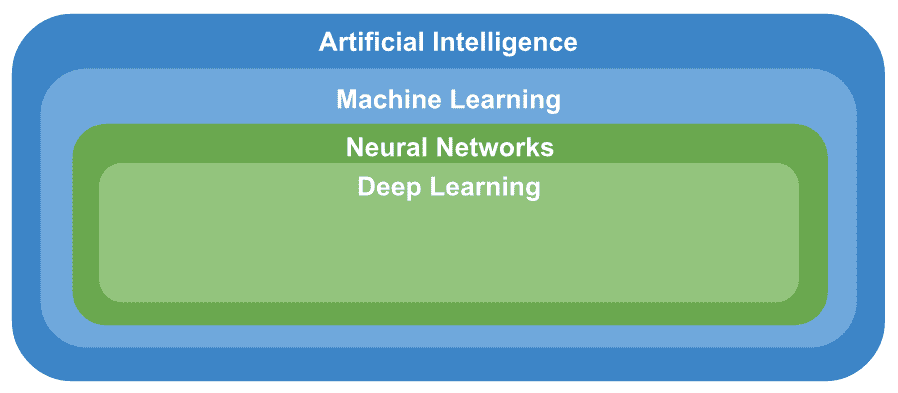

可以看出，**人工智能**主题包括所有其他主题。 在本章中，我们将专注于**机器学习**。

如果您想对这些概念进行复习，请参阅第 1 章，“设置 OpenCV”。

**机器学习**是对计算机进行编程以从历史数据中学习以对新数据进行预测的过程。 **机器学习**是人工智能的一个子学科，是指统计技术，通过这些技术，机器可以在学习到的相互关系的基础上执行操作。 基于收集或收集的数据，算法是由计算机独立学习的*。*

在**机器学习**的上下文中，有三种主要方法-**监督机器学习**，**无监督机器学习**和**半监督的机器学习**技术。 这些方法可以在下图中看到。 为了完成它，我们包含了三种最常见的技术来解决**分类**，**回归**和**聚类**问题：

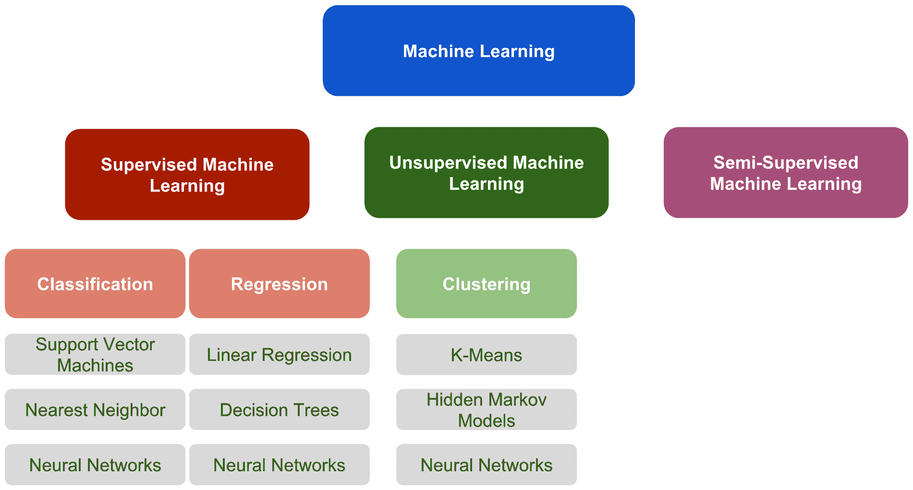

这些方法之间的主要区别是学习过程，我们将在下面讨论。

# 监督机器学习

使用样本集合进行监督学习，每个样本具有相应的输出值（期望的输出）。 这些机器学习方法称为**监督**，因为我们知道每个训练示例的正确答案，并且有监督的学习算法会分析训练数据，以便对训练数据做出预测。 此外，可以基于预测与相应的期望输出之间的差异来校正这些预测。 基于这些更正，该算法可以从错误中学习以调整其内部参数。 这样，在监督学习中，算法会迭代地调整一个函数，该函数可以最佳地近似样本集合与相应所需输出之间的关系。

监督学习问题可以进一步分为以下几类：

*   **分类**：当输出变量是类别（例如颜色（红色，绿色或蓝色），尺寸（大，中或小）或性别（男性或女性））时，可能被视为分类问题。 在分类问题中，该算法将输入映射到输出标签。
*   **回归**：当输出变量是真实值（例如年龄或体重）时，监督学习问题可以归类为回归问题。 在回归问题中，该算法将输入映射到连续输出。

在监督学习中，有一些主要问题需要考虑，为了完整起见，接下来将进行评论：

*   **偏差方差权衡**：偏差方差折衷是机器学习中的一个常用术语，指的是模型-数据不足的模型具有较高的偏差，而模型的数据过拟合则偏高。 数据差异很大：
    *   **偏差**可以看作是学习算法中错误假设产生的错误，可以定义为模型预测与我们尝试预测的正确值之间的差异。 这导致算法通过不考虑数据中的所有信息（拟合不足）来学习错误的东西。 因此，具有高偏差的模型无法在数据中找到所有模式，因此它不太适合训练集，也不太适合测试集。
    *   **方差**可以定义为算法通过拟合模型来密切学习数据中的误差/噪声（过度拟合），而该趋势倾向于学习错误的事物，而与真实信号无关。 因此，具有高方差的模型非常适合训练集，但是由于它也已获悉数据中的错误/噪声，因此无法推广到测试集。 请查看下图，以更好地理解：


*   **函数复杂度和训练数据量**：**模型复杂度**是指机器学习算法正尝试以与多项式次数相似的方式学习功能的复杂性。 模型复杂性的适当级别通常由训练数据的性质决定。 例如，如果您需要少量的数据来训练模型，则低复杂度的模型是可取的。 这是因为高复杂度模型将适合较小的训练集。
*   **输入空间的维数**：在处理高/非常高维的特征空间时，学习问题可能会非常困难，因为许多*额外*的特征会混淆学习过程， 结果差异很大。 因此，当处理高/非常高维的特征空间时，一种常见的方法是将学习算法修改为具有高偏差和低方差。 此问题与**维度诅咒**有关，后者指的是在分析和组织在低维空间中找不到的高维空间中的数据时出现的各个方面。
*   **输出值中的噪声**：如果所需的输出值不正确（由于人为或传感器错误），则学习算法尝试过于紧密地拟合数据时，可能会发生过度拟合。 有几种常见的策略可用于减轻输出值中的误差/噪声影响。 例如，在训练算法之前检测并去除嘈杂的训练示例是一种常见的方法。 另一个策略是尽早停止，可以用来防止过度拟合。

# 无监督机器学习

在无监督学习中，没有标记输出。 从这个意义上说，这里有一个样本集合，但是每个样本的相应输出值都丢失了（样本集合没有被标记，分类或分类）。 无监督学习的目标是对样本集合中的基础结构或分布进行建模和推断。 因此，在无监督学习中，该算法无法找到正确的输出，但是可以探索数据并可以从数据中进行推断，以试图揭示其中的隐藏结构。 聚类或降维是无监督学习中最常用的两种算法。

# 半监督机器学习

顾名思义，半监督学习可以看作是监督学习和无监督学习之间的折衷，因为它使用标记和未标记的数据进行训练。 从这个意义上讲，您拥有大量输入数据并且仅对其中一些数据进行了标记的问题可以归类为半监督学习问题。

许多现实世界中的机器学习问题可以归类为半监督问题，因为正确标记所有数据可能非常困难，昂贵或耗时，而未标记的数据更易于收集。

在这些情况下，仅标记了少量的培训数据，您可以探索有监督和无监督学习技术：

*   您可以使用无监督学习技术来发现和学习输入变量中的结构。
*   您可以使用监督学习技术来使用标记的数据训练分类器，然后使用此模型对未标记的数据进行预测。 此时，您可以将该数据作为训练数据反馈到监督学习算法中，以迭代地增加标记数据的大小，并使用重新训练的模型对新的未标记数据进行预测。

# K 均值聚类

OpenCV 提供`cv2.kmeans()`函数，该函数实现了 K 均值聚类算法，该算法查找聚类的中心并对聚类周围的输入样本进行分组。

K 均值聚类算法的目标是将`n`个样本划分（或聚类）为`K`聚类，其中每个样本将属于具有最均值的聚类。 `cv2.kmeans()`功能的签名如下：

```py
retval, bestLabels, centers=cv.kmeans(data, K, bestLabels, criteria, attempts, flags[, centers])
```

`data`代表用于聚类的输入数据。 它应为`np.float32`数据类型，并且每个功能都应放在单个列中。 `K`指定最后所需的群集数。 使用`criteria`参数指定算法终止标准，该参数设置最大迭代次数和/或所需的精度。 当满足这些条件时，算法终止。 `criteria`是三个参数`type`，`max_iterm`和`epsilon`的元组：

*   `type`：这是终止条件的类型。 它具有三个标志：
    *   `cv2.TERM_CRITERIA_EPS`：当达到指定的精度`epsilon`时，算法停止。
    *   `cv2.TERM_CRITERIA_MAX_ITER`：当达到指定的迭代次数`max_iterm`时，算法停止。
    *   `cv2.TERM_CRITERIA_EPS + cv2.TERM_CRITERIA_MAX_ITER`：达到两个条件中的任何一个时，算法将停止。
*   `max_iterm`：这是最大迭代次数。
*   `epsilon`：这是必需的精度。

条件的示例如下：

```py
criteria = (cv2.TERM_CRITERIA_EPS + cv2.TERM_CRITERIA_MAX_ITER, 20, 1.0)
```

在这种情况下，最大迭代次数设置为`20`（`max_iterm = 20`），所需的精度为`1.0`（`epsilon = 1.0`）。

`attempts`参数指定使用不同的初始标签执行算法的次数。 该算法返回产生最佳紧密度的标签。 `flags`参数指定如何获取初始中心。 `cv2.KMEANS_RANDOM_CENTERS`标志在每次尝试中选择随机的初始中心。 `cv2.KMEANS_PP_CENTERS`标志使用 Arthur 和 Vassilvitskii 提出的 K 均值++ 中心初始化（请参阅《K 均值++：精心播种的优势》（2007））。

`cv2.kmeans()`返回以下内容：

*   `bestLabels`：一个整数数组，存储每个样本的聚类索引
*   `centers`：一个数组，其中包含每个集群的中心
*   `compactness`：每个点到其相应中心的距离的平方之和

在本节中，我们将看到两个如何在 OpenCV 中使用 K 均值聚类算法的示例。

在第一个示例中，期望实现对 K 均值聚类的直观理解，而在第二个示例中，K 均值聚类将应用于颜色量化问题。

# 了解 K 均值聚类

在此示例中，我们将使用 K 均值聚类算法对一组 2D 点进行聚类。 这组 2D 点可以看作是对象的集合，已使用两个功能对其进行了描述。 可以使用`k_means_clustering_data_visualization.py`脚本创建和显示这组 2D 点。

下一个屏幕截图中可以看到此脚本的输出：

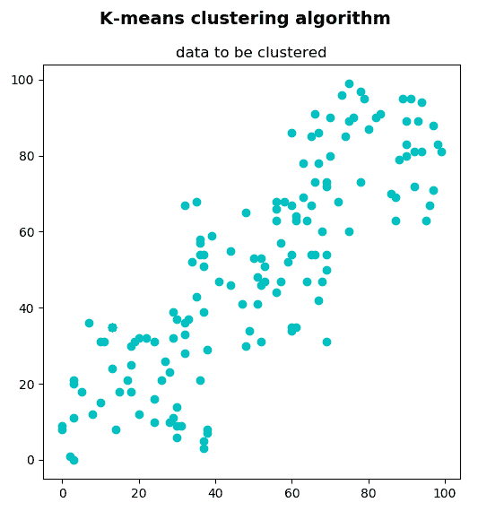

这组 2D 点由`150`点组成，它们是通过以下方式创建的：

```py
data = np.float32(np.vstack(
    (np.random.randint(0, 40, (50, 2)), np.random.randint(30, 70, (50, 2)), np.random.randint(60, 100, (50, 2)))))
```

这将代表用于聚类的数据。 如前所述，它应为`np.float32`类型，并且每个功能都应放在单个列中。

在这种情况下，每个点都有对应于`(x, y)`坐标的两个特征。 这些坐标可以表示例如每个`150`人的身高和体重，或每个`150`房屋的卧室数量和大小。 在第一种情况下，K 均值聚类算法将*决定* T 恤的尺寸（例如，如果`K=3`为小，中或大），而在第二种情况下，K 均值聚类算法将*决定*房子的价格（例如`K = 4`，便宜，中等，昂贵或非常昂贵）。 总之，`data`将是我们的聚类算法的输入。

在接下来的脚本中，我们将看到如何使用`K`的不同值及其相应的可视化效果对其进行聚类。 为此，我们编写了三个脚本：

*   `k_means_clustering_k_2.py`：在此脚本中，`data`已分为两个组（`K = 2`）。
*   `k_means_clustering_k_3.py`：在此脚本中，`data`已分为三个组（`K = 3`）。
*   `k_means_clustering_k_4.py`：在此脚本中，`data`已分为四个组（`K = 4`）。

在`k_means_clustering_k_2.py`脚本中，数据已集群为`2`集群。 第一步是定义算法终止标准。 在这种情况下，最大迭代次数设置为`20`（`max_iterm = 20`），ε设置为`1.0`（`epsilon = 1.0`）：

```py
criteria = (cv2.TERM_CRITERIA_EPS + cv2.TERM_CRITERIA_MAX_ITER, 20, 1.0)
```

下一步是使用`cv2.kmeans()`函数应用 K 均值算法：

```py
ret, label, center = cv2.kmeans(data, 2, None, criteria, 10, cv2.KMEANS_RANDOM_CENTERS)
```

此时，我们可以使用`label`输出分离数据，该输出存储每个样本的聚类索引。 因此，我们可以根据标签将数据分为不同的群集：

```py
A = data[label.ravel() == 0]
B = data[label.ravel() == 1]
```

最后一步是在不进行聚类的情况下绘制`A`和`B`以及原始的`data`，以便更好地了解聚类过程：

```py
# Create the dimensions of the figure and set title:
fig = plt.figure(figsize=(12, 6))
plt.suptitle("K-means clustering algorithm", fontsize=14, fontweight='bold')
fig.patch.set_facecolor('silver')

# Plot the 'original' data:
ax = plt.subplot(1, 2, 1)
plt.scatter(data[:, 0], data[:, 1], c='c')
plt.title("data")

# Plot the 'clustered' data and the centroids
ax = plt.subplot(1, 2, 2)
plt.scatter(A[:, 0], A[:, 1], c='b')
plt.scatter(B[:, 0], B[:, 1], c='g')
plt.scatter(center[:, 0], center[:, 1], s=100, c='m', marker='s')
plt.title("clustered data and centroids (K = 2)")

# Show the Figure:
plt.show()
```

下一个屏幕截图中可以看到此脚本的输出：

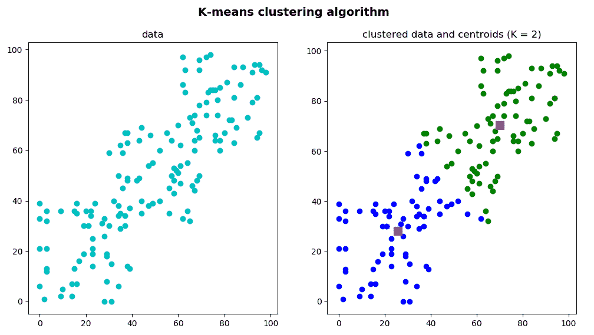

您可以看到我们还绘制了`center`，它是一个包含每个群集中心的数组。

在`k_means_clustering_k_3.py`脚本中，采用了相同的步骤对数据进行聚类，但是我们决定将数据分组为`3`聚类（`K = 3`）。 因此，在调用`cv2.kmeans()`函数时，`K`参数设置为`3`：

```py
ret, label, center = cv2.kmeans(data, 3, None, criteria, 10, cv2.KMEANS_RANDOM_CENTERS)
```

此外，使用`label`输出分离数据时，将获得三组：

```py
A = data[label.ravel() == 0]
B = data[label.ravel() == 1]
C = data[label.ravel() == 2]
```

最后一步是显示`A`，`B`和`C`，以及质心和原始数据：

```py
# Create the dimensions of the figure and set title:
fig = plt.figure(figsize=(12, 6))
plt.suptitle("K-means clustering algorithm", fontsize=14, fontweight='bold')
fig.patch.set_facecolor('silver')

# Plot the 'original' data:
ax = plt.subplot(1, 2, 1)
plt.scatter(data[:, 0], data[:, 1], c='c')
plt.title("data")

# Plot the 'clustered' data and the centroids
ax = plt.subplot(1, 2, 2)
plt.scatter(A[:, 0], A[:, 1], c='b')
plt.scatter(B[:, 0], B[:, 1], c='g')
plt.scatter(C[:, 0], C[:, 1], c='r')
plt.scatter(center[:, 0], center[:, 1], s=100, c='m', marker='s')
plt.title("clustered data and centroids (K = 3)")

# Show the Figure:
plt.show()
```

在上一个代码段中，我们在同一图中绘制了原始数据和“聚类”数据以及质心。 下一个屏幕截图中可以看到此脚本的输出：

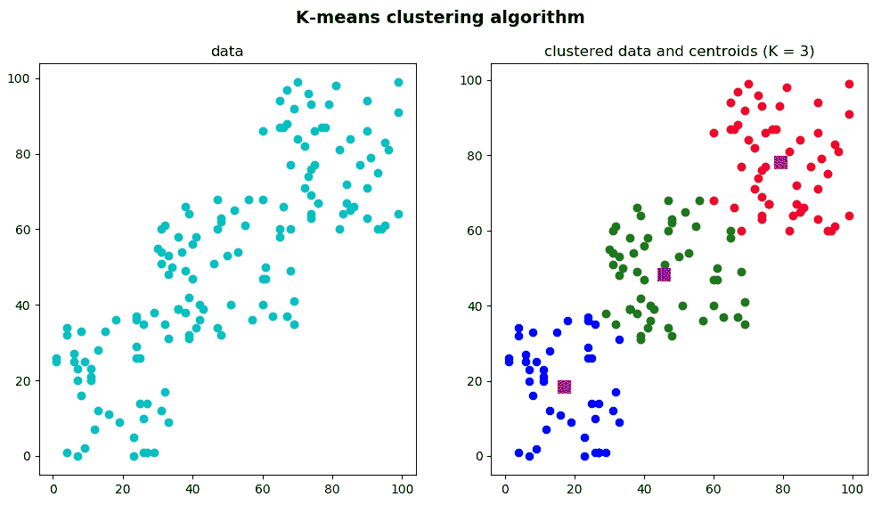

为了完整起见，我们还对`k_means_clustering_k_4.py`脚本进行了编码，其输出可以在下一个屏幕截图中看到：

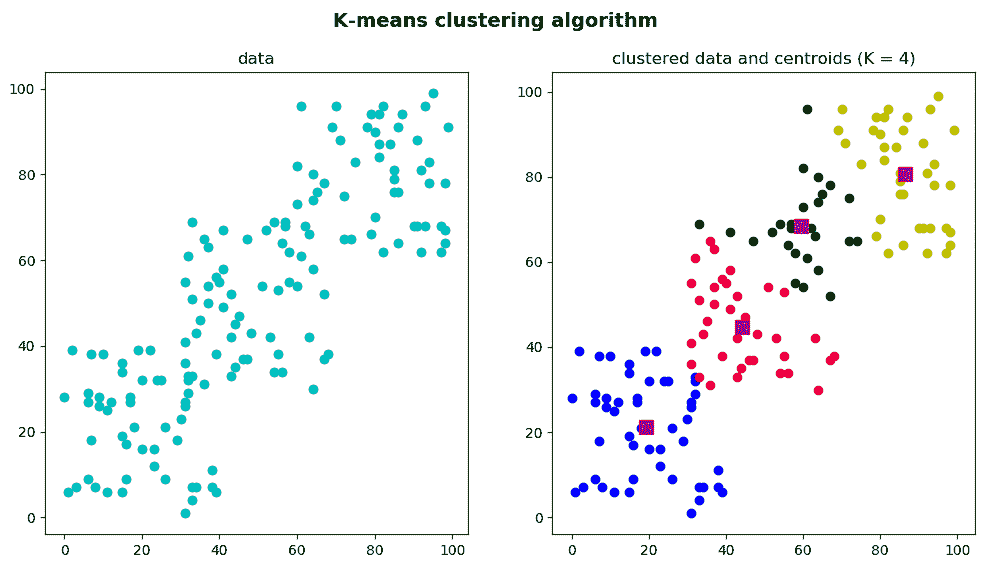

可以看出，簇的数量被设置为`4`（`K = 4`）。

# 使用 K 均值聚类的颜色量化

在本小节中，我们将 K 均值聚类算法应用于颜色量化问题，可以将其定义为减少图像中颜色数量的过程。 对于在只能显示有限数量的颜色（通常是由于内存限制）的某些设备上显示图像，颜色量化是至关重要的一点。 因此，通常需要在相似度和颜色数量减少之间进行权衡。 这种权衡是通过正确设置`K`参数来建立的，我们将在下面的示例中看到。

在`k_means_color_quantization.py`脚本中，我们执行 K 均值聚类算法以执行颜色量化。 在这种情况下，数据的每个元素都由`3`特征组成，这些特征对应于图像每个像素的`B`，`G`和`R`值。 因此，关键步骤是通过以下方式将图像转换为`data`：

```py
data = np.float32(image).reshape((-1, 3))
```

在这里，`image`是我们先前加载的图像。

在此脚本中，我们使用`K`（`3`，`5`，`10`，`20`和`40`）的几个值执行了聚类过程，以查看生成的图像如何变化。 例如，如果我们希望生成的图像仅具有`3`颜色（`K = 3`），则必须执行以下操作：

1.  加载 BGR 图片：

```py
img = cv2.imread('landscape_1.jpg')
```

2.  使用`color_quantization()`功能执行色彩量化：

```py
color_3 = color_quantization(img, 3)
```

3.  同时显示两个图像以查看结果。 `color_quantization()`函数执行颜色量化过程：

```py
def color_quantization(image, k):
    """Performs color quantization using K-means clustering algorithm"""

    # Transform image into 'data':
    data = np.float32(image).reshape((-1, 3))
    # print(data.shape)

    # Define the algorithm termination criteria (maximum number of iterations and/or required accuracy):
    # In this case the maximum number of iterations is set to 20 and epsilon = 1.0
    criteria = (cv2.TERM_CRITERIA_EPS + cv2.TERM_CRITERIA_MAX_ITER, 20, 1.0)

    # Apply K-means clustering algorithm:
    ret, label, center = cv2.kmeans(data, k, None, criteria, 10, cv2.KMEANS_RANDOM_CENTERS)

    # At this point we can make the image with k colors
    # Convert center to uint8:
    center = np.uint8(center)
    # Replace pixel values with their center value:
    result = center[label.flatten()]
    result = result.reshape(img.shape)
    return result
```

在上一个功能中，关键是要使用`cv2.kmeans()`方法。 最后，我们可以用`k`种颜色构建图像，用每种颜色的像素值替换其相应的中心值。 下一个屏幕截图中可以看到此脚本的输出：

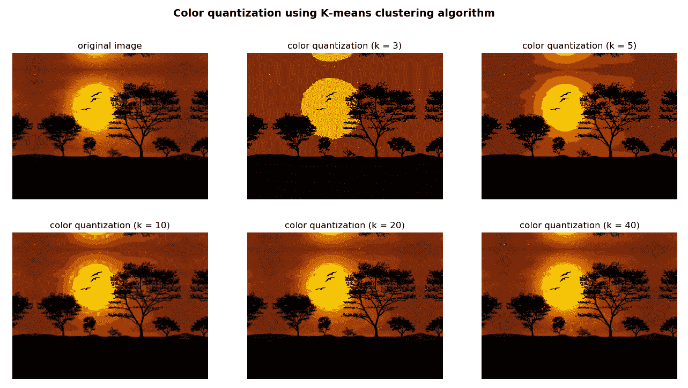

可以将先前的脚本扩展为包括有趣的功能，该功能显示分配给每个中心值的像素数。 可以在`k_means_color_quantization_distribution.py`脚本中看到。

`color_quantization()`功能已被修改为包括以下功能：

```py
def color_quantization(image, k):
    """Performs color quantization using K-means clustering algorithm"""

    # Transform image into 'data':
    data = np.float32(image).reshape((-1, 3))
    # print(data.shape)

    # Define the algorithm termination criteria (the maximum number of iterations and/or the desired accuracy):
    # In this case the maximum number of iterations is set to 20 and epsilon = 1.0
    criteria = (cv2.TERM_CRITERIA_EPS + cv2.TERM_CRITERIA_MAX_ITER, 20, 1.0)

    # Apply K-means clustering algorithm:
    ret, label, center = cv2.kmeans(data, k, None, criteria, 10, cv2.KMEANS_RANDOM_CENTERS)

    # At this point we can make the image with k colors
    # Convert center to uint8:
    center = np.uint8(center)
    # Replace pixel values with their center value:
    result = center[label.flatten()]
    result = result.reshape(img.shape)

    # Build the 'color_distribution' legend.
    # We will use the number of pixels assigned to each center value:
    counter = collections.Counter(label.flatten())
    print(counter)

    # Calculate the total number of pixels of the input image:
    total = img.shape[0] * img.shape[1]

    # Assign width and height to the color_distribution image:
    desired_width = img.shape[1]
    # The difference between 'desired_height' and 'desired_height_colors'
    # will be the separation between the images
    desired_height = 70
    desired_height_colors = 50

    # Initialize the color_distribution image:
    color_distribution = np.ones((desired_height, desired_width, 3), dtype="uint8") * 255
    # Initialize start:
    start = 0

    for key, value in counter.items():
        # Calculate the normalized value:
        value_normalized = value / total * desired_width

        # Move end to the right position:
        end = start + value_normalized

        # Draw rectangle corresponding to the current color:
        cv2.rectangle(color_distribution, (int(start), 0), (int(end), desired_height_colors), center[key].tolist(), -1)
        # Update start:
        start = end

    return np.vstack((color_distribution, result))
```

如您所见，我们利用`collections.Counter()`来计算分配给每个中心值的像素数：

```py
counter = collections.Counter(label.flatten())
```

例如，如果`K = 3` — `Counter({0: 175300, 2: 114788, 1: 109912})`。 构建颜色分布图像后，最后一步是将两个图像连接起来：

```py
np.vstack((color_distribution, result))
```

下一个屏幕截图中可以看到此脚本的输出：

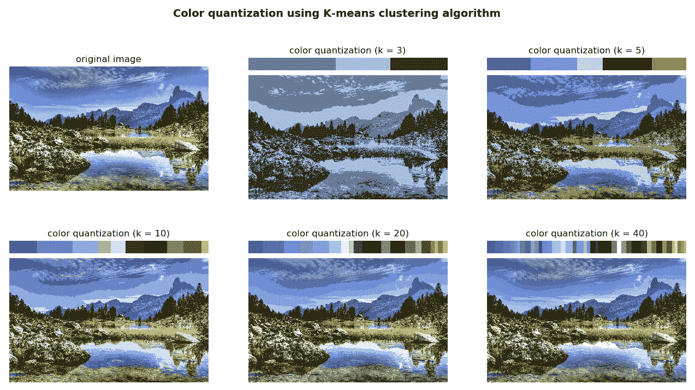

在上一个屏幕截图中，您可以看到使用 K 均值聚类算法通过更改参数`k`（`3`，`5`，`10`，`20`和`40`）应用颜色量化的结果。 `k`的值越大，表示图像越真实。

# K 最近邻

**K 最近邻**（**kNN**）被认为是有监督学习类别中最简单的算法之一。 kNN 可用于分类和回归问题。 在训练阶段，kNN 同时存储所有训练样本的特征向量和类别标签。 在分类阶段，将未标记向量（与训练示例位于同一多维特征空间中的查询或测试向量）分类为最接近要分类的未标记向量的`k`个训练样本中最频繁的类别标签，其中`k`是用户定义的常数。

在下图中可以以图形方式看到：

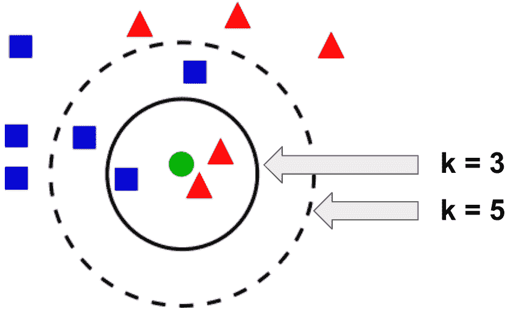

在上图中，如果`k = 3`，则绿色圆圈（未标记的测试样品）将归类为*三角形*，因为在内圈内有两个三角形，并且只有一个正方形 。 如果`k = 5`，则绿色圆圈将归类为*正方形*，因为虚线圆内只有三个正方形，而只有两个三角形。

在 OpenCV 中，使用此分类器的第一步是创建分类器。 `cv2.ml.KNearest_create()`方法创建一个空的 kNN 分类器，应使用`train()`方法对其进行训练，以同时提供数据和标签。 最后，`findNearest()`方法用于查找邻居。 此方法的签名如下：

```py
retval, results, neighborResponses, dist=cv2.ml_KNearest.findNearest(samples, k[, results[, neighborResponses[, dist]]])
```

这里，`samples`是按行存储的输入样本，`k`设置最近邻的数量（应大于 1），`results`存储每个输入样本的预测，`neighborResponses`存储相应的邻居，并且 `dist`存储从输入样本到相应邻居的距离。

在本节中，我们将看到两个示例，以了解如何在 OpenCV 中使用 kNN 算法。 在第一个示例中，有望实现对 kNN 的直观理解，而在第二个示例中，kNN 将应用于手写数字识别问题。

# 了解 K 最近邻

`knn_introduction.py`脚本对 kNN 进行了简单介绍，其中随机创建了一组点并分配了一个标签（`0`或`1`）。 标签`0`将代表红色三角形，而标签`1`将代表蓝色正方形。 我们将使用 kNN 算法基于`k`最近邻对样本点进行分类。

因此，第一步是创建带有相应标签的点集和用于分类的样本点：

```py
# The data is composed of 16 points:
data = np.random.randint(0, 100, (16, 2)).astype(np.float32)

# We create the labels (0: red, 1: blue) for each of the 16 points:
labels = np.random.randint(0, 2, (16, 1)).astype(np.float32)

# Create the sample point to be classified:
sample = np.random.randint(0, 100, (1, 2)).astype(np.float32)
```

下一步是创建 kNN 分类器，训练分类器，并找到`k`最近的邻居：

```py
# KNN creation:
knn = cv2.ml.KNearest_create()
# KNN training:
knn.train(data, cv2.ml.ROW_SAMPLE, labels)
# KNN find nearest:
k = 3
ret, results, neighbours, dist = knn.findNearest(sample, k)

# Print results:
print("result: {}".format(results))
print("neighbours: {}".format(neighbours))
print("distance: {}".format(dist))
```

在这种情况下，并且与以下屏幕截图相对应，获得的结果如下：

```py
result: [[0.]]
neighbours: [[0\. 0\. 0.]]
distance: [[ 80\. 100\. 196.]]
```

因此，绿点被分类为红色三角形。 在下图中可以看到：

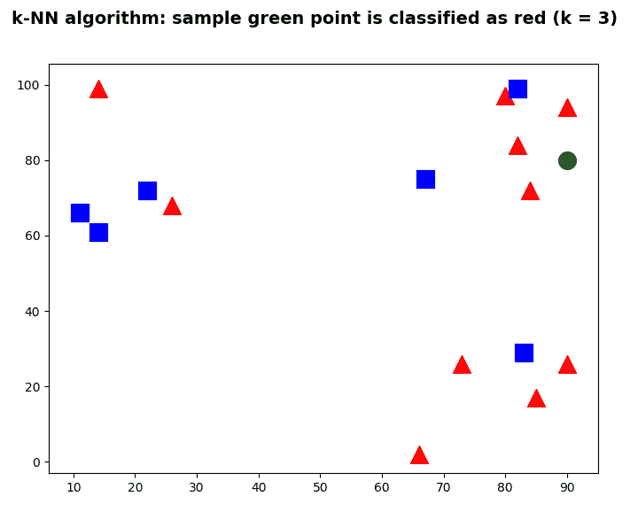

前面的屏幕快照使您对 kNN 有了直观的了解。 在下一个示例中，我们将把 kNN 应用于手写数字识别问题。

# 使用 K 最近邻识别手写数字

我们将看到如何使用 kNN 分类器执行手写数字识别。 我们将从获得可接受的准确性的*基本*脚本开始，我们将对其进行修改以提高其性能。

在这些脚本中，训练数据由手写数字组成。 OpenCV 提供了很多*大*图像，里面没有手写数字，而不是包含很多图像。 该图像的尺寸为`2,000 x 1,000`像素。 每个数字为`20 x 20`像素。 因此，我们总共有 5,000 位数（`100 x 50`）：


在`knn_handwritten_digits_recognition_introduction.py`脚本中，我们将执行第一种方法，尝试使用 kNN 分类器识别数字。 在第一种方法中，我们将使用原始像素值作为特征。 这样，每个描述符的大小将为 400（`20 x 20`）。

第一步是从大图像中加载所有数字，并为每个数字分配相应的标签。 这是通过`load_digits_and_labels()`功能执行的：

```py
digits, labels = load_digits_and_labels('digits.png')
```

`load_digits_and_labels()`功能的代码如下：

```py
def load_digits_and_labels(big_image):
    """Returns all the digits from the 'big' image and creates the corresponding labels for each image"""

    # Load the 'big' image containing all the digits:
    digits_img = cv2.imread(big_image, 0)

    # Get all the digit images from the 'big' image:
    number_rows = digits_img.shape[1] / SIZE_IMAGE
    rows = np.vsplit(digits_img, digits_img.shape[0] / SIZE_IMAGE)

    digits = []
    for row in rows:
        row_cells = np.hsplit(row, number_rows)
        for digit in row_cells:
            digits.append(digit)
    digits = np.array(digits)

    # Create the labels for each image:
    labels = np.repeat(np.arange(NUMBER_CLASSES), len(digits) / NUMBER_CLASSES)
    return digits, labels
```

在上一个函数中，我们首先加载“大”图像，然后，获取其中的所有数字。 上一个功能的最后一步是为每个数字创建标签。

在脚本中执行的下一步是为每个图像计算描述符。 在这种情况下，原始像素是特征描述符：

```py
# Compute the descriptors for all the images.
# In this case, the raw pixels are the feature descriptors
raw_descriptors = []
for img in digits:
    raw_descriptors.append(np.float32(raw_pixels(img)))
raw_descriptors = np.squeeze(raw_descriptors)
```

此时，我们将数据分为训练和测试（各占 50%）。 因此，将使用 2500 位数字来训练分类器，并使用 2500 位数字来测试经过训练的分类器：

```py
partition = int(0.5 * len(raw_descriptors))
raw_descriptors_train, raw_descriptors_test = np.split(raw_descriptors, [partition])
labels_train, labels_test = np.split(labels, [partition])
```

现在，我们可以使用`knn.train()`方法训练 kNN 模型，并使用`get_accuracy()`函数对其进行测试：

```py
# Train the KNN model:
print('Training KNN model - raw pixels as features')
knn = cv2.ml.KNearest_create()
knn.train(raw_descriptors_train, cv2.ml.ROW_SAMPLE, labels_train)

# Test the created model:
k = 5
ret, result, neighbours, dist = knn.findNearest(raw_descriptors_test, k)

# Compute the accuracy:
acc = get_accuracy(result, labels_test)
print("Accuracy: {}".format(acc))
```

如我们所见，`k = 5`。 我们获得`92.60`的精度，但我认为它可以提高。

我们要做的第一件事就是尝试使用`k`的不同值，这是 kNN 分类器中的关键参数。 此修改在`knn_handwritten_digits_recognition_k.py`脚本中执行。

在此脚本中，我们将创建一个字典来存储在测试`k`的不同值时的准确性：

```py
results = defaultdict(list)
```

请注意，我们已经从`collections`导入了`defaultdict`：

```py
from collections import defaultdict
```

下一步是计算`knn.findNearest()`方法，改变`k`参数（在这种情况下，在`(1-9)`的范围内）并将结果存储在字典中：

```py
for k in np.arange(1, 10):
    ret, result, neighbours, dist = knn.findNearest(raw_descriptors_test, k)
    acc = get_accuracy(result, labels_test)
    print(" {}".format("%.2f" % acc))
    results['50'].append(acc)
```

最后一步是绘制结果：

```py
# Show all results using matplotlib capabilities:
fig, ax = plt.subplots(1, 1)
ax.set_xlim(0, 10)
dim = np.arange(1, 10)

for key in results:
    ax.plot(dim, results[key], linestyle='--', marker='o', label="50%")

plt.legend(loc='upper left', title="% training")
plt.title('Accuracy of the KNN model varying k')
plt.xlabel("number of k")
plt.ylabel("accuracy")
plt.show()
```

为了显示结果，我们让您使用 matplotlib 功能来绘制图形。 下一个屏幕截图中可以看到此脚本的输出：

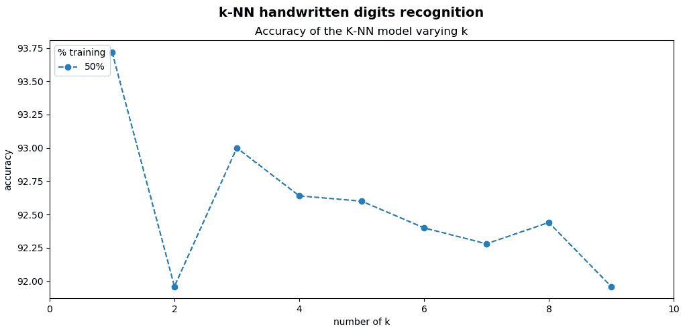

如您在上一个屏幕截图中所见，通过更改`k`参数获得的精度为-`k=1`-`93.72`，`k=2`-`91.96`，`k=3`-`93.00`，`k=4`-`92.64`，`k=5`-`92.60`，`k=6`-`92.40`，`k=7`-`92.28`，`k=8`-`92.44`和`k=9`-`91.96`。

如前所述，获得的精度存在一些差异。 因此，不要忘记在应用程序中适当调整`k`参数。

在这些示例中，我们一直在训练和测试每个 2500 位数字的模型。

在机器学习中，使用更多数据训练分类器通常是一个好主意，因为分类器可以更好地学习特征的结构。 结合 kNN 分类器，增加训练数字的数量也将增加在特征空间中找到测试数据正确匹配的可能性。

在`knn_handwritten_digits_recognition_k_training_testing.py`脚本中，我们修改了图像的百分比以训练和测试模型，如下所示：

```py
# Split data into training/testing:
split_values = np.arange(0.1, 1, 0.1)

for split_value in split_values:
    # Split the data into training and testing:
    partition = int(split_value * len(raw_descriptors))
    raw_descriptors_train, raw_descriptors_test = np.split(raw_descriptors, [partition])
    labels_train, labels_test = np.split(labels, [partition])

    # Train KNN model
    print('Training KNN model - raw pixels as features')
    knn.train(raw_descriptors_train, cv2.ml.ROW_SAMPLE, labels_train)

    # Store the accuracy when testing:
    for k in np.arange(1, 10):
        ret, result, neighbours, dist = knn.findNearest(raw_descriptors_test, k)
        acc = get_accuracy(result, labels_test)
        print(" {}".format("%.2f" % acc))
        results[int(split_value * 100)].append(acc)
```

可以看出，训练算法的数字百分比为 10%，20%，...，90%，测试算法的数字百分比为 90%，80%，...，10%。

最后，我们绘制结果：

```py
# Show all results using matplotlib capabilities:
# Create the dimensions of the figure and set title:
fig = plt.figure(figsize=(12, 5))
plt.suptitle("KNN handwritten digits recognition", fontsize=14, fontweight='bold')
fig.patch.set_facecolor('silver')

ax = plt.subplot(1, 1, 1)
ax.set_xlim(0, 10)
dim = np.arange(1, 10)

for key in results:
    ax.plot(dim, results[key], linestyle='--', marker='o', label=str(key) + "%")

plt.legend(loc='upper left', title="% training")
plt.title('Accuracy of the KNN model varying both k and the percentage of images to train/test')
plt.xlabel("number of k")
plt.ylabel("accuracy")
plt.show()
```

下一个屏幕截图中可以看到`knn_handwritten_digits_recognition_k_training_testing.py`脚本的输出：


随着训练图像数量的增加，准确性也会提高。 此外，当我们用 90% 的数字训练分类器时，我们将用剩余的 10% 的数字测试分类器，这等效于用`500`数字测试分类器，这是一个可观的数字。

到目前为止，我们一直在使用原始像素值作为特征来训练分类器。 在机器学习中，训练分类器之前的常见过程是对输入数据进行某种预处理，以在训练时帮助分类器。 在`knn_handwritten_digits_recognition_k_training_testing_preprocessing.py`脚本中，我们正在进行预处理，以减少输入数字的可变性。

此预处理在`deskew()`函数中执行：

```py
def deskew(img):
    """Pre-processing of the images"""

    m = cv2.moments(img)
    if abs(m['mu02']) < 1e-2:
        return img.copy()
    skew = m['mu11'] / m['mu02']
    M = np.float32([[1, skew, -0.5 * SIZE_IMAGE * skew], [0, 1, 0]])
    img = cv2.warpAffine(img, M, (SIZE_IMAGE, SIZE_IMAGE), flags=cv2.WARP_INVERSE_MAP | cv2.INTER_LINEAR)
    return img
```

`deskew()`功能通过使用二阶矩来使数字偏斜。 更具体地，可以通过两个中心矩之比（`mu11/mu02`）来计算偏斜的量度。 计算出的偏斜度用于计算仿射变换，从而使数字偏斜。 请参阅下一个屏幕截图，以欣赏此预处理的效果。 屏幕截图的顶部显示了原始数字（蓝色边框），屏幕截图的底部显示了预处理的数字（绿色边框）：

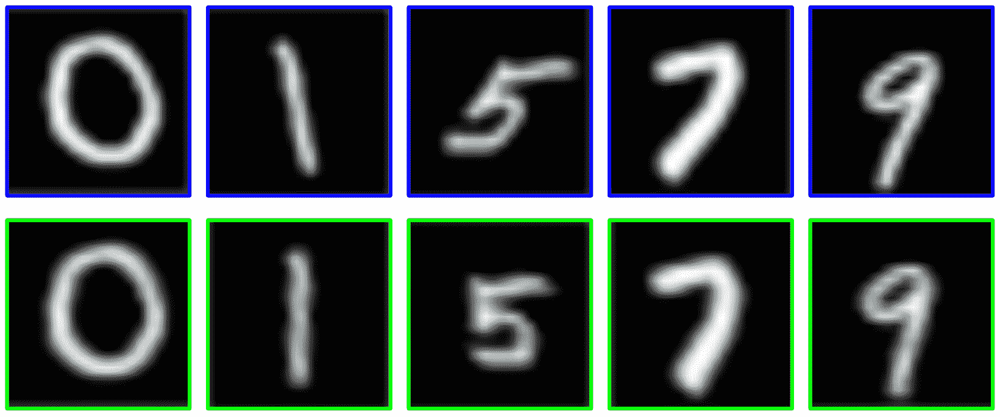

通过应用此预处理，可以提高识别率，如下面的屏幕快照所示，图中绘制了识别率：


如果将在输入数据中执行预处理的此脚本与不执行任何预处理的前一个脚本进行比较，则可以看到整体准确性有所提高。

在所有这些脚本中，我们一直使用原始像素值作为特征描述符。 在机器学习中，一种常见的方法是使用更高级的描述符。 **定向梯度直方图**（**HOG**）是一种流行的图像描述符。

特征描述符是图像的表示，通过提取描述基本特征（例如形状，颜色，纹理或运动）的有用信息来简化图像。 通常，特征描述符将图像转换为长度为`n`的特征向量/阵列。

**HOG** 是一种用于计算机视觉的流行特征描述符，最早用于人类在静态图像中的检测。 在`knn_handwritten_digits_recognition_k_training_testing_preprocessing_hog.py`脚本中，我们将使用 HOG 特征代替原始像素值。

我们定义了`get_hog()`函数，该函数获取 HOG 描述符：

```py
def get_hog():
    """Get hog descriptor"""

    # cv2.HOGDescriptor(winSize, blockSize, blockStride, cellSize, nbins, derivAperture, winSigma, histogramNormType,
    # L2HysThreshold, gammaCorrection, nlevels, signedGradient)
    hog = cv2.HOGDescriptor((SIZE_IMAGE, SIZE_IMAGE), (8, 8), (4, 4), (8, 8), 9, 1, -1, 0, 0.2, 1, 64, True)
    print("hog descriptor size: '{}'".format(hog.getDescriptorSize()))
    return hog
```

在这种情况下，每个图像的特征描述符都是`144`大小。 为了计算每个图像的 HOG 描述符，我们必须执行以下操作：

```py
# Compute the descriptors for all the images.
# In this case, the HoG descriptor is calculated
hog_descriptors = []
for img in digits:
    hog_descriptors.append(hog.compute(deskew(img)))
hog_descriptors = np.squeeze(hog_descriptors)
```

如您所见，我们将`hog.compute()`应用于每个不倾斜的数字。

结果可以在下一个屏幕截图中看到：


当`k=2`和 90% 的数字用于训练，而 10% 的数字用于测试时，则达到 98.60% 的精度。 因此，我们将识别率从 92.60%（在本小节的第一个脚本中获得）提高到 98.60%（在上一个脚本中获得）。

在编写机器学习模型和应用程序时，一种好的方法是从一个基本近似开始，尝试尽快解决该问题。 然后，如果获得的精度不够好，可以通过添加更好的预处理，更高级的特征描述符或其他机器学习技术来迭代地改进模型。 最后，如果必要，不要忘记收集更多数据来训练和测试模型。

# 支持向量机

**支持向量机**（**SVM**）是一种监督式学习技术，通过根据分配的类最佳地分离训练示例，在高维空间中构造一个超平面或一组超平面 。

可以在下一张图中看到，其中绿线表示最能将两个类别分开的超平面的表示，因为到两个类别中每个类别的最近元素的距离最大：

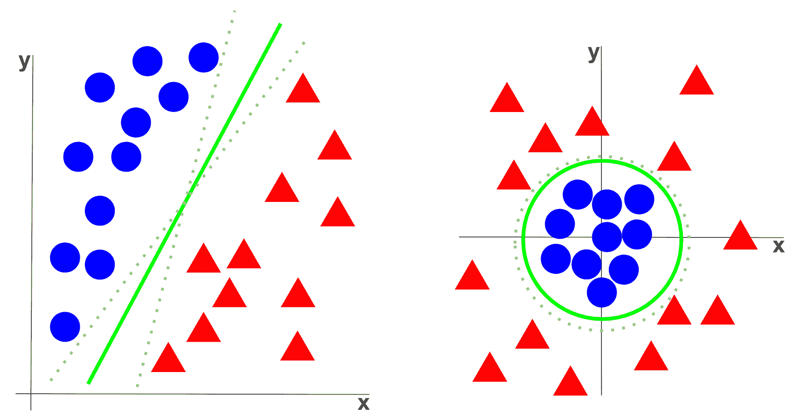

在第一种情况下，决策边界是一条线，而在第二种情况下，决策边界是一条圆周。 虚线和虚线虚线表示其他决策边界，但是它们不能最好地将这两个类别分开。

OpenCV 中的 SVM 实现基于[《LIBSVM：支持向量机库》（2011）](https://www.csie.ntu.edu.tw/~cjlin/libsvm/)。 要创建空模型，请使用`cv2.ml.SVM_create()`功能。 接下来，应将主要参数分配给模型：

*   `svmType`：这设置 SVM 的类型。 有关详细信息，请参见 LibSVM。 可能的值如下：
    *   `SVM_C_SVC`：可用于`n`类分类的 C-支持向量分类（`n ≥ 2`）
    *   `NU_SVC`：ν-支持向量分类
    *   `ONE_CLASS`：分布估计（一类 SVM）
    *   `EPS_SVR`：ε-支持向量回归
    *   `NU_SVR`：ν-支持向量回归
*   `kernelType`：设置 SVM 的内核类型。 有关详细信息，请参见 LibSVM。 可能的值如下：
    *   `LINEAR`：线性内核
    *   `POLY`：多项式内核
    *   `RBF`：**径向基函数**（**RBF**），在大多数情况下是个不错的选择
    *   `SIGMOID`：Sigmoid 内核
    *   `CHI2`：指数 Chi2 内核，类似于`RBF`内核
    *   `INTER`：直方图交点内核； 快速内核

内核函数选择可能很棘手，并且取决于数据集。 从这个意义上讲，`RBF`内核通常被认为是一个不错的首选，因为该内核将样本非线性地映射到一个高维空间，以处理类标签和属性之间的关系为非线性的情况。 有关更多详细信息，请参见《支持向量分类的实用指南》（2003）。

*   `degree`：内核函数的参数度（`POLY`）
*   `gamma`：内核函数的`γ`参数（`POLY`/`RBF`/`SIGMOID`/`CHI2`）
*   `coef0`：内核函数的`coef0`参数（`POLY`/`SIGMOID`）
*   `Cvalue`：SVM 优化问题的`C`参数（`C_SVC`/`EPS_SVR`/`NU_SVR`）

*   `nu`：SVM 优化问题的`ν`参数（`NU_SVC`/`ONE_CLASS`/`NU_SVR`）
*   `p`：SVM 优化问题（`EPS_SVR`）的`ε`参数
*   `classWeights`：`C_SVC`问题中的可选权重，分配给特定类别
*   `termCrit`：SVM 迭代训练过程的终止标准

默认构造器使用以下值初始化结构：

```py
svmType: C_SVC, kernelType: RBF, degree: 0, gamma: 1, coef0: 0, C: 1, nu: 0, p: 0, classWeights: 0, termCrit: TermCriteria(MAX_ITER+EPS, 1000, FLT_EPSILON )
```

在本节中，我们将看到两个如何在 OpenCV 中使用 SVM 的示例。 在第一个示例中，将给出对 SVM 的直观理解，在第二个示例中，SVM 将应用于手写数字识别问题。

# 了解 SVM

`svm_introduction.py`脚本执行一个简单的示例，以了解如何在 OpenCV 中使用 SVM。 首先，我们创建训练数据和标签：

```py
# Set up training data:
labels = np.array([1, 1, -1, -1, -1])
data = np.matrix([[500, 10], [550, 100], [300, 10], [500, 300], [10, 600]], dtype=np.float32)
```

如您所见，创建了五个点。 前两个点被分配为`1`类，而其他三个点被分配为`-1`类。 下一步是使用`svm_init()`函数初始化 SVM 模型：

```py
# Initialize the SVM model:
svm_model = svm_init(C=12.5, gamma=0.50625)
```

`svm_init()`函数创建一个空模型并分配主要参数并返回模型：

```py
def svm_init(C=12.5, gamma=0.50625):
    """Creates empty model and assigns main parameters"""

    model = cv2.ml.SVM_create()
    model.setGamma(gamma)
    model.setC(C)
    model.setKernel(cv2.ml.SVM_LINEAR)
    model.setType(cv2.ml.SVM_C_SVC)
    model.setTermCriteria((cv2.TERM_CRITERIA_MAX_ITER, 100, 1e-6))

    return model
```

在这种情况下，SVM 内核类型设置为`LINEAR`（不执行任何映射），而 SVM 的类型设置为`C_SVC`（可用于`n`类分类，其中`n ≥ 2` ）。

然后，我们使用`svm_train()`函数训练 SVM：

```py
# Train the SVM:
svm_train(svm_model, data, labels)
```

在这里，`svm_train()`函数使用样本和响应来训练模型，然后返回训练后的模型：

```py
def svm_train(model, samples, responses):
    """Trains the model using the samples and the responses"""

    model.train(samples, cv2.ml.ROW_SAMPLE, responses)
    return model
```

下一步是创建将在其中绘制 SVM 响应的图像：

```py
# Create the canvas (black image with three channels)
# This image will be used to show the prediction for every pixel:
img_output = np.zeros((640, 640, 3), dtype="uint8")
```

最后，我们使用`show_svm_response()`函数显示 SVM 响应：

```py
# Show the SVM response:
show_svm_response(svm_model, img_output)
```

因此，`img_ouput`图像显示了 SVM 响应。 `show_svm_response()`功能的代码如下：

```py
def show_svm_response(model, image):
    """Show the prediction for every pixel of the image, the training data and the support vectors"""

    colors = {1: (255, 255, 0), -1: (0, 255, 255)}

    # Show the prediction for every pixel of the image:
    for i in range(image.shape[0]):
        for j in range(image.shape[1]):
            sample = np.matrix([[j, i]], dtype=np.float32)
            response = svm_predict(model, sample)

            image[i, j] = colors[response.item(0)]

    # Show the training data:
    # Show samples with class 1:
    cv2.circle(image, (500, 10), 10, (255, 0, 0), -1)
    cv2.circle(image, (550, 100), 10, (255, 0, 0), -1)
    # Show samples with class -1:
    cv2.circle(image, (300, 10), 10, (0, 255, 0), -1)
    cv2.circle(image, (500, 300), 10, (0, 255, 0), -1)
    cv2.circle(image, (10, 600), 10, (0, 255, 0), -1)

    # Show the support vectors:
    support_vectors = model.getUncompressedSupportVectors()
    for i in range(support_vectors.shape[0]):
        cv2.circle(image, (support_vectors[i, 0], support_vectors[i, 1]), 15, (0, 0, 255), 6)
```

可以看出，该函数显示以下内容：

*   图像每个像素的预测
*   所有五个训练数据点
*   支持向量（定义超平面的向量称为**支持向量**）

下一个屏幕截图中可以看到此脚本的输出：

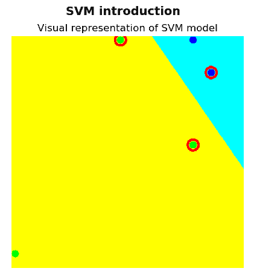

如您所见，已使用训练数据和由五个点组成的标签（对两个点分配了类别`1`，而对其他三个点分配了类别`-1`）对 SVM 进行了训练，之后将其用于分类图片中的所有像素。 这种分类导致将图像划分为黄色和青色区域。 此外，您可以看到两个区域之间的边界对应于两个类别之间的最佳间隔，因为到两个类别中每个类别的最近元素的距离最大。 支持向量以红线边框显示。

# 使用 SVM 的手写数字识别

我们刚刚看到了如何使用 kNN 分类器执行手写数字识别。 通过对数字进行预处理（调用`deskew()`函数）并计算 HOG 描述符作为用于描述每个数字的特征向量，可以获得最佳的精度。 因此，为简单起见，接下来将要使用 SVM 对数字进行分类的脚本将使用上述近似值（预处理和 HOG 特征）。

`svm_handwritten_digits_recognition_preprocessing_hog.py`脚本使用 SVM 分类执行手写数字识别。 关键代码如下所示：

```py
# Load all the digits and the corresponding labels:
digits, labels = load_digits_and_labels('digits.png')

# Shuffle data
# Constructs a random number generator:
rand = np.random.RandomState(1234)
# Randomly permute the sequence:
shuffle = rand.permutation(len(digits))
digits, labels = digits[shuffle], labels[shuffle]

# HoG feature descriptor:
hog = get_hog()

# Compute the descriptors for all the images.
# In this case, the HoG descriptor is calculated
hog_descriptors = []
for img in digits:
    hog_descriptors.append(hog.compute(deskew(img)))
hog_descriptors = np.squeeze(hog_descriptors)

# At this point we split the data into training and testing (50% for each one):
partition = int(0.5 * len(hog_descriptors))
hog_descriptors_train, hog_descriptors_test = np.split(hog_descriptors, [partition])
labels_train, labels_test = np.split(labels, [partition])

print('Training SVM model ...')
model = svm_init(C=12.5, gamma=0.50625)
svm_train(model, hog_descriptors_train, labels_train)

print('Evaluating model ... ')
svm_evaluate(model, hog_descriptors_test, labels_test)
```

在这种情况下，我们使用了`RBF`内核：

```py
def svm_init(C=12.5, gamma=0.50625):
    """Creates empty model and assigns main parameters"""

    model = cv2.ml.SVM_create()
    model.setGamma(gamma)
    model.setC(C)
    model.setKernel(cv2.ml.SVM_RBF)
    model.setType(cv2.ml.SVM_C_SVC)
    model.setTermCriteria((cv2.TERM_CRITERIA_MAX_ITER, 100, 1e-6))

    return model
```

使用仅 50% 的数字来训练算法，所获得的精度为 98.60%。

另外，使用`RBF`内核时，有两个重要参数-`C`和`γ`。 在这种情况下，为`C=12.5`和`γ=0.50625`。 和以前一样，对于给定的问题（取决于数据集），`C`和`γ`并不为人所知。 因此，必须进行某种参数搜索。 因此，目标是确定推荐使用`C`和`γ`的*网格搜索*的良好（`C`和`γ`）。

与`svm_handwritten_digits_recognition_preprocessing_hog.py`脚本相比，在`svm_handwritten_digits_recognition_preprocessing_hog_c_gamma.py`脚本中进行了两次修改。 第一个是使用 90% 的数字训练模型，其余 10% 用于测试。 第二个修改是对`C`和`γ`进行网格搜索：

```py
# Create a dictionary to store the accuracy when testing:
results = defaultdict(list)

for C in [1, 10, 100, 1000]:
    for gamma in [0.1, 0.3, 0.5, 0.7, 0.9, 1.1, 1.3, 1.5]:
        model = svm_init(C, gamma)
        svm_train(model, hog_descriptors_train, labels_train)
        acc = svm_evaluate(model, hog_descriptors_test, labels_test)
        print(" {}".format("%.2f" % acc))
        results[C].append(acc)
```

最后，这是结果：

```py
# Create the dimensions of the figure and set title:
fig = plt.figure(figsize=(10, 6))
plt.suptitle("SVM handwritten digits recognition", fontsize=14, fontweight='bold')
fig.patch.set_facecolor('silver')

# Show all results using matplotlib capabilities:
ax = plt.subplot(1, 1, 1)
ax.set_xlim(0, 1.5)
dim = [0.1, 0.3, 0.5, 0.7, 0.9, 1.1, 1.3, 1.5]

for key in results:
    ax.plot(dim, results[key], linestyle='--', marker='o', label=str(key))

plt.legend(loc='upper left', title="C")
plt.title('Accuracy of the SVM model varying both C and gamma')
plt.xlabel("gamma")
plt.ylabel("accuracy")
plt.show()
```

下一个屏幕截图中可以看到此脚本的输出：

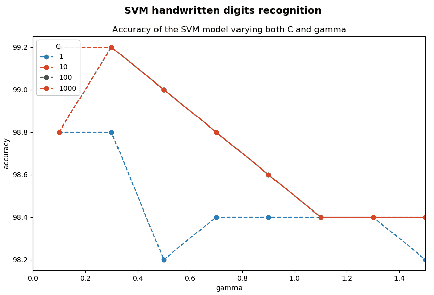

如图所示，在某些情况下，可获得 99.20% 的精度。

通过比较 kNN 分类器和 SVM 进行手写数字识别，我们可以得出结论，SVM 优于 kNN 分类器。

# 总结

在本章中，我们涵盖了机器学习的完整介绍。

在第一部分中，我们将机器学习的概念以及它与其他热门话题（如人工智能，神经网络和深度学习）的关联性进行了背景研究。 此外，我们总结了机器学习的三种主要方法，并讨论了解决分类，回归和聚类问题的三种最常用的技术。然后，我们应用了最常用的机器学习技术来解决了一些现实世界中的问题。 更具体地说，我们研究了 K 均值聚类算法，K 最近邻分类器和 SVM。

在下一章中，我们将探讨如何使用与人脸检测，跟踪和识别相关的最新算法来创建人脸处理项目。

# 问题

1.  机器学习中的三种主要方法是什么？
2.  分类和回归问题有什么区别？
3.  OpenCV 提供什么功能来实现 K 均值聚类算法？
4.  OpenCV 提供什么功能来创建 kNN 分类器？
5.  OpenCV 提供什么功能来找到最近的邻居？
6.  OpenCV 提供什么功能来创建 SVM 分类器？
7.  SVM 内核的合理首选是什么？

# 进一步阅读

如果您想深入研究机器学习，请查看以下资源：

*   [《用于 OpenCV 的机器学习》（2017），作者：Michael Beyeler](https://www.packtpub.com/big-data-and-business-intelligence/machine-learning-opencv)