# 深度学习导论

如今，**深度学习**是机器学习中最受欢迎和增长最快的领域。 自 2012 年以来，深度学习已经超越了传统的机器学习应用方法。这就是为什么将许多深度学习架构应用于许多领域（包括计算机视觉）的原因。 深度学习的常见应用包括自动语音识别，图像识别，视觉艺术处理，自然语言处理，推荐系统，生物信息学和图像恢复。 大多数现代深度学习架构都基于人工神经网络，*深度学习*中的*深度*指的是体系结构的层数。

在本章中，将通过研究与传统机器学习方法的差异来向您介绍深度学习，这些差异在第 10 章，*使用 OpenCV* 的机器学习中进行了介绍。 此外，您还将看到一些适用于图像分类和对象检测的常见深度学习架构。 最后，将介绍两个深度学习 Python 库（TensorFlow 和 Keras）。

更具体地说，本章将讨论以下主题：

*   计算机视觉任务的深度学习概述
*   OpenCV 中的深度学习
*   TensorFlow 库
*   凯拉斯图书馆

在本章中，将向您介绍 OpenCV 的深度学习领域，以及一些深度学习的 Python 库（TensorFlow 和 Keras）。 在第 13 章，“使用 Python 和 OpenCV 的移动和 Web 计算机视觉”中，您将学习如何创建计算机视觉和深度学习 Web 应用程序。

# 技术要求

技术要求在这里列出：

*   Python 和 OpenCV
*   特定于 Python 的 IDE
*   NumPy 和 Matplotlib 软件包
*   Git 客户端
*   TensorFlow 库（请参阅以下有关如何安装 TensorFlow 的部分）
*   Keras 库（请参阅以下有关如何安装 Keras 的部分）

有关如何安装这些要求的更多详细信息，请参见第 1 章，“设置 OpenCV”。 可以在 [https://github.com 中访问*用 Python* 掌握 OpenCV 4 的 GitHub 存储库，其中包含从本书第一章到最后的所有必要的支持项目文件。 com / PacktPublishing / Mastering-OpenCV-4-with-Python](https://github.com/PacktPublishing/Mastering-OpenCV-4-with-Python) 。

# 安装 TensorFlow

为了安装 TensorFlow（ [https://www.tensorflow.org/install/](https://www.tensorflow.org/install/) ），请使用以下命令：

```py
$ pip install tensorflow
```

要检查安装是否已正确执行，只需打开 Python shell 并尝试导入 TensorFlow 库，如下所示：

```py
python
import tensorflow
```

# 硬安装

为了安装 Keras（ [https://keras.io/](https://keras.io/) ），请使用以下命令：

```py
$ pip install keras
```

要检查安装是否正确执行，只需打开一个 Python shell 并尝试导入 Keras 库，如下所示：

```py
python
import keras
```

请记住，建议的方法是在虚拟环境中安装软件包。 请参阅第 1 章，“设置 OpenCV”，以了解如何创建和管理虚拟环境。

# 计算机视觉任务的深度学习概述

深度学习极大地促进了计算机视觉领域的发展。 在本章的这一部分中，将介绍一些关键概念，以向您介绍深度学习领域。

# 深度学习特征

与传统的机器学习方法相比，深度学习具有一些关键差异。 此外，在许多计算机视觉任务中，深度学习技术都超越了机器学习，但是应考虑一些关键因素，以便知道何时应用每种技术来完成特定的计算任务。 所有这些注意事项简要总结如下：

*   与可以在低端机器上运行的机器学习技术相反，深度学习算法需要具有高端基础架构才能正确训练。 实际上，深度学习算法固有地执行了大量计算，而这些计算可以使用 GPU 进行优化。
*   当对功能自省和工程都缺乏领域的了解时，深度学习技术会胜过其他技术，因为您不必担心功能工程。 特征工程可以定义为将领域知识应用于特征检测器和提取器创建的过程，目的是降低数据的复杂性，从而使传统的机器学习方法能够正确学习。 因此，这些机器学习算法的性能取决于识别和提取特征的准确性。 另一方面，深度学习技术试图从数据中提取高级特征，这使得深度学习比传统的机器学习方法先进得多。 在深度学习中，查找相关特征的任务是算法的一部分，并且通过减少每个问题的特征自省和工程任务来实现自动化。
*   机器学习和深度学习都能够处理海量数据集。 但是，在处理小型数据集时，机器学习方法更有意义。 从这个意义上说，这两种方法之间的主要区别在于其性能随着数据规模的增加而增加。 例如，当使用小型数据集时，深度学习算法很难在数据中找到模式，并且表现不佳，因为它们需要大量数据来调整其内部参数。 经验法则是，如果数据量很大，则深度学习要胜过其他技术，而当数据集较小时，传统的机器学习算法是可取的。

在下一张图中，我们尝试总结了上述关键点，以便轻松记住它们：

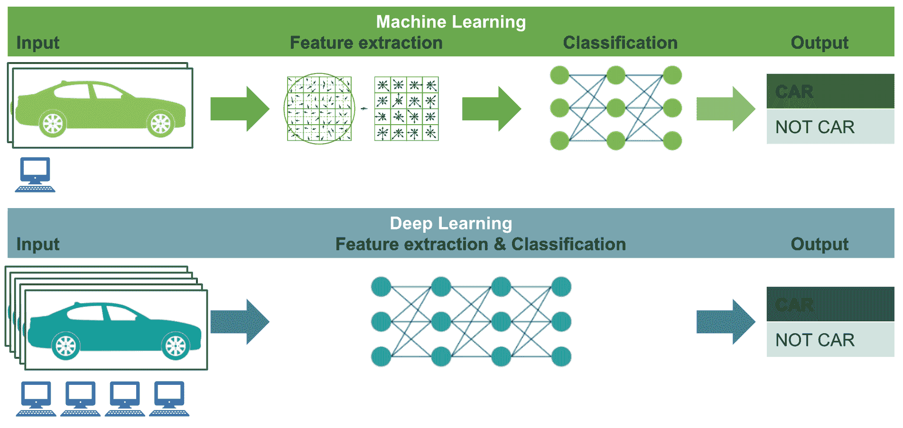

图中阐述的关键点如下：

*   计算资源（深度学习–高端机器与机器学习–低端机器）
*   特征工程（深度学习–同一步骤中的特征提取和分类与机器学习–单独步骤中的特征提取和分类）
*   数据集大小（深度学习–大/非常大的数据集与机器学习–中/大数据集）

# 深度学习爆炸

深度学习的概念并不是什么新鲜事物，因为 Rina Dechter 于 1986 年以及 Igor Aizenberg 及其同事于 2000 年分别将其引入了机器学习领域和**人工神经网络**。 但是，直到 2012 年发生深度学习革命时，才出现了一些对研究界具有重大影响的杰出作品。 在计算机视觉方面， **AlexNet** 体系结构（作者设计的卷积神经网络的名称）是 **ImageNet 大规模视觉识别挑战赛**（ **ILSVRC）的获胜者** ）2012 年的错误率非常低，以巨大的错误率（15.3％对 26.2％（第二名））击败了所有其他竞争对手。 ImageNet（ [http://image-net.org/](http://image-net.org/) ）是一个大型视觉数据库，包含超过 1400 万个带标签的高分辨率图像。 这些图像被人类标记。 ImageNet 包含 20,000 多个类别。 因此，AlexNet 在解决 *ILSVRC 2012* 方面的 2012 年突破通常被认为是 2010 年代深度学习革命的开始。

# 深度学习进行图像分类

继 AlexNet 在此竞赛中获得成功之后，许多其他深度学习架构也已提交 ImageNet 挑战赛，以实现更好的性能。 从这个意义上讲，下一张图展示了提交给 ImageNet 挑战的最相关的深度学习方法的一站式准确性，包括最左侧的 AlexNet（2012）架构，以及迄今为止性能最佳的 Inception-V4（2016） 对：

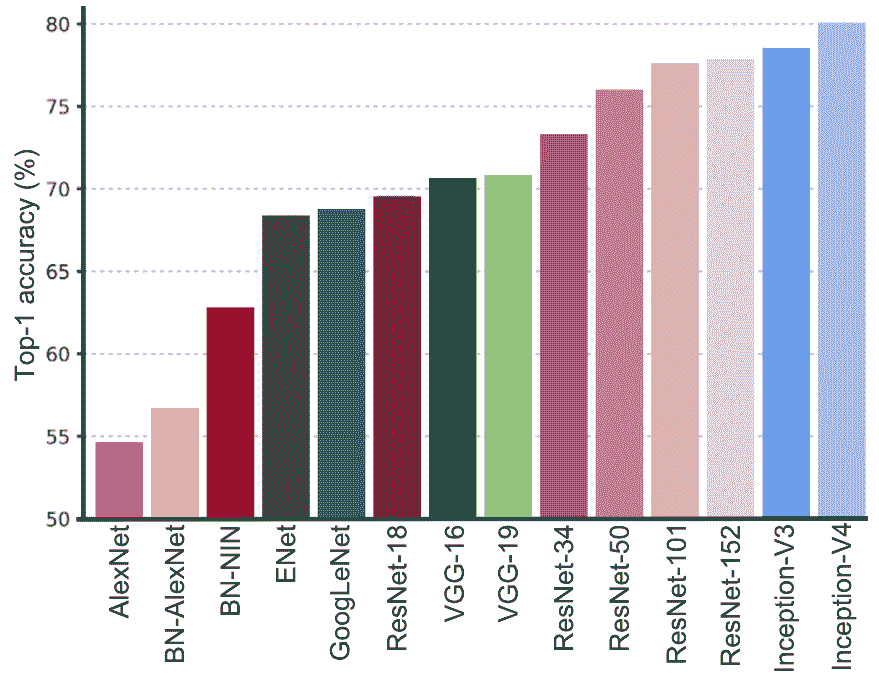

这些深度学习架构的主要方面简要介绍如下，重点介绍了它们引入的关键方面。

此外，如果需要更多详细信息，我们还提供了对每个出版物的引用：

*   **AlexNet（2012）**：
    *   **描述**：AlexNet 是 LSVRC-2012 的获胜者，它是一种简单但功能强大的网络体系结构，其中卷积层和池层一个接一个，而顶层则是全连接层。 在将深度学习方法应用于计算机视觉任务时，通常将该体系结构用作起点。
    *   **参考**：Alex Krizhevsky，Ilya Sutskever 和 Geoffrey E Hinton。 *具有深卷积神经* *网络的 ImageNet 分类。* 中的：神经信息处理系统的进展，第 1097-1105 页，2012 年。
*   **VGG-16 和-19（2014）**：
    *   **描述**：VGGNet 由牛津大学的**视觉几何组**（ **VGG** ）提出。 通过在整个网络中仅使用 *3 x 3* 过滤器，而不使用大型过滤器（例如 *7 x 7* 和[ *11 x 11* ）。 这项工作的主要贡献在于，它表明网络深度是在卷积神经网络中实现更好的识别或分类精度的关键组成部分。 VGGNet 被认为是对特定任务进行基准测试的良好架构。 但是，它的主要缺点是训练速度非常慢，并且网络体系结构的权重很大（VGG-16 为 533 MB，VGG-19 为 574 MB）。 VGGNet-19 使用 1.38 亿个参数。
    *   **参考**：Simonyan，K.和 Zisserman，A.（2014）。 *用于大规模图像识别的超深度卷积网络。* arXiv 预印本 arXiv：1409.1556。
*   **GoogLeNet / Inception V1（2014）**：
    *   **说明**： **GoogLeNet** （也称为 **Inception V1** ）是 LSVRC-2014 的获胜者，其前 5 名错误率达到 6.67％，这非常 接近人类水平的表现。 该架构比 VGGNet 更深入。 但是，由于 9 个并行模块（初始模块）的体系结构是基于几个非常小的卷积的，因此它仅使用 AlexNet 参数数量的十分之一（从 6000 万到仅 400 万个参数），目的是 减少参数数量。
    *   **参考**：Szegedy，C.，Liu，W.，Jia，Y.，Sermanet，P.，Reed，S.，Anguelov，D.，Dumitru，.E，Vincent，.V 和 Rabinovich ，A。（2015）。 *随着卷积的深入发展。* 在关于计算机视觉和模式识别的 IEEE 会议的*会议录*中（第 1-9 页）。
*   **ResNet-18，-34，-50，-101 和-152（2015）**：
    *   **说明**：Microsoft 的**残留网络**（ **ResNets** ）是 LSVRC-2015 的获胜者，并且是迄今为止最深的网络，共有 153 个卷积层达到了最高 5 个分类误差为 4.9％（这比人工精度略好）。 此体系结构包括*跳过连接*，也称为**门控单元**或**门控循环单元**，可实现增量学习更改。 ResNet-34 使用 2180 万个参数，ResNet-50 使用 2560 万个参数，ResNet-101 使用 4450 万个参数，最后，ResNet-152 使用 6020 万个参数。
    *   **参考文献**：He，K.，Zhang，X.，Ren，S.，and Sun，J.（2016）。 *用于* *图像识别的深度残差学习。* 在关于计算机视觉和模式识别的 IEEE 会议的*会议录*中（第 770-778 页）。
*   **Inception V3（2015）**：
    *   **描述**：如前所示，初始架构被引入为 GoogLeNet（也称为**初始 V1** ）。 后来，对该体系结构进行了修改，以引入批处理规范化（Inception-V2）。 Inception V3 体系结构包括其他分解思想，其目的是在不降低网络效率的情况下减少连接/参数的数量。
    *   **参考**：Szegedy，C.，Vanhoucke，V.，Ioffe，S.，Shlens，J.和 Wojna，Z.（2016）。 *重新思考计算机视觉的起始架构。* 在关于计算机视觉和模式识别的 IEEE 会议的*会议录中* （第 2818-2826 页）。

*   **初始版本 V4** **（2016）**：
    *   **说明**：从 GoogLeNet 演变而来的 Inception V4。 另外，与 **Inception-V3** 相比，此体系结构具有更统一的简化体系结构和更多的 Inception 模块。 **Inception-V4** 在 LSVRC 上能够达到 80.2％的 top-1 精度和 95.2％的 top-5 精度。
    *   **参考** **ce** ：Szegedy，C.，Ioffe，S.，Vanhoucke，V.和 Alemi，A.A.（2017 年 2 月）。 ***Inception-V4** ，inception-resnet 以及残余连接对学习的影响。 *AAAI* 中的*（第 4 卷，第 12 页）。

# 用于对象检测的深度学习

对象检测是深度学习中的一个热门话题，它适合于在单个图像中识别和定位多个相关对象。 为了对物体检测算法进行基准测试，通常使用三个数据库。 第一个是 **PASCAL 视觉对象分类**（ **PASCAL VOC** ）数据集（ [http://host.robots.ox.ac.uk/pascal/VOC/](http://host.robots.ox.ac.uk/pascal/VOC/) ），其中包括 20 个类别和 10,000 个用于训练和验证的图像，其中包含带有对象的边界框。 **ImageNet** 自 2013 年以来发布了一个对象检测数据集，它由大约 500,000 张仅用于训练的图像和 200 个类别组成。 最后，**上下文中的常见对象**（ **COCO** ）（ [http://cocodataset.org/](http://cocodataset.org/) ）是大规模的对象检测，分割和字幕数据集 在 328,000 张图像中总共有 250 万个标记实例。 有关 COCO 数据集的更多信息，您可以阅读出版物 *Microsoft COCO：上下文中的通用对象* *（2014）*。 为了评估对象检测算法，通常使用**平均平均精度**（ **mAP** ），其计算方法是对所有类别和/或所有**联合口交**（ **IoU** ）阈值，具体取决于比赛。 在二进制分类中，**平均精度**（ **AP** ）指标对应于**精度**（正预测值）的摘要-**召回**（ 灵敏度**曲线**，而 IoU 指标是预测框与地面真实框之间的重叠区域。 以下是此示例：

*   PASCAL VOC2007 挑战–仅考虑了一个 IoU 阈值。 对于 PASCAL VOC 挑战，如果 IoU> 0.5，则预测为肯定。 因此，mAP 是对所有 20 个对象类平均的。
*   在 2017 年 COCO 挑战赛中，对所有 80 个物体类别和所有 10 个 IoU 阈值（从 0.5 到 0.95，步长为 0.05）平均了 mAP。

在 10 个 IoU 阈值（从 0.5 到 0.95，步长为 0.05）上求平均值，而不是仅考虑一个 *IoU≥0.5* 的阈值，倾向于奖励在精确定位方面更好的模型。

在下表中，您可以看到使用上述三个数据集评估的用于对象检测的最新深度学习算法，其中显示了 PASCAL VOC 和 COCO 数据集上的 mAP 得分：

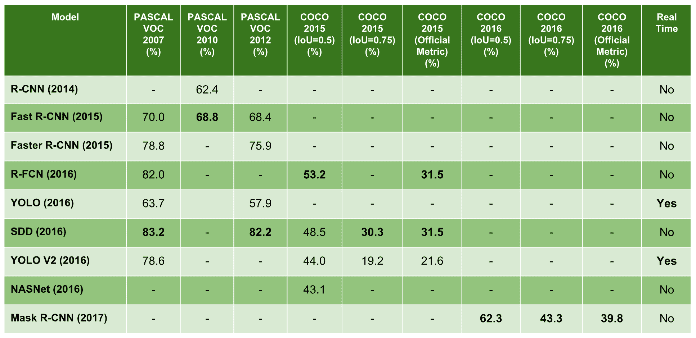

下面包括有关用于对象检测的最新深度学习算法的介绍：

*   **R-CNN（2014）**：
    *   **描述**：**基于区域的卷积网络**（ **R-CNN** ）是使用卷积神经网络进行对象检测的首批方法之一，表明卷积神经网络 与基于类似 HOG 的简单功能的系统相比，可以提高目标检测性能。 该算法可以分解为以下三个步骤：
        1.  创建一组区域建议
        2.  对每个区域建议执行经过修订版的 AlexNet 的前向传递，以提取特征向量
        3.  潜在的对象通过几个 SVM 分类器进行检测，此外，线性回归器会更改边界框的坐标
    *   **参考文献**：Girshick，R.，Donahue，J.，Darrell，T.和 Malik，J.（2014）。 *丰富的功能层次结构，用于准确的对象检测和语义分段。* 在关于计算机视觉和模式识别的 IEEE 会议的*会议录*中（第 580-587 页）。
*   **快速 R-CNN（2015）**：
    *   **描述**：**基于快速区域的卷积网络**（**快速 R-CNN** ）方法是对先前方法的一种改进，可以有效地对目标提议进行分类。 此外，Fast R-CNN 采用了多项创新技术来提高训练和测试速度，同时还提高了检测精度。
    *   **参考**：Girshick，R.（2015）。 *快速 r-cnn* 。 在*关于计算机视觉和模式识别的 IEEE 国际会议论文集*（第 1440-1448 页）中。
*   **Faster R-CNN（2015）**：
    *   **说明**：更快的 R-CNN 是对快速 R-CNN 的修改，引入了一个**区域提议网络**（ **RPN** ），该网络与检测共享全图像卷积特征 网络，从而实现几乎免费的区域提案。
    *   **参考**：Ren，S.，He，K.，Girshick，R.和 Sun，J.（2015）。 *更快的 R-CNN –通过区域提议网络*实现实时目标检测。 在*中，神经信息处理系统的进展*（第 91-99 页）。
*   **R-FCN（2016）**：
    *   **描述**：**基于区域的完全卷积网络**（ **R-FCN** ）是仅包含卷积层的框架，允许进行完整的反向传播以进行训练和推理，从而获得准确而有效的对象 检测。
    *   **参考**：Dai，J.，Li，Y.，He，K.，and Sun，J.（2016）。 *R-FCN：通过基于区域的全卷积网络*进行目标检测。 在*中，神经信息处理系统的进展*（第 379-387 页）。
*   **YOLO（2016）**：
    *   **描述**：**只看一次**（ **YOLO** ）是一种深度学习体系结构，可在单个步骤中预测边界框和类概率。 与其他深度学习检测器相比，YOLO 会产生更多的定位错误，但是在背景中预测假阳性的可能性较小。
    *   **参考文献**：Redmon，J.，Divvala，S.，Girshick，R.和 Farhadi，A.（2016）。 *您只看一次：统一的实时对象检测*。 在*关于计算机视觉和模式识别的 IEEE 会议论文集*（第 779-788 页）中。
*   **SSD（2016）**：
    *   **描述**：**单发多盒检测器**（ **SSD** ）是一个深层神经网络，旨在通过以下方法同时预测边界框和类概率 到端卷积神经网络架构的概念。
    *   **参考文献**：Liu，W.，Anguelov，D.，Erhan，D.，Szegedy，C.，Reed，S.，Fu，C. Y.和 Berg，A. C.（2016 年 10 月）。 *SSD：单发多盒检测器*。 在*欧洲计算机视觉会议*（第 21-37 页）中。 湛史普林格。
*   **YOLO V2（2016）**：
    *   **描述**：作者在同一出版物中介绍了 YOLO9000 和 YOLO V2。 YOLO9000 是一种实时对象检测系统，可以检测 9,000 多个对象类别，而 YOLO V2 是 YOLO 的改进版本，致力于在提高准确性的同时仍是快速检测器。
    *   **参考**：Redmon，J.和 Farhadi，A.（2017）。 *YOLO9000：更好，更快，更强*。 arXiv 预印本。
*   **NASNet（2016）**：
    *   **描述**：作者介绍了一种神经网络搜索，这是使用递归神经网络构成神经网络体系结构的想法。 **神经体系结构搜索网**（ **NASNet** ）包括学习模型的体系结构，以优化层数，同时还提高准确性。
    *   **参考**：Zoph，B.和 Le，Q. V.（2016）。 *具有增强学习功能的神经架构搜索*。 arXiv 预印本 arXiv：1611.01578。
*   **Mask R-CNN（2017）**：
    *   **描述**：**基于蒙版区域的卷积网络**（**蒙版 R-CNN** ）是 Faster R-CNN 模型的另一个扩展，它为边界添加了并行分支 盒检测，目的是预测对象蒙版。 对象遮罩是按图像中的像素进行分割，从而可以对对象实例进行分割。
    *   **参考**：He，K.，Gkioxari，G.，Dollár，P.和 Girshick，R.（2017 年 10 月）。 *遮罩 r-cnn。* *在计算机视觉（ICCV）* *中，关于*计算机视觉*的 2017 IEEE 国际会议*（第 2980-2988 页）。 IEEE。

# OpenCV 中的深度学习

自 OpenCV 3.1 以来，库中已有**深层神经网络**（ **DNN** ）模块，可通过一些流行的深度学习框架进行预训练的深度网络实现前向传递（推理） ，例如 **Caffe** （ [http://caffe.berkeleyvision.org/](http://caffe.berkeleyvision.org/) ）， **TensorFlow** （ [https://www.tensorflow.org/](https://www.tensorflow.org/) ）， **Torch / Pytorch** （ [http://torch.ch/](http://torch.ch/) ）， **Darknet** （ [https://pjreddie.com/ darknet /](https://pjreddie.com/darknet/) ）和 **ONNX** （ [https://onnx.ai/](https://onnx.ai/) ）格式的模型。 在 OpenCV 3.3 中，该模块已从`opencv_contrib`存储库升级到主存储库（ [https://github.com/opencv/opencv/tree/master/modules/dnn](https://github.com/opencv/opencv/tree/master/modules/dnn) ），并已进行了加速 显着。 因此，从 OpenCV 3.3 开始，可以在我们的应用程序中使用经过预训练的网络进行预测，并且在上一节中介绍的许多流行的网络体系结构都与 OpenCV 3.3 兼容。

在本节中，我们将看到如何将这些架构中的一些应用于对象检测和图像分类，但是在涵盖这一方面之前，应先回顾一下 OpenCV 在 DNN 模块中提供的许多功能。

# 了解 cv2.dnn.blobFromImage（）

在第 11 章，“人脸检测，跟踪和识别”中，我们看到了一些涉及深度学习计算的示例。 例如，在`face_detection_opencv_dnn.py`脚本中，使用了基于深度学习的面部检测器（ [https://github.com/opencv/opencv/tree/master/samples/dnn/face_detector](https://github.com/opencv/opencv/tree/master/samples/dnn/face_detector) ）来检测 图像中的面孔。 第一步是按以下方式加载预训练的模型：

```py
net = cv2.dnn.readNetFromCaffe("deploy.prototxt", "res10_300x300_ssd_iter_140000_fp16.caffemodel")
```

提醒一下，`deploy.prototxt`文件定义了模型体系结构，`res10_300x300_ssd_iter_140000_fp16.caffemodel`文件包含了实际图层的权重。 为了对整个网络执行前向传递以计算输出，网络的输入应为 Blob。 斑点可以看作是经过充分预处理以馈送到网络的图像集合。

此预处理由几个操作组成-调整大小，裁剪，减去平均值，缩放以及交换蓝色和红色通道。

例如，在上述面部检测示例中，我们执行了以下命令：

```py
# Load image:
image = cv2.imread("test_face_detection.jpg")

# Create 4-dimensional blob from image:
blob = cv2.dnn.blobFromImage(image, 1.0, (300, 300), [104., 117., 123.], False, False)
```

在这种情况下，这意味着我们要在调整为 *300 x 300，*的 BGR 图像上运行模型，分别对蓝色，绿色和红色通道应用`(104, 117, 123)`值的平均减法。 下表中对此进行了总结：

| **型号** | **规模** | **尺寸 WxH** | **均值减法** | **频道订单** |
| OpenCV 人脸检测器 | 1.0 | *300 x 300* | `104`，`177`，`123` | BGR |

此时，我们可以将 blob 设置为输入，并按以下方式获得检测结果：

```py
# Set the blob as input and obtain the detections:
net.setInput(blob)
detections = net.forward()
```

有关更多详细信息，请参见`face_detection_opencv_dnn.py`脚本。

现在，我们将详细了解`cv2.dnn.blobFromImage()`和`cv2.dnn.blobFromImages()`功能。 为此，我们首先要看到两个函数的签名，然后我们将看到`blob_from_image.py`和`blob_from_images.py`脚本。 这些脚本在理解这些功能时可能会有所帮助。 此外，在这些脚本中，我们还将使用 OpenCV `cv2.dnn.imagesFromBlob()`函数。

`cv2.dnn.blobFromImage()`的签名如下：

```py
retval=cv2.dnn.blobFromImage(image[, scalefactor[, size[, mean[, swapRB[, crop[, ddepth]]]]]])
```

此函数从`image`创建一个二维 Blob。 此外，它还可以选择将图像调整为`size`大小，并从中心裁剪输入图像，减去`mean`值，按`scalefactor`缩放值，并交换蓝色和红色通道：

*   `image`：这是要预处理的输入图像。
*   `scalefactor`：这是`image`值的乘数。 此值可用于缩放我们的图像。 默认值为`1.0`，这表示不执行缩放。
*   `size`：这是输出图像的空间大小。
*   `mean`：这是从图像中减去平均值的标量。 如果执行均值减法，则在使用`swapRB =True`时，这些值应为（`mean-R`，`mean-G`，`mean-B`）。
*   `swapRB`：通过将该标志设置为`True`，可以使用该标志交换图像中的`R`和`B`通道。
*   `crop`：这是一个标志，指示在调整大小后是否将裁切图像。
*   `ddepth`：输出斑点的深度。 您可以在`CV_32F`或`CV_8U`之间选择。
*   如果为`crop=False`，则在不裁剪的情况下执行图像的调整大小。 否则，如果（`crop=True`），则首先应用调整大小，然后从中心裁剪图像。
*   默认值为`scalefactor=1.0`，`size = Size()`，`mean = Scalar()`，`swapRB = false`，`crop = false`和`ddepth = CV_32F`。

`cv.dnn.blobFromImages()`的签名如下：

```py
retval=cv.dnn.blobFromImages(images[, scalefactor[, size[, mean[, swapRB[, crop[, ddepth]]]]]])
```

此功能从多个图像创建一个四维斑点。 这样，您可以对整个网络执行前向传递，以一次计算多个图像的输出。 以下代码显示了如何正确使用此功能：

```py
# Create a list of images:
images = [image, image2]

# Call cv2.dnn.blobFromImages():
blob_images = cv2.dnn.blobFromImages(images, 1.0, (300, 300), [104., 117., 123.], False, False)

# Set the blob as input and obtain the detections:
net.setInput(blob_images)
detections = net.forward()
```

至此，我们介绍了`cv2.dnn.blobFromImage()`和`cv2.dnn.blobFromImages()`功能。 因此，我们准备看`blob_from_image.py`和`blob_from_images.py`脚本。

在`blob_from_image.py`脚本中，我们首先加载 BGR 图像，然后使用`cv2.dnn.blobFromImage()`函数创建一个二维 Blob。 您可以检查创建的 Blob 的形状是否为`(1, 3, 300, 300)`。 然后，我们调用`get_image_from_blob()`函数，该函数可用于执行逆预处理转换，以便再次获取输入图像。 这样，您将更好地了解此预处理。 `get_image_from_blob`功能的代码如下：

```py
def get_image_from_blob(blob_img, scalefactor, dim, mean, swap_rb, mean_added):
    """Returns image from blob assuming that the blob is from only one image""
    images_from_blob = cv2.dnn.imagesFromBlob(blob_img)
    image_from_blob = np.reshape(images_from_blob[0], dim) / scalefactor
    image_from_blob_mean = np.uint8(image_from_blob)
    image_from_blob = image_from_blob_mean + np.uint8(mean)

    if mean_added is True:
        if swap_rb:
            image_from_blob = image_from_blob[:, :, ::-1]
        return image_from_blob
    else:
        if swap_rb:
            image_from_blob_mean = image_from_blob_mean[:, :, ::-1]
        return image_from_blob_mean
```

在脚本中，我们利用此功能从 blob 获取不同的图像，如以下代码片段所示：

```py
# Load image:
image = cv2.imread("face_test.jpg")

# Call cv2.dnn.blobFromImage():
blob_image = cv2.dnn.blobFromImage(image, 1.0, (300, 300), [104., 117., 123.], False, False)

# The shape of the blob_image will be (1, 3, 300, 300):
print(blob_image.shape)

# Get different images from the blob:
img_from_blob = get_image_from_blob(blob_image, 1.0, (300, 300, 3), [104., 117., 123.], False, True)
img_from_blob_swap = get_image_from_blob(blob_image, 1.0, (300, 300, 3), [104., 117., 123.], True, True)
img_from_blob_mean = get_image_from_blob(blob_image, 1.0, (300, 300, 3), [104., 117., 123.], False, False)
img_from_blob_mean_swap = get_image_from_blob(blob_image, 1.0, (300, 300, 3), [104., 117., 123.], True, False)
```

创建的图像说明如下：

*   `img_from_blob`图像对应于调整为`(300,300)`的原始 BGR 图像。
*   `img_from_blob_swap`图像对应于调整为`(300,300)`尺寸的原始 BGR 图像，并且蓝色和红色通道已交换。
*   `img_from_blob_mean`图像对应于调整为`(300,300)`尺寸的原始 BGR 图像，其中未将具有平均值的标量添加到图像中。
*   `img_from_blob_mean_swap`图像对应于调整为`(300,300)`的原始 BGR 图像，其中未将具有平均值的标量添加到该图像，并且已交换了蓝色和红色通道。

在以下屏幕截图中可以看到此脚本的输出：


在上一个屏幕截图中，我们可以看到获得的四个图像（`img_from_blob`，`img_from_blob_swap`，`img_from_blob_mean`和`img_from_blob_mean_swap`）。

在`blob_from_images.py`脚本中，我们首先加载两个 BGR 图像，并使用`cv2.dnn.blobFromImages()`函数创建一个二维 Blob。 您可以检查创建的 Blob 的形状是否为`(2, 3, 300, 300)`。 然后，我们调用`get_images_from_blob()`函数，该函数可用于执行逆预处理转换，以便再次获取输入图像。

`get_images_from_blob`功能的代码如下：

```py
def get_images_from_blob(blob_imgs, scalefactor, dim, mean, swap_rb, mean_added):
    """Returns images from blob"""

    images_from_blob = cv2.dnn.imagesFromBlob(blob_imgs)
    imgs = []

    for image_blob in images_from_blob:
        image_from_blob = np.reshape(image_blob, dim) / scalefactor
        image_from_blob_mean = np.uint8(image_from_blob)
        image_from_blob = image_from_blob_mean + np.uint8(mean)
        if mean_added is True:
            if swap_rb:
                image_from_blob = image_from_blob[:, :, ::-1]
            imgs.append(image_from_blob)
        else:
            if swap_rb:
                image_from_blob_mean = image_from_blob_mean[:, :, ::-1]
            imgs.append(image_from_blob_mean)

    return imgs
```

如前所示，`get_images_from_blob()`函数使用 OpenCV `cv2.dnn.imagesFromBlob()`函数从 Blob 返回图像。 在脚本中，我们利用此函数从 Blob 中获取不同的图像，如下所示：

```py
# Load images and get the list of images:
image = cv2.imread("face_test.jpg")
image2 = cv2.imread("face_test_2.jpg")
images = [image, image2]

# Call cv2.dnn.blobFromImages():
blob_images = cv2.dnn.blobFromImages(images, 1.0, (300, 300), [104., 117., 123.], False, False)
# The shape of the blob_image will be (2, 3, 300, 300):
print(blob_images.shape)

# Get different images from the blob:
imgs_from_blob = get_images_from_blob(blob_images, 1.0, (300, 300, 3), [104., 117., 123.], False, True)
imgs_from_blob_swap = get_images_from_blob(blob_images, 1.0, (300, 300, 3), [104., 117., 123.], True, True)
imgs_from_blob_mean = get_images_from_blob(blob_images, 1.0, (300, 300, 3), [104., 117., 123.], False, False)
imgs_from_blob_mean_swap = get_images_from_blob(blob_images, 1.0, (300, 300, 3), [104., 117., 123.], True, False)
```

在前面的代码中，我们利用`get_images_from_blob()`函数从 Blob 获取不同的图像。 创建的图像说明如下：

*   `imgs_from_blob`图像对应于调整为`(300,300)`尺寸的原始 BGR 图像。
*   `imgs_from_blob_swap`图像对应于调整为`(300,300)`尺寸的原始 BGR 图像，并且蓝色和红色通道已交换。
*   `imgs_from_blob_mean`图像对应于调整为`(300,300)`尺寸的原始 BGR 图像，其中带有平均值的标量尚未添加到图像。
*   `imgs_from_blob_mean_swap`图像对应于调整为`(300,300)`的原始 BGR 图像，其中未将具有平均值的标量添加到图像中，并且蓝色和红色通道已交换。

在以下屏幕截图中可以看到此脚本的输出：

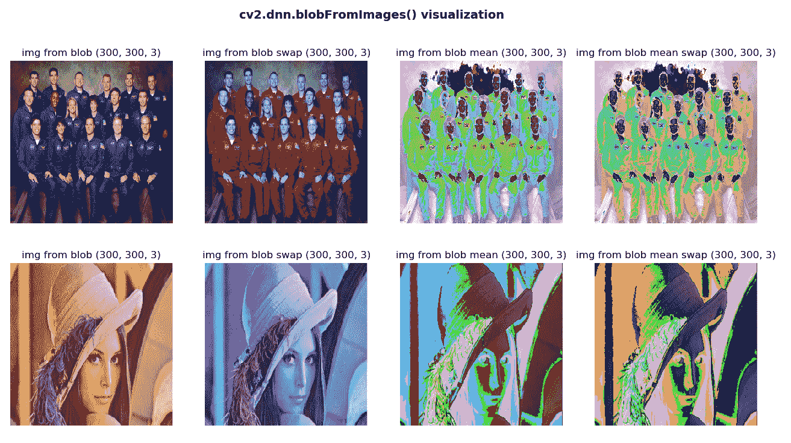

`cv2.dnn.blobFromImage()`和`cv2.dnn.blobFromImages()`的最后一个考虑因素是`crop`参数，该参数指示是否裁切图像。 在裁剪的情况下，图像将从中心裁剪，如以下屏幕截图所示：

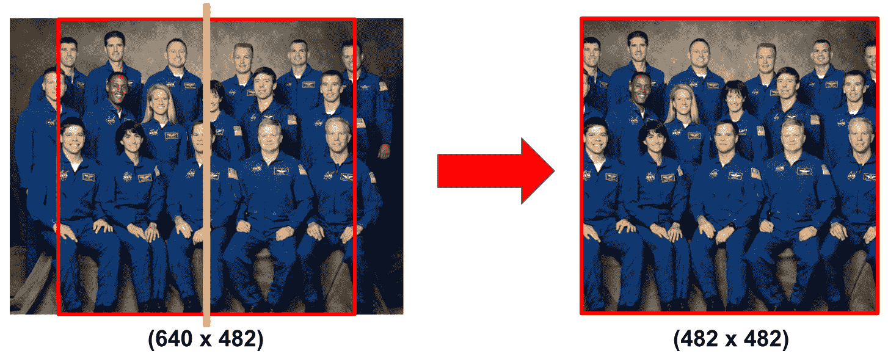

如您所见，裁剪是从图像的中心进行的，由黄线表示。 为了复制 OpenCV 在`cv2.dnn.blobFromImage()`和`cv2.dnn.blobFromImages()`函数内部执行的裁剪，我们对`get_cropped_img()`函数进行了如下编码：

```py
def get_cropped_img(img):
    """Returns the cropped image"""

    # calculate size of resulting image:
    size = min(img.shape[1], img.shape[0])

    # calculate x1, and y1
    x1 = int(0.5 * (img.shape[1] - size))
    y1 = int(0.5 * (img.shape[0] - size))

    # crop and return the image
    return img[y1:(y1 + size), x1:(x1 + size)]
```

如您所见，裁剪图像的大小将基于原始图像的最小尺寸。 因此，在前面的示例中，裁剪后的图像将具有`(482, 482)`的大小。

在`blob_from_images_cropping.py`脚本中，我们看到了裁剪的效果，并且还在`get_cropped_img()`函数中复制了裁剪过程：

```py
# Load images and get the list of images:
image = cv2.imread("face_test.jpg")
image2 = cv2.imread("face_test_2.jpg")
images = [image, image2]

# To see how cropping works, we are going to perform the cropping formulation that
# both blobFromImage() and blobFromImages() perform applying it to one of the input images:
cropped_img = get_cropped_img(image)
# cv2.imwrite("cropped_img.jpg", cropped_img)

# Call cv2.dnn.blobFromImages():
blob_images = cv2.dnn.blobFromImages(images, 1.0, (300, 300), [104., 117., 123.], False, False)
blob_blob_images_cropped = cv2.dnn.blobFromImages(images, 1.0, (300, 300), [104., 117., 123.], False, True)

# Get different images from the blob:
imgs_from_blob = get_images_from_blob(blob_images, 1.0, (300, 300, 3), [104., 117., 123.], False, True)
imgs_from_blob_cropped = get_images_from_blob(blob_blob_images_cropped, 1.0, (300, 300, 3), [104., 117., 123.], False, True)
```

在以下屏幕截图中可以看到`blob_from_images_cropping.py`脚本的输出：

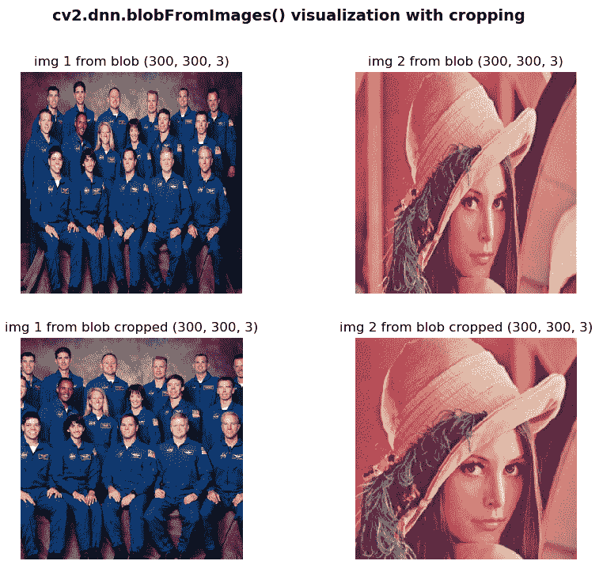

可以看到在两个加载的图像中裁剪的效果，并且我们还可以理解保持了宽高比。

# 使用 OpenCV DNN 人脸检测器的完整示例

接下来，我们将看到如何修改`face_detection_opencv_dnn.py`脚本（摘自第 11 章，“人脸检测，跟踪和识别”），以便执行以下操作：

*   当几张图像（可能具有不同的大小）馈送到网络时，计算输出– `face_detection_opencv_cnn_images.py`脚本
*   当`cv2.dnn.blobFromImages()`功能- `face_detection_opencv_cnn_images_crop.py`脚本中的`crop=True`参数馈入网络时，将几张图像（可能具有不同的尺寸）馈送到网络时，计算输出

以下屏幕快照显示了`face_detection_opencv_cnn_images.py`脚本的输出：


以下屏幕快照显示了`face_detection_opencv_cnn_images_crop.py`脚本的输出：

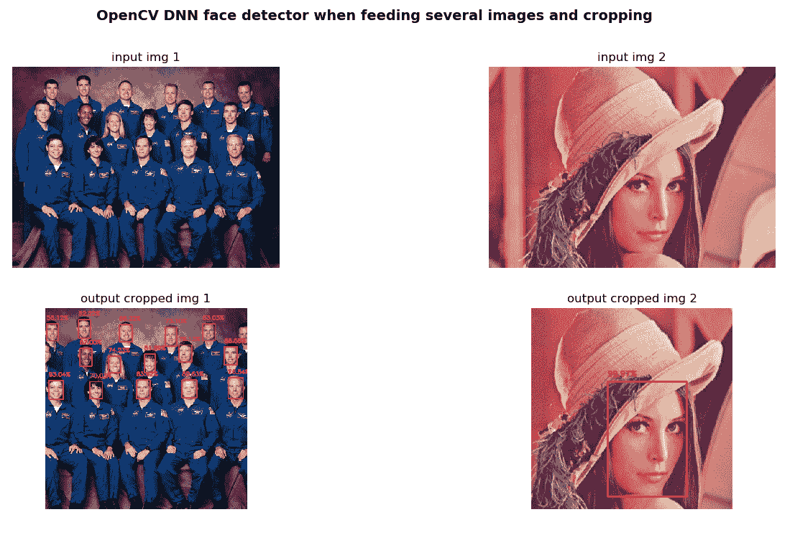

在上一个屏幕截图中，您可以清楚地看到从中心裁剪图像时的区别。

# OpenCV 深度学习分类

本节将介绍如何使用不同的预训练模型进行图像分类的几个示例。 请注意，您可以通过使用`net.getPerfProfile()`方法获得推断时间，如下所示：

```py
# Feed the input blob to the network, perform inference and get the output:
net.setInput(blob)
preds = net.forward()

# Get inference time:
t, _ = net.getPerfProfile()
print('Inference time: %.2f ms' % (t * 1000.0 / cv2.getTickFrequency()))
```

如您所见，在执行推断后将调用`net.getPerfProfile()`方法。

`net.getPerfProfile()`方法返回推理的总时间和图层的计时（以滴答为单位）。 这样，您可以使用不同的深度学习架构比较推理时间。

我们将从下一部分介绍的 AlexNet 架构开始，了解主要的深度学习分类架构。

# AlexNet 用于图像分类

在`image_classification_opencv_alexnet_caffe.py`脚本中，通过使用 AlexNet 和 Caffe 预训练模型，使用 OpenCV DNN 模块进行图像分类。 第一步是加载类的名称。 第二步是从磁盘加载序列化的 Caffe 模型。 第三步是加载输入图像进行分类。 第四步是创建大小为`(227, 2327)`和`(104, 117, 123)`平均减法值的 blob。 第五步是将输入 Blob 馈送到网络，执行推理并获得输出。 第六步是获得概率最高（降序排列）的 10 个索引。 这样，具有最高概率（最高预测）的索引将是第一个。 最后，我们将在图像上绘制与最高预测相关的类和概率。 在以下屏幕截图中可以看到此脚本的输出：


如前面的屏幕快照所示，最高的预测对应于教堂的概率为 0.8325679898。

十大预测如下：

*   `1\. label: church, probability: 0.8325679898`
*   `2\. label: monastery, probability: 0.043678388`
*   `3\. label: mosque, probability: 0.03827961534`
*   `4\. label: bell cote, probability: 0.02479489893`
*   `5\. label: beacon, probability: 0.01249620412`
*   `6\. label: dome, probability: 0.01223050058`
*   `7\. label: missile, probability: 0.006323920097`
*   `8\. label: projectile, probability: 0.005275635514`
*   `9\. label: palace, probability: 0.004289720673`
*   `10\. label: castle, probability: 0.003241452388`

还应注意，在绘制类别和概率时，我们执行以下操作：

```py
text = "label: {} probability: {:.2f}%".format(classes[indexes[0]], preds[0][indexes[0]] * 100)
print(text)
y0, dy = 30, 30
for i, line in enumerate(text.split('\n')):
    y = y0 + i * dy
    cv2.putText(image, line, (5, y), cv2.FONT_HERSHEY_SIMPLEX, 0.8, (0, 255, 255), 2)
```

这样，可以将文本拆分并在图像的不同行中绘制。 例如，如果我们执行以下代码，则文本将分两行绘制：

```py
text = "label: {}\nprobability: {:.2f}%".format(classes[indexes[0]], preds[0][indexes[0]] * 100)
```

应当注意，`bvlc_alexnet.caffemodel`文件未包含在本书的存储库中，因为它超过了 GitHub 的文件大小限制 100.00 MB。 您必须从 [http://dl.caffe.berkeleyvision.org/bvlc_alexnet.caffemodel 下载。](http://dl.caffe.berkeleyvision.org/bvlc_alexnet.caffemodel)

因此，您必须在运行脚本之前下载`bvlc_alexnet.caffemodel`文件。

# GoogLeNet 用于图像分类

以与先前脚本类似的方式，在`image_classification_opencv_googlenet_caffe.py`脚本中使用 GoogLeNet 和 Caffe 预训练模型使用 OpenCV CNN 模块进行图像分类。

在以下屏幕截图中可以看到此脚本的输出：


如前面的屏幕快照所示，最高的预测对应于一座教堂，其概率为 0.9082632661。

十大预测如下：

*   `1\. label: church, probability: 0.9082632661`
*   `2\. label: bell cote, probability: 0.06350905448`
*   `3\. label: monastery, probability: 0.02046923898`
*   `4\. label: dome, probability: 0.002624791814`
*   `5\. label: mosque, probability: 0.001077500987`
*   `6\. label: fountain, probability: 0.001011475339`
*   `7\. label: palace, probability: 0.0007750992081`
*   `8\. label: castle, probability: 0.0002349214483`
*   `9\. label: pedestal, probability: 0.0002306570677`
*   `10\. label: analog clock, probability: 0.0002107089822`

# ResNet 用于图像分类

用于图像分类的 ResNet 脚本（`image_classification_opencv_restnet_50_caffe.py`）将使用带有 Caffe 预训练模型的 ResNet-50 进行图像分类。

在以下屏幕截图中可以看到输出：

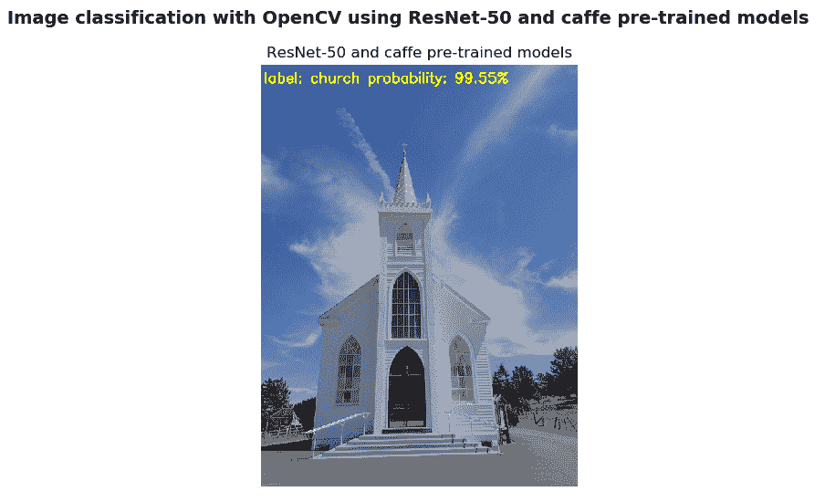

如前面的屏幕快照所示，最高的预测对应于一座教堂的概率为 0.9955400825。

十大预测如下：

*   `1\. label: church, probability: 0.9955400825`
*   `2\. label: dome, probability: 0.002429900225`
*   `3\. label: bell cote, probability: 0.0007424423238`
*   `4\. label: monastery, probability: 0.0003768313909`
*   `5\. label: picket fence, probability: 0.0003282549733`
*   `6\. label: mosque, probability: 0.000258318265`
*   `7\. label: mobile home, probability: 0.0001083607058`
*   `8\. label: stupa, probability: 2.96174203e-05`
*   `9\. label: palace, probability: 2.621001659e-05`
*   `10\. label: beacon, probability: 2.02897063e-05`

# SqueezeNet 用于图像分类

在`image_classification_opencv_squeezenet_caffe.py`脚本中，我们使用 SqueezeNet 体系结构执行图像分类，该体系结构可将 AlexNet 级别的精度降低 50 倍。 在以下屏幕截图中可以看到此脚本的输出：


如前面的屏幕快照所示，最高的预测对应于一座教堂的概率为 0.9967952371。

在此脚本中，我们使用的是 SqueezeNet v1.1，其计算量比 v1.0 少 *2.4 倍*，但又不牺牲任何准确性。

十大预测如下：

*   `1\. label: church, probability: 0.9967952371`
*   `2\. label: monastery, probability: 0.001899079769`
*   `3\. label: bell cote, probability: 0.0006924766349`
*   `4\. label: mosque, probability: 0.0002616141282`
*   `5\. label: dome, probability: 0.0001891527208`
*   `6\. label: palace, probability: 0.0001046952093`
*   `7\. label: stupa, probability: 8.239243471e-06`
*   `8\. label: vault, probability: 7.135886335e-06`
*   `9\. label: triumphal arch, probability: 6.732503152e-06`
*   `10\. label: cinema, probability: 4.201304819e-06`

# OpenCV 深度学习对象检测

本节将介绍如何使用不同的预训练模型执行对象检测的几个示例。 对象检测尝试检测图像或视频中预定义类（例如猫，汽车和人）的语义对象实例。

# MobileNet-SSD 用于对象检测

我们将结合使用 MobileNet 架构和 SSD 框架。 MobileNets 可以看作是用于移动视觉应用程序的高效卷积神经网络。

MobileNet-SSD 在 COCO 数据集上进行了培训，并在 PASCAL VOC 上进行了微调，达到了 72.27％的 mAP（请参阅汇总 mAP 的表格以了解对象检测算法，以将该指标置于上下文中）。 在 PASCAL VOC 上进行微调时，可以检测到 20 个对象类，如下所示：

*   **人**：人
*   **动物**：鸟，猫，牛，狗，马和羊
*   **车辆**：飞机，自行车，轮船，公共汽车，汽车，摩托车和火车
*   **室内**：瓶子，椅子，餐桌，盆栽，沙发和电视/显示器

在`object_detection_opencv_mobilenet_caffe.py`脚本中，我们使用 OpenCV DNN 模块通过使用 MobileNet-SSD 和 Caffe 预训练模型来执行对象检测。

在以下屏幕截图中可以看到此脚本的输出：

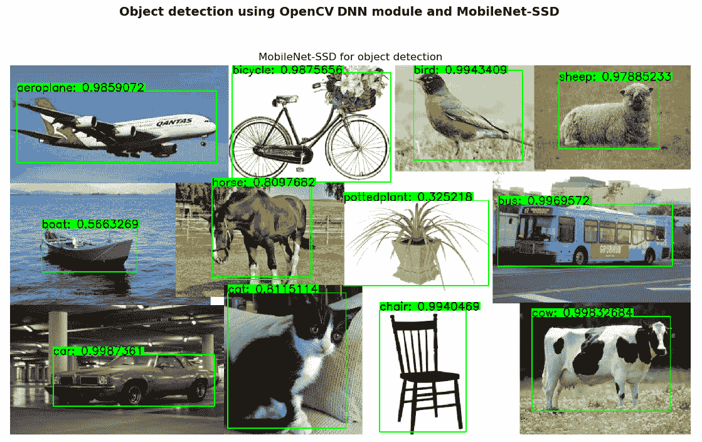

如上一个屏幕截图所示，所有对象都可以高精度正确检测。

# YOLO 用于物体检测

在`object_detection_opencv_yolo_darknet.py`脚本中，使用 YOLO v3 进行对象检测。 YOLO v3 使用了一些技巧来改善训练并提高性能，其中包括多尺度预测和更好的主干分类器。

在以下屏幕截图中可以看到此脚本的输出：

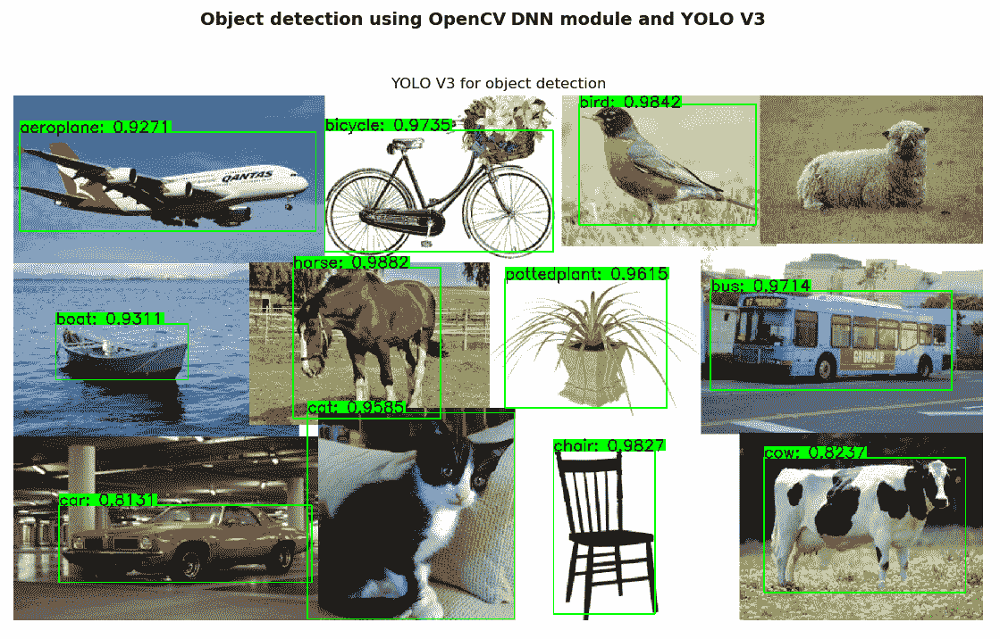

如上一个屏幕截图所示，可以高度准确地检测到除一个（绵羊）以外的所有物体。 因此，您必须在运行脚本之前下载`yolov3.weights`文件。

应当注意，`yolov3.weights`文件未包含在本书的存储库中，因为它超过了 GitHub 的文件大小限制 100.00 MB。 您必须从 [https://pjreddie.com/media/files/yolov3.weights](https://pjreddie.com/media/files/yolov3.weights) [下载。](http://dl.caffe.berkeleyvision.org/bvlc_alexnet.caffemodel)

# TensorFlow 库

TensorFlow 是 Google Brain 团队为内部使用而开发的用于机器学习和深度学习的开源软件平台。 随后，TensorFlow 于 2015 年在 Apache 许可下发布。在本节中，我们将看到一些示例，以向您介绍 TensorFlow 库。

# TensorFlow 的介绍示例

TensorFlow 库通过将操作链接到计算图中来表示要执行的计算。 创建此计算图后，您可以打开 TensorFlow 会话并执行该计算图以获取结果。 可以在`tensorflow_basic_op.py`脚本中看到此过程，该脚本执行在计算图中定义的乘法运算，如下所示：

```py
# path to the folder that we want to save the logs for Tensorboard
logs_path = "./logs"

# Define placeholders:
X_1 = tf.placeholder(tf.int16, name="X_1")
X_2 = tf.placeholder(tf.int16, name="X_2")

# Define a multiplication operation:
multiply = tf.multiply(X_1, X_2, name="my_multiplication")
```

在会话中运行图形时，将提供占位符的值，如以下代码片段所示：

```py
# Start the session and run the operation with different inputs:
with tf.Session() as sess:
    summary_writer = tf.summary.FileWriter(logs_path, sess.graph)

    print("2 x 3 = {}".format(sess.run(multiply, feed_dict={X_1: 2, X_2: 3})))
    print("[2, 3] x [3, 4] = {}".format(sess.run(multiply, feed_dict={X_1: [2, 3], X_2: [3, 4]})))
```

如您所见，计算图已参数化以访问外部输入，称为**占位符**。 在同一会话中，我们将使用不同的输入执行两次乘法。 由于计算图形是 TensorFlow 的关键点，因此图形可视化可以帮助您使用 TensorBoard 来理解和调试图形，TensorBoard 是任何标准 TensorFlow 安装随附的可视化软件。 要使用 TensorBoard 可视化计算图，您需要使用`tf.summary.FileWriter()`编写程序的日志文件，如前所示。 如果执行此脚本，则会在执行该脚本的相同位置创建`logs`目录。 要运行 TensorBoard，您应该执行以下代码：

```py
$ tensorboard --logdir="./logs"
```

这将生成一个链接（`http://localhost:6006/`），供您在浏览器中输入，您将看到 **TensorBoard** 页面，该页面可以在以下屏幕截图中看到：

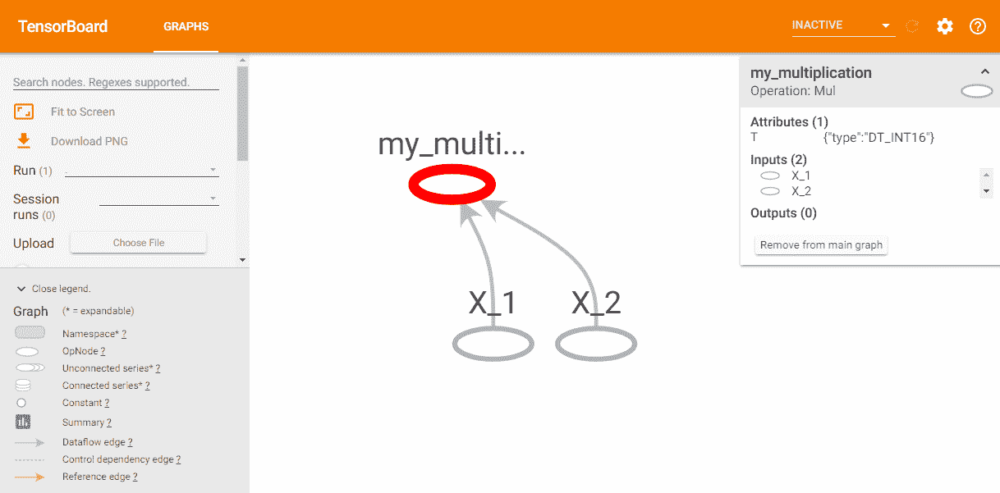

您可以看到先前脚本的计算图。 另外，由于 TensorFlow 图可以具有成千上万个节点，因此可以创建范围以简化可视化，并且 **TensorBoard** 使用此信息来定义图中节点的层次结构。 这个想法显示在`tensorflow_basic_ops_scope.py`脚本中，其中我们在`Operations`范围内定义了两个操作（加法和乘法），如下所示：

```py
with tf.name_scope('Operations'):
    addition = tf.add(X_1, X_2, name="my_addition")
    multiply = tf.multiply(X_1, X_2, name="my_multiplication")
```

如果执行脚本并重复前面的步骤，则可以在以下屏幕截图中看到 **TensorBoard** 中显示的计算图：

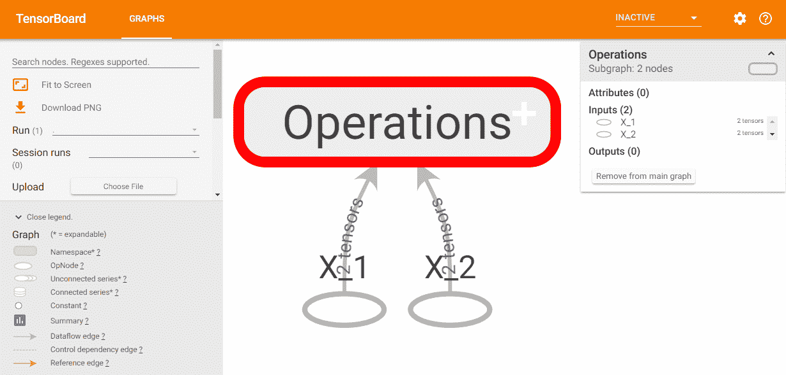

请注意，您还可以在脚本中使用常量（`tf.Constant`）和变量（`tf.Variable`）。 `tf.Variable`和`tf.placeholder`之间的差异在于传递值的时间。 如您在前面的示例中所看到的，使用`tf.placeholder`不必提供初始值，并且这些值在运行时使用会话内的`feed_dict`参数指定。 另一方面，如果使用`tf.Variable`变量，则在声明它时必须提供一个初始值。

占位符只是一个变量，之后将向其分配数据。 在训练/测试算法时，通常使用占位符将训练/测试数据输入到计算图中。

为了简化起见，我们不会在下一个脚本中显示已创建的计算图，但是推荐使用 **TensorBoard** 来可视化计算图的方法，因为这将有助于您理解（以及 验证）执行哪些计算。

# TensorFlow 中的线性回归

在接下来的示例中，我们将使用 TensorFlow 执行线性回归，以帮助您了解训练和测试深度学习算法时所需的其他概念。

更具体地说，我们将看到三个脚本。 在每个脚本中，我们将涵盖以下主题：

*   `tensorflow_linear_regression_training.py`：此脚本生成线性回归模型。
*   `tensorflow_linear_regression_testing.py`：此脚本加载创建的模型并使用它进行新的预测。
*   `tensorflow_save_and_load_using_model_builder.py`：此脚本加载创建的模型，并使用`SavedModelBuilder()`导出模型以进行推断。 此外，此脚本还加载最终模型以做出新的预测。

线性回归是一种非常普遍的统计方法，它使我们能够根据给定的二维样本点集对关系进行建模。 在这种情况下，模型功能如下：


这描述了具有`W`斜率和 *y* -截距`b`的线。 因此，目标是找到`W`和`b`参数的值，这些值将在某种意义上为二维采样点提供最佳拟合（例如，最小化均方误差）。

在训练线性回归模型（请参阅`tensorflow_linear_regression_training.py`）时，第一步是生成一些数据，用于训练算法，如下所示：

```py
x = np.linspace(0, N, N)
y = 3 * np.linspace(0, N, N) + np.random.uniform(-10, 10, N)
```

下一步是定义占位符，以便在训练过程中将我们的训练数据输入到优化器中，如下所示：

```py
X = tf.placeholder("float", name='X')
Y = tf.placeholder("float", name='Y')
```

此时，我们为权重和偏差声明两个变量（随机初始化），如下所示：

```py
W = tf.Variable(np.random.randn(), name="W")
b = tf.Variable(np.random.randn(), name="b")
```

下一步是构建线性模型，如下所示：

```py
y_model = tf.add(tf.multiply(X, W), b, name="y_model")
```

我们还定义了成本函数。 在这种情况下，我们将使用均方误差`cost`函数，如以下代码片段所示：

```py
cost = tf.reduce_sum(tf.pow(y_model - Y, 2)) / (2 * N)
```

现在，我们创建梯度下降优化器，以最小化`cost`函数，修改`W`和`b`变量的值。

传统的优化器称为**梯度下降**（旨在查找函数最小值的迭代优化算法），如下所示：

```py
optimizer = tf.train.GradientDescentOptimizer(learning_rate).minimize(cost)
```

学习速率参数控制每次梯度下降算法更新时系数的变化量。 如前所述，梯度下降是一种迭代优化算法，因此，在每次迭代中，根据学习速率参数修改参数。

创建模型的最后一步是执行变量的初始化，如下所示：

```py
init = tf.global_variables_initializer()
```

此时，我们可以在一个会话中开始训练过程，如以下代码片段所示：

```py
# Start the training procedure inside a TensorFlow Session:
with tf.Session() as sess:
    # Run the initializer:
    sess.run(init)

    # Uncomment if you want to see the created graph
    # summary_writer = tf.summary.FileWriter(logs_path, sess.graph)

    # Iterate over all defined epochs:
    for epoch in range(training_epochs):

        # Feed each training data point into the optimizer:
        for (_x, _y) in zip(x, y):
            sess.run(optimizer, feed_dict={X: _x, Y: _y})

        # Display the results every 'display_step' epochs:
        if (epoch + 1) % disp_step == 0:
            # Calculate the actual cost, W and b:
            c = sess.run(cost, feed_dict={X: x, Y: y})
            w_est = sess.run(W)
            b_est = sess.run(b)
            print("Epoch", (epoch + 1), ": cost =", c, "W =", w_est, "b =", b_est)

    # Save the final model
    saver.save(sess, './linear_regression')

    # Storing necessary values to be used outside the session
    training_cost = sess.run(cost, feed_dict={X: x, Y: y})
    weight = sess.run(W)
    bias = sess.run(b)

print("Training finished!")
```

如前面的代码片段所示，一旦会话开始，我们将运行初始化程序，然后对所有定义的时期进行迭代以训练线性回归模型。 此外，我们为每个`display_step`时期打印结果。 最后，训练完成后，我们将保存最终模型。

至此，培训结束，我们可以显示结果了，可以在以下屏幕截图中看到：

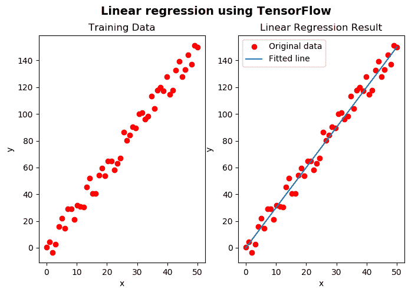

在上图中，我们可以看到训练数据（左）和与线性回归模型相对应的拟合线（右）。

保存最终模型（`saver.save(sess, './linear_regression')`）时，将创建四个文件：

*   `.meta`文件：包含 TensorFlow 图
*   `.data`文件：包含权重，偏差，渐变和所有其他已保存变量的值
*   `.index`文件：标识检查点
*   `checkpoint`文件：记录保存的最新检查点文件

此时，我们可以加载预训练的模型并将其用于预测目的。 这在`tensorflow_linear_regression_testing.py`脚本中执行。 加载模型时要做的第一件事是从`.meta`文件中加载图形，如下所示：

```py
tf.reset_default_graph()
imported_meta = tf.train.import_meta_graph("linear_regression.meta")
```

第二步是加载变量的值（请注意，这些值仅在会话中存在）。 我们还运行模型以获取`W`，`b`的值和新的预测值，如下所示：

```py
with tf.Session() as sess:
    imported_meta.restore(sess, './linear_regression')
    # Run the model to get the values of the variables W, b and new prediction values:
    W_estimated = sess.run('W:0')
    b_estimated = sess.run('b:0')
    new_predictions = sess.run(['y_model:0'], {'X:0': new_x})
```

此时，我们可以显示训练数据，回归线和新获得的预测，可以在以下屏幕截图中看到：

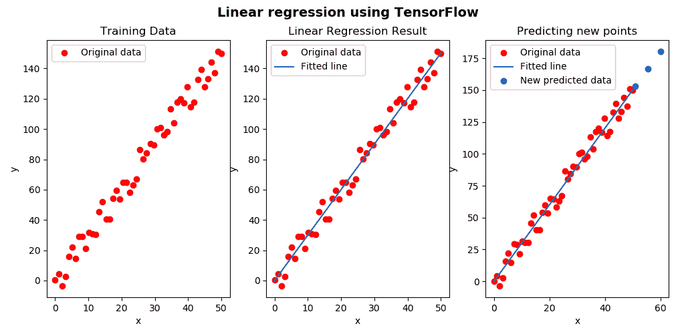

如上一个屏幕截图所示，我们使用了预先训练的模型来进行新的预测（蓝点）。 但是，在生产中提供模型时，我们只希望将模型及其权重很好地打包在一个文件中，以方便存储，版本控制和更新不同模型。 结果将是一个扩展名为`.pb`的二进制文件，其中包含受训网络的拓扑和权重。 在`tensorflow_save_and_load_using_model_builder.py`脚本中执行创建此二进制文件的过程以及如何将其用于推理。

在此脚本中，我们对`export_model()`函数进行了编码，以使用`SaveModel`（ [https://www.tensorflow.org/guide/saved_model](https://www.tensorflow.org/guide/saved_model) ）导出训练后的模型，如下所示：

```py
def export_model():
    """Exports the model"""

    trained_checkpoint_prefix = 'linear_regression'

    loaded_graph = tf.Graph()
    with tf.Session(graph=loaded_graph) as sess:
        sess.run(tf.global_variables_initializer())

        # Restore from checkpoint
        loader = tf.train.import_meta_graph(trained_checkpoint_prefix + '.meta')
        loader.restore(sess, trained_checkpoint_prefix)

        # Add signature:
        ...
        signature_map = {signature_constants.DEFAULT_SERVING_SIGNATURE_DEF_KEY: signature}

        # Export model:
        builder = tf.saved_model.builder.SavedModelBuilder('./my_model')
        builder.add_meta_graph_and_variables(sess, signature_def_map=signature_map,
                                             tags=[tf.saved_model.tag_constants.SERVING])
        builder.save()
```

这将在`my_model`文件夹内创建`saved_model.pb`。 在这一点上，为了验证是否正确生成了导出的模型，我们可以同时导入和使用它，以便进行新的预测，如下所示：

```py
with tf.Session(graph=tf.Graph()) as sess:
    tf.saved_model.loader.load(sess, [tf.saved_model.tag_constants.SERVING], './my_model')
    graph = tf.get_default_graph()
    x = graph.get_tensor_by_name('X:0')
    model = graph.get_tensor_by_name('y_model:0')
    print(sess.run(model, {x: new_x}))
```

调用`load`函数后，该图形将作为默认图形被加载。 此外，变量也已加载，因此您可以开始对任何新数据运行推理。 这将输出`[153.04472 166.54755 180.05037]`数组，它对应于我们的模型生成的预测值。

# 使用 TensorFlow 进行手写数字识别

在此示例中，我们将使用 TensorFlow 对图像进行分类。 更具体地说，我们将创建一个简单的模型（softmax 回归模型），用于使用 MNIST 数据集学习和预测图像中的手写数字。

Softmax 回归是可用于多类分类的逻辑回归的概括。 MNIST 数据集（ [http://yann.lecun.com/exdb/mnist/](http://yann.lecun.com/exdb/mnist/) ）包含各种手写的数字图像：


`mnist_tensorflow_save_model.py`脚本创建用于学习和预测图像中手写数字的模型。

主要步骤如下所示。 您可以使用以下代码自动导入此数据集：

```py
from tensorflow.examples.tutorials.mnist import input_data
data = input_data.read_data_sets("MNIST/", one_hot=True)
```

下载的数据集由三部分组成-55,000 行`mnist.train`训练数据，10,000 行`mnist.test`测试数据和 5,000 行`mnist.validation`验证数据。 此外，培训，测试和验证部分还为每个数字包含相应的标签。 例如，训练数据由`mnist.train.images`（训练数据集图像）和`mnist.train.labels`（训练数据集标签）组成。 每个图像由 *28 x 28* 像素组成，从而形成`784`元素阵列。 `one_hot=True`选项意味着标签将以这样的方式表示：特定数字的`1`只有一位。 例如，对于`9`，相应的标签将为`[0 0 0 0 0 0 0 0 0 1]`。

这项技术称为**一键编码**，这意味着标签已从单个数字转换为向量，向量的长度等于可能的类数。 这样，除了`i`元素（其值将是与`i`类相对应的`1`之外），矢量的所有元素都将设置为零。

在定义占位符时，我们需要匹配其形状和类型，以便将数据输入以下变量：

```py
x = tf.placeholder(tf.float32, shape=[None, 784], name='myInput')
y = tf.placeholder(tf.float32, shape=[None, 10], name='Y')
```

当我们将`None`分配给占位符时，这意味着可以根据需要为该占位符提供尽可能多的示例。 在这种情况下，`x`占位符可以输入任何 784 维向量。 因此，该张量的形状为`[None, 784 ]`。 此外，我们还创建了`y`占位符，以提供真实标签。 在这种情况下，该张量的形状将为`[None, 10]`。

至此，我们可以开始构建计算图了。 第一步是如下创建`W`和`b`变量：

```py
W = tf.Variable(tf.zeros([784, 10]))
b = tf.Variable(tf.zeros([10]))
```

创建`W`和`b`变量并将它们初始化为零，因为 TensorFlow 会在训练时优化这些值。 `W`的尺寸为`[784, 10]`，因为我们想将其乘以与某个图像表示形式相对应的 784 维数组，以获得 10 维输出矢量。

现在，我们可以按以下方式实现我们的模型：

```py
output_logits = tf.matmul(x, W) + b
y_pred = tf.nn.softmax(output_logits, name='myOutput')
```

`tf.matmul()`用于矩阵乘法，`tf.nn.softmax()`用于将`softmax`函数应用于输入张量，这意味着输出已归一化并且可以解释为概率。 在这一点上，我们可以定义损失函数，即创建优化器（在本例中为`AdamOptimizer`（ [https://www.tensorflow.org/api_docs/python/tf/train/AdamOptimizer](https://www.tensorflow.org/api_docs/python/tf/train/AdamOptimizer) ）） ），模型的准确性如下：

```py
# Define the loss function, optimizer, and accuracy
loss = tf.reduce_mean(tf.nn.softmax_cross_entropy_with_logits_v2(labels=y, logits=output_logits), name='loss')
optimizer = tf.train.AdamOptimizer(learning_rate=learning_rate, name='Adam-op').minimize(loss)
correct_prediction = tf.equal(tf.argmax(output_logits, 1), tf.argmax(y, 1), name='correct_pred')
accuracy = tf.reduce_mean(tf.cast(correct_prediction, tf.float32), name='accuracy')
```

最后，我们可以训练模型，并使用`mnist.validation`验证数据对其进行验证，并按如下方式保存模型：

```py
with tf.Session() as sess:
    sess.run(tf.global_variables_initializer())
    for i in range(num_steps):
        # Get a batch of training examples and their corresponding labels.
        x_batch, y_true_batch = data.train.next_batch(batch_size)

        # Put the batch into a dict to be fed into the placeholders
        feed_dict_train = {x: x_batch, y: y_true_batch}
        sess.run(optimizer, feed_dict=feed_dict_train)

    # Validation:
    feed_dict_validation = {x: data.validation.images, y: data.validation.labels}
    loss_test, acc_test = sess.run([loss, accuracy], feed_dict=feed_dict_validation)
    print("Validation loss: {}, Validation accuracy: {}".format(loss_test, acc_test))

    # Save model:
    saved_path_model = saver.save(sess, './softmax_regression_model_mnist')
    print('Model has been saved in {}'.format(saved_path_model))
```

保存模型后，我们可以使用它来识别图像中的手写数字。 在`mnist_save_and_load_model_builder.py`脚本中，我们将在`my_model`文件夹中创建`saved_model.pb`，并使用该模型对使用 OpenCV 加载图像进行新的预测。 为了保存模型，我们使用了上一节介绍的`export_model()`函数。 为了做出新的预测，我们使用以下代码：

```py
# Load some test images:
test_digit_0 = load_digit("digit_0.png")
test_digit_1 = load_digit("digit_1.png")
test_digit_2 = load_digit("digit_2.png")
test_digit_3 = load_digit("digit_3.png")

with tf.Session(graph=tf.Graph()) as sess:
    tf.saved_model.loader.load(sess, [tf.saved_model.tag_constants.SERVING], './my_model')
    graph = tf.get_default_graph()
    x = graph.get_tensor_by_name('myInput:0')
    model = graph.get_tensor_by_name('myOutput:0')
    output = sess.run(model, {x: [test_digit_0, test_digit_1, test_digit_2, test_digit_3]})
    print("predicted labels: {}".format(np.argmax(output, axis=1)))
```

在此，`test_digit_0`，`test_digit_1`，`test_digit_2`和`test_digit_3`是四个加载的图像，每个图像包含一个数字。 要加载每个图像，我们使用`load_digit()`函数，如下所示：

```py
def load_digit(image_name):
    """Loads a digit and pre-process in order to have the proper format"""

    gray = cv2.imread(image_name, cv2.IMREAD_GRAYSCALE)
    gray = cv2.resize(gray, (28, 28))
    flatten = gray.flatten() / 255.0
    return flatten
```

如您所见，我们必须对每个图像进行预处理，以具有与 MNIST 数据库图像的格式相对应的正确格式。 如果执行此脚本，则将为每个图像获得以下预测类：

```py
predicted labels: [0 1 2 3]
```

# 凯拉斯图书馆

Keras（ [https://keras.io/](https://keras.io/) ）是用 Python 编写的开放源代码，高级神经网络 API（与 Python 2.7-3.6 兼容）。 它能够在 TensorFlow，Microsoft Cognitive Toolkit，Theano 或 PlaidML 之上运行，并且其开发重点是实现快速实验。 在本节中，我们将看到两个示例。 在第一个示例中，我们将看到如何使用与上一节中的 TensorFlow 示例相同的输入数据来解决线性回归问题。 在第二个示例中，我们将使用 MNIST 数据集对一些手写数字进行分类，就像在上一节中使用 TensorFlow 进行的操作一样。 这样，当解决相同类型的问题时，您可以清楚地看到两个库之间的差异。

# Keras 中的线性回归

`linear_regression_keras_training.py`数据集执行线性回归模型的训练。 第一步是创建用于训练/测试算法的数据，如下所示：

```py
# Generate random data composed by 50 (N = 50) points:
x = np.linspace(0, N, N)
y = 3 * np.linspace(0, N, N) + np.random.uniform(-10, 10, N)
```

下一步是创建模型。 为此，我们创建了`create_model()`函数，如以下代码片段所示：

```py
def create_model():
    """Create the model using Sequencial model"""

    # Create a sequential model:
    model = Sequential()
    # All we need is a single connection so we use a Dense layer with linear activation:
    model.add(Dense(input_dim=1, units=1, activation="linear", kernel_initializer="uniform"))
    # Compile the model defining mean squared error(mse) as the loss
    model.compile(optimizer=Adam(lr=0.1), loss='mse')

    # Return the created model
    return model
```

使用 Keras 时，最简单的模型类型是`Sequential`模型，该模型可以看作是线性的图层堆栈，并且在此示例中用于创建模型。 此外，对于更复杂的体系结构，可以使用 Keras 功能 API，该 API 允许构建任意的层图。 因此，使用`Sequential`模型，我们通过使用`model.add()`方法堆叠图层来构建模型。 在此示例中，我们使用具有*线性*激活功能的单个*密集*或*全连接层*。 接下来，我们可以编译（或配置）将**均方误差**（ **MSE** ）定义为损失的模型。 在这种情况下，将使用`Adam`优化器，并设置学习率`0.1`。

此时，我们现在可以使用`model.fit()`方法训练提供数据的模型，如下所示：

```py
linear_reg_model.fit(x, y, epochs=100, validation_split=0.2, verbose=1)
```

训练后，我们可以获得`w`和`b`的值（学习的参数），这些值将用于计算预测，如下所示：

```py
w_final, b_final = get_weights(linear_reg_model)
```

`get_weights()`函数返回这些参数的值，如下所示：

```py
def get_weights(model):
    """Get weights of w and b"""

    w = model.get_weights()[0][0][0]
    b = model.get_weights()[1][0]
    return w, b
```

在这一点上，我们可以建立以下预测：

```py
# Calculate the predictions:
predictions = w_final * x + b_final
```

我们还可以如下保存模型：

```py
linear_reg_model.save_weights("my_model.h5")
```

在以下屏幕截图中可以看到此脚本的输出：

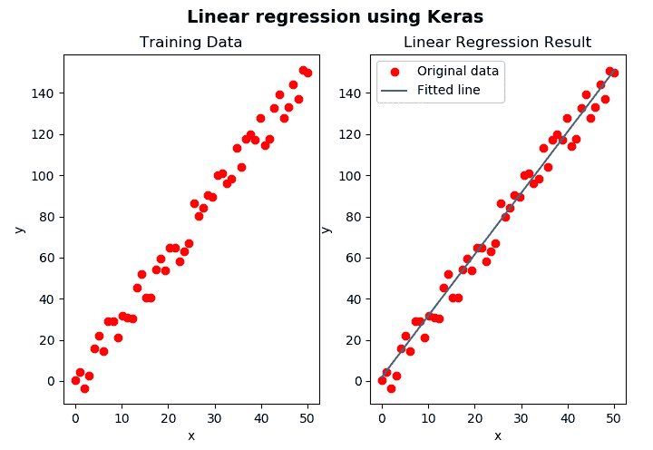

如前面的屏幕快照所示，我们既可以看到训练数据（在左侧），也可以看到与线性回归模型相对应的拟合线（在右侧）。

我们可以加载预训练的模型进行预测。 可以在`linear_regression_keras_testing.py`脚本中看到此示例。 第一步是按以下方式加载权重：

```py
linear_reg_model.load_weights('my_model.h5')
```

使用`get_weights()`函数，我们可以获得如下学习的参数：

```py
m_final, b_final = get_weights(linear_reg_model)
```

此时，我们获得了训练数据的以下预测，并且还获得了新的预测：

```py
predictions = linear_reg_model.predict(x)
new_predictions = linear_reg_model.predict(new_x)
```

最后一步是显示获得的结果，可以在以下屏幕截图中看到：

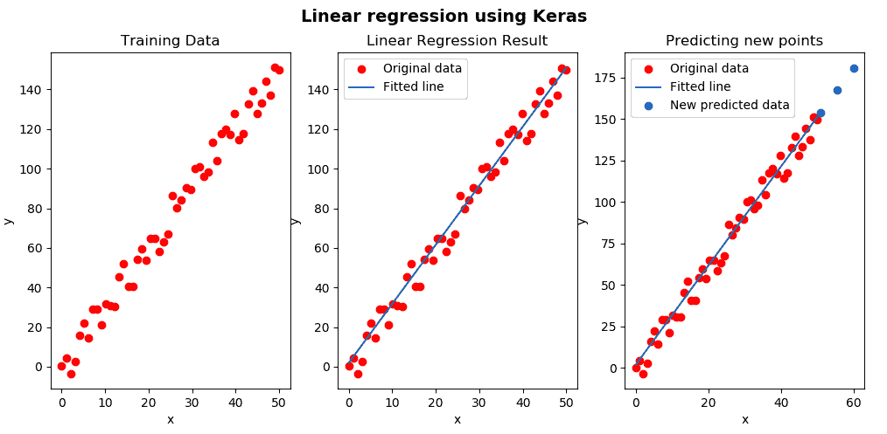

如上一个屏幕截图所示，我们使用了预先训练的模型来进行新的预测（蓝点）。

# Keras 中的手写数字识别

在此示例中，我们将看到如何使用 Keras 识别手写数字。 `mnist_keras_training.py`脚本使用四层神经网络创建模型，如以下代码片段所示：

```py
def create_model():
    """Create the model using Sequencial model"""

    # Create a sequential model (a simple NN is created) adding a softmax activation at the end with 10 units:
    model = Sequential()
    model.add(Dense(units=128, activation="relu", input_shape=(784,)))
    model.add(Dense(units=128, activation="relu"))
    model.add(Dense(units=128, activation="relu"))
    model.add(Dense(units=10, activation="softmax"))

    # Compile the model using the loss function "categorical_crossentropy" and Stocastic Gradient Descent optimizer:
    model.compile(optimizer=SGD(0.001), loss="categorical_crossentropy", metrics=["accuracy"])

    # Return the created model
    return model
```

在这种情况下，我们使用`categorical_crossentropy`损失函数（该损失函数非常适合比较两个概率分布，并使用**随机梯度下降**（ **GSD** ）优化器。

要加载 MNIST 数据，我们必须使用以下代码：

```py
(train_x, train_y), (test_x, test_y) = mnist.load_data()
```

此外，我们必须重新调整加载的数据的形状以使其具有适当的形状，如下所示：

```py
train_x = train_x.reshape(60000, 784)
test_x = test_x.reshape(10000, 784)
train_y = keras.utils.to_categorical(train_y, 10)
test_y = keras.utils.to_categorical(test_y, 10)
```

此时，我们可以创建模型，训练模型，保存创建的模型，并获得评估测试数据时获得的准确性，如下所示：

```py
# Create the model:
model = create_model()

# Use the created model for training:
model.fit(train_x, train_y, batch_size=32, epochs=10, verbose=1)

# Save the created model:
model.save("mnist-model.h5")

# Get the accuracy when testing:
accuracy = model.evaluate(x=test_x, y=test_y, batch_size=32)

# Show the accuracy:
print("Accuracy: ", accuracy[1])
```

此时，我们准备使用预先训练的模型来预测图像中的新手写数字。 这是在`mnist_keras_predicting.py`脚本中执行的，如下所示：

```py
# Note: Images should have black background:
def load_digit(image_name):
    """Loads a digit and pre-process in order to have the proper format"""

    gray = cv2.imread(image_name, cv2.IMREAD_GRAYSCALE)
    gray = cv2.resize(gray, (28, 28))
    gray = gray.reshape((1, 784))

    return gray

# Create the model:
model = create_model()

# Load parameters of the model from the saved mode file:
model.load_weights("mnist-model.h5")

# Load some test images:
test_digit_0 = load_digit("digit_0.png")
test_digit_1 = load_digit("digit_1.png")
test_digit_2 = load_digit("digit_2.png")
test_digit_3 = load_digit("digit_3.png")
imgs = np.array([test_digit_0, test_digit_1, test_digit_2, test_digit_3])
imgs = imgs.reshape(4, 784)

# Predict the class of the loaded images
prediction_class = model.predict_classes(imgs)

# Print the predicted classes:
print("Class: ", prediction_class)

```

如您所见，我们已经加载了四个图像，并且使用了经过训练的模型来预测这些图像的类别。 获得的输出如下：

```py
Class:  [0 1 2 3]
```

# 概要

在本章中，我们使用一些流行的库（包括 OpenCV，TensorFlow 和 Keras）对深度学习进行了介绍。 在本章的第一部分，我们概述了用于图像分类和对象检测的最新深度学习体系结构。 在第二部分中，我们研究了 OpenCV 中的深度学习模块，这些模块提供了 DNN 库，该库通过使用一些流行的深度学习框架进行了预训练的深度网络来实现前向传递（推理）。 因此，从 OpenCV 3.3 开始，可以在我们的应用程序中使用经过预训练的网络进行预测。 在本章的后面，我们对 TensorFlow 进行了介绍，最后，对 Keras 进行了介绍。

在下一章中，我们将对移动和网络计算机视觉进行介绍。 更具体地说，我们将看到如何使用 OpenCV，Keras 和 Flask 创建 Web 计算机视觉以及 Web 深度学习应用程序，并学习了如何与它们结合以提供 Web 应用程序机器学习和深度学习功能。

# 问题

1.  本章开头所述的机器学习和深度学习之间的三个主要区别是什么？
2.  哪一年被认为是深度学习的爆炸式增长？
3.  以下功能执行什么功能？
    `blob = cv2.dnn.blobFromImage(image, 1.0, (300, 300), [104., 117., 123.], False, False)`
4.  以下几行执行什么操作？

```py
net.setInput(blob)
preds = net.forward()
```

5.  TensorFlow 中的占位符是什么？
6.  在 TensorFlow 中使用`saver.save()`保存模型时，将创建四个文件？
7.  一键编码是什么意思？
8.  Keras 中的顺序模型是什么？
9.  Keras 中`model.fit()`的作用是什么？

# 进一步阅读

以下参考资料将帮助您深入了解 Python 的深度学习：

*   *实用卷积神经网络* *，* *作者 Mohit Sewak，Md.Rezaul Karim 和 Pradeep Pujari（2018）*（ [https：//www.packtpub。 com / big-data-and-business-intelligence / practical-convolutional-neural-networks](https://www.packtpub.com/big-data-and-business-intelligence/practical-convolutional-neural-networks) ）