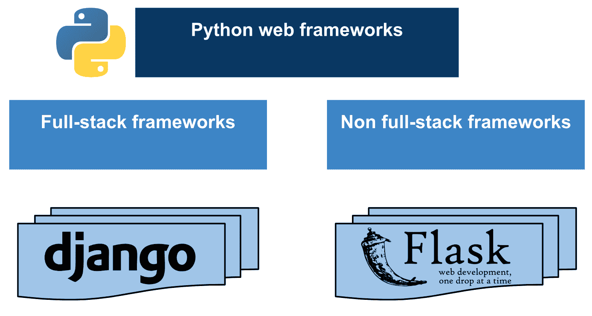
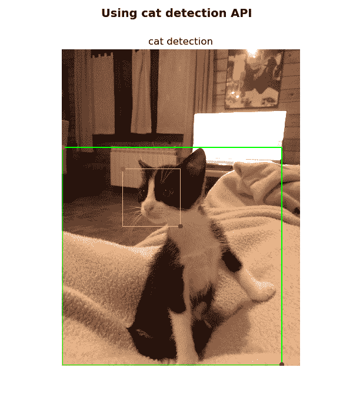
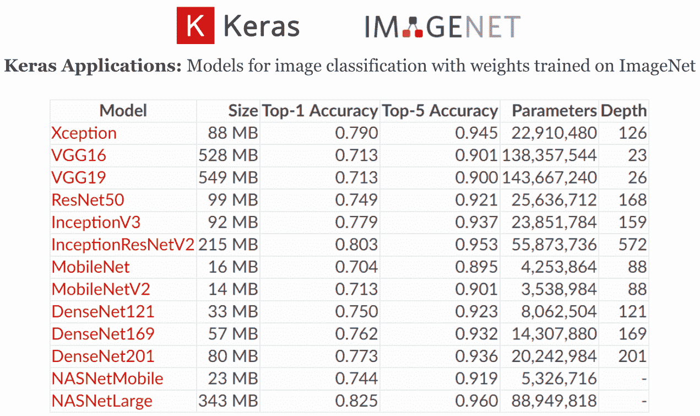
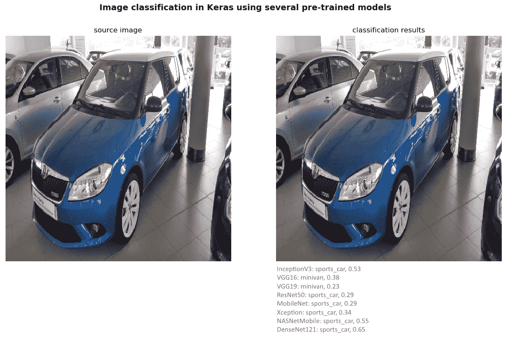
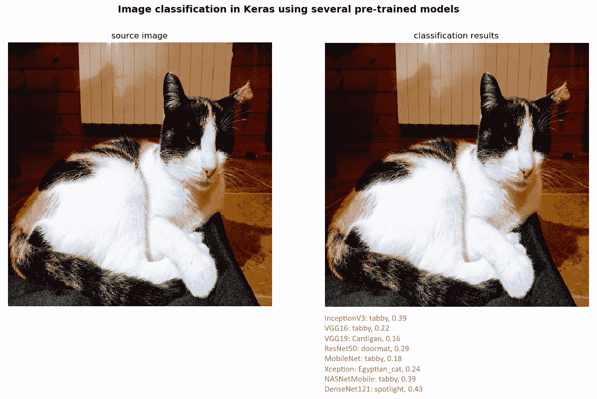
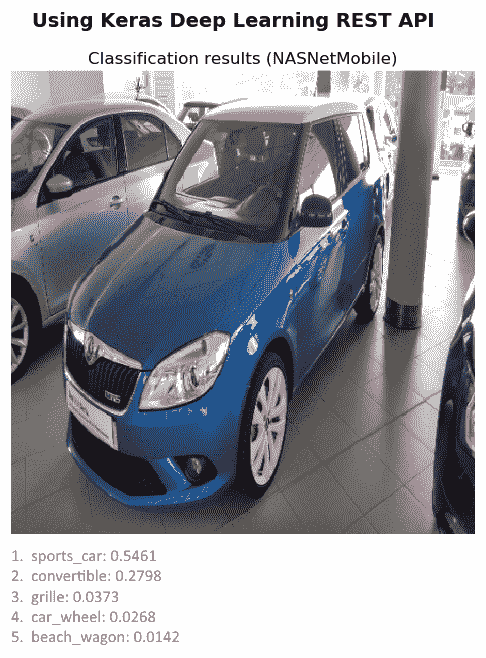
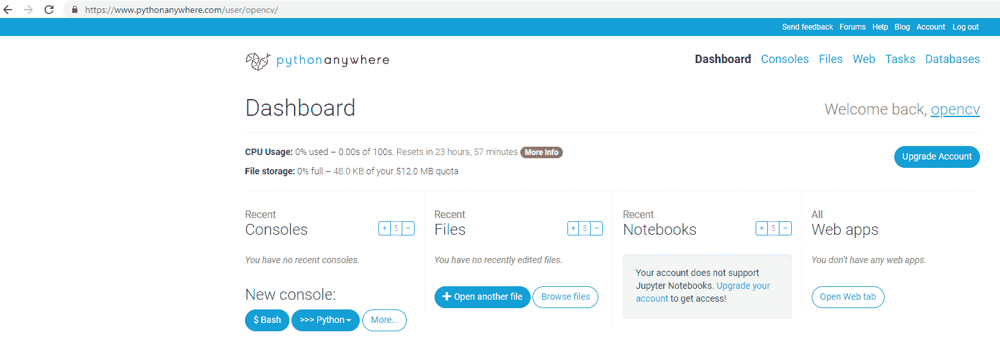
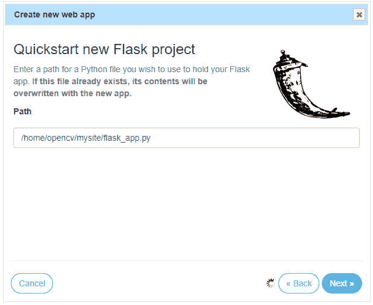

# 使用 Python 和 OpenCV 的移动和 Web 计算机视觉

**Web 计算**是一个有趣的话题，因为它允许我们利用云计算。 从这个意义上讲，有许多 Python Web 框架可用于部署应用程序。 这些框架提供了包的集合，使开发人员可以专注于应用程序的核心逻辑，而不必处理底层细节（例如，协议，套接字或进程和线程管理等）。

在本章中，我们将使用 Flask（这是一个小型且功能强大的 Python Web 框架，已获得 BSD 许可），以建立计算机视觉和深度学习 Web 应用程序。 此外，我们将了解如何利用云计算将应用程序部署到云中，而不是在计算机上运行它们。

本章的主要部分如下：

*   Python Web 框架简介
*   Flask 简介
*   使用 OpenCV 和 Flask 的 Web 计算机视觉应用程序
*   使用 Keras 和 Flask 的深度学习 API
*   将 Flask 应用程序部署到云

# 技术要求

技术要求如下：

*   Python 和 OpenCV
*   特定于 Python 的 IDE
*   NumPy 和 Matplotlib 包
*   Git 客户端
*   Flask（请参阅下一节“安装包中”的“如何安装 Flask”）
*   Keras（请参阅下一节“安装包”中的“如何安装 Keras”）
*   TensorFlow（请参阅下一节“安装包”中的“如何安装 TensorFlow”）
*   `requests`（请参阅下一节“安装包”中的“如何安装`requests`”）
*   Pillow（请参阅下一小节“安装包”的安装方法）

有关如何安装这些要求的更多详细信息，请参见第 1 章，“设置 OpenCV”。 可以通过以下 URL 访问《精通 Python OpenCV 4》的 GitHub 存储库，其中包含从本书第一章到最后一章所需的所有支持项目文件。

在接下来的小节中，我们将介绍如何使用`pip`命令安装必要的包（Flask，Keras，TensorFlow 和请求）。

# 安装包

让我们快速回顾一下如何安装所需的包：

*   **Flask**：您可以使用以下命令安装 [Flask](http://flask.pocoo.org/)：

```py
$ pip install flask
```

要检查安装是否正确执行，只需打开 Python shell 并尝试导入 Flask 库：

```py
python
import Flask
```

*   **TensorFlow**：您可以使用以下命令安装 [TensorFlow](https://www.tensorflow.org/install/)：

```py
$ pip install tensorflow
```

要检查安装是否正确执行，只需打开一个 Python shell 并尝试导入 TensorFlow 库：

```py
python
import tensorflow
```

*   **Keras**：您可以使用以下命令安装 [Keras](https://keras.io/)：

```py
$ pip install keras
```

要检查安装是否正确执行，只需打开一个 Python shell 并尝试导入 Keras 库：

```py
python
import keras
```

*   `requests`：您可以使用以下命令安装[`requests`](http://docs.python-requests.org/en/master/)：

```py
$ pip install requests
```

要检查安装是否正确执行，只需打开 Python Shell 并尝试导入请求库：

```py
python
import requests
```

*   **Pillow**：为了安装 [Pillow](https://pypi.org/project/Pillow/)，请使用以下命令：

```py
pip install Pillow
```

要检查安装是否正确执行，只需打开 Python shell 并尝试导入 Pillow 库：

```py
python
import PIL
```

我想提一下，推荐的方法是在虚拟环境中安装包。 请参阅第 1 章，“设置 OpenCV”，以了解有关创建和管理虚拟环境的更多信息。

# Python Web 框架简介

[Python Web 框架](https://wiki.python.org/moin/WebFrameworks)提供了一组包，这些包使开发人员可以专注于应用程序的核心逻辑，而不必处理底层细节 （例如，协议，套接字或进程以及线程管理等）。 此外，可以将这些框架分为全栈和非全栈框架。 **Django** 和 **Flask** 是两个流行的 Python 网络框架，我们将在本章稍后讨论：



**全栈框架**的完美示例是 [Django](https://www.djangoproject.com/)，这是一个免费的开源全栈 Python 框架， 尝试默认包含所有必需的功能，而不是将它们作为单独的库提供。 Django 使创建 Web 应用程序更加容易，并且比其他框架所需的时间更少。 它着重于通过遵循**不要重复**（**DRY**）的原理来实现尽可能的自动化。 如果您有兴趣学习 Django，建议您阅读本教程，该教程是关于编写第一个 [Django 应用程序](https://docs.djangoproject.com/en/2.1/intro/tutorial01/)。

Flask（已获得 BSD 许可）可被视为**非全栈框架**的完美示例。 实际上，Flask 被认为是一个微框架，它是一个很少或完全不依赖外部库的框架。

Flask 具有以下依赖关系：

*   [WSGI 工具包](http://werkzeug.pocoo.org/)：
    *   WSGI 实用程序库
*   [Jinja2](http://jinja.pocoo.org/)：
    *   模板引擎

Django 和 Flask 均可用于开发计算机视觉和深度学习应用程序。 但是，公认的是，Django 的学习曲线比 Flask 略陡。 此外，Flask 专注于简约和简约。 例如，Flask 的`Hello World`应用程序只有几行代码。 此外，还建议将 Flask 用于较小和较不复杂的应用程序，而 Django 通常用于较大和较复杂的应用程序。

在本章中，我们将了解如何将 Flask 用于创建计算机视觉和深度学习 Web 应用程序。

# Flask 简介

正如我们提到的，这是 Flask 的`Hello World`应用程序，仅包含几行代码。 可以在`hello.py`脚本中看到，如下所示：

```py
# Import required packages:
from flask import Flask

app = Flask(__name__)

@app.route("/")
def hello():
    return "Hello World!"

if __name__ == "__main__":
    app.run()
```

导入所需的程序包后，我们将创建`Flask`类的实例，该实例将成为我们的 **Web 服务器网关接口**（**WSGI**）应用程序。 `route()`装饰器用于指示哪个 URL 应该触发`hello()`功能，该功能将打印消息`Hello World!`。

在 Flask 中，您可以使用`route()`装饰器将功能绑定到 URL。

使用以下命令执行此脚本：

```py
$ python hello.py
```

您将在控制台中看到此消息，告诉您 Web 服务器已启动：

```py
 * Serving Flask app "hello" (lazy loading)
 * Environment: production
 WARNING: Do not use the development server in a production environment.
 Use a production WSGI server instead.
 * Debug mode: off
 * Running on http://127.0.0.1:5000/ (Press CTRL+C to quit)
```

此时，您可以打开浏览器并输入`http://127.0.0.1:5000/`。 这将对我们的服务器执行`GET`请求，该请求将返回相应的消息，使我们可以在浏览器中看到它。 这些步骤可以总结在下一个屏幕截图中：


如您所见，浏览器显示`Hello World!`消息。

在前面的示例中，脚本称为`hello.py`。 确保不要调用您的应用程序`flask.py`，因为这可能导致与 Flask 本身发生冲突。

在前面的示例中，只能从我们自己的计算机访问服务器，而不能从网络中的任何其他服务器访问服务器。 为了使服务器公开可用，在运行服务器应用程序时应添加参数`host=0.0.0.0`。 可以在`hello_external.py`脚本中看到：

```py
# Import required packages:
from flask import Flask

app = Flask(__name__)

@app.route("/")
def hello():
    return "Hello World!"

if __name__ == "__main__":
    # Add parameter host='0.0.0.0' to run on your machines IP address:
    app.run(host='0.0.0.0')
```

这样，我们可以从连接到该网络的任何其他设备执行请求，如下面的屏幕快照所示：


如前所述，可以使用`route()`装饰器将功能绑定到 URL，如`hello_routes_external.py`脚本所示：

```py
# Import required packages:
from flask import Flask

app = Flask(__name__)

@app.route("/")
def hello():
    return "Hello World!"

@app.route("/user")
def hello_user():
    return "User: Hello World!"

if __name__ == "__main__":
    # Add parameter host='0.0.0.0' to run on your machines IP address:
    app.run(host='0.0.0.0')
```

在下一个屏幕截图中对此进行了说明，我们在其中请求`http://192.168.1.101:5000/user` URL，并获得`User: Hello World!`消息：


在本节中，我们介绍了一些使用 Flask 创建应用程序时必须考虑的基本概念。

在下一节中，我们将看到不同的示例，以了解如何使用 OpenCV 和 Flask 创建 Web 计算机视觉应用程序。

# 使用 OpenCV 和 Flask 的 Web 计算机视觉应用程序

在本节中，我们将看到如何使用 OpenCV 和 Flask 创建 Web 计算机视觉应用程序。 我们将从使用 OpenCV 和 Flask 的等效`Hello world`应用程序开始。

# OpenCV 和 Flask 的最小示例

对脚本`hello_opencv.py`进行了编码，以显示如何使用 OpenCV 执行基本的 Web 计算机视觉应用程序。 该脚本的代码如下所示：

```py
# Import required packages:
import cv2
from flask import Flask, request, make_response
import numpy as np
import urllib.request

app = Flask(__name__)

@app.route('/canny', methods=['GET'])
def canny_processing():
    # Get the image:
    with urllib.request.urlopen(request.args.get('url')) as url:
        image_array = np.asarray(bytearray(url.read()), dtype=np.uint8)

    # Convert the image to OpenCV format:
    img_opencv = cv2.imdecode(image_array, -1)

    # Convert image to grayscale:
    gray = cv2.cvtColor(img_opencv, cv2.COLOR_BGR2GRAY)

    # Perform canny edge detection:
    edges = cv2.Canny(gray, 100, 200)

    # Compress the image and store it in the memory buffer:
    retval, buffer = cv2.imencode('.jpg', edges)

    # Build the response:
    response = make_response(buffer.tobytes())
    response.headers['Content-Type'] = 'image/jpeg'

    # Return the response:
    return response

if __name__ == "__main__":
    # Add parameter host='0.0.0.0' to run on your machines IP address:
    app.run(host='0.0.0.0')
```

可以通过以下步骤来解释先前的代码：

1.  第一步是导入所需的包。 在此示例中，我们使用`route()`装饰器将`canny_processing()`函数绑定到`/canny` URL。 此外，还需要`url`参数才能正确执行`GET`请求。 为了获得该参数，使用了`request.args.get()`功能。
2.  下一步是读取该 URL 持有的图像，如下所示：

```py
with urllib.request.urlopen(request.args.get('url')) as url:
    image_array = np.asarray(bytearray(url.read()), dtype=np.uint8)
```

这样，图像将作为数组读取。

3.  下一步是将图像转换为 OpenCV 格式并执行 Canny 边缘处理，该处理应在相应的灰度图像上执行：

```py
# Convert the image to OpenCV format:
img_opencv = cv2.imdecode(image_array, -1)

# Convet image to grayscale:
gray = cv2.cvtColor(img_opencv, cv2.COLOR_BGR2GRAY)

# Perform canny edge detection:
edges = cv2.Canny(gray, 100, 200)
```

4.  下一步是压缩映像并将其存储在内存缓冲区中，如下所示：

```py
# Compress the image and store it in the memory buffer:
retval, buffer = cv2.imencode('.jpg', edges)
```

5.  最后一步是构建响应并将其返回给客户端，如下所示：

```py
# Build and return the response:
response = make_response(buffer.tobytes())
response.headers['Content-Type'] = 'image/jpeg'

# Return the response:
return response
```

如果我们运行脚本（`$ python hello_opencv.py`），服务器将运行，然后，如果我们从客户端（例如我们的手机）执行`GET`请求，我们将获得处理后的图像，该图像可以在下一个屏幕截图中可以看到。 此外，请考虑到您可能需要禁用防火墙（在 Windows 上）才能执行以下请求：


如图所示，我们执行了以下`GET`请求：

```py
http://192.168.1.101:5000/canny?url=https://raw.githubusercontent.com/opencv/opencv/master/samples/data/lena.jpg
```

在这里，`https://raw.githubusercontent.com/opencv/opencv/master/samples/data/lena.jpg`是我们要使用 Web 计算视觉应用程序处理的图像。

# 使用 OpenCV 的最小人脸 API

在此示例中，我们将看到如何使用 OpenCV 和 Flask 创建 Web Face API。 `minimal_face_api`项目对 Web 服务器应用程序进行编码。 `main.py`脚本负责解析请求并建立对客户端的响应。 该脚本的代码如下：

```py
# Import required packages:
from flask import Flask, request, jsonify
import urllib.request
from face_processing import FaceProcessing

# Initialize application and FaceProcessing():
app = Flask(__name__)
fc = FaceProcessing()

@app.errorhandler(400)
def bad_request(e):
    # return also the code error
    return jsonify({"status": "not ok", "message": "this server could not understand your request"}), 400

@app.errorhandler(404)
def not_found(e):
    # return also the code error
    return jsonify({"status": "not found", "message": "route not found"}), 404

@app.errorhandler(500)
def not_found(e):
    # return also the code error
    return jsonify({"status": "internal error", "message": "internal error occurred in server"}), 500

@app.route('/detect', methods=['GET', 'POST', 'PUT'])
def detect_human_faces():
    if request.method == 'GET':
        if request.args.get('url'):
            with urllib.request.urlopen(request.args.get('url')) as url:
                return jsonify({"status": "ok", "result": fc.face_detection(url.read())}), 200
        else:
            return jsonify({"status": "bad request", "message": "Parameter url is not present"}), 400
    elif request.method == 'POST':
        if request.files.get("image"):
            return jsonify({"status": "ok", "result": fc.face_detection(request.files["image"].read())}), 200
        else:
            return jsonify({"status": "bad request", "message": "Parameter image is not present"}), 400
    else:
        return jsonify({"status": "failure", "message": "PUT method not supported for API"}), 405

if __name__ == "__main__":
    # Add parameter host='0.0.0.0' to run on your machines IP address:
    app.run(host='0.0.0.0')
```

如您所见，我们利用`jsonify()`函数创建具有`application/json` MIME 类型的给定参数的 JSON 表示形式。 可以将 JSON 视为信息交换的*事实*标准，在此示例中，我们将返回 JSON 响应，而不是像在上一个示例中执行的那样返回图像。 您还可以看到，此 API 支持`GET`和`POST`请求。 另外，在`main.py`脚本中，我们还通过使用`errorhandler()`装饰函数来注册错误处理程序。 还记得在将响应返回给客户端时还要设置错误代码。

图像处理是在`face_processing.py`脚本中执行的，其中`FaceProcessing()`类被编码为：

```py
# Import required packages:
import cv2
import numpy as np
import os

class FaceProcessing(object):
    def __init__(self):
        self.file = os.path.join(os.path.join(os.path.dirname(__file__), "data"), "haarcascade_frontalface_alt.xml")
        self.face_cascade = cv2.CascadeClassifier(self.file)

    def face_detection(self, image):
        # Convert image to OpenCV format:
        image_array = np.asarray(bytearray(image), dtype=np.uint8)
        img_opencv = cv2.imdecode(image_array, -1)
        output = []
        # Detect faces and build output:
        gray = cv2.cvtColor(img_opencv, cv2.COLOR_BGR2GRAY)
        faces = self.face_cascade.detectMultiScale(gray, scaleFactor=1.1, minNeighbors=5, minSize=(25, 25))
        for face in faces:
            # face.tolist(): returns a copy of the array data as a Python list
            x, y, w, h = face.tolist()
            face = {"box": [x, y, x + w, y + h]}
            output.append(face)
        # Return output:
        return output
```

`face_detection()`方法通过使用 OpenCV `detectMultiScale()`功能执行面部检测。 对于每个检测到的人脸，我们将获取其坐标`(x, y, w, h)`，并通过以适当格式对检测进行编码来构建`box`：

```py
face = {"box": [x, y, x + w, y + h]}
```

最后，我们将编码的人脸检测添加到`output`中：

```py
output.append(face)
```

将所有检测到的面部添加到输出后，我们将返回它。

要使用此 API，我们可以按照与前面示例相同的方式从浏览器执行`GET`请求。 此外，由于我们的 API 也支持`POST`请求，因此我们包含了两个脚本来测试此 API 的功能。 这些脚本同时执行`GET`和`POST`请求，以了解如何与上述 Face API 进行交互。 更具体地说，`demo_request.py`对面部 API 执行几个请求，以获得不同的响应，并查看错误处理的工作方式。

在此脚本中，我们首先使用错误的 URL 执行`GET`请求：

```py
# Import required packages:
import requests

FACE_DETECTION_REST_API_URL = "http://localhost:5000/detect"
FACE_DETECTION_REST_API_URL_WRONG = "http://localhost:5000/process"
IMAGE_PATH = "test_face_processing.jpg"
URL_IMAGE = "https://raw.githubusercontent.com/opencv/opencv/master/samples/data/lena.jpg"

# Submit the GET request:
r = requests.get(FACE_DETECTION_REST_API_URL_WRONG)
# See the response:
print("status code: {}".format(r.status_code))
print("headers: {}".format(r.headers))
print("content: {}".format(r.json()))
```

在这种情况下，我们得到以下信息：

```py
status code: 404
 headers: {'Content-Type': 'application/json', 'Content-Length': '51', 'Server': 'Werkzeug/0.14.1 Python/3.6.6', 'Date': 'Sat, 16 Feb 2019 19:20:25 GMT'}
 content: {'message': 'route not found', 'status': 'not found'}
```

获得的状态码（`404`）意味着客户端可以与服务器通信，但是服务器找不到请求的内容。 这是因为请求的 URL（`http://localhost:5000/process`）不正确。

我们执行的第二个请求是正确的`GET`请求：

```py
# Submit the GET request:
payload = {'url': URL_IMAGE}
r = requests.get(FACE_DETECTION_REST_API_URL, params=payload)
# See the response:
print("status code: {}".format(r.status_code))
print("headers: {}".format(r.headers))
print("content: {}".format(r.json()))
```

在这种情况下，我们得到以下信息：

```py
status code: 200
 headers: {'Content-Type': 'application/json', 'Content-Length': '53', 'Server': 'Werkzeug/0.14.1 Python/3.6.6', 'Date': 'Sat, 16 Feb 2019 19:20:31 GMT'}
 content: {'result': [{'box': [213, 200, 391, 378]}], 'status': 'ok'}
```

状态码（`200`）指示请求已成功执行。 此外，您还可以看到已检测到与 Lenna 的脸相对应的一张脸。

我们执行的第三个请求也是`GET`请求，但有效负载丢失：

```py
# Submit the GET request:
r = requests.get(FACE_DETECTION_REST_API_URL)
# See the response:
print("status code: {}".format(r.status_code))
print("headers: {}".format(r.headers))
print("content: {}".format(r.json()))
```

在这种情况下，我们得到的响应如下：

```py
status code: 400
 headers: {'Content-Type': 'application/json', 'Content-Length': '66', 'Server': 'Werkzeug/0.14.1 Python/3.6.6', 'Date': 'Sat, 16 Feb 2019 19:20:32 GMT'}
 content: {'message': 'Parameter url is not present', 'status': 'bad request'}
```

状态码（`400`）表示请求错误。 如您所见，`url`参数丢失。

我们执行的第四个请求是带有正确有效负载的`POST`请求：

```py
# Load the image and construct the payload:
image = open(IMAGE_PATH, "rb").read()
payload = {"image": image}

# Submit the POST request:
r = requests.post(FACE_DETECTION_REST_API_URL, files=payload)
# See the response:
print("status code: {}".format(r.status_code))
print("headers: {}".format(r.headers))
print("content: {}".format(r.json()))
```

我们得到以下回应：

```py
status code: 200
 headers: {'Content-Type': 'application/json', 'Content-Length': '449', 'Server': 'Werkzeug/0.14.1 Python/3.6.6', 'Date': 'Sat, 16 Feb 2019 19:20:34 GMT'}
 content: {'result': [{'box': [151, 29, 193, 71]}, {'box': [77, 38, 115, 76]}, {'box': [448, 37, 490, 79]}, {'box': [81, 172, 127, 218]}, {'box': [536, 47, 574, 85]}, {'box': [288, 173, 331, 216]}, {'box': [509, 170, 553, 214]}, {'box': [357, 48, 399, 90]}, {'box': [182, 179, 219, 216]}, {'box': [251, 38, 293, 80]}, {'box': [400, 174, 444, 218]}, {'box': [390, 87, 430, 127]}, {'box': [54, 89, 97, 132]}, {'box': [499, 91, 542, 134]}, {'box': [159, 95, 198, 134]}, {'box': [310, 115, 344, 149]}, {'box': [225, 116, 265, 156]}], 'status': 'ok'}
```

如您所见，检测到许多面部。 这是因为`test_face_processing.jpg`包含很多面孔。

最终请求是`PUT`请求：

```py
# Submit the PUT request:
r = requests.put(FACE_DETECTION_REST_API_URL, files=payload)
# See the response:
print("status code: {}".format(r.status_code))
print("headers: {}".format(r.headers))
print("content: {}".format(r.json()))
```

我们得到以下输出：

```py
status code: 405
 headers: {'Content-Type': 'application/json', 'Content-Length': '66', 'Server': 'Werkzeug/0.14.1 Python/3.6.6', 'Date': 'Sat, 16 Feb 2019 19:20:35 GMT'}
 content: {'message': 'PUT method not supported for API', 'status': 'failure'}
```

如您所见，不支持`PUT`方法。 此面部 API 仅支持`GET`和`POST`方法。

如您在前面的响应中看到的那样，当请求成功执行时，我们将检测到的面部作为 JSON 数据。 为了了解如何解析响应并使用它绘制检测到的面部，我们可以对脚本`demo_request_drawing.py`进行如下编码：

```py
# Import required packages:
import cv2
import numpy as np
import requests
from matplotlib import pyplot as plt

def show_img_with_matplotlib(color_img, title, pos):
    """Shows an image using matplotlib capabilities"""

    img_RGB = color_img[:, :, ::-1]

    ax = plt.subplot(1, 1, pos)
    plt.imshow(img_RGB)
    plt.title(title)
    plt.axis('off')

FACE_DETECTION_REST_API_URL = "http://localhost:5000/detect"
IMAGE_PATH = "test_face_processing.jpg"

# Load the image and construct the payload:
image = open(IMAGE_PATH, "rb").read()
payload = {"image": image}

# Submit the POST request:
r = requests.post(FACE_DETECTION_REST_API_URL, files=payload)

# See the response:
print("status code: {}".format(r.status_code))
print("headers: {}".format(r.headers))
print("content: {}".format(r.json()))

# Get JSON data from the response and get 'result':
json_data = r.json()
result = json_data['result']

# Convert the loaded image to the OpenCV format:
image_array = np.asarray(bytearray(image), dtype=np.uint8)
img_opencv = cv2.imdecode(image_array, -1)

# Draw faces in the OpenCV image:
for face in result:
    left, top, right, bottom = face['box']
    # To draw a rectangle, you need top-left corner and bottom-right corner of rectangle:
    cv2.rectangle(img_opencv, (left, top), (right, bottom), (0, 255, 255), 2)
    # Draw top-left corner and bottom-right corner (checking):
    cv2.circle(img_opencv, (left, top), 5, (0, 0, 255), -1)
    cv2.circle(img_opencv, (right, bottom), 5, (255, 0, 0), -1)

# Create the dimensions of the figure and set title:
fig = plt.figure(figsize=(8, 8))
plt.suptitle("Using face detection API", fontsize=14, fontweight='bold')
fig.patch.set_facecolor('silver')

# Show the output image
show_img_with_matplotlib(img_opencv, "face detection", 1)

# Show the Figure:
plt.show()
```

从上面可以看出，我们首先加载图像并构造有效负载。 然后，我们执行`POST`请求。 然后，我们从响应中获取 JSON 数据并获得`result`：

```py
# Get JSON data from the response and get 'result':
json_data = r.json()
result = json_data['result']
```

在这一点上，我们可以绘制检测到的面孔，对所有检测到的面孔进行迭代，如下所示：

```py
# Draw faces in the OpenCV image:
for face in result:
    left, top, right, bottom = face['box']
    # To draw a rectangle, you need top-left corner and bottom-right corner of rectangle:
    cv2.rectangle(img_opencv, (left, top), (right, bottom), (0, 255, 255), 2)
    # Draw top-left corner and bottom-right corner (checking):
    cv2.circle(img_opencv, (left, top), 5, (0, 0, 255), -1)
    cv2.circle(img_opencv, (right, bottom), 5, (255, 0, 0), -1)
```

对于每个检测到的脸部，我们绘制一个矩形以及左上角和右下角点。 下一个屏幕截图中可以看到此脚本的输出：


使用 OpenCV 使用 API​​检测到的人脸

如上一个屏幕截图所示，已检测到所有面部。

# 使用 OpenCV 的深度学习猫检测 API

遵循在上一个示例中使用的相同方法-使用 OpenCV 的最小面部 API，我们将使用 OpenCV 创建深度学习 API。 更具体地说，我们将看到如何创建深度学习猫检测 API。 `cat_detection_api`项目对 Web 服务器应用程序进行编码。 `main.py`脚本负责解析请求并建立对客户端的响应。 该脚本的代码如下：

```py
# Import required packages:
from flask import Flask, request, jsonify
import urllib.request
from image_processing import ImageProcessing

app = Flask(__name__)
ip = ImageProcessing()

@app.errorhandler(400)
def bad_request(e):
    # return also the code error
    return jsonify({"status": "not ok", "message": "this server could not understand your request"}), 400

@app.errorhandler(404)
def not_found(e):
    # return also the code error
    return jsonify({"status": "not found", "message": "route not found"}), 404

@app.errorhandler(500)
def not_found(e):
    # return also the code error
    return jsonify({"status": "internal error", "message": "internal error occurred in server"}), 500

@app.route('/catfacedetection', methods=['GET', 'POST', 'PUT'])
def detect_cat_faces():
    if request.method == 'GET':
        if request.args.get('url'):
            with urllib.request.urlopen(request.args.get('url')) as url:
                return jsonify({"status": "ok", "result": ip.cat_face_detection(url.read())}), 200
        else:
            return jsonify({"status": "bad request", "message": "Parameter url is not present"}), 400
    elif request.method == 'POST':
        if request.files.get("image"):
            return jsonify({"status": "ok", "result": ip.cat_face_detection(request.files["image"].read())}), 200
        else:
            return jsonify({"status": "bad request", "message": "Parameter image is not present"}), 400
    else:
        return jsonify({"status": "failure", "message": "PUT method not supported for API"}), 405

@app.route('/catdetection', methods=['GET', 'POST', 'PUT'])
def detect_cats():
    if request.method == 'GET':
        if request.args.get('url'):
            with urllib.request.urlopen(request.args.get('url')) as url:
                return jsonify({"status": "ok", "result": ip.cat_detection(url.read())}), 200
        else:
            return jsonify({"status": "bad request", "message": "Parameter url is not present"}), 400
    elif request.method == 'POST':
        if request.files.get("image"):
            return jsonify({"status": "ok", "result": ip.cat_detection(request.files["image"].read())}), 200
        else:
            return jsonify({"status": "bad request", "message": "Parameter image is not present"}), 400
    else:
        return jsonify({"status": "failure", "message": "PUT method not supported for API"}), 405

if __name__ == "__main__":
    # Add parameter host='0.0.0.0' to run on your machines IP address:
    app.run(host='0.0.0.0')
```

如您所见，我们利用`route()`装饰器将`detect_cat_faces()`函数绑定到`/catfacedetection` URL，还将`detect_cats()`函数绑定到`/catdetection` URL。 另外，我们利用`jsonify()`函数创建具有`application/json` MIME 类型的给定参数的 JSON 表示形式。 您还可以看到，此 API 支持`GET`和`POST`请求。 此外，在`main.py`脚本中，我们还通过使用`errorhandler()`装饰函数来注册错误处理程序。 将响应返回给客户端时，请记住还要设置错误代码。

图像处理在`image_processing.py`脚本中进行，其中`ImageProcessing()`类被编码。 从这个意义上讲，仅显示`cat_face_detection()`和`cat_detection()`方法：

```py
class ImageProcessing(object):
    def __init__(self):
        ...
        ...

    def cat_face_detection(self, image):
        image_array = np.asarray(bytearray(image), dtype=np.uint8)
        img_opencv = cv2.imdecode(image_array, -1)
        output = []
        gray = cv2.cvtColor(img_opencv, cv2.COLOR_BGR2GRAY)
        cats = self.cat_cascade.detectMultiScale(gray, scaleFactor=1.1, minNeighbors=5, minSize=(25, 25))
        for cat in cats:
            # face.tolist(): returns a copy of the array data as a Python list
            x, y, w, h = cat.tolist()
            face = {"box": [x, y, x + w, y + h]}
            output.append(face)
        return output

    def cat_detection(self, image):
        image_array = np.asarray(bytearray(image), dtype=np.uint8)
        img_opencv = cv2.imdecode(image_array, -1)
        # Create the blob with a size of (300,300), mean subtraction values (127.5, 127.5, 127.5):
        # and also a scalefactor of 0.007843:
        blob = cv2.dnn.blobFromImage(img_opencv, 0.007843, (300, 300), (127.5, 127.5, 127.5))

        # Feed the input blob to the network, perform inference and ghe the output:
        self.net.setInput(blob)
        detections = self.net.forward()

        # Size of frame resize (300x300)
        dim = 300

        output = []

        # Process all detections:
        for i in range(detections.shape[2]):
            # Get the confidence of the prediction:
            confidence = detections[0, 0, i, 2]

            # Filter predictions by confidence:
            if confidence > 0.1:
                # Get the class label:
                class_id = int(detections[0, 0, i, 1])

                # Get the coordinates of the object location:
                left = int(detections[0, 0, i, 3] * dim)
                top = int(detections[0, 0, i, 4] * dim)
                right = int(detections[0, 0, i, 5] * dim)
                bottom = int(detections[0, 0, i, 6] * dim)

                # Factor for scale to original size of frame
                heightFactor = img_opencv.shape[0] / dim
                widthFactor = img_opencv.shape[1] / dim

                # Scale object detection to frame
                left = int(widthFactor * left)
                top = int(heightFactor * top)
                right = int(widthFactor * right)
                bottom = int(heightFactor * bottom)

                # Check if we have detected a cat:
                if self.classes[class_id] == 'cat':
                    cat = {"box": [left, top, right, bottom]}
                    output.append(cat)
        return output
```

如此处所示，实现了两种方法。 `cat_face_detection()`方法使用 OpenCV `detectMultiScale()`功能执行猫脸检测。

`cat_detection()`方法使用在 Cafe-SSD 框架中训练的 MobileNet SSD 对象检测执行猫检测，并且可以检测`20`类。 在此示例中，我们将检测猫。 因此，如果`class_id`是一只猫，我们将把检测结果添加到输出中。 有关如何处理检测和使用预训练的深度学习模型的更多信息，我们建议第 12 章，“深度学习简介”，该课程侧重于深度学习。 完整代码可在[这个页面](https://github.com/PacktPublishing/Mastering-OpenCV-4-with-Python/blob/master/Chapter13/01-chapter-content/opencv_examples/cat_detection_api_axample/cat_detection_api/image_processing.py)中找到。

为了测试此 API，可以使用`demo_request_drawing.py`脚本，如下所示：

```py
# Import required packages:
import cv2
import numpy as np
import requests
from matplotlib import pyplot as plt

def show_img_with_matplotlib(color_img, title, pos):
    """Shows an image using matplotlib capabilities"""

    img_RGB = color_img[:, :, ::-1]

    ax = plt.subplot(1, 1, pos)
    plt.imshow(img_RGB)
    plt.title(title)
    plt.axis('off')

CAT_FACE_DETECTION_REST_API_URL = "http://localhost:5000/catfacedetection"
CAT_DETECTION_REST_API_URL = "http://localhost:5000/catdetection"
IMAGE_PATH = "cat.jpg"

# Load the image and construct the payload:
image = open(IMAGE_PATH, "rb").read()
payload = {"image": image}

# Convert the loaded image to the OpenCV format:
image_array = np.asarray(bytearray(image), dtype=np.uint8)
img_opencv = cv2.imdecode(image_array, -1)

# Submit the POST request:
r = requests.post(CAT_DETECTION_REST_API_URL, files=payload)

# See the response:
print("status code: {}".format(r.status_code))
print("headers: {}".format(r.headers))
print("content: {}".format(r.json()))

# Get JSON data from the response and get 'result':
json_data = r.json()
result = json_data['result']

# Draw cats in the OpenCV image:
for cat in result:
    left, top, right, bottom = cat['box']
    # To draw a rectangle, you need top-left corner and bottom-right corner of rectangle:
    cv2.rectangle(img_opencv, (left, top), (right, bottom), (0, 255, 0), 2)
    # Draw top-left corner and bottom-right corner (checking):
    cv2.circle(img_opencv, (left, top), 10, (0, 0, 255), -1)
    cv2.circle(img_opencv, (right, bottom), 10, (255, 0, 0), -1)

# Submit the POST request:
r = requests.post(CAT_FACE_DETECTION_REST_API_URL, files=payload)

# See the response:
print("status code: {}".format(r.status_code))
print("headers: {}".format(r.headers))
print("content: {}".format(r.json()))

# Get JSON data from the response and get 'result':
json_data = r.json()
result = json_data['result']

# Draw cat faces in the OpenCV image:
for face in result:
    left, top, right, bottom = face['box']
    # To draw a rectangle, you need top-left corner and bottom-right corner of rectangle:
    cv2.rectangle(img_opencv, (left, top), (right, bottom), (0, 255, 255), 2)
    # Draw top-left corner and bottom-right corner (checking):
    cv2.circle(img_opencv, (left, top), 10, (0, 0, 255), -1)
    cv2.circle(img_opencv, (right, bottom), 10, (255, 0, 0), -1)

# Create the dimensions of the figure and set title:
fig = plt.figure(figsize=(6, 7))
plt.suptitle("Using cat detection API", fontsize=14, fontweight='bold')
fig.patch.set_facecolor('silver')

# Show the output image
show_img_with_matplotlib(img_opencv, "cat detection", 1)

# Show the Figure:
plt.show()
```

在先前的脚本中，我们执行两个`POST`请求，以便同时检测猫的脸部以及`cat.jpg`图像中的猫。 此外，我们还解析了两个请求的响应并绘制了结果，这可以在此脚本的输出中看到，如以下屏幕快照所示：



如前面的屏幕快照所示，绘制了猫脸检测和全身猫检测。

# 使用 Keras 和 Flask 的深度学习 API

在第 12 章，“深度学习简介”中，我们看到了如何同时使用 TensorFlow 和 Keras 创建深度学习应用程序。 在本节中，我们将看到如何使用 Keras 和 Flask 创建深度学习 API。

更具体地说，我们将看到如何与 Keras 中包含的经过预先训练的深度学习架构一起使用，然后，我们将看到如何使用这些经过预先训练的深度学习架构来创建深度学习 API。

# Keras 应用

[**Keras 应用程序**](https://keras.io/applications/) ，与 python 2.7-3.6 兼容，并以 MIT 许可分发）是 Keras 深度学习库的应用程序模块， 为许多流行的架构（例如 VGG16，ResNet50，Xception 和 MobileNet 等）提供深度学习模型定义和预训练权重，这些架构可用于预测，特征提取和微调。

在 **Keras** 安装期间会下载模型架构，但是在实例化模型时会自动下载预先训练的权重。 此外，所有这些深度学习架构都与所有后端（TensorFlow，Theano 和 CNTK）兼容。

这些深度学习架构在 [ImageNet 数据集](http://image-net.org/)上进行了培训和验证，用于将图像分类为`1,000`类别或类别之一：



在上一个屏幕截图中，您可以在 **Keras 应用程序**模块中查看各个型号的文档：

*   **Xception**：Xception V1 模型，权重在 ImageNet 上进行了预训练
*   **VGG16**：VGG16 模型，权重在 ImageNet 上进行了预训练
*   **VGG19**：VGG19 模型，权重在 ImageNet 上进行了预训练
*   **ResNet50**：ResNet50 模型，权重在 ImageNet 上进行了预训练
*   **InceptionV3**：InceptionV3 模型，权重在 ImageNet 上进行了预训练
*   **InceptionResNetV2**：InceptionResNetV2 模型，权重在 ImageNet 上进行了预训练
*   **MobileNet**：MobileNet 模型，权重在 ImageNet 上进行了预训练
*   **MobileNetV2**：MobileNetV2 模型，权重在 ImageNet 上进行了预训练
*   **DenseNet121**：DenseNet121 模型，权重在 ImageNet 上进行了预训练
*   **DenseNet169**：DenseNet169 模型，权重在 ImageNet 上进行了预训练
*   **DenseNet201**：DenseNet201 模型，权重在 ImageNet 上进行了预训练
*   **NASNetMobile**：NASNetMobile 模型，权重在 ImageNet 上进行了预训练
*   **NASNetLarge**：NASNetLarge 模型，权重在 ImageNet 上进行了预训练

在`classification_keras_pretrained_imagenet_models.py`脚本中，我们展示了如何将这些经过预训练的模型用于预测。

这些预训练的模型还可以用于特征提取（例如，从任意中间层进行特征提取）和微调（例如，在一组新的类上微调预训练的模型）。

接下来可以看到`classification_keras_pretrained_imagenet_models.py`脚本的关键代码。 应该注意的是，该脚本需要很长时间才能执行。 完整代码可以在[这个页面](https://github.com/PacktPublishing/Mastering-OpenCV-4-with-Python/blob/master/Chapter13/01-chapter-content/keras/keras_classification_pretrained_models/classification_keras_pretrained_imagenet_models.py)：

```py
# Import required packages
...

def preprocessing_image(img_path, target_size, architecture):
    """Image preprocessing to be used for each Deep Learning architecture"""

    # Load image in PIL format
    img = image.load_img(img_path, target_size=target_size)
    # Convert PIL format to numpy array:
    x = image.img_to_array(img)
    # Convert the image/images into batch format:
    x = np.expand_dims(x, axis=0)
    # Pre-process (prepare) the image using the specific architecture:
    x = architecture.preprocess_input(x)
    return x

def put_text(img, model_name, decoded_preds, y_pos):
    """Show the predicted results in the image"""

    cv2.putText(img, "{}: {}, {:.2f}".format(model_name, decoded_preds[0][0][1], decoded_preds[0][0][2]),
                (20, y_pos), cv2.FONT_HERSHEY_SIMPLEX, 0.6, (255, 0, 255), 2)

# Path of the input image to be classified:
img_path = 'car.jpg'

# Load some available models:
model_inception_v3 = inception_v3.InceptionV3(weights='imagenet')
model_vgg_16 = vgg16.VGG16(weights='imagenet')
model_vgg_19 = vgg19.VGG19(weights='imagenet')
model_resnet_50 = resnet50.ResNet50(weights='imagenet')
model_mobilenet = mobilenet.MobileNet(weights='imagenet')
model_xception = xception.Xception(weights='imagenet')
model_nasnet_mobile = nasnet.NASNetMobile(weights='imagenet')
model_densenet_121 = densenet.DenseNet121(weights='imagenet')

# Prepare the image for the corresponding architecture:
x_inception_v3 = preprocessing_image(img_path, (299, 299), inception_v3)
x_vgg_16 = preprocessing_image(img_path, (224, 224), vgg16)
x_vgg_19 = preprocessing_image(img_path, (224, 224), vgg19)
x_resnet_50 = preprocessing_image(img_path, (224, 224), resnet50)
x_mobilenet = preprocessing_image(img_path, (224, 224), mobilenet)
x_xception = preprocessing_image(img_path, (299, 299), xception)
x_nasnet_mobile = preprocessing_image(img_path, (224, 224), nasnet)
x_densenet_121 = preprocessing_image(img_path, (224, 224), densenet)

# Get the predicted probabilities:
preds_inception_v3 = model_inception_v3.predict(x_inception_v3)
preds_vgg_16 = model_vgg_16.predict(x_vgg_16)
preds_vgg_19 = model_vgg_19.predict(x_vgg_19)
preds_resnet_50 = model_resnet_50.predict(x_resnet_50)
preds_mobilenet = model_mobilenet.predict(x_mobilenet)
preds_xception = model_xception.predict(x_xception)
preds_nasnet_mobile = model_nasnet_mobile.predict(x_nasnet_mobile)
preds_densenet_121 = model_nasnet_mobile.predict(x_densenet_121)

# Print the results (class, description, probability):
print('Predicted InceptionV3:', decode_predictions(preds_inception_v3, top=5)[0])
print('Predicted VGG16:', decode_predictions(preds_vgg_16, top=5)[0])
print('Predicted VGG19:', decode_predictions(preds_vgg_19, top=5)[0])
print('Predicted ResNet50:', decode_predictions(preds_resnet_50, top=5)[0])
print('Predicted MobileNet:', decode_predictions(preds_mobilenet, top=5)[0])
print('Predicted Xception:', decode_predictions(preds_xception, top=5)[0])
print('Predicted NASNetMobile:', decode_predictions(preds_nasnet_mobile, top=5)[0])
print('Predicted DenseNet121:', decode_predictions(preds_densenet_121, top=5)[0])

# Show results:
numpy_image = np.uint8(image.img_to_array(image.load_img(img_path))).copy()
numpy_image = cv2.resize(numpy_image, (500, 500))
numpy_image_res = numpy_image.copy()

put_text(numpy_image_res, "InceptionV3", decode_predictions(preds_inception_v3), 40)
put_text(numpy_image_res, "VGG16", decode_predictions(preds_vgg_16), 65)
put_text(numpy_image_res, "VGG19", decode_predictions(preds_vgg_19), 90)
put_text(numpy_image_res, "ResNet50", decode_predictions(preds_resnet_50), 115)
put_text(numpy_image_res, "MobileNet", decode_predictions(preds_mobilenet), 140)
put_text(numpy_image_res, "Xception", decode_predictions(preds_xception), 165)
put_text(numpy_image_res, "NASNetMobile", decode_predictions(preds_nasnet_mobile), 190)
put_text(numpy_image_res, "DenseNet121", decode_predictions(preds_densenet_121), 215)
```

第一步是导入所需的包，如下所示：

```py
from keras.preprocessing import image
from keras.applications import inception_v3, vgg16, vgg19, resnet50, mobilenet, xception, nasnet, densenet
from keras.applications.imagenet_utils import decode_predictions
```

第二步是实例化不同的模型架构，如下所示：

```py
# Load some available models:
model_inception_v3 = inception_v3.InceptionV3(weights='imagenet')
model_vgg_16 = vgg16.VGG16(weights='imagenet')
model_vgg_19 = vgg19.VGG19(weights='imagenet')
model_resnet_50 = resnet50.ResNet50(weights='imagenet')
model_mobilenet = mobilenet.MobileNet(weights='imagenet')
model_xception = xception.Xception(weights='imagenet')
model_nasnet_mobile = nasnet.NASNetMobile(weights='imagenet')
model_densenet_121 = densenet.DenseNet121(weights='imagenet')
```

第三步是加载和预处理图像以进行分类。 为此，我们具有`preprocessing_image()`功能：

```py
def preprocessing_image(img_path, target_size, architecture):
    """Image preprocessing to be used for each Deep Learning architecture"""

    # Load image in PIL format
    img = image.load_img(img_path, target_size=target_size)
    # Convert PIL format to numpy array:
    x = image.img_to_array(img)
    # Convert the image/images into batch format:
    x = np.expand_dims(x, axis=0)
    # Pre-process (prepare) the image using the specific architecture:
    x = architecture.preprocess_input(x)
    return x
```

`preprocessing_image()`功能的第一步是使用`image.load_img()`功能加载图像，并指定目标尺寸。 应当注意，Keras 以 PIL 格式`(width, height)`加载图像，应使用`image.img_to_array()`功能将其转换为 NumPy 格式`(height, width, channels)`。 然后，应使用 NumPy 的`expand_dims()`函数将输入图像转换为三维张量`(batchsize, height, width, channels)`。 预处理图像的最后一步是对图像进行规范化，这是每种架构所特有的。 这可以通过调用`preprocess_input()`函数来实现。

我们使用上述`preprocessing_image()`，如下所示：

```py
# Prepare the image for the corresponding architecture:
x_inception_v3 = preprocessing_image(img_path, (299, 299), inception_v3)
x_vgg_16 = preprocessing_image(img_path, (224, 224), vgg16)
x_vgg_19 = preprocessing_image(img_path, (224, 224), vgg19)
x_resnet_50 = preprocessing_image(img_path, (224, 224), resnet50)
x_mobilenet = preprocessing_image(img_path, (224, 224), mobilenet)
x_xception = preprocessing_image(img_path, (299, 299), xception)
x_nasnet_mobile = preprocessing_image(img_path, (224, 224), nasnet)
x_densenet_121 = preprocessing_image(img_path, (224, 224), densenet)
```

一旦对图像进行了预处理，我们可以使用`model.predict()`获得分类结果（每个类的预测概率）：

```py
# Get the predicted probabilities:
preds_inception_v3 = model_inception_v3.predict(x_inception_v3)
preds_vgg_16 = model_vgg_16.predict(x_vgg_16)
preds_vgg_19 = model_vgg_19.predict(x_vgg_19)
preds_resnet_50 = model_resnet_50.predict(x_resnet_50)
preds_mobilenet = model_mobilenet.predict(x_mobilenet)
preds_xception = model_xception.predict(x_xception)
preds_nasnet_mobile = model_nasnet_mobile.predict(x_nasnet_mobile)
preds_densenet_121 = model_nasnet_mobile.predict(x_densenet_121)
```

可以将预测值解码为元组列表（`class ID`，`description`和`confidence of prediction`）：

```py
# Print the results (class, description, probability):
print('Predicted InceptionV3:', decode_predictions(preds_inception_v3, top=5)[0])
print('Predicted VGG16:', decode_predictions(preds_vgg_16, top=5)[0])
print('Predicted VGG19:', decode_predictions(preds_vgg_19, top=5)[0])
print('Predicted ResNet50:', decode_predictions(preds_resnet_50, top=5)[0])
print('Predicted MobileNet:', decode_predictions(preds_mobilenet, top=5)[0])
print('Predicted Xception:', decode_predictions(preds_xception, top=5)[0])
print('Predicted NASNetMobile:', decode_predictions(preds_nasnet_mobile, top=5)[0])
print('Predicted DenseNet121:', decode_predictions(preds_densenet_121, top=5)[0])
```

应该注意的是，我们为批处理中的每个图像获得一个元组列表（`class ID`，`description`和`confidence of prediction`）。

在这种情况下，仅一个图像用作输入。 获得的输出如下：

```py
Predicted InceptionV3: [('n04285008', 'sports_car', 0.5347126), ('n03459775', 'grille', 0.26265427), ('n03100240', 'convertible', 0.04198084), ('n03770679', 'minivan', 0.030852199), ('n02814533', 'beach_wagon', 0.01985116)]
 Predicted VGG16: [('n03770679', 'minivan', 0.38101497), ('n04285008', 'sports_car', 0.11982699), ('n04037443', 'racer', 0.079280525), ('n02930766', 'cab', 0.063257575), ('n02974003', 'car_wheel', 0.058513235)]
 Predicted VGG19: [('n03770679', 'minivan', 0.23455109), ('n04285008', 'sports_car', 0.22764407), ('n04037443', 'racer', 0.091262065), ('n02930766', 'cab', 0.082842484), ('n02974003', 'car_wheel', 0.07619765)]
 Predicted ResNet50: [('n04285008', 'sports_car', 0.2878513), ('n03770679', 'minivan', 0.27558535), ('n03459775', 'grille', 0.14996652), ('n02974003', 'car_wheel', 0.07796249), ('n04037443', 'racer', 0.050856136)]
 Predicted MobileNet: [('n04285008', 'sports_car', 0.2911019), ('n03770679', 'minivan', 0.24308795), ('n04037443', 'racer', 0.17548184), ('n02814533', 'beach_wagon', 0.12273211), ('n02974003', 'car_wheel', 0.065000646)]
 Predicted Xception: [('n04285008', 'sports_car', 0.3404192), ('n03770679', 'minivan', 0.12870753), ('n03459775', 'grille', 0.11251074), ('n03100240', 'convertible', 0.068289846), ('n03670208', 'limousine', 0.056636304)]
 Predicted NASNetMobile: [('n04285008', 'sports_car', 0.54606944), ('n03100240', 'convertible', 0.2797665), ('n03459775', 'grille', 0.037253976), ('n02974003', 'car_wheel', 0.02682667), ('n02814533', 'beach_wagon', 0.014193514)]
 Predicted DenseNet121: [('n04285008', 'sports_car', 0.65400195), ('n02974003', 'car_wheel', 0.076283), ('n03459775', 'grille', 0.06899618), ('n03100240', 'convertible', 0.058678553), ('n04037443', 'racer', 0.051732656)]
```

最后，我们使用`put_text()`函数显示图像中每种架构的获得的结果（最佳预测）：

```py
put_text(numpy_image_res, "InceptionV3", decode_predictions(preds_inception_v3), 40)
put_text(numpy_image_res, "VGG16", decode_predictions(preds_vgg_16), 65)
put_text(numpy_image_res, "VGG19", decode_predictions(preds_vgg_19), 90)
put_text(numpy_image_res, "ResNet50", decode_predictions(preds_resnet_50), 115)
put_text(numpy_image_res, "MobileNet", decode_predictions(preds_mobilenet), 140)
put_text(numpy_image_res, "Xception", decode_predictions(preds_xception), 165)
put_text(numpy_image_res, "NASNetMobile", decode_predictions(preds_nasnet_mobile), 190)
put_text(numpy_image_res, "DenseNet121", decode_predictions(preds_densenet_121), 215)
```

`put_text()`功能代码如下：

```py
def put_text(img, model_name, decoded_preds, y_pos):
    """Show the predicted results in the image"""

    cv2.putText(img, "{}: {}, {:.2f}".format(model_name, decoded_preds[0][0][1], decoded_preds[0][0][2]),
                (20, y_pos), cv2.FONT_HERSHEY_SIMPLEX, 0.6, (255, 0, 255), 2)
```

在`put_text()`函数中，我们调用`cv2.putText()`函数在图像中渲染相应的字符串。

下一个屏幕截图中可以看到`classification_keras_pretrained_imagenet_models.py`脚本的输出：



如前面的屏幕快照所示，大多数模型将此图像分类为`sport_car`； 但是，VGG 模型（VGG16 和 VGG19）将此图像归类为`minivan`，这可能是由于汽车的高度所致。

如果我们使用另一个输入图像（在这种情况下为`cat.jpg`）运行脚本，则输出显示在下一个屏幕截图中：



在这种情况下，大多数模型将此图像分类为`tabby`，这是家猫（虎斑猫）。 Xception 模型将此图像分类为`Egyptian_cat`。

# 使用 Keras 应用的深度学习 REST API

在上一小节中，我们已经了解了如何使用 Keras 深度学习库的应用程序模块，为许多流行的架构提供了深度学习模型定义和预训练权重。

在本小节中，我们将了解如何基于这些预先训练的架构之一创建深度学习 REST API。

Keras 深度学习 REST API 是一个名为`keras_server.py`的文件。 接下来可以看到此脚本的代码：

```py
# Import required packages:
from keras.applications import nasnet, NASNetMobile
from keras.preprocessing.image import img_to_array
from keras.applications import imagenet_utils
from PIL import Image
import numpy as np
import flask
import io
import tensorflow as tf

# Initialize Flask app, Keras model and graph:
app = flask.Flask(__name__)
graph = None
model = None

def load_model():
    # Get default graph:
    global graph
    graph = tf.get_default_graph()
    # Load the pre-trained Keras model(pre-trained on ImageNet):
    global model
    model = NASNetMobile(weights="imagenet")

def preprocessing_image(image, target):
    # Make sure the image mode is RGB:
    if image.mode != "RGB":
        image = image.convert("RGB")

    # Resize the input image:
    image = image.resize(target)
    # Convert PIL format to numpy array:
    image = img_to_array(image)
    # Convert the image/images into batch format:
    image = np.expand_dims(image, axis=0)
    # Pre-process (prepare) the image using the specific architecture:
    image = nasnet.preprocess_input(image)
    # Return the image:
    return image

@app.route("/predict", methods=["POST"])
def predict():
    # Initialize result:
    result = {"success": False}

    if flask.request.method == "POST":
        if flask.request.files.get("image"):
            # Read input image in PIL format:
            image = flask.request.files["image"].read()
            image = Image.open(io.BytesIO(image))

            # Pre-process the image to be classified:
            image = preprocessing_image(image, target=(224, 224))

            # Classify the input image:
            with graph.as_default():
                predictions = model.predict(image)
            results = imagenet_utils.decode_predictions(predictions)
            result["predictions"] = []

            # Add the predictions to the result:
            for (imagenet_id, label, prob) in results[0]:
                r = {"label": label, "probability": float(prob)}
                result["predictions"].append(r)

            # At this point we can say that the request was dispatched successfully:
            result["success"] = True

    # Return result as a JSON response:
    return flask.jsonify(result)

@app.route("/")
def home():
    # Initialize result:
    result = {"success": True}
    # Return result as a JSON response:
    return flask.jsonify(result)

if __name__ == "__main__":
    print("Loading Keras pre-trained model")
    load_model()
    print("Starting")
    app.run()
```

第一步是导入所需的程序包，如下所示：

```py
# Import required packages:
from keras.applications import nasnet, NASNetMobile
from keras.preprocessing.image import img_to_array
from keras.applications import imagenet_utils
from PIL import Image
import numpy as np
import flask
import io
import tensorflow as tf
```

下一步是初始化 Flask 应用程序，我们的模型和计算图，如下所示：

```py
# Initialize Flask app, Keras model and graph:
app = flask.Flask(__name__)
graph = None
model = None
```

我们定义`load_model()`函数，该函数负责创建架构并加载所需的权重：

```py
def load_model():
    # Get default graph:
    global graph
    graph = tf.get_default_graph()
    # Load the pre-trained Keras model(pre-trained on ImageNet):
    global model
    model = NASNetMobile(weights="imagenet")
```

可以看出，NASNetMobile 权重已加载。

我们还定义了`preprocessing_image()`函数，如下所示：

```py
def preprocessing_image(image, target):
    # Make sure the image mode is RGB:
    if image.mode != "RGB":
        image = image.convert("RGB")

    # Resize the input image:
    image = image.resize(target)
    # Convert PIL format to numpy array:
    image = img_to_array(image)
    # Convert the image/images into batch format:
    image = np.expand_dims(image, axis=0)
    # Pre-process (prepare) the image using the specific architecture:
    image = nasnet.preprocess_input(image)
    # Return the image:
    return image
```

此功能准备输入图像-将图像转换为 RGB，调整其大小，将一个或多个图像转换为批处理格式，最后使用特定的架构对其进行预处理。

最后，我们使用`route()`装饰器将`predict()`函数绑定到`/predict` URL。 `predict()`函数处理请求并将预测返回给客户端，如下所示：

```py
@app.route("/predict", methods=["POST"])
def predict():
    # Initialize result:
    result = {"success": False}

    if flask.request.method == "POST":
        if flask.request.files.get("image"):
            # Read input image in PIL format:
            image = flask.request.files["image"].read()
            image = Image.open(io.BytesIO(image))

            # Pre-process the image to be classified:
            image = preprocessing_image(image, target=(224, 224))

            # Classify the input image:
            with graph.as_default():
                predictions = model.predict(image)
            results = imagenet_utils.decode_predictions(predictions)
            result["predictions"] = []

            # Add the predictions to the result:
            for (imagenet_id, label, prob) in results[0]:
                r = {"label": label, "probability": float(prob)}
                result["predictions"].append(r)

            # At this point we can say that the request was dispatched successfully:
            result["success"] = True

    # Return result as a JSON response:
    return flask.jsonify(result)
```

在`predict()`功能中处理图像的第一步是读取 PIL 格式的输入图像。 接下来，我们对图像进行预处理，并将其通过网络以获得预测。 最后，我们将预测添加到结果中，并将结果作为 JSON 响应返回。

以与前面各节相同的方式，我们已经编码了两个脚本，以便对 Keras 深度学习 REST API 执行`POST`请求。 `request_keras_rest_api.py`脚本执行`POST`请求并打印结果。 `request_keras_rest_api_drawing.py`脚本执行`POST`请求，打印结果，并创建图像以渲染获得的结果。 为了简化起见，仅显示`request_keras_rest_api_drawing.py`脚本，如下所示：

```py
# Import required packages:
import cv2
import numpy as np
import requests
from matplotlib import pyplot as plt

def show_img_with_matplotlib(color_img, title, pos):
    """Shows an image using matplotlib capabilities"""

    img_RGB = color_img[:, :, ::-1]

    ax = plt.subplot(1, 1, pos)
    plt.imshow(img_RGB)
    plt.title(title)
    plt.axis('off')

KERAS_REST_API_URL = "http://localhost:5000/predict"
IMAGE_PATH = "car.jpg"

# Load the image and construct the payload:
image = open(IMAGE_PATH, "rb").read()
payload = {"image": image}

# Submit the POST request:
r = requests.post(KERAS_REST_API_URL, files=payload).json()

# Convert the loaded image to the OpenCV format:
image_array = np.asarray(bytearray(image), dtype=np.uint8)
img_opencv = cv2.imdecode(image_array, -1)
img_opencv = cv2.resize(img_opencv, (500, 500))

y_pos = 40

# Show the results:
if r["success"]:
    # Iterate over the predictions
    for (i, result) in enumerate(r["predictions"]):
        # Print the results:
        print("{}. {}: {:.4f}".format(i + 1, result["label"], result["probability"]))
        # Render the results in the image:
        cv2.putText(img_opencv, "{}. {}: {:.4f}".format(i + 1, result["label"], result["probability"]),
                    (20, y_pos), cv2.FONT_HERSHEY_SIMPLEX, 0.6, (255, 0, 255), 2)
        y_pos += 30
else:
    print("Request failed")

# Create the dimensions of the figure and set title:
fig = plt.figure(figsize=(8, 6))
plt.suptitle("Using Keras Deep Learning REST API", fontsize=14, fontweight='bold')
fig.patch.set_facecolor('silver')

# Show the output image
show_img_with_matplotlib(img_opencv, "Classification results (NASNetMobile)", 1)

# Show the Figure:
plt.show()
```

如您所见，我们向 Keras 深度学习 REST API 执行`POST`请求。 为了显示结果，我们迭代获得的预测。 对于每个预测，我们都将打印结果并将结果呈现在图像中。

下一个屏幕截图中可以看到此脚本的输出：



在上一个屏幕截图中，您可以看到与输入`car.jpg`图像相对应的顶部`5`预测。

# 将 Flask 应用程序部署到云上

如果您开发了 Flask 应用程序，则可以在计算机上运行，​​可以通过将其部署到云中轻松地将其公开。 如果要将应用程序部署到云中，有很多选择（例如，[Google App Engine](https://cloud.google.com/appengine/)，[Microsoft Azure](https://azure.microsoft.com)，[Heroku](https://devcenter.heroku.com/) 和 [Amazon Web Services](https://aws.amazon.com) 等）。 另外，您还可以使用 [*PythonAnywhere*](http://www.pythonanywhere.com)，它是 Python 在线**集成开发环境**（**IDE**）。 和网络托管环境，可轻松在云中创建和运行 Python 程序。

**PythonAnywhere** 非常简单，也是托管基于机器学习的 Web 应用程序的推荐方法。 PythonAnywhere 提供了一些有趣的功能，例如基于 WSGI 的网络托管（例如 Django，Flask 和 Web2py）。

在本节中，我们将看到如何创建 Flask 应用程序以及如何在 PythonAnywhere 上部署它。

为了向您展示如何使用 PythonAnywhere 将 Flask 应用程序部署到云中，我们将使用`mysite`项目的代码。 该代码与本章先前所见的最小面部 API 非常相似（进行了少量修改）。 创建网站后，将对这些修改进行说明：

1.  第一步是创建一个 PythonAnywhere 帐户。 对于此示例，[一个*初学者*帐户就足够了](https://www.pythonanywhere.com/pricing/)：


2.  注册后，您将可以访问仪表板。 在下一个屏幕截图中可以看到：



如您所见，我已经创建了用户`opencv`。

3.  下一步是单击“Web”菜单，然后单击“添加新的 Web 应用程序”按钮，如以下屏幕截图所示：


4.  此时，您可以创建新的 Web 应用程序，如下面的屏幕快照所示：


5.  单击下一步，然后单击 Flask，然后单击最新版本的 Python。 最后，单击“下一步”接受项目路径：



这将创建一个`Hello world` Flask 应用程序，如果您访问[这里](https://your_user_name.pythonanywhere.com)，则可以看到该应用程序。 在我的情况下，URL 为`https://opencv.pythonanywhere.com`。

6.  至此，我们准备上传自己的项目。 第一步是单击 Web 菜单的“代码”部分中的“转到目录”，如下面的屏幕快照所示：


7.  我们可以使用“上传文件”按钮将文件上传到我们的网站。 我们上传了三个文件，如下所示：
    *   `flask_app.py`
    *   `face_processing.py`
    *   `haarcascade_frontalface_alt.xml`

在下一个屏幕截图中可以看到：


您可以通过单击下载图标查看这些文件的上载内容。 在这种情况下，您可以在以下 URL 中查看这些文件的内容：

8.  下一步是设置虚拟环境。 为此，应通过单击此处的“打开 Bash 控制台”来打开 bash 控制台（请参阅上一个屏幕截图）。 打开后，运行以下命令：

```py
$ mkvirtualenv --python=/usr/bin/python3.6 my-virtualenv
```

您将看到提示从`$`更改为`(my-virtualenv)$`。 这意味着虚拟环境已被激活。 此时，我们将安装所有必需的包（`flask`和`opencv-contrib-python`）：

```py
(my-virtualenv)$ pip install flask

(my-virtualenv)$ pip install opencv-contrib-python
```

您会看到还安装了`numpy`。 所有这些步骤可以在下一个屏幕截图中看到：


如果要安装其他包，请不要忘记激活已创建的虚拟环境。 您可以使用以下命令重新激活它：

```py
$ workon my-virtualenv
 (my-virtualenv)$
```

9.  至此，我们几乎完成了。 最后一步是通过单击菜单中的 Web 选项并重新加载站点来重新加载上载的项目，这可以在下一个屏幕截图中看到：


因此，我们准备好测试上传到 PythonAnywhere 的 face API，可以使用[这个页面](https://opencv.pythonanywhere.com/)访问。 您将看到类似以下屏幕截图的内容：


您可以看到一个 JSON 响应。 之所以获得此 JSON 响应，是因为我们已使用`route()`装饰器将`info_view()`函数绑定到 URL `/`。 与在本章中看到的最小人脸 API 相比，这是我们在本示例中执行的修改之一。 因此，我们修改了`flask_app.py`脚本，使其包括：

```py
@app.route('/', methods=["GET"])
def info_view():
    # List of routes for this API:
    output = {
        'info': 'GET /',
        'detect faces via POST': 'POST /detect',
        'detect faces via GET': 'GET /detect',
    }
    return jsonify(output), 200
```

这样，当访问[这个页面](https://opencv.pythonanywhere.com/)时，我们将获得此 API 的路由列表。 将项目上传到 PythonAnywhere 以便查看一切正常时，这很有用。 第二次（也是最后一次）修改是在`face_processing.py`脚本中执行的。 在此脚本中，我们更改了`haarcascade_frontalface_alt.xml`文件的路径，该文件由人脸检测器使用：

```py
class FaceProcessing(object):
    def __init__(self):
        self.file = "/home/opencv/mysite/haarcascade_frontalface_alt.xml"
        self.face_cascade = cv2.CascadeClassifier(self.file)
```

查看文件的路径，该路径与将`haarcascade_frontalface_alt.xml`文件上传到 PythonAnywhere 时分配的新路径匹配。

该路径应根据用户名（在这种情况下为`opencv`）进行更改。

与前面的示例相同，我们可以对上传到 PythonAnywhere 的 Face API 执行`POST`请求。 这是在`demo_request.py`脚本中执行的：

```py
# Import required packages:
import cv2
import numpy as np
import requests
from matplotlib import pyplot as plt

def show_img_with_matplotlib(color_img, title, pos):
    """Shows an image using matplotlib capabilities"""

    img_RGB = color_img[:, :, ::-1]

    ax = plt.subplot(1, 1, pos)
    plt.imshow(img_RGB)
    plt.title(title)
    plt.axis('off')

FACE_DETECTION_REST_API_URL = "http://opencv.pythonanywhere.com/detect"
IMAGE_PATH = "test_face_processing.jpg"

# Load the image and construct the payload:
image = open(IMAGE_PATH, "rb").read()
payload = {"image": image}

# Submit the POST request:
r = requests.post(FACE_DETECTION_REST_API_URL, files=payload)

# See the response:
print("status code: {}".format(r.status_code))
print("headers: {}".format(r.headers))
print("content: {}".format(r.json()))

# Get JSON data from the response and get 'result':
json_data = r.json()
result = json_data['result']

# Convert the loaded image to the OpenCV format:
image_array = np.asarray(bytearray(image), dtype=np.uint8)
img_opencv = cv2.imdecode(image_array, -1)

# Draw faces in the OpenCV image:
for face in result:
    left, top, right, bottom = face['box']
    # To draw a rectangle, you need top-left corner and bottom-right corner of rectangle:
    cv2.rectangle(img_opencv, (left, top), (right, bottom), (0, 255, 255), 2)
    # Draw top-left corner and bottom-right corner (checking):
    cv2.circle(img_opencv, (left, top), 5, (0, 0, 255), -1)
    cv2.circle(img_opencv, (right, bottom), 5, (255, 0, 0), -1)

# Create the dimensions of the figure and set title:
fig = plt.figure(figsize=(8, 6))
plt.suptitle("Using face API", fontsize=14, fontweight='bold')
fig.patch.set_facecolor('silver')

# Show the output image
show_img_with_matplotlib(img_opencv, "face detection", 1)

# Show the Figure:
plt.show()
```

除了以下几行之外，此脚本中没有任何新内容：

```py
FACE_DETECTION_REST_API_URL = "http://opencv.pythonanywhere.com/detect"
```

请注意，我们正在请求我们的云 API。 下一个屏幕截图中可以看到此脚本的输出：


这样，我们可以确认我们的云 API 已启动并正在运行。

# 总结

在本书的最后一章中，我们了解了如何使用 Python Web 框架创建 Web 应用程序，并发现了 Flask 等 Web 框架的潜力。 更具体地说，我们已经使用 OpenCV，Keras 和 Flask 开发了多个 Web 计算机视觉和 Web 深度学习应用程序，并学习了如何与它们结合以提供 Web 应用程序机器学习和深度学习功能。 此外，我们还介绍了如何使用提供网络托管功能的 PythonAnywhere 将 Flask 应用程序部署到云中。 最后，我们还了解了如何执行来自浏览器的请求（例如 GET 和 POST）（GET 请求），以及如何以编程方式（GET 和 POST 请求）使用 OpenCV 和 Flask 创建 Web Face API，以及如何使用 OpenCV 创建深度学习 API。

# 问题

*   Web 框架存在两种主要类别？
*   Flask 中`route()`装饰器的目的是什么？
*   如何运行 Flask 服务器应用程序以从网络上的任何其他计算机进行访问？
*   `jsonify()`功能的作用是什么？
*   Flask 中`errorhandler()`装饰器的目的是什么？
*   什么是 Keras 应用程序？
*   什么是 PythonAnywhere？

# 进一步阅读

以下参考资料将帮助您更深入地研究 Flask（以及 Django）：

*   [《精通 Flask Web 开发：第二版》，作者 Daniel Gaspar 和 Jack Stouffer](https://www.packtpub.com/web-development/mastering-flask-web-development-second-edition)
*   [《Flask – 构建 Web 应用程序》](https://www.packtpub.com/web-development/flask-building-web-applications)
*   [《Flask 示例》](https://www.packtpub.com/web-development/flask-example)
*   [《Python Web 开发：2018 年的 Django VS Flask》，作者 Aaron Lazar](https://hub.packtpub.com/python-web-development-django-vs-flask-2018/)