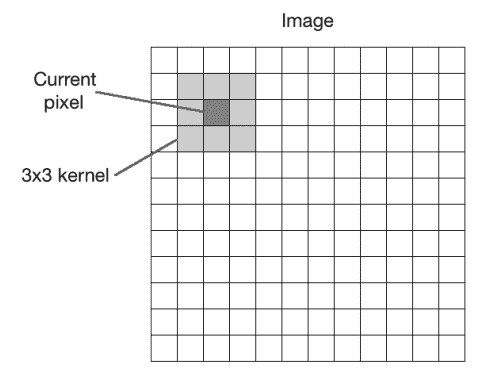
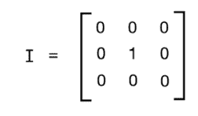
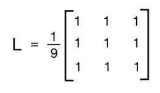
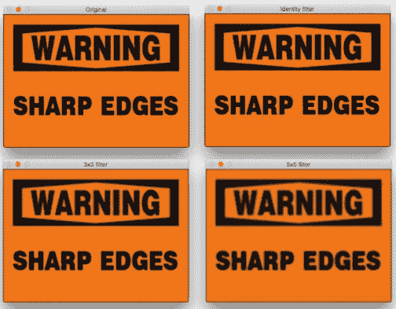
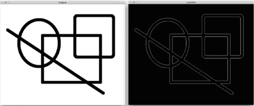
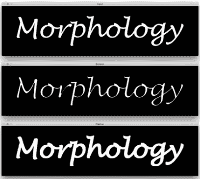
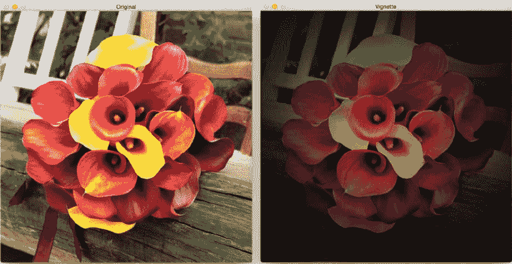
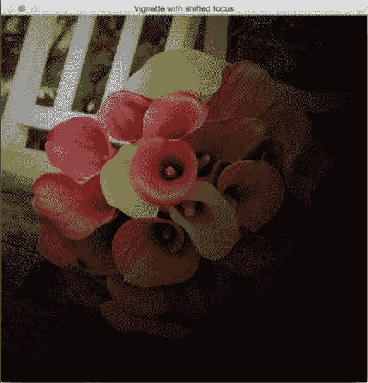
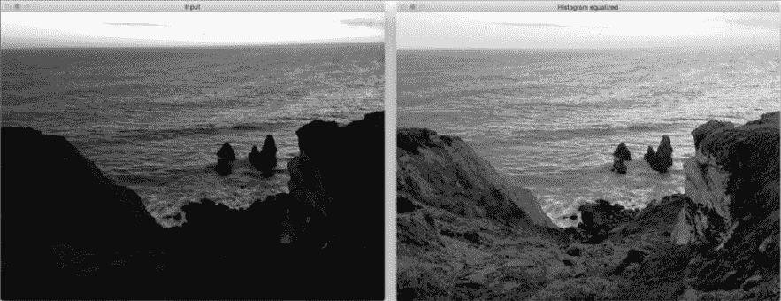
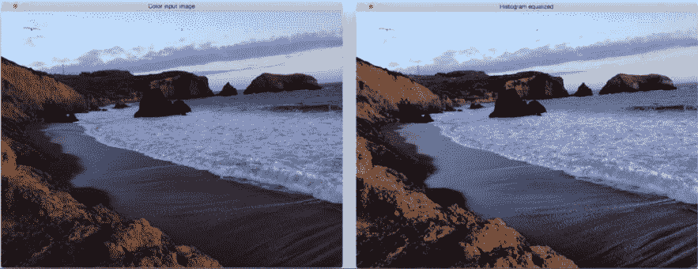

# 检测边缘并应用图像滤镜

在本章中，我们将了解如何将酷炫的视觉效果应用于图像。 我们将学习如何使用基本的图像处理运算符，讨论边缘检测，以及如何使用图像滤镜将各种效果应用于照片。

在本章结束时，您将了解：

*   什么是 2D 卷积以及如何使用
*   如何模糊影像
*   如何检测图像边缘
*   如何将运动模糊应用于图像
*   如何锐化和浮雕图像
*   如何腐蚀和扩大图像
*   如何创建晕影滤镜
*   如何增强图像对比度

# 2D 卷积

卷积是图像处理中的基本操作。 我们基本上将数学运算符应用于每个像素，并以某种方式更改其值。 为了应用该数学运算符，我们使用另一个称为**内核**的矩阵。 内核的大小通常比输入图像小得多。 对于图像中的每个像素，我们将内核放在顶部，以使内核的中心与所考虑的像素重合。 然后，我们将内核矩阵中的每个值与图像中的相应值相乘，然后将其求和。 这是将应用于输出图像中该位置的新值。

在这里，内核称为图像过滤器，而将此内核应用于给定图像的过程称为图像过滤。 将内核应用于图像后获得的输出称为滤波图像。 根据内核中的值，它执行不同的功能，例如模糊，检测边缘等。 下图应帮助您可视化图像过滤操作：



让我们从最简单的情况开始，即身份内核。 这个内核并没有真正改变输入图像。 如果我们考虑一个 3x3 身份内核，它看起来类似于以下内容：



# 模糊化

模糊是指对邻域内的像素值求平均。 这也称为**低通滤波器**。 低通滤波器是允许低频并阻止高频的滤波器。 现在，我们想到的下一个问题是：频率在图像中意味着什么？ 嗯，在这种情况下，频率是指像素值的变化率。 因此，可以说尖锐的边缘将是高频内容，因为像素值在该区域中快速变化。 按照这种逻辑，平原区域将是低频内容。 按照这个定义，低通滤波器将尝试平滑边缘。

构造低通滤波器的一种简单方法是均匀地平均像素附近的值。 我们可以根据要平滑图像的程度来选择内核的大小，并且相应地会有不同的效果。 如果您选择更大的尺寸，那么您将在更大的区域进行平均。 这趋于增加平滑效果。 让我们看一下 3x3 低通滤波器内核的样子：



我们将矩阵除以 9，因为我们希望这些值的总和为 1。 这称为**归一化**，这一点很重要，因为我们不想人为地增加该像素位置的强度值。 因此，您应该在将内核应用于映像之前对其进行规范化。 规范化是一个非常重要的概念，它在多种情况下都可以使用，因此您应该在线阅读一些教程以很好地了解它。

这是将低通滤波器应用于图像的代码：

```py
import cv2 
import numpy as np 

img = cv2.imread('images/input.jpg') 
rows, cols = img.shape[:2] 

kernel_identity = np.array([[0,0,0], [0,1,0], [0,0,0]]) 
kernel_3x3 = np.ones((3,3), np.float32) / 9.0 # Divide by 9 to normalize the kernel
kernel_5x5 = np.ones((5,5), np.float32) / 25.0 # Divide by 25 to normalize the kernel

cv2.imshow('Original', img) 

# value -1 is to maintain source image depth
output = cv2.filter2D(img, -1, kernel_identity) cv2.imshow('Identity filter', output) 

output = cv2.filter2D(img, -1, kernel_3x3) 
cv2.imshow('3x3 filter', output) 

output = cv2.filter2D(img, -1, kernel_5x5) 
cv2.imshow('5x5 filter', output) 

cv2.waitKey(0)
```

如果运行前面的代码，您将看到类似以下内容：



# 内核大小与模糊性

在前面的代码中，我们在代码中生成了`kernel_identity`，`kernel_3x3`和`kernel_5x5`不同的内核。 我们使用`filter2D`函数将这些内核应用于输入图像。 如果仔细查看图像，您会发现随着我们增加内核大小，它们会变得越来越模糊。 其原因是因为当我们增加内核大小时，我们在更大的区域进行平均。 这往往具有较大的模糊效果。

另一种执行此操作的方法是使用 OpenCV 函数`blur`。 如果您不想自己生成内核，则可以直接使用此函数。 我们可以使用以下代码行来调用它：

```py
output = cv2.blur(img, (3,3))
```

这会将 3x3 内核应用于输入，并直接为您提供输出。

# 运动模糊

当我们应用运动模糊效果时，看起来就像是您沿特定方向移动时捕获的图片。 例如，您可以使图像看起来像是从行驶中的汽车上捕获的。

输入和输出图像将类似于以下图像：


以下是实现这种运动模糊效果的代码：

```py
import cv2 
import numpy as np 

img = cv2.imread('images/input.jpg') 
cv2.imshow('Original', img) 

size = 15 

# generating the kernel 
kernel_motion_blur = np.zeros((size, size)) 
kernel_motion_blur[int((size-1)/2), :] = np.ones(size) 
kernel_motion_blur = kernel_motion_blur / size 

# applying the kernel to the input image 
output = cv2.filter2D(img, -1, kernel_motion_blur) 

cv2.imshow('Motion Blur', output) 
cv2.waitKey(0)
```

# 引擎盖下

我们正在照常读取图像。 然后，我们正在构建运动`blur`内核。 运动模糊内核会在特定方向上平均像素值。 就像定向低通滤波器。 3x3 水平运动模糊内核看起来像这样：


这将使图像在水平方向上模糊。 您可以选择任何方向，它将相应地起作用。 模糊的数量将取决于内核的大小。 因此，如果要使图像模糊，只需为内核选择更大的尺寸即可。 为了看到全部效果，我们在前面的代码中采用了 15x15 内核。 然后，我们使用`filter2D`将此内核应用于输入图像，以获得运动模糊的输出。

# 锐化

应用锐化滤镜将锐化图像中的边缘。 当我们要增强不够清晰的图像边缘时，此滤镜非常有用。 以下是一些图像，可让您大致了解图像锐化过程的外观：


如上图所示，锐化程度取决于我们使用的内核类型。 我们在这里可以自由定制内核，每个内核都会给您一种不同的锐化方法。 要像在上一张图片的右上角图像中那样锐化图像，我们将使用这样的内核：


如果要进行过度锐化，如左下图所示，我们将使用以下内核：


但是，这两个内核的问题在于输出图像看起来是人为增强的。 如果我们希望图像看起来更自然，可以使用边缘增强滤镜。 基本概念保持不变，但是我们使用近似的高斯核来构建此滤波器。 当我们增强边缘时，它将帮助我们平滑图像，从而使图像看起来更自然。

这是实现上述屏幕快照中所应用效果的代码：

```py
import cv2 
import numpy as np 

img = cv2.imread('images/input.jpg') 
cv2.imshow('Original', img) 

# generating the kernels 
kernel_sharpen_1 = np.array([[-1,-1,-1], [-1,9,-1], [-1,-1,-1]]) 
kernel_sharpen_2 = np.array([[1,1,1], [1,-7,1], [1,1,1]]) 
kernel_sharpen_3 = np.array([[-1,-1,-1,-1,-1], 
                             [-1,2,2,2,-1], 
                             [-1,2,8,2,-1], 
                             [-1,2,2,2,-1], 
                             [-1,-1,-1,-1,-1]]) / 8.0 

# applying different kernels to the input image 
output_1 = cv2.filter2D(img, -1, kernel_sharpen_1) 
output_2 = cv2.filter2D(img, -1, kernel_sharpen_2) 
output_3 = cv2.filter2D(img, -1, kernel_sharpen_3) 

cv2.imshow('Sharpening', output_1) 
cv2.imshow('Excessive Sharpening', output_2) 
cv2.imshow('Edge Enhancement', output_3) 
cv2.waitKey(0) 
```

如果您注意到，在前面的代码中，我们没有将前两个内核除以归一化因子。 这样做的原因是内核内部的值总和为 1，因此我们将矩阵隐式除以 1。

# 了解模式

您一定已经在图像过滤代码示例中注意到了一种常见模式。 我们构建一个内核，然后使用`filter2D`获得所需的输出。 这也正是此代码示例中发生的事情！ 您可以使用内核中的值，看看是否可以获得不同的视觉效果。 确保在应用内核之前对内核进行了标准化，否则图像将显得太亮，因为您是在人为地增加图像中的像素值。

# 压花

压纹滤镜将拍摄图像并将其转换为压纹图像。 我们基本上会获取每个像素，然后将其替换为阴影或高光。 假设我们正在处理图像中相对较平坦的区域。 在这里，我们需要用纯灰色代替它，因为那里没有太多信息。 如果在特定区域有很多对比度，我们将根据浮雕的方向将其替换为白色像素（高光）或深色像素（阴影）。

它将是这样的：


让我们看一下代码，看看如何做到这一点：

```py
import cv2 
import numpy as np 

img_emboss_input = cv2.imread('images/input.jpg') 

# generating the kernels 
kernel_emboss_1 = np.array([[0,-1,-1], 
                            [1,0,-1], 
                            [1,1,0]]) 
kernel_emboss_2 = np.array([[-1,-1,0], 
                            [-1,0,1], 
                            [0,1,1]]) 
kernel_emboss_3 = np.array([[1,0,0], 
                            [0,0,0], 
                            [0,0,-1]]) 

# converting the image to grayscale 
gray_img = cv2.cvtColor(img_emboss_input,cv2.COLOR_BGR2GRAY) 

# applying the kernels to the grayscale image and adding the offset to produce the shadow
output_1 = cv2.filter2D(gray_img, -1, kernel_emboss_1) + 128 
output_2 = cv2.filter2D(gray_img, -1, kernel_emboss_2) + 128 
output_3 = cv2.filter2D(gray_img, -1, kernel_emboss_3) + 128 

cv2.imshow('Input', img_emboss_input) 
cv2.imshow('Embossing - South West', output_1) 
cv2.imshow('Embossing - South East', output_2) 
cv2.imshow('Embossing - North West', output_3) 
cv2.waitKey(0) 
```

如果运行前面的代码，您将看到输出图像已浮雕。 从前面的内核可以看到，我们只是将当前像素值替换为特定方向上相邻像素值的差。 通过将图像中的所有像素值都偏移`128`来实现压纹效果。 此操作将高光/阴影效果添加到图片。

# 边缘检测

边缘检测的过程涉及检测图像中的尖锐边缘，并生成二进制图像作为输出。 通常，我们在黑色背景上绘制白线以指示这些边缘。 我们可以将边缘检测视为高通滤波操作。 高通滤波器允许高频内容通过并阻止低频内容。 如前所述，边缘是高频内容。 在边缘检测中，我们要保留这些边缘并丢弃其他所有内容。 因此，我们应该构建一个等效于高通滤波器的内核。

让我们从一个称为`Sobel`过滤器的简单边缘检测过滤器开始。 由于边缘会同时出现在水平和垂直方向，因此`Sobel`滤镜由以下两个内核组成：


左侧的内核检测水平边缘，右侧的内核检测垂直边缘。 OpenCV 提供了直接将`Sobel`滤镜应用于给定图像的功能。 这是使用 Sobel 过滤器检测边缘的代码：

```py
import cv2 
import numpy as np 

img = cv2.imread('images/input_shapes.png', cv2.IMREAD_GRAYSCALE) 
rows, cols = img.shape 

# It is used depth of *cv2.CV_64F.*
sobel_horizontal = cv2.Sobel(img, cv2.CV_64F, 1, 0, ksize=5)

# Kernel size can be: 1,3,5 or 7.
sobel_vertical = cv2.Sobel(img, cv2.CV_64F, 0, 1, ksize=5) 

cv2.imshow('Original', img) 
cv2.imshow('Sobel horizontal', sobel_horizontal) 
cv2.imshow('Sobel vertical', sobel_vertical) 

cv2.waitKey(0) 
```

对于 8 位输入图像，这将导致截断的导数，因此可以使用深度值`cv2.CV_16U`代替。 如果边缘定义不明确，可以调整*内核*的值，将其设置为较小可获得较薄的边缘，而对于相反的目的则为较大。

输出将类似于以下内容：


在上图中，中间的图像是水平边缘检测器的输出，而右边的图像是垂直边缘检测器。 正如我们在这里看到的，`Sobel`滤镜可以检测水平或垂直方向上的边缘，并且不能为我们提供所有边缘的整体视图。 为了克服这个问题，我们可以使用`Laplacian`过滤器。 使用此滤波器的优点是它在两个方向上都使用了双导数。 您可以使用以下行来调用该函数：

```py
laplacian = cv2.Laplacian(img, cv2.CV_64F)
```

输出将类似于以下屏幕截图：



即使`Laplacian`内核在这种情况下也能很好地工作，但它并不总是能很好地工作。 如下面的屏幕快照所示，这会在输出中引起很多噪声。 这是`Canny`边缘检测器派上用场的地方：


正如我们在前面的图像中看到的，`Laplacian`内核会产生一个嘈杂的输出，这并不是完全有用的。 为了克服这个问题，我们使用了`Canny`边缘检测器。 要使用`Canny`边缘检测器，我们可以使用以下功能：

```py
canny = cv2.Canny(img, 50, 240) 
```

如我们所见，`Canny`边缘检测器的质量要好得多。 它使用两个数字作为参数来指示阈值。 第二个参数称为**低阈值**值，第三个参数称为**高阈值**值。 如果梯度值超出高阈值，则将其标记为强边缘。 `Canny`边缘检测器从此点开始跟踪边缘，并继续进行处理，直到梯度值降至低阈值以下。 随着增加这些阈值，较弱的边缘将被忽略。 输出图像将更清晰，更稀疏。 您可以尝试使用阈值，并查看增加或减小阈值会发生什么。 总体表述很深。 [您可以通过以下网址了解更多信息](http://www.intelligence.tuc.gr/~petrakis/courses/computervision/canny.pdf)。

# 侵蚀和膨胀

**侵蚀**和**膨胀**是形态图像处理操作。 形态图像处理基本上涉及修改图像中的几何结构。 这些操作主要是为二进制图像定义的，但是我们也可以在灰度图像上使用它们。 侵蚀基本上剥夺了结构中最外面的像素层，而膨胀使结构增加了额外的像素层。

让我们看看这些操作是什么样的：



以下是实现此目的的代码：

```py
import cv2 
import numpy as np 

img = cv2.imread('images/input.jpg', 0) 

kernel = np.ones((5,5), np.uint8) 

img_erosion = cv2.erode(img, kernel, iterations=1) 
img_dilation = cv2.dilate(img, kernel, iterations=1) 

cv2.imshow('Input', img) 
cv2.imshow('Erosion', img_erosion) 
cv2.imshow('Dilation', img_dilation) 

cv2.waitKey(0) 
```

# 事后

OpenCV 提供直接腐蚀和扩大图像的功能。 它们分别称为腐蚀和膨胀。 值得注意的是这两个函数中的第三个参数。 迭代次数将确定您要腐蚀/扩大给定图像的数量。 它基本上将操作顺序地应用于所得图像。 您可以拍摄样本图像，并使用此参数来查看结果。

# 创建晕影滤镜

使用我们拥有的所有信息，让我们看看是否可以创建一个漂亮的小插图过滤器。 输出将类似于以下内容：



这是实现此效果的代码：

```py
import cv2 
import numpy as np 

img = cv2.imread('images/input.jpg') 
rows, cols = img.shape[:2] 

# generating vignette mask using Gaussian kernels 
kernel_x = cv2.getGaussianKernel(cols,200) 
kernel_y = cv2.getGaussianKernel(rows,200) 
kernel = kernel_y * kernel_x.T 
mask = 255 * kernel / np.linalg.norm(kernel) 
output = np.copy(img) 

# applying the mask to each channel in the input image 
for i in range(3): 
    output[:,:,i] = output[:,:,i] * mask 

cv2.imshow('Original', img) 
cv2.imshow('Vignette', output) 
cv2.waitKey(0) 
```

# 到底发生了什么？

晕影滤镜基本上将亮度聚焦在图像的特定部分上，而其他部分则显得褪色。 为了实现这一点，我们需要使用高斯核过滤掉图像中的每个通道。 OpenCV 提供了执行此操作的功能，称为`getGaussianKernel`。 我们需要构建一个 2D 内核，其大小与图像的大小匹配。 函数的第二个参数`getGaussianKernel`很有趣。 它是高斯的标准偏差，它控制明亮的中心区域的半径。 您可以试用此参数，并查看它如何影响输出。

构建 2D 内核后，需要通过标准化该内核并按比例放大来构建蒙版，如以下行所示：

```py
 mask = 255 * kernel / np.linalg.norm(kernel) 
```

这是重要的一步，因为如果您不按比例放大图像，图像将看起来很黑。 发生这种情况是因为在将蒙版叠加在输入图像上之后，所有像素值都将接近于零。 此后，我们遍历所有颜色通道并将蒙版应用于每个通道。

# 我们如何转移焦点？

现在，我们知道如何创建聚焦于图像中心的小插图滤镜。 假设我们要实现相同的晕影效果，但我们要关注图像中的其他区域，如下图所示：



我们需要做的是建立一个更大的高斯核，并确保该峰与感兴趣的区域重合。 以下是实现此目的的代码：

```py
import cv2 
import numpy as np 

img = cv2.imread('images/input.jpg') 
rows, cols = img.shape[:2] 

# generating vignette mask using Gaussian kernels 
kernel_x = cv2.getGaussianKernel(int(1.5*cols),200) 
kernel_y = cv2.getGaussianKernel(int(1.5*rows),200) 
kernel = kernel_y * kernel_x.T 
mask = 255 * kernel / np.linalg.norm(kernel) 
mask = mask[int(0.5*rows):, int(0.5*cols):] 
output = np.copy(img) 

# applying the mask to each channel in the input image 
for i in range(3): 
    output[:,:,i] = output[:,:,i] * mask 

cv2.imshow('Input', img) 
cv2.imshow('Vignette with shifted focus', output) 

cv2.waitKey(0) 
```

# 增强图像的对比度

每当我们在弱光条件下拍摄图像时，图像就会变暗。 当您在晚上或昏暗的房间中拍摄图像时，通常会发生这种情况。 您一定已经多次看到这种情况！ 发生这种情况的原因是，当我们在这种条件下捕获图像时，像素值趋于集中在零附近。 发生这种情况时，人眼无法清晰看到图像中的许多细节。 人眼喜欢对比度，因此我们需要调整对比度以使图像看起来既美观又令人愉悦。 许多相机和照片应用程序已经隐式地执行了此操作。 我们使用称为**直方图均衡**的过程来实现这一目标。

举个例子，这是对比度增强前后的样子：



如我们在这里看到的，左侧的输入图像确实很暗。 为了解决这个问题，我们需要调整像素值，以使它们分布在整个值范围内，即介于 0-255 之间。

以下是用于调整像素值的代码：

```py
import cv2 
import numpy as np 

img = cv2.imread('images/input.jpg', 0) 

# equalize the histogram of the input image 
histeq = cv2.equalizeHist(img) 

cv2.imshow('Input', img) 
cv2.imshow('Histogram equalized', histeq) 
cv2.waitKey(0) 
```

直方图均衡化适用于灰度图像。 OpenCV 提供了`equalizeHist`函数来实现此效果。 就像我们在这里看到的那样，代码非常简单，我们读取图像并均衡其直方图以归一化亮度并增加图像的对比度。

# 我们如何处理彩色图像？

既然我们知道如何均衡灰度图像的直方图，您可能想知道如何处理彩色图像。 直方图均衡化是一个非线性过程。 因此，我们不能仅将 RGB 图像中的三个通道分离出来，分别对直方图进行均衡，然后再将它们组合以形成输出图像。 直方图均衡化的概念仅适用于图像中的强度值。 因此，我们必须确保在进行此操作时不要修改颜色信息。

为了处理彩色图像的直方图均衡化，我们需要将其转换为色彩空间，其中强度与色彩信息分开。 YUV 是这种颜色空间的一个很好的例子，因为 YUV 模型根据一个**亮度**（**Y**）和两个 **C** **色度**（**UV**）成分。 一旦将其转换为 YUV，我们只需要均衡 Y 通道并将其与其他两个通道组合即可获得输出图像。

以下是其外观的示例：



这是实现彩色图像直方图均衡的代码：

```py
import cv2 
import numpy as np 

img = cv2.imread('images/input.jpg') 

img_yuv = cv2.cvtColor(img, cv2.COLOR_BGR2YUV) 

# equalize the histogram of the Y channel 
img_yuv[:,:,0] = cv2.equalizeHist(img_yuv[:,:,0]) 

# convert the YUV image back to RGB format 
img_output = cv2.cvtColor(img_yuv, cv2.COLOR_YUV2BGR) 

cv2.imshow('Color input image', img) 
cv2.imshow('Histogram equalized', img_output) 

cv2.waitKey(0)
```

# 概要

在本章中，我们学习了如何使用图像滤镜将酷炫的视觉效果应用于图像。 我们讨论了基本的图像处理运算符，以及如何使用它们来构建各种东西。 我们学习了如何使用各种方法检测边缘。 我们了解了 2D 卷积的重要性以及如何在不同的场景中使用它。 我们讨论了如何使图像平滑，运动模糊，锐化，浮雕，腐蚀和扩大图像。 我们学习了如何创建晕影滤镜，以及如何更改焦点区域。 我们讨论了对比度增强以及如何使用直方图均衡来实现它。

在下一章中，我们将讨论如何对给定图像进行卡通化。