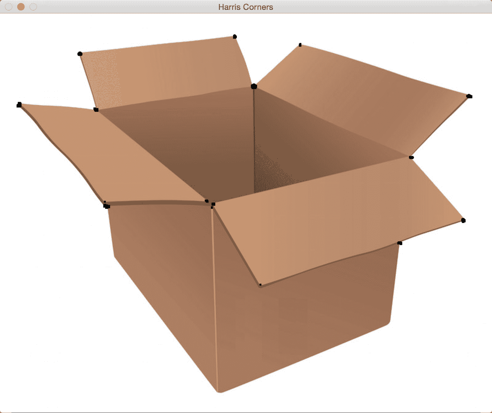
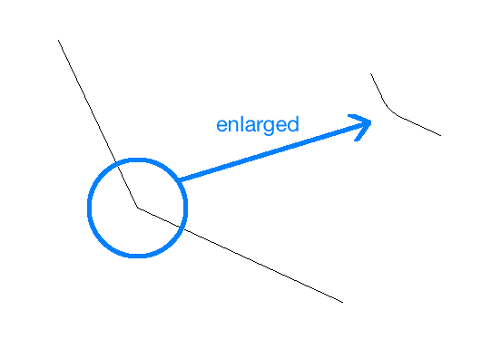
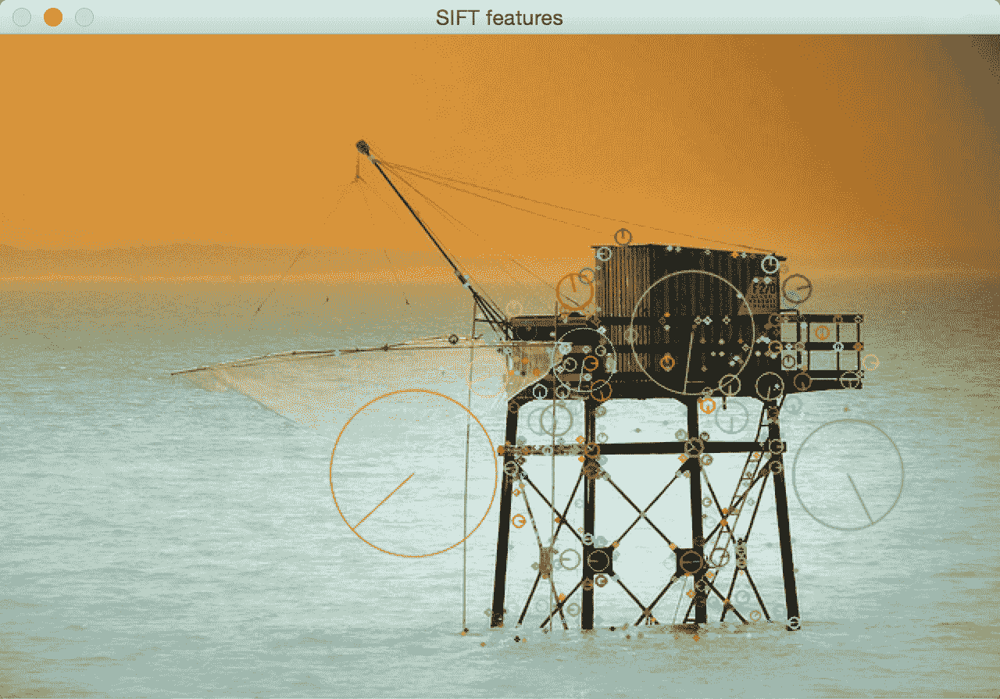
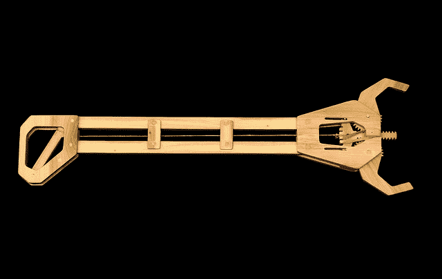
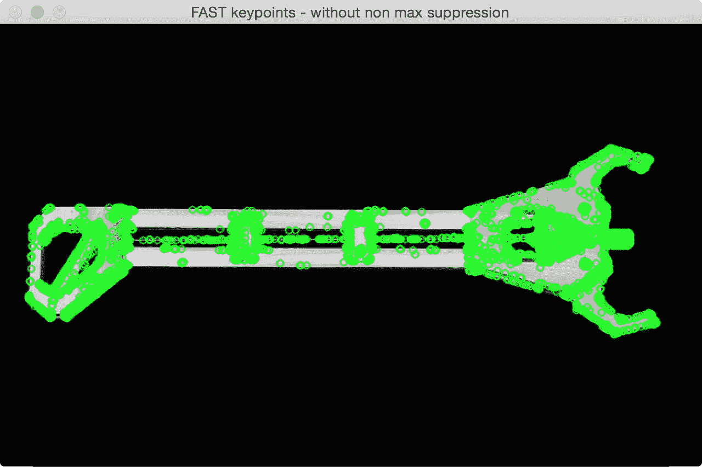
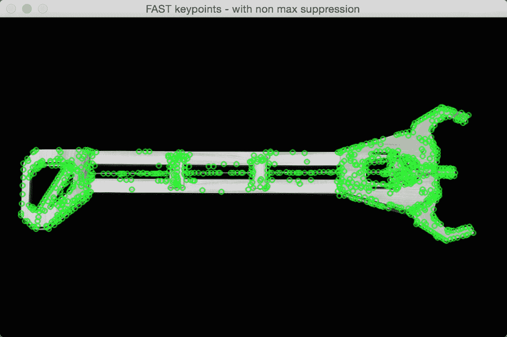
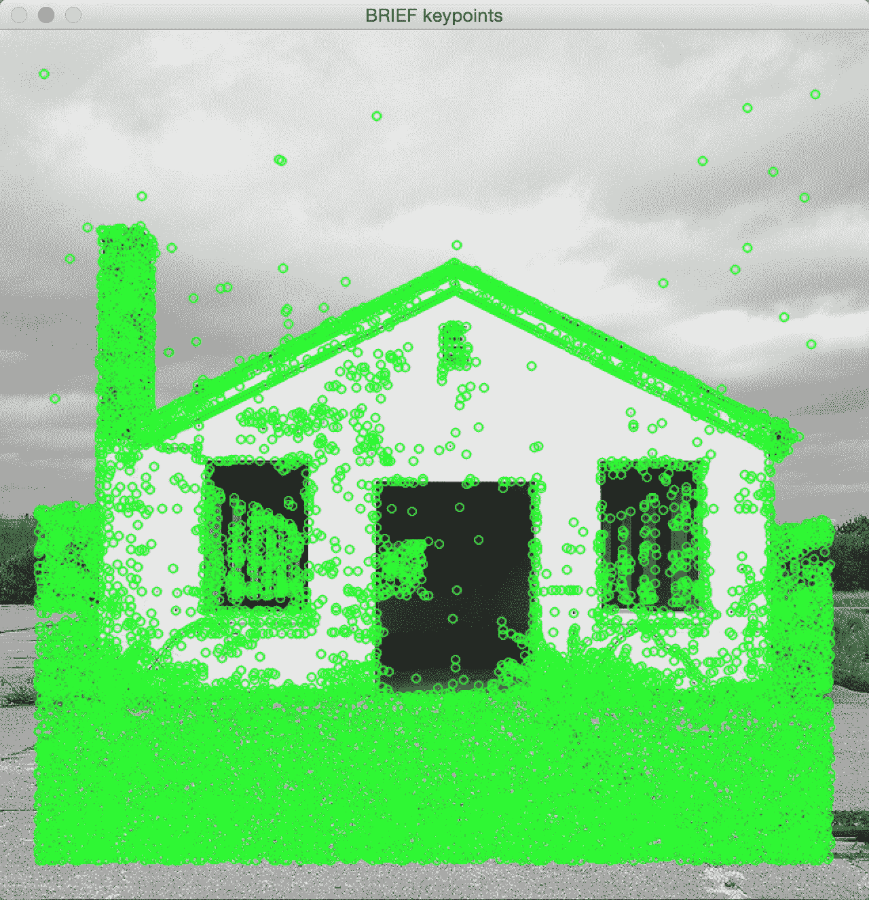
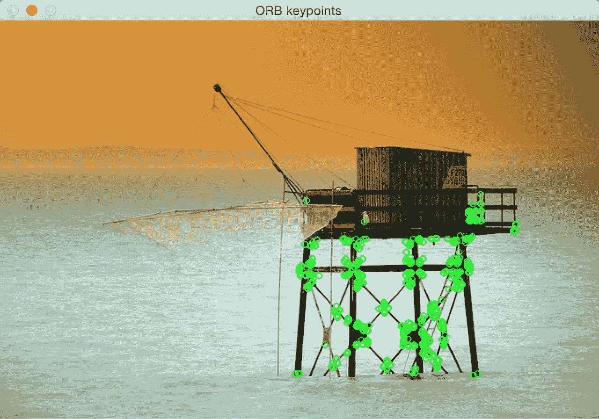

# 从图像中提取特征

在本章中，我们将学习如何检测图像中的显着点，也称为关键点。 我们将讨论为什么这些关键点很重要，以及如何使用它们来理解图像内容。 我们将讨论可用于检测这些关键点的不同技术，并了解如何从给定图像中提取特征。

在本章结束时，您将了解以下内容：

*   关键点是什么，我们为什么要关心它们？
*   如何检测关键点
*   如何将关键点用于图像内容分析
*   检测关键点的不同技术
*   如何构建特征提取器

# 我们为什么要关心关键点？

图像内容分析是指理解图像内容的过程，以便我们可以据此采取一些措施。 让我们退后一步，谈谈人类是如何做到的。 我们的大脑是一个非常强大的机器，可以非常快速地完成复杂的事情。 当我们观察事物时，我们的大脑会根据该图像的*有趣的*方面自动创建足迹。 在本章中，我们将讨论有趣的方法。

目前，一个有趣的方面是该地区与众不同的地方。 如果我们将一个点称为有趣的点，那么在它的邻域中不应有另一个点满足约束条件。 让我们考虑下图：


现在，闭上你的眼睛，并尝试形象化这张图片。 您看到特定的东西了吗？ 您可以回忆一下图像左半部分的内容吗？ 并不是的！ 这样做的原因是图像没有任何有趣的信息。 当我们的大脑看着这样的东西时，没有什么需要注意的，因此它会四处游荡！ 让我们看一下下图：


现在，闭上你的眼睛，并尝试形象化这张图片。 您会看到回忆很生动，并且还记得有关此图像的许多细节。 原因是图像中有很多有趣的区域。 人眼对高频内容比低频内容更敏感。 这就是为什么我们倾向于比第一幅图像更好地收集第二幅图像的原因。 为了进一步说明这一点，让我们看一下下图：


如果您注意到，即使它不在图像中心，您的视线也会立即移到电视遥控器上。 我们会自动趋向于图像中的有趣区域，因为这是所有信息所在的位置。 这是我们的大脑需要存储的内容，以便以后进行重新收集。

在构建对象识别系统时，我们需要检测这些*有趣的*区域，以创建图像的签名。 这些有趣的区域以关键点为特征。 这就是为什么关键点检测在许多现代计算机视觉系统中至关重要的原因。

# 关键点是什么？

现在我们知道关键点是指图像中有趣的区域，下面让我们更深入地进行研究。 关键点是什么？ 这些要点在哪里？ 当我们说*有趣*时，表示该区域正在发生某些事情。 如果该区域是统一的，那就不是很有趣。 例如，角点很有趣，因为强度在两个不同方向上急剧变化。 每个角都是两个边相交的唯一点。 如果查看前面的图像，您会发现有趣的区域并没有完全由有趣的内容组成。 如果仔细观察，我们仍然可以看到繁忙区域中的平原区域。 例如，考虑以下图像：


如果您查看前面的对象，则有趣区域的内部部分*不有趣*：


因此，如果要表征该对象，则需要确保选择了有趣的点。 现在，我们如何定义*有趣*点？ 我们可以说没有什么不有趣的事情可能是一个有趣的观点吗？ 让我们考虑以下示例：


现在，我们可以看到该图像沿边缘有很多高频内容。 但是我们不能称整个边缘为*有趣的*。 重要的是要理解有趣的不一定涉及颜色或强度值。 只要是不同的，它可以是任何东西。 我们需要隔离它们附近唯一的点。 沿边缘的点相对于它们的邻居不是唯一的。 那么，既然我们知道我们在寻找什么，我们如何挑选一个有趣的观点？

桌子的一角呢？ 那很有趣，对不对？ 就其邻居而言，它是独一无二的，我们附近没有类似的东西。 现在，可以选择这一点作为我们的关键点之一。 我们利用这些关键点来表征特定的图像。

在进行图像分析时，我们需要先将图像转换为数字形式，然后才能得出结论。 这些关键点使用数字形式表示，然后使用这些关键点的组合来创建图像签名。 我们希望该图像签名以最好的方式表示给定的图像。

# 检测角点

由于我们知道角点*很有趣*，因此让我们看一下如何检测它们。 在计算机视觉中，有一种流行的角点检测技术，称为**哈里斯角点检测器**。 我们基本上基于灰度图像的偏导数构造一个`2x2`矩阵，然后分析获得的特征值。 特征值是一组特殊的标量，与一组线性方程组相关联，这些方程组通过属于一起的像素簇提供有关图像的分段信息。 在这种情况下，我们使用它们来检测角点。 这实际上是对实际算法的过度简化，但涵盖了要点。 因此，如果您想了解基本的数学细节，可以在[这个页面](http://www.bmva.org/bmvc/1988/avc-88-023.pdf)上查看 Harris 和 Stephens 的原始论文。角点是两个特征值都将具有较大值的点。

让我们考虑下图：


如果在此图像上运行哈里斯角点探测器，您将看到类似以下内容：



如您所见，所有黑点均对应于图像中的角。 您可能会注意到未检测到盒子底部的角。 原因是角点不够尖锐。 您可以在角点检测器中调整阈值以识别这些角点。 执行此操作的代码如下：

```py
import cv2 
import numpy as np 

img = cv2.imread(img/box.png') 
gray = cv2.cvtColor(img,cv2.COLOR_BGR2GRAY)
gray = np.float32(gray) 

# To detect only sharp corners 
dst = cv2.cornerHarris(gray, blockSize=4, ksize=5, k=0.04)
# Result is dilated for marking the corners 
dst = cv2.dilate(dst, None) 

# Threshold for an optimal value, it may vary depending on the image
img[dst > 0.01*dst.max()] = [0,0,0]
cv2.imshow('Harris Corners(only sharp)',img) 

# to detect soft corners 
dst = cv2.cornerHarris(gray, blockSize=14, ksize=5, k=0.04)
dst = cv2.dilate(dst, None)
img[dst > 0.01*dst.max()] = [0,0,0] 
cv2.imshow('Harris Corners(also soft)',img) 

cv2.waitKey() 
```

# 良好的跟踪特征

在许多情况下，Harris Corner Detector 的表现都不错，但在某些方面却漏了。 在哈里斯和斯蒂芬斯撰写原始论文大约六年后，史和托马西想出了一个更好的角检测器。 您可以在[这里](http://www.ai.mit.edu/courses/6.891/handouts/shi94good.pdf)阅读原始论文。 J. Shi 和 C.Tomasi 使用了不同的评分功能来提高整体质量。 使用这种方法，我们可以找到给定图像中的 N 个最强角。 当我们不想使用每个角来从图像中提取信息时，这非常有用。

如果将 Shi-Tomasi 角点检测器应用于之前显示的图像，则会看到类似以下内容：


以下是代码：

```py
import cv2 
import numpy as np 

img = cv2.imread('images/box.png') 
gray = cv2.cvtColor(img,cv2.COLOR_BGR2GRAY) 

corners = cv2.goodFeaturesToTrack(gray, maxCorners=7, qualityLevel=0.05, minDistance=25) 
corners = np.float32(corners) 

for item in corners: 
    x, y = item[0] 
    cv2.circle(img, (x,y), 5, 255, -1) 

cv2.imshow("Top 'k' features", img) 
cv2.waitKey()
```

# 尺度不变特征变换（SIFT）

即使边角特征*很有趣*，它们也不足以表征真正有趣的部分。 当我们谈论图像内容分析时，我们希望图像签名对于诸如比例尺，旋转和照明之类的东西不变。 人类在这些事情上非常擅长。 即使我给您看的苹果颠倒的图像变暗，您仍然会识别它。 如果我向您展示该图像的放大版本，您仍会识别它。 我们希望我们的图像识别系统能够做到这一点。

让我们考虑角点特征。 如果放大图像，角点可能不再是角点，如下所示：



在第二种情况下，检测器将不会拾取该角。 并且，由于它是在原始图像中拾取的，因此第二张图像将与第一张图像不匹配。 它基本上是相同的图像，但是基于角点特征的方法将完全错过它。 这意味着角点检测器并非完全不变。 这就是为什么我们需要一种更好的方法来表征图像的原因。

SIFT 是整个计算机视觉领域中最受欢迎的算法之一。 您可以在[这个页面](http://www.cs.ubc.ca/~lowe/papers/ijcv04.pdf)上阅读 David Lowe 的原始论文。 我们可以使用该算法提取关键点并构建相应的特征描述符。 在线上有很多好的文档，因此我们将简短地讨论。 为了确定潜在的关键点，SIFT 通过对图像进行下采样并获取高斯差来构建金字塔。 这意味着我们在每个级别上运行一个高斯过滤器，并利用差值在金字塔中构建连续的级别。 为了查看当前点是否为关键点，它会查看相邻点以及金字塔相邻级别中同一位置的像素。 如果是最大值，则将当前点作为关键点。 这样可以确保我们将关键点保持不变。

现在我们知道了 SIFT 如何实现尺度不变性，让我们看看它如何实现旋转不变性。 一旦我们确定了关键点，便为每个关键点分配了方向。 我们采用每个关键点附近的邻域，并计算梯度大小和方向。 这使我们对关键点的方向有所了解。 如果我们有此信息，即使旋转该关键点，也可以将其与另一个图像中的同一点进行匹配。 由于我们知道方向，因此我们可以在进行比较之前将这些关键点归一化。

一旦获得所有这些信息，我们如何量化它？ 我们需要将其转换为一组数字，以便可以对其进行某种匹配。 为此，我们只需要围绕每个关键点设置`16x16`的邻域，并将其划分为 16 个大小为`4x4`的块。 对于每个块，我们使用八个面元计算方向直方图。 因此，我们有一个与每个块相关联的长度为 8 的向量，这意味着该邻域由大小为 128（`8x16`）的向量表示。 这是将要使用的最终关键点描述符。 如果从图像中提取`N`个关键点，则每个长度为 128 的`N`个描述符。`N`个描述符的数组表征了给定的图像。

考虑下图：


如果使用 SIFT 提取关键点位置，您将看到类似以下的内容，其中圆圈的大小指示关键点的强度，圆圈内的线指示方向：



在查看代码之前，重要的是要知道 SIFT 已获得专利，并且不能免费商业使用。 以下是执行此操作的代码：

```py
import cv2 
import numpy as np 

input_image = cv2.imread('images/fishing_house.jpg') 
gray_image = cv2.cvtColor(input_image, cv2.COLOR_BGR2GRAY) 

# For version opencv < 3.0.0, use cv2.SIFT()
sift = cv2.xfeatures2d.SIFT_create() 
keypoints = sift.detect(gray_image, None) 

cv2.drawKeypoints(input_image, keypoints, input_image, \
 flags = cv2.DRAW_MATCHES_FLAGS_DRAW_RICH_KEYPOINTS) 

cv2.imshow('SIFT features', input_image) 
cv2.waitKey()
```

我们还可以计算描述符。 OpenCV 让我们分开进行操作，或者我们可以通过使用以下步骤在同一步骤中组合检测和计算部分：

```py
keypoints, descriptors = sift.detectAndCompute(gray_image, None) 
```

# 加速的强大特征（SURF）

即使 SIFT 很好且有用，但它的计算量很大。 这意味着它很慢，如果使用 SIFT，我们将很难实现实时系统。 我们需要一个快速且具有 SIFT 所有优点的系统。 如果您还记得，SIFT 使用高斯差分来构建金字塔，并且此过程很慢。 因此，为克​​服此问题，SURF 使用简单的盒式过滤器来近似高斯。 好消息是，这确实很容易计算，而且速度相当快。 [SURF 上有很多在线文档](http://opencv-python-tutroals.readthedocs.org/en/latest/py_tutorials/py_feature2d/py_surf_intro/py_surf_intro.html?highlight=surf)。 因此，您可以遍历它以了解他们如何构造描述符。 您也可以在[这个页面](http://www.vision.ee.ethz.ch/~surf/eccv06.pdf)上参考原始论文。 重要的是要知道 SURF 也已获得专利，并且不能免费用于商业用途。

如果在较早的图像上运行 SURF 关键点检测器，您将看到类似以下内容：


这是代码：

```py
import cv2 
import numpy as np 

input_image = cv2.imread('images/fishing_house.jpg') 
gray_image = cv2.cvtColor(input_image, cv2.COLOR_BGR2GRAY) 

# For version opencv < 3.0.0, use cv2.SURF()
surf = cv2.xfeatures2d.SURF_create()
# This threshold controls the number of keypoints 
surf.setHessianThreshold(15000) 

keypoints, descriptors = surf.detectAndCompute(gray_image, None) 

cv2.drawKeypoints(input_image, keypoints, input_image, color=(0,255,0),\ flags=cv2.DRAW_MATCHES_FLAGS_DRAW_RICH_KEYPOINTS) 

cv2.imshow('SURF features', input_image) 
cv2.waitKey()
```

# 来自加速段测试的特征（FAST）

尽管 SURF 比 SIFT 快，但是对于实时系统而言，它还不够快，尤其是在存在资源限制的情况下。 当您在移动设备上构建实时应用程序时，您将无法享受使用 SURF 进行实时计算的奢华。 我们需要的是真正快速且计算便宜的东西。 因此，罗斯滕（Rosten）和德拉蒙德（Drummond）提出了 FAST。 顾名思义，它真的很快！

他们没有进行所有昂贵的计算，而是提出了一种高速测试来快速确定当前点是否是潜在的关键点。 我们需要注意，FAST 仅用于关键点检测。 一旦检测到关键点，就需要使用 SIFT 或 SURF 来计算描述符。 考虑下图：



如果我们在此图像上运行 FAST 关键点检测器，您将看到类似以下内容：



如果我们清理它并抑制不重要的关键点，它将看起来像这样：



以下是此代码：

```py
import cv2 
import numpy as np 

input_image = cv2.imread('images/tool.png')
gray_image = cv2.cvtColor(input_image, cv2.COLOR_BGR2GRAY)

# Version under opencv 3.0.0 cv2.FastFeatureDetector()
fast = cv2.FastFeatureDetector_create() 

# Detect keypoints 
keypoints = fast.detect(gray_image, None) 
print("Number of keypoints with non max suppression:", len(keypoints)) 

# Draw keypoints on top of the input image 
img_keypoints_with_nonmax=input_image.copy()
cv2.drawKeypoints(input_image, keypoints, img_keypoints_with_nonmax, color=(0,255,0), \ flags=cv2.DRAW_MATCHES_FLAGS_DRAW_RICH_KEYPOINTS) 
cv2.imshow('FAST keypoints - with non max suppression', img_keypoints_with_nonmax) 

# Disable nonmaxSuppression 
fast.setNonmaxSuppression(False) 
# Detect keypoints again 
keypoints = fast.detect(gray_image, None) 
print("Total Keypoints without nonmaxSuppression:", len(keypoints))

# Draw keypoints on top of the input image 
img_keypoints_without_nonmax=input_image.copy()
cv2.drawKeypoints(input_image, keypoints, img_keypoints_without_nonmax, color=(0,255,0), \ flags=cv2.DRAW_MATCHES_FLAGS_DRAW_RICH_KEYPOINTS)
cv2.imshow('FAST keypoints - without non max suppression', img_keypoints_without_nonmax) 
cv2.waitKey() 
```

# 二进制鲁棒的独立基本特征（BRIEF）

即使我们有 FAST 来快速检测关键点，我们仍然必须使用 SIFT 或 SURF 来计算描述符。 我们还需要一种快速计算描述符的方法。 这就是 BRIEF 出现的地方。 摘要是一种提取特征描述符的方法。 它不能单独检测关键点，因此我们需要将其与关键点检测器结合使用。 BRIEF 的好处是它紧凑且快速。

考虑下图：


BRIEF 获取输入关键点的列表并输出更新的列表。 因此，如果在此图像上运行“摘要”，您将看到类似以下内容：



以下是代码：

```py
import cv2 
import numpy as np 

input_image = cv2.imread('images/house.jpg') 
gray_image = cv2.cvtColor(input_image, cv2.COLOR_BGR2GRAY)

# Initiate FAST detector 
fast = cv2.FastFeatureDetector_create() 

# Initiate BRIEF extractor, before opencv 3.0.0 use cv2.DescriptorExtractor_create("BRIEF")
brief = cv2.xfeatures2d.BriefDescriptorExtractor_create() 

# find the keypoints with STAR 
keypoints = fast.detect(gray_image, None) 

# compute the descriptors with BRIEF 
keypoints, descriptors = brief.compute(gray_image, keypoints) 

cv2.drawKeypoints(input_image, keypoints, input_image, color=(0,255,0)) 
cv2.imshow('BRIEF keypoints', input_image) 
cv2.waitKey()
```

# 定向快速旋转 BRIEF（ORB）

因此，现在我们已经达到了到目前为止讨论的所有组合中的最佳组合。 该算法来自 OpenCV 实验室。 它是快速，强大且开源的！ SIFT 和 SURF 算法均已获得专利，您不能将其用于商业目的； 这就是为什么 ORB 在许多方面都很好的原因。

如果在前面显示的图像之一上运行 ORB 关键点提取器，您将看到类似以下内容：



这是代码：

```py
import cv2 
import numpy as np 

input_image = cv2.imread('images/fishing_house.jpg') 
gray_image = cv2.cvtColor(input_image, cv2.COLOR_BGR2GRAY) 

# Initiate ORB object, before opencv 3.0.0 use cv2.ORB()
orb = cv2.ORB_create() 

# find the keypoints with ORB 
keypoints = orb.detect(gray_image, None) 

# compute the descriptors with ORB 
keypoints, descriptors = orb.compute(gray_image, keypoints) 

# draw only the location of the keypoints without size or orientation 
cv2.drawKeypoints(input_image, keypoints, input_image, color=(0,255,0)) 

cv2.imshow('ORB keypoints', input_image) 
cv2.waitKey()
```

# 总结

在本章中，我们了解了关键点的重要性以及为什么需要它们。 我们讨论了用于检测关键点和计算特征描述符的各种算法。 我们将在各种情况下的所有后续章节中使用这些算法。 关键点概念对于计算机视觉至关重要，并且在许多现代系统中都扮演着重要角色。

在下一章中，我们将讨论如何将同一场景的多个图像拼接在一起以创建全景图像。