# 检测形状和分割图像

在本章中，我们将学习形状分析和图像分割。 我们将学习如何识别形状并估算确切边界。 我们将讨论如何使用各种方法将图像分割成其组成部分。 我们还将学习如何将前景与背景分开。

在本章结束时，您将了解：

*   什么是轮廓分析和形状匹配
*   如何匹配形状
*   什么是图像分割
*   如何将图像分割成其组成部分
*   如何将前景与背景分开
*   如何使用各种技术分割图像

# 轮廓分析和形状匹配

轮廓分析是计算机视觉领域中非常有用的工具。 我们处理现实世界中的许多形状，轮廓分析有助于使用各种算法分析这些形状。 当我们将图像转换为灰度并对其进行阈值处理时，我们会留下一堆线条和轮廓。 一旦了解了不同形状的属性，便可以从图像中提取详细信息。

假设我们要在下图中标识飞旋镖形状：

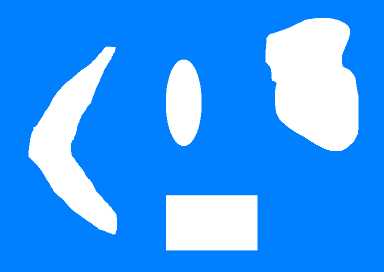

为此，我们首先需要了解常规回旋镖的外观：

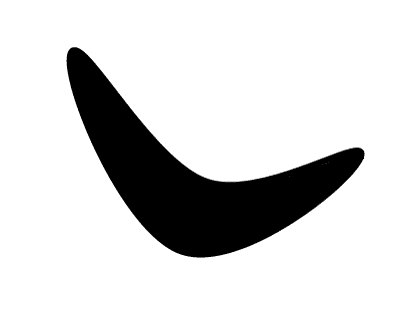

现在，以前面的图像为参考，我们是否可以识别原始图像中与回旋镖相对应的形状？ 如果您注意到，我们不能使用简单的基于相关性的方法，因为形状都会变形。 这意味着我们寻找精确匹配的方法几乎行不通！ 我们需要了解形状的特征并匹配相应的特征以识别飞旋镖形状。 OpenCV 提供了几个形状匹配器实用程序，我们可以使用它们来实现此目的。 如果您想了解更多信息，请访问[这里](https://docs.opencv.org/3.3.0/dc/dc3/tutorial_py_matcher.html)了解更多信息。

匹配基于**胡**矩的概念，而后者又与图像矩有关。 [您可以参考以下论文以了解有关矩的更多信息](http://zoi.utia.cas.cz/files/chapter_moments_color1.pdf)。 *图像矩*的概念基本上是指形状内像素的加权和乘幂加和。

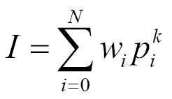

在上式中，`p`表示轮廓内的像素，`w`表示权重，`N`表示轮廓内的点数，`k`表示功率，`I`表示矩。 根据我们为`w`和`k`选择的值，我们可以从该轮廓提取不同的特征。

也许最简单的例子是计算轮廓的面积。 为此，我们需要计算该区域内的像素数。 因此，从数学上讲，在加权和加幂求和形式中，我们只需要将`w`设置为 1，将`k`设置为零。 这将为我们提供轮廓区域。 根据我们如何计算这些矩，它们将帮助我们理解这些不同的形状。 这也产生了一些有趣的属性，可以帮助我们确定形状相似度。

如果我们匹配形状，您将看到类似以下内容：

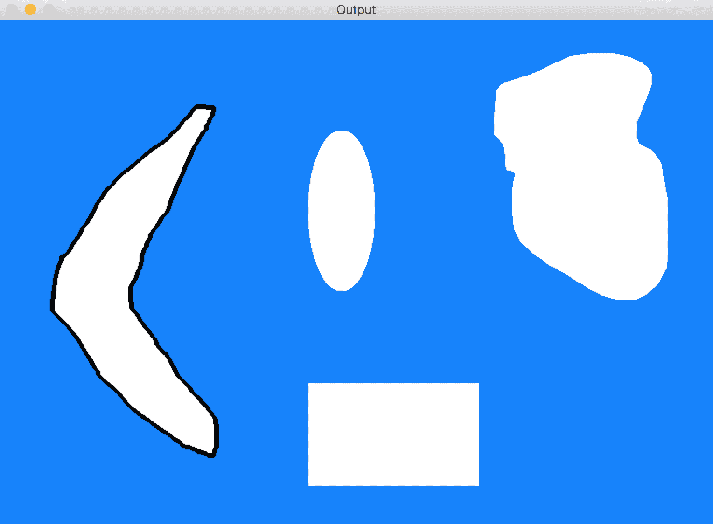

让我们看一下执行此操作的代码：

```py
import cv2 
import numpy as np 

# Extract all the contours from the image 
def get_all_contours(img): 
    ref_gray = cv2.cvtColor(img, cv2.COLOR_BGR2GRAY) 
    ret, thresh = cv2.threshold(ref_gray, 127, 255, 0) 
    # Find all the contours in the thresholded image. The values 
    # for the second and third parameters are restricted to a 
    # certain number of possible values.
    im2, contours, hierarchy = cv2.findContours(thresh.copy(), cv2.RETR_LIST, \
       cv2.CHAIN_APPROX_SIMPLE )
    return contours

# Extract reference contour from the image 
def get_ref_contour(img): 
    contours = get_all_contours(img)

    # Extract the relevant contour based on area ratio. We use the 
    # area ratio because the main image boundary contour is 
    # extracted as well and we don't want that. This area ratio 
    # threshold will ensure that we only take the contour inside the image. 
    for contour in contours: 
        area = cv2.contourArea(contour) 
        img_area = img.shape[0] * img.shape[1] 
        if 0.05 < area/float(img_area) < 0.8: 
            return contour 

if __name__=='__main__': 
    # Boomerang reference image 
    img1 = cv2.imread(sys.argv[1]) 

    # Input image containing all the different shapes 
    img2 = cv2.imread(sys.argv[2]) 

    # Extract the reference contour 
    ref_contour = get_ref_contour(img1)

    # Extract all the contours from the input image 
    input_contours = get_all_contours(img2) 

        closest_contour = None
    min_dist = None
    contour_img = img2.copy()
    cv2.drawContours(contour_img, input_contours, -1, color=(0,0,0), thickness=3) 
    cv2.imshow('Contours', contour_img)
    # Finding the closest contour 
    for contour in input_contours: 
        # Matching the shapes and taking the closest one using 
        # Comparison method CV_CONTOURS_MATCH_I3 (second argument)
        ret = cv2.matchShapes(ref_contour, contour, 3, 0.0)
        print("Contour %d matchs in %f" % (i, ret))
        if min_dist is None or ret < min_dist:
            min_dist = ret 
            closest_contour = contour

    cv2.drawContours(img2, [closest_contour], 0 , color=(0,0,0), thickness=3) 
    cv2.imshow('Best Matching', img2)
    cv2.waitKey()
```

`matchShapes`方法的使用可能与胡矩不变量（`CV_CONTOUR_MATCH_I1,2,3`）不同，后者由于轮廓的大小，方向或旋转而可能产生不同的最佳匹配形状。 要了解更多信息，可以在[这个页面](https://docs.opencv.org/3.3.0/d3/dc0/group__imgproc__shape.html)上查看官方文档。

# 近似轮廓

我们在现实生活中遇到的许多轮廓都很嘈杂。 这意味着轮廓看起来不平滑，因此我们的分析受到了打击。 那么，我们该如何处理呢？ 一种解决方法是获取轮廓上的所有点，然后使用平滑多边形对其进行近似。

让我们再次考虑飞旋镖的形象。 如果使用各种阈值近似轮廓，则会看到轮廓改变其形状。 让我们从 0.05 开始：

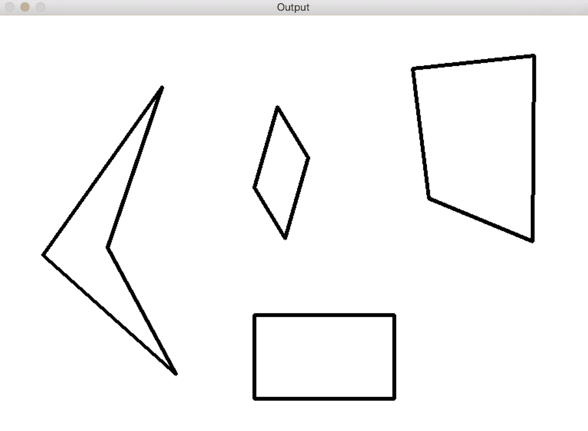

如果减小此因子，轮廓将变得更平滑。 让我们使其为 0.01：

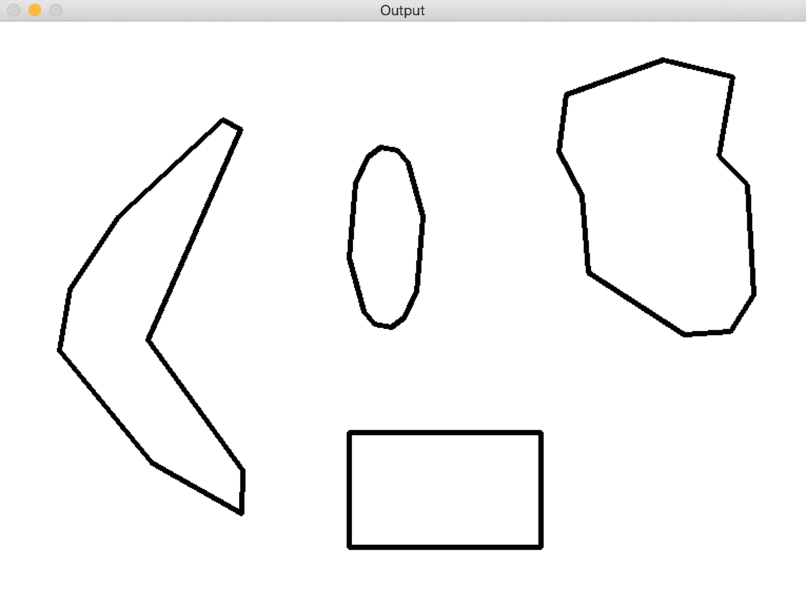

如果您将其缩小，例如说 0.00001，那么它将看起来像原始图像：

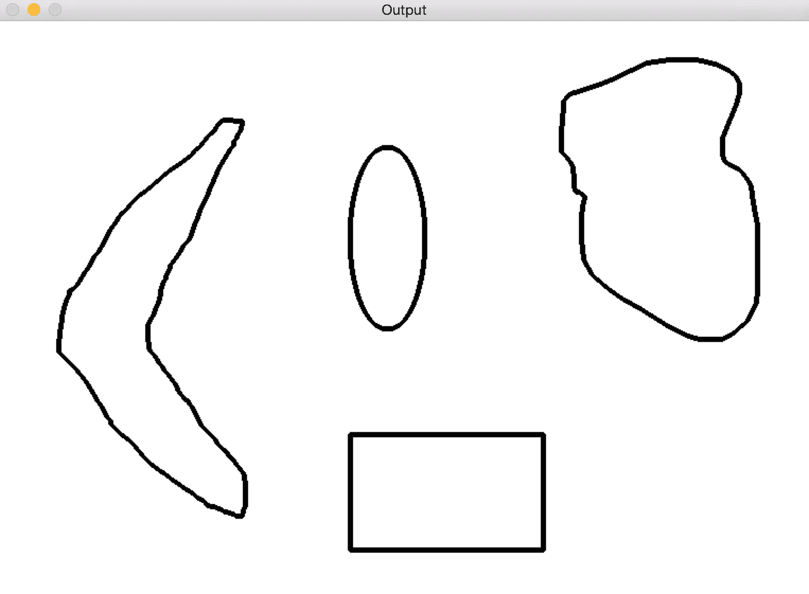

以下代码表示如何将这些轮廓转换为多边形的近似平滑化：

```py
import sys 
import cv2 
import numpy as np 

if __name__=='__main__': 
    # Input image containing all the different shapes 
    img1 = cv2.imread(sys.argv[1]) 
    # Extract all the contours from the input image 
    input_contours = get_all_contours(img1) 

    contour_img = img1.copy()
    smoothen_contours = []
    factor = 0.05

    # Finding the closest contour 
    for contour in input_contours: 
        epsilon = factor * cv2.arcLength(contour, True) 
        smoothen_contours.append(cv2.approxPolyDP(contour, epsilon, True)) 

    cv2.drawContours(contour_img, smoothen_contours, -1, color=(0,0,0), thickness=3) 
    cv2.imshow('Contours', contour_img)
    cv2.waitKey()
```

# 识别出一片突出的披萨

标题可能会引起误导，因为我们不会谈论披萨片。 但是，假设您所处的图像包含不同类型的不同形状的比萨饼。 现在，有人从其中一个比萨饼中切出一片。 我们如何自动识别这一点？

我们无法采用之前采用的方法，因为我们不知道形状是什么样子，因此我们没有任何模板。 我们甚至不确定我们要寻找的形状，因此我们无法基于任何先验信息构建模板。 我们所知道的是从一个比萨饼上切下一片的事实。 让我们考虑下图：

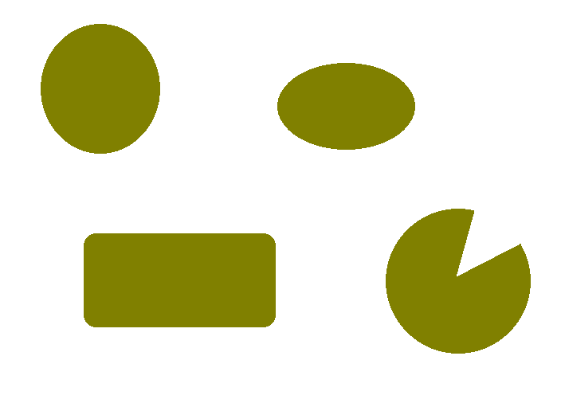

这不完全是真实的图像，但是您可以理解。 你知道我们在谈论什么形状。 由于我们不知道要寻找的是什么，因此需要使用这些形状的某些属性来识别切片的比萨饼。 如果您注意到，所有其他形状都很好地封闭了； 也就是说，您可以在这些形状中选取任意两个点并在它们之间画一条线，并且该线将始终位于该形状之内。 这些形状称为**凸形**。

如果您查看切片的比萨饼形状，我们可以选择两个点，使它们之间的线超出形状，如下图所示：


因此，我们要做的就是检测图像中的非凸形状，然后就可以完成。 让我们继续这样做：

```py
import sys 
import cv2 
import numpy as np 

if __name__=='__main__': 
    img = cv2.imread(sys.argv[1]) 

    # Iterate over the extracted contours
    # Using previous get_all_contours() method
    for contour in get_all_contours(img): 
        # Extract convex hull from the contour 
        hull = cv2.convexHull(contour, returnPoints=False) 

        # Extract convexity defects from the above hull
        # Being a convexity defect the cavities in the hull segments
        defects = cv2.convexityDefects(contour, hull) 

        if defects is None: 
            continue 

        # Draw lines and circles to show the defects 
        for i in range(defects.shape[0]):
            start_defect, end_defect, far_defect, _ = defects[i,0] 
            start = tuple(contour[start_defect][0]) 
            end = tuple(contour[end_defect][0]) 
            far = tuple(contour[far_defect][0]) 
            cv2.circle(img, far, 5, [128,0,0], -1) 
            cv2.drawContours(img, [contour], -1, (0,0,0), 3) 

    cv2.imshow('Convexity defects',img) 
    cv2.waitKey(0) 
    cv2.destroyAllWindows() 
```

要了解有关`convexityDefects`工作原理的更多信息，请访问[这里](https://docs.opencv.org/2.4/modules/imgproc/doc/structural_analysis_and_shape_descriptors.html#convexitydefects)。

如果运行前面的代码，您将看到类似以下内容：

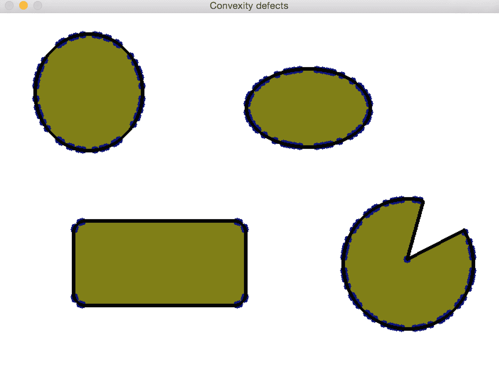

等一下，这是怎么回事？ 看起来很混乱。 我们做错了吗？ 事实证明，曲线并不是很平滑。 如果仔细观察，曲线上到处都有细小的山脊。 因此，如果仅运行凸度检测器，它将无法正常工作。

这是轮廓近似非常有用的地方。 一旦检测到轮廓，就需要对其进行平滑处理，以免脊不影响它们。 让我们继续这样做：

```py
factor = 0.01
epsilon = factor * cv2.arcLength(contour, True) 
contour = cv2.approxPolyDP(contour, epsilon, True) 
```

如果使用平滑轮廓运行前面的代码，则输出将如下所示：


# 如何检查形状？

假设您正在处理图像，并且想要遮挡特定的形状。 现在，您可能会说您将使用形状匹配来识别形状，然后将其屏蔽掉，对吗？ 但是这里的问题是我们没有可用的模板。 那么，我们如何去做呢？ 形状分析有多种形式，我们需要根据情况构建算法。 让我们考虑下图：

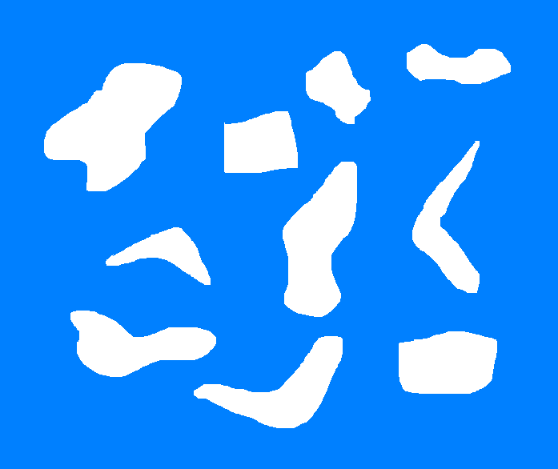

假设我们要识别所有回​​旋镖形状，然后不使用任何模板图像就将它们遮挡掉。 如您所见，该图像中还有其他各种怪异的形状，而飞旋镖形状并不是很平滑。 我们需要确定将飞旋镖形状与当前其他形状区分开的属性。 让我们考虑凸包。 如果采用每种形状的面积与凸包的面积之比，我们可以看到这可以作为区别指标。 该度量在形状分析中称为**坚固性因子**。 该度量标准对于回旋镖形状而言具有较低的值，因为将留出空白区域，如下图所示：

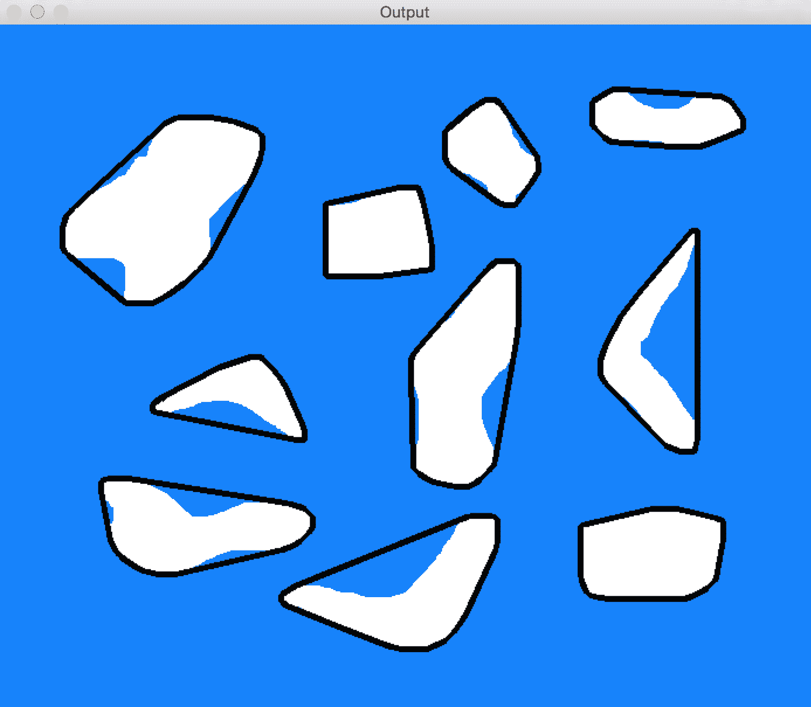

黑色边界代表凸包。 一旦为所有形状计算了这些值，我们如何将它们分开？ 我们可以仅使用固定的阈值来检测回旋镖形状吗？ 并不是的！ 我们无法使用固定的阈值，因为您永远不知道以后会遇到哪种形状。 因此，更好的方法是使用 **K 均值聚类**。 K 均值是一种无监督的学习技术，可用于将输入数据分离为 K 类。 在继续之前，您可以在[这里](https://docs.opencv.org/3.0-beta/doc/py_tutorials/py_ml/py_kmeans/py_kmeans_opencv/py_kmeans_opencv.html)快速掌握 K 均值。

我们知道我们想将形状分为两组，即回旋镖形状和其他形状。 因此，我们知道 *K 均值*中的`K`是什么。 一旦使用该值并对值进行聚类，我们将选择具有最低实体因子的聚类，这将为我们提供回旋镖形状。 请记住，这种方法仅在特定情况下有效。 如果要处理其他类型的形状，则必须使用其他指标来确保形状检测有效。 正如我们前面所讨论的，这在很大程度上取决于情况。 如果检测到形状并将其屏蔽掉，它将看起来像这样：

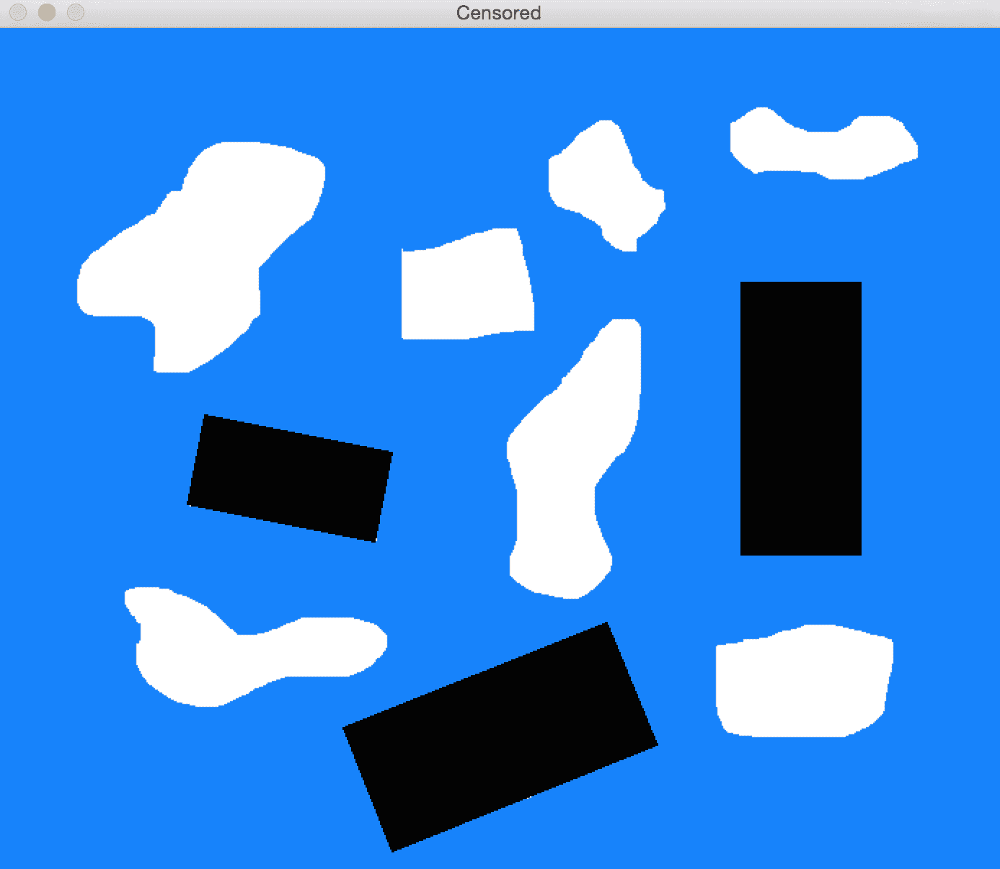

以下是执行此操作的代码：

```py
import sys 
import cv2 
import numpy as np 

if __name__=='__main__': 
    # Input image containing all the shapes 
    img = cv2.imread(sys.argv[1]) 

    img_orig = np.copy(img) 
    input_contours = get_all_contours(img) 
    solidity_values = [] 

    # Compute solidity factors of all the contours 
    for contour in input_contours: 
        area_contour = cv2.contourArea(contour) 
        convex_hull = cv2.convexHull(contour) 
        area_hull = cv2.contourArea(convex_hull) 
        solidity = float(area_contour)/area_hull 
        solidity_values.append(solidity) 

    # Clustering using KMeans 
    criteria = (cv2.TERM_CRITERIA_EPS + cv2.TERM_CRITERIA_MAX_ITER, 10, 1.0) 
    flags = cv2.KMEANS_RANDOM_CENTERS 
    solidity_values = \               np.array(solidity_values).reshape((len(solidity_values),1)).astype('float32') 
    compactness, labels, centers = cv2.kmeans(solidity_values, 2, None, criteria, 10, flags) 

    closest_class = np.argmin(centers) 
    output_contours = [] 
    for i in solidity_values[labels==closest_class]: 
        index = np.where(solidity_values==i)[0][0] 
        output_contours.append(input_contours[index]) 

    cv2.drawContours(img, output_contours, -1, (0,0,0), 3) 
    cv2.imshow('Output', img) 

    # Censoring 
    for contour in output_contours: 
        rect = cv2.minAreaRect(contour) 
        box = cv2.boxPoints(rect) 
        box = np.int0(box) 
        cv2.drawContours(img_orig, [box], 0, (0,0,0), -1) 

    cv2.imshow('Censored', img_orig) 
    cv2.waitKey()
```

# 什么是图像分割？

图像分割是将图像分成其组成部分的过程。 这是现实世界中许多计算机视觉应用程序中的重要一步。 分割图像有很多不同的方法。 分割图像时，我们会根据各种指标（例如颜色，纹理，位置等）将区域分开。 每个区域内的所有像素都有一些共同点，具体取决于我们使用的指标。 让我们看看这里的一些流行方法。

首先，我们将研究一种称为 **GrabCut** 的技术。 这是基于称为**图切割**的更通用方法的图像分割方法。 在图切方法中，我们将整个图像视为一个图，然后根据该图边缘的强度对图进行分段。 我们通过将每个像素视为一个节点来构造图形，并在节点之间构造边缘，其中边缘权重是这两个节点的像素值的函数。 只要有边界，像素值就会更高。 因此，边缘权重也将更高。 然后通过最小化图的吉布斯能量来对该图进行分段。 这类似于找到最大熵分割。 您可以在[这个页面](http://cvg.ethz.ch/teaching/cvl/2012/grabcut-siggraph04.pdf)上参考原始论文以了解更多信息。

让我们考虑下图：


让我们选择兴趣区域：


分割图像后，它将看起来像这样：


以下是执行此操作的代码：

```py
import sys
import cv2 
import numpy as np 

# Draw rectangle based on the input selection 
def draw_rectangle(event, x, y, flags, params): 
    global x_init, y_init, drawing, top_left_pt, bottom_right_pt, img_orig 

    # Detecting mouse button down event 
    if event == cv2.EVENT_LBUTTONDOWN: 
        drawing = True 
        x_init, y_init = x, y 

    # Detecting mouse movement 
    elif event == cv2.EVENT_MOUSEMOVE: 
        if drawing: 
            top_left_pt, bottom_right_pt = (x_init,y_init), (x,y) 
            img[y_init:y, x_init:x] = 255 - img_orig[y_init:y, x_init:x]
            cv2.rectangle(img, top_left_pt, bottom_right_pt, (0,255,0), 2) 

    # Detecting mouse button up event 
    elif event == cv2.EVENT_LBUTTONUP: 
        drawing = False 
        top_left_pt, bottom_right_pt = (x_init,y_init), (x,y) 
        img[y_init:y, x_init:x] = 255 - img[y_init:y, x_init:x] 
        cv2.rectangle(img, top_left_pt, bottom_right_pt, (0,255,0), 2)
        rect_final = (x_init, y_init, x-x_init, y-y_init) 

        # Run Grabcut on the region of interest 
        run_grabcut(img_orig, rect_final) 

# Grabcut algorithm 
def run_grabcut(img_orig, rect_final): 
    # Initialize the mask 
    mask = np.zeros(img_orig.shape[:2],np.uint8) 

    # Extract the rectangle and set the region of 
    # interest in the above mask 
    x,y,w,h = rect_final 
    mask[y:y+h, x:x+w] = 1 

    # Initialize background and foreground models 
    bgdModel = np.zeros((1,65), np.float64) 
    fgdModel = np.zeros((1,65), np.float64) 

    # Run Grabcut algorithm 
    cv2.grabCut(img_orig, mask, rect_final, bgdModel, fgdModel, 5, cv2.GC_INIT_WITH_RECT) 

    # Extract new mask 
    mask2 = np.where((mask==2)|(mask==0),0,1).astype('uint8') 

    # Apply the above mask to the image 
    img_orig = img_orig*mask2[:,:,np.newaxis] 

    # Display the image 
    cv2.imshow('Output', img_orig) 

if __name__=='__main__': 
    drawing = False 
    top_left_pt, bottom_right_pt = (-1,-1), (-1,-1) 

    # Read the input image 
    img_orig = cv2.imread(sys.argv[1]) 
    img = img_orig.copy() 

    cv2.namedWindow('Input') 
    cv2.setMouseCallback('Input', draw_rectangle) 

    while True: 
        cv2.imshow('Input', img) 
        c = cv2.waitKey(1) 
        if c == 27: 
            break 

    cv2.destroyAllWindows()
```

# 它是如何工作的？

我们从用户指定的种子点开始。 这是我们有兴趣的对象的边界框。 该算法在表面之下估算对象和背景的颜色分布。 该算法将图像的颜色分布表示为**高斯混合马尔可夫随机场**（**GMMRF**）。 您可以在[这个页面](http://research.microsoft.com/pubs/67898/eccv04-GMMRF.pdf)上参考详细的文章以了解有关 GMMRF 的更多信息。 我们需要对象和背景的颜色分布，因为我们将使用此知识来分离对象。 通过将最小割算法应用于 Markov 随机场，此信息可用于找到最大熵分割。 一旦有了这个，我们就可以使用图切割优化方法来推断标签。

# 分水岭算法

OpenCV 随附[分水岭算法的默认实现](https://docs.opencv.org/trunk/d3/db4/tutorial_py_watershed.html)，该理论认为，任何灰度图像都可以被视为地形表面，高强度表示山峰和丘陵，而低强度表示山谷。 该算法非常有名，并且有很多实现方式。

考虑下图：

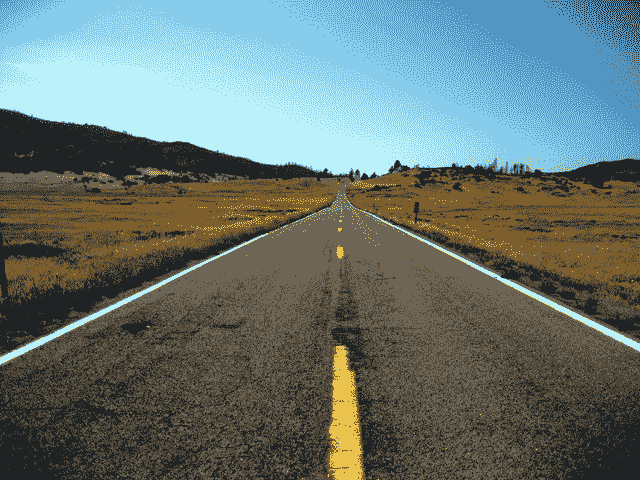

让我们根据其地形表面选择区域：

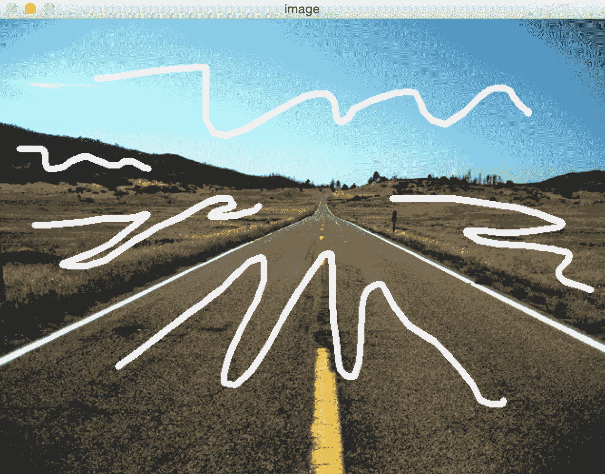

如果对此运行分水岭算法，输出将如下所示：


可以在前面给出的链接上找到示例代码，以及分水岭算法的许多其他应用程序。

# 总结

在本章中，我们学习了轮廓分析和图像分割。 我们学习了如何根据模板匹配形状。 我们了解了形状的各种不同属性，以及如何使用它们识别不同种类的形状。 我们讨论了图像分割以及如何使用基于图的方法对图像中的区域进行分割。 我们还简要讨论了分水岭的改造。

在下一章中，我们将讨论如何在实时视频中跟踪对象。