# 第 5 章。应用 3-全景查看器

在本章中，我们将开始开发新的应用程序。 该应用程序的目标是将两个图像拼接在一起以形成全景视图。 我们将介绍图像特征的概念及其重要性，然后将它们付诸实践。

我们可以总结如下主题：

*   特征检测
*   功能说明
*   特征匹配
*   图像拼接

# 图像功能

在本节中，我们将了解图像特征的含义以及它们为何重要的原因。

想象一下，遇见一个人并立即检测到该人的脸（眼睛，鼻子和许多其他人脸特征）的情况。 问题是我们该怎么做？ 我们检测这些人脸特征所遵循的算法是什么？ 我们如何描述它们？ 此外，当我们看到另一个具有相同人脸特征的人时，我们可以轻松地发现两个人之间的匹配特征。 我们用来衡量这种相似性的指标是什么？

我们仅遵循检测，描述和匹配特征的过程。 从计算机的角度来看，我们希望该过程能够找到可以重复提取，充分表示和准确匹配的特征。

这些特征被认为是良好的特征，要衡量特征的优劣，我们应考虑其鲁棒性和不变性（尤其是缩放和旋转不变性；例如，我们的人脸特征（例如眼睛）不变） 脸部比例；无论脸是大还是小，您都可以轻松检测到眼睛在哪里）。 通常，为了实现这种鲁棒性，我们将检测到的特征的质量属性与用于描述特征的方法的质量属性结合起来考虑。

例如，我们将看到一些特征检测器，即**哈里斯**和 **FAST**，以单尺度（单尺度）查找特征，而其他特征检测器（例如 **ORB**）查找 通过构建所谓的比例尺空间，在多比例尺上设置要素。

我发现这是一个很好的机会，它介绍了比例尺空间的基本概念，即使用不同的比例尺缩小方法来构建图像金字塔。 最简单的方法是删除 X 和 Y 方向上的所有其他像素。 因此，例如，如果您有一个`100x100`的图像，则从 x 和 y 中删除所有其他像素将生成`100x100`的图像。 您一直重复此步骤，直到达到程序可以使用的最小可接受范围。


## 特征检测器

首先要问的是，在计算机视觉的背景下，哪些功能是好的功能？ 为了回答这个问题，让我们以山顶的图像为例。 我们可以开始查看这座山脉（矩形 2）边界内的要素，但是问题是无法重复找到或无法充分描述这些要素，因此它们将很难匹配。

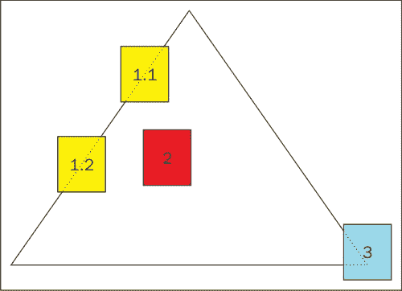

另一个要寻找的候选人是山的边缘。 我们已经在第 3 章，“应用 2-软件扫描程序”中学习了如何检测边缘，因此可以轻松找到这种类型的功能。 但是，问题在于如何唯一地描述它们，因为如果查看矩形 1.1 和 1.2，您很容易将它们混淆为同一条边。 这个问题被称为孔径问题，同样，将很难匹配。

矩形 3 呢？ 这个矩形看起来是一个不错的选择，因为如果您沿任何方向移动它，它下面的区域都会看起来不同，因此是唯一的。 基于此，我们可以说转角是要考虑的好特征。

### 了解哈里斯角点检测器

我们回答了哪些功能是好的功能的问题，并给出了一个好的功能的示例。 现在，我们需要找到一种方法来轻松检测它们。 因此，让我们考虑山顶图像。 如果我们开始使用正方形窗口扫描图像，则角落将具有最大的强度变化，因为与边缘不同，两个正交方向将发生变化，而边缘仅沿一个方向（x 或 y）发生变化 。

这是哈里斯角点探测器背后的基本思想。 我们试图找到一个补丁，如果我们在该补丁内以不同的方向移动扫描窗口，它将在强度上产生最大的变化或变化。

哈里斯角检测器是旋转不变的。 但是，它不是尺度不变的。

#### UI 定义

创建具有空白活动`PanoActivity`的新应用程序并添加从设备库加载图像的功能以及加载 OpenCV 库之后，我们将在菜单项中添加第一个菜单项以执行 Harris 角点检测器 加载的图片。 转到`res/menu/pano.xml`文件并打开它以包含以下菜单项：

```java
<itemandroid:id="@+id/action_harris" 
  android:orderInCategory="2" 
  android:title="@string/action_harris">
</item>
```

#### 使用哈里斯角点检测器

OpenCV 为您提供了不同的兴趣点或特征检测器，并且该 API 具有非常简单的界面，可用于类`org.opencv.features2d`。 `FeatureDetector`具有工厂方法，并且给定检测器 ID，该工厂方法将返回与此 ID 对应的特征检测器的实例。

我们更新`onOptionsItemSelected`以处理 Harris 菜单项：

```java
if(sampledImage==null)
{
  Context context = getApplicationContext();
  CharSequence text = "You need to load an image first!";
  int duration = Toast.LENGTH_SHORT;

  Toast toast = Toast.makeText(context, text, duration);
  toast.show();
  return true;
}

Mat greyImage=new Mat();
MatOfKeyPoint keyPoints=new MatOfKeyPoint();
Imgproc.cvtColor(sampledImage, greyImage, Imgproc.COLOR_RGB2GRAY);

FeatureDetector detector = FeatureDetector.create(FeatureDetector.HARRIS);
detector.detect(greyImage, keyPoints);

Features2d.drawKeypoints(greyImage, keyPoints, greyImage);

displayImage(greyImage);
```

步骤非常简单，如下所示：

1.  我们首先将输入图像转换为灰度并实例化关键点对象的矩阵：

    ```java
    Mat greyImage=new Mat();
    MatOfKeyPoint keyPoints=new MatOfKeyPoint();
    Imgproc.cvtColor(sampledImage, greyImage, Imgproc.COLOR_RGB2GRAY);
    ```

2.  我们使用`FeatureDetector.create`工厂方法实例化我们选择的特征检测器，并传递其 ID：

    ```java
    FeatureDetector detector = FeatureDetector.create(FeatureDetector.HARRIS);

    ```

3.  使用以下命令调用`detect`方法：

    ```java
    detector.detect(greyImage, keyPoints);

    ```

    调用 detect 方法以查找具有以下参数的兴趣点：

    *   代表输入图像的 Mat 对象
    *   `MatOfKeyPoint`对象，用于存储检测到的兴趣点
4.  为了显示检测到的兴趣点，我们调用`Feature2d.drawKeypoints()`：

    ```java
    Features2d.drawKeypoints(greyImage, keyPoints, greyImage);

    ```

    我们使用以下参数调用`Feature2d.drawKeypoints()`：

    *   Mat 对象作为输入图像
    *   要绘制的`MatOfKeyPoint`
    *   输出图像的 Mat 对象
5.  最后，显示检测到兴趣点的图像：

    ```java
    displayImage(greyImage);
    ```

#### 调用本地哈里斯角点检测器

在许多情况下，您的应用程序将需要实时响应，例如检测手机摄像头的视频源中的功能。 仅依靠 Java 调用可能无法提供所需的性能，因此会错过最后期限。 在这种情况下，每秒超过 20 帧； 这就是为什么我觉得这是一个向您介绍本机 OpenCV API 的好机会。 您不需要熟悉 C++。 但是，了解语言结构将非常有帮助。

我们需要做的第一件事是在项目中添加 C++ 支持。

##### 在 Eclipse 中使用本机 OpenCV 库

1.  在项目浏览器中的项目名称上单击鼠标右键。
2.  导航至**新建 | 其他 | C/C++ | 转换为 C/C++ 项目**。
3.  选择“Makefile 项目”，选择“其他工具链”，然后单击“完成”：

    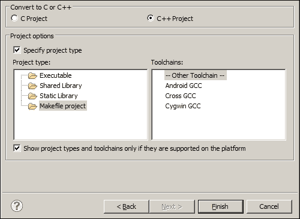

4.  定义环境变量`NDKROOT`，指向 NDK 的主文件夹，例如`C:\NVPACK\android-ndk-r10c`。
5.  在项目浏览器中的项目名称上单击鼠标右键，然后选择**属性**。
6.  单击树节点 **C/C++ 构建**。 在**构建器设置**选项卡中，清除**使用默认构建命令**复选框，然后在**构建命令**文本框中输入以下内容：`${NDKROOT}/ndk-build.cmd`。
7.  转到“行为”选项卡，然后在“工作台构建行为”组中，选中“基于资源保存构建”，并清除“制作构建目标”文本框。 清除“构建（增量构建）”复选框的“制作构建目标”文本框：

    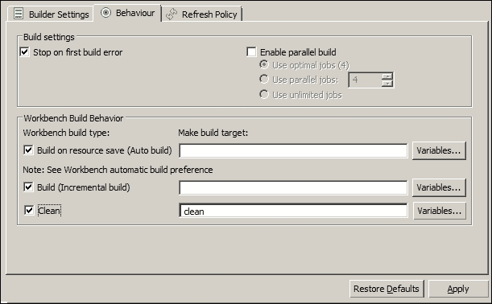

8.  此时，调用 NDK 生成项目将失败，并且要解决此问题，我们需要在项目文件夹下创建一个新文件夹，并将其命名为`jni`。
9.  在此文件夹中，我们将有三个文件：

    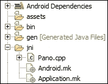

10.  `Android.mk`的内容应如下：

    ```java
    LOCAL_PATH := $(call my-dir)

    include$(CLEAR_VARS)

    # Must include the opencv.mk file, change the path accordingly include C:\NVPACK\OpenCV-2.4.8.2-Tegra-sdk\sdk\native\jni\OpenCV-tegra3.mk

    # Name the library and list the cpp source files
    LOCAL_MODULE    := Pano
    LOCAL_SRC_FILES := Pano.cpp
    LOCAL_LDLIBS +=  -llog -ldl
    include$(BUILD_SHARED_LIBRARY)
    ```

11.  `Application.mk`的含量应如下：

    ```java
    APP_PLATFORM := android-9
    APP_ABI := armeabi-v7a
    APP_STL := gnustl_static
    APP_CPPFLAGS := -frtti -fexceptions
    ```

12.  对于`cpp`文件，它可以为空，并且仅包含一个标题：

    ```java
    #include <jni.h>
    ```

13.  生成项目。
14.  我们需要包括一些目录，以便我们可以编写 C++ 代码并使用**标准模板库**（**STL**）和 OpenCV。 为此，请右键单击“项目名称 | 属性 | C/C++ 常规 | 路径和符号”。
    ### 注意

    STL 为您提供了一组现成的类，它们实现了不同的数据结构和算法。

15.  选择 **GNU C++**，添加以下目录，然后根据您的安装更改路径：

    ```java
    ${NDKROOT}/platforms/android-9/arch-arm/usr/include
    ${NDKROOT}/sources/cxx-stl/gnu-libstdc++/4.6/include
    ${NDKROOT}/sources/cxx-stl/gnu-libstdc++/4.6/libs/ armeabi-v7a/include
    C:\NVPACK\OpenCV-2.4.8.2-Tegra-sdk\sdk\native\jni\include
    ```

##### 在 Android Studio 中使用本机 OpenCV 库

1.  在项目视图中，右键单击应用程序节点，然后选择**打开模块设置**或按`F4`。
2.  选择“SDK 位置”。 在“Android NDK 位置”中，选择 NDK 所在的目录。 请注意，我们将使用实验性 Gradle 插件版本 2.5 来构建项目； 因此，我们需要 NDK 版本 r10e：

    

3.  如果您使用的是 Android Studio 1.3.2，则需要更新`gradle-wrapper.properties`并更改分发 URL，如下所示：

    ```java
    distributionUrl=https\://services.gradle.org/distributions/gradle-2.5-all.zip
    ```

4.  在项目的`build.gradle`文件中，如下更新依赖项类路径：

    ```java
    dependencies {classpath 'com.android.tools.build:gradle-experimental:0.2.0'}
    ```

5.  在项目文件夹中，在`app\src\main`下创建两个文件夹`jni`和`jniLibs`。
6.  在`jni`文件夹中，创建一个新文件，并将其命名为`Pano.cpp`。
7.  现在，导航到`<OpenCV4AndroidSDKFolder>\sdk\native\libs\`，并将所有文件夹复制到新创建的`jniLibs`文件夹中。 您的项目树应如下所示：

    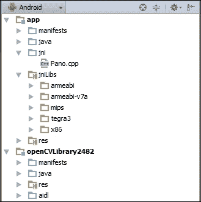

8.  我们需要更新`build.gradle`中的**领域特定语言**（**DSL**），以便我们的模块可以与 Gradle 2.5 一起使用。 为此，请更新构建文件以使其与以下内容匹配，并保持依赖方法不变。 请注意，您将需要更新绝对路径以匹配您的安装：

    ```java
    applyplugin: 'com.android.model.application' model {
      android {
        compileSdkVersion = 23 buildToolsVersion = "23.0.1" defaultConfig.with {
          applicationId = "com.app3.pano" minSdkVersion.apiLevel = 15 targetSdkVersion.apiLevel = 19 versionCode = 1 versionName = "1.0"
        }
      }
      //Make sure to build with JDK version 7
      compileOptions.with {
        sourceCompatibility=JavaVersion.VERSION_1_7 targetCompatibility=JavaVersion.VERSION_1_7
      }
      android.ndk {
        moduleName = "Pano" ldLibs += ['log']
        cppFlags += "-std=c++11" cppFlags += "-fexceptions" cppFlags  += "-I${file("<OpenCV4AndroidSDK_Home>/sdk/native/jni/include")}".toString()
        cppFlags  += "-I${file("<OpenCV4AndroidSDK_Home>/sdk/native/jni/include/opencv")}".toString()
        ldLibs += ["android", "EGL", "GLESv2", "dl", "log", "z"]// , "ibopencv_core" stl = "gnustl_shared}
        android.buildTypes {
          release {
            minifyEnabled= false proguardFiles+= file('proguard-rules.pro')
          }
        }
        android.productFlavors {
          create("arm") {
            ndk.with {
              abiFilters += "armeabi" File curDir = file('./')
              curDir = file(curDir.absolutePath)
              String libsDir = curDir.absolutePath+"\\src\\main\\jniLibs\\armeabi\\" //"-L" + ldLibs += libsDir + "libopencv_core.a" ldLibs += libsDir + "libopencv_imgproc.a" ldLibs += libsDir + "libopencv_java.so" ldLibs += libsDir + "libopencv_features2d.a"
            }
          }
          create("armv7") {
            ndk.with {
              abiFilters += "armeabi-v7a" File curDir = file('./')
              curDir = file(curDir.absolutePath)
              String libsDir = curDir.absolutePath+"\\src\\main\\jniLibs\\armeabi-v7a\\" //"-L" + ldLibs += libsDir + "libopencv_core.a" ldLibs += libsDir + "libopencv_imgproc.a" ldLibs += libsDir + "libopencv_java.so" ldLibs += libsDir + "libopencv_features2d.a" 
            }
          }
          create("x86") {
            ndk.with {
              abiFilters += "x86"
            }
          }
          create("mips") {
            ndk.with {
              abiFilters += "mips"
            }
          }
          create("fat") {
          }
        }
      }
    }
    ```

9.  最后，我们需要为 OpenCV 模块更新`build.gradle`文件，以便与以下内容匹配：

    ```java
    apply plugin: 'com.android.model.library' model {
      android {
        compileSdkVersion = 23 buildToolsVersion = "23.0.1" defaultConfig.with {
          minSdkVersion.apiLevel = 15 targetSdkVersion.apiLevel = 19
        }
      }
      //Make sure to build with JDK version 7
      compileOptions.with {
        sourceCompatibility=JavaVersion.VERSION_1_7 targetCompatibility=JavaVersion.VERSION_1_7
      }
      android.buildTypes {
        release {
          minifyEnabled= false proguardFiles+= file('proguard-rules.pro')
        }
      }
    }
    ```

10.  现在，同步并构建项目。

##### 处理本机部分

无论您选择哪种 IDE ，都可以按照以下步骤将本机代码添加到应用程序中：

1.  打开`Pano.cpp`并添加以下代码； 我们稍后将通过代码：

    ```java
    #include<jni.h>
    #include<opencv2/core/core.hpp>
    #include<opencv2/imgproc/imgproc.hpp>
    #include<opencv2/features2d/features2d.hpp>
    #include<vector>

    extern"C" {

      JNIEXPORT void JNICALL Java_com_app3_pano_PanoActivity_FindHarrisCorners(JNIEnv*, jobject, jlong addrGray, jlong addrRgba)
      {
        cv::Mat& mGr  = *(cv::Mat*)addrGray;
        cv::Mat& mRgb = *(cv::Mat*)addrRgba;

        cv::Mat dst_norm;
        cv::Mat dst = cv::Mat::zeros(mGr.size(),CV_32FC1);

        //the size of the neighbor in which we will check 
        //the existence of a corner
        int blockSize = 2;
        //used for the Sobel kernel to detect edges before 
        //checking for corners
        int apertureSize = 3;
        // a free constant used in Harris mathematical formula
        double k = 0.04;    
        //corners response threshold
        float threshold=150;

     cv::cornerHarris( mGr, dst, blockSize, apertureSize, k, cv::BORDER_DEFAULT );

        cv::normalize( dst, dst_norm, 0, 255, cv::NORM_MINMAX, CV_32FC1, cv::Mat() );

        for( unsignedint i = 0; i < dst_norm.rows; i++ )
        {
          float * row=dst_norm.ptr<float>(i);
          for(int j=0;j<dst_norm.cols;j++)
          {
            if(row[j]>=threshold)
            {
              cv::circle(mRgb, cv::Point(j, i), 10, cv::Scalar(255,0,0,255));
            }
          }
        }
      }
    }
    ```

2.  我们在`PanoActivity`类中声明了本机方法，以便稍后可以调用本机代码：

    ```java
    public native void FindHarrisCorners(long matAddrGr, long matAddrRgba);
    ```

3.  我们构建本机库并在活动中声明本机方法，但是当我们尝试调用本机方法时，会收到`java.lang.UnsatisfiedLinkError`，因为尚未加载本机库。 为此，我们更改`onManagerConnected()`方法以在 OpenCV 初始化后加载本机库：

    ```java
    private BaseLoaderCallback mLoaderCallback = new BaseLoaderCallback(this) {
      @Override
      public void onManagerConnected(int status) {
        switch (status) {
          case LoaderCallbackInterface.SUCCESS:
          {
            Log.i(TAG, "OpenCV loaded successfully");
            // Load native library after(!) OpenCV initialization
     System.loadLibrary("Pano");
          } break;

          default:
          {
            super.onManagerConnected(status);
          } break;
        }
      }
    };
    ```

4.  现在，我们准备通过菜单项使用本机库来触发本机哈里斯角检测器。 因此，打开`res/menu/pano.xml`并添加以下菜单项：

    ```java
    <itemandroid:id="@+id/action_nativeHarris" 
      android:orderInCategory="2" 
      android:title="@string/action_nativeHarris">
    </item>
    ```

5.  在`PanoActivity`中，更改`onOptionsItemSelected()`以处理本机情况：

    ```java
    else if(id==R.id.action_nativeHarris)
    {
      if(sampledImage==null)
      {
        Context context = getApplicationContext();
        CharSequence text = "You need to load an image first!";
        int duration = Toast.LENGTH_SHORT;

        Toast toast = Toast.makeText(context, text, duration);
        toast.show();
        return true;
      }

      Mat greyImage=new Mat();
      Imgproc.cvtColor(sampledImage, greyImage, Imgproc.COLOR_RGB2GRAY);

      FindHarrisCorners(greyImage.getNativeObjAddr(),sampledImage.getNativeObjAddr());

      displayImage(sampledImage);
    }
    ```

我们列出了调用 Harris 角点检测器的本机实现所需的步骤； 但是，我们仍然需要仔细阅读 C++ 代码的细节，以了解我们所做的事情，以便您可以扩展并基于在此处学习的思想。 当然，具有 C++ 语言构造的基本思想将非常有益。

1.  我们首先包含所需的头文件列表：

    ```java
    #include<opencv2/core/core.hpp>
    #include<opencv2/imgproc/imgproc.hpp>
    #include<opencv2/features2d/features2d.hpp>
    #include<vector>
    ```

2.  按照此命名约定`Java_Fully_Qualified_Class_Name_MethodName`声明我们将使用的功能。 我们在`PanoActivity`中声明的方法仅采用两个参数：灰度和彩色图像的地址； 但是，本机方法需要四个。 前两个始终在任何 JNI 方法声明中使用。 后两个对应于我们发送的地址（在 Java 中`jlong`映射到`long`）：

    ```java
    JNIEXPORT void JNICALL Java_com_app3_pano_PanoActivity_FindHarrisCorners(JNIEnv*, jobject, jlong addrGray, jlong addrRgba)
    ```

3.  我们将参考发送给 Mat 参考，其中一个用于灰度图像，另一个用于彩色图像：

    ```java
    cv::Mat& mGr  = *(cv::Mat*)addrGray;
    cv::Mat& mRgb = *(cv::Mat*)addrRgba;
    ```

4.  我们声明并初始化将用于检测角点的变量的列表：

    ```java
    cv::Mat dst_norm;
    cv::Mat dst = cv::Mat::zeros(mGr.size(),CV_32FC1);
    int blockSize = 2;
    intapertureSize = 3;
    double k = 0.04;
    float threshold=150;
    ```

5.  我们将哈里斯角点检测器的本地实现称为“实现”，并将角点的响应归一化为`0`和`255`之间：

    ```java
    cv::cornerHarris( mGr, dst, blockSize, apertureSize, k, cv::BORDER_DEFAULT );
    cv::normalize( dst, dst_norm, 0, 255, cv::NORM_MINMAX, CV_32FC1, cv::Mat() );
    ```

6.  我们在归一化的角点处循环并在检测到的角点处绘制一个圆，以防其响应大于阈值：

    ```java
    for( unsignedint i = 0; i < dst_norm.rows; i++ )
    {
      float * row=dst_norm.ptr<float>(i);
      for(int j=0;j<dst_norm.cols;j++)
      {
        if(row[j]>=threshold)
        {
        cv::circle(mRgb, cv::Point(j, i), 10, cv::Scalar(255,0,0,255));
        }
      }
    }
    ```

    

    左图是使用 Java 包装程序的 HCD，右图是本机 HCD

### 了解 FAST 角点检测器

应用于实时应用时，在速度方面会有更好的检测器。 在本节中，我们将描述 FAST 角点检测器的工作原理。

让我们考虑一个像素 P。如果我们在像素 P 的圆形邻域中测试 16 个像素，并且其中 12 个像素的强度大于或小于 P 的强度加/减 a，则说 P 是一个潜在的兴趣点或角。 阈。

该过程的计算量很大，因此为了加快检测速度，提出了另一种测试方法。 该算法首先在特定位置（1、9、5、13）仅测试 4 个像素； 如果其中三个大于或小于 P 的强度加/减阈值，则继续其他 8 个像素； 否则，将丢弃此像素：

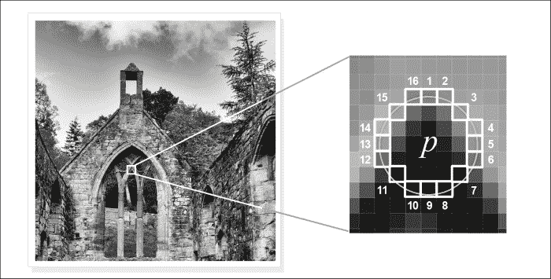

#### UI 定义

将以下菜单项添加到`res/menu/pano.xml`：

```java
<itemandroid:id="@+id/action_fast"
  android:orderInCategory="4"
  android:title="@string/action_fast">
</item>
```

#### 使用 FAST 角点检测器

打开`PanoActivity`并编辑`onOptionsItemSelected()`以包括以下情况：

```java
else if(id==R.id.action_fast)
{
  if(sampledImage==null)
  {
    Context context = getApplicationContext();
    CharSequence text = "You need to load an image first!";
    int duration = Toast.LENGTH_SHORT;

    Toast toast = Toast.makeText(context, text, duration);
    toast.show();
    return true;
  }

  Mat greyImage=new Mat();
 Imgproc.cvtColor(sampledImage, greyImage, Imgproc.COLOR_RGB2GRAY);

MatOfKeyPoint keyPoints=new MatOfKeyPoint();
  FeatureDetector detector=FeatureDetector.create(FeatureDetector.FAST);

  detector.detect(greyImage, keyPoints);
  Features2d.drawKeypoints(greyImage, keyPoints, greyImage);  
  displayImage(greyImage);
}
```

如前所述，OpenCV 具有非常简单的界面和工厂方法来构建不同的检测器。 哈里斯探测器和 FAST 之间的唯一区别是我们发送给工厂方法的以下参数：

```java
FeatureDetector detector = FeatureDetector.create(FeatureDetector.FAST);

```

其余代码完全相同。

#### 使用本机 FAST

在本节中，我们将向`PanoActivity`类添加另一个本机方法，以将本机实现调用到 FAST 角点检测器：

1.  打开活动类并添加以下声明：

    ```java
    public native void FindFastFeatures(long matAddrGr, long matAddrRgba);
    ```

    该方法有两个参数。 第一个是灰度图像的地址，第二个是彩色版本的地址。

2.  将以下方法添加到`Pano.cpp`文件中：

    ```java
    JNIEXPORT void JNICALL Java_com_app3_pano_PanoActivity_FindFastFeatures(JNIEnv*, jobject, jlong addrGray, jlong addrRgba)
    {
      cv::Mat& mGr  = *(cv::Mat*)addrGray;
      cv::Mat& mRgb = *(cv::Mat*)addrRgba;
      std::vector<cv::KeyPoint> v;

     cv::FastFeatureDetector detector(50);
     detector.detect(mGr, v);
      for( unsignedint i = 0; i < v.size(); i++ )
      {
        const cv::KeyPoint& kp = v[i];
        cv::circle(mRgb, cv::Point(kp.pt.x, kp.pt.y), 10, cv::Scalar(255,0,0,255));
      }
    }
    ```

    在前面的代码中，我们首先实例化关键点的向量和阈值为`50`的`FastFeatureDetector`对象，并通过传入灰度图像和关键点的空向量来调用`detection`方法。 然后，我们为每个检测到的关键点绘制一个圆圈。

3.  我们在`res/menu/pano.xml`中添加了另一个菜单项：

    ```java
    <itemandroid:id="@+id/action_nativefast" 
      android:orderInCategory="5" 
      android:title="@string/action_fastnative">
    </item>
    ```

4.  最后，打开`PanoActivity`并编辑`onOptionsItemSelected()`以包含以下情况：

    ```java
    else if(id==R.id.action_nativefast)
    {
      if(sampledImage==null)
      {
        Context context = getApplicationContext();
        CharSequence text = "You need to load an image first!";
        int duration = Toast.LENGTH_SHORT;

        Toast toast = Toast.makeText(context, text, duration);
        toast.show();
        return true;
      }

      Mat greyImage=new Mat();
      Imgproc.cvtColor(sampledImage, greyImage, Imgproc.COLOR_RGB2GRAY);
     FindFastFeatures(greyImage.getNativeObjAddr(),sampledImage.getNativeObjAddr());

      displayImage(sampledImage);
    }
    ```

    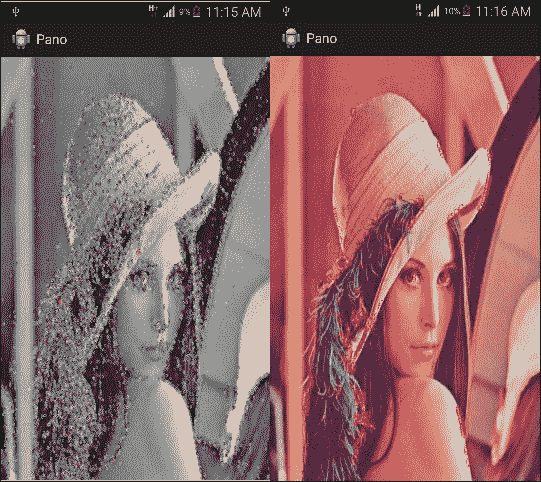

    左图是使用 Java 包装程序的 FAST，右图是本机 FAST

### 了解 ORB 特征检测器

OpenCV 实验室的另一个重要检测器，也是一个描述符，是两个非常有名但已申请专利的算法（**比例不变特征变换**（**SIFT**）和**加速鲁棒特征**（**SURF**）的替代物 ORB。 要使用 SIFT 和 SURF，您需要付费； 但是，ORB 在计算成本和匹配性能方面提供了一种免费的良好选择。

在本节中，我们将讨论 ORB 的检测器部分。 它主要使用我们在上一节中看到的 FAST 算法，并添加了以下一些重要补充：

*   ORB 首先使用 FAST 算法检测兴趣点或角点
*   它使用哈里斯（Harris）来为每个角指定分数（基于检测到的角附近的强度变化）
*   它对计分的兴趣点进行排序，并且仅考虑前 N 个角
*   它使用图像金字塔生成多尺度兴趣点，而不是 FAST 检测到的单尺度兴趣点
*   它计算兴趣点邻域的强度加权质心
*   该算法利用兴趣点和质心计算此向量方向，并将其指定为兴趣点方向； 这一步对于算法的描述部分很重要

#### UI 定义

将以下菜单项添加到`res/menu/pano.xml`：

```java
<itemandroid:id="@+id/action_orb"
  android:orderInCategory="6"
  android:title="@string/action_orb">
</item>
```

#### 使用 ORB 特征检测器

我们需要在`PanoActivity`类中编辑`onOptionsItemSelected()`以包括以下情况：

```java
else if(id==R.id.action_orb)
{
  if(sampledImage==null)
  {
    Context context = getApplicationContext();
    CharSequence text = "You need to load an image first!";
    int duration = Toast.LENGTH_SHORT;

    Toast toast = Toast.makeText(context, text, duration);
    toast.show();
    return true;
  }

  Mat greyImage=new Mat();
  Imgproc.cvtColor(sampledImage, greyImage, Imgproc.COLOR_RGB2GRAY);
  MatOfKeyPoint keyPoints=new MatOfKeyPoint();

 FeatureDetector detector = FeatureDetector.create(FeatureDetector.ORB);

  detector.detect(greyImage, keyPoints);
  Features2d.drawKeypoints(greyImage, keyPoints, greyImage);  
  displayImage(greyImage);
}
```

在不同特征检测器之间切换非常简单。 我们只是将 ORB 的 ID 传递给 factory 方法，然后调用 detect 方法。

#### 使用本机 ORB

在本节中，我们将使用 ORB 检测器的本机实现，并将预处理步骤移至 CPP 文件，以便将 JNI 调用的开销减少到仅一个调用：

1.  打开`PanoActivity`类并添加以下声明：

    ```java
    public native void FindORBFeatures(long matAddrRgba, int featuresNumber);
    ```

    该方法带有两个参数，即本地对象的地址和要检测的最大特征数。

2.  在`Pano.cpp`中，添加以下方法实现：

    ```java
    JNIEXPORT void JNICALL Java_com_app3_pano_PanoActivity_FindORBFeatures(JNIEnv*, jobject, jlong addrRgba, jint featuresNumber)
    {
      cv::Mat& mRgb = *(cv::Mat*)addrRgba;
      cv::Mat grayImg;
      std::vector<cv::KeyPoint> v;

     cv::cvtColor(mRgb,grayImg,cv::COLOR_RGBA2GRAY);

     cv::OrbFeatureDetector detector(featuresNumber);

     detector.detect(grayImg, v);

     cv::drawKeypoints(grayImg,v,mRgb,cv::Scalar::all(-1),cv::DrawMatchesFlags::DRAW_RICH_KEYPOINTS);
    }
    ```

    我们将将彩色图像转换为`Pano.cpp`的预处理步骤进行了处理。 我们通过调用`cv::cvtColor`并传递输入图像，输出图像和映射代码来实现。 然后，我们实例化一个`ORBFeatureDetector`对象，该对象的最大特征数量等于我们发送的参数。

    在下一行，我们调用`detect`方法。 最后，我们使用`cv::drawKeypoints`方法绘制关键点，并传递输入图像（用于检测关键点的图像），`KeyPoint`的向量，输出图像，用于绘制关键点的颜色（`using cv::Scalar::all(-1)`表示 （使用的颜色将是随机的），最后是标志用作每个关键点的圆，其大小等于关键点大小并绘制关键点方向。

3.  将以下菜单项添加到`res/menu/pano.xml`：

    ```java
    <itemandroid:id="@+id/action_nativeorb" 
      android:orderInCategory="7" 
      android:title="@string/action_orbnative">
    </item>
    ```

4.  最后，打开`PanoActivity`并编辑`onOptionsItemSelected()`以包含以下情况：

    ```java
    else if(id==R.id.action_nativeorb)
    {
      if(sampledImage==null)
      {
        Context context = getApplicationContext();
        CharSequence text = "You need to load an image first!";
        int duration = Toast.LENGTH_SHORT;

        Toast toast = Toast.makeText(context, text, duration);
        toast.show();
        return true;
      }

      Mat copy=sampledImage.clone();
     FindORBFeatures(copy.getNativeObjAddr(),100);
      displayImage(copy);  
    }
    ```

    

    左图是使用 Java 包装程序的 ORB，右图是具有特征比例和方向的本机 ORB

## 功能描述和匹配

使用图像特征过程的第二步是特征描述。 特征描述符用于为您提供有关兴趣点的更多信息，并在检测到的特征的局部区域/邻域中进行计算。

可以按照局部区域的形状（矩形或圆形），采样模式（密集采样，其中局部区域中的所有像素都将对特征描述或稀疏采样做出贡献）对特征描述符进行分类 ）和频谱（二进制，其中描述向量将仅为 1 和 0 或使用任何标量值或其他值的标量）。

OpenCV 提供了属于不同类别的功能描述符。 但是，在本节中，由于 SIFT 和 SURF（密集和标量）描述符是专利算法，您必须付费才能使用它们，因此，我们仅关注稀疏的二进制描述符（也称为局部二进制描述符）。

使用像素对采样方法，无论描述符的形状如何，都可以计算局部二进制描述符，在此方法中，比较选定的像素对以生成表示描述向量的二进制字符串。 例如，如果我们有一对像素（P1，P2），则比较 P1 和 P2 的强度。 如果 P1 的强度大于 P2，则将`1`放入描述向量中，否则将插入`0`。

### 了解 Brief 和 ORB 功能描述符

**二进制鲁棒独立基本特征**（**BRIEF**）描述符被认为是提出的最简单也是第一个本地二进制描述符。 为了使用长度为 N 的描述向量描述兴趣点，该算法通过几种随机方法（均匀，高斯等）在`31x31`色块区域中选择了 N 个随机像素对，并将它们进行比较以构造二进制字符串。

对于 ORB，描述符通过将兴趣点转向规范方向（假设我们在检测阶段知道了兴趣点主导方向）将方向添加到 BRIEF，然后计算描述。 结果，我们实现了一些旋转不变性。 例如，如果兴趣点主导方向为 90 度，则在使用 ORB 对其进行描述之前，将兴趣点及其邻域旋转为向上指向（方向= 0），然后描述该兴趣点，以便实现旋转 不变性。

对于像素对采样方法，ORB 离线学习了如何选择像素对，以最大程度地提高方差并减小相关性，以便每个选择的像素都向描述符添加新信息。

使用随机化方法（BRIEF）或学习的采样方法（ORB）选择像素对会导致非对称描述符形状，如下所示：

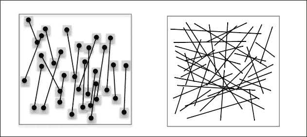

### 了解 BRISK 功能描述符

**二进制鲁棒不变可扩展关键点**（**BRISK**）描述符建立在以四个同心环排列的 60 个点上，因此，点对采样形状为圆形且对称。 每个点代表一个圆形采样区域（用于选择采样对），随着我们远离兴趣点，该区域的大小会增加。

为了计算方向，使用高斯过滤器对每个采样区域进行平滑处理，然后计算局部梯度。 采样对分为两组：长段，两对之间的距离大于某个阈值，并与局部梯度一起使用以计算方向角，以引导兴趣点，从而实现旋转不变性。 第二类是短段，其中两对之间的距离低于另一个阈值，并用于通过比较 512 对来构造 512 位二进制描述符。 下图描述了 BRISK 采样区域的分布：

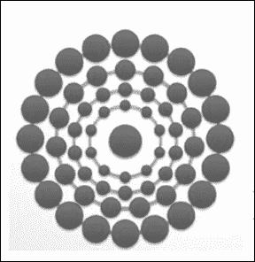

### 了解 FREAK 功能描述符

**快速视网膜关键点**（**FREAK**）描述符的圆形形状是基于人的视网膜系统，其中受体细胞的密度在中心最高，而随着我们的降低 走开。 对于采样模式，使用离线训练算法学习最佳像素对，以最大化点对方差并最小化相关性。

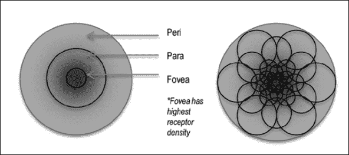

### 匹配功能

一旦确定了适合您需要的描述符上的，就需要选择一个距离函数来确定特征匹配。 根据您选择的描述符，有很多距离函数可以使用。 对于本地二进制特征，最喜欢的选择是**汉明距离**以测量两个等长二进制字符串之间的差异。 该操作非常高效且快速，因为它可以使用机器语言指令或 XOR 操作后跟一个位计数来执行。

### 使用功能匹配

在本部分中，我们将更新应用程序，以便您可以将具有不同描述符的不同检测器混合使用，以找到匹配的功能。

#### UI 定义

我们将在应用程序菜单中定义两个组。 一个用于我们使用的检测器集合，另一个用于描述符的集合。 我们还将添加一个菜单项，您可以在其中选择要在给定场景中找到的对象。 打开`res/menu/pano.xml`并添加以下项目：

```java
<item android:orderInCategory="8" android:id="@+id/detector" android:title="@string/list_detector">
  <menu><group android:checkableBehavior="single">
    <item android:id="@+id/harris_check"
      android:title="@string/action_harris"/>
    <item android:id="@+id/fast_check"
      android:title="@string/action_fast" android:checked="true"/>
    <item android:id="@+id/orbD_check"
      android:title="@string/action_orb" />
  </group></menu>
</item>

<item android:orderInCategory="9" android:id="@+id/descriptor" android:title="@string/list_descriptor">
  <menu><group android:checkableBehavior="single">
    <item android:id="@+id/BRIEF_check"
      android:title="@string/action_brief"/>
    <item android:id="@+id/ORB_check"
      android:title="@string/action_orb" android:checked="true"/>
    <item android:id="@+id/BRESK_check"
      android:title="@string/action_brisk"/>
    <item android:id="@+id/FREAK_check"
      android:title="@string/action_freak"/>
  </group></menu>
</item>

<item android:id="@+id/action_match"
  android:orderInCategory="10"
  android:title="@string/action_match">
</item>

<item
  android:id="@+id/action_selectImgToMatch"
  android:orderInCategory="1"
  android:showAsAction="never"
  android:title="@string/action_selectImgToMatch"/>
```

#### 在场景中查找对象

我们将按照此过程在给定场景中找到对象。 首先，加载场景，然后加载对象图像，最后选择 match。 要执行匹配过程，我们编辑`onOptionsItemSelected()`以包括以下情况：

```java
else if(id==R.id.action_match)
{
  if(sampledImage==null || imgToMatch==null)
  {
    Context context = getApplicationContext();
    CharSequence text = "You need to load an object and a scene to match!";
    int duration = Toast.LENGTH_SHORT;
    Toast toast = Toast.makeText(context, text, duration);
    toast.show();
    return true;
  }

  int maximumNuberOfMatches=10;
  Mat greyImage=new Mat();
  Mat greyImageToMatch=new Mat();

  Imgproc.cvtColor(sampledImage, greyImage, Imgproc.COLOR_RGB2GRAY);
  Imgproc.cvtColor(imgToMatch, greyImageToMatch, Imgproc.COLOR_RGB2GRAY);

  MatOfKeyPoint keyPoints=new MatOfKeyPoint();
  MatOfKeyPoint keyPointsToMatch=new MatOfKeyPoint();

  FeatureDetector detector=FeatureDetector.create(detectorID);
  detector.detect(greyImage, keyPoints);
  detector.detect(greyImageToMatch, keyPointsToMatch);

  DescriptorExtractor dExtractor = DescriptorExtractor.create(descriptorID);
  Mat descriptors=new Mat();
  Mat descriptorsToMatch=new Mat();

  dExtractor.compute(greyImage, keyPoints, descriptors);
  dExtractor.compute(greyImageToMatch, keyPointsToMatch, descriptorsToMatch);

  DescriptorMatcher matcher = DescriptorMatcher.create(DescriptorMatcher.BRUTEFORCE_HAMMING);
  MatOfDMatch matches=new MatOfDMatch();
  matcher.match(descriptorsToMatch,descriptors,matches);

  ArrayList<DMatch> goodMatches=new ArrayList<DMatch>();
  List<DMatch> allMatches=matches.toList();

  double minDist = 100;
  for( int i = 0; i < descriptorsToMatch.rows(); i++ )
  { 
    double dist = allMatches.get(i).distance;
    if( dist < minDist ) minDist = dist;
  }

  for( int i = 0; i < descriptorsToMatch.rows() && goodMatches.size()<maximumNuberOfMatches; i++ )
  { 
    if(allMatches.get(i).distance<= 2*minDist)
    {     
      goodMatches.add(allMatches.get(i)); 
    }
  }

  MatOfDMatch goodEnough=new MatOfDMatch();
  goodEnough.fromList(goodMatches);
  Mat finalImg=new Mat();
  Features2d.drawMatches(greyImageToMatch, keyPointsToMatch, greyImage, keyPoints, goodEnough, finalImg,Scalar.all(-1),Scalar.all(-1),new MatOfByte(), Features2d.DRAW_RICH_KEYPOINTS + Features2d.NOT_DRAW_SINGLE_POINTS);
  displayImage(finalImg);
}
```

1.  我们首先确保场景和对象图像已加载：

    ```java
    if(sampledImage==null || imgToMatch==null)
    {
      Context context = getApplicationContext();
      CharSequence text = "You need to load an object and a scene to match!";
      int duration = Toast.LENGTH_SHORT;
      Toast toast = Toast.makeText(context, text, duration);
      toast.show();
      return true;
    }
    ```

2.  将场景和对象图像都转换为灰度：

    ```java
    Imgproc.cvtColor(sampledImage, greyImage, Imgproc.COLOR_RGB2GRAY);
    Imgproc.cvtColor(imgToMatch, greyImageToMatch, Imgproc.COLOR_RGB2GRAY);
    ```

3.  根据从应用程序菜单进行的选择来构造检测器对象，并使用它来检测场景和对象图像中的特征：

    ```java
    MatOfKeyPoint keyPoints=new MatOfKeyPoint();
    MatOfKeyPoint keyPointsToMatch=new MatOfKeyPoint();

    FeatureDetector detector = FeatureDetector.create(detectorID);
    detector.detect(greyImage, keyPoints);
    detector.detect(greyImageToMatch, keyPointsToMatch);
    ```

4.  我们对所使用的描述符类型执行相同的操作。 OpenCV 具有与检测器相似的描述符接口。 您在`DescriptorExtractor`类上调用一个 create 方法，并传递要使用的描述符的 ID。 在本例中，ID 基于我们从应用程序菜单中所做的选择。

    ```java
    DescriptorExtractor dExtractor = DescriptorExtractor.create(descriptorID);

    ```

5.  接下来，我们通过在创建的描述符对象上调用计算方法并传递图像，检测到的关键点和空的 Mat 对象来存储在场景和对象图像中检测到的每个特征的描述，以存储描述 ：

    ```java
    Mat descriptors=new Mat();
    Mat descriptorsToMatch=new Mat();
    dExtractor.compute(greyImage, keyPoints, descriptors);
    dExtractor.compute(greyImageToMatch, keyPointsToMatch, descriptorsToMatch);
    ```

6.  然后，我们通过在`DescriptorMacther`类上调用 create 方法并传递您选择的 distance 函数的 ID 来构造匹配器对象。 在我们的例子中，我们使用的是本地二进制描述符。 因此，汉明距离将是我们最喜欢的选择：

    ```java
    DescriptorMatcher matcher = DescriptorMatcher.create(DescriptorMatcher.BRUTEFORCE_HAMMING);

    ```

7.  现在，我们准备通过在匹配器对象上调用 match 方法，并传递对象特征描述，场景特征描述和`DMatch`对象的空矩阵，从场景和对象图像中找到匹配特征。 `DMatch`对象是一个简单的数据结构，用于存储两个匹配的描述符及其距离（在我们的示例中为汉明距离）：

    ```java
    MatOfDMatch matches=new MatOfDMatch();
    matcher.match(descriptorsToMatch,descriptors,matches);

    ```

8.  最后，我们选择最佳匹配点并绘制它们：

    ```java
    ArrayList<DMatch> goodMatches=new ArrayList<DMatch>();
    List<DMatch> allMatches=matches.toList();

    double minDist = 100;
    for( int i = 0; i <descriptorsToMatch.rows(); i++ )
    { 
      double dist = allMatches.get(i).distance;
      if( dist < minDist ) minDist = dist;
    }

    for( int i = 0; i <descriptorsToMatch.rows() && goodMatches.size()<maximumNuberOfMatches; i++ )
    { 
      if( allMatches.get(i).distance<= 2*minDist)
      {     
        goodMatches.add(allMatches.get(i)); 
      }
    }

    MatOfDMatch goodEnough=new MatOfDMatch();
    goodEnough.fromList(goodMatches);

    Mat finalImg=new Mat();
    Features2d.drawMatches(greyImageToMatch, keyPointsToMatch, greyImage, keyPoints, goodEnough, finalImg,Scalar.all(-1),Scalar.all(-1),new MatOfByte(),Features2d.DRAW_RICH_KEYPOINTS + Features2d.NOT_DRAW_SINGLE_POINTS);

    displayImage(finalImg);
    ```

    

    使用 ORB 进行特征检测和描述对于缩放和旋转是不变的

### 原生功能匹配

我们已经看到如何使用 Java 包装器检测，描述和匹配功能。 但是，如果将这些步骤组合到一个 JNI 调用中会更快，因为该过程需要许多步骤，并且每个步骤都转换为对本机代码的单个 JNI 调用。

在本节中，我们将在应用程序的本机端执行特征检测，描述和匹配过程。

#### UI 定义

我们将添加一个新菜单项以执行本机进程。 打开`res/menu/pano.xml`并添加以下项目：

```java
<itemandroid:id="@+id/action_native_match" 
  android:orderInCategory="11" 
  android:title="@string/action_native_match">
</item>
```

#### 本机匹配过程

在本节中，我们将将过程和预处理步骤移至应用程序的本机端。 从而将总的 JNI 开销减少到最小：

1.  我们首先在活动类中声明一个新的本机方法。 本机方法引用对象图像，场景图像，检测器 ID 和描述符 ID 并返回具有匹配结果的图像：

    ```java
    public native void FindMatches(long objectAddress, long sceneAddress,int detectorID, int descriptorID,long matchingResult);
    ```

2.  我们在`Pano.cpp`文件中定义了本机方法：

    ```java
    JNIEXPORT void JNICALL Java_com_app3_pano_PanoActivity_FindMatches(JNIEnv*, jobject, jlong objectAddress, jlong sceneAddress,jint detectorID, jint descriptorID,jlong matchingResult)
    {
      cv::Mat& object  = *(cv::Mat*)objectAddress;
      cv::Mat& scene = *(cv::Mat*)sceneAddress;
      cv::Mat& result = *(cv::Mat*)matchingResult;
      cv::Mat grayObject;
      cv::Mat grayScene;

      //Convert the object and scene image to grayscale
      cv::cvtColor(object,grayObject,cv::COLOR_RGBA2GRAY);
      cv::cvtColor(scene,grayScene,cv::COLOR_RGBA2GRAY);

      std::vector<cv::KeyPoint> objectKeyPoints;
      std::vector<cv::KeyPoint> sceneKeyPoints;
      cv::Mat objectDescriptor;
      cv::Mat scenceDescriptor;

      //Construct a detector object based on the input ID
      if(detectorID==1)//FAST
      {
        cv::FastFeatureDetector detector(50);
        detector.detect(grayObject, objectKeyPoints);
        detector.detect(grayScene, sceneKeyPoints);
      }
      else if(detectorID==5)//ORB
      {
        cv::OrbFeatureDetector detector;
        detector.detect(grayObject, objectKeyPoints);
        detector.detect(grayScene, sceneKeyPoints);
      }

      //Construct a descriptor object based on the input ID
      if(descriptorID==3)//ORB
      {
        cv::OrbDescriptorExtractor descriptor;
        descriptor.compute(grayObject,objectKeyPoints,objectDescriptor);
        descriptor.compute(grayScene,sceneKeyPoints,scenceDescriptor);
      }
      else if(descriptorID==4)//BRIEF
      {
        cv::BriefDescriptorExtractor descriptor;
        descriptor.compute(grayObject,objectKeyPoints,objectDescriptor);
        descriptor.compute(grayScene,sceneKeyPoints,scenceDescriptor);
      }
      else if(descriptorID==5)//BRISK
      {
        cv::BRISK descriptor;
        descriptor.compute(grayObject,objectKeyPoints,objectDescriptor);
        descriptor.compute(grayScene,sceneKeyPoints,scenceDescriptor);
      }
      else if(descriptorID==6)//FREAK
      {
        cv::FREAK descriptor;
        descriptor.compute(grayObject,objectKeyPoints,objectDescriptor);
        descriptor.compute(grayScene,sceneKeyPoints,scenceDescriptor);
      }

      //Construct a brute force matcher object using the 
      //Hamming distance as the distance function
      cv::BFMatcher matcher(cv::NORM_HAMMING);
      std::vector< cv::DMatch> matches;
      matcher.match( objectDescriptor, scenceDescriptor, matches);

      //Select the best matching points and draw them
      double min_dist = 100;
      for( int i = 0; i < objectDescriptor.rows; i++ )
      {
        double dist = matches[i].distance;
        if( dist < min_dist ) min_dist = dist;
      }
      std::vector< cv::DMatch> good_matches;
      for( int i = 0; i < objectDescriptor.rows; i++ )
      {
        if( matches[i].distance <= 3*min_dist )
        {
          good_matches.push_back( matches[i]);
        }
      }
      drawMatches( grayObject, objectKeyPoints, grayScene, sceneKeyPoints,good_matches, result, cv::Scalar::all(-1), cv::Scalar::all(-1),std::vector<char>(), cv::DrawMatchesFlags::NOT_DRAW_SINGLE_POINTS+cv::DrawMatchesFlags::DRAW_RICH_KEYPOINTS);
    }
    ```

3.  在活动类中，编辑`onOptionsItemSelected()`以包括以下情况：

    ```java
    else if(id==R.id.action_native_match)
    {
      if(detectorID==FeatureDetector.HARRIS)
      {
        Context context = getApplicationContext();
        CharSequence text = "Not a valid option for native matching";
        int duration = Toast.LENGTH_SHORT;

        Toast toast = Toast.makeText(context, text, duration);
        toast.show();
        return true;
      }
      if(sampledImage==null || imgToMatch==null)
      {
        Context context = getApplicationContext();
        CharSequence text = "You need to load an object and a scene to match!";
        int duration = Toast.LENGTH_SHORT;

        Toast toast = Toast.makeText(context, text, duration);
        toast.show();
        return true;
      }
      Mat finalImg=new Mat();

     FindMatches(imgToMatch.getNativeObjAddr(),sampledImage.getNativeObjAddr(),detectorID,descriptorID,finalImg.getNativeObjAddr());

      displayImage(finalImg);
    } 
    ```

    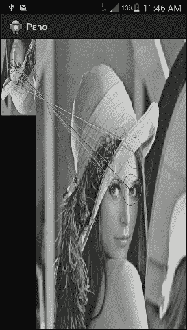

    使用 ORB 进行本机匹配以进行特征检测和描述

### 拼接两个图像

图像拼接是处理，用于找到已经具有一定程度的重叠的图像之间的对应关系。

通常，拼接分为以下两个阶段：

*   **图像配准和对齐**：在此，我们给出了两个图像-一个作为源，另一个作为目标，并且该过程涉及在空间上注册目标图像以与源图像对齐。 该过程可以分为基于强度的对齐和基于特征的对齐。 我们将使用基于特征的对齐方式，因为我们已经熟悉了该方法的组成部分（在两个图像中查找，描述和匹配特征）。 此过程的结果是具有已知参数（即`3x3`单应矩阵）的运动模型，该模型用于将一个图像的坐标映射到另一个图像。 扩展拼接应用程序以使用两个以上图像后，您将开始面临与全局配准相关的问题，并找到一组全局一致的对齐参数，以最大程度地减少所有图像对之间的配准不良。 用于解决此类问题的技术有：束调整（通过最小化每对图像之间的重投影误差来改善估计）和波校正（用于校正最终结果，因为通常会在波形输出中发现波浪状影响） 全景。
*   **校正**：对齐并对齐所有图像后，将需要对输入图像进行曝光校正，以使混合看起来更自然。 我们还需要通过称为多波段混合的过程去除可见的接缝和其他缝合伪像。

对我们来说幸运的是，OpenCV 与`stitcher`类捆绑在一起，该类将通过非常简单的界面执行拼接管线。 但是，**OpenCV4Android** SDK 不附带 Java 包装器，我认为这是您应该熟悉在应用程序中使用本机实现以便可以扩展并添加到当前版本的另一个原因。 OpenCV Java 包装器可以满足您的需求。 因此，要解决此问题，我们将向`Pano.cpp`添加另一个函数以调用`stitcher`类并返回结果。

#### UI 定义

我们将添加一个新的菜单项以执行本机缝合管线。 打开`res/menu/pano.xml`并添加以下项目：

```java
<item android:id="@+id/action_native_stitcher" android:orderInCategory="11" android:title="@string/action_native_stitch">
</item>
```

#### 本地订书机

在本节中，我们将为本地`stitcher`类实现 Java 包装器，以便可以在应用程序中使用它：

1.  我们首先在`activity`类中声明一个新的本机方法。 本机方法引用第一个和第二个场景，并返回带有拼接结果的图像：

    ```java
    public native void Stitch(long sceneOneAddress, long sceneTwoAddress,long stitchingResult);
    ```

2.  我们在`Pano.cpp`中定义了新的拼接方法：

    ```java
    JNIEXPORTvoid JNICALL Java_com_app3_pano_PanoActivity_Stitch(JNIEnv*, jobject, jlong sceneOneAddress, jlong sceneTwoAddress,jlong stitchingResult) {
      cv::Mat& sceneOne  = *(cv::Mat*)sceneOneAddress;
      cv::Mat& sceneTwo = *(cv::Mat*)sceneTwoAddress;
      cv::Mat& result = *(cv::Mat*)stitchingResult;
      /* The core stitching calls: */
      //a list to store all the images that need to be stitched
      std::vector<cv::Mat> natImgs;
      natImgs.push_back(sceneOne);
      natImgs.push_back(sceneTwo);
      //create a stitcher object with the default pipeline
      cv::Stitcher stitcher = cv::Stitcher::createDefault();
      //stitch and return the result
      stitcher.stitch(natImgs, result);
    }
    ```

3.  在活动类中，编辑`onOptionsItemSelected`以包括以下情况：

    ```java
    else if(id==R.id.action_native_stitcher)
    {
    if(sampledImage==null || imgToMatch==null)
      {
        Context context = getApplicationContext();
        CharSequence text = "You need to load an two scenes!";
        int duration = Toast.LENGTH_SHORT;

        Toast toast = Toast.makeText(context, text, duration);
        toast.show();
        return true;
      }
      Mat finalImg=new Mat();
      Stitch(imgToMatch.getNativeObjAddr(),sampledImage.getNativeObjAddr(),finalImg.getNativeObjAddr());
      displayImage(finalImg);
    }
    ```

# 摘要

我们已经看到了如何使用本机和 Java 包装器检测，描述和匹配不同的功能。 此外，我们已经看到了图像特征的两种应用-一种可以在其中使用它们在场景中找到对象，另一种可以将两个图像拼接在一起以构建全景。

在下一章中，我们将换档并涉及机器学习的主题，以及如何使用学习算法来检测手势，并将其用于构建自动自拍应用程序。