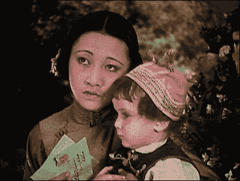

# 三、过滤图像

本章介绍了一些更改图像的技术。 我们的目标是实现艺术效果，类似于在图像编辑应用（例如 Photoshop 或 Gimp）中可以找到的过滤器。

在实现过滤器时，您可以尝试将其应用于任何 BGR 图像，然后保存或显示结果。 要充分欣赏每种效果，请在各种照明条件和拍摄对象下进行尝试。 在本章的最后，我们将把过滤器集成到`Cameo`应用中。

### 注意

[可以从我的网站下载本章的所有完成代码](http://nummist.com/opencv/3923_03.zip)。

# 创建模块

与`CaptureManager`和`WindowManager`类一样，我们的过滤器应可在`Cameo`外部重用。 因此，我们应该将过滤器分成各自的 Python 模块或文件。

让我们在与`cameo.py`相同的目录中创建一个名为`filters.py`的文件。 我们需要在`filters.py`中使用以下`import`语句：

```py
import cv2
import numpy
import utils
```

我们还要在同一目录中创建一个名为`utils.py`的文件。 它应包含以下导入语句：

```py
import cv2
import numpy
import scipy.interpolate
```

我们将为`filters.py`添加过滤器函数和类，而`utils.py`中将使用更多通用的数学函数。

# 通道混合 – 在 Technicolor 中查看

通道混合是重新映射颜色的简单技术。 目标像素处的颜色是（仅）相应源像素处的颜色的函数。 更具体地说，在目标像素处的每个通道的值是在源像素处的任何或所有通道的值的函数。 对于 BGR 图片，使用伪代码：

```py
dst.b = funcB(src.b, src.g, src.r)
dst.g = funcG(src.b, src.g, src.r)
dst.r = funcR(src.b, src.g, src.r)
```

我们可以定义这些功能，但是我们可以。 潜在地，我们可以映射场景的颜色与摄影机或眼睛通常所映射的颜色有很大不同。

通道混合的一种用途是模拟 RGB 或 BGR 内部的其他一些较小的色彩空间。 通过为任意两个通道分配相等的值，我们可以折叠部分颜色空间，并产生一种印象，即我们的调色板仅基于两种颜色的光（相加混合）或两种墨水（相减地混合）。 这种类型的效果可以提供怀旧的价值，因为早期的彩色胶片和早期的数字图形的调色板比当今的数字图形更为有限。

作为示例，让我们发明一些概念色彩空间，这些色彩空间让人想起 1920 年代的 Technicolor 电影和 1980 年代的 CGA 图形。 所有这些概念性色彩空间都可以代表灰色，但不能代表 RGB 的整个色彩范围：

*   **RC**（红色，青色）：请注意，红色和青色可以混合成灰色。 该色彩空间类似于 Technicolor Process 2 和 CGA Palette 3。
*   **RGV**（红色，绿色，值）：请注意，红色和绿色不能混合成灰色。 因此，我们还需要指定值或白度。 此色彩空间类似于 Technicolor 流程 1。
*   **CMV**（青色，洋红色，值）：请注意，青色和洋红色无法混合以产生灰色。 因此，我们还需要指定值或白度。 此颜色空间类似于 CGA 调色板 1。

以下是《The Toll of the Sea》（1922）（以 Technicolor Process 2 拍摄的电影）的屏幕截图：



以下图像来自《Commander Keen：再见银河》（1991），该游戏支持 CGA 调色板 1。（有关彩色图像，请参见本书的电子版。）：


## 模拟 RC 色彩空间

RC 色彩空间易于在 BGR 中进行模拟。 蓝色和绿色可以混合成青色。 通过平均 B 和 G 通道并将结果存储在 B 和 G 中，我们有效地将这两个通道合为一个 C。为了支持这种效果，让我们向`filters.py`添加以下函数：

```py
def recolorRC(src, dst):
    """Simulate conversion from BGR to RC (red, cyan).

    The source and destination images must both be in BGR format.

    Blues and greens are replaced with cyans.

    Pseudocode:
    dst.b = dst.g = 0.5 * (src.b + src.g)
    dst.r = src.r

    """
    b, g, r = cv2.split(src)
    cv2.addWeighted(b, 0.5, g, 0.5, 0, b)
    cv2.merge((b, b, r), dst)
```

此功能发生了三件事：

1.  使用`split()`，我们将源图像的通道提取为一维数组。 以这种格式放置数据后，我们可以编写清晰，简单的通道混合代码。
2.  使用`addWeighted()`，我们用 B 和 G 的平均值替换 B 通道的值。`addWeighted()`的参数（按顺序）是第一个源数组，一个权重应用于第一个源数组，第二个源数组， 应用于第二个源数组的权重，添加到结果中的常量以及一个目标数组。
3.  使用`merge()`，我们用修改后的通道替换目标图像中的值。 请注意，我们两次使用`b`作为参数，因为我们希望目标的 B 和 G 通道相等。

分割，修改和合并通道的类似步骤也可以应用到我们的其他色彩空间模拟中。

## 模拟 RGV 色彩空间

在 BGR 中，RGV 色彩空间难以模拟。 我们的直觉可能是说我们应该将所有 B 通道值都设置为`0`，因为 RGV 不能代表蓝色。 但是，此更改将是错误的，因为它将丢弃亮度的蓝色分量，从而将灰色和浅蓝色变成黄色。 相反，我们希望灰色保持灰色，而浅蓝色变为灰色。 为了获得此结果，我们应将 B 值减小到 B，G 和 R 的每个像素最小值。让我们在`filters.py`中实现以下效果：

```py
def recolorRGV(src, dst):
    """Simulate conversion from BGR to RGV (red, green, value).

    The source and destination images must both be in BGR format.

    Blues are desaturated.

    Pseudocode:
    dst.b = min(src.b, src.g, src.r)
    dst.g = src.g
    dst.r = src.r

    """
    b, g, r = cv2.split(src)
    cv2.min(b, g, b)
    cv2.min(b, r, b)
    cv2.merge((b, g, r), dst)
```

`min()`函数计算前两个参数的每个元素的最小值，并将它们写入第三个参数。

## 模拟 CMV 颜色空间

模拟 CMV 颜色空间与模拟 RGV 非常相似，除了光谱的去饱和部分是黄色而不是蓝色。 要使黄色去饱和，应将 B 值增加到 B，G 和 R 的每个像素最大值。以下是可以添加到`filters.py`的实现：

```py
def recolorCMV(src, dst):
    """Simulate conversion from BGR to CMV (cyan, magenta, value).

    The source and destination images must both be in BGR format.

    Yellows are desaturated.

    Pseudocode:
    dst.b = max(src.b, src.g, src.r)
    dst.g = src.g
    dst.r = src.r

    """
    b, g, r = cv2.split(src)
    cv2.max(b, g, b)
    cv2.max(b, r, b)
    cv2.merge((b, g, r), dst)
```

`max()`函数计算前两个参数的每个元素的最大值，并将它们写入第三个参数。

通过设计，前面的三个效果往往会产生严重的颜色失真，尤其是当源图像首先是彩色的时。 如果我们想制作微妙的效果，则将通道与任意功能混合可能不是最好的方法。

# 曲线 – 弯曲色彩空间

曲线是另一种用于重新映射颜色的技术。 通道混合和曲线类似，只要目标像素处的颜色是相应源像素处的颜色（仅）即可。 但是，具体而言，通道混合和曲线是不同的方法。 使用曲线时，目标像素处的通道值是（仅）源像素处的相同通道值的函数。 此外，我们不直接定义功能； 相反，对于每个功能，我们定义一组控制点，从中插入功能。 对于 BGR 图片，使用伪代码：

```py
dst.b = funcB(src.b) where funcB interpolates pointsB
dst.g = funcG(src.g) where funcG interpolates pointsG
dst.r = funcR(src.r) where funcR interpolates pointsR
```

插值的类型可能在实现之间有所不同，尽管插值类型应避免在控制点处出现不连续的斜率，而产生曲线。 只要控制点数量足够，我们将使用**三次样条插值**。

## 绘制曲线

迈向基于曲线的过滤器的第一步是将控制点转换为函数。 大部分工作都是通过名为`interp1d()`的 SciPy 函数完成的，该函数接受两个数组（`x`和`y`坐标）并返回一个对点进行插值的函数。 作为`interp1d()`的可选参数，我们可以指定一种插值，原则上可以是`linear`，`nearest`，`zero`，`slinear`（球面线性），`quadratic`或[ `cubic`，尽管并非所有选项都在当前版本的 SciPy 中实现。 另一个可选参数`bounds_error`可以设置为`False`，以允许外插和内插。

让我们编辑`utils.py`并添加一个将`interp1d()`包装起来的函数，它的接口稍微简单一些：

```py
def createCurveFunc(points):
    """Return a function derived from control points."""
    if points is None:
        return None
    numPoints = len(points)
    if numPoints < 2:
        return None
    xs, ys = zip(*points)
    if numPoints < 4:
        kind = 'linear'
        # 'quadratic' is not implemented.
    else:
        kind = 'cubic'
    return scipy.interpolate.interp1d(xs, ys, kind,
                                      bounds_error = False)
```

我们的函数采用两个`(x, y)`对数组，而不是两个单独的坐标数组，这可能是指定控制点更容易理解的方式。 必须对数组进行排序，以使`x`从一个索引增加到下一个索引。 通常，为获得自然效果，`y`值也应增加，并且第一个和最后一个控制点应为`(0, 0)`和`(255, 255)`，以便保留黑色和白色。 请注意，我们会将`x`视为通道的输入值，并将`y`视为相应的输出值。 例如，`(128, 160)`可使通道的中间色调变亮。

请注意，`cubic`插值至少需要四个控制点。 如果只有两个或三个控制点，我们将退回到`linear`插值，但是，为获得自然外观效果，应避免这种情况。

## 缓存和应用曲线

现在我们可以获得插值任意控制点的曲线的函数 。 但是，此功能可能很昂贵。 我们不希望每个通道每个像素运行一次（例如，如果应用于`640 x 480`视频的三个通道，则每帧运行 921,600 次）。 幸运的是，我们通常只处理 256 个可能的输入值（每个通道 8 位），并且可以廉价地预先计算并存储许多输出值。 然后，我们的每通道每像素成本只是对缓存的输出值的查找。

让我们编辑`utils.py`并添加函数以为给定函数创建一个查找数组，并将该查找数组应用于另一个数组（例如，图像）：

```py
def createLookupArray(func, length = 256):
    """Return a lookup for whole-number inputs to a function.

    The lookup values are clamped to [0, length - 1].

    """
    if func is None:
        return None
    lookupArray = numpy.empty(length)
    i = 0
    while i < length:
        func_i = func(i)
        lookupArray[i] = min(max(0, func_i), length - 1)
        i += 1
    return lookupArray

def applyLookupArray(lookupArray, src, dst):
    """Map a source to a destination using a lookup."""
    if lookupArray is None:
        return
    dst[:] = lookupArray[src]
```

请注意，`createLookupArray()`中的方法仅限于整数输入值，因为该输入值用作数组的索引。 `applyLookupArray()`函数通过使用源数组的值作为查找数组的索引来工作。 Python 的切片符号（`[:]`）用于将查找到的值复制到目标数组中。

让我们考虑另一个优化。 如果我们总是想连续应用两个或更多曲线怎么办？ 执行多次查找效率低下，并且可能导致精度损失。 我们可以通过在创建查找数组之前将两个曲线函数组合为一个函数来避免此问题。 让我们再次编辑`utils.py`并添加以下函数，该函数返回两个给定函数的组合：

```py
def createCompositeFunc(func0, func1):
    """Return a composite of two functions."""
    if func0 is None:
        return func1
    if func1 is None:
        return func0
    return lambda x: func0(func1(x))
```

`createCompositeFunc()`中的方法仅限于每个都带有单个参数的输入函数。 参数必须是兼容类型。 请注意，使用 Python 的`lambda`关键字创建匿名函数。

这是最终的优化问题。 如果我们想对图像的所有通道应用相同的曲线怎么办？ 在这种情况下，拆分和合并通道是浪费的，因为我们不需要区分通道。 我们只需要`applyLookupArray()`使用的一维索引。 让我们编辑`utils.py`以添加一个函数，该函数将一维接口返回到预先存在的给定数组（可能是多维数组）：

```py
def createFlatView(array):
    """Return a 1D view of an array of any dimensionality."""
    flatView = array.view()
    flatView.shape = array.size
    return flatView
```

返回类型为`numpy.view`，其接口与`numpy.array`几乎相同，但是`numpy.view`仅拥有数据的引用，而不是副本。

`createFlatView()`中的方法适用于具有任意数量通道的图像。 因此，当我们希望所有通道都相同时，它可以抽象出灰度图像和彩色图像之间的差异。

## 设计面向对象的曲线过滤器

由于我们为每个曲线缓存了一个查找数组，因此基于曲线的过滤器具有与之关联的数据。 因此，它们需要是类，而不仅仅是函数。 让我们制作一对曲线过滤器类，以及可以应用任何函数而不仅仅是曲线函数的相应高级类：

*   `VFuncFilter`：这是一个用函数实例化的类，以后可以使用`apply()`将其应用于图像。 该功能适用​​于灰度图像的 **V（值）通道**或彩色图像的所有通道。
*   `VcurveFilter`：这是`VFuncFilter`的子类。 而不是使用函数实例化，而是使用一组控制点实例化，这些控制点在内部用于创建曲线函数。
*   `BGRFuncFilter`：这是一个用最多四个函数实例化的类，以后可以使用`apply()`将其应用于 BGR 图像。 这些功能之一适用于所有通道，其他三个功能分别适用于单个通道。 首先应用整体功能，然后再应用每通道功能。
*   `BGRCurveFilter`：这是`BGRFuncFilter`的子类。 而不是使用四个函数实例化，而是使用四组控制点实例化，这些控制点在内部用于创建曲线函数。

此外，所有这些类都接受数字类型的构造器参数，例如`numpy.uint8`，每个通道 8 位。 此类型用于确定查找数组中应包含多少个条目。

让我们首先看一下`VFuncFilter`和`VcurveFilter`的实现，它们都可以添加到`filters.py`中：

```py
class VFuncFilter(object):
    """A filter that applies a function to V (or all of BGR)."""

    def __init__(self, vFunc = None, dtype = numpy.uint8):
        length = numpy.iinfo(dtype).max + 1
        self._vLookupArray = utils.createLookupArray(vFunc, length)

    def apply(self, src, dst):
        """Apply the filter with a BGR or gray source/destination."""
        srcFlatView = utils.flatView(src)
        dstFlatView = utils.flatView(dst)
        utils.applyLookupArray(self._vLookupArray, srcFlatView,
                               dstFlatView)

class VCurveFilter(VFuncFilter):
    """A filter that applies a curve to V (or all of BGR)."""

    def __init__(self, vPoints, dtype = numpy.uint8):
        VFuncFilter.__init__(self, utils.createCurveFunc(vPoints),
                             dtype)
```

在这里，我们正在内部使用一些以前的功能：`createCurveFunc()`，`createLookupArray()`，`flatView()`和`applyLookupArray()`。 我们还使用`numpy.iinfo()`根据给定的数字类型确定相关的查找值范围。

现在，让我们看一下`BGRFuncFilter`和`BGRCurveFilter`的实现，它们也都可以添加到`filters.py`中：

```py
class BGRFuncFilter(object):
    """A filter that applies different functions to each of BGR."""

    def __init__(self, vFunc = None, bFunc = None, gFunc = None,
                 rFunc = None, dtype = numpy.uint8):
        length = numpy.iinfo(dtype).max + 1
        self._bLookupArray = utils.createLookupArray(
            utils.createCompositeFunc(bFunc, vFunc), length)
        self._gLookupArray = utils.createLookupArray(
            utils.createCompositeFunc(gFunc, vFunc), length)
        self._rLookupArray = utils.createLookupArray(
            utils.createCompositeFunc(rFunc, vFunc), length)

    def apply(self, src, dst):
        """Apply the filter with a BGR source/destination."""
        b, g, r = cv2.split(src)
        utils.applyLookupArray(self._bLookupArray, b, b)
        utils.applyLookupArray(self._gLookupArray, g, g)
        utils.applyLookupArray(self._rLookupArray, r, r)
        cv2.merge([b, g, r], dst)

class BGRCurveFilter(BGRFuncFilter):
    """A filter that applies different curves to each of BGR."""

    def __init__(self, vPoints = None, bPoints = None,
                 gPoints = None, rPoints = None, dtype = numpy.uint8):
        BGRFuncFilter.__init__(self,
                               utils.createCurveFunc(vPoints),
                               utils.createCurveFunc(bPoints),
                               utils.createCurveFunc(gPoints),
                               utils.createCurveFunc(rPoints), dtype)
```

同样，我们正在内部使用几个以前的功能：`createCurveFunc()`，`createCompositeFunc()`，`createLookupArray()`和`applyLookupArray()`。 我们还使用`iinfo()`，`split()`和`merge()`。

这四个类可以按原样使用，在实例化时将自定义函数或控制点作为参数传递。 或者，我们可以创建其他子类，这些子类对某些功能或控制点进行硬编码。 这样的子类可以实例化而无需任何参数。

## 模拟摄影胶片

曲线的常用用法是模拟数字前摄影中常用的调色板。 每种类型的胶卷都有自己独特的颜色（或灰色）表示法，但是我们可以概括一些与数字传感器的区别。 胶片容易遭受细节损失和阴影饱和度的困扰，而数字趋向于遭受高光部分的这些缺陷。 而且，薄膜在光谱的不同部分上趋于具有不均匀的饱和度。 因此，每部影片都有*弹出*或跳出的某些颜色。

因此，当我们想到漂亮的电影照片时，我们可能会想到明亮的且具有某些主导色的场景（或副本）。 在另一个极端，我们可能还记得曝光不足的胶片的暗淡外观，而实验室技术人员的努力无法改善这种模糊的外观。

我们将使用曲线创建四个不同的胶片状过滤器。 他们的灵感来自三种胶片和一种处理技术：

*   柯达波特拉（Kodak Portra），专为肖像和婚礼而设计的胶卷系列
*   通用电影系列富士 Provia
*   富士 Velvia，针对风景优化的电影系列
*   交叉处理，一种非标准的胶片处理技术，有时用于在时装和乐队摄影中产生低劣的外观

每个电影模拟效果都是`BGRCurveFilter`的非常简单的子类。 我们只是重写构造器为每个通道指定一组控制点。 控制点的选择基于摄影师 Petteri Sulonen 的建议。 在[上查看他关于胶片状曲线的文章，网址为 http://www.prime-junta.net/pont/How_to/100_Curves_and_Films/_Curves_and_films.html](http://www.prime-junta.net/pont/How_to/100_Curves_and_Films/_Curves_and_films.html) 。

Portra，Provia 和 Velvia 效果应产生*外观正常的*图像。 除了前后比较之外，效果应该不明显。

### 模拟柯达 Portra

Portra 具有较宽的高光范围，倾向于暖色（琥珀色），而阴影较冷（更蓝）。 作为人像电影，它倾向于使人们的肤色更白皙。 而且，它会夸大某些常见的衣服颜色，例如乳白色（例如婚纱）和深蓝色（例如西装或牛仔裤）。 让我们将 Portra 过滤器的此实现添加到`filters.py`：

```py
class BGRPortraCurveFilter(BGRCurveFilter):
    """A filter that applies Portra-like curves to BGR."""

    def __init__(self, dtype = numpy.uint8):
        BGRCurveFilter.__init__(
            self,
            vPoints = [(0,0),(23,20),(157,173),(255,255)],
            bPoints = [(0,0),(41,46),(231,228),(255,255)],
            gPoints = [(0,0),(52,47),(189,196),(255,255)],
            rPoints = [(0,0),(69,69),(213,218),(255,255)],
            dtype = dtype)
```

### 模拟富士 Provia

普罗维亚（Provia）具有强烈的对比度，并且在大多数色调中略微凉爽（蓝色）。 天空，水，和阴影比太阳增强更多。 让我们将 Provia 过滤器的此实现添加到`filters.py`：

```py
class BGRProviaCurveFilter(BGRCurveFilter):
    """A filter that applies Provia-like curves to BGR."""

    def __init__(self, dtype = numpy.uint8):
        BGRCurveFilter.__init__(
            self,
            bPoints = [(0,0),(35,25),(205,227),(255,255)],
            gPoints = [(0,0),(27,21),(196,207),(255,255)],
            rPoints = [(0,0),(59,54),(202,210),(255,255)],
            dtype = dtype)
```

### 模拟富士 Velvia

Velvia 具有深阴影和鲜艳的色彩。 它通常可以在白天产生蔚蓝的天空，在日落时产生深红色的云。 效果很难模拟，但是这是我们可以添加到`filters.py`的尝试：

```py
class BGRVelviaCurveFilter(BGRCurveFilter):
    """A filter that applies Velvia-like curves to BGR."""

    def __init__(self, dtype = numpy.uint8):
        BGRCurveFilter.__init__(
            self,
            vPoints = [(0,0),(128,118),(221,215),(255,255)],
            bPoints = [(0,0),(25,21),(122,153),(165,206),(255,255)],
            gPoints = [(0,0),(25,21),(95,102),(181,208),(255,255)],
            rPoints = [(0,0),(41,28),(183,209),(255,255)],
            dtype = dtype)
```

### 模拟交叉处理

交叉处理会在阴影中产生强烈的蓝色或绿蓝色调，在高光部分产生强烈的黄色或绿黄色。 黑色和白色不一定要保留。 另外，对比度非常高。 交叉处理的照片看起来很不舒服。 人们看起来黄疸，而无生命的物体看起来很脏。 让我们编辑`filters.py`以添加以下交叉处理过滤器的实现：

```py
class BGRCrossProcessCurveFilter(BGRCurveFilter):
    """A filter that applies cross-process-like curves to BGR."""

    def __init__(self, dtype = numpy.uint8):
        BGRCurveFilter.__init__(
            self,
            bPoints = [(0,20),(255,235)],
            gPoints = [(0,0),(56,39),(208,226),(255,255)],
            rPoints = [(0,0),(56,22),(211,255),(255,255)],
            dtype = dtype)
```

# 突出显示边缘

边缘在人类和计算机视觉中都扮演着重要角色。 我们作为人类，仅通过查看背光轮廓或粗略草图就可以轻松识别许多对象类型及其姿势。 确实，当艺术强调边缘和姿势时，它似乎常常传达出原型的想法，例如罗丹的《思想家》或乔·舒斯特的《超人》。 软件也可以推断出边缘，姿势和原型。 我们将在后面的章节中讨论这类推理。

目前，我们对简单使用边缘来达到艺术效果感兴趣。 我们将使用粗体黑线跟踪图像的边缘。 效果应让人联想到用毡笔绘制的漫画书或其他插图。

OpenCV 提供了许多边缘过滤器，包括`Laplacian()`，`Sobel()`和`Scharr()`。 这些过滤器应该将非边缘区域变成黑色，而将边缘区域变成白色或饱和色。 但是，它们易于将噪声误识别为边缘。 可以通过在尝试查找边缘之前对图像进行模糊处理来缓解此缺陷。 OpenCV 还提供了许多模糊过滤器，包括`blur()`（简单平均值），`medianBlur()`和`GaussianBlur()`。 边缘查找和模糊过滤器的参数有所不同，但始终包含[​​HTG6]，这是一个奇数，代表过滤器核的宽度和高度（以像素为单位）。

### 注意

**核**是一组权重，这些权重应用于源图像中的区域以在目标图像中生成单个像素。 例如，`7`的`ksize`表示在生成每个目的地像素时考虑了`49 (7 x 7)`源像素。 我们可以将核视为一块磨砂玻璃，它在源图像上方移动，并让源光散射扩散。

为了模糊，让我们使用`medianBlur()`，它可以有效消除数字视频噪声，尤其是在彩色图像中。 对于边缘查找，让我们使用`Laplacian()`，它会产生粗体的边缘线，尤其是在灰度图像中。 应用`medianBlur()`之后，但应用`Laplacian()`之前，我们应该从 BGR 转换为灰度。

获得`Laplacian()`的结果后，我们可以将其取反以得到白色背景上的黑色边缘。 然后，我们可以对其进行归一化（使其值的范围为 0 到 1），然后将其与源图像的相乘以使边缘变暗。 让我们在`filters.py`中实现这种方法：

```py
def strokeEdges(src, dst, blurKsize = 7, edgeKsize = 5):
    if blurKsize >= 3:
        blurredSrc = cv2.medianBlur(src, blurKsize)
        graySrc = cv2.cvtColor(blurredSrc, cv2.COLOR_BGR2GRAY)
    else:
        graySrc = cv2.cvtColor(src, cv2.COLOR_BGR2GRAY)
    cv2.Laplacian(graySrc, cv2.cv.CV_8U, graySrc, ksize = edgeKsize)
    normalizedInverseAlpha = (1.0 / 255) * (255 - graySrc)
    channels = cv2.split(src)
    for channel in channels:
        channel[:] = channel * normalizedInverseAlpha
    cv2.merge(channels, dst)
```

请注意，我们允许将核大小指定为`strokeEdges()`的参数。 `blurKsize`自变量用作`medianBlur()`的`ksize`，而`edgeKsize`用作`Laplacian()`的`ksize`。 使用网络摄像头，我发现`7`的`blurKsize`值和`5`的`edgeKsize`值看起来最好。 不幸的是，`medianBlur()`与像`7`这样的大型`ksize`一样昂贵。 如果在运行`strokeEdges()`时遇到性能问题，请尝试减小`blurKsize`的值。 要关闭模糊，请将其设置为小于`3`的值。

# 自定义核 – 令人费解

如我们所见，OpenCV 的许多预定义过滤器使用核。 请记住，核是一组权重，这些权重确定如何根据输入像素的邻域计算每个输出像素。 核的另一个术语是**卷积矩阵**。 混合或*卷积*区域中的像素。 类似地，基于核的过滤器可以称为卷积过滤器。

OpenCV 提供了一个非常通用的函数`filter2D()`和，它可以应用我们指定的任何核或卷积矩阵。 要了解如何使用此功能，让我们首先学习卷积矩阵的格式。 它是一个二维数组，具有奇数行和列。 中心元素对应于关注像素，其他元素对应于该像素的邻居。 每个元素都包含一个整数或浮点值，该整数或浮点值是应用于输入像素值的权重。 考虑以下示例：

```py
kernel = numpy.array([[-1, -1, -1],
                      [-1,  9, -1],
                      [-1, -1, -1]])
```

在此，关注像素的权重为`9`，其相邻像素的权重为`-1`。 对于感兴趣的像素，输出颜色将是其输入颜色的九倍，减去所有八个相邻像素的输入颜色。 如果感兴趣的像素与其相邻像素已经有点不同，，这种差异就会加剧。 效果是，随着邻居之间的对比度增加，图像看起来*更清晰*。

继续我们的示例，我们可以将此卷积矩阵应用于源图像和目标图像，如下所示：

```py
cv2.filter2D(src, -1, kernel, dst)
```

第二个参数指定目标图像的每通道深度（例如，每通道 8 位的`cv2.CV_8U`）。 负值（此处使用）表示目标图像的深度与源图像的深度相同。

### 注意

对于彩色图像，请注意`filter2D()`将核均等地应用于每个通道。 要在不同的通道上使用不同的核，我们还必须使用`split()`和`merge()`函数，就像在较早的通道混合函数中所做的那样。 （请参阅“模拟 RC 色彩空间”部分。）

基于这个简单的示例，让我们向`filters.py`添加两个类。 一类`VConvolutionFilter`通常代表卷积过滤器。 子类`SharpenFilter`将专门代表我们的锐化过滤器。 让我们编辑`filters.py`来实现这两个新类，如下所示：

```py
class VConvolutionFilter(object):
    """A filter that applies a convolution to V (or all of BGR)."""

    def __init__(self, kernel):
        self._kernel = kernel

    def apply(self, src, dst):
        """Apply the filter with a BGR or gray source/destination."""
        cv2.filter2D(src, -1, self._kernel, dst)

class SharpenFilter(VConvolutionFilter):
    """A sharpen filter with a 1-pixel radius."""

    def __init__(self):
        kernel = numpy.array([[-1, -1, -1],
                              [-1,  9, -1],
                              [-1, -1, -1]])
        VConvolutionFilter.__init__(self, kernel)
```

该模式与`VCurveFilter`类及其子类非常相似。 （请参阅“设计面向对象的曲线过滤器”部分。）

注意，权重总和为`1`。 每当我们要保持图像的整体亮度不变时，都应该是这种情况。 如果我们稍微修改锐化核，以使其权重总和为`0`，则我们有一个边缘检测核，该边缘会将边缘变成白色，将非边缘变成黑色。 例如，让我们在`filters.py`中添加以下边缘检测过滤器：

```py
class FindEdgesFilter(VConvolutionFilter):
    """An edge-finding filter with a 1-pixel radius."""

    def __init__(self):
        kernel = numpy.array([[-1, -1, -1],
                              [-1,  8, -1],
                              [-1, -1, -1]])
        VConvolutionFilter.__init__(self, kernel)
```

接下来，让我们做一个模糊过滤器。 通常，对于模糊效果，权重之和应为`1`，并且在整个邻域中应为正。 例如，我们可以对邻域取一个简单的平均值，如下所示：

```py
class BlurFilter(VConvolutionFilter):
    """A blur filter with a 2-pixel radius."""

    def __init__(self):
        kernel = numpy.array([[0.04, 0.04, 0.04, 0.04, 0.04],
                              [0.04, 0.04, 0.04, 0.04, 0.04],
                              [0.04, 0.04, 0.04, 0.04, 0.04],
                              [0.04, 0.04, 0.04, 0.04, 0.04],
                              [0.04, 0.04, 0.04, 0.04, 0.04]])
        VConvolutionFilter.__init__(self, kernel)
```

我们的锐化，边缘检测和模糊过滤器使用高度对称的核。 但是有时，对称性较低的核会产生有趣的效果。 让我们考虑一个在一侧模糊（权重为正）而在另一侧锐化（权重为负）的核。 它将产生凸纹或*浮雕*效果。 这是我们可以添加到`filters.py`的实现：

```py
class EmbossFilter(VConvolutionFilter):
    """An emboss filter with a 1-pixel radius."""

    def __init__(self):
        kernel = numpy.array([[-2, -1, 0],
                              [-1,  1, 1],
                              [ 0,  1, 2]])
        VConvolutionFilter.__init__(self, kernel)
```

这套自定义卷积过滤器非常基础。 实际上，它比 OpenCV 的现成的过滤器集更基本。 但是，通过一些试验，您应该能够编写自己的核，从而产生独特的外观。

# 修改应用

现在，我们已经为几个过滤器提供了高级函数和类，将这些过滤器中的任何一个应用到`Cameo`中捕获的帧上都是微不足道的。 让我们编辑`cameo.py`，并在以下摘录中添加以粗体显示的行：

```py
import cv2
import filters
from managers import WindowManager, CaptureManager

class Cameo(object):

    def __init__(self):
        self._windowManager = WindowManager('Cameo',
                                            self.onKeypress)
        self._captureManager = CaptureManager(
            cv2.VideoCapture(0), self._windowManager, True)
 self._curveFilter = filters.BGRPortraCurveFilter()

    def run(self):
        """Run the main loop."""
        self._windowManager.createWindow()
        while self._windowManager.isWindowCreated:
            self._captureManager.enterFrame()
            frame = self._captureManager.frame

            # TODO: Track faces (Chapter 3).

 filters.strokeEdges(frame, frame)
 self._curveFilter.apply(frame, frame)

            self._captureManager.exitFrame()
            self._windowManager.processEvents()

    # ... The rest is the same as in Chapter 2.
```

在这里，我选择应用两种效果：抚摸边缘和模拟 Portra 胶片的颜色。 随时修改代码以应用您喜欢的任何过滤器。

这是来自`Cameo`的屏幕截图，带有描边和类似 Portra 的颜色：


# 总结

在这一点上，我们应该有一个显示过滤后的相机提要的应用。 我们还应该有更多的过滤器实现，可以很容易地与我们当前使用的实现互换。 现在，我们准备分析每个框架，以便在下一章中找到要操纵的面孔。