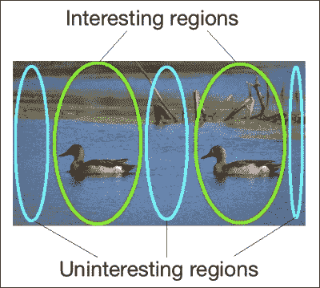
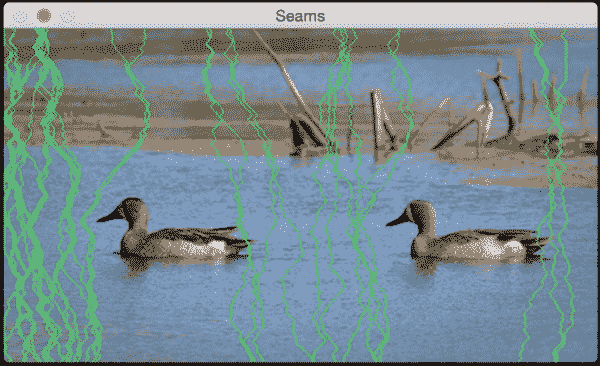
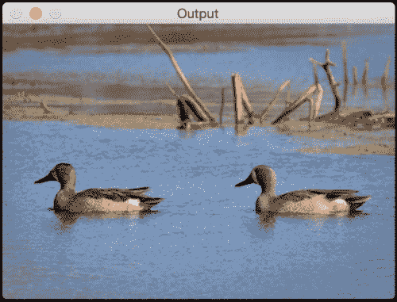
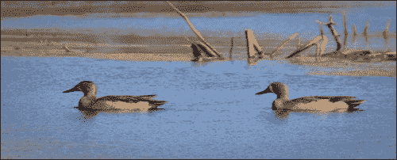
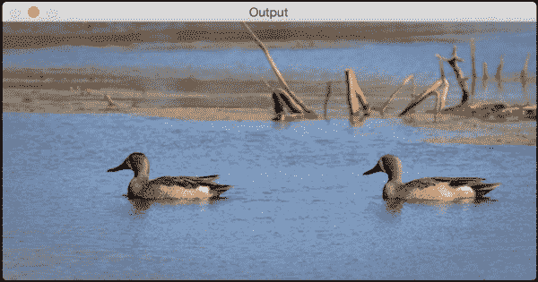

# 第 6 章。

在本章中，我们将学习有关内容感知的图像大小调整，这也称为接缝雕刻。 我们将讨论如何检测图像中的“有趣”部分，以及如何使用该信息来调整给定图像的大小而不会恶化这些有趣部分。

在本章结束时，您将了解：

*   什么是内容意识
*   如何量化图像中的“有趣”部分
*   如何使用动态编程进行图像内容分析
*   如何在保持高度不变的情况下增加和减小图像的宽度而又不使兴趣区域恶化
*   如何使物体从图像中消失

# 为什么我们关心接缝雕刻？

在开始讨论接缝雕刻之前，我们需要首先了解为什么需要它。 我们为什么要关心图像内容？ 为什么我们不能只是调整给定的图像大小并继续我们的生活？ 好吧，要回答这个问题，让我们考虑下图：


现在，假设我们要减小此图像的宽度，同时保持高度不变。 如果这样做，它将看起来像这样：


如您所见，图像中的鸭子看起来偏斜，并且图像的整体质量下降。 直观地说，我们可以说鸭子是图像中“有趣的”部分。 因此，当我们调整大小时，我们希望鸭子是完整的。 这是缝制雕刻出现的地方。 使用接缝雕刻，我们可以检测到这些有趣的区域，并确保它们不会退化。

# 它是如何工作的？

我们一直在讨论图像调整大小以及调整图像大小时应如何考虑图像的内容。 那么，为什么在地球上称为接缝雕刻呢？ 它应该只是称为内容感知图像调整大小，对吗？ 嗯，有许多不同的术语可用于描述此过程，例如图像重新定向，液体缩放，接缝雕刻等。 之所以称为接缝雕刻，是因为我们调整图像大小的方式。 该算法由 Shai Avidan 和 Ariel Shamir 提出。 您可以在[这个页面](http://dl.acm.org/citation.cfm?id=1276390)上参考原始文件。

我们知道的目标是调整给定图像的大小并保持有趣的内容完整。 因此，我们通过在该图像中找到最不重要的路径来做到这一点。 这些路径称为接缝。 找到这些接缝后，便将其从图像中删除以获得重新缩放的图像。 去除或“雕刻”的过程最终将导致图像调整大小。 这就是我们称其为“缝制雕刻”的原因。 考虑以下图像：



在上图中，我们可以看到如何将图像大致分为有趣和不有趣的部分。 我们需要确保我们的算法检测到这些不感兴趣的部分并将其删除。 让我们考虑一下鸭子的形象和我们必须处理的约束。 我们需要保持高度恒定。 这意味着我们需要在图像中找到垂直接缝并将其删除。 这些接缝从顶部开始，在底部结束（反之亦然）。 如果我们要处理垂直大小调整，则接缝将从左侧开始，到右侧结束。 垂直接缝只是一串相连的像素，从图像的第一行开始到最后一行结束。

# 我们如何定义“有趣”？

在开始计算接缝之前，我们需要找出用于计算这些接缝的度量标准。 我们需要一种为每个像素分配“重要性”的方法，以便我们找出最不重要的路径。 用计算机视觉术语来说，我们需要为每个像素分配一个能量值，以便找到最小能量的路径。 提出一种分配能量值的好方法非常重要，因为这会影响输出的质量。

我们可以使用的指标之一是每个点的导数值。 这是该社区活动水平的良好指标。 如果有活动，则像素值将快速变化。 因此，此时的导数值会很高。 另一方面，如果该区域是平淡无趣的，则像素值的变化不会那么快。 因此，灰度图像中该点的导数值会很低。

对于每个像素位置，我们通过累加该点的 X 和 Y 导数来计算能量。 我们通过获取当前像素与其相邻像素之间的差来计算导数。 如果您还记得的话，我们在第 1 章，“检测边缘并应用图像过滤器”中使用 **Sobel 过滤器**进行边缘检测时，做了类似的操作。 。 一旦计算出这些值，便将它们存储在称为能量矩阵的矩阵中。

# 我们如何计算接缝？

现在我们有了能量矩阵，我们准备计算接缝。 我们需要找到能量最少的图像路径。 计算所有可能的路径非常昂贵，因此我们需要找到一种更智能的方法来执行此操作。 这是动态编程出现的地方。 实际上，接缝雕刻是动态编程的直接应用。 我们需要从第一行中的每个像素开始，然后找到到达最后一行的方式。 为了找到能量最少的路径，我们计算并存储了到表中每个像素的最佳路径。 一旦我们构造了该表，就可以通过回溯该表中的行来找到特定像素的路径。

对于当前行中的每个像素，我们计算下一行中我们可以移动到的三个可能像素位置的能量，即左下，右下和右下。 我们不断重复此过程，直到到达最低点。 一旦到达最低点，我们就会选择累积值最小的那根，然后回溯到最高点。 这将为我们提供最少的能量。 每次删除接缝时，图像的宽度都会减少`1`。 因此，我们需要不断移除这些接缝，直到达到所需的图像尺寸为止。

让我们再次考虑我们的鸭子图像。 如果计算前 30 个接缝，它将看起来像这样：



这些绿线表示最不重要的路径。 正如我们在这里看到的那样，它们会小心翼翼地绕过鸭子，以确保不会触碰到有趣的区域。 在图像的上半部分，接缝绕着树枝缠绕，从而保持了质量。 从技术上讲，树枝也很有趣。 如果继续并删除前 100 个接缝，它将看起来像这样：



现在，将其与天真调整大小的图像进行比较。 看起来好多了吗？ 鸭子在这张照片中看起来不错。

让我们看一下代码，看看如何做：

```py
import sys

import cv2
import numpy as np

# Draw vertical seam on top of the image
def overlay_vertical_seam(img, seam):
    img_seam_overlay = np.copy(img) x

    # Extract the list of points from the seam
    x_coords, y_coords = np.transpose([(i,int(j)) for i,j in enumerate(seam)])

    # Draw a green line on the image using the list of points
    img_seam_overlay[x_coords, y_coords] = (0,255,0)
    return img_seam_overlay

# Compute the energy matrix from the input image
def compute_energy_matrix(img):
    gray = cv2.cvtColor(img, cv2.COLOR_BGR2GRAY)

    # Compute X derivative of the image
    sobel_x = cv2.Sobel(gray,cv2.CV_64F,1,0,ksize=3)

    # Compute Y derivative of the image
    sobel_y = cv2.Sobel(gray,cv2.CV_64F,0,1,ksize=3)

    abs_sobel_x = cv2.convertScaleAbs(sobel_x)
    abs_sobel_y = cv2.convertScaleAbs(sobel_y)

    # Return weighted summation of the two images i.e. 0.5*X + 0.5*Y
    return cv2.addWeighted(abs_sobel_x, 0.5, abs_sobel_y, 0.5, 0)

# Find vertical seam in the input image
def find_vertical_seam(img, energy):
    rows, cols = img.shape[:2]

    # Initialize the seam vector with 0 for each element
    seam = np.zeros(img.shape[0])

    # Initialize distance and edge matrices
    dist_to = np.zeros(img.shape[:2]) + sys.maxint
    dist_to[0,:] = np.zeros(img.shape[1])
    edge_to = np.zeros(img.shape[:2])

    # Dynamic programming; iterate using double loop and compute the paths efficiently
    for row in xrange(rows-1):
        for col in xrange(cols):
            if col != 0:
                if dist_to[row+1, col-1] > dist_to[row, col] + energy[row+1, col-1]:
                    dist_to[row+1, col-1] = dist_to[row, col] + energy[row+1, col-1]
                    edge_to[row+1, col-1] = 1

            if dist_to[row+1, col] > dist_to[row, col] + energy[row+1, col]:
                dist_to[row+1, col] = dist_to[row, col] + energy[row+1, col]
                edge_to[row+1, col] = 0

            if col != cols-1:
                if dist_to[row+1, col+1] > dist_to[row, col] + energy[row+1, col+1]:
                    dist_to[row+1, col+1] = dist_to[row, col] + energy[row+1, col+1]
                    edge_to[row+1, col+1] = -1

    # Retracing the path
    seam[rows-1] = np.argmin(dist_to[rows-1, :])
    for i in (x for x in reversed(xrange(rows)) if x > 0):
        seam[i-1] = seam[i] + edge_to[i, int(seam[i])]

    return seam

# Remove the input vertical seam from the image
def remove_vertical_seam(img, seam):
    rows, cols = img.shape[:2]

    # To delete a point, move every point after it one step towards the left
    for row in xrange(rows):
        for col in xrange(int(seam[row]), cols-1):
            img[row, col] = img[row, col+1]

    # Discard the last column to create the final output image
    img = img[:, 0:cols-1]
    return img

if __name__=='__main__':
    # Make sure the size of the input image is reasonable.
    # Large images take a lot of time to be processed.
    # Recommended size is 640x480.
    img_input = cv2.imread(sys.argv[1])

    # Use a small number to get started. Once you get an
    # idea of the processing time, you can use a bigger number.
    # To get started, you can set it to 20.
    num_seams = int(sys.argv[2])

    img = np.copy(img_input)
    img_overlay_seam = np.copy(img_input)
    energy = compute_energy_matrix(img)

    for i in xrange(num_seams):
        seam = find_vertical_seam(img, energy)
        img_overlay_seam = overlay_vertical_seam(img_overlay_seam, seam)
        img = remove_vertical_seam(img, seam)
        energy = compute_energy_matrix(img)
        print 'Number of seams removed =', i+1

    cv2.imshow('Input', img_input)
    cv2.imshow('Seams', img_overlay_seam)
    cv2.imshow('Output', img)
    cv2.waitKey()
```

# 我们可以扩大图像吗？

我们知道，我们可以使用接缝雕刻来减小图像的宽度，而不会降低兴趣区域。 因此，自然而然地，我们需要问自己是否可以在不破坏有趣区域的情况下扩展图像？ 事实证明，我们可以使用相同的逻辑来做到这一点。 当计算接缝时，我们只需要添加一个额外的列而不是删除它。

如果您天真地放大鸭子图像，它将看起来像这样：



如果您以更智能的方式进行操作，即通过使用接缝雕刻，它将看起来像这样：



如您在此处看到的，图像的宽度增加了，鸭子看起来没有拉长。 以下是执行此操作的代码：

```py
import sys

import cv2
import numpy as np

# Compute the energy matrix from the input image
def compute_energy_matrix(img):
    gray = cv2.cvtColor(img, cv2.COLOR_BGR2GRAY)
    sobel_x = cv2.Sobel(gray, cv2.CV_64F, 1, 0, ksize=3)
    sobel_y = cv2.Sobel(gray, cv2.CV_64F, 0, 1, ksize=3)
    abs_sobel_x = cv2.convertScaleAbs(sobel_x)
    abs_sobel_y = cv2.convertScaleAbs(sobel_y)
    return cv2.addWeighted(abs_sobel_x, 0.5, abs_sobel_y, 0.5, 0)

# Find the vertical seam
def find_vertical_seam(img, energy):
    rows, cols = img.shape[:2]

    # Initialize the seam vector with 0 for each element
    seam = np.zeros(img.shape[0])

    # Initialize distance and edge matrices
    dist_to = np.zeros(img.shape[:2]) + sys.maxint
    dist_to[0,:] = np.zeros(img.shape[1])
    edge_to = np.zeros(img.shape[:2])

    # Dynamic programming; iterate using double loop and compute
    #the paths efficiently
    for row in xrange(rows-1):
        for col in xrange(cols):
            if col != 0:
                if dist_to[row+1, col-1] > dist_to[row, col] + energy[row+1, col-1]:
                    dist_to[row+1, col-1] = dist_to[row, col] + energy[row+1, col-1]
                    edge_to[row+1, col-1] = 1

            if dist_to[row+1, col] > dist_to[row, col] + energy[row+1, col]:
                dist_to[row+1, col] = dist_to[row, col] + energy[row+1, col]
                edge_to[row+1, col] = 0

            if col != cols-1:
                if dist_to[row+1, col+1] > dist_to[row, col] + energy[row+1, col+1]:
                    dist_to[row+1, col+1] = dist_to[row, col] + energy[row+1, col+1]
                    edge_to[row+1, col+1] = -1

    # Retracing the path
    seam[rows-1] = np.argmin(dist_to[rows-1, :])
    for i in (x for x in reversed(xrange(rows)) if x > 0):
        seam[i-1] = seam[i] + edge_to[i, int(seam[i])]

    return seam

# Add a vertical seam to the image
def add_vertical_seam(img, seam, num_iter):
    seam = seam + num_iter
    rows, cols = img.shape[:2]
    zero_col_mat = np.zeros((rows,1,3), dtype=np.uint8)
    img_extended = np.hstack((img, zero_col_mat))

    for row in xrange(rows):
        for col in xrange(cols, int(seam[row]), -1):
            img_extended[row, col] = img[row, col-1]

        # To insert a value between two columns, take the average # value of the neighbors. It looks smooth this way and we # can avoid unwanted artifacts.
        for i in range(3):
            v1 = img_extended[row, int(seam[row])-1, i]
            v2 = img_extended[row, int(seam[row])+1, i]
            img_extended[row, int(seam[row]), i] = (int(v1)+int(v2))/2

    return img_extended

# Remove vertical seam from the image
def remove_vertical_seam(img, seam):
    rows, cols = img.shape[:2]
    for row in xrange(rows):
        for col in xrange(int(seam[row]), cols-1):
            img[row, col] = img[row, col+1]

    img = img[:, 0:cols-1]
    return img

if __name__=='__main__':
    img_input = cv2.imread(sys.argv[1])
    num_seams = int(sys.argv[2])
    img = np.copy(img_input)
    img_output = np.copy(img_input)
    energy = compute_energy_matrix(img)

    for i in xrange(num_seams):
        seam = find_vertical_seam(img, energy)
        img = remove_vertical_seam(img, seam)
        img_output = add_vertical_seam(img_output, seam, i)
        energy = compute_energy_matrix(img)
        print 'Number of seams added =', i+1

    cv2.imshow('Input', img_input)
    cv2.imshow('Output', img_output)
    cv2.waitKey()
```

我们在此代码中添加了一个额外的函数`add_vertical_seam`。 我们使用它来添加垂直接缝，以使图像看起来自然。

# 我们可以完全删除一个对象吗？

这也许是缝缝雕刻中最有趣的应用。 我们可以使物体从图像中完全消失。 让我们考虑下图：


让我们选择兴趣区域：


卸下右侧的椅子后，它将看起来像这样：


好像椅子根本不存在！ 在查看代码之前，重要的是要知道这需要一段时间才能运行。 因此，只需等待几分钟即可了解处理时间。 您可以相应地调整输入图像的尺寸！ 让我们看一下代码：

```py
import sys

import cv2
import numpy as np

# Draw rectangle on top of the input image
def draw_rectangle(event, x, y, flags, params):
    global x_init, y_init, drawing, top_left_pt, bottom_right_pt, img_orig

    # Detecting a mouse click
    if event == cv2.EVENT_LBUTTONDOWN:
        drawing = True
        x_init, y_init = x, y

    # Detecting mouse movement
    elif event == cv2.EVENT_MOUSEMOVE:
        if drawing:
            top_left_pt, bottom_right_pt = (x_init,y_init), (x,y)
            img[y_init:y, x_init:x] = 255 - img_orig[y_init:y, x_init:x]
            cv2.rectangle(img, top_left_pt, bottom_right_pt, (0,255,0), 2)

    # Detecting the mouse button up event
    elif event == cv2.EVENT_LBUTTONUP:
        drawing = False
        top_left_pt, bottom_right_pt = (x_init,y_init), (x,y)

        # Create the "negative" film effect for the selected # region
        img[y_init:y, x_init:x] = 255 - img[y_init:y, x_init:x]

        # Draw rectangle around the selected region
        cv2.rectangle(img, top_left_pt, bottom_right_pt, (0,255,0), 2)
        rect_final = (x_init, y_init, x-x_init, y-y_init)

        # Remove the object in the selected region
        remove_object(img_orig, rect_final)

# Computing the energy matrix using modified algorithm
def compute_energy_matrix_modified(img, rect_roi):
    gray = cv2.cvtColor(img, cv2.COLOR_BGR2GRAY)

    # Compute the X derivative
    sobel_x = cv2.Sobel(gray,cv2.CV_64F,1,0,ksize=3)

    # Compute the Y derivative
    sobel_y = cv2.Sobel(gray,cv2.CV_64F,0,1,ksize=3)
    abs_sobel_x = cv2.convertScaleAbs(sobel_x)
    abs_sobel_y = cv2.convertScaleAbs(sobel_y)

    # Compute weighted summation i.e. 0.5*X + 0.5*Y
    energy_matrix = cv2.addWeighted(abs_sobel_x, 0.5, abs_sobel_y, 0.5, 0)
    x,y,w,h = rect_roi

    # We want the seams to pass through this region, so make sure the energy values in this region are set to 0
    energy_matrix[y:y+h, x:x+w] = 0

    return energy_matrix

# Compute energy matrix
def compute_energy_matrix(img):
    gray = cv2.cvtColor(img, cv2.COLOR_BGR2GRAY)

    # Compute X derivative
    sobel_x = cv2.Sobel(gray, cv2.CV_64F, 1, 0, ksize=3)

    # Compute Y derivative
    sobel_y = cv2.Sobel(gray, cv2.CV_64F, 0, 1, ksize=3)
    abs_sobel_x = cv2.convertScaleAbs(sobel_x)
    abs_sobel_y = cv2.convertScaleAbs(sobel_y)

    # Return weighted summation i.e. 0.5*X + 0.5*Y
    return cv2.addWeighted(abs_sobel_x, 0.5, abs_sobel_y, 0.5, 0)

# Find the vertical seam
def find_vertical_seam(img, energy):
    rows, cols = img.shape[:2]

    # Initialize the seam vector
    seam = np.zeros(img.shape[0])

    # Initialize the distance and edge matrices
    dist_to = np.zeros(img.shape[:2]) + sys.maxint
    dist_to[0,:] = np.zeros(img.shape[1])
    edge_to = np.zeros(img.shape[:2])

    # Dynamic programming; using double loop to compute the paths
    for row in xrange(rows-1):
        for col in xrange(cols):
            if col != 0:
                if dist_to[row+1, col-1] > dist_to[row, col] + energy[row+1, col-1]:
                    dist_to[row+1, col-1] = dist_to[row, col] + energy[row+1, col-1]
                    edge_to[row+1, col-1] = 1

            if dist_to[row+1, col] > dist_to[row, col] + energy[row+1, col]:
                dist_to[row+1, col] = dist_to[row, col] + energy[row+1, col]
                edge_to[row+1, col] = 0

            if col != cols-1:
                if dist_to[row+1, col+1] > dist_to[row, col] + energy[row+1, col+1]:
                    dist_to[row+1, col+1] = dist_to[row, col] + energy[row+1, col+1]
                    edge_to[row+1, col+1] = -1

    # Retracing the path
    seam[rows-1] = np.argmin(dist_to[rows-1, :])
    for i in (x for x in reversed(xrange(rows)) if x > 0):
        seam[i-1] = seam[i] + edge_to[i, int(seam[i])]

    return seam

# Add vertical seam to the input image
def add_vertical_seam(img, seam, num_iter):
    seam = seam + num_iter
    rows, cols = img.shape[:2]
    zero_col_mat = np.zeros((rows,1,3), dtype=np.uint8)
    img_extended = np.hstack((img, zero_col_mat))

    for row in xrange(rows):
        for col in xrange(cols, int(seam[row]), -1):
            img_extended[row, col] = img[row, col-1]

        # To insert a value between two columns, take the average # value of the neighbors. It looks smooth this way and we # can avoid unwanted artifacts.
        for i in range(3):
            v1 = img_extended[row, int(seam[row])-1, i]
            v2 = img_extended[row, int(seam[row])+1, i]
            img_extended[row, int(seam[row]), i] = (int(v1)+int(v2))/2

    return img_extended

# Remove vertical seam
def remove_vertical_seam(img, seam):
    rows, cols = img.shape[:2]
    for row in xrange(rows):
        for col in xrange(int(seam[row]), cols-1):
            img[row, col] = img[row, col+1]

    img = img[:, 0:cols-1]
    return img

# Remove the object from the input region of interest
def remove_object(img, rect_roi):
    num_seams = rect_roi[2] + 10
    energy = compute_energy_matrix_modified(img, rect_roi)

    # Start a loop and remove one seam at a time
    for i in xrange(num_seams):
        # Find the vertical seam that can be removed
        seam = find_vertical_seam(img, energy)

        # Remove that vertical seam
        img = remove_vertical_seam(img, seam)
        x,y,w,h = rect_roi

        # Compute energy matrix after removing the seam
        energy = compute_energy_matrix_modified(img, (x,y,w-i,h))
        print 'Number of seams removed =', i+1

    img_output = np.copy(img)

    # Fill up the region with surrounding values so that the size # of the image remains unchanged
    for i in xrange(num_seams):
        seam = find_vertical_seam(img, energy)
        img = remove_vertical_seam(img, seam)
        img_output = add_vertical_seam(img_output, seam, i)
        energy = compute_energy_matrix(img)
        print 'Number of seams added =', i+1

    cv2.imshow('Input', img_input)
    cv2.imshow('Output', img_output)
    cv2.waitKey()

if __name__=='__main__':
    img_input = cv2.imread(sys.argv[1])

    drawing = False
    img = np.copy(img_input)
    img_orig = np.copy(img_input)

    cv2.namedWindow('Input')
    cv2.setMouseCallback('Input', draw_rectangle)

    while True:
        cv2.imshow('Input', img)
        c = cv2.waitKey(10)
        if c == 27:
            break

    cv2.destroyAllWindows()
```

## 我们是怎么做到的？

基本逻辑在这里保持不变。 我们正在使用接缝雕刻来移除对象。 一旦选择了兴趣区域，我们就使所有接缝都穿过该区域。 我们通过在每次迭代后操纵能量矩阵来做到这一点。 我们添加了一个名为`compute_energy_matrix_modified`的新功能来实现此目的。 一旦计算出能量矩阵，便将 0 分配给该兴趣区域。 这样，我们强制所有接缝穿过该区域。 删除与该区域相关的所有接缝后，我们将继续添加接缝，直到将图像扩展到其原始宽度为止。

# 总结

在本章中，我们了解了内容感知图像的大小调整。 我们讨论了如何量化图像中有趣和无趣的区域。 我们学习了如何计算图像中的接缝，以及如何使用动态编程有效地进行处理。 我们讨论了如何使用接缝雕刻来减小图像的宽度，以及如何使用相同的逻辑来扩展图像。 我们还学习了如何从图像中完全删除对象。

在下一章中，我们将讨论如何进行形状分析和图像分割。 我们将看到如何使用这些原理来找到图像中感兴趣对象的确切边界。