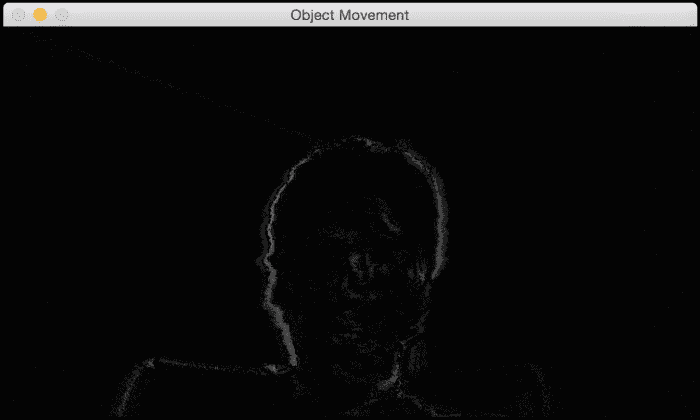
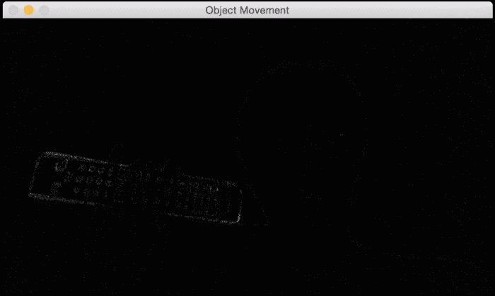
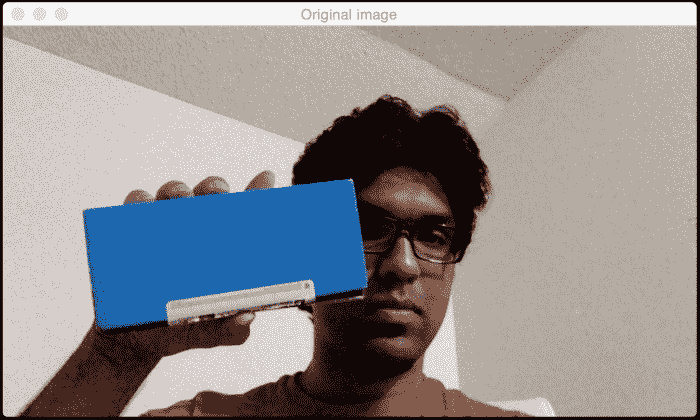
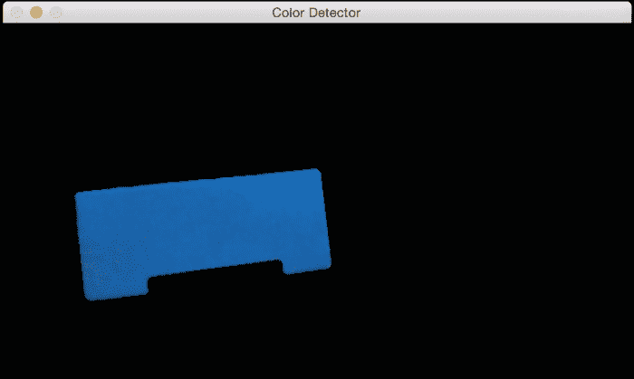
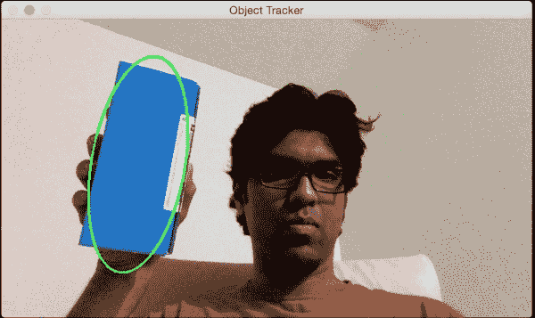
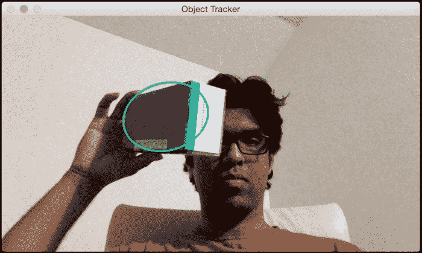
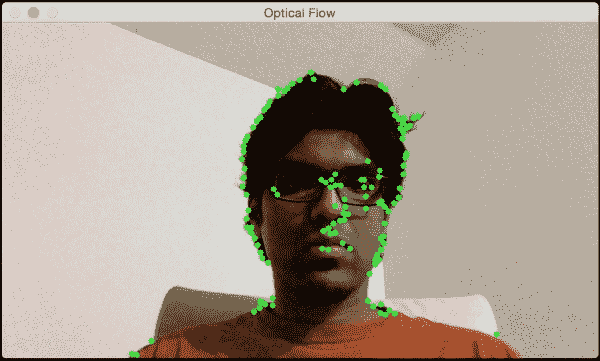
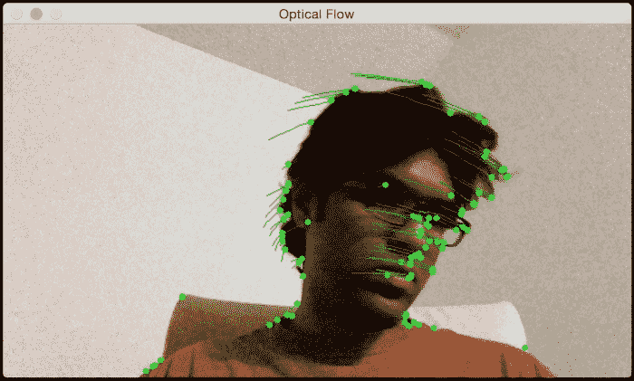
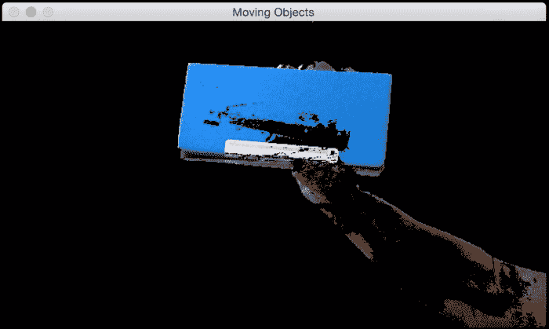

# 第 8 章。对象跟踪

在本章中，我们将学习有关在实时视频中跟踪对象的信息。 我们将讨论可用于跟踪对象的不同特征。 我们还将学习有关对象跟踪的不同方法和技术。

在本章结束时，您将了解：

*   如何使用帧差异
*   如何使用色彩空间跟踪有色物体
*   如何构建交互式对象跟踪器
*   如何构建功能跟踪器
*   如何建立视频监控系统

# 帧差异

这可能是最简单的技术，我们可以用来查看视频的哪些部分在移动。 当我们考虑实时视频流时，连续帧之间的差异为我们提供了很多信息。 这个概念非常简单！ 我们只求连续帧之间的差异并显示差异。

如果我从左向右快速移动笔记本电脑，我们将看到类似以下内容：



如果我用手快速移动电视遥控器，它将看起来像这样：



从的先前图像中可以看到，仅视频中的移动部分被突出显示。 这为我们提供了一个很好的起点，以了解视频中哪些区域正在移动。 这是执行此操作的代码：

```py
import cv2

# Compute the frame difference
def frame_diff(prev_frame, cur_frame, next_frame):
    # Absolute difference between current frame and next frame
    diff_frames1 = cv2.absdiff(next_frame, cur_frame)

    # Absolute difference between current frame and # previous frame
    diff_frames2 = cv2.absdiff(cur_frame, prev_frame)

    # Return the result of bitwise 'AND' between the # above two resultant images
    return cv2.bitwise_and(diff_frames1, diff_frames2)

# Capture the frame from webcam
def get_frame(cap):
    # Capture the frame
    ret, frame = cap.read()

    # Resize the image
    frame = cv2.resize(frame, None, fx=scaling_factor,
            fy=scaling_factor, interpolation=cv2.INTER_AREA)

    # Return the grayscale image
    return cv2.cvtColor(frame, cv2.COLOR_RGB2GRAY)

if __name__=='__main__':
    cap = cv2.VideoCapture(0)
    scaling_factor = 0.5

    prev_frame = get_frame(cap)
    cur_frame = get_frame(cap)
    next_frame = get_frame(cap)

    # Iterate until the user presses the ESC key
    while True:
        # Display the result of frame differencing
        cv2.imshow("Object Movement", frame_diff(prev_frame, cur_frame, next_frame))

        # Update the variables
        prev_frame = cur_frame
        cur_frame = next_frame
        next_frame = get_frame(cap)

        # Check if the user pressed ESC
        key = cv2.waitKey(10)
        if key == 27:
            break

    cv2.destroyAllWindows()
```

# 基于色彩空间的跟踪

帧差异提供了一些有用的信息，但是我们不能用它来构建任何有意义的东西。 为了构建一个好的对象跟踪器，我们需要了解可以使用哪些特征来使我们的跟踪功能强大而准确。 因此，让我们朝这个方向迈出一步，看看如何使用**色彩空间**提出一个好的跟踪器。 正如我们在前面的章节中讨论的那样，HSVcolorspace 在涉及人类感知方面非常有用。 我们可以将图像转换为 HSV 空间，然后使用`colorspacethresholding`跟踪给定的对象。

考虑视频中的以下帧：



如果通过色彩空间过滤器运行它并跟踪对象，您将看到类似以下内容：



正如我们在此处看到的，我们的跟踪器根据颜色特征识别视频中的特定对象。 为了使用此跟踪器，我们需要知道目标对象的颜色分布。 以下是代码：

```py
import cv2
import numpy as np

# Capture the input frame from webcam
def get_frame(cap, scaling_factor):
    # Capture the frame from video capture object
    ret, frame = cap.read()

    # Resize the input frame
    frame = cv2.resize(frame, None, fx=scaling_factor,
            fy=scaling_factor, interpolation=cv2.INTER_AREA)

    return frame

if __name__=='__main__':
    cap = cv2.VideoCapture(0)
    scaling_factor = 0.5

    # Iterate until the user presses ESC key
    while True:
        frame = get_frame(cap, scaling_factor)

        # Convert the HSV colorspace
        hsv = cv2.cvtColor(frame, cv2.COLOR_BGR2HSV)

        # Define 'blue' range in HSV colorspace
        lower = np.array([60,100,100])
        upper = np.array([180,255,255])

        # Threshold the HSV image to get only blue color
        mask = cv2.inRange(hsv, lower, upper)

        # Bitwise-AND mask and original image
        res = cv2.bitwise_and(frame, frame, mask=mask)
        res = cv2.medianBlur(res, 5)

        cv2.imshow('Original image', frame)
        cv2.imshow('Color Detector', res)

        # Check if the user pressed ESC key
        c = cv2.waitKey(5)
        if c == 27:
            break

    cv2.destroyAllWindows()
```

# 构建交互式对象跟踪器

基于色彩空间的跟踪器使我们可以自由跟踪有色对象，但是我们也只能使用预定义的颜色。 如果我们只想随机选择一个对象怎么办？ 我们如何构建一个对象跟踪器，以了解所选对象的特征并自动跟踪它？ 这就是代表连续自适应均值偏移的 **CAMShift** 算法的位置。 它基本上是 **Meanshift** 算法的改进版本。

Meanshift 的概念实际上很简单。 假设我们选择了一个兴趣区域，并且希望我们的对象跟踪器跟踪该对象。 在该区域中，我们基于颜色直方图选择一堆点并计算质心。 如果质心位于该区域的中心，则说明该对象没有移动。 但是，如果质心不在此区域的中心，那么我们知道对象正在朝某个方向移动。 重心的移动控制对象移动的方向。 因此，我们将边界框移动到新位置，以便新质心成为此边界框的中心。 因此，此算法称为均值移位，因为均值（即质心）正在移动。 这样，我们就可以使用对象的当前位置进行更新。

但是，Meanshift 的问题在于不允许更改边界框的大小。 当您将物体移离相机时，人眼看起来物体会变小，但是 Meanshift 不会考虑这一点。 在整个跟踪会话中，边界框的大小将保持不变。 因此，我们需要使用 CAMShift。 CAMShift 的优点在于，它可以使边界框的大小适合对象的大小。 除此之外，它还可以跟踪对象的方向。

让我们考虑以下帧，其中对象以橙色突出显示（我手中的盒子）：


现在我们已经选择了对象，该算法将计算直方图`backprojection`并提取所有信息。 让我们移动对象，看看它是如何被跟踪的：


看起来该对象正在很好地跟踪。 让我们更改方向，看看是否保持跟踪：



正如我们所看到的，边界椭圆改变了它的位置和方向。 让我们更改对象的视角，看看它是否仍然可以跟踪它：



我们还是很好！ 边界椭圆更改了长宽比，以反映该对象现在看起来偏斜的事实（由于透视变换）。

以下是代码：

```py
import sys

import cv2
import numpy as np

class ObjectTracker(object):
    def __init__(self):
        # Initialize the video capture object
        # 0 -> indicates that frame should be captured
        # from webcam
        self.cap = cv2.VideoCapture(0)

        # Capture the frame from the webcam
        ret, self.frame = self.cap.read()

        # Downsampling factor for the input frame
        self.scaling_factor = 0.5
        self.frame = cv2.resize(self.frame, None, fx=self.scaling_factor,
                    fy=self.scaling_factor, interpolation=cv2.INTER_AREA)

        cv2.namedWindow('Object Tracker')
        cv2.setMouseCallback('Object Tracker', self.mouse_event)

        self.selection = None
        self.drag_start = None
        self.tracking_state = 0

    # Method to track mouse events
    def mouse_event(self, event, x, y, flags, param):
        x, y = np.int16([x, y])

        # Detecting the mouse button down event
        if event == cv2.EVENT_LBUTTONDOWN:
            self.drag_start = (x, y)
            self.tracking_state = 0

        if self.drag_start:
            if flags & cv2.EVENT_FLAG_LBUTTON:
                h, w = self.frame.shape[:2]
                xo, yo = self.drag_start
                x0, y0 = np.maximum(0, np.minimum([xo, yo], [x, y]))
                x1, y1 = np.minimum([w, h], np.maximum([xo, yo], [x, y]))
                self.selection = None

                if x1-x0 > 0 and y1-y0 > 0:
                    self.selection = (x0, y0, x1, y1)

            else:
                self.drag_start = None
                if self.selection is not None:
                    self.tracking_state = 1

    # Method to start tracking the object
    def start_tracking(self):
        # Iterate until the user presses the Esc key
        while True:
            # Capture the frame from webcam
            ret, self.frame = self.cap.read()
            # Resize the input frame
            self.frame = cv2.resize(self.frame, None, fx=self.scaling_factor,
                        fy=self.scaling_factor, interpolation=cv2.INTER_AREA)

            vis = self.frame.copy()

            # Convert to HSV colorspace
            hsv = cv2.cvtColor(self.frame, cv2.COLOR_BGR2HSV)

            # Create the mask based on predefined thresholds.
            mask = cv2.inRange(hsv, np.array((0., 60., 32.)),
                        np.array((180., 255., 255.)))

            if self.selection:
                x0, y0, x1, y1 = self.selection
                self.track_window = (x0, y0, x1-x0, y1-y0)
                hsv_roi = hsv[y0:y1, x0:x1]
                mask_roi = mask[y0:y1, x0:x1]

                # Compute the histogram
                hist = cv2.calcHist( [hsv_roi], [0], mask_roi, [16], [0, 180] )

                # Normalize and reshape the histogram
                cv2.normalize(hist, hist, 0, 255, cv2.NORM_MINMAX);
                self.hist = hist.reshape(-1)

                vis_roi = vis[y0:y1, x0:x1]
                cv2.bitwise_not(vis_roi, vis_roi)
                vis[mask == 0] = 0

            if self.tracking_state == 1:
                self.selection = None

                # Compute the histogram back projection
                prob = cv2.calcBackProject([hsv], [0], self.hist, [0, 180], 1)

                prob &= mask
                term_crit = ( cv2.TERM_CRITERIA_EPS | cv2.TERM_CRITERIA_COUNT, 10, 1 )

                # Apply CAMShift on 'prob'
                track_box, self.track_window = cv2.CamShift(prob, self.track_window, term_crit)

                # Draw an ellipse around the object
                cv2.ellipse(vis, track_box, (0, 255, 0), 2)

            cv2.imshow('Object Tracker', vis)

            c = cv2.waitKey(5)
            if c == 27:
                break

        cv2.destroyAllWindows()

if __name__ == '__main__':
    ObjectTracker().start_tracking()
```

# 基于功能的跟踪

基于特征的跟踪是指跟踪视频中连续帧中的各个特征点。 我们使用一种称为**光流**的技术来跟踪这些特征。 光流是计算机视觉中最流行的技术之一。 我们选择了一堆特征点并通过视频流对其进行跟踪。

当我们检测到特征点时，我们将计算位移向量并显示这些关键点在连续帧之间的运动。 这些向量称为运动向量。 有许多方法可以做到这一点，但是在所有这些技术中，Lucas-Kanade 方法可能是最受欢迎的方法。 您可以在[这个页面](http://cseweb.ucsd.edu/classes/sp02/cse252/lucaskanade81.pdf)上参考他们的原始论文。 我们通过提取特征点开始该过程。 对于每个特征点，我们以特征点为中心创建`3x3`色块。 这里的假设是每个面片内的所有点都将具有相似的运动。 我们可以根据眼前的问题来调整此窗口的大小。

对于当前帧中的每个特征点，我们将周围的`3x3`面片作为参考点。 对于此补丁，我们在前一帧中查看其邻域以获得最佳匹配。 该邻域通常大于 3x3，因为我们要获取最接近所考虑补丁的补丁。 现在，从前一帧中匹配的补丁的中心像素到当前帧中正在考虑的补丁的中心像素的路径将成为运动向量。 我们对所有特征点都这样做，并提取所有运动向量。

让我们考虑以下框架：



如果我沿水平方向移动，您将看到沿水平方向的运动向量：



如果我离开网络摄像头，您将看到类似以下内容：


因此，如果您想玩转它，可以让用户在输入视频中选择兴趣区域（就像我们之前所做的那样）。 然后，您可以从该兴趣区域提取特征点，并通过绘制边界框来跟踪对象。 这将是一个有趣的练习！

以下是执行基于光流的跟踪的代码：

```py
import cv2
import numpy as np

def start_tracking():
    # Capture the input frame
    cap = cv2.VideoCapture(0)

    # Downsampling factor for the image
    scaling_factor = 0.5

    # Number of frames to keep in the buffer when you
    # are tracking. If you increase this number,
    # feature points will have more "inertia"
    num_frames_to_track = 5

    # Skip every 'n' frames. This is just to increase the speed.
    num_frames_jump = 2

    tracking_paths = []
    frame_index = 0

    # 'winSize' refers to the size of each patch. These patches
    # are the smallest blocks on which we operate and track
    # the feature points. You can read more about the parameters
    # here: http://goo.gl/ulwqLk
    tracking_params = dict(winSize  = (11, 11), maxLevel = 2,
            criteria = (cv2.TERM_CRITERIA_EPS | cv2.TERM_CRITERIA_COUNT, 10, 0.03))

    # Iterate until the user presses the ESC key
    while True:
        # read the input frame
        ret, frame = cap.read()

        # downsample the input frame
        frame = cv2.resize(frame, None, fx=scaling_factor,
                fy=scaling_factor, interpolation=cv2.INTER_AREA)

        frame_gray = cv2.cvtColor(frame, cv2.COLOR_BGR2GRAY)
        output_img = frame.copy()

        if len(tracking_paths) > 0:
            prev_img, current_img = prev_gray, frame_gray
            feature_points_0 = np.float32([tp[-1] for tp in tracking_paths]).reshape(-1, 1, 2)

            # Compute feature points using optical flow. You can
            # refer to the documentation to learn more about the
            # parameters here: http://goo.gl/t6P4SE
            feature_points_1, _, _ = cv2.calcOpticalFlowPyrLK(prev_img, current_img, feature_points_0,
                    None, **tracking_params)
            feature_points_0_rev, _, _ = cv2.calcOpticalFlowPyrLK(current_img, prev_img, feature_points_1,
                    None, **tracking_params)

            # Compute the difference of the feature points
            diff_feature_points = abs(feature_points_0- feature_points_0_rev).reshape(-1, 2).max(-1)

            # threshold and keep the good points
            good_points = diff_feature_points < 1

            new_tracking_paths = []

            for tp, (x, y), good_points_flag in zip(tracking_paths,
                        feature_points_1.reshape(-1, 2), good_points):
                if not good_points_flag:
                    continue

                tp.append((x, y))

                # Using the queue structure i.e. first in,
                # first out
                if len(tp) > num_frames_to_track:
                    del tp[0]

                new_tracking_paths.append(tp)

                # draw green circles on top of the output image
                cv2.circle(output_img, (x, y), 3, (0, 255, 0), -1)

            tracking_paths = new_tracking_paths

            # draw green lines on top of the output image
            cv2.polylines(output_img, [np.int32(tp) for tp in tracking_paths], False, (0, 150, 0))

        # 'if' condition to skip every 'n'th frame
        if not frame_index % num_frames_jump:
            mask = np.zeros_like(frame_gray)
            mask[:] = 255
            for x, y in [np.int32(tp[-1]) for tp in tracking_paths]:
                cv2.circle(mask, (x, y), 6, 0, -1)

            # Extract good features to track. You can learn more
            # about the parameters here: http://goo.gl/BI2Kml
            feature_points = cv2.goodFeaturesToTrack(frame_gray,
                    mask = mask, maxCorners = 500, qualityLevel = 0.3,
                    minDistance = 7, blockSize = 7)

            if feature_points is not None:
                for x, y in np.float32(feature_points).reshape (-1, 2):
                    tracking_paths.append([(x, y)])

        frame_index += 1
        prev_gray = frame_gray

        cv2.imshow('Optical Flow', output_img)

        # Check if the user pressed the ESC key
        c = cv2.waitKey(1)
        if c == 27:
            break

if __name__ == '__main__':
    start_tracking()
    cv2.destroyAllWindows()
```

# 背景扣除

背景减法在视频监视中非常有用。 基本上，背景减影技术在必须检测静态场景中的运动物体的情况下确实表现良好。 顾名思义，该算法通过检测背景并将其从当前帧中减去以获取前景（即运动对象）来工作。 为了检测运动物体，我们需要首先建立背景模型。 这与帧差异不同，因为我们实际上是在对背景建模并使用此模型来检测运动对象。 因此，这比简单的帧差分技术要好得多。 该技术尝试检测场景中的静态部分，然后将其包括在背景模型中。 因此，这是一种自适应技术，可以根据场景进行调整。

让我们考虑下图：


现在，当我们在该场景中收集更多帧时，图像的每个部分将逐渐成为背景模型的一部分。 这也是我们前面讨论的内容。 如果场景是静态的，则模型会进行自我调整以确保更新了背景模型。 一开始就是这样：


请注意，我的脸部的一部分已经如何成为背景模型（变黑的区域）的一部分。 以下屏幕截图显示了几秒钟后我们将看到的内容：


如果继续进行下去，所有最终都会成为背景模型的一部分：


现在，如果我们引入一个新的运动对象，则可以清楚地检测到它，如下所示：



这是执行此操作的代码：

```py
import cv2
import numpy as np

# Capture the input frame
def get_frame(cap, scaling_factor=0.5):
    ret, frame = cap.read()

    # Resize the frame
    frame = cv2.resize(frame, None, fx=scaling_factor,
            fy=scaling_factor, interpolation=cv2.INTER_AREA)

    return frame

if __name__=='__main__':
    # Initialize the video capture object
    cap = cv2.VideoCapture(0)

    # Create the background subtractor object
    bgSubtractor = cv2.BackgroundSubtractorMOG()

    # This factor controls the learning rate of the algorithm.
    # The learning rate refers to the rate at which your model
    # will learn about the background. Higher value for
    # 'history' indicates a slower learning rate. You
    # can play with this parameter to see how it affects
    # the output.
    history = 100

    # Iterate until the user presses the ESC key
    while True:
        frame = get_frame(cap, 0.5)

        # Apply the background subtraction model to the # input frame
        mask = bgSubtractor.apply(frame, learningRate=1.0/history)

        # Convert from grayscale to 3-channel RGB
        mask = cv2.cvtColor(mask, cv2.COLOR_GRAY2BGR)

        cv2.imshow('Input frame', frame)
        cv2.imshow('Moving Objects', mask & frame)

        # Check if the user pressed the ESC key
        c = cv2.waitKey(10)
        if c == 27:
            break

    cap.release()
    cv2.destroyAllWindows()
```

# 摘要

在本章中，我们学习了对象跟踪。 我们学习了如何使用帧差分获得运动信息，以及当我们要跟踪不同类型的对象时如何限制运动信息。 我们了解了色彩空间阈值及其如何用于跟踪彩色对象的知识。 我们讨论了用于对象跟踪的聚类技术，以及如何使用 CAMShift 算法构建交互式的对象跟踪器。 我们讨论了如何跟踪视频中的特征，以及如何使用光流来实现相同功能。 我们了解了背景减法及其如何用于视频监控。

在下一章中，我们将讨论对象识别以及如何构建视觉搜索引擎。