# 十五、立体视觉和 3D 重建

在本章中，我们将学习立体视觉以及如何重建场景的 3D 地图。 我们将讨论极线几何，深度图和 3D 重建。 我们将学习如何从立体图像中提取 3D 信息并构建点云。

在本章结束时，您将了解：

*   什么是立体对应
*   什么是对极几何
*   什么是深度图
*   如何提取 3D 信息
*   如何构建和可视化给定场景的 3D 地图

# 什么是立体对应？

当我们捕获图像时，我们会将周围的 3D 世界投影到 2D 图像平面上。 因此，从技术上讲，当我们捕获这些照片时，我们只有 2D 信息。 由于该场景中的所有对象都投影到平坦的 2D 平面上，因此深度信息会丢失。 我们无法知道对象距相机有多远，或对象在 3D 空间中的相对位置。 这就是立体视觉进入画面的地方。

人类非常擅长从现实世界推断深度信息。 原因是我们的两只眼睛彼此相距几英寸。 每只眼睛都充当照相机，我们从两个不同的视点捕获同一场景的两个图像，即，每个图像分别使用左眼和右眼。 因此，我们的大脑拍摄了这两个图像，并使用立体视觉构建了 3D 地图。 这就是我们希望使用立体视觉算法实现的目标。 我们可以使用不同的视点捕获同一场景的两张照片，然后匹配相应的点以获得场景的深度图。

让我们考虑下图：

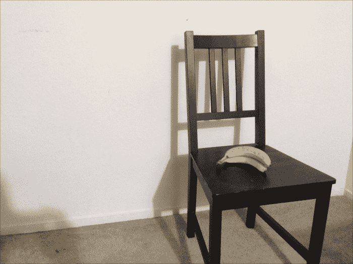

现在，如果我们从不同角度捕获同一场景，它将看起来像这样：

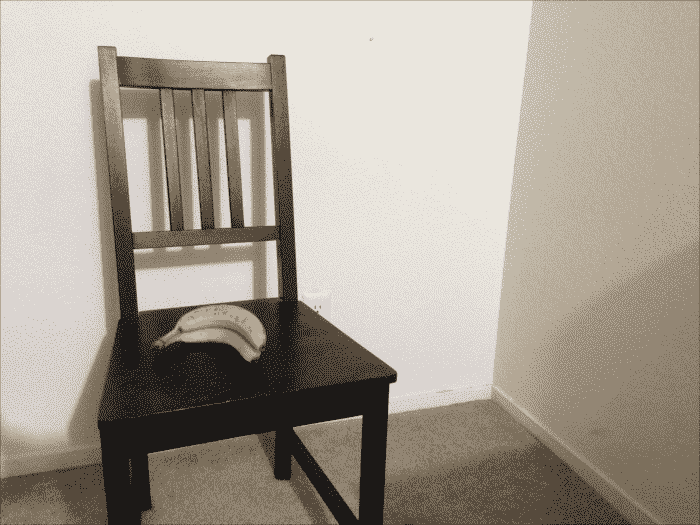

如您所见，在图像中对象的位置上有大量移动。 如果考虑像素坐标，则在这两个图像中初始位置和最终位置的值将相差很大。 考虑下图：

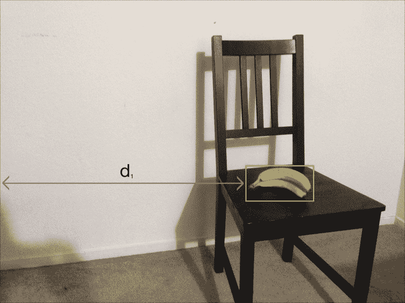

如果我们在第二张图片中考虑相同的距离线，它将看起来像这样：

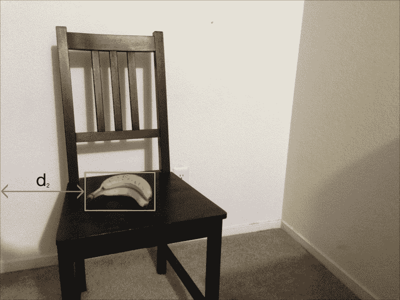

`d1`与`d2`之间的差异大。 现在，让盒子靠近相机：

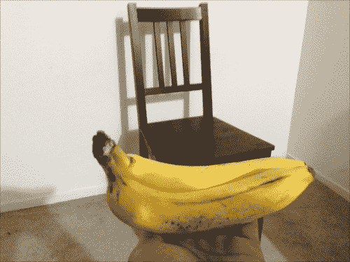

现在，让我们以与我们之前相同的数量移动相机，并从该角度捕获相同的场景：

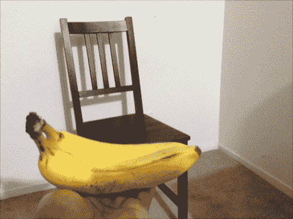

如您所见，对象位置之间的移动不多。 如果考虑像素坐标，将会看到这些值彼此接近。 第一张图片中的距离为：


如果我们在第二张图像中考虑相同的距离线，则如下图所示：

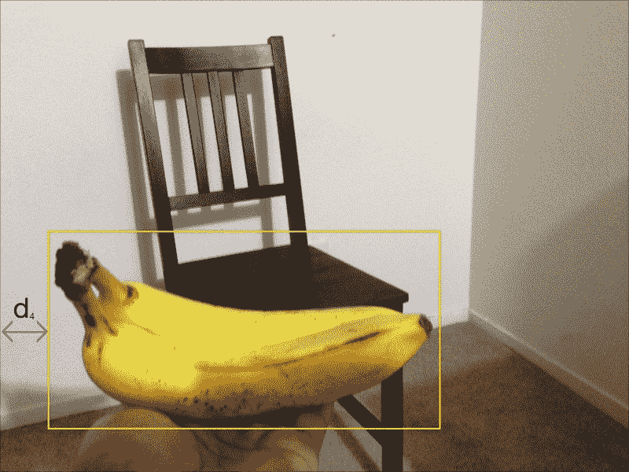

`d3`与`d4`之间的差异小。 可以说`d1`和`d2`之间的绝对差大于`d3`和`d4`之间的绝对差。 即使摄像机移动了相同的量，初始位置和最终位置之间的视在距离之间也存在很大差异。 发生这种情况是因为我们可以使物体靠近相机； 当您从不同角度拍摄两个图像时，视在运动会减少。 这就是立体对应的概念：我们捕获两个图像，并使用此知识从给定场景中提取深度信息。

# 什么是对极几何？

在讨论对极几何之前，让我们讨论从两个不同的视角捕获同一场景的两个图像时发生的情况。 考虑下图：

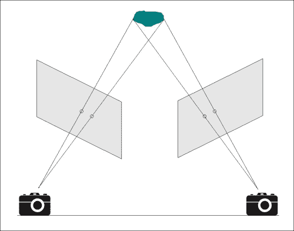

让我们看看它在现实生活中是如何发生的。 考虑下图：


现在，让我们从不同的角度捕捉相同的场景：


我们的目标是匹配这两个图像中的关键点，以提取场景信息。 我们这样做的方法是提取一个可以关联两个立体图像之间对应点的矩阵。 这被称为**基本矩阵**。

正如我们在前面的摄像机图中所看到的，我们可以画线以查看它们在哪里相遇。 这些线称为**对极线**。 极线汇聚的点称为极点。 如果使用 SIFT 匹配关键点，并向左图的会合点画线，则它看起来像这样：

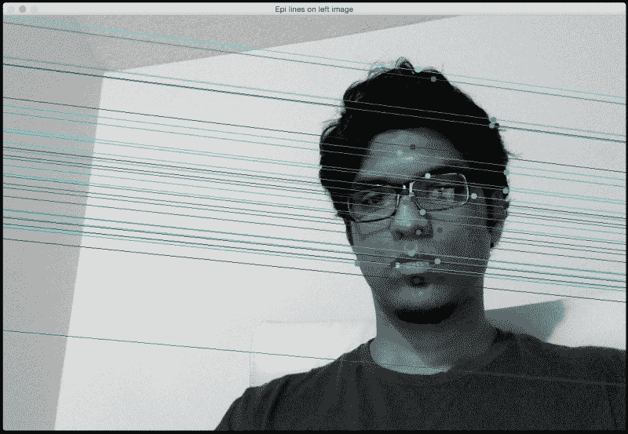

以下是右图中的匹配特征点：

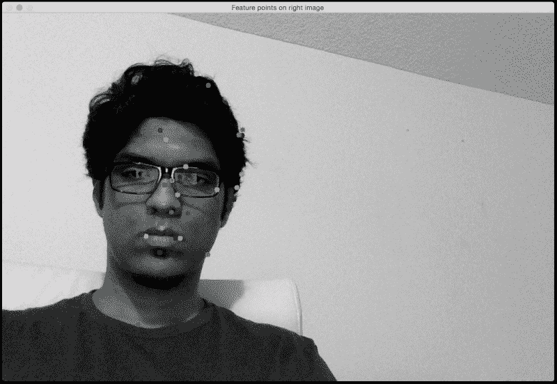

线是对极线。 如果以第二张图像作为参考，它们将如下图所示：

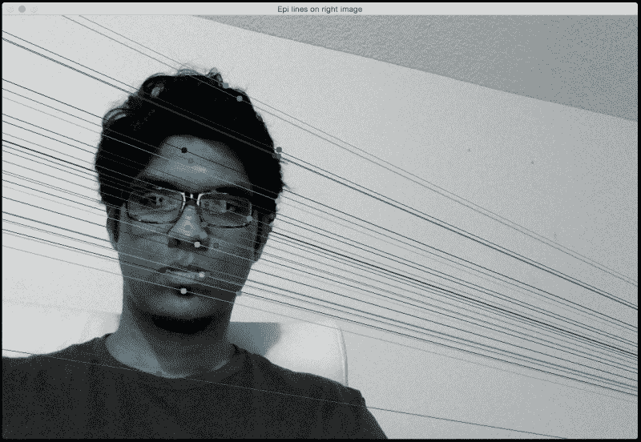

以下是第一张图像中的匹配特征点：


了解极线几何以及我们如何绘制这些线非常重要。 如果以 3D 放置两个框架，则两个框架之间的每个对极线必须与每个框架和每个相机原点中的相应特征相交。 这可以用来估计摄像机相对于 3D 环境的姿态。 稍后，我们将使用此信息从场景中提取 3D 信息。 让我们看一下代码：

```py
import argparse

import cv2
import numpy as np

def build_arg_parser():
    parser = argparse.ArgumentParser(description='Find fundamental matrix \
            using the two input stereo images and draw epipolar lines')
    parser.add_argument("--img-left", dest="img_left", required=True,
            help="Image captured from the left view")
    parser.add_argument("--img-right", dest="img_right", required=True,
            help="Image captured from the right view")
    parser.add_argument("--feature-type", dest="feature_type",
            required=True, help="Feature extractor that will be used; can be either 'sift' or 'surf'")
    return parser

def draw_lines(img_left, img_right, lines, pts_left, pts_right):
    h,w = img_left.shape
    img_left = cv2.cvtColor(img_left, cv2.COLOR_GRAY2BGR)
    img_right = cv2.cvtColor(img_right, cv2.COLOR_GRAY2BGR)

    for line, pt_left, pt_right in zip(lines, pts_left, pts_right):
        x_start,y_start = map(int, [0, -line[2]/line[1] ])
        x_end,y_end = map(int, [w, -(line[2]+line[0]*w)/line[1] ])
        color = tuple(np.random.randint(0,255,2).tolist())
        cv2.line(img_left, (x_start,y_start), (x_end,y_end), color,1)
        cv2.circle(img_left, tuple(pt_left), 5, color, -1)
        cv2.circle(img_right, tuple(pt_right), 5, color, -1)

    return img_left, img_right

def get_descriptors(gray_image, feature_type):
    if feature_type == 'surf':
        feature_extractor = cv2.SURF()

    elif feature_type == 'sift':
        feature_extractor = cv2.SIFT()

    else:
        raise TypeError("Invalid feature type; should be either 'surf' or 'sift'")

    keypoints, descriptors = feature_extractor.detectAndCompute(gray_image, None)
    return keypoints, descriptors

if __name__=='__main__':
    args = build_arg_parser().parse_args()
    img_left = cv2.imread(args.img_left,0)  # left image
    img_right = cv2.imread(args.img_right,0)  # right image
    feature_type = args.feature_type

    if feature_type not in ['sift', 'surf']:
        raise TypeError("Invalid feature type; has to be either 'sift' or 'surf'")

    scaling_factor = 1.0
    img_left = cv2.resize(img_left, None, fx=scaling_factor,
                fy=scaling_factor, interpolation=cv2.INTER_AREA)
    img_right = cv2.resize(img_right, None, fx=scaling_factor,
                fy=scaling_factor, interpolation=cv2.INTER_AREA)

    kps_left, des_left = get_descriptors(img_left, feature_type)
    kps_right, des_right = get_descriptors(img_right, feature_type)

    # FLANN parameters
    FLANN_INDEX_KDTREE = 0
    index_params = dict(algorithm = FLANN_INDEX_KDTREE, trees = 5)
    search_params = dict(checks=50)

    # Get the matches based on the descriptors
    flann = cv2.FlannBasedMatcher(index_params, search_params)
    matches = flann.knnMatch(des_left, des_right, k=2)

    pts_left_image = []
    pts_right_image = []

    # ratio test to retain only the good matches
    for i,(m,n) in enumerate(matches):
        if m.distance < 0.7*n.distance:
            pts_left_image.append(kps_left[m.queryIdx].pt)
            pts_right_image.append(kps_right[m.trainIdx].pt)

    pts_left_image = np.float32(pts_left_image)
    pts_right_image = np.float32(pts_right_image)
    F, mask = cv2.findFundamentalMat(pts_left_image, pts_right_image, cv2.FM_LMEDS)

    # Selecting only the inliers
    pts_left_image = pts_left_image[mask.ravel()==1]
    pts_right_image = pts_right_image[mask.ravel()==1]

    # Drawing the lines on left image and the corresponding feature points on the right image
    lines1 = cv2.computeCorrespondEpilines (pts_right_image.reshape(-1,1,2), 2, F)
    lines1 = lines1.reshape(-1,3)
    img_left_lines, img_right_pts = draw_lines(img_left, img_right, lines1, pts_left_image, pts_right_image)

    # Drawing the lines on right image and the corresponding feature points on the left image
    lines2 = cv2.computeCorrespondEpilines (pts_left_image.reshape(-1,1,2), 1,F)
    lines2 = lines2.reshape(-1,3)
    img_right_lines, img_left_pts = draw_lines(img_right, img_left, lines2, pts_right_image, pts_left_image)

    cv2.imshow('Epi lines on left image', img_left_lines)
    cv2.imshow('Feature points on right image', img_right_pts)
    cv2.imshow('Epi lines on right image', img_right_lines)
    cv2.imshow('Feature points on left image', img_left_pts)
    cv2.waitKey()
    cv2.destroyAllWindows()
```

让我们看看如果使用 **SURF** 特征提取器会发生什么。 左图中的线将如下所示：

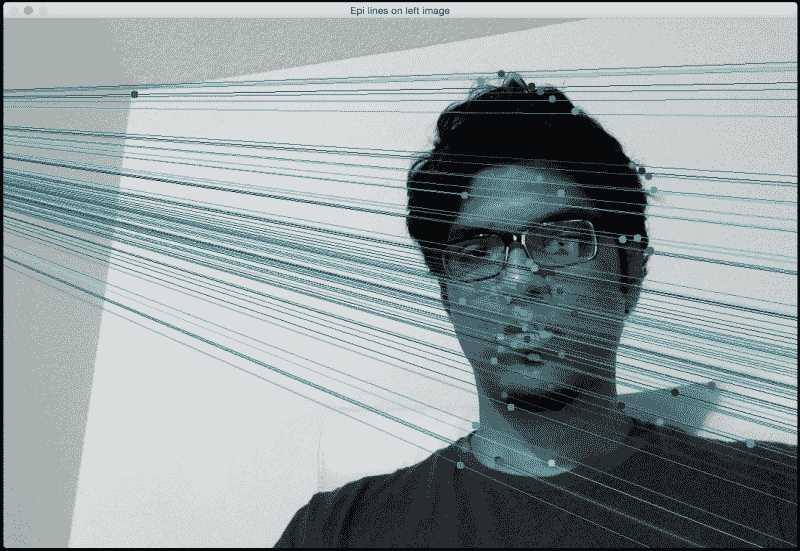

以下是右图中的匹配特征点：


如果以第二张图像作为参考，您将看到类似下图的图像：

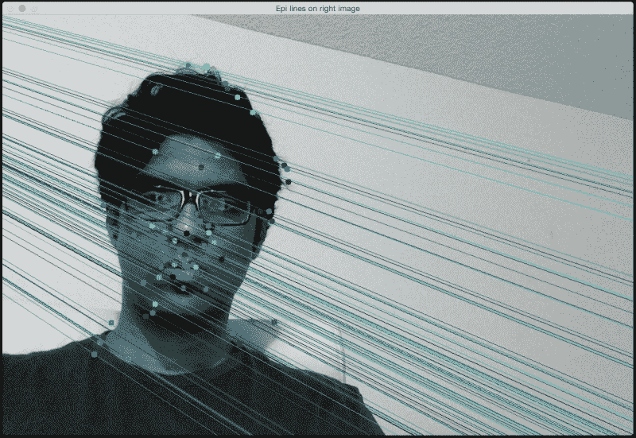

这些是第一张图像中的匹配特征点：


## 与 SIFT 相比，SURF 为何不同？

SURF 检测到一组不同的特征点，因此相应的对极线也不同。 正如您在图像中看到的那样，当我们使用 SURF 时会检测到更多特征点。 由于我们比以前拥有更多的信息，因此相应的对极线也将相应更改。

# 建立 3D 地图

现在熟悉对极几何，让我们看看如何使用它来基于立体图像构建 3D 地图。 让我们考虑下图：

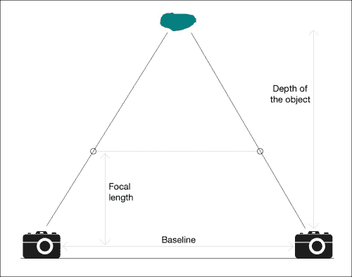

第一步是提取两个图像之间的视差图。 如果您查看该图，当我们沿着连接线从摄像机靠近物体时，两点之间的距离会减小。 使用此信息，我们可以推断出每个点与相机的距离。 这称为深度图。 一旦找到两个图像之间的匹配点，就可以通过使用对极线施加对极约束来找到视差。

让我们考虑下图：

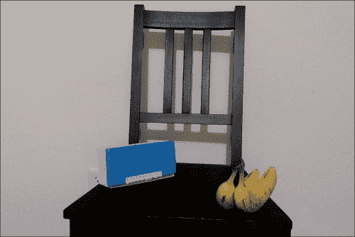

如果从不同的位置捕获相同的场景，则会得到以下图像：

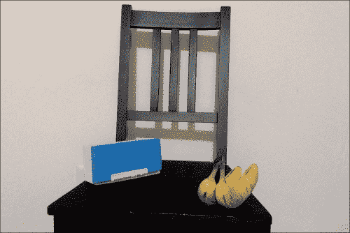

如果我们重建 3D 地图，它将看起来像这样：

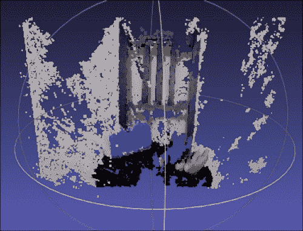

请记住，这些图像不是使用完全对准的立体相机捕获的。 这就是 3D 地图看起来如此嘈杂的原因！ 这只是为了演示我们如何使用立体图像重建现实世界。 让我们考虑一下使用正确对齐的立体相机捕获的图像对。 以下是左视图图像：

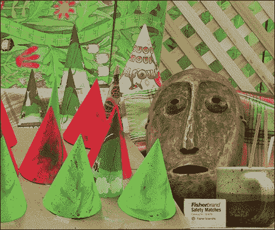

接下来是相应的右视图图像：

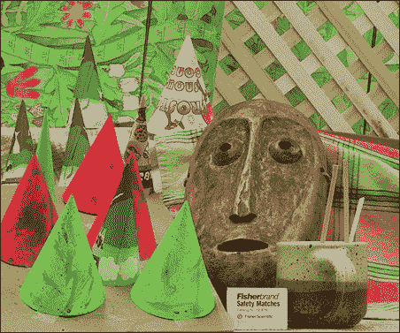

如果您提取深度信息并构建 3D 地图，它将看起来像这样：

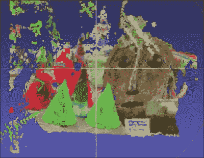

让我们旋转它，以查看深度是否适合场景中的不同对象：

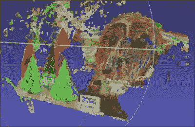

您需要一个名为 **MeshLab** 的软件来可视化 3D 场景。 我们将尽快讨论。 正如我们在前面的图像中看到的，这些项目根据它们与相机的距离正确对齐。 我们可以直观地看到它们以正确的方式排列，包括遮罩的倾斜位置。 我们可以使用这种技术来构建许多有趣的东西。

让我们看看如何在 OpenCV-Python 中做到这一点：

```py
import argparse

import cv2
import numpy as np

def build_arg_parser():
    parser = argparse.ArgumentParser(description='Reconstruct the 3D map from \
            the two input stereo images. Output will be saved in \'output.ply\'')
    parser.add_argument("--image-left", dest="image_left", required=True,
            help="Input image captured from the left")
    parser.add_argument("--image-right", dest="image_right", required=True,
            help="Input image captured from the right")
    parser.add_argument("--output-file", dest="output_file", required=True,
            help="Output filename (without the extension) where the point cloud will be saved")
    return parser

def create_output(vertices, colors, filename):
    colors = colors.reshape(-1, 3)
    vertices = np.hstack([vertices.reshape(-1,3), colors])

    ply_header = '''ply
        format ascii 1.0
        element vertex %(vert_num)d
        property float x
        property float y
        property float z
        property uchar red
        property uchar green
        property uchar blue
        end_header
    '''

    with open(filename, 'w') as f:
        f.write(ply_header % dict(vert_num=len(vertices)))
        np.savetxt(f, vertices, '%f %f %f %d %d %d')

if __name__ == '__main__':
    args = build_arg_parser().parse_args()
    image_left = cv2.imread(args.image_left)
    image_right = cv2.imread(args.image_right)
    output_file = args.output_file + '.ply'

    if image_left.shape[0] != image_right.shape[0] or \
            image_left.shape[1] != image_right.shape[1]:
        raise TypeError("Input images must be of the same size")

    # downscale images for faster processing
    image_left = cv2.pyrDown(image_left)
    image_right = cv2.pyrDown(image_right)

    # disparity range is tuned for 'aloe' image pair
    win_size = 1
    min_disp = 16
    max_disp = min_disp * 9
    num_disp = max_disp - min_disp   # Needs to be divisible by 16
    stereo = cv2.StereoSGBM(minDisparity = min_disp,
        numDisparities = num_disp,
        SADWindowSize = win_size,
        uniquenessRatio = 10,
        speckleWindowSize = 100,
        speckleRange = 32,
        disp12MaxDiff = 1,
        P1 = 8`3`win_size**2,
        P2 = 32`3`win_size**2,
        fullDP = True
    )

    print "\nComputing the disparity map ..."
    disparity_map = stereo.compute(image_left, image_right).astype(np.float32) / 16.0

    print "\nGenerating the 3D map ..."
    h, w = image_left.shape[:2]
    focal_length = 0.8*w

    # Perspective transformation matrix
    Q = np.float32([[1, 0, 0, -w/2.0],
                    [0,-1, 0,  h/2.0],
                    [0, 0, 0, -focal_length],
                    [0, 0, 1, 0]])

    points_3D = cv2.reprojectImageTo3D(disparity_map, Q)
    colors = cv2.cvtColor(image_left, cv2.COLOR_BGR2RGB)
    mask_map = disparity_map > disparity_map.min()
    output_points = points_3D[mask_map]
    output_colors = colors[mask_map]

    print "\nCreating the output file ...\n"
    create_output(output_points, output_colors, output_file)
```

要可视化输出，您需要从[这个页面](http://meshlab.sourceforge.net)下载 MeshLab 。

只需使用 MeshLab 打开`output.ply`文件，您将看到 3D 图像。 您可以旋转它以获得重建场景的完整 3D 视图。 MeshLab 的一些替代品是 OSX 和 Windows 上的 Sketchup，以及 Linux 上的 Blender。

# 总结

在本章中，我们学习了立体视觉和 3D 重建。 我们讨论了如何使用不同的特征提取器提取基本矩阵。 我们学习了如何在两个图像之间生成视差图，并使用它来重构给定场景的 3D 映射。

在下一章中，我们将讨论增强现实，以及如何构建一个炫酷的应用程序，以便在实时视频中将图形叠加在现实世界对象的顶部。