# 第 11 章。增强现实

在本章中，您将学习增强现实以及如何使用它来构建出色的应用程序。 我们将讨论姿势估计和平面跟踪。 您将学习如何将坐标从 2D 映射到 3D，以及如何将图形叠加在实时视频的顶部。

在本章结束时，您将了解：

*   增强现实的前提是什么
*   什么是姿势估计
*   如何追踪平面物体
*   如何将坐标从 3D 映射到 2D
*   如何在视频上实时叠加图形

# 增强现实的前提是什么？

在介绍所有有趣的东西之前，让我们了解增强现实的含义。 您可能已经看到“增强现实”一词在各种情况下都被使用。 因此，在开始讨论实现细节之前，我们应该了解增强现实的前提。 增强现实是指将计算机生成的输入（例如图像，声音，图形和文本）叠加在现实世界之上。

增强现实试图通过无缝合并信息并增强我们的视觉感受来模糊真实和计算机生成的事物之间的界线。 实际上，它与称为中介现实的概念密切相关，在这种情况下，计算机会修改我们对现实的看法。 结果，该技术通过增强我们当前对现实的感知而起作用。 现在，这里的挑战是使它对用户看起来无缝。 只需在输入视频的顶部叠加一些内容即可，但是我们需要使其看起来像是视频的一部分。 用户应该感觉到计算机生成的输入正在紧跟现实世界。 这是我们构建增强现实系统时想要实现的目标。

在这种情况下，计算机视觉研究探索了如何将计算机生成的图像应用于实时视频流，以便我们可以增强对现实世界的感知。 增强现实技术具有广泛的应用，包括但不限于头戴式显示器，汽车，数据可视化，游戏，建筑等。 现在我们拥有功能强大的智能手机和更智能的机器，我们可以轻松构建高端增强现实应用程序。

# 增强现实系统是什么样的？

让我们考虑下图：

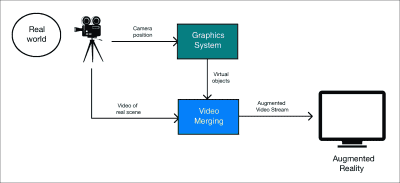

正如我们在这里看到的，摄像机捕获现实世界的视频以获取参考点。 图形系统生成需要覆盖在视频顶部的虚拟对象。 现在，视频合并块是所有魔术发生的地方。 该块应该足够聪明，以了解如何以最佳方式将虚拟对象叠加在现实世界的顶部。

# 增强现实的几何变换

增强现实的结果令人惊叹，但是之下却有许多数学上的事情。 增强现实利用了大量的几何变换和相关的数学函数来确保一切看起来都是无缝的。 在谈论增强现实的实时视频时，我们需要在现实世界的顶部精确地注册虚拟对象。 为了更好地理解它，让我们将其视为两个摄像机的对齐方式，一个是真实的摄像机，通过它我们可以看到世界，另一个是虚拟的，投影计算机生成的图形对象。

为了构建增强现实系统，需要建立以下几何变换：

*   **对象到场景**：此转换是指转换虚拟对象的 3D 坐标并将其表达在我们真实世界场景的坐标框架中。 这样可以确保我们将虚拟对象放置在正确的位置。
*   **场景到摄像机**：此转换是指现实世界中摄像机的姿势。 “姿势”是指相机的方向和位置。 我们需要估计摄像机的视点，以便我们知道如何覆盖虚拟对象。
*   **摄像机到图像**：此是指摄像机的校准参数。 这定义了我们如何将 3D 对象投影到 2D 图像平面上。 这是我们最终将实际看到的图像。

考虑下图：

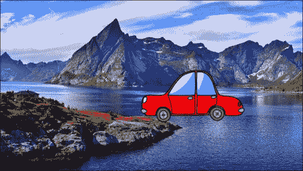

就像我们在这里看到的那样，汽车试图适应场景，但是看起来非常虚假。 如果我们没有以正确的方式转换坐标，则它看起来不自然。 这就是我们在对象到场景的转换中所说的！ 将虚拟对象的 3D 坐标转换为现实世界的坐标框架后，我们需要估算相机的姿态：

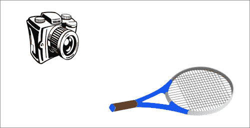

我们需要了解相机的位置和旋转，因为这是用户会看到的。 一旦估计了相机的姿势，就可以将 3D 场景放置在 2D 图像上了。

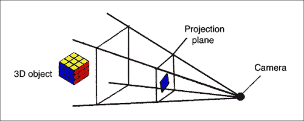

一旦有了这些转换，就可以构建完整的系统。

# 什么是姿势估计？

在继续之前，我们需要了解如何估算相机姿势。 这是增强现实系统中非常关键的一步，如果我们希望体验无缝，就需要正确处理。 在增强现实世界中，我们实时将图形叠加在对象之上。 为此，我们需要了解相机的位置和方向，并且需要快速进行操作。 这是姿势估计变得非常重要的地方。 如果您未正确跟踪姿势，则叠加的图形将看起来不自然。

考虑下图：

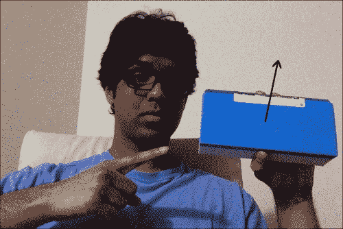

箭头线表示表面正常。 假设对象改变了方向：

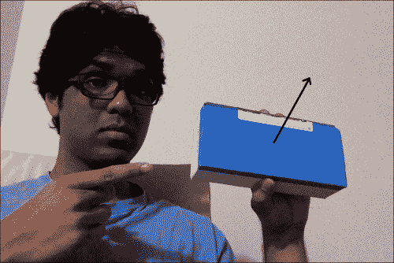

现在，即使位置相同，方向也已更改。 我们需要具有此信息，以便叠加的图形看起来自然。 我们需要确保它与该方向以及位置对齐。

# 如何追踪平面物体？

现在您了解了是什么姿势估计，让我们看看如何使用它来跟踪平面对象。 让我们考虑以下平面对象：

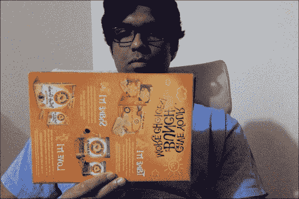

现在，如果我们从该图像中提取特征点，我们将看到类似以下内容：


让我们倾斜纸板：

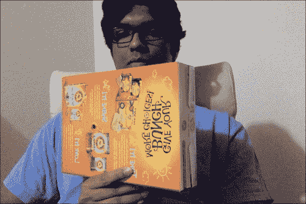

如我们所见，纸板在此图像中倾斜。 现在，如果要确保我们的虚拟对象覆盖在该表面的顶部，则需要收集此平面倾斜信息。 一种方法是使用这些特征点的相对位置。 如果我们从前面的图像中提取特征点，它将看起来像这样：


如您所见，与近端的特征点相比，特征点在平面的远端水平接近。

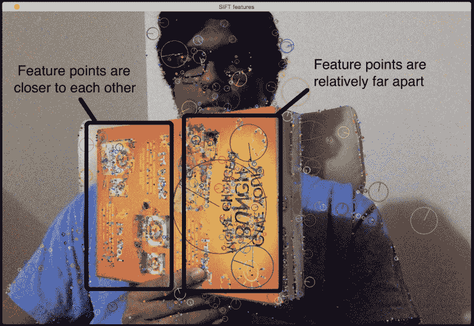

因此，我们可以利用此信息从图像中提取方向信息。 如果您还记得的话，我们在讨论几何变换和全景成像时会详细讨论透视变换。 我们需要做的就是使用这两组点并提取单应性矩阵。 单应性矩阵将告诉我们纸板的旋转方式。

考虑下图：


我们首先选择兴趣区域。

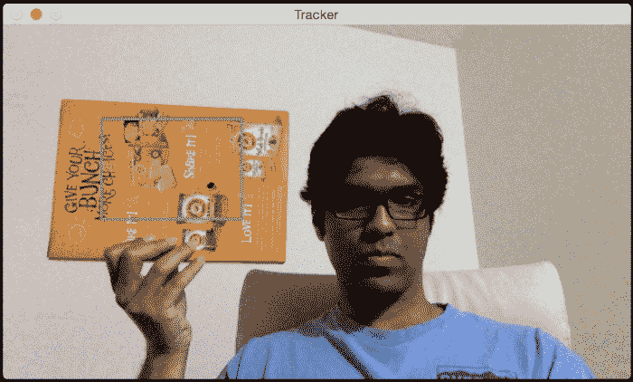

然后，我们从该兴趣区域提取特征点。 由于我们跟踪的是平面物体，因此该算法假定此关注区域为平面。 这是显而易见的，但是最好明确声明！ 因此，当您选择此兴趣区域时，请确保手中有纸板。 此外，如果纸板具有一堆图案和独特点会更好，这样便于检测和跟踪其特征点。

让跟踪开始！ 我们将移动纸板看看会发生什么：


如您所见，正在关注区域内跟踪特征点。 让我们倾斜一下，看看会发生什么：

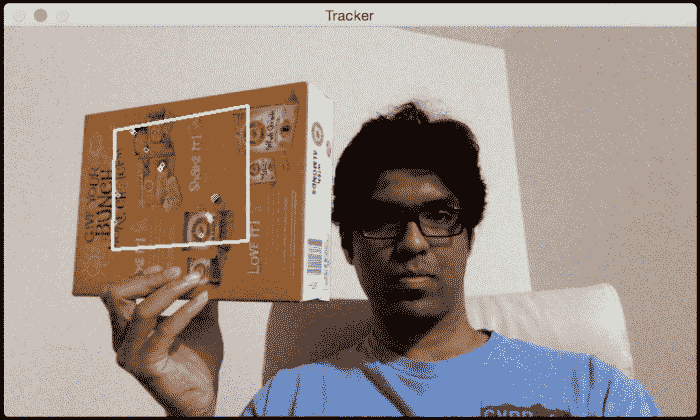

似乎已正确跟踪了特征点。 如我们所见，重叠的矩形是，根据纸板的表面改变其方向。

这是执行此操作的代码：

```py
import sys
from collections import namedtuple

import cv2
import numpy as np

class PoseEstimator(object):
    def __init__(self):
        # Use locality sensitive hashing algorithm
        flann_params = dict(algorithm = 6, table_number = 6,
                key_size = 12, multi_probe_level = 1)

        self.min_matches = 10
        self.cur_target = namedtuple('Current', 'image, rect, keypoints, descriptors, data')
        self.tracked_target = namedtuple('Tracked', 'target, points_prev, points_cur, H, quad')

        self.feature_detector = cv2.ORB(nfeatures=1000)
        self.feature_matcher = cv2.FlannBasedMatcher(flann_params, {})
        self.tracking_targets = []

    # Function to add a new target for tracking
    def add_target(self, image, rect, data=None):
        x_start, y_start, x_end, y_end = rect
        keypoints, descriptors = [], []
        for keypoint, descriptor in zip(*self.detect_features(image)):
            x, y = keypoint.pt
            if x_start <= x <= x_end and y_start <= y <= y_end:
                keypoints.append(keypoint)
                descriptors.append(descriptor)

        descriptors = np.array(descriptors, dtype='uint8')
        self.feature_matcher.add([descriptors])
        target = self.cur_target(image=image, rect=rect, keypoints=keypoints,
                    descriptors=descriptors, data=None)
        self.tracking_targets.append(target)

    # To get a list of detected objects
    def track_target(self, frame):
        self.cur_keypoints, self.cur_descriptors = self.detect_features(frame)
        if len(self.cur_keypoints) < self.min_matches:
            return []

        matches = self.feature_matcher.knnMatch(self.cur_descriptors, k=2)
        matches = [match[0] for match in matches if len(match) == 2 and
                    match[0].distance < match[1].distance * 0.75]
        if len(matches) < self.min_matches:
            return []

        matches_using_index = [[] for _ in xrange(len(self.tracking_targets))]
        for match in matches:
            matches_using_index[match.imgIdx].append(match)

        tracked = []
        for image_index, matches in enumerate(matches_using_index):
            if len(matches) < self.min_matches:
                continue

            target = self.tracking_targets[image_index]
            points_prev = [target.keypoints[m.trainIdx].pt for m in matches]
            points_cur = [self.cur_keypoints[m.queryIdx].pt for m in matches]
            points_prev, points_cur = np.float32((points_prev, points_cur))
            H, status = cv2.findHomography(points_prev, points_cur, cv2.RANSAC, 3.0)
            status = status.ravel() != 0
            if status.sum() < self.min_matches:
                continue

            points_prev, points_cur = points_prev[status], points_cur[status]

            x_start, y_start, x_end, y_end = target.rect
            quad = np.float32([[x_start, y_start], [x_end, y_start], [x_end, y_end], [x_start, y_end]])
            quad = cv2.perspectiveTransform(quad.reshape(1, -1, 2), H).reshape(-1, 2)

            track = self.tracked_target(target=target, points_prev=points_prev,
                        points_cur=points_cur, H=H, quad=quad)
            tracked.append(track)

        tracked.sort(key = lambda x: len(x.points_prev), reverse=True)
        return tracked

    # Detect features in the selected ROIs and return the keypoints and descriptors
    def detect_features(self, frame):
        keypoints, descriptors = self.feature_detector.detectAndCompute(frame, None)
        if descriptors is None:
            descriptors = []

        return keypoints, descriptors

    # Function to clear all the existing targets
    def clear_targets(self):
        self.feature_matcher.clear()
        self.tracking_targets = []

class VideoHandler(object):
    def __init__(self):
        self.cap = cv2.VideoCapture(0)
        self.paused = False
        self.frame = None
        self.pose_tracker = PoseEstimator()

        cv2.namedWindow('Tracker')
        self.roi_selector = ROISelector('Tracker', self.on_rect)

    def on_rect(self, rect):
        self.pose_tracker.add_target(self.frame, rect)

    def start(self):
        while True:
            is_running = not self.paused and self.roi_selector.selected_rect is None

            if is_running or self.frame is None:
                ret, frame = self.cap.read()
                scaling_factor = 0.5
                frame = cv2.resize(frame, None, fx=scaling_factor, fy=scaling_factor,
                        interpolation=cv2.INTER_AREA)
                if not ret:
                    break

                self.frame = frame.copy()

            img = self.frame.copy()
            if is_running:
                tracked = self.pose_tracker.track_target(self.frame)
                for item in tracked:
                    cv2.polylines(img, [np.int32(item.quad)], True, (255, 255, 255), 2)
                    for (x, y) in np.int32(item.points_cur):
                        cv2.circle(img, (x, y), 2, (255, 255, 255))

            self.roi_selector.draw_rect(img)
            cv2.imshow('Tracker', img)
            ch = cv2.waitKey(1)
            if ch == ord(' '):
                self.paused = not self.paused
            if ch == ord('c'):
                self.pose_tracker.clear_targets()
            if ch == 27:
                break

class ROISelector(object):
    def __init__(self, win_name, callback_func):
        self.win_name = win_name
        self.callback_func = callback_func
        cv2.setMouseCallback(self.win_name, self.on_mouse_event)
        self.selection_start = None
        self.selected_rect = None

    def on_mouse_event(self, event, x, y, flags, param):
        if event == cv2.EVENT_LBUTTONDOWN:
            self.selection_start = (x, y)

        if self.selection_start:
            if flags & cv2.EVENT_FLAG_LBUTTON:
                x_orig, y_orig = self.selection_start
                x_start, y_start = np.minimum([x_orig, y_orig], [x, y])
                x_end, y_end = np.maximum([x_orig, y_orig], [x, y])
                self.selected_rect = None
                if x_end > x_start and y_end > y_start:
                    self.selected_rect = (x_start, y_start, x_end, y_end)
            else:
                rect = self.selected_rect
                self.selection_start = None
                self.selected_rect = None
                if rect:
                    self.callback_func(rect)

    def draw_rect(self, img):
        if not self.selected_rect:
            return False

        x_start, y_start, x_end, y_end = self.selected_rect
        cv2.rectangle(img, (x_start, y_start), (x_end, y_end), (0, 255, 0), 2)
        return True

if __name__ == '__main__':
    VideoHandler().start()
```

## 代码内部发生了什么？

首先，我们有一个`PoseEstimator`类，在这里进行所有繁重的工作。 我们需要一些东西来检测图像中的特征，并需要一些东西来匹配连续图像之间的特征。 因此，我们使用 ORB 特征检测器和 Flann 特征匹配器。 如我们所见，我们在构造函数中使用这些参数初始化类。

每当我们选择兴趣区域时，我们都会调用`add_target`方法将其添加到我们的跟踪目标列表中。 此方法仅从兴趣区域提取特征并将其存储在一个类变量中。 现在我们有了目标，我们已经准备好追踪它！

`track_target`方法处理所有跟踪。 我们采用当前框架并提取所有关键点。 但是，我们对视频当前帧中的所有关键点并不真正感兴趣。 我们只想要属于我们目标对象的关键点。 所以现在，我们的工作是在当前帧中找到最接近的关键点。

现在，我们在当前帧中有一组关键点，而在前一帧中还有来自目标对象的另一组关键点。 下一步是从这些匹配点中提取单应性矩阵。 该单应性矩阵告诉我们如何变换覆盖的矩形，使其与纸板表面对齐。 我们只需要获取此单应性矩阵并将其应用于覆盖的矩形即可获得其所有点的新位置。

# 如何增强我们的现实？

现在知道如何跟踪平面对象，让我们看看如何将 3D 对象叠加在现实世界的顶部。 对象是 3D，但屏幕上的视频是 2D。 因此，这里的第一步是了解如何将 3D 对象映射到 2D 曲面，以使其看起来逼真。 我们只需要将这些 3D 点投影到平面上即可。

## 从 3D 映射到 2D 的坐标

一旦估计了姿态，就将点从 3D 投影到 2D。 考虑下图：


正如我们在这里看到的，电视遥控器是 3D 对象，但我们在 2D 平面上看到它。 现在，如果我们四处移动，它将看起来像这样：

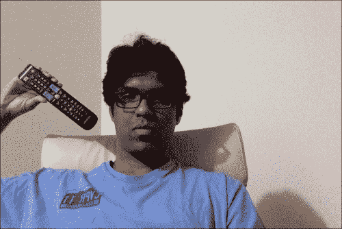

该 3D 对象在 2D 平面上仍为。 对象已移动到其他位置，并且距相机的距离也已更改。 我们如何计算这些坐标？ 我们需要一种将该 3D 对象映射到 2D 曲面的机制。 这是 3D 到 2D 投影真正重要的地方。

我们只需要估计摄像机的初始姿势即可。 现在，假设摄像机的固有参数是已知的。 因此，我们可以仅使用 OpenCV 中的`solvePnP`函数来估计摄像机的姿势。 此功能用于通过一组点来估计对象的姿势。 您可以在[上详细了解，网址为 http://docs.opencv.org/modules/calib3d/doc/camera_calibration_and_3d_reconstruction.html#boolsolvePnP(InputArray objectPoints，InputArray imagePoints，InputArray cameraMatrix，InputArray distCoeffs，OutputArray rvec ，OutputArray tvec，bool useExtrinsicGuess，int 标志）](http://docs.opencv.org/2.4/modules/calib3d/doc/camera_calibration_and_3d_reconstruction.html#bool%20solvePnP(InputArray%20objectPoints,%20InputArray%20imagePoints,%20InputArray%20cameraMatrix,%20InputArray%20distCoeffs,%20OutputArray%20rvec,%20OutputArray%20tvec,%20bool%20useExtrinsicGuess,%20int%20flags))。 完成此操作后，我们需要将这些点投影到 2D 上。 我们使用 OpenCV 函数`projectPoints`执行此操作。 此函数计算这些 3D 点在 2D 平面上的投影。

## 如何在视频上叠加 3D 对象？

现在我们已经拥有和不同的块，我们准备构建最终的系统。 假设我们要在纸板上覆盖一个金字塔，如下所示：


让我们倾斜纸板看看会发生什么：


看起来金字塔正跟随该表面。 让我们添加一个第二个目标：

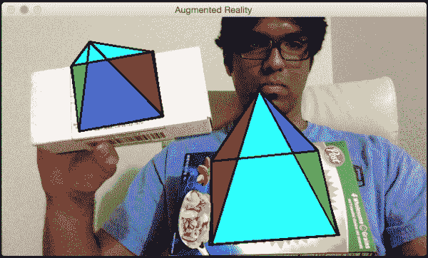

您可以继续添加更多目标，并且将很好地跟踪所有这些金字塔。 让我们看看如何使用 OpenCV Python 做到这一点。 确保将以前的文件另存为`pose_estimation.py`，因为我们将从那里导入几个类：

```py
import cv2
import numpy as np

from pose_estimation import PoseEstimator, ROISelector

class Tracker(object):
    def __init__(self):
        self.cap = cv2.VideoCapture(0)
        self.frame = None
        self.paused = False
        self.tracker = PoseEstimator()

        cv2.namedWindow('Augmented Reality')
        self.roi_selector = ROISelector('Augmented Reality', self.on_rect)

        self.overlay_vertices = np.float32([[0, 0, 0], [0, 1, 0], [1, 1, 0], [1, 0, 0],
                               [0.5, 0.5, 4]])
        self.overlay_edges = [(0, 1), (1, 2), (2, 3), (3, 0),
                    (0,4), (1,4), (2,4), (3,4)]
        self.color_base = (0, 255, 0)
        self.color_lines = (0, 0, 0)

    def on_rect(self, rect):
        self.tracker.add_target(self.frame, rect)

    def start(self):
        while True:
            is_running = not self.paused and self.roi_selector.selected_rect is None
            if is_running or self.frame is None:
                ret, frame = self.cap.read()
                scaling_factor = 0.5
                frame = cv2.resize(frame, None, fx=scaling_factor, fy=scaling_factor,
                        interpolation=cv2.INTER_AREA)
                if not ret:
                    break

                self.frame = frame.copy()

            img = self.frame.copy()
            if is_running:
                tracked = self.tracker.track_target(self.frame)
                for item in tracked:
                    cv2.polylines(img, [np.int32(item.quad)], True, self.color_lines, 2)
                    for (x, y) in np.int32(item.points_cur):
                        cv2.circle(img, (x, y), 2, self.color_lines)

                    self.overlay_graphics(img, item)

            self.roi_selector.draw_rect(img)
            cv2.imshow('Augmented Reality', img)
            ch = cv2.waitKey(1)
            if ch == ord(' '):
                self.paused = not self.paused
            if ch == ord('c'):
                self.tracker.clear_targets()
            if ch == 27:
                break

    def overlay_graphics(self, img, tracked):
        x_start, y_start, x_end, y_end = tracked.target.rect
        quad_3d = np.float32([[x_start, y_start, 0], [x_end, y_start, 0],
                    [x_end, y_end, 0], [x_start, y_end, 0]])
        h, w = img.shape[:2]
        K = np.float64([[w, 0, 0.5*(w-1)],
                        [0, w, 0.5*(h-1)],
                        [0, 0, 1.0]])
        dist_coef = np.zeros(4)
        ret, rvec, tvec = cv2.solvePnP(quad_3d, tracked.quad, K, dist_coef)
        verts = self.overlay_vertices * [(x_end-x_start), (y_end-y_start),
                    -(x_end-x_start)*0.3] + (x_start, y_start, 0)
        verts = cv2.projectPoints(verts, rvec, tvec, K, dist_coef)[0].reshape(-1, 2)

        verts_floor = np.int32(verts).reshape(-1,2)
        cv2.drawContours(img, [verts_floor[:4]], -1, self.color_base, -3)
        cv2.drawContours(img, [np.vstack((verts_floor[:2], verts_floor[4:5]))],
                    -1, (0,255,0), -3)
        cv2.drawContours(img, [np.vstack((verts_floor[1:3], verts_floor[4:5]))],
                    -1, (255,0,0), -3)
        cv2.drawContours(img, [np.vstack((verts_floor[2:4], verts_floor[4:5]))],
                    -1, (0,0,150), -3)
        cv2.drawContours(img, [np.vstack((verts_floor[3:4], verts_floor[0:1],
                    verts_floor[4:5]))], -1, (255,255,0), -3)

        for i, j in self.overlay_edges:
            (x_start, y_start), (x_end, y_end) = verts[i], verts[j]
            cv2.line(img, (int(x_start), int(y_start)), (int(x_end), int(y_end)), self.color_lines, 2)

if __name__ == '__main__':
    Tracker().start()
```

## 让我们看一下代码

`Tracker`类用于此处执行所有计算。 我们使用通过边和顶点定义的金字塔结构初始化类。 我们用来跟踪表面的逻辑与我们之前讨论的相同，因为我们使用的是同一类。 我们只需要使用`solvePnP`和`projectPoints`将 3D 金字塔映射到 2D 曲面即可。

# 让我们添加一些动作

现在我们知道如何添加虚拟金字塔，让我们看看是否可以添加一些移动。 让我们看看如何动态更改金字塔的高度。 当您开始时，金字塔将如下所示：

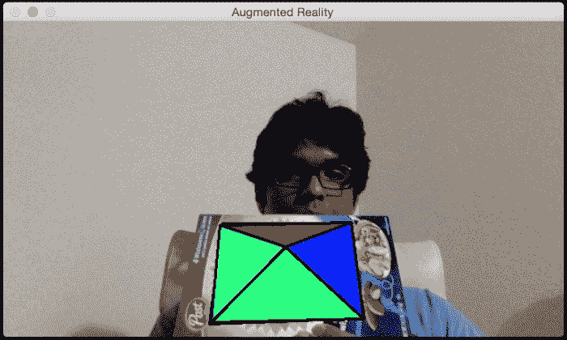

如果您等待一段时间，金字塔会变得更高，看起来像这样：


让我们看看如何在 OpenCV Python 中执行。 在我们刚刚讨论过的增强现实代码中，在`Tracker`类的`__init__`方法的末尾添加以下代码段：

```py
self.overlay_vertices = np.float32([[0, 0, 0], [0, 1, 0], [1, 1, 0], [1, 0, 0], [0.5, 0.5, 4]])
self.overlay_edges = [(0, 1), (1, 2), (2, 3), (3, 0),
            (0,4), (1,4), (2,4), (3,4)]
self.color_base = (0, 255, 0)
self.color_lines = (0, 0, 0)

self.graphics_counter = 0
self.time_counter = 0
```

现在我们有了结构，我们需要添加代码以动态更改高度。 用以下方法替换`overlay_graphics()`方法：

```py
def overlay_graphics(self, img, tracked):
    x_start, y_start, x_end, y_end = tracked.target.rect
    quad_3d = np.float32([[x_start, y_start, 0], [x_end, y_start, 0],
                [x_end, y_end, 0], [x_start, y_end, 0]])
    h, w = img.shape[:2]
    K = np.float64([[w, 0, 0.5*(w-1)],
                    [0, w, 0.5*(h-1)],
                    [0, 0, 1.0]])
    dist_coef = np.zeros(4)
    ret, rvec, tvec = cv2.solvePnP(quad_3d, tracked.quad, K, dist_coef)

    self.time_counter += 1
    if not self.time_counter % 20:
        self.graphics_counter = (self.graphics_counter + 1) % 8

    self.overlay_vertices = np.float32([[0, 0, 0], [0, 1, 0], [1, 1, 0], [1, 0, 0],
                           [0.5, 0.5, self.graphics_counter]])

    verts = self.overlay_vertices * [(x_end-x_start), (y_end-y_start),
                -(x_end-x_start)*0.3] + (x_start, y_start, 0)
    verts = cv2.projectPoints(verts, rvec, tvec, K, dist_coef)[0].reshape(-1, 2)

    verts_floor = np.int32(verts).reshape(-1,2)
    cv2.drawContours(img, [verts_floor[:4]], -1, self.color_base, -3)
    cv2.drawContours(img, [np.vstack((verts_floor[:2], verts_floor[4:5]))],
                -1, (0,255,0), -3)
    cv2.drawContours(img, [np.vstack((verts_floor[1:3], verts_floor[4:5]))],
                -1, (255,0,0), -3)
    cv2.drawContours(img, [np.vstack((verts_floor[2:4], verts_floor[4:5]))],
                -1, (0,0,150), -3)
    cv2.drawContours(img, [np.vstack((verts_floor[3:4], verts_floor[0:1],
                verts_floor[4:5]))], -1, (255,255,0), -3)

    for i, j in self.overlay_edges:
        (x_start, y_start), (x_end, y_end) = verts[i], verts[j]
        cv2.line(img, (int(x_start), int(y_start)), (int(x_end), int(y_end)), self.color_lines, 2)
```

现在我们知道如何更改高度了，让我们继续进行金字塔跳舞。 我们可以使金字塔的顶端以良好的周期性振动。 因此，当您开始时，它将如下所示：

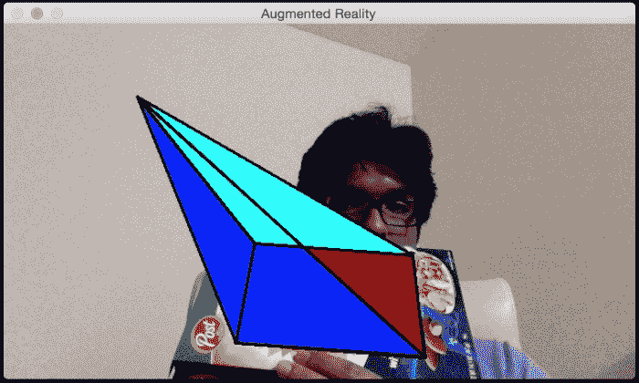

如果您等待一段时间，它将看起来像这样：

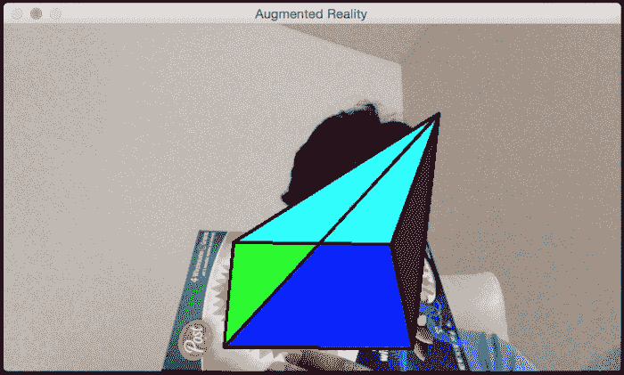

您可以在`augmented_reality_motion.py`中查看实现的详细信息。

在我们的下一个实验中，我们将使整个金字塔在兴趣区域内移动。 我们可以使它以我们想要的任何方式移动。 首先，添加围绕所选兴趣区域的线性对角线运动。 当您开始时，它将如下所示：


一段时间后，它将如下所示：

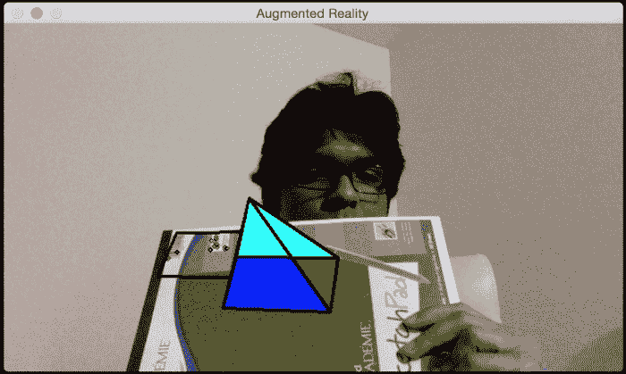

请参阅至`augmented_reality_dancing.py`，以了解如何更改`overlay_graphics()`方法使其跳动。 让我们看看是否可以使金字塔绕我们兴趣区域旋转。 当您开始时，它将如下所示：

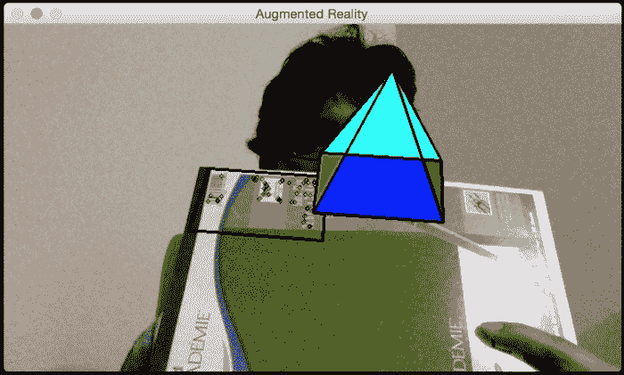

时间过后，它将移至新位置：


您可以参考`augmented_reality_circular_motion.py`来了解如何实现。 您可以使其做任何您想做的事情。 您只需要提出正确的数学公式，金字塔就会如您所愿地跳动！ 您也可以尝试其他虚拟对象，以查看可以使用的对象。 您可以使用许多不同的对象执行很多操作。 这些示例提供了一个很好的参考点，您可以在此基础上构建许多有趣的增强现实应用程序。

# 摘要

在本章中，您了解了增强现实的前提，并了解了增强现实系统的外观。 我们讨论了增强现实所需的几何变换。 您学习了如何使用这些转换来估计相机的姿势。 您学习了如何跟踪平面对象。 我们讨论了如何在现实世界的顶部添加虚拟对象。 您学习了如何以不同方式修改虚拟对象以添加炫酷效果。 请记住，计算机视觉世界充满了无限的可能性！ 本书旨在教您入门各种项目所需的技能。 现在，由您和您的想象力来使用您在这里获得的技能来构建一些独特而有趣的东西。