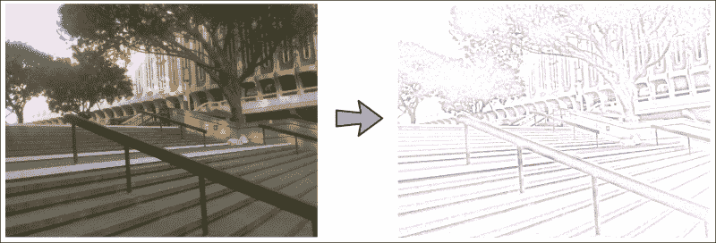
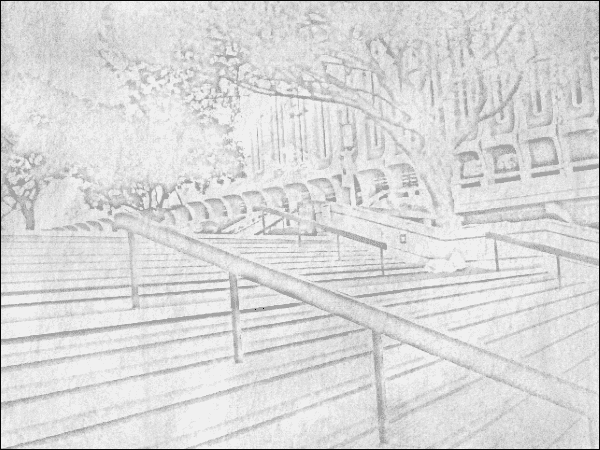
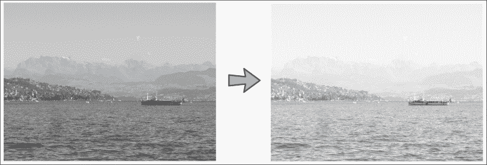
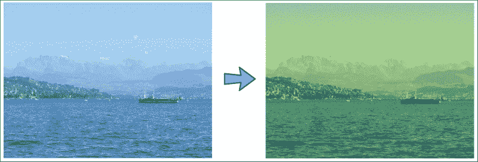
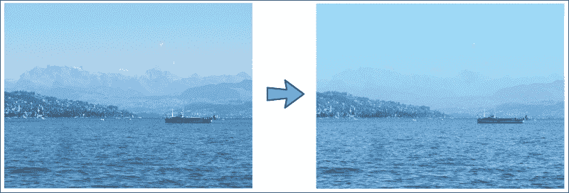
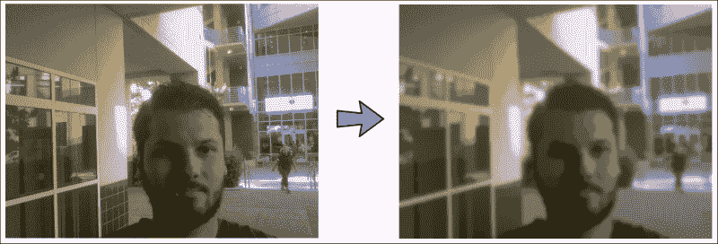
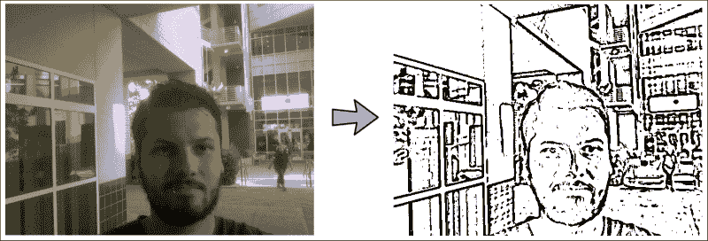
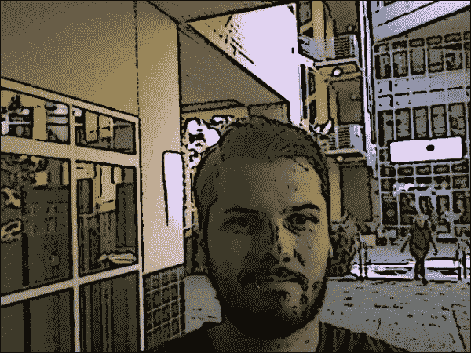
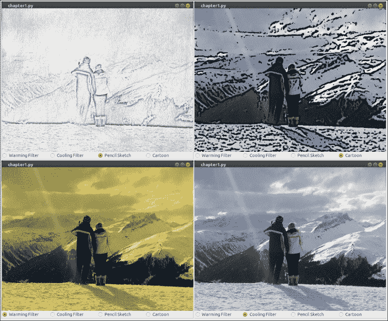

# 第 1 章。过滤器的乐趣

本章的目的是开发许多图像处理过滤器，并将其实时应用于网络摄像头的视频流。 这些过滤器将依靠各种 OpenCV 函数来通过拆分，合并，算术运算以及为复杂函数应用查找表来操纵矩阵。

这三种效果如下：

*   **黑白铅笔素描**：为使产生此效果，我们将使用两种图像融合技术，即，**淡化和加深**
*   **加热/冷却过滤器**：为使产生这些效果，我们将使用查找表实现我们自己的**曲线过滤器**
*   **卡通化器**：要创建这种效果，我们将结合使用**双边过滤器**，**中值过滤器**和**自适应阈值**

OpenCV 是一种高级工具链，通常的问题不是如何从头开始实现某些东西，而是要选择哪种预定义的实现来满足您的需求。 如果您有很多可用的计算资源，则生成复杂的效果并不难。 挑战通常在于寻找一种不仅可以完成工作而且还要及时完成的​​方法。

与其通过理论课教授图像处理的基本概念，我们将采用一种实用的方法，并开发一个集成了多种图像过滤技术的端到端应用程序。 我们将运用我们的理论知识来寻求一个不仅可以工作而且可以加快看似复杂的效果的解决方案，以便笔记本电脑可以实时生产它们。

以下屏幕截图显示了在笔记本电脑上运行的三种效果的最终结果：


### 注意

本书中的所有代码均针对 OpenCV 2.4.9，并已在 Ubuntu 14.04 上进行了测试。 在本书中，我们将广泛使用 [NumPy 软件包](http://www.numpy.org)。 此外，本章还需要 SciPy 软件包的[`UnivariateSpline`模块](http://www.scipy.org)以及 [wxPython 2.8 图形化用户界面](http://www.wxpython.org/download.php)，用于跨平台的 GUI 应用程序。 我们将尽可能地避免进一步的依赖。

# 规划应用

最终的应用程序将包含以下模块和脚本：

*   `filters`：模块包含针对三种不同图像效果的不同类别。 模块化方法将使我们能够独立使用任何**图形用户界面**（**GUI**）的过滤器。
*   `filters.PencilSketch`：用于将铅笔素描效果应用于 RGB 彩色图像的类。
*   `filters.WarmingFilter`：类别，用于将预热过滤器应用于 RGB 彩色图像。
*   `filters.CoolingFilter`：类别，用于将冷却过滤器应用于 RGB 彩色图像。
*   `filters.Cartoonizer`：一种用于将卡通化效果应用于 RGB 彩色图像的方法。
*   `gui`：一个模块，为提供一个 wxPython GUI 应用程序来访问网络摄像头并显示摄像头供稿，我们将在本书中广泛使用该模块。
*   `gui.BaseLayout`：可从中构建更复杂布局的通用布局。
*   `chapter1`：本章的主要脚本。
*   `chapter1.FilterLayout`：基于`gui.BaseLayout`的自定义布局，显示相机供稿和一行单选按钮，允许用户从可用的图像过滤器中进行选择，以将其应用于相机供稿的每一帧。
*   `chapter1.main`：用于启动 GUI 应用程序和访问网络摄像头的主要功能例程。

# 创建黑白铅笔素描

为了获得相机帧的铅笔素描（即黑白图），我们将使用两种图像融合技术，分别是，**淡化和加深**。 这些术语是指在传统摄影的打印过程中使用的技术； 摄影师可以控制暗室打印物中某个区域的曝光时间，以使其变暗或变暗。 淡化使图像变亮，而加深使图像变暗。

不应该进行更改的区域由**遮罩**保护。 如今，现代的图像编辑程序，例如 Photoshop 和 Gimp，提供了在数字图像中模拟这些效果的方法。 例如，掩模仍然被用来模仿改变图像曝光时间的效果，其中具有相对强的值的掩模区域将*更多地暴露*图像，从而使图像变亮。 OpenCV 没有提供实现这些技术的本机功能，但是有了一点见识和一些技巧，我们将得出我们自己的有效实现，可以用来产生漂亮的铅笔素描效果。

如果在互联网上搜索，可能会偶然发现以下常用步骤，以从 RGB 彩色图像中获得铅笔素描：

1.  将彩色图像转换为灰度。
2.  反转灰度图像得到底片。
3.  将高斯模糊应用于步骤 2 中的底片。
4.  使用彩色减淡功能将步骤 1 的灰度图像与步骤 3 的模糊底片混合。

第 1 步到第 3 步很简单，而第 4 步可能有些棘手。 让我们先解决这个问题。

### 注意

OpenCV 3 附带了铅笔素描效果。 `cv2.pencilSketch`函数使用由 Eduardo Gastal 和 Manuel Oliveira 在 2011 年论文《使用在域变换中引入的域过滤器的边缘感知的图像和视频处理》。 但是，出于本书的目的，我们将开发自己的过滤器。

## 在 OpenCV 中实现淡化和加深

在现代图像编辑工具（例如 Photoshop）中，对带有掩膜`B`的图像`A`的颜色减淡实现为以下三元语句，作用于称为`idx`的每个像素索引：

```py
((B[idx] == 255) ? B[idx] : min(255, ((A[idx] << 8) / (255-B[idx]))))
```

本质上，将`A[idx]`图像像素的值除以`B[idx]`遮罩像素值的倒数，同时确保所得的像素值将在`[0, 255]`的范围内，并且不被零除。

我们可以将其转换为以下朴素的 Python 函数，该函数接受两个 OpenCV 矩阵（`image`和`mask`）并返回混合图像：

```py
def dodgeNaive(image, mask):
    # determine the shape of the input image
    width,height = image.shape[:2]

    # prepare output argument with same size as image
    blend = np.zeros((width,height), np.uint8)

    for col in xrange(width):
        for row in xrange(height):

            # shift image pixel value by 8 bits
            # divide by the inverse of the mask
            tmp = (image[c,r] << 8) / (255.-mask)

            # make sure resulting value stays within bounds
            if tmp > 255:
                tmp = 255
            blend[c,r] = tmp
    return blend
```

您可能已经猜到了，尽管这段代码在功能上可能是正确的，但无疑会非常慢。 首先，该函数使用`for`循环，这在 Python 中几乎总是一个坏主意。 其次，NumPy 数组（Python 中 OpenCV 图像的基本格式）针对数组计算进行了优化，因此分别访问和修改每个`image[c,r]`像素将非常慢。

相反，我们应该意识到`<<8`操作与将像素值乘以`2 ^ 8 = 256`的次数相同，并且可以通过`cv2.divide`函数实现按像素划分。 因此，我们的闪避功能的改进版本可能如下所示：

```py
import cv2

def dodgeV2(image, mask):
    return cv2.divide(image, 255-mask, scale=256)
```

我们将闪避功能减少到了一行！ `dodgeV2`函数产生的结果与`dodgeNaive`相同，但是速度要快几个数量级。 此外，`cv2.divide`自动处理零除，使`255-mask`为零的结果`0`。

现在，的实现很简单，可以实现类似的加深功能，该功能将反转的图像除以反转的遮罩并反转结果：

```py
import cv2

def burnV2(image, mask):
    return 255 – cv2.divide(255-image, 255-mask, scale=256)
```

## 铅笔素描变换

有了这些技巧，我们现在就可以看看整个过程了。 最终代码将在`filters`模块中位于其自己的类中。 将彩色图像转换为灰度后，我们的目标是将该图像与其模糊的负片混合：

1.  我们导入 OpenCV 和`numpy`模块：

    ```py
    import cv2
    import numpy as np
    ```

2.  实例化`PencilSketch`类：

    ```py
    class PencilSketch:
        def __init__(self, (width, height), bg_gray='pencilsketch_bg.jpg'):
    ```

    此类的构造函数将接受图像尺寸以及可选的背景图像，我们将在稍后使用它。 如果文件存在，我们将打开它并缩放到合适的大小：

    ```py
    self.width = width
    self.height = height

    # try to open background canvas (if it exists)
    self.canvas = cv2.imread(bg_gray, cv2.CV_8UC1)
    if self.canvas is not None:
        self.canvas = cv2.resize(self.canvas, (self.width, self.height))
    ```

3.  添加将执行铅笔素描的渲染方法：

    ```py
    def renderV2(self, img_rgb):
    ```

4.  将 RGB 图像（`imgRGB`）转换为灰度很简单：

    ```py
    img_gray = cv2.cvtColor(img_rgb, cv2.COLOR_RGB2GRAY)
    ```

    请注意，输入图像是 RGB 还是 BGR 都没有关系。

5.  然后，我们反转图像并使用大小为`(21,21)`的高斯高斯核模糊它：

    ```py
    img_gray_inv = 255 – img_gray
    img_blur = cv2.GaussianBlur(img_gray_inv, (21,21), 0, 0)
    ```

6.  我们使用上述代码中的`dodgeV2`闪避功能将原始灰度图像与模糊逆混合：

    ```py
    img_blend = dodgeV2(mg_gray, img_blur)
    return cv2.cvtColor(img_blend, cv2.COLOR_GRAY2RGB)
    ```

生成的图像如下所示：



您是否注意到我们的代码可以进一步优化？

高斯模糊本质上是具有高斯函数的卷积。 卷积的优点之一是它们的关联属性。 这意味着我们先反转图像然后对其进行模糊处理，还是先模糊图像然后对其进行反转都没有关系。

“那有什么关系呢？” 你可能会问。 好吧，如果我们从模糊的图像开始并将其逆传递给`dodgeV2`函数，则在该函数中，图像将再次反转（`255-mask`部分），本质上会产生原始图像。 如果我们摆脱了这些多余的操作，经过优化的`render`方法将如下所示：

```py
def render(img_rgb):
    img_gray = cv2.cvtColor(img_rgb, cv2.COLOR_BGR2GRAY)
    img_blur = cv2.GaussianBlur(img_gray, (21,21), 0, 0)
    img_blend = cv2.divide(img_gray, img_blur, scale=256)
    return img_blend
```

对于踢脚和傻笑，我们想将转换后的图像（`img_blend`）与背景图像（`self.canvas`）轻轻混合，使其看起来就像在画布上绘制了图像一样：

```py
if self.canvas is not None:
    img_blend = cv2.multiply(img_blend, self.canvas, scale=1./256)
return cv2.cvtColor(img_blend, cv2.COLOR_GRAY2BGR)
```

我们完成了！ 最终输出如下所示：



# 生成加热/冷却过滤器

当我们感知图像时，我们的大脑会从许多微妙的线索中推断出有关场景的重要细节。 例如，在明亮的日光下，高光可能会因为在阳光直射下而具有淡黄色的色彩，而阴影可能会由于蓝天的环境光而显得略带蓝色。 当我们查看具有这种颜色属性的图像时，我们可能会立即想到*晴天*。

对于有时会故意操纵图像的白平衡以传达某种情绪的摄影师而言，这种效果并不神秘。 暖色通常被认为更令人愉悦，而冷色则与夜晚和昏暗有关。

为了操纵图像的感知到的**色温**，我们将实现和**曲线过滤器**。 这些过滤器控制颜色过渡在图像的不同区域之间的出现方式，从而使我们能够巧妙地移动色谱，而不会给图像增加看起来不自然的整体色调。

## 通过曲线移动的色彩操作

曲线过滤器本质上是`y = f(x)`的函数，其将输入像素值`x`映射到输出像素值`y`。 通过一组`n + 1`锚点对曲线进行参数化，如下所示：`{(x[0], y[0]), (x[1], y[1]), ..., (x[n], y[n])}`。

每个锚点都是一对数字，分别代表输入和输出像素值。 例如，对`(30, 90)`表示输入像素值 30 增加到输出值 90。锚点之间的值沿着平滑曲线插值（因此，名称曲线过滤器） 。

这种过滤器可以应用于任何图像通道，无论是单个灰度通道还是 RGB 彩色图像的 R，G 和 B 通道。 因此，出于我们的目的，`x`和`y`的所有值必须保持在 0 到 255 之间。

例如，如果我们想使灰度图像稍微亮一些，可以使用带有以下控制点集的曲线过滤器：`{(0, 0), (128, 192), (255, 255)}`。 这意味着除 0 和 255 以外的所有输入像素值都会略微增加，从而导致图像的整体增亮效果。

如果我们希望这样的过滤器产生看起来自然的图像，则必须遵守以下两个规则：

*   每组锚点都应包括`(0, 0)`和`(255, 255)`。 这对于防止图像看起来好像具有整体色调非常重要，因为黑色保持黑色，白色保持白色。
*   函数`f(x)`应该单调增加。 换句话说，随着`x`的增加，`f(x)`保持不变或增加（即，从不减少）。 这对于确保阴影仍然是阴影而高光仍然是高光非常重要。

## 使用查找表实现曲线过滤器

曲线过滤器在计算上是昂贵，因为每当`x`与预定锚点之一不一致时，都必须插值`f(x)`的值 。 对我们遇到的每个图像帧的每个像素执行此计算将对性能产生巨大影响。

相反，我们使用查找表。 由于出于我们的目的，只有 256 个可能的像素值，因此我们只需要为`x`的所有 256 个可能值计算`f(x)`。 插值由`scipy.interpolate`模块的`UnivariateSpline`功能处理，如以下代码片段所示：

```py
from scipy.interpolate import UnivariateSpline

def _create_LUT_8UC1(self, x, y):
  spl = UnivariateSpline(x, y)
  return spl(xrange(256))
```

函数的`return`自变量是一个 256 个元素的列表，其中包含`x`的每个可能值的内插的`f(x)`值。

现在，我们需要做的只是一组锚点`(x[i], y[i])`，我们准备将过滤器应用于灰度输入图像（`img_gray`）：

```py
import cv2
import numpy as np

x = [0, 128, 255]
y = [0, 192, 255]
myLUT = _create_LUT_8UC1(x, y)
img_curved = cv2.LUT(img_gray, myLUT).astype(np.uint8)
```

结果看起来像这样（原始图像在左侧，转换后的图像在右侧）：



## 设计加热/冷却效果

通过机制，可以将通用曲线过滤器快速应用于适当的任何图像通道，现在我们来探讨如何操纵图像的感知色温的问题。 同样，最终代码将在`filters`模块中具有其自己的类。

如果您有空余时间，建议您暂时尝试一下不同的曲线设置。 您可以选择任意数量的锚点，并将曲线过滤器应用于您可以想到的任何图像通道（红色，绿色，蓝色，色相，饱和度，亮度，亮度等）。 您甚至可以合并多个通道，或减少一个通道，然后将另一个通道转移到所需区域。 结果会是什么样？

但是，如果各种可能性使您眼花，乱，请采取更为保守的方法。 首先，通过使用前面步骤中开发的`_create_LUT_8UC1`函数，我们定义两个通用曲线过滤器，一个（按趋势）增加通道的所有像素值，而一个通常降低它们：

```py
class WarmingFilter:

  def __init__(self):
    self.incr_ch_lut = _create_LUT_8UC1([0, 64, 128, 192, 256],
      [0, 70, 140, 210, 256])
    self.decr_ch_lut = _create_LUT_8UC1([0, 64, 128, 192, 256],
      [0, 30,  80, 120, 192])
```

使图像看起来像是在炎热的晴天（可能接近日落）拍摄时，最简单的方法是增加图像中的红色并通过增加色彩饱和度使颜色显得鲜艳。 我们将分两步实现：

1.  分别使用`incr_ch_lut`和`decr_ch_lut`分别增加 RGB 彩色图像的 R 通道中的像素值和 B 通道中的像素值：

    ```py
    def render(self, img_rgb):
        c_r, c_g, c_b = cv2.split(img_rgb)
        c_r = cv2.LUT(c_r, self.incr_ch_lut).astype(np.uint8)
        c_b = cv2.LUT(c_b, self.decr_ch_lut).astype(np.uint8)
        img_rgb = cv2.merge((c_r, c_g, c_b))
    ```

2.  将图像转换为和 **HSV** 色彩空间（`H`表示色相，`S`表示饱和度，`V`表示值）， 并使用`incr_ch_lut`增加 S 通道。 这可以通过以下功能来实现，需要 RGB 彩色图像作为输入：

    ```py
    c_b = cv2.LUT(c_b, decrChLUT).astype(np.uint8)

    # increase color saturation
    c_h, c_s, c_v = cv2.split(cv2.cvtColor(img_rgb, 
        cv2.COLOR_RGB2HSV))
    c_s = cv2.LUT(c_s, self.incr_ch_lut).astype(np.uint8)
    return cv2.cvtColor(cv2.merge((c_h, c_s, c_v)), 
        cv2.COLOR_HSV2RGB)
    ```

结果如下所示：



类似地，我们可以定义一个冷却过滤器，该过滤器增加 RGB 图像的 B 通道中的像素值，减小 R 通道中的像素值，将图像转换为 HSV 色彩空间，并通过 S 降低色彩饱和度通道：

```py
class CoolingFilter:

    def render(self, img_rgb):

        c_r, c_g, c_b = cv2.split(img_rgb)
        c_r = cv2.LUT(c_r, self.decr_ch_lut).astype(np.uint8)
        c_b = cv2.LUT(c_b, self.incr_ch_lut).astype(np.uint8)
        img_rgb = cv2.merge((c_r, c_g, c_b))

        # decrease color saturation
        c_h, c_s, c_v = cv2.split(cv2.cvtColor(img_rgb, cv2.COLOR_RGB2HSV))
        c_s = cv2.LUT(c_s, self.decr_ch_lut).astype(np.uint8)
        return cv2.cvtColor(cv2.merge((c_h, c_s, c_v)), cv2.COLOR_HSV2RGB)
```

现在，结果看起来像这样：



# 卡通化图像

在过去的几年中，专业的卡通化软件迅速出现。 为了实现基本的卡通效果，我们需要的是**双边过滤器**和一些**边缘检测**。 双边过滤器将减少调色板或图像中使用的颜色数。 这模仿了卡通图画，其中漫画家通常只有很少的颜色可以使用。 然后，我们可以对生成的图像进行边缘检测，以生成粗体轮廓。 然而，真正的挑战在于双边过滤器的计算成本。 因此，我们将使用一些技巧来实时产生可接受的卡通效果。

我们将遵循以下过程将 RGB 彩色图像转换为卡通图像：

1.  应用双边过滤器来减少图像的调色板。
2.  将原始彩色图像转换为灰度。
3.  应用**中值模糊**来减少图像噪声。
4.  使用**自适应阈值**检测并强调边缘遮罩中的边缘。
5.  将步骤 1 中的彩色图像与步骤 4 中的边缘遮罩合并。

## 使用双边过滤器的边缘感知的平滑

强大的双边过滤器非常适合将 RGB 图像转换为彩色绘画或卡通，因为它可以平滑平坦区域，同时保持边缘清晰。 过滤器的唯一缺点似乎是其计算成本，因为它比其他平滑操作（例如高斯模糊）要慢几个数量级。

当我们需要减少计算成本时，要采取的第一个措施是对低分辨率的图像执行操作。 为了将 RGB 图像（`imgRGB`）缩小到其尺寸的四分之一（将宽度和高度减小到一半），我们可以使用`cv2.resize`：

```py
import cv2

img_small = cv2.resize(img_rgb, (0,0), fx=0.5, fy=0.5)
```

调整大小后的图像中的像素值将对应于原始图像中小邻域的像素平均值。 但是，此过程可能会产生图像伪影，这也称为混叠。 尽管这本身就够糟糕的，但可以通过后续处理（例如边缘检测）来增强效果。

更好的替代方法可能是使用**高斯金字塔**进行缩放（缩小至原始大小的四分之一）。 高斯金字塔由模糊操作组成，该操作在对图像重新采样之前执行，从而减少了混叠效果：

```py
img_small = cv2.pyrDown(img_rgb)
```

但是，即使在这种规模下，双边过滤器仍然可能太慢而无法实时运行。 另一个技巧是重复（例如五次）对图像应用一个小的双边过滤器，而不是一次应用一个大的双边过滤器：

```py
num_iter = 5
for _ in xrange(num_iter):
    img_small = cv2.bilateralFilter(img_small, d=9, sigmaColor=9, sigmaSpace=7)
```

`cv2.bilateralFilter`中的三个参数控制像素邻域（`d`）的直径以及过滤器在色彩空间（`sigmaColor`）和坐标空间（`sigmaSpace`）中的标准偏差。

不要忘记将图像恢复到原始大小：

```py
img_rgb = cv2.pyrUp(img_small)
```

结果看起来像是一个令人毛骨悚然的程序员的彩色绘画，如下所示：



## 检测并强调突出的边缘

同样，当用于边缘检测时，挑战通常不在于底层算法如何工作，而在于为手头任务选择哪种特定算法。 您可能已经熟悉各种边缘检测器。 例如，**Canny 边缘检测**（`cv2.Canny`）提供了一种相对简单有效的方法来检测图像中的边缘，但是它容易受到噪声的影响。

**Sobel** 运算符（`cv2.Sobel`）可以减少此类伪像，但它不是旋转对称的。 **Scharr** 运算符（`cv2.Scharr`）的目标是对此进行校正，但仅查看第一个图像导数。 如果您感兴趣，还有更多运算符，例如**拉普拉斯算子**或**山脊**运算符（包括二阶导数），但它们却很更复杂。 最后，出于我们的特定目的，它们可能看起来并不好，可能是因为它们与其他算法一样容易受到光照条件的影响。

出于本项目的目的，我们将选择甚至与常规边缘检测都不相关的功能-`cv2.adaptiveThreshold`。 像`cv2.threshold`一样，此功能使用阈值像素值将灰度图像转换为二进制图像。 也就是说，如果原始图像中的像素值大于阈值，则最终图像中的像素值将为 255。否则，它将为 0。但是，自适应阈值的优点在于它不会考虑图像的整体属性。 取而代之的是，它独立于每个小邻域中检测最显着的特征，而不考虑全局图像的最优性。 这使算法在光照条件下具有极强的鲁棒性，这正是我们试图在卡通物体和人物周围绘制粗体，黑色轮廓时所需要的。

但是，这也使算法易受噪声影响。 为了解决这个问题，我们将使用中值过滤器对图像进行预处理。 中值过滤器按照其名称的含义运行； 它将每个像素值替换为小像素邻域中所有像素的中值。 我们首先将 RGB 图像（`img_rgb`）转换为灰度（`img_gray`），然后应用具有七个像素局部邻域的中值模糊：

```py
# convert to grayscale and apply median blur
img_gray = cv2.cvtColor(img_rgb, cv2.COLOR_RGB2GRAY)
img_blur = cv2.medianBlur(img_gray, 7)
```

降低噪声后，现在可以使用自适应阈值检测和增强边缘。 即使剩下一些图像噪声，带`blockSize=9`的`cv2.ADAPTIVE_THRESH_MEAN_C`算法也可以确保将阈值应用于`9 x 9`邻域平均值`C=2`的平均值：

```py
img_edge = cv2.adaptiveThreshold(img_blur, 255, cv2.ADAPTIVE_THRESH_MEAN_C, cv2.THRESH_BINARY, 9, 2)
```

### 注意

**下载示例代码**

您可以从[这个页面](http://www.packtpub.com)上的帐户下载示例代码文件，以获取已购买的所有 Packt Publishing 图书。 如果您在其他地方购买了此书，则可以访问[这个页面](http://www.packtpub.com/support)并注册以将文件直接通过电子邮件发送给您。

自适应阈值的结果如下所示：



## 组合颜色和轮廓以制作卡通

最后一步是将两者合并。 只需使用`cv2.bitwise_and`将两种效果融合在一起成为一张图像。 完整的功能如下：

```py
def render(self, img_rgb):
    numDownSamples = 2 # number of downscaling steps
    numBilateralFilters = 7  # number of bilateral filtering steps

    # -- STEP 1 --
    # downsample image using Gaussian pyramid
    img_color = img_rgb
    for _ in xrange(numDownSamples):
        img_color = cv2.pyrDown(img_color)

    # repeatedly apply small bilateral filter instead of applying
    # one large filter
    for _ in xrange(numBilateralFilters):
        img_color = cv2.bilateralFilter(img_color, 9, 9, 7)

    # upsample image to original size
    for _ in xrange(numDownSamples):
        img_color = cv2.pyrUp(img_color)

    # -- STEPS 2 and 3 --
    # convert to grayscale and apply median blur
    img_gray = cv2.cvtColor(img_rgb, cv2.COLOR_RGB2GRAY)
    img_blur = cv2.medianBlur(img_gray, 7)

    # -- STEP 4 --
    # detect and enhance edges
    img_edge = cv2.adaptiveThreshold(img_blur, 255,
        cv2.ADAPTIVE_THRESH_MEAN_C, cv2.THRESH_BINARY, 9, 2)

    # -- STEP 5 --
    # convert back to color so that it can be bit-ANDed
    # with color image
    img_edge = cv2.cvtColor(img_edge, cv2.COLOR_GRAY2RGB)
    return cv2.bitwise_and(img_color, img_edge)
```

结果如下所示：



# 全部放在一起

在以交互方式使用设计的图像过滤器效果之前，我们需要设置主脚本并设计 GUI 应用程序。

## 运行应用

要运行应用程序，我们将转到`chapter1.py.`脚本，我们将从导入所有必需的模块开始：

```py
import numpy as np

import wx
import cv2
```

我们还必须导入通用的 GUI 布局（从`gui`）和所有设计的图像效果（从`filters`）：

```py
from gui import BaseLayout
from filters import PencilSketch, WarmingFilter, CoolingFilter, Cartoonizer
```

OpenCV 提供了一种直接的方法来访问计算机的网络摄像头或摄像头设备。 以下代码段使用`cv2.VideoCapture`打开计算机的默认摄像机 ID（`0`）：

```py
def main():
    capture = cv2.VideoCapture(0)
```

在某些平台上，对`cv2.VideoCapture`的首次调用无法打开通道。 在这种情况下，我们可以通过自己打开渠道来提供解决方法：

```py
if not(capture.isOpened()):
    capture.open() 
```

为了给我们的应用程序一个实时运行的机会，我们将视频流的大小限制为`640 x 480`像素：

```py
capture.set(cv2.cv.CV_CAP_PROP_FRAME_WIDTH, 640)
capture.set(cv2.cv.CV_CAP_PROP_FRAME_HEIGHT, 480)
```

### 注意

如果使用的是 OpenCV 3，则所要查找的常量可能称为`cv3.CAP_PROP_FRAME_WIDTH`和`cv3.CAP_PROP_FRAME_HEIGHT`。

然后，可以将`capture`流传递到我们的 GUI 应用程序，该应用程序是`FilterLayout`类的实例：

```py
    # start graphical user interface
    app = wx.App()
    layout = FilterLayout(None, -1, 'Fun with Filters', capture)
    layout.Show(True)
    app.MainLoop()
```

现在唯一要做的就是设计上述 GUI。

## GUI 基类

`FilterLayout` GUI 将基于称为`BaseLayout`的通用平面布局类，我们也将在以后的章节中使用它。

`BaseLayout`类被设计为**抽象基类**。 您可以将此类视为可以应用于我们尚未设计的所有布局的蓝图或配方-如果您愿意，可以将其作为骨架类，用作将来所有 GUI 代码的基础。 为了使用抽象类，我们需要以下`import`语句：

```py
from abc import ABCMeta, abstractmethod
```

我们还包括其他一些有用的模块，特别是`wx` Python 模块和 OpenCV（当然）：

```py
import time

import wx
import cv2
```

该类被设计为从蓝图或框架派生，即`wx.Frame`类。 我们还通过添加`__metaclass__`属性将类标记为抽象类：

```py
class BaseLayout(wx.Frame):
    __metaclass__ = ABCMeta
```

稍后，当我们编写自己的自定义布局（`FilterLayout`）时，将使用相同的符号指定该类基于`BaseLayout`蓝图（或骨架）类，例如，在`class FilterLayout(BaseLayout):`中。 但是现在，让我们集中讨论`BaseLayout`类。

抽象类至少具有一个抽象方法。 抽象方法类似于指定某种方法必须存在，但是我们不确定当时的外观。 例如，假设`BaseLayout`包含如下指定的方法：

```py
@abstractmethod
def _init_custom_layout(self):pass
```

然后，派生自该类的任何类，例如`FilterLayout`，都必须指定具有该确切签名的方法的完全充实的实现。 稍后您将看到，这将使我们能够创建自定义布局。

但是首先，让我们进入 GUI 构造器。

### GUI 构造器

`BaseLayout`构造函数接受一个 I​​D（`-1`），一个标题字符串（`'Fun with Filters'`），一个视频捕获对象以及一个可选参数，该参数指定每秒的帧数。 然后，在构造函数中要做的第一件事是尝试从捕获的对象中读取一帧以确定图像大小：

```py
def __init__(self, parent, id, title, capture, fps=10):
    self.capture = capture
    # determine window size and init wx.Frame
    _, frame = self.capture.read()
    self.imgHeight,self.imgWidth = frame.shape[:2]
```

我们将使用图像大小准备一个缓冲区，该缓冲区将每个视频帧存储为位图，并设置 GUI 的大小。 因为我们想在当前视频帧下方显示一堆控制按钮，所以我们将 GUI 的高度设置为`self.imgHeight+20`：

```py
self.bmp = wx.BitmapFromBuffer(self.imgWidth, 
    self.imgHeight, frame)
wx.Frame.__init__(self, parent, id, title,size=(self.imgWidth, self.imgHeight+20))
```

然后，我们提供了两种方法来初始化更多参数并创建 GUI 的实际布局：

```py
self._init_base_layout()
self._create_base_layout()
```

### 处理视频流

网络摄像头的视频流由`_init_base_layout`方法开始的一系列步骤处理。 这些步骤起初看起来可能过于复杂，但是它们是使视频即使在更高的帧速率下也能平稳运行的必要条件（也就是说，可以防止闪烁）。

`wxPython`模块可用于事件和回调方法。 当某个事件被触发时，它可以导致某个类方法被执行（换句话说，一种方法可以将*绑定*到事件）。 我们将利用这种机制来发挥优势，并经常通过以下步骤来显示新的框架：

1.  我们创建了一个计时器，只要经过 1000/fps 毫秒，它就会生成`wx.EVT_TIMER`事件：

    ```py
    def _init_base_layout(self):
        self.timer = wx.Timer(self)
        self.timer.Start(1000./self.fps)
    ```

2.  每当计时器启动时，我们都希望调用`_on_next_frame`方法。 它将尝试获取新的视频帧：

    ```py
    self.Bind(wx.EVT_TIMER, self._on_next_frame)
    ```

3.  `_on_next_frame`方法将处理新的视频帧并将处理后的帧存储在位图中。 这将触发另一个事件`wx.EVT_PAINT`。 我们想将此事件绑定到`_on_paint`方法，该方法将在显示器上绘制新的帧：

    ```py
    self.Bind(wx.EVT_PAINT, self._on_paint)
    ```

`_on_next_frame`方法抓取一个新帧，完成后，将该帧发送给另一个方法`__process_frame`进行进一步处理：

```py
def _on_next_frame(self, event):
    ret, frame = self.capture.read()
    if ret:
        frame = self._process_frame(cv2.cvtColor(frame,cv2.COLOR_BGR2RGB))
```

然后将已处理的帧（`frame`）存储在位图缓冲区（`self.bmp`）中：

```py
self.bmp.CopyFromBuffer(frame)
```

调用`Refresh`会触发上述`wx.EVT_PAINT`事件，该事件绑定到`_on_paint`：

```py
self.Refresh(eraseBackground=False)
```

然后`paint`方法从缓冲区中抓取帧并将其显示：

```py
def _on_paint(self, event):
    deviceContext = wx.BufferedPaintDC(self.pnl)
    deviceContext.DrawBitmap(self.bmp, 0, 0)
```

### 基本的 GUI 布局

通用布局的创建通过称为`_create_base_layout`的方法完成。 最基本的布局仅由一个大的黑色面板组成，该面板提供了足够的空间来显示视频供稿：

```py
def _create_base_layout(self):
    self.pnl = wx.Panel(self, -1,
                        size=(self.imgWidth, self.imgHeight))
    self.pnl.SetBackgroundColour(wx.BLACK)
```

为了使布局可扩展，我们将其添加到垂直排列的`wx.BoxSizer`对象中：

```py
self.panels_vertical = wx.BoxSizer(wx.VERTICAL)
self.panels_vertical.Add(self.pnl, 1, flag=wx.EXPAND)
```

接下来，我们指定一个抽象方法`_create_custom_layout`，对于该方法，我们将不填写任何代码。 相反，我们基类的任何用户都可以对基本布局进行自己的自定义修改：

```py
self._create_custom_layout()
```

然后，我们只需要设置结果布局的最小尺寸并将其居中即可：

```py
self.SetMinSize((self.imgWidth, self.imgHeight))
self.SetSizer(self.panels_vertical)
self.Centre()
```

## 自定义过滤器布局

现在我们即将完成！ 如果要使用`BaseLayout`类，则需要为以前留空的三种方法提供代码：

*   `_init_custom_layout`：这是我们可以初始化特定于任务的参数的
*   `_create_custom_layout`：这是，我们可以在其中对 GUI 布局进行特定于任务的修改
*   `_process_frame`：这是，我们在其中对摄像机供稿的每个捕获帧执行特定于任务的处理

在这一点上，初始化图像过滤器是不言自明的，因为它只需要我们实例化相应的类：

```py
def _init_custom_layout(self):
    self.pencil_sketch = PencilSketch((self.imgWidth, 
        self.imgHeight))
    self.warm_filter = WarmingFilter()
    self.cool_filter = CoolingFilter()
    self.cartoonizer = Cartoonizer()
```

为了自定义布局，我们水平排列了多个单选按钮，每个图像效果模式一个按钮：

```py
def _create_custom_layout(self):
    # create a horizontal layout with all filter modes
    pnl = wx.Panel(self, -1 )
    self.mode_warm = wx.RadioButton(pnl, -1, 'Warming Filter',
        (10, 10), style=wx.RB_GROUP)
    self.mode_cool = wx.RadioButton(pnl, -1, 'Cooling Filter', 
        (10, 10))
    self.mode_sketch = wx.RadioButton(pnl, -1, 'Pencil Sketch',
        (10, 10))
    self.mode_cartoon = wx.RadioButton(pnl, -1, 'Cartoon',
        (10, 10))
    hbox = wx.BoxSizer(wx.HORIZONTAL)
    hbox.Add(self.mode_warm, 1)
    hbox.Add(self.mode_cool, 1)
    hbox.Add(self.mode_sketch, 1)
    hbox.Add(self.mode_cartoon, 1)
    pnl.SetSizer(hbox)
```

在此，`style=wx.RB_GROUP`选项可确保一次只能选择这些单选按钮之一。

为了使这些更改生效，需要将`pnl`添加到现有面板列表中：

```py
self.panels_vertical.Add(pnl, flag=wx.EXPAND | wx.BOTTOM | wx.TOP, border=1)
```

最后要指定的方法是`_process_frame`。 回想一下，只要接收到新的相机帧，就会触发此方法。 我们需要做的就是选择要应用的正确图像效果，这取决于单选按钮的配置。 我们只需检查当前选择了哪个按钮，然后调用相应的`render`方法：

```py
def _process_frame(self, frame_rgb):
    if self.mode_warm.GetValue():
        frame = self.warm_filter.render(frame_rgb)
    elif self.mode_cool.GetValue():
        frame = self.cool_filter.render(frame_rgb)
    elif self.mode_sketch.GetValue():
        frame = self.pencil_sketch.render(frame_rgb)
    elif self.mode_cartoon.GetValue():
        frame = self.cartoonizer.render(frame_rgb)
```

不要忘记返回已处理的帧：

```py
return frame
```

我们完成了！

这是结果：



# 总结

在本章中，我们探讨了许多有趣的图像处理效果。 我们使用淡化和加深来创建黑白铅笔素描效果，探索了查找表以实现曲线过滤器的有效实现，并具有创造卡通效果的创造力。

在下一章中，我们将稍作调整，并探索使用深度传感器（例如 Microsoft Kinect 3D）来实时识别手势。