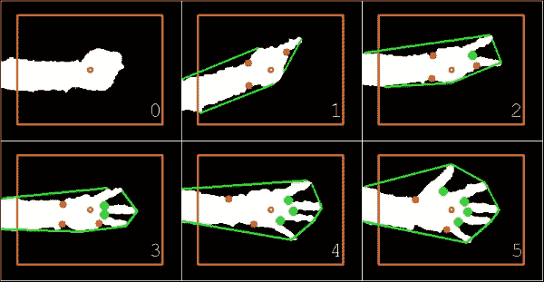
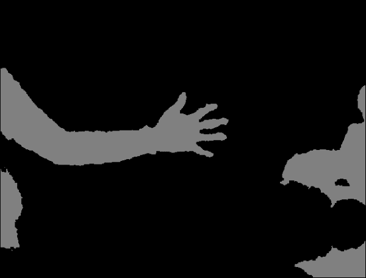
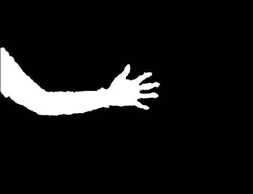
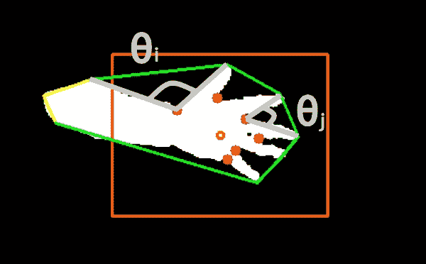
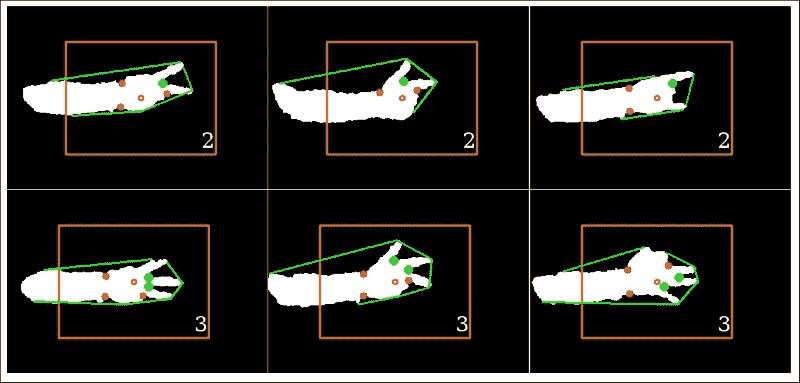

# 十八、使用 Kinect 深度传感器的手势识别

本章的目的是开发一个应用，该应用使用深度传感器（例如 Microsoft Kinect 3D 传感器或 Asus Xtion）的输出实时检测和跟踪简单手势。 该应用将分析每个捕获的帧以执行以下任务：

*   **手部区域分割**：将通过分析 Kinect 传感器的**深度图**输出在每帧中提取用户的手部区域，此操作由完成**阈值化**，应用一些**形态学操作**，然后发现**连通组件**
*   **手形分析**：将通过确定**轮廓**，**凸包** **凸度缺陷**来分析分段的手部区域的形状
*   **手势识别**：将根据手部轮廓的**凸度缺陷**确定伸出手指的数量，然后将手势分类（没有伸出手指） 对应于拳头，五个伸出的手指对应于张开的手）

手势识别是计算机科学中一个非常受欢迎的话题。 这是因为它不仅使人类能够与机器进行通信（人机交互或 HMI），而且还构成了机器开始理解人类语言的第一步。 借助价格实惠的传感器（例如 Microsoft Kinect 或 Asus Xtion）以及开源软件（例如 OpenKinect 和 OpenNI），您自己在该领域就很难开始。 那么，我们将如何使用所有这些技术？

我们将在本章中实现的算法的优点在于，它适用于许多手势，但是足够简单，可以在通用笔记本电脑上实时运行。 同样，如果需要，我们可以轻松地将其扩展为合并更复杂的手势估计。 最终产品如下所示：



无论我伸出左手的手指有多少，该算法都会正确地分割手部区域（白色），绘制相应的凸包（围绕手的绿线），找到属于手指间空间的所有凸度缺陷（绿色的大点），而忽略其他手指（红色的小点），即使是拳头，也可以推断出正确的伸出手指数（右下角的数字）。

### 注意

本章假定您已安装 Microsoft Kinect 3D 传感器。 或者，您可以安装 Asus Xtion 或 OpenCV 内置支持的任何其他深度传感器。 首先，从[这个页面](http://www.openkinect.org/wiki/Getting_Started)安装 OpenKinect 和 libfreenect。 然后，您需要使用 OpenNI 支持来构建（或重建）OpenCV。 将再次使用 wxPython 设计本章中使用的 GUI，可以从[这个页面](http://www.wxpython.org/download.php)获得。

# 规划应用

最终的应用将包含以下模块和脚本：

*   `gestures`：包含一个用于识别手势的算法的模块。 我们将此算法与应用的其余部分分开，以便无需 GUI 即可将其用作独立模块。
*   `gestures.HandGestureRecognition`：一个类，用于实现手势识别的整个过程。 它接受单通道深度图像（从 Kinect 深度传感器获取），并返回带有估计数量的扩展手指的带注释的 RGB 彩色图像。
*   `gui`：提供 wxPython GUI 应用以访问捕获设备并显示视频提要的模块。 这与我们在上一章中使用的模块相同。 为了使它能够访问 Kinect 深度传感器而不是通用相机，我们将不得不扩展一些基类功能。
*   `gui.BaseLayout`：可从中构建更复杂布局的通用布局。
*   `chapter2`：本章的主要脚本。
*   `chapter2.KinectLayout`：基于`gui.BaseLayout`的自定义布局，显示 Kinect 深度传感器供稿。 每个捕获的帧都使用前面描述的`HandGestureRecognition`类进行处理。
*   `chapter2.main`：主要的功能例程，用于启动 GUI 应用和访问深度传感器。

# 设置应用

在深入了解手势识别算法之前，我们需要确保可以访问 Kinect 传感器并在简单的 GUI 中显示深度帧流。

## 访问 Kinect 3D 传感器

从 OpenCV 中访问 Microsoft Kinect 与访问计算机的网络摄像头或摄像头设备没有太大区别。 将 Kinect 传感器与 OpenCV 集成的最简单方法是使用名为`freenect`的`OpenKinect`模块。 有关安装说明，请查看前面的信息框。 以下代码段使用`cv2.VideoCapture`授予对传感器的访问权限：

```py
import cv2
import freenect

device = cv2.cv.CV_CAP_OPENNI
capture = cv2.VideoCapture(device)
```

在某些平台上，对`cv2.VideoCapture`的首次调用无法打开捕获通道。 在这种情况下，我们通过自己打开渠道来提供一种解决方法：

```py
if not(capture.isOpened(device)):
    capture.open(device)
```

如果要连接到 Asus Xtion，则应为`device`变量分配`cv2.cv.CV_CAP_OPENNI_ASUS`值。

为了给我们的应用一个实时运行的机会，我们将帧大小限制为`640 x 480`像素：

```py
capture.set(cv2.cv.CV_CAP_PROP_FRAME_WIDTH, 640)
capture.set(cv2.cv.CV_CAP_PROP_FRAME_HEIGHT, 480)
```

### 注意

如果您使用的是 OpenCV 3，则所要查找的常量可能称为`cv3.CAP_PROP_FRAME_WIDTH`和`cv3.CAP_PROP_FRAME_HEIGHT`。

当我们需要同步一组摄像机或多头摄像机（例如 Kinect）时，`cv2.VideoCapture`的`read()`方法是不合适的。 在这种情况下，我们应该改用`grab()`和`retrieve()`方法。 使用`OpenKinect`时，一个更简单的方法是使用`sync_get_depth()`和`sync_get_video()`方法。

就本章而言，我们仅需要 Kinect 的深度图，它是单通道（灰度）图像，其中每个像素值是从摄像机到视觉场景中特定表面的估计距离。 可以通过以下代码获取最新的帧：

```py
depth, timestamp = freenect.sync_get_depth()
```

前面的代码返回深度图和时间戳。 我们现在将忽略后者。 默认情况下，地图为 11 位格式，不足以立即使用`cv2.imshow`进行可视化。 因此，最好先将图像转换为 8 位精度。

为了减小帧中深度值的范围，我们将将最大距离限制为 1,023（或`2**10-1`）。 这将消除与噪声或距离过大而令我们不感兴趣的值相对应的值：

```py
np.clip(depth, 0, 2**10-1, depth)
depth >>= 2
```

然后，我们将图像转换为 8 位格式并显示：

```py
depth = depth.astype(np.uint8)
cv2.imshow("depth", depth)
```

## 运行应用

为了运行我们的应用，我们将需要执行一个访问 Kinect，生成 GUI 并执行该应用主循环的主函数例程。 这是通过`chapter2.py`的主要功能完成的：

```py
import numpy as np

import wx
import cv2
import freenect

from gui import BaseLayout
from gestures import HandGestureRecognition

def main():
    device = cv2.cv.CV_CAP_OPENNI
    capture = cv2.VideoCapture()
    if not(capture.isOpened()):
        capture.open(device)

    capture.set(cv2.cv.CV_CAP_PROP_FRAME_WIDTH, 640)
    capture.set(cv2.cv.CV_CAP_PROP_FRAME_HEIGHT, 480)
```

与上一章一样，我们将为当前项目设计合适的布局（`KinectLayout`）：

```py
    # start graphical user interface
    app = wx.App()
    layout = KinectLayout(None, -1, 'Kinect Hand Gesture Recognition', capture)
    layout.Show(True)
    app.MainLoop()
```

## Kinect GUI

为当前项目（`KinectLayout`）选择的布局尽可能简单。 它应该仅以每秒 10 帧的舒适帧速率显示 Kinect 深度传感器的实时流。 因此，无需进一步自定义`BaseLayout`：

```py
class KinectLayout(BaseLayout):
    def _create_custom_layout(self):
        pass
```

这次需要初始化的唯一参数是识别类。 这将在短时间内有用：

```py
    def _init_custom_layout(self):
        self.hand_gestures = HandGestureRecognition()
```

代替读取常规摄像机帧，我们需要通过`freenect`方法`sync_get_depth()`获取深度帧。 这可以通过重写以下方法来实现：

```py
def _acquire_frame(self):
```

如前所述，默认情况下，此函数返回具有 11 位精度和时间戳的单通道深度图像。 但是，我们对时间戳不感兴趣，只要获取成功，我们就简单地传递帧：

```py
        frame, _ = freenect.sync_get_depth()
        # return success if frame size is valid
        if frame is not None:
            return (True, frame)
        else:
            return (False, frame)
```

可视化管道的其余部分由`BaseLayout`类处理。 我们只需要确保提供`_process_frame`方法即可。 此方法以 11 位精度接受深度图像，对其进行处理，然后返回带注释的 8 位 RGB 彩色图像。 转换为常规灰度图像与上一小节中提到的相同：

```py
def _process_frame(self, frame):
    # clip max depth to 1023, convert to 8-bit grayscale
    np.clip(frame, 0, 2**10 – 1, frame)
    frame >>= 2
    frame = frame.astype(np.uint8)
```

然后，可以将生成的灰度图像传递到手势识别器，该手势识别器将返回估计的扩展手指数（`num_fingers`）和前面提到的带注释的 RGB 彩色图像（`img_draw`）：

```py
num_fingers, img_draw = self.hand_gestures.recognize(frame)
```

为了简化`HandGestureRecognition`类的分割任务，我们将指示用户将手放在屏幕中央。 为了对此提供视觉帮助，让我们在图像中心周围绘制一个矩形，并以橙色突出显示图像的中心像素：

```py
height, width = frame.shape[:2]
cv2.circle(img_draw, (width/2, height/2), 3, [255, 102, 0], 2)
cv2.rectangle(img_draw, (width/3, height/3), (width*2/3, height*2/3), [255, 102, 0], 2)
```

另外，我们将在屏幕上打印`num_fingers`：

```py
cv2.putText(img_draw, str(num_fingers), (30, 30), cv2.FONT_HERSHEY_SIMPLEX, 1, (255, 255, 255))

return img_draw
```

# 实时跟踪手势

手势由`HandGestureRecognition`类分析，尤其是通过`recognize`方法进行分析。 此类从一些参数初始化开始，稍后将对其进行说明和使用：

```py
class HandGestureRecognition:
    def __init__(self):
        # maximum depth deviation for a pixel to be considered # within range
        self.abs_depth_dev = 14

        # cut-off angle (deg): everything below this is a convexity 
        # point that belongs to two extended fingers
        self.thresh_deg = 80.0
```

`recognize`方法是真正的魔术发生的地方。 该方法处理从原始灰度图像一直到识别手势的整个处理流程。 它执行以下过程：

1.  通过分析深度图（`img_gray`）并返回手部区域遮罩（`segment`），提取用户的手部区域：

    ```py
    def recognize(self, img_gray):
        segment = self._segment_arm(img_gray)
    ```

2.  它在手部区域遮罩（`segment`）上执行轮廓分析。 然后，它返回图像中找到的最大轮廓区域（`contours`）和任何凸度缺陷（`defects`）：

    ```py
    [contours, defects] = self._find_hull_defects(segment)
    ```

3.  基于找到的轮廓和凸度缺陷，它可以检测图像中伸出的手指数（`num_fingers`）。 然后，它用轮廓，缺陷点和伸出的手指数注释输出图像（`img_draw`）：

    ```py
    img_draw = cv2.cvtColor(img_gray, cv2.COLOR_GRAY2RGB)
    [num_fingers, img_draw] = self._detect_num_fingers(contours,
            defects, img_draw)
    ```

4.  它返回扩展手指的估计数量（`num_fingers`）以及带注释的输出图像（`img_draw`）：

    ```py
    return (num_fingers, img_draw)
    ```

# 手部区域分割

手臂和手部区域的自动自动检测可以设计为任意复杂，可能是通过组合有关手臂或手的形状和颜色的信息来实现的。 但是，使用皮肤颜色作为确定特征以在视觉场景中找到手可能会在光线不足的情况下或用户戴着手套时严重失败。 相反，我们选择通过深度图中的形状来识别用户的手。 允许在图像的任何区域出现各种手都不必要地使本章的任务复杂化，因此我们做出两个简化的假设：

*   我们将指示我们应用的用户将手放在屏幕中心之前，使其手掌大致与 Kinect 传感器的方向平行，以便更轻松地识别相应的手部深度层。
*   我们还将指示用户坐在距 Kinect 大约一到两米的位置，并在自己的身体前稍稍伸出手臂，以使手最终伸入的深度与手臂略有不同。 但是，即使整个手臂可见，该算法仍将起作用。

以此方式，仅基于深度层来分割图像将相对直接。 否则，我们将不得不首先提出手检测算法，这将不必要地使我们的任务复杂化。 如果您喜欢冒险，可以随时自己做。

## 查找图像中心区域最突出的深度

一旦将手大致放置在屏幕中央，我们就可以开始查找与手位于同一深度平面上的所有图像像素。

为此，我们只需要确定图像中心区域的最突出深度值即可。 最简单的方法如下：只看中心像素的深度值：

```py
width, height = depth.shape
center_pixel_depth = depth[width/2, height/2]
```

然后，创建一个遮罩，其中`center_pixel_depth`深度处的所有像素均为白色，而所有其他像素均为黑色：

```py
import numpy as np

depth_mask = np.where(depth == center_pixel_depth, 255, 0).astype(np.uint8)
```

但是，此方法并不是很可靠，因为以下情况可能会损害它：

*   您的手不会与 Kinect 传感器完全平行放置
*   您的手不会完全平坦
*   Kinect 传感器的值会很嘈杂

因此，手的不同区域的深度值会略有不同。

`_segment_arm`方法采用更好的方法； 也就是说，请查看图像中心的一个小邻域，然后确定中值（即最突出的）深度值。 首先，我们找到图像帧的中心区域（例如`21 x 21`像素）：

```py
def _segment_arm(self, frame):
    """ segments the arm region based on depth """
    center_half = 10 # half-width of 21 is 21/2-1
    lowerHeight = self.height/2 – center_half
    upperHeight = self.height/2 + center_half
    lowerWidth = self.width/2 – center_half
    upperWidth = self.width/2 + center_half
    center = frame[lowerHeight:upperHeight, lowerWidth:upperWidth]
```

然后，我们可以将此中心区域的深度值整形为一维向量，并确定中间深度值`med_val`：

```py
med_val = np.median(center)
```

现在，我们可以将`med_val`与图像中所有像素的深度值进行比较，并创建一个掩码，其中深度值在特定范围`[med_val-self.abs_depth_dev, med_val+self.abs_depth_dev]`内的所有像素均为白色，而所有其他像素均为黑色。 但是，由于稍后会阐明的原因，让我们将像素绘制为灰色，而不是白色的：

```py
frame = np.where(abs(frame – med_val) <= self.abs_depth_dev,128, 0).astype(np.uint8)
```

结果将如下所示：


## 应用形态学闭合来平滑分割遮罩

分割常见的问题是，硬阈值通常会在分割区域中导致较小的瑕疵（即，如前一幅图像中的孔）。 这些孔可以通过使用形态学的开闭来缓解。 打开将删除前景中的小对象（假设对象在黑暗的前景中很亮），而关闭将删除小孔（黑暗的区域）。

这意味着我们可以通过使用`3 x 3`像素小内核进行形态学封闭（先扩张后腐蚀）来消除遮罩中小的黑色区域：

```py
        kernel = np.ones((3, 3), np.uint8)
        frame = cv2.morphologyEx(frame, cv2.MORPH_CLOSE, kernel)
```

结果看起来更加平滑，如下所示：



但是请注意，该遮罩仍然包含不属于手或手臂的区域，例如左侧似乎是我的膝盖之一，右侧是一些家具。 这些物体恰好与我的手臂和手位于同一深度层。 如果可能的话，我们现在可以将深度信息与另一个描述符（可能是基于纹理或基于骨骼的手分类器）结合使用，以清除所有非皮肤区域。

## 在分段掩码中查找连通组件

一种更简单的方法是认识到大多数时候手没有与膝盖或家具相连。 我们已经知道中心区域属于手，因此我们只需应用`cv2.floodfill`即可找到所有连接的图像区域。

在执行此操作之前，我们要绝对确定洪水填充的种子点属于正确的遮罩区域。 这可以通过将`128`的灰度值分配给种子点来实现。 但是，我们也要确保中心像素不会由于巧合而位于形态操作无法关闭的空腔内。 因此，我们将其灰度值设置为`128`设置一个`7 x 7`的小像素区域：

```py
small_kernel = 3
frame[self.height/2-small_kernel :
            self.height/2+small_kernel, self.width/2-small_kernel : self.width/2+small_kernel] = 128
```

由于洪水填充（以及形态学操作）具有潜在的危险，因此以后的 OpenCV 版本需要指定遮罩，以避免*淹没整个图像*。 此遮罩必须比原始图像宽 2 像素高，并且必须与`cv2.FLOODFILL_MASK_ONLY`标志结合使用。 在将洪水填充限制到图像的一小部分或特定轮廓方面非常有帮助，这样我们就不需要连接两个本来就不会连接的相邻区域。 安全胜于后悔，对吧？

啊，拧！ 今天，我们感到勇敢！ 让我们把面具变成黑色：

```py
mask = np.zeros((self.height+2, self.width+2), np.uint8)
```

然后，我们可以将泛洪填充应用于中心像素（种子点），并将所有连接区域绘制为白色：

```py
flood = frame.copy()
cv2.floodFill(flood, mask, (self.width/2, self.height/2), 255, flags=4 | (255 << 8))
```

在这一点上，很清楚为什么我们决定更早地使用灰色遮罩。 现在，我们有了一个遮罩，其中包含白色区域（手臂和手），灰色区域（既不是手臂也不是手，而是其他物体在同一深度平面中）和黑色区域（所有其他区域）。 通过此设置，很容易应用简单的二进制阈值以仅突出显示预先分割的深度平面的相关区域：

```py
ret, flooded = cv2.threshold(flood, 129, 255, cv2.THRESH_BINARY)
```

这是结果遮罩的样子：



现在可以将生成的分割遮罩返回到`recognize`方法，在该方法中，它将用作作为`_find_hull_defects`的输入，以及用作绘制最终输出图像（`img_draw`）的画布。

# 手形分析

现在我们大致了解了手的位置，我们旨在学习有关其形状的信息。

## 确定分割的手部区域的轮廓

第一步涉及确定分割的手部区域的轮廓。 幸运的是，OpenCV 附带了这种算法的预装版本-`cv2.findContours`。 该函数作用在二进制图像上，并返回被认为是轮廓一部分的一组点。 由于图像中可能存在多个轮廓，因此可以检索轮廓的整个层次结构：

```py
def _find_hull_defects(self, segment):
    contours, hierarchy = cv2.findContours(segment, cv2.RETR_TREE, cv2.CHAIN_APPROX_SIMPLE)
```

此外，由于我们不知道要寻找哪个轮廓，因此必须做出假设以清理轮廓结果。 由于即使在形态闭合后，仍有可能留下一些小空腔，但是我们可以肯定我们的面罩仅包含感兴趣的分割区域，因此我们假设找到的最大轮廓就是我们正在的寻找的那个。 因此，我们只需遍历轮廓列表，计算轮廓区域（`cv2.contourArea`），然后仅存储最大的轮廓（`max_contour`）：

```py
max_contour = max(contours, key=cv2.contourArea)
```

## 查找轮廓区域的凸包

一旦我们在遮罩中识别出最大轮廓，就可以轻松计算轮廓区域的凸包。 凸包基本上是轮廓区域的包络。 如果您将属于轮廓区域的所有像素视为一组钉子从板上伸出，则凸包的形状是由围绕所有钉子的紧密橡皮筋形成的。

我们可以直接从最大轮廓线（`max_contour`）获得凸包：

```py
hull = cv2.convexHull(max_contour, returnPoints=False)
```

现在，我们要查看该壳体中的凸度缺陷，因此 OpenCV 文档指示我们将`returnPoints`可选标记设置为`False`。

在分段的手部区域周围以黄色绘制的凸包看起来像这样：


## 查找凸包的凸缺陷

从前面的屏幕快照中可以明显看出，凸包上的所有点均不属于分段的手部区域。 实际上，所有手指和手腕都会造成严重的*凸度缺陷*，即轮廓线远离船体的点。

通过查看最大轮廓（`max_contour`）和相应的凸包（`hull`），我们可以找到这些缺陷：

```py
defects = cv2.convexityDefects(max_contour, hull)
```

此函数的输出（`defects`）是一个四元组，其中包含`start_index`（缺陷开始的轮廓点），`end_index`（缺陷结束的轮廓点），`farthest_pt_index` （距离缺陷内凸包点最远）和`fixpt_depth`（最远点到凸包之间的距离）。 当我们尝试提取伸出手指的数量时，我们将在短时间内使用此信息。

目前，我们的工作已经完成。 提取的轮廓（`max_contour`）和凸度缺陷（`defects`）可以传递到`recognize`，在这里它们将用作`_detect_num_fingers`的输入：

```py
return (cnt,defects)
```

# 手势识别

剩下要做的是基于伸出手指的数量对手势进行分类。 例如，如果我们找到五个伸出的手指，则假定手是张开的，而没有伸出的手指则表示是拳头。 我们要做的只是从零到五计数，并使应用识别相应的手指数。

实际上，比起初看起来要棘手。 例如，欧洲的人可能会通过伸出拇指，食指和中指来计数到三。 如果您在美国这样做，那里的人们可能会感到非常困惑，因为他们在发信号时不会倾向于使用拇指。 这可能会导致沮丧，尤其是在餐馆（请相信我）。 如果我们可以找到一种方法来概括这两种情况（也许通过适当地计算伸出的手指的数量），我们将拥有一种算法，该算法不仅可以将简单的手势识别教给机器，而且还可以教给普通的服务生。

您可能已经猜到了，答案与凸度缺陷有关。 如前所述，伸出的手指会导致凸包的缺陷。 但是，反之则不成立。 也就是说，并非所有的凸度缺陷都是由手指造成的！ 腕部以及手或手臂的整体方向可能会导致其他缺陷。 我们如何区分这些不同的缺陷原因？

## 区分凸度缺陷的不同原因

技巧是观察缺陷中距凸包点最远的点（`farthest_pt_index`）与缺陷的起点和终点（分别为`start_index`和`end_index`）之间的角度，在以下屏幕截图中进行了说明：



在此屏幕截图中，橙色标记用作视觉辅助，将手放在屏幕中间，而凸包以绿色勾勒。 对于每个检测到的凸度缺陷，每个红点对应于距凸包（`farthest_pt_index`）最远的点。 如果我们将属于两个伸出手指的典型角度（例如`θ[j]`）与由一般手部几何形状引起的角度（例如`θ[i]`）进行比较，则会注意到前者比后者小得多。 显然，这是因为人类只能张开一点手指，从而由最远的缺陷点和相邻的指尖形成一个狭窄的角度。

因此，我们可以遍历所有凸度缺陷并计算所述点之间的角度。 为此，我们将需要一个实用函数来计算两个任意类似列表的向量`v1`和`v2`之间的角度（以弧度为单位）：

```py
def angle_rad(v1, v2):
    return np.arctan2(np.linalg.norm(np.cross(v1, v2)), np.dot(v1, v2))
```

此方法使用叉积来计算角度，而不是以标准方式进行计算。 计算两个向量`v1`和`v2`之间的角度的标准方法是计算它们的点积，然后将其除以`v1`的`norm`和`v2`的`norm`。 但是，此方法有两个缺点：

*   如果`v1`的`norm`或`v2`的`norm`为零，则必须手动避免被零除
*   对于小角度，该方法返回相对不准确的结果

类似地，我们提供了一个简单的函数来将角度从度转换为弧度：

```py
def deg2rad(angle_deg):
    return angle_deg/180.0*np.pi
```

## 根据伸出的手指数对手势进行分类

要做的实际上是根据伸出的手指数对手势进行分类。 `_detect_num_fingers`方法将检测到的轮廓（`contours`），凸度缺陷（`defects`）和要绘制的画布（`img_draw`）作为输入：

```py
def _detect_num_fingers(self, contours, defects, img_draw):
```

基于这些参数，它将确定伸出的手指数。

但是，我们首先需要定义一个截止角，该截止角可以用作阈值，以将凸出缺陷归类为是否由伸出的手指引起。 除了拇指和食指之间的夹角之外，很难使任何东西接近 90 度，因此任何接近该数字的东西都应该起作用。 我们不希望截止角太大，因为这可能导致错误分类：

```py
self.thresh_deg = 80.0
```

为简单起见，让我们先关注特殊情况。 如果没有发现任何凸度缺陷，则意味着我们可能在凸度船体计算过程中犯了一个错误，或者帧中根本没有延伸的手指，因此我们将返回`0`作为检测到的手指的数量：

```py
if defects is None:
    return [0, img_draw]
```

但是，我们可以进一步推广这一想法。 由于手臂通常比手或拳头更苗条，因此我们可以假设手的几何形状总是会产生至少两个凸度缺陷（通常属于腕部）。 因此，如果没有其他缺陷，则意味着没有延伸的手指：

```py
if len(defects) <= 2:
    return [0, img_draw]
```

既然我们已经排除了所有特殊情况，我们就可以开始计算真手指了。 如果有足够数量的缺陷，我们将在每对手指之间发现缺陷。 因此，为了得到正确的数字（`num_fingers`），我们应该从`1`开始计数：

```py
num_fingers = 1
```

然后，我们可以开始遍历所有凸度缺陷。 对于每个缺陷，我们将提取四个元素并绘制其外壳以用于可视化目的：

```py
for i in range(defects.shape[0]):
    # each defect point is a 4-tuplestart_idx, end_idx, farthest_idx, _ == defects[i, 0]
    start = tuple(contours[start_idx][0])
    end = tuple(contours[end_idx][0])
    far = tuple(contours[farthest_idx][0])

    # draw the hull
    cv2.line(img_draw, start, end [0, 255, 0], 2)
```

然后，我们将计算从`far`到`start`以及从`far`到`end`的两个边缘之间的角度。 如果角度小于`self.thresh_deg`度，则意味着我们正在处理的缺陷很可能是由两个伸出的手指引起的。 在这种情况下，我们要增加检测到的手指的数量（`num_fingers`），并用绿色绘制该点。 否则，我们用红色画点：

```py
# if angle is below a threshold, defect point belongs
# to two extended fingers
if angle_rad(np.subtract(start, far), np.subtract(end, far))
        < deg2rad(self.thresh_deg):
    # increment number of fingers
    num_fingers = num_fingers + 1

    # draw point as green
    cv2.circle(img_draw, far, 5, [0, 255, 0], -1)
else:
    # draw point as red
    cv2.circle(img_draw, far, 5, [255, 0, 0], -1)
```

遍历所有凸度缺陷后，我们将检测到的手指的数量和组合的输出图像传递给`recognize`方法：

```py
return (min(5, num_fingers), img_draw)
```

这将确保我们不会超过每只手的普通手指数。

结果可以在以下屏幕截图中看到：



有趣的是，我们的应用能够在各种手配置中检测到正确数量的伸出手指。 扩展手指之间的缺陷点可以通过算法轻松地进行分类，而其他缺陷点则可以成功忽略。

# 总结

本章介绍了一种通过计数伸出的手指数来识别各种手势的相对简单但令人惊讶的鲁棒方法。

该算法首先显示如何使用从 Microsoft Kinect 3D 传感器获取的深度信息对图像的任务相关区域进行分割，以及如何使用形态学操作清理分割结果。 通过分析分割的手部区域的形状，该算法提出了一种基于图像中凸出效果的类型对手势进行分类的方法。 再一次，掌握我们对 OpenCV 的使用来执行所需的任务并不需要我们产生大量的代码。 取而代之的是，我们面临着获得重要见解的挑战，这些见解使我们能够以最有效的方式使用 OpenCV 的内置功能。

手势识别在计算机科学中是一个受欢迎但充满挑战的领域，在许多领域中都有应用，例如人机交互，视频监控，甚至是视频游戏行业。 现在，您可以使用对分段和结构分析的高级理解来构建自己的最新手势识别系统。

在下一章中，我们将继续专注于检测视觉场景中感兴趣的对象，但是我们将假设一个更复杂的情况-从任意角度和距离查看该对象。 为此，我们将透视变换与比例尺不变的特征描述符相结合，以开发出可靠的特征匹配算法。