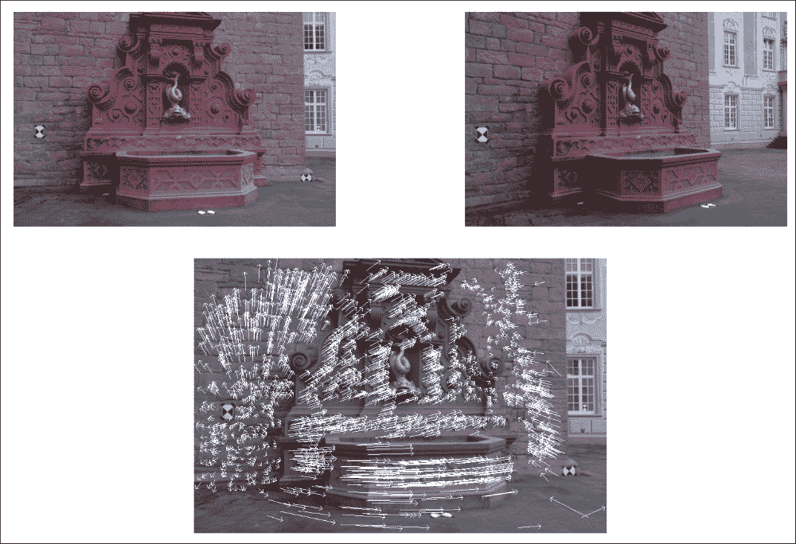
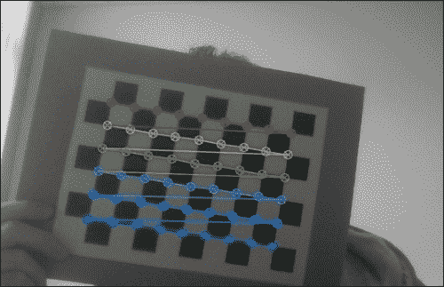
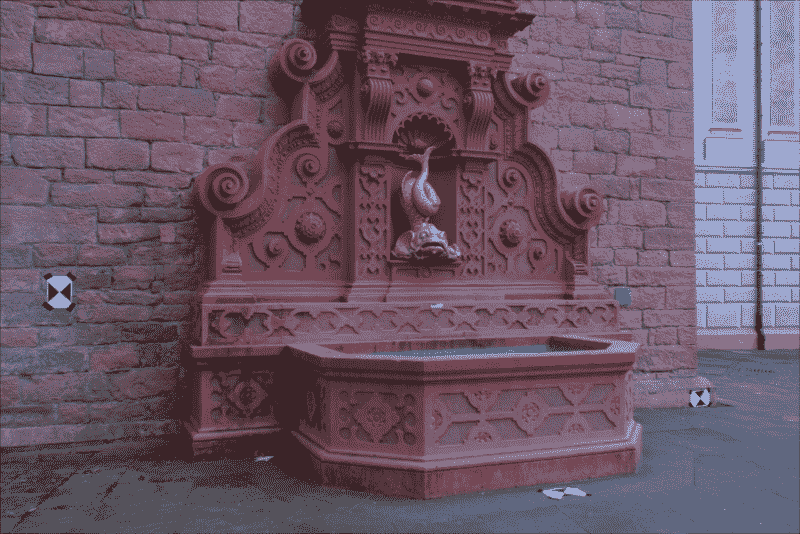
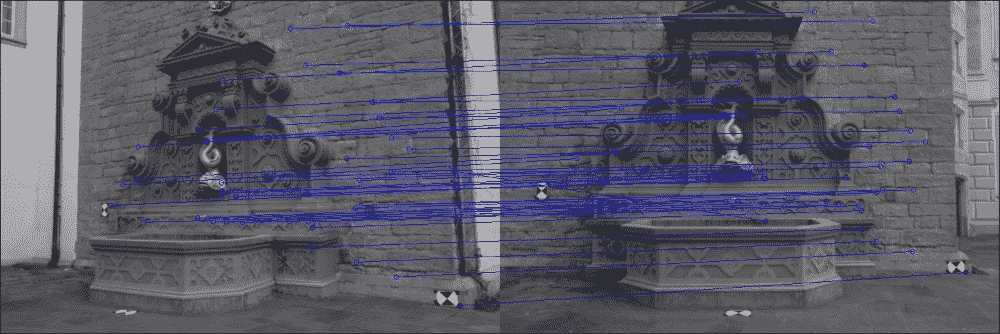
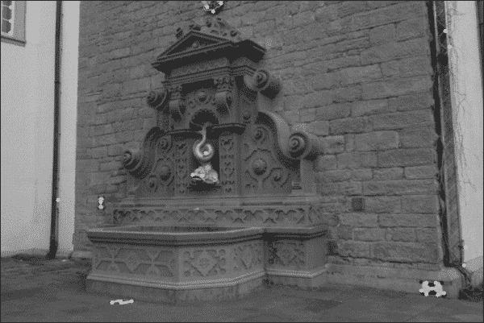
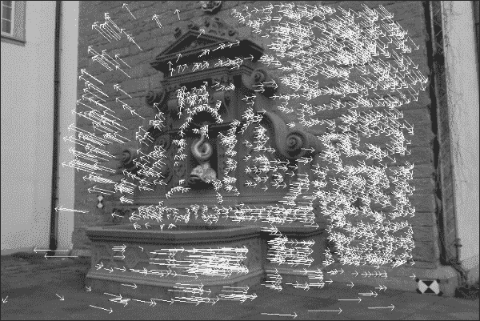
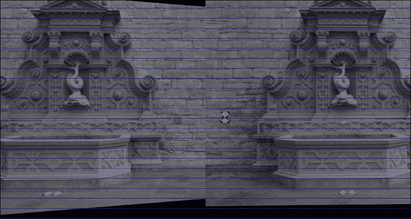
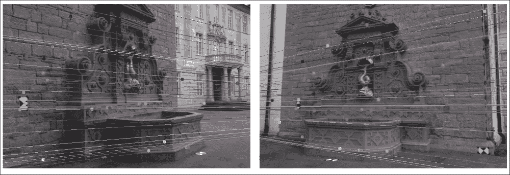
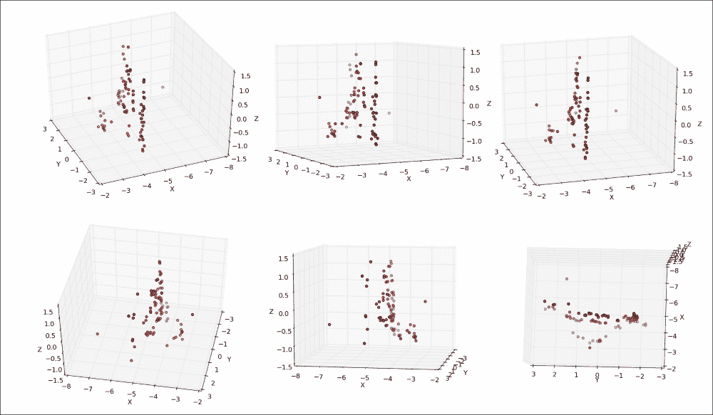

# 第 4 章。使用运动结构重建 3D 场景

本章的目的是研究如何通过从摄像机运动中推断场景的几何特征来重建 3D 场景。 有时将该技术从运动称为 **结构。 通过从不同角度查看同一场景，我​​们将能够推断场景中不同要素的真实 3D 坐标。 此过程称为 **三角剖分**，它使我们可以将 **重建**场景作为 **3D 点云**。**

在上一章中，您学习了如何在网络摄像头的视频流中检测和跟踪感兴趣的对象，即使从不同角度或距离或在部分遮挡的情况下查看该对象也是如此。 在这里，我们将进一步跟踪有趣的特征，并考虑通过研究图像帧之间的相似性，我们可以了解整个视觉场景。 如果我们从不同角度拍摄同一场景的两张图片，则可以使用 **功能匹配**或 **光流**来估计相机经过的任何平移和旋转运动 拍摄两张照片之间。 但是，为了使其正常工作，我们首先必须校准摄像机。

完整的过程包括以下步骤：

1.  **摄像机校准**：我们将使用棋盘图案提取固有的摄像机矩阵以及失真系数，这对于执行场景重建非常重要。
2.  **Feature matching**: We will match points in two 2D images of the same visual scene, either via **Speeded-Up Robust Features** (**SURF**) or via optic flow, as seen in the following image:

    

3.  **Image rectification**: By estimating the camera motion from a pair of images, we will extract the **essential matrix** and rectify the images.

    

4.  **三角剖分**：我们将利用 **对极几何形状**的约束来重建图像点的 3D 现实世界坐标。
5.  **3D point cloud visualization**: Finally, we will visualize the recovered 3D structure of the scene using scatterplots in matplotlib, which is most compelling when studied using pyplot's **Pan axes** button. This button lets you rotate and scale the point cloud in all three dimensions. It is a little harder to visualize in still frames, as can be seen in the following figure (left panel: standing slightly in front to the left side of the fountain, center panel: looking down on the fountain, right panel: standing slightly in front to the right of the fountain):

    

### 注意

本章已经过 OpenCV 2.4.9 和 wxPython 2.8（ [http://www.wxpython.org/download.php](http://www.wxpython.org/download.php) ）的测试。 它还需要 NumPy （ [http://www.numpy.org](http://www.numpy.org) ）和 matplotlib （ [http://www.matplotlib.org/downloads.html](http://www.matplotlib.org/downloads.html) ） 。 请注意，如果您使用的是 OpenCV3，则可能必须从[这个页面](https://github.com/Itseez/opencv_contrib)获得所谓的*额外的*模块并使用以下命令安装 OpenCV3 设置`OPENCV_EXTRA_MODULES_PATH`变量以安装 SURF。 另请注意，您可能必须获得许可才能在商业应用程序中使用 SURF。

# 规划应用

最终的应用程序将提取，并在一对图像上显示运动的结构。 我们将假定这两个图像是使用同一相机拍摄的，我们知道其内部相机参数。 如果这些参数未知，则需要在相机校准过程中首先对其进行估计。

然后，最终的应用程序将包含以下模块和脚本：

*   `chapter4.main`：这是启动应用程序的主要功能例程。
*   `scene3D.SceneReconstruction3D`：这是一个类，包含用于计算和可视化运动结构的一系列功能。 它包括以下公共方法：
    *   `__init__`：此构造函数将接受固有的相机矩阵和失真系数
    *   `load_image_pair`：一种用于从文件中加载之前描述的相机拍摄的两个图像的方法
    *   `plot_optic_flow`：一种用于可视化两个图像帧之间的光流的方法
    *   `draw_epipolar_lines`：一种用于绘制两个图像的对极线的方法
    *   `plot_rectified_images`：一种用于绘制两个图像的校正版本的方法
*   `plot_point_cloud`：这是一种用于将场景的已恢复现实世界坐标可视化为 3D 点云的方法。 为了到达 3D 点云，我们将需要利用极线几何。 但是，对极几何结构假设使用针孔摄像机模型，因此没有真正的摄像机可以使用。 我们需要校正图像以使其看起来好像来自针孔相机。 为此，我们需要估计摄像机的参数，这将我们引向摄像机校准领域。

# 相机校准

到目前为止，我们已经处理了网络摄像头中直接输出的图像，而没有质疑其拍摄方式。 但是，每个摄像机镜头都有独特的参数，例如焦距，主点和镜头失真。 当照相机拍照时，封面后面会发生什么？ 光线先落入镜头，然后再穿过光圈，然后再落入光传感器的表面。 这个过程可以用针孔相机模型来近似。 估计实际镜头参数以适合针孔相机模型的过程称为相机校准（或 **相机切除**，并且不应与光度学混淆） 相机校准）。

## 针孔相机型号

**针孔照相机型号** 是没有镜头且照相机光圈通过单个点（针孔）近似的真实照相机的简化。 在查看真实的 3D 场景（例如树）时，光线穿过点大小的光圈并落在相机内部的 2D 图像平面上，如下图所示：


在此模型中，将坐标为*（X，Y，Z）*的 3D 点映射到坐标为*（x，y）*的 2D 点，该点位于 **图像平面**。 请注意，这会导致树在图像平面上倒置出现。 垂直于像平面并穿过针孔的线称为 **主光线**，其长度称为 **焦距**。 焦距是内部相机参数的一部分，因为焦距可能会因所使用的相机而异。

Hartley 和 Zisserman 发现了一个数学公式来描述如何从坐标*（X，Y，Z）的 3D 点推断出具有坐标*（x，y）*的 2D 点。 ）和相机的固有参数，如下所示：*


现在，让我们集中讨论上一个公式中的 3 x 3 矩阵，即 **固有摄像机矩阵**，该矩阵紧凑地描述了所有内部摄像机参数。 矩阵包括以像素坐标表示的焦距（`fx`和`fy`）和光学中心（`cx`和`cy`）。 如前所述，焦距是针孔与像平面之间的距离。 真正的针孔相机只有一个焦距，在这种情况下`fx = fy = f`。 但是，实际上，这两个值可能有所不同，这可能是由于数码相机传感器中的缺陷所致。 主光线与像平面相交的点称为主点，其在像平面上的相对位置由光学中心（或主点偏移）捕获。

此外，照相机可能会受到径向或切向失真的影响，从而导致*鱼眼*效果。 这是由于硬件缺陷和镜头未对准造成的。 可以用 **失真系数**的列表来描述这些失真。 有时，径向变形实际上是一种理想的艺术效果。 在其他时间，需要对其进行更正。

### 注意

有关针孔摄像机模型的更多信息，网络上有很多不错的教程，例如 [http://ksimek.github.io/2013/08/13/intrinsic](http://ksimek.github.io/2013/08/13/intrinsic) 。

由于这些参数是特定于相机硬件的（因此称为“固有”），因此我们只需在相机的使用寿命内计算一次即可。 这称为 **相机校准**。

## 估算相机的固有参数

在 OpenCV 中，相机校准非常简单。 正式的文档在[这个页面](http://docs.opencv.org/doc/tutorials/calib3d/camera_calibration/camera_calibration.html)上提供了有关该主题的良好概述以及一些示例 C ++脚本。

出于教育目的，我们将使用 Python 开发我们自己的校准脚本。 我们将需要向我们要校准的相机展示具有已知几何形状（棋盘或白色背景上的黑色圆圈）的特殊图案图像。 因为我们知道图案图像的几何形状，所以我们可以使用特征检测来研究内部相机矩阵的属性。 例如，如果照相机遭受不希望的径向变形，则棋盘图案的不同角将在图像中显得变形并且不位于矩形网格上。 通过从不同的角度拍摄棋盘图案的大约 10 到 20 张快照，我们可以收集足够的信息来正确推断相机矩阵和失真系数。

为此，我们将使用`calibrate.py`脚本。 与前几章类似，我们将使用基于`BaseLayout`的简单布局（`CameraCalibration`）嵌入网络摄像头视频流。 脚本的主要功能将生成 GUI 并执行应用程序的主循环：

```py
import cv2
import numpy as np
import wx

from gui import BaseLayout

    def main():
        capture = cv2.VideoCapture(0)
        if not(capture.isOpened()):
            capture.open()

        capture.set(cv2.cv.CV_CAP_PROP_FRAME_WIDTH, 640)
        capture.set(cv2.cv.CV_CAP_PROP_FRAME_HEIGHT, 480)

        # start graphical user interface
        app = wx.App()
        layout = CameraCalibration(None, -1, 'Camera Calibration', capture)
        layout.Show(True)
        app.MainLoop()
```

### 注意

如果使用的是 OpenCV 3，则所要查找的常量可能称为`cv3.CAP_PROP_FRAME_WIDTH`和`cv3.CAP_PROP_FRAME_HEIGHT`。

### 相机校准 GUI

GUI 是通用`BaseLayout`的定制版本：

```py
class CameraCalibration(BaseLayout):
```

布局仅由当前相机框架和下方的单个按钮组成。 此按钮使我们可以开始校准过程：

```py
def _create_custom_layout(self):
    """Creates a horizontal layout with a single button"""
    pnl = wx.Panel(self, -1)
    self.button_calibrate = wx.Button(pnl,label='Calibrate Camera')
    self.Bind(wx.EVT_BUTTON, self._on_button_calibrate)
    hbox = wx.BoxSizer(wx.HORIZONTAL)
    hbox.Add(self.button_calibrate)
    pnl.SetSizer(hbox)
```

为了使这些更改生效，需要将`pnl`添加到现有面板列表中：

```py
self.panels_vertical.Add(pnl, flag=wx.EXPAND | wx.BOTTOM | wx.TOP, border=1)
```

可视化管道的其余部分由`BaseLayout`类处理。 我们只需要确保提供`_init_custom_layout`和`_process_frame`方法即可。

### 初始化算法

为了执行校准过程，我们需要做一些簿记。 现在，让我们集中讨论一个 10 x 7 的棋 board。 该算法将检测棋盘的所有 9 x 6 个内角（称为*目标点*）并将检测到的这些角点的图像点存储在列表中。 因此，让我们首先将棋盘大小初始化为内角数：

```py
def _init_custom_layout(self):
    """Initializes camera calibration"""
    # setting chessboard size
    self.chessboard_size = (9, 6)
```

接下来，我们需要枚举所有对象点并为其分配对象点坐标，以使第一个点具有坐标*（0,0）*，第二个点（顶部行）具有坐标*（1， 0）*，最后一个坐标为*（8,5）*：

```py
# prepare object points
self.objp = np.zeros((np.prod(self.chessboard_size), 3), dtype=np.float32)
self.objp[:, :2] = np.mgrid[0:self.chessboard_size[0],0:self.chessboard_size[1]].T.reshape(-1, 2)
```

我们还需要跟踪当前是否正在记录对象和图像点。 用户单击`self.button_calibrate`按钮后，我们将启动此过程。 之后，算法将尝试在所有后续帧中检测棋盘，直到检测到许多`self.record_min_num_frames`棋盘为止：

```py
    # prepare recording
    self.recording = False
    self.record_min_num_frames = 20
    self._reset_recording()
```

每当单击`self.button_calibrate`按钮时，我们都会重置所有簿记变量，禁用该按钮并开始记录：

```py
def _on_button_calibrate(self, event):
    self.button_calibrate.Disable()
    self.recording = True
    self._reset_recording()
```

重置簿记变量包括清除记录的对象和图像点（`self.obj_points`和`self.img_points`）列表以及将检测到的棋盘（`self.recordCnt`）的数量重置为`0`：

```py
def _reset_recording(self):
    self.record_cnt = 0
    self.obj_points = []
    self.img_points = []
```

### 收集图像和对象点

`_process_frame`方法由负责完成校准技术的艰苦工作。 单击`self.button_calibrate`按钮后，此方法开始收集数据，直到检测到总共`self.record_min_num_frames`个棋盘为止：

```py
def _process_frame(self, frame):
    """Processes each frame"""

    # if we are not recording, just display the frame
    if not self.recording:
        return frame

    # else we're recording
    img_gray = cv2.cvtColor(frame, cv2.COLOR_BGR2GRAY).astype(np.uint8)

    if self.record_cnt < self.record_min_num_frames:
        ret, corners = cv2.findChessboardCorners(img_gray, self.chessboard_size, None)
```

`cv2.findChessboardCorners`函数将解析灰度图像（`img_gray`）以找到大小为`self.chessboard_size`的棋盘。 如果图像确实包含棋盘，该函数将返回 true（`ret`）以及棋盘角列表（`corners`）。

然后，绘制棋盘很简单：

```py
if ret:
    cv2.drawChessboardCorners(frame, self.chessboard_size, corners, ret)
```

结果如下所示（为效果绘制彩色的棋盘角）：



现在，我们可以简单地存储检测到的角的列表，然后移至下一帧。 但是，为了使校准尽可能准确，OpenCV 提供了完善角点测量的功能：

```py
criteria = (cv2.TERM_CRITERIA_EPS + 
        cv2.TERM_CRITERIA_MAX_ITER, 30, 0.01)
cv2.cornerSubPix(img_gray, corners, (9, 9), (-1, -1),
        criteria)
```

这会将检测到的角的坐标细化为子像素精度。 现在我们准备将对象和图像点添加到列表中，并前进帧计数器：

```py
self.obj_points.append(self.objp)
self.img_points.append(corners)
self.record_cnt += 1
```

### 查找相机矩阵

一旦我们收集了足够的数据（即`self.record_cnt`达到`self.record_min_num_frames`的值），该算法就可以执行校准了。 只需调用`cv2.calibrateCamera`即可执行此过程：

```py
else:
    print "Calibrating..."
    ret, K, dist, rvecs, tvecs = cv2.calibrateCamera(self.obj_points, self.img_points, (self.imgHeight, self.imgWidth), None, None)
```

函数成功返回`ret`，固有摄像机矩阵`K`，失真系数`dist`以及两个旋转和平移矩阵`rvecs`和`tvecs`）。 目前，我们主要对相机矩阵和失真系数感兴趣，因为它们将使我们能够补偿内部相机硬件的任何缺陷。 我们将它们简单地打印在控制台上以便于检查：

```py
print "K=", K
print "dist=", dist
```

例如，笔记本电脑网络摄像头的校准恢复了以下值：

```py
K= [[ 3.36696445e+03 0.00000000e+00 2.99109943e+02]
    [ 0.00000000e+00 3.29683922e+03 2.69436829e+02]
    [ 0.00000000e+00 0.00000000e+00 1.00000000e+00]]
dist= [[ 9.87991355e-01 -3.18446968e+02 9.56790602e-02 -3.42530800e-02 4.87489304e+03]]
```

这告诉我们网络摄像头的焦距为`fx=3366.9644`像素和`fy=3296.8392`像素，光学中心为`cx=299.1099`像素和`cy=269.4368`像素。

一个好主意可能是仔细检查校准过程的准确性。 这可以通过使用恢复的相机参数将对象点投影到图像上来完成，以便我们可以将它们与使用`cv2.findChessboardCorners`功能收集的图像点列表进行比较。 如果两点大致相同，则表明校准成功。 更好的是，我们可以通过投影列表中的每个对象点来计算重建的平均误差：

```py
mean_error = 0
for i in xrange(len(self.obj_points)):
    img_points2, _ = cv2.projectPoints(self.obj_points[i], rvecs[i], tvecs[i], K, dist)
    error = cv2.norm(self.img_points[i], img_points2, cv2.NORM_L2)/len(img_points2)
    mean_error += error

print "mean error=",  {} pixels".format(mean_error)
```

在笔记本电脑的网络摄像头上执行此检查会导致 0.95 像素的平均误差，这几乎接近于零。

恢复内部相机参数后，我们现在可以着手从不同角度拍摄美丽，不失真的世界照片，以便从运动中提取某些结构。

# 设置应用

展望未来，我们将使用著名的开源数据集`fountain-P11`。 它描绘了从各个角度观看的瑞士喷泉。 下图显示了一个示例：



该数据集包含 11 张高分辨率图像，可以从[这个页面](http://cvlabwww.epfl.ch/data/multiview/denseMVS.html)下载。 如果我们自己拍摄照片，我们将必须经历整个相机校准过程才能恢复相机的固有矩阵和失真系数。 幸运的是，这些参数对于拍摄喷泉数据集的相机是已知的，因此我们可以继续在代码中对这些值进行硬编码。

## 主要功能例程

我们的主要功能例程将包括创建并与`SceneReconstruction3D`类的实例进行交互。 可以在`chapter4.py`文件中找到此代码，该文件导入所有必需的模块并实例化该类：

```py
import numpy as np

from scene3D import SceneReconstruction3D

def main():
    # camera matrix and distortion coefficients
    # can be recovered with calibrate.py
    # but the examples used here are already undistorted, taken 
    # with a camera of known K
    K = np.array([[2759.48/4, 0, 1520.69/4, 0, 2764.16/4,1006.81/4, 0, 0, 1]]).reshape(3, 3)
    d = np.array([0.0, 0.0, 0.0, 0.0, 0.0]).reshape(1, 5)
```

在此，`K`矩阵是拍摄喷泉数据集的摄像机的固有摄像机矩阵。 根据摄影师的说法，这些图像已经没有失真，因此我们将所有失真系数（`d`）设置为零。

### 注意

请注意，如果要在`fountain-P11`以外的数据集上运行本章介绍的代码，则必须调整固有摄像机矩阵和失真系数。

接下来，我们加载一对图像，我们希望将其应用从运动构造技术。 我将数据集下载到名为`fountain_dense`的子目录中：

```py
# load a pair of images for which to perform SfM
scene = SceneReconstruction3D(K, d)
scene.load_image_pair("fountain_dense/0004.png", "fountain_dense/0005.png")
```

现在我们准备执行各种计算，例如：

```py
scene.plot_optic_flow()
scene.draw_epipolar_lines()
scene.plot_rectified_images()

# draw 3D point cloud of fountain
# use "pan axes" button in pyplot to inspect the cloud (rotate 
# and zoom to convince you of the result)
scene.plot_point_cloud()
```

下一节将详细解释这些功能。

## SceneReconstruction3D 类

本章中的所有相关 3D 场景重建代码都可以在`scene3D`模块中的`SceneReconstruction3D`类中找到。 实例化后，该类存储要在所有后续计算中使用的固有摄像机参数：

```py
import cv2
import numpy as np
import sys

from mpl_toolkits.mplot3d import Axes3D
import matplotlib.pyplot as plt

class SceneReconstruction3D:
    def __init__(self, K, dist):
        self.K = K
        self.K_inv = np.linalg.inv(K)
        self.d = dist
```

然后，第一步是加载要对其进行操作的一对图像：

```py
def load_image_pair(self, img_path1, img_path2,downscale=True):
    self.img1 = cv2.imread(img_path1, cv2.CV_8UC3)
    self.img2 = cv2.imread(img_path2, cv2.CV_8UC3)

    # make sure images are valid
    if self.img1 is None:
        sys.exit("Image " + img_path1 + " could not be loaded.")
    if self.img2 is None:
        sys.exit("Image " + img_path2 + " could not be loaded.")
```

如果加载的图像是灰度图像，则该方法会将其转换为 BGR 格式，因为其他方法期望使用三通道图像：

```py
if len(self.img1.shape)==2:
    self.img1 = cv2.cvtColor(self.img1, cv2.COLOR_GRAY2BGR)
    self.img2 = cv2.cvtColor(self.img2, cv2.COLOR_GRAY2BGR)
```

在喷泉序列的情况下，所有图像均具有相对较高的分辨率。 如果设置了可选的`downscale`标志，则该方法会将图像缩小到大约 600 像素的宽度：

```py
# scale down image if necessary
# to something close to 600px wide
target_width = 600
if downscale and self.img1.shape[1]>target_width:
    while self.img1.shape[1] > 2*target_width:
        self.img1 = cv2.pyrDown(self.img1)
        self.img2 = cv2.pyrDown(self.img2)
```

另外，我们需要使用先前指定的失真系数（如果有）来补偿径向和切向透镜的失真：

```py
self.img1 = cv2.undistort(self.img1, self.K, self.d)
self.img2 = cv2.undistort(self.img2, self.K, self.d)
```

最后，我们准备继续进行项目的工作-估计摄像机的运动并重建场景！

# 从一对图像估计相机运动

现在我们已经加载了相同场景的两个图像（`self.img1`和`self.img2`），例如来自源数据集的两个示例，我们发现自己处于与上一章类似的情况。 我们给出了两个图像，它们应该显示相同的刚性对象或静态场景，但视角不同。 但是，这次我们想更进一步。 如果在拍摄两张照片之间唯一改变的是相机的位置，我们是否可以通过查看匹配特征来推断相机的相对运动？

好吧，我们当然可以。 否则，这一章就没有多大意义了？ 我们将把摄像机在第一张图像中的位置和方向作为给定，然后找出要重新定位和重新定位摄像机以使其视点与第二张图像相匹配的位置。

换句话说，我们需要在第二张图像中恢复摄像机的**基本矩阵** 。 基本矩阵是 4 x 3 矩阵，它是 3 x 3 旋转矩阵和 3 x 1 平移矩阵的串联。 它通常表示为[R | t]。 您可以将其视为捕获第二张图像中相机相对于第一张图像中相机的位置和方向。

恢复基本矩阵（以及本章中的所有其他转换）的关键步骤是特征匹配。 我们可以重用上一章中的代码，然后对两个图像应用加速的鲁棒特征（SURF）检测器，或者计算两个图像之间的光通量。 用户可以通过指定特征提取模式来选择自己喜欢的方法，这将通过以下私有方法来实现：

```py
def ___extract_keypoints(self, feat_mode):
    if featMode == "SURF":
        # feature matching via SURF and BFMatcher
        self._extract_keypoints_surf()
    else:
        if feat_mode == "flow":
            # feature matching via optic flow
            self._extract_keypoints_flow()
        else:
            sys.exit("Unknown mode " + feat_mode+ ". Use 'SURF' or 'FLOW'")
```

## 使用丰富特征描述符的点匹配

正如我们在上一章中所看到的，快速可靠的提取图像重要特征的方法是使用 SURF 检测器。 在本章中，我们想将其用于两个图像`self.img1`和`self.img2`：

```py
def _extract_keypoints_surf(self):
    detector = cv2.SURF(250)
    first_key_points, first_des = detector.detectAndCompute(self.img1, None)
    second_key_points, second_desc = detector.detectAndCompute(self.img2, None)
```

对于特征匹配，我们将使用`BruteForce`匹配器，但其他匹配器（例如 FLANN）也可以使用：

```py
matcher = cv2.BFMatcher(cv2.NORM_L1, True)
matches = matcher.match(first_desc, second_desc)
```

对于每个匹配项，我们需要恢复相应的图像坐标。 这些都保存在`self.match_pts1`和`self.match_pts2`列表中：

```py
first_match_points = np.zeros((len(matches), 2), dtype=np.float32)
second_match_points = np.zeros_like(first_match_points)
for i in range(len(matches)):
    first_match_points[i] = 
        first_key_points[matches[i].queryIdx].pt
    second_match_points[i] = 
        second_key_points[matches[i].trainIdx].pt

self.match_pts1 = first_match_points
self.match_pts2 = second_match_points
```

以下屏幕截图显示了特征匹配器应用于两个喷泉序列的任意帧的示例：



## 使用光流进行点匹配

使用丰富功能的替代品是使用光流。 光学流是通过计算位移矢量来估计两个连续图像帧之间运动的过程。 可以为图像中的每个像素（密集）或仅针对选定点（稀疏）计算位移矢量。

**Lukas-Kanade** 方法是计算密集光通量最常用的技术之一。 通过使用`cv2.calcOpticalFlowPyrLK`函数，可以用一行代码在 OpenCV 中实现。

但是在此之前，我们需要选择图像中值得跟踪的一些点。 同样，这是特征选择的问题。 如果我们只想对几个高度突出的图像点获得准确的结果，则可以使用 Shi-Tomasi 的`cv2.goodFeaturesToTrack`函数。 此功能可能会恢复以下功能：



但是，为了从运动推断结构，我们可能需要更多的功能，而不仅仅是最显着的 Harris 角。 一种替代方法是检测 FAST 功能：

```py
def _extract_keypoints_flow(self):
    fast = cv2.FastFeatureDetector()
    first_key_points = fast.detect(self.img1, None)
```

然后，我们可以计算这些特征的光通量。 换句话说，我们要在第二张图像中找到最有可能与第一张图像中的`first_key_points`相对应的点。 为此，我们需要将关键点列表转换为`(x,y)`坐标的 NumPy 数组：

```py
first_key_list = [i.pt for i in first_key_points]
first_key_arr = np.array(first_key_list).astype(np.float32)
```

然后，光流将在第二张图像（`second_key_arr`）中返回相应特征的列表：

```py
second_key_arr, status, err = cv2.calcOpticalFlowPyrLK(self.img1, self.img2, first_key_arr)
```

该函数还向返回状态位的向量（`status`），该状态位的向量指示是否已找到关键点的流，以及估计错误值的向量（`err`）。 如果我们忽略这两个附加矢量，则恢复的流场可能看起来像这样：


在此图像中，从每个关键点的图像位置开始绘制一个箭头，该箭头从第一个图像中关键点的图像位置开始，指向第二个图像中相同关键点的图像位置。 通过检查流动图像，我们可以看到摄像机大部分向右移动，但似乎还有一个旋转分量。 但是，其中一些箭头的确很大，而其中的一些则没有意义。 例如，右下角的像素实际上不可能一直一直移动到图像的顶部。 该特定关键点的流量计算很可能是错误的。 因此，我们要排除状态位为零或估计的误差大于某个值的所有关键点：

```py
condition = (status == 1) * (err < 5.)
concat = np.concatenate((condition, condition), axis=1)
first_match_points = first_key_arr[concat].reshape(-1, 2)
second_match_points = second_key_arr[concat].reshape(-1, 2)

self.match_pts1 = first_match_points
self.match_pts2 = second_match_points
```

如果我们使用一组有限的关键点再次绘制流场，则图像将如下所示：



可以使用以下公共方法绘制流场，该方法首先使用前面的代码提取关键点，然后在图像上绘制实际线条：

```py
def plot_optic_flow(self):
    self._extract_key_points("flow")

    img = self.img1
    for i in xrange(len(self.match_pts1)):
        cv2.line(img, tuple(self.match_pts1[i]), tuple(self.match_pts2[i]), color=(255, 0, 0))
        theta = np.arctan2(self.match_pts2[i][1] – self.match_pts1[i][1], self.match_pts2[i][0] – self.match_pts1[i][0])
        cv2.line(img, tuple(self.match_pts2[i]),
             (np.int(self.match_pts2[i][0] – 6*np.cos(theta+np.pi/4)),
             np.int(self.match_pts2[i][1] – 
             6*np.sin(theta+np.pi/4))), color=(255, 0, 0))
        cv2.line(img, tuple(self.match_pts2[i]), (np.int(self.match_pts2[i][0] –6*np.cos(theta-np.pi/4)),np.int(self.match_pts2[i][1] – 
            6*np.sin(theta-np.pi/4))), color=(255, 0, 0))
    for i in xrange(len(self.match_pts1)):
        cv2.line(img, tuple(self.match_pts1[i]), tuple(self.match_pts2[i]), color=(255, 0, 0))
        theta = np.arctan2(self.match_pts2[i][1] -self.match_pts1[i][1],self.match_pts2[i][0] - self.match_pts1[i][0])
    cv2.imshow("imgFlow",img)
    cv2.waitKey()
```

使用光流代替丰富的功能的优点通常是更快的过程，并且可以容纳更多点的匹配，从而使重建更加密集。

使用光流的警告是，它最适用于相同硬件连续拍摄的图像，而丰富的功能对此几乎一无所知。

## 查找相机矩阵

现在我们已经获得了关键点之间的匹配，我们可以计算两个重要的相机矩阵：基本矩阵和基本矩阵。 这些矩阵将根据旋转和平移分量指定摄像机的运动。 获得基本矩阵（`self.F`）是另一种 OpenCV 单行代码：

```py
def _find_fundamental_matrix(self):
    self.F, self.Fmask = cv2.findFundamentalMat(self.match_pts1, self.match_pts2, cv2.FM_RANSAC, 0.1, 0.99)
```

基本矩阵和基本矩阵之间的唯一区别是，后者在校正图像上运行：

```py
def _find_essential_matrix(self):
    self.E = self.K.T.dot(self.F).dot(self.K)
```

然后可以将基本矩阵（`self.E`）分解为旋转分量和平移分量，表示为[R | t]，使用 **奇异值分解**（ **SVD** ）：

```py
def _find_camera_matrices(self):
    U, S, Vt = np.linalg.svd(self.E)
    W = np.array([0.0, -1.0, 0.0, 1.0, 0.0, 0.0, 0.0, 0.0, 1.0]).reshape(3, 3)
```

使用单一的矩阵 *U* 和 *V* 结合其他矩阵 *W* ，我们现在可以重建[R | t]。 但是，可以证明该分解具有四个可能的解，而其中只有一个是有效的第二摄像机矩阵。 我们唯一能做的就是检查所有四个可能的解决方案，并找到一个可以预测所有成像关键点都位于两个摄像机前面的解决方案。

但在此之前，我们需要将关键点从 2D 图像坐标转换为同构坐标。 我们通过添加 *z* 坐标（将其设置为 1）来实现此目标：

```py
first_inliers = []
second_inliers = []
for i in range(len(self.Fmask)):
    if self.Fmask[i]:
        first_inliers.append(self.K_inv.dot([self.match_pts1[i][0], self.match_pts1[i][1], 1.0]))
        second_inliers.append(self.K_inv.dot([self.match_pts2[i][0], self.match_pts2[i][1], 1.0]))
```

然后，我们遍历四种可能的解决方案，并选择一种使`_in_front_of_both_cameras`返回`True`的解决方案：

```py
# First choice: R = U * Wt * Vt, T = +u_3 (See Hartley 
# & Zisserman 9.19)
R = U.dot(W).dot(Vt)
T = U[:, 2]

if not self._in_front_of_both_cameras(first_inliers,second_inliers, R, T):
    # Second choice: R = U * W * Vt, T = -u_3
    T = - U[:, 2]

if not self._in_front_of_both_cameras(first_inliers, second_inliers, R, T):
    # Third choice: R = U * Wt * Vt, T = u_3
    R = U.dot(W.T).dot(Vt)
    T = U[:, 2]

if not self._in_front_of_both_cameras(first_inliers, second_inliers, R, T):
    # Fourth choice: R = U * Wt * Vt, T = -u_3
    T = - U[:, 2]
```

现在，我们终于可以构造[R | [t]这两个相机的矩阵。 第一个相机只是一个标准相机（不平移也不旋转）：

```py
self.Rt1 = np.hstack((np.eye(3), np.zeros((3, 1))))
```

第二个摄影机矩阵由[R | t]较早恢复：

```py
self.Rt2 = np.hstack((R, T.reshape(3, 1)))
```

`__InFrontOfBothCameras`私有方法是一个辅助函数，可确保将每对关键点映射到 3D 坐标，使它们位于两个摄像机的前面：

```py
def _in_front_of_both_cameras(self, first_points, second_points, rot, trans):
    rot_inv = rot
    for first, second in zip(first_points, second_points):
        first_z = np.dot(rot[0, :] - second[0]*rot[2, :], trans) / np.dot(rot[0, :] - second[0]*rot[2, :], second)
        first_3d_point = np.array([first[0] * first_z, second[0] * first_z, first_z])
        second_3d_point = np.dot(rot.T, first_3d_point) – np.dot(rot.T, trans)
```

如果函数找到不在两个摄像机前面的关键点，它将返回`False`：

```py
if first_3d_point[2] < 0 or second_3d_point[2] < 0:
    return False
return True
```

## 图像校正

也许，确保我们已恢复正确的相机矩阵的最简单方法是校正图像。 如果纠正正确，则； 第一张图片中的一个点和第二张图片中与同一 3D 世界点对应的点将位于相同的垂直坐标上。 在一个更具体的示例中，例如在我们的案例中，由于我们知道相机是直立的，因此我们可以验证校正后图像中的水平线是否对应于 3D 场景中的水平线。

首先，我们执行前面小节中描述的所有步骤来获得[R | [t]第二个相机的矩阵：

```py
def plot_rectified_images(self, feat_mode="SURF"):
    self._extract_keypoints(feat_mode)
    self._find_fundamental_matrix()
    self._find_essential_matrix()
    self._find_camera_matrices_rt()

    R = self.Rt2[:, :3]
    T = self.Rt2[:, 3]
```

然后，可以使用两个 OpenCV 单线进行校正，该两个线性基于相机矩阵（`self.K`），失真系数（`self.d`），基本矩阵的旋转分量（`R`），以及基本矩阵（`T`）的翻译成分：

```py
    R1, R2, P1, P2, Q, roi1, roi2 = cv2.stereoRectify(self.K, self.d, self.K, self.d, self.img1.shape[:2], R, T,
        alpha=1.0)
    mapx1, mapy1 = cv2.initUndistortRectifyMap(self.K, self.d, R1, self.K, self.img1.shape[:2], cv2.CV_32F)
    mapx2, mapy2 = cv2.initUndistortRectifyMap(self.K, self.d, R2, self.K, self.img2.shape[:2], cv2.CV_32F)
    img_rect1 = cv2.remap(self.img1, mapx1, mapy1, cv2.INTER_LINEAR)
    img_rect2 = cv2.remap(self.img2, mapx2, mapy2, cv2.INTER_LINEAR)
```

为了确保校正正确，我们将两个校正后的图像（`img_rect1`和`img_rect2`）彼此相邻绘制：

```py
total_size = (max(img_rect1.shape[0], img_rect2.shape[0]), img_rect1.shape[1] + img_rect2.shape[1], 3)
img = np.zeros(total_size, dtype=np.uint8)
img[:img_rect1.shape[0], :img_rect1.shape[1]] = img_rect1
img[:img_rect2.shape[0], img_rect1.shape[1]:] = img_rect2
```

我们还会在并排图像中每隔 25 个像素绘制一条蓝色的水平线，以进一步帮助我们直观地观察校正过程：

```py
for i in range(20, img.shape[0], 25):
    cv2.line(img, (0, i), (img.shape[1], i), (255, 0, 0))
    cv2.imshow('imgRectified', img)
```

现在，我们可以轻松地使我们自己确信整改成功，如下所示：



# 重建场景

最后，我们可以利用称为 **三角剖分**的过程来重建 3D 场景。 由于**对极几何** 的工作方式，我们能够推断出点的 3D 坐标。 通过计算基本矩阵，我们可以比想象的更多地了解视觉场景的几何形状。 由于两台摄像机描绘的是同一真实世界场景，因此我们知道在这两个图像中都可以找到大多数 3D 真实世界点。 此外，我们知道从 2D 图像点到对应的 3D 现实世界点的映射将遵循几何规则。 如果我们研究足够多的图像点，则可以构造和求解（大型）线性方程组，以获得真实世界坐标的地面真相。

让我们回到瑞士喷泉数据集。 如果我们要求两位摄影师同时从不同的角度拍摄喷泉的照片，不难发现第一位摄影师可能会出现在第二位摄影师的照片中，反之亦然。 图像平面上其他拍摄者可见的点称为 **极点**或 **对极点**。 用更专业的术语来说，子极是一台相机的图像平面上另一台相机的投影中心投影到的点。 有趣的是，它们各自像面上的两个极点和两个投影中心都位于一条 3D 线上。 通过查看子极和图像点之间的线，我们可以限制图像点可能的 3D 坐标数。 实际上，如果投影点已知，那么对极线（即像点与子极之间的线）就已知，并且投影到第二张图像上的同一点也必须位于该特定对极线上。 令人困惑？ 我是这么想的。 让我们看一下这些图像：



这里的每条线都是图像中特定点的对极线。 理想情况下，左侧图像中绘制的所有对极线都应在一个点处相交，并且该点通常位于图像外部。 如果计算准确，则该点应与从第一个摄像机看到的第二个摄像机的位置重合。 换句话说，左侧图像中的对极线告诉我们拍摄右侧图像的相机位于我们（即第一个相机的）右侧。 类似地，右侧图像中的对极线告诉我们，拍摄左侧图像的相机位于我们（即第二相机的）左侧。

此外，对于在一个图像中观察到的每个点，必须在已知对极线上的另一个图像中观察到相同的点。 这被称为 **对极约束**。 我们可以利用这一事实来表明，如果两个图像点对应于同一 3D 点，则这两个图像点的投影线必须在 3D 点处精确相交。 这意味着可以从两个图像点计算出 3D 点，这是我们接下来要做的。

幸运的是，OpenCV 再次提供了一个包装器来求解大量线性方程组。 首先，我们必须将匹配的特征点列表转换为 NumPy 数组：

```py
first_inliers = np.array(self.match_inliers1).reshape(-1, 3)[:, :2]
second_inliers = np.array(self.match_inliers2).reshape(-1, 3)[:, :2]
```

接下来，使用前两个[R | R]进行三角剖分。 t]个矩阵（第一个摄像机为`self.Rt1`，第二个摄像机为`self.Rt2`）：

```py
pts4D = cv2.triangulatePoints(self.Rt1, self.Rt2, first_inliers.T,second_inliers.T).T
```

这将使用 4D 齐次坐标返回三角剖分的真实世界点。 要将它们转换为 3D 坐标，我们需要将*（X，Y，Z）*坐标除以第四坐标，通常称为 *W* ：

```py
pts3D = pts4D[:, :3]/np.repeat(pts4D[:, 3], 3).reshape(-1, 3)
```

# 3D 点云可视化

最后一步是将三角剖分的 3D 现实世界点可视化。 创建 3D 散点图的一种简单方法是使用 matplotlib。 但是，如果您正在寻找更专业的可视化工具，则可能对 Mayavi （ [http://docs.enthought.com/mayavi/mayavi](http://docs.enthought.com/mayavi/mayavi) ），VisPy （ [http://vispy.org](http://vispy.org) 或点云库（ [http://pointclouds.org](http://pointclouds.org) ）。 尽管后者尚不支持点云可视化的 Python，但它是用于点云分割，过滤和样本一致性模型拟合的出色工具。 有关更多信息，请访问[这个页面](https://github.com/strawlab/python-pcl)上的 strawlab 的 GitHub 信息库。

在绘制 3D 点云之前，我们显然必须提取[R | [t]矩阵并执行三角剖分，如前所述：

```py
def plot_point_cloud(self, feat_mode="SURF"):
    self._extract_keypoints(feat_mode)
    self._find_fundamental_matrix()
    self._find_essential_matrix()
    self._find_camera_matrices_rt()

    # triangulate points
    first_inliers = np.array(self.match_inliers1).reshape(-1, 3)[:, :2]
    second_inliers = np.array(self.match_inliers2).reshape(-1, 3)[:, :2]
    pts4D = cv2.triangulatePoints(self.Rt1, self.Rt2,first_inliers.T, second_inliers.T).T

    # convert from homogeneous coordinates to 3D
    pts3D = pts4D[:, :3]/np.repeat(pts4D[:, 3], 3).reshape(-1, 3)
```

然后，我们要做的就是打开一个`matplotlib`图形，并在 3D 散点图中绘制`pts3D`的每个条目：

```py
    Ys = pts3D[:,0]
    Zs = pts3D[:,1]
    Xs = pts3D[:,2]

    fig = plt.figure()
    ax = fig.add_subplot(111, projection='3d')
    ax.scatter(Xs, Ys, Zs, c='r', marker='o')
    ax.set_xlabel('Y')
    ax.set_ylabel('Z')
    ax.set_zlabel('X')
    plt.show()
```

使用 pyplot 的**平移轴**按钮进行研究时，其结果是最引人注目，它使您可以在所有三个维度上旋转和缩放点云。 这将立即清楚地表明，您看到的大多数点都位于同一平面上，即喷泉后面的墙，并且喷泉本身从该墙以负 *z* 坐标延伸。 令人信服地画出这个要困难一点，但是我们开始：



每个子图显示从不同角度观察到的喷泉的 3D 坐标。 在最上面一行中，我们从与上一个图像中的第二个摄像头相似的角度看喷泉，也就是说，是站在喷泉的右侧并稍微向前。 您可以看到大多数点如何映射到相似的 *x* 坐标，该坐标对应于喷泉后面的墙。 对于集中在 *z* 坐标 *-0.5* 和 *-1.0* 之间的点子集， *x* 坐标有显着差异，显示了不同的关键点 属于喷泉的表面。 下排的前两个面板从另一侧看喷泉。 最后一个面板显示了喷泉的鸟瞰图，在图像的下半部分以半圆形突出显示了喷泉的轮廓。

# 摘要

在本章中，我们通过推断同一相机拍摄的 2D 图像的几何特征，探索了一种 3D 场景重建方法。 我们编写了一个脚本来校准相机，您了解了基本矩阵和基本矩阵。 我们使用此知识执行三角剖分。 然后，我们继续在 3D 点云中可视化场景的真实几何形状。 通过在 matplotlib 中使用简单的 3D 散点图，我们找到了一种使自己相信我们的计算准确且实用的方法。

从这里开始，可以将三角 3D 点存储在可以由点云库解析的文件中，或者对不同的图像对重复该过程，以便我们可以生成更密集，更准确的重建。 尽管本章已经介绍了很多内容，但还有很多工作要做。 通常，在谈论“从运动开始的结构”管道时，我们包括到目前为止还没有讨论的两个附加步骤：束调整和几何拟合。 在这种流水线中最重要的步骤之一是优化 3D 估计，以最大程度地减少重建误差。 通常，我们还希望从云中获取所有不属于我们感兴趣的对象的点。 但是，有了基本代码，您现在就可以继续编写自己的高级动感结构管道！

在下一章中，我们将远离刚性场景，而将重点放在跟踪场景中视觉上显着和移动的对象上。 这将使您了解如何处理非静态场景。 我们还将探索如何使算法快速专注于场景中的重要*，这是一种已知的技术，可以加快对象检测，对象识别，对象跟踪和内容感知图像编辑的速度。*