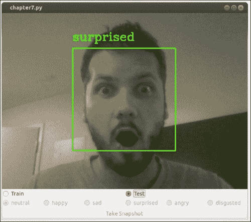
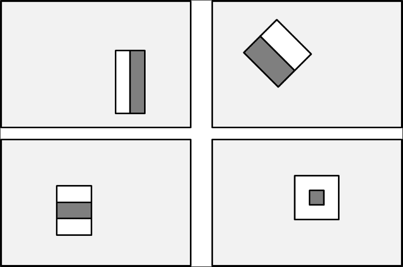
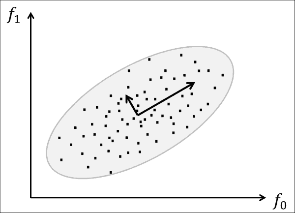

# 第 7 章。学习识别面部表情

我们之前已经熟悉了对象检测和对象识别的概念，但是我们从未将它们组合在一起来开发可以同时实现端到端的应用程序。 对于本书的最后一章，我们将做到这一点。

本章的目的是开发一种结合了**人脸检测**和**人脸识别**的应用，重点是识别被检测人脸中的情绪表情。

为此，我们将介绍与 OpenCV 捆绑在一起的其他两个经典算法：**Haar 级联分类器**和**多层感知器**（**MLP**）。 前者可用于快速检测（或定位，回答问题：在哪里？）图像中各种大小和方向的对象，而后者可用于识别它们（或识别，回答问题：什么？）。

该应用程序的最终目标是在网络摄像头实时流的每个捕获帧中检测到您自己的脸并标记您的情感表情。 为了使这项任务可行，我们将限于以下几种可能的情感表达方式：中立，快乐，悲伤，惊讶，愤怒和恶心。

为了实现这样一个应用程序，我们需要解决以下两个挑战：

*   **人脸检测**：我们将使用 Viola 和 Jones 流行的 Haar 级联分类器，为此 OpenCV 提供了一系列预训练的样本。 我们将利用面部叶栅和眼睛叶栅来可靠地检测并对齐各个框架中的面部区域。
*   **面部表情识别**：我们将训练多层感知器，以识别每张检测到的面部中较早列出的六种不同的情绪表情。 这种方法的成功关键取决于我们组装的训练集，以及我们选择应用于该集中每个样本的预处理。 为了提高我们自记录训练集的质量，我们将确保使用**仿射变换**对齐所有数据样本，并通过应用减少特征空间的维数[ **主成分分析**（**PCA**）。 有时将所得表示形式也称为 **EigenFace**。

对面部和面部表情的可靠识别对于人工智能来说是一项艰巨的任务，而人类却能够轻松地执行这些任务。 当今最先进的模型范围很广，从适用于卷积神经网络的 3D 变形人脸模型到深度学习算法。 当然，这些方法比我们的方法复杂得多。 但是，MLP 是帮助改变机器学习领域的经典算法，因此出于教育目的，我们将坚持使用与 OpenCV 捆绑在一起的一组算法。

我们将在单个端到端应用程序中结合前面提到的算法，该应用程序在视频直播流的每个捕获帧中为检测到的面部和相应的面部表情标签添加注释。 最终结果可能类似于下图，捕获了我在第一次编译代码时的反应：



# 规划应用

最终的应用程序将包含一个主脚本，该脚本将端对端的流程从人脸检测到面部表情识别进行端到端集成，并提供一些实用程序功能来帮助您。

因此，最终产品将需要几个组件：

*   `chapter7`：本章的主要脚本和入口点。
*   `chapter7.FaceLayout`：基于`gui.BaseLayout`的自定义布局，可在两种不同模式下运行：
    *   训练模式：在训练模式下，应用程序将收集图像帧，检测其中的脸部，根据面部表情分配标签，并在退出时将所有收集的数据样本保存在文件中，以便可以通过解析`datasets.homebrew`。
    *   测试模式：在测试模式下，应用程序将检测每个视频帧中的人脸，并使用预先训练的 MLP 预测相应的类别标签。
*   `chapter3.main`：启动 GUI 应用程序的主要功能例程。
*   `detectors.FaceDetector`：用于人脸检测的类。
    *   `detect`：一种用于检测灰度图像中人脸的方法。 可选地，将图像缩小以提高可靠性。 成功检测后，该方法将返回提取的头部区域。
    *   `align_head`：一种使用仿射变换对提取的头部区域进行预处理的方法，以使生成的脸部居中并直立。
*   `classifiers.Classifier`：一个抽象基类，它定义所有分类器的公共接口（与第 6 章和*学习识别交通标志*中的相同）。
*   `classifiers.MultiLayerPerceptron`：通过使用以下公共方法来实现 MLP 的类：
    *   `fit`：一种将 MLP 拟合到训练数据的方法。 它以训练数据矩阵作为输入，其中每行是训练样本，列包含特征值和标签向量。
    *   `evaluate`：一种通过在训练后将 MLP 应用于某些测试数据来评估 MLP 的方法。 它以测试数据矩阵作为输入，其中每行是测试样本，每列包含特征值和标签向量。 该函数返回三种不同的性能指标：准确性，准确性和召回率。
    *   `predict`：一种预测某些测试数据的类标签的方法。 我们向用户公开此方法，以便可以将其应用于任意数量的数据样本，这在测试模式下非常有用，当我们不想评估整个数据集而只预测单个数据样本的标签时 。
    *   `save`：一种将经过训练的 MLP 保存到文件的方法。
    *   `load`：一种从文件加载预先训练的 MLP 的方法。
*   `train_test_mlp`：通过将 MLP 应用于我们的自记录数据集来训练和测试 MLP 的脚本。 该脚本将探索不同的网络体系结构，并将具有最佳泛化性能的网络体系结构存储在文件中，以便可以在以后加载经过预先​​训练的分类器。
*   `datasets.homebrew`：解析自记录训练集的类。 与上一章类似，该类包含以下方法：
    *   `load_data`：一种加载训练集，通过`extract_features` 功能对其执行 PCA 并将数据拆分为训练集和测试集的方法。 可选地，可以将预处理后的数据存储在文件中，以便我们以后可以加载它而不必再次解析数据。
    *   `load_from_file`：一种加载先前存储的预处理数据集的方法。
    *   `extract_features`：一种提取所选特征的方法（在本章中：对数据执行 PCA）。 我们向用户公开此功能，以便可以将其应用于任意数量的数据样本，这在测试模式下非常有用，当我们不想解析整个数据集而只预测单个数据样本的标签时。
*   `gui`：一个模块，提供一个 wxPython GUI 应用程序来访问捕获设备并显示视频源。 这与我们在前面各章中使用的模块相同。
    *   `gui.BaseLayout`：可以从中构建更复杂布局的通用布局。 本章不需要对基本布局进行任何修改。

在以下各节中，我们将详细讨论这些组件。

# 人脸检测

OpenCV 预先安装了系列复杂分类器，用于通用目标检测。 也许，最广为人知的检测器是用于人脸检测的基于 **Haar 级联**的特征检测器，这是由 Paul Viola 和 Michael Jones 发明的。

## 基于 Haar 的级联分类器

每本关于 OpenCV 的书都应至少提及 Viola–Jones 人脸检测器。 该级联分类器于 2001 年发明，它最终实现了实时人脸检测和人脸识别，从而中断了计算机视觉领域。

分类器基于类似 Haar 的特征（类似于 Haar 基函数），可对图像的小区域中的像素强度进行汇总，并捕获相邻图像区域之间的差异。 下图显示了相对于封闭的（浅灰色）检测窗口的一些示例矩形特征：



此处，顶部的行显示了边缘特征的两个示例，即垂直定向（左）或以 45 度角定向（右）。 底行显示线特征（左）和中心环绕特征（右）。 然后，通过将暗灰色矩形中的所有像素值相加，然后从白色矩形中的所有像素值之和中减去该值，来计算每个特征值。 此过程允许算法捕获人脸的某些质量，例如眼睛区域通常比脸颊周围的区域更暗的事实。

因此，常见的 Haar 特征将在明亮的矩形（代表脸颊区域）上方有一个黑色的矩形（代表眼睛区域）。 Viola 和 Jones 将这一特征与旋转的且稍微复杂一些的*小波*结合在一起，得出了一个强大的人脸特征描述符。 这些天才的另一个行为是，这些家伙想出了一种有效的方法来计算这些特征，这使得首次实时检测人脸成为可能。

## 预训练级联分类器

甚至更好的是，这种方法不仅可以使适用于脸部，而且还可以使眼睛，嘴巴，全身，公司徽标有效。 在`data`文件夹的 OpenCV 安装路径下可以找到许多经过预先训练的分类器：

<colgroup><col style="text-align: left"> <col style="text-align: left"></colgroup> 
| 

级联分类器类型

 | 

XML file name

 |
| --- | --- |
| 人脸检测器（默认） | `haarcascade_frontalface_default.xml` |
| 人脸检测仪 | `haarcascade_frontalface_alt2.xml` |
| 眼睛探测器 | `haarcascade_lefteye_2splits.xml``haarcascade_righteye_2splits.xml` |
| 嘴部检测器 | `haarcascade_mcs_mouth.xml` |
| 鼻子探测器 | `haarcascade_mcs_nose.xml` |
| 全身探测器 | `haarcascade_fullbody.xml` |

在本章中，我们将使用`haarcascade_frontalface_default.xml`，`haarcascade_lefteye_2splits.xml`和`haarcascade_righteye_2splits.xml`。

### 注意

如果戴眼镜，请确保两只眼睛都使用`haarcascade_eye_tree_eyeglasses.xml`。

## 使用预先训练的级联分类器

可以使用以下代码加载级联分类器并将其应用于（灰度！）图像`frame`：

```py
import cv2

frame = cv2.imread('example_grayscale.jpg', cv2.CV_8UC1)face_casc = cv2.CascadeClassifier('haarcascade_frontalface_default.xml')
faces = face_casc.detectMultiScale(frame, scaleFactor=1.1, 
    minNeighbors=3)
```

`detectMultiScale`功能带有许多选项：

*   `minFeatureSize`：要考虑的最小脸部尺寸（例如`20×20`像素）。
*   `searchScaleFactor`：要重新缩放图像的比例（缩放金字塔）。 例如，值 1.1 会逐渐将输入图像的尺寸减小 10%，从而比更大的值更有可能找到人脸。
*   `minNeighbors`：每个候选矩形必须保留的邻居数。 通常，选择 3 或 5。
*   `flags`：旧级联的选项（较新的级联将忽略）。 例如，要查找所有面孔还是仅查找最大面孔（`cv2.cv.CASCADE_FIND_BIGGEST_OBJECT`）。

如果检测成功，该函数将返回包含检测到的面部区域坐标的边界框列表（`faces`）：

```py
for (x, y, w, h) in faces:
    # draw bounding box on frame
    cv2.rectangle(frame, (x, y), (x + w, y + h), (100, 255, 0), 2)
```

### 注意

如果您的预先训练的面部层叠没有检测到任何东西，通常的原因通常是找不到预先训练的层叠文件的路径。 在这种情况下，`CascadeClassifier`将静默失败。 因此，始终最好通过检查`casc.empty()`来检查返回的分类器`casc = cv2.CascadeClassifier(filename)`是否为空。

## `FaceDetector`类

可在`detectors`模块中的`FaceDetector`类的类的一部分中找到本章的所有相关人脸检测代码。 实例化后，此类将加载预处理所需的三个不同的层叠分类器：面部层叠和两个眼睛层叠。

```py
import cv2
import numpy as np

class FaceDetector:
    def __init__(
        self, face_casc='params/haarcascade_frontalface_default.xml',left_eye_casc='params/haarcascade_lefteye_2splits.xml',right_eye_casc='params/haarcascade_righteye_2splits.xml',scale_factor=4):
```

由于我们的预处理需要有效的人脸级联，因此请确保可以加载文件。 如果没有，我们将输出一条错误消息并退出程序：

```py
        self.face_casc = cv2.CascadeClassifier(face_casc)
        if self.face_casc.empty():
            print 'Warning: Could not load face cascade:', 
                face_casc
            raise SystemExit
```

由于很快就会明白的原因，我们还需要两个眼睛级联，为此我们以类似的方式进行：

```py
        self.left_eye_casc = cv2.CascadeClassifier(left_eye_casc)
        if self.left_eye_casc.empty():
            print 'Warning: Could not load left eye cascade:', left_eye_casc
            raise SystemExit
        self.right_eye_casc = 
            cv2.CascadeClassifier(right_eye_casc)
        if self.right_eye_casc.empty():
            print 'Warning: Could not load right eye cascade:', right_eye_casc
            raise SystemExit
```

人脸检测在低分辨率灰度图像上效果最佳。 这就是为什么还要存储缩放因子（`scale_factor`）的原因，以便在必要时可以对输入图像的缩小版本进行操作：

```py
self.scale_factor = scale_factor
```

### 在灰度图像中检测人脸

然后可以使用`detect`方法检测到面部。 在这里，我们确保在缩小的灰度图像上运行：

```py
def detect(self, frame):
    frameCasc = cv2.cvtColor(cv2.resize(frame, (0, 0), fx=1.0 / self.scale_factor, fy=1.0 / self.scale_factor), cv2.COLOR_RGB2GRAY)
    faces = self.face_casc.detectMultiScale(frameCasc, 
        scaleFactor=1.1, minNeighbors=3,  
        flags=cv2.cv.CV_HAAR_FIND_BIGGEST_OBJECT) * self.scale_factor
```

如果找到人脸，我们继续从边界框信息中提取头部区域，并将结果存储在`head`中：

```py
for (x, y, w, h) in faces:
    head = cv2.cvtColor(frame[y:y + h, x:x + w], cv2.COLOR_RGB2GRAY)
```

我们还将边界框绘制到输入图像上：

```py
cv2.rectangle(frame, (x, y), (x + w, y + h), (100, 255, 0), 2)
```

如果成功，该方法应返回一个指示成功的布尔值（`True`），带注释的输入图像（`frame`）和提取的头部区域（`head`）：

```py
return True, frame, head
```

否则，如果未检测到脸部，则该方法使用布尔值（`False`）指示失败，并返回头部区域的不变输入图像（`frame`）和`None`：

```py
return False, frame, None
```

### 预处理检测到的脸部

在检测到人脸之后，我们可能需要对提取的头部区域进行预处理，然后再对其进行分类。 尽管脸部级联相当准确，但是对于识别而言，重要的是所有脸部都必须直立并居中放置在图像上。 最好用图像说明这个想法。 考虑一棵树下悲伤的程序员：


由于他的情绪状态，程序员倾向于在低头的同时保持头部稍微向侧面倾斜。 通过脸部级联提取的脸部区域显示为右侧最左侧的灰度缩略图。 为了补偿头部的方向，我们旨在旋转和缩放面部，以使所有数据样本完美对齐。 这是`FaceDetector`类中`align_head`方法的工作：

```py
def align_head(self, head):
    height, width = head.shape[:2]
```

幸运的是，OpenCV 带有一些可以同时检测出睁眼和闭眼的眼睛级联，例如`haarcascade_lefteye_2splits.xml`和`haarcascade_righteye_2splits.xml`。 这使我们能够计算连接两只眼睛的中心的线与水平线之间的角度，以便我们可以相应地旋转面部。 另外，添加眼睛检测器将减少在我们的数据集中出现误报的风险，从而使我们仅在成功检测到头部和眼睛的情况下才添加数据样本。

从`FaceDetector`构造函数中的文件加载这些眼睛级联后，将它们应用于输入图像（`head`）：

```py
    left_eye_region = head[0.2*height:0.5*height, 0.1*width:0.5*width]
    left_eye = self.left_eye_casc.detectMultiScale(left_eye_region, scaleFactor=1.1, minNeighbors=3, flags=cv2.cv.CV_HAAR_FIND_BIGGEST_OBJECT)
```

在此，重要的是，我们仅将一个较小的相关区域（`left_eye_region`；将上图右上角的小缩略图进行比较）传递给眼睛级联。 为简单起见，我们使用集中在面部区域上半部分的硬编码值，并假设左眼在左半部分。

如果检测到眼睛，我们将提取其中心点的坐标：

```py
left_eye_center = None
for (xl, yl, wl, hl) in left_eye:
    # find the center of the detected eye region
    left_eye_center = np.array([0.1 * width + xl + wl / 2, 0.2 * height + yl + hl / 2])
    break # need only look at first, largest eye
```

然后，我们对右眼进行相同的操作：

```py
right_eye_region = head[0.2*height:0.5*height, 0.5*width:0.9*width]
right_eye = self.right_eye_casc.detectMultiScale(right_eye_region, scaleFactor=1.1, minNeighbors=3,flags=cv2.cv.CV_HAAR_FIND_BIGGEST_OBJECT)
right_eye_center = None
for (xr, yr, wr, hr) in right_eye:
    # find the center of the detected eye region
    right_eye_center = np.array([0.5 * width + xr + wr / 2, 0.2 * height + yr + hr / 2])
    break  # need only look at first, largest eye
```

如前面的所述，如果我们没有检测到两只眼睛，则会将样本丢弃为假正例：

```py
if left_eye_center is None or right_eye_center is None:
    return False, head
```

现在，这就是魔术发生的地方。 无论我们检测到的面部有多弯曲，在将其添加到训练集中之前，我们都希望眼睛正好位于图像宽度的 25% 和 75%（以使面部位于中心）和 20 图像高度的百分比：

```py
desired_eye_x = 0.25
desired_eye_y = 0.2
desired_img_width = 200
desired_img_height = desired_img_width
```

这可以通过使用`cv2.warpAffine`扭曲图像来实现（请记住第 3 章“通过特征匹配和透视变换查找对象”）。 首先，我们计算连接两只眼睛的线和一条水平线之间的角度（以度为单位）：

```py
eye_center = (left_eye_center + right_eye_center) / 2
eye_angle_deg = np.arctan2(
    right_eye_center[1] – left_eye_center[1],
    right_eye_center[0] – left_eye_center[0]) * 
    180.0 / cv2.cv.CV_PI
```

然后，我们得出一个缩放因子，它将两只眼睛之间的距离缩放为图像宽度的 50%：

```py
eye_size_scale = (1.0 - desired_eye_x * 2) * desired_img_width / np.linalg.norm(right_eye_center – left_eye_center)
```

有了这两个参数（`eye_angle_deg`和`eye_size_scale`），我们现在可以提出一个合适的旋转矩阵来转换图像：

```py
rot_mat = cv2.getRotationMatrix2D(tuple(eye_center), eye_angle_deg, eye_size_scale)
```

我们确保的眼睛中心在图像中居中：

```py
rot_mat[0,2] += desired_img_width*0.5 – eye_center[0]
rot_mat[1,2] += desired_eye_y*desired_img_height – eye_center[1]
```

最后，我们获得了面部区域的直立缩放版本，看起来像先前图像的右下方缩略图：

```py
res = cv2.warpAffine(head, rot_mat, (desired_img_width, desired_img_height))
return True, res
```

# 面部表情识别

面部表情识别管道由`chapter7.py`封装。 该文件包含一个交互式 GUI，该 GUI 在两种模式下（训练和测试）运行，如前所述。

为了到达我们的端到端应用程序，我们需要涵盖以下三个步骤：

1.  在训练模式下加载`chapter7.py` GUI，以组装训练集。
2.  通过`train_test_mlp.py`在训练集上训练 MLP 分类器。 由于此步骤可能需要很长时间，因此该过程将以其自己的脚本进行。 成功训练后，将训练后的权重存储在文件中，以便我们可以在下一步中加载预先训练的 MLP。
3.  在测试模式下加载`chapter7.py` GUI，以实时对实时视频流上的面部表情进行分类。 此步骤涉及加载几个预训练的级联分类器以及我们的预训练的 MLP 分类器。 然后，这些分类器将应用于每个捕获的视频帧。

## 组装训练套件

在训练 MLP 之前，我们需要组装适当的训练集。 因为有可能您的脸还不属于任何数据集（NSA 的私人收藏不算在内），所以我们必须组装我们自己的脸。 返回上一章的 GUI 应用程序可以最轻松地完成此操作，该应用程序可以访问网络摄像头并在视频流的每个帧上进行操作。

GUI 将为用户提供记录以下六个情感表达之一的选项：中立，快乐，悲伤，惊讶，生气和恶心。 单击按钮后，该应用程序将对检测到的面部区域进行快照，并在退出时将所有收集的数据样本存储在文件中。 然后，可以从文件中加载这些样本，并将其用于训练`train_test_mlp.py`中的 MLP 分类器，如先前在第二步中所述。

### 运行屏幕截图

为了运行此应用（`chapter7.py`），我们需要使用`cv2.VideoCapture`设置屏幕截图，并将句柄传递给`FaceLayout`类：

```py
import time
import wx
from os import path
import cPickle as pickle

import cv2
import numpy as np

from datasets import homebrew
from detectors import FaceDetector
from classifiers import MultiLayerPerceptron
from gui import BaseLayout

def main():
    capture = cv2.VideoCapture(0)
    if not(capture.isOpened()):
        capture.open()

    capture.set(cv2.cv.CV_CAP_PROP_FRAME_WIDTH, 640)
    capture.set(cv2.cv.CV_CAP_PROP_FRAME_HEIGHT, 480)

    # start graphical user interface
    app = wx.App()
    layout = FaceLayout(None, -1, 'Facial Expression Recognition', capture)
    layout.init_algorithm()
    layout.Show(True)
    app.MainLoop()

if __name__ == '__main__':
    main()
```

### 注意

如果刚安装了某些非规范的 OpenCV 版本，则帧宽度和帧权重参数的名称可能会稍有不同（例如`cv3.CAP_PROP_FRAME_WIDTH`）。 但是，在较新的发行版中，访问旧的 OpenCV1 子模块`cv`及其变量`cv2.cv.CV_CAP_PROP_FRAME_WIDTH`和`cv2.cv.CV_CAP_PROP_FRAME_HEIGHT`是最容易的。

### The GUI constructor

与前面的章节相似，该应用程序的 GUI 是通用`BaseLayout`的自定义版本：

```py
class FaceLayout(BaseLayout):
```

我们将训练样本和标签初始化为空列表，并确保在关闭窗口时调用`_on_exit`方法，以便将训练数据转储到文件中：

```py
    def _init_custom_layout(self):
        # initialize data structure
        self.samples = []
        self.labels = []

        # call method to save data upon exiting
        self.Bind(wx.EVT_CLOSE, self._on_exit)
```

我们还必须加载几个分类器以进行预处理和（随后）进行实时分类。 为了方便起见，提供了默认文件名：

```py
    def init_algorithm(
        self, save_training_file='datasets/faces_training.pkl',load_preprocessed_data='datasets/faces_preprocessed.pkl',load_mlp='params/mlp.xml',
        face_casc='params/haarcascade_frontalface_default.xml',left_eye_casc='params/haarcascade_lefteye_2splits.xml',right_eye_casc='params/haarcascade_righteye_2splits.xml'):
```

在这里，`save_training_file`表示在完成数据采集后将所有训练样本存储在其中的泡菜文件的名称：

```py
        self.dataFile = save_training_file
```

如上一节所述，这三个级联将传递给`FaceDetector`类：

```py
        self.faces = FaceDetector(face_casc, left_eye_casc, right_eye_casc)
```

顾名思义，其余两个参数（`load_preprocessed_data`和`load_mlp`）与使用预先训练的 MLP 分类器对检测到的面部进行实时分类有关：

```py
        # load preprocessed dataset to access labels and PCA 
        # params
        if path.isfile(load_preprocessed_data):
            (_, y_train), (_, y_test), self.pca_V, self.pca_m =homebrew.load_from_file(load_preprocessed_data)
            self.all_labels = np.unique(np.hstack((y_train, 
                y_test)))

            # load pre-trained multi-layer perceptron
            if path.isfile(load_mlp):
                self.MLP = MultiLayerPerceptron( np.array([self.pca_V.shape[1], len(self.all_labels)]), self.all_labels)
                self.MLP.load(load_mlp)
```

如果缺少测试模式所需的任何部件，我们将打印警告并完全禁用测试模式：

```py
            else:
                print "Warning: Testing is disabled"
                print "Could not find pre-trained MLP file ", 
                    load_mlp
                self.testing.Disable()
        else:
            print "Warning: Testing is disabled"
            print "Could not find preprocessed data file ", loadPreprocessedData
        self.testing.Disable()
```

### GUI 布局

布局的创建再次推迟到称为`_create_custom_layout`的方法。 我们使布局尽可能简单：我们为获取的视频帧创建一个面板，并在其下方绘制一行按钮。

这个想法是，然后单击六个单选按钮之一以指示您要记录的面部表情，然后将您的头部放在边界框中，然后单击`Take Snapshot`按钮。

在当前摄像机帧下方，我们放置两个单选按钮以选择训练或测试模式，并通过指定`style=wx.RB_GROUP`来告诉 GUI 这两个是互斥的：

```py
def _create_custom_layout(self):
    # create horizontal layout with train/test buttons
    pnl1 = wx.Panel(self, -1)
    self.training = wx.RadioButton(pnl1, -1, 'Train', (10, 10), style=wx.RB_GROUP)
    self.testing = wx.RadioButton(pnl1, -1, 'Test')
    hbox1 = wx.BoxSizer(wx.HORIZONTAL)
    hbox1.Add(self.training, 1)
    hbox1.Add(self.testing, 1)
    pnl1.SetSizer(hbox1)
```

另外，我们希望按钮单击事件分别绑定到`self._on_training`和`self._on_testing` 方法：

```py
self.Bind(wx.EVT_RADIOBUTTON, self._on_training, self.training)
self.Bind(wx.EVT_RADIOBUTTON, self._on_testing, self.testing)
```

第二行应包含六个面部表情按钮的类似安排：

```py
# create a horizontal layout with all buttons
pnl2 = wx.Panel(self, -1 )
self.neutral = wx.RadioButton(pnl2, -1, 'neutral', (10, 10), style=wx.RB_GROUP)
self.happy = wx.RadioButton(pnl2, -1, 'happy')
self.sad = wx.RadioButton(pnl2, -1, 'sad')
self.surprised = wx.RadioButton(pnl2, -1, 'surprised')
self.angry = wx.RadioButton(pnl2, -1, 'angry')
self.disgusted = wx.RadioButton(pnl2, -1, 'disgusted')
hbox2 = wx.BoxSizer(wx.HORIZONTAL)
hbox2.Add(self.neutral, 1)
hbox2.Add(self.happy, 1)

hbox2.Add(self.sad, 1)
hbox2.Add(self.surprised, 1)
hbox2.Add(self.angry, 1)
hbox2.Add(self.disgusted, 1)
pnl2.SetSizer(hbox2)
```

**快照**按钮置于单选按钮下方，并将绑定到`_on_snapshot` 方法：

```py
pnl3 = wx.Panel(self, -1)
self.snapshot = wx.Button(pnl3, -1, 'Take Snapshot')
self.Bind(wx.EVT_BUTTON, self.OnSnapshot, self.snapshot)
hbox3 = wx.BoxSizer(wx.HORIZONTAL)
hbox3.Add(self.snapshot, 1)
pnl3.SetSizer(hbox3)
```

如下所示：


为了使这些更改生效，需要将创建的面板添加到现有面板的列表中：

```py
# display the button layout beneath the video stream
self.panels_vertical.Add (pnl1, flag=wx.EXPAND | wx.TOP, border=1)
self.panels_vertical.Add(pnl2, flag=wx.EXPAND | wx.BOTTOM, border=1)
self.panels_vertical.Add(pnl3, flag=wx.EXPAND | wx.BOTTOM, border=1)
```

可视化管道的其余部分由`BaseLayout`类处理。 现在，每当用户单击`self.testing` 按钮时，我们就不再想要记录训练样本，而是切换到测试模式。 在测试模式下，不应启用与培训相关的按钮，如下图所示：


这可以通过以下禁用所有相关按钮的方法来实现：

```py
def _on_testing(self, evt):
    """Whenever testing mode is selected, disable all training-related buttons"""
    self.neutral.Disable()
    self.happy.Disable()
    self.sad.Disable()
    self.surprised.Disable()
    self.angry.Disable()
    self.disgusted.Disable()
    self.snapshot.Disable()
```

类似地，当我们切换回训练模式时，应该再次启用按钮：

```py
def _on_training(self, evt):
    """Whenever training mode is selected, enable all 
        training-related buttons"""
    self.neutral.Enable()
    self.happy.Enable()
    self.sad.Enable()
    self.surprised.Enable()
    self.angry.Enable()
    self.disgusted.Enable()
    self.snapshot.Enable()
```

### 处理当前帧

可视化管道的其余部分由`BaseLayout`类处理。 我们只需要确保提供`_process_frame`方法即可。 此方法首先在当前帧的缩小灰度版本中检测面部，如上一节所述：

```py
def _process_frame(self, frame):
    success, frame, self.head = self.faces.detect(frame)
```

如果找到面部，则`success`为`True`，并且该方法可以访问当前帧的注释版本（`frame`）和提取的头部区域（`self.head`）。 注意，我们存储提取的头部区域以供进一步参考，以便我们可以在`_on_snapshot`中访问它。

当我们谈论测试模式时，我们将返回到该方法，但是现在，这是我们需要知道的全部。 不要忘记传递经过处理的帧：

```py
    return frame
```

### 将训练样本添加到训练集中

单击`Take Snapshot`按钮时，将调用`_on_snapshot`方法。 此方法通过检查所有单选按钮的值来检测我们尝试记录的情感表达，并相应地分配一个类别标签：

```py
def _on_snapshot(self, evt):
    if self.neutral.GetValue():
        label = 'neutral'
    elif self.happy.GetValue():
        label = 'happy'
    elif self.sad.GetValue():
        label = 'sad'
    elif self.surprised.GetValue():
        label = 'surprised'
    elif self.angry.GetValue():
        label = 'angry'
    elif self.disgusted.GetValue():
        label = 'disgusted'
```

接下来，我们需要查看检测到的当前帧的面部区域（由`_process_frame`存储在`self.head`中），并将其与所有其他收集的帧对齐。 也就是说，我们希望所有的脸都直立并且眼睛对齐。 否则，如果我们不对齐数据样本，则会冒使分类器将眼睛与鼻子进行比较的风险。 由于此计算可能会很昂贵，因此我们不会将其应用于所有帧，而只会在拍摄快照时应用。 对齐通过以下方法进行：

```py
    if self.head is None:
        print "No face detected"
    else:
        success, head = self.faces.align_head(self.head)
```

如果此方法返回`success`的`True`，表明样本已与所有其他样本成功对齐，则将样本添加到数据集中：

```py
if success:
    print "Added sample to training set"
    self.samples.append(head.flatten())
    self.labels.append(label)
else:
    print "Could not align head (eye detection failed?)"
```

现在剩下要做的就是确保我们在退出时保存训练集。

### 将完整的培训集转储到文件中

退出应用程序后（例如，通过单击窗口的**关闭**按钮），将触发事件`EVT_CLOSE`，该事件绑定到`_on_exit` 方法。 此方法只是将收集的样本和相应的类标签转储到文件中：

```py
def _on_exit(self, evt):
    """Called whenever window is closed"""
    # if we have collected some samples, dump them to file
    if len(self.samples) > 0:
```

但是，我们要确保我们不会意外覆盖以前存储的训练集。 如果提供的文件名已经存在，我们将添加一个后缀并将数据保存到新文件名中：

```py
    # make sure we don't overwrite an existing file
    if path.isfile(self.data_file):
        filename, fileext = path.splitext(self.data_file)
        offset = 0
        while True: # a do while loop
            file = filename + "-" + str(offset) + fileext
            if path.isfile(file):
                offset += 1
            else:
                break
        self.data_file = file
```

一旦创建了未使用的文件名，就可以通过使用`pickle`模块将数据转储到文件中：

```py
    f = open(self.dataFile, 'wb')
    pickle.dump(self.samples, f)
    pickle.dump(self.labels, f)
    f.close()
```

退出后，我们会通知用户已创建了文件，并确保正确释放了所有数据结构：

```py
    print "Saved", len(self.samples), "samples to", self.data_file
    self.Destroy()
```

这是来自组合训练集`I`的一些示例：


## 特征提取

我们先前曾提出的观点，即发现最能描述数据的功能通常是整个学习任务的重要组成部分。 我们还研究了常用的预处理方法，例如**均值减法**和**归一化**。 在这里，我们将研究在人脸识别方面具有悠久传统的另一种方法：**主成分分析**（**PCA**）。

### 预处理数据集

与第 6 章“学习识别交通标志”相似，我们在`dataset/homebrew.py` 中编写了一个新的数据集解析器，将解析我们的自组装训练集。 我们定义一个`load_data`函数，该函数将解析数据集，执行特征提取，将数据分为训练和测试集，并返回结果：

```py
import cv2
import numpy as np

import csv
from matplotlib import cm
from matplotlib import pyplot as plt

from os import path
import cPickle as pickle

def load_data(load_from_file, test_split=0.2, num_components=50, 
    save_to_file=None, plot_samples=False, seed=113):
    """load dataset from pickle """
```

在这里，`load_from_file`指定了我们在上一节中创建的数据文件的路径。 我们还可以指定另一个名为`save_to_file`的文件，该文件将包含特征提取后的数据集。 这将在以后执行实时分类时有所帮助。

因此，第一步是尝试打开`load_from_file`。 如果文件存在，则使用`pickle`模块加载`samples`和`labels`数据结构； 否则，我们抛出一个错误：

```py
# prepare lists for samples and labels
X = []
labels = []
if not path.isfile(load_from_file):
    print "Could not find file", load_from_file
    return (X, labels), (X, labels), None, None
else:
    print "Loading data from", load_from_file
    f = open(load_from_file, 'rb')
    samples = pickle.load(f)
    labels = pickle.load(f)
    print "Loaded", len(samples), "training samples"
```

如果文件已成功加载，我们将对所有样本执行 PCA。 `num_components`变量指定我们要考虑的主要成分的数量。 该函数还返回集合中每个样本的基础向量列表（`V`）和平均值（`m`）：

```py
# perform feature extraction
# returns preprocessed samples, PCA basis vectors & mean
X, V, m = extract_features(samples, num_components=num_components)
```

如前所述，必须将用于训练分类器的样本与用于测试分类器的样本分开。 为此，我们将数据进行混洗并将其分成两个单独的集合，以使训练集包含所有样本的一部分（`1 - test_split`），其余样本属于测试集：

```py
# shuffle dataset
np.random.seed(seed)
np.random.shuffle(X)
np.random.seed(seed)
np.random.shuffle(labels)

# split data according to test_split
X_train = X[:int(len(X)*(1-test_split))]
y_train = labels[:int(len(X)*(1-test_split))]

X_test = X[int(len(X)*(1-test_split)):]
y_test = labels[int(len(X)*(1-test_split)):]
```

如果指定，我们要将预处理的数据保存到文件中：

```py
if save_to_file is not None:
    # dump all relevant data structures to file
    f = open(save_to_file, 'wb')
    pickle.dump(X_train, f)
    pickle.dump(y_train, f)
    pickle.dump(X_test, f)
    pickle.dump(y_test, f)
    pickle.dump(V, f)
    pickle.dump(m, f)
    f.close()
    print "Save preprocessed data to", save_to_file
```

最后，我们可以返回提取的数据：

```py
return (X_train, y_train), (X_test, y_test), V, m
```

### 主成分分析

PCA 是一种降维缩减技术，在处理高维数据时会很有用。 从某种意义上讲，您可以将图像视为高维空间中的一个点。 如果我们将高度为`m`和宽度为`n`的 2D 图像展平（通过合并所有行或所有列），我们将得到长度为`m × n`的（特征）向量。 该向量中的第`i`个元素的值是图像中第`i`个像素的灰度值。 为了描述具有这些确切尺寸的每个可能的 2D 灰度图像，我们将需要一个`m × n`维向量空间，其中包含 256 个提升为`m × n`向量的幂的向量。 哇！ 考虑这些数字时想到的一个有趣的问题如下：是否可以有一个较小，更紧凑的向量空间（使用少于`m × n`特征）来很好地描述所有这些图像？ 毕竟，我们之前已经意识到灰度值并不是内容的最有用信息。

这就是 PCA 的用武之地。考虑一个数据集，我们从中准确地提取了两个特征。 这些功能可能是`x`和`y`位置的像素的灰度值，但它们可能比这更复杂。 如果我们沿着这两个特征轴绘制数据集，则数据可能位于某个多元高斯范围内，如下图所示：



PCA 的作用是*旋转*所有数据点，直到数据与两个*轴*（两个插图向量）对齐，这两个轴解释了大多数*扩散*的数据。 PCA 认为这两个轴是最有用的，因为如果沿着它们走动，可以看到大多数数据点是分开的。 用更专业的术语来说，PCA 旨在通过正交线性变换将数据变换为新的坐标系。 选择新坐标系时，如果将数据投影到这些新轴上，则第一个坐标（称为**第一主成分**）观察到最大方差。 在前面的图像中，绘制的小向量与协方差矩阵的特征向量相对应，这些向量发生了偏移，因此它们的尾部位于分布的均值处。

幸运的是，其他人已经想出了如何在 Python 中完成所有这些工作。 在 OpenCV 中，执行 PCA 就像调用`cv2.PCACompute`一样简单。 嵌入在我们的特征提取方法中，该选项的内容如下：

```py
def extract_feature(X, V=None, m=None, num_components=50):
```

在这里，该函数可用于从头开始执行 PCA 或使用先前计算的一组基础向量（`V`）和均值（`m`），这在我们想要进行实时分类的测试中很有用。 通过`num_components`指定要考虑的主要组件数。 如果我们未指定任何可选参数，则将对`X`中的所有数据样本从头开始执行 PCA：

```py
    if V is None or m is None:
        # need to perform PCA from scratch
        if num_components is None:
            num_components = 50

        # cols are pixels, rows are frames
        Xarr = np.squeeze(np.array(X).astype(np.float32))

        # perform PCA, returns mean and basis vectors
        m, V = cv2.PCACompute(Xarr)
```

PCA 的优点在于，根据定义，第一个主要成分解释了大多数数据差异。 换句话说，第一个主成分是数据的最有用的信息。 这意味着我们不需要保留所有组件就可以很好地表示数据！ 我们可以将自己限制在`num_components` 信息最丰富的国家：

```py
    # use only the first num_components principal components
    V = V[:num_components]
```

最后，通过将以零为中心的原始数据投影到新坐标系上，来实现数据的压缩表示：

```py
    for i in xrange(len(X)):
        X[i] = np.dot(V, X[i] - m[0, i])

    return X, V, m
```

## 多层感知器

多层感知器（MLP）出现了一段时间。 MLP 是人工神经网络（ANN），用于将一组输入数据转换为一组输出数据。 MLP 的核心是和**感知器**，它类似于（但过于简化）生物神经元。 通过在多层中组合大量感知器，MLP 能够对其输入数据做出非线性决策。 此外，可以通过**反向传播**来训练 MLP，这使得它们对于监督学习非常有趣。

### 感知器

感知器是由 Frank Rosenblatt 于 1950 年代发明的一种二进制分类器。 感知器计算其输入的加权和，如果该和超过阈值，则输出`1`。 否则，输出`0`。 从某种意义上讲，感知器正在整合证据，表明其传入信号表明某个对象实例的存在（或不存在），如果该证据足够强大，则感知器将处于活动状态（或保持沉默）。 这与研究人员认为生物神经元在大脑中正在做（或可以用来做）的事情松散地联系在一起，因此，这个术语称为人工神经网络。

下图描绘了感知器的草图：


在这里，感知器计算其所有输入（`x_i`）的加权（`w_i`）和，并加上一个偏置项（`b`）。 该输入被输入到非线性激活函数（`θ`）中，该函数确定感知器的输出（`y`）。 在原始算法中，激活函数是 Heaviside 阶跃函数。 在 ANN 的现代实现中，激活函数可以是从 S 形到双曲正切函数的任何函数。 下图显示了 Heaviside 函数和 S 型函数：


根据的激活功能，这些网络可能能够执行分类或回归。 传统上，仅在节点使用 Heaviside 步进功能时谈论 MLP。

### 深度架构

一旦确定了感知器，就可以将多个感知器组合成一个更大的网络。 多层感知器通常至少由三层组成，其中第一层对数据集的每个输入特征都有一个节点（或神经元），最后一层对每个类标签都有一个节点。 中间的层称为**隐藏层**。 下图显示了此**前馈神经网络**的示例：


在前馈神经网络中，输入层中的某些或所有节点都连接到隐藏层中的所有节点，而隐藏层中的某些或所有节点都连接到输出层中的某些或全部节点。 通常，您会选择输入层中的节点数等于数据集中的要素数，以便每个节点代表一个要素。 类似地，输出层中的节点数通常等于数据中的类数，因此，当显示类`c`的输入样本时，输出层中的第`c`个节点处于活动状态，而其他所有节点都保持沉默。

当然也可以有多个隐藏层。 通常，事先不清楚网络的最佳规模应该是多少。

通常，当您向网络中添加更多神经元时，您会看到训练集上的错误率降低，如下图所示（细的红色曲线）：


这是因为模型的表达能力或复杂性（也称为 **Vapnik–Chervonenkis** 或 **VC 尺寸**）随着网络神经元大小的增加而增加。 但是，测试集的错误率（较厚的蓝色曲线）不能说相同！ 取而代之的是，您会发现随着模型复杂度的增加，测试误差会降到最低，并且向网络中添加更多的神经元将不再改善泛化性能。 因此，您需要将神经网络的大小控制到上图中标记的最佳范围，这是网络实现最佳泛化性能的地方。

您可以这样想。 复杂性较弱的模型（在图的最左侧）可能太小而无法真正理解它试图学习的数据集，从而在训练集和测试集上产生很大的错误率。 这通常被称为**欠拟合**。 另一方面，图最右边的模型可能是如此复杂，以至于它开始在训练数据中记住每个样本的细节，而没有注意使样本与其他样本分开的一般属性。 因此，当模型必须预测以前从未见过的数据时，该模型将失败，从而在测试集上产生较大的错误率。 这通常称为**过拟合**。

相反，您要开发的模型既不适合也不适合。 通常，这只能通过反复试验才能实现； 也就是说，通过将网络大小视为需要根据要执行的确切任务进行调整和调整的超参数。

MLP 通过调整其权重进行学习，以便在显示类别为`c`的输入样本时，输出层中第`c`个节点处于活动状态，而其他所有节点均处于静默状态。 MLP 通过**反向传播**进行训练，这是一种计算**损失函数**相对于神经突触重量或神经元偏倚的偏导数的算法。 网络。 然后，这些偏导数可用于更新网络中的权重和偏差，以逐步减少总体损失。

通过向网络呈现训练样本并观察网络的输出，可以获得损失函数。 通过观察哪些输出节点是活动的，哪些是静默的，我们可以计算输出层在做什么与应该在做什么之间的相对误差（即损失函数）。 然后，我们对网络中的所有权重进行校正，以使误差随时间减小。 事实证明，隐藏层中的错误取决于输出层，而输入层中的错误取决于隐藏层和输出层中的错误。 因此，从某种意义上讲，错误（反向）通过网络传播。 在 OpenCV 中，通过在训练参数中指定`cv3.ANN_MLP_TRAIN_PARAMS_BACKPROP`来使用反向传播。

### 注意

梯度下降有两种常见的方式：在**随机梯度下降**中，我们在每次演示训练示例后更新权重，而在**批量学习**中，我们分批训练示例，并仅在每批演示后更新权重。 在这两种情况下，我们都必须确保对每个样本仅稍微调整权重（通过调整**学习率**），以使网络随着时间的流逝逐渐收敛到稳定的解决方案。

## 用于面部表情识别的 MLP

与第 6 章，“学习识别交通标志”相似，我们将开发一个基于分类器基本类建模的多层感知器类。 基本分类器包含一种用于训练的方法，其中将模型拟合到训练数据，以及用于测试的方法，其中通过将训练后的模型应用于测试数据来对其进行评估：

```py
from abc import ABCMeta, abstractmethod

class Classifier:
    """Abstract base class for all classifiers"""
    __metaclass__ = ABCMeta

    @abstractmethod
    def fit(self, X_train, y_train):
        pass

    @abstractmethod
    def evaluate(self, X_test, y_test, visualize=False):
        pass
```

在此，`X_train`和`X_test`分别对应于训练数据和测试数据，其中每一行代表一个样本，每一列代表该样本的特征值。 训练和测试标签分别作为`y_train`和`y_test`向量传递。

因此，我们定义了一个新类`MultiLayerPerceptron`，它从分类器基类派生而来：

```py
class MultiLayerPerceptron(Classifier):
```

此类的构造方法接受一个名为`layer_sizes`的数组，该数组指定网络各层中神经元的数量；另一个名为`class_labels`的数组，该数组拼出所有可用的类标签。 第一层将为输入中的每个要素包含一个神经元，而最后一层将为每个输出类包含一个神经元：

```py
    def __init__(self, layer_sizes, class_labels, params=None):
        self.num_features = layer_sizes[0]
        self.num_classes = layer_sizes[-1]
        self.class_labels = class_labels
        self.params = params or dict()
```

构造函数通过称为`cv2.ANN_MLP`的 OpenCV 模块初始化多层感知器：

```py
        self.model = cv2.ANN_MLP()
        self.model.create(layer_sizes)
```

为了方便用户，MLP 类允许对通过`class_labels`枚举的字符串标签进行操作（例如*中性*，*高兴*和*悲伤*）。 在幕后，该类将从字符串到整数以及从整数到字符串来回转换，因此`cv2.ANN_MLP`仅暴露给整数。 这些转换由以下两个私有方法处理：

```py
def _labels_str_to_num(self, labels):
    """ convert string labels to their corresponding ints """
    return np.array([int(np.where(self.class_labels == l)[0]) for l in labels])

def _labels_num_to_str(self, labels):
    """Convert integer labels to their corresponding string names """
    return self.class_labels[labels]
```

加载和保存方法为基础`cv2.ANN_MLP`类提供了简单的包装器：

```py
def load(self, file):
    """ load a pre-trained MLP from file """
    self.model.load(file)

def save(self, file):
    """ save a trained MLP to file """
    self.model.save(file)
```

### 训练 MLP

遵循`Classifier`基类定义的要求，我们需要以`fit`方法执行训练：

```py
def fit(self, X_train, y_train, params=None):
    """ fit model to data """
    if params is None:
        params = self.params
```

在这里，`params`是一个可选词典，其中包含许多与培训相关的选项，例如在培训期间要使用的终止标准（`term_crit`）和学习算法（`train_method`）。 例如，要使用反向传播并在 300 次迭代后或当损失达到小于 0.01 的值时终止训练，请指定`params`，如下所示：

```py
params = dict(
    term_crit = (cv2.TERM_CRITERIA_COUNT, 300, 0.01), train_method = cv2.ANN_MLP_TRAIN_PARAMS_BACKPROP)
```

由于`cv2.ANN_MLP`模块的`train`方法不允许使用整数值的类标签，因此我们需要先将`y_train`转换为仅包含零和一的单热代码，然后再将其输入`train`方法：

```py
y_train = self._labels_str_to_num(y_train)
y_train = self._one_hot(y_train).reshape(-1, self.num_classes)
    self.model.train(X_train, y_train, None, params=params)
```

在`_one_hot`中处理了一个热门代码：

```py
def _one_hot(self, y_train):
    """Convert a list of labels into one-hot code """
```

需要将`y_train`中的每个类标签`c`转换为零和一的`self.num_classes`长向量，其中所有条目都是零，除了第`c`个数字（即`c`）是 1。 我们通过分配零向量来准备此操作：

```py
    num_samples = len(y_train)
    new_responses = np.zeros(num_samples * self.num_classes, np.float32)
```

然后，我们确定与所有第`c`个类标签相对应的向量的索引：

```py
    resp_idx = np.int32(y_train + 
        np.arange(num_samples)  self.num_classes)
```

然后需要将这些索引处的向量元素设置为一个：

```py
    new_responses[resp_idx] = 1
    return new_responses
```

### 测试 MLP

遵循`Classifier`基类定义的要求，我们需要以`evaluate`方法执行训练：

```py
def evaluate(self, X_test, y_test, visualize=False):
    """ evaluate model performance """
```

与上一章类似，我们将在准确性，准确性和查全率方面评估分类器的性能。 要重用我们先前的代码，我们再次需要提供一个 2D 投票矩阵，其中每一行代表测试集中的数据样本，而第`c`列包含第`c`类的投票数。

在感知器世界中，投票矩阵实际上有一个简单的解释：输出层中第`c`个神经元的活动越高，第`c`类的投票越强。 因此，我们所需要做的就是读出输出层的活动并将其插入我们的准确性方法中：

```py
    ret, Y_vote = self.model.predict(X_test)
    y_test = self._labels_str_to_num(y_test)
    accuracy = self._accuracy(y_test, Y_vote)
    precision = self._precision(y_test, Y_vote)
    recall = self._recall(y_test, Y_vote)

    return (accuracy, precision, recall)
```

此外，我们向用户提供了预测方法，因此甚至可以预测单个数据样本的标签。 当我们执行实时分类时，这是有用的，其中我们不想遍历所有测试样本，而只考虑当前帧。 此方法只是预测任意数量样本的标签，并将类标签作为人类可读的字符串返回：

```py
def predict(self, X_test):
    """ predict the labels of test data """
    ret, Y_vote = self.model.predict(X_test)

    # find the most active cell in the output layer
    y_hat = np.argmax(Y_vote, 1)

    # return string labels
    return self._labels_num_to_str(y_hat)
```

### 运行脚本

可以使用`train_test_mlp.py` 脚本对 MLP 分类器进行培训和测试。 该脚本首先解析自制数据集并提取所有类标签：

```py
import cv2
import numpy as np

from datasets import homebrew
from classifiers import MultiLayerPerceptron

def main():
    # load training data
    # training data can be recorded using chapter7.py in training 
    # mode
    (X_train, y_train),(X_test, y_test) =
        homebrew.load_data("datasets/faces_training.pkl", num_components=50, test_split=0.2, save_to_file="datasets/faces_preprocessed.pkl", seed=42)
    if len(X_train) == 0 or len(X_test) == 0:
        print "Empty data"
    raise SystemExit

    # convert to numpy
    X_train = np.squeeze(np.array(X_train)).astype(np.float32)
    y_train = np.array(y_train)
    X_test = np.squeeze(np.array(X_test)).astype(np.float32)
    y_test = np.array(y_test)

    # find all class labels
    labels = np.unique(np.hstack((y_train, y_test)))
```

我们还确保提供上述一些有效的终止条件：

```py
    params = dict( term_crit = (cv2.TERM_CRITERIA_COUNT, 300, 0.01), train_method=cv2.ANN_MLP_TRAIN_PARAMS_BACKPROP, bp_dw_scale=0.001, bp_moment_scale=0.9 )
```

通常，先验未知神经网络的最佳大小，但是需要调整超参数。 最后，我们希望网络能够为我们提供最佳的泛化性能（即在测试集上具有最佳准确性度量的网络）。 由于我们不知道答案，因此我们将在循环中运行许多不同大小的 MLP，并将最好的 MLP 存储在名为`saveFile`的文件中：

```py
    save_file = 'params/mlp.xml'
    num_features = len(X_train[0])
    num_classes = len(labels)

    # find best MLP configuration
    print "1-hidden layer networks"
    best_acc = 0.0 # keep track of best accuracy
    for l1 in xrange(10):
        # gradually increase the hidden-layer size
        layer_sizes = np.int32([num_features, 
            (l1 + 1) * num_features / 5, 
            num_classes])
    MLP = MultiLayerPerceptron(layer_sizes, labels)
    print layer_sizes
```

MLP 在`X_train`上受过培训，并在`X_test`上进行过测试：

```py
    MLP.fit(X_train, y_train, params=params)
    (acc, _, _) = MLP.evaluate(X_train, y_train)
    print " - train acc = ", acc
    (acc, _, _) = MLP.evaluate(X_test, y_test)
    print " - test acc = ", acc
```

最后，最好的 MLP 保存到文件中：

```py
    if acc > best_acc:
        # save best MLP configuration to file
        MLP.save(saveFile)
    best_acc = acc
```

然后，通过将`loadMLP='params/mlp.xml'`传递到`FaceLayout`类的`init_algorithm`方法，可以将包含网络配置和学习的权重的保存的`params/mlp.xml`文件加载到主 GUI 应用程序（`chapter7.py`）中。 本章中的默认参数将确保所有内容都可以直接使用。

# 全部放在一起

为了使运行我们的应用，我们需要执行主要功能例程（在`chapter7.py`中），该例程会加载预训练的级联分类器和预训练的多层感知器，并将其应用于网络摄像头实时流。

但是，这一次，我们将选择显示`Test`的单选按钮，而不是收集更多的训练样本。 这将触发一个`EVT_RADIOBUTTON`事件，该事件绑定到`FaceLayout._on_testing`，禁用 GUI 中所有与培训相关的按钮，并将应用程序切换到测试模式。 在这种模式下，将预训练的 MLP 分类器应用于实时流的每个帧，以尝试预测当前的面部表情。

如前所述，我们现在返回`FaceLayout._process_frame`：

```py
def _process_frame(self, frame):
    """ detects face, predicts face label in testing mode """
```

与我们之前讨论的内容相同，该方法从检测当前帧的缩小灰度版本中的面部开始：

```py
    success, frame, self.head = self.faces.detect(frame)
```

但是，在测试模式下，该功能还有更多：

```py
    # in testing mode: predict label of facial expression
    if success and self.testing.GetValue():
```

为了将我们的训练后的 MLP 分类器应用于当前帧，我们需要像对整个训练集那样对当前帧应用相同的预处理。 对齐头部区域后，我们通过使用预加载的基向量（`self.pca_V`）和平均值（`self.pca_m`）应用 PCA：

```py
    # if face found: preprocess (align)
    success, head = self.faces.align_head(self.head)
    if success:
        # extract features using PCA (loaded from file)
        X, _, _ = homebrew.extract_features([head.flatten()], self.pca_V, self.pca_m)
```

然后，我们准备预测当前帧的类标签：

```py
    # predict label with pre-trained MLP
    label = self.MLP.predict(np.array(X))[0]
```

由于`predict`方法已经返回了字符串标签，剩下要做的就是将其显示在当前帧的边框上方：

```py
    # draw label above bounding box
    cv2.putText(frame, str(label), (x,y-20), cv2.FONT_HERSHEY_COMPLEX, 1, (0,255,0), 2)
    break # need only look at first, largest face
```

最后，我们完成了！

```py
    return frame
```

最终结果如下所示：


尽管分类器仅在（大约）100 个训练样本上进行了训练，但是无论当前我的脸看起来有多失真，它都可以可靠地检测到实时流每一帧中的各种面部表情。 这很好地表明，学习到的神经网络既不会拟合数据，也不会拟合数据，因为即使对于新的数据样本，它也能够预测正确的类别标签。

# 总结

本书的最后一章确实总结了我们的经验，并使我们结合了各种技能，以开发出包括对象检测和对象识别在内的端到端应用程序。 我们熟悉 OpenCV 必须提供的一系列预先训练的级联分类器，收集了我们自己的训练数据集，了解了多层感知器，并训练了它们来识别面部表情。 好吧，至少我的脸。

毫无疑问，分类器能够受益于我是数据集中唯一的主题的事实，但是借助您从本书中学到的所有知识和经验，现在该克服这些限制了！ 您可以从小处着手，然后在夏季和冬季的白天和黑夜，在室内和室外的图像上训练分类器。 或者，也许您急于解决现实世界的数据集，并成为 Kaggle 面部表情识别挑战的一部分，请参阅[面部表情识别挑战](https://www.kaggle.com/c/challenges-in-representation-learning-facial-expression-recognition-challenge)。

如果您正在学习机器学习，您可能已经知道那里有各种可访问的库，例如 [pylearn](https://github.com/lisa-lab/pylearn2)，[scikit-learn](http://scikit-learn.org) 和 [pycaffe](http://caffe.berkeleyvision.org)。 深度学习爱好者可能希望研究 [Theano](http://deeplearning.net/software/theano) 或 [Torch](http://torch.ch)。 最后，如果您发现自己受所有这些算法的困扰，并且没有适用于它们的数据集，请确保停在 [UC Irvine 机器学习存储库](http://archive.ics.uci.edu/ml)。

恭喜你！ 您现在是 OpenCV 专家。