# 第 1 章。玩转图像

在本章中，我们将介绍：

*   安装 OpenCV 库
*   使用 MS Visual C++ 创建 OpenCV 项目
*   用 Qt 创建一个 OpenCV 项目
*   加载，显示和保存图像
*   使用 Qt 创建 GUI 应用程序

# 简介

本章将教您 OpenCV 的基本元素，并向您展示如何完成最基本的任务：读取，显示和保存图像。 在开始使用 OpenCV 之前，需要安装该库。 这是一个简单的过程，将在本章的第一部分中进行说明。

您还需要一个良好的开发环境（IDE）来运行您的 OpenCV 应用程序。 我们在这里提出两种选择。 首先是使用众所周知的 Microsoft Visual Studio 平台。 第二种选择是使用称为 Qt 的开源工具进行 C++ 项目开发。 两个秘诀将向您展示如何使用这两个工具来设置项目，但是您也可以使用其他 C++ IDE。 实际上，在本手册中，将以与任何特定环境和操作系统无关的方式来呈现任务，因此您可以自由使用所选择的一种。 但是，请注意，您需要使用适合您所使用的编译器和操作系统的 OpenCV 库的已编译版本。 如果您获得奇怪的行为，或者您的应用程序崩溃而没有明显原因，则可能是不兼容的症状。

# 安装 OpenCV 库

OpenCV 是用于开发计算机视觉应用程序的开源库。 根据 BSD 许可，它可以在学术和商业应用中使用，允许您自由使用，分发和改编它。 此食谱将向您展示如何在计算机上安装该库。

## 准备

当您访问 [OpenCV 官方网站](http://opencv.willowgarage.com/wiki/)时，您将找到该库的最新版本，在线文档以及有关以下内容的许多其他有用资源 OpenCV。

## 操作步骤

在 OpenCV 网站上，转到与您选择的平台（Linux/Unix/Mac 或 Windows）相对应的“下载”页面。 从那里您将能够下载 OpenCV 软件包。 然后，通常在名称与库版本相对应的目录下（例如`OpenCV2.2`）将其解压缩。 完成此操作后，您将找到目录的集合，尤其是包含 OpenCV 文档的`doc`目录，包含所有包含文件的`include`目录，包含所有源文件的`modules`目录（是的，它是开源的），以及`samples`目录包含许多小示例，可帮助您入门。

如果您在 Windows 下使用 Visual Studio，则还可以选择下载与您的 IDE 和 Windows 平台相对应的可执行安装程序包。 执行此安装程序不仅会安装源库，还将安装构建应用程序所需的所有预编译二进制文件。 在这种情况下，您准备开始使用 OpenCV。 如果没有，您需要采取一些其他步骤。

为了在您选择的环境下使用 OpenCV，您需要使用适当的 C++ 编译器生成库二进制文件。 要构建 OpenCV，您需要使用[这个页面](http://www.cmake.org/)上提供的 CMake 工具。 CMake 是另一个开源软件工具，旨在使用与平台无关的配置文件来控制软件系统的编译过程。 因此，您需要下载并安装 CMake。 然后，您可以使用命令行来运行它，但是使用带有其图形用户界面（GUI）的 CMake 更容易。 在后一种情况下，您需要指定包含 OpenCV 库的文件夹以及将包含二进制文件的文件夹。 然后，单击**配置**，以选择所需的编译器（此处选择了 Visual Studio 2010），然后再次单击**配置**，如以下屏幕快照所示：

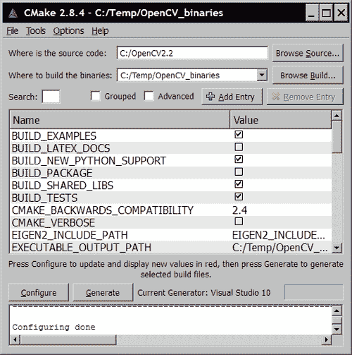

现在，您可以通过单击**生成**按钮来生成`makefiles`和工作区文件。 这些文件将允许您编译库。 这是安装过程的最后一步。

编译该库将使其可用于您的开发环境。 如果您选择了像 Visual Studio 这样的 IDE，那么您要做的就是打开 CMake 为您创建的顶级解决方案文件。 然后，您发出**构建解决方案**命令。 在 Unix 环境中，您将通过运行`make utility`命令使用生成的`makefiles`。

如果一切顺利，现在应该在指定目录中拥有已编译且随时可用的 OpenCV 库。 除了我们已经提到的目录之外，该目录还将包含一个`bin`目录，其中包含已编译的库。 您可以将所有内容移动到首选位置（例如`c:\OpenCV2.2`），然后将`bin`目录添加到系统路径（在 Windows 下，这是通过打开**控制面板**完成的。 HTG5]系统实用程序，在**高级**选项卡下，您会找到**环境变量**按钮）。

## 工作原理

从 2.2 版开始，OpenCV 库分为几个模块。 这些模块内置在`lib`目录中的库文件中。 他们是：

*   `opencv_core` 模块包含库的核心功能，尤其是基本数据结构和算术功能。
*   包含主要图像处理功能的`opencv_imgproc` 模块。
*   `opencv_highgui` 模块包含图像和视频读写功能，以及其他用户界面功能。
*   `opencv_features2d` 模块包含特征点检测器和描述符以及特征点匹配框架。
*   `opencv_calib3d` 模块包含相机校准，两视图几何估计和立体声功能。
*   `opencv_video` 模块包含运动估计，特征跟踪以及前景提取功能和类。
*   `opencv_objdetect` 模块包含诸如面部和人物检测器之类的对象检测功能。

该库还包括其他实用程序模块，其中包含机器学习功能（`opencv_ml` ），计算几何算法（`opencv_flann` ），贡献代码（`opencv_contrib` ），过时代码（`opencv_legacy` ）和 gpu 加速代码（`opencv_gpu` ）。

所有这些模块都有与之关联的头文件（位于`include`目录中）。 因此，典型的 OpenCV C++ 代码将从包含所需的模块开始。 例如（这是建议的声明样式）：

```cpp
#include <opencv2/core/core.hpp>
#include <opencv2/imgproc/imgproc.hpp>
#include <opencv2/highgui/highgui.hpp>
```

如果您看到以以下内容开头的 OpenCV 代码：

```cpp
 #include "cv.h"
```

这是因为在将库重构为模块之前，它使用的是旧样式。

## 更多

[您还可以访问位于以下位置的 OpenCV SVN 服务器正在开发的最新代码](https://code.ros.org/svn/opencv/trunk/opencv/)。

您会发现有很多示例可以帮助您学习如何使用该库并提供许多开发技巧。

# 使用 MS Visual C++ 创建 OpenCV 项目

使用 MS Visual C++，您可以轻松地为 Windows 创建 OpenCV 应用程序。 您可以构建简单的控制台应用程序，也可以使用漂亮的图形用户界面（GUI）创建更复杂的应用程序。 由于这是最简单的选项，因此我们将在此处创建一个简单的控制台应用程序。 我们将使用 Visual Studio 2010，但是相同的原理也适用于 Microsoft IDE 的任何其他版本，因为不同版本中的菜单和选项非常相似。

首次运行 Visual Studio 时，可以采用某种方式进行设置，以使 C++ 成为您的默认开发环境。 这样，当您启动 IDE 时，它将处于 Visual C++ 模式。

我们假定您已按照先前食谱中的说明在`C:\OpenCV2.2`目录下安装了 OpenCV。

## 准备

使用 Visual Studio 时，了解解决方案和项目之间的区别很重要。 基本上，解决方案由多个项目组成（每个项目是一个不同的软件模块，例如程序和库）。 这样，您的解决方案的项目可以共享文件和库。 通常，您为解决方案创建一个主目录，其中包含所有项目目录。 但是，您也可以将解决方案和项目分组到一个目录中。 这是一个项目解决方案中最常做的事情。 随着您对 VC++ 的熟悉和构建更复杂的应用程序，您应该利用多项目解决方案结构。

另外，在编译和执行 Visual C++ 项目时，可以在两种不同的配置下进行：Debug 和 Release。 调试模式可以帮助您创建和调试应用程序。 这是一个受保护程度更高的环境，例如，它将告诉您应用程序是否包含内存泄漏，或者它将在运行时检查是否正确使用了某些功能。 但是，它生成速度较慢的可执行文件。 这就是为什么一旦您的应用程序经过测试并准备好使用后，便可以在“发布”模式下构建它。 这将产生可执行文件，您将分发给应用程序的用户。 请注意，您可能会在调试模式下完美运行代码，但在发布模式下却遇到问题。 然后，您需要进行更多测试，以找出潜在的错误来源。 调试和发布模式并非 Visual C++ 独有，大多数 IDE 也支持这两种编译模式。

## 操作步骤

现在，我们准备创建我们的第一个项目。 这是通过使用**文件 | 项目... | 新建项目**菜单选项来完成的。  您可以在此处创建不同的项目类型。 让我们从最简单的选项开始，即选择一个 Win32 控制台应用程序，如以下屏幕快照所示：

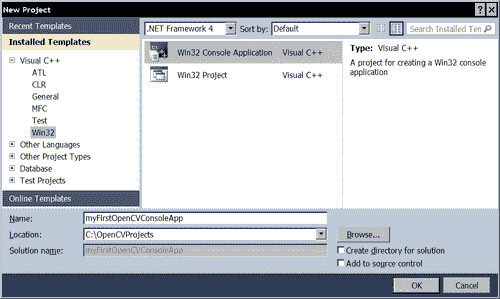

您需要指定要在何处创建项目，以及要为项目指定的名称。 还有一个选项可以为解决方案创建或不创建目录（右下角的复选框）。 如果选中此选项，将创建一个其他目录（使用您指定的名称），该目录将包含您的解决方案目录。 如果您只是简单地取消选中此选项，则仍将创建一个解决方案文件（扩展名`.sln`），但此文件将包含在同一（单个）项目目录中。 单击**下一步**，然后单击，转到 Win32 应用程序向导的**应用程序设置**窗口。 如以下屏幕截图所示，那里提供了许多选项。 我们将简单地创建一个空项目。

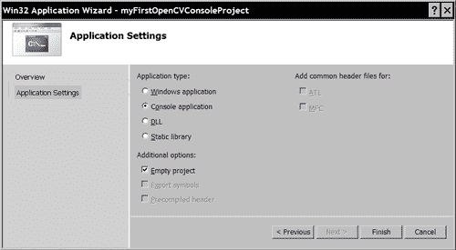

请注意，我们还没有选中**预编译头**选项，该选项是 MS Visual Studio 特定的功能，可以使编译过程更快。 由于我们希望保留在 ANSI C++ 标准之内，因此我们将不使用此选项。 如果单击**完成**，则将创建您的项目。 它暂时是空的，但是我们很快会添加一个主文件。

但是首先，为了能够编译和运行您将来的 OpenCV 应用程序，您需要告诉 Visual C++ 在哪里可以找到 OpenCV 库并包含文件。 由于将来可能会创建多个 OpenCV 项目，因此最好的选择是创建一个属性表，您可以在项目之间重复使用。 这是通过**属性管理器**完成的。 如果在当前的 IDE 中尚不可见，则可以从**视图**菜单中访问它。

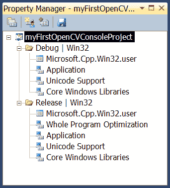

在 Visual C++ 2010 中，属性页是描述您的项目设置的 XML 文件。 现在，我们将通过右键单击**调试 | 创建一个新的 Win32 项目的**节点，并选择**添加新项目属性表**选项（如以下屏幕截图所示）：


一旦我们单击**添加**，就会添加新的属性表。 现在，我们需要对其进行编辑。 只需双击属性表的名称，然后选择 VC++ 目录，如下所示：

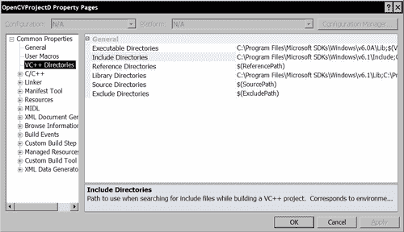

编辑**包含目录**文本字段，并将路径添加到 OpenCV 库的包含文件中：


对**库目录**执行相同的操作。 这次您将路径添加到 OpenCV 库文件中：


重要的是要注意，我们在属性表中使用了 OpenCV 库的显式路径。 通常，使用环境变量来指定库位置是一种更好的做法。 这样，如果切换到库的另一个版本，则只需更改此变量的定义，使其指向库的新位置。 同样，对于团队项目，不同的用户可能已将库安装在不同的位置。 使用环境变量将避免需要为每个用户编辑属性表。 因此，如果将环境变量 `OPENCV2_DIR`定义为`c:\OpenCV2.2`，则两个 OpenCV 目录将在属性表​​中指定为`$(OPENCV_DIR)\include`和`$(OPENCV_DIR)\lib`。

下一步是指定 OpenCV 库文件，这些文件需要与您的代码链接才能生成可执行应用程序。 根据应用程序，您可能需要不同的 OpenCV 模块。 由于我们要在所有项目中重用此属性表，因此我们将仅添加运行本书的应用程序所需的库模块。 转到**链接器**节点的**输入**项目，如以下屏幕截图所示：

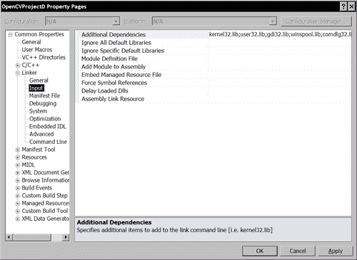

编辑**其他依赖项**文本字段，并添加以下库模块列表：

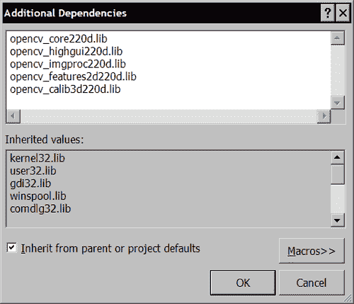

请注意，我们指定的库名称以字母`d`结尾。 这些是“调试”模式的二进制文件。 您将需要为发布模式创建另一个（几乎相同）的属性表。 您遵循相同的步骤，但是将其添加到**发布 | Win32** 节点。 这次，指定了库名，但没有在末尾添加`d`。

现在，我们准备创建，编译和运行我们的第一个应用程序。 我们使用**解决方案资源管理器**添加新的源文件，然后右键单击**源文件**节点。 您选择**添加新项目...**，这使您有机会指定`main.cpp`作为此 C++ 文件的名称：

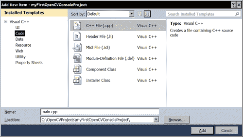

您也可以使用**文件 | 新建 | 文件...**菜单选项来执行此操作。 现在，让我们构建一个简单的应用程序，它将在默认目录下显示名为`img.jpg`的图像。


一旦复制了上图中的代码（将在后面进行说明），就可以编译它并使用屏幕顶部工具栏中的**启动**绿色箭头来运行它。 您将看到图像显示五秒钟。 这里有一个例子：

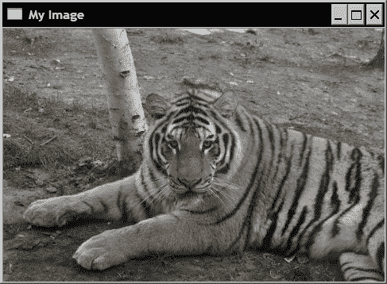

如果是这样，那么您已经完成了第一个成功的 OpenCV 应用程序！ 如果程序在执行时失败，则可能是因为找不到图像文件。 请参阅以下部分以了解如何将其放置在正确的目录中。

## 工作原理

当您单击**启动调试**按钮（或按`F5`）时，将编译您的项目，然后执行。 您还可以通过选择**构建**菜单下的**构建解决方案**（`F7`）来编译项目。 第一次编译项目时，将创建一个`Debug`目录。 这将包含可执行文件（扩展名`.exe`）。 同样，您也可以通过使用绿色箭头按钮右侧的下拉菜单（或使用**构建**菜单下的选项**配置管理器**，简单地选择**发布管理**选项来​​创建发行版本）。 然后将创建一个`Release`目录。

当使用 Visual Studio 的**启动**按钮执行项目时，默认目录将始终是包含解决方案文件的目录。 但是，如果您通过双击`.exe`文件（通常为`Release`目录）选择在 IDE 外部（即从 Windows 资源管理器）执行应用程序，则默认目录将变为一个包含可执行文件的目录。 因此，在执行此应用程序之前，请确保图像文件位于相应目录中的 。

## 另见

本章后面的“加载，显示和保存图像”配方，解释了我们在此任务中使用的 OpenCV 源代码。

# 使用 Qt 创建 OpenCV 项目

Qt 是用于 C++ 应用程序的完整集成开发环境（IDE），最初由挪威软件公司 Trolltech 开发，该公司于 2008 年被诺基亚收购。 它是根据 LPGL 开源许可以及商业（和付费）许可开发专有项目而提供的。 它由两个独立的元素组成：一个称为 Qt Creator 的跨平台 IDE，以及一组 Qt 类库和开发工具。 使用 Qt 软件开发工具包（SDK）开发 C++ 应用程序有很多好处：

*   这是 Qt 社区开发的一个开放源代码计划，使您可以访问不同 Qt 组件的源代码。
*   它是跨平台的，这意味着您可以开发可在不同操作系统（例如 Windows，Linux，Mac OS X 等）上运行的应用程序。
*   它包括一个完整的跨平台 GUI 库，该库遵循有效的面向对象和事件驱动的模型。
*   Qt 还包括多个跨平台库，用于开发多媒体，图形，数据库，多线程，Web 应用程序以及许多其他对设计高级应用程序有用的有趣构建基块。

## 准备

可以从[这个页面](http://qt.nokia.com)下载 Qt。 如果选择 LPGL 许可证，则它是免费的。 您应该下载完整的 SDK。 但是，请确保选择适合您平台的 Qt 库软件包。 显然，由于我们正在处理开源软件，因此始终可以在您选择的平台下重新编译该库。

在这里，我们使用 Qt Creator 1.2.1 版和 Qt 4.6.3 版。 请注意，在 Qt Creator 的**项目**选项卡下，可以管理可能已安装的不同 Qt 版本。 这样可以确保您始终可以使用适当的 Qt 版本来编译项目。

## 操作步骤

启动 Qt 时，它将询问您是否要创建一个新项目或是否要打开一个新项目。 您也可以通过在**文件**菜单下并选择**新建...**选项来创建新项目。 要复制我们在上一个配方中所做的操作，我们将选择`Qt4 Console Application` ，如以下屏幕截图所示：

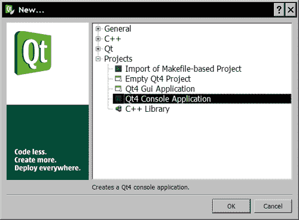

然后，您可以指定一个名称和一个项目位置，如下所示：


以下屏幕将要求您选择要包含在项目中的模块。 只需保持默认状态为选中状态，然后单击**下一步**然后**完成**即可。 然后创建一个空的控制台应用程序，如下所示：


Qt 生成的代码创建`QCoreApplication`对象并调用其`exec()`方法。 仅当您的应用程序需要事件处理程序来处理与 GUI 的用户交互时，才需要这样做。 在我们简单的打开和显示图像示例中，这不是必需的。 我们可以简单地将生成的代码替换为上一个任务中使用的代码。 然后，简单的打开并显示图像程序将如下所示：

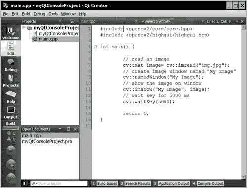

为了能够编译该程序，需要指定 OpenCV 库文件和头文件的位置。 使用 Qt，此信息在项目文件（扩展名为`.pro`）中给出，该文件是描述项目参数的简单文本文件。 您可以通过选择相应的项目文件在 Qt Creator 中编辑此项目文件，如以下屏幕截图所示：

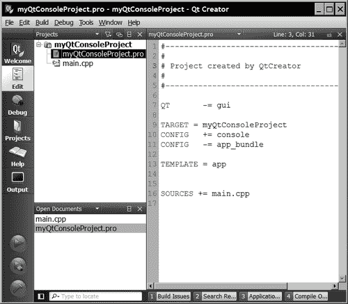

通过在项目文件的末尾添加以下行来提供构建 OpenCV 应用程序所需的信息：

```cpp
INCLUDEPATH += C:\OpenCV2.2\include\

LIBS += -LC:\OpenCV2.2\lib \
-lopencv_core220 \
-lopencv_highgui220 \
-lopencv_imgproc220 \
-lopencv_features2d220 \
-lopencv_calib3d220
```

### 提示

**下载示例代码**

您可以从[这个页面](http://www.PacktPub.com)下载从帐户购买的所有 Packt 图书的示例代码文件。 如果您在其他地方购买了此书，则可以访问[这个页面](http://www.PacktPub.com/support)并注册以将文件直接通过电子邮件发送给您。

现在可以准备编译和执行程序了。 通过单击左下绿色箭头（或通过按`Ctrl + R`）来完成此操作。 您还可以使用**项目**选项卡的**构建选项**来设置**调试**和**发布**模式。

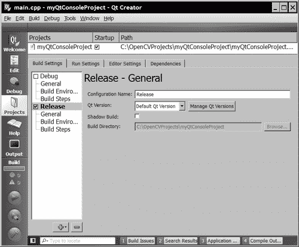

## 工作原理

Qt 项目由项目文件描述。 这是一个文本文件，其中声明了一个变量列表，其中包含构建项目所需的相关信息。 实际上，此文件由名为`qmake`的软件工具处理，Qt 在请求编译时会调用该工具。 项目文件中定义的每个变量都与值列表关联。 Qt 中 Qmake 可以识别的主要变量如下：

*   `TEMPLATE`： 定义项目的类型（应用程序，库等）。
*   `CONFIG`： 指定编译器在构建项目时应使用的不同选项。
*   `HEADERS`： 列出项目的头文件。
*   `SOURCES`： 列出项目的源文件（`.cpp`）。
*   `QT`： 声明所需的 Qt 扩展模块和库。 默认情况下，包括核心和 GUI 模块。 如果要排除其中之一，请使用`-=`表示法。
*   `INCLUDEPATH`： 指定应搜索的头文件目录。
*   `LIBS`： 包含应与项目链接的库文件列表。 您将标志`–L`用于目录路径，并将标志`–l`用于库名称。

还定义了其他几个变量，但是最常用的是此处列出的变量。

## 更多

Qmake 项目文件中可以使用许多其他功能。 例如，可以定义范围以添加适用于特定平台的声明：

```cpp
win32 {
   # declarations for Windows 32 platforms only
}
unix {
   # declarations for Unix 32 platforms only
}
```

您也可以使用`pkg-config`实用程序包。 它是一个开源工具，可帮助使用正确的编译器选项和库文件。 当使用 CMake 安装 OpenCV 时，`unix-install`包含一个`opencv.pc`文件，该文件由`pkg-config`读取以确定编译参数。 一个多平台的 Qmake 项目文件可以如下所示：

```cpp
unix { 

    CONFIG += link_pkgconfig
    PKGCONFIG += opencv
}

Win32 {

INCLUDEPATH += C:\OpenCV2.2\include\

LIBS += -LC:\OpenCV2.2\lib \
-lopencv_core220 \
   -lopencv_highgui220 \
   -lopencv_imgproc220 \
   -lopencv_features2d220 \
   -lopencv_calib3d220
}
```

## 另见

下一个配方“加载，显示，和保存图像”解释了我们在此任务中使用的 OpenCV 源代码。

有关 Qt，Qt Creator 和所有 Qt 扩展模块的完整文档，请访问[网站](http://qt.nokia.com)。

# 加载，显示和保存图像

前面的两个食谱教您如何创建一个简单的 OpenCV 项目，但是我们没有解释所使用的 OpenCV 代码。 该任务将向您展示如何执行 OpenCV 应用程序开发中所需的最基本的操作。 这些步骤包括从文件加载输入图像，在窗口上显示图像以及将输出图像存储在磁盘上。

## 准备

使用 MS Visual Studio 或 Qt，创建一个具有准备就绪的主要功能的新控制台应用程序。 有关如何进行的操作，请参见前两个食谱。

## 操作步骤

首先要做的是声明一个将保留图像的变量。 在 OpenCV 2 下，您定义了`cv::Mat`类的对象。

```cpp
cv::Mat image;
```

此定义创建大小为 0 乘 0 的图像。这可以通过调用`cv::Mat`方法`size()`进行确认，该方法允许您读取此图像的当前大小。 它返回一个包含图像高度和宽度的结构：

```cpp
std::cout << "size: " << image.size().height << " , " 
          << image.size().width << std::endl;
```

接下来，对读取函数的简单调用将从文件读取图像，对其进行解码，然后分配内存：

```cpp
image=  cv::imread("img.jpg");
```

现在您可以使用该图像了。 但是，您应该首先检查是否已正确读取图像（如果找不到文件，文件损坏或不是可识别的格式，则会发生错误）。 图像的有效性通过以下方式测试：

```cpp
if (!image.data) { 
   // no image has been created... 
}
```

成员变量`data`实际上是指向将包含图像数据的已分配存储块的指针。 当未读取图像时，将其简单地设置为 0。 您可能要对此图像进行的第一件事是显示它。 您可以使用 OpenCV 提供的`highgui`模块来执行此操作。 首先，声明要在其上显示图像的窗口，然后指定要在此特殊窗口上显示的图像：

```cpp
cv::namedWindow("Original Image"); // define the window
cv::imshow("Original Image", image); // show the image
```

现在，您通常将对图像进行一些处理。 OpenCV 提供了多种处理功能，本书中将探讨其中的一些功能。 让我们从一个非常简单的例子开始，它将简单地水平翻转图像。 OpenCV 中的几种图像转换可以在原地执行，这意味着该转换直接应用于输入图像（不创建新图像）。 翻转方法就是这种情况。 但是，我们总是可以创建另一个矩阵来保存输出结果，这就是我们要做的：

```cpp
cv::Mat result;
cv::flip(image,result,1); // positive for horizontal
                          // 0 for vertical,                     
                          // negative for both
```

结果显示在另一个窗口上：

```cpp
cv::namedWindow("Output Image");
cv::imshow("Output Image", result);
```

由于它是一个控制台窗口，将在主要功能的结尾处终止，因此我们添加了一个额外的`highgui`方法以等待用户键，然后再结束程序：

```cpp
cv::waitKey(0);
```

然后，您可以在两个不同的窗口中看到输入和输出图像。 最后，您可能希望将处理后的图像保存在磁盘上。 使用以下`highgui`函数可以完成此操作：

```cpp
cv::imwrite("output.bmp", result);
```

文件扩展名确定将使用哪个编解码器保存图像。

## 工作原理

OpenCV 的 C++ API 中定义的所有类和函数都在名称空间`cv`中定义。 您有两种选择来访问它们。 首先，在主函数定义之前添加以下声明：

```cpp
using namespace cv;
```

或者，像在本食谱中一样，在所有的 OpenCV 类名和函数名前加上`cv::`命名空间规范。

类`cv::Mat`是用于保存图像（显然还有其他矩阵数据）的数据结构。 默认情况下，它们的大小为零，但您也可以指定初始大小：

```cpp
cv::Mat ima(240,320,CV_8U,cv::Scalar(100));
```

在这种情况下，您还需要指定每个矩阵元素的类型，此处`CV_8U` 对应于 1 字节像素图像。 字母`U`表示未签名。 您也可以使用字母`S`声明带符号的数字。 对于彩色图像，您将指定三个通道（`CV_8UC3`）。 您还可以声明大小为 16 和 32 的整数（有符号或无符号）（例如`CV_16SC3`）。 您还可以访问 32 位和 64 位浮点数（例如`CV_32F`）。

当`cv::Mat`对象超出范围时，分配的内存将自动释放。 这非常方便，因为可以避免出现内存泄漏问题。 此外，`cv::Mat`类实现引用计数和浅表复制，以便在将图像分配给另一图像时，不复制图像数据（即像素），并且两个图像都指向同一存储块。 这也适用于按值传递或按值返回的图像。 保留引用计数，以便仅在销毁对图像的所有引用时才释放内存。 如果您希望创建一个包含原始图像新副本的图像，则可以使用`copyTo()`方法。 您可以通过在此项目的示例中声明一些额外的图像来测试此行为，如下所示：

```cpp
cv::Mat image2, image3;
image2= result; // the two images refer to the same data
result.copyTo(image3); // a new copy is created
```

现在，如果再次翻转输出图像并显示另外两个图像，您将看到`image2`也受到转换的影响（因为它指向的图像数据与结果图像相同），而图像的副本`image3`保持不变。 `cv::Mat`对象的此分配模型还意味着您可以安全地编写返回图像的函数（或类方法）：

```cpp
cv::Mat function() {

   // create image
   cv::Mat ima(240,320,CV_8U,cv::Scalar(100));
   // return it
   return ima;
}
```

如果我们从`main`函数中调用此函数：

```cpp
   // get a gray-level image
   cv::Mat gray= function();
```

`gray`变量现在将保留该函数创建的图像，而无需分配额外的内存。 确实，只有图像的浅表副本将从返回的`cv::Mat`实例传输到灰度图像。 当`ima`局部变量超出范围时，将取消分配此变量，但是由于关联的参考计数器指示其内部图像数据正在被另一个实例（即`gray`变量）引用，因此其内存块没有被释放。

但是，对于类，应该小心，不要返回图像类属性。 这是一个容易出错的实现示例：

```cpp
class Test {

   // image attribute
   cv::Mat ima;

  public:

     // constructor creating a gray-level image
     Test() : ima(240,320,CV_8U,cv::Scalar(100)) {}

     // method return a class attribute, not a good idea...
     cv::Mat method() { return ima; }
};
```

在这里，如果函数调用此类的方法，则它将获得图像属性的浅表副本。 如果以后再修改此副本，则`class`属性也将被修改，这可能会影响该类的后续行为（反之亦然）。 为避免此类错误，您应该返回属性的副本。

## 更多

在 OpenCV 的版本 2 中，引入了新的 C++ 接口。 以前，使用（并且仍然可以使用）类似 C 的函数和结构。 特别地，使用`IplImage`结构来操纵图像。 该结构继承自 IPL 库（即英特尔图像处理库），该库现已与 IPP 库（英特尔集成性能原始库）集成在一起。 如果使用通过旧 C 接口创建的代码和库，则可能需要操纵这些`IplImage`结构。 幸运的是，有一种方便的方法可以将`IplImage`转换为`cv::Mat`对象。

```cpp
IplImage* iplImage = cvLoadImage("c:\\img.jpg");
cv::Mat image4(iplImage,false);
```

功能`cvLoadImage`是用于加载图像的 C 接口功能。 `cv::Mat`对象的构造函数中的第二个参数指示该数据将不会被复制（如果想要新的副本，请将其设置为`true`，而`false`是默认值，因此可以将其省略）， `IplImage`和`image4`将共享相同的图像数据。 您需要在此处小心，不要创建悬空的指针。 因此，将`IplImage`指针封装到 OpenCV 2 提供的引用计数指针类中更为安全：

```cpp
cv::Ptr<IplImage> iplImage = cvLoadImage("c:\\img.jpg");
```

否则，如果您需要释放由 `IplImage`结构指向的内存，则需要明确地执行以下操作：

```cpp
 cvReleaseImage(&iplImage);
```

请记住，您应该避免使用此过时的数据结构。 相反，请始终使用`cv::Mat`。

# 使用 Qt 创建 GUI 应用程序

Qt 提供了丰富的库来构建具有专业外观的复杂 GUI。 使用 Qt Creator，GUI 创建过程变得很容易。 此食谱将向您展示如何使用 Qt 构建 OpenCV 应用程序，用户可以使用 GUI 进行控制。

## 准备

启动 Qt Creator，我们将使用它来创建 GUI 应用程序。 也可以不使用此工具来创建 GUI，但是使用可视化 IDE（可在其中轻松拖放小部件）是构建美观 GUI 的最简单方法。

## 操作步骤

选择**创建新项目...**，然后选择 **Qt GUI 应用**，如以下屏幕快照所示：

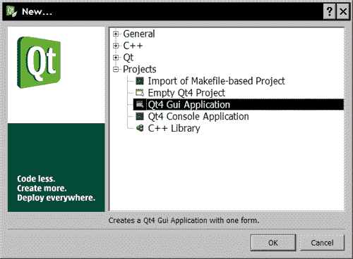

给您的项目命名和位置。 如果然后单击**下一步**，您将看到已选中 **QtGUI 模块**。 由于我们不需要其他模块，因此您现在可以单击**完成**。 这将创建您的新项目。 除了常用的项目文件（`.pro`）和`main.cpp`文件之外，您还会看到两个`mainwindow`文件，它们定义了包含 GUI 窗口的类。 您还将找到一个扩展名为`.ui` 的文件，该文件描述了 UI 布局。 实际上，如果双击它，将会看到当前的用户界面，如下所示：

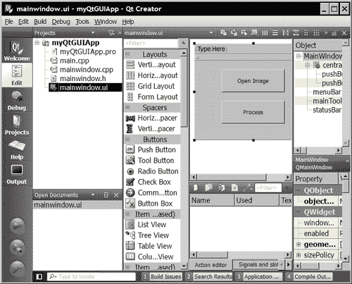

您可以在上面拖放不同的小部件。 像前面的示例一样，放下两个**按钮**。 您可以调整它们的大小并调整窗口的大小以使其美观。 您还应该重命名按钮标签。 只需单击文本，然后插入您选择的名称。

现在，我们添加一个信号方法来处理单击按钮事件。 右键单击第一个按钮，然后在上下文菜单中选择**转到插槽...**。 然后显示可能的信号列表，如以下屏幕快照所示：

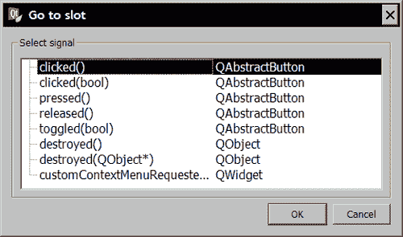

只需选择`clicked()`信号即可。 这是处理按钮按下事件的事件。 这样，您将被带到`mainwindow.cpp`文件。 您将看到已添加了新方法。 这是在收到`click()`信号时调用的时隙方法：

```cpp
#include "mainwindow.h"
#include "ui_mainwindow.h"
MainWindow::MainWindow(QWidget *parent)
: QMainWindow(parent), ui(new Ui::MainWindow)
{
   ui->setupUi(this);
}
MainWindow::~MainWindow()
{
   delete ui;
}
void MainWindow::on_pushButton_clicked()
{
}

```

为了能够显示然后处理图像，我们需要定义一个`cv::Mat`类成员变量。 这是在`MainWindow`类类的头文件中完成的。 现在，此标头的内容如下：

```cpp
#ifndef MAINWINDOW_H
#define MAINWINDOW_H

#include <QtGui/QMainWindow>
#include <QFileDialog>
#include <opencv2/core/core.hpp>
#include <opencv2/highgui/highgui.hpp>

namespace Ui
{
   class MainWindow;
}
class MainWindow : public QMainWindow
{
   Q_OBJECT
public:
   MainWindow(QWidget *parent = 0);
   ~MainWindow();
private:
   Ui::MainWindow *ui;
 cv::Mat image; // the image variable
private slots:
   void on_pushButton_clicked();
};

#endif // MAINWINDOW_H
```

请注意，我们还包括了`core.hpp` 和`highgui.hpp` 头文件。 正如我们在前面的食谱中所了解的那样，我们一定不要忘记编辑项目文件以附加 OpenCV 库信息。

然后可以添加 OpenCV 代码。 第一个按钮打开源图像。 这是通过将以下代码添加到相应的插槽方法来完成的：

```cpp
void MainWindow::on_pushButton_clicked()
{
   QString fileName = QFileDialog::getOpenFileName(this,
        tr("Open Image"), ".", 
      tr("Image Files (*.png *.jpg *.jpeg *.bmp)"));

   image= cv::imread(fileName.toAscii().data());
   cv::namedWindow("Original Image");
   cv::imshow("Original Image", image);
}
```

然后，通过右键单击第二个按钮来创建新的插槽。 第二个插槽将对所选输入图像执行一些处理。 以下代码将简单地翻转图像：

```cpp
void MainWindow::on_pushButton_2_clicked()
{
   cv::flip(image,image,1);
   cv::namedWindow("Output Image");
   cv::imshow("Output Image", image);
}
```

现在，您可以编译并运行该程序，您的 2 键 GUI 将允许您选择图像并进行处理。

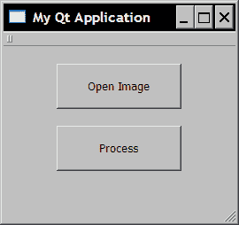

输入和输出图像显示在我们定义的两个`highgui`窗口上。

## 工作原理

在 Qt 的 GUI 编程框架下，对象使用信号和插槽进行通信。 每当窗口小部件更改状态或发生事件时，都会发出信号。 该信号具有预定义的签名，如果另一个对象想要接收该信号，则它必须定义一个具有相同签名的插槽。 因此，插槽是一种特殊的类方法，当它所连接的信号发出时会自动调用。

信号和插槽被定义为类方法，但必须在指定插槽和信号的 Qt 访问下声明。 当您在按钮上添加插槽时，这就是 Qt Creator 所做的，即：

```cpp
private slots:
  void on_pushButton_clicked();
```

信号和插槽是松散耦合的，也就是说，信号不知道与连接插槽的对象有关的任何信息，而插槽也不知道是否连接了信号。 同样，许多插槽可以连接到一个信号，并且一个插槽可以接收来自许多物体的信号。 唯一的要求是信号的签名和时隙方法必须匹配。

从`QObject`类继承的所有类都可以包含信号和插槽。 这些通常是小部件类的子类（`QWidget`的子类），但是任何其他类都可以定义插槽和信号。 实际上，信号和时隙概念是一种非常强大的类通信机制。 但是，它特定于 Qt 框架。

在 Qt 中，主窗口是类`MainWindow`的实例。 您可以通过在`MainWindow`类定义中声明的成员变量`ui`来访问它。 另外，GUI 的每个小部件也是一个对象。 创建 GUI 时，指向您已添加到主窗口的每个小部件实例的指针与`ui`变量相关联。 因此，您可以访问程序中每个窗口小部件的属性和方法。 例如，如果要在选择输入图像之前禁用**处理**按钮，则您需要做的就是在 GUI 初始化时（在`MainWindow`构造函数中）调用以下方法。 ：

```cpp
ui->pushButton_2->setEnabled(false);
```

指针变量`pushbutton_2`在此对应于**处理**按钮。 然后，当成功加载图像时，您可以启用按钮（在**打开图像**按钮中）：

```cpp
if (image.data) {
   ui->pushButton_2->setEnabled(true);
}
```

还值得注意的是，在 Qt 下，GUI 的布局在 XML 文件中已完全描述。 这是带有`.ui`扩展名的文件。 如果进入项目目录并使用文本编辑器打开`.ui`文件，则将能够读取该文件的 XML 内容。 定义了几个 XML 标签。 在此食谱中介绍的示例应用程序的情况下，您将找到两个定义为`QPushButton`的窗口小部件类标记。 名称与这些窗口小部件类的标记关联，该名称与附加到`ui`对象的指针变量的名称相对应。 其中的每一个都定义了描述其位置和大小的几何属性。 还定义了许多其他属性标签。 Qt Creator 有一个属性选项卡，显示每个小部件的属性值。 因此，即使 Qt Creator 是创建 GUI 的最佳工具，您也可以编辑`.ui` XML 文件来创建和修改 GUI。

## 更多

使用 Qt，在 GUI 上直接显示图像相对容易。 您需要做的就是在窗口中添加一个标签对象。 然后，将图像分配给该标签以显示该图像。 请记住，您可以通过`ui`指针（在我们的示例中为`ui->label`）的相应指针属性访问标签实例。 但是此图像必须是`QImage`类型，即处理图像的 Qt 数据结构。 转换相对简单，只是需要反转三个颜色通道的顺序（从`cv::Mat`中的 BGR 到`QImage`中的 RGB）。 我们可以使用`cv::cvtColor`功能。 然后，我们简单的 GUI 应用程序的**处理**按钮可以更改为：

```cpp
void MainWindow::on_pushButton_2_clicked()
{
   cv::flip(image,image,1); // process the image

   // change color channel ordering
   cv::cvtColor(image,image,CV_BGR2RGB); 

   // Qt image
   QImage img= QImage((const unsigned char*)(image.data), 
      image.cols,image.rows,QImage::Format_RGB888);

   // display on label
   ui->label->setPixmap(QPixmap::fromImage(img)); 
   // resize the label to fit the image
   ui->label->resize(ui->label->pixmap()->size());
}
```

结果，现在将输出图像直接显示在 GUI 上，如下所示：

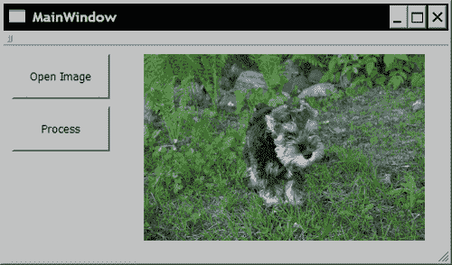

## 另见

有关 Qt GUI 模块以及信号和插槽机制的更多信息，请查阅位于[这个页面](http://doc.trolltech.com )的在线 Qt 文档。