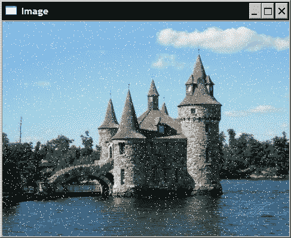
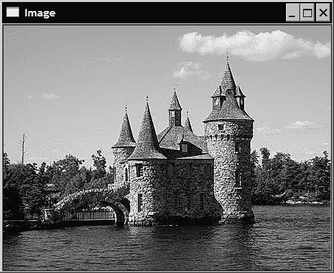
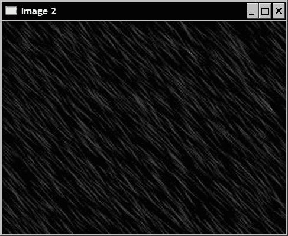
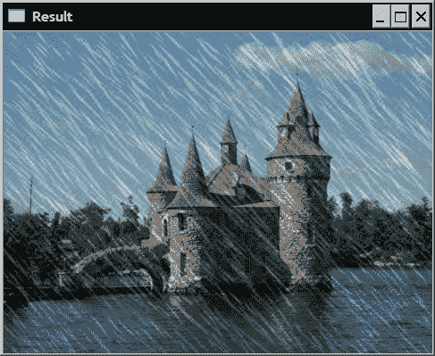
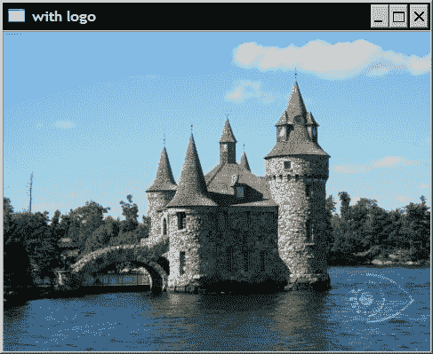
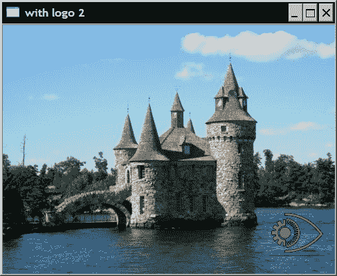

# 第 2 章。操纵像素

在本章中，我们将介绍：

*   访问像素值
*   用指针扫描图像
*   使用迭代器扫描图像
*   编写有效的图像扫描循环
*   扫描具有访问邻居的图像
*   执行简单的图像算术
*   定义兴趣区域

# 简介

为了构建计算机视觉应用程序，您必须能够访问图像内容，并最终修改或创建图像。 本章将教您如何操作图像元素（又称**像素**）。 您将学习如何扫描图像并处理其每个像素。 您还将学习如何有效地执行此操作，因为即使尺寸适中的图像也可能包含数万个像素。

从根本上讲，图像是数值矩阵。 这就是为什么 OpenCV 2 使用`cv::Mat`数据结构来操作它们的原因。 矩阵的每个元素代表一个像素。 对于灰度图像（“黑白”图像），像素为无符号的 8 位值，其中 0 对应于黑色，而 255 对应于白色。 对于彩色图像，每个像素需要三个这样的值才能代表通常的三个原色通道（红绿蓝）。 因此，在这种情况下，矩阵元素由值的三元组组成。

如上一章所述，OpenCV 还允许您创建具有不同类型（例如，整数（`CV_8U`）和浮点数[`CV_32F`）的像素值的矩阵（或图像）。 这些对于在某些图像处理任务中存储例如中间值非常有用。 大多数操作可以应用于任何类型的矩阵，其他操作则需要特定类型的矩阵，或者仅适用于给定数量的通道。 因此，对函数或方法的先决条件有充分的了解对于避免常见的编程错误至关重要。

在本章中，我们使用以下彩色图像作为输入（请参见本书的网站以彩色方式查看该图像）：


# 访问像素值

为了访问矩阵的每个单独元素，您只需要指定其行号和列号即可。 将返回对应的元素，在多通道图像的情况下，该元素可以是单个数值或值的向量。

## 准备

为了说明对像素值的直接访问，我们将创建一个简单的函数，在图像中添加椒盐噪声。 顾名思义，**椒盐噪声**是一种特殊类型的噪声，其中某些像素被白色或黑色像素代替。 当某些像素的值在传输过程中丢失时，这种类型的噪声可能会出现在错误的通信中。 在我们的例子中，我们将简单地随机选择一些像素并将其分配为白色。

## 操作步骤

我们创建一个接收输入图像的函数。 这是将由我们的功能修改的图像。 为此，我们使用了传递引用机制。 第二个参数是我们要覆盖白色值的像素数：

```cpp
void salt(cv::Mat &image, int n) {

   for (int k=0; k<n; k++) {

      // rand() is the MFC random number generator
      // try qrand() with Qt
      int i= rand()%image.cols;
      int j= rand()%image.rows;

      if (image.channels() == 1) { // gray-level image

         image.at<uchar>(j,i)= 255; 

      } else if (image.channels() == 3) { // color image

         image.at<cv::Vec3b>(j,i)[0]= 255; 
         image.at<cv::Vec3b>(j,i)[1]= 255; 
         image.at<cv::Vec3b>(j,i)[2]= 255; 
      }
   }
}
```

该功能由单个循环组成，该循环将`n`乘以`255`值乘以随机选择的像素。 在此，使用随机数生成器选择像素列`i`和行`j`。 请注意，我们通过检查与每个像素关联的通道数来区分灰度图像和彩色图像的两种情况。 在灰度图像的情况下，将的数字`255`分配给单个 8 位值。 对于彩色图像，需要为三个原色通道分配`255`，以获得白色像素。

您可以通过向其传递先前打开的图像来调用此函数：

```cpp
   // open the image
   cv::Mat image= cv::imread("boldt.jpg");

   // call function to add noise
   salt(image,3000);

   // display image
   cv::namedWindow("Image");
   cv::imshow("Image",image);
```

生成的图像如下所示：



## 工作原理

类 `cv::Mat`包括几种访问图像不同属性的方法。 公共成员变量`cols` 和 `rows`为您提供图像中的列数和行数。 对于元素访问，`cv::Mat`具有方法 `at(int y, int x)`。 但是，必须在编译时知道方法返回的类型，并且由于`cv::Mat`可以保存任何类型的元素，因此程序员需要指定期望的返回类型。 这就是`at`方法已被实现为模板方法的原因。 因此，在调用它时，必须指定图像元素类型，如下所示：

```cpp
         image.at<uchar>(j,i)= 255; 
```

重要的是要注意，确保指定的类型与矩阵中包含的类型匹配是程序员的责任。 `at`方法不执行任何类型转换。

在彩色图像中，每个像素与三个分量相关联：红色，绿色和蓝色通道。 因此，包含彩色图像的`cv::Mat`将返回三个 8 位值的向量。 OpenCV 具有针对此类短向量的定义类型，称为 `cv::Vec3b`。 它是 3 个`unsigned char`的向量。 这就解释了为什么元素访问彩色像素的像素写为：

```cpp
         image.at<cv::Vec3b>(j,i)[channel]= value; 
```

索引`channel`指定三个颜色通道之一。

2 元素和 4 元素向量（`cv::Vec2b`和`cv::Vec4b`）以及其他元素类型也存在类似的向量类型。 在此后一种情况下，最后一个字母由`short`的`s`，`int`的`i`，`float`的`f`和`double`的`d`替换。 所有这些类型都是使用模板类`cv::Vec<T,N>`定义的，其中`T`是类型，`N`是矢量元素的数量。

## 更多

使用`cv::Mat`类的`at`方法有时会很麻烦，因为必须为每个调用将返回的类型指定为模板参数。 在已知矩阵类型的情况下，可以使用`cv::Mat_`类，它是`cv::Mat`的模板子类。 此类定义了一些其他方法，但没有新的数据属性，因此可以将指向一个类的指针或引用直接转换为另一个类。 在其他方法中，`operator()`允许直接访问矩阵元素。 因此，如果`image`是对`uchar`矩阵的引用，则可以编写：

```cpp
   cv::Mat_<uchar> im2= image; // im2 refers to image
   im2(50,100)= 0; // access to row 50 and column 100
```

由于`cv::Mat_`元素的类型是在创建变量时声明的，因此`operator()`方法在编译时就知道要返回哪种类型。 除了编写时间短之外，使用`operator()`方法可提供与`at`方法完全相同的结果。

## 另见

“编写高效的图像扫描循环”配方可讨论此方法的效率。

# 用指针扫描图像

在大多数图像处理任务中，需要扫描图像的所有像素才能执行计算。 考虑到将需要访问的大量像素，以有效的方式执行此任务至关重要。 本食谱以及下一篇食谱，将向您展示实现图像扫描循环的不同方法。 该配方使用指针算法。

## 准备

我们将通过完成一个简单的任务来说明图像扫描过程：减少图像中的颜色数量。

彩色图像由 3 通道像素组成。 这些通道中的每一个对应于三种原色（红色，绿色，蓝色）之一的强度值。 由于这些值均为 8 位`unsigned char`，因此颜色总数为`256x256x256`，超过 1600 万种颜色。 因此，为减少分析的复杂性，有时减少图像中的颜色数量很有用。 一种简单的方法可以将 RGB 空间细分为相等大小的多维数据集。 例如，如果将每个尺寸的颜色数量减少 8，那么您将获得总共`32x32x32`的颜色。 然后，原始图像中的每种颜色在减色图像中被分配一个新的颜色值，该值对应于其所属的多维数据集中心的值。

因此，基本的色彩还原算法很简单。 如果`N`是缩小因子，则对于图像中的每个像素以及该像素的每个通道，将值除以`N`（整数除法，因此会丢失提示）。 然后将结果乘以`N`，这将为您提供`N`在输入像素值以下的倍数。 只需加`N / 2`，即可获得`N`的两个相邻倍数之间的间隔的中心位置。如果对每个 8 位通道值重复此过程，则总共将获得`256 / N x 256 / N x 256 / N`可能的颜色值。

## 操作步骤

我们的减色功能的签名如下：

```cpp
void colorReduce(cv::Mat &image, int div=64);
```

用户提供图像和每个通道的缩小系数。 此处，在原位中完成**处理，即通过该功能修改了输入图像的像素值。 请参见“本食谱的更多内容”部分提供了具有输入和输出参数的更通用的函数签名。

通过创建遍历所有像素值的双循环即可简单地完成处理：

```cpp
void colorReduce(cv::Mat &image, int div=64) {

     int nl= image.rows; // number of lines
     // total number of elements per line
     int nc= image.cols * image.channels(); 

     for (int j=0; j<nl; j++) {

        // get the address of row j
        uchar* data= image.ptr<uchar>(j);

        for (int i=0; i<nc; i++) {

            // process each pixel ---------------------

                  data[i]=    data[i]/div*div + div/2;

            // end of pixel processing ----------------

        } // end of line                   
     }
}
```

可以使用以下代码片段测试此功能：

```cpp
   // read the image
   image= cv::imread("boldt.jpg");
   // process the image
   colorReduce(image);
   // display the image
   cv::namedWindow("Image");
   cv::imshow("Image",image);
```

例如，这将为您提供以下图像（请参见本书的网站以彩色查看此图像）：


## 工作原理

在彩色图像中，图像数据缓冲区的前 3 个字节给出左上像素的 3 个颜色通道值，接下来的 3 个字节是第一行第二个像素的值，依此类推（请注意，OpenCV 使用 ，默认情况下，BGR 通道顺序，因此蓝色通常是第一个通道）。 宽度为`W`且高度为`H`的图像将需要`WxHx3`个`uchar`的存储块。 但是，出于效率原因，可以用很少的额外像素来填充行的长度。 这是因为某些多媒体处理器芯片（例如 Intel MMX 架构）在行数为 4 或 8 的倍数时可以更有效地处理图像。 值将被忽略。 OpenCV 将填充行的长度指定为关键字。 显然，如果未用多余像素填充图像，则有效宽度将等于实际图像宽度。 数据属性 `cols`为您提供图像宽度（即列数），属性 `rows`为您提供图像高度，而`step`数据属性为您提供有效宽度。 字节数。 即使您的图像不是`uchar`的类型，`step`仍会为您提供连续的字节数。 像素元素的大小由方法 `elemSize`给出（例如，对于 3 通道短整数矩阵（`CV_16SC3`），`elemSize`将返回 6）。 图像中的通道数由`nchannels`方法给出（对于灰度图像为 1，对于彩色图像为 3）。 最后，方法 `total`返回矩阵中像素的总数（即矩阵项）。

然后，每行的像素值数量由下式给出：

```cpp
     int nc= image.cols * image.channels(); 
```

为了简化指针算术的计算，`cv::Mat`类提供了一种直接为您提供图像行地址的方法。 这是`ptr`方法。 这是一个模板方法，返回行号`j`的地址：

```cpp
        uchar* data= image.ptr<uchar>(j);
```

注意，在处理语句中，我们可以等效地使用指针算法在列之间移动。 所以我们可以这样写：

```cpp
        *data++= *data/div*div + div2;
```

## 更多

本食谱中介绍的减色功能仅提供完成此任务的一种方法。 人们还可以使用其他减色公式。 该功能的更通用版本也将允许指定不同的输入和输出图像。 通过考虑图像数据的连续性，还可以使图像扫描更有效。 最后，也可以使用常规的低级指针算法来扫描图像缓冲区。 以下各小节将讨论所有这些元素。

### 其他颜色缩减秘籍

在我们的示例中，通过利用整数除法来实现色彩还原，该整数除法将除法结果取整为最接近的较低整数：

```cpp
     data[i]= data[i]/div*div + div/2;
```

还可以使用模运算符计算出减少的颜色，该运算符将我们带到`div`的最接近倍数（1D 减少因子）：

```cpp
     data[i]=    data[i] – data[i]%div + div/2;
```

但是此计算要慢一些，因为它需要两次读取每个像素值。

另一种选择是使用按位运算符。 确实，如果我们将缩减因子限制为 2 的幂，即`div=pow(2,n)`，则屏蔽像素值的前`n`位将为我们提供`div`的最接近的较低倍数。 该掩码可以通过简单的移位来计算：

```cpp
     // mask used to round the pixel value
     uchar mask= 0xFF<<n; // e.g. for div=16, mask= 0xF0
```

颜色减少将通过以下方式给出：

```cpp
     data[i]=    (data[i]&mask) + div/2;
```

通常，按位运算会导致非常高效的代码，因此当需要效率时，它们可以构成强大的替代方案。

### 具有输入和输出参数

在我们的减色示例中，该变换直接应用于输入图像，这称为*原地*变换。 这样，不需要额外的图像来保存输出结果，这在需要时可以节省内存使用。 但是，在某些应用中，用户希望保持原始图像不变。 然后，在调用该函数之前，将迫使用户创建图像的副本。 请注意，创建图像的相同深层副本的最简单方法是调用`clone`方法，例如：

```cpp
   // read the image
   image= cv::imread("boldt.jpg");
   // clone the image
   cv::Mat imageClone= image.clone();
   // process the clone
   // orginal image remains untouched
   colorReduce(imageClone);
   // display the image result
   cv::namedWindow("Image Result");
   cv::imshow("Image Result",imageClone);
```

通过定义一个向用户提供使用或不使用原地处理选项的功能，可以避免这种额外的过载。 该方法的签名将是：

```cpp
void colorReduce(const cv::Mat &image, // input image 
                 cv::Mat &result,      // output image
                 int div=64);
```

请注意，现在将输入图像作为`const`引用传递，这意味着该图像不会被该函数修改。 如果首选原地处理，则将同一图像指定为输入和输出：

```cpp
colorReduce(image,image);
```

如果没有，则可以提供另一个`cv::Mat`实例，例如：

```cpp
cv::Mat result;   
colorReduce(image,result);
```

此处的关键是首先验证输出图像是否具有分配的数据缓冲区，该缓冲区的大小和像素类型与输入图像的大小和像素类型匹配。 非常方便的是，此检查封装在[H​​TG1]的`create`方法中。 这是必须使用新的大小和类型重新分配矩阵时使用的方法。 如果偶然地矩阵已经具有指定的大小和类型，则不执行任何操作，并且该方法仅返回而无需接触实例。 因此，我们的函数应该仅从对`create`的调用开始，该调用将构建与输入图像大小和类型相同的矩阵（如有必要）：

```cpp
     result.create(image.rows,image.cols,image.type());
```

请注意，`create`始终创建连续图像，即没有填充的图像。 分配的内存块的大小为`total()*elemSize()` 。然后使用两个指针完成循环：

```cpp
     for (int j=0; j<nl; j++) {

        // get the addresses of input and output row j
        const uchar* data_in= image.ptr<uchar>(j);
        uchar* data_out= result.ptr<uchar>(j);

        for (int i=0; i<nc; i++) {

            // process each pixel ---------------------

                  data_out[i]= data_in[i]/div*div + div/2;

            // end of pixel processing ----------------

        } // end of line                   
```

在提供相同图像作为输入和输出的情况下，此功能变得完全等同于本食谱中介绍的第一个版本。 如果提供另一个图像作为输出，则该函数将正常运行，而不管函数调用之前是否分配了该图像。

### 高效扫描连续图像

前面我们曾解释过，出于效率的考虑，可以在每行的末尾用额外的像素填充图像。 但是，有趣的是，当未填充图像时，可以将图像视为`WxH`像素的长一维数组。 方便的`cv::Mat`方法可以告诉我们是否已填充图像。 如果图像不包含填充像素，则`isContinuous`方法返回`true`。

在某些特定的处理算法中，可以通过在一个（较长）循环中处理图像来利用图像的连续性。 然后，我们的处理函数将编写如下：

```cpp
void colorReduce(cv::Mat &image, int div=64) {

     int nl= image.rows; // number of lines
     int nc= image.cols * image.channels(); 

     if (image.isContinuous()) 
     {
        // then no padded pixels
        nc= nc*nl; 
        nl= 1;  // it is now a 1D array
     }

     // this loop is executed only once
     // in case of continuous images
     for (int j=0; j<nl; j++) { 

     uchar* data= image.ptr<uchar>(j);

          for (int i=0; i<nc; i++) {

            // process each pixel ---------------------

                  data[i]= data[i]/div*div + div/2;

            // end of pixel processing ----------------

          } // end of line                   
     }
}
```

现在，当连续性测试告诉我们图像不包含填充像素时，我们通过将宽度设置为 1 并将高度设置为`WxH`来消除外部循环。 注意，这里还可以使用`reshape`方法。 在这种情况下，您将编写以下内容：

```cpp
     if (image.isContinuous()) 
     {
        // no padded pixels
        image.reshape(1,            // new number of channels
           image.cols*image.rows) ; // new number of rows
     }

     int nl= image.rows; // number of lines
     int nc= image.cols * image.channels(); 
```

方法`reshape`无需任何内存复制或重新分配即可更改矩阵尺寸。 第一个参数是新的通道数，第二个参数是新的行数。 列数会相应调整。

在这些实现中，内部循环按顺序处理所有图像像素。 当将几个小图像同时扫描到同一循环中时，此方法特别有利。

### 低级指针算法

在`cv::Mat`类中，图像数据包含在`unsigned char`的存储块中。 该存储块第一个元素的地址由`data`属性给定，该属性返回一个无符号的`char`指针。 因此，要在图像的开头开始循环，您可以编写：

```cpp
uchar *data= image.data;
```

通过使用有效宽度移动行指针，可以完成从一行到另一行的移动：

```cpp
data+= image.step;  // next line
```

`step`方法为您提供一行中的字节总数（包括填充的像素）。 通常，您可以按以下方式获取行`j`和列`i`的像素地址：

```cpp
// address of pixel at (j,i) that is &image.at(j,i)     
data= image.data+j*image.step+i*image.elemSize();    
```

但是，即使这在我们的示例中可行，也不建议以这种方式进行。 除了容易出错外，这种方法也不适用于兴趣区域。 本章末尾讨论了兴趣区域。

## 另见

“编写高效的图像扫描循环”配方用于讨论此处介绍的扫描方法的效率。

# 使用迭代器扫描图像

在面向对象的编程中，通常使用迭代器完成对数据集合的循环。 迭代器是专门构建的类，用于遍历集合的每个元素，隐藏了如何针对给定的集合专门对每个元素进行迭代。 信息隐藏原理的这种应用使扫描集合变得更加容易。 此外，无论使用哪种类型的集合，它的形式都相似。 标准模板库（STL）具有与其每个集合类关联的迭代器类。 然后，OpenCV 提供一个`cv::Mat`迭代器类，该类与 C++ STL 中的标准迭代器兼容。

## 准备

在此配方中，我们再次使用先前配方中描述的减色示例。

## 操作步骤

可以通过首先创建`cv::MatIterator_`对象来获得`cv::Mat`实例的迭代器对象。 与`cv::Mat_`子类的情况一样，下划线表示这是模板方法。 实际上，由于使用了图像迭代器来访问图像元素，因此必须在编译时就知道返回类型。 然后，将迭代器声明如下：

```cpp
     cv::MatIterator_<cv::Vec3b> it;
```

另外，您还可以使用`Mat_`模板类中定义的`iterator`类型：

```cpp
     cv::Mat_<cv::Vec3b>::iterator it;
```

然后，您可以使用常规的`begin`和`end`迭代器方法遍历像素，但这些方法又是模板方法。 因此，我们的色彩还原功能现在编写如下：

```cpp
void colorReduce(cv::Mat &image, int div=64) {

     // obtain iterator at initial position
     cv::Mat_<cv::Vec3b>::iterator it= 
               image.begin<cv::Vec3b>();
     // obtain end position
     cv::Mat_<cv::Vec3b>::iterator itend= 
               image.end<cv::Vec3b>();

     // loop over all pixels
     for ( ; it!= itend; ++it) {

        // process each pixel ---------------------

       (*it)[0]= (*it)[0]/div*div + div/2;
       (*it)[1]= (*it)[1]/div*div + div/2;
       (*it)[2]= (*it)[2]/div*div + div/2;

        // end of pixel processing ----------------
     }
}
```

请记住，这里的迭代器返回`cv::Vec3b`，因为我们正在处理彩色图像。 使用解引用`operator[]`访问每个颜色通道元素。

## 工作原理

使用迭代器，无论扫描哪种集合，都始终遵循相同的模式。

首先，使用适当的专用类（在我们的示例中为`cv::Mat_<cv::Vec3b>::iterator`（或`cv::MatIterator_<cv::Vec3b>`））创建迭代器对象。

然后，您将获得一个在起始位置（在我们的示例中为图像的左上角）初始化的迭代器。 这是使用`begin`方法完成的。 对于`cv::Mat`实例，您将其获取为`image.begin<cv::Vec3b>()`。 您还可以在迭代器上使用算术。 例如，如果您希望从图像的第二行开始，则可以在`image.begin<cv::Vec3b>()+image.rows`处初始化`cv::Mat` 迭代器。 可以使用 `end`方法类似地获得收藏的结束位置。 但是，如此获得的迭代器就在您的集合之外。 这就是为什么您的迭代过程到达最终位置时必须停止的原因。 您还可以在此迭代器上使用算术，例如，如果希望在最后一行之前停止，则最终迭代将在迭代器达到`image.end<cv::Vec3b>()-image.rows`时停止。

初始化迭代器后，您将创建一个遍历所有元素的循环，直到到达末尾为止。 典型的`while`循环如下所示：

```cpp
     while (it!= itend) {

        // process each pixel ---------------------
         ...

        // end of pixel processing ----------------

        ++it;
     }
```

`operator++` 是用于移至下一个元素的那个。 您还可以指定更大的步长。 例如，`it+=10`将每 10 个像素处理一次。

最后，在处理循环内部，使用解引用`operator*`来访问当前元素，您可以使用该元素读取（例如`element= *it;`）或写入（例如`*it= element;`）。 请注意，如果收到对`const cv::Mat`的引用，或者希望表示当前循环不修改`cv::Mat`实例，则也可以创建使用的常量迭代器。 这些声明如下：

```cpp
     cv::MatConstIterator_<cv::Vec3b> it;
```

或者：

```cpp
     cv::Mat_<cv::Vec3b>::const_iterator it;
```

## 更多

在此配方中，使用模板方法`begin`和`end`获得迭代器的开始和结束位置。 就像我们在本章第一章中所做的那样，我们也可以使用对`cv::Mat_`实例的引用来获得它们。 这样可以避免在`begin`和`end`方法中指定迭代器类型的需要，因为在创建`cv::Mat_`引用时就指定了该迭代器类型。

```cpp
     cv::Mat_<cv::Vec3b> cimage= image;
     cv::Mat_<cv::Vec3b>::iterator it= cimage.begin();
     cv::Mat_<cv::Vec3b>::iterator itend= cimage.end();
```

## 另见

“编写高效的图像扫描循环”配方讨论了扫描图像时迭代器的效率。

另外，如果您不熟悉面向对象编程中迭代器的概念以及如何在 ANSI C++ 中实现迭代器，则应阅读有关 STL 迭代器的教程。 您只需用关键字“STL 迭代器”在网络上搜索，就可以找到许多关于该主题的参考。

# 编写有效的图像扫描循环

在本章的先前食谱中，我们介绍了扫描图像以处理其像素的不同方法。 在本食谱中，我们将比较这些不同方法的效率。

当您编写图像处理功能时，效率通常是一个问题。 在设计函数时，经常需要检查代码的计算效率，以发现可能会减慢程序速度的任何瓶颈。

但是，必须注意的是，除非有必要，否则不应以降低程序清晰度为代价进行优化。 简单的代码的确总是更容易调试和维护。 只有对程序效率至关重要的代码部分才应进行严重优化。

## 操作步骤

为了测量一个函数或部分代码的执行时间，存在一个非常方便的称为`cv::getTickCount()`的 OpenCV 函数。 此功能为您提供自上次启动计算机以来发生的时钟周期数。 由于我们希望以毫秒为单位给出代码部分的执行时间，因此我们使用了另一种方法`cv::getTickFrequency()` 。 这给了我们每秒的循环数。 为了获得给定函数（或部分代码）的计算时间而使用的常用模式将是：

```cpp
double duration;
duration = static_cast<double>(cv::getTickCount());

colorReduce(image); // the function to be tested

duration = static_cast<double>(cv::getTickCount())-duration;
duration /= cv::getTickFrequency(); // the elapsed time in ms
```

持续时间结果应在函数的多次调用中取平均值。

在`colorReduce`函数的测试中，我们还实现了使用`at`方法进行像素访问的函数版本。 然后，此实现的主循环将读为：

```cpp
      for (int j=0; j<nl; j++) {
          for (int i=0; i<nc; i++) {

           // process each pixel ---------------------

           image.at<cv::Vec3b>(j,i)[0]=
               image.at<cv::Vec3b>(j,i)[0]/div*div + div/2;
           image.at<cv::Vec3b>(j,i)[1]=    
              image.at<cv::Vec3b>(j,i)[1]/div*div + div/2;
           image.at<cv::Vec3b>(j,i)[2]=    
              image.at<cv::Vec3b>(j,i)[2]/div*div + div/2;

           // end of pixel processing ----------------

           } // end of line                   
      }
```

## 工作原理

在此报告本章中`colorReduce`功能的不同实现的执行时间。 一台机器的绝对运行时数会有所不同（这里我们使用的是奔腾双核 2.2GHz）。 看看它们的相对差异是很有趣的。 我们的测试报告减少分辨率为`4288x2848`像素的图像的颜色所需的平均时间。 下表中汇总了结果，并在下面进行了讨论：

| 方法 | 平均时间 |
| --- | --- |
| `data[i]= data[i]/div*div + div/2` `;` | `37ms` |
| `*data++= *data/div*div + div/2;` | `37ms` |
| `*data++= v - v%div + div/2;` | `52ms` |
| `*data++= *data&mask + div/2;` | `35ms` |
| `colorReduce(input, output);` | `44ms` |
| `i<image.cols*image.channels();` | `65ms` |
| `MatIterator` | `67ms` |
| `.at(j,i)` | `80ms` |
| `3-channel loop` | `29ms` |

首先，我们比较通过指针扫描图像的“更多内容”部分中介绍的三种计算减色的方法（第 1-4 行）。不出所料，使用按位运算符的版本最快，执行时间为`35ms`。 使用整数除法的版本取`37ms`，而取模的版本取`52ms`。 最快与最慢之间相差近 50%！ 因此，重要的是要花一些时间来确定在图像循环中计算结果的最有效方法，因为净影响可能非常显着。 注意，当指定需要重新分配的输出图像而不是原地处理（第 5 行）时，执行时间变为`44ms`。 额外的持续时间代表内存分配的开销。

在循环中，应避免重复计算可能会预先计算的值。 这显然会浪费时间。 例如，如果您替换颜色减少功能的以下内部循环：

```cpp
 int nc= image.cols * image.channels(); 
 ...
      for (int i=0; i<nc; i++) {
```

与此：

```cpp
      for (int i=0; i<image.cols * image.channels(); i++) {
```

那是一个循环，您需要一次又一次地计算一行中的元素总数。 您将获得`65ms`的运行时，比`35ms`的原始版本（第 6 行）慢 80%。

使用迭代器（第 7 行）的减色功能版本（如配方“使用迭代器扫描图像”所示），在`67ms`处的结果较慢。 迭代器的主要目的是简化图像扫描过程，并减少出错的可能性。 不一定要优化此过程。

使用上一节末尾介绍的`at`方法的实现要慢得多（第 8 行）。 获得`80ms`的运行时。 然后，应将这种方法用于图像像素的随机访问，但在扫描图像时绝对不要使用。

即使处理的元素总数相同，使用较少语句的较短循环通常比使用单个语句的较长循环更有效地执行。 同样，如果您要对一个像素应用`N`个不同的计算，请全部执行一个循环，而不要编写`N`个连续的循环，每次计算一次。 然后，您应该偏爱循环，在较长的循环中进行更多的工作，而较长的循环会减少计算量。 举例来说，我们可以处理内部循环中的所有三个通道，并在列数上进行迭代，而不是使用原始版本，其中循环遍历元素总数（即像素数的 3 倍） 。 然后将颜色减少功能编写如下（这是最快的版本）：

```cpp
void colorReduce(cv::Mat &image, int div=64) {

     int nl= image.rows; // number of lines
     int nc= image.cols ; // number of columns

     // is it a continous image?
     if (image.isContinuous())  {
        // then no padded pixels
        nc= nc*nl; 
        nl= 1;  // it is now a 1D array
      }

     int n= static_cast<int>(
              log(static_cast<double>(div))/log(2.0));
     // mask used to round the pixel value
     uchar mask= 0xFF<<n; // e.g. for div=16, mask= 0xF0

     // for all pixels         
     for (int j=0; j<nl; j++) {

          // pointer to first column of line j
          uchar* data= image.ptr<uchar>(j);

          for (int i=0; i<nc; i++) {

            // process each pixel ---------------------

            *data++= *data&mask + div/2;
            *data++= *data&mask + div/2;
            *data++= *data&mask + div/2;

            // end of pixel processing ----------------

          } // end of line                   
     }
}
```

通过此修改，执行时间现在为`29ms`（第 9 行）。 我们还添加了连续性测试，该连续性测试在连续图像的情况下会产生一个循环，而不是对行和列进行常规的双循环。 对于非常大的图像（如我们在测试中使用的图像），这种优化并不重要，但总的来说，使用此策略始终是一种很好的做法，因为它可以大大提高速度。

## 更多

多线程是提高算法效率的另一种方法，尤其是自多核处理器问世以来。 OpenMP 和英特尔线程构建模块（TBB）是在并发编程中用于创建和管理线程的两种流行的 API。

## 另见

看看“执行简单图像算术”配方，了解使用 OpenCV 2 算术图像运算符的减色方法的实现。

# 使用邻居访问扫描图像

在图像处理中，通常具有基于相邻像素的值来计算每个像素位置处的值的处理功能。 当该邻域包含上一行和下一行的像素时，则需要同时扫描图像的几行。 此食谱向您展示如何做。

## 准备

为了说明这一配方，我们将应用处理功能以使图像清晰。 它基于拉普拉斯算子（将在第 6 章中进行讨论）。 在图像处理中确实是众所周知的结果，如果从图像中减去其拉普拉斯算子，则会放大图像边缘，从而获得更清晰的图像。 该锐化运算符的计算如下：

```cpp
sharpened_pixel= 5*current-left-right-up-down;
```

其中`left`是当前像素左侧的像素，`up`是前一行对应的像素，依此类推。

## 操作步骤

这次，处理无法原地完成。 用户需要提供输出图像。 图像扫描是通过使用三个指针完成的，一个指针用于当前行，一个指针用于上一行，另一个指针用于下一行。 另外，由于每个像素计算都需要访问相邻像素，因此无法为图像的第一行和最后一行的像素以及第一列和最后一列的像素计算值。 然后可以将循环编写如下：

```cpp
void sharpen(const cv::Mat &image, cv::Mat &result) {

    // allocate if necessary
    result.create(image.size(), image.type()); 

    for (int j= 1; j<image.rows-1; j++) { // for all rows 
                                // (except first and last)

      const uchar* previous= 
         image.ptr<const uchar>(j-1); // previous row
      const uchar* current= 
         image.ptr<const uchar>(j);     // current row
      const uchar* next= 
         image.ptr<const uchar>(j+1); // next row

      uchar* output= result.ptr<uchar>(j); // output row

      for (int i=1; i<image.cols-1; i++) {

         *output++= cv::saturate_cast<uchar>(
                       5*current[i]-current[i-1]
                       -current[i+1]-previous[i]-next[i]); 
      }
   }

   // Set the unprocess pixels to 0
   result.row(0).setTo(cv::Scalar(0));
   result.row(result.rows-1).setTo(cv::Scalar(0));
   result.col(0).setTo(cv::Scalar(0));
   result.col(result.cols-1).setTo(cv::Scalar(0));
}
```

如果我们将此功能应用于测试图像的灰度版本，则会获得以下示例：



## 工作原理

为了访问上一行和下一行的相邻像素，必须简单定义共同增加的其他指针。 然后，您可以在扫描循环中访问这些行的像素。

在输出像素值的计算中，对运算结果调用模板函数 `cv::saturate_cast`。 这是因为经常发生这样的情况：对像素应用数学表达式会导致结果超出允许的像素值范围（小于 0 或大于 255）。 然后的解决方案是恢复该 8 位范围内的值。 这是通过将负值更改为 0 并将值更改为 255 至 255 来完成的。这正是`cv::saturate_cast<uchar>`函数所做的。 此外，如果输入参数是浮点数，则结果将四舍五入到最接近的整数。 您显然可以将此函数与其他类型一起使用，以确保结果将保持在此类型定义的范围内。

由于邻域未完全定义而无法处理的边界像素需要单独处理。 在这里，我们将它们简单地设置为 0。在其他情况下，可以对这些像素执行一些特殊的计算，但是在大多数情况下，花费时间来处理这些很少的像素是没有意义的。 在我们的函数中，使用两种特殊方法将这些边界像素设置为 0。 第一个是`row`及其对偶的`col`。 它们返回一个特殊的`cv::Mat`实例，该实例由参数中指定的单行（或单列）组成。 这里没有进行复制，因为如果修改此一维矩阵的元素，它们也将在原始图像中被修改。 这就是调用方法 `setTo`时所做的事情。 此方法为矩阵的所有元素分配一个值。 因此声明：

```cpp
   result.row(0).setTo(cv::Scalar(0));
```

将值 0 分配给结果图像第一行的所有像素。 对于 3 通道彩色图像，可以使用`cv::Scalar(a,b,c)`指定三个值以分配给像素的每个通道。

## 更多

当在像素邻域上完成计算时，通常用核矩阵表示它。 该内核描述了如何将计算中涉及的像素进行组合以获得所需的结果。 对于此配方中使用的锐化滤镜，内核为：

| 0 | -1 | 0 |
| --- | --- | --- |
| -1 | 5 | -1 |
| 0 | -1 | 0 |

除非另有说明，否则当前像素对应于内核的中心。 内核每个单元中的值代表一个乘以相应像素的因子。 然后，将所有这些乘法的总和给出内核应用于像素的结果。 内核的大小对应于邻域的大小（此处为`3x3`）。 使用这种表示法，可以看出，按照锐化滤镜的要求，当前像素的四个水平和垂直邻居都乘以 -1，而当前像素的水平和垂直邻居都乘以 5。 除了方便的表示之外，它是信号处理中卷积概念的基础。 内核定义了应用于图像的过滤器。

由于过滤是图像处理中的常见操作，因此 OpenCV 定义了执行此任务的特殊功能： `cv::filter2D`功能。 要使用它，只需定义一个内核（以矩阵的形式）。 然后使用图像和内核调用该函数，并返回过滤后的图像。 因此，使用此功能可以很容易地重新定义锐化功能，如下所示：

```cpp
void sharpen2D(const cv::Mat &image, cv::Mat &result) {

   // Construct kernel (all entries initialized to 0)
   cv::Mat kernel(3,3,CV_32F,cv::Scalar(0));
   // assigns kernel values
   kernel.at<float>(1,1)= 5.0;
   kernel.at<float>(0,1)= -1.0;
   kernel.at<float>(2,1)= -1.0;
   kernel.at<float>(1,0)= -1.0;
   kernel.at<float>(1,2)= -1.0;

   //filter the image
   cv::filter2D(image,result,image.depth(),kernel);
}
```

此实现产生与上一个完全相同的结果（并且具有相同的效率）。 但是，对于较大的内核，使用`filter2D`方法是有利的，因为在这种情况下，它使用更有效的算法。

## 另见

第 6 章，“过滤图像”对图像过滤的概念进行了更多说明。

# 执行简单的图像运算

图像可以以不同的方式组合。 由于它们是规则矩阵，因此可以相加，相减，相乘或相除。 OpenCV 提供了各种图像算术运算符，本食谱中将讨论它们的用法。

## 准备

让我们处理第二个图像，使用算术运算符将其合并到输入图像中。 以下是第二张图片：



## 操作步骤

在这里，我们添加两个图像。 当需要创建一些特殊效果或将信息覆盖在图像上时，此功能很有用。 我们通过调用`cv::add`函数，或更精确地说是 `cv::addWeighted`函数来实现此目的，因为我们需要加权和，即：

```cpp
   cv::addWeighted(image1,0.7,image2,0.9,0.,result);
```

该操作将产生一个新图像，如以下屏幕截图所示：



## 工作原理

所有二进制算术函数的工作方式均相同。 提供了两个输入，第三个参数指定了输出。 在某些情况下，可以指定在操作中用作标量乘数的权重。 这些功能中的每一个都有几种风格。 `cv::add`是多种形式的可用功能的典范：

```cpp
   // c[i]= a[i]+b[i];
   cv::add(imageA,imageB,resultC); 
   // c[i]= a[i]+k;
   cv::add(imageA,cv::Scalar(k),resultC); 
   // c[i]= k1*a[1]+k2*b[i]+k3; 
   cv::addWeighted(imageA,k1,imageB,k2,k3,resultC);
   // c[i]= k*a[1]+b[i]; 
   cv::scaleAdd(imageA,k,imageB,resultC);
```

对于某些功能，您还可以指定一个掩码：

```cpp
   // if (mask[i]) c[i]= a[i]+b[i];    
   cv::add(imageA,imageB,resultC,mask); 
```

如果应用遮罩，则仅对遮罩值不为`null`的像素（遮罩必须为 1 通道）执行该操作。 看看`cv::subtract`，`cv::absdiff`， `cv::multiply`和`cv::divide`功能的不同形式。 还可以使用按位运算符：`cv::bitwise_and`，`cv::bitwise_or`，`cv::bitwise_xor`和`cv::bitwise_not`。 查找每个元素的最大或最小像素值的运算符`cv::min`和`cv::max`也非常有用。

在所有情况下，始终使用函数 `cv::saturate_cast`（请参见前面的配方）以确保结果保持在定义的像素值域内（即避免上溢或下溢）。

图像必须具有相同的尺寸和类型（如果输出图像与输入尺寸匹配，则将重新分配输出图像）。 而且，由于操作是按元素执行的，因此输入图像之一可以用作输出。

也可以使用将单个图像作为输入的几种运算符：`cv::sqrt`，`cv::pow`，`cv::abs`，`cv::cuberoot`，`cv::exp`和`cv::log`。 实际上，几乎所有需要对图像执行的操作都具有 OpenCV 功能。

## 更多

也可以在`cv::Mat`实例或`cv::Mat`实例的各个通道上使用常规的 C++ 算术运算符。 以下两个小节说明了如何执行此操作。

### 重载的图像运算符

非常方便的是，大多数算术函数在 OpenCV 2 中都有相应的运算符重载。因此，对 `cv::addWeighted`的调用可以写为：

```cpp
result= 0.7*image1+0.9*image2;
```

这是一种更紧凑的形式，也更易于阅读。 这两种写加权总和的方法是等效的。 特别是在两种情况下，函数`cv::saturate_cast`仍将被调用。

大多数 C++ 运算符已被重载。 其中按位运算符`&`， `|, ^`，`~`，`min`，`max`和`abs`函数，比较运算符`<`，`<=`，`==`和`!=` ，`>`，`>=`； 这些后来返回一个 8 位二进制图像。 您还会发现矩阵乘法`m1*m2`（其中`m1`和`m2`都是`cv::Mat`实例），矩阵求逆`m1.inv()`，转置`m1.t()`，行列式`m1.determinant()`，向量范数`v1.norm()`， 叉积`v1.cross(v2)`，点积`v1.dot(v2)`等。 在这种情况下，您还可以定义`op=`运算符（例如`+=`）。

在“编写高效的图像扫描循环”配方中，我们提出了一种色彩还原功能，该功能是通过使用循环扫描图像像素以对其执行一些算术运算而编写的。 根据我们在这里学到的知识，可以使用输入图像上的算术运算符简单地重写此函数，即：

```cpp
     image=(image&cv::Scalar(mask,mask,mask))
                  +cv::Scalar(div/2,div/2,div/2);
```

`cv::Scalar`的使用是由于我们正在处理彩色图像。 执行与在“编写高效的图像扫描循环”配方中所做的相同测试，我们获得`89ms`的执行时间。 这主要是因为如所写，该表达式需要调用两个函数，按位与和标量和（而不是在一个图像循环内执行完整的操作）。 即使生成的代码并非始终是最佳的，使用图像运算符也使代码如此简单，并且程序员如此高效，以至于在大多数情况下都应考虑使用它们。

### 分割图像通道

有时您可能需要独立处理图像的不同通道。 例如，您可能只想在图像的一个通道上执行操作。 当然，您可以在图像扫描循环中实现此目的。 但是，您也可以使用`cv::split`函数，它将彩色图像的三个通道复制到三个不同的`cv::Mat`实例中。 假设我们只想将雨图像添加到蓝色通道。 以下是我们将如何进行：

```cpp
   // create vector of 3 images
   std::vector<cv::Mat> planes;
   // split 1 3-channel image into 3 1-channel images
   cv::split(image1,planes);
   // add to blue channel
   planes[0]+= image2;
   // merge the 3 1-channel images into 1 3-channel image
   cv::merge(planes,result);
```

`cv::merge`功能执行双重操作，即从三个 1 通道图像创建彩色图像。

# 定义兴趣区域

有时，仅需要在图像的一部分上应用处理功能。 该食谱将教您如何在图像内定义兴趣区域。

## 准备

假设我们要组合两个大小不同的图像。 例如，假设我们要在测试图像中添加以下小徽标：


但是功能`cv::add`需要两张相同大小的图像。 在这种情况下，可以定义兴趣区域（ROI），可以在其上应用`cv::add`。 只要 ROI 与我们徽标图像的大小相同，这将起作用。 ROI 的位置将确定徽标将在图像中插入的位置。

## 操作步骤

第一步包括定义 ROI。 定义后，可以将 ROI 作为常规`cv::Mat`实例进行操作。 关键是 ROI 指向与其父映像相同的数据缓冲区。 然后，将徽标插入如下：

```cpp
   // define image ROI
   cv::Mat imageROI;
   imageROI= image(cv::Rect(385,270,logo.cols,logo.rows));

   // add logo to image 
   cv::addWeighted(imageROI,1.0,logo,0.3,0.,imageROI);
```

然后获得以下图像：



由于徽标的颜色已添加到图像的颜色中（还可能应用了饱和度），因此视觉效果将不总是令人满意的。 因此，最好将图像的像素值简单地设置为该图像出现的徽标值。 为此，您可以使用遮罩将徽标复制到 ROI：

```cpp
   // define ROI
   imageROI= image(cv::Rect(385,270,logo.cols,logo.rows));

   // load the mask (must be gray-level)
   cv::Mat mask= cv::imread("logo.bmp",0);

   // copy to ROI with mask
   logo.copyTo(imageROI,mask);
```

然后，结果图像为：



## 工作原理

定义 ROI 的一种方法是使用`cv::Rect`实例。 顾名思义，它通过指定左上角的位置（构造函数的前两个参数）和矩形的大小（后两个参数给出的宽度和高度）来描述矩形区域。

还可以使用行和列范围来描述 ROI。 范围是从开始索引到结束索引的连续序列（不包括在内）。 `cv::Range`结构用于表示此概念。 因此，可以从两个范围定义 ROI，例如，在我们的示例中，ROI 可以等效地定义如下：

```cpp
cv::Mat imageROI= image(cv::Range(270,270+logo.rows), 
                        cv::Range(385,385+logo.cols))
```

`cv::Mat`的 `operator()`返回另一个`cv::Mat`实例，该实例随后可用于子序列调用中。 ROI 的任何变换都会影响相应区域中的原始图像，因为图像和 ROI 共享相同的图像数据。 由于 ROI 的定义不会复制数据，因此无论 ROI 的大小如何，它都将在固定时间内执行。

如果要定义由图像的某些行组成的 ROI，可以使用以下调用：

```cpp
cv::Mat imageROI= image.rowRange(start,end) ;
```

同样，对于由某些图像列组成的 ROI：

```cpp
cv::Mat imageROI= image.colRange(start,end) ;
```

配方“使用访问邻居扫描图像”中使用的方法`row`和`col`是这些后来方法的特殊情况，其中开始索引和结束索引相等，以便定义一个在线或单列 ROI。