# 第 9 章。估计图像中的投影关系

在本章中，我们将介绍：

*   校准相机
*   计算图像对的基本矩阵
*   使用随机样本共识来匹配图像
*   计算两个图像之间的单应性

# 简介

通常使用数码相机生成图像，该数码相机通过将光线投射到穿过其镜头的图像传感器上来捕获场景。 通过将 3D 场景的投影投影到 2D 平面上而形成图像的事实强加了一个场景与其图像之间以及同一场景的不同图像之间的重要关系。 投影几何是用于以数学术语描述和表征图像形成过程的工具。 在本章中，您将学习多视图图像中存在的一些基本投影关系，以及如何在计算机视觉编程中使用它们。 我们还将继续在上一章的最终配方中发起的关于两视图特征匹配的讨论。 您将学习改善匹配结果的新策略。 但是在开始食谱之前，让我们探索与场景投影和图像形成有关的基本概念。

## 图像形成

从根本上说，自摄影开始以来，用于生成图像的过程就没有改变。 摄像机通过正面**光圈**捕获来自观察场景的光，并且捕获的光线撞击**图像平面**（或**图像传感器**）位于相机背面。 另外，镜头用于聚集来自不同场景元素的光线。 下图说明了此过程：

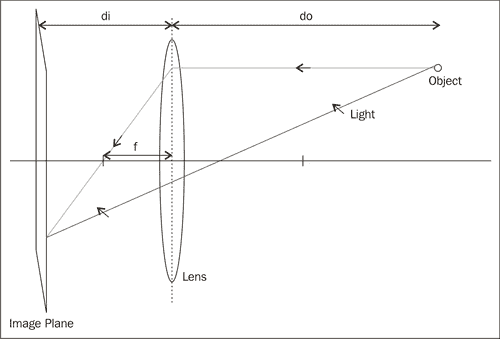

这里，`do`是从镜头到被观察物体的距离，`di`是从镜头到像平面的距离，`f`是**镜头的焦距**。 这些数量与所谓的**薄透镜公式**相关：


在计算机视觉中，可以通过多种方式简化此相机模型。 首先，我们可以通过考虑具有无限小光圈的相机来忽略镜头的影响，因为从理论上讲，这不会改变图像。 因此，仅考虑中央射线。 其次，由于大多数时候我们都有`do >> di`，所以我们可以假设图像平面位于焦距处。 最后，我们可以从系统的几何形状中注意到，平面上的图像是反转的。 通过简单地将像平面放置在镜头前，我们可以获得相同但直立的图像。 显然，这在物理上是不可行的，但是从数学角度来看，这是完全等效的。 这种简化的模型通常称为**针孔照相机**模型，其表示如下：

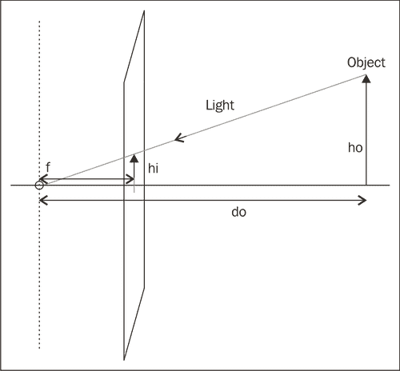

从该模型，并使用相似三角形的定律，我们可以轻松得出基本的投影方程：


因此，物体（高度为`ho`）的图像大小（`hi`）与其与相机的距离（`do`）成反比，而距离自然是 真的。 该关系允许将 3D 场景点的图像的位置预测到相机的图像平面上。

# 校准相机

从本章的介绍中，我们了解到，在针孔模型下，相机的基本参数是其焦距和像平面的大小（定义相机的视场）。 同样，由于我们正在处理数字图像，因此图像平面上的像素数量是相机的另一个重要特征。 最后，为了能够在像素坐标中计算图像的场景点的位置，我们需要另外一条信息。 考虑到来自与图像平面正交的焦点的线，我们需要知道该线在哪个像素位置刺穿图像平面。 该点称为**主要点**。 逻辑上假设该主点位于图像平面的中心可能是合乎逻辑的，但实际上，这一点可能相差几个像素，具体取决于相机的制造精度。

相机校准 是获取不同相机参数的过程。 显然可以使用相机制造商提供的规格，但是对于某些任务（例如 3D 重建），这些规格不够准确。 相机校准将通过向相机显示已知图案并分析获得的图像来进行。 然后，优化过程将确定解释观测结果的最佳参数值。 这是一个复杂的过程，但是由于 OpenCV 校准功能的可用性而变得容易。

## 怎么做...

为了校准摄像机，这个想法是向该摄像机显示一组场景点，这些场景点的 3D 位置已知。 然后，您必须确定这些点在图像上的投影位置。 显然，为了获得准确的结果，我们需要观察以下几点。 实现此目的的一种方法是拍摄具有许多已知 3D 点的场景图片。 一种更方便的方法是从一组某些 3D 点的不同视点拍摄几张图像。 这种方法比较简单，但除了计算内部摄像机参数外，还需要计算每个摄像机视图的位置，这是可行的。

OpenCV 建议使用棋盘图案来生成校准所需的 3D 场景点集。 该图案在每个正方形的角上创建点，并且由于该图案是平坦的，因此我们可以自由地假定板位于 Z = 0，并且 X 和 Y 轴与网格对齐。 在这种情况下，校准过程仅包括从不同角度向摄像机显示棋盘图案。 这是校准图案图像的一个示例：


令人高兴的是，OpenCV 具有自动检测此棋盘图案角的功能。 您只需提供图像和所用棋盘的大小（垂直和水平内角点的数量）即可。 该函数将返回这些棋盘角在图像上的位置。 如果函数无法找到模式，则仅返回 false：

```cpp
    // output vectors of image points
    std::vector<cv::Point2f> imageCorners;
    // number of corners on the chessboard
    cv::Size boardSize(6,4);
    // Get the chessboard corners
    bool found = cv::findChessboardCorners(image, 
                                 boardSize, imageCorners);
```

请注意，如果需要调整算法，则此函数接受其他参数，此处不再讨论。 还有一个功能可以用棋盘上的线依次画出检测到的角：

```cpp
        //Draw the corners
        cv::drawChessboardCorners(image, 
                    boardSize, imageCorners, 
                    found); // corners have been found
```

在此处看到获得的图像：

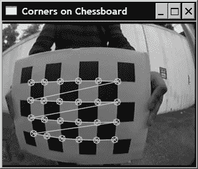

连接这些点的线显示了在检测到的点的向量中列出这些点的顺序。 现在要校准相机，我们需要输入一组此类图像点以及相应 3D 点的坐标。 让我们将校准过程封装在[H​​TG0]类中：

```cpp
class CameraCalibrator {

    // input points:
    // the points in world coordinates
    std::vector<std::vector<cv::Point3f>> objectPoints;
    // the point positions in pixels
    std::vector<std::vector<cv::Point2f>> imagePoints;
    // output Matrices
    cv::Mat cameraMatrix;
    cv::Mat distCoeffs;
   // flag to specify how calibration is done
   int flag;
   // used in image undistortion 
    cv::Mat map1,map2; 
   bool mustInitUndistort;

  public:
   CameraCalibrator() : flag(0), mustInitUndistort(true) {};
```

如前所述，如果我们方便地将参考框架放置在棋盘上，则可以轻松确定棋盘图案上点的 3D 坐标。 完成此操作的方法将棋盘图像文件名的向量作为输入：

```cpp
// Open chessboard images and extract corner points
int CameraCalibrator::addChessboardPoints(
         const std::vector<std::string>& filelist, 
         cv::Size & boardSize) {

   // the points on the chessboard
    std::vector<cv::Point2f> imageCorners;
    std::vector<cv::Point3f> objectCorners;

   // 3D Scene Points:
   // Initialize the chessboard corners 
   // in the chessboard reference frame
   // The corners are at 3D location (X,Y,Z)= (i,j,0)
   for (int i=0; i<boardSize.height; i++) {
      for (int j=0; j<boardSize.width; j++) {

         objectCorners.push_back(cv::Point3f(i, j, 0.0f));
      }
    }

    // 2D Image points:
    cv::Mat image; // to contain chessboard image
    int successes = 0;
    // for all viewpoints
    for (int i=0; i<filelist.size(); i++) {

        // Open the image
        image = cv::imread(filelist[i],0);

        // Get the chessboard corners
        bool found = cv::findChessboardCorners(
                        image, boardSize, imageCorners);

        // Get subpixel accuracy on the corners
        cv::cornerSubPix(image, imageCorners, 
                  cv::Size(5,5), 
                  cv::Size(-1,-1), 
         cv::TermCriteria(cv::TermCriteria::MAX_ITER +
                          cv::TermCriteria::EPS, 
             30,      // max number of iterations 
             0.1));  // min accuracy

        //If we have a good board, add it to our data
        if (imageCorners.size() == boardSize.area()) {

            // Add image and scene points from one view
            addPoints(imageCorners, objectCorners);
            successes++;
        }

    }

   return successes;
}
```

第一个循环输入棋盘的 3D 坐标，此处以任意正方形尺寸单位指定。 相应的图像点是`cv::findChessboardCorners`函数提供的图像点。 这适用于所有可用的视点。 此外，为了获得更准确的图像点位置，可以使用函数 `cv::cornerSubPix`，顾名思义，这些图像点将以亚像素精度定位。 由`cv::TermCriteria` 对象指定的终止标准定义了最大迭代次数和子像素坐标中的最小精度。 达到这两个条件中的第一个条件将停止角点优化过程。

成功检测到一组棋盘角后，会将这些点添加到图像和场景点的矢量中：

```cpp
// Add scene points and corresponding image points
void CameraCalibrator::addPoints(const std::vector<cv::Point2f>& imageCorners, const std::vector<cv::Point3f>& objectCorners) {

   // 2D image points from one view
   imagePoints.push_back(imageCorners);          
   // corresponding 3D scene points
   objectPoints.push_back(objectCorners);
}
```

向量包含`std::vector`实例。 实际上，每个向量元素都是一个视图中点的向量。

一旦处理了足够数量的棋盘图像（因此有大量 3D 场景点/ 2D 图像点对应关系可用），我们就可以开始计算校准参数：

```cpp
// Calibrate the camera
// returns the re-projection error
double CameraCalibrator::calibrate(cv::Size &imageSize)
{
   // undistorter must be reinitialized
   mustInitUndistort= true;

   //Output rotations and translations
    std::vector<cv::Mat> rvecs, tvecs;

   // start calibration
   return 
     calibrateCamera(objectPoints, // the 3D points
               imagePoints,  // the image points
               imageSize,    // image size
               cameraMatrix, // output camera matrix
               distCoeffs,   // output distortion matrix
               rvecs, tvecs, // Rs, Ts 
               flag);        // set options
}
```

实际上，十至二十个棋盘图像就足够了，但是这些图像必须是从不同角度，不同深度拍摄的。 此功能的两个重要输出是相机矩阵和失真参数。 相机矩阵将在下一节中介绍。 现在，让我们考虑一下失真参数。 到目前为止，我们已经提到了使用针孔相机模型可以忽略镜头的影响。 但这只有在用于捕获图像的镜头不会引入太严重的光学畸变的情况下才有可能。 不幸的是，低质量的镜头或焦距非常短的镜头经常出现这种情况。 您可能已经注意到，在我们用于示例的图像中，所示的棋盘图案明显失真。 矩形板的边缘在图像中弯曲。 还应注意，随着我们远离图像中心，这种失真变得更加重要。 这是使用鱼眼镜头观察到的典型失真，称为**径向失真**。 普通数码相机中使用的镜头不会表现出如此高的畸变程度，但是在此处使用的镜头中，这些畸变肯定不能忽略。

通过引入适当的模型可以补偿这些变形。 这个想法是用一组数学方程来表示由透镜引起的畸变。 一旦建立，这些方程式然后可以被还原以便消除图像上可见的失真。 幸运的是，可以在校准阶段与其他相机参数一起获得将校正失真的变换的确切参数。 完成此操作后，来自新校准相机的任何图像都可以保持不失真：

```cpp
// remove distortion in an image (after calibration)
cv::Mat CameraCalibrator::remap(const cv::Mat &image) {

   cv::Mat undistorted;

   if (mustInitUndistort) { // called once per calibration

    cv::initUndistortRectifyMap(
      cameraMatrix,  // computed camera matrix
      distCoeffs,    // computed distortion matrix
      cv::Mat(),     // optional rectification (none) 
      cv::Mat(),     // camera matrix to generate undistorted
            image.size(),  // size of undistorted
            CV_32FC1,      // type of output map
            map1, map2);   // the x and y mapping functions

    mustInitUndistort= false;
   }

   // Apply mapping functions
   cv::remap(image, undistorted, map1, map2, 
      cv::INTER_LINEAR); // interpolation type

   return undistorted;
}
```

结果如下图：

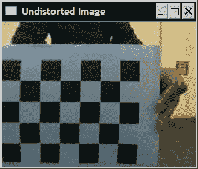

如您所见，一旦图像变形，我们将获得一个常规的透视图。

## 工作原理...

为了解释校准结果，我们需要回到介绍针孔相机模型的简介中的图。 更具体地说，我们想证明位置（X，Y，Z）的 3D 中的点与其在像素坐标中指定的摄像机上的图像（x，y）之间的关系。 让我们通过添加一个参考帧重绘此图，该参考帧位于投影的中心，如下所示：

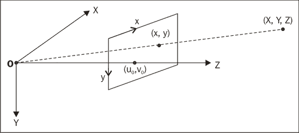

请注意，Y 轴指向下方，以获取与将图像原点放在左上角的常规约定兼容的坐标系。 先前我们了解到，点（X，Y，Z）将以`(fX / Z, fY / Z)`投影到图像平面上。 现在，如果要将此坐标转换为像素，则需要将 2D 图像位置分别除以像素宽度（px）和高度（py）。 我们注意到，通过将以世界单位给出的焦距 f（通常是米或毫米）除以 px，可以得到以（水平）像素表示的焦距。 然后让我们将此术语定义为 fx。 类似地，将`fy = f / py`定义为以垂直像素为单位表示的焦距。 因此，完整的投影方程为：


回想一下（u0，v0）是添加到结果中的主要点，以便将原点移动到图像的左上角。 通过引入**齐次坐标**，这些方程可以矩阵形式重写，其中 2D 点由 3 个向量表示，而 3D 点由 4 个向量表示（额外坐标只是任意 需要从齐次 3 向量中提取 2D 坐标时需要删除的比例因子）。 这是重写的射影方程式：


第二矩阵是简单投影矩阵。 第一矩阵包括所有摄像机参数，这些参数称为摄像机的**固有参数**。 此 3x3 矩阵是`cv::calibrateCamera`函数返回的输出矩阵之一。 还有一个称为`cv::calibrationMatrixValues` 的函数，可在给定校准矩阵的情况下返回固有参数的值。

更一般而言，当参考系不在相机的投影中心时，我们将需要添加旋转（`3x3`矩阵）和平移矢量（`3x1`矩阵）。 这两个矩阵描述了必须应用于 3D 点的刚性变换，以便将其带回到相机参考系。 因此，我们可以用最一般的形式重写投影方程：


请记住，在我们的校准示例中，参考框架位于棋盘上。 因此，必须为每个视图计算一个刚性变换（旋转和平移）。 这些在`cv::calibrateCamera`功能的输出参数列表中。 旋转和平移分量通常称为校准的**外在参数**，每个视图的旋转和平移分量都不同。 对于给定的相机/镜头系统，固有参数保持恒定。 通过基于 20 个棋盘图像的校准获得的测试相机的固有参数为 fx = 167，fy = 178，u0 = 156，v0 = 119。 这些结果是通过`cv::calibrateCamera`通过优化过程而获得的，该优化过程旨在找到使 3D 场景点的投影所计算出的预测图像点位置与实际图像点位置之间的差异最小的内在和外在参数， 如图所示。 校准期间指定的所有点的该差的总和称为**重投影误差**。

为了纠正失真，OpenCV 使用多项式函数，将其应用于图像点，以将其移动到其未失真的位置。 默认情况下，使用 5 个系数。 也可以提供由 8 个系数组成的模型。 一旦获得了这些系数，就可以计算 2 个映射函数（一个`x`坐标，一个`y`坐标），这些映射函数将给出图像点在上的新的未失真位置。 图像失真。 这是通过函数`cv::initUndistortRectifyMap` 计算的，函数`cv::remap` 将输入图像的所有点重新映射到新图像。 注意，由于非线性变换，输入图像的某些像素现在落在输出图像的边界之外。 您可以扩大输出图像的大小以补偿这种像素损失，但是现在您将获得在输入​​图像中没有值的输出像素（然后它们将显示为黑色像素）。

## 还有更多...

当知道相机固有参数的良好估计时，将其输入到 `cv::calibrateCamera`功能可能会比较有利。 然后将它们用作优化过程中的初始值。 为此，您只需要添加标志`CV_CALIB_USE_INTRINSIC_GUESS` 并将这些值输入到校准矩阵参数中即可。 还可以为主要点（`CV_CALIB_FIX_PRINCIPAL_POINT`）施加固定值，该值通常被假定为中心像素。 您还可以为焦距 fx 和 fy（`CV_CALIB_FIX_RATIO`）设置固定比例，在这种情况下，您假设像素为正方形。

# 计算图像对的基本矩阵

先前的食谱向您展示了如何恢复单个摄像机的投影方程。 在本食谱中，我们将探讨在观看同一场景的两幅图像之间存在的投影关系。 这两个图像可以通过以下方式获得：在两个不同的位置移动相机以从两个视点拍摄照片，或者使用两个相机，每个相机拍摄不同的场景图像。 当这两个摄像机由刚性基准线分开时，我们使用术语**立体视觉**。

## 准备

现在让我们考虑两台摄像机观察给定的场景点，如下所示：

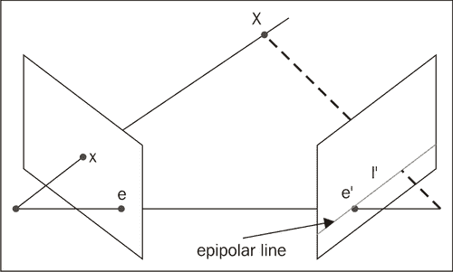

我们了解到，通过跟踪将 3D 点 X 与相机中心连接的线，可以找到 3D 点 X 的图像`x`。 相反，我们在位置 x 处观察到的图像点可以位于 3D 空间中此线上的任何位置。 这意味着如果我们要在另一幅图像中找到给定图像点的对应点，则需要沿着这条线在第二个图像平面上的投影进行搜索。 该假想线称为点 x 的**对极线**。 它定义了一个基本约束，必须满足两个相应的点，即，在另一个视图中，给定点的匹配必须位于该点的对极线上。 该极线的确切方向取决于两个摄像机的位置。 实际上，对极线的位置是两视图系统的几何特征。

可以从此两视图系统的几何结构得出的另一个观察结果是，所有对极线都通过同一点。 该点对应于一个摄像机中心在另一摄像机上的投影。 这个特殊点称为**极点**。

从数学上可以看出，可以使用`3x3`矩阵来表示像点与其对应的对极线之间的关系，如下所示：


在射影几何中，一条 2D 线也由一个 3 向量表示。 它对应于满足等式 l1'x'+ l2'y'+ l3'= 0 的 2D 点集合（`x', y'`）（质上标表示这条线属于第二条线 图像）。 因此，称为**基本矩阵**的矩阵`F`将一个视图中的 2D 图像点映射到另一视图中的对极线。

## 怎么做...

可以通过求解一组方程来估计图像对的基本矩阵，该方程组涉及两个图像之间的一定数量的已知匹配点。 此类匹配的最小数量为 7。 使用上一章中的图像对，我们可以手动选择七个良好的匹配项（如以下屏幕截图所示）。 这些将通过 `cv::findFundementalMat` OpenCV 函数用于计算基本矩阵。

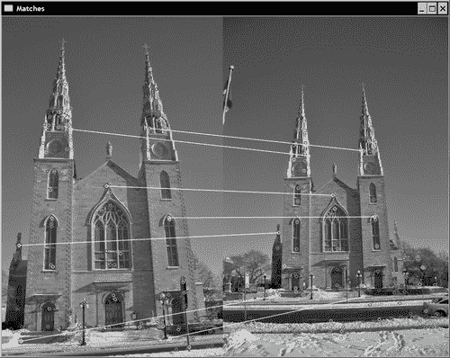

如果我们在每个图像中都有图像点作为`cv::keypoint`实例，则首先需要将它们转换为`cv::Point2f`才能与`cv::findFundementalMat` 一起使用。 为此，可以使用 OpenCV 函数：

```cpp
   // Convert keypoints into Point2f
   std::vector<cv::Point2f> selPoints1, selPoints2;
   cv::KeyPoint::convert(keypoints1,selPoints1,pointIndexes1);
   cv::KeyPoint::convert(keypoints2,selPoints2,pointIndexes2);
```

两个向量`selPoints1`和`selPoints2`包含两个图像中的对应点。 `keypoints1`和`keypoints2`是在上一章中检测到的选定`Keypoint`实例。 然后，对`cv::findFundementalMat`函数的调用如下：

```cpp
   // Compute F matrix from 7 matches
   cv::Mat fundemental= cv::findFundamentalMat(
      cv::Mat(selPoints1), // points in first image
      cv::Mat(selPoints2), // points in second image
      CV_FM_7POINT);       // 7-point method
```

视觉上验证基本矩阵有效性的一种方法是绘制某些选定点的对极线。 另一个 OpenCV 函数允许计算给定点集的对极线。 一旦计算出它们，就可以使用`cv::line`函数绘制它们。 以下代码行完成了这两个步骤（即，从左侧的点计算并绘制右侧图像中的对极线）：

```cpp
   // draw the left points corresponding epipolar 
   // lines in right image 
   std::vector<cv::Vec3f> lines1; 
   cv::computeCorrespondEpilines(
      cv::Mat(selPoints1), // image points 
      1,                   // in image 1 (can also be 2)
      fundemental, // F matrix
      lines1);     // vector of epipolar lines

   // for all epipolar lines
   for (vector<cv::Vec3f>::const_iterator it= lines1.begin();
       it!=lines1.end(); ++it) {

          // draw the line between first and last column
          cv::line(image2,
            cv::Point(0,-(*it)[2]/(*it)[1]),
            cv::Point(image2.cols,-((*it)[2]+
                      (*it)[0]*image2.cols)/(*it)[1]),
                      cv::Scalar(255,255,255));
   }
```

然后在以下屏幕截图中看到结果：

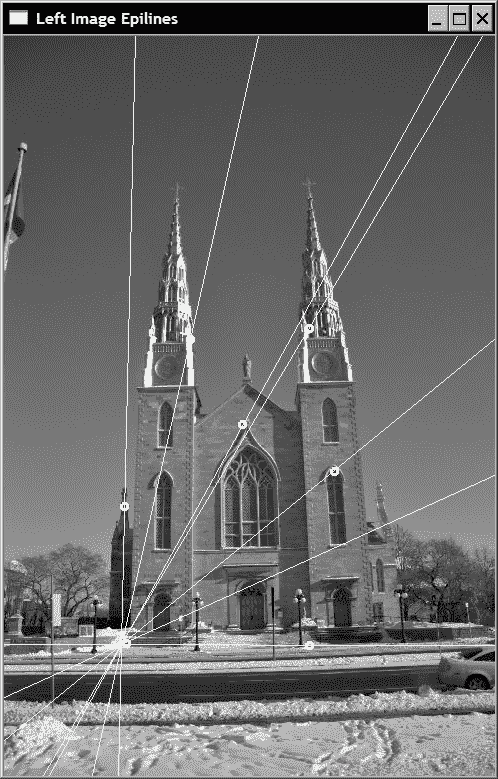

请记住，子极位于所有子极线的交点，并且是另一个相机中心的投影。 在前面的图像上可以看到该极点。 通常，极线在图像边界之外相交。 如果同时拍摄了两个图像，则该位置将是第一个摄像机可见的位置。 观察图像对，并花点时间说服自己这确实是有道理的。

## 工作原理...

前面我们已经解释了，对于一个图像中的一个点，基本矩阵给出了在另一视图中应找到其对应点的直线方程。 如果点 p 的对应点（用均匀坐标表示）是 p'，并且如果`F`是两个视图之间的基本矩阵，那么由于 p'位于对极线 Fp 上，我们具有：


该方程式表示两个对应点之间的关系，被称为**对极约束**。 使用该方程式，可以使用已知匹配来估计矩阵的项。 由于`F`矩阵的条目被赋予比例因子，因此仅需要估计八个条目（第九个可以任意设置为 1）。 每次比赛都会贡献一个方程式。 因此，通过八个已知匹配，可以通过求解线性方程组的结果来完全估计矩阵。 将`CV_FM_8POINT`标志与`cv::findFundamentalMat`功能结合使用时，便会执行此操作。 注意，在这种情况下，可以（最好）输入八个以上的匹配项。 然后可以在均方意义上求解获得的线性方程组的超定系统。

为了估计基本矩阵，还可以利用附加约束。 在数学上，`F`矩阵将 2D 点映射到 1D 直线铅笔（即，在公共点处相交的线）。 所有这些对极线都经过此唯一点（极点）的事实对矩阵施加了约束。 该约束将估计基本矩阵所需的匹配数减少到七个。 不幸的是，在这种情况下，方程组变为非线性，最多包含三个可能的解。 可以使用`CV_FM_7POINT`标志在 OpenCV 中调用 F 矩阵估计的七匹配解决方案。 这就是我们在上一节的示例中所做的。

最后，我们应该提到，在图像中选择合适的匹配集对于获得基本矩阵的准确估计很重要。 通常，匹配项应在整个图像上很好地分布，并包括场景中不同深度的点。 否则，解决方案将变得不稳定或导致简并的配置 。

## 另请参见

```cpp
The book by R. Hartley and A. Zisserman, Multiple View Geometry in Computer Vision, Cambridge University Press, 2004 is the most complete reference on projective geometry in computer vision.
```

下一个配方将显示可与 OpenCV 基本矩阵估计一起使用的附加标志。

# 使用随机样本共识匹配图像

当两台摄像机观察同一场景时，它们会看到相同的元素，但视点不同。 我们已经在上一章中研究了特征点匹配问题。 在本食谱中，我们将回到这个问题，并将学习如何利用两个视图之间的对极约束来更可靠地匹配图像特征。

我们遵循的原理很简单：当我们在两个图像之间匹配特征点时，我们仅接受落在相应对极线上的那些匹配。 但是，为了能够检查这种情况，必须知道基本矩阵，并且我们需要良好的匹配才能估算此矩阵。 这似乎是鸡与蛋的问题。 我们在本配方中提出一种解决方案，其中将共同计算基本矩阵和一组良好的匹配项。

## 怎么做...

目的是能够获得两个视图之间的一组良好匹配。 因此，将使用先前配方中引入的对极约束来验证所有找到的特征点对应关系。 我们首先定义一个类，该类将封装将提出的解决方案的不同元素：

```cpp
class RobustMatcher {

  private:

     // pointer to the feature point detector object
     cv::Ptr<cv::FeatureDetector> detector;
     // pointer to the feature descriptor extractor object
     cv::Ptr<cv::DescriptorExtractor> extractor;
     float ratio; // max ratio between 1st and 2nd NN
     bool refineF; // if true will refine the F matrix
     double distance; // min distance to epipolar
     double confidence; // confidence level (probability)

  public:

     RobustMatcher() : ratio(0.65f), refineF(true),
                       confidence(0.99), distance(3.0) {     

        // SURF is the default feature
        detector= new cv::SurfFeatureDetector();
        extractor= new cv::SurfDescriptorExtractor();
     }
```

注意我们如何使用通用的 `cv::FeatureDetector`和`cv::DescriptorExtractor` 接口，以便用户可以提供任何特定的实现。 默认情况下，此处使用`SURF`功能和描述符，但可以使用适当的 setter 方法指定其他功能：

```cpp
     // Set the feature detector
     void setFeatureDetector(
            cv::Ptr<cv::FeatureDetector>& detect) {

        detector= detect;
     }

     // Set the descriptor extractor
     void setDescriptorExtractor(
            cv::Ptr<cv::DescriptorExtractor>& desc) {

        extractor= desc;
     }
```

主要方法是我们的​​`match`方法，该方法返回匹配项，检测到的关键点和估计的基本矩阵。 现在，我们将探索该方法分五个不同的步骤（在以下代码的注释中明确指出）：

```cpp
     // Match feature points using symmetry test and RANSAC
     // returns fundemental matrix
     cv::Mat match(cv::Mat& image1, 
                   cv::Mat& image2, // input images
        // output matches and keypoints 
        std::vector<cv::DMatch>& matches, 
        std::vector<cv::KeyPoint>& keypoints1,   
        std::vector<cv::KeyPoint>& keypoints2) {

      // 1a. Detection of the SURF features
      detector->detect(image1,keypoints1);
      detector->detect(image2,keypoints2);

      // 1b. Extraction of the SURF descriptors
      cv::Mat descriptors1, descriptors2;
      extractor->compute(image1,keypoints1,descriptors1);
      extractor->compute(image2,keypoints2,descriptors2);

      // 2\. Match the two image descriptors

      // Construction of the matcher 
      cv::BruteForceMatcher<cv::L2<float>> matcher;

      // from image 1 to image 2
      // based on k nearest neighbours (with k=2)
      std::vector<std::vector<cv::DMatch>> matches1;
      matcher.knnMatch(descriptors1,descriptors2, 
         matches1, // vector of matches (up to 2 per entry) 
         2);        // return 2 nearest neighbours

      // from image 2 to image 1
      // based on k nearest neighbours (with k=2)
      std::vector<std::vector<cv::DMatch>> matches2;
      matcher.knnMatch(descriptors2,descriptors1, 
         matches2, // vector of matches (up to 2 per entry) 
         2);        // return 2 nearest neighbours

      // 3\. Remove matches for which NN ratio is 
      // > than threshold

      // clean image 1 -> image 2 matches
      int removed= ratioTest(matches1);
      // clean image 2 -> image 1 matches
      removed= ratioTest(matches2);

      // 4\. Remove non-symmetrical matches
       std::vector<cv::DMatch> symMatches;
      symmetryTest(matches1,matches2,symMatches);

      // 5\. Validate matches using RANSAC
      cv::Mat fundemental= ransacTest(symMatches, 
                  keypoints1, keypoints2, matches);

      // return the found fundemental matrix
      return fundemental;
   }
```

第一步只是检测特征点并计算其描述符。 接下来，我们像上一章一样使用`cv::BruteForceMatcher`类进行特征匹配。 但是，这一次，我们为每个功能找到了两个最佳匹配点（而不仅仅是我们在前面的食谱中所做的最佳匹配点）。 这是通过`cv::BruteForceMatcher::knnMatch`方法（k = 2）完成的。 此外，我们在两个方向上执行此匹配，即，对于第一张图像中的每个点，我们在第二张图像中找到两个最佳匹配，然后对第二张图像的特征点执行相同的操作，找到它们的两个 与第一张图片最匹配。

因此，对于每个特征点，我们在另一个视图中都有两个候选匹配。 根据描述符之间的距离，这是最好的两个。 如果此测量距离对于最佳匹配而言非常低，而对于第二最佳匹配而言则更大，则我们可以放心地将第一匹配视为好匹配，因为它无疑是最佳选择。 相反，如果两个最佳匹配的距离相对较近，则选择一个或另一个可能会出错。 在这种情况下，我们应该拒绝两个匹配项。 在这里，我们通过验证最佳匹配的距离与第二最佳匹配的距离之比不大于给定阈值来执行此测试：

```cpp
     // Clear matches for which NN ratio is > than threshold
     // return the number of removed points 
     // (corresponding entries being cleared, 
     // i.e. size will be 0)
     int ratioTest(std::vector<std::vector<cv::DMatch>>
                                                &matches) {

      int removed=0;

        // for all matches
      for (std::vector<std::vector<cv::DMatch>>::iterator 
              matchIterator= matches.begin();
           matchIterator!= matches.end(); ++matchIterator) {

             // if 2 NN has been identified
             if (matchIterator->size() > 1) {

                // check distance ratio
                if ((*matchIterator)[0].distance/
                    (*matchIterator)[1].distance > ratio) {

                   matchIterator->clear(); // remove match
                   removed++;
                }

             } else { // does not have 2 neighbours

                matchIterator->clear(); // remove match
                removed++;
             }
      }

      return removed;
     }
```

从以下示例可以看出，此过程将消除大量不明确的匹配项。 在这里，以`SURF`阈值 `(=10)`为低阈值，我们最初检测到 1,600 个特征点（黑色圆圈），其中只有 55 个在比例测试（白色圆圈）中幸存下来：


链接匹配点的白线表明，即使我们有大量好的匹配项，也仍然存在大量错误的匹配项。 因此，将执行第二次测试以过滤我们更多的错误匹配。 请注意，比率测试也适用于第二个匹配集。

现在，我们有两个相对较好的匹配集，一个从第一张图片到第二张图片，另一个从第二张图片到第一张图片。 现在，从这些集合中提取与这两个集合一致的匹配项。 这是**对称匹配方案**提出，要接受一个匹配对，两个点必须是另一个的最佳匹配特征：

```cpp
     // Insert symmetrical matches in symMatches vector
     void symmetryTest(
        const std::vector<std::vector<cv::DMatch>>& matches1,
        const std::vector<std::vector<cv::DMatch>>& matches2,
        std::vector<cv::DMatch>& symMatches) {

      // for all matches image 1 -> image 2
      for (std::vector<std::vector<cv::DMatch>>::
              const_iterator matchIterator1= matches1.begin();
          matchIterator1!= matches1.end(); ++matchIterator1) {

         // ignore deleted matches
         if (matchIterator1->size() < 2) 
            continue;

         // for all matches image 2 -> image 1
         for (std::vector<std::vector<cv::DMatch>>::
           const_iterator matchIterator2= matches2.begin();
            matchIterator2!= matches2.end(); 
            ++matchIterator2) {

            // ignore deleted matches
            if (matchIterator2->size() < 2) 
               continue;

            // Match symmetry test
            if ((*matchIterator1)[0].queryIdx == 
                (*matchIterator2)[0].trainIdx  && 
                (*matchIterator2)[0].queryIdx == 
                (*matchIterator1)[0].trainIdx) {

                // add symmetrical match
                  symMatches.push_back(
                    cv::DMatch((*matchIterator1)[0].queryIdx,        
                              (*matchIterator1)[0].trainIdx,
                              (*matchIterator1)[0].distance));
                  break; // next match in image 1 -> image 2
            }
         }
      }
     }
```

在我们的测试对中，有 31 个匹配项在此对称测试中幸存下来。 现在，最后一个测试包括一个附加的过滤测试，这次将使用基本矩阵以拒绝不遵循对极约束的匹配项。 此测试基于`RANSAC`方法，即使在匹配集中仍然存在异常值，该方法也可以计算基本矩阵（此方法将在以下部分中进行说明）：

```cpp
     // Identify good matches using RANSAC
     // Return fundemental matrix
     cv::Mat ransacTest(
         const std::vector<cv::DMatch>& matches,
         const std::vector<cv::KeyPoint>& keypoints1, 
         const std::vector<cv::KeyPoint>& keypoints2,
         std::vector<cv::DMatch>& outMatches) {

      // Convert keypoints into Point2f   
      std::vector<cv::Point2f> points1, points2;   
      for (std::vector<cv::DMatch>::
            const_iterator it= matches.begin();
          it!= matches.end(); ++it) {

          // Get the position of left keypoints
          float x= keypoints1[it->queryIdx].pt.x;
          float y= keypoints1[it->queryIdx].pt.y;
          points1.push_back(cv::Point2f(x,y));
          // Get the position of right keypoints
          x= keypoints2[it->trainIdx].pt.x;
          y= keypoints2[it->trainIdx].pt.y;
          points2.push_back(cv::Point2f(x,y));
       }

      // Compute F matrix using RANSAC
      std::vector<uchar> inliers(points1.size(),0);
      cv::Mat fundemental= cv::findFundamentalMat(
         cv::Mat(points1),cv::Mat(points2), // matching points
          inliers,      // match status (inlier or outlier)  
          CV_FM_RANSAC, // RANSAC method
          distance,     // distance to epipolar line
          confidence);  // confidence probability

      // extract the surviving (inliers) matches
      std::vector<uchar>::const_iterator 
                        itIn= inliers.begin();
      std::vector<cv::DMatch>::const_iterator 
                        itM= matches.begin();
      // for all matches
      for ( ;itIn!= inliers.end(); ++itIn, ++itM) {

         if (*itIn) { // it is a valid match

            outMatches.push_back(*itM);
         }
      }

      if (refineF) {
      // The F matrix will be recomputed with 
      // all accepted matches

         // Convert keypoints into Point2f 
         // for final F computation   
         points1.clear();
         points2.clear();

         for (std::vector<cv::DMatch>::
                const_iterator it= outMatches.begin();
             it!= outMatches.end(); ++it) {

             // Get the position of left keypoints

             float x= keypoints1[it->queryIdx].pt.x;
             float y= keypoints1[it->queryIdx].pt.y;
             points1.push_back(cv::Point2f(x,y));
             // Get the position of right keypoints
             x= keypoints2[it->trainIdx].pt.x;
             y= keypoints2[it->trainIdx].pt.y;
             points2.push_back(cv::Point2f(x,y));
         }

         // Compute 8-point F from all accepted matches
         fundemental= cv::findFundamentalMat(
            cv::Mat(points1),cv::Mat(points2), // matches
            CV_FM_8POINT); // 8-point method
      }

      return fundemental;
     }
```

该代码有点长，因为在 F 矩阵计算之前需要将关键点转换为`cv::Point2f`。

通过以下调用来启动使用我们的`RobustMatcher`类别的完整匹配过程：

```cpp
   // Prepare the matcher
   RobustMatcher rmatcher;
   rmatcher.setConfidenceLevel(0.98);
   rmatcher.setMinDistanceToEpipolar(1.0);
   rmatcher.setRatio(0.65f);
   cv::Ptr<cv::FeatureDetector> pfd= 
          new cv::SurfFeatureDetector(10); 
   rmatcher.setFeatureDetector(pfd);

   // Match the two images
   std::vector<cv::DMatch> matches;
   std::vector<cv::KeyPoint> keypoints1, keypoints2;
   cv::Mat fundemental= rmatcher.match(image1,image2,
                         matches, keypoints1, keypoints2);
```

结果是 23 个匹配项，其对应的对极线显示在以下屏幕截图中：


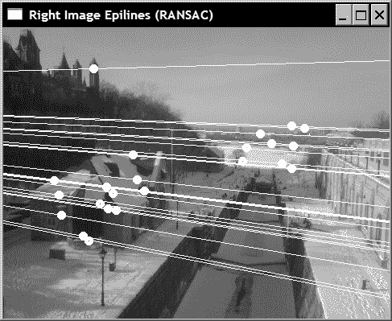

## 工作原理...

在前面的食谱中，我们了解到可以从多个特征点匹配中估计与图像对关联的基本矩阵。 显然，确切地说，此匹配集必须仅由良好匹配组成。 然而，在实际环境中，不可能保证通过比较检测到的特征点的描述符而获得的匹配集将是完全准确的。 这就是为什么介绍了一种基于 **RANSAC**（**随机采样共识**）策略的基本矩阵估计方法的原因。

RANSAC 算法旨在从可能包含多个异常值的数据集中估计给定的数学实体。 想法是从集合中随机选择一些数据点，然后仅使用这些数据点进行估计。 选择的点数应该是估算数学实体所需的最小点数。 在基本矩阵的情况下，该最小数目为 8 个匹配对（实际上，可以是 7 个匹配，但是 8 点线性算法的计算速度更快）。 一旦从这些随机的 8 个匹配项中估计出了基本矩阵，就将对照该集合中得出的对极约束，测试匹配集中所有其他匹配项。 识别出满足此约束的所有匹配项（即，对应特征与其对极线相距不远的匹配项）。 这些匹配形成计算出的基本矩阵的*支持集*。

RANSAC 算法背后的中心思想是，支持集越大，计算出的矩阵就是正确矩阵的可能性就越高。 显然，如果一个（或多个）随机选择的匹配项是错误的匹配项，则计算出的基本矩阵也将是错误的，并且其支持集会很小。 重复此过程多次，最后，将保留最大支持的矩阵为最可能的矩阵。

因此，我们的目标是几次选择八场随机比赛，以便最终选择八场好的比赛，这应该为我们提供大量支持。 根据整个数据集中错误匹配的次数，选择一组八个正确匹配的概率将有所不同。 但是，我们知道，选择的次数越多，在这些选择中至少有一个好的匹配项的置信度就越高。 更准确地说，如果我们假设匹配集由 n% 个正常值（良好匹配）组成，那么我们选择 8 个良好匹配的概率为 8n。 因此，选择包含至少一个错误匹配的概率为（1-n8）。 如果我们进行 k 个选择，则拥有一个仅包含良好匹配项的随机集的概率为 1-（1-8n）k。 这就是置信概率`c`，我们希望该概率尽可能高，因为我们需要至少一组良好的匹配项才能获得正确的基本矩阵。 因此，在运行 RANSAC 算法时，需要确定为了获得给定置信度而需要进行的选择数 k。

在 Ransacs 中使用 cv :: findFundamentalMat 函数时，会提供两个额外的参数。 第一个是置信度，它确定要进行的迭代次数。 第二个是到一个极点到极线的最大距离。 点与它的极线之间的距离大于指定极对的距离的所有匹配对将被报告为异常值。 因此，该函数还返回`char`值的`std::vector`值，指示相应的匹配已被识别为异常值（0）或异常值（1）。

初始匹配集中的匹配越好，RANSAC 为您提供正确的基本矩阵的可能性就越高。 这就是为什么我们在调用`cv::findFundamentalMat`函数之前对匹配集应用了多个过滤器的原因。 显然，您可以决定跳过本食谱中建议的一个或另一个步骤。 这只是在计算复杂性，最终匹配数以及所需的置信度之间取得平衡的问题，即所获得的匹配集将仅包含精确匹配。

# 计算两个图像之间的单应性

本章的第二个食谱向您展示了如何从一组匹配项中计算图像对的基本矩阵。 存在可以根据匹配对计算的另一个数学实体：单应性。 像基本矩阵一样，单应性是具有特殊属性的`3x3`矩阵，正如我们在本食谱中将看到的，它适用于特定情况下的两视图图像。

## 准备

让我们再次考虑在本章第一个方法中介绍的 3D 点及其在相机上的图像之间的投影关系。 基本上，我们了解到此关系由`3x4`矩阵表示。 现在，如果我们考虑一个场景的两个视图被纯旋转分开的特殊情况，那么可以观察到，外部矩阵的第四列将全部为 0（即平移为空）。 结果，在这种特殊情况下的投影关系变成`3x3`矩阵。 此矩阵称为**单应性**，它表示在特殊情况下（此处为纯旋转），一个视图中某个点的图像与另一视图中同一点的图像有关。 通过线性关系：


在齐次坐标中，该关系保持在此处由标量值 s 表示的比例因子上。 一旦估计了此矩阵，就可以使用该关系将一个视图中的所有点转移到第二个视图中。 注意，由于纯旋转的单应性关系的副作用，在这种情况下基本矩阵变得不确定。

## 怎么做...

假设我们有两个图像，它们被纯旋转分开。 这两个图像可以使用我们的`RobustMatcher`类进行匹配，除了我们跳过 RANSAC 验证步骤（在`match`方法中标识为步骤 5）之外，因为该步骤涉及基本矩阵估计。 相反，我们将应用 RANSAC 步骤，该步骤将包括基于匹配集（显然包含大量异常值）的单应性估计。 这是通过使用`cv::findHomography`函数与`cv::findFundementalMat`函数非常相似来完成的：

```cpp
   // Find the homography between image 1 and image 2
   std::vector<uchar> inliers(points1.size(),0);
   cv::Mat homography= cv::findHomography(
      cv::Mat(points1), // corresponding 
      cv::Mat(points2), // points
      inliers,      // outputted inliers matches 
      CV_RANSAC,   // RANSAC method
      1.);         // max distance to reprojection point
```

回想一下，仅当两个图像被纯旋转分开时，单应性才会存在，以下两个图像就是这种情况：

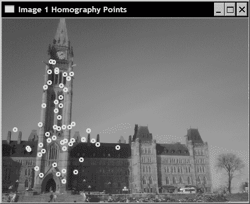

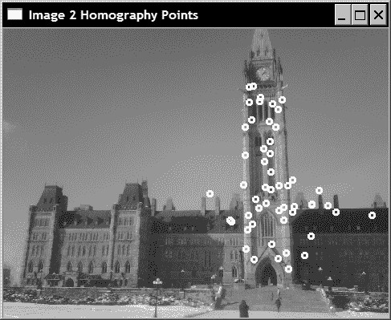

通过以下循环在这些图像上绘制了符合找到的单应性的所得内线：

```cpp
   // Draw the inlier points
   std::vector<cv::Point2f>::const_iterator itPts=  
                                            points1.begin();
   std::vector<uchar>::const_iterator itIn= inliers.begin();
   while (itPts!=points1.end()) {

      // draw a circle at each inlier location
      if (*itIn) 
          cv::circle(image1,*itPts,3,
                    cv::Scalar(255,255,255),2);
      ++itPts;
      ++itIn;
   }

   itPts= points2.begin();
   itIn= inliers.begin();
   while (itPts!=points2.end()) {

      // draw a circle at each inlier location
      if (*itIn) 
         cv::circle(image2,*itPts,3,
                    cv::Scalar(255,255,255),2);
      ++itPts;
      ++itIn;
   }
```

如上一节所述，一旦计算了单应性，就可以将图像点从一个图像转移到另一个图像。 实际上，您可以对图像的所有像素执行此操作，结果将是将该图像转换为另一个视图。 有一个 OpenCV 函数可以完全做到这一点：

```cpp
   // Warp image 1 to image 2
   cv::Mat result;
   cv::warpPerspective(image1, // input image
      result,         // output image
      homography,      // homography
      cv::Size(2*image1.cols,
                 image1.rows)); // size of output image
```

一旦获得了这个新图像，就可以将其附加到另一个图像上以扩展视图（因为两个图像现在是从同一角度来看）：

```cpp
   // Copy image 1 on the first half of full image
   cv::Mat half(result,cv::Rect(0,0,image2.cols,image2.rows));
   image2.copyTo(half); // copy image2 to image1 roi
```

结果如下图：

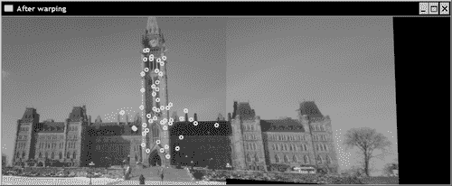

## 工作原理...

当通过单应性图将两个视图关联时，可以确定在一个图像上找到给定场景点的另一图像上的位置。 对于超出图像边界的点，此属性特别有趣。 实际上，由于第二个视图显示的场景的一部分在第一幅图像中不可见，因此可以使用单应性以通过在另一幅图像中读取其他像素的色值来扩展图像。 这就是我们能够创建新图像的方式，该图像是我们第二幅图像的扩展，其中在右侧添加了额外的列。

由`cv::findHomography` 计算的单应性是将第一图像中的点映射到第二图像中的点的单应性。 实际上，为了将图像 1 的点转移到图像 2 所需要的是逆单应性。 这正是函数`cv::warpPerspective` 在默认情况下所做的，也就是说，它使用提供的单应性的倒数作为输入来获取输出图像每个点的颜色值。 当输出像素转移到输入图像外部的点时，黑色值（0）会简单地分配给该像素。 请注意，如果要在像素传输过程中使用直接单应性而不是反向单应性，则可以将可选标志`cv::WARP_INVERSE_MAP` 指定为`cv::warpPerspective`中的可选第五个参数。

## 还有更多...

平面的两个视图之间也存在单应性。 可以像在纯旋转情况下一样，通过再次查看相机投影方程式来证明这一点。 观察平面时，我们可以不失一般性地设置平面的参考框架，以使其所有点的`Z`坐标等于 0。这还将取消其中一列`3x4`投影矩阵的结果，得出`3x3`矩阵：单应性。 这意味着，例如，如果您从建筑物的平面立面的不同角度来看有几张图片，则可以计算这些图像之间的单应性，并通过将图像包裹起来并将它们组装在一起来构建立面的大型马赛克 我们在这个食谱中做了。

计算单应性至少需要两个视图之间的四个匹配点。 函数 `cv::getPerspectiveTransform`允许从四个对应点进行这种转换。