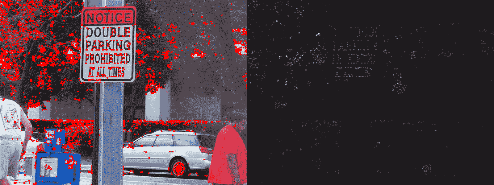
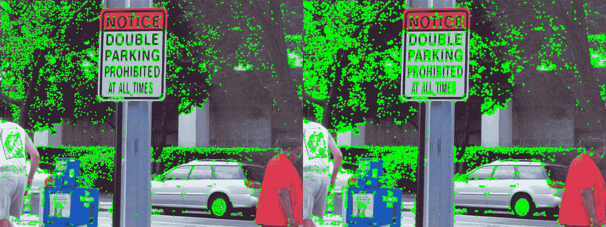
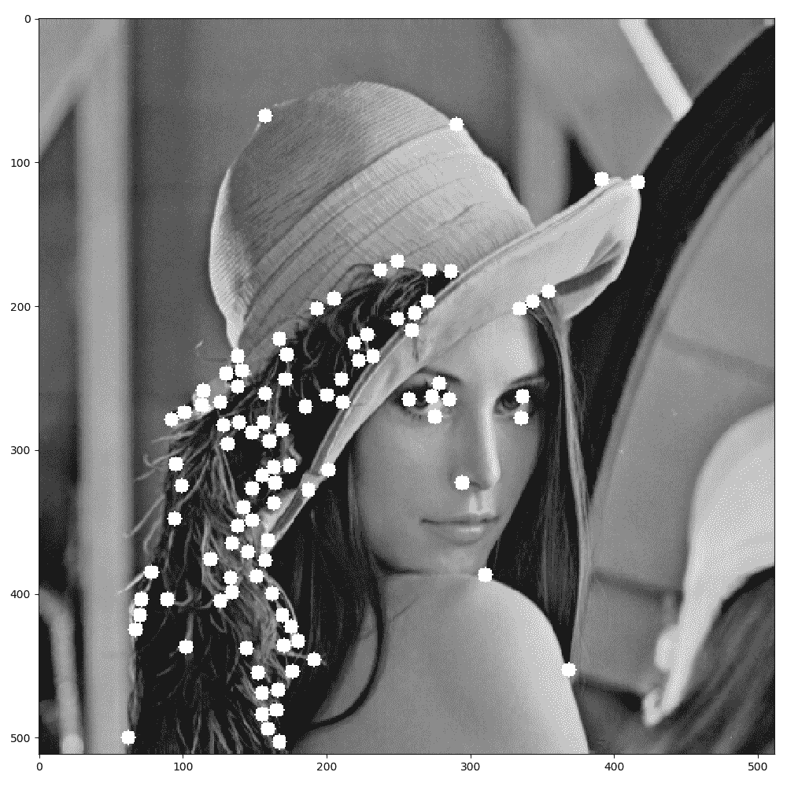
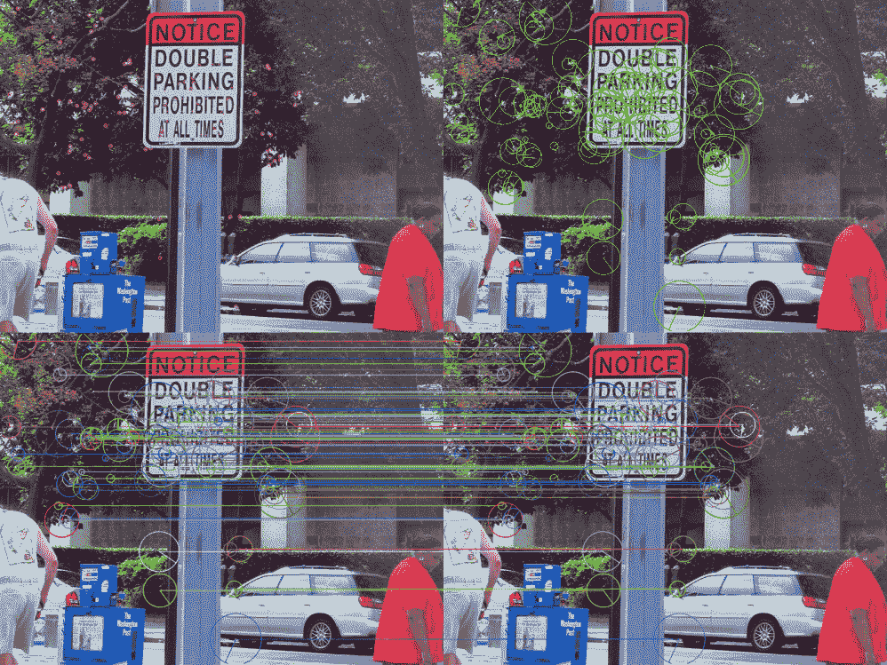
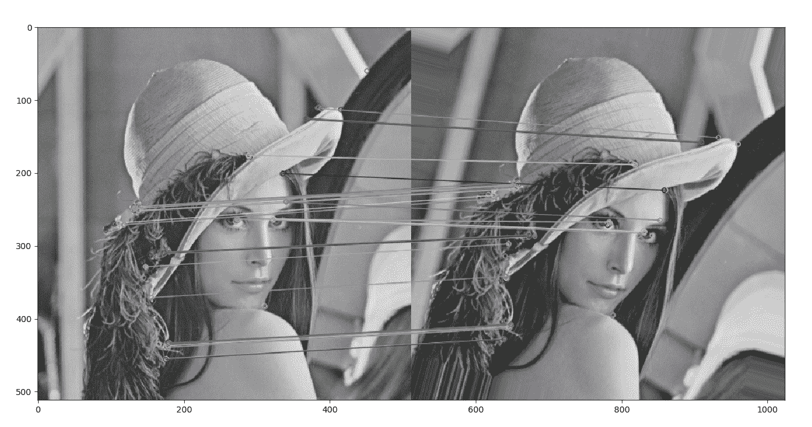
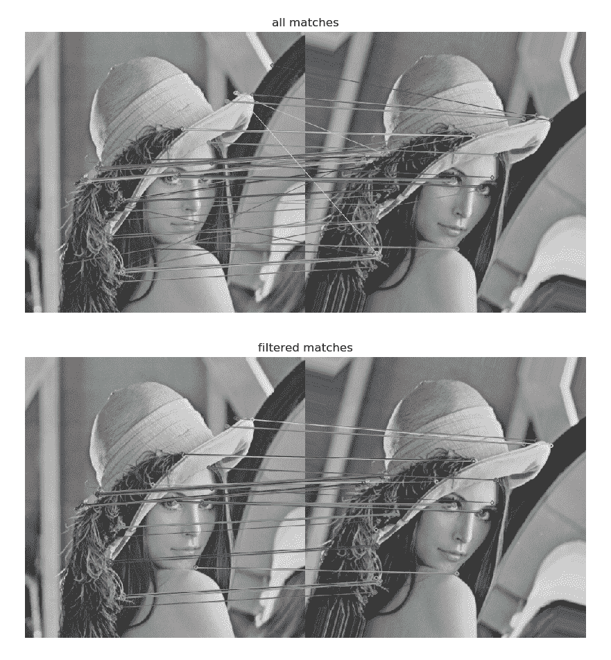
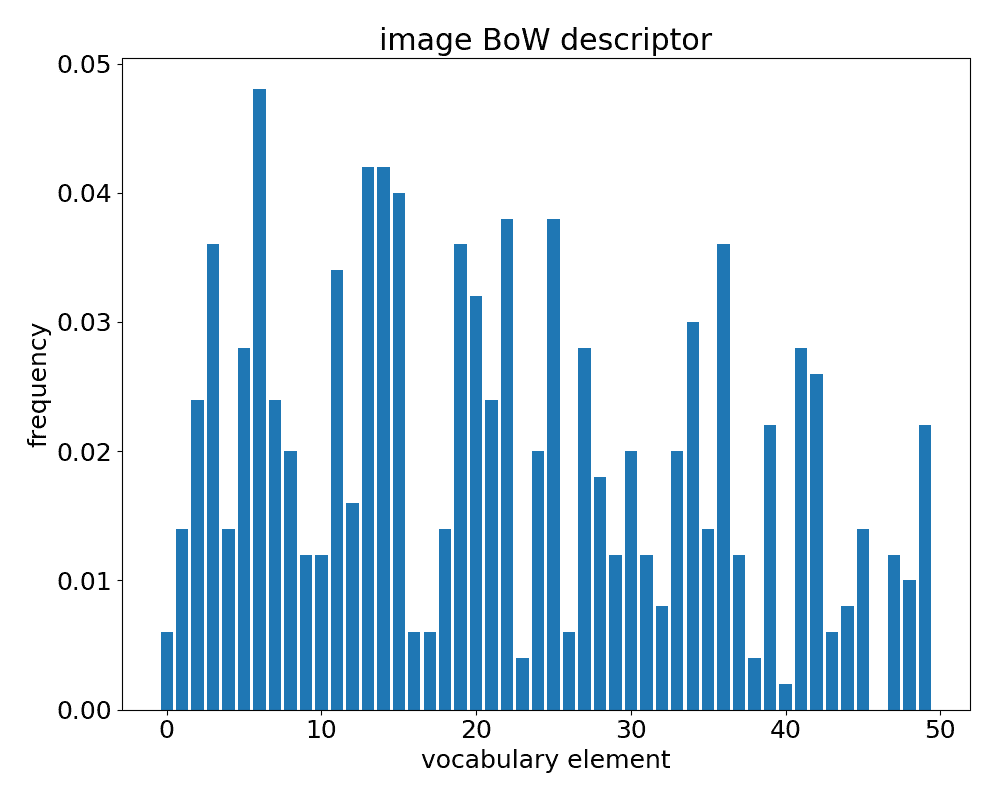

# 检测器和描述符

本章包含以下方面的食谱：

*   在图像中找到角落-Harris 和 FAST
*   选择图像中的好角落进行跟踪
*   绘制关键点，描述符和匹配项
*   检测尺度不变关键点
*   计算图像关键点的描述符-SURF，BRIEF 和 ORB
*   查找描述符之间对应关系的匹配技术
*   寻找可靠的匹配-交叉检查和比率测试
*   基于模型的匹配过滤-RANSAC
*   用于构造全局图像描述符的 BoW 模型

# 介绍

可以根据比较图像中的区域来制定检测和跟踪任务。 如果我们能够在图像中找到特殊点并为这些点建立描述符，则可以比较描述符并得出有关图像中对象相似性的结论。 在 Computer Vision 中，这些特殊点称为关键点，但是围绕此概念出现了一些问题：如何在图像中找到真正的特殊位置？ 您如何计算健壮且唯一的描述符？ 您如何快速准确地比较这些描述符？ 本章将解决所有这些查询，并引导您完成所有步骤，从找到关键点到使用 OpenCV 进行比较。

# 在图像中找到角落-Harris 和 FAST

一个角可以认为是两个边的交集。 图像中拐角的数学定义是不同的，但是反映了相同的想法。 拐角是具有以下属性的点：沿任何方向移动该点都会导致该点的较小邻域发生变化。 例如，如果我们在图像的均匀区域上获取一个点，则移动该点不会改变附近的本地窗口中的任何内容。 边缘上的点不属于平原区域，并且又具有方向，其移动不影响该点的局部区域：这些是沿边缘的运动。 只有角对于所有方向都对移动敏感，因此，它们是跟踪或比较对象的良好候选者。 在本食谱中，我们将学习如何使用 OpenCV 中的两种方法在图像上找到角点。

# 做好准备

在继续此食谱之前，您需要安装 OpenCV 3.0 版（或更高版本）Python API 软件包。

# 怎么做...

您需要完成以下步骤：

1.  导入必要的模块：

```py
import cv2
import numpy as np
```

2.  加载图像并使用`cv2.cornerHarris`查找其角点：

```py
img = cv2.imread('../data/scenetext01.jpg', cv2.IMREAD_COLOR)
corners = cv2.cornerHarris(cv2.cvtColor(img, cv2.COLOR_BGR2GRAY), 2, 3, 0.04)
```

3.  处理并显示结果：

```py
corners = cv2.dilate(corners, None)

show_img = np.copy(img)
show_img[corners>0.01*corners.max()]=[0,0,255]

corners = cv2.normalize(corners, None, 0, 255, cv2.NORM_MINMAX).astype(np.uint8)
show_img = np.hstack((show_img, cv2.cvtColor(corners, cv2.COLOR_GRAY2BGR)))

cv2.imshow('Harris corner detector', show_img)
if cv2.waitKey(0) == 27:
    cv2.destroyAllWindows()
```

4.  创建一个`FAST`检测器并将其应用于图像：

```py
fast = cv2.FastFeatureDetector_create(30, True, cv2.FAST_FEATURE_DETECTOR_TYPE_9_16)
kp = fast.detect(img)
```

5.  绘制结果并显示图像：

```py
show_img = np.copy(img)
for p in cv2.KeyPoint.convert(kp):
    cv2.circle(show_img, tuple(p), 2, (0, 255, 0), cv2.FILLED)

cv2.imshow('FAST corner detector', show_img)
if cv2.waitKey(0) == 27:
    cv2.destroyAllWindows()
```

6.  禁用非最大抑制，获取角点并显示结果：

```py
fast.setNonmaxSuppression(False)
kp = fast.detect(img)

for p in cv2.KeyPoint.convert(kp):
    cv2.circle(show_img, tuple(p), 2, (0, 255, 0), cv2.FILLED)

cv2.imshow('FAST corner detector', show_img)
if cv2.waitKey(0) == 27:
    cv2.destroyAllWindows()
```

# 这个怎么运作...

`cv2.cornerHarris`是 OpenCV 的功能，其名称如下实现了`Harris`拐角检测器。 它包含六个参数：前四个参数是必需的，后两个参数具有默认值。 参数如下：

*   单通道 8 位或浮点图像，在其上要检测拐角
*   邻域窗口的大小：应将其设置为大于 1 的较小值
*   计算导数的窗口大小：应将其设置为奇数
*   拐角检测器的灵敏度系数：通常设置为 0.04
*   您可以在其中存储结果的对象
*   边界外推法

边界外推法确定图像扩展的方式。 可以将其设置为一堆值（`cv2.BORDER_CONSTANT`，`cv2.BORDER_REPLICATE`等），默认情况下使用`cv2.BORDER_REFLECT_101`。 `cv2.cornerHarris`调用的结果是`Harris`量度的映射。 值较高的点更有可能成为好角。 启动与`Harris`拐角检测器相关的代码的结果是，您将获得与以下图像类似的图像（图像的左侧是拐角可视化，而右侧是`Harris`量度图）：



我们在此配方中应用的另一种方法是加速段测试（**FAST**）检测器的**功能。 它还以另一种方式在图像上找到角点。 它考虑每个点周围的一个圆并计算该圆的一些统计量。 让我们了解如何使用 FAST。**

首先，我们需要使用`cv2.FastFeatureDetector_create`创建一个检测器。 该函数接受整数阈值，启用非最大抑制的标志以及确定相邻区域的大小和点数阈值的模式。 所有这些参数都可以稍后使用`cv2.FastFeatureDetector`类的相应方法（在先前代码中为`setNonmaxSuppression`）进行修改。

要在初始化后使用检测器，我们需要调用`cv2.FastFeatureDetector.detect`函数。 它拍摄一个单通道图像并返回`cv2.KeyPoint`对象的列表。 可以通过`cv2.KeyPoint.convert`将该列表转换为 numpy 数组。 结果数组中的每个元素都是角点。

执行与 FAST 检测器相关的代码将显示以下图像（启用了用于非最大抑制的左侧图像，禁用了用于非最大抑制的右侧图像）：



# 选择图像中的好角落进行跟踪

在本食谱中，您将学习如何检测图像中的关键点并应用简单的后处理试探法，以提高检测到的关键点的整体质量，例如摆脱关键点群集并删除相对较弱的关键点。 此功能在诸如对象跟踪和视频稳定之类的计算机视觉任务中很有用，因为提高检测到的关键点的质量会影响相应算法的最终质量。

# 做好准备

在继续此食谱之前，您需要安装 OpenCV 3.0 版（或更高版本）Python API 软件包。

# 怎么做...

您需要完成以下步骤：

1.  导入必要的模块：

```py
import cv2
import matplotlib.pyplot as plt
```

2.  加载测试图像：

```py
img = cv2.imread('../data/Lena.png', cv2.IMREAD_GRAYSCALE)
```

3.  找到*好的*关键点：

```py
corners = cv2.goodFeaturesToTrack(img, 100, 0.05, 10)
```

4.  可视化结果：

```py
for c in corners:
    x, y = c[0]
    cv2.circle(img, (x, y), 5, 255, -1)
plt.figure(figsize=(10, 10))
plt.imshow(img, cmap='gray')
plt.tight_layout()
plt.show()
```

# 这个怎么运作...

在此示例中，我们使用了 OpenCV 函数`cv2.goodFeaturesToTrack`。 此功能检测关键点并实现启发式列表，以通过选择*良好*关键点的子集来提高诸如对象跟踪之类的计算机视觉任务的关键点的整体质量。 此功能确保关键点之间的距离不会太近，最小距离由`minDistance`参数调节。 `qualityLevel`参数调节相对于最强的关键点而言哪些关键点被认为是弱的，并将哪些关键点从最初检测到的关键点中删除。 该函数还具有参数`maxCorners`，这是检测到的关键点的最大数量。

预期输出如下：



# 绘制关键点，描述符和匹配项

找到关键点之后，您无疑想要查看这些关键点在原始图像中的位置。 OpenCV 是显示关键点和其他相关信息的便捷方法。 此外，您可以轻松地绘制来自不同图像的关键点之间的对应关系。 此食谱告诉您如何可视化关键点以及匹配结果。

# 做好准备

在继续此食谱之前，您需要安装 OpenCV 版本 3.3（或更高版本）Python API 软件包。

# 怎么做...

您需要完成以下步骤：

1.  导入必要的模块：

```py
import cv2
import numpy as np
import random
```

2.  加载图像，在其中找到 FAST 关键点，并使用随机值填充每个关键点的大小和方向：

```py
img = cv2.imread('../data/scenetext01.jpg', cv2.IMREAD_COLOR)

fast = cv2.FastFeatureDetector_create(160, True, cv2.FAST_FEATURE_DETECTOR_TYPE_9_16)
keyPoints = fast.detect(img)

for kp in keyPoints:
    kp.size = 100*random.random()
    kp.angle = 360*random.random()

matches = []
for i in range(len(keyPoints)):
    matches.append(cv2.DMatch(i, i, 1))
```

3.  画出重点：

```py
show_img = cv2.drawKeypoints(img, keyPoints, None, (255, 0, 255))

cv2.imshow('Keypoints', show_img)
cv2.waitKey()
cv2.destroyAllWindows()
```

4.  可视化有关关键点的大小和方向信息：

```py
show_img = cv2.drawKeypoints(img, keyPoints, None, (0, 255, 0), 
                             cv2.DRAW_MATCHES_FLAGS_DRAW_RICH_KEYPOINTS)

cv2.imshow('Keypoints', show_img)
cv2.waitKey()
cv2.destroyAllWindows()
```

5.  显示关键点的匹配结果：

```py
show_img = cv2.drawMatches(img, keyPoints, img, keyPoints, matches, None, 
                           flags=cv2.DRAW_MATCHES_FLAGS_DRAW_RICH_KEYPOINTS)

cv2.imshow('Matches', show_img)
cv2.waitKey()
cv2.destroyAllWindows()
```

# 这个怎么运作...

要显示关键点，您需要使用`cv2.drawKeypoints`。 此函数将源图像，关键点列表，目标图像，颜色和标志作为参数。 在最简单的情况下，您只需要通过前三个即可。 源图像用作背景，但此功能不会更改它，结果将被放置在目标图像中。 关键点列表是一个对象，由关键点检测器返回，因此您可以将该列表直接传递给`cv2.drawKeypoints`函数，而无需进行任何处理。 颜色只是绘图颜色。 最后一个参数 flags 允许您控制绘图模式-默认情况下，它具有`cv2.DRAW_MATCHES_FLAGS_DEFAULT`值，在这种情况下，关键点显示为相同直径的普通圆。 此标志的第二个选项是`cv2.DRAW_MATCHES_FLAGS_DRAW_RICH_KEYPOINTS`。 在这种情况下，这些点将被绘制为具有不同直径的圆，并且方向也将显示为从圆心开始的一条线。 绘制的关键点直径显示了邻域，该邻域用于计算关键点； 方向会显示关键点的特定方向（如果关键点有此方向）。 `cv2.drawKeypoints`返回带有绘制关键点的结果图像。

`cv2.drawMatches`可帮助您显示关键点匹配过程之后各点之间的对应关系。 该函数的参数为​​：第一幅图像及其关键点列表，第二幅图像及其关键点，这些关键点的匹配结果列表，目标图像，用于绘制对应关系的颜色，用于绘制没有键的点的颜色 匹配项，用于绘制匹配项的蒙版和一个标志。 通常，在关键点检测和匹配之后，您具有前五个参数的值。 默认情况下，匹配点和不匹配点（单个）的颜色是随机生成的，但是您可以使用任何值进行设置。 匹配的掩码是值的列表，其中非零值表示应显示对应的匹配（具有相同的索引）。 默认情况下，遮罩为空，并绘制所有匹配项。 最后一个参数控制要显示的关键点的模式。 可以将其设置为`cv2.DRAW_MATCHES_FLAGS_DEFAULT`或`cv2.DRAW_MATCHES_FLAGS_DRAW_RICH_KEYPOINTS`，并可选地与`cv2.DRAW_MATCHES_FLAGS_NOT_DRAW_SINGLE_POINTS`值共轭。

前两个值与`cv2.drawKeypoints`功能具有相同的含义。 最终值`cv2.DRAW_MATCHES_FLAGS_NOT_DRAW_SINGLE_POINTS`允许您不显示不匹配的关键点。

通过执行代码，您将获得与以下图像类似的图像：



# 检测尺度不变关键点

现实世界中的物体在移动，这使得将它们与以前的外观进行精确比较变得更加困难。 当它们接近相机时，物体会变大。 为了应对这种情况，我们应该能够检测对对象的大小差异不敏感的关键点。 **尺度不变特征变换**（**SIFT**）描述符专门设计用于处理不同的对象尺度，并为对象找到相同的特征，无论它们的大小如何。 此食谱向您展示如何使用 OpenCV 中的 SIFT 实现。

# 做好准备

在继续此食谱之前，您需要安装带有 contrib 模块的 OpenCV 3.0 版（或更高版本）Python API 软件包。

# 怎么做...

您需要完成以下步骤：

1.  导入必要的模块并加载映像：

```py
import cv2
import numpy as np

img0 = cv2.imread('../data/Lena.png', cv2.IMREAD_COLOR)
img1 = cv2.imread('../data/Lena_rotated.png', cv2.IMREAD_COLOR)
img1 = cv2.resize(img1, None, fx=0.75, fy=0.75)
img1 = np.pad(img1, ((64,)*2, (64,)*2, (0,)*2), 'constant', constant_values=0)
imgs_list = [img0, img1]
```

2.  创建一个 SIFT 关键点检测器：

```py
detector = cv2.xfeatures2d.SIFT_create(50)
```

3.  检测每个图像中的关键点，可视化这些关键点并显示结果：

```py
for i in range(len(imgs_list)):
    keypoints, descriptors = detector.detectAndCompute(imgs_list[i], None)

    imgs_list[i] = cv2.drawKeypoints(imgs_list[i], keypoints, None, (0, 255, 0),
                                     flags=cv2.DRAW_MATCHES_FLAGS_DRAW_RICH_KEYPOINTS)

cv2.imshow('SIFT keypoints', np.hstack(imgs_list))
cv2.waitKey()

cv2.destroyAllWindows()
```

# 这个怎么运作...

要创建 SIFT 关键点检测器的实例，您需要使用`cv2.xfeatures2d.SIFT_create`功能。 它的所有参数都有默认值，参数本身是：查找和返回的关键点数量，要使用的比例金字塔中的级别数量，用于调整算法灵敏度的两个阈值以及用于平滑的 sigma 方差 图片。 所有参数都很重要，但首先可能需要调整的是关键点的数量和 sigma。 最后一个控制您不关心的对象的最大尺寸，这对于消除图像中的噪点和细小的细节很有用。

通过完成食谱中的代码后，您将获得类似于以下内容的图像：


如您所见，尽管右侧图像稍微倾斜并且尺寸小于右侧图像，但在图像中仍可以找到相同的关键点配置。 这是 SIFT 描述符的关键功能。

# 计算图像关键点的描述符-SURF，BRIEF 和 ORB

在先前的食谱中，我们研究了几种在图像中找到关键点的方法。 基本上，关键点只是特殊区域的位置。 但是，我们如何区分这些位置呢？ 当我们要跟踪一系列帧中的对象时，在很多情况下都会出现此问题，尤其是在视频处理中。 该食谱涵盖了表征关键点邻域的一些有效方法，换句话说，就是计算关键点描述符。

# 做好准备

在继续此食谱之前，您需要安装带有 contrib 模块的 OpenCV 3.0 版（或更高版本）Python API 软件包。

# 怎么做...

您需要完成以下步骤：

1.  导入我们需要的模块并加载图像：

```py
import cv2
import numpy as np

img = cv2.imread('../data/scenetext01.jpg', cv2.IMREAD_COLOR)
```

2.  创建一个 SURF 特征检测器并调整其一些参数。 然后，将其应用于加载的图像并显示结果：

```py
surf = cv2.xfeatures2d.SURF_create(10000)
surf.setExtended(True)
surf.setNOctaves(3)
surf.setNOctaveLayers(10)
surf.setUpright(False)

keyPoints, descriptors = surf.detectAndCompute(img, None)

show_img = cv2.drawKeypoints(img, keyPoints, None, (255, 0, 0), 
                             cv2.DRAW_MATCHES_FLAGS_DRAW_RICH_KEYPOINTS)

cv2.imshow('SURF descriptors', show_img)
cv2.waitKey()
cv2.destroyAllWindows()
```

3.  创建一个 Brief 关键点描述符并将其应用于 SURF 关键点。 之后，显示结果的关键点：

```py
brief = cv2.xfeatures2d.BriefDescriptorExtractor_create(32, True)

keyPoints, descriptors = brief.compute(img, keyPoints)

show_img = cv2.drawKeypoints(img, keyPoints, None, (0, 255, 0), 
                             cv2.DRAW_MATCHES_FLAGS_DRAW_RICH_KEYPOINTS)

cv2.imshow('BRIEF descriptors', show_img)
cv2.waitKey()
cv2.destroyAllWindows()
```

4.  初始化 ORB 特征检测器。 此后，检测关键点并计算图像的描述符。 然后，在图像中绘制关键点：

```py
orb = cv2.ORB_create()

orb.setMaxFeatures(200)

keyPoints = orb.detect(img, None)
keyPoints, descriptors = orb.compute(img, keyPoints)

show_img = cv2.drawKeypoints(img, keyPoints, None, (0, 0, 255), 
                             cv2.DRAW_MATCHES_FLAGS_DRAW_RICH_KEYPOINTS)

cv2.imshow('ORB descriptors', show_img)
cv2.waitKey()
cv2.destroyAllWindows()
```

# 这个怎么运作...

先前使用的所有关键点描述符均实现`cv2.Feature2D`接口，并具有相同的使用方式。 所有这些都需要首先创建描述符对象。 然后，就有可能设置或调整所创建描述符的某些参数。 值得一提的是，描述符具有算法参数的默认值，并且这些选择的默认值在许多情况下都能很好地工作。 准备使用描述符时，应使用`detect`，`compute`和`detectAndCompute`方法来检索指定图像的关键点和/或描述符。

要创建 SURF 描述符，您需要调用`cv2.xfeatures2d.SURF_create`函数。 它需要大量的参数，但是幸运的是所有参数都有默认值。 此函数返回初始化的 SURF 描述符对象。 要将其应用于图像，可以通过调用`detectAndCompute`函数找到关键点及其描述符。 您需要将输入图像传递给此函数，输入图像蒙版（如果没有提供蒙版，则可以设置为 None），用于存储计算的描述符的对象以及用于标识是否应使用预先计算的关键点的标志。 该函数为每个返回的关键点返回关键点列表和描述符列表。

要创建一个简短的描述符，您需要使用`cv2.BriefDescriptorExtractor_create`函数。 该函数将算法的参数作为参数，并返回一个初始化的描述符对象。 Brief 描述符无法检测关键点，因此仅实现`compute`方法，该方法返回输入图像和先前检测到的关键点的描述符。

可以使用`cv2.ORB_create`功能创建 ORB 关键点检测器。 同样，此函数对该算法的参数采用了一系列具体细节，并返回了一个已构造且可立即使用的对象。

配方中的代码产生以下图像：


# 查找描述符之间对应关系的匹配技术

我们想在检测和跟踪任务中找到关键点之间的对应关系，但是我们无法比较这些点本身。 相反，我们应该处理关键点描述符。 关键点描述符是专门开发的，以便可以对其进行比较。 此食谱向您展示 OpenCV 的方法，用于比较描述符并使用各种匹配技术建立描述符之间的对应关系。

# 做好准备

在继续此食谱之前，您需要安装 OpenCV 版本 3.3（或更高版本）Python API 软件包。

# 怎么做...

您需要完成以下步骤：

1.  导入必要的模块：

```py
import cv2
import numpy as np
```

2.  定义一个处理视频文件的函数。 此函数获取每一帧，并与该帧的关键点和之前的 40 帧匹配：

```py
def video_keypoints(matcher, cap=cv2.VideoCapture("../data/traffic.mp4"), 
                    detector=cv2.ORB_create(40)):
    cap.set(cv2.CAP_PROP_POS_FRAMES, 0)
    while True:
        status_cap, frame = cap.read()
        frame = cv2.resize(frame, (0, 0), fx=0.5, fy=0.5)
        if not status_cap:
            break
        if (cap.get(cv2.CAP_PROP_POS_FRAMES) - 1) % 40 == 0:
            key_frame = np.copy(frame)
            key_points_1, descriptors_1 = detector.detectAndCompute(frame, None)
        else:
            key_points_2, descriptors_2 = detector.detectAndCompute(frame, None)
            matches = matcher.match(descriptors_2, descriptors_1)
            frame = cv2.drawMatches(frame, key_points_2, key_frame, key_points_1, 
                                    matches, None, 
                                    flags=cv2.DRAW_MATCHES_FLAGS_DRAW_RICH_KEYPOINTS | 
                                    cv2.DRAW_MATCHES_FLAGS_NOT_DRAW_SINGLE_POINTS)
        cv2.imshow('Keypoints matching', frame)
        if cv2.waitKey(300) == 27:
            break

    cv2.destroyAllWindows()
```

3.  将帧与蛮力匹配进行比较：

```py
bf_matcher = cv2.BFMatcher_create(cv2.NORM_HAMMING2, True)
video_keypoints(bf_matcher)
```

4.  将 KD 树索引应用于 SURF 描述符：

```py
flann_kd_matcher = cv2.FlannBasedMatcher()
video_keypoints(flann_kd_matcher, detector=cv2.xfeatures2d.SURF_create(20000))
```

5.  对二进制 ORB 功能使用**局部敏感哈希**（**LSH**）：

```py
FLANN_INDEX_LSH = 6
index_params = dict(algorithm=FLANN_INDEX_LSH, table_number=20, key_size=15, multi_probe_level=2)
search_params = dict(checks=10)

flann_kd_matcher = cv2.FlannBasedMatcher(index_params, search_params)
video_keypoints(flann_kd_matcher)
```

6.  使用复合 KD 树和 k 均值索引算法重新运行该过程：

```py
FLANN_INDEX_COMPOSITE = 3
index_params = dict(algorithm=FLANN_INDEX_COMPOSITE, trees=16)
search_params = dict(checks=10)

flann_kd_matcher = cv2.FlannBasedMatcher(index_params, search_params)
video_keypoints(flann_kd_matcher, detector=cv2.xfeatures2d.SURF_create(20000))
```

# 这个怎么运作...

OpenCV 支持许多不同的匹配类型。 所有这些都使用`cv2.DescriptorMatcher`接口实现，因此任何类型的匹配器都支持相同的方法和相同的使用场景。 匹配器用法有两种类型：检测模式和跟踪模式。 从技术上讲，这两种模式之间没有太大区别，因为在两种情况下，我们都需要有两组描述符来匹配它们。 问题是我们是否将第一个集合上载一次，然后与另一个集合进行比较，还是每次将两个描述符集传递给 match 函数。 要上传描述符集，您需要使用`cv2.DescriptorMatcher.add`函数，该函数仅接受您的描述符列表。 在完成描述符的添加后，在某些情况下，您需要调用`cv2.DescriptorMatcher.train`方法来告知匹配程序有关描述符的句柄，并为匹配过程做准备。

`cv2.DescriptorMatcher`有几种执行匹配的方法，并且所有这些方法都有检测和跟踪模式的重载。 `cv2.DescriptorMatcher.match`用于获取描述符之间的单个最佳对应关系。 `cv2.DescriptorMatcher.knnMatch`和`cv2.DescriptorMatcher.radiusMatch`返回多个描述符之间的最佳对应关系。

查找最佳描述符匹配的最简单，最明显的方法是只比较所有可能的对，然后选择最佳的。 不用说，这种方法非常慢。 但是，如果您决定使用它（例如，作为参考），则需要调用`cv2.BFMatcher_create`函数。 它采用一种距离度量进行描述符比较，并启用交叉检查标志。

要创建更智能，更快的匹配器，您需要调用`cv2.FlannBasedMatcher`。 默认情况下，它将使用默认参数创建 KD 树索引。 要创建其他类型的匹配器并设置其参数，您需要为`cv2.FlannBasedMatcher`函数传递两个字典。 首先，字典描述了索引描述符及其参数的算法。 第二个参数描述了寻找最佳匹配的过程。

启动代码后，您将获得类似于以下内容的图像：


# 寻找可靠的匹配-交叉检查和比率测试

在本食谱中，您将学习如何使用交叉检查和比率测试来匹配过滤器关键点。 这些技术可用于过滤不良匹配并改善已建立通信的整体质量。

# 做好准备

在继续此食谱之前，您需要安装 OpenCV 版本 3.3（或更高版本）Python API 软件包。

# 怎么做...

您需要完成以下步骤：

1.  导入必要的模块：

```py
import cv2
import matplotlib.pyplot as plt
```

2.  加载测试图像：

```py
img0 = cv2.imread('../data/Lena.png', cv2.IMREAD_GRAYSCALE)
img1 = cv2.imread('../data/Lena_rotated.png', cv2.IMREAD_GRAYSCALE)
```

3.  创建检测器，检测关键点和计算机描述符：

```py
detector = cv2.ORB_create(100)
kps0, fea0 = detector.detectAndCompute(img0, None)
kps1, fea1 = detector.detectAndCompute(img1, None)
```

4.  使用`k`= 2 创建`k`-最近邻居描述符匹配器，然后从左到右查找匹配项，反之亦然：

```py
matcher = cv2.BFMatcher_create(cv2.NORM_HAMMING, False)
matches01 = matcher.knnMatch(fea0, fea1, k=2)
matches10 = matcher.knnMatch(fea1, fea0, k=2)
```

5.  使用比率测试创建用于过滤器匹配的函数，并过滤所有匹配项：

```py
 def ratio_test(matches, ratio_thr):
    good_matches = []
    for m in matches:
        ratio = m[0].distance / m[1].distance
        if ratio < ratio_thr:
            good_matches.append(m[0])
    return good_matches

RATIO_THR = 0.7 # Lower values mean more aggressive filtering.
good_matches01 = ratio_test(matches01, RATIO_THR)
good_matches10 = ratio_test(matches10, RATIO_THR)
```

6.  进行交叉检查匹配测试-只保留从左到右和从右到左列表中都存在的那些：

```py
good_matches10_ = {(m.trainIdx, m.queryIdx) for m in good_matches10}
final_matches = [m for m in good_matches01 if (m.queryIdx, m.trainIdx) 
                 in good_matches10_]
```

7.  可视化结果：

```py
dbg_img = cv2.drawMatches(img0, kps0, img1, kps1, final_matches, None)
plt.figure()
plt.imshow(dbg_img[:,:,[2,1,0]])
plt.tight_layout()
plt.show()
```

# 这个怎么运作...

在此配方中，我们实现了两种启发式方法来过滤不良匹配。 第一个是比率测试。 它检查最佳匹配项是否明显好于次优匹配项。 通过比较匹配分数来执行检查。 使用`cv2.BFMatcher`类的`knnMatch`方法，找到每个关键点的两个最佳匹配。

第二种启发式方法是交叉检查测试。 对于`A`和`B`这两个图像，它检查`A`中关键点在`B`中找到的匹配项是否相同。 在`A`中找到了`B`中的关键点。 保留在两个方向上找到的对应关系，并删除其他对应关系。

以下是预期的输出：



# 基于模型的匹配过滤-RANSAC

在本食谱中，您将学习如何使用**随机样本共识**（**RANSAC**）算法在两个图像之间进行单应性转换的情况下，稳健地过滤两个图像中的关键点之间的匹配 。 此技术有助于过滤出不正确的匹配项，而仅在两个图像之间保留满足运动模型的匹配项。

# 做好准备

在继续此食谱之前，您需要安装 OpenCV 版本 3.3（或更高版本）Python API 软件包。

# 怎么做...

您需要完成以下步骤：

1.  导入必要的模块：

```py
import cv2
import numpy as np
import matplotlib.pyplot as plt
```

2.  加载测试图像：

```py
img0 = cv2.imread('../data/Lena.png', cv2.IMREAD_GRAYSCALE)
img1 = cv2.imread('../data/Lena_rotated.png', cv2.IMREAD_GRAYSCALE)
```

3.  检测关键点和计算机描述符：

```py
detector = cv2.ORB_create(100)
kps0, fea0 = detector.detectAndCompute(img0, None)
kps1, fea1 = detector.detectAndCompute(img1, None)
matcher = cv2.BFMatcher_create(cv2.NORM_HAMMING, False)
matches = matcher.match(fea0, fea1)
```

4.  将单应性模型牢固地拟合到找到的关键点对应关系中，并获得内部匹配的掩码：

```py
pts0 = np.float32([kps0[m.queryIdx].pt for m in matches]).reshape(-1,2)
pts1 = np.float32([kps1[m.trainIdx].pt for m in matches]).reshape(-1,2)
H, mask = cv2.findHomography(pts0, pts1, cv2.RANSAC, 3.0)
```

5.  可视化结果：

```py
plt.figure()
plt.subplot(211)
plt.axis('off')
plt.title('all matches')
dbg_img = cv2.drawMatches(img0, kps0, img1, kps1, matches, None)
plt.imshow(dbg_img[:,:,[2,1,0]])
plt.subplot(212)
plt.axis('off')
plt.title('filtered matches')
dbg_img = cv2.drawMatches(img0, kps0, img1, kps1, [m for i,m in enumerate(matches) if mask[i]], None)
plt.imshow(dbg_img[:,:,[2,1,0]])
plt.tight_layout()
plt.show()
```

# 这个怎么运作...

在此配方中，我们使用鲁棒的 RANSAC 算法估计两个图像之间的单应性模型参数。 通过带有`cv2.RANSAC`参数的`cv2.findHomography`函数来完成。 该函数返回通过点对应关系以及 Inliers 蒙版估计的单应变换。 内线遮罩处理满足估计运动模型且具有足够低误差的对应关系。 在我们的情况下，误差被计算为匹配点和根据运动模型转换的相应点之间的欧几里得距离。

以下是预期的输出：



# 用于构造全局图像描述符的 BoW 模型

在本食谱中，您将学习如何应用**词袋**（**BoW**）模型来计算全局图像描述符。 该技术可用于构建机器学习模型以解决图像分类问题。

# 做好准备

在继续此食谱之前，您需要安装 OpenCV 版本 3.3（或更高版本）Python API 软件包。

# 怎么做...

您需要完成以下步骤：

1.  导入必要的模块：

```py
import cv2
import numpy as np
import matplotlib.pyplot as plt
```

2.  加载两个火车图像：

```py
img0 = cv2.imread('../data/people.jpg', cv2.IMREAD_GRAYSCALE)
img1 = cv2.imread('../data/face.jpeg', cv2.IMREAD_GRAYSCALE)
```

3.  检测每个训练图像的关键点和计算机描述符：

```py
detector = cv2.ORB_create(500)
_, fea0 = detector.detectAndCompute(img0, None)
_, fea1 = detector.detectAndCompute(img1, None)
descr_type = fea0.dtype
```

4.  构造 BoW 词汇表：

```py
bow_trainer = cv2.BOWKMeansTrainer(50)
bow_trainer.add(np.float32(fea0))
bow_trainer.add(np.float32(fea1))
vocab = bow_trainer.cluster().astype(descr_type))
```

5.  创建一个用于计算全局图像 BoW 描述符的对象：

```py
bow_descr = cv2.BOWImgDescriptorExtractor(detector, cv2.BFMatcher(cv2.NORM_HAMMING))
bow_descr.setVocabulary(vocab)
```

6.  加载测试图像，找到关键点，然后计算全局图像描述符：

```py
img = cv2.imread('../data/Lena.png', cv2.IMREAD_GRAYSCALE)
kps = detector.detect(img, None)
descr = bow_descr.compute(img, kps)
```

7.  可视化描述符：

```py
plt.figure(figsize=(10,8))
plt.title('image BoW descriptor')
plt.bar(np.arange(len(descr[0])), descr[0])
plt.xlabel('vocabulary element')
plt.ylabel('frequency')
plt.tight_layout()
plt.show()
```

# 这个怎么运作...

词袋模型分为两个阶段。 在训练阶段，我们会收集训练图像的本地图像描述符（在我们的示例中为`img0`和`img1`）并将它们聚集成词汇。 在第二阶段，将在输入图像中找到的本地描述符与所有词汇*单词*进行比较，并列出每个*单词*出现的频率列表（例如，选择为最接近的单词） ），例如，频率矢量，它形成了全局图像描述符。

以下是预期的输出：

