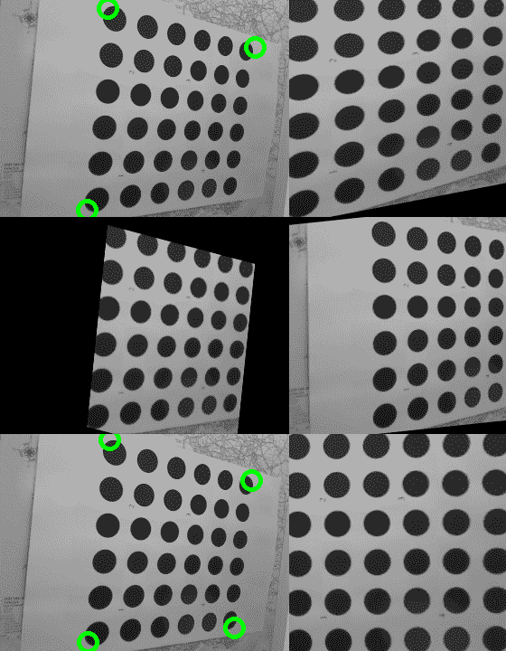
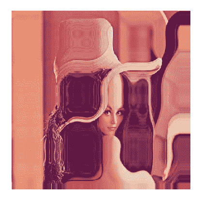
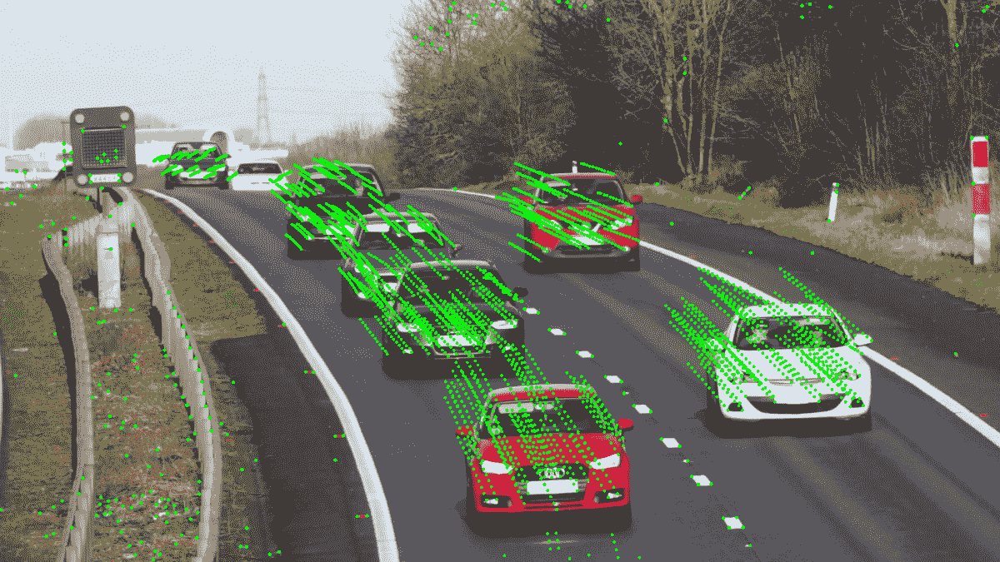
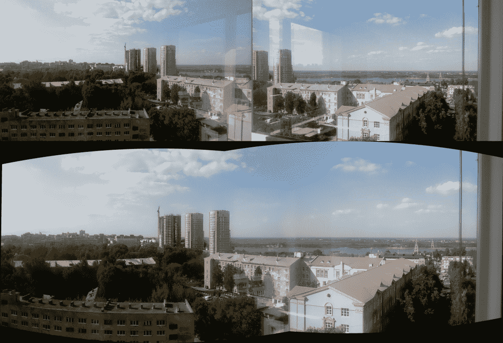
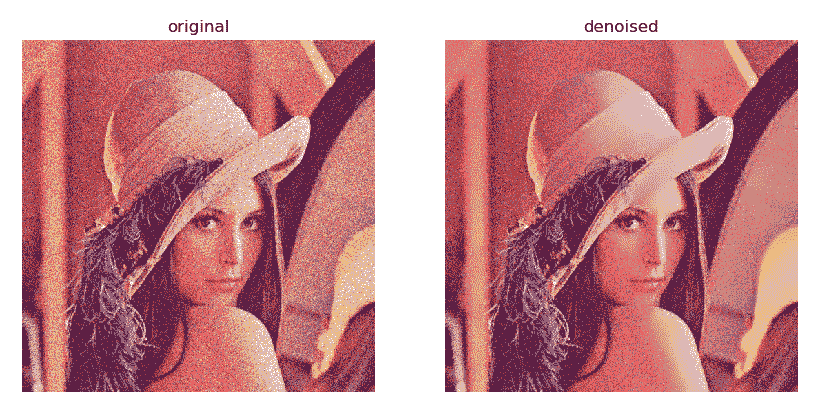
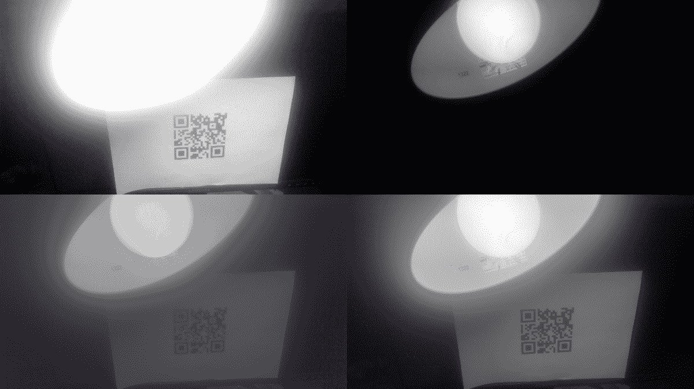

# 图像和视频处理

本章包含以下方面的食谱：

*   使用仿射和透视变换使图像变形
*   使用任意变换重新映射图像
*   使用 Lucas-Kanade 算法跟踪帧之间的关键点
*   背景扣除
*   将许多图像拼接成全景图
*   使用非本地均值算法对照片进行降噪
*   构造 HDR 图像
*   通过图像修复消除照片中的缺陷

# 介绍

通过将一组图像作为一个整体而不是一堆单独的独立图像进行处理，计算机视觉算法可以实现更为出色的结果。 如果已知图像之间的相关性（可能是从不同角度拍摄的某些对象的视频文件中的帧序列），则可以利用它们。 本章使用的算法考虑了帧之间的关系。 这些算法包括背景减法，图像拼接，视频稳定，超重投影和构建 HDR 图像。

# 使用仿射和透视变换使图像变形

在本食谱中，我们将介绍两种用于几何变换图像的主要方法：仿射和透视变形。 第一个用于删除简单的几何变换，例如旋转，缩放，平移及其组合，但是它不能将会聚的线变成平行的线。 在这里，透视变换开始起作用。 其目的是消除两条平行线在透视图中汇合时的透视变形。 让我们找出如何在 OpenCV 中使用所有这些转换。

# 做好准备

在继续此食谱之前，您需要安装 OpenCV 版本 3.3（或更高版本）Python API 包。

# 怎么做

您需要完成以下步骤：

1.  导入必要的模块，打开输入图像，然后复制它：

```py
import cv2
import numpy as np

img = cv2.imread('../data/circlesgrid.png', cv2.IMREAD_COLOR)
show_img = np.copy(img)
```

2.  定义两个函数来实现点选择过程：

```py
selected_pts = []

def mouse_callback(event, x, y, flags, param):
    global selected_pts, show_img

    if event == cv2.EVENT_LBUTTONUP:
        selected_pts.append([x, y])
        cv2.circle(show_img, (x, y), 10, (0, 255, 0), 3)

def select_points(image, points_num):
    global selected_pts
    selected_pts = []

    cv2.namedWindow('image')
    cv2.setMouseCallback('image', mouse_callback)

    while True:
        cv2.imshow('image', image)

        k = cv2.waitKey(1)

        if k == 27 or len(selected_pts) == points_num:
            break

    cv2.destroyAllWindows()

    return np.array(selected_pts, dtype=np.float32)
```

3.  选择图像中的三个点，使用`cv2.getAffineTransform`计算仿射变换，然后使用`cv2.warpAffine`应用仿射变换。 然后，显示结果图像：

```py
show_img = np.copy(img)
src_pts = select_points(show_img, 3)
dst_pts = np.array([[0, 240], [0, 0], [240, 0]], dtype=np.float32)

affine_m = cv2.getAffineTransform(src_pts, dst_pts)

unwarped_img = cv2.warpAffine(img, affine_m, (240, 240))

cv2.imshow('result', np.hstack((show_img, unwarped_img)))
k = cv2.waitKey()

cv2.destroyAllWindows()
```

4.  找到一个仿射逆变换，将其应用并显示结果：

```py
inv_affine = cv2.invertAffineTransform(affine_m)
warped_img = cv2.warpAffine(unwarped_img, inv_affine, (320, 240))

cv2.imshow('result', np.hstack((show_img, unwarped_img, warped_img)))
k = cv2.waitKey()

cv2.destroyAllWindows()
```

5.  使用`cv2.getRotationMatrix2D`创建一个旋转比例的仿射扭曲，并将其应用于图像：

```py
rotation_mat = cv2.getRotationMatrix2D(tuple(src_pts[0]), 6, 1)

rotated_img = cv2.warpAffine(img, rotation_mat, (240, 240))

cv2.imshow('result', np.hstack((show_img, rotated_img)))
k = cv2.waitKey()

cv2.destroyAllWindows()
```

6.  在图像中选择四个点，使用`cv2.getPerspectiveTransform`创建透视变形矩阵，然后将其应用于图像并显示结果：

```py
show_img = np.copy(img)
src_pts = select_points(show_img, 4)
dst_pts = np.array([[0, 240], [0, 0], [240, 0], [240, 240]], dtype=np.float32)

perspective_m = cv2.getPerspectiveTransform(src_pts, dst_pts)

unwarped_img = cv2.warpPerspective(img, perspective_m, (240, 240))

cv2.imshow('result', np.hstack((show_img, unwarped_img)))
k = cv2.waitKey()

cv2.destroyAllWindows()
```

# 这个怎么运作

仿射变换和透视图变换本质上都是矩阵乘法运算，其中元素的位置被某些扭曲矩阵重新映射。 因此，要应用变换，我们需要计算这样的翘曲矩阵。 对于仿射变换，可以使用`cv2.getAffineTransform`功能完成。 它以两组点作为参数：第一个点包含变换之前的三个点，第二个点包含变形后的三个对应点。 集合中点的顺序确实很重要，两个数组的点顺序应该相同。 要在透视扭曲的情况下创建变换矩阵，可以应用`cv2.getPerspectiveTransform`。

同样，它在扭曲前后接受两组点，但是点集的长度应为`4`。 这两个函数都返回转换矩阵，但是它们的形状不同：`cv2.getAffineTransform`计算`2x3`矩阵，`cv2.getPerspectiveTransform`计算`3x3`矩阵。

要应用计算的转换，我们需要调用相应的 OpenCV 函数。 为了进行仿射变形，使用了`cv2.warpAffine`。 它获取输入图像，`2x3`转换矩阵，输出图像大小，像素插值模式，边界外推模式和边界外推值。 `cv2.warpPerspective`用于应用透视变换。 其参数与`cv2.warpAffine`的含义相同。 唯一的区别是转换矩阵（第二个参数）必须为`3x3`。 这两个函数都返回变形的图像。

有两个与仿射变换相关的有用功能：`cv2.invertAffineTransform`和`cv2.getRotationMatrix2D`。 第一种是在您进行仿射变换并且需要获得逆仿射（也就是仿射）时使用。 它采用此现有的仿射变换并返回反变换。 `cv2.getRotationMatrix2D`不太通用，但经常用于仿射变换-缩放旋转。 此函数采用以下参数：（`x`，`y`）格式的旋转中心点，旋转角度和比例因子，并返回`2x3`仿射变换矩阵。 该矩阵可用作`cv2.warpAffine`中的相应参数。

启动代码后，您将获得类似于以下内容的图像：



图中的第一行是具有三个选定点及其对应的仿射变换的输入图像。 第二行是逆变换和带比例变换的旋转的结果； 第三行包含具有四个选定点的输入图像，是透视变换的结果。

# 使用任意变换重新映射图像

在本食谱中，您将学习如何使用每像素映射来变换图像。 这是一项非常通用的功能，已在许多计算机视觉应用程序中使用，例如图像拼接，相机镜框不失真以及许多其他功能。

# 做好准备

在继续此食谱之前，您需要安装 OpenCV 版本 3.3（或更高版本）Python API 包。

# 怎么做

您需要完成以下步骤：

1.  导入必要的模块：

```py
import math
import cv2
import numpy as np
```

2.  加载测试图像：

```py
img = cv2.imread('../data/Lena.png')
```

3.  准备每个像素的变换图：

```py
xmap = np.zeros((img.shape[1], img.shape[0]), np.float32)
ymap = np.zeros((img.shape[1], img.shape[0]), np.float32)
for y in range(img.shape[0]):
    for x in range(img.shape[1]):
        xmap[y,x] = x + 30 * math.cos(20 * x / img.shape[0])
        ymap[y,x] = y + 30 * math.sin(20 * y / img.shape[1])
```

4.  重新映射源图像：

```py
remapped_img = cv2.remap(img, xmap, ymap, cv2.INTER_LINEAR, None, cv2.BORDER_REPLICATE)
```

5.  可视化结果：

```py
plt.figure(0)
plt.axis('off')
plt.imshow(remapped_img[:,:,[2,1,0]])
plt.show()
```

# 这个怎么运作

通用的逐像素转换是通过`cv2.remap`函数实现的。 它接受一个源图像和两个地图（可以作为具有两个通道的一个地图来传递），并返回转换后的图像。 该函数还接受指定必须执行像素值内插和外推的参数。 在我们的情况下，我们指定双线性插值，超出范围的值将替换为最近的（空间上）范围内的像素值。 该功能非常通用，通常用作许多计算机视觉应用程序的构建块。

以下是预期的结果：



# 使用 Lucas-Kanade 算法跟踪帧之间的关键点

在本食谱中，您将学习如何使用稀疏的 Lucas-Kanade 光流算法来跟踪视频中帧之间的关键点。 此功能在许多计算机视觉应用程序中很有用，例如对象跟踪和视频稳定化。

# 做好准备

在继续此食谱之前，您需要安装 OpenCV 版本 3.3（或更高版本）Python API 包。

# 怎么做

您需要完成以下步骤：

1.  导入必要的模块：

```py
import cv2
```

2.  打开测试视频并初始化辅助变量：

```py
video = cv2.VideoCapture('../data/traffic.mp4')
prev_pts = None
prev_gray_frame = None
tracks = None
```

3.  开始阅读视频中的帧，将每个图像转换为灰度：

```py
while True:
    retval, frame = video.read()
    if not retval: break
    gray_frame = cv2.cvtColor(frame, cv2.COLOR_BGR2GRAY)
```

4.  使用稀疏的 Lucas-Kanade 光流算法跟踪上一帧的关键点，或者，如果您刚刚启动或按下`C`，请检测关键点，以便在下一帧中可以跟踪一些内容：

```py
    if prev_pts is not None:
        pts, status, errors = cv2.calcOpticalFlowPyrLK(
            prev_gray_frame, gray_frame, prev_pts, None, winSize=(15,15), maxLevel=5,
            criteria=(cv2.TERM_CRITERIA_EPS | cv2.TERM_CRITERIA_COUNT, 10, 0.03))
        good_pts = pts[status == 1]
        if tracks is None: tracks = good_pts
        else: tracks = np.vstack((tracks, good_pts))
        for p in tracks:
            cv2.circle(frame, (p[0], p[1]), 3, (0, 255, 0), -1)
    else:
        pts = cv2.goodFeaturesToTrack(gray_frame, 500, 0.05, 10)
        pts = pts.reshape(-1, 1, 2)
```

5.  记住当前点和当前框架。 现在可视化结果并处理键盘输入：

```py
    prev_pts = pts
    prev_gray_frame = gray_frame

    cv2.imshow('frame', frame)
    key = cv2.waitKey() & 0xff
    if key == 27: break
    if key == ord('c'): 
        tracks = None
        prev_pts = None
```

6.  关闭所有窗口：

```py
cv2.destroyAllWindows()
```

# 这个怎么运作

在本食谱中，我们打开一个视频，使用我们先前使用的`cv2.goodFeaturesToTrack`函数检测初始关键点，并使用稀疏的 Lucas-Kanade 光流算法开始跟踪点，该算法已在 OpenCV 中通过`cv2.calcOpticalFlowPyrLK`函数实现 。 OpenCV 实现了该算法的金字塔形式，这意味着首先在较小尺寸的图像中计算光流，然后在较大的图像中进行精修。 金字塔大小由`maxLevel`参数控制。 该函数还采用 Lucas-Kanade 算法的参数，例如窗口大小（`winSize`）和终止条件。 其他参数是前一帧和当前帧，以及来自前一帧的关键点。 这些函数返回当前帧中的跟踪点，成功标志数组和跟踪错误。

下图是积分跟踪结果的示例：



# 背景扣除

如果您有一个稳定场景的视频，其中有一些物体在四处移动，则可以将静止的背景与变化的前景分开。 在这里，我们将向您展示如何在 OpenCV 中进行操作。

# 做好准备

在继续此食谱之前，您需要安装带有 Contrib 模块的 OpenCV 版本 3.3（或更高版本）Python API 包。

# 怎么做

您需要完成以下步骤：

1.  导入必要的模块：

```py
import cv2
import numpy as np
```

2.  定义一个打开视频文件的函数，并对每个帧应用一些背景减影算法：

```py
def split_image_fgbg(subtractor, open_sz=(0,0), close_sz=(0,0), show_bg=False, show_shdw=False):
    kernel_open = kernel_close = None

    if all(i > 0 for i in open_sz):
        kernel_open = cv2.getStructuringElement(cv2.MORPH_ELLIPSE, open_sz)

    if all(i > 0 for i in close_sz):
        kernel_close = cv2.getStructuringElement(cv2.MORPH_ELLIPSE, close_sz)

    cap = cv2.VideoCapture('../data/traffic.mp4')
    while True:
        status_cap, frame = cap.read()
        if not status_cap:
            break

        frame = cv2.resize(frame, None, fx=0.5, fy=0.5)

        fgmask = subtractor.apply(frame)

        objects_mask = (fgmask == 255).astype(np.uint8)
        shadows_mask = (fgmask == 127).astype(np.uint8)

        if kernel_open is not None:
            objects_mask = cv2.morphologyEx(objects_mask, cv2.MORPH_OPEN, kernel_open)

        if kernel_close is not None:
            objects_mask = cv2.morphologyEx(objects_mask, cv2.MORPH_CLOSE, kernel_close)
            if kernel_open is not None:
                shadows_mask = cv2.morphologyEx(shadows_mask, cv2.MORPH_CLOSE, kernel_open)

        foreground = frame
        foreground[objects_mask == 0] = 0

        if show_shdw:
            foreground[shadows_mask > 0] = (0, 255, 0)

        cv2.imshow('foreground', foreground)

        if show_bg:
            background = fgbg.getBackgroundImage()
            if background is not None:
                cv2.imshow('background', background) 

        if cv2.waitKey(30) == 27:
            break

    cap.release()
    cv2.destroyAllWindows()
```

3.  将由 KadewTraKuPong 和 Bowden 创建的基于高斯混合的背景/前景分割算法应用于视频：

```py
fgbg = cv2.bgsegm.createBackgroundSubtractorMOG()

split_image_fgbg(fgbg, (2, 2), (40, 40))
```

4.  创建由 Zoran Zivkovic 开发的高斯混合分割算法的改进版本的实例：

```py
fgbg = cv2.createBackgroundSubtractorMOG2()

split_image_fgbg(fgbg, (3, 3), (30, 30), True)
```

5.  使用 Godbehere，Matsukawa 和 Goldberg 的背景减除算法创建背景遮罩：

```py
fgbg = cv2.bgsegm.createBackgroundSubtractorGMG()

split_image_fgbg(fgbg, (5, 5), (25, 25))
```

6.  根据 Sagi Zeevi 的建议，应用基于计数的背景减法算法：

```py
fgbg = cv2.bgsegm.createBackgroundSubtractorCNT()

split_image_fgbg(fgbg, (5, 5), (15, 15), True)
```

7.  使用基于最近邻方法的背景分割技术：

```py
fgbg = cv2.createBackgroundSubtractorKNN()

split_image_fgbg(fgbg, (5, 5), (25, 25), True)
```

# 这个怎么运作

所有背景减法器都实现`cv2.BackgroundSubtractor`接口，因此它们都有一定的方法集：

*   `cv2.BackgroundSubtractor.apply`：获取分割遮罩
*   `cv2.BackgroundSubtractor.getBackgroundImage`：检索背景图像

`apply`方法接受彩色图像作为参数并返回背景遮罩。 此遮罩通常包含三个值：`0`用于背景像素，`255`用于前景像素和`127`用于阴影像素。 阴影像素是背景中强度较低的像素。 值得一提的是，并非所有减法器都支持阴影像素分析。

`getBackgroundImage`返回背景图像，如果没有移动的物体，则应返回背景图像。 同样，只有少数减法器能够计算这样的图像。

毫不奇怪，所有减法算法都有内部参数。 幸运的是，这些参数中的许多都可以与默认值一起很好地工作。 历史参数是可以首先调整的参数之一。 基本上，这是减法器开始生成分段掩码之前需要分析的帧数。 因此，通常您会获得第一帧的完整背景遮罩。

您已经注意到，我们将形态学操作应用于运动对象遮罩。 由于几个原因，我们需要此步骤。 首先，运动物体的某些部分可能质地较差。 由于所有相邻像素都非常相似，因此很难检测运动。 第二个原因是我们的背景分割检测器不够理想。 错误地将移动物体的一部分标记为背景会导致错误。 应用形态学可以帮助我们使用先验信息，这些信息不能仍然是运动对象中的一部分。

上面的代码生成的图像类似于下图：


# 将许多图像拼接成全景图

OpenCV 有很多计算机视觉算法。 其中一些是低级的，而另一些则在特殊情况下使用。 但是有功能，可以使用日常应用程序将许多算法结合在一起。 这些管道之一是全景拼接。 这个相当复杂的过程可以在 OpenCV 中轻松完成，并得到不错的结果。 此食谱向您展示如何使用 OpenCV 工具创建自己的全景图。

# 做好准备

在继续此食谱之前，您需要安装 OpenCV 版本 3.3（或更高版本）Python API 包。

# 怎么做

您需要完成以下步骤：

1.  导入必要的模块：

```py
import cv2
import numpy as np
```

2.  加载我们将要合并为全景图的图像：

```py
images = []
images.append(cv2.imread('../data/panorama/0.jpg', cv2.IMREAD_COLOR))
images.append(cv2.imread('../data/panorama/1.jpg', cv2.IMREAD_COLOR))
```

3.  创建一个全景拼接器，将图像传递给它，然后解析结果：

```py
stitcher = cv2.createStitcher()
ret, pano = stitcher.stitch(images)

if ret == cv2.STITCHER_OK:
    cv2.imshow('panorama', pano)
    cv2.waitKey()

    cv2.destroyAllWindows()
else:
    print('Error during stiching')
```

# 这个怎么运作

`cv2.createStitcher`建立了全景拼接算法的实例。 要将其应用于全景图创建，您需要调用其`stitch`方法。 此方法接受要组合的图像数组，并返回拼接结果状态以及全景图像。 状态可能具有以下值之一：

*   `cv2.STITCHER_OK`
*   `cv2.STITCHER_ERR_NEED_MORE_IMGS`
*   `cv2.STITCHER_ERR_HOMOGRAPHY_EST_FAIL`
*   `cv2.STITCHER_ERR_CAMERA_PARAMS_ADJUST_FAIL`

第一个值表示成功创建了全景图。 其他值告诉您全景图尚未合成，并向您提示了可能的原因。

拼接成功与否取决于输入图像。 它们应该具有重叠的区域。 重叠的区域越多，算法就越容易匹配框架并将其正确映射到最终全景图。 另外，最好从旋转的相机拍摄照片。 相机的微小移动是可以的，但是是不希望的。

执行代码后，您将看到类似于下图的图像：



正如您在图中看到的，反射并没有破坏最终结果：该算法成功处理了这种情况。 由于图像具有大的重叠区域和许多具有丰富纹理的区域，因此可以实现此结果。 对于没有纹理的物体，反射可能会受到阻碍。

# 使用非本地均值算法对照片进行降噪

在本食谱中，您将学习如何使用非局部均值算法消除图像中的噪点。 当照片受到过多噪点的影响时，此功能很有用，因此有必要将其删除以获得更好的图像。

# 做好准备

在继续此食谱之前，您需要安装 OpenCV 版本 3.3（或更高版本）Python API 包。

# 怎么做

您需要完成以下步骤：

1.  导入必要的模块：

```py
import cv2
import numpy as np
import matplotlib.pyplot as plt
```

2.  加载测试图像：

```py
img = cv2.imread('../data/Lena.png')
```

3.  产生随机的高斯噪声：

```py
noise = 30 * np.random.randn(*img.shape)
img = np.uint8(np.clip(img + noise, 0, 255))
```

4.  使用非本地均值算法执行去噪：

```py
denoised_nlm = cv2.fastNlMeansDenoisingColored(img, None, 10)
```

5.  可视化结果：

```py
plt.figure(0, figsize=(10,6))
plt.subplot(121)
plt.axis('off')
plt.title('original')
plt.imshow(img[:,:,[2,1,0]])
plt.subplot(122)
plt.axis('off')
plt.title('denoised')
plt.imshow(denoised_nlm[:,:,[2,1,0]])
plt.show()
```

# 这个怎么运作

非本地均值算法是通过 OpenCV 中的一系列功能实现的：`cv2.fastNlMeansDenoising`，`cv2.fastNlMeansDenoisingColored`，`cv2.fastNlMeansMulti`和`cv2.fastNlMeansDenoisingColoredMulti`。 这些功能可以拍摄一张图像或多张图像（灰度或彩色）。 在此配方中，我们使用了`cv2.fastNlMeansDenoisingColored`函数，该函数会拍摄一张 BGR 图像并返回去噪的图像。 该函数采用一些参数，其中参数`h`代表降噪强度； 较高的值可减少噪点，但图像更平滑。 其他参数指定非本地均值算法参数，例如模板模式大小和搜索窗口空间（相应命名）。

下图显示了预期的结果：



# 构造 HDR 图像

几乎所有现代相机甚至手机都具有神奇的 *HDR* 模式，它产生了真正的奇迹效果-照片中没有曝光不足或曝光过度的区域。 **HDR**（**高动态范围**），您可以在 OpenCV 中重现这样的结果！ 本食谱告诉您有关 HDR 成像功能以及如何正确使用它们的信息。

# 做好准备

在继续此食谱之前，您需要安装 OpenCV 版本 3.3（或更高版本）Python API 包。

# 怎么做

您需要完成以下步骤：

1.  导入必要的模块：

```py
import cv2
import numpy as np
```

2.  加载图像和曝光时间：

```py
imgs_names = ['33', '100', '179', '892', '1560', '2933']

exp_times = []
images = []

for name in imgs_names:
    exp_times.append(1/float(name))
    images.append(cv2.imread('../data/hdr/%s.jpg' % name, cv2.IMREAD_COLOR))

exp_times = np.array(exp_times).astype(np.float32)
```

3.  恢复 CRF：

```py
calibrate = cv2.createCalibrateDebevec()
response = calibrate.process(images, exp_times)
```

4.  计算 HDR 图像：

```py
merge_debevec = cv2.createMergeDebevec()
hdr = merge_debevec.process(images, exp_times, response)
```

5.  将 HDR 图像转换为**低动态范围**（**LDR**）图像以能够显示它：

```py
tonemap = cv2.createTonemapDurand(2.4)
ldr = tonemap.process(hdr)

ldr = cv2.normalize(ldr, None, 0, 1, cv2.NORM_MINMAX)

cv2.imshow('ldr', ldr)
cv2.waitKey()
cv2.destroyAllWindows()
```

6.  应用此技术合并具有各种曝光度的图像：

```py
merge_mertens = cv2.createMergeMertens()
fusion = merge_mertens.process(images)

fusion = cv2.normalize(fusion, None, 0, 1, cv2.NORM_MINMAX)

cv2.imshow('fusion', fusion)
cv2.waitKey()
cv2.destroyAllWindows()
```

# 这个怎么运作

首先，您需要具有一组已知曝光时间不同的图像。 现代相机将大量信息（包括曝光时间）存储在图像文件中，因此值得检查图像的属性。

计算 HDR 图像时，首先需要恢复 **CRF**（**相机响应函数**），这是每种颜色的实际强度与像素强度（在`[0, 255]`范围内）之间的映射。 渠道。 通常它是非线性的，因此不可能简单地将不同曝光的图像组合在一起。 可以通过使用`cv2.createCalibrateDebevec`创建校准算法的实例来完成。 创建校准实例后，您需要调用其`process`方法并传递图像数组和曝光时间数组。 `process`方法返回摄像机的 CRF。

下一步是创建 HDR 图像。 为此，我们应该通过调用`cv2.createMergeDebevec`获得照片合并算法的实例。 构造对象时，我们需要调用其`process`方法并传递图像，曝光时间和 CRF 作为参数。 结果，我们获得了 HDR 图像，该图像无法用`imshow`显示，但是可以用`imwrite`以`.hdr`格式保存并在专用工具中查看。

现在我们需要显示我们的 HDR 图像。 为此，我们需要将其动态范围正确地压缩到 8 位。 此过程称为音调映射。 要执行此过程，您需要使用`cv2.createTonemapDurand`构建一个音调映射对象并调用其`process`函数。 此函数接受 HDR 图像并返回浮点图像。

还有另一种方法来合并具有不同曝光度的照片。 您需要使用`cv2.createMergeMertens`函数创建另一个算法实例。 生成的对象具有`process`方法，该方法合并了我们的图像-只需将它们作为参数传递即可。 功能工作的结果是合并图像。

从该配方启动代码后，您将看到类似于下图所示的图像：



图的第一行是两张具有不同曝光量的原始图像：左一张的曝光时间长，而右一张的曝光时间短。 结果，我们可以看到灯泡旁边的台灯标签和 QR 码。 最下面的行包含配方代码中两种方法的结果-在两种情况下，我们都可以看到所有详细信息。

# 通过图像修复消除照片中的缺陷

有时，照片图像有缺陷。 对于已扫描的旧照片尤其如此：它们可能有划痕，斑点和污点。 所有这些缺陷都会阻碍照片的欣赏。 根据其周围环境重建图像各部分的过程称为“修复”，而 OpenCV 具有此算法的实现。 在这里，我们将介绍利用此 OpenCV 功能的方法。

# 做好准备

在继续此食谱之前，您需要安装 OpenCV 版本 3.3（或更高版本）Python API 包。

# 怎么做

您需要完成以下步骤：

1.  导入必要的模块：

```py
import cv2
import numpy as np
```

2.  定义一个封装掩码创建的类：

```py
class MaskCreator:
    def __init__(self, image, mask):
        self.prev_pt = None
        self.image = image
        self.mask = mask
        self.dirty = False
        self.show()
        cv2.setMouseCallback('mask', self.mouse_callback)

    def show(self):
        cv2.imshow('mask', self.image)

    def mouse_callback(self, event, x, y, flags, param):
        pt = (x, y)
        if event == cv2.EVENT_LBUTTONDOWN:
            self.prev_pt = pt
        elif event == cv2.EVENT_LBUTTONUP:
            self.prev_pt = None

        if self.prev_pt and flags & cv2.EVENT_FLAG_LBUTTON:
            cv2.line(self.image, self.prev_pt, pt, (127,)*3, 5)
            cv2.line(self.mask, self.prev_pt, pt, 255, 5)

            self.dirty = True
            self.prev_pt = pt
            self.show()
```

3.  加载图像，创建其缺陷版本和遮罩，应用 Inpaint 算法，然后显示结果：

```py
img = cv2.imread('../data/Lena.png')

defect_img = img.copy()
mask = np.zeros(img.shape[:2], np.uint8)
m_creator = MaskCreator(defect_img, mask)

while True:
    k = cv2.waitKey()
    if k == 27:
        break
    if k == ord('a'):
        res_telea = cv2.inpaint(defect_img, mask, 3, cv2.INPAINT_TELEA)
        res_ns = cv2.inpaint(defect_img, mask, 3, cv2.INPAINT_NS)
        cv2.imshow('TELEA vs NS', np.hstack((res_telea, res_ns)))
    if k == ord('c'):
        defect_img[:] = img
        mask[:] = 0
        m_creator.show()
cv2.destroyAllWindows()
```

# 这个怎么运作

要在 OpenCV 中修复图像，需要使用`cv2.inpaint`功能。 它接受四个参数：

*   **有缺陷的图像**：它必须是 8 位彩色或灰度级图像
*   **缺陷遮罩**：它必须是 8 位单通道，并且必须与第一个参数中的图像大小相同
*   **邻域半径**：*损坏的*像素周围区域的大小，应在计算其颜色时使用
*   **修复模式**：修复算法的类型

缺陷遮罩应包含原始图像上像素的非零值，需要恢复该值。 邻域半径是在修复过程中考虑的算法周围的像素范围； 它应具有较小的值，以防止剧烈的模糊效果。 修复模式必须为以下值之一：`cv2.INPAINT_TELEA`或`cv2.INPAINT_NS`。 根据具体情况，一种算法可能会比另一种算法更好，反之亦然，因此最好比较两种算法的结果并选择最佳算法。 `cv2.inpaint`返回生成的修复图像。

启动代码后，您将看到类似的图像：


如上图所示，最容易修复的缺陷是很小或几乎没有纹理的区域，这不足为奇。 修复算法没有实现任何魔术，因此在图像的复杂部分中存在可见但有色的瑕疵。